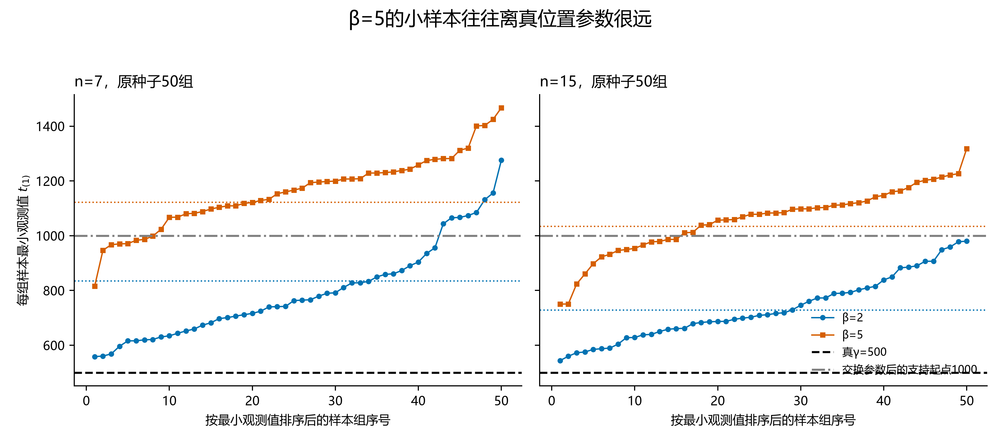
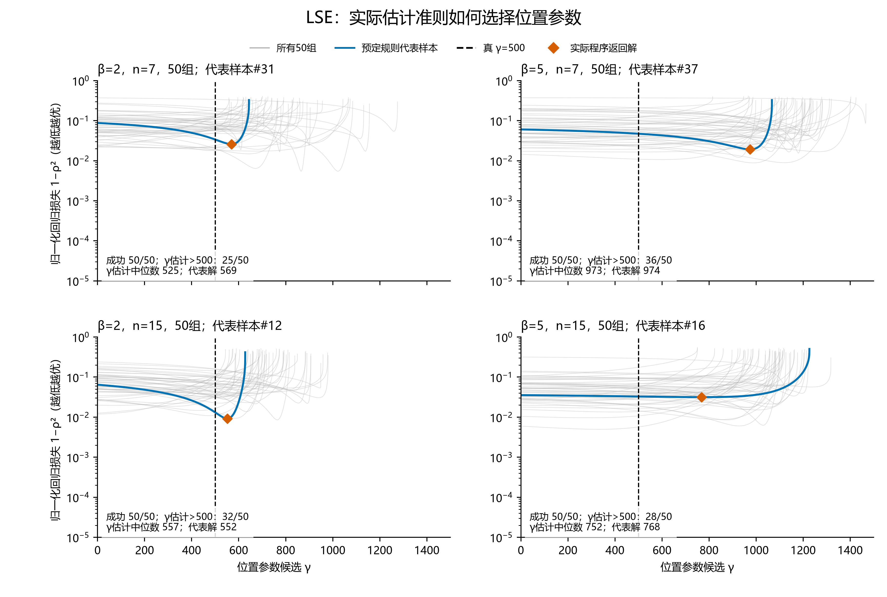
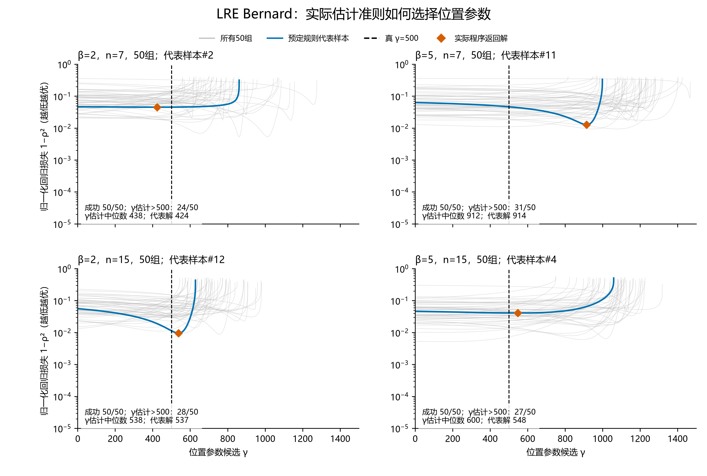
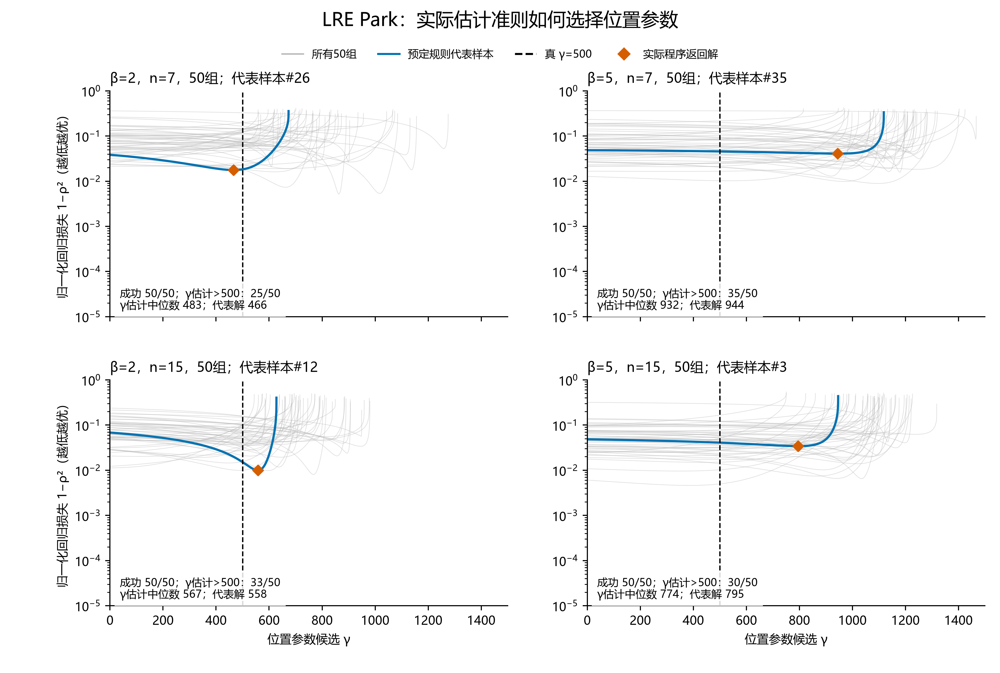
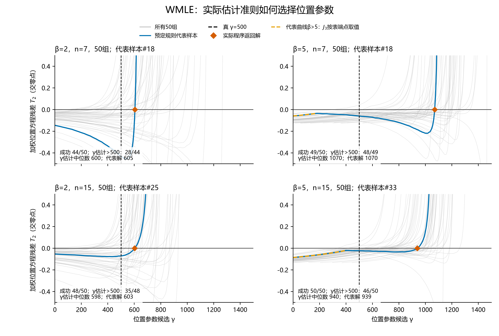
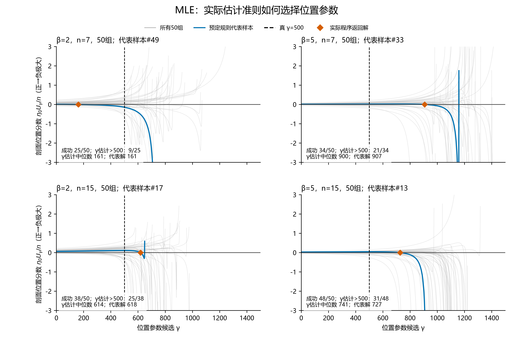
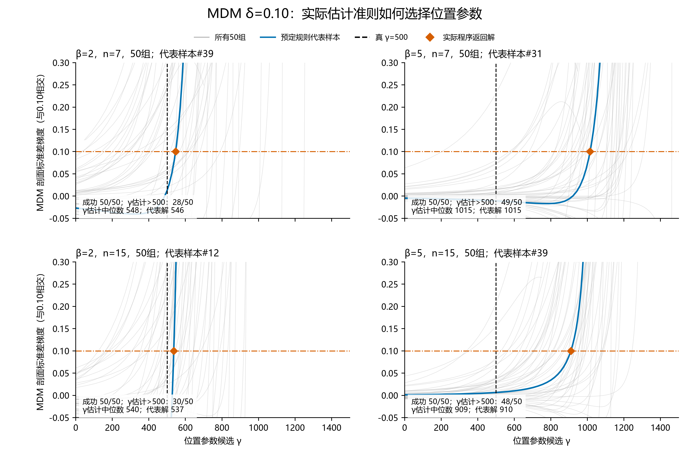
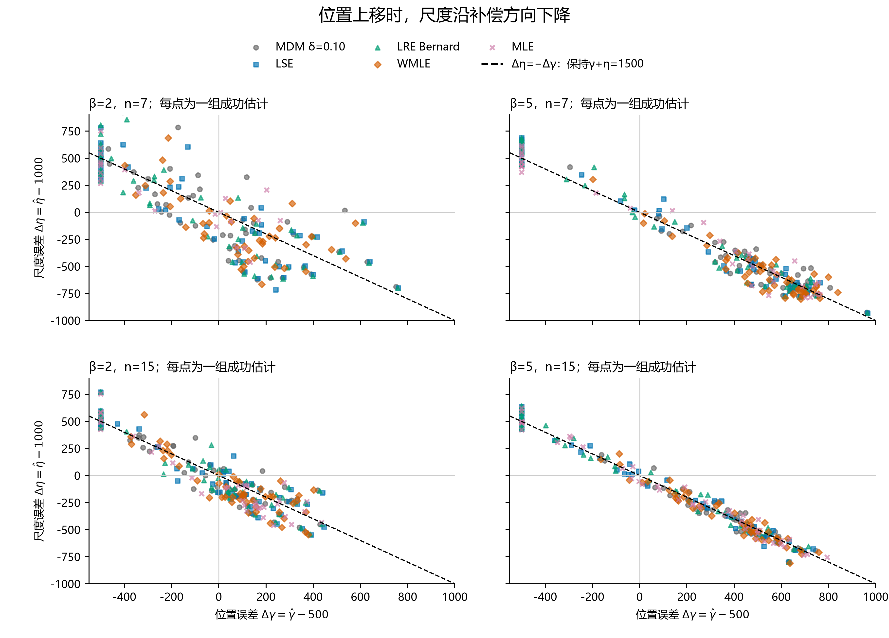

# W(5,1000,500) 的位置高估与尺度低估来自哪里

本次核对支持以下结论：原样本确实由 **W(5,1000,500)** 生成，参数列也按形状、尺度、位置保存。看起来像把1000与500交换的估计，实际是 γ、η 和 β 联动变化。在这批小样本中，成功估计符合各自方法的准则，却普遍存在 γ 的正平均误差、η 的负平均误差。

这里统一使用 **β=形状、η=尺度、γ=位置**。本次原Excel表头使用 **α=形状、β=尺度、γ=位置**，因此先按含义转换再核对，不把旧表β误读为平台的形状β。

分析复用两个原批次：W(2,1000,500)，种子20260826；W(5,1000,500)，种子20260906。两者均为 n=7、15，各50组，共200组。所有方法使用同组输入。旧 LRE Bernard 用于解释原表，当前 LRE Park 作为同一输入上的单独复算。

## 1. 样本与参数列没有填反

三参数 Weibull 的逆变换是

$$t=\gamma+\eta[-\log(1-u)]^{1/\beta}.$$

保存的抽样程序传入 β=5、η=1000、γ=500。本次按原种子重新调用抽样器，还单独重建 SHA256 种子和均匀随机数，用上述公式直接计算，三条路径与保存的样本及 Excel 都逐值一致。

| 核对 | 范围 | 结果 |
|---|---:|---|
| 原种子重新生成与直接逆变换，对照CSV及Excel | 200组，2200个观测值 | 最大绝对差0 |
| CSV形状／尺度／位置字段，对照Excel全部三个偏移量区块 | 3000条三参数展示记录，包括重复展示的对照方法 | 最大绝对差0，失败标记一致 |
| 以保存的五种方法程序实际复算 | 1000次，MDM使用δ=0.10 | 成功状态和原估计全部一致，rtol=1e-6、atol=1e-5 |
| 当前Park LRE单独复算 | 同一200组 | 与旧LRE分列保存 |

支持范围也提供了直观反证：交换成 W(5,500,1000) 后，所有观测应大于1000；原W5的100组中，有23组包含小于1000的观测。因此这批样本不可能来自该交换参数的分布。其他组的最小值大于1000并不单独证明生成参数；全量种子复现才是对应全部样本的核验。

图中每个点是一组样本的最小观测，按大小排序；彩色点线分别表示β=2和5，彩色水平点线是各条件下最小观测的理论期望。

## 2. β=5时，小样本提供的位置下尾信息较弱

每组最小观测的理论期望可直接从 Weibull 生存函数推导：

$$E[t_{(1)}]=\gamma+\eta\,\Gamma(1+1/\beta)n^{-1/\beta}.$$

在η=1000、γ=500下：

| β | n | 最小观测理论期望 | 整组观测均大于1000的理论概率 | 本批次实际组数 |
|---:|---:|---:|---:|---:|
| 2 | 7 | 835.0 | 17.4% | 8/50 |
| 5 | 7 | 1122.2 | 80.4% | 42/50 |
| 2 | 15 | 728.8 | 2.4% | 0/50 |
| 5 | 15 | 1034.2 | 62.6% | 35/50 |

真位置参数是500，但β=5、n=7时，最小观测通常已经在1000以上。样本的中心与宽度相对容易拟合，支持起点却需要从有限的下尾点外推。这个分布性质说明了为什么位置估计有较大的补偿空间；具体向哪边偏，还要检查各方法在这些样本上的准则。

## 3. 其他方法的过程曲线也能解释偏移解

以下过程图均为左列β=2、右列β=5，上行n=7、下行n=15。每格保留全部50组曲线，用距成功γ估计中位数最近的样本作为粗线代表，平局按组号决定。黑色虚线为真γ=500，橙色点为实际程序返回值。图示范围用于看清真值与估计点附近，完整过程数据保存在CSV中。

### LSE：平移后的样本回归在更大的γ处可以更直

当前LSE采用White回归：令 $X_i$ 为标准Log-Weibull顺序统计量的期望，对 $\log(t_i-\gamma)$ 做线性回归，并最大化F比。对同一n，F比最大化等价于相关系数平方最大化。因此图画 **$1-\rho^2(\gamma)$**，越低越优；不能改画未经归一化的原始残差平方和，那会改变比较含义。

β=5、n=7代表样本的最低点在γ约974，真γ=500并非其样本准则最优点。全50组中，36组γ估计大于500，34组同时γ高于500、η低于1000；其余样本也保留在图与表中。

### LRE：概率图的相关性准则也允许同方向移动

旧LRE使用Bernard绘图位置，在候选γ下拟合Weibull概率图，最大化相关系数平方，再由OLS斜率与截距恢复β和η。

这与LSE使用不同的绘图变量和回归方向，但同样通过样本的线性程度定位γ。β=5、n=7原表γ／η中位数约912／579。

当前Park版本使用其分段绘图位置，相关系数定位后做OLS，已另算同一输入。结果仍呈同方向平均偏移，n=7的γ／η中位数约932／549；n=15两版差异较明显。两版不能混成一个算法结果。相关系数定位的原理及位置估计存在性可参见Park的研究；本次偏移幅度来自本地样本和实际实现，不由文献代替证明。[Park（2018）](https://onlinelibrary.wiley.com/doi/10.1155/2018/6056975)

### WMLE：加权位置方程的零点在真γ右侧

WMLE使用自身的加权形状方程和加权位置方程。对每个γ，先解

$$T_1(\beta,\gamma)=J_2/\beta+\overline{\log d}-\frac{\sum d_i^\beta\log d_i}{\sum d_i^\beta}=0,\qquad d_i=t_i-\gamma,$$

再画该形状根上的位置残差

$$T_2(\gamma)=\overline{1/d}\,\frac{\sum d_i^{\beta(\gamma)}}{\sum d_i^{\beta(\gamma)-1}}-J_3(n,\beta(\gamma)).$$

横线0表示位置方程成立。这里使用WMLE的J2和J3，未借用普通MLE的形状剖面。加权方程的来源为Cousineau（2009）；本次沿用快照中实际的权重文件及插值处理。[Cousineau（2009）](https://bpspsychub.onlinelibrary.wiley.com/doi/10.1348/000711007X270843)

β=5、n=7代表曲线在真γ=500处尚未到达所选零点，实际根在γ约1070；49个成功结果中48个同时γ高、η低。n=15的50组中有46组同方向偏移。

这是**本实现与本样本的方程形态**。图中代表曲线的橙色虚线段表示β>5、J3按权重表端点取值；β达到实现上界10而无法得到支持内形状根的段落断开。位置残差可能非单调或有多根，不能单凭真γ处的一个负残差就推出所有样本根必在右侧。

### MLE：有限局部似然极大同样可能位于真γ右侧

给定γ后，按普通MLE形状方程求β，并代数消去η，得到剖面对数似然。其位置分数为

$$U_\gamma=-(\beta-1)\sum 1/d_i+n\beta\frac{\sum d_i^{\beta-1}}{\sum d_i^\beta}.$$

图中画 $1000U_\gamma/n$，只改变显示单位，不改变零点。有限内点局部极大对应正到负的过零，γ=0的约束边界解则不要求分数等于0。

β=5、n=7的代表样本在γ约907出现有限局部极大；成功组γ中位数约900。独立固定γ剖面与似然邻点检查确认，本批次所有成功MLE结果都是有限局部极大或允许的零边界局部最大。

由对数似然中的 $(\beta-1)\log(t_{(1)}-\gamma)$ 可直接看出：固定 $0<\beta<1$ 时，$\gamma\uparrow t_{(1)}$ 使似然无界。因此本图断开β≤1分支，解释的是当前实现返回的有限局部解。失败组未画成γ=0，也未计入成功估计的中位数。

### MDM：保留昨晚的发现，并核对同一批输入

原W5的n=7、15分别有49/50、48/50组在真γ处梯度低于0.10；W2则为28/50、30/50。当前程序据自己的交点规则返回估计γ，W5的位置上移更突出。β=2也有同方向偏移样本，不能说完全没有这一现象。

## 4. 看似互换，实际是三个参数一起补偿

由分位点公式得到一个精确关系：

$$Q(1-e^{-1})=\gamma+\eta.$$

真分布的这个寿命点是1500，与β无关。当小样本拟合仍保留这个中部寿命点时，γ增加可以由η减少补偿。下面把原五种方法的每一组成功估计的 $\Delta\gamma$ 与 $\Delta\eta$ 画在一起；虚线 $\Delta\eta=-\Delta\gamma$ 正好表示该寿命点保持1500。

β=5点云更贴近这条补偿方向；β估计也随之改变。n=7时，MDM、LSE、两版LRE及WMLE的β中位数约1.9—2.6，已经不是输入真β=5。普通MLE成功组的β中位数约4.0。因此，“γ接近1000、η接近500”不等于把原参数交换后原样输出。

举例说，真W(5,1000,500)的均值／标准差约1418／210；单纯填反的W(5,500,1000)约1459／105，宽度减半；而同时改变形状的W(2,500,1000)约1443／232，中部与宽度反而更接近真分布。这说明为何形状、尺度、位置的联动补偿可以在小样本上产生看似合理的拟合。

### 本批次偏移幅度

下表使用β=5条件，均值误差为估计值减真值，仅在成功结果上计算；“γ高η低”也是成功组中的联合计数。

| n | 方法 | 成功/总数 | γ中位数 | η中位数 | γ平均误差 | η平均误差 | γ高η低 |
|---:|---|---:|---:|---:|---:|---:|---:|
| 7 | MDM δ=0.10 | 50/50 | 1015 | 456 | +494 | −500 | 49/50 |
| 7 | LSE | 50/50 | 973 | 511 | +259 | −255 | 34/50 |
| 7 | LRE Bernard | 50/50 | 912 | 579 | +201 | −199 | 31/50 |
| 7 | LRE Park | 50/50 | 932 | 549 | +229 | −230 | 33/50 |
| 7 | WMLE | 49/50 | 1070 | 385 | +529 | −552 | 48/49 |
| 7 | MLE | 34/50 | 900 | 626 | +169 | −166 | 20/34 |
| 15 | MDM δ=0.10 | 50/50 | 909 | 619 | +364 | −372 | 47/50 |
| 15 | LSE | 50/50 | 752 | 769 | +109 | −109 | 28/50 |
| 15 | LRE Bernard | 50/50 | 600 | 907 | +41 | −38 | 26/50 |
| 15 | LRE Park | 50/50 | 774 | 748 | +130 | −133 | 29/50 |
| 15 | WMLE | 50/50 | 940 | 565 | +358 | −372 | 46/50 |
| 15 | MLE | 48/50 | 741 | 733 | +152 | −156 | 31/48 |

偏移幅度和方向比例应分开看。n=15的LSE在W5中有28/50组γ>500，而W2有32/50组；因此不能说每个方法的高估频率都随β增加。此处更稳定的证据是W5的偏移幅度、平均误差和参数补偿。

### 固定真γ后，尺度误差大幅收缩

同一组输入上固定γ=500，按各方法的条件公式重新估β、η。这是诊断；WMLE只解其形状方程，不要求原位置方程同时成立，也不是提出一个新方法。

| n | 方法 | 自由γ的尺度绝对误差中位数 | 固定γ=500后 | 配对成功组数 |
|---:|---|---:|---:|---:|
| 7 | MDM | 544.2 | 59.2 | 50 |
| 7 | LSE | 566.2 | 60.8 | 50 |
| 7 | LRE Bernard | 559.1 | 62.7 | 50 |
| 7 | LRE Park | 556.0 | 61.2 | 50 |
| 7 | WMLE | 615.1 | 50.9 | 47 |
| 7 | MLE | 504.8 | 56.7 | 34 |
| 15 | MDM | 381.1 | 31.1 | 50 |
| 15 | LSE | 475.4 | 35.0 | 50 |
| 15 | LRE Bernard | 460.9 | 36.0 | 50 |
| 15 | LRE Park | 465.7 | 35.1 | 50 |
| 15 | WMLE | 435.2 | 34.7 | 50 |
| 15 | MLE | 433.3 | 33.1 | 48 |

两列使用相同的配对组，指标是绝对误差的中位数，不能称为MAE。这项条件诊断支持：位置估计的自由度在本批次中承担了很大的尺度补偿代价。

W5、n=7的WMLE在真γ处有3组条件形状根超出实现上界10，条件值留空；其中2组属于自由γ成功组，因此该项条件比较使用47组。它们没有被当成零残差或补成某个形状值。

## 5. 成功解符合准则，求解失败仍有实现边界

独立剖面计算在全部1136个成功结果处都有定义，恢复β、η与返回值的最大差分别约1.24×10⁻⁶、1.65×10⁻⁴；LSE和两版LRE的独立网格没有发现优于程序返回点的损失，成功MLE均通过局部似然邻点检查。另按固定γ的形状方程及位置残差扫描，所有成功WMLE/MLE都匹配到对应的根或允许的边界解。

该扫描也找到**8个WMLE原失败组实际上有支持内方程根**：β=2、n=7的第1、11、19、21、24、41组；β=2、n=15的第37组；β=5、n=7的第12组。根的形状均小于1。这说明原Nelder–Mead求解器存在漏解，不能把这些失败说成方法数学上无根。本次保持原失败状态与原表不变，把独立找到的根单列在 `独立剖面复核.json`；未修正平台算法，也未用独立根替换汇总中的原失败。

本次可以说明：**样本生成和参数映射正确；这批成功估计的偏移确实由实际准则选出；β=5的小样本下尾不足与三个参数的补偿为偏移提供了解释。** 这些200组复用样本没有证明任意大β、任意参数比例、任意求解器都会发生相同偏差；MLE与WMLE的统计量也以其成功组为条件，不表示全部样本上的无条件平均偏差。

## 文件与复核

- [核验工作簿](参数映射与位置尺度补偿核验.xlsx)：结果汇总、逐组估计、样本与核验、过程复核、漏解复核，共5张工作表。
- `中间数据/输入核验.json`：原种子、2200个观测和3000条表格参数展示记录的对应。
- `中间数据/实际估计.json`、`汇总.json`、`过程曲线.csv`：实际结果、全精度统计和所有曲线点。
- `中间数据/复算核验.json`、`独立剖面复核.json`：原结果复算、公式检查、代表样本规则和独立根诊断。
- `中间数据/manifest.json`：输入、代码、输出哈希及运行环境。
- 同批次 `程序`：本次专用脚本、建表程序、实际依赖快照与输入快照。运行命令见批次README。
