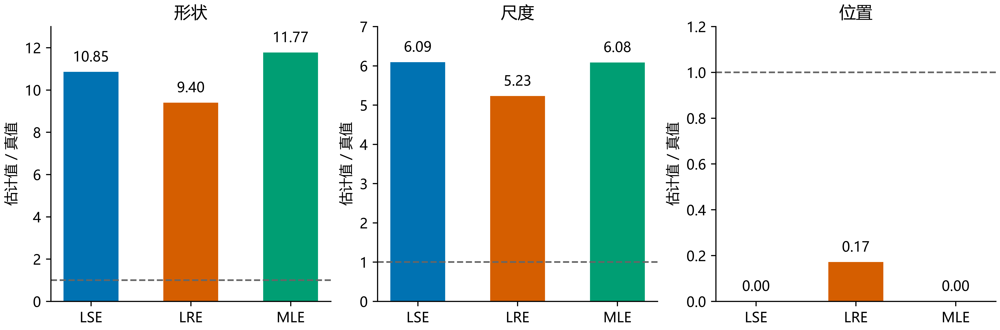
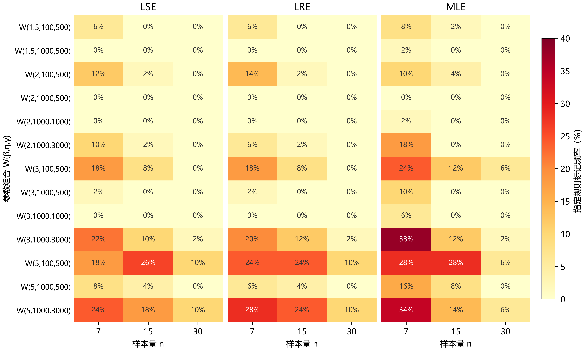

# R00小样本中的离谱估计：原因、预警与共性

> 2026-10-09 · 039修订。**本报告全部结论基于R00的13个参数组合；R09数据不在本报告口径内。**

## 1　现象：形状很大、位置偏左、尺度同时放大

R00共13组合×n=7/15/30×各50组×8方法，包含1,950组样本、15,600条方法记录。这里“离谱”指形状明显偏大，同时位置贴近0或尺度大幅膨胀；沿用既有[筛查规则](附录/机理推导与全量复核.md)，共365条：LSE 106、LRE 111、MLE 148，三档MDM、WMLE、MMLE各0。

例如W(2,100,500)、n15第36组：MLE估为(23.54,608.35,0)，LSE估为(21.70,609.36,0)，LRE估为(18.80,522.81,85.73)。原始观测仍集中在525—640附近，三个参数却都偏离真值。

**图A｜同一样本出现形状、尺度放大和位置低估。** 三面板分别画估计值/对应真值，虚线为1；LSE、MLE的位置为0。数据为R00第36组，不与其它批次混报。

## 2　为什么：位置左移后，另外两个参数会补偿

固定一组观测，向左移动γ会增大距离x−γ的平均值，却不改变样本标准差，因此距离的相对离散减小：

$$
\mathrm{CV}(x-\gamma)=\frac{\mathrm{SD}(x)}{\bar x-\gamma}.
$$

Weibull形状大对应相对波动小。对MLE固定位置的条件解，可以证明γ越左，条件形状和尺度越大；回归法也通过自己的概率图准则选择位置。本例这些大参数能维持接近的中部拟合，所以参数离真值很远，仍可能是准则偏好的结果。非负位置约束把左移截在γ=0，便形成有限下界极值。

**图2｜位置左移，条件形状与尺度增大，中部拟合仍接近。** R00第36组的原始CV为0.0528，扣除真位置后的CV为0.3331；曲线展示固定位置后重新求条件参数的变化。

这解释了多数记录，不能解释全部：365条中351条满足各自准则的局部条件，12条MLE存在可行改善方向，2条LRE与下界候选在诊断容差内等价。**参数误差大不等于求解器停错，报告成功也不等于局部最优。** 这里的有限γ=0极值，与β<1、γ趋近样本最小值时的似然无界是两种现象。

## 3　什么范围更值得警惕？

**样本层面可以在正式求解前筛查。** 只输入观测、n、方法及版本，在位置下界0计算条件形状βc(0)与该方法的边界方向：MLE向右移动时似然下降；LSE/LRE向右移动时回归损失上升。定义

$$
S_0=\beta_c(0)\,\mathbf1\{\text{支持下界局部最优的方向成立}\},\qquad S_0\ge10\text{ 时预警}.
$$

具体导数、符号容差与可执行入口见[预警程序](附录/程序/准则关系.py)和[附录说明](附录/README.md)。它不使用真参数，识别的是高形状下界候选。

| 方法 | 命中标记 | 漏报 | 分层未标记对照报警 |
|---|---:|---:|---:|
| LSE | 105/106 | 1 | 0/1170 |
| LRE | 108/111 | 3 | 0/1170 |
| MLE | 132/148 | 16 | 0/1034 |
| 合计 | 345/365（94.52%） | 20 | 0/3374 |

20条漏报中19条不支持下界方向，1条条件形状不足10。对照来自同一存档设计，0/3374不是总体零误报保证；报警也不保证求解器最终选中该候选，不报警不能保证准确。

**条件层面，在当前设计里优先核查n=7/15、β=3/5且γ/η=3或5的组合。** 例如下表及图B。n=30整体较少，但W(5,100,500)和W(5,1000,3000)仍各有13条，不能把某个n或参数比值当作安全界限。

| 代表条件 | LSE+LRE+MLE标记数/方法记录数 |
|---|---:|
| W(5,1000,3000)，n7 | 43/150（28.67%） |
| W(3,1000,3000)，n7 | 40/150（26.67%） |
| W(5,100,500)，n15 | 39/150（26.00%） |
| W(2,1000,500)，三档n | 均0/150 |

**图B｜标记集中于部分小样本、较大形状及位置相对尺度大的条件。** 每格为50组的标记比例，三方法分别展示，色阶一致。每条记录对应2个百分点；历史批次与LRE版本存在差异，因此只作经验范围描述，不作总体概率或单因素因果结论。

## 4　共性：看整组间距，也看准则是否偏好下界

标记中345条位置精确为0；原始观测的CV中位数约0.051—0.055，对照约0.113—0.115，呈现位置偏左、相对波动小与条件参数放大的关联。原始CV控制组合和n后的分离有限，不能单独当判据；尺度膨胀也不必每条都达到5倍真值。

关键区别是：**下界处能算出高形状，未必准则真的偏好下界。** 忽略边界方向、只看条件形状≥10，会提示1,646/3,374条未标记对照；完整预警在这些对照中未见报警。最小间距也不能单独决定结果，必须使用整组样本和本方法准则。

## 5　结论

R00中的离谱估计主要由位置选择与形状、尺度补偿共同形成，多数满足局部准则，少数存在可改善停点。只用样本的下界规则覆盖345/365条，但遗漏内部候选和部分数值停点；频率与覆盖率只限这13组合及当前对照。**365条仍照旧计为有解并纳入正式Bias、SD、RMSE，不删记录、不改分母。**

## 6　处理建议（本轮不执行）

优先增加样本量；有物理依据时限制合理位置区间，尤其避免无依据的大幅左移；与WMLE、MMLE等不同构造同时比较偏差、误差和失败代价；为估计结果附带可观测诊断。其它方法本轮未标记不等于普遍免疫，修改范围或方法后还需独立验证。

[详细推导与全量复核](附录/机理推导与全量复核.md)保存局部判据、例外、频率图4—7、统计敏感性与边界路径。有限扫描不是全域证明；Shao等（2004）Table 1未取得，本文不声称复现它。旧文件完整保留，正式批次哈希核验见[保护记录](附录/机理验证/保护核验.json)；未commit/push。
