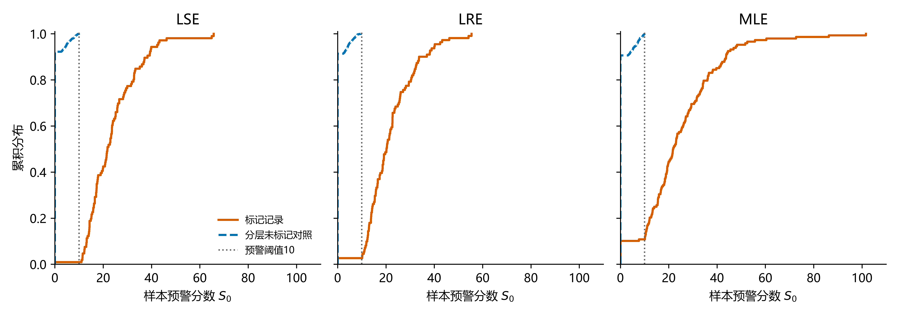
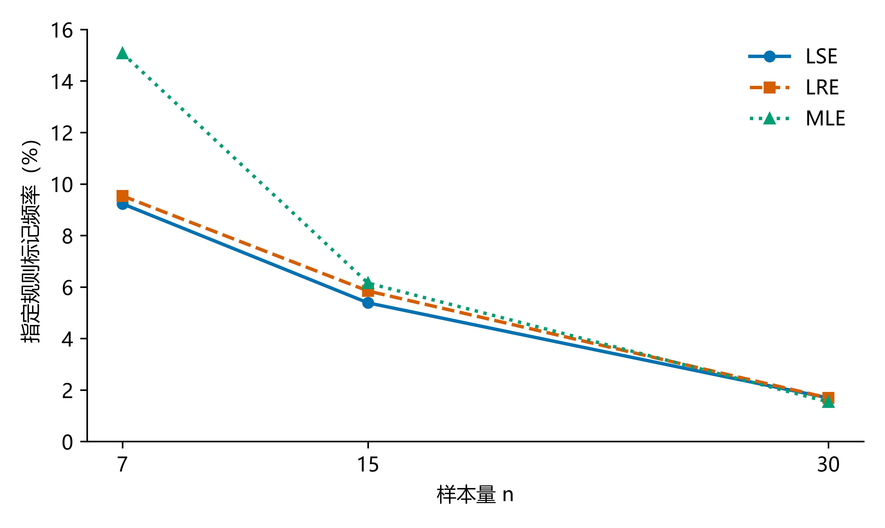
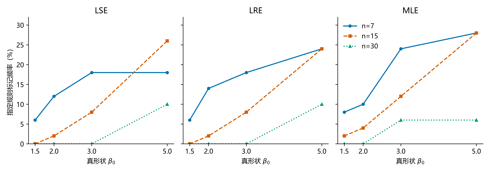
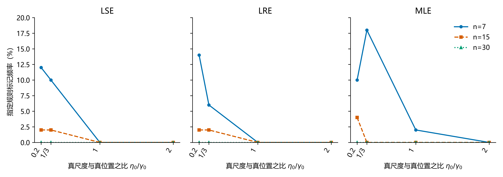
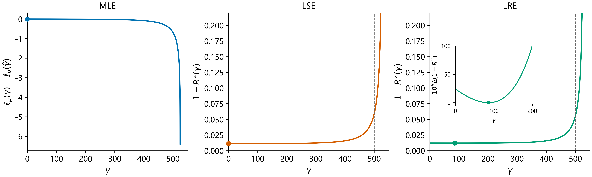
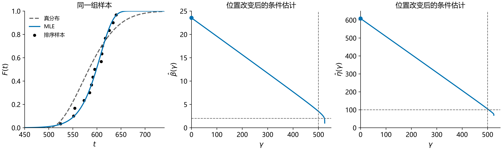
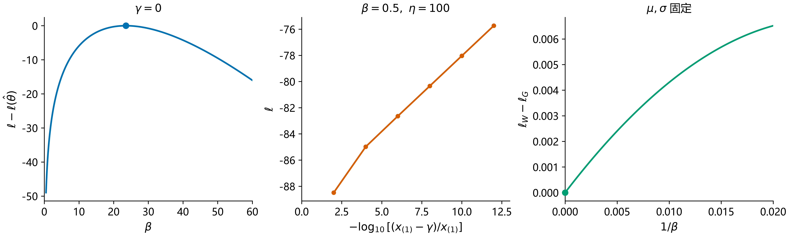

# 小样本中形状异常增大：准则极值、位置约束与参数补偿

> 独立说明文档 · 2026-10-09 · 039修订。仅复用R00既有样本与估计，正式批次保持。

**本报告全部结论以R00的13个参数组合为实证依据；R09数据不在本报告口径内。** R00为13组合×n=7/15/30×各50组×8方法，共1,950组样本、15,600条估计记录。一般解析关系另行说明成立条件，不把有限设计的经验规律推广成总体定理。

**正式统计口径保持：365条标记仍计入“有解”及原Bias、SD、RMSE，不删记录、不改分母、不向正式表新增诊断列。** 本报告的筛查、性质判定和敏感性分析均为独立诊断。

## 本报告研究什么、怎样验证、得到什么结果

**研究问题。** 小样本中，为什么MLE、LSE、LRE有时把位置估到0或明显偏左，同时把形状和尺度估得很大？本报告区分参数补偿、真实准则极值与数值停点，并检验能否只用样本提前识别高形状下界候选。

**验证方式。** 先推导位置改变时条件参数的方向，再分别为似然和回归准则写出局部条件。读取R00全部样本和估计，复核365条标记，并从117个“组合×n×方法”层选择3,374条有解未标记对照。例外另作可行方向改善与有限扫描；三个R00典型样本的既有独立诊断作为原理支撑。每个频率格仅50组，不新抽样、不重跑正式估计。

**得到的结果。** MLE固定位置的条件解满足“位置左移→相对离散减小→形状和尺度增大”的解析关系。365条中344条满足下界局部条件、7条满足内部局部条件；12条MLE有可行改善方向，2条LRE与下界候选在诊断容差内等价。样本预警命中345/365（94.52%），漏报20条，3,374条对照中未见报警。标记总体随n增加而减少，但存在非单调反例；这些比例只是当前存档设计的观察。

## 第一章　现象与问题

本章回答：形状异常增大出现在哪里、有多少，以及参数误差与求解器停错为什么需要分开核查。

### 1.1 真形状为2，为什么会估到18—24？

在R00的W(2,100,500)、n=15存档估计中，出现形状远大于真值、位置明显低估、尺度增大的结果。W(β,η,γ)依次表示形状、尺度和位置。

| R00组号 | 方法 | β̂ | η̂ | γ̂ |
|---|---|---:|---:|---:|
| 第36组 | LSE | 21.7041 | 609.3600 | 0 |
| 第36组 | LRE | 18.7974 | 522.8050 | 85.7282 |
| 第36组 | MLE | 23.5351 | 608.3531 | 0 |
| 第27组 | MLE | 19.6081 | 601.6013 | 0 |

数值已重新对应原样本与工作簿。历史表列名α、β、γ实际依次指形状、尺度、位置，本文统一记为β、η、γ。第36组在`估计结果_n15`第38行，LSE、LRE、MLE分别位于K:M、N:P、T:V；见[定位复核](定位复核.csv)。最初记作“W(2,100,1000)”的组合已经用户确认应为W(2,100,500)。

### 1.2 在完整R00设计中出现多少？

筛查沿用既有规则，不改变方法或成功判定：

$$
A=\{\hat\beta\ge10\}\cup\{\hat\beta\ge5\beta_0\},\qquad
B=\{|\hat\gamma|\le10^{-6}x_{(1)}\}\cup\{\hat\eta\ge5\eta_0\},
\qquad \text{标记}=A\cap B.
$$

β₀、η₀为生成真值，x₍₁₎为样本最小值。此规则用于模拟事后筛查，并不是“伪解”定义；真实应用中未知真参数不能用于预警。

重新清点13本原工作簿及其存档矩阵，覆盖312个“组合×n×方法”条件，零计数完整保留。13本工作簿的参数与样本均与原矩阵一致。

| 方法 | 标记数 |
|---|---:|
| LSE | 106 |
| LRE | 111 |
| MLE | 148 |
| MDM δ=0.10/0.15/0.20、WMLE、MMLE | 各0 |

共365条，均存有收敛标记且由原工作簿计为有解。其中364条满足绝对形状分支、250条满足相对真值分支，二者有重叠。见[完整计数](全条件筛查计数.csv)、[逐条标记](逐条标记记录.csv)与[工作簿核对](工作簿核对.json)。标记不为0与有解率高低是不同问题；其它方法未标记也不等于没有误差。

W(2,100,500)的LSE/LRE/MLE在n=7时分别标记6/7/5条，n=15为1/1/2条，n=30均为0。尺度1000也会出现同类结果：W(5,1000,3000)、n15、第16组的MLE形状为32.9982。不能只按η的绝对大小解释。

原八组合LRE保留Bernard绘图位置，后五组合保留Park Proposed+Plot。不同批次的抽样与版本并未统一重算，因此跨批比较只作描述，不自动成为单因素因果证据。

### 1.3 本报告要验证什么？

**这些大形状结果，是求解器停错了，还是准则确实选择了远离真参数的解；它们与非正则边界有什么关系？**

数值停点指存在可行改善方向却被算法接受的点；准则局部极值须满足本方法的局部条件；非正则边界行为指参数沿边界路径变化时似然无界或逼近嵌入分布。参数误差大不能直接证明停错，求解器报告成功也不能替代局部最优核查。

## 第二章　机理、判据与全量验证

本章先解释条件参数怎样补偿，再判定存档点性质，最后检验预警覆盖与有限设计中的频率关联。

### 2.1 机理：位置决定距离结构，准则决定选到哪里

#### 2.1.1 位置左移如何改变相对离散

固定不全相等的观测xᵢ，令dᵢ=xᵢ−γ>0、tᵢ=ln dᵢ、hᵢ=1/dᵢ。本文均值、方差和协方差使用1/n；SD为总体标准差。改变γ不会改变SD(x)，却会改变距离的平均水平：

$$
\mathrm{CV}(d)=\frac{\mathrm{SD}(x)}{\bar x-\gamma},\qquad
\frac{\mathrm d\,\mathrm{CV}(d)}{\mathrm d\gamma}
=\frac{\mathrm{SD}(x)}{(\bar x-\gamma)^2}>0.
$$

所以γ左移，距离的相对离散严格减小。对数距离也有同样的方向：

$$
\frac{\mathrm d}{\mathrm d\gamma}\mathrm{Var}(t)
=-2\mathrm{Cov}(t,h)>0.
$$

这是因为ln d随d增大，而1/d随d减小，两者协方差为负。这两条关系对每个固定的非恒定样本成立，不要求知道真参数。它们解释“左移以后为什么显得更集中”，还没有解释方法为什么要选左侧。

#### 2.1.2 MLE的条件形状和尺度为什么同步增大

三参数Weibull为F(x)=1−exp[−((x−γ)/η)ᵝ]。固定γ，消去尺度后得到

$$
\eta_c(\beta,\gamma)=\left(\frac1n\sum_i d_i^\beta\right)^{1/\beta},\qquad
s(\beta;\gamma)=\frac1\beta+\bar t-\sum_iw_it_i=0,
\quad w_i=\frac{d_i^\beta}{\sum_jd_j^\beta}.
$$

记E_w、Var_w、Cov_w为按w加权的量。形状方程的两项偏导为

$$
s_\beta=-\frac1{\beta^2}-\mathrm{Var}_w(t)<0,\qquad
s_\gamma=E_w(h)-\bar h+\beta\mathrm{Cov}_w(t,h)<0.
$$

后一个负号有两层依据：w偏向较大的d，使E_w(h)<h̄；t与h的反向排序使Cov_w(t,h)<0。β→0时s→+∞，β→∞时s→t̄−max(t)<0。因此，**任意固定γ<x₍₁₎都有唯一有限的正形状根**β_c(γ)，而且

$$
\beta_c'(\gamma)=-\frac{s_\gamma}{s_\beta}<0.
$$

也就是说，位置左移时条件形状必然增大。这比“看见加权方差变小，所以形状变大”更严谨：权重本身会变化，不能未经证明就把加权方差当成沿整条路径单调的量。

尺度是距离的幂平均。其对β的偏导可写成非负的相对熵，对γ的偏导为负：

$$
\partial_\beta\ln\eta_c=\frac{D_{\mathrm{KL}}(w\|1/n)}{\beta^2}\ge0,
\qquad \partial_\gamma\ln\eta_c=-E_w(h)<0,
$$
$$
\frac{\mathrm d}{\mathrm d\gamma}\ln\eta_c(\beta_c(\gamma),\gamma)
=-E_w(h)+\frac{D_{\mathrm{KL}}(w\|1/n)}{\beta_c^2}\beta_c'(\gamma)<0.
$$

这里D_KL=∑wᵢln(nwᵢ)。**位置左移→距离相对离散减小→条件形状增大→条件尺度增大**，对MLE条件解是一条有解析依据的链。它只说明“给定位置后参数怎样补偿”，不保证三参数优化一定选择左侧，也不等于估计误差必然增大。

补偿作用可以用分位关系检验。令z=ln[−ln(1−p)]，则

$$
Q(p)=\gamma+\eta e^{z/\beta}
\approx\mu+\sigma z,\qquad \mu=\gamma+\eta,\quad \sigma=\eta/\beta.
$$

在|z/β|较小时，不同参数组合可通过近似保持µ和σ来维持中部拟合；余项为ηz²e^ξ/(2β²)，ξ在0与z/β之间。可直接比较γ+η、η/β及目标分位的误差，不能只凭三参数变大就宣称尾部寿命仍然准确。µ、σ近似保持是拟合中的补偿描述，不是任意位置剖面的守恒定律。

#### 2.1.3 概率图方法也耦合，但不能套用似然判据

LSE使用White对数顺序统计量期望作参考坐标z；LRE使用绘图位置的双对数坐标z。本批LRE分别保留Bernard与Park版本。记C=Cov(t,z)、V=Var(t)、V_z=Var(z)，排序坐标下C>0，两者的位置准则都可写成

$$
J(\gamma)=1-R^2(\gamma)=1-\frac{C^2}{VV_z}.
$$

但参数恢复方向不同：LSE是t关于z回归，β_LSE=V_z/C；LRE是z关于t回归，β_LRE=C/V。因为C′=−Cov(h,z)>0、V′=−2Cov(t,h)>0，LSE的β′=−V_zC′/C²<0；LRE则为

$$
\beta_{\mathrm{LRE}}'=\frac{C'V-CV'}{V^2},\qquad
\ln\eta=\bar t-\bar z/\beta,\quad
(\ln\eta)'=-\bar h+\bar z\beta'/\beta^2.
$$

LRE的形状导数及两种回归尺度导数需要按样本计算，本文不把它们都宣称为一般单调定理。本次3739条R00诊断中两种回归形状导数都为负，但各有1条未标记对照的尺度导数为正。大负位置下t≈ln a+x/a（a=−γ），两种回归也可出现形状、尺度随a增大的补偿；有限位置处是否选到该方向，仍由各自J决定。

#### 2.1.4 三种边界必须分开

在当前非负位置约束下，γ=0是**下界**。它可能留下有限的大形状局部极大，形状继续增大不一定改善似然：固定γ=0并消去η时，β→∞的主导项为β[∑ln xᵢ−n ln x₍ₙ₎]<0，似然趋于−∞。

另一条是**上端无界路径**：固定0<β<1，使γ→x₍₁₎⁻，最小观测贡献(β−1)ln(x₍₁₎−γ)→+∞。这是[Kundu–Raqab（2009）第2节](https://home.iitk.ac.in/~kundu/paper154.pdf)明确展示的路径，不能拿来解释任意β>10、γ=0的有限点。保留β<1时原似然全局无界，与在β≥1分支寻找可用局部极大是两回事。[Smith（1985）](https://doi.org/10.1093/biomet/72.1.67)所讨论的非正则渐近性质也不等于算法终止状态。

第三条允许**负位置的嵌入路径**：固定µ、σ，令η=βσ、γ=µ−βσ，则

$$
F(x)=1-\exp\{-[1+(x-\mu)/(\beta\sigma)]^\beta\}
\longrightarrow1-\exp\{-\exp[(x-\mu)/\sigma]\}.
$$

它逼近最小值型Gumbel，似然可趋于有限极限。取消非负约束后，当前下界点可能沿负位置继续改善，或者遇到另一个有限负位置极大；不能仅由“大形状”推断最终一定走到Gumbel。既有三组R00扫描确实显示负位置可改善，但不是全域证明。Shao等（2004）的Table 1全文尚未取得；本文的导数、局部量和扫描都不冒充其表1判据。

对固定µ、σ的这条嵌入路径，令vᵢ=(xᵢ−µ)/σ，可直接展开密度：

$$
\ell_W-\ell_G=\frac{D}{\beta}+O(\beta^{-2}),\qquad
D=\sum_i\left[\frac{(e^{v_i}-1)v_i^2}{2}-v_i\right].
$$

D>0表示充分大的有限β沿该路径高于极限，D<0表示从极限下方向其改善。它只判断这一受控路径的局部方向，不能排除另一处有限高点。三组R00的D有正有负，也说明取消约束后的结局不统一；D不是本轮下界预警规则，更不是Shao表1的替代。

### 2.2 判据：性质判定与样本预警分别回答什么

#### 2.2.1 按各自准则判定存档点

MLE先求固定γ的β_c、η_c，再计算位置剖面导数

$$
G(\gamma)=\ell_p'(\gamma)/n
=\beta_cE_w(h)-(\beta_c-1)\bar h.
$$

对非恒定正样本，**β_c(0)≥1且G(0)<0**是当前β≥1、γ≥0分支存在有限下界局部极大的充分条件。如果要判定一条存档记录本身，还须它的位置确实在0，且β̂、η̂与条件解一致。内部γ̂>0须检查G(γ̂)=0及G′(γ̂)<0，不能把“判据A在0成立”当作任何内部记录的定性。

G′可由解析关系计算：

$$
G'=\beta(1-\beta)E_w(h^2)+\beta^2[E_w(h)]^2
-(\beta-1)\overline{h^2}-\frac{s_\gamma^2}{s_\beta}.
$$

LSE/LRE则检查J：下界J′(0)>0；内部J′(γ̂)=0且J″(γ̂)>0。由C′=−Cov(h,z)、V′=−2Cov(t,h)，有

$$
J'=-R^2\left(2C'/C-V'/V\right),\quad
J''=-R^2\left[\left(2C'/C-V'/V\right)^2
+2\left(C''/C-(C'/C)^2\right)
-\left(V''/V-(V'/V)^2\right)\right],
$$

其中C″=−Cov(h²,z)，V″=2Var(h)−2Cov(t,h²)。回归点还须与本版本OLS恢复的β、η一致。MLE的G不用于判定LSE/LRE；WMLE、MMLE、MDM不在这两种准则判据的适用范围内。

数值核查用σₓ=SD(x)归一位置：MLE检查σₓG、σₓ²G′，回归检查σₓJ′、σₓ²J″。参数对数误差容差2×10⁻⁵，内部一阶量绝对容差2×10⁻⁶，严格方向/曲率符号阈值10⁻¹⁰；精确0与小的正位置分别记录。31个解析曲率与独立差分检查的最大相对差4.9×10⁻⁶。容差用于数值诊断，不是把邻近边界的点定义成严格内部极值。

#### 2.2.2 什么时候会出现：只用样本的预警规则

**在正式求解之前，就能用样本识别“高形状下界局部候选”。** 输入只有排序样本、n、方法及其已知版本；不使用β₀、η₀、γ₀。取本批方法的位置下界0，计算其条件形状β_c(0)和边界方向：

$$
B_0=\begin{cases}-\sigma_xG(0),&\mathrm{MLE},\\
\sigma_xJ'(0),&\mathrm{LSE/LRE},\end{cases}\qquad
S_0=\beta_c(0)\,\mathbf1\{B_0>10^{-10}\}.
$$

**预警规则为S₀≥10。** MLE还检查有限根及β_c(0)≥1，非恒定正样本的有限根已由2.1证明；回归使用本版本的OLS条件形状。10是本次沿用的绝对高形状诊断阈值，不是统计学通用危险阈值；它没有使用“形状为真值多少倍”。

```text
输入 x、方法、版本；要求至少3个非恒定正观测
在 γ=0 处计算条件形状及本方法的边界方向 B0
若 B0>1e-10 且条件形状≥10：高风险，存在高形状下界局部候选
否则若条件形状≥10：有高形状潜势，需检查内部极值及求解过程
否则：未检出本类风险；不排除相对偏差或数值停点
```

可执行入口为[准则关系.py](程序/准则关系.py)，接收只含观测数组的JSON和方法名。若改用其它位置下界，需在相应下界重算；本轮量化只验证下界0。实际实现若有额外形状/尺度截断或先验，应按其约束重写剖面；本文采用β≥1、η>0的MLE分支，本轮样本未触发程序的尺度下限。**报警不保证特定求解器最终选中这个局部候选；不报警也不保证“不会离谱”。** 更不能在不知道真参数时，单凭高形状断定参数误差很大：真实高形状总体也可能产生这类观测。

| 方法（均为R00） | 标记记录命中 | 命中率 | 漏报 | 分层未标记对照报警 |
|---|---:|---:|---:|---:|
| LSE | 105/106 | 99.06% | 1 | 0/1170 |
| LRE | 108/111 | 97.30% | 3 | 0/1170 |
| MLE | 132/148 | 89.19% | 16 | 0/1034 |
| 合计 | 345/365 | 94.52% | 20 | 0/3374 |

漏报20条中，19条下界方向不支持局部最优，1条虽支持下界但条件形状小于10，来自相对真值筛查分支。内部高形状点和可改善停点不一定触发下界预警。见[漏报清单](机理验证/预警漏报标记.csv)。

0/3374只表示当前分层对照中未见报警，不是总体零误报保证。对照来自同一存档设计，并非新的独立验证集；同一组样本可对应多个方法，记录数不是独立样本数。标签与规则都含绝对形状门槛，命中率不能解释为真实数据参数估计准确率。

阈值8仍命中345/365，但对照报警51/3374（1.51%）；阈值12命中321/365（87.95%），对照未见报警。仅检查条件形状≥10而忽略边界方向，可覆盖364/365（99.73%），却提示1646/3374条对照（48.79%）。因此，条件形状大与准则偏好下界必须分开。见[阈值敏感性](机理验证/预警阈值敏感性.csv)及[汇总](机理验证/汇总.json)。



**图4｜样本预警识别了多数高形状下界标记。** 三面板只含R00的LSE、LRE、MLE，共用完整分数范围与累积分布纵轴；竖线为阈值10，边界方向不支持时分数为0。标记全取，对照从R00分层选择。分离反映本类诊断事件，不能证明总体准确率。

原始观测相对波动小可以提示风险，但n≤15、CV小或最小值接近中位数都不是必要充分条件。真正的下界方向量是本方法的B₀。最小真间距和η₀/γ₀只用于模拟事后解释，不能进入实务预警。可选后续是核查内部候选、利用外部位置知识或与其它构造比较；本轮未改变方法或部署规则。

### 2.3 全量验证：覆盖范围、频率与反例

#### 2.3.1 365条各自准则复核，不能统一归类

从R00存档重新读取1,950组样本与15,600条估计，逐条核对365个标记键和参数。对照从117个“组合×n×方法”层的有解未标记记录中，按排序组号等距选最多30条；不足30条全取，共3,374条。总诊断3,739条，不读取另一条研究线的数据。

| 方法 | 标记数 | 精确γ̂=0 | 下界局部极值 | 内部局部极值 | 未通过局部条件 |
|---|---:|---:|---:|---:|---:|
| LSE | 106 | 105 | 105 | 1 | 0 |
| LRE | 111 | 106 | 106 | 3 | 2 |
| MLE | 148 | 134 | 133 | 3 | 12 |
| 合计 | 365 | 345 | 344 | 7 | 14 |

**351条满足各自准则的局部条件；其余14条需要另作解释。** 12条MLE的可行近邻确实提高存档点似然，不能称为局部极大，其中1条位置精确为0、11条为很小的正值；有限扫描最大似然改善约2.47。2条LRE与下界候选的目标差未超过10⁻⁹诊断容差，归为近边界数值等价，不称严格内部极值。见[例外方向与扫描](机理验证/例外方向与局部复核.csv)。

三个典型样本能展示“误差大但准则没有停错”的机理，不能推广成所有大形状点都如此。当前证据区分局部极值、近边界等价与可改善停点；有限扫描不能证明全域最优，正式有解分类保持。

1,182条MLE诊断（148标记、1,034对照）的条件形状与尺度位置导数均为负，与解析推导一致。3,374条对照中也有289条满足下界局部条件（LSE 91、LRE 101、MLE 97），说明下界解本身不等于大参数误差。完整版本、方向、曲率与参数一致性见[逐条诊断](机理验证/全部标记与分层对照.csv)。

#### 2.3.2 相对波动有解释力，但不是充分条件

| 方法 | 原始CV₀：标记／对照中位数 | 原始CV₀层内AUC | 候选位置CV层内AUC |
|---|---|---:|---:|
| LSE | 0.051／0.114 | 0.589 | 0.997 |
| LRE | 0.051／0.113 | 0.565 | 0.997 |
| MLE | 0.055／0.115 | 0.599 | 0.996 |

AUC以较小CV更可能标记为方向；层内量只比较同组合、n及方法的标记—对照配对，按可比较配对数加权。控制条件后原始CV分离有限，不能凭它判定准则会选哪里。扣除候选位置后的CV关联更强，却已使用方法选出的结果，不能当作独立的提前预测证据。见[代理分离度](机理验证/代理指标分离度.csv)。

最小观测距真位置较远也不是必要条件：R00 W(2,100,500)、n7、第22组的间距约2.17，LSE仍选γ̂=0、β̂=15.11，并通过J的下界局部条件。整组间距共同进入条件形状和准则方向，不能只看最小间距。

#### 2.3.3 n、真形状与尺度位置比的频率规律有条件

**以下每个组合×n×方法格仅50组，频率每条记录对应2个百分点。** 图只描述R00离散设计中的经验关联，不做总体概率单调性、危险阈值或单因素因果推断。



**图5｜标记总体随n增加而减少，个别条件并不单调。** 三方法分别汇总13组合，每个方法、每档n的分母为650。三方法合计n=7/15/30标记220/113/32条（各1950条方法记录），对应11.28%/5.79%/1.64%。39条“组合×方法”的n序列中，38条非递增；例外为W(5,100,500)的LSE：9/50→13/50→5/50。n=30仍有32条，n≤15不是事件门槛。



**图6｜固定η₀=100、γ₀=500，较大真形状通常对应较高标记频率。** 仅使用同一新增批次的β₀=1.5/2/3/5四组合，三个方法分别显示n=7/15/30。n=7的MLE计数为4/5/12/14，LSE为3/6/9/9，LRE为3/7/9/12。这些变化受50组样本与绝对形状≥10的筛查门槛共同影响，不能当作相对误差随β必然增大的证明。



**图7｜位置相对尺度较大常与较多标记相联系，但不是严格排序。** 固定β₀=2，横轴η₀/γ₀为0.2、1/3、1、2；LSE/LRE/MLE各自显示三档n。MLE在n=7的计数为5/9/1/0：0.2比1/3更小，计数反而较少。部分点来自不同历史批次，LRE版本也不同，连线仅便于阅读经验频率。

标准化u=(γ−γ₀)/η₀后，非负位置约束为u≥−γ₀/η₀。γ₀/η₀越大，从真位置向左退的允许范围越宽，这是比值关联的解析解释，并不规定发生概率。W(5,1000,3000)、n15、第16组的MLE形状32.9982、位置0也通过下界判据，说明η=1000仍可出现同类事件。全部117个频率条件含零计数，见[频率数据](机理验证/标记频率与参数条件.csv)。

#### 2.3.4 三组R00典型点只作为原理支撑

R00 W(2,100,500)、n15第36/27组，以及W(5,100,500)、n15第36组，保留既有独立诊断。每组6起点，共18次优化正常终止，目标值与相应剖面最优值最大差小于2.9×10⁻¹⁴；条件得分、曲率与下界方向支持有限边界局部极大。本轮不重新运行这批优化，证据覆盖与例外以2.3.1为准。



**图1｜同一样本下不同准则可以选择不同位置。** R00 W(2,100,500)、n15第36组的MLE、LSE在0取局部极值，LRE在约85.73取内部极小。高形状不必对应精确零位置，也不能用似然代替回归准则。



**图2｜中部拟合接近与单参数误差大可以同时存在。** 第36组原始CV为0.0528，扣除真位置后为0.3331；位置左移至0时条件形状、尺度增大。形状改为5的配对典型样本原始CV为0.0251，MLE形状约55.68。这里只作固定样本支撑。



**图3｜有限下界极大、上端无界与负位置嵌入是三种行为。** 本图已改用R00 W(2,100,500)、n15第36组。固定γ=0继续增大β最终降低似然；固定β=.5、η=100让γ靠近最小观测时似然无界；固定µ、σ沿负位置路径逼近有限Gumbel极限。受控路径与2.1.4对应，不证明全域最优。

## 第三章　统计影响、结论与启发

本章回答：这些记录对正式误差指标有多大影响、能否解释样本量比较中的反常结果，以及在维持统计口径的前提下能得到什么结论。

### 3.1 少量记录可以主导形状误差

按当前正式口径，每种方法使用各自被工作簿计为有解的估计，SD采用ddof=0；365条标记记录仍在相应方法的正式统计中，分母保持。下表“暂剔后”是已有的敏感性分析：只计算假如不纳入标记记录，指标会怎样变化，并未从原始记录或正式统计中删除这些结果，也不新增诊断标记列。

| 条件，均为W(2,100,500)、n=15 | 标记数/原成功数 | 原β Bias | 原β SD | 原β RMSE | 暂剔后的β RMSE | 标记记录占β平方误差 |
|---|---:|---:|---:|---:|---:|---:|
| R00 LSE | 1/50 | 0.8181 | 3.1125 | 3.2182 | 1.6262 | 74.98% |
| R00 LRE | 1/50 | 0.6641 | 2.7204 | 2.8002 | 1.4977 | 71.97% |
| R00 MLE | 2/42 | 1.3098 | 4.3480 | 4.5410 | 1.5187 | 89.35% |

暂剔后，R00的LSE/LRE保留率由100%变为98%，MLE由84%变为80%。这说明尾部记录对精度指标影响很大，同时说明删除记录会改变有效集合。**暂剔后的低RMSE不是原方法性能改善，也不能用于掩盖这些原本被计为有解的结果。** 尺度、位置及全部条件的对应Bias、SD、RMSE、保留率见[全参数统计敏感性](全参数统计敏感性.csv)。

### 3.2 它能否解释“n=30反而比n=15差”？

在本次R00十三组合、LSE/LRE/MLE的39个形状比较中，n=30的RMSE只有两项高于n=15：均为W(3,1000,500)，LRE由1.3209升到1.4765，LSE由1.4419升到1.5753。这两项在n=15和30的标记数都是0，暂剔标记不会改变比较，因此不能由本次筛查事件解释。

本次原始单位统计中，这三种方法的尺度、位置RMSE没有n=30更差的对应项。W(2,100,500)则随n=30明显改善：LSE/LRE/MLE形状RMSE分别降到0.5830/0.5501/0.6933，且标记数均为0。50组经验RMSE允许发生样本波动；本核查未对上述两项做独立重采样或显著性检验。逐项比较见[n30与n15比较](n30与n15比较.csv)。

### 3.3 得到什么结论，怎样处理更合适？

**本报告全部实证结论基于R00的13个参数组合；R09不在统计与图表口径内。** 条件参数的变化有一般解析依据，但位置最终选到哪里由样本、约束与方法准则共同决定。R00的365条标记中，351条满足局部条件、12条MLE有可行改善方向、2条LRE为近边界容差等价，不能统一叫作伪解或统一认作正常极值。

形成大形状的条件链条是：较左的γ使距离相对波动减小，条件β、η增大以补偿拟合。非负位置约束限定左移范围，具体极值由方法准则决定。这与β<1、γ逼近样本最小值时的上端无界路径，以及允许负位置的Gumbel嵌入路径分别处理。

**正式口径保持：365条照旧计为有解并纳入Bias、SD、RMSE，不删记录、不改分母。** 后续可考虑的处理及其代价如下，本轮均未实施。

| 可选处理 | 目的 | 代价 |
|---|---|---|
| 正式误差与可观测诊断并列报告 | 同时显示求解成功与参数失稳 | 实务诊断不能依赖未知真值 |
| 原口径与敏感性口径并列 | 显示尾部记录对指标的影响 | 暂剔结果改变集合，不能称原方法改善 |
| 依据研究目标限制参数域或加惩罚 | 限制极端估计 | 改变方法和模型域，可能裁掉合理高形状 |
| 用剖面、局部条件、多起点核查 | 区分停点与准则极值 | 增加计算；换求解器不保证参数恢复真值 |
| 同时报目标寿命分位误差 | 检验补偿是否满足使用目标 | 中部拟合接近不保证下尾准确 |

每格仅50组，频率与预警命中限于当前存档设计和对照选择。解析关系限于文中样本与准则条件；有限扫描不是全局证明。Shao等（2004）的Table 1全文尚未取得，本文的导数与受控路径量不冒充其表1；尚未做新的独立样本预警验证、修复正式求解器或部署报警。

原样本、估计、批次程序、工作簿、批次图片与交付副本保持；本轮未commit/push。[039保护核验](机理验证/保护核验.json)记录哈希与Git证据。当前诊断数据、程序和复现命令见[附录](README.md)。修订前50个报告文件原字节保留在[历史或外部证据说明](历史/038-混合口径/历史口径说明.md)，不用于当前正文判断。
