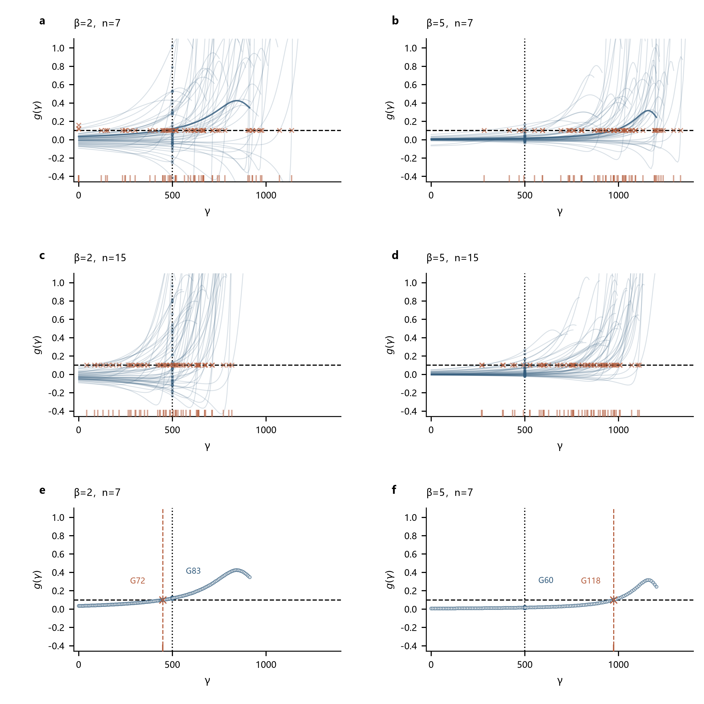
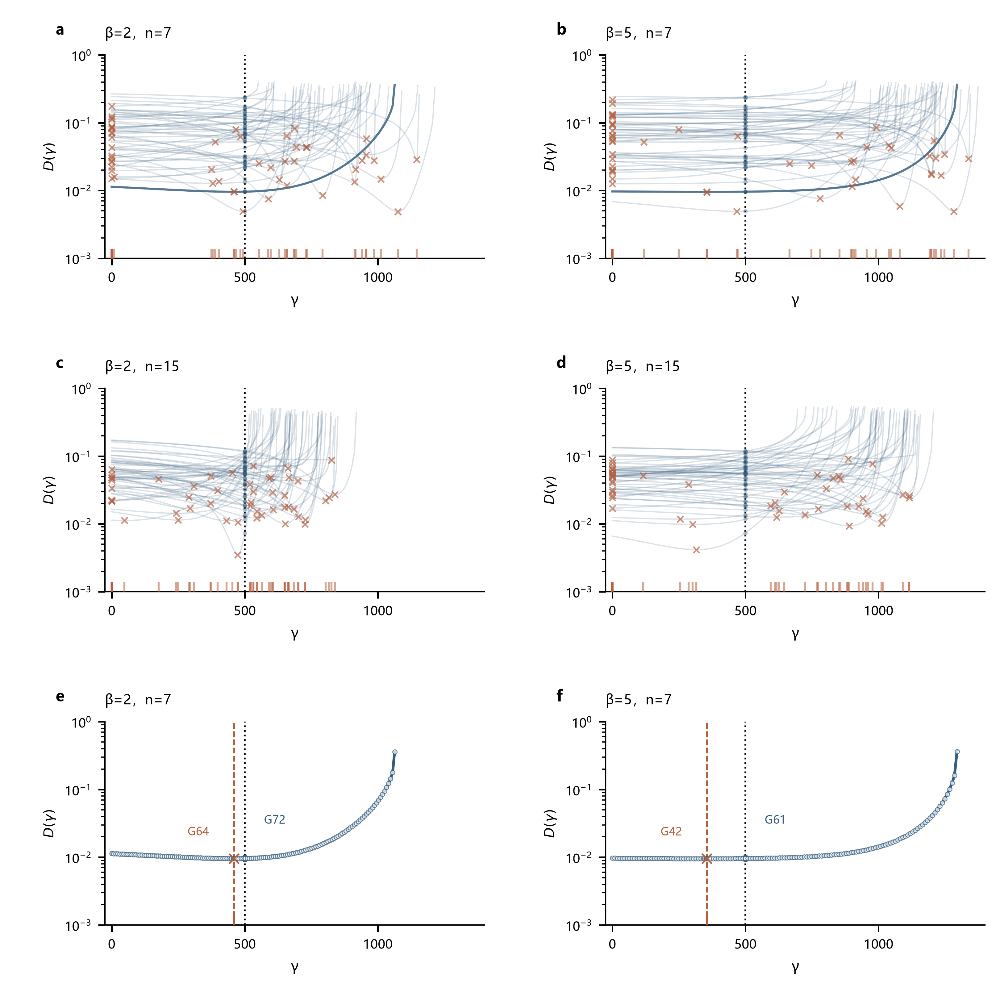
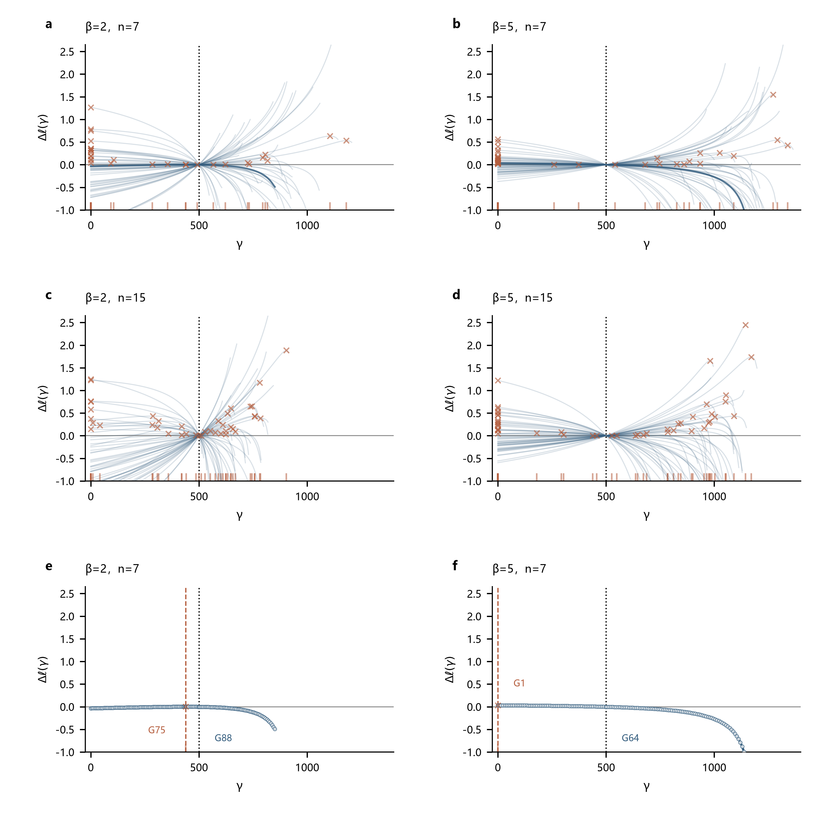
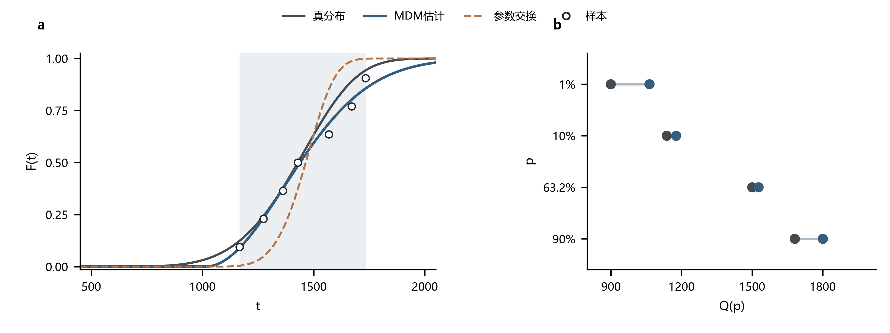

# 高形状参数下的位置高估与尺度补偿

> 研究报告 · 2026-10-02

## 第一章　估计偏移现象与样本核验

从三参数Weibull分布W(5,1000,500)生成的小样本，在多种方法下得到位置参数约1000、尺度参数约500的估计，同时伴随形状参数下降。位置与尺度的估计值接近彼此的真值，容易引起参数顺序错误的疑问。本报告通过种子复算排除样本与参数映射错误，再结合各方法的求解准则分析偏移来源，并考察参数补偿对寿命分位点的影响。

### 1.1 样本生成与参数映射

W(5,1000,500)依次表示形状β、尺度η和位置γ。按原种子20260906重新生成样本，结果与存档逐值一致；连同β=2对照，200组、2200个观测值的最大差为0。估计表的3000条三参数展示记录与CSV一致。历史表中α表示形状、β表示尺度，本文统一使用β、η、γ。

样本支持范围也能排除位置与尺度交换。若生成分布为W(5,500,1000)，全部观测都应大于1000，而原β=5的100组样本中有23组包含小于1000的观测。因此，位置与尺度的偏移产生于估计阶段。

### 1.2 估计分布与样本量差异

图1展示原β=5案例的估计分布。n=7时，MDM、WMLE的形状和尺度估计主要集中在真值以下，位置估计主要集中在真值以上。LSE、LRE、MLE的位置估计也包含较多高估结果，但分布较宽，且存在较多γ=0的边界解。n=15时，多数方法的估计中位数更接近真值，MDM、WMLE仍有较明显的位置与尺度偏移。

**图1｜位置高估与尺度低估伴随不同的估计分布。** a–c为n=7，d–f为n=15，各方法均使用50组原样本。横轴为估计值，纵向排列五种方法；成功/失败数见本章统计表。小提琴宽度表示高斯核平滑密度，采用Scott带宽，各方法独立归一，并限定在其估计范围内。β、η的密度在log₁₀坐标计算，γ的正值密度在线性坐标计算；γ=0保留散点，其个数在n=7时分别为LSE 11、LRE 12、MLE 11，在n=15时分别为LSE 11、LRE 13、MLE 9；MDM、WMLE均无零边界结果。散点包含全部成功估计，排列于各方法的水平中心线上；白菱形为中位数，细灰横线为第25–75百分位，黑竖虚线为真值。同一参数两行共用坐标范围，失败估计不补值。MDM的偏移量δ=0.10。

下表列出中位数及四分位区间。n=7时，五种方法的位置中位数均超过900，尺度中位数为385–626；n=15时，位置中位数降至600–940，尺度中位数升至565–907。

| n | 方法 | 成功/总组数 | β估计 | η估计 | γ估计 |
|---:|---|---:|---:|---:|---:|
| 7 | MDM | 50/50 | 2.0 [1.6, 2.9] | 455.8 [326.1, 598.6] | 1014.8 [889.3, 1164.5] |
| 7 | LSE | 50/50 | 2.5 [1.5, 5.8] | 510.9 [333.0, 1117.0] | 973.5 [434.1, 1139.5] |
| 7 | LRE | 50/50 | 2.6 [1.5, 6.0] | 579.5 [341.7, 1387.3] | 912.4 [209.9, 1129.9] |
| 7 | WMLE | 49/50 | 1.9 [1.4, 2.7] | 384.9 [277.5, 555.8] | 1070.4 [957.8, 1189.9] |
| 7 | MLE | 34/50 | 4.0 [2.2, 8.5] | 625.8 [352.1, 1425.5] | 900.4 [0.0, 1080.9] |
| 15 | MDM | 50/50 | 2.9 [2.2, 3.3] | 618.9 [462.3, 756.5] | 909.0 [718.2, 994.3] |
| 15 | LSE | 50/50 | 4.1 [2.3, 6.3] | 769.4 [496.5, 1280.1] | 752.3 [221.4, 981.3] |
| 15 | LRE | 50/50 | 4.4 [2.4, 6.5] | 906.6 [536.8, 1446.0] | 600.0 [25.6, 943.9] |
| 15 | WMLE | 50/50 | 2.8 [2.2, 3.8] | 564.8 [452.7, 788.4] | 940.3 [686.8, 1015.2] |
| 15 | MLE | 48/50 | 4.1 [2.6, 6.6] | 733.4 [494.4, 1275.7] | 741.0 [247.7, 998.5] |

表中数值为中位数 [第25百分位, 第75百分位]，仅统计成功估计。

## 第二章　机制分析与对照实验

### 2.1 下尾观测不足与对照设计

三参数Weibull分布以β控制形状、η控制尺度、γ确定支持起点。对t>γ，其分布函数及分位关系为：

$$F(t)=1-\exp\left[-\left(\frac{t-\gamma}{\eta}\right)^\beta\right],\qquad
Q(p)=\gamma+\eta[-\log(1-p)]^{1/\beta}.$$

令E为单位指数变量，便有生成式 $t=\gamma+\eta E^{1/\beta}$。在n=7、η=1000、γ=500时，β由2增至5，最小观测的期望由835升至1122，全部观测大于1000的概率由17.4%升至80.4%；β=5、n=15时，该概率仍为62.6%。高形状参数使靠近真实起点的观测减少，削弱了数据对γ的约束；具体偏移方向仍取决于估计准则。

以下各节从方法原理出发，固定候选γ并处理其余参数，得到以γ为自变量的评价量。记排序观测为tᵢ，距离为dᵢ=tᵢ−γ，候选位置满足0≤γ<t₁。条件估计记为 $\widetilde\beta(\gamma)$、$\widetilde\eta(\gamma)$；它们随候选γ变化，不等于已知真值。

图2–6采用相同六格布局：a、b为n=7下的β=2、5，c、d为n=15下的β=2、5，每个条件含50组样本。相同n与组号跨β共用潜在E，因而a与b、c与d构成配对比较；不同n使用不同潜在样本族。e、f分别展开a、b中的同一组号曲线，使用同一评价量。每法在两端均成功且评价量有定义的组号中，选取β=5返回γ最接近全部成功结果中位数的一组；并列时取较小组号。不同方法可以选取不同组号，单例只说明求解过程，趋势由全部组评价。

a、b中的深蓝线对应e、f展开的曲线。每幅方法图的六格共用相同横纵轴范围、刻度和缩放方式，底部短线标示全部成功返回位置；单例格的空心圆为逐个候选γ的公式评价点，连线连接这些计算点。G编号按候选γ升序对应保存的数据，图中仅标真γ及返回γ的关键点号。编号1–7的真实回归观测及联合方程图另见补充图6。

| 方法 | γ单变量评价量 | 位置选择依据 |
|---|---|---|
| MDM | 条件伪尺度标准差梯度g(γ) | 达到0.10阈值；满足边界条件时取γ=0 |
| LSE | 归一化回归损失D(γ) | 最大White F比，等价于最小D |
| LRE | 归一化回归损失D(γ) | 最大相关系数平方，等价于最小D |
| WMLE | T₁=0分支上的位置残差T₂(γ) | 条件零点对应两方程同时满足；实际联合求解按容差接受 |
| MLE | 有限条件剖面对数似然增量Δℓ(γ) | 有限局部极大或非负位置边界 |

### 2.2 MDM：梯度收缩与固定阈值的右移效应

MDM利用分位关系比较每个观测所对应的尺度。取pᵢ=(i−0.3)/(n+0.4)、uᵢ=−log(1−pᵢ)。若观测恰好落在给定分位上，dᵢ=ηuᵢ¹/ᵝ，各观测反算的伪尺度就应相等。因此，固定γ后，以伪尺度离散程度最小确定条件β：

$$\eta_i(\beta,\gamma)=d_i u_i^{-1/\beta},\qquad
\sigma(\beta,\gamma)=\sqrt{\frac{1}{n-1}\sum_i(\eta_i-\overline\eta)^2},\qquad
\widetilde\beta(\gamma)=\arg\min_\beta\sigma(\beta,\gamma).$$

位置选择还需考察条件最小标准差 $\sigma^*(\gamma)=\sigma(\widetilde\beta(\gamma),\gamma)$ 如何随γ变化。在平滑的条件极小点，形状方向导数为0，故总导数只剩位置方向的偏导数。令 $a_i=u_i^{-1/\widetilde\beta(\gamma)}$，固定条件β时 $\partial\eta_i/\partial\gamma=-a_i$。对上述方差求导，得到：

$$\frac{d\sigma^*}{d\gamma}
=\frac{\partial\sigma}{\partial\gamma}
+\underbrace{\frac{\partial\sigma}{\partial\beta}}_{0}\frac{d\widetilde\beta}{d\gamma}
=-\frac{\operatorname{Cov}(\eta_i,a_i)}{\operatorname{SD}(\eta_i)}
\equiv g(\gamma).$$

协方差和标准差均按n−1归一。图2的纵轴正是g(γ)；保存曲线采用位置方向差分评价，解析式用于复核。当前MDM取可行搜索中的首个g(γ)=δ交点，δ=0.10；若g(0)≥δ则返回γ=0。阈值是该方法的位置选择规则，并非将σ再对γ最小化所得的零导数条件。随后以条件β作为形状估计，以伪尺度均值作为尺度估计。

**图2｜高β时真实位置处的梯度收缩，阈值交点右移。** a–d每条浅蓝线代表一组样本，蓝点为g(500)，红叉为返回位置，横虚线为δ=0.10，黑竖点线为真γ=500。e、f为同一潜在样本组#48在β=2、5下的曲线，直接取自a、b的深蓝线；空心圆为公式计算点，G号含义见2.1节，红竖虚线标示返回γ。六格坐标范围、刻度和缩放方式相同。

这个导数还说明了高β为何减弱位置敏感性。条件β增大时，aᵢ趋近于1，改变γ对各伪尺度的作用接近共同平移；共同平移不改变标准差。由协方差不等式可进一步得到 $|g(\gamma)|\leq\operatorname{SD}(a_i)$。真γ处的条件β中位数由2.26升至5.32，权重标准差中位数由0.722降至0.236；解析导数与数值梯度的最大差小于1.8×10⁻⁵。收缩降低了真γ处达到固定阈值的可能性；在图示分支中，继续增大γ才使梯度达到0.10。

图2a、b中，g(500)的IQR由0.285降至0.034，中位数由0.064降至0.009，低于0.10的组数由30增至46；γ中位数由575升至973，严格配对的50组均表现为γ增加、η减少。单例#48的g(500)由0.1183降至0.0166，交点由γ≈449移至974，直接展示了同一潜在间距下阈值选择的变化。

n=15时也出现梯度收缩：g(500)的IQR由0.553降至0.074，中位数由0.096降至0.015，低于0.10的组数由25增至43；γ中位数由496升至797。增大样本量减小了这批β=5样本的高估，但未消除固定阈值与梯度收缩共同造成的偏移。

### 2.3 LSE：回归损失改善与位置偏移

LSE以顺序统计量的线性关系估计参数。由生成式取对数，得到 $\log(t_i-\gamma)=\log\eta+(\log E_i)/\beta$。以单位指数样本第i个顺序统计量的对数期望zᵢ作为参考坐标，固定候选γ后拟合：

$$y_i(\gamma)=\log d_i=a+bz_i+r_i,\qquad
\widetilde\beta(\gamma)=1/b,\qquad
\widetilde\eta(\gamma)=e^a.$$

因此每个γ都有一条条件OLS直线。令SSE=Σrᵢ²、SST=Σ(yᵢ−ȳ)²。带截距OLS的拟合值与残差正交，故 $\mathrm{SST}=\mathrm{SSE}+\sum(\widehat y_i-\overline y)^2$；拟合变差占总变差的比例为ρ²，其中ρ是z与y的相关系数。因此SSE/SST=1−ρ²。当前实现使用总变差与残差变差的White F比，代入该恒等式即可得到绘图公式：

$$D_{\rm LSE}(\gamma)=\frac{\mathrm{SSE}}{\mathrm{SST}}
=1-\operatorname{corr}^2\{z_i,y_i(\gamma)\},\qquad
F(\gamma)=\frac{\mathrm{SST}/(n-1)}{\mathrm{SSE}/(n-2)}
=\frac{n-2}{n-1}\frac{1}{D_{\rm LSE}(\gamma)}.$$

固定n时，最大F等价于最小D，故图3以γ为横轴、D为纵轴，最低点对应回归准则选择的位置。当前实现先在非负位置网格搜索，再局部精化；该相关系数平方与统计表基于CDF计算的拟合R²不同。真实变换观测及各自拟合直线见补充图6a、b。

**图3｜回归损失的最小位置随样本间距改变。** a–d展示D(γ)，纵轴采用对数尺度，蓝点为真γ处损失，红叉为返回位置。e、f直接展开a、b中的组#50，仍以γ为横轴、D为纵轴；六格均使用同一对数纵轴，范围和刻度相同。空心圆为公式评价点，黑点线和红虚线分别标真γ与返回γ。

改变γ会调整变换点的相对间距。由 $dy_i/d\gamma=-1/d_i$ 可见，较小距离的观测变化更快，因此位置调整能够减少有限样本对参考直线的随机偏离。它改善的是该组样本的线性匹配，方向可以向左，也可以向右。

这一点在配对样本中尤其清楚。真γ处有 $\log(t_i-500)=\log1000+(\log E_i)/\beta$，相关系数不受正比例缩放和平移影响；因此a、b中50组D(500)逐组相同，最大数值差为1.33×10⁻¹⁵。单例#50的两端D(500)均为0.009613，β=2时最低点为γ≈459、D≈0.009576，β=5时变为γ≈355、D≈0.009562。曲线离开真γ后的形态发生变化，而最优位置在这组中向左移动。

第一章原β=5案例中的代表组#37则向右移动：D由γ=500时的0.0472降至γ≈974时的0.0192。补充图6b中的七个观测表明，较高的位置使其变换间距更接近参考直线。原案例高估由这一回归最优点解释，但不能据此认定高β必然右移。

配对对照中，β=2、5各有22/50组γ>500，零边界解由19增至23组，位置中位数由463降至302；n=15时，中位数由522变为455，零边界解由9增至20组。现有对照支持位置对随机间距和边界的敏感性，未支持LSE随β增大而普遍高估。

### 2.4 LRE：绘图位置与随机间距的匹配

LRE将Weibull分布函数线性化。对分布公式连续取两次对数，可得：

$$\log[-\log(1-F(t))]=\beta\log(t-\gamma)-\beta\log\eta.$$

以观测的绘图位置代替未知F(tᵢ)，本批取pᵢ=(i−0.3)/(n+0.4)。令Yᵢ=log[−log(1−pᵢ)]、Xᵢ(γ)=log dᵢ，固定γ后对Y与X作带截距OLS：

$$Y_i=a+bX_i(\gamma)+r_i,\qquad
\widetilde\beta(\gamma)=b,\quad
\widetilde\eta(\gamma)=e^{-a/b},\qquad
D_{\rm LRE}(\gamma)=\frac{\sum r_i^2}{\sum(Y_i-\overline Y)^2}
=1-\operatorname{corr}^2\{X_i(\gamma),Y_i\}.$$

该实现以相关系数平方最大选择γ，等价于使D最小。与LSE相比，LRE使用固定绘图位置作为参考，回归方向也不同；两法都能由条件回归导出γ单变量曲线，但具体损失不相同。真实观测点与条件OLS直线见补充图6c、d。

**图4｜相关性最优位置可位于零边界。** a–d的纵轴为D(γ)，采用对数尺度；蓝点为真γ处损失，红叉为返回位置。e、f直接展开a、b中的组#3，仍展示同一相关损失，六格均使用同一对数纵轴，范围和刻度相同。空心圆为公式评价点，黑点线和红虚线分别标真γ与返回γ；本组两端均返回γ=0。

LRE的位置调整改变Xᵢ，Yᵢ则保持不变。较小dᵢ对应更大的位置敏感性，因而随机间距与绘图位置匹配得最好时，γ未必等于生成起点。与LSE相同，真γ处的相关性不随配对样本的β改变，逐组最大数值差为1.22×10⁻¹⁵；β的作用体现在离开真γ后的曲线。

单例#3的两端D(500)均为0.03144，γ=0时分别降至0.01622和0.02317，故两端均选择边界。第一章原β=5代表组#11则在γ≈914处将D从0.0466降至0.0128；补充图6d显示该位置改善了七个随机观测与固定绘图位置的线性匹配。两个结果来自同一个选择原理，偏移方向由实际样本决定。

图4a、b中，零边界解由20增至26组，γ>500的结果均为21组，位置中位数由357降至0。n=15时，中位数由476降至350，零边界解由10增至22组。γ≥0的约束使边界也能成为相关性最优位置；原案例的右移不能推广为高β下的普遍规律。

### 2.5 WMLE：加权残差方程的平衡位置

WMLE对似然估计方程作有限样本校准。由2.1节的分布函数求导得到密度：

$$f(t)=F'(t)=\frac{\beta}{\eta}\left(\frac{t-\gamma}{\eta}\right)^{\beta-1}
\exp\left[-\left(\frac{t-\gamma}{\eta}\right)^\beta\right].$$

n个独立观测的似然为各密度之积，取对数即为 $\ell=\sum_i\log f(t_i)$。令 $S_q=\sum_i d_i^q$，展开得到：

$$\ell=n\log\beta-n\beta\log\eta+(\beta-1)\sum_i\log d_i-\eta^{-\beta}S_\beta.$$

先由尺度方向导数为0得到ηᵝ=Sᵦ/n，再代入形状与位置方向导数。将导数除以n，得到未校准的两个方程：

$$\frac{1}{\beta}+\overline{\log d}
-\frac{\sum d_i^\beta\log d_i}{S_\beta}=0,\qquad
\beta\frac{S_{\beta-1}}{S_\beta}-(\beta-1)\overline{1/d}=0.$$

当β>1时，第二式等价于 $\overline{1/d}\,S_\beta/S_{\beta-1}=\beta/(\beta-1)$。当前WMLE将未校准方程中的系数1及位置目标值替换为有限样本校准量J₂(n)、J₃(n,β)，形成实际求解残差：

$$T_1(\beta,\gamma)=\frac{J_2(n)}{\beta}+\overline{\log d}
-\frac{\sum d_i^\beta\log d_i}{S_\beta},\qquad
T_2(\beta,\gamma)=\overline{1/d}\frac{S_\beta}{S_{\beta-1}}-J_3(n,\beta).$$

J由保存的校准表和插值规则给出，属于方法的校准输入。实际优化器多起点联合最小化T₁²+T₂²，并按残差容差接受候选；尺度随后由 $\eta^\beta=S_\beta/[nJ_1(n)]$ 求得。为提取γ的作用，固定γ先解T₁=0，得到条件β，再代入位置方程：

$$T_1(\widetilde\beta(\gamma),\gamma)=0
\quad\Longrightarrow\quad
T_2(\gamma)\equiv T_2(\widetilde\beta(\gamma),\gamma).$$

图5据此以条件位置残差为纵轴。在该分支上，T₂(γ)=0意味着两条校准方程同时满足。无条件形状根的区间没有定义，图中留空。条件曲线呈现方程的平衡位置，补充图6e、f展示原案例的两条联合零线；二者都不是优化器迭代轨迹。

**图5｜条件位置残差在较高γ处达到零点。** a–d为T₁=0分支上的T₂(γ)，蓝点为真γ处条件残差，红叉为成功返回位置，横虚线为零；无条件根处断开，β>5时权重取表端点的区段以短虚线表示。e、f直接展开a、b中的组#29，使用同一条件残差，与前四格共用相同坐标范围和刻度；空心圆为公式评价点，黑点线和红虚线分别标真γ与返回γ。

位置改变同时作用于倒数距离、幂和比及条件形状。增大γ缩小全部dᵢ，较小距离的倒数变化更快；这些量与校准目标共同决定残差零点。配对单例#29在真γ处的T₂由−0.01755降至−0.10848，零点由γ≈632移至979，返回处残差绝对值小于10⁻¹³，展示了高β下方程平衡位置的右移。

第一章原β=5代表组#18也在较高位置达到平衡：γ=500的条件残差为−0.060，γ≈1070处两项残差绝对值均小于1.3×10⁻¹²，距最小观测1104仅约33。补充图6f中两条零线的交会对应这一返回解。它说明高估结果满足当前加权方程，但不能单凭零点证明校准权重各自造成了多少偏移。

图5a、b中，位置中位数由630升至979，β=5成功的49组有45组超过500；两端都成功的45组均表现为γ增加、η减少。n=15时，中位数由566升至749，γ>500的结果由28/47增至42/50。该对照支持当前实现下较稳定的右移趋势，增大样本量减小了偏移。当前候选β<10，J₃在β>5取表端点；校准权重与端点处理的独立贡献仍需受控实验分辨。

数值容差也会影响位置。β=3.5,n=7第39组以平方残差8.37×10⁻⁹被接受，返回位置678.31与细化根700.19相差21.88。方程准则与求解精度应分别评价；本报告统计仍采用原始返回结果。

### 2.6 MLE：平坦似然与有限局部解

MLE通过最大化观测密度的乘积估计参数，取对数后得到2.5节的ℓ。固定γ后，先令尺度方向导数为0并消去η，再将所得尺度关系代入形状方向导数为0的条件：

$$\frac{\partial\ell}{\partial\eta}=0
\quad\Longrightarrow\quad
\widetilde\eta(\beta,\gamma)=\left(\frac{S_\beta}{n}\right)^{1/\beta},\qquad
\frac{1}{\beta}+\overline{\log d}
-\frac{\sum d_i^\beta\log d_i}{S_\beta}=0
\quad\Longrightarrow\quad\widetilde\beta(\gamma).$$

代回原对数似然，得到所分析的有限条件分支：

$$\ell_p(\gamma)=\ell(\widetilde\beta(\gamma),\widetilde\eta(\gamma),\gamma),\qquad
\Delta\ell(\gamma)=\ell_p(\gamma)-\ell_p(500).$$

图6的纵轴采用Δℓ；减去固定基准不改变极大值位置。为说明极大值与γ的关系，注意条件β、η处的对应导数为0，总导数因而化为位置偏导数。代入条件尺度关系，得到：

$$\ell_p'(\gamma)=\frac{\partial\ell}{\partial\gamma}
=n\left[\widetilde\beta\frac{S_{\widetilde\beta-1}}{S_{\widetilde\beta}}
-(\widetilde\beta-1)\overline{1/d}\right].$$

有限内部极大值对应导数由正转负的零点；在γ≥0约束下，γ=0也可能为最大点，此时单侧导数可以为负，无需等于0。当前MLE采用多起点联合优化；图中的条件分支用于解释返回位置，保留β>1的有限部分，其余区间断开。

**图6｜微小似然差异可对应较大的位置变化。** a–d为50组Δℓ曲线，红叉为成功返回位置，底部短线保留全部成功返回，失败不补解；灰横线为固定真γ的条件似然基准。e、f直接展开a、b中的组#3，仍展示Δℓ，与前四格共用相同坐标范围和刻度。空心圆为候选γ的计算值，黑点线和红虚线分别标真γ与返回γ。

单例#3在β=2时于γ≈439达到有限内部极大值，较固定真γ的对数似然增加0.001833；β=5时最大点移至γ=0，增量为0.03327，边界处单侧导数约−3.09×10⁻⁵。它展示了同一潜在样本下极大值形态及边界选择的变化，也表明高β不必使MLE向右偏移。

第一章原β=5代表组#33则在γ=500附近仍有上升空间，γ≈907处达到有限局部极大值：对数似然仅改善0.053，位置却改变约407。样本对起点的区分较弱时，β、η的联合调整可以用微小似然改善支持较大位置变化；由条件尺度公式也可直接看出，位置改变会联动尺度和形状。

图6a、b中，零边界解由15增至23组，β=5的39个成功结果中仅14个γ>500，位置中位数为0；n=15时，中位数由519变为538，零边界解由7增至18组，成功数由40增至48组。配对对照未支持高β下普遍右移。β<1且γ趋近最小观测时，三参数似然还可能无界，因此上述有限局部解不等同于无约束全局极大。

### 2.7 参数补偿与寿命分位点

五种方法均基于距离dᵢ=tᵢ−γ估计其余参数。增大γ会缩小全部距离，固定β时尺度相应下降；允许β自由变化时，联动关系取决于具体准则。原β=5批次的五法代表案例均表现为γ上移、η下降及β调整。例如，MDM在固定真γ时的条件β≈4.86、η≈1041，在估计γ≈1015时变为β≈1.95、η≈512。

参数联动使部分寿命分位点比单个参数更稳定。对于63.2%分位寿命，有：

$$Q(1-e^{-1})=\gamma+\eta.$$

形状下降也可以参与这种补偿。令 $z=\log[-\log(1-p)]$，分位函数在z=0附近可展开为：

$$Q(p)=\gamma+\eta e^{z/\beta}\approx(\gamma+\eta)+\frac{\eta}{\beta}z.$$

其中γ+η是63.2%分位寿命，η/β是该处分位曲线关于z的斜率。γ增大、η减小可以维持同一中部寿命；若同时维持该处斜率，β也随η减小。例如，W(5,1000,500)与W(2.5,500,1000)的这两个量均为1500、200，但曲率及尾部分位不同。第二组是说明局部补偿的数学构造，不是重新估计的结果。这一关系解释了三参数联动的可能性，具体返回位置仍由各方法的准则决定；近似只适用于z/β较小的区间，尾部寿命按完整分位函数评价。

63.2%分位的真值为1500。β=5配对对照中，五种方法的γ+η中位数为1474–1493（n=7）或1488–1508（n=15）。将γ固定为已知真值后，η绝对误差的中位数由约312–523降至39–50，进一步说明位置不确定性会传递到尺度。该固定位置分析用于识别参数联动，实际应用中的γ通常未知。

**图7｜中部分位接近与尾部分位偏移可以同时出现。** 图中使用原β=5、n=7批次MDM组#31的完整估计参数，该原案例与图2的配对组#48分属不同样本。a比较真分布、估计分布及交换尺度与位置后的分布；圆点为7个排序观测的绘图位置，灰带为观测范围。灰线为真分布，蓝线为MDM估计，橙虚线为参数交换分布。b以灰、蓝圆点比较真分布与估计分布的分位寿命。63.2%采用精确概率1−exp(−1)；1%低于最低绘图位置9.46%，属于观测覆盖之外的理论分位比较。

该案例的63.2%分位由1500估为1527，相差27；1%分位由899估为1063，相差165，90%分位相差119。参数补偿可以维持样本中部的拟合，却未同时消除尾部分位偏差。

## 第三章　结论与研究启示

种子复算、样本支持范围和参数映射核验排除了生成错误。逐法过程分析解释了原β=5案例为何在各自准则下选择较高位置，以及位置改变如何伴随尺度与形状补偿。原批次五法的同向中位数偏移属于已观察的批次现象；共同随机样本的对照进一步识别了随β改变而较稳定的趋势。

不同方法产生高估的机制有所区别。MDM的梯度随条件形状增大而收缩，固定阈值对应更高的位置；WMLE的加权残差在较高位置达到平衡。LSE、LRE的原案例中，位置调整提高了随机间距与参考坐标的线性匹配；MLE的原案例中，有限局部似然在真实位置右侧仍有微小改善。配对对照支持MDM、WMLE较稳定的γ上移与η下降趋势，而LSE、LRE、MLE同时存在反向和零边界结果。

这一现象说明，下尾观测不足时，位置估计对阈值、校准权重、回归准则和似然平坦程度较为敏感。参数补偿又使中部寿命拟合与单参数偏差、尾部分位偏差并存。因此，方法评价需要同时考察参数、目标寿命分位点、失败和边界结果。

后续研究优先检验不同种子下偏移趋势的稳定性，再分别改变MDM阈值、WMLE权重与求解容差，分辨各因素的贡献。进一步可从下尾间距及准则平坦程度中寻找可观测的失稳信号，并同时检验参数误差与目标寿命分位误差；其中WMLE权重与表端点处理的独立作用仍待受控实验确认。

---

**数据与程序。** 原案例、连续条件和样本统计见[完整统计表](20261001-高形状参数补偿报告/结果/高形状参数补偿统计.xlsx)。配对对照包含700组样本、4200条估计；[准则曲线数据](20261001-高形状参数补偿报告/结果/中间数据/逐法过程曲线.json)保存1010条剖面与147550个候选点评价（四个条件共1000条，原批次单例10条）。[小提琴源数据](20261001-高形状参数补偿报告/结果/中间数据/图1小提琴数据与核验.json)、[配对单例与推导核验](20261001-高形状参数补偿报告/结果/中间数据/配对单例与推导核验.json)和[原案例观测与方程网格](20261001-高形状参数补偿报告/结果/中间数据/单组绘图点与方程.json)提供图示数据及来源核验；程序、输入配置和复算入口见[研究目录说明](20261001-高形状参数补偿报告/README.md)。另有1400组样本、7000条独立种子估计单列保存，未纳入上述配对统计。

**补充材料。** [连续β的成功比例](20261001-高形状参数补偿报告/结果/补充图1_估计成功率.png)；[LRE绘图位置版本对照](20261001-高形状参数补偿报告/结果/补充图2_LRE绘图位置对照.png)；[下尾观测与理论概率](20261001-高形状参数补偿报告/结果/补充图3_下尾观测对照.png)；[连续β的估计中位数](20261001-高形状参数补偿报告/结果/补充图4_连续形状对照.png)；[参数补偿与固定位置诊断](20261001-高形状参数补偿报告/结果/补充图5_位置尺度补偿.png)；[原案例回归点与联合方程](20261001-高形状参数补偿报告/结果/补充图6_原案例回归与方程.png)。

补充图1的a、b分别为n=7、15，成功比例以各条件50组为分母，失败保留在分母中。补充图2比较相同样本上的LRE与Park绘图位置实现，实线为成功位置估计中位数，阴影为第25–75百分位，黑虚线为真γ=500。

补充图3a的实线和阴影为50组最小观测的中位数及第25–75百分位，点线为理论期望 $500+1000\Gamma(1+1/\beta)n^{-1/\beta}$；b为理论概率 $P(t_{(1)}>1000)=\exp[-n(0.5)^\beta]$，连线连接β=2、2.5、…、5处的计算点。补充图4展示各条件成功估计的中位数，a–c为n=7，d–f为n=15，黑虚线为相应参数真值；颜色对应五种方法。

补充图5a为β=5、n=7的成功估计误差，横纵坐标分别为Δγ=γ̂−500、Δη=η̂−1000，黑虚线为尺度误差与位置误差等量反向的参考关系；b在自由位置与固定真位置均成功的组内比较尺度绝对误差中位数，实心点为自由位置，空心点为固定γ=500。该固定位置对照仅用于识别参数补偿机制。

补充图6a、b为原β=2组#31、β=5组#37的LSE变换点与条件回归，c、d为原β=2组#2、β=5组#11的LRE变换点与条件回归。蓝圆及虚线为γ=500，红方点及实线为返回γ；同号1–7对应同一排序观测，两条直线分别由各自七点拟合，γ=500的直线也属于条件拟合。e、f为两批原WMLE组#18的T₁=0蓝实线与T₂=0绿虚线，红叉为联合返回解，黑菱形为生成真参数，灰横点线为权重表上端β=5；两格分别由40626、40404个网格点评价得到。这些原案例用于解释第一章现象，两批种子不同；它们与图2–6的配对展开例不同，不能作为跨β单例配对推断。
