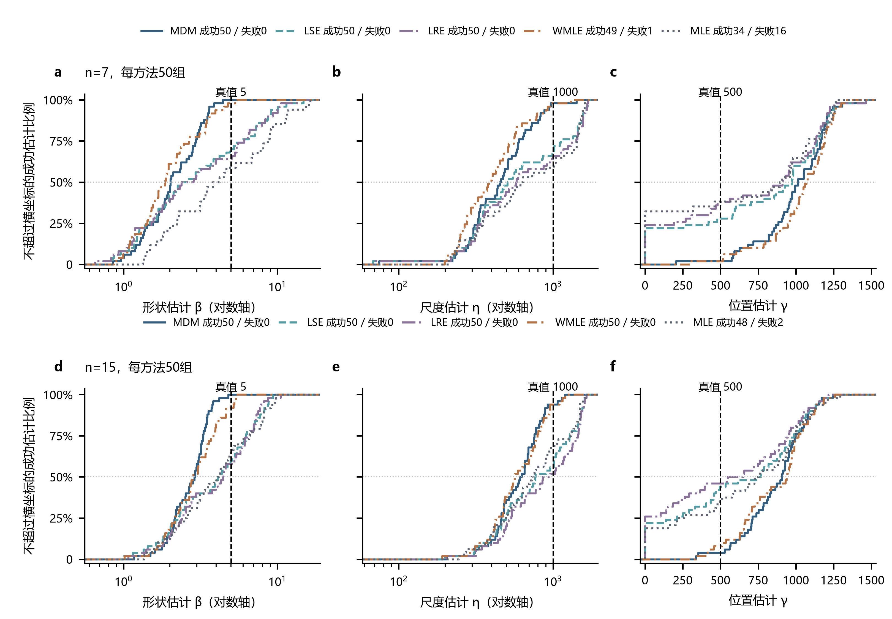
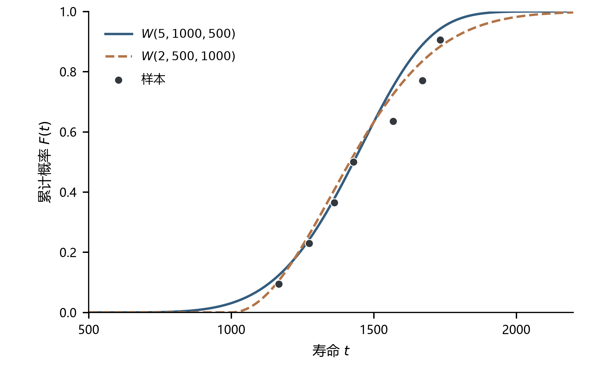
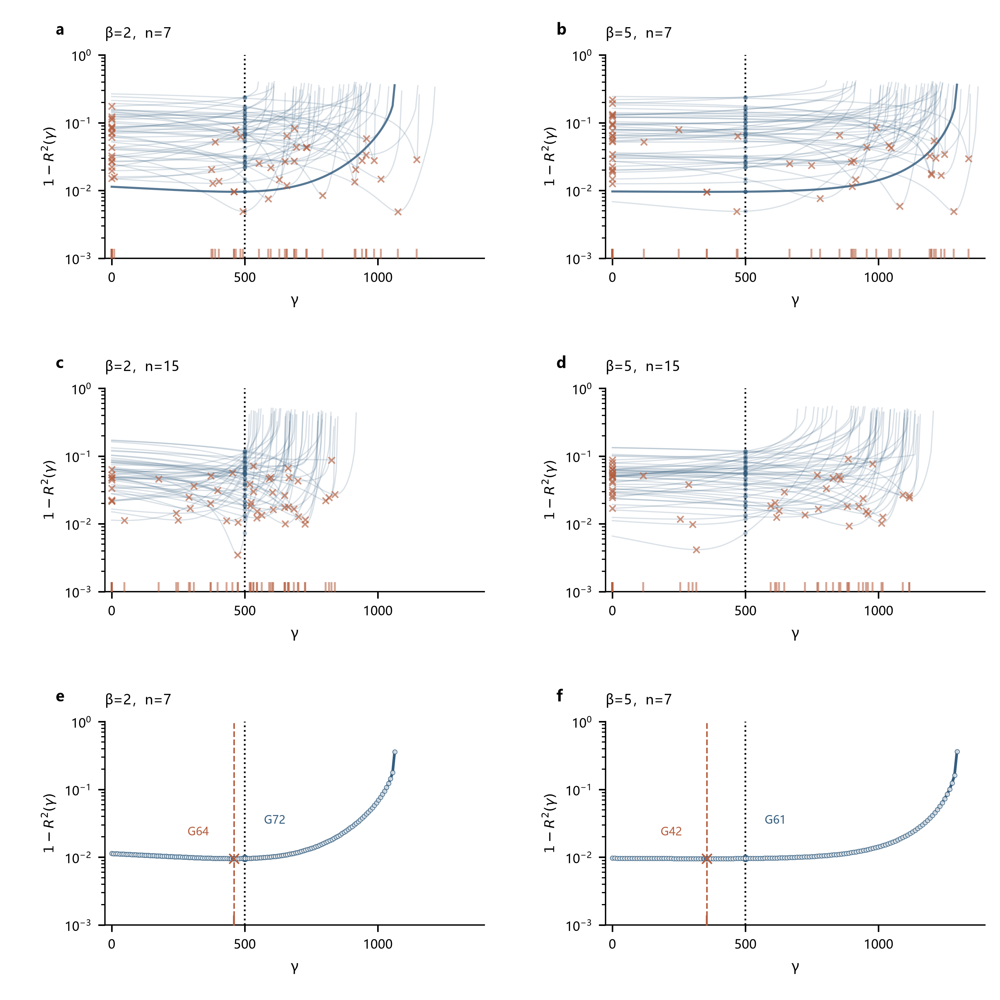
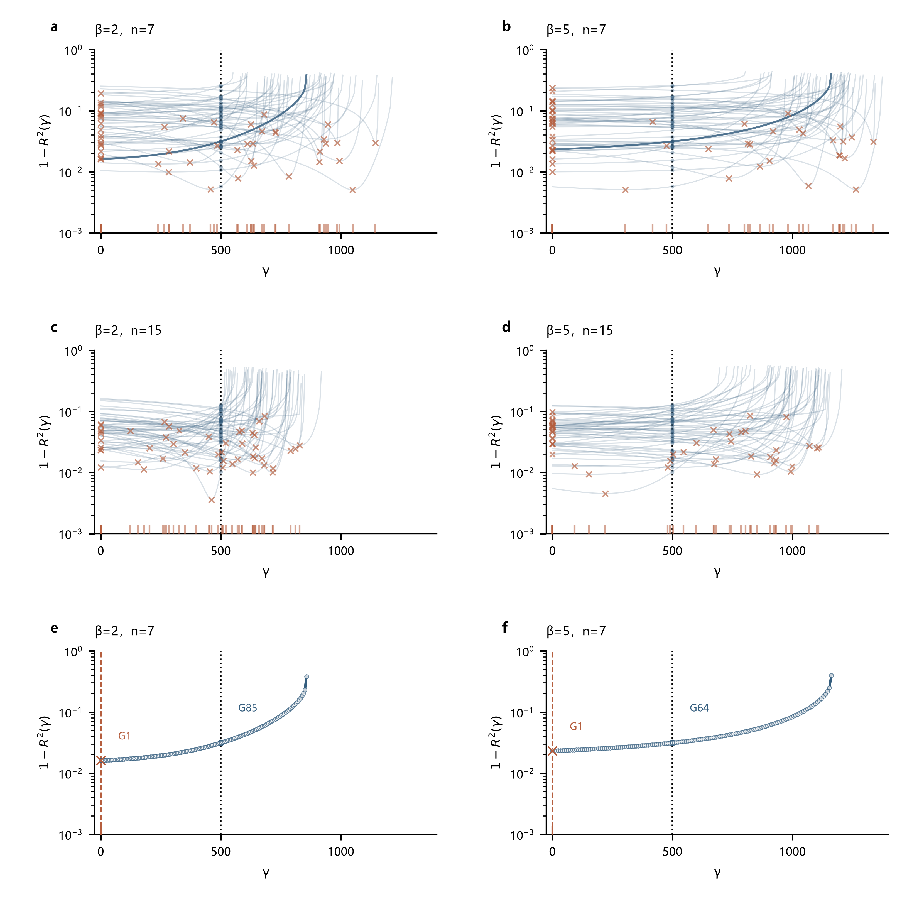
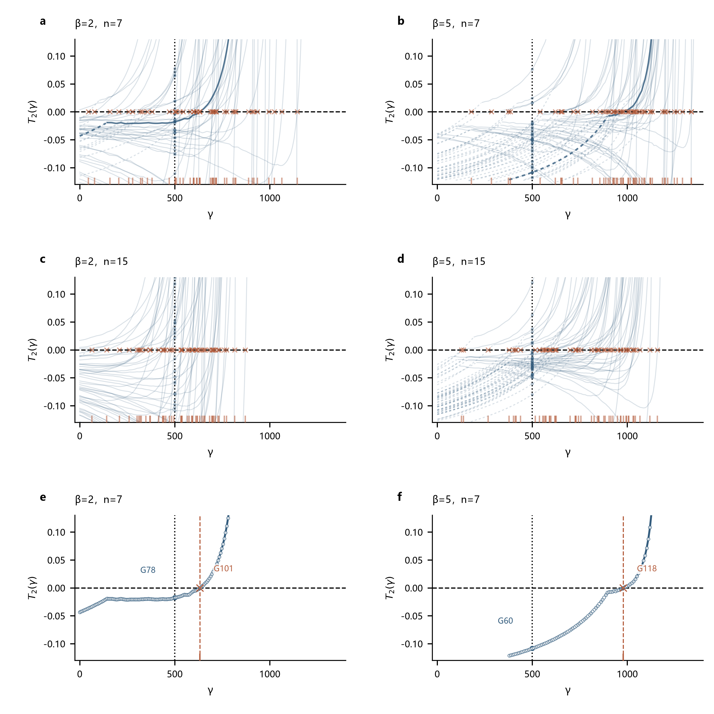
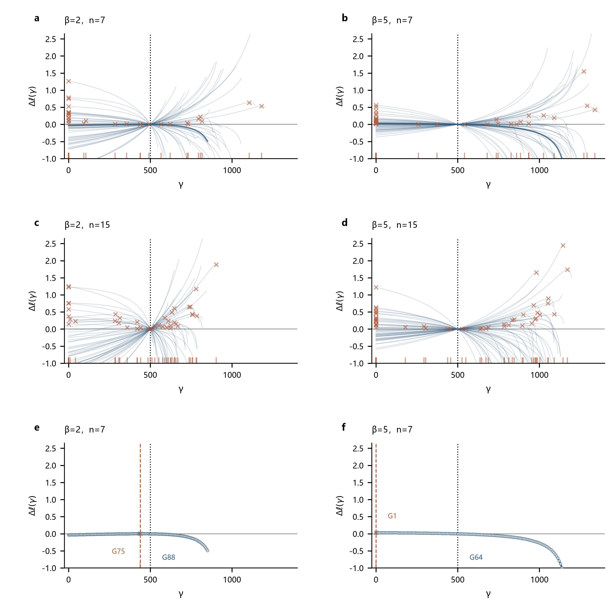

# 高形状参数下的位置高估与尺度补偿

> 研究报告 · 2026-10-02

## 第一章　问题描述

对W(5,1000,500)生成的样本进行估计时，多种方法得到的位置参数接近1000、尺度参数接近500，形状参数也明显偏低。

**图1｜五种方法的参数估计分布。** 可以看出，几种方法总体呈现γ高估、η和β低估的现象。样本量增大后偏移有所减小，MDM和WMLE仍较明显。

## 第二章　机制分析与对照实验

### 2.1 不同参数组合可与同一组样本相容

三参数Weibull分布的分布函数与概率密度为：

$$\begin{aligned}
F(t)&=1-\exp\left[-\left(\frac{t-\gamma}{\eta}\right)^\beta\right],\\
f(t)&=\frac{\beta}{\eta}\left(\frac{t-\gamma}{\eta}\right)^{\beta-1}
\exp\left[-\left(\frac{t-\gamma}{\eta}\right)^\beta\right].
\end{aligned}$$

其中，t为寿命，F(t)为分布函数，f(t)为概率密度，β、η、γ分别为形状、尺度和位置参数；β>0、η>0、t>γ。后文ln表示自然对数。

一组来自W(5,1000,500)的7个观测，经MDM估计得到W(1.95,512,1015)，接近W(2,500,1000)。

**图2｜不同参数组合可以贴近同一组样本。** 在样本覆盖的区间，两条分布曲线较接近，样本点也贴近两条曲线。有限样本对这两套参数的区分不强，因而可能得到γ较大、η和β较小的估计；两种分布的尾部仍有差异。

固定η和γ时，β增大使样本更集中于γ+η附近，最小观测通常离γ更远，对位置参数的约束减弱；具体估到哪里由各方法的准则决定。

为分析位置选择，将排序观测到候选γ的距离写为：

$$d_i=t_i-\gamma,\qquad 0\leq\gamma<t_1.$$

其中，tᵢ为从小到大排序的第i个观测，t₁为最小观测，dᵢ为该观测到候选位置的距离，i=1,…,n，n为样本量。后文求和均遍历这n个观测，帽号表示估计值；β̂(γ)、η̂(γ)表示固定候选γ后的条件估计。

图3–7对比β=2、5和n=7、15，每个条件使用50组样本；同一样本量下两种β共用潜在单位指数样本E。下排两格分别展开上排两条深蓝曲线，用单组样本呈现同一个位置选择过程。

### 2.2 MDM：梯度收缩使阈值交点右移

MDM根据分位关系反算各观测的尺度，以这些伪尺度的离散程度确定形状。采用绘图位置：

$$p_i=\frac{i-0.3}{n+0.4},\qquad u_i=-\ln(1-p_i),\qquad
\eta_i(\beta,\gamma)=d_i u_i^{-1/\beta}.$$

其中，pᵢ为第i个排序观测的累计概率位置，uᵢ为对应的单位指数分位点，ηᵢ为该观测反算的伪尺度。若观测恰好满足给定分位关系，各ηᵢ应相等。固定γ后，以标准差最小确定条件形状：

$$\sigma(\beta,\gamma)=\sqrt{\frac{1}{n-1}\sum_i(\eta_i-\overline\eta)^2},\qquad
\hat\beta(\gamma)=\arg\min_\beta\sigma(\beta,\gamma).$$

其中，η̄为伪尺度均值，σ为伪尺度的样本标准差，arg min表示取使标准差最小的β。

位置选择考察最小标准差随γ变化的梯度。记$\sigma(\gamma)=\sigma(\hat\beta(\gamma),\gamma)$、$w_i=u_i^{-1/\hat\beta(\gamma)}$，其中wᵢ为伪尺度中的距离权重。在平滑的条件极小点，∂σ/∂β=0，链式求导中的形状项消失；由∂ηᵢ/∂γ=−wᵢ，对方差求导得到：

$$g(\gamma)=\frac{d\sigma(\gamma)}{d\gamma}
=-\frac{\operatorname{Cov}(\eta_i,w_i)}{\sigma(\gamma)}.$$

其中，g(γ)为标准差对位置的导数，Cov为按n−1归一的样本协方差，ηᵢ和wᵢ均在条件形状β̂(γ)处计算。图3据此以γ为横轴、g(γ)为纵轴。MDM搜索g(γ)=δ的交点，此处δ=0.10；若g(0)≥δ则取γ=0。位置确定后，以条件形状和伪尺度均值给出β、η估计。

条件β较大时，wᵢ更接近1，改变γ对各伪尺度的作用接近共同平移，而共同平移不改变标准差。由协方差不等式还有：

$$|g(\gamma)|\leq\operatorname{SD}(w_i).$$

其中，SD为按n−1归一的样本标准差。因此，权重差异缩小会压低梯度的变化幅度，使真实γ处的梯度更难达到固定阈值。

**图3｜真实位置处的梯度收缩，阈值交点右移。** 可以看出，β=5时曲线在γ=500处更集中且大多低于0.10，需增大γ才达到阈值；增大样本量后右移减小，但仍然存在。

在样本量7的配对对照中，真实γ处的梯度中位数由0.064降至0.009，位置估计中位数由575升至973；展开单例的交点也由449移至974。第一章原案例的代表样本在γ=500处梯度为−0.011，直到γ≈1015才达到0.10。较高位置正是固定阈值规则的选择结果，随后尺度与形状随之下降。

### 2.3 LSE：变换间距改善使回归最优位置偏移

LSE以顺序统计量的对数期望作为参考，利用以下线性关系估计参数：

$$\ln(t_i-\gamma)=\ln\eta+\frac{\ln E_i}{\beta},\qquad
z_i=\mathbb{E}[\ln E_i].$$

其中，Eᵢ为排序后的第i个单位指数随机变量，与tᵢ对应；𝔼表示数学期望，zᵢ为对数顺序统计量的期望。固定γ后，以带截距的普通最小二乘拟合：

$$y_i(\gamma)=\ln d_i=a+bz_i+r_i,\qquad
\hat\beta(\gamma)=1/b,\qquad \hat\eta(\gamma)=\exp(a).$$

其中，yᵢ为距离的对数，a、b、rᵢ分别为回归截距、斜率和残差。带截距回归的拟合值与残差正交，总变差因而分解为：

$$\underbrace{\sum_i(y_i-\overline y)^2}_{\mathrm{SST}}
=\underbrace{\sum_i r_i^2}_{\mathrm{SSE}}+\sum_i(a+bz_i-\overline y)^2.$$

其中，ȳ为变换观测均值，SST为总平方和，SSE为残差平方和。将残差平方和除以总平方和，得到未被回归解释的变差比例：

$$1-R^2(\gamma)=\frac{\mathrm{SSE}}{\mathrm{SST}}
=1-\operatorname{corr}^2\{z_i,y_i(\gamma)\}.$$

其中，R²为回归决定系数，corr为Pearson相关系数。该方法最大化的White比值可写为：

$$\frac{\mathrm{SST}/(n-1)}{\mathrm{SSE}/(n-2)}
=\frac{n-2}{n-1}\frac{1}{1-R^2(\gamma)}.$$

固定样本量时，最大该比值等价于最小1−R²。因此，图4以γ为横轴、残差比例1−R²为纵轴，最低点对应所选位置。

**图4｜回归最优位置随样本间距改变。** 可以看出，β改变后曲线形态和最低点位置都会变化，但最低点未必向右移动，图中展开样本就出现了左移。

位置调整影响的是变换后的相对间距。由dyᵢ/dγ=−1/dᵢ可见，增大γ时，较小观测的对数距离下降得更快；如果这使随机观测更接近参考直线，回归准则就会选择较高γ。第一章原β=5案例的代表样本中，γ由500移至974时，残差比例由0.0472降至0.0192，较高位置确实改善了线性匹配（补充图6b）。

在真实γ处，配对样本满足yᵢ=ln1000+(lnEᵢ)/β，改变β只会平移、缩放坐标，相关系数不变。因此，高β对位置选择的影响来自离开真实γ后的间距变换；原案例的高估由其回归最低点解释，偏移方向仍取决于具体样本。

### 2.4 LRE：相关性最优位置偏离生成起点

LRE将Weibull分布函数连续取两次对数，得到：

$$\ln[-\ln(1-F(t))]=\beta\ln(t-\gamma)-\beta\ln\eta.$$

以排序观测的绘图位置pᵢ代替未知F(tᵢ)，本批采用前述Bernard绘图位置。记变换坐标：

$$X_i(\gamma)=\ln d_i,\qquad Y_i=\ln[-\ln(1-p_i)].$$

其中，Xᵢ为候选位置下的距离对数，Yᵢ为固定概率位置的双对数变换。对Y与X作带截距的普通最小二乘回归，并与分布线性关系比较，得到：

$$Y_i=a+bX_i(\gamma)+r_i,\qquad
\hat\beta(\gamma)=b,\qquad \hat\eta(\gamma)=\exp(-a/b).$$

其中，a、b、rᵢ为本节回归的截距、斜率和残差。由同样的变差分解，位置判定指标为：

$$1-R^2(\gamma)=\frac{\sum_i r_i^2}{\sum_i(Y_i-\overline Y)^2}
=1-\operatorname{corr}^2\{X_i(\gamma),Y_i\}.$$

其中，Ȳ为Yᵢ的均值，R²为Y对X的回归决定系数。该方法选择R²最大的位置，等价于图5中1−R²的最低点。与LSE相比，其参考坐标与回归方向不同，具体曲线也不同。

**图5｜线性匹配最好的位置未必是真实起点。** 可以看出，回归最低点既可能偏离γ=500，也可能落在γ=0的边界；展开样本的两种β均选择零边界。

增大γ会改变Xᵢ的间距，尤其使较小观测变化更快，Yᵢ则保持不变。第一章原β=5案例的代表样本在γ≈914处，将残差比例从真实位置处的0.0466降至0.0128；较高位置使观测与固定概率坐标匹配得更好（补充图6d），因而被方法选中。

与LSE一样，真实γ处的相关性不随配对样本的β改变，差别出现在离开真实γ之后。图5中的边界结果与原案例中的高估遵循同一选择规则：寻找相关性最高的位置，而这一位置受实际样本间距影响。

### 2.5 WMLE：加权方程在较高位置达到平衡

WMLE从似然估计方程出发，对有限样本偏差作校准。将2.1节的概率密度用于各个独立观测，相乘后取对数，得到：

$$\ell(\beta,\eta,\gamma)=\sum_i\ln f(t_i)
=n\ln\beta-n\beta\ln\eta+(\beta-1)\sum_i\ln d_i
-\eta^{-\beta}\sum_i d_i^\beta.$$

其中，ℓ为样本对数似然。先令尺度导数为0，得到ηᵝ=n⁻¹∑dᵢᵝ，再代入形状和位置导数。除以n后，未校准方程为：

$$\frac{1}{\beta}+\frac{1}{n}\sum_i\ln d_i
-\frac{\sum_i d_i^\beta\ln d_i}{\sum_i d_i^\beta}=0,\qquad
\beta\frac{\sum_i d_i^{\beta-1}}{\sum_i d_i^\beta}
-\frac{\beta-1}{n}\sum_i\frac{1}{d_i}=0.$$

β>1时，将位置方程移项可得：

$$\left(\frac{1}{n}\sum_i\frac{1}{d_i}\right)
\frac{\sum_i d_i^\beta}{\sum_i d_i^{\beta-1}}=\frac{\beta}{\beta-1}.$$

WMLE将形状方程中的系数1和位置方程中的目标值β/(β−1)替换为校准值，形成实际求解的两项残差：

$$T_1(\beta,\gamma)=\frac{J_2(n)}{\beta}+\frac{1}{n}\sum_i\ln d_i
-\frac{\sum_i d_i^\beta\ln d_i}{\sum_i d_i^\beta},$$

$$T_2(\beta,\gamma)=\left(\frac{1}{n}\sum_i\frac{1}{d_i}\right)
\frac{\sum_i d_i^\beta}{\sum_i d_i^{\beta-1}}-J_3(n,\beta).$$

其中，T₁、T₂分别为形状和位置校准方程的残差，J₂、J₃为相应的有限样本校准系数，由该方法的校准表给出；本实现β>5时沿用表端点。尺度随后由ηᵝ=∑dᵢᵝ/[nJ₁(n)]求得，J₁为尺度校准系数。

为得到γ单变量曲线，固定γ先解形状方程，再代入位置方程：

$$T_1(\hat\beta(\gamma),\gamma)=0
\quad\Longrightarrow\quad
T_2(\gamma)=T_2(\hat\beta(\gamma),\gamma).$$

图6以γ为横轴、条件位置残差T₂(γ)为纵轴；零点表示两条加权方程同时满足。实际算法联合求解两项残差，条件曲线用于解释方程的平衡位置；没有条件形状解的区间，曲线没有定义。

**图6｜高β样本的方程平衡位置向右移动。** 可以看出，β=5时更多曲线在真实γ右侧达到零点；样本量增大后，平衡位置更接近真值。

当各dᵢ接近时，位置方程中倒数距离均值与幂和比的乘积接近1。高β使观测更集中，真实位置处这一乘积可能低于校准目标。图6的β=5展开样本中，乘积为1.101，目标为1.210，残差为负；增大γ后，较小距离的倒数变化更快，沿条件分支直到γ≈979才达到零点，而β=2时的零点约为632。

第一章原β=5案例的代表样本也有相同的平衡过程：真实位置处残差为−0.060，在γ≈1070处两条方程同时满足（补充图6f）。较高位置来自当前加权方程的平衡要求；校准项与表端点处理各自造成多少偏移，仍需分别检验。

### 2.6 MLE：微小似然改善对应较大位置变化

MLE以2.5节的对数似然ℓ最大确定参数。固定γ后，先由尺度导数为0消去η，再由形状导数为0求β：

$$\hat\eta(\beta,\gamma)=\left(\frac{1}{n}\sum_i d_i^\beta\right)^{1/\beta},\qquad
\frac{1}{\beta}+\frac{1}{n}\sum_i\ln d_i
-\frac{\sum_i d_i^\beta\ln d_i}{\sum_i d_i^\beta}=0.$$

其中，η̂(β,γ)为固定β、γ后的尺度估计。解形状方程得到β̂(γ)，再代回尺度式，便得到η̂(γ)。将二者代入原似然，得到位置判定曲线：

$$\ell_p(\gamma)=\ell(\hat\beta(\gamma),\hat\eta(\gamma),\gamma),\qquad
\Delta\ell(\gamma)=\ell_p(\gamma)-\ell_p(500).$$

其中，ℓₚ为消去其余参数后的剖面对数似然，Δℓ为相对于真实位置的似然增量；减去固定基准不改变高点位置。图7以γ为横轴、Δℓ为纵轴，展示当前有限条件分支。

在条件β、η处，它们各自的似然导数为0，因此剖面曲线的总导数化为位置偏导数：

$$\ell_p'(\gamma)=\frac{\partial\ell}{\partial\gamma}
=n\hat\beta(\gamma)\frac{\sum_i d_i^{\hat\beta(\gamma)-1}}{\sum_i d_i^{\hat\beta(\gamma)}}
-[\hat\beta(\gamma)-1]\sum_i\frac{1}{d_i}.$$

其中，ℓₚ′为剖面对数似然对位置的导数。有限内部高点对应导数由正转负的零点，γ=0也可能成为约束下的边界解。

**图7｜很小的似然差异可以对应很大的位置变化。** 可以看出，曲线高点随样本改变；展开样本在β=2时选择接近真值的位置，在β=5时选择零边界。

第一章原β=5案例的代表样本中，γ从500移至907，对数似然仅增加0.053，却已足以让方法选择较高位置。真实γ附近的似然较平，β、η的联合调整能维持接近的拟合，因此位置可以有较大变化。这解释了原案例的高估；图7的反向变化则说明，有限似然高点并不必然随β增大而右移。

### 2.7 位置上移为何伴随尺度和形状下降

各方法都以dᵢ=tᵢ−γ估计其余参数。γ增大时，全部距离减小；固定β时，反算的尺度随之下降。允许β调整后，三参数还可以共同维持分布中部的拟合。

由Weibull分位公式：

$$Q(p)=\gamma+\eta[-\ln(1-p)]^{1/\beta},\qquad
Q(1-e^{-1})=\gamma+\eta.$$

其中，Q(p)为累计概率p对应的寿命分位点，0<p<1，e为自然指数的底数，1−e⁻¹≈0.632。γ增大、η减小，只要两者之和接近不变，63.2%分位寿命就仍然接近真值。

形状下降也可参与补偿。将分位公式在63.2%分位附近作一阶展开：

$$z=\ln[-\ln(1-p)],\qquad
Q(p)=\gamma+\eta\exp(z/\beta)
\approx(\gamma+\eta)+\frac{\eta}{\beta}z.$$

其中，z为累计概率的双对数变换，z=0对应63.2%分位，η/β是该处分位曲线关于z的斜率。若同时维持γ+η与η/β，η下降时β也会下降。一个简单的数学例子是W(5,1000,500)与W(2.5,500,1000)：两者的中部分位和局部斜率相同，尾部却不同；上述近似只适用于z/β较小的范围。

第一章原MDM代表样本在固定真实γ时，β≈4.86、η≈1041；位置估为1015后，β≈1.95、η≈512。位置、尺度看似接近互换，实际上是位置准则选到较高γ后，其余参数对距离变化作出的补偿。

**图8｜参数补偿维持中部拟合，却未消除尾部偏差。** 可以看出，实际估计与真分布的中部较接近，但低概率寿命仍有偏差；直接交换尺度与位置得到的分布也不同于实际估计。

该样本的63.2%分位由1500估为1527，只相差27；1%分位由899估为1063，相差165。因此，第一章中γ高估、η和β低估的结果，可以同时具有较好的中部拟合和较大的尾部误差。

## 第三章　结论与研究启示

种子复算、样本支持范围和参数映射核验排除了生成错误。逐法过程分析解释了原β=5案例为何在各自准则下选择较高位置，以及位置改变如何伴随尺度与形状补偿。原批次五法的同向中位数偏移属于已观察的批次现象；共同随机样本的对照进一步识别了随β改变而较稳定的趋势。

不同方法产生高估的机制有所区别。MDM的梯度随条件形状增大而收缩，固定阈值对应更高的位置；WMLE的加权残差在较高位置达到平衡。LSE、LRE的原案例中，位置调整提高了随机间距与参考坐标的线性匹配；MLE的原案例中，有限局部似然在真实位置右侧仍有微小改善。配对对照支持MDM、WMLE较稳定的γ上移与η下降趋势，而LSE、LRE、MLE同时存在反向和零边界结果。

这一现象说明，下尾观测不足时，位置估计对阈值、校准权重、回归准则和似然平坦程度较为敏感。参数补偿又使中部寿命拟合与单参数偏差、尾部分位偏差并存。因此，方法评价需要同时考察参数、目标寿命分位点、失败和边界结果。

后续研究优先检验不同种子下偏移趋势的稳定性，再分别改变MDM阈值、WMLE权重与求解容差，分辨各因素的贡献。进一步可从下尾间距及准则平坦程度中寻找可观测的失稳信号，并同时检验参数误差与目标寿命分位误差；其中WMLE权重与表端点处理的独立作用仍待受控实验确认。

---

**数据与程序。** 原案例、连续条件和样本统计见[完整统计表](20261001-高形状参数补偿报告/结果/高形状参数补偿统计.xlsx)。配对对照包含700组样本、4200条估计；[准则曲线数据](20261001-高形状参数补偿报告/结果/中间数据/逐法过程曲线.json)保存1010条剖面与147550个候选点评价（四个条件共1000条，原批次单例10条）。[小提琴源数据](20261001-高形状参数补偿报告/结果/中间数据/图1小提琴数据与核验.json)、[配对单例与推导核验](20261001-高形状参数补偿报告/结果/中间数据/配对单例与推导核验.json)和[原案例观测与方程网格](20261001-高形状参数补偿报告/结果/中间数据/单组绘图点与方程.json)提供图示数据及来源核验；程序、输入配置和复算入口见[研究目录说明](20261001-高形状参数补偿报告/README.md)。另有1400组样本、7000条独立种子估计单列保存，未纳入上述配对统计。

**补充材料。** [连续β的成功比例](20261001-高形状参数补偿报告/结果/补充图1_估计成功率.png)；[LRE绘图位置版本对照](20261001-高形状参数补偿报告/结果/补充图2_LRE绘图位置对照.png)；[下尾观测与理论概率](20261001-高形状参数补偿报告/结果/补充图3_下尾观测对照.png)；[连续β的估计中位数](20261001-高形状参数补偿报告/结果/补充图4_连续形状对照.png)；[参数补偿与固定位置诊断](20261001-高形状参数补偿报告/结果/补充图5_位置尺度补偿.png)；[原案例回归点与联合方程](20261001-高形状参数补偿报告/结果/补充图6_原案例回归与方程.png)。

补充图1的a、b分别为n=7、15，成功比例以各条件50组为分母，失败保留在分母中。补充图2比较相同样本上的LRE与Park绘图位置实现，实线为成功位置估计中位数，阴影为第25–75百分位，黑虚线为真γ=500。

补充图3a的实线和阴影为50组最小观测的中位数及第25–75百分位，点线为理论期望：

$$\mathbb{E}[t_1]=500+1000\Gamma(1+1/\beta)n^{-1/\beta}.$$

其中，Γ为Gamma函数，t₁为最小观测，$\mathbb{E}[t_1]$为最小观测的理论均值；500、1000分别为本实验的真实位置与尺度。b为全部观测大于1000的理论概率：

$$\Pr(t_1>1000)=\exp[-n(0.5)^\beta].$$

其中，Pr表示事件发生的概率，0.5=(1000−500)/1000为阈值到真实起点的标准化距离。连线连接β=2、2.5、…、5处的计算点。补充图4展示各条件成功估计的中位数，a–c为n=7，d–f为n=15，黑虚线为相应参数真值；颜色对应五种方法。

补充图5a为β=5、n=7的成功估计误差，横纵坐标分别为Δγ=γ̂−500、Δη=η̂−1000，黑虚线为尺度误差与位置误差等量反向的参考关系；b在自由位置与固定真位置均成功的组内比较尺度绝对误差中位数，实心点为自由位置，空心点为固定γ=500。该固定位置对照仅用于识别参数补偿机制。

补充图6a、b为原β=2组#31、β=5组#37的LSE变换点与条件回归，c、d为原β=2组#2、β=5组#11的LRE变换点与条件回归。蓝圆及虚线为γ=500，红方点及实线为返回γ；同号1–7对应同一排序观测，两条直线分别由各自七点拟合，γ=500的直线也属于条件拟合。e、f为两批原WMLE组#18的T₁=0蓝实线与T₂=0绿虚线，红叉为联合返回解，黑菱形为生成真参数，灰横点线为权重表上端β=5；两格分别由40626、40404个网格点评价得到。这些原案例用于解释第一章现象，两批种子不同；它们与图3–7的配对展开例不同，不能作为跨β单例配对推断。
