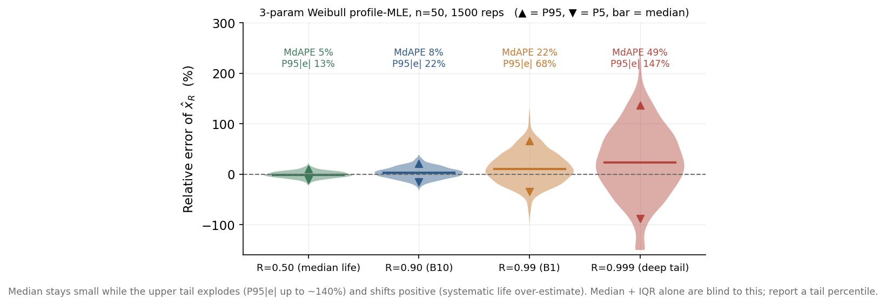

**三参数 Weibull(β, η, γ)参数估计准确性**

**评价指标:统一方案与实证论证**

一个分布 · 三个视角 · 每视角一个主指标 + 少量正交辅助

评价用稳健中位数族,训练用可微平方族,二者同处相对/对数空间

# **摘要**

本报告整合既有方案,给出一套**简单、可用、无争议**的三参数 Weibull 参数估计准确性评价体系。核心主张是:所有点估计指标本质上都在描述**相对误差的分布**;因此每个评价视角只需一个主指标回答“误差有多大”,再配几个互不重叠的辅助指标回答“偏哪边、有多散、尾多深、算不算数”。报告设三个视角——**参数视角、工程应用视角、训练损失**。准确性主指标统一为中位绝对百分比误差(Median Absolute Percentage Error, MdAPE);方向、稳定性、尾部分别用中位带符号误差、区间 [P25,P75]、区间 [P5,P95] 与 P95;并以有效估计率作门槛。训练损失不被视为第四类独立指标,而是“所选视角的准确性指标的可微版本”。所有指标选择都配有可复现的数值测试(含构造反例)加以论证。

# **目录**

# **1  问题分析与总体框架**

## **1.1  评价对象与适用场景**

三参数 Weibull 的可靠度函数为 R(t)=exp(−((t−γ)/η)β),其中 β 为形状、η 为尺度、γ 为位置(最小寿命)。本报告评价的是“把 (β,η,γ) 估得多准”,而非“模型与数据拟合得多好”——只有在真值已知时,这两件事才一致。

**准确性只能在真值已知的场景下度量:** 即蒙特卡洛(Monte Carlo, MC)仿真(从已知 (β,η,γ) 抽样再估计)与深度学习的仿真训练/评测(标签即真值)。在真实工程数据上真值不可得,只能退而评**拟合优度**(柯尔莫哥洛夫–斯米尔诺夫检验(Kolmogorov–Smirnov, K-S)、安德森–达令检验(Anderson–Darling, A-D)、概率图相关系数等),它衡量“像不像 Weibull”,不是“参数准不准”,二者不可混为一谈。

**外部效度警告:** 蒙特卡洛若要为真实场景背书,其先验池(β,η,γ 的范围)、样本量 n、删失比例必须与目标场景一致;否则“仿真里很准”不能推广到“真实数据上很准”。本报告数值示例取 β=2.5、η=1000、γ=100,n∈{20,50,100},**仅用于说明方法**,落地时应替换为你的真实设定。

## **1.2  一个分布,三类指标 + 一道门槛**

对任一被估量 θ(参数或寿命分位),定义其在多次重复下的相对误差 e=(θ̂−θ)/θ。一个好的体系只需回答关于 e 分布的三个正交问题,外加一道 Weibull 特有的门槛:

- **有多大(准确性):**|e| 的典型量级 → 主指标 **MdAPE**。
- **偏哪边(方向):** e 的中心位置 → **中位带符号误差**。
- **有多散(稳定性):** e 的内 50% 离散 → 区间 **[P25, P75]**(即 RelIQR)。
- **多深的尾(尾部风险):** e 的极端分位 → 区间 **[P5, P95] 与 P95**。
- **算不算数(求解率):** 有效估计的比例 → **有效估计率**。

这套划分**简单且不重叠**:每个指标只回答一个问题,合起来覆盖误差分布的全部侧面。报告刻意**不**把它们加权成单一综合分数作为主指标——加权会让分项问题互相掩盖(见附录 A)。

记号约定:相对误差 e = (θ̂ − θ)/θ;Pα(·) 表示第 α 百分位数(percentile),如 P95(|e|) 为 |e| 的第 95 百分位;Q1、Q3 为上、下四分位数。

## **1.3  评价与训练:同一空间,两种形态**

有一个贯穿全报告的关键区分:

- **评价(给人看、要稳健)** 用“中位数 + 绝对值”族:中位数对 Weibull 常见的异常解稳健,绝对值直观。
- **训练(给优化器、要可微且惩罚尾部)** 用“均值 + 平方”族:可微,且平方天然对大误差施加更大梯度。

两者处于**同一相对/对数空间**(都按相对误差度量),只是聚合形态不同。这恰好化解一个隐忧:中位数评价指标“看不见右尾”,而训练用的平方损失对右尾敏感,优化时会自动压低尾部误差——**评价的盲区被训练的形态补上了**。损失因此不是第四类独立指标,而是“所选视角准确性指标的可微版本”(见第 4 节)。

## **1.4  总览(三视角 × 五类指标)**

<table><tr><td>
<strong>视角</strong>
</td><td>
<strong>准确性(主)</strong>
</td><td>
<strong>方向</strong>
</td><td>
<strong>稳定性</strong>
</td><td>
<strong>尾部</strong>
</td><td>
<strong>求解率</strong>
</td></tr><tr><td>
参数视角
</td><td>
MdAPE(β、η;γ 用 /η)
</td><td>
中位带符号误差
</td><td>
[P25,P75] / RelIQR
</td><td>
[P5,P95]、P95
</td><td>
有效估计率
</td></tr><tr><td>
工程应用视角
</td><td>
MdAPE(每个 R 一个)
</td><td>
中位带符号误差
</td><td>
[P25,P75] / RelIQR
</td><td>
[P5,P95]、P95(高 R 尤需)
</td><td>
同左
</td></tr><tr><td>
训练损失
</td><td colspan="5">
非独立指标:按视角用 log-参数 MSE 或 log-分位 MSE;均值+平方,天然惩罚尾部。
</td></tr></table>

(此外全局随附**相对均方根误差(Relative Root Mean Square Error, RRMSE)** 与经典的偏差²–方差–**均方误差(Mean Squared Error, MSE)** 分解作为辅助,便于与文献对话、与估计理论衔接,但不作主指标,理由见 2.6。)

# **2  参数视角指标与验证**

## **2.1  主指标:MdAPE(中位绝对百分比误差)**

**是什么 / 怎么算:** 对 θ∈{β,η},先对每次重复算绝对相对误差,再取这 N 个值的中位数:

MdAPE(θ) = medianj |θ̂j − θ| / θ

对位置参数 γ,因其可能为 0(不能除以自身),改用真尺度 η 归一:

MdAE(γ)/η = medianj |γ̂j − γ| / η

**反映什么:** 至少一半的估计其相对误差不超过 MdAPE——它是“典型一次估计能做到的相对精度”。

**关键提醒:** MdAPE 是“误差的中位数”,不是“中位估计的误差”;必须先逐次算误差、再取中位,两者不同。此外,MdAPE **只有幅度、没有正负**(它取了绝对值);“高估还是低估”由 2.2 的带符号方向指标回答。

**为什么用它、不用别的:**

- **不用平均绝对百分比误差(Mean Absolute Percentage Error, MAPE)/RRMSE(均值族)作主——** 三参数 Weibull 似然在 γ→样本最小值附近可发散,边界解/异常解时有发生,均值族会被放大。**验证(T1b):** 向一个无偏估计注入 2% 离谱解(放大到 3–6 倍),MdAPE 仅从 20.3% 微动到 20.8%,而均值绝对误差从 24.0% 升到 30.5%、RRMSE 从 30.1% 近乎翻倍到 59.1%。中位数对“有效但异常”的解稳健。
- **用相对/对数尺度、不用原尺度——** 见 2.6 与第 4 节的量纲论证(T2)。

<strong>等价替代:</strong>中位 |ln 比| = medianj |ln(θ̂j/θ)| 与 MdAPE 含义几乎一致,但具<strong>乘法对称性</strong>(高估 2 倍与低估到 1/2 同等惩罚),且与推荐的 log-参数损失<strong>严格同一空间</strong>。两者在误差 &lt;20% 时数值几乎相同,可任选其一并全程保持一致;本报告以 MdAPE 为默认表述。

## **2.2  方向:中位带符号相对误差(替代 Mean RelBias)**

**是什么:** 它就是你要的“高估/低估”指标——逐参数相对误差的中位数,**带正负号**:

Medrel(θ) = medianj (θ̂j − θ) / θ      (γ 用 /η);   正值 = 系统高估,负值 = 系统低估

<strong>为什么幅度与方向要各报一个、而不是只用一个带符号的:</strong>因为“准不准”和“偏哪边”是两个正交问题。只看带符号中位,一个高一半、低一半的估计器会显示 ≈0、看似完美,但它每次其实都偏 30%(幅度大、方向中性);反之 MdAPE(纯幅度,取了绝对值)看不出系统性高估还是低估。<strong>二者必须并列:MdAPE 报幅度用于排序,Med</strong>rel 报方向用于判断高估/低估。数值验证见 5.4(S4):β 的 ±10% 偏差给出<strong>完全相同的 |MdAPE|</strong>,却产生方向相反的寿命误差,只有带符号指标能把“抬高寿命=危险”那一侧识别出来。

**为什么改用中位、而非均值:** 原方案用 Mean RelBias(均值),而它最怕的恰恰是主指标想躲开的那几个异常解,与整套中位数思想不一致。改用中位带符号误差后,方向与大小、稳定性**同源同形态**,既稳健又一致。

**为什么方向必须独立于大小:** 验证(T1)构造两个 η 估计器——A 无偏但分散(σ=30%),B 偏低 15% 但集中(σ=10%)。结果 A:RRMSE 30.1%、方向 −0.3%;B:RRMSE 18.0%、方向 −15.0%。若只看混合指标 RRMSE 会判 B 更优,却**完全掩盖 B 系统性低估 15%** 这一在可靠性工程里致命的问题。验证(T6)还表明中位与均值方向可显著不同(n=50 时 η 的中位方向 −7.5%、均值方向 −3.7%),进一步说明稳健方向指标的必要性。见图 1。

**图 1**  为什么大小、方向、稳定性必须分开报告。RRMSE 判 B 优于 A,却藏住了 B 的 −15% 系统性低估。

## **2.3  稳定性:区间 [P25, P75](等价 RelIQR)**

**是什么:** 相对误差分布的内 50% 区间;其相对宽度即相对四分位距(Relative Interquartile Range, RelIQR),其中四分位距(Interquartile Range, IQR)= Q3 − Q1:

[P25(e), P75(e)] ,    e = (θ̂ − θ)/θ ;     RelIQR = (Q3(θ̂) − Q1(θ̂)) / median(θ̂)

**反映什么:** 同一方法在重复实验间的可复现性/抖动幅度,与“准不准”(中心位置)解耦。区间形式比单一数字更直观地给出“中间一半的估计落在哪”。

## **2.4  尾部:区间 [P5, P95] 与 P95(补上中位+IQR 的盲区)**

**动机:** MdAPE 是 P50、[P25,P75] 是中间 50%,两者都“看不见”右尾;而求解率只挡**无效**解(不收敛、边界、发散),挡不住“有效但很烂”的解。一个方法完全可能 100% 有效、中位误差很小,却有可观比例的样本误差很大。

**指标:** 相对误差分布的 **[P5, P95]** 区间 + 上尾幅度 **P95(|e|)**(必要时 P99);其中 [P25,P75] 与 [P5,P95] 即两个嵌套的区间形式辅助,分别刻画“中间一半”与“近尾”。

[P5(e), P95(e)] ;    P95(|e|) = |e| 的第 95 百分位 ;    P99(|e|) = |e| 的第 99 百分位

**验证(T1c):** 构造 80% 集中(σ=5%)、20% 发散(σ=60%)的混合估计器。其 MdAPE=4.3%、RelIQR=8.6%,看上去极好;但 **[P5,P95]=[−41%,+40%]、P95(|e|)=69%**。若只报中位与 IQR,会完全错过“每十次就有一次偏 40% 以上”。这类问题在真实 MLE 中也确实出现(见 3.3,图 2)。

## **2.5  门槛:有效估计率**

**定义:** 有效估计 = 收敛 ∩ 非边界(γ̂ 未贴到样本最小值)∩ 非异常(β̂、η̂ 落在事先约定的合理范围)∩ 数值有限。有效估计率 = 有效次数 / 总次数。判定准则须在实验前固定,且所有准确性/稳定性指标**只在有效集上计算**。

有效估计率  rvalid = (有效次数) / N ,    有效 = 收敛 ∩ 非边界 ∩ 非异常 ∩ 数值有限

**为什么需要它:** 它回答“方法在多大比例情形下能给出可用的解”。验证(T6):真实概率剖面极大似然(profile maximum likelihood estimation, MLE)在 n=20 时有效率 93.8%(存在边界/异常解),n=50、100 时升至 100%。

**明确边界:** 有效估计率与尾部指标分工不同——前者剔除“不算数”的解,后者刻画“算数但很差”的解;二者都需要,缺一不可。

## **2.6  文献陪跑与经典分解(辅助,非主)**

**RRMSE:** RRMSE=√mean((θ̂/θ−1)²) 是 Weibull 文献最常用的精度指标,本报告将其作为**辅助列随附**,以便与既有文献直接对话。**为什么不作主:** 它把偏差与方差混在一个数里(T1 中它判 B 优于 A 即源于此),且作为均值平方统计量对异常解敏感(T1b 中从 30% 跳到 59%)。MdAPE 更稳健、且把大小/方向/散度分开报告,信息更清晰;但保留 RRMSE 陪跑,兼顾稳健性与可比性。

RRMSE(θ) = √( (1/N) Σj (θ̂j/θ − 1)² )

<strong>经典“偏差²–方差–MSE”:</strong>同样作为辅助保留。它在相对/对数空间给出 MSErel=biasrel²+varrel 的标准分解,直通估计理论语言,便于审稿人对照。它本身是混合指标(MSE 即“想避开的混合”),故只作辅助;但其分解视角对解释“误差来自系统偏倚还是随机波动”很有价值。

biasrel = (1/N) Σj ej ;   varrel = (1/N) Σj (ej − biasrel)² ;   MSErel = biasrel² + varrel = (1/N) Σj ej²

# **3  工程应用视角指标与验证**

## **3.1  为什么需要应用视角(参数视角不能替代)**

<strong>更有解释力的说法:</strong>参数视角与应用视角<strong>并不独立</strong>——可靠寿命 xR=γ+η(−ln R)1/β 是 (β,η,γ) 的确定函数,故参数的<strong>联合误差分布完全决定了 x</strong>R 的误差分布。应用视角的价值不在于“另一组独立信息”,而在于:其一,它是“按工程实际使用方式(给定 R 求寿命)做的那个投影”,直接对应决策量;其二,它能反映边际(逐参数)指标<strong>根本看不到的误差相关性</strong>。

<strong>验证(T4):</strong>固定 β̂、η̂ 的边际精度完全相同(RMSEβ≈0.45、RMSEη≈130),仅改变二者误差的相关系数 ρ。x0.99 的 RRMSE 随之为 <strong>14.8%(ρ=−0.8)、21.3%(ρ=0)、26.9%(ρ=+0.8)</strong>。三种情形下逐参数指标一模一样,工程寿命误差却差出近一倍(图 3)。这证明:只报 β、η、γ 各自的精度无法预测寿命估计的好坏,<strong>必须直接在 x</strong>R 上度量。

**图 3**  边际精度完全相同,仅 β、η 误差相关性不同,x\_0.99 的误差却近乎翻倍——应用视角不可省略。

## **3.2  应用视角的指标**

<strong>被估量:</strong>xR=γ+η(−ln R)1/β。对每个目标 R,报告与参数视角<strong>同一套族</strong>:主指标 MdAPE,辅以中位带符号误差、[P25,P75]、[P5,P95] 与 P95。如此两视角共用同一套“读法”,学习成本低、口径一致。

## **3.3  为什么要多个 R,且 R 必须与数据支撑挂钩**

<strong>为什么多个 R(不用单点):</strong>验证(T5)对 (β,η,γ) 各 +10%,看 xR 的相对变化:+10% β 在 R=0.999 处引起 <strong>11.0%</strong> 变化、在 R=0.5 处仅 <strong>1.2%</strong>;+10% η 在 R=0.5 处 <strong>9.0%</strong>、在 R=0.999 处 <strong>3.9%</strong>;+10% γ 在 R=0.999 处 <strong>6.1%</strong>、在 R=0.5 处 <strong>1.0%</strong>。即<strong>不同可靠度由不同参数主导</strong>——只报一个 R 会系统性隐藏方法在其它区段的表现。建议标准化报告 R∈{0.50, 0.90, 0.95, 0.99, 0.999}。

<strong>R 必须与数据支撑挂钩:</strong>验证(T6,真实 MLE)显示,深尾分位的误差主要来自<strong>外推</strong>、而非方法本身。n=50 时 xR 的 MdAPE 从 R=0.5 的 4.4% 单调升到 R=0.999 的 <strong>49.7%</strong>,P95(|e|) 从 12.8% 升到 <strong>144.3%</strong>;即便有效率 100%,深尾依旧极差。从几十个样本去估 99.9% 分位,本就是远超数据范围的外推。因此报 x0.999 这类点要<strong>克制</strong>:不要报样本量根本撑不起的分位(经验规则:目标尾概率 1−R 不应远小于 \~1/n;估 x0.999 通常需数百至上千样本),否则读者会把“外推困难”误读成“方法很差”。图 2 直观展示了这一尾部增长。

**图 2**  真实 profile-MLE(n=50)。中位误差很小而上尾急剧扩大并系统性偏正(高估寿命);中位+IQR 看不见,必须补一个高分位。

## **3.4  方向在应用视角尤为关键**

<strong>验证(T6):</strong>xR 的方向在高 R 处系统性为正且很大——n=50 时 x0.999 的中位方向 <strong>+27.7%</strong>、均值方向 +23.8%。这意味着方法在深尾<strong>系统性高估寿命</strong>,在可靠性设计里是偏危险的方向(高估寿命→低估失效风险)。这再次说明方向指标必须单列,且在工程语境下尤需关注其符号。

## **3.5  可选:命中率(有明确容差时)**

若工程上存在明确的可接受相对误差容差 τ(例如 ±10%),可加报 **命中率 HR(τ) = P(|e| < τ)**,作为应用视角最直观的“通过/不通过”型并列主指标。无明确容差时不必引入,以免人为设定阈值。

HR(τ) = (1/N) Σj 𝟙[ |ej| &lt; τ ]

# **4  训练损失:不是第四个指标,而是视角的可微投影**

## **4.1  框架:损失 = 所选视角准确性指标的“可微 + 均值 + 平方”版本**

你已决定按“参数”还是“工程寿命”衡量准确性;训练损失只需是**同一目标的可微形态**,无需另立标准:

- 评价视角是**参数恢复** → 损失用 **log-参数 MSE**。
- 评价视角是**工程寿命** → 损失用 **log-分位 MSE**。
- 两者都重要 → 二者加权。

与评价的唯一差别是聚合形态:评价用中位+绝对值(稳健、可读),训练用均值+平方(可微、对尾部敏感),**两者同处相对/对数空间**。**可行性结论:** 这个写法不仅可行,而且比“把损失当第四类独立指标”更自洽——它把“训练用什么”直接锚定到“评价关心什么”,并让平方损失的尾部敏感性补上中位评价指标的尾部盲区。

## **4.2  基础损失:log-参数 MSE**

Lparam = (ln β̂ − ln β)² + (ln η̂ − ln η)² + ((γ̂ − γ)/η)²

前两项在对数空间度量 β、η 的相对误差(均值平方形态),第三项以尺度 η 归一处理可能为 0 的 γ,与评价指标的 γ 处理一致。

## **4.3  为什么用它,为什么不用别的**

**不用原尺度 MSE((** β̂−β)²+(η̂−η)²+(γ̂−γ)²):

- **量纲依赖(T2,决定性)——** 同一组各 10% 的相对误差,把 η、γ 的时间单位从“小时”换成“千小时”,原尺度 MSE 中 β 的占比从 **0.0006% 跳到 86.0%**、η 的占比从 99.0% 降到 13.8%;而相对/对数空间恒为约 33/33/33。**一个会随单位改变含义的损失不可接受。**
- **梯度失衡(T7 机制)——** 在 +10% 误差处,原尺度 MSE 对 η 输出的梯度幅度约为对 β 的 **450 倍**(η 主导);log 参数损失把各参数的相对梯度拉平(比值约 0.002,实为按 1/参数 归一,使“相对误差等量齐观”)。
- <strong>诚实更正(T7 实证)——</strong>需澄清:此前文档里那张“log 参数 MSE 给出 0.00% 误差”的对比表,是把真 log 参数直接当理想目标喂进去的<strong>恒等式式 sanity check</strong>——能说明量纲论点,但不能作为损失有效性的实证。为补上真正实证,本报告用同一套特征、同一网络结构、同一初始化、同一优化器即自适应矩估计(Adaptive Moment Estimation, Adam),<strong>只切换损失</strong>,真实训练后在留出集比较:原尺度 MSE 得 {β 9.6%, η 5.7%, γ 4.3%, x0.90 7.0%},log 参数 MSE 得 {β 8.7%, η 7.0%, γ 4.6%, x0.90 6.8%}(均为 MdAPE,图 4)。结论是<strong>权衡而非灾难</strong>:原尺度损失把精度堆在大尺度的 η 上、牺牲 β;log 损失更均衡、在 β 上更好,工程寿命基本打平。在带自适应优化器(Adam 按坐标重标定梯度)的现实训练里,原尺度 MSE 并<strong>不会</strong>让 β“学不出来”——之前文档对其失效程度有所夸大。故选 log 参数 MSE 的真正理由是<strong>量纲不变性 + 与评价指标同空间 + 跨优化器稳健</strong>,而非某种训练崩溃。
- **不用负对数似然(Negative Log-Likelihood, NLL)/对数似然作主——** NLL 适合直接对原始(可含删失)样本建模;但当网络直接输出 (β,η,γ) 或寿命分位、且评价用相对误差时,NLL 与评价目标不在同一度量上,既非必要也不对齐。可在原始/删失样本场景作为补充损失。

NLL = − Σi [ ln β − β ln η + (β−1) ln(ti−γ) − ((ti−γ)/η)β ]

(右删失观测仅保留生存项 ((ti−γ)/η)β,即 −ln S(ti),不计前面的密度项。)

- **不用一致性指数(Concordance Index, C-index)等排序型指标作损失——** 它度量风险排序的一致性,而非参数或寿命的数值准确性,与本任务目标不符。

**图 4**  左:+10% 误差处的梯度幅度,原尺度下 η 压过 β 约 450×,log 参数则均衡。右:真实训练(Adam,收敛)是权衡而非灾难。

## **4.4  进阶损失(可选,按视角加权)**

L = λ·Lparam + (1−λ)·ΣR wR (ln x̂R − ln xR)²

分位项在对数空间度量寿命相对误差,wR 为各可靠度权重(依工程关注点设置),λ∈[0.5, 0.7](默认 0.5)。λ 越小越偏向工程寿命、越大越偏向参数恢复——这正是 4.1“视角切换”在损失里的连续体现。

# **5  补充情景测试(五个独立情景验证)**

本节用五个与第 2–4 节**不重复**的独立情景,进一步检验本套指标的科学性。每个情景给出条件、结果与结论;所有测试固定随机种子、可复现。

## **5.1  情景 S1:中位与 IQR 看不见“有效但很烂”的尾部**

**条件:** 构造两个对 η 的估计器(真值归一)。方法 A 为高斯相对误差;方法 B 为“紧核 + 重尾”混合(88% 窄 + 12% 宽),并调到与 A 的 MdAPE 相等。各 40 万次重复。

**结果:** 二者 MdAPE 均为 **10.1%**、方向均为 0%、RelIQR 均为 20.2%(**三项完全打平**);但 B 的尾部显著更差——P95(|e|) **45.2%** vs A 的 29.4%,P99(|e|) **95.9%** vs 38.6%,[P5,P95] 也更宽。

**结论:** 仅凭主指标、方向、稳定性三者,A 与 B 无法区分;只有尾部区间/分位能正确判出 B 风险更高。这印证尾部辅助(2.4)是**排序的必需项**,而非锦上添花。

**图 5**  S1:A 与 B 在 MdAPE / 方向 / RelIQR 上完全打平(虚线为 P95),只有尾部指标揭示 B 风险远高。

## **5.2  情景 S2:样本量增大时整套指标应单调改善(一致性检验)**

**条件:** 真实概率剖面极大似然(profile maximum likelihood),n=20/40/80/160/320,各 1000 次,观察 η 的整套指标随 n 的行为。

<table><tr><td>
<strong>n</strong>
</td><td>
<strong>有效估计率</strong>
</td><td>
<strong>MdAPE</strong>
</td><td>
<strong>RelIQR</strong>
</td><td>
<strong>P95(|e|)</strong>
</td><td>
<strong>RRMSE(陪跑)</strong>
</td></tr><tr><td>
20
</td><td>
94.1%
</td><td>
24.3%
</td><td>
46.8%
</td><td>
142.8%
</td><td>
57.3%
</td></tr><tr><td>
40
</td><td>
100%
</td><td>
15.2%
</td><td>
28.1%
</td><td>
42.4%
</td><td>
25.8%
</td></tr><tr><td>
80
</td><td>
100%
</td><td>
10.1%
</td><td>
18.9%
</td><td>
27.4%
</td><td>
14.6%
</td></tr><tr><td>
160
</td><td>
100%
</td><td>
6.4%
</td><td>
12.4%
</td><td>
18.6%
</td><td>
9.8%
</td></tr><tr><td>
320
</td><td>
100%
</td><td>
4.0%
</td><td>
8.0%
</td><td>
12.0%
</td><td>
6.1%
</td></tr></table>

**结果与结论:** 随 n 增大,MdAPE、RelIQR、P95(|e|) 全部**单调下降**,有效估计率升到 100%。作为对照,均值族 RRMSE 在小样本被异常解放大(n=20 时 57.3%,是 MdAPE 的 2.4 倍)、更“跳”。一个合格的准确性指标必须满足“数据越多越准”的一致性——本套指标全部通过;且中位族 MdAPE 比 RRMSE 更平滑稳健,再次支持以中位族为主、RRMSE 仅作陪跑。

## **5.3  情景 S3:相同 MdAPE 也可能有不同的工程命中率**

**条件:** 容差 τ=±10%。方法 C 为高斯误差(MdAPE=8%);方法 D 为不同形状的混合,调到 MdAPE 同为 8%。

**结果:** 两者 MdAPE 都是 **8.0%**,但落在 ±10% 容差内的命中率不同——C 为 **60.2%**、D 为 **55.5%**;且 D 的尾部更差(P95 58.5% vs 23.2%)。

**结论:**“典型误差幅度相同”不等于“工程可接受比例相同”。命中率是与 MdAPE **正交**、且决策最直观的一个轴;在有明确容差时把它列为应用视角的并列主指标(3.5)是有依据的。

## **5.4  情景 S4:同样的 |误差|、相反的符号 → 相反方向的寿命误差**

<strong>条件:</strong>仅 β 偏 +10% 与 −10%(η、γ 精确),两者 β 的 <strong>|MdAPE| 同为 10%</strong>。计算其对寿命分位 xR 的影响。

<table><tr><td>
<strong>可靠度 R</strong>
</td><td>
<strong>β 高估 +10% → x_R 误差</strong>
</td><td>
<strong>β 低估 −10% → x_R 误差</strong>
</td></tr><tr><td>
0.50
</td><td>
+1.2%
</td><td>
−1.4%
</td></tr><tr><td>
0.90
</td><td>
+6.8%
</td><td>
−7.6%
</td></tr><tr><td>
0.95
</td><td>
+8.6%
</td><td>
−9.3%
</td></tr><tr><td>
0.99
</td><td>
+11.2%
</td><td>
−11.3%
</td></tr><tr><td>
0.999
</td><td>
+11.0%
</td><td>
−10.2%
</td></tr></table>

**图 6**  S4:β 的 ±10% 偏差给出相同 |MdAPE|,却在各 R 处产生方向相反的寿命误差(红=抬高寿命/危险,绿=保守/安全)。

**结论:** 纯幅度指标(MdAPE)对两者**打同分**,完全无法区分“抬高寿命=危险”与“偏保守=安全”;只有带符号方向指标能识别危险的一侧。这就是逐参数必须**同时报“幅度(MdAPE)+ 方向(带符号中位)”** 的直接数值证据,也正面回答了“为什么 MdAPE 不带正负、为什么不只用一个带符号指标”。

## **5.5  情景 S5:加权综合评分会把“危险方法”排到“安全方法”前面**

**条件:** 方法 X 中心极好(90% 误差很小)但有 10% 灾难性大误差;方法 Y 全程中等但尾部良好。用一个“看似合理”的加权综合分(0.5·MdAPE + 0.3·RelIQR + 0.2·|方向|,**不含尾部**,越小越好)排序。

**结果:** 综合分判 X(**0.042**)优于 Y(0.097);但 X 的尾部是灾难性的——P95(|e|) **53.7%**、P99(|e|) **131.3%**,而 Y 仅 25.5% / 33.5%。

**结论:** 把多个分项加权成一个标量、且不含尾部时,会**系统性地把危险方法排在前面**。这印证本报告“不以综合评分为主指标、而是分项展示并让尾部/求解率把关”的决定(附录 A);也说明尾部分位要取得足够高(对稀有灾难需看 P99)。

# **6  全部测试汇总(条件 / 内容 / 结果 / 结论)**

所有测试均**固定随机种子、可复现**。下表汇总,图 1–4 给出关键图示。

<table><tr><td>
<strong>编号</strong>
</td><td>
<strong>目的</strong>
</td><td>
<strong>条件 / 内容</strong>
</td><td>
<strong>关键结果</strong>
</td><td>
<strong>结论</strong>
</td></tr><tr><td>
<strong>T1</strong>
</td><td>
为何大小/方向/稳定要分开
</td><td>
构造 A(无偏 σ30%)与 B(偏 −15% σ10%)两个 η 估计器,N=4 万
</td><td>
A:RRMSE 30.1%/方向 −0.3%;B:RRMSE 18.0%/方向 −15.0%
</td><td>
混合指标 RRMSE 判 B 更优却藏住致命偏倚 → 必须分项
</td></tr><tr><td>
<strong>T1b</strong>
</td><td>
为何主指标用中位非均值
</td><td>
向 A 注入 2% 离谱解
</td><td>
MdAPE 20.3→20.8%;均值|e| 24→30.5%;RRMSE 30→59%
</td><td>
中位对异常解稳健,均值族不稳健
</td></tr><tr><td>
<strong>T1c</strong>
</td><td>
为何要尾部分位
</td><td>
80% σ5% + 20% σ60% 混合估计器
</td><td>
MdAPE 4.3%/RelIQR 8.6%,但 [P5,P95]=[−41%,+40%]、P95|e| 69%
</td><td>
中位+IQR 看不见右尾 → 必加 [P5,P95]/P95
</td></tr><tr><td>
<strong>T2</strong>
</td><td>
为何相对/对数,不用原尺度
</td><td>
各 10% 相对误差,切换小时↔千小时
</td><td>
β 占比 0.0006%↔86%;相对空间恒 ~33/33/33
</td><td>
原尺度 MSE 随单位改变含义 → 用相对/对数
</td></tr><tr><td>
<strong>T3</strong>
</td><td>
为何 γ 用 /η 归一
</td><td>
γ=100、σ=50
</td><td>
除以 γ:[P5,P95]=[−81%,+82%]、2.1% 堆在 −100%;除以 η:[−8%,+8%]
</td><td>
γ 可能为 0 且相对误差病态 → 用 η 归一
</td></tr><tr><td>
<strong>T4</strong>
</td><td>
为何需要应用视角
</td><td>
固定边际 RMSE,变误差相关 ρ
</td><td>
x_0.99 RRMSE:14.8% / 21.3% / 26.9%(ρ=−0.8/0/+0.8)
</td><td>
逐参数指标相同而寿命误差近翻倍 → 应用视角不可省
</td></tr><tr><td>
<strong>T5</strong>
</td><td>
为何多个 R
</td><td>
(β,η,γ) 各 +10% 看 x_R
</td><td>
+10%β:R0.999→11% vs R0.5→1.2%;+10%η:R0.5→9% vs R0.999→3.9%
</td><td>
不同 R 由不同参数主导 → 需多 R
</td></tr><tr><td>
<strong>T6</strong>
</td><td>
真实 MLE 全貌:尾部+数据支撑+方向
</td><td>
profile-MLE,β2.5/η1000/γ100,n=20/50/100,各 2000 次
</td><td>
n=50:η MdAPE 13.7%、有效率 100%;x_R MdAPE 4.4%→49.7%、P95|e| 13%→144%、高 R 方向 +27.7%
</td><td>
尾部远差于中位且系统高估寿命;深尾是外推 → 克制报高 R
</td></tr><tr><td>
<strong>T7</strong>
</td><td>
损失:为何 log 参数 MSE
</td><td>
同特征/结构/初始化/优化器,仅换损失;另算梯度幅度
</td><td>
梯度 η:β=450(raw) vs 0.002(log);训练 raw{β9.6,η5.7}/log{β8.7,η7.0}
</td><td>
量纲不变+同空间是真正理由;Adam 下 raw 非崩溃而是权衡(纠正旧表)
</td></tr><tr><td>
<strong>S1</strong>
</td><td>
为何尾部能在“打平”时分胜负
</td><td>
A 高斯 vs B 紧核+重尾,调到 MdAPE 相等
</td><td>
MdAPE/方向/RelIQR 全打平;P95|e| 29% vs 45%、P99|e| 39% vs 96%
</td><td>
尾部是排序的必需项,不只是补充
</td></tr><tr><td>
<strong>S2</strong>
</td><td>
整套指标随 n 的一致性
</td><td>
真实 MLE,n=20→320,各 1000 次
</td><td>
MdAPE 24→4%、P95|e| 143→12% 单调降,有效率→100%;RRMSE 小样本被放大
</td><td>
指标通过“越多越准”一致性;MdAPE 比 RRMSE 更平滑
</td></tr><tr><td>
<strong>S3</strong>
</td><td>
相同 MdAPE 也有不同命中率
</td><td>
C 高斯 vs D 混合,调到 MdAPE 相等,τ=10%
</td><td>
MdAPE 同 8%,但命中率 60.2% vs 55.5%、尾部 23% vs 58%
</td><td>
命中率是与 MdAPE 正交的工程轴
</td></tr><tr><td>
<strong>S4</strong>
</td><td>
为何方向必须带符号
</td><td>
β +10% vs −10%,|MdAPE| 同为 10%
</td><td>
x_R 误差全正(+1.2~+11%)vs 全负(−1.4~−11%),幅度同符号反
</td><td>
纯幅度无法分辨危险/保守 → 须报带符号方向
</td></tr><tr><td>
<strong>S5</strong>
</td><td>
为何不用综合评分作主
</td><td>
X(中心好/10% 灾难)vs Y(中等/尾好),加权综合分
</td><td>
综合分判 X 优(0.042&lt;0.097),但 X P95|e| 54%、P99|e| 131%
</td><td>
综合分掩盖尾部风险 → 分项展示,尾部把关
</td></tr></table>

# **7  落地清单(拿来即用)**

**参数视角:** 主 MdAPE(β、η 各一;γ 用 MdAE/η);方向 中位带符号误差;稳定 [P25,P75](RelIQR);尾部 [P5,P95] 与 P95;门槛 有效估计率。

**工程应用视角:** 对 R∈{0.50, 0.90, 0.95, 0.99, 0.999} 各报上述同一套,且只报样本量撑得起的分位;高 R 重点看 P95 与方向(警惕系统高估寿命)。可选:有容差 τ 时加报命中率。

<strong>训练损失:</strong>基础 log-参数 MSE;需兼顾工程寿命时用 λ·Lparam+(1−λ)·Σ wR(ln x̂R−ln xR)²(λ 默认 0.5)。原始/删失样本可加 NLL。

**全局辅助:** 随附 RRMSE 与经典 偏差²–方差–MSE(相对空间),供文献对话与理论对照。

**适用范围:** 以上准确性度量**只在真值已知**(蒙特卡洛 / 仿真训练)时使用,且仿真设定须匹配目标场景;真实数据仅评拟合优度。

# **附录 A  可选脚手架:综合评分与裁决规则(默认不纳入主流程)**

为兼顾“保留原文档中值得参考的设计”,此处保留综合评分与多层裁决规则备查,但**默认不作主指标**,原因有二:其一,它与“简单又好用”的目标相悖;其二,把多个分项加权成一个标量,会让分项问题互相掩盖(T1 已表明混合指标如何藏住系统偏倚)。

如确需单一汇总分用于排序,建议**仅在已通过稳定性/求解率/尾部门槛的方法之间**,用主指标 MdAPE 的简单聚合(如对各参数、各 R 的 MdAPE 取最大或加权平均)进行,且**始终与分项指标并列展示、不替代之**。