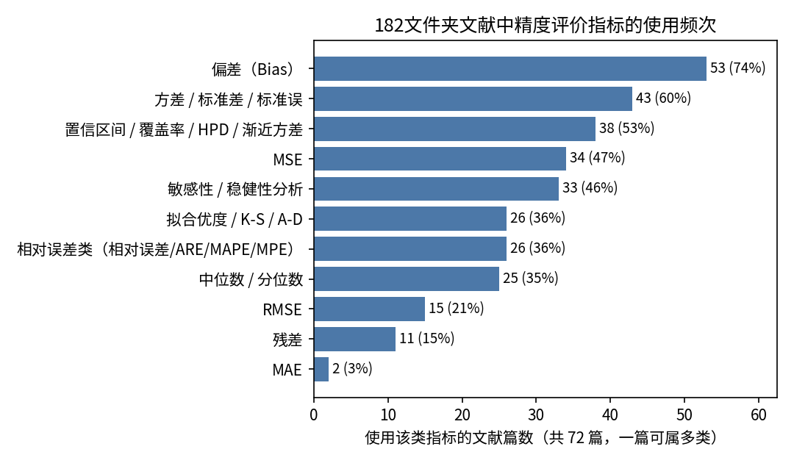
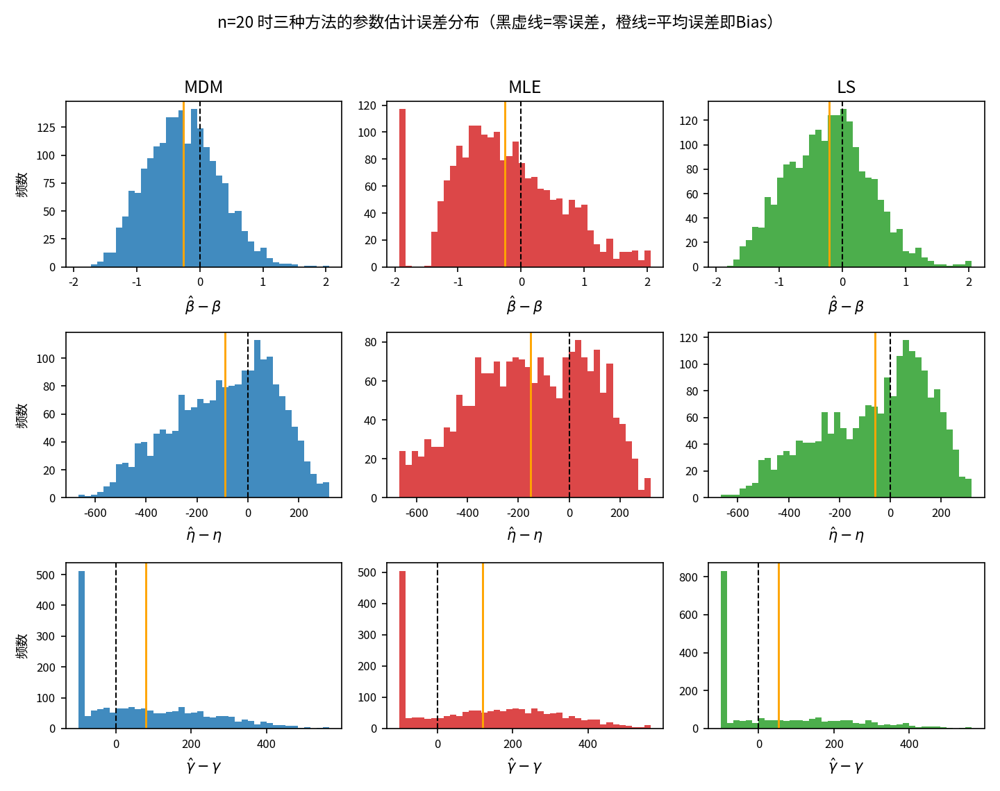
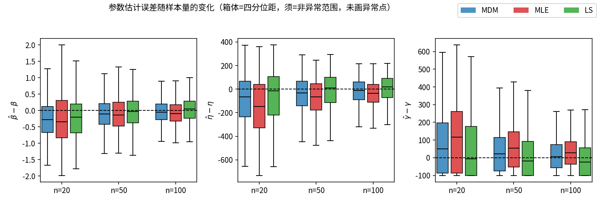
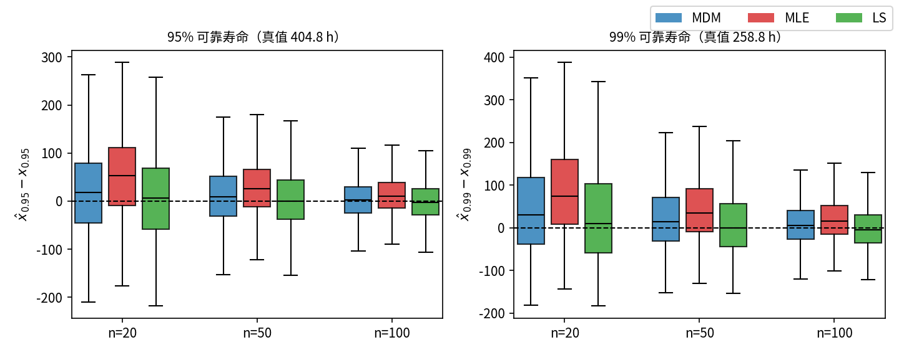
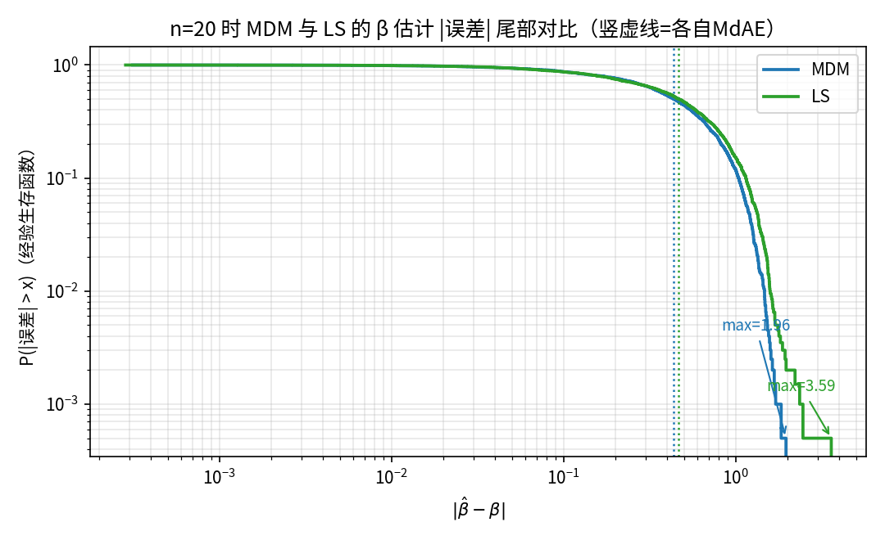
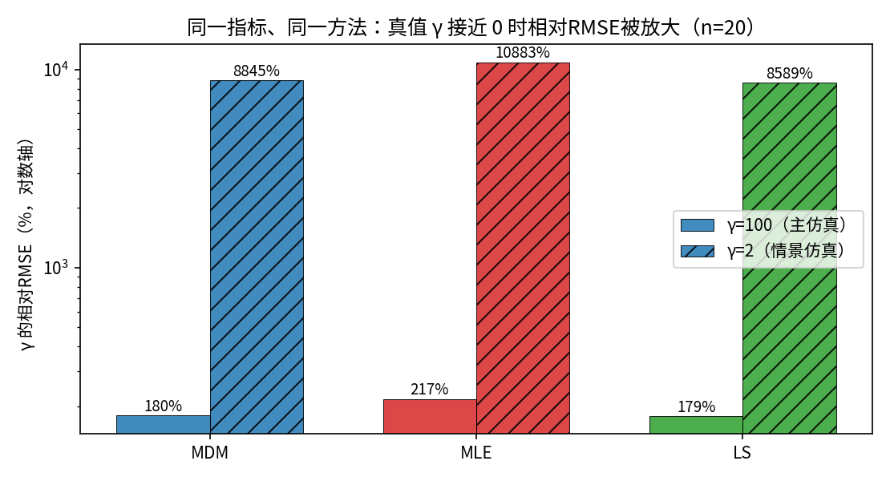
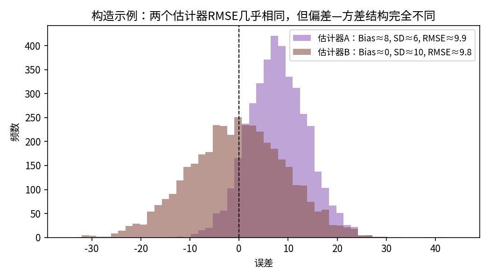

三参数威布尔分布参数估计精度评价指标研究报告（第七轮）

2026年6月12日

目　录

## 摘要

本报告回答一个问题：**用什么指标来评价三参数威布尔分布（形状 β、尺度 η、位置 γ）参数估计的准确性，并给出实用的推荐方案。**

第一，对182文件夹的 72 篇文献进行逐篇调研，统计各类精度评价指标的使用频次：偏差（Bias）、方差/标准差、均方误差（MSE）及其衍生的 RMSE 是文献中点估计精度评价的绝对主流；相对误差类指标常作为无量纲化补充；中位数/分位数类与拟合优度类指标多用于稳健性诊断和分布检验，而非点估计精度的主指标。

第二，依据文献主流指标，对 MDM（最小差异法）、MLE（剖面极大似然）、LS（概率图最小二乘）三种方法做了蒙特卡洛评价（真值 β=2.5、η=1000、γ=100，样本量 n=20/50/100，每组 2000 次重复），从两个相互独立的视角给出完整数字表与误差分布图：**参数视角**（β、η、γ 各自的 Bias、SD、RMSE 等）与**工程应用视角**（95%与99%可靠寿命 x₀.₉₅、x₀.₉₉ 的同套指标）。两个视角的结论并不相同：n=20 时按 β、η 的 RMSE 排序 MDM 最优，而按可靠寿命的偏差与 RMSE 排序 LS 最优，这说明两套评价必须分开、不能混用。

第三，构造并用真实仿真数据演示了五个情景，展示常用指标在什么条件下会失效或误导：RMSE 相同可掩盖完全不同的偏差—方差结构；中位/平均类指标接近时尾部极端误差可相差近一倍；γ 真值接近 0 时相对指标爆炸性失真（相对RMSE可达 8000% 以上而绝对RMSE几乎不变）；参数指标排序与寿命指标排序不一致；不同量纲参数的 MSE 不可直接横比。

最终推荐：**对每个参数与每个寿命分位点，成套报告 Bias、SD（或方差）、RMSE 三个主指标**；β、η 与寿命分位点可补充相对偏差与相对RMSE（百分数），γ 只用绝对尺度指标；MAE 作为对极端值低敏感度的补充；同时附报特殊解发生率（如 γ̂=0 截断比例）作为样本构成说明。该组合全部来自文献标准指标、信息互补、已知缺陷均有对应的使用注意事项。

## 引言：本轮报告的定位与结构

前六轮工作围绕”如何估计”与”如何检验估计好坏”积累了方法实现与验证测试。第七轮按照新的要求收拢为一个目标：**搞清楚评价”估计得准不准”应该用什么指标，并给出推荐方案。**为此本轮做了三件事：

1. **回到文献**：第1节逐类梳理182文件夹文献中实际使用的精度评价指标——是什么、公式怎么写、反映误差的哪个侧面，并统计使用频次。指标全部取自文献，不自创新指标。
2. **用这些指标实测**：第2节（参数视角）与第3节（工程应用视角）分别对 MDM、MLE、LS 三种方法的蒙特卡洛结果按文献标准指标列出完整数字表，并配误差分布图。两个视角各自成套、互不混用。
3. **检验指标本身**：第4节构造五个具体情景（含真实仿真反例），展示个别指标单独使用时会在什么条件下失效或误导；第5节据此给出综合推荐与使用注意。

附录A为182文件夹文献逐篇清单（编号、标题、问题背景、所用精度指标）；附录B为三种估计方法的实现要点，保证全部数字可复现。**本报告所有表格数字与图片均来自真实计算**，蒙特卡洛设定见第2.1节。

## 1 文献中常用的精度评价指标

### 1.1 调研范围与统计口径

本节统计对象为182文件夹文献清单中的 **72 篇**文献（逐篇明细见附录A）。统计口径：凡文献在参数估计或可靠性指标估计的精度评价/方法比较中实际使用了某类指标，即计入该类一次；一篇文献通常同时使用多类指标，因此各类占比之和大于100%。需要说明：本次上传的清单覆盖68篇，另有4篇取自第六轮报告已整理的清单；与182文件夹”约100篇”的总量相比仍有缺口，待原始清单补全后附录A可按同一格式扩充，频次结论预计不会发生方向性变化。

**表1-1 各类精度评价指标在 72 篇文献中的使用频次**

| 指标类别 | 使用篇数 | 占比 |
| --- | --- | --- |
| 偏差（Bias） | 53 | 74% |
| 方差 / 标准差 / 标准误 | 43 | 60% |
| 置信区间 / 覆盖率 / HPD / 渐近方差 | 38 | 53% |
| MSE | 34 | 47% |
| 敏感性 / 稳健性分析 | 33 | 46% |
| 相对误差类（相对误差/ARE/MAPE/MPE） | 26 | 36% |
| 拟合优度 / K-S / A-D | 26 | 36% |
| 中位数 / 分位数 | 25 | 35% |
| RMSE | 15 | 21% |
| 残差 | 11 | 15% |
| MAE | 2 | 3% |

图1 182文件夹文献中精度评价指标的使用频次

频次结构非常清晰：**偏差类（53篇，74%）、方差/标准差类（43篇，60%）与 MSE/RMSE 类（合计去重后约半数文献）构成点估计精度评价的”标准三件套”**；置信区间/覆盖率类使用同样广泛，但它评价的是区间估计而非点估计，本报告聚焦点估计，对其只作定义性说明；相对误差类是在跨参数、跨场景比较时的无量纲化手段；中位数/分位数类、拟合优度类、残差与敏感性分析多承担稳健性诊断、分布检验等辅助角色。

### 1.2 各指标的定义、公式与所反映的误差侧面

以下按”评价点估计精度”的逻辑分组给出文献标准定义。设待估参数真值为 θ，蒙特卡洛第 i 次重复的估计值为 θ̂ᵢ（i=1,…,N），样本均值 $‾=\frac{1}{N}\sum\_{i}^{​}\hat{θ}\_{i}$。

**（1）系统性偏离——偏差类**

$$Bias\left(\hat{θ}\right)=E\left[\hat{θ}\right]−θ≈\frac{1}{N}\sum\_{i=1}^{N}\left(\hat{θ}\_{i}−θ\right)$$

反映估计量**平均而言偏高还是偏低、偏多少**，带符号。Bias=0 称无偏。其无量纲化形式为**相对偏差**（亦称平均相对误差、MPE）：

$$RB=\frac{Bias\left(\hat{θ}\right)}{θ}×100\%$$

**（2）随机波动——方差与标准差**

$$Var\left(\hat{θ}\right)=E\left[\left(\hat{θ}−E\left[\hat{θ}\right]\right)^{2}\right],  SD=\sqrt{Var}$$

反映估计值围绕**其自身均值**的离散程度（与真值无关），即重复抽样下结果的稳定性。SD 与参数同量纲，便于直观解读。

**（3）综合精度——MSE、RMSE、MAE 与相对化形式**

$$MSE=E\left[\left(\hat{θ}−θ\right)^{2}\right]=Bias^{2}+Var,  RMSE=\sqrt{MSE}$$

MSE 把系统偏离与随机波动合并为单一数值，是文献中方法比较最常用的”总分”；RMSE 将其量纲拉回参数本身。无量纲化形式为**相对RMSE**：$RRMSE=RMSE/θ×100\%$。

$$MAE=E |\hat{θ}−θ|≈\frac{1}{N}\sum\_{i=1}^{N}|\hat{θ}\_{i}−θ|$$

MAE 同为综合指标，但对极端误差的惩罚是线性的（MSE 是平方），故对离群估计不如 MSE 敏感——这既是优点（稳健）也是盲区（可能掩盖坏尾部），第4节情景2专门演示。

**（4）稳健诊断——中位数与分位数类**

中位绝对误差 $MdAE=median \left|\hat{θ}\_{i}−θ\right|$、误差的经验分位数（如 P5、P95）等。它们描述误差分布的”典型值”与”范围”，不受个别极端值影响，文献中多用于报告分布形态或做稳健性核查，很少单独作为方法比较的主指标。

**（5）区间估计类——置信区间宽度与覆盖率（本报告不展开）**

覆盖率 = 区间包含真值的比例，配合平均区间宽度使用，评价的是区间估计程序；与点估计精度属不同问题，列于此仅为完整。

**（6）分布层面——拟合优度类（K-S、A-D、R² 等）**

衡量”拟合出的分布与数据是否相符”，回答的是分布假设是否成立，**不直接度量参数误差**：参数有明显偏差时整体分布仍可能拟合得不错（参数间互相补偿），因此不能替代（1）—（3）。

**（7）辅助类——残差分析与敏感性/稳健性分析**

残差用于诊断拟合结构；敏感性分析考察结论对设定（截尾比例、先验、初值等）的依赖，属于评价的稳健性外围。

### 1.3 小结

文献给出的答案相当一致：**评价点估计准不准，以 Bias（偏不偏）、Var/SD（稳不稳）、MSE/RMSE（综合）为主干，必要时配相对化版本做无量纲比较；MAE 与中位数/分位数类做补充诊断。**本报告第2、3节即按这套文献标准指标对三种方法实测打分，不引入任何自创指标。

## 2 参数视角：β、η、γ 的估计精度评价

### 2.1 蒙特卡洛设定

* 真值：β=2.5，η=1000 h，γ=100 h（与第六轮一致，便于对照）。
* 样本量：n=20、50、100，覆盖小、中、较大样本三档。
* 重复次数：每组 N=2000 次独立抽样；三种方法在**同一批样本**上估计，保证可比。
* 方法：MDM（最小差异法，按《MDM方法计算说明》的工程求解器实现，offset=0.1）、MLE（γ 剖面极大似然，优先取内部局部极大）、LS（威布尔概率图最小二乘，γ 取使概率图线性相关系数最大者）。三种方法的可行域统一为 0 ≤ γ̂ < t₍₁₎。实现要点见附录B。
* 评价量：本节为 β̂、η̂、γ̂；第3节为由 (β̂,η̂,γ̂) 换算的可靠寿命 x̂₀.₉₅、x̂₀.₉₉。
* 指标：第1节文献标准指标——Bias、相对偏差、SD、RMSE、相对RMSE、MAE；表中略去 Var 与 MSE（恒等于 SD² 与 RMSE²，不另占列）。

### 2.2 误差分布的直观形态

图2 n=20 时三种方法的参数估计误差分布（黑虚线=零误差，橙线=平均误差即 Bias）

图2（n=20）给出三个参数的误差直方图，三个突出特征直接决定了后面指标数字的解读方式：

1. **β 行**：三种方法都左偏（低估倾向）。MDM 最集中；LS 略宽；MLE 最宽，且在最左端 β̂−β≈−2 处有一个孤立竖条——这是似然在 γ→t₍₁₎、β<1 方向退化产生的”边界退化解”（n=20 时占 5.9%，见表2-4），β̂ 被压到 0.5—0.7 一带。
2. **η 行**：整体向左拖尾（低估），MLE 左移最明显（Bias=-152 h）。
3. **γ 行**：呈**“零点堆积 + 宽幅右散”的双峰形态**——左端在 γ̂=0 处有点质量（误差恰为 −100 h），右侧一直散布到接近各样本的 t₍₁₎。这意味着对 γ 而言，任何单一”典型误差”数字都不足以概括分布，必须配合分布图阅读；这也是第4节情景2、情景3 反复出现的主角。

图3 参数估计误差随样本量的变化（箱体=四分位距，须=非异常范围，未画异常点）

图3 显示随 n 增大三种方法的误差分布同步收窄并向零靠拢：n 从 20 增到 100 时，β 的 RMSE 由 0.62—0.89 降到 0.34—0.36，γ 的 RMSE 由 178—217 h 降到 86—92 h。方法间差距也随 n 收敛：n=100 时三法 β 的 RMSE 仅差约 4%。

### 2.3 指标数字表

**表2-1 形状参数 β 的估计精度（真值 2.5）**

| n | 方法 | Bias | 相对偏差/% | SD | RMSE | 相对RMSE/% | MAE |
| --- | --- | --- | --- | --- | --- | --- | --- |
| 20 | MDM | -0.260 | -10.4 | 0.566 | 0.622 | 24.9 | 0.506 |
| 20 | MLE | -0.253 | -10.1 | 0.853 | 0.889 | 35.6 | 0.728 |
| 20 | LS | -0.212 | -8.5 | 0.651 | 0.685 | 27.4 | 0.546 |
| 50 | MDM | -0.107 | -4.3 | 0.444 | 0.457 | 18.3 | 0.370 |
| 50 | MLE | -0.110 | -4.4 | 0.502 | 0.514 | 20.6 | 0.424 |
| 50 | LS | -0.046 | -1.9 | 0.480 | 0.482 | 19.3 | 0.388 |
| 100 | MDM | -0.045 | -1.8 | 0.340 | 0.343 | 13.7 | 0.278 |
| 100 | MLE | -0.063 | -2.5 | 0.349 | 0.354 | 14.2 | 0.291 |
| 100 | LS | 0.021 | 0.9 | 0.358 | 0.358 | 14.3 | 0.294 |

**表2-2 尺度参数 η 的估计精度（真值 1000 h）**

| n | 方法 | Bias | 相对偏差/% | SD | RMSE | 相对RMSE/% | MAE |
| --- | --- | --- | --- | --- | --- | --- | --- |
| 20 | MDM | -89.4 | -8.9 | 199.4 | 218.5 | 21.8 | 172.6 |
| 20 | MLE | -151.6 | -15.2 | 232.9 | 277.9 | 27.8 | 223.5 |
| 20 | LS | -60.1 | -6.0 | 213.1 | 221.4 | 22.1 | 176.3 |
| 50 | MDM | -40.5 | -4.1 | 138.8 | 144.5 | 14.5 | 116.3 |
| 50 | MLE | -70.7 | -7.1 | 147.9 | 163.9 | 16.4 | 132.7 |
| 50 | LS | -14.3 | -1.4 | 144.8 | 145.5 | 14.5 | 118.8 |
| 100 | MDM | -17.2 | -1.7 | 102.7 | 104.1 | 10.4 | 84.8 |
| 100 | MLE | -36.8 | -3.7 | 105.3 | 111.5 | 11.1 | 90.4 |
| 100 | LS | 5.8 | 0.6 | 106.3 | 106.5 | 10.6 | 89.2 |

**表2-3 位置参数 γ 的估计精度（真值 100 h）**

| n | 方法 | Bias | 相对偏差/% | SD | RMSE | 相对RMSE/% | MAE |
| --- | --- | --- | --- | --- | --- | --- | --- |
| 20 | MDM | 78.9 | 78.9 | 162.0 | 180.2 | 180.2 | 141.0 |
| 20 | MLE | 120.0 | 120.0 | 181.3 | 217.4 | 217.4 | 177.3 |
| 20 | LS | 52.0 | 52.0 | 170.8 | 178.6 | 178.6 | 142.3 |
| 50 | MDM | 35.9 | 35.9 | 115.3 | 120.7 | 120.7 | 97.0 |
| 50 | MLE | 60.5 | 60.5 | 123.2 | 137.2 | 137.2 | 111.6 |
| 50 | LS | 12.3 | 12.3 | 119.8 | 120.4 | 120.4 | 99.8 |
| 100 | MDM | 13.8 | 13.8 | 84.4 | 85.5 | 85.5 | 70.2 |
| 100 | MLE | 30.7 | 30.7 | 86.4 | 91.7 | 91.7 | 74.5 |
| 100 | LS | -7.2 | -7.2 | 87.3 | 87.6 | 87.6 | 75.0 |

注：各表中 Var=SD²、MSE=RMSE²，未单列；MAE 同为综合指标，用于与 RMSE 互相印证（两者差距大即提示存在重尾，见第4节情景2）。

**表2-4 特殊解发生率（占 2000 次重复的比例，%）**

| n | MDM：γ̂=0（offset-root 截断） | MLE：γ̂=0（剖面峰在 0） | MLE：无内部极大（边界退化解） | MLE：取内部解但边界似然更高 | LS：γ̂≈0（相关系数峰在 0 端） |
| --- | --- | --- | --- | --- | --- |
| 20 | 23.2 | 23.8 | 5.9 | 23.9 | 40.2 |
| 50 | 19.0 | 17.5 | 0.0 | 0.0 | 34.7 |
| 100 | 12.1 | 10.3 | 0.0 | 0.0 | 26.1 |

表2-4 不是新指标，而是**样本构成说明**：上述比例全部计入了表2-1～2-3 的指标（未剔除任何”失败”样本）。γ̂=0 类解来自 γ≥0 物理约束下的合法截断；MLE 的边界退化解是三参数威布尔似然无界的已知病态，n=20 时占 5.9%，n≥50 后消失。报告这些比例可以避免”剔除规则变成隐形指标”的问题。

### 2.4 参数视角的读表结论

1. **三个参数的可估性差别悬殊。** n=20 时相对RMSE：β 为 25%—36%，η 为 22%—28%，而 γ 高达 179%—217%——γ 是三参数威布尔中最难估的参数，单看 γ 在小样本下几乎”估不准”。
2. **系统性补偿结构。** 三法在 n=20 时 γ 一致正偏（+52～+120 h）、η 与 β 一致负偏：γ̂ 偏大挤占了寿命起点，η̂、β̂ 相应缩小补偿。γ̂ 与 η̂ 的样本相关系数约 -0.88（MDM，n=20），强负相关。这一结构是第3节”参数不准但寿命可以准”的根源。
3. **方法排序（按 RMSE）。** β：MDM < LS < MLE（n=20 时 0.62 < 0.68 < 0.89），MDM 对 β 的优势最明显；η：MDM ≈ LS < MLE；γ：LS ≈ MDM < MLE。按 Bias 排序则 LS 在三个参数上几乎全面最小。MLE 在 n=20 受边界退化解与峰宽拖累整体垫底，n=100 时已与另两法基本持平（β 的 RMSE：0.343 / 0.354 / 0.358）。
4. **收敛性。** n 翻五倍（20→100）时三法 β、η、γ 的 RMSE 大致减半，符合 1/√n 量级的常规收敛；无任何方法出现不收敛迹象。

## 3 工程应用视角：95%与99%可靠寿命的估计精度

### 3.1 为什么要单独评价

工程上关心的常常不是参数本身，而是**高可靠度下的寿命**：可靠度为 R 的可靠寿命（即失效概率 1−R 的寿命分位点）

$$x\_{R}=γ+η \left(−lnR\right)^{1/β}$$

本节取 R=0.95 与 R=0.99（对应 5% 与 1% 失效分位），真值分别为 x₀.₉₅=404.8 h、x₀.₉₉=258.8 h。x\_R 是三个参数的非线性组合：参数各自准不代表 x\_R 准，参数各自不准也不代表 x\_R 不准（第2.4节的补偿结构会在组合中部分抵消）。因此应用视角必须用\*\*同一套文献标准指标对 x̂\_R 单独评价\*\*，与参数视角并列、互不替代。评价方式：每次重复中将 (β̂,η̂,γ̂) 代入上式得 x̂\_R，再对 2000 个 x̂\_R 计算 Bias、SD、RMSE 等。

### 3.2 误差分布

图4 95%与99%可靠寿命估计误差随样本量的变化

与 γ 的双峰散布（图2第三行）形成鲜明对照：x̂\_R 的误差分布是**单峰、近似连续**的，仅带右偏尾（来自 γ̂ 偏大与 β̂ 偏小的少数样本）。参数层面剧烈的补偿在分位点组合中大部分抵消，这正是”参数视角”与”应用视角”结论可以不同的机制。

### 3.3 指标数字表

**表3-1 95%可靠寿命 x₀.₉₅ 的估计精度（真值 404.8 h）**

| n | 方法 | Bias | 相对偏差/% | SD | RMSE | 相对RMSE/% | MAE |
| --- | --- | --- | --- | --- | --- | --- | --- |
| 20 | MDM | 22.4 | 5.5 | 93.5 | 96.1 | 23.7 | 75.7 |
| 20 | MLE | 55.5 | 13.7 | 89.8 | 105.5 | 26.1 | 82.4 |
| 20 | LS | 11.4 | 2.8 | 94.6 | 95.3 | 23.5 | 75.3 |
| 50 | MDM | 11.3 | 2.8 | 58.9 | 60.0 | 14.8 | 48.0 |
| 50 | MLE | 27.9 | 6.9 | 57.0 | 63.5 | 15.7 | 50.1 |
| 50 | LS | 4.3 | 1.1 | 59.2 | 59.3 | 14.7 | 47.7 |
| 100 | MDM | 3.5 | 0.9 | 40.3 | 40.4 | 10.0 | 32.0 |
| 100 | MLE | 12.4 | 3.1 | 39.1 | 41.0 | 10.1 | 32.3 |
| 100 | LS | -0.9 | -0.2 | 40.1 | 40.1 | 9.9 | 32.0 |

**表3-2 99%可靠寿命 x₀.₉₉ 的估计精度（真值 258.8 h）**

| n | 方法 | Bias | 相对偏差/% | SD | RMSE | 相对RMSE/% | MAE |
| --- | --- | --- | --- | --- | --- | --- | --- |
| 20 | MDM | 46.7 | 18.0 | 113.8 | 122.9 | 47.5 | 94.0 |
| 20 | MLE | 90.5 | 35.0 | 110.8 | 143.0 | 55.2 | 109.8 |
| 20 | LS | 31.1 | 12.0 | 116.9 | 120.9 | 46.7 | 93.1 |
| 50 | MDM | 22.7 | 8.8 | 72.2 | 75.6 | 29.2 | 59.2 |
| 50 | MLE | 44.1 | 17.0 | 71.4 | 83.9 | 32.4 | 64.2 |
| 50 | LS | 10.5 | 4.1 | 73.1 | 73.8 | 28.5 | 58.2 |
| 100 | MDM | 8.7 | 3.4 | 48.7 | 49.4 | 19.1 | 38.9 |
| 100 | MLE | 21.0 | 8.1 | 48.0 | 52.4 | 20.2 | 40.5 |
| 100 | LS | -0.7 | -0.3 | 48.7 | 48.7 | 18.8 | 39.0 |

### 3.4 应用视角的读表结论

1. **可靠寿命比 γ 好估得多。** n=20 时 x₀.₉₅ 的相对RMSE 为 24%—26%，x₀.₉₉ 为 47%—55%，远低于 γ 的约 180%—217%；n=100 时 x₀.₉₉ 相对RMSE 已降到约 19%。
2. **方法排序与参数视角不同。** 按 x₀.₉₅、x₀.₉₉ 的 RMSE：LS ≲ MDM < MLE；按 Bias：LS 明显最小（n=20 时 x₀.₉₅ 偏差 11.4 h，对比 MDM 22.4 h、MLE 55.5 h）。第2节按 β、η 的 RMSE 排序则是 MDM 领先——哪个方法”最好”取决于站在哪个视角，详见第4节情景4。
3. **三法的寿命估计一致正偏**（x̂\_R 平均偏大），且 R 越高偏得越多（x₀.₉₉ 的偏差大于 x₀.₉₅）。对以”保守”为先的可靠性论证，正偏意味着**高估可靠寿命、偏不安全**，工程使用时应当关注 Bias 的符号而不只看综合分。
4. **收敛性良好。** n 20→100，x₀.₉₉ 的 RMSE 由 121—143 h 降至 49—52 h，同样符合 1/√n 量级。

## 4 情景分析：常用指标何时失效或误导

本节用五个具体情景说明：第1节那些”标准指标”没有一个可以**单独**使用。每个情景都给出构造条件、计算结果与结论。情景2—5全部使用第2、3节的真实仿真数据；情景1为受控构造示例（图中数据为模拟生成，目的是让两个估计器的 RMSE 精确打平）。

### 4.1 情景1：RMSE 完全相同，偏差—方差结构完全不同

**条件（构造）：** 估计器A：Bias=8、SD=6；估计器B：Bias=0、SD=10。由 MSE=Bias²+Var，两者 RMSE 同为 $\sqrt{8^{2}+6^{2}}=\sqrt{0^{2}+10^{2}}=10$。

**结果：** 图7 中两个误差分布形态截然不同——A 的误差几乎总是正的（系统性高估但稳定），B 无系统偏向但散布更宽。若评价表只列 RMSE 一列，两者并列第一，差异被完全抹平。

图7 构造示例：两个估计器 RMSE 几乎相同，但偏差—方差结构完全不同

**真实数据回声：** 第3节 n=20 的 x₀.₉₉ 中，MLE 的 RMSE（143 h）里偏差平方占 40%，而 LS 的 RMSE（121 h）里偏差平方只占 7%——同样量级的”总分”背后，一个主要输在系统性高估、一个主要输在波动。对”宁可保守不可冒进”的寿命论证，二者工程含义完全不同。

**说明的问题：** RMSE（或 MSE）是合成分，**必须与 Bias、SD 成套报告**，否则无法区分”偏而稳”与”不偏但散”，也无法判断误差方向是否偏不安全。

### 4.2 情景2：中位/平均类指标接近，尾部极端误差相差近一倍

**条件（真实数据）：** β、n=20，比较 MDM 与 LS。

**结果：**

| 指标 | MDM | LS | LS 相对 MDM |
| --- | --- | --- | --- |
| MdAE | 0.437 | 0.467 | +7% |
| MAE | 0.506 | 0.546 | +8% |
| RMSE | 0.622 | 0.685 | +10% |
| |误差| 的 P99 | 1.469 | 1.582 | +8% |
| |误差| 的 P99.9 | 1.708 | 2.354 | +38% |
| 最大 |误差| | 1.96 | 3.59 | +83% |
| |误差|>1.5 的次数（/2000） | 13 | 43 | ×3.3 |

按 MdAE、MAE 看两法相差不到 8%，可判为”同档”；连 |误差| 的 P99 也只差 8%。但再往尾部深处走，差距迅速拉开：P99.9 相差 38%，最大误差相差 83%（1.96 对 3.59），|误差| 超过 1.5 的发生次数 LS 是 MDM 的 3.3 倍（43 对 13）。图5 的经验生存曲线显示两条曲线在中位附近（虚线）几乎重合，进入尾部后逐渐分离。

图5 n=20 时 MDM 与 LS 的 β 估计 |误差| 尾部对比

**附带一个更隐蔽的版本：** 同一仿真中 γ 的 MdAE，MDM 与 LS 都恰好等于 100.000 h——这不是巧合的”打平”，而是两法都有相当比例 γ̂=0 截断解（表2-4），|误差| 在 100 h 处形成点质量，中位数正好落在点上。一个完全由截断伪影决定的指标值，既不能代表左侧的截断簇也不能代表右侧的散布簇（图2第三行的双峰）。

**说明的问题：** 中位/平均类指标对尾部钝感，在双峰或含点质量的误差分布上还可能给出”伪精确”的典型值。**MAE 与 RMSE 应当对照阅读（两者拉开即提示重尾），结论性比较前先看一眼误差分布图。**第六轮曾以中位数族指标为主干，本轮据此调整为文献标准的均值类指标为主、中位类降为诊断辅助。

### 4.3 情景3：真值接近 0 时，相对指标爆炸性失真

**条件（真实数据）：** 将位置参数真值从 γ=100 改为 γ=2（其余设定不变，n=20，N=2000），模拟”寿命起点几乎为零”的常见物理情形。

**结果：**

| 指标 | MDM | MLE | LS |
| --- | --- | --- | --- |
| γ 的绝对RMSE（γ=100）/h | 180 | 217 | 179 |
| γ 的绝对RMSE（γ=2）/h | 177 | 218 | 172 |
| γ 的相对RMSE（γ=100） | 180% | 217% | 179% |
| γ 的相对RMSE（γ=2） | 8845% | 10883% | 8589% |

绝对RMSE 几乎不变（估计难度本质未变），相对RMSE 却从约 180%—217% 暴涨到 8600%—10900%（图6，对数轴）——分母 γ→0 造成的纯算术放大，并不反映任何真实的精度恶化。作为对照，同一情景下 x₀.₉₉（真值 160.8 h，远离 0）的相对RMSE 为 76%—92%，仍是有意义的数字。

图6 同一指标、同一方法：真值 γ 接近 0 时相对RMSE被放大

**说明的问题：** 相对偏差、相对RMSE、MAPE 等所有以真值为分母的指标，**在真值可能接近 0 的量上（典型即 γ）不可用**；对远离 0 的量（β、η、x\_R）才安全。本报告因此规定：γ 一律用绝对尺度指标。

### 4.4 情景4：按参数指标选方法 ≠ 按寿命指标选方法

**条件（真实数据）：** n=20 主仿真，分别按”参数视角”与”应用视角”的 RMSE/Bias 给三种方法排序。

**结果：**

| 排序依据 | 第1名 | 第2名 | 第3名 |
| --- | --- | --- | --- |
| β 的 RMSE（0.62 / 0.68 / 0.89） | **MDM** | LS | MLE |
| η 的 RMSE（218 / 221 / 278 h） | **MDM** | LS | MLE |
| x₀.₉₅ 的 RMSE（95 / 96 / 106 h） | **LS** | MDM | MLE |
| x₀.₉₅ 的 Bias（11 / 22 / 55 h） | **LS** | MDM | MLE |

按 β、η 的精度选会选 MDM；按可靠寿命的精度（无论综合还是偏差）选会选 LS。两套排序在前两名上直接对调。机制即第2.4节的参数补偿：LS 的 γ̂ 偏差最小，代入 x\_R 后优势放大；MDM 对 β 的集中优势在分位点组合中被部分稀释。

**说明的问题：** 参数指标是寿命指标的**间接代理**，二者排序可以不一致。**用哪套指标下结论，取决于最终用途**：研究估计理论看参数视角，工程定寿看应用视角；两套都要算、分开报，不能用一套替代另一套——这正是本报告把第2、3节并列设置的原因。

### 4.5 情景5：不同量纲参数的 MSE/RMSE 不可直接横比

**条件（真实数据 + 单位换算）：** n=20、MDM 的三个参数 MSE：β 为 0.39，η 为 4.77e+04（即约 4.8×10⁴），γ 为 3.25e+04（约 3.2×10⁴）。

**结果：** 若把三个数摆进同一张表比大小，会得出”β 估计精度比 η 高十万倍”的荒谬印象——这只是量纲差异（β 无量纲、量级为个位数；η、γ 以小时计、量级 10²—10³）。把时间单位从小时改为千小时（η 真值由 1000 变为 1），η 的 MSE 立即从 4.8×10⁴ 变成 0.048，数字缩小 10⁶ 倍而估计程序与精度毫无变化；“谁误差大”的排序随单位选择任意翻转。把不同参数的 MSE 相加做”总误差”同样会被大量纲参数完全主导。

**说明的问题：** MSE/RMSE/SD 携带参数自身量纲（平方或一次方），**只能用于同一参数在不同方法/样本量之间的纵向比较**；跨参数横向比较必须用无量纲指标（相对偏差、相对RMSE——但受情景3约束，γ 除外）或干脆分参数报告、不做横比。

### 4.6 情景分析小结

五个情景对应五条使用红线，汇总为第5.4节的核对清单。需要强调：这些缺陷**不构成弃用任何标准指标的理由**——每个指标在其适用范围内信息明确、文献接受度高；正确做法是成套使用、注明适用条件，而不是另造新指标。

## 5 综合推荐

### 5.1 推荐原则

1. **文献接受度优先**：只从第1节的文献标准指标中选取（频次见表1-1），保证结果能被同行直接读懂、横向比较。
2. **信息互补成套**：偏差（方向）、波动（稳定性）、综合（总分）三类各取其一，互相不能替代（情景1）。
3. **缺陷已知且可控**：每个入选指标的失效条件已由第4节界定，并转化为使用注意（5.4节）。

### 5.2 参数视角的推荐指标组合

对 β、η、γ **逐参数独立**报告：

* **主指标（三件套）：Bias、SD、RMSE**，全部为绝对尺度（β 无量纲，η、γ 用 h）。这是文献使用频次前三的组合，分别回答”偏不偏、稳不稳、总体差多少”。
* **补充指标：** β、η 另报**相对偏差与相对RMSE（%）**，便于跨参数、跨情形比较；**γ 不报相对指标**（情景3红线）。MAE 作为对极端值低敏感的第二综合指标随表给出，与 RMSE 对照判断尾部（情景2）。
* **伴随信息：** 特殊解发生率（γ̂=0 截断比例、MLE 边界退化比例等，如表2-4），声明所有重复均计入统计、未做剔除。
* **图形：** 至少一张误差分布图（直方图或箱线图）。γ 的双峰形态（图2）说明任何数字摘要都可能失真，分布图是兜底手段。

### 5.3 工程应用视角的推荐指标组合

对每个关心的可靠寿命分位点（本报告为 x₀.₉₅、x₀.₉₉）**单独成套**报告：

* **主指标：Bias、SD、RMSE（h）+ 相对RMSE（%）**。寿命分位点远离 0，相对指标安全（情景3反向适用），且工程上”误差占寿命的百分比”最直观。
* **重点解读 Bias 的符号**：正偏即系统性高估可靠寿命，偏不安全（3.4节第3条）。
* 参数视角与应用视角**并列出具、各自完整**；方法选型按最终用途采信对应视角（情景4）。

### 5.4 使用注意核对清单（对应五个情景）

1. 不单报 RMSE/MSE：必须能从表中读出 Bias 与 SD（情景1）。
2. MAE/中位类与 RMSE 拉开差距时，先画误差分布再下结论；含截断点质量的量（如 γ̂）不以中位类数字作主要结论（情景2）。
3. 真值可能接近 0 的量（γ）禁用一切相对指标（情景3）。
4. 不用参数指标的排序代替寿命指标的排序，反之亦然（情景4）。
5. 不把不同量纲参数的 MSE/RMSE/SD 摆在一起比大小或求和；跨参数比较只用无量纲指标（情景5）。

### 5.5 推荐指标汇总表

**表5-1 最终推荐方案**

| 评价对象 | 主指标 | 补充指标 | 禁用/慎用 | 必配图形 |
| --- | --- | --- | --- | --- |
| β（形状） | Bias、SD、RMSE | 相对偏差%、相对RMSE%、MAE | — | 误差直方图/箱线图 |
| η（尺度） | Bias、SD、RMSE | 相对偏差%、相对RMSE%、MAE | 跨参数横比原始MSE | 同上 |
| γ（位置） | Bias、SD、RMSE | MAE、γ̂=0 截断率（伴随信息） | **一切相对指标**；中位类作主结论 | 同上（双峰必看） |
| x₀.₉₅、x₀.₉₉ | Bias、SD、RMSE、相对RMSE% | MAE | 用参数排序代替本视角排序 | 误差箱线图 |

### 5.6 结语

按上述方案重新审视本报告数据：n=20 小样本下，若目标是可靠寿命定值，LS 的偏差与 RMSE 最小、最稳妥；若目标是形状参数本身（失效机理判断），MDM 的 β 估计最准；MLE 在小样本受似然退化拖累、在 n≥100 后与另两法持平。这一组结论只有在”标准指标成套 + 双视角分开 + 注意事项约束”的评价框架下才能完整且不失真地呈现——这正是本报告推荐方案的价值所在。

## 附录A 182文件夹文献逐篇清单（编号、标题、问题背景、精度评价指标）

**收录说明：** 本清单共 **72 篇**，由两部分合并而成：本轮上传的《182文献清单》68篇，以及第六轮报告附录中已整理、本次清单未含的 4 篇（182-009、182-058、182-059、182-069）。与182文件夹”约100篇”的总量相比仍有约30篇缺口；待补充文献信息提供后，可按下表同一格式直接扩充，第1节频次统计亦可同步更新。个别文献的”问题背景”在原清单中存在截断或乱码，已按可读部分如实压缩整理。

| 编号 | 文献标题 | 问题背景（简） | 精度评价指标 |
| --- | --- | --- | --- |
| 182-001 | 基于零失效数据的高质量产品威布尔参数估计与可靠性分析 | 高质量产品（HDD、航空航天器件、电子元器件）定时截尾试验常出现零失效数据，需在零失效下估计威布尔参数并做可靠性分析 | 偏差、置信区间、敏感性、中位数 |
| 182-002 | 威布尔分布下基于重度II型截尾数据的可靠性评估 | 高可靠长寿命产品现场寿命数据呈重度截尾（截尾比例常超0.5），信息严重缺失，给可靠性评估带来挑战 | MSE、MAE、偏差、置信区间、敏感性、MAPE |
| 182-003 | 针对可靠性分析中异常值的三参数威布尔分布稳健估计 | 传统估计方法（MLE、矩法）对异常值高度敏感导致参数失真，研究三参数威布尔的稳健估计 | MSE、RMSE、置信区间、拟合优度、ARE、敏感性、稳健、分位数 |
| 182-004 | 三参数威布尔分布的参数估计及置信限计算方法 | 三参数威布尔分布的参数估计与置信限计算方法研究（工程材料部门应用背景） | 置信区间、敏感性、分位数 |
| 182-005 | 基于BB算法的左截断威布尔分布可靠性分析 | 35架B737-800飞机2010–2016年间主起落架减振支柱70余次漏油故障，左截断数据下做可靠性分析以优化维修策略 | 置信区间、拟合优度、K-S检验 |
| 182-006 | 基于Gibbs抽样算法的三参数威布尔分布Bayes估计 | 三参数威布尔的贝叶斯分析存在计算障碍，用Gibbs抽样实现Bayes估计 | 标准差、置信区间、分位数 |
| 182-009 | 基于遗传算法的最大似然参数优化估计 | 三参数威布尔MLE数值求解多峰困难，用遗传算法替代牛顿法求解 | MSE、偏差、方差 |
| 182-011 | 地铁转向架构架可靠性测试及疲劳寿命评估关键技术研究 | 转向架构架是轨道车辆关键承载部件，国内构架可靠性试验分析尚处起步、未形成规范化体系 | 方差 |
| 182-018 | 威布尔删失数据的推断与其在可靠性分析中的应用 | 针对I型区间删失与II型双侧删失数据提出LSE/PLSE/CLSE/CPLSE等最小二乘系列及PE方法 | MSE、偏差、方差、拟合优度 |
| 182-019 | 竞争失效模型的统计分析与可靠性评估 | 竞争失效模型（失效机理独立/相依、浴盆型失效率、多应力环境）下的统计分析与可靠性评估 | MSE、偏差、置信区间、HPD、分位数、MPE |
| 182-021 | 混合威布尔分布参数估计的L-M算法 | 产品失效机理常非单一（早期失效与耗损失效并存），单一威布尔难以拟合，用L-M算法估计混合威布尔参数 | MSE、RMSE、偏差、残差 |
| 182-022 | 小样本数据下威布尔参数估计的偏差与标准差 | 试验成本高导致样本有限（n<30甚至更小），系统研究小样本下威布尔参数估计的偏差与标准差 | MSE、偏差、标准差 |
| 182-023 | 存在异常值时威布尔分布的经典与贝叶斯估计 | 寿命试验中常出现异常观测，单个极端异常值即可严重破坏估计效率，比较经典与贝叶斯方法的稳健性 | 置信区间、标准误、HPD、敏感性、稳健 |
| 182-024 | Weibull形状参数加权极大似然估计的偏差修正 | 小样本下WMLE形状参数估计存在系统偏差，提出改进Ross/Hirose模型进行修正 | MSE、RMSE、偏差、方差 |
| 182-025 | 三参数威布尔形状参数估计方法的比较与推荐取值 | 形状参数与潜在失效机制相关，比较多种形状参数估计方法并给出推荐取值范围 | MSE、RMSE、偏差、标准差、K-S检验、稳健 |
| 182-026 | 基于MCMC方法的左截断右删失数据下重要寿命模型的贝叶斯分析 | 左截断右删失（LTRC）现场失效数据（电力变压器），Metropolis与HMC贝叶斯分析 | 方差、拟合优度、ARE、标准误、敏感性 |
| 182-027 | 威布尔分布贝叶斯与最大似然估计的比较 | 威布尔在寿命数据分析中应用广泛，系统比较贝叶斯与MLE在不同参数与极小样本条件下的表现 | MSE、偏差、标准差、置信区间、覆盖率、相对误差、MPE |
| 182-028 | 两参数威布尔分布高效参数估计方法的选择 | 数学推导不同估计量的相对效率并用大规模蒙特卡洛验证，为工程选择最优估计方法提供指导 | MSE、偏差、方差、渐近方差、敏感性、稳健 |
| 182-029 | 威布尔分布参数最大似然估计的偏差研究 | MLE渐近性质优良但有限样本存在系统偏差，研究威布尔MLE的偏差规律 | MSE、偏差、方差、ARE、稳健 |
| 182-030 | 威布尔分布参数估计的最小差异法 | 三参数威布尔的形状、尺度、位置参数准确估计对疲劳寿命预测与结构可靠性至关重要，提出最小差异法（MDM） | 方差、标准差、置信区间、敏感性、稳健 |
| 182-031 | 具有线性形状函数的威布尔分布 | 失效率函数是描述失效行为的核心工具，针对浴盆型等非单调失效率提出线性形状函数威布尔分布 | MSE、RMSE、偏差、方差、标准差、置信区间、ARE、分位数 |
| 182-032 | 一种新的扩展威布尔分布：估计方法及其在工程、物理和医学中的应用 | 经典威布尔对非单调危险率（浴盆形、J形）建模不佳，提出新的扩展分布及其估计方法 | MSE、偏差、K-S检验、分位数、MPE |
| 182-033 | 一种新型变换威布尔分布的统计推断及应用 | 通过数学变换派生新分布以扩展威布尔的适用范围，并给出统计推断方法与应用 | MSE、偏差、置信区间、K-S检验、敏感性、分位数、MPE |
| 182-034 | 基于威布尔辅助模型的参数估计方法在伽玛分布的应用 | 评估MLM与LSM在高度截尾下估计伽玛分布参数的性能，提出基于威布尔辅助模型的新估计方法 | 偏差、标准差、ARE、敏感性、稳健 |
| 182-036 | 基于删失数据的威布尔混合模型估计及其在可靠性工程聚类中的应用 | 提出适用于删失数据的威布尔混合模型聚类方法（删失EM算法） | 偏差、敏感性、稳健、分位数、MPE |
| 182-037 | 新型混合威布尔-逆威布尔分布的开发与应用 | 基于HWG族框架提出混合威布尔-逆威布尔（HWIW）分布并研究其参数估计 | MSE、RMSE、偏差、拟合优度、K-S检验、ARE、分位数 |
| 182-039 | 基于小样本数据的威布尔分布参数估计方法比较研究 | 小样本下三参数威布尔参数估计方法的系统比较（含MLE与神经网络） | 偏差、方差、标准差、置信区间、覆盖率、中位数 |
| 182-045 | 产品寿命服从指数分布：失效率为常数的条件与统计特性 | 产品寿命服从指数分布（常数失效率）的条件与统计特性研究 | — |
| 182-046 | 基于统计最小差异原理的Weibull分布参数估计方法 | 三参数Weibull是可靠性工程最常用寿命分布之一，提出基于统计最小差异原理的参数估计方法 | 偏差、标准差、稳健 |
| 182-047 | 基于最小二乘迭代威布尔分布的三参数估计 | 位置参数的引入使三参数威布尔更适合长寿命高可靠产品，但估计更困难，提出最小二乘迭代法 | MSE、RMSE、K-S检验、ARE、分位数 |
| 182-050 | 小样本下三参数威布尔分布初始失效期的参数估计 | 形状参数m<1（早期失效期）时MLE对位置参数估计不满足正则条件、存在不一致性，研究小样本替代估计 | MSE、RMSE、偏差、方差 |
| 182-051 | 基于交变扭转寿命试验的轴承钢概率应力寿命研究 | 通过大规模概率应力-寿命（P-S-N）试验统计判定轴承钢疲劳极限并建立可靠的寿命预测模型 | 偏差、标准差、拟合优度、ARE、稳健 |
| 182-054 | 一种对样本不确定性不敏感的准则及威布尔分布的稳健参数估计方法 | 提出对样本不确定性不敏感的估计准则（伪估计器、最小分散度原理、梯度偏移判据、二维搜索），提高小样本稳健性 | 偏差、方差、标准差、残差、敏感性、稳健、分位数 |
| 182-056 | 基于I型逐次区间删失样本的威布尔分布参数统计估计 | I型逐次区间删失样本下威布尔分布参数的统计估计 | MSE、偏差 |
| 182-057 | Weibull分布参数估计值对细节疲劳额定强度的影响 | Weibull参数估计值对细节疲劳额定强度（DFR）计算结果的影响分析 | 标准差、拟合优度、Anderson-Darling、敏感性、稳健 |
| 182-058 | 基于PSO的三参数威布尔分布参数的联合估计方法 | 三参数威布尔MLE数值求解困难，用粒子群优化（PSO）做联合估计 | 偏差、相对误差、拟合优度、残差、敏感性 |
| 182-059 | 基于人工蜂鸟算法与三参数威布尔分布的机械密封可靠性评估 | 机械密封可靠性评估，用人工蜂鸟算法求解三参数威布尔参数 | 标准差、敏感性 |
| 182-060 | 基于三参数威布尔分布的锆合金疲劳寿命高准确度预测模型构建方法 | 锆合金疲劳寿命的三参数威布尔高准确度预测模型构建方法 | 偏差、拟合优度 |
| 182-061 | 基于三参数指数-威布尔分布的加速寿命试验剖面优化设计 | 高可靠长寿命机电装备失效数据匮乏，通过加速寿命试验（ALT）剖面优化缩短试验时间、降低成本 | 方差、渐近方差、分位数 |
| 182-062 | 基于数据驱动方法的性能退化数据可靠性评估建模 | 高可靠长寿命产品失效数据匮乏，用性能退化数据（退化轨迹/退化量分布/随机过程法）做可靠性评估 | 偏差、标准差、K-S检验、残差 |
| 182-063 | 基于威布尔分布的疲劳剩余寿命可靠性预测方法 | 疲劳失效是变应力下机械零件的主要失效形式，研究基于威布尔分布的疲劳剩余寿命可靠性预测 | MSE、RMSE、偏差、方差、标准差、置信区间、覆盖率、拟合优度、K-S检验、Anderson-Darling |
| 182-064 | 加速寿命试验三参数威布尔分布的极小变异-极大似然估计 | 加速寿命试验下三参数威布尔的极小变异–极大似然（MV-MLE）估计方法 | 偏差、相对误差 |
| 182-067 | 三参数威布尔分布的一种参数估计方法 | 位置参数具有最小保证寿命含义，提出三参数威布尔的一种参数估计方法（χ²极小化+Fisher信息） | 方差、置信区间、覆盖率、拟合优度、稳健 |
| 182-068 | 删失数据下基于三参数Weibull混合模型的参数估计 | 用EM算法估计删失数据下三参数Weibull混合模型，并扩展到含协变量的回归分析 | MSE、偏差、方差、标准差、置信区间、覆盖率、K-S检验、标准误 |
| 182-069 | 使用粒子群优化估计三参数威布尔分布参数：一项全面的实验比较 | 系统比较PSO与MLE在三参数威布尔参数估计中的表现 | 方差、敏感性 |
| 182-070 | 共形化分位数回归（Conformalized Quantile Regression） | 高风险决策需要量化预测不确定性（构造有限样本有效的预测区间），提出共形化分位数回归 | 偏差、方差、置信区间、覆盖率、残差、分位数 |
| 182-072 | 一种新的加权灵活威布尔模型及其参数估计：在舞蹈教育和辐射领域的应用 | 将FWE分布与加权方法结合，构造能同时捕获重尾特性与多种混合失效率行为的新分布 | MSE、偏差、拟合优度、Anderson-Darling |
| 182-074 | 风能预测中威布尔参数估计方法的比较评估：得土安风电场案例研究 | 风电场SCADA风速数据的威布尔拟合是风能评估的基础，对多种参数估计方法做比较评估 | MSE、RMSE、MAE、偏差、标准差、置信区间、稳健 |
| 182-075 | 超高性能混凝土的弯曲疲劳行为：两参数与三参数威布尔模型的对比研究 | 超高性能混凝土弯曲疲劳寿命的两参数与三参数威布尔建模对比研究 | MSE、RMSE、偏差、置信区间、拟合优度、Anderson-Darling、残差 |
| 182-076 | 具有威布尔寿命产品的可靠性评估：一种双侧关联批次递延抽样方案 | 提出双侧关联批次递延抽样方案（T-SLLDSP），在控制生产者与消费者风险下最小化样本量 | MSE、RMSE、偏差、K-S检验、Anderson-Darling |
| 182-077 | 基于威布尔随机场的空间生存模型 | 将地理/空间信息融入时间-事件数据分析，提出基于威布尔随机场的空间生存模型 | 偏差、方差、置信区间、拟合优度、标准误、残差、稳健 |
| 182-078 | 基于最大熵原理与威布尔分布的风速分布比较研究：以阿尔及利亚六地区为例 | 风速概率密度函数的准确确定对风能系统设计等至关重要，比较最大熵分布与威布尔分布 | MSE、RMSE、偏差、方差、置信区间、K-S检验、标准误 |
| 182-079 | 自适应II型逐步混合截尾方案下逆威布尔参数的估计 | 自适应II型逐步混合截尾方案下逆威布尔分布的参数估计 | MSE、偏差、方差、置信区间、ARE、稳健、分位数 |
| 182-080 | 威布尔删失回归模型中的LASSO与收缩估计 | 威布尔删失回归同时具有PH与AFT表示，研究多协变量下的LASSO与收缩估计 | MSE、偏差、ARE |
| 182-082 | 拉普拉斯简化：轻松实现贝叶斯深度学习 | 贝叶斯方法为深度学习的模型校准、持续学习等问题提供理论框架，提出实用的Laplace近似工具 | 方差、置信区间 |
| 182-083 | 统计估计中的渐近与有限样本性质 | 渐近正态性是统计推断最常用的理论工具之一，研究估计量渐近性质与有限样本性质的差异 | 偏差、方差、置信区间、ARE、标准误、残差、稳健、中位数、分位数 |
| 182-084 | 使用自助加权范数法评估三参数威布尔分布可靠性的最优置信区间 | 三参数威布尔可靠性置信区间的构造，比较多种自助加权范数准则 | 偏差、置信区间、覆盖率、相对误差、敏感性、稳健 |
| 182-085 | Weibull分布的三参数的估计和高镇同法 | 三参数Weibull在结构疲劳、可靠性等领域作用重要，研究其参数估计方法（含高镇同法） | MSE、偏差、方差、置信区间、稳健 |
| 182-087 | 基于异常值检测的三参数威布尔概率模型参数估计 | 锂离子电池容量/内阻/电压等参数分布的一致性评估，基于异常值检测的三参数威布尔参数估计 | 置信区间、Anderson-Darling |
| 182-088 | 三参数威布尔分布近似无偏估计 | 开发比迭代MLE偏差更小的加权MLE近似无偏估计方法 | 偏差、标准差、中位数 |
| 182-089 | WeibullR威布尔可靠性分析工具包 | 基于Abernethy《The New Weibull Handbook》方法论体系的开源威布尔可靠性分析R工具包 | MSE、偏差、方差、标准差、置信区间、覆盖率、拟合优度、分位数 |
| 182-090 | 非正则情况下的一类最大似然估计 | 三参数Weibull/Gamma/Beta等非正则分布的MLE渐近理论 | 方差、置信区间、ARE、MPE |
| 182-091 | 三参数Weibull分布的修正极大似然和修正矩估计（1982） | 三参数Weibull广泛用于寿命与反应时间建模，传统估计方法存在严重困难，提出修正MLE与修正矩法 | 偏差、方差、标准差、置信区间、渐近方差、稳健、中位数 |
| 182-092 | 非线性回归最小二乘全局最小值准则 | 非线性回归残差平方和存在局部极小问题，发展与固有曲率相联系的全局最小值判别准则 | 偏差、标准差、置信区间、ARE、残差、MPE |
| 182-093 | 三参数Weibull分布非线性加权最小二乘估计的存在性 | 证明三参数Weibull分布非线性加权最小二乘估计解的存在性 | ARE、残差、敏感性、中位数 |
| 182-094 | 三参数威布尔概率分布的参数估计 | 三参数威布尔W(a,b,c)在系统可靠性分析中作为失效模型应用广泛，研究其参数估计（SIP+黄金分割搜索） | 偏差、方差、ARE、分位数 |
| 182-095 | 三参数Weibull模型的非线性加权EIV参数估计 | 证明非线性加权变量含误差（EIV/总体最小二乘）回归在三参数Weibull参数估计中解的存在性 | 偏差、置信区间、ARE、残差、稳健、中位数、分位数 |
| 182-096 | Weibull分布估计方法比较 | 三参数Weibull估计方法的系统蒙特卡洛比较，并讨论机器学习方法提升小样本估计稳定性的潜力 | MSE、RMSE、偏差、置信区间、稳健、中位数 |
| 182-097 | 反射Weibull分布参数估计 | 三参数反射Weibull（RW）分布的参数估计：矩估计/MLE/LSPFE比较 | MSE、RMSE、偏差、置信区间、稳健 |
| 182-098 | Weibull分布记录值预测 | 三参数Weibull记录值预测：MLP/变换法/修正预测似然 | MSE、偏差、置信区间、覆盖率、K-S检验 |
| 182-099 | Weibull分布MLE精度分析 | MLE因渐近有效性、一致性等性质被推荐为威布尔参数估计的标准方法，分析其精度（枢轴量+χ²近似） | 偏差 |
| 182-100 | Weibull声明式模型二元扩展贝叶斯与极大似然估计 | 两参数威布尔刻画复杂失效模式灵活性不足，提出二元扩展并研究其贝叶斯与极大似然估计 | MSE、偏差、置信区间、拟合优度、K-S检验、ARE、标准误、敏感性、分位数 |

## 附录B 三种估计方法的实现要点（保证结果可复现）

三种方法在同一批蒙特卡洛样本上运行；可行域统一为 $0\leq \hat{γ}<t\_{\left(1\right)}$（$t\_{\left(1\right)}$ 为样本最小值）；中位秩统一用 Bernard 公式 $F\_{i}=\left(i−0.3\right)/\left(n+0.4\right)$，约化变量 $x\_{i}=−ln\left(1−F\_{i}\right)$。

**B.1 MDM（最小差异法）** —— 严格按《MDM方法计算说明》实现：

1. 给定 (β,γ)，逐点反解伪尺度 $\hat{η}\_{i}=\left(t\_{\left(i\right)}−γ\right)/x\_{i}^{1/β}$，目标函数为伪尺度样本标准差 $σ\left(β|γ\right)$。
2. 内层在 β∈[0.1,15] 上用有界单变量优化求 $β^{\*}\left(γ\right)=argmin\_{β}σ\left(β|γ\right)$，得到廓线 $S\left(γ\right)$。
3. 外层用 **offset-root 判据**：求 $S′\left(γ\right)=offset=0.1$ 的根（有限差分梯度，边界处自动改前向/后向差分）。
4. 工程求解器：先探测 $g\left(0\right)$；若 $g\left(0\right)\geq $ offset 则截断 $\hat{γ}=0$；否则从 $t\_{\left(1\right)}$ 向下几何加密 24 点找右锚点，再在 $\left[0,γ\_{right}\right]$ 上 Brent 求根（xtol=1e-8）；极端情况右端拟合兜底。最终 $γ^{\*}=max\left(\hat{γ},0\right)$。
5. 回代 $β^{\*}=β^{\*}\left(γ^{\*}\right)$，$\hat{η}=mean\left(\hat{η}\_{i}\left(β^{\*},γ^{\*}\right)\right)$。

**B.2 MLE（γ 剖面极大似然）：**

1. 对网格上每个 γ（[0,t₍₁₎) 内 41 个线性点 + 靠近 t₍₁₎ 的 25 个几何加密点），解两参数威布尔 MLE 得剖面对数似然 $ℓ\_{p}\left(γ\right)$。
2. 取 $ℓ\_{p}$ 的**内部局部极大**并局部加密细化；若内部极大存在但 γ→t₍₁₎ 边界处似然更高（三参数威布尔似然无界的已知病态），仍取内部解并记 flag；若不存在内部极大，取边界退化解（β̂<1、γ̂→t₍₁₎）并记 boundary\_degenerate——n=20 时占 5.9%，全部计入统计。

**B.3 LS（威布尔概率图最小二乘）：**

1. 在 γ 网格（41 线性点 + 20 个近 t₍₁₎ 几何点）上计算 $ln\left(t\_{\left(i\right)}−γ\right)$ 与 $lnx\_{i}$ 的线性相关系数，取相关系数最大的 γ 并在相邻区间内细化。
2. 以该 $\hat{γ}$ 做回归 $ln\left(t\_{\left(i\right)}−\hat{γ}\right)=lnη+\frac{1}{β}lnx\_{i}$，斜率倒数为 $\hat{β}$，截距取指数为 $\hat{η}$。

**B.4 蒙特卡洛与寿命分位点：** 样本由 $t=γ+ηW^{1/β}$ 生成（W 为标准指数变换的威布尔变量，NumPy default\_rng，主仿真种子 20260612+档位序号，情景3种子 99887766）；可靠寿命按 $x\_{R}=γ+η\left(−lnR\right)^{1/β}$ 换算。全部指标计算不剔除任何重复。运行环境：Python 3 + NumPy/SciPy，单次拟合耗时 4—8 ms。

**（报告完）**