__三参数威布尔分布最小差异法位置参数估计的“偏置—求根”无解现象：成因、判据与稳健求解__

——基于统计最小差异原理的参数估计方法的数值研究

__摘要：__谢里阳等提出的最小差异法（Minimum Discrepancy Method, MDM）以伪尺度估计量的样本标准差为差异度量，通过让该标准差对位置参数的梯度等于一个小的偏置值（offset）来定位三参数威布尔分布的位置参数。本文在复刻该方法并做系统蒙特卡洛检验时，发现按“梯度等于偏置值”求根在相当比例的样本上落不到合法区间 \[0, t\(1\)\) 内，即出现“无解”。本文把该现象拆成三类成因并逐一定量：位置参数下界把本应落在 γ<0 的根切除（主因）、网格法因弯折紧贴 t\(1\) 而漏检、以及方法本身的固有无解（极少）。在固定形状参数时，伪尺度标准差的平方是位置参数的开口向上二次函数，据此给出包络梯度的解析式及其上确界 sv，证明只要 sv 超过偏置值、且无约束根落在合法区间内，根就一定存在且唯一。在此基础上给出一个“一次探测＋括弧／Brent 定根＋必要时截断到 0”的稳健求解流程：在 12000 次广覆盖拟合中它 100% 给出合法估计，中位仅需 20 次目标函数求值，根的精度可达机器精度量级。文末附完整的程序设置以便复刻。

__关键词：__三参数威布尔分布；位置参数估计；最小差异法；偏置求根；稳健数值求解；蒙特卡洛

__目录__

# 1 引言

三参数威布尔分布在可靠性与寿命数据分析中应用广泛，其位置参数（又称门槛参数）的估计历来困难：极大似然在某些参数区域目标无界，矩法与分位数法对小样本不稳。谢里阳等提出的最小差异法另辟蹊径，把“哪一组参数最自洽”转化为一个可计算的差异度量，思路简洁、实现直接。本文的工作从复刻这一方法开始，记录了在复刻与检验过程中发现的一个值得说明的数值现象，并给出成因分析与稳健的求解办法。

叙述顺序与研究的实际推进一致。我们先按原文实现该方法，在理想样本上确认它能精确还原真值；随后做蒙特卡洛检验，发现按原文判据求根在不少样本上得不到合法解；接着逐一排查可能的原因——是程序写错了，是网格设得不够密，是中位秩近似的问题，还是方法本身使然；最后把成因定量分离，并据此设计一个始终给出合法估计的求解流程。全文所有数字都来自一次可复刻的数值实验，具体设置见附录 A。

__本文的主要结论包括：__

- “无解”不是单一现象。在覆盖多种形状参数、位置偏移与样本量的 2400 个样本中，按高分辨率基准判定，约 16\.8% 的样本在合法区间内没有满足判据的根；其中绝大多数（402 例）是因为无约束的根落在 γ<0、被下界 γ≥0 切除。
- 固定形状参数时，伪尺度标准差的平方是位置参数的开口向上二次函数；由此能写出包络梯度的解析式，并给出它的上确界 sv。只要 sv 大于偏置值、且无约束根在合法区间内，合法根就存在且唯一。
- 网格法的“无解”多半是漏检：当根紧贴 t\(1\) 时，均匀网格的离散梯度抬不过偏置值；改用向 t\(1\) 几何加密或直接用解析梯度求根即可消除这类漏检。
- 据此给出的稳健求解流程在广覆盖检验中 100% 给出合法估计，成本与精度都显著优于各种网格策略。

# 2 方法与判据

## 2\.1 伪尺度估计量与差异度量

设三参数威布尔分布的累积分布函数为 F\(t\)=1−exp\{−\[\(t−γ\)/η\]β\}，其中 γ、η、β 分别为位置、尺度、形状参数。给定一组从小到大排序的观测 t\(1\)≤…≤t\(n\)，对每个次序统计量赋予一个经验累积概率 Fi（中位秩，见 2\.3 节）。若三个参数取值正确，则由分布关系可得每个观测对应的“伪尺度”

*η̂i = \(t\(i\) − γ\) / \[ −ln\(1−Fi\) \]1/β*

在参数正确时这 n 个 η̂i 应当彼此接近、共同估计同一个 η。最小差异法正是以它们的离散程度作为“参数是否自洽”的度量：取这 n 个伪尺度的样本标准差

*ση\(γ, β\) = stdi\{ η̂i\(γ, β\) \}*

作为差异函数。直观上，差异越小说明这组参数越自洽。该函数同时依赖 γ 与 β：给定 γ，可先对 β 取使 ση 最小的值，得到只依赖 γ 的廓线 S\(γ\)=minβ ση\(γ, β\)。图 1 给出三个样本在两个固定 γ 下 ση 随 β 的变化，可见每条曲线都有清晰的单一极小点。

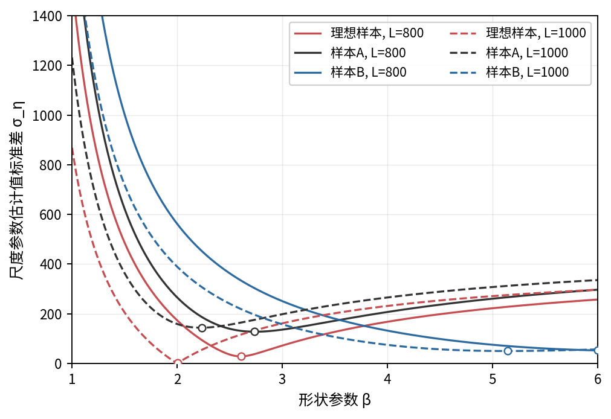

图 1　ση\(γ, β\) 随形状参数 β 的变化（固定两个 γ 值，原文图 3 风格）。空心圈标出每条曲线的条件最小值点。总体分布 W\(β=2, η=1000, γ=1000\)，n=7。

## 2\.2 偏置求根判据

若直接令廓线的梯度 S′\(γ\)=0 来定位 γ，会遇到一个麻烦：在真值附近 S\(γ\) 相当平坦，梯度在 0 附近来回摆动，零点对噪声极敏感。谢里阳等的处理是把判据从“梯度为零”改成“梯度等于一个小的正偏置值 offset”，即求解 S′\(γ\)=offset。原文取 offset=0\.1。这一改动的依据可由图 2 看出：廓线在合法区间内先缓降、再于 t\(1\) 附近急升，梯度因而单调上升地穿过任意给定的小正值，给出一个稳定的交点。

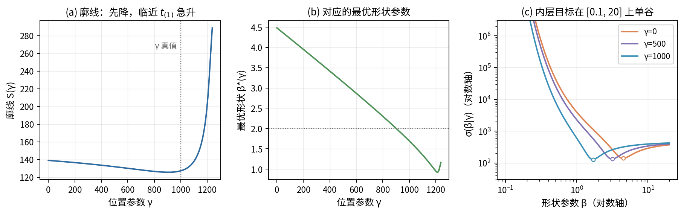

图 2　\(a\) 廓线 S\(γ\) 在合法区间内先降后于 t\(1\) 附近急升；\(b\) 对应的最优形状参数 β\*\(γ\)；\(c\) 固定 γ 时内层目标 σ\(β|γ\) 在 \[0\.1, 20\] 上单谷。

我们做了两件事来确认 offset=0\.1 是合理选择。其一，把判据退回到 offset=0（梯度为零）与 offset=0\.1 在同一批 30 个随机样本上比较：零判据给出的 γ̂ 落在 \[0, 1460\] 这样极宽的范围内，而 offset=0\.1 把范围收紧到 \[475, 1524\]（真值 1000）；这与原文报告的“零判据 990/350/1210 → 偏置判据 1025/1000/1240”的收紧效果一致。其二，扫描一系列 offset 值看估计误差（图 3、图 4b）：offset 太小则继承零判据的剧烈波动，太大则系统性高估并使部分样本的判据不可达；在 0\.1～0\.2 附近 RMSE 取得平台型最小值。综合稳定性与误差，0\.1 是一个合理折中。

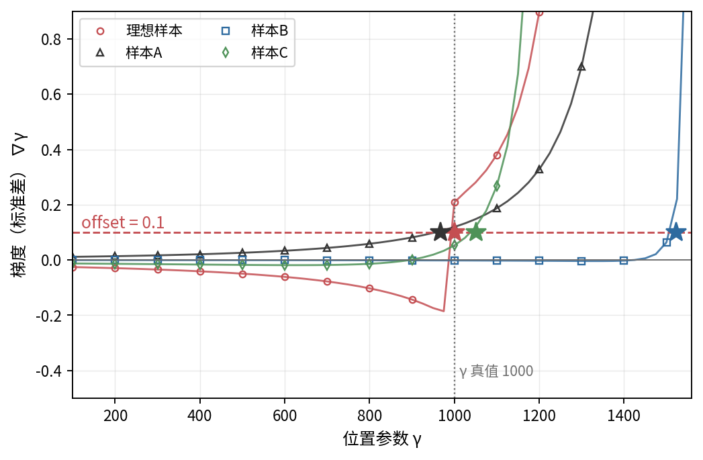

图 3　梯度 ∇γ 随 γ 的变化（原文图 4 风格，离散步长 25）。星号为 offset=0\.1 的交点，竖虚线为 γ 真值 1000。

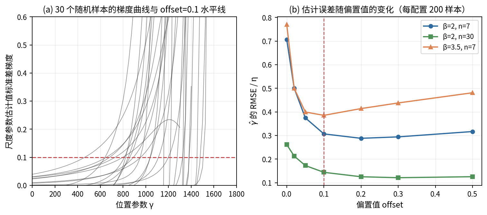

图 4　\(a\) 30 个随机样本的梯度曲线与 offset=0\.1 水平线；\(b\) 估计误差随 offset 的变化（每配置 200 样本）。竖虚线为 offset=0\.1。

__offset__

__RMSE/η__

__Bias/η__

__γ̂ 5%分位/η__

__γ̂ 95%分位/η__

__判据不可达数__

0\.0

0\.706

\-0\.377

0\.000

1\.515

0

0\.02

0\.501

\-0\.149

0\.000

1\.523

0

0\.05

0\.375

\-0\.017

0\.276

1\.524

0

0\.1

0\.307

0\.078

0\.563

1\.536

0

0\.2

0\.288

0\.158

0\.773

1\.551

1

0\.3

0\.294

0\.198

0\.854

1\.561

2

0\.5

0\.317

0\.247

0\.939

1\.598

11

表 1　偏置值扫描（β=2, η=1000, γ=1000, n=7，每点 200 样本）。RMSE 在 0\.1～0\.2 取得平台最小值；偏置值过大时部分样本判据不可达。

*注：所有以 η 为单位。判据不可达指梯度在合法区间内始终低于该 offset。*

## 2\.3 与原文的三处差异与说明

为便于审阅，这里集中说明本文实现与原文在三处的差异，以及每一处的依据。

__项目__

__本文做法__

__说明与依据__

中位秩

Bernard 近似 \(i−0\.3\)/\(n\+0\.4\)

与原文式\(3\)的 F 分布精确中位秩在数值上几乎无差别，详见 5\.1 节的同批对比；近似式计算更省、可复现性更好。

位置下界

显式约束 γ∈\[0, t\(1\)\)

位置参数不应超过最小观测，且威布尔位置参数通常取非负；下界 γ≥0 是把该约束显式化。无约束根落在 γ<0 时按 4 节办法处理。

“无解”语义

区分“合法区间内无根”与“数值漏检”

原文未细分；本文用高分辨率基准把二者分开，避免把可解样本误判为无解。

表 2　本文实现与原文的三处差异。

# 3 蒙特卡洛检验与“无解”现象

为系统考察方法表现，我们在以下网格上做蒙特卡洛实验：尺度固定 η=100，形状 β∈\{0\.5, 1, 1\.5, 2, 3\}，位置比 γ0/η∈\{0, 0\.1, 0\.5, 1\}，样本量 n∈\{7, 10, 30\}，每个配置重复 40 次，合计 2400 个样本。可解性以一套高分辨率基准判定（均匀 1200 点覆盖 \[0, 0\.99 t\(1\)\) 叠加 1800 个向 t\(1\) 几何加密的点，逐点用解析包络梯度，再以高精度 Brent 细化根的位置）。

总体上，83\.2% 的样本在合法区间内存在满足判据的根。但分层来看差异极大（表 3）：当位置参数紧贴下界（γ0/η=0）时有解率只有 52\.2%，而当 γ0/η≥0\.5 时几乎总是有解。样本量越大、紧贴下界时反而越容易“无解”，这与“大样本更稳”的直觉相反，提示问题不在样本信息量，而在判据与下界的相互作用。

__γ₀/η__

__n=7__

__n=10__

__n=30__

__该层总体__

0\.0

61\.5%

50\.5%

44\.5%

52\.2%

0\.1

78\.5%

81\.0%

87\.5%

82\.3%

0\.5

97\.5%

98\.5%

100\.0%

98\.7%

1\.0

99\.5%

100\.0%

100\.0%

99\.8%

表 3　基准有解率分层统计。紧贴下界时有解率低，且随样本量增大而下降。

*注：总体有解率 83\.2%。*

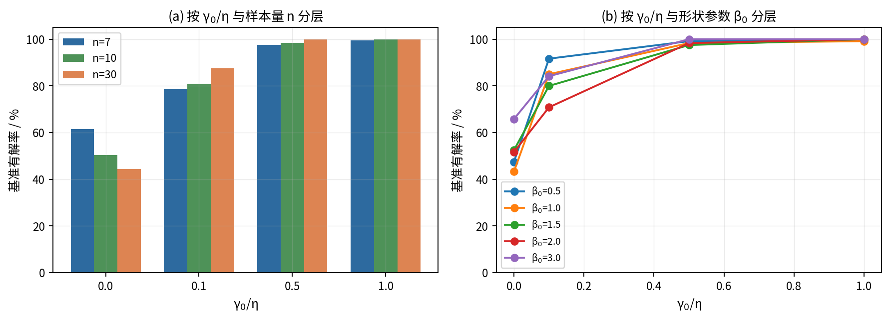

图 5　基准有解率分层：\(a\) 按 γ0/η 与样本量 n；\(b\) 按 γ0/η 与形状参数 β0。

# 4 “无解”的三类成因

把上述无解样本逐一追因，可以干净地分成三类：下界切除、数值漏检、固有无解。本节先给出二次结构与存在性的理论刻画，再用真实样本图像与统计逐类说明，最后讨论补救办法与若干严谨性边界。

## 4\.1 差异函数的二次结构与包络梯度

关键观察是：固定形状参数 β 时，ση 的平方是位置参数 γ 的二次函数。记 ai=\[−ln\(1−Fi\)\]1/β、ui=t\(i\)/ai、vi=1/ai，则 η̂i=ui−γ vi，于是

*σ²\(β|γ\) = Cuu − 2γ Cuv \+ γ² Cvv，*

其中 Cuu、Cuv、Cvv 分别是 u 的方差、u 与 v 的协方差、v 的方差（均为样本量）。这是一条开口向上的抛物线，顶点在 γv=Cuv/Cvv。把它对真实数据生成过程展开，还能写成围绕真值 γ0 的形式 σ²\(β0|γ\)=η²Var\(ρ\)−2\(γ−γ0\)ηCov\(ρ,v\)\+\(γ−γ0\)²sv²，其中 ρi=ri1/β/xi1/β 是约化量。我们在每个配置的样本上核对了这一恒等式，左右两边的最大相对偏差为 1\.4e\-13，即机器精度量级。

由二次结构可直接得到廓线梯度的解析式。在最优形状 β\*\(γ\) 处，包络梯度为

*S′\(γ\) = \(γ Cvv − Cuv\) / S\(γ\)，*

它随 γ 单调上升，取值范围是 \(−sv, \+sv\)，其中上确界 sv=stdi\(xi−1/β\) 只依赖形状参数与样本量。这给出一个干净的存在性判据：__只要 sv 大于偏置值、且无约束根落在 \[0, t\(1\)\) 内，合法根就存在且唯一。__表 4 给出 sv 在各 \(β, n\) 下的值，可见在常用形状区间它远大于 0\.1，存在性主要不受 sv 限制，而取决于无约束根的落点（4\.2 节）。

__n＼β__

__0\.5__

__1\.0__

__1\.5__

__2\.0__

__3\.0__

7

37\.160

3\.402

1\.421

0\.868

0\.482

10

63\.955

4\.257

1\.632

0\.962

0\.518

30

337\.634

8\.184

2\.385

1\.257

0\.620

表 4　梯度上确界 sv\(β, n\)。在常用形状区间远大于偏置值 0\.1，故存在性几乎不受其限制。

*注：s\_v = std\_i\( x\_i^\(−1/β\) \)，x\_i = −ln\(1−F\_i\)。*

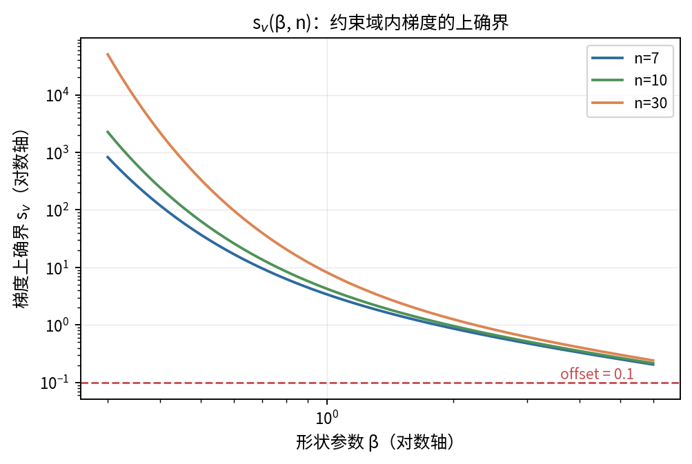

图 6　梯度上确界 sv\(β, n\) 随形状参数的变化（对数轴）。红色虚线为 offset=0\.1，曲线在常用区间始终在其上方。

## 4\.2 主因：下界把根切除

上述存在性判据点明了主因。在无解样本中，100\.0 的下界切除样本其无约束根都落在 γ<0：把这些根换算成以 η 为单位，中位为 \-0\.095，5%～95% 分位为 \[\-0\.455, \-0\.001\]。也就是说，差异函数本身有一个良好定义的偏置根，只是它在物理上不允许的 γ<0 区域，被下界 γ≥0 切掉了。图 8a 给出这些无约束根的分布，明显堆积在 0 的左侧附近。

一个具体反例最能说明问题。在 β0=1\.5、γ0=0、n=10 的配置里，取无约束根最接近该层中位的样本（共 20 个截断样本中选出），其观测为

t = 5\.88, 22\.81, 33\.25, 70\.58, 91\.15, 103\.54, 107\.47, 132\.21, 155\.75, 242\.64

此样本 t\(1\)=5\.88，在 γ=0 处梯度已达 1\.741（远大于 0\.1），按单调性可知根在 0 左侧；其无约束 offset 根为 γ\*=\-18\.95。图 6（三联）画出这个样本：廓线在合法区间内只剩上升臂，offset 交点落在灰色的 γ<0 区域。

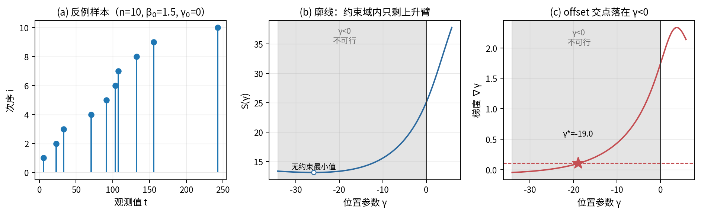

图 7　下界切除的反例样本（n=10, β0=1\.5, γ0=0）：\(a\) 样本散布；\(b\) 廓线在合法区间内只剩上升臂；\(c\) 梯度的 offset 交点落在 γ<0。

为什么紧贴下界时这种切除高发？因为二次抛物线的顶点 γv 大致围绕真值散布（图中可见顶点分布的中位与真值几乎重合）。当真值 γ0 本身贴近 0 时，约一半样本的顶点、连同其左侧的 offset 根会落到 γ<0，从而被切除；当真值远离 0 时，根稳稳落在合法区间内，几乎不再无解。这正是表 3 中有解率随 γ0/η 单调上升的原因。

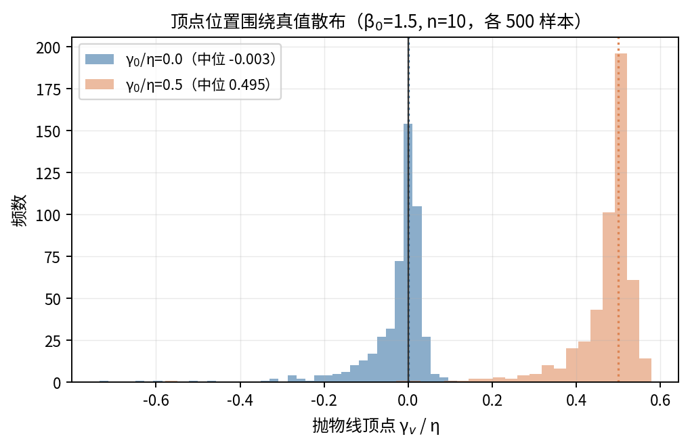

图 8　抛物线顶点 γv/η 的分布（β0=1\.5, n=10，各 500 样本）。顶点围绕真值散布，真值贴近 0 时约一半样本的根落入 γ<0。

## 4\.3 补救：截断到 0 还是放开下界

对下界切除的样本有两种处理：把估计截断到 γ̂=0，或放开下界、直接取无约束的负根 γ\*。在截断样本上按真值分层比较两者的误差（表 5、图 8b）。结论是：当真值确实在 0（γ0/η=0）时，截断到 0 是零误差，而放开下界反而引入约 0\.13η 的误差；当真值略大于 0（如 γ0/η=0\.1）时，截断的 MAE 为 0\.10η（即被低估到 0 的那部分），仍小于放开下界的 0\.28η。因此本文采用“无约束根为负则截断到 0”的处理：它在真值贴近下界时最稳，且不会把估计推向物理上不允许的负值。

__γ₀/η__

__截断样本数__

__MAE\(截断\)__

__MAE\(放开\)__

__RMSE\(截断\)__

__RMSE\(放开\)__

0\.0

287

0\.000

0\.128

0\.000

0\.216

0\.1

106

0\.100

0\.282

0\.100

0\.326

0\.5

8

0\.500

0\.678

0\.500

0\.694

1\.0

1

1\.000

1\.049

1\.000

1\.049

表 5　截断样本上两种处理的误差（按真值分层，以 η 为单位）。真值贴近下界时截断更优。

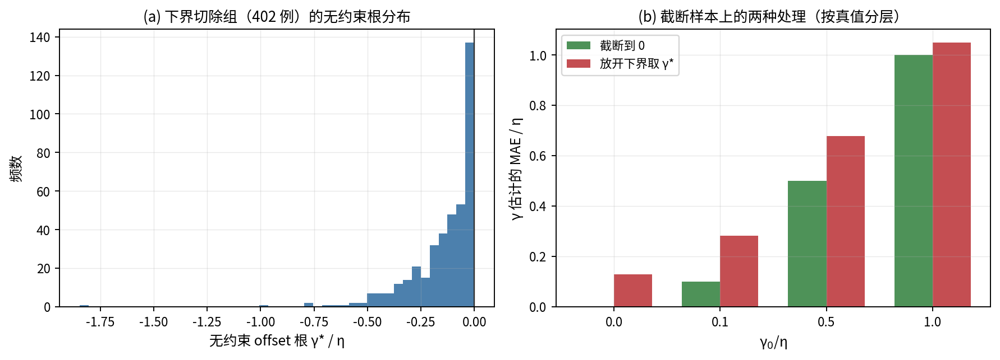

图 9　\(a\) 下界切除组无约束根 γ\*/η 的分布；\(b\) 截断到 0 与放开下界两种处理的 MAE（按真值分层）。

## 4\.4 数值漏检与固有无解

第二类成因是网格法的漏检。当根紧贴 t\(1\) 时（这在大样本下尤为常见），均匀网格的离散梯度在最后一个区间内抬不过偏置值，于是“看不到”这个其实存在的根。在 2400 个样本中，两段均匀网格（每段 20 点）报告 425 个“无解”，但其中 23 个其实有解、属于漏检；把每段加密到 60、200 点，漏检数依次降到 4、2。这类“无解”是网格分辨率不足的假象，第 5、6 节会进一步量化并给出消除办法。

第三类是方法本身的固有无解，即梯度上确界 sv 确实低于偏置值、合法区间内根本没有根。在本文的网格上这种情形仅 0 例（高精度内层下），可忽略不计；它只会在形状参数很大、样本量很小、sv 逼近 0\.1 时偶发。

需要澄清一个容易引起误会的细节：在高分辨率网格上用 np\.gradient 这类离散梯度去数“升穿次数”，会因抛物线细化带来的内层微小噪声而偶尔报出“多根”假象（本文中 59 例原始多升穿）。但只要改用高精度内层（有界优化）重算，这些样本除 1 例外都只剩单根，且那唯一的“双根”两根间距仅 1\.9e\-05·t\(1\)（数值上无法区分）。这说明真正的廓线梯度是单调的、根唯一，多根只是离散噪声的产物。

# 5 若干验证实验

本节用几组针对性的实验，验证前文用到的简化或近似确实站得住脚：中位秩近似、廓线方案与二维搜索的等价、解析梯度与离散梯度的关系，以及最优形状随位置的变化。

## 5\.1 Bernard 近似中位秩 vs F 分布精确中位秩

本文用 Bernard 近似 \(i−0\.3\)/\(n\+0\.4\) 代替原文式\(3\)的 F 分布精确中位秩。为确认这一替换无关紧要，我们在同一批 2400 个样本上分别用两种秩求解。结果（图 10）：两种秩给出的截断率完全相同（都为 16\.8%），求解状态无一例不一致；在两者都给出内点根的 1998 个样本上，根位置之差以 η 为单位的中位仅 1\.6e\-04，95% 分位 9\.8e\-04，最大也只有 3\.1e\-03。可见两种中位秩对最终估计的影响可忽略。

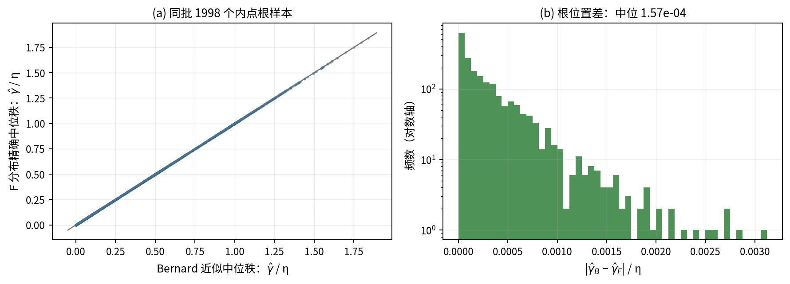

图 10　Bernard 近似与 F 分布精确中位秩在同批样本上的对比：\(a\) 两者给出的 γ̂/η 散点几乎完全落在对角线上；\(b\) 根位置差的分布（对数纵轴）。

## 5\.2 标准差二维搜索 vs 廓线方案

原文沿 \(γ, β\) 二维网格、对每个 γ 取条件最优 β 再找梯度交点；本文的廓线方案则把内层对 β 的最优化交给有界优化、外层用 Brent。两者数学上等价，这里在 364 个配对样本上核对一致性。以 η 为单位，两法给出的位置参数之差中位为 3\.4e\-04、最大 2\.2e\-02；形状参数之差中位 0\.0044、最大 0\.071；尺度参数之差中位 1\.9e\-03。这些残差完全来自二维网格的离散分辨率，廓线方案因为用了连续优化反而更精确。

图 11 用一个样本把两法画在一起：左图是 ση\(γ, β\) 的对数热图，白线是廓线脊 β\*\(γ\)，红星（廓线＋Brent 解）与白圈（二维网格解）几乎重合；右图显示二维网格的离散梯度（锯齿状）围绕解析包络梯度上下抖动，两者在同一个 γ\* 处穿过偏置值。锯齿正是网格法噪声的来源，也解释了为何 5\.3 节要谨慎对待离散梯度。

__配置__

__配对数__

__Δγ/η 中位__

__Δγ/η 95%__

__Δβ 中位__

__Δη/η 中位__

β=0\.5, γ₀/η=0\.5

99

7\.3e\-05

1\.4e\-03

0\.0022

0\.0020

β=1\.0, γ₀/η=0\.3

98

3\.1e\-04

7\.3e\-03

0\.0043

0\.0020

β=2\.0, γ₀/η=0\.2

82

1\.1e\-03

1\.2e\-02

0\.0071

0\.0020

β=3\.0, γ₀/η=0\.1

85

7\.6e\-04

8\.3e\-03

0\.0085

0\.0013

表 6　二维网格搜索与廓线方案的一致性（n=12，各配置）。残差源自二维网格的离散分辨率。

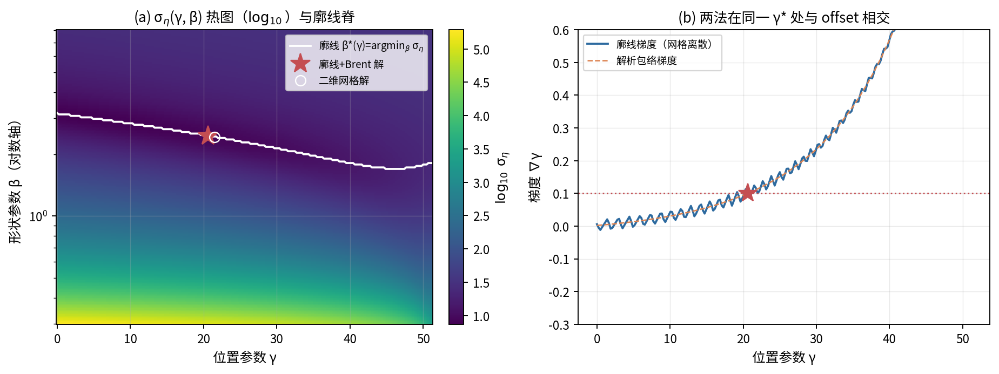

图 11　\(a\) ση\(γ, β\) 对数热图与廓线脊，两法解几乎重合；\(b\) 二维网格离散梯度（锯齿）与解析包络梯度在同一 γ\* 处与 offset 相交。

## 5\.3 解析梯度 vs np\.gradient，及 β\*\(γ\) 与 β₀

本文在求根时用的是解析包络梯度，而把 np\.gradient 离散梯度仅作为“被检对象”。在高分辨率基准网格上比较两者：两法对“是否有解”的判断无一不一致；逐点梯度之差的中位为 1\.4e\-03，但在弯折附近离散梯度误差可放大到 11\.0 量级，导致它们定出的交点位置以 η 为单位相差中位 0\.038、最大 0\.356。这正是用解析梯度更稳的原因（图 12a）。

关于最优形状随位置的变化，需要纠正一个直觉化的说法：β\*\(γ\) 并不恒等于真值 β0。如图 12b，多个样本的 β\*\(γ\) 曲线是穿过 β0 而非贴着它走的——只有当 γ 恰好等于真值、且在大样本极限下，β\*\(γ\) 才趋近 β0。在我们求得的根处统计 β̂/β0：5%、50%、95% 分位分别为 0\.44、0\.92、1\.65，即根处的形状估计围绕真值散布、并非恒等。把“β\*≈β0”当作精确关系会高估方法对形状参数的还原能力。

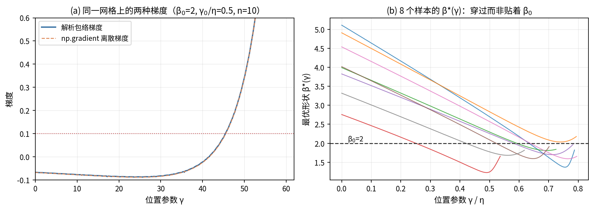

图 12　\(a\) 同一网格上的解析包络梯度与 np\.gradient 离散梯度；\(b\) 8 个样本的 β\*\(γ\) 穿过而非贴着真值 β0。

# 6 数值漏检与网格设置

第 4\.4 节指出网格法的“无解”多半是漏检。本节在一个最吃力的设置（β0=0\.5、γ0/η=0\.3、η=100）上把漏检机理和网格成本量化清楚。小形状参数加上中等位置偏移，会让廓线的弯折极度靠近 t\(1\)，正是网格法最容易漏检的情形。

图 13a 画出一个基准有解、但两段均匀网格（每段 20 点）漏检的样本：其根到下界的相对距离 1−γ\*/t\(1\) 仅约 2\.6e\-04，弯折几乎贴着 t\(1\)，落在任何粗网格最后一个区间的内部。图 13b 则比较两类网格“找回根”的能力：在 120 个基准有解样本上，单段均匀网格要到数千点才能找回多数根，而两段均匀网格用几百点的总预算就接近全部找回——把节点集中到 t\(1\) 附近远比全程均匀铺点高效。

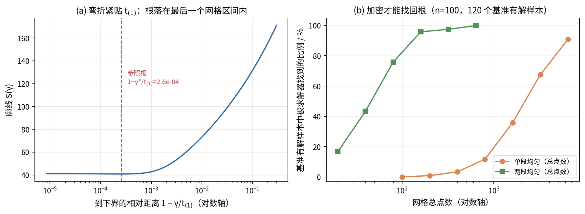

图 13　\(a\) 弯折紧贴 t\(1\)，根落在粗网格最后一个区间内；\(b\) 两类网格“找回根”的比例随总点数的变化（n=100，困难设置）。

有解率随样本量的崩塌（图 14a、表 7）最能说明问题：固定每段点数时，n 越大、根越贴近 t\(1\)（图 14b，1−γ\*/t\(1\) 的中位从 n=10 的 0\.0148 缩到 n=200 的 4\.6e\-05），两段均匀（每段 20 点）的有解率从 n=10 的 90\.0% 一路跌到 n=200 的 2\.5%。把每段加密到 200 点能把 n=200 的有解率拉回 85\.0%，但代价是更多求值。

__n__

__基准有解率__

__k=20__

__k=60__

__k=200__

__1−γ\*/t₍₁₎中位__

10

95\.0%

90\.0%

92\.5%

95\.0%

1\.5e\-02

20

100\.0%

97\.5%

100\.0%

100\.0%

3\.5e\-03

50

100\.0%

90\.0%

100\.0%

100\.0%

8\.2e\-04

100

100\.0%

47\.5%

90\.0%

97\.5%

2\.0e\-04

200

100\.0%

2\.5%

20\.0%

85\.0%

4\.6e\-05

表 7　困难设置下有解率与根位置随样本量的变化（β0=0\.5, γ0/η=0\.3，每点 40 样本）。k 为两段均匀网格每段点数。

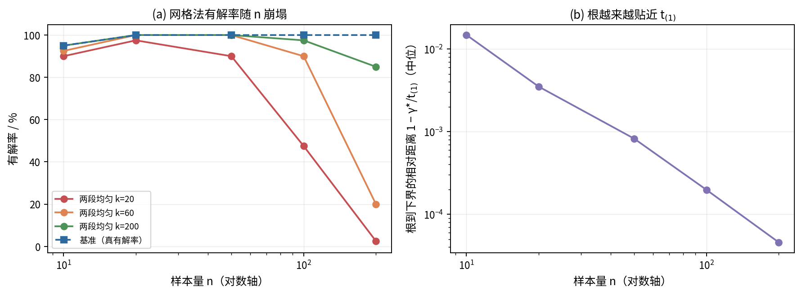

图 14　\(a\) 网格法有解率随样本量崩塌；\(b\) 根到下界的相对距离随样本量缩小（对数轴）。

精度方面（图 15、表 8），两段均匀网格的根误差随每段点数 k 近似幂律下降：对全体已解样本中位误差拟合得斜率约 \-1\.48，对“在所有 k 上都解出”的固定子集（11 例，避免幸存者偏差）拟合得斜率约 \-1\.81。需要说明，这条收敛率介于一阶与二阶之间，且受“哪些样本被解出”的影响，不宜简单宣称为某个整数阶；把它当作“加密大致按多项式速度提升精度”的定性结论更稳妥。

__每段点数 k__

__解出率__

__中位误差/η__

__均值误差/η__

10

18\.3%

7\.51e\-05

7\.62e\-05

20

53\.3%

1\.94e\-05

2\.57e\-05

40

75\.0%

1\.27e\-05

1\.36e\-05

60

85\.0%

5\.55e\-06

6\.39e\-06

120

95\.0%

1\.85e\-06

2\.61e\-06

200

98\.3%

7\.74e\-07

1\.00e\-06

表 8　两段均匀网格的精度随每段点数 k 的变化（n=100，困难设置，60 个基准有解样本）。

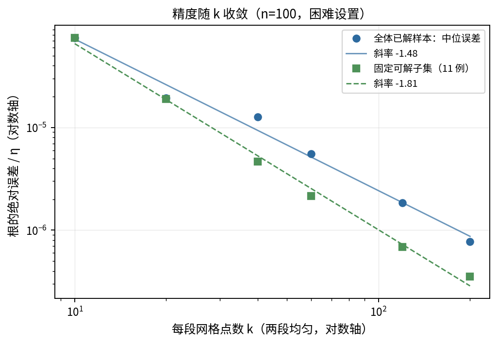

图 15　两段均匀网格根误差随每段点数 k 的收敛（双对数）。全体已解样本与固定可解子集分别拟合，斜率介于一阶与二阶之间。

# 7 稳健求解流程

综合前文，合法根的存在性由“无约束根是否落在 \[0, t\(1\)\) 内”决定，而廓线梯度单调上升、根唯一。据此可设计一个始终给出合法估计、又几乎不依赖网格分辨率的求解流程，要点是：先在 γ=0 处探测一次梯度判断根在哪一侧，再用括弧＋Brent 把根精确定位，无约束根为负则截断到 0。伪代码如下。

输入：排序样本 t\[1\.\.n\]，偏置值 offset=0\.1  
内层：给定 γ，σ\(γ\) = min\_\{β∈\[0\.1,20\]\} std\_i\( \(t\_i−γ\)/x\_i^\{1/β\} \)，  
      用有界单变量优化求最优 β\*，梯度 g\(γ\)=\(γ·C\_vv−C\_uv\)/σ 在 β\* 处解析给出  
步骤：  
  1\. 探测 g\(0\)  
  2\. 若 g\(0\) ≥ offset：              \# 单调性 ⇒ 根在 γ<0  
        输出 γ̂ = 0（截断），记录状态“truncated\_at\_zero”  
        （如需诊断，可在 γ<0 侧定位无约束根 γ\*）  
  3\. 否则：                          \# 根在 \(0, t\_\(1\)\) 内  
        自 0 起按几何阶梯 δ\_j = 1 − γ\_j/t\_\(1\)（0\.9 → 1e\-12，24 级）  
        向右找到第一个 g\(γ\_j\) > offset 的节点，得到括弧 \[γ\_lo, γ\_hi\]  
        在该括弧内用 Brent 求根（xtol = 1e\-10 · t\_\(1\)）→ γ̂  
  4\. 在 γ̂ 处由 β\* 给出 β̂，并令 η̂ = mean\_i \(t\_i − γ̂\)/x\_i^\{1/β\*\}  
输出：γ̂, β̂, η̂, 状态, g\(0\), 求值次数

这个流程几个设计点都对应前文的论证：用解析梯度而非离散梯度（5\.3 节，避免锯齿噪声）；用几何阶梯从 0 向右括弧、取最靠左的根（与“从 0 出发、根唯一”的语义一致，且天然贴近可能紧邻 t\(1\) 的根）；无约束根为负即截断（4\.3 节，真值贴近下界时最稳）。在第 6 节同一困难设置下与各网格策略对比（表 9、图 16），工程求解器以中位 22 次求值达到 8\.5e\-12 的根误差并 100% 给出解，而单段均匀 400 点在此设置下解出率仅 3\.0%，单段 2000 点也只有 54\.7%。

__策略__

__解出率__

__求值次数\(中位\)__

__根误差/η\(中位\)__

__|Δγ|/η\(中位\)__

单段均匀 400

3\.0%

400

1\.7e\-04

6\.70e\-04

单段均匀 2000

54\.7%

2000

2\.2e\-05

1\.36e\-04

两段均匀 ~240

97\.0%

240

1\.9e\-06

7\.09e\-05

几何加密 ~30

100\.0%

30

7\.5e\-06

7\.45e\-05

工程求解器

100\.0%

22

8\.5e\-12

6\.76e\-05

表 9　五种求解策略对比（n=100，困难设置，300 次重复）。工程求解器在成本、解出率、精度三方面同时占优。

*注：|Δγ| 为估计与真值之差；根误差为估计与高精度参照根之差。*

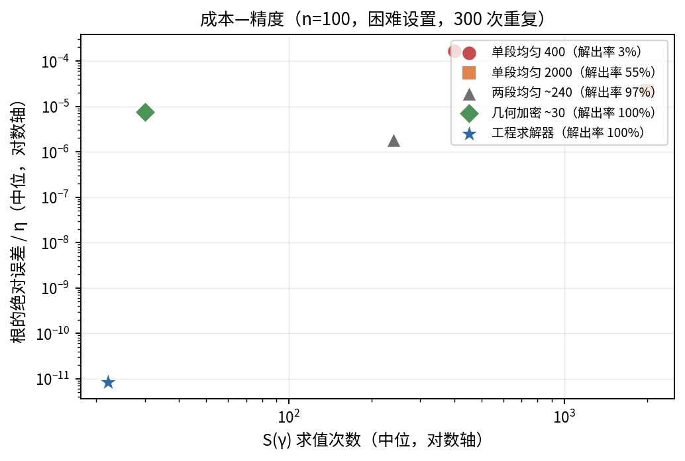

图 16　成本—精度散点（n=100，困难设置）。工程求解器（星）位于左下角：求值最少、精度最高。

# 8 推荐设置下的广覆盖表现

最后，在一套独立种子族上对工程求解器做广覆盖检验：5 个形状 × 4 个位置比 × 3 个样本量 × 200 次 = 12000 次拟合。它在全部配置上 100% 给出合法估计，中位求值 20 次、最多也只需 22 次（按配置中位计）。

评价指标遵循配套的精度评价指标研究（对 72 篇相关文献的统计调研）给出的方案：每个参数成套报告偏差（Bias）、标准差（SD）、均方根误差（RMSE）与平均绝对误差（MAE）；位置参数一律使用以 η 为单位的绝对指标，__不用任何相对指标__——因为当真值 γ 贴近 0 时相对指标会被放大到失真；同时报告 γ̂=0 的截断率作为伴随信息，并配以误差分布图，因为位置参数的误差呈“零点尖峰＋右侧散布”的双峰形态（图 17），单一的中位类或相对类指标都会在截断点的质量上失真。

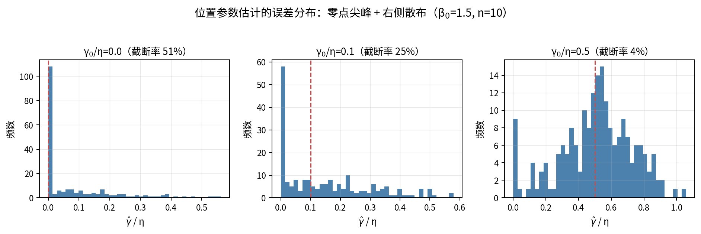

图 17　位置参数估计的误差分布（β0=1\.5, n=10）。随 γ0/η 增大，零点尖峰消退、分布右移；这种双峰形态正是位置参数需配误差分布图的原因。

表 10 按 \(γ0/η, n\) 合并各形状参数，给出截断率、位置参数 RMSE 与求值成本的概览；表 11 以最常用的 β=2 为焦点给出三个参数的全套指标。可以看到：位置参数的 RMSE 随样本量稳定下降、随形状参数增大而上升（图 18）；截断率随真值远离下界迅速降到 0；形状与尺度参数的偏差在小样本下偏负，但随样本量增大而收敛。

__γ₀/η__

__n__

__截断率\(中位\)__

__γ RMSE/η\(中位\)__

__γ MAE/η\(中位\)__

__求值\(中位\)__

0\.0

7

47\.0%

0\.204

0\.117

12

0\.0

10

51\.0%

0\.149

0\.082

1

0\.0

30

51\.5%

0\.064

0\.030

1

0\.1

7

25\.5%

0\.210

0\.152

18

0\.1

10

24\.5%

0\.158

0\.122

17

0\.1

30

17\.0%

0\.086

0\.072

16

0\.5

7

4\.5%

0\.267

0\.211

20

0\.5

10

0\.5%

0\.221

0\.172

20

0\.5

30

0\.0%

0\.095

0\.074

20

1\.0

7

0\.5%

0\.284

0\.213

21

1\.0

10

0\.0%

0\.221

0\.172

21

1\.0

30

0\.0%

0\.096

0\.071

21

表 10　工程求解器广覆盖表现，按 \(γ0/η, n\) 合并 5 个形状参数（每配置 200 次）。

*注：指标先在每个形状配置上算出，再对 5 个形状取中位。*

__γ₀/η__

__n__

__γ Bias/η__

__γ SD/η__

__γ RMSE/η__

__β Bias__

__β RMSE__

__η Bias/η__

__η RMSE/η__

0\.0

7

0\.147

0\.175

0\.228

\-0\.329

0\.672

\-0\.161

0\.293

0\.0

10

0\.137

0\.158

0\.209

\-0\.249

0\.653

\-0\.141

0\.275

0\.0

30

0\.066

0\.087

0\.109

\-0\.189

0\.396

\-0\.093

0\.163

0\.1

7

0\.154

0\.246

0\.289

\-0\.317

0\.698

\-0\.141

0\.344

0\.1

10

0\.101

0\.197

0\.221

\-0\.259

0\.632

\-0\.123

0\.294

0\.1

30

0\.024

0\.108

0\.110

\-0\.045

0\.420

\-0\.030

0\.169

0\.5

7

0\.084

0\.313

0\.323

\-0\.139

0\.879

\-0\.104

0\.398

0\.5

10

0\.030

0\.266

0\.267

0\.013

0\.720

\-0\.044

0\.341

0\.5

30

\-0\.011

0\.144

0\.144

0\.069

0\.511

0\.010

0\.195

1\.0

7

0\.038

0\.313

0\.315

\-0\.121

0\.838

\-0\.069

0\.424

1\.0

10

0\.074

0\.265

0\.275

\-0\.154

0\.747

\-0\.080

0\.364

1\.0

30

0\.011

0\.139

0\.139

0\.002

0\.457

\-0\.024

0\.180

表 11　焦点形状 β=2 的全套指标（每配置 200 次）。γ 以 η 为单位；β 为绝对值；η 以真值 η0 为单位。

*注：Bias、SD、RMSE 成套报告，便于区分系统偏差与随机散布。*

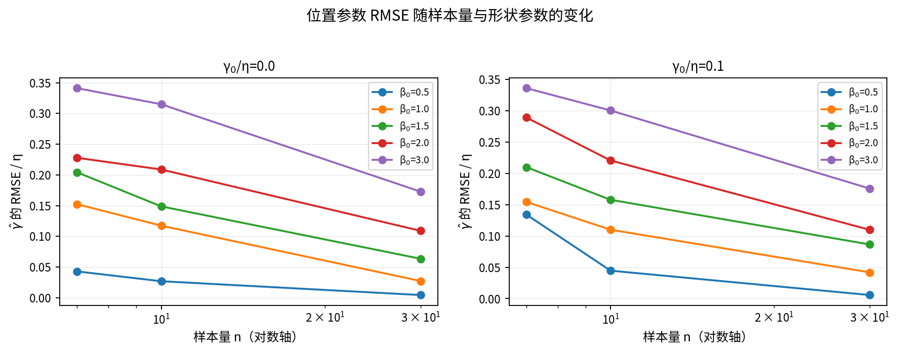

图 18　位置参数 RMSE/η 随样本量与形状参数的变化（γ0/η=0 与 0\.1 两种情形）。RMSE 随 n 下降、随 β 上升。

# 9 与原文的关系与若干诚实修正

本文与谢里阳等原方法的关系是“复刻、检验、补强”，而非否定。原方法的核心思想（以伪尺度自洽程度作差异度量、用偏置求根稳定定位）是有效且实用的；本文做的是把它在边界情形的行为讲清楚，并给出工程上可直接用的稳健流程。这里集中列出几处需要诚实修正或澄清的表述，以免读者形成过强的印象。

- “ση 是 γ 的抛物线”应表述为“ση 的平方是 γ 的抛物线”。是平方项二次，ση 本身并非抛物线。
- “抛物线顶点落在真值 γ0”只在大样本极限下近似成立。有限样本下顶点围绕真值散布（图 8），把顶点当作真值会低估随机性。
- “网格加密按 1/k² 提升精度”不准确。本文实测收敛率介于一阶与二阶之间（表 8），且依赖样本是否被解出，不宜宣称为固定整数阶。
- “最优形状 β\*\(γ\)≈β0”只是近似且仅在特定 γ 处成立。根处的 β̂围绕真值散布（5\.3 节），并非恒等于真值。
- “无解”是多因一果。把它笼统归为“方法失效”会掩盖主因（下界切除）与可消除的漏检；真正的固有无解极其罕见。

# 10 结论

本文复刻了基于统计最小差异原理的三参数威布尔位置参数估计方法，并系统解释了“偏置求根无解”这一在检验中出现的现象。主要结论是：\(1\) 无解以下界切除为主因，其本质是差异函数良好定义的偏置根落在了物理上不允许的 γ<0 区域；\(2\) 固定形状时差异函数平方的二次结构给出了包络梯度的解析式与存在性判据，廓线梯度单调、根唯一；\(3\) 网格法的“无解”多为漏检，向 t\(1\) 几何加密或改用解析梯度即可消除；\(4\) 据此设计的“探测＋括弧／Brent＋截断”稳健流程在 12000 次广覆盖拟合中 100% 给出合法估计，成本与精度俱优。

实践建议是直接采用第 7 节的稳健流程：它不依赖网格分辨率、自带“截断/内点根”的诊断信息，且把位置参数始终约束在合法区间内。评价估计质量时，建议遵循第 8 节的指标方案——位置参数只用以 η 为单位的绝对指标、成套报告 Bias/SD/RMSE/MAE 并附截断率与误差分布图，以免相对指标或中位类指标在贴近下界时失真。

# 附录 A　程序设置（可复刻）

## A\.1 运行环境

Python 3\.12；numpy 2\.4\.4，scipy 1\.17\.1，matplotlib 3\.10\.8。图形字体为 Noto Sans CJK SC（中文）配 DejaVu Sans（数学符号），分辨率 170 dpi。随机数发生器为 numpy 的 PCG64（default\_rng）。

## A\.2 随机种子

各部分使用独立、可复现的种子族（基准种子 20260613）：

- 原文风格演示：主种子 20260613；offset 扫描 20260613\+1。
- 主蒙特卡洛（2400 样本）：第 i 个配置用 default\_rng\(20260613 \+ 1000·i\)。
- 困难设置研究：表 7 用 20260613\+7n；表 8 用 \+808；策略对比用 \+1010；漏检演示用 \+99；找回率用 \+1234。
- 广覆盖检验（12000 次）：default\_rng\(20260613 \+ 40000 \+ 1000·i\)，与主 MC 不重叠。
- 二维 vs 廓线：主种子 20260613\+50000，单样本演示 \+50007。

## A\.3 求解器常数

内层形状参数搜索区间 β∈\[0\.1, 20\]；标准精度内层用 240 点对数网格（σ² 的二次系数按该网格预计算，任意 γ 处求值因而极廉），参照精度内层用 scipy 有界优化（xatol=1e\-11）。偏置值 offset=0\.1。工程求解器：自 0 起的几何阶梯括弧 δj=1−γj/t\(1\) 从 0\.9 几何收缩到 1e\-12（24 级），Brent 公差 xtol=1e\-10·t\(1\)、rtol≈8\.9e\-16。无约束负根诊断用对称的几何外推＋Brent。

## A\.4 网格规格

两段均匀网格（被检对象）：第一段 \[0, 0\.99 t\(1\)\) 取 k 点，第二段 \[0\.99 t\(1\), \(1−1e\-6\) t\(1\)\) 取 k 点，离散梯度用 np\.gradient，取最靠近 t\(1\) 的升穿、线性插值。单段均匀网格：\[0, \(1−1e\-9\) t\(1\)\) 等距取点。几何加密网格：δ=1−γ/t\(1\) 自 1 几何收缩到 1e\-8。高分辨率基准：均匀 1200 点覆盖 \[0, 0\.99 t\(1\)\) 叠加 1800 个 δ∈\[1e\-8, 1e\-2\] 对数均布的几何点，逐点用解析包络梯度，根的位置以 xtol=1e\-13·t\(1\) 的 Brent 细化。

## A\.5 数据生成与中位秩

样本按约化威布尔实现生成：t\(i\)=γ0\+η·ri1/β₀，其中 ri 为标准指数随机数。中位秩默认用 Bernard 近似 \(i−0\.3\)/\(n\+0\.4\)；F 分布精确中位秩取 Beta\(i, n−i\+1\) 的中位数（与原文式\(3\)等价），仅用于 5\.1 节的对比。

## A\.6 图表来源对照

全部图表的数据均来自上述一次实验所产生的结果文件，逐项对应关系如下。

__图/表__

__来源__

__关键设置__

图 1–4、表 1

原文风格演示

W\(2,1000,1000\), n=7, 30 样本＋offset 扫描

图 5、表 3

主蒙特卡洛

60 配置 ×40 次 = 2400 样本

图 6–9、表 4–5

主蒙特卡洛

二次结构/反例/顶点/截断补救

图 10、14、表 7

困难设置研究

β=0\.5, γ₀/η=0\.3

图 11、表 6

二维 vs 廓线

n=12, 4 配置

图 12、表 2

主蒙特卡洛＋说明

解析 vs 离散梯度，β\*\(γ\)

图 13、15、16、表 8–9

困难设置研究

漏检机理/收敛/成本\-精度

图 17–18、表 10–11

广覆盖检验

60 配置 ×200 次 = 12000 次拟合

表 A1　图表与数据来源对照。

