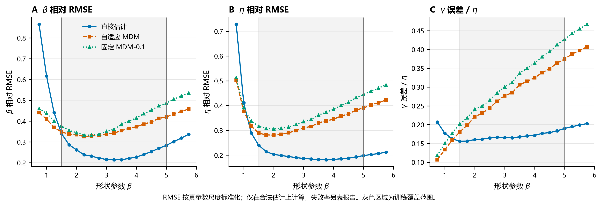
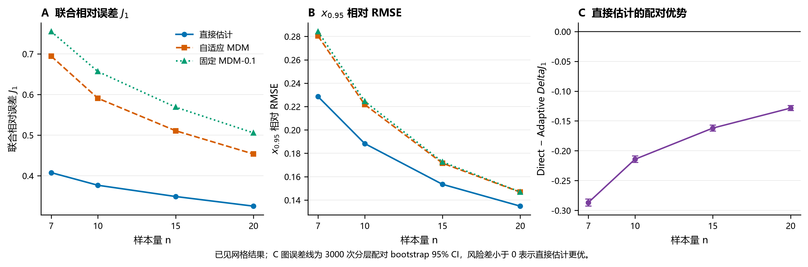
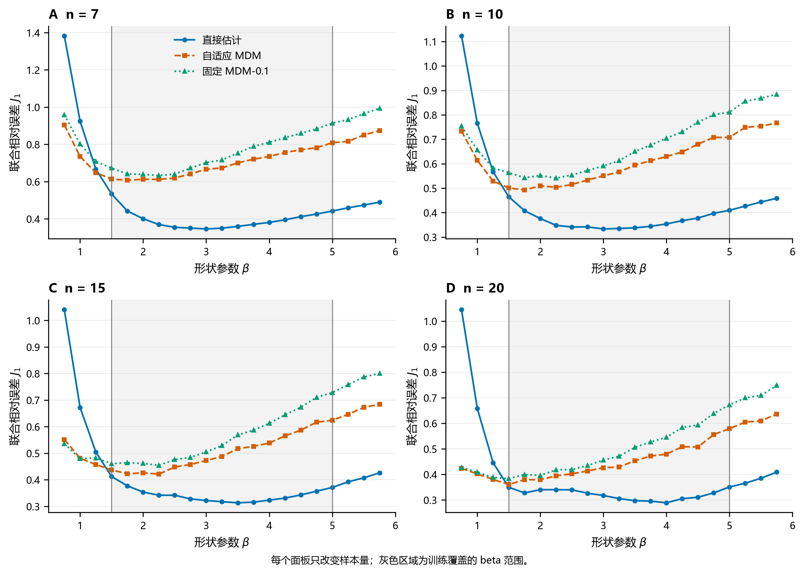
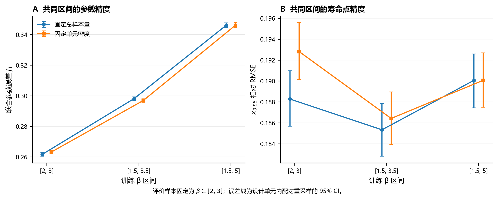
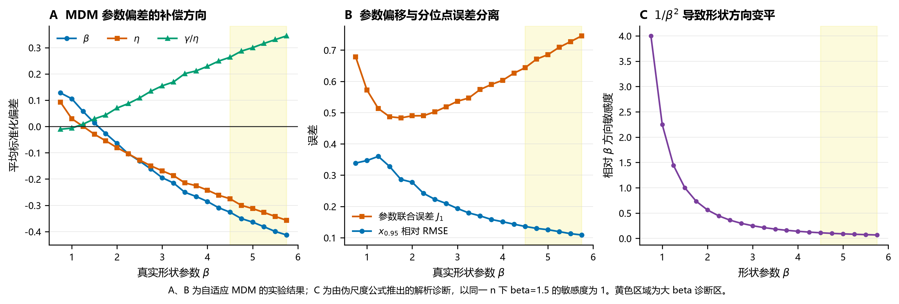

# 三参数 Weibull 小样本估计中直接神经网络与结构保留路线的精度及泛化边界

> 稿件版本：v0.1
> 对应实验：study01_aligned_generalization_v1；training_domain_width_v1
> 当前定位：Research/04 正式结果稿

## 摘要

针对三参数 Weibull 分布的小样本参数估计，神经网络既可以直接输出形状、尺度和位置参数，也可以仅参与传统估计器的内部决策。两种路线的域内精度与域外稳健性并不相同。本文在与 Study01 一致的参数空间和样本量条件下，比较直接参数估计网络（Direct-P）、神经网络选择偏移量后再调用最小差异法的自适应 MDM，以及固定偏移量为 0.1 的 MDM。测试集覆盖训练网格、训练域内未见的连续形状参数点及训练域两侧的外推点，并对每个物理样本进行三方法配对评价。

结果表明，Direct-P 在已见网格和域内未见点上的三参数联合相对误差分别较自适应 MDM 降低 35.8% 和 37.5%，对应的 $x_{0.95}$ 相对 RMSE 分别降低 14.9% 和 16.5%，说明参数改善能够传递到实际寿命点，且其优势并非来自对离散训练点的简单记忆。该优势具有明确适用边界：低形状参数侧外推发生反转，而高形状参数侧在本研究上限内仍保持优势。样本量由 7 增至 20 时，两条路线均改善，但 MDM 改善更快。完整测试面板在 $\eta=1$ 至 $10^6$ 的成对尺度审计中保持相同的联合参数误差、$x_{0.95}$ 误差和失败率，验证了当前输入输出设计的尺度等变性。训练域宽度实验进一步表明，在共同评价区间 $\beta\in[2,3]$ 内，训练域由 $[2,3]$ 扩至 $[1.5,5]$ 后，联合参数误差增加约 32%；即使固定每个参数单元的样本密度并将宽域训练量增至 2.67 倍，该增幅仍约为 31%。扩大训练覆盖因而形成局部参数精度与域外覆盖之间的权衡，而 $x_{0.95}$ 误差只小幅变化，反映出三参数补偿。

这些结果支持在匹配训练域的点估计任务中采用直接估计；当应用条件偏离训练覆盖，尤其进入低 $\beta$ 高离散区域时，需要重新核验其精度，结构估计方法可作为独立参照。

**关键词：** 三参数 Weibull 分布；神经网络；最小差异法；小样本；域外泛化；参数可识别性

## 1 引言

三参数 Weibull 分布通过形状参数 $\beta$、尺度参数 $\eta$ 和位置参数 $\gamma$ 描述寿命总体：

$$
F(t)=1-\exp\left[-\left(\frac{t-\gamma}{\eta}\right)^\beta\right],
\qquad t>\gamma.
$$

在小样本条件下，三个参数需要从有限的顺序统计量中同时恢复。未知位置参数会改变全部样本到原点的距离，并与尺度和形状共同决定分布曲线，因而三参数估计比二参数估计更容易出现不稳定解。已有研究也专门通过位置不变统计量规避三参数 Weibull 似然无界问题，说明未知位置并非普通的附加输出，而是估计结构中的关键困难[2]。

神经网络为这一问题提供了两种不同介入方式。第一种是结构保留路线：网络只学习传统估计器中的内部选择，例如预测 MDM 的偏移量，最终参数仍由 MDM 方程求解。第二种是直接估计路线：网络学习从排序样本到 $(\beta,\eta,\gamma)$ 的完整映射。前者保留分布结构和逐样本求解过程，后者可以直接针对最终参数误差优化，并把训练参数域形成的统计规律编码进映射。

仅在训练网格上比较平均误差不足以回答两条路线谁更适合实际使用。本文将问题拆成两组实验。实验 A 在与 Study01 对齐的参数域内，只改变估计路线，用于判断 Direct-P、自适应 MDM 和固定 MDM-0.1 哪一种点估计更准，并继续检查域内未见点、域外点和不同样本量。实验 B 只改变 Direct-P 的训练 $\beta$ 区间与训练预算，用于判断扩大适用范围是否牺牲局部参数精度，以及这种损失能否通过增加训练数据消除。

两组实验形成连续证据链：实验 A 回答“谁更准”，实验 B 回答“这种优势依赖什么条件”。参数 Bias、SD、RMSE 和联合误差用于判断三个参数本身是否恢复准确；未参与训练的 $x_{0.95}$ 用于检查参数改善能否传递到实际寿命点；输入形态和参数误差补偿用于解释为什么会出现域外反转与训练域权衡。

## 2 方法

### 2.1 三条估计路线

#### 2.1.1 Direct-P

对每个样本量 $n$ 单独训练一个多层感知机。输入为升序排列后的样本并除以样本均值：

$$
\mathbf z=\frac{(t_{(1)},\ldots,t_{(n)})}{\bar t}.
$$

网络输出经过合法解码的

$$
\left(\hat\beta,\frac{\hat\eta}{\bar t},\frac{\hat\gamma}{\bar t}\right),
$$

再乘回 $\bar t$ 恢复有量纲的尺度和位置参数。训练损失与三参数联合评价口径一致：

$$
P=
\left(\frac{\hat\beta-\beta}{\beta}\right)^2+
\left(\frac{\hat\eta-\eta}{\eta}\right)^2+
\left(\frac{\hat\gamma-\gamma}{\eta}\right)^2.
$$

其中 $\gamma$ 误差按 $\eta$ 标准化，避免在真实 $\gamma$ 较小时产生不必要的比例放大。

#### 2.1.2 自适应 MDM

MDM 根据秩概率 $\hat F_i$ 构造尺度参数伪估计量：

$$
\eta_i(\gamma,\beta)
=
\frac{t_{(i)}-\gamma}
{\left[-\log(1-\hat F_i)\right]^{1/\beta}}.
$$

正确的 $(\gamma,\beta)$ 应使不同顺序统计量给出的 $\eta_i$ 尽可能接近。实际随机样本中的最小差异点不一定与确定性极值点重合，因此 MDM 在剖面梯度判据中引入正偏移量 $\delta$[1]。

自适应 MDM 不直接预测参数。网络输入同样为 $\mathbf z$，输出 26 个候选偏移量 $\delta=0,0.02,\ldots,0.50$ 的条件损失曲线，选择预测损失最小的偏移量，再调用同一生产 MDM 求解三个参数。

#### 2.1.3 固定 MDM-0.1

固定路线对每个测试样本直接调用生产 MDM，并统一使用 $\delta=0.1$。该值是原方法在有限参数域和小样本案例中得到的经验性稳健取值[1]，用于提供不依赖网络选择的结构估计基准。

### 2.2 实验设计总览

| 实验 | 研究问题 | 核心改变量 | 训练与结果规模 |
|---|---|---|---|
| 实验 A：路线比较 | 在 Study01 参数域内，Direct-P 和 MDM 谁更准，插值与外推边界在哪里？ | 估计路线 | 4 个 Direct-P 模型、4 个自适应 MDM 选择器；固定 MDM-0.1 不训练；126,000 个共享物理测试样本，378,000 行配对结果 |
| 实验 B：训练域宽度 | 扩大 Direct-P 的训练范围后，局部精度是否下降，增加数据能否消除下降？ | 训练 $\beta$ 区间与训练预算 | 6 个逻辑场景、20 个唯一 Direct-P 模型；126,000 个共享测试样本重复评价 6 个场景，共 756,000 行结果 |

实验 B 的 20 个 Direct-P 模型中，4 个宽域模型复用实验 A，新增训练 16 个。因此，整个 Research04 共涉及 20 个唯一 Direct-P 模型和 4 个自适应 MDM 选择器，即 24 个唯一神经网络。模型按 $n=7,10,15,20$ 分开训练；“一个模型”指一个样本量、一个训练域和一个预算组合下的独立网络。

### 2.2.1 实验 A：同条件路线比较

实验 A 的目的，是在训练域、样本量、网络容量、训练预算和随机种子全部对齐后，只比较最终采用哪一种估计路线。由此观察到的配对差异可以归因于路线，而不是测试样本不同或训练资源不一致。

训练设计与 Study01 对齐：

| 设计因素 | 取值 |
|---|---|
| $\beta$ | 1.5, 2.0, 2.5, 3.0, 3.5, 4.0, 4.5, 5.0 |
| $\eta$ | 1000 |
| $\gamma/\eta$ | 0.10, 0.25, 0.50, 0.75, 1.00 |
| $n$ | 7, 10, 15, 20 |
| 重复次数 | 每单元 300 |
| 训练样本数 | 48,000 |
| 网络 | 256–128–64，多层感知机 |
| 训练预算 | 最大 300 轮，patience=20 |
| 模型种子 | 42 |

**表1 基础路线比较的训练设计。** Direct-P 与自适应 MDM 使用同一参数空间、网络容量、优化上限和模型种子；各按四个样本量训练一个模型，共 8 个神经网络。固定 MDM-0.1 不需要训练。

正式测试将 $\beta$ 扩展为 0.75 至 5.75、步长 0.25 的连续网格，其他因素保持不变，共得到 126,000 个独立物理样本。每个样本同时由三种方法估计，形成 378,000 行配对结果。测试位置分为：

- 已见网格：训练时使用过的八个 $\beta$ 水平；
- 域内未见：1.5 与 5.0 之间、训练时未出现的 0.25 间隔点；
- 近域外：1.25 和 5.25；
- 远域外：0.75、1.00、5.50 和 5.75。

这一设计将“未见离散点的插值”与“超出参数范围的外推”分开评价。若域内未见点与已见网格表现相当，可以排除网络仅记忆八个离散 $\beta$ 水平的解释；域外点则用于定位训练支持范围之外的退化方向和速度。

### 2.2.2 实验 B：训练域宽度与双预算

实验 A 的 Direct-P 使用了与 Study01 相同的宽域训练范围，但实际部署时通常不能预先知道真实参数是否位于训练范围内。实验 B 因此检验一个更具体的问题：扩大训练域造成的局部精度损失，究竟只是固定训练样本被更多参数单元摊薄，还是训练域变宽本身增加了小样本参数辨识难度。

为进一步识别训练覆盖本身的作用，另设三个嵌套训练域：$[2,3]$、$[1.5,3.5]$ 和 $[1.5,5]$。其余 $\gamma/\eta$、$n$、网络结构、训练轮数、模型种子和正式测试样本保持一致。实验同时采用两种训练预算：

| 训练 $\beta$ 区间 | $\beta$ 水平数 | 固定总样本量：每单元重复 / 每个 $n$ 总量 | 固定单元密度：每单元重复 / 每个 $n$ 总量 |
|---|---:|---:|---:|
| $[2,3]$ | 3 | 800 / 12,000 | 300 / 4,500 |
| $[1.5,3.5]$ | 5 | 480 / 12,000 | 300 / 7,500 |
| $[1.5,5]$ | 8 | 300 / 12,000 | 300 / 12,000 |

**表2 训练参数域宽度实验的两种预算。** 固定总样本量使局部样本密度随训练域扩大而下降，对应有限训练预算下的实际覆盖代价；固定单元密度使总训练量随训练域扩大，用于判断增加训练数据能否消除宽域代价。

三组区间与两种预算形成 6 个逻辑场景；宽域的两种预算设置相同并共享模型，因此每个 $n$ 有 5 个不同模型，共训练 20 个唯一 Direct-P 模型。每个场景使用完全相同的 126,000 个正式测试样本，合计形成 756,000 行估计结果。共同评价区间 $\beta\in[2,3]$ 每个场景包含 30,000 个共享样本，用于比较局部精度；$0.75\leq\beta\leq5.75$ 的完整网格用于比较测试点到训练边界的距离及外推退化。全部 282 次数值失败均位于共同区间以外；失败样本以训练阶段冻结的惩罚进入 $J_1$，分位点误差只在合法估计上汇总。

这一双预算设计分别回答两个问题：在总训练量受限时，扩大覆盖需要付出多大的局部精度代价；保持每个参数单元的训练密度并增加总数据后，该代价是否仍然存在。两种协议使用同一测试样本，域宽差异采用设计单元内配对 bootstrap 3000 次给出 95% 置信区间。由此得到的是固定网络结构、训练协议和模型种子 42 下的条件结论，不等同于所有网络容量和随机初始化下的总体规律。

### 2.2.3 多尺度等变审计

实验 A 和实验 B 的正式训练均固定 $\eta=1000$。Direct-P 输入为排序样本除以样本均值，输出为 $\hat\eta/\bar X$ 和 $\hat\gamma/\bar X$ 再乘回 $\bar X$，因而整体尺度变化在设计上应被消去。为检查数值实现是否真正满足这一性质，将实验 A 的全部 126,000 个正式测试样本及其真实 $\eta,\gamma$ 成对乘以 $0.001,0.01,0.1,1,10,1000$，对应 $\eta=1,10,100,1000,10^4,10^6$。四个既有 Direct-P 模型不重新训练；每个尺度均重新执行网络推断并计算参数误差、$J_1$、$x_{0.95}$ 相对 RMSE 和失败率，共 756,000 次尺度化评价。

该实验回答的是实现层面的尺度等变性，而不是不同随机训练之间的稳定性。成对使用同一物理样本能够排除蒙特卡洛样本差异；若结果仍随尺度改变，才说明归一化、输出恢复或数值精度存在问题。

### 2.3 评价指标

三个参数分别报告标准化 Bias、SD 和 RMSE。总体点风险定义为

$$
J_1=
\sqrt{
\operatorname{mean}\left[
\left(\frac{\hat\beta-\beta}{\beta}\right)^2+
\left(\frac{\hat\eta-\eta}{\eta}\right)^2+
\left(\frac{\hat\gamma-\gamma}{\eta}\right)^2
\right]
}.
$$

同时计算由估计参数导出的可靠度寿命点

$$
x_R=\gamma+\eta[-\log R]^{1/\beta},
$$

并以 $x_{0.95}$ 的相对 RMSE 检查参数精度是否传递到工程量。尾部风险使用单样本联合误差的第 95 百分位数；数值失败率单独报告。方法差异采用设计单元内共享 repeat 的分层配对 bootstrap，重复 3000 次，给出 $\Delta J_1$ 的 95% 置信区间。

## 3 结果

### 3.1 实验 A：域内连续插值与方向性外推

**图1 直接估计与结构保留路线在连续 $\beta$ 位置上的联合风险。** A 为三种方法的 $J_1$；B 为 Direct-P 分别减去两条 MDM 路线的配对风险差，阴影为 95% 置信区间。灰色区域为训练覆盖范围，风险差小于 0 表示 Direct-P 更优。

Direct-P 在已见网格和域内未见点的 $J_1$ 分别为 0.3658 和 0.3532，自适应 MDM 分别为 0.5696 和 0.5648。Direct-P 的相对改善为 35.8% 和 37.5%，对应配对风险差分别为 $-0.2038\,[95\%\,CI:-0.2067,-0.2011]$ 和 $-0.2115\,[95\%\,CI:-0.2144,-0.2087]$。

域内未见点没有出现精度下降，说明网络学习到的是训练范围内的连续映射，而不是八个形状参数水平的查表。离开训练域后，上下两侧并不对称：在 $\beta=1.25$ 时 Direct-P 相对自适应 MDM 已高 7.6%，在 $\beta=0.75$ 时高 70.5%；而在 $\beta=5.75$ 时仍低约 40.0%。因此，距离训练边界相同并不意味着外推风险相同。

实验 A 能支持的直接结论是：在当前训练覆盖域和冻结协议下，Direct-P 的点估计风险低于两条 MDM 路线，并具备真实的域内插值能力。它不能支持“Direct-P 在任意参数域都更准”，因为低 $\beta$ 域外已经观察到反转。

### 3.2 实验 A：参数误差、工程量和尾部风险

**图2 三个参数的标准化 RMSE 随 $\beta$ 的变化。** $\beta$ 和 $\eta$ 使用相对误差，$\gamma$ 误差按真实 $\eta$ 标准化。灰色区域为训练覆盖范围。

在已见网格上，Direct-P 的三参数原始尺度 Bias/SD/RMSE 均低于自适应 MDM。低 $\beta$ 侧外推反转首先发生在 $\beta$ 和 $\eta$，而不是位置参数单独失控。网络仍可输出满足合法边界的数值，但合法性不能代替训练域外的统计校准。

| 测试区域 | Direct-P Bias / SD / RMSE | 自适应 MDM Bias / SD / RMSE | Direct RMSE 相对变化 |
|---|---:|---:|---:|
| 已见网格 | +0.0020 / 0.1799 / 0.1799 | +0.0537 / 0.2045 / 0.2114 | −14.9% |
| 域内未见 | −0.0020 / 0.1668 / 0.1668 | +0.0501 / 0.1933 / 0.1997 | −16.5% |
| 近域外 | +0.0079 / 0.2621 / 0.2622 | +0.0594 / 0.2617 / 0.2683 | −2.3% |
| 远域外 | −0.0418 / 0.2921 / 0.2950 | +0.0499 / 0.2499 / 0.2549 | +15.8% |

**表3 $x_{0.95}$ 相对误差的区域汇总。** $x_{0.95}$ 未参与 Direct-P 的训练。域内结果同时表现为 Bias 接近 0、SD 下降和 RMSE 下降，说明参数精度能够传递到实际量；远域外反转则与联合参数风险给出相同边界。作为尾部核查，已见网格的 P95 联合误差为 0.6138 和 1.0837，远域外为 1.4436 和 1.2595，顺序分别为 Direct-P / 自适应 MDM。

### 3.3 实验 A：样本量改变相对优势

**图3 样本量对已见网格估计精度的影响。** A 为三参数联合误差，B 为 $x_{0.95}$ 相对 RMSE，C 为 Direct-P 相对自适应 MDM 的配对风险差及 95% 置信区间。

| $n$ | Direct-P $J_1$ | 自适应 MDM $J_1$ | Direct 相对变化 | Direct $x_{0.95}$ RMSE | 自适应 MDM $x_{0.95}$ RMSE |
|---:|---:|---:|---:|---:|---:|
| 7 | 0.4076 | 0.6945 | −41.3% | 0.2286 | 0.2804 |
| 10 | 0.3765 | 0.5907 | −36.3% | 0.1884 | 0.2217 |
| 15 | 0.3488 | 0.5107 | −31.7% | 0.1534 | 0.1716 |
| 20 | 0.3251 | 0.4535 | −28.3% | 0.1348 | 0.1468 |

**表4 不同样本量下的已见网格结果。** 随 $n$ 增大，Direct-P 与自适应 MDM 均持续改善。$n=7$ 至 20 之间，Direct-P 的 $J_1$ 下降 20.3%，自适应 MDM 下降 34.7%。

MDM 对样本量更敏感，是因为其每次估计都依赖有限顺序统计量与秩概率的对应关系。样本量增大后，伪尺度离散度和剖面梯度受单个极端顺序统计量的影响减小。Direct-P 同样从更多观测中获益，但它还使用训练域编码的分布规律，因此在 $n=7$ 时获得的相对帮助更大。随着样本信息增加，结构估计器自身的不确定性下降，两条路线的差距自然收窄。

**图4 不同样本量下三种路线的连续 $\beta$ 风险。** 四个面板分别对应 $n=7,10,15,20$，灰色区域为训练覆盖范围。增加样本量降低了三种方法的风险，但没有改变 Direct-P 低 $\beta$ 外推最先失效的方向性结构。

### 3.4 多尺度审计：固定训练尺度未造成额外误差

| 测试 $\eta$ | 样本数 | $J_1$ | $x_{0.95}$ 相对 RMSE | 失败率 |
|---:|---:|---:|---:|---:|
| 1 | 126,000 | 0.4705367 | 0.2060071 | 0.05476% |
| 10 | 126,000 | 0.4705367 | 0.2060071 | 0.05476% |
| 100 | 126,000 | 0.4705367 | 0.2060071 | 0.05476% |
| 1,000 | 126,000 | 0.4705367 | 0.2060071 | 0.05476% |
| 10,000 | 126,000 | 0.4705367 | 0.2060071 | 0.05476% |
| 1,000,000 | 126,000 | 0.4705367 | 0.2060071 | 0.05476% |

**表5 Direct-P 完整测试面板的成对尺度审计。** 六个尺度下的汇总指标相同。$\hat\beta$ 最大绝对差为 0，$\hat\eta$ 和 $\hat\gamma$ 按尺度还原后的最大绝对差分别为 $9.09\times10^{-13}$ 和 $4.55\times10^{-13}$；$J_1$ 极差为 0，$x_{0.95}$ RMSE 极差为 $2.78\times10^{-17}$。

因此，当前固定 $\eta=1000$ 的训练设计没有把 Direct-P 限定在数值 1000 附近。只要测试分布是 $(\eta,\gamma)$ 的同比例缩放，网络输入保持不变，$\hat\eta$ 和 $\hat\gamma$ 随样本均值同比例恢复。该结果不能回答绝对测量噪声、截断阈值或传感器分辨率不随尺度同比例改变的情形，因为那些变化会破坏纯粹的尺度变换。

### 3.5 实验 B：训练域宽度形成局部精度与覆盖范围的权衡

**图5 不同训练参数域在共同区间上的精度。** 评价样本固定为 $\beta\in[2,3]$。A 为三参数联合误差，B 为 $x_{0.95}$ 相对 RMSE；两条曲线分别固定总训练样本量和固定每个 $\beta\times\gamma$ 单元的训练密度，误差线为 95% 置信区间。

固定每个 $n$ 的总训练样本数为 12,000 时，$[2,3]$、$[1.5,3.5]$ 和 $[1.5,5]$ 三个模型在共同区间内的 $J_1$ 分别为 0.2616、0.2982 和 0.3461。中域和宽域相对窄域分别增加 14.0% 和 32.3%；宽域与窄域的配对差为 $\Delta J_1=+0.0845\,[95\%\,CI:0.0829,0.0859]$。固定每个参数单元的训练密度后，三个训练域每个 $n$ 分别使用 4,500、7,500 和 12,000 个样本；宽域训练量为窄域的 2.67 倍，但共同区间 $J_1$ 仍增加 31.5%，配对差为 $+0.0829\,[95\%\,CI:0.0814,0.0844]$。

| 训练 $\beta$ 区间 | $J_1$ | $\beta$ RMSE | $\eta$ RMSE | $\gamma$ RMSE | $x_{0.95}$ RMSE |
|---|---:|---:|---:|---:|---:|
| $[2,3]$ | 0.2616 | 0.1333 | 0.1720 | 0.1452 | 0.1883 |
| $[1.5,3.5]$ | 0.2982 | 0.1795 | 0.1835 | 0.1517 | 0.1853 |
| $[1.5,5]$ | 0.3461 | 0.2346 | 0.1948 | 0.1636 | 0.1901 |

**表6 固定总训练样本量下共同区间的误差分解。** 扩域损失主要来自 $\beta$；宽域的 $\beta$ RMSE 比窄域高 76.0%，而 $x_{0.95}$ RMSE 只高 1.0%。

**图6 三个训练参数域下的连续外推结果。** 三列分别对应 $[2,3]$、$[1.5,3.5]$ 和 $[1.5,5]$，同一行共用纵坐标；灰色区域为各 Direct-P 网络的训练覆盖。上排为 $J_1$，下排为 $x_{0.95}$ 相对 RMSE。虚线为自适应 MDM，点线为固定 MDM-0.1；两条 MDM 曲线在三列中保持相同。

扩大训练域同时降低了远测试点到训练边界的距离。在 $\beta=5$ 时，三个网络的 $J_1$ 依次为 0.5714、0.5233 和 0.3949；对应测试点相对三个训练域的距离分别为 2.0、1.5 和 0。因而窄域网络获得更低的局部风险，宽域网络获得更大的适用覆盖，二者不是可以同时无限改善的同一个目标。

三个训练区间均已在相同的 0.25 步长测试网格上评价，因而不是只比较区间平均数。固定单元密度下的代表结果为：窄域 $[2,3]$ 在域内非训练点 $\beta=2.25$ 的 $J_1=0.2322$，左侧紧邻域外 $\beta=1.75$ 为 0.3982，左侧远域外 $\beta=1.25$ 为 0.8214；中域 $[1.5,3.5]$ 在域内非训练点 $\beta=2.25$ 为 0.2832，右侧紧邻域外 $\beta=3.75$ 为 0.3961，右侧更远的 $\beta=4.25$ 为 0.4502；宽域 $[1.5,5]$ 在域内非训练点 $\beta=3.25$ 为 0.3274，右侧紧邻域外 $\beta=5.25$ 为 0.4124，$\beta=5.75$ 为 0.4470。三种区间都覆盖训练点、域内非训练点、双侧紧邻域外点和更远域外点。

两种训练预算得到几乎相同的约 32% 局部误差增幅，是区分机制的关键证据。固定总量实验包含“训练样本被摊薄”和“参数域变宽”两种作用；固定单元密度实验为宽域提供了窄域 2.67 倍的数据，仍出现 31.5% 的增幅，因而可以排除“只要增加相同比例的训练样本，局部损失就会消失”这一解释。另一方面，宽域模型在远测试点更好，说明它并非整体训练失败，而是将能力从局部精度重新分配给更大的覆盖范围。

### 3.6 大 $\beta$ 区域的 MDM 参数偏差

**图7 大 $\beta$ 区域的 MDM 参数补偿及形状方向敏感度。** A 为自适应 MDM 三参数的平均标准化偏差；B 比较参数联合误差与 $x_{0.95}$ 相对 RMSE；C 为根据伪尺度公式计算的形状方向相对敏感度，以同一 $n$ 下 $\beta=1.5$ 为 1。黄色区域为 $\beta\geq4.5$ 的机制诊断区。

实验中，大 $\beta$ 区域的 MDM 误差不是三个参数相互独立地随机增大，而是呈现稳定的方向组合：$\hat\beta$ 和 $\hat\eta$ 向下偏，$\hat\gamma$ 向上偏。以自适应 MDM 为例：

| $\beta$ | $n$ | $J_1$ | $\beta$ Bias | $\eta$ Bias | $\gamma/\eta$ Bias | $x_{0.95}$ RMSE |
|---:|---:|---:|---:|---:|---:|---:|
| 5.00 | 7 | 0.8089 | −0.4348 | −0.3767 | +0.3606 | 0.1633 |
| 5.00 | 20 | 0.5789 | −0.3112 | −0.2634 | +0.2550 | 0.0912 |
| 5.75 | 7 | 0.8732 | −0.4830 | −0.4285 | +0.4105 | 0.1379 |
| 5.75 | 20 | 0.6364 | −0.3571 | −0.3058 | +0.2969 | 0.0831 |

**表7 大 $\beta$ 区域自适应 MDM 的参数偏差与分位点误差。** Bias 均为标准化口径。样本量增加能够减小参数偏差，但没有消除其方向性。

这一现象可由 MDM 的伪尺度结构解释。令 $q_i=-\log(1-\hat F_i)$，则

$$
\log\eta_i=\log(t_{(i)}-\gamma)-\frac{1}{\beta}\log q_i,
\qquad
\frac{\partial\log\eta_i}{\partial\beta}
=\frac{\log q_i}{\beta^2}.
$$

不同秩点导数的离散程度决定了伪尺度差异对相邻 $\beta$ 的区分能力。该量按 $1/\beta^2$ 衰减；$\beta=5$ 时的相对敏感度仅为 $\beta=1.5$ 时的 0.09。形状方向变平后，小样本造成的顺序统计量—秩概率错位更容易移动条件最优点。

三个参数又可以对分布曲线产生补偿作用。当前 $\beta\geq4.5$ 的共享样本中，自适应 MDM 的 $\eta$ 与 $\gamma$ 标准化误差相关系数为 −0.962，固定 MDM-0.1 为 −0.963；$\beta$ 与 $\eta$ 误差则分别呈 0.728 和 0.790 的正相关。该结果与表6中的偏差方向一致：较小的 $\eta$ 与较大的 $\gamma$ 相互抵消，$\beta$ 同时调整曲线弯曲程度。

因此，大 $\beta$ 区域同时出现“参数联合误差增加”和“$x_{0.95}$ 误差减小”并不矛盾。前者评价三个参数是否分别恢复准确，后者只评价三参数组合在一个特定函数值上的结果。一个分位点准确，不能推出参数已经被唯一识别，也不能推出其他分位点或整条分布曲线同样准确。

## 4 讨论

### 4.1 Direct-P 的域内优势来自哪里

Direct-P 直接优化三参数联合损失，不受 MDM 伪尺度最小差异判据及偏移量候选集合的限制。训练数据还提供了参数域内分布形态的经验规律。在极小样本中，仅凭单个样本难以区分的参数组合，可以借助训练域内的重复样本规律得到更稳定的映射。这一作用同时降低了 Bias 和 SD，而不是只降低某一个汇总指标。

这种优势带有条件：网络使用的规律来自训练分布。域内连续点仍符合已学习的形态变化，所以插值有效；低 $\beta$ 域外样本的归一化变异系数和极值占比明显超出训练形态，映射随即偏离。相反，高 $\beta$ 一侧的归一化样本形态变化更平缓，故在本次外推上限内尚未观察到反转。

训练域宽度实验进一步说明，这一训练分布不是只有“覆盖”或“不覆盖”两种状态。小样本归一化顺序统计量可以与多组三参数组合相容；平方损失下的网络学习的是给定训练参数分布时的条件折中。窄域排除了更多候选组合，因此在共同区间内具有更低的条件风险。训练域变宽后，相似样本形态对应的可选参数组合增多，局部参数恢复变难。固定单元密度实验仍出现同样结果，说明增加训练样本只能减少抽样误差，不能消除训练域本身引入的条件不确定性。

尺度与训练参数域在这里扮演不同角色。对 $(\eta,\gamma)$ 作同比例缩放时，均值归一化使网络输入和无量纲目标保持不变，因而 $\eta=1000$ 只是计算使用的基准单位；多尺度审计验证了这一实现性质。改变 $\beta$ 则会改变归一化样本的离散程度和尾部形态，不能被同一个尺度变换消去，因此训练 $\beta$ 范围仍然构成 Direct-P 的实质适用边界。

### 4.2 网络容量不能消除哪些误差来源

把 Direct-P 的域内优势解释为网络容量更大并不充分。设训练参数与样本服从 $\pi_{\mathrm{train}}$，评价损失为 $L$。只观察当前样本 $X$ 时，理论上的最优点决策为

$$
a_L^*(X)=\arg\min_a\operatorname E_{\pi_{\mathrm{train}}}\!\left[L(a,\theta)\mid X\right].
$$

在参数平方损失下，该决策对应训练分布条件下的参数均值。增大网络可以提高对这一映射的逼近能力，也可能改善优化结果；但当一个有限样本与多组参数相容时，条件分布并不会因为网络更大而收缩为单点。网络仍需在候选参数之间折中。样本量由 7 增至 20 后 MDM 与 Direct-P 的差距缩小，以及宽域模型在增加训练量后仍未恢复窄域局部精度，都与这一有限信息解释一致。

训练分布和评价目标还会分别改变上述条件决策。训练参数域改变时，$\pi_{\mathrm{train}}(\theta\mid X)$ 随之改变；损失由参数误差改为某个寿命点误差时，$a_L^*(X)$ 也会改变。因此，更多训练数据和更大网络只能更准确地实现已经选定的训练任务，不能保证同一输出同时对所有参数区域、寿命点和数据条件最优。

此外，点决策 $a_L^*(X)$ 没有直接给出条件分布的宽度，也不能说明当前输入是否仍由训练分布支持。神经网络可以另行构造重采样、集成或校准区间，但这些需要独立验证；网络参数量本身不会自动带来可靠的不确定性提示。传统估计方法在这里保留的价值，是依据明确的分布结构对当前样本重新求解，并作为训练域检查、外部参照和回退路线，而不是保证它在所有区域都比 Direct-P 更准。

在连续参数测试集上的补充诊断为这一用途提供了直接证据。样本变异系数、归一化输入到训练支持的距离和最大值/均值，对“Direct-P 的损失大于 MDM-0.1”的识别 AUC 分别为 0.737、0.726 和 0.711。以样本变异系数的独立验证集第 90 百分位为阈值，82.1% 的测试样本继续使用 Direct-P，其余回退到 MDM-0.1，总体 $J_1$ 由 0.4721 降至 0.4347。这是候选风险规则的描述性结果，说明结构估计可以在网络高风险样本上承担回退作用；固定部署阈值仍需在新样本上确认。

因此，在参数域、数据机制和使用目标长期稳定的高频点估计任务中，专用 Direct-P 可以承担主要估计工作；当这些条件未知或变化时，仅扩大网络不足以支持无条件替代。

### 4.3 自适应 MDM 的作用应怎样理解

自适应 MDM 相对固定 MDM-0.1 在多数区域降低了风险，说明偏移量不应被理解为与参数域和样本量无关的唯一常数。原 MDM 研究也指出，偏移量的适当取值与分布分散性、对称性和样本大小有关，并将更系统的取值研究列为后续问题[1]。本实验中的自适应网络学习的是“在当前可观测样本形态下选择哪个 MDM 偏移量”，而不是取代 MDM 的参数求解。

在大 $\beta$ 区域，自适应选择能减轻固定 0.1 的部分误差，但不能消除伪尺度对形状方向敏感度下降这一结构性问题。它改变的是在同一 MDM 估计器家族中的决策位置，而不是重构估计器的可识别性。

### 4.4 方法选择

实验支持按任务条件选择路线：

- 当应用参数域与训练域一致，且主要目标是大量重复的点估计时，Direct-P 提供更低的参数误差和更快的单次推断；
- 当应用范围较窄且稳定时，按实际范围训练专用网络可提高局部参数精度；扩大单一网络的训练域会增加覆盖，但应接受局部精度下降；
- 当输入可能进入训练域外，尤其是低 $\beta$ 高离散区域时，应增加输入域诊断，触发结构路线或拒绝直接输出；
- 当数据仅发生计量单位或整体寿命尺度变化，且 $\gamma/\eta$ 保持不变时，当前尺度等变设计无需为每个 $\eta$ 单独训练网络；若测量噪声、截断或分辨率不同比例变化，则需要另行验证；
- 当目标是解释三个参数本身时，不能只用某个分位点验证；当目标是特定可靠度寿命点时，也应同时检查邻近分位点，识别参数补偿造成的单点准确；
- 随样本量增加，结构估计器相对改善更快，实际部署中的路线阈值应随 $n$ 调整，而不是对所有样本量使用同一判断。

## 5 研究范围与下一步

本轮完成的是固定模型种子 42 下的点估计比较。训练参数域、样本量、网络容量和测试协议均已冻结，结果能够支撑当前域内插值、方向性外推、训练域宽度权衡、样本量异质性、尺度等变和大 $\beta$ 补偿机制的结论。三个嵌套训练域均已覆盖训练点、域内非训练点、双侧紧邻域外点和远域外点；尚未系统平移同一宽度的训练区间，因此不能把区间宽度效应与区间所在位置完全分离。

WMLE/LSE 已在相同测试面板上完成补充比较，统计见 [同协议比较报告](artifacts/traditional_aligned_v1/report.md)。下一阶段通过同中心扩宽与同宽度平移分离训练域的宽度和位置效应。已有样本风险诊断保留为探索结果，不继续发展为自动回退规则。区间覆盖与区间宽度评价后置。

## 6 结论

本文得到五项主要结论。

1. Direct-P 在训练覆盖域内显著优于自适应和固定 MDM，且在域内未见的连续 $\beta$ 点上保持优势，说明直接网络具备真实的插值能力。
2. 直接估计的外推边界具有方向性。低 $\beta$ 侧的高离散输入首先导致 $\beta$ 和 $\eta$ 误差上升并使总体结果反转；高 $\beta$ 侧在当前测试上限内仍保持优势。
3. 样本量增加会使两类路线同时改善，但 MDM 改善更快。大 $\beta$ 下 MDM 参数偏差增大，来自形状方向敏感度按 $1/\beta^2$ 衰减及三参数补偿；这解释了参数联合误差与单个工程分位点误差可能出现相反趋势。
4. $\eta=1$ 至 $10^6$ 的完整成对尺度审计没有观察到额外误差，说明固定 $\eta=1000$ 是尺度基准而非当前模型的数值适用边界；该结论限于 $\eta,\gamma$ 同比例缩放。
5. 扩大 Direct-P 的训练域会牺牲共同区间内的参数精度，但降低远测试点的域外距离。固定单元密度并增加总训练量不能消除这一权衡；其主要损失落在 $\beta$ 恢复，而 $x_{0.95}$ 因参数补偿变化较小。

直接神经网络利用训练域先验降低域内风险，结构保留方法依靠逐样本求解维持特定域外方向的稳定性。训练覆盖、样本量和最终评价对象共同构成两条路线的选择边界。

## 参考文献

[1] 谢里阳, 朱文慧, 吴宁祥, 杨小玉. 基于统计最小差异原理的 Weibull 分布参数估计方法[J]. 东北大学学报(自然科学版), 2025, 46(7): 108–112. DOI: [10.12068/j.issn.1005-3026.2025.20240194](https://cjournal.hep.com.cn/1005-3026/CN/1190581232397218100).

[2] Nagatsuka H, Balakrishnan N. An Efficient Method of Parameter and Quantile Estimation for the Three-Parameter Weibull Distribution Based on Statistics Invariant to Unknown Location Parameter[J]. Communications in Statistics—Simulation and Computation, 2015, 44(2): 295–318. DOI: [10.1080/03610918.2013.775297](https://experts.mcmaster.ca/scholarly-works/276842).

## 数据与复现入口

- [正式实验清单](artifacts/study01_aligned_generalization_v1/manifest.json)
- [完整分析报告](artifacts/study01_aligned_generalization_v1/analysis/report.md)
- [区域汇总](artifacts/study01_aligned_generalization_v1/analysis/domain_summary.csv)
- [样本量分层汇总](artifacts/study01_aligned_generalization_v1/analysis/n_domain_summary.csv)
- [大 beta 机制统计](artifacts/study01_aligned_generalization_v1/analysis/large_beta_summary.csv)
- [大 beta 误差相关](artifacts/study01_aligned_generalization_v1/analysis/large_beta_error_correlations.csv)
- [解析敏感度](artifacts/study01_aligned_generalization_v1/analysis/mdm_identifiability_sensitivity.csv)
- [实验入口](code/run_study01_aligned_generalization.py)
- [训练域宽度实验清单](artifacts/training_domain_width_v1/manifest.json)
- [训练域宽度分析报告](artifacts/training_domain_width_v1/analysis/report.md)
- [训练域点类型汇总](artifacts/training_domain_width_v1/analysis/point_type_report.md)
- [多尺度等变审计报告](artifacts/scale_equivariance_v1/report.md)
- [多尺度等变审计清单](artifacts/scale_equivariance_v1/manifest.json)
- [训练域宽度实验入口](code/run_training_domain_width.py)
- [训练域宽度分析入口](code/analyze_training_domain_width.py)
- [多尺度等变审计入口](code/run_scale_equivariance_audit.py)
- [分析与作图入口](code/analyze_study01_aligned_generalization.py)
