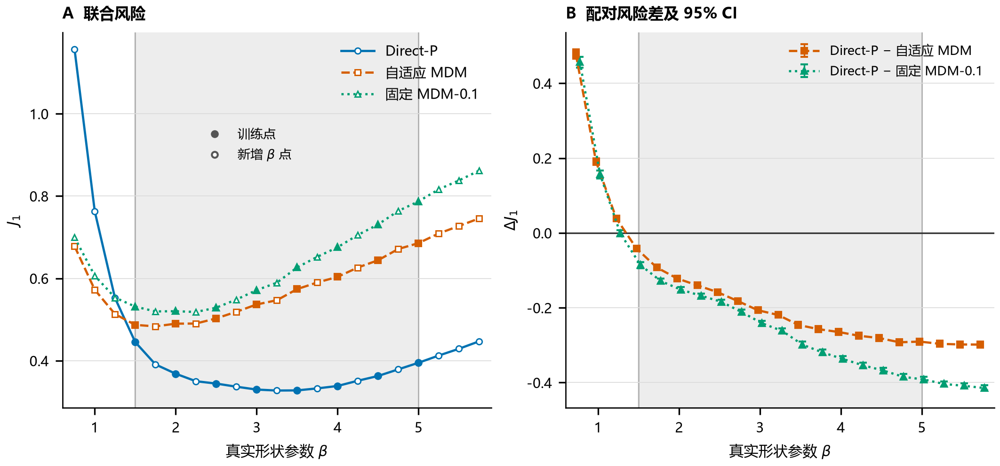
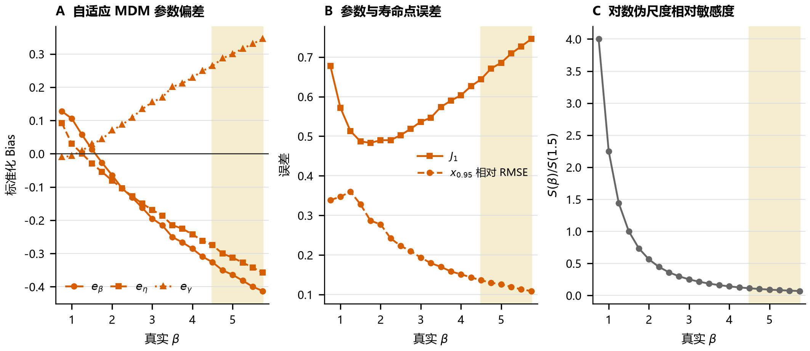
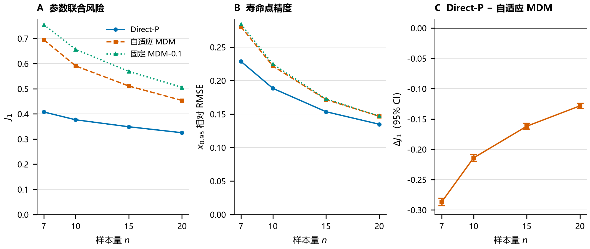

# 三参数 Weibull 小样本估计中直接神经网络的条件优势与训练域依赖

## 摘要

直接神经估计能够利用模拟训练数据改善小样本参数估计，但训练域内的平均精度不足以判断其在参数范围变化后的表现。针对三参数 Weibull 分布，本文在共享测试样本上比较直接参数估计网络（Direct-P）、神经网络选择偏移量的自适应最小差异法（MDM）、固定偏移量 MDM，以及加权极大似然估计（WMLE）和最小二乘估计（LSE）。测试区分训练网格点、域内未训练形状参数点及双侧域外点；进一步通过同中心扩宽和两种训练预算，考察训练覆盖与局部精度的关系。

在当前训练协议下，Direct-P 在已见网格和域内未训练点的三参数联合标准化误差分别较自适应 MDM 降低 35.8% 和 37.5%，相应的可靠度寿命点 $x_{0.95}$ 相对 RMSE 降低 14.9% 和 16.5%；加入 WMLE 和 LSE 后，域内联合误差排序保持不变。低形状参数侧外推发生反转，高侧在测试上限内仍保持优势。同中心训练域由 $[2.5,3.5]$ 扩至 $[0.5,5.5]$ 后，共同区间的联合参数误差在固定总训练量和固定单元密度下分别增加 54.3% 和 52.4%，而不同可靠度寿命点的误差变化并不一致。

这些结果表明，直接神经估计在匹配训练分布的点估计任务中具有条件优势。训练域扩宽的局部代价在增加开发数据后仍然存在，与训练分布改变条件预测的解释相符；其大小仍受当前模型与训练协议限制。评价估计路线时，应同时考虑训练覆盖、外推方向及最终关注的参数或寿命量。

**关键词：** 三参数 Weibull 分布；神经参数估计；最小差异法；小样本；训练参数域；域外泛化

## 1 引言

三参数 Weibull 分布通过形状参数 $\beta$、尺度参数 $\eta$ 和位置参数 $\gamma$ 描述寿命总体。在小样本条件下，未知位置参数改变所有观测到分布起点的距离，并与尺度和形状共同影响分布曲线，使三个参数的同时恢复较为困难。Nagatsuka 和 Balakrishnan 通过位置不变统计量规避三参数 Weibull 的无界似然问题，体现了未知位置对估计结构的影响[1]。

神经网络提供了从观测样本直接估计参数的另一种途径。Abbasi 等利用样本统计量同时估计三个 Weibull 参数[2]；Yang 等面向小样本疲劳寿命，以六个统计特征和样本量为输入，将 BPNN 与相关系数法及 MDM 比较[3]。更一般的神经 Bayes 估计研究将这类映射理解为在指定训练分布与损失下逼近点决策[4]。这些工作为直接估计提供了方法基础，也使训练分布成为解释性能时必须考虑的条件。

工程使用中的一个关键问题是，训练域内的精度收益能否保持到未训练参数点，以及扩大训练范围能否同时改善覆盖与局部精度。仅报告一个混合参数域上的平均误差，难以区分插值和外推，也可能掩盖不同外推方向的差异。此外，三个参数共同决定寿命分位点，参数误差的降低未必按相同比例传递到工程量。

本文围绕这些条件性问题组织比较。直接路线使用均值归一化的排序样本输出参数；结构保留路线由网络选择 MDM 偏移量，再保留逐样本的参数求解过程。固定 MDM、WMLE 和 LSE 提供传统参照。首先，在同一测试面板上定位各方案的参数风险及外推边界；其次，在相同真实参数和测试样本上，改变直接网络训练域的宽度与训练数据预算；最后结合逐参数误差、可靠度寿命点和样本量分层，解释联合参数精度与工程量精度之间的关系。本文比较的是具体估计方案的条件性能，并为观察到的规律提供机制讨论。

## 2 方法

### 2.1 分布与估计方案

设完整、独立同分布的寿命样本为 $X=(t_1,\ldots,t_n)$，其分布为

$$
F(t)=1-\exp\left[-\left(\frac{t-\gamma}{\eta}\right)^\beta\right],
\qquad t>\gamma,\quad \beta>0,\quad\eta>0.
$$

本文采用 $\gamma\geq0$ 的工程约束。所有方案接收相同观测样本。

**直接参数估计网络（Direct-P）。** 对每个样本量分别训练一个多层感知机。先将样本升序排列并除以样本均值，得到 $z_i=t_{(i)}/\bar t$；再按开发样本各位置的均值与标准差进行标准化。网络隐藏层为 256–128–64，采用 ReLU 激活。令网络输出恢复到开发目标编码尺度后为 $(u_\beta,u_\eta,u_\gamma)$，解码为

$$
\hat\beta=\operatorname{softplus}(u_\beta),\qquad
\hat\eta=\bar t\,\operatorname{softplus}(u_\eta),\qquad
\hat\gamma=\hat\eta\max(u_\gamma,0).
$$

训练目标的编码分别为 $\operatorname{softplus}^{-1}(\beta)$、$\operatorname{softplus}^{-1}(\eta/\bar t)$ 和 $\gamma/\eta$。编码目标的标准化仅用于网络输出的尺度恢复，训练损失直接在解码参数上计算：

$$
P=\left(\frac{\hat\beta-\beta}{\beta}\right)^2+
\left(\frac{\hat\eta-\eta}{\eta}\right)^2+
\left(\frac{\hat\gamma-\gamma}{\eta}\right)^2.
$$

该解码保证参数的非负或正值约束，但未自动保证 $\hat\gamma<t_{(1)}$；输出仍需通过统一有效性检查。对样本及真实 $\eta,\gamma$ 作同比例缩放时，归一化输入与编码目标保持不变，尺度和位置估计随 $\bar t$ 恢复，因此该设计具有尺度等变性。

**自适应与固定 MDM。** MDM 根据秩概率 $\hat F_i=(i-0.3)/(n+0.4)$ 构造尺度伪估计量

$$
\eta_i(\gamma,\beta)=\frac{t_{(i)}-\gamma}{[-\log(1-\hat F_i)]^{1/\beta}},
$$

并根据伪尺度之间的差异求解参数。正偏移量 $\delta$ 调整其剖面梯度判据，以应对随机样本的最小差异点与确定性极值点之间的偏离[5]。自适应方案与 Direct-P 使用相同形式的归一化输入，网络预测 $\delta=0,0.02,\ldots,0.50$ 共 26 个候选偏移量的损失，选择预测损失最小者，再调用 MDM。固定参照始终取 $\delta=0.1$，两种 MDM 使用相同参数求解实现。

**WMLE 与 LSE。** WMLE 采用加权似然方程修正小样本偏差[6]。本次实现使用样本量相关权重，其中第三个权重还随求解过程中的候选形状参数变化，并通过方程残差检查判断求解有效性。LSE 采用对数 Weibull 顺序统计量的期望与 $\log(t_{(i)}-\gamma)$ 回归，搜索位置参数以最大化 Fisher F 比，与 Soman 和 Misra 的三参数最小二乘路线对应[7]。本文排名限定于封存版本的这两种实现，具体数值约束与来源见附录 A.1。

### 2.2 训练与测试设计

基础训练域与测试设计见表1。两条学习路线分别在每个 $n$ 的 12,000 个开发样本中留出 15% 作为内部验证资源，其余用于拟合。开发样本与最终测试样本使用不同随机数命名空间；测试样本在方法间共享。

| 因素 | 开发设计 | 最终测试设计 |
|---|---|---|
| $\beta$ | 1.5, 2.0, …, 5.0 | 0.75, 1.00, …, 5.75，步长0.25 |
| $\eta$ | 1000 | 1000 |
| $\gamma/\eta$ | 0.10, 0.25, 0.50, 0.75, 1.00 | 与开发设计相同 |
| $n$ | 7, 10, 15, 20 | 与开发设计相同 |
| 每参数单元重复次数 | 300 | 300 |
| 总样本数 | 48,000，包括内部验证资源 | 126,000 |

**表1 基础训练域与共享测试面板。** 一个参数单元指固定的 $\beta\times\gamma/\eta\times n$ 组合。所有观测均为模拟生成的完整正寿命样本。测试只加密和扩展 $\beta$ 轴，未改变 $\gamma/\eta$ 的五个离散水平。

测试位置区分为已见网格、域内未训练点、近域外和远域外。已见网格是开发设计使用的八个 $\beta$ 水平，其测试观测仍为独立新样本；域内未训练点为 1.75、2.25、…、4.75。近域外为 1.25 和 5.25；远域外为 0.75、1.00、5.50 和 5.75。各类分别包含 48,000、42,000、12,000 和 24,000 个测试样本。方向性判断依据逐 $\beta$ 结果，合并域外均值仅作汇总。

两条神经路线采用相同隐藏层、学习率 $10^{-3}$、批量大小256、最多300轮和20轮无改善的早停上限，模型种子均为42。Direct-P 按验证参数损失 $P$ 选择模型；自适应 MDM 拟合标准化的候选损失曲线，按该输出的验证 $R^2$ 选点。两者由不同训练实现生成内部划分并完成优化，输出头和监督目标也不同。因此，本实验比较在共同资源设计下训练的完整方案，而不将性能差值视为 MDM 求解结构的独立净效应。

### 2.3 训练域设计

同中心扩宽实验将训练 $\beta$ 窗口中心固定为3，比较 $[2.5,3.5]$、$[2,4]$、$[1,5]$ 和 $[0.5,5.5]$，窗口内开发网格步长为0.5。每个窗口采用两种预算：固定总训练量时，每个 $n$ 恰好12,000个样本，按参数单元均衡分配；固定单元密度时，每个 $\beta\times\gamma/\eta\times n$ 单元300个样本，总开发量随窗口扩大。各场景仍从开发资源中留出15%作内部验证。

局部风险在共同真实区间 $\beta\in[2.5,3.5]$ 的30,000个共享测试样本上评价，其余测试点用于观察覆盖变化。网络、损失、名义优化设置、种子及其他参数沿用基础设计。同宽平移另比较 $[1.5,2.5]$、$[2.5,3.5]$ 和 $[3.5,4.5]$，按各窗口内相对位置对齐，作为不同参数区间的描述性比较。

上述设计是在先行嵌套域实验后增加的控制：先行实验使用 $[2,3]$、$[1.5,3.5]$ 和 $[1.5,5]$，同时改变宽度与中心。两组实验使用同一既有独立测试面板，分别在各自共同区间评价，不将它们作为独立新测试数据的重复确认。先行设计、数值及区间统计完整保留于附录 A.3。

### 2.4 评价指标与汇总

定义标准化参数误差

$$
e_\beta=\frac{\hat\beta-\beta}{\beta},\qquad
e_\eta=\frac{\hat\eta-\eta}{\eta},\qquad
e_\gamma=\frac{\hat\gamma-\gamma}{\eta}.
$$

位置误差以真实尺度参数标准化，避免以较小的位置真值作分母。各参数报告标准化 Bias、SD 和 RMSE；Bias 的大小以其绝对值判断。区域汇总中的 SD 描述混合设计下误差的离散程度，同时包含单元内抽样波动和单元间系统差异。

若求解未收敛、参数非有限、$\hat\beta\leq0$、$\hat\eta\leq0$、$\hat\gamma<0$ 或位置估计达到样本最小值的边界容差内，则记为失败。以 $I_i$ 表示第 $i$ 个样本的估计有效，联合风险定义为

$$
\ell_i=\begin{cases}
e_{\beta,i}^2+e_{\eta,i}^2+e_{\gamma,i}^2,& I_i=1,\\
c_{\mathrm{fail}},& I_i=0,
\end{cases}
\qquad
J_1=\sqrt{\frac{1}{N}\sum_{i=1}^N\ell_i}.
$$

失败惩罚 $c_{\mathrm{fail}}=2.6704$，由开发阶段的候选损失冻结，所有场景沿用同一精确值。$J_1$ 包含全部测试样本；参数和寿命点误差仅在各方法的有效估计上计算，并列报告失败率。不同方法的有效子集可能不同，因此成功子集指标须结合失败率解释。

由估计参数导出可靠度寿命点

$$
x_R=\gamma+\eta[-\log R]^{1/\beta},\qquad P(T>x_R)=R,
$$

并计算 $(\hat x_R-x_R)/x_R$ 的误差。$x_{0.95}$ 用于主要工程量比较，WMLE/LSE 参照和同中心扩宽同时报告 $R=0.90,0.95,0.99$；这些寿命点均未参与 Direct-P 的训练。尾部诊断采用单样本联合误差的第95百分位数，失败率另列。

基础三方案和先行嵌套实验的区间由设计单元内共享样本的分层配对 bootstrap 得到，重复3000次；每次重新计算汇总 $J_1$ 及方法差。区间条件于已训练的模型和固定测试设计，不涵盖重新训练的随机性。WMLE/LSE 使用相同测试设计新增估计，与原三方案的封存汇总对照；同中心扩宽报告点估计，未新增或挪用其他实验的置信区间。

## 3 结果

### 3.1 域内优势与方向性外推

**图1 三种主要方案的条件风险及配对差。** A 为 $J_1$，B 为 Direct-P 减去相应 MDM 方案的 $\Delta J_1$，负值表示 Direct-P 风险较低。灰色区域标示训练 $\beta$ 域；A中实心标记为训练网格点，空心标记为新增点。每个 $\beta$ 汇总五个 $\gamma/\eta$、四个 $n$、每单元300次，共6,000个样本。B 的误差线为3000次分层配对 bootstrap 的95%区间，条件于当前冻结模型；两组比较的横坐标分别微移±0.025以避免遮挡，实际测试β相同。

Direct-P 在已见网格和域内未训练点的 $J_1$ 分别为0.3658和0.3532，较自适应 MDM 降低35.8%和37.5%。相应的配对差为 $-0.2038$（95% CI：$[-0.2067,-0.2011]$）和 $-0.2115$（$[-0.2144,-0.2087]$）。这一优势在所测域内未训练的 $\beta$ 点上仍然存在。

| 方法 | 已见网格 | 域内未训练点 | 近域外（双侧） | 远域外（双侧） | 全面板失败率 |
|---|---:|---:|---:|---:|---:|
| Direct-P | 0.3658 | 0.3532 | 0.4873 | 0.7587 | 0.0548% |
| 自适应 MDM | 0.5696 | 0.5648 | 0.6188 | 0.6840 | 0.0286% |
| 固定 MDM-0.1 | 0.6285 | 0.6202 | 0.6972 | 0.7585 | 0.0643% |
| WMLE | 0.7731 | 0.7721 | 0.8219 | 1.0065 | 9.6151% |
| LSE | 0.8793 | 0.8843 | 0.8595 | 0.8698 | 0% |

**表2 五方法的区域联合风险及全面板失败率。** 风险越低越好，包含统一失败惩罚。近、远域外列均合并左右侧，须与图1的逐点结果共同阅读；分侧统计见附录表A1。WMLE 的远域外失败率为20.7042%。

域外差异具有方向性。在低侧 $\beta=1.25$，Direct-P 相对自适应 MDM 的 $J_1$ 已高7.6%，在 $\beta=0.75$ 时高70.5%；在高侧 $\beta=5.75$ 仍低约40.0%。因此，测试点与训练边界距离相同，并不意味着外推风险相同。加入 WMLE 和 LSE 后，域内联合风险排序保持不变；远域外合并均值则显示自适应 MDM 最低，但该均值掩盖了两侧不同的风险趋势。

### 3.2 同中心扩宽仍有局部参数精度代价

**图2 同中心扩宽在共同真实区间的参数与寿命点误差。** 四个训练窗口中心均为3，评价均使用 $\beta\in[2.5,3.5]$ 的30,000个共享测试样本。A 为 $J_1$，B 为 $e_\beta$ 的 RMSE，分别对比固定总训练量与固定单元密度；C、D 分别显示两种预算下三个可靠度寿命点的相对 RMSE。每个场景使用种子42和冻结网络，图中为点估计，不表示跨训练重复的均值或区间。

| 训练窗口 | 预算 | 每个 $n$ 训练资源 | $J_1$ | $e_\beta$ RMSE | $x_{0.95}$ 相对 RMSE |
|---|---|---:|---:|---:|---:|
| $[2.5,3.5]$ | 固定总量 | 12,000 | 0.2473 | 0.1129 | 0.1563 |
| $[2.5,3.5]$ | 固定密度 | 4,500 | 0.2490 | 0.1131 | 0.1598 |
| $[2,4]$ | 固定总量 | 12,000 | 0.2742 | 0.1484 | 0.1556 |
| $[2,4]$ | 固定密度 | 7,500 | 0.2726 | 0.1462 | 0.1537 |
| $[1,5]$ | 固定总量 | 12,000 | 0.3605 | 0.2512 | 0.1630 |
| $[1,5]$ | 固定密度 | 13,500 | 0.3595 | 0.2518 | 0.1610 |
| $[0.5,5.5]$ | 固定总量 | 12,000 | 0.3816 | 0.2768 | 0.1623 |
| $[0.5,5.5]$ | 固定密度 | 16,500 | 0.3795 | 0.2740 | 0.1632 |

**表3 同中心扩宽的共同区间结果。** 两种预算分别比较；表中训练资源包含内部验证样本。所有误差均无量纲，共同评价区间内各场景失败率为0%。完整三参数 Bias、SD、RMSE 和其他寿命点见附录数据入口。

从最窄窗口扩至最宽窗口，$J_1$ 在固定总量和固定单元密度下分别增加54.3%和52.4%，主要增量来自形状参数恢复。固定密度时，最宽窗口已使用最窄窗口3.67倍的开发数据，局部损失仍然存在。由此可见，在当前模型与训练协议下，样本摊薄不足以单独解释这一代价。

扩大范围也改善部分远点的误差。先行嵌套实验中，$\beta=5$ 相对三个训练域 $[2,3]$、$[1.5,3.5]$、$[1.5,5]$ 的距离依次为2.0、1.5和0，固定总训练量下的 $J_1$ 依次为0.5714、0.5233和0.3949。局部精度与远点覆盖因而需要同时评价。该结果及双预算的先行比较见附录 A.3，不与同中心实验的百分比合并。

同宽平移时，固定总量下三个窗口自身域内的 $J_1$ 依次为0.2843、0.2473和0.2327，固定密度结果相近（附录表A4）。这些统计按窗口内部相对位置对齐，同时改变真实 $\beta$，说明不同参数区间表现不同，但不单独识别训练窗口位置的因果作用。

### 3.3 参数误差向寿命点的传递并不一致

**图3 基础三方案的逐参数标准化 RMSE。** A、B、C 分别为 $e_\beta$、$e_\eta$、$e_\gamma$ 的 RMSE。每个 $\beta$ 的样本构成与图1相同，统计限于各方法有效估计；灰色区域为训练覆盖域。位置误差按真实 $\eta$ 标准化。

在已见网格上，Direct-P 三参数的汇总 Bias 绝对值、SD 和 RMSE 均低于自适应 MDM。低 $\beta$ 外推时，形状与尺度误差明显增加，并使联合风险反转；位置参数误差并未呈现相同的增幅。对应的寿命点比较见表4。

| 测试区域 | 方案 | $x_{0.95}$ 相对 Bias | 相对 SD | 相对 RMSE |
|---|---|---:|---:|---:|
| 已见网格 | Direct-P | +0.0020 | 0.1799 | 0.1799 |
| 已见网格 | 自适应 MDM | +0.0537 | 0.2045 | 0.2114 |
| 域内未训练点 | Direct-P | −0.0020 | 0.1668 | 0.1668 |
| 域内未训练点 | 自适应 MDM | +0.0501 | 0.1933 | 0.1997 |
| 近域外（双侧） | Direct-P | +0.0079 | 0.2621 | 0.2622 |
| 近域外（双侧） | 自适应 MDM | +0.0594 | 0.2617 | 0.2683 |
| 远域外（双侧） | Direct-P | −0.0418 | 0.2921 | 0.2950 |
| 远域外（双侧） | 自适应 MDM | +0.0499 | 0.2499 | 0.2549 |

**表4 基础两条学习路线的 $x_{0.95}$ 相对误差。** 各方法在自己的有效估计子集上汇总；样本数与失败率见表2及附录。$x_{0.95}$ 未参与网络训练。

Direct-P 的域内 $x_{0.95}$ RMSE 分别较自适应 MDM 降低14.9%和16.5%，小于对应的联合参数风险改善幅度；远域外合并结果则由0.2549升至0.2950。已见网格的第95百分位联合误差为0.6138和1.0837，远域外为1.4436和1.2595，顺序均为 Direct-P / 自适应 MDM，提示外推差异也出现在误差尾部。

不同方法的寿命点比较须同时考虑失败。例如远域外 WMLE 有效估计的 $x_{0.95}$ RMSE 为0.2386，低于 Direct-P 的0.2950，但前者有20.7042%的估计失败。该成功子集数值不能代替包含失败的全面板方案评价。

训练域扩宽也呈现参数和工程量不同步的变化。固定总量时，最窄至最宽同中心窗口的 $x_{0.90}$ RMSE 从0.1242升至0.1419，$x_{0.95}$ 从0.1563升至0.1623，$x_{0.99}$ 则从0.2485降至0.2434。固定密度的相应变化为0.1266→0.1440、0.1598→0.1632和0.2553→0.2396（图2C/D）。这些结果直接说明，联合参数风险的增加不能推导出所有寿命点均按相同比例变差。

**图4 自适应 MDM 的参数偏差、寿命误差与解析敏感度。** A 为 $e_\beta,e_\eta,e_\gamma$ 的汇总 Bias；B 对比 $J_1$ 和 $x_{0.95}$ 相对 RMSE；C 为对数伪尺度对 $\beta$ 导数在秩点间的标准差，经同一 $n$ 下 $\beta=1.5$ 的值归一化。A/B 为当前模拟结果，C 为公式计算的诊断量；黄色区域标示 $\beta\geq4.5$。图C不表示完整估计器的曲率或可识别性定理。

大 $\beta$ 区域自适应 MDM 的汇总偏差呈现 $\hat\beta,\hat\eta$ 偏低而 $\hat\gamma$ 偏高的组合。例如 $\beta=5,n=7$ 时，三个标准化 Bias 为−0.4348、−0.3767和+0.3606，$J_1=0.8089$，而 $x_{0.95}$ RMSE 为0.1633。$\beta\geq4.5$ 的混合样本中，尺度与位置标准化误差相关系数为−0.962。该方向组合与参数误差在寿命函数中部分抵消的解释一致，但相关还包含设计单元之间的差异，未直接量化抵消贡献。

令 $q_i=-\log(1-\hat F_i)$，由伪尺度定义有

$$
\log\eta_i=\log(t_{(i)}-\gamma)-\beta^{-1}\log q_i,
\qquad
\frac{\partial\log\eta_i}{\partial\beta}=\frac{\log q_i}{\beta^2}.
$$

在固定 $n$ 的秩概率下，这一导数在秩点间的离散程度随 $1/\beta^2$ 衰减，$\beta=5$ 相对1.5的值为0.09（图4C）。它提供了形状方向敏感度减弱的解析线索，但仍是所选参数坐标下的局部诊断，不能单独确定估计偏差方向。当前证据支持将参数补偿与敏感度变化作为解释线索，而非已分离验证的偏差成因。

### 3.4 样本量增加时相对优势收窄

**图5 已见网格中样本量与条件性能的关系。** A 为 $J_1$，B 为 $x_{0.95}$ 相对 RMSE，C 为 Direct-P 减自适应 MDM 的 $\Delta J_1$。每个 $n$ 汇总八个 $\beta$、五个 $\gamma/\eta$、每单元300次，共12,000个样本；各 $n$ 使用单独训练的模型。C 的误差线为3000次分层配对 bootstrap 的95%区间。

在已见网格上，$n$ 从7增至20，Direct-P 的 $J_1$ 从0.4076降至0.3251，自适应 MDM 从0.6945降至0.4535，分别改善20.3%和34.7%。Direct-P 相对自适应 MDM 的改善幅度由41.3%收窄至28.3%，到 $n=20$ 仍保持优势。逐 $n$ 的 $\beta$ 曲线和精确数值见附录 A.2。

样本信息增加后，训练分布提供的约束可能相对不再那么重要，这与观察到的优势收窄相符。不过，各 $n$ 采用不同输入维度和独立模型，当前结果不构成对这一机制的单独验证，也不能外推到更大样本量的渐近行为。

## 4 讨论

### 4.1 训练分布依赖的解释与限度

Direct-P 直接针对三参数误差训练，可以在训练数据提供的样本—参数关系中拟合条件映射。设开发参数与样本的联合分布为 $\pi_{\mathrm{train}}$，评价损失为 $L$，理论上的最优点决策可写为

$$
a_L^*(X)=\arg\min_a\operatorname E_{\pi_{\mathrm{train}}}[L(a,\theta)\mid X].
$$

这个表达与神经 Bayes 估计的风险最小化解释相联系[4]。普通平方损失对应条件均值；本文相对平方损失含真参数相关权重，因此对应加权的条件折中。实际 Direct-P 还受归一化表示、解码约束、有限模型容量和训练过程限制，不能直接视为已经达到上述最优动作。

小样本可能与多组参数相容。收窄训练域会改变这些参数组合的条件权重，扩宽则改变相同样本形态下的预测折中。同中心扩宽在固定密度下仍有局部代价，支持训练分布影响局部风险的解释；它未将理论条件风险、函数逼近误差和优化误差分别估计。因此，现有结果不能判断全部差距中有多少属于增加模型容量也无法消除的部分。

低 $\beta$ 外推伴随归一化输入形态变化：样本变异系数中位数从 $\beta=1.5$ 的0.417升至 $\beta=0.75$ 的0.800，最大值/均值从1.808升至2.830（附录图A4）。这种偏移与低侧误差上升一致，但不同区域的样本形态存在重叠，不能据此把某个观察值确定地判为域外。高侧在当前上限内表现较好，也只限定了本次测试所见的方向差异。

### 4.2 参数目标、工程量与结构方法的作用

参数恢复与寿命点精度是不同目标。单个 $x_R$ 由三个参数共同决定，较大的参数误差仍可能因方向抵消而产生较小的寿命误差；不同 $R$ 的变化又不完全相同。因此，参数估计应用应报告逐参数误差，寿命决策应用则应直接评价所关注的可靠度点及邻近点。

传统方法在本比较中提供了独立于神经网络训练支持范围的逐样本求解参照。自适应 MDM 改变的是有限候选估计器中的选择；Direct-P 则直接学习参数映射。前者在部分低 $\beta$ 域外更稳健，后者在当前域内更准确，二者的价值取决于使用条件。尺度等变设计解决的是计量单位和同比例尺度变化：对全部测试样本从 $\eta=1$ 至 $10^6$ 的成对审计中，$J_1$ 保持0.4705367，尺度还原后的参数最大差为 $9.1\times10^{-13}$（附录 A.4）。它不能消去 $\beta$ 或 $\gamma/\eta$ 分布变化带来的风险。

既有可观测风险诊断提示样本离散程度能够识别部分相对失利情形，但信号与阈值的选择仍需独立确认，详见附录 A.5。当前结果支持在已知且匹配的应用域内评价专用直接网络，并在训练范围变化时重新核验风险；尚不提供已验证的自动切换规则。

### 4.3 研究局限

本文采用完整 Weibull 模拟样本、四个样本量、五个 $\gamma/\eta$ 水平及固定模型种子42。新增未训练点和域外测试针对 $\beta$ 轴，不能代表任意三参数连续域、污染、截尾或模型失配情形。置信区间反映固定模型下的测试抽样变动，不涵盖初始化与重新训练变动。

比较对象是明确实现的完整方案。监督目标、内部验证选点和数值求解约束未被拆分成独立因素；WMLE/LSE 结果也不代表所有同名算法的最佳实现。训练域宽度实验控制了中心和样本密度，但固定了网络与训练协议；同宽平移同时改变真实参数，仅提供描述性证据。后续同中心设计复用了既有测试面板，其结果构成设计补充而非新数据的独立重复。

当前工程量结论限于点误差。参数区间覆盖率、区间宽度、风险阈值独立确认和真实工程场景表现均未由本研究验证。

## 5 结论

在本研究的训练域、共享模拟测试面板和冻结模型下，Direct-P 的域内联合参数风险低于两条 MDM 方案及所比较的 WMLE/LSE 实现，并在所测域内未训练 $\beta$ 点上保持优势。其外推边界具有方向性：低侧出现反转，高侧至 $\beta=5.75$ 仍保持优势。

同中心扩宽表明，在共同真实参数区间上，扩大训练域可付出局部参数精度代价；固定单元密度并增加开发数据后，这一代价仍存在。该结果支持训练分布依赖的条件解释，尚未确定模型容量与优化对差距的贡献。样本量增加时，相对优势有所收窄；参数风险与不同可靠度寿命点的误差变化也并不一致。

因此，直接估计方案的评价应同时明确训练覆盖、样本量、外推方向和最终决策量。当前证据建立了这些条件下的性能边界，并为训练分布依赖及参数误差补偿提供了解释线索。

## 参考文献

[1] Nagatsuka H, Balakrishnan N. An Efficient Method of Parameter and Quantile Estimation for the Three-Parameter Weibull Distribution Based on Statistics Invariant to Unknown Location Parameter[J]. Communications in Statistics—Simulation and Computation, 2015, 44(2): 295–318. [DOI:10.1080/03610918.2013.775297](https://experts.mcmaster.ca/display/publication276842).

[2] Abbasi B, Rabelo L, Hosseinkouchack M. Estimating parameters of the three-parameter Weibull distribution using a neural network[J]. European Journal of Industrial Engineering, 2008, 2(4): 428–445. [DOI:10.1504/EJIE.2008.018438](https://stars.library.ucf.edu/scopus2000/10544/).

[3] Yang X, Xie L, Chen J, Zhao B, Wang K. Estimation of Weibull distribution using the back-propagation neural network for fatigue failure data[J]. Probabilistic Engineering Mechanics, 2025, 82: 103828. [DOI:10.1016/j.probengmech.2025.103828](https://www.sciencedirect.com/science/article/abs/pii/S0266892025001006).

[4] Sainsbury-Dale M, Zammit-Mangion A, Huser R. Likelihood-Free Parameter Estimation with Neural Bayes Estimators[J]. The American Statistician, 2024, 78(1): 1–14. [DOI:10.1080/00031305.2023.2249522](https://arxiv.org/abs/2208.12942).

[5] 谢里阳, 朱文慧, 吴宁祥, 杨小玉. 基于统计最小差异原理的 Weibull 分布参数估计方法[J]. 东北大学学报(自然科学版), 2025, 46(7): 108–112. [DOI:10.12068/j.issn.1005-3026.2025.20240194](https://cjournal.hep.com.cn/1005-3026/CN/1190581232397218100).

[6] Cousineau D. Nearly unbiased estimators for the three-parameter Weibull distribution with greater efficiency than the iterative likelihood method[J]. British Journal of Mathematical and Statistical Psychology, 2009, 62(1): 167–191. [DOI:10.1348/000711007X270843](https://pubmed.ncbi.nlm.nih.gov/18177546/).

[7] Soman K P, Misra K B. A least square estimation of three parameters of a Weibull distribution[J]. Microelectronics Reliability, 1992, 32(3): 303–305. [DOI:10.1016/0026-2714(92)90057-R](https://www.sciencedirect.com/science/article/pii/002627149290057R).

## 补充材料

项目复核入口：[实验配置](02-实验配置.md)、[证据索引](01-证据索引.md)、[图表索引](manuscript/figures-v0.2/figure-index.md)。

[附录：方法细节、分层结果及证据来源](03-附录-直接神经估计与结构保留路线比较-v0.2.md)。
