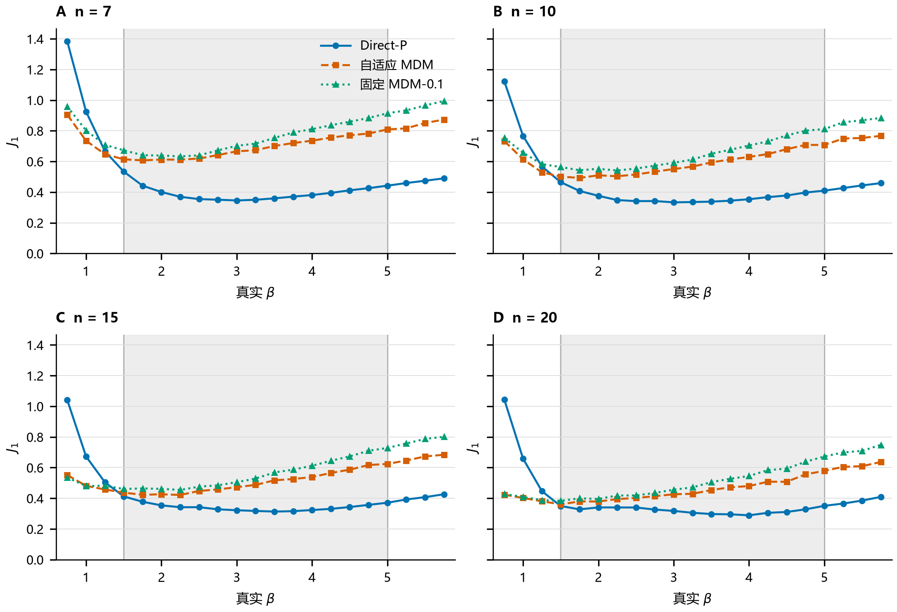
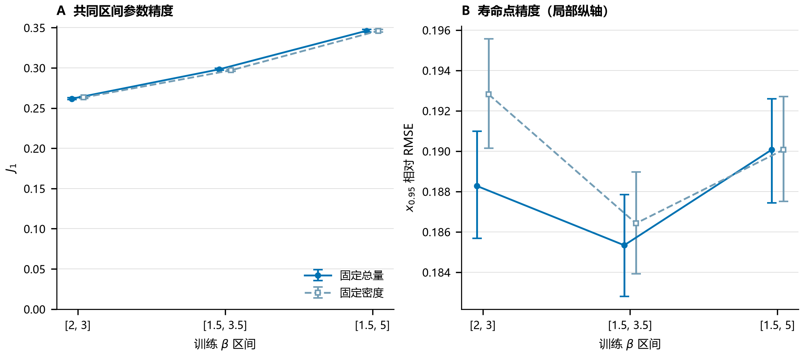
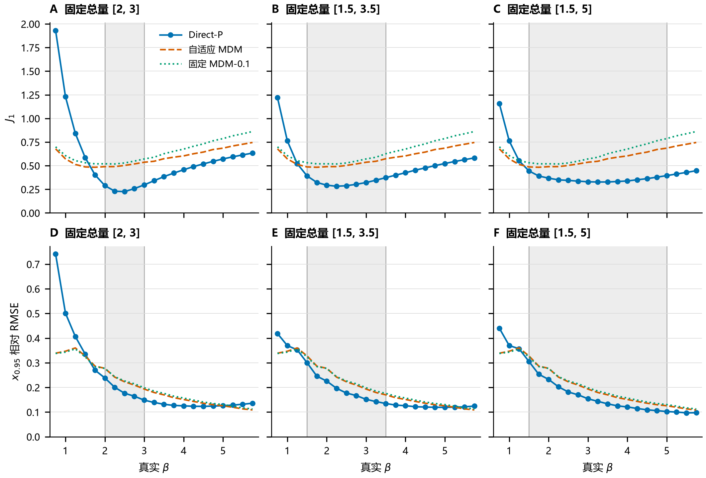
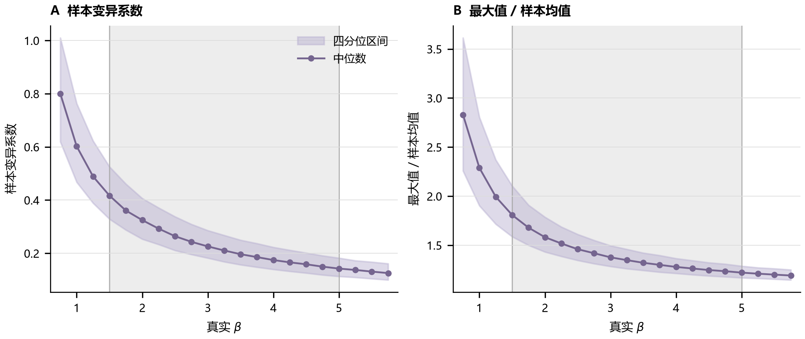

# 附录：三参数 Weibull 直接神经估计的条件性能与训练域依赖

本附录对应[正文](03-稿件-直接神经估计与结构保留路线比较-v0.2.md)，实验编号与配置见[统一配置](02-实验配置.md)，图表来源见[证据索引](01-证据索引.md)。各表沿用正式实验的封存统计；参数误差记号 $e_\beta,e_\eta,e_\gamma$ 与正文一致，位置误差按真实 $\eta$ 标准化。$J_1$ 包含失败惩罚，其余误差统计限于各方法有效估计。

## A.1 方法实现与证据来源

Direct-P 与自适应 MDM 均按 $n=7,10,15,20$ 分别训练。基础开发资源为每个 $n$ 12,000个样本，内部拟合量10,200、验证量1,800。自适应 MDM 使用 sklearn MLPRegressor，输出标准化的26个候选损失；Direct-P 使用 PyTorch，输出解码参数并以参数损失训练。名义学习率均为 $10^{-3}$、批量大小256、正则系数 $10^{-4}$，最多300轮，早停耐心20轮。两种框架的正则实现、内部划分和验证选点不等价；相同种子不表示相同初始化。

输入标准化在各场景完整开发资源上估计，再进行内部随机划分；Direct-P 的编码目标标准化以及选择器的曲线目标标准化也使用对应开发资源。因此内部验证与这些标准化统计并非完全隔离，最终测试样本未参与标准化拟合。模型复现时应保持这一既有实现，不将其改写为已执行了“仅在内部拟合子集上拟合标准化”的流程。

Direct-P 的验证依据为解码后的参数损失，采用改善阈值 $10^{-6}$ 并恢复最佳验证轮的权重；选择器依据验证 $R^2$，采用 MLPRegressor 的早停实现。内置选点行为见 [MLPRegressor 官方文档](https://scikit-learn.org/stable/modules/generated/sklearn.neural_network.MLPRegressor.html)。基础模型的实际训练轮数依 $n$ 递增分别为 Direct-P 的30、25、35、31轮，选择器的53、46、42、38轮。

MDM、WMLE 和 LSE 均采用非负位置约束。WMLE 使用预计算权重表，$W_1,W_2$ 依赖样本量，$W_3$ 还依赖求解中的候选形状参数。封存实现的形状搜索上界为10，达到上界邻域时单独判失败；两个加权方程残差平方和大于 $10^{-8}$ 时判为方程残差失败。LSE 使用对数 Weibull 顺序统计量期望作回归自变量，在位置参数的几何加密网格上搜索并作局部细化，以 Fisher F 比选择位置。其表现对应这套具体实现。

统一评估将未收敛、非有限或非法参数记为失败。位置边界容差为 $10^{-10}\max(|t_{(1)}|,|\eta|,1)$；估计位置进入该边界邻域也记失败。误差很大但仍通过判据的估计保留。失败惩罚的精确值为2.670433491321633，取原开发阶段四个 $n$ 的损失P99惩罚中最大值，并在后续比较中固定。

基础三方案的开发与测试随机数命名空间分别为 `study01_nrmc_v1` 和 `research04_generalization_v1`。WMLE/LSE 在相同确定性测试设计上新增252,000行估计；原三方案使用封存统计，未新增五方法逐样本配对区间。该补充运行的代码基点为 `d41628c89f97e0bf8eec5cce216a97947c0d1a55`，源码哈希另列于清单，不能用后来平台更新后的重跑替代本次数值而不重新说明来源。

| 证据块 | 设计与承担的结论 | 正式来源 |
|---|---|---|
| 基础比较 | 126,000个共享样本，三方案条件性能、β外推、样本量分层 | [manifest](artifacts/study01_aligned_generalization_v1/manifest.json)、[区域汇总](artifacts/study01_aligned_generalization_v1/analysis/domain_summary.csv)、[配对区间](artifacts/study01_aligned_generalization_v1/analysis/paired_bootstrap_contrasts.csv) |
| 传统参照 | 同一设计上的WMLE/LSE，五方法封存汇总比较 | [manifest](artifacts/traditional_aligned_v1/manifest.json)、[五方法区域统计](artifacts/traditional_aligned_v1/combined_domain_summary.csv)、[参数与寿命点统计](artifacts/traditional_aligned_v1/combined_standard_metrics.csv)、[失败原因](artifacts/traditional_aligned_v1/failure_reasons.csv) |
| 同中心与同宽窗口 | 48个模型条件，1,512,000行评价，固定真实参数下宽度比较及位置描述 | [manifest](artifacts/training_domain_width_location_v1/manifest.json)、[共同区间完整指标](artifacts/training_domain_width_location_v1/analysis/width_common_beta_summary.csv)、[独立复算记录](artifacts/training_domain_width_location_v1/independent_verification.json) |
| 先行嵌套窗口 | 6个场景，20个唯一模型，复用其中4个基础模型；756,000行评价 | [manifest](artifacts/training_domain_width_v1/manifest.json)、[配对差](artifacts/training_domain_width_v1/analysis/common_core_contrasts.csv)、[逐点风险](artifacts/training_domain_width_v1/analysis/beta_summary.csv) |
| 成对尺度审计 | 同一批样本与模型的6个尺度，756,000次评价 | [manifest](artifacts/scale_equivariance_v1/manifest.json)、[汇总](artifacts/scale_equivariance_v1/pooled_scale_summary.csv) |
| 风险诊断 | 新验证资源与既有连续β面板上的候选信号 | [manifest](artifacts/replacement_boundary_v1/manifest.json)、[报告](artifacts/replacement_boundary_v1/report.md) |

这些行数用于说明同一样本在多个方案或场景下的重复评价，不能相加当作彼此独立的物理样本数。基础与先行实验的区间条件于冻结模型；同中心与位置表只报告点估计。先行设计与后续设计共用既有测试面板，其间不存在独立新测试数据的重复确认。

## A.2 方向性、样本量与参数偏差

| 方向与位置 | $\beta$ | Direct-P | 自适应 MDM | 固定 MDM-0.1 | WMLE | LSE |
| --- | --- | --- | --- | --- | --- | --- |
| 低侧远域外 | 0.75 | 1.1564 | 0.6781 | 0.6993 | 1.2577 | 0.7024 |
| 低侧远域外 | 1.00 | 0.7625 | 0.5721 | 0.6063 | 0.9679 | 0.6694 |
| 低侧近域外 | 1.25 | 0.5521 | 0.5131 | 0.5532 | 0.7872 | 0.6947 |
| 高侧近域外 | 5.25 | 0.4124 | 0.7089 | 0.8162 | 0.8552 | 0.9975 |
| 高侧远域外 | 5.50 | 0.4288 | 0.7271 | 0.8378 | 0.8705 | 1.0081 |
| 高侧远域外 | 5.75 | 0.4470 | 0.7455 | 0.8618 | 0.8807 | 1.0338 |

**表A1 六个域外 β 点上的五方法 $J_1$。** 每个点6,000个样本，按五个 $\gamma/\eta$ 与四个 $n$ 均衡汇总。逐点列示避免将低侧反转和高侧保持优势混成同一个域外均值。来源为[五方法逐β汇总](artifacts/traditional_aligned_v1/combined_beta_summary.csv)。

| $n$ | Direct-P $J_1$ | 自适应 MDM $J_1$ | Direct-P $x_{0.95}$ | 自适应 MDM $x_{0.95}$ |
| --- | --- | --- | --- | --- |
| 7 | 0.4076 | 0.6945 | 0.2286 | 0.2804 |
| 10 | 0.3765 | 0.5907 | 0.1884 | 0.2217 |
| 15 | 0.3488 | 0.5107 | 0.1534 | 0.1716 |
| 20 | 0.3251 | 0.4535 | 0.1348 | 0.1468 |

**表A2 已见网格的样本量分层。** 每个 $n$ 12,000个测试样本，寿命点列为相对RMSE。来源为[样本量区域汇总](artifacts/study01_aligned_generalization_v1/analysis/n_domain_summary.csv)。

**图A1 四个样本量下的逐β风险。** 面板使用相同纵轴范围，每个面板每个β包含五个 $\gamma/\eta$、每单元300次，共1,500个样本。灰色区域为训练β域，线型和颜色与正文方法定义一致。每个 $n$ 使用独立训练的网络，图中曲线为冻结模型的点估计。

| $\beta$ | $n$ | $J_1$ | $e_\beta$ Bias | $e_\eta$ Bias | $e_\gamma$ Bias | $x_{0.95}$ RMSE |
| --- | --- | --- | --- | --- | --- | --- |
| 5.00 | 7 | 0.8089 | -0.4348 | -0.3767 | 0.3606 | 0.1633 |
| 5.00 | 20 | 0.5789 | -0.3112 | -0.2634 | 0.2550 | 0.0912 |
| 5.75 | 7 | 0.8732 | -0.4830 | -0.4285 | 0.4105 | 0.1379 |
| 5.75 | 20 | 0.6364 | -0.3571 | -0.3058 | 0.2969 | 0.0831 |

**表A3 大 β 区域的自适应 MDM 标准化偏差。** Bias 为带符号均值，位置误差使用 $e_\gamma$；寿命点为相对RMSE。每行汇总五个 $\gamma/\eta$，共1,500个样本。来源为[大β分层汇总](artifacts/study01_aligned_generalization_v1/analysis/large_beta_summary.csv)。

## A.3 先行嵌套域与同宽平移

先行实验比较训练β域 $[2,3]$、$[1.5,3.5]$ 和 $[1.5,5]$。固定总量时每个 $n$ 均为12,000个开发样本，单元重复分别为800、480和300；固定密度时每单元300次，每个 $n$ 的开发量分别为4,500、7,500和12,000。两种预算各在共同真实β区间 $[2,3]$ 的30,000个共享样本上比较。

**图A2 先行嵌套域的共同区间风险。** A 为 $J_1$，B 为 $x_{0.95}$ 相对RMSE；误差线为既有3000次设计单元内配对重采样的95%区间，条件于已训练模型。两种预算的标记略作横向错位以避免遮挡，实际训练窗口相同。B使用局部纵轴量程，固定总量下最宽与最窄模型的寿命误差实际仅相差约1.0%。这些区间不用于后续同中心实验。

固定总量下，三个域的共同区间 $J_1$ 为0.2616、0.2982和0.3461；最宽相对最窄增加32.3%，配对差为+0.0845（95% CI：[0.0829,0.0859]）。固定密度下增幅31.5%，配对差+0.0829（[0.0814,0.0844]）。由于这些窗口还同时改变中心，它们作为先行证据保留；正文用同中心设计回答控制中心后的宽度问题。

**图A3 固定总训练量下三个嵌套域的逐β结果。** 每个 $n$ 均为12,000个开发样本。A–C为 $J_1$，D–F为 $x_{0.95}$ 相对RMSE，同一行共用纵轴；灰色区域为各直接网络的训练域。Direct-P跨列使用同一方法颜色，两条MDM参照曲线在三列中相同，未按新窗口重训选择器。每个β为6,000个共享测试样本。

| 训练窗口 | 预算 | 每个 $n$ 训练资源 | $J_1$ | $x_{0.95}$ 相对RMSE | 失败率 |
| --- | --- | --- | --- | --- | --- |
| [1.5, 2.5] | 固定总量 | 12000 | 0.2843 | 0.2261 | 0.0000% |
| [1.5, 2.5] | 固定密度 | 4500 | 0.2858 | 0.2316 | 0.0200% |
| [2.5, 3.5] | 固定总量 | 12000 | 0.2473 | 0.1563 | 0.0000% |
| [2.5, 3.5] | 固定密度 | 4500 | 0.2490 | 0.1598 | 0.0000% |
| [3.5, 4.5] | 固定总量 | 12000 | 0.2327 | 0.1155 | 0.0000% |
| [3.5, 4.5] | 固定密度 | 4500 | 0.2332 | 0.1189 | 0.0000% |

**表A4 同宽平移的描述性结果。** 各行在自身窗口内按相对位置对齐，包含30,000个测试样本，真实β随窗口变化。不同窗口没有共同内部真实β区间，该表不单独识别窗口位置效应。来源为[相对位置汇总](artifacts/training_domain_width_location_v1/analysis/location_aligned_summary.csv)；[固定真实β统计](artifacts/training_domain_width_location_v1/analysis/same_beta_summary.csv)另行保留。

最宽同中心窗口为 $[0.5,5.5]$，而测试β从0.75开始，因此该窗口没有左侧域外测试点。共同区间宽度比较仍然有效，但不能据此宣称已经验证最宽窗口的双侧外推边界。

## A.4 尺度等变性

将基础比较的126,000个样本及真实 $\eta,\gamma$ 分别乘以0.001、0.01、0.1、1、10、1000，既有四个Direct-P模型保持不变，重新执行网络推断和误差计算。

| $\eta$ | 样本数 | $J_1$ | $x_{0.95}$ 相对RMSE | 失败率 |
| --- | --- | --- | --- | --- |
| 1 | 126000 | 0.4705367 | 0.2060071 | 0.05476% |
| 10 | 126000 | 0.4705367 | 0.2060071 | 0.05476% |
| 100 | 126000 | 0.4705367 | 0.2060071 | 0.05476% |
| 1000 | 126000 | 0.4705367 | 0.2060071 | 0.05476% |
| 10000 | 126000 | 0.4705367 | 0.2060071 | 0.05476% |
| 1e+06 | 126000 | 0.4705367 | 0.2060071 | 0.05476% |

**表A5 成对尺度审计。** 每个尺度使用同一批模拟样本的比例变换，共126,000个样本；六个尺度不是六组独立抽样。$\hat\beta$ 最大绝对差为0，$\hat\eta$、$\hat\gamma$ 按尺度还原后的最大差分别为 $9.09\times10^{-13}$、$4.55\times10^{-13}$。寿命误差列为相对RMSE。

这验证了纯比例缩放下的实现性质，不覆盖绝对测量噪声、固定截断阈值或固定传感器分辨率下的条件变化。实现和分层结果见[尺度审计报告](artifacts/scale_equivariance_v1/report.md)。

## A.5 输入形态与探索性风险诊断

**图A4 测试样本离散程度与极值占比。** 曲线为每个β下6,000个样本的中位数，带状区域为第25至75百分位数，表示样本分布而非均值置信区间；灰色区域标示训练β域。数据为[样本形态汇总](artifacts/study01_aligned_generalization_v1/analysis/sample_geometry_summary.csv)。低侧分布发生明显变化，但域内、域外样本的形态范围可能重叠。

风险诊断另使用16,000个新验证样本确定候选分位阈值，在42,000个连续β测试样本上评价。Direct-P与固定MDM-0.1均成功的41,947个样本用于相对失利事件的区分能力评价。样本变异系数、训练支持距离、最大值/均值的AUC分别为0.737、0.726和0.711。近邻目标离散度的AUC为0.468，按“差异越大风险越高”定义的Direct-P—MDM差异量AUC为0.306；这些不利诊断保留，不能将所测试信号概括为普遍有效。

以样本变异系数验证集第90百分位为阈值，测试中82.1%样本使用Direct-P，其余使用固定MDM，描述性 $J_1=0.4347$，两种始终使用单一方案的值分别为0.4721和0.6587。候选信号与规则尚未经过独立新测试确认，这组结果只提示部分可观测形态与相对风险有关，不构成自动选择或校准区间的验证。

## A.6 文献与复现说明

正文文献[1]用于三参数估计困难；[2]、[3]用于直接神经估计的既有方法定位；[4]用于条件风险与神经点决策的理论联系；[5]–[7]分别对应MDM、WMLE和LSE路线。Yang等公开摘要描述的是六个统计特征加样本量的输入，本研究采用排序样本归一化输入，不能将两者称为相同模型的精确复现。当前文献核对不构成系统性查新。

本版图件由[绘图入口](code/render_manuscript_figures.py)直接读取封存汇总生成，输出于[图件目录](manuscript/figures-v0.2/)，图件来源与检查见该目录的清单。数值推断仍以各实验清单和CSV为准；本次图表整理没有重新训练模型或生成新的蒙特卡洛结果。

基础实验与先行嵌套实验的正式模型和逐样本数据尚未定位。同中心实验的逐样本数据及48个模型已在原Research04 worktree定位，传统参照与探索诊断逐样本数据保留在主目录；恢复位置与核验记录见[研究快照](07-认识清单与研究快照-20260908.md#retained)。历史独立复算记录保留原日期与身份，稿件数值核对和汇总重绘不等于训练与全套原始数据的端到端重跑。
