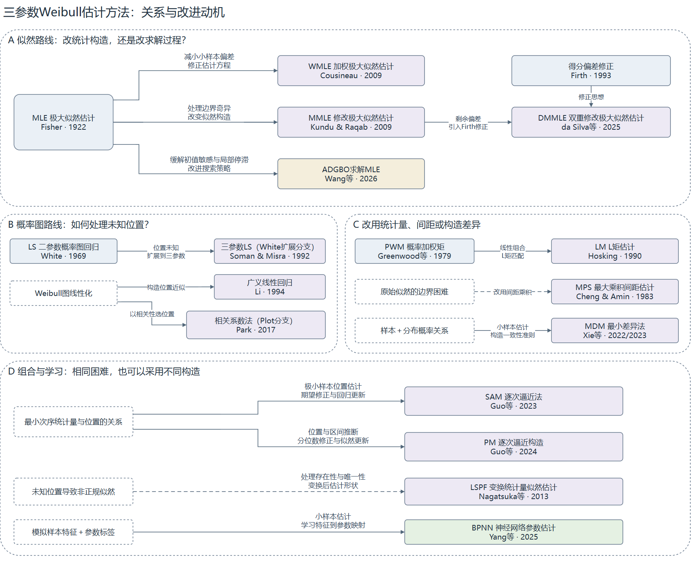

# 三参数Weibull参数估计方法的沿革与比较对象选择

> v2.0 · 2026-09-28。围绕完整样本三参数Weibull新方法的对照选择，按方法体系、近期进展和比较方案组织调研结果。小样本是设计重点，不是文献纳入门槛。

## 研究动机与调研问题

验证一种新的参数估计方法，需要明确：**与哪些方法比较，为什么选它们，具体采用哪个版本？** 只比较MLE、最小二乘等经典方法，可能遗漏后来已有检验的改进；只按年份选新方法，又可能选到不同任务或尚缺少比较证据的工作。因此，本研究先梳理方法及其发展，再核查相关论文实际如何比较，最后提出适合本研究条件的对照方案。

本次围绕五个问题展开：经典方法有哪些、区别是什么；谁在什么基础上作了改进；近10—20年哪些方法值得关注；相近研究与谁比较、如何评价；这些发现怎样落实到对照选择、版本和引用。

调研以180文献库为主体，从杨小玉等2023年综述[181-004]追溯方法原文，记录模型、观测条件、样本量、构造、实际对手、指标与失败处理，并区分提出论文中的自我比较、后续实际采用和独立团队检验。范围限定为普通移位三参数Weibull的完整样本；二参数、其他分布、删失或污染情境单独标注，混合情境论文按子实验判断。本文是定向文献调研，不据库内频次声称完成全领域普查。

正文分三章：第一章说明方法是什么及如何发展；第二章判断近期进展的任务相关性与检验证据；第三章据此确定对照、版本及验证方式。逐篇出处见[附录A](附录A-文献证据.md)，程序与版本核查见[附录B](附录B-方法实现与版本.md)。

## 第一章 已有方法及其发展关系

### 1.1 方法体系：先看估计依据，再看具体构造

三参数Weibull同时估计形状、尺度和位置。各方法的主要区别，在于用什么样本信息、按什么关系确定这三个未知量。为与图1对应，下表按A、B、C、D四组介绍方法及其发展关系。

| 图1分组 | 代表方法与分支 | 主要思路与改进 |
|---|---|---|
| A 似然路线 | MLE、WMLE、MMLE、DMMLE；另列MLE的数值求解改进 | 以似然为基础，分别修正估计方程、改变似然构造或改善求解过程 |
| B 概率图路线 | LS、广义线性回归、相关系数法及LRE具体分支 | 将分布关系线性化；不同构造在位置求法、绘图分数、回归方向和参数恢复上有所区别 |
| C 统计量、间距与构造差异 | MM、PWM、L矩；MPS；MDM | 分别匹配样本与理论统计量、最大化概率间距乘积，或减小尺度伪估计之间的差异 |
| D 组合与学习（含统计量变换） | LSPF、SAM、PM、神经估计 | 通过变换统计量构造似然、组合位置修正与回归或似然更新，或学习样本特征到参数的映射 |

**这四组用于组织方法沿革，不是严格互斥、穷尽的方法分类，也不表示性能排名。** C组包含三种不同估计依据；D组强调完整估计器的构造方式，其中LSPF仍使用似然，SAM、PM也调用回归或似然步骤。Newton、PSO、DE等是求解工具，归属取决于其求解的统计目标，不能仅凭优化器名称认定出现了一种新估计原理。贝叶斯则由先验、似然与后验决策共同定义，本文另作说明。

**图1 方法关系与改进动机。** 节点按方法、作者和年份标识。实线表示有依据的继承、扩展或组合，虚线表示针对同类困难的替代方案；不表示性能必然改善。蓝色为已有方法或依据，紫色为统计构造变化，黄色为数值求解改进，绿色为直接学习映射。白色虚框为问题或构造依据。Fisher（1922）标示通用似然原理的重要奠基来源，不是三参数Weibull方法提出年份；MMLE特指图中Kundu–Raqab构造，MDM区分在线与卷期年份。[可编辑源文件](图片/方法关系与改进动机.drawio)。

这张图说明方法的发展不是逐代替代：同一种困难可能产生不同方案，同一个新方法也可能组合不同路线。以下把基本思路和沿革放在一起，重点解释各次改动改变了什么。

### 1.2 似然路线：从共同参照到有限样本与边界修正

MLE是已有比较研究中的常见参照。其基本依据是固定样本、改变参数，使整组观测的似然较大。记完整独立同分布样本为$t_1,\ldots,t_n$，参数为$\theta=(\beta,\eta,\gamma)$，依次表示形状、尺度与位置：

$$
F(t;\theta)=1-\exp[-((t-\gamma)/\eta)^\beta],\quad t>\gamma,\quad\beta,\eta>0;
\qquad \ell(\theta)=\sum_i\log f(t_i;\theta).
$$

其中$f$为对应密度，$t\le\gamma$时$F=0$。只有声明的参数域内存在有限最大值时，才可直接写$\hat\theta=\arg\max\ell(\theta)$。未知位置改变支持域，三参数似然可能出现边界无界、局部分支以及有限样本偏差。这些困难解释了后续修正为何出现，也使“采用MLE”本身不足以交代版本。

Fisher（1922）是通用似然原理的重要来源。Weibull专用改进形成多个分支：Cohen–Whitten（1982）修改估计条件；Cousineau（2009）[182-088]承接Jacquelin（1993）的二参数构造，扩展到三参数并引入有限样本修正权重；da Silva等（2025）[182-111]则在Kundu–Raqab（2009）修改似然的基础上加入Firth得分偏差修正，形成DMMLE。它们改变的对象不同，不能写成依次替代的同一种方法。

以WMLE形状方程为例，令$a_i=t_i-\gamma$：

$$
\frac{J_2(n)}{\beta}+\frac1n\sum_i\log a_i
-\frac{\sum_i a_i^\beta\log a_i}{\sum_i a_i^\beta}=0.
$$

普通MLE相应方程首项为$1/\beta$；WMLE引入$J_2(n)$，位置和尺度另有配套修正。**它改的是估计方程，并非只给求解器换一个名字，也不是任意逐观测加权。** 完整方程和权重边界见附录B第5节。PSO等若仍优化相同似然、使用相同约束，首先改变的是数值搜索；更高似然并不直接等于更小参数误差。

### 1.3 概率图路线：未知位置、绘图分数和回归方向产生不同版本

概率图路线将分布关系线性化。记$t_{(i)}$为排序观测，$p_i$为绘图概率：

$$
x_i(\gamma)=\log(t_{(i)}-\gamma),\qquad z_i=\log[-\log(1-p_i)],
\qquad z_i\approx\beta x_i-\beta\log\eta.
$$

位置决定点如何展开，回归则由斜率、截距恢复其余参数。这一思路直观，但未知位置怎样确定、分数怎样分配、沿哪个方向最小化残差，都能改变估计。

White（1969）的二参数最小二乘背景，由Soman–Misra（1992）[182-104]明确扩展到三参数；Li（1994）[182-107]研究广义线性回归构造；Park（2017）[182-115]用相关系数估位置，再分别用概率图回归或条件二参数MLE估其余参数，Park（2018）[182-106]进一步讨论位置估计存在性。White至Soman–Misra是明确扩展关系；不能仅凭时间顺序把Li、Park也串成直接继承链。

**读图：** 散点由理想分位数构造，γ=2时恰好线性；随机样本通常不会落在一条直线上。 右图故意固定同一绘图分数以隔离回归方向的影响；实际项目LS和LRE还更换分数。

项目LS采用次序统计量期望分数，回归$x=a+bz$后取$\hat\beta=1/b,\hat\eta=e^a$；项目LRE采用Bernard绘图位置，回归$z=a+bx$后取$\hat\beta=b,\hat\eta=e^{-a/b}$。相同分数、相同位置下，两种回归一般也不等价。项目LS的F比选位置与LRE的相关系数平方选位置，在相同分数和带截距OLS条件下单调等价，因此不能把区别只说成“F与相关系数不同”。

**这条路线对选型的直接启示是：LS或LRE是类别名称，引用和比较必须落到具体构造。** Park的两个恢复分支也不能省略。第三章再据比较作用确定采用方式。

### 1.4 矩与间距：两种不同于密度似然的经典依据

普通矩法匹配样本与理论统计量，例如$n^{-1}\sum_i t_i^r=E_\theta[T^r]$，通过三个关系估计三个未知参数。Greenwood等（1979）的PWM使用概率加权矩，Hosking（1990）的L矩可由PWM线性组合得到。它们改变用于匹配的统计信息，不意味着后来的统计量在所有样本上必然更好。Cohen–Whitten的修正矩是另一支，不与PWM、L矩构成未经核实的继承链。

MPS则直接改变估计准则。Cheng–Amin的1979年报告和1983年论文[182-116]是早期来源，已核文献也追溯到Ranneby（1984）的独立提出。设$u_i=F(t_{(i)};\theta)$、$u_0=0,u_{n+1}=1$：

$$
D_i=u_i-u_{i-1},\qquad \hat\theta_{\rm MPS}=\arg\max_{\theta\in\mathcal D}\sum_{i=1}^{n+1}\log D_i.
$$

**读图：** 参数改变时，CDF及全部概率间距一起改变；乘积惩罚极小间距。

MLE使用观测处的密度，MPS使用相邻观测之间的概率质量。Akram–Hayat（2014）[182-096]及Safari等（2025）[182-003]仍将其纳入比较，说明经典准则可以持续承担参照作用。后续使用不是方法改进，也不保证适用于所有新任务；重复观测造成的零间距仍需处理。

### 1.5 新构造怎样与已有路线衔接

MDM由Xie等（2022在线、2023卷期）[182-030]提出本文所指的具体构造：由每个排序观测和绘图概率反推尺度伪估计，调整形状与位置，使其差异减小。

$$
\eta_i(\beta,\gamma)=\frac{t_{(i)}-\gamma}{[-\log(1-p_i)]^{1/\beta}}.
$$

它与概率图都利用样本及概率的关系，但一个比较尺度伪估计的一致性，一个拟合变换后的直线。带偏移修正的方程与原始差异最小化也不能混称一个版本。现有来源不足以把MDM写成MPS或某个LS版本的直接后继。

另一些方法重组已有步骤。Nagatsuka等（2013）[182-113]对消除位置、尺度影响后的统计量构造形状似然；Guo等SAM（2023）[185-005]用最小值期望关系结合回归更新，PM（2024）[182-117]用最小值中位数关系结合条件似然更新。两版共同采用逐次逼近流程，但所用关系不同，未确认直接升级关系。

直接学习估计则把估计器写成$\hat\theta=g_w(s(\mathbf t))$：训练阶段用模拟样本及真参数学习权重，使用阶段从样本特征输出参数。Yang等BPNN（2025）[184-009]是已核近期候选，不能据此声称神经估计始于2025年；Abbasi等（2008）[183-020]已有直接三参数ANN研究。网络若只提供初值，仍应按最终统计准则归类。贝叶斯则以$p(\theta\mid\mathbf t)\propto L(\theta;\mathbf t)\pi(\theta)$定义后验，再由决策规则给出估计，先验和后验决策均属于方法定义。

至此，主要区别已经明确：经典方法提供共同参照，各类改进改变了不同环节。**仅认识类别还不能完成选择，下一章进一步看近期构造是否匹配任务、经历过怎样的比较与采用。**

## 第二章 近期进展及其检验证据

### 2.1 近期工作主要改进什么，哪些属于本次任务

近10—20年的工作并非都在同一条件下竞争。已核材料可归为三种改进层次：改变估计构造以处理偏差、未知位置或可解性；适应删失、污染等观测条件；保留统计准则而改善数值求解。直接学习映射又引入训练分布、特征和损失的选择。

| 研究方向 | 已核查的例子 | 为什么不一定进入当前主比较 |
|---|---|---|
| 污染与异常值下的估计 | Safari等PITE，2025 | 主要评价抗污染能力；如果本文只讨论干净样本，不能用任务不同解释为它不够好 |
| 删失样本的信息利用 | Nassar–Elshahhat，2024[182-114]；Liu等ICP-CDF-LS，2026[182-103] | 观测机制不同；前者还是二参数模型，不能直接列入完整三参数排名 |
| 低形状、小样本的位置估计 | Tsukada等，2025[182-050] | 在特定形状范围有直接相关性；目前方法细节和对手说明仍需核清，低形状是本文主张时应提高优先级 |
| MLE的计算可靠性和效率 | Wang等ADGBO，2026卷期 | 主要改进求解过程；适合评价求解效率与可靠性，不能仅因优化器较新就当作新的估计原理 |
| 学习与统计方法结合、具体应用拟合 | Ali等AICQME，2025在线/2026卷期[183-012] | 对二参数风速分布进行估计和校正，使用目标与三参数小样本疲劳问题不同 |

筛选必须落到实验条件。MV-MLE[182-064]虽面向加速试验，却含完整单应力、n=5/15/30的子实验；AHA[187-011]虽用三参数模型，已核模拟与真实例涉及删失。Abbasi等ANN的重复模拟从n=100起，可补充沿革与评价设计，不能直接证明极小样本优势。核密度—NN—GA[184-010]改变的是带宽，也不能一律列为MLE求解。

这些证据支持“近期工作解决不同任务和困难”。特殊条件及智能求解在库内反复出现，但没有同口径年度统计证明全领域注意力已经转移，更不能因此推断完整三参数估计近期没有进展。

### 2.2 与完整三参数估计直接相关的近期候选

| 工作 | 针对什么问题、提出什么改变 | 对当前比较的价值 |
|---|---|---|
| Cousineau WMLE，2009 | 在MLE方程中引入偏差修正权重 | 在近20年范围内，已有后续比较研究采用，适合作为有限样本的重要参照；不能因为名字含MLE就当作几十年前未变的方法 |
| Nagatsuka等，2013 | 用不受位置和尺度影响的统计量构造估计 | 重点处理估计存在性、唯一性与一致性；当论文声称改善可解性时，应优先考虑这条路线 |
| Park，2017、2018 | 用相关系数处理未知位置，并研究估计存在性 | 为概率图类对照提供明确的近期来源；与现有LRE接近，不必把所有近似版本都列为独立主对手 |
| Xie等MDM，2022在线/2023卷期 | 用样本和经验概率构造各自的尺度估计，最小化其差异 | 与完整小样本任务直接相关；若新方法改进MDM，原MDM必须保留 |
| Guo等SAM，2023 | 根据样本最小值与位置参数的关系，逐次更新三个参数 | 原文直接研究n=5、10、15、20，适合补充近期非学习对照；求解边界须披露 |
| Guo等逐次逼近PM，2024 | 给定位置后用似然估计形状、尺度，以最小值的中位数关系修正位置；另讨论区间估计 | §5.1直接比较n=5下的LSE、MLE、PWM，值得作为2023 SAM的另一候选；同团队工作不算独立确认，尚无两版直接优劣证据 |
| Yang等BPNN，2025 | 从样本特征学习到三个参数的映射 | 适合学习型方法比较，原文也覆盖n=5—20；目前输入表述及训练配置有缺口，不能用任意另训网络冒充原版 |
| da Silva等DMMLE，2025 | 在修改似然基础上进一步修正得分，降低偏差 | 适合覆盖近期似然修正路线；原文仿真从n=50开始，对极小样本的比较属于补充检验，不能预先认定其最强 |

这里将“提出了什么”与“是否应进入本次比较”分开。SAM/PM与极小样本直接相关；DMMLE虽从n=50开展模拟，仍提供近期偏差修正构造，进入更小样本比较属于新的检验。BPNN配置未决会影响是否能采用原版；方法发表较新本身不解决复现和公平比较问题。

### 2.3 从提出论文到后续采用：哪些证据支持其对照地位

提出论文中的比较说明作者已做过哪些检验，后续实际采用说明它进入了别人的研究设计，独立团队的同条件比较则提供进一步证据。这三者不能合并成一个“权威性”标签。仅被引用不等于被比较，同团队延续也不算独立确认。

| 方法 | 已确认的后续证据 | 可以怎样评价 |
|---|---|---|
| WMLE | Nagatsuka等（2013）实际比较w-ML；Safari等（2025）以WMLE为污染实验对手，作者均与Cousineau不同 | 有跨作者、跨年份采用依据，是近20年内有根据的参照；不同论文的权重处理不完全相同，不能直接搬用其排名 |
| MPS | Akram–Hayat（2014）和Safari等（2025）均实际比较 | 虽是经典方法，仍在近期研究中承担对照，保留理由不只在历史地位 |
| Park相关回归 | Wang等（2026卷期）按Park（2017）介绍CCLSE，并纳入实验；作者名单与Park不同 | 有后续实际采用，可作为近期概率图路线的代表 |
| MDM | 2024形状比较[182-025]及2025 BPNN论文实际采用，但与提出团队有作者重合 | 支持任务相关及母方法地位，不能把这些论文合算成多次独立团队确认 |
| SAM、BPNN、DMMLE | 已有提出论文；本次定向核查尚未确认足够的独立性能比较 | 可因创新点和任务匹配而选，暂不称为公认基准；未确认不等于不存在 |

WMLE和Park相关回归已有跨作者采用依据；MDM的若干后续比较与提出团队有作者重合；部分更新的构造仍主要依靠提出论文。采用证据也有场景边界，例如污染实验采用WMLE支持“它被使用”，不直接证明它在干净小样本里最好。

**调研结论是：有理由考虑近期对手，不能只比较未经改进的经典版本；但现有材料尚不能给出一个公认、全面最优的最新方法。** 下一章将这些候选与相近论文的实际比较方式结合，确定可辩护的对照方案。

## 第三章 对照选择、采用版本与验证建议

### 3.1 相近研究实际怎样选择对手

| 提出方法及来源 | 与本研究相近的样本条件 | 原论文实际对手 | 原论文实际评价指标 |
|---|---|---|---|
| Cousineau WMLE（2009）[182-088] | 完整三参数；n=8、16、32，每条件1024次 | 迭代MLE、两步MLE，另比J/G/混合权重版本 | 中位偏差、三参数相对距离的中位数及SD；不是通常的均值Bias/RMSE |
| Nagatsuka等LSPF（2013）[182-113] | 完整三参数；含n=10、20，每条件1000次，另有较大n | Hall–Wang的BL、w-ML；后者采用Ng等的W3代入方式 | 各参数及联合Bias、RMSE，CPU时间 |
| MDM（2022在线/2023卷期）[182-030] | 完整三参数；含n=15的30组、n=30的15组，其他生成例合计65组 | ML、概率图相关系数LS | 参数均值、SD、估计范围；低概率CDF和保守性；另记录MLE失败 |
| 最小二乘迭代[182-047] | 完整三参数；n=10、15、20、25、30，两组真值，各1000次 | 相关系数法 | 三个参数及99%可靠度寿命的Bias、RMSE |
| Guo等SAM（2023）[185-005] | 完整三参数；n=5、10、15、20，每条件10000次 | MLE、CCWP（Weibull概率图相关系数法）、PWM（概率加权矩） | 三参数平均绝对偏差MAD、三参数平均标准差MSD；MTTF和99%可靠度寿命的MAD |
| Guo等PM（2024）[182-117] | 完整三参数；§5.1单列n=5，每条件10000次 | LSE、MLE、PWM | 表13比较位置估计接近零/非正的发生率；表14比较参数汇总值和三参数平方误差和E²；表10另报自身Mean、STD、Bias、MSE |
| Yang等BPNN（2025）[184-009] | 完整三参数；n=5、10、15、20，每条件1000组 | CCM（相关系数法）、MDM | 三个参数和99%可靠度寿命的SD、RMSE |
| Tsukada等低形状估计（2025）[182-050] | 完整三参数；n=10、20、30，每条件100000次 | w-MLE、BL、LSPF，另比自身greg2/rank分支 | 各参数Bias、RMSE及Joint指标；原文variance/RMSE定义有疑点，采用前需核实，不直接照抄公式 |
| WMLE形状偏差修正[182-024] | 完整三参数；n=3—15构造修正，另在n=4、5各1000次验证 | 原WMLE、MR/MH两种修正版本 | 形状参数的均值、Bias、RMSE；没有因此证明三个参数同时改善 |
| MV-MLE[182-064] | 完整单应力；形状0.5，n=5、15、30，各1000次 | 作者另构造的“均值误差最小”方法；此子实验对手不是标准MLE | 平均参数估计、平均估计距真值的误差及改善比例；不是逐次RMSE |

这组n约5—30的实例不是完整名单或采用率分母。它揭示两种反复出现的做法：SAM、PM等选择MLE、概率图或PWM作跨路线参照；WMLE修正、BPNN等又选择原方法或邻近构造来检验新增收益。对新方法，常用参照与直接前身各有作用，不能彼此代替。

当前44条候选/理论来源均已有评价记录，其中3条理论构造、2条待核项和1条GEV扩展单列，38条进入经验用途统计。确认重复生成样本21条、真实应用21条，两者兼有10条；次数不是独立团队或数据集数，也不代表全库全文核查完成。逐篇依据保存在附录A，不用少数示例代替完整的核查记录。

### 3.2 根据比较作用组成对照组

| 比较作用 | 当前可考虑的方法 | 选择依据，以及其他方法何时加入 |
|---|---|---|
| 通行参照 | MLE | 用于联系已有研究；须明确三参数情形的约束和求解定义。保留它不表示认定其小样本最优 |
| 有后续采用依据的有限样本修正 | Cousineau WMLE（2009） | 位于近20年范围，且有跨作者实际比较，既有明确修正内容也有后续使用依据 |
| 不同估计依据 | MPS；必要时LM | MPS在近期论文中仍被采用，并提供似然以外的参照。LM在论文强调矩类、较高形状区或更广方法覆盖时值得加入；本报告没有证据以MPS全面替代LM |
| 工程概率图参照 | 一个明确的相关回归版本 | Park（2017）有具体构造及后续采用，适合建立可追溯对照。LS与LRE同列时应有比较分数或回归方向的目的，而非仅增加方法数量 |
| 近期且任务匹配 | SAM（2023）或Guo等PM（2024） | 两者均含极小样本研究，但构造不同；前者覆盖n=5—20的点估计，后者结合似然与位置修正并讨论区间。是否同时采用取决于本文是否需要检验这两种构造 |
| 与创新点直接相关 | DMMLE（2025）、BPNN（2025）、Nagatsuka等（2013）、原MDM | 分别对应偏差修正、学习估计、可解性相关构造和母方法比较。创新点落在这些方面时，不能仅因已有其他对照而忽略它们 |

据目前证据，起始组合可取**MLE、Cousineau WMLE、一个明确版本的相关回归方法、SAM或PM中的任务相关构造，以及新方法的直接母方法**。这是本文的选择建议，不是固定必选标准。若研究改进MDM，原MDM必须保留；若主张学习估计优势，应认真考虑BPNN；若主张改善存在性或低形状表现，应提高Nagatsuka等/LSPF与低形状构造的优先级。

MPS提供另一种估计准则，且有后续独立比较依据，适合扩大路线覆盖；PWM在SAM和PM中有同条件采用依据，L矩也可在矩类或较高形状研究中加入。篇幅或实现条件有限时，根据论文要证明的改进取舍，不能把暂不纳入解释为性能已被淘汰。删失、二参数等方法不直接进入主比较，原因是任务不一致。

### 3.3 将每个入选方法落实到具体版本与引用

LRE在当前项目中是程序标签，并不唯一对应一篇论文。沿革中涉及的三项来源承担不同作用：

| 来源 | 提出了什么或改变了什么 | 对本次引用与实现的意义 |
|---|---|---|
| Li（1994），182-107 | 广义线性回归分析，含位置近似及联立求解构造 | 可用于介绍该路线；只有实际采用其相应构造时，才称为Li的方法。现有相关系数搜索程序不能仅凭线性化关系相同就归于Li |
| Park（2017），182-115 | 用相关系数估位置，再分别用概率图回归或二参数MLE估其余参数 | 是两种明确组合的构造来源。两者分别为Proposed+Plot和Proposed+MLE2，不能只写Park方法而省略分支 |
| Park（2018），182-106 | 讨论Weibull图位置估计的存在性 | 用于支持相关理论讨论；采用2017构造时，不宜仅引用2018的存在性论文 |

若准备建立一个明确对应原文的回归对照，**Park（2017）的Proposed+Plot是有依据的候选**：原文给出绘图位置、位置选择和回归步骤，且有后续研究采用。选择它是为了代表相关系数加回归路线，不是已有证据证明它全面优于Li或其他版本。Proposed+MLE2在固定位置后改用似然估计，若论文需要比较后续估计准则，就值得另列；仅需一个回归参照时，不必把两支都纳入。

采用Proposed+Plot时，必须保留其绘图位置规则：n≤10用(i−3/8)/(n+1/4)，其余用(i−1/2)/n；相关系数选位置后，以变换概率对对数平移寿命作回归。届时可写：“采用Park（2017）提出的相关系数位置估计与概率图回归组合（Proposed+Plot）作为回归类对照。”并引用[2017构造论文](https://doi.org/10.23055/ijietap.2017.24.4.2848)。

如果继续使用现有项目LRE，则应写清另一件事实：“采用基于Weibull图相关系数的位置估计路线（Park，2017），绘图位置取Bernard公式(i−0.3)/(n+0.4)，固定位置后以普通最小二乘估计形状和尺度。”随后披露非负位置约束及搜索设置。**这描述的是本文采用的具体变体，不能写成完整复现Park原版，也不能写成Li（1994）原版。** 改变绘图位置的合理性尚未得到全面性能证据支持；保留旧结果便于衔接是项目理由，不能包装成统计最优理由。正式选型可以采用原文组合，也可以保留并如实说明现有变体，但尚未选择、实现和重算的版本不能借用旧结果。

| 方法 | 应引用的构造来源 | 采用什么、为什么；哪些不能混用 |
|---|---|---|
| LS | [Soman–Misra，1992](https://doi.org/10.1016/0026-2714(92)90057-R)；White作为前史 | 当前程序采用其White扩展分支：次序统计量期望分数、对数寿命对分数回归。适合保留该历史参照或专门比较回归构造；不等于原始CDF残差LS、加权LS，也未实现该论文全部形状分支。可描述为“基于Soman–Misra所述White扩展分支的最小二乘估计”，另说明本地搜索和适用范围 |
| WMLE | [Cousineau，2009构造论文](https://doi.org/10.1348/000711007X270843) | 若采用当前J类中位权重，应明确为该权重版本，并说明表值、插值及参数约束。可写“采用Cousineau的加权极大似然估计，使用其中的中位数修正权重”。同作者比较论文用于支持选型，不能代替构造引用；任意观测加权似然、其他W3代入方式不自动等同于此版本 |
| MLE | 引用实际采用的三参数Weibull估计或求解来源；通用理论来源仅作背景 | 先明确求的是局部似然解、受限最大值还是其他修正解，并说明支持域与接受规则。不能仅引用Fisher就交代了具体实现，也不能把有限范围搜索称为无约束全局MLE。现有程序及失败筛选见附录B，正式论文表述须与最终算法对应 |
| MPS | [Cheng–Amin，1983](https://doi.org/10.1111/j.2517-6161.1983.tb01268.x) | 可写“采用Cheng与Amin提出的最大乘积间距准则”，再列本文数值求解设置。适合提供不同准则的经典参照；研究代码是本地实现，不是作者软件。重复值处理和人为搜索边界需另说明 |
| MDM | [Xie等，2022在线/2023卷期](https://doi.org/10.1142/S0219455423500852) | 引用最小差异构造，并标明采用的概率/偏移设置。研究改进MDM时必须保留母方法；固定偏移与学习选择偏移不是一个未经改动的版本 |
| SAM 2023 | [Guo等，2023](https://doi.org/10.1007/s12206-023-1019-z) | 可描述为“采用基于最小次序统计量期望关系与回归更新的逐次逼近法”。适合n=5—20点估计参照；不能把形状更新改成二参数MLE后继续称原版 |
| PM 2024 | [Guo等，2024](https://doi.org/10.1002/qre.3559) | 可描述为“采用结合位置中位数修正与形状、尺度似然估计的逐次逼近法”。其n=5研究及区间内容使其与当前任务相关；不能与2023版共用公式、数据或复现声明 |
| DMMLE | [da Silva等，2025](https://doi.org/10.3390/e27050485) | 引用双重修改构造，明确最小值处理、调整得分及参数化。适合近期偏差修正比较；不能用WMLE替代，也不能仅因年份较新就认定其在n<50下已有优势 |
| BPNN | [Yang等，2025](https://doi.org/10.1016/j.probengmech.2025.103828) | 采用其具体学习方案须交代特征、训练范围和配置。适合学习估计比较；目前配置仍有缺口。另训网络只能如实称基于该思路的实现，不能冒充原论文模型 |

提出论文说明方法是什么，后续比较论文支持它为何值得选，本文的实现设置负责交代实际做了什么。综述适合提供入口，不能代替具体构造来源。引用、公式与实际程序必须对应；尚未实现和重算的新版本不能沿用旧版本结果。

### 3.4 怎样验证：先区分真值误差、真实拟合与重复性

| 来源 | 真实样本与实际对手 | 原论文评价方式 |
|---|---|---|
| 迭代LS[182-047] | 20个轴承转子寿命、11个铝合金寿命；对相关系数法 | K-S、拟合曲线、左尾及保守性 |
| BPNN[184-009] | 15个铝合金疲劳寿命；对CCM、MDM | K-S统计量、p值、经验CDF与拟合CDF、参数估计 |
| LSPF[182-113] | 10个轴承寿命、4点寿命；对MM、BL、w-ML | 参数结果、变换似然形状及不收敛记录 |
| SAM[185-005] | 10个轴承寿命、4点寿命；对前人Bayes、LSPF、阈值及似然估计结果 | K-S、CDF、绘图概率处误差及累积、MTTF和可靠度寿命；部分为历史结果，非统一重跑 |
| Park相关回归[182-115] | 24个机械部件寿命；对MLE3、Sirvanci–Yang、Gumbel及组合估计 | 相关系数R、p值、AD；不是参数真值误差比较 |

模拟能以已知真参数评价误差，真实数据通常没有该参照。上表的真实部分主要展示拟合、应用结果与可计算性；反复使用的10点或4点数据，也不能算成多套独立验证。真实拟合更好，不等于参数RMSE更小。

21条重复生成样本来源中的已确认指标如下：

| 指标 | 来源数 | 含义与限制 |
|---|---:|---|
| 参数Bias/相对Bias | 11 | 系统偏差 |
| 参数RMSE | 10 | 综合误差，其中2条只评价形状 |
| 参数SD或其聚合 | 9 | 抽样波动 |
| 参数MSE | 2 | 均方误差；182-117为自身性能，跨方法E²另列 |
| 参数MAD | 1 | 平均绝对偏差 |
| 可靠寿命/MTTF误差 | 3 | 工程目标的准确性 |
| 参数区间覆盖率 | 1 | 区间校准；展示区间不自动计为覆盖实验 |

指标可重叠；未编码表示未确认，不是原文没有。分母含自身性能研究、仅形状评价和同团队工作，因此是当前记录的用途统计，不能解释为全领域共识比例。已有做法支持分别评价偏差、误差和抽样波动，但没有形成统一指标组合。

真实数据再抽样还要看“抽什么、用什么参照”。相关—回归[182-004]从330个实测值抽不同容量子集，最小n=25，3次抽样比较相关性和寿命/强度限波动；这不产生已知真参数。自助加权范数[182-084]抽的是多准则参数信息向量，不是原始寿命样本。Gibbs[182-006]是后验抽样，也不是重复生成独立实验样本。Hirose[182-105]用合并100件估计对照5批各20件的区间，再以模拟检查覆盖；合并估计仍非真值，且其GEV分支作为邻近设计单列。

| 评价设计 | 用什么作参照，常用什么指标 | 能回答什么 | 不能据此回答什么 |
|---|---|---|---|
| 已知参数Monte Carlo | 固定真参数反复生成独立样本；参数/分位点Bias、MAE、RMSE、SD、区间覆盖率与长度、有效率 | 在设定分布与参数条件下，精度、稳定性、区间校准及可解性如何 | 不能自动推广为真实总体的准确率 |
| 一组真实数据拟合并比较 | 原始观测及经验CDF；K-S、AD、CDF图、对数似然，报告参数和寿命量 | 方法能否应用，以及对这组数据的拟合差异 | 参数真值未知，不能证明参数RMSE更低；同数据拟合不等于预测验证 |
| 真实数据子抽样 | 从较大实测集取不同n子集；比较估计波动、拟合及与预定参照的偏离 | 样本量变化下的敏感性与重复性 | 若参照为全样本估计，只能称参考误差，不能称真参数误差；重叠子样本也不是独立实测批次 |
| 非参数Bootstrap | 从原始观测有放回抽取，逐次重估；Bootstrap SD、区间、相对原估计的偏移 | 在经验分布近似下评估不确定性及稳定性 | 不能凭重抽样造出未知真值，也不能凭区间更窄认定覆盖更好；未知端点模型不能未经论证就假定普通Bootstrap有效 |
| 参数Bootstrap | 先拟合，再从拟合Weibull生成样本；拟合参数是该模拟世界的已知生成值 | 在真实数据校准出来的模型条件下评价误差或校准检验 | 不是证明原始真实总体参数已知；只用某一候选拟合出的模型可能有利于该候选，需说明模型选择并做敏感性检查 |
| 真实数据留出或独立验证 | 用训练样本估计，在未用于拟合的观测上计算预测对数得分、分位数损失或预先指定的校准指标 | 对新观测的预测能力；分位数损失可评价目标寿命的预测用途 | 仍不是未知参数的真值误差；极小样本和低尾概率下证据可能很弱 |

表中的Bootstrap和留出设计用于解释可选评价逻辑，**不表示本次文献已确认它们都是通行做法**。参数Bootstrap只在拟合模型条件下有生成真值；普通Bootstrap在未知端点模型中也不能未经论证就使用。对极小样本反复重抽，不能补出新的独立尾部信息。

据此，本文建议以多参数条件、多个n的共同Monte Carlo为主要精度证据，再配有来源的完整真实数据应用。各方法使用同批样本，按条件报告逐参数Bias、RMSE及有效率；若主张可靠寿命改善，增加对应分位点误差，例如99%可靠度寿命即1%分位点。若主张区间改善，覆盖率与长度应共同评价。联合指标必须说明归一化，位置真值为零时不能直接用相对位置误差。

样本量可用n=5、10、15、20、30为主轴，n=50或100看趋势；参数范围按论文适用域设置，不能仅展示一组真值。重复次数由Monte Carlo误差和计算资源决定，文献的10000次不是统一要求。具有严格等变性的估计器可解释标准化依据，学习方法则需检验训练范围的影响。这些是基于调研提出的设计建议，不是已实施的新实验。

### 3.5 方法没有返回有效估计时，怎样保留公平比较

普通三参数Weibull的支持域随位置参数变化，必须满足位置γ小于样本最小值x(1)。当固定0<β<1、η>0，并令γ从下方逼近x(1)时，最小观测对应的密度含有(x(1)−γ)^(β−1)，趋于无穷，似然也随之无界。因此，**如果允许整个β>0参数空间和该边界路径，不受限似然不存在有限的全局最大值**。这是目标本身的问题，不是多迭代几次或换PSO就能消除的。这个事实不应误写成“只有真形状<1的样本才有问题”：真形状未知，估计时允许搜索的参数域才是关键。理论背景见[182-111]及其[原文](https://pmc.ncbi.nlm.nih.gov/articles/PMC12110674/)。

文献里仍称MLE的数值结果，往往是在限制形状/位置范围后寻找局部极大、求解似然方程或采用特定分支。应进一步区分四类：目标无界或有限极大不存在；局部驻点/分支问题；数值算法在给定预算内未收敛；已经返回但越界或贴边的结果。找到似然方程根也不保证它是局部极大，更不保证是全局极大。“形状≤2不满足通常正则渐近条件”也不等于“每个样本都算不出”。

| 原论文 | 实际处理 | 阅读其比较结果时要注意什么 |
|---|---|---|
| [182-096] §4.1 | 仅比较ML收敛且L偏度满足阈值的样本；形状<1省略MLE | 这是筛样后的条件精度，不能宣称全部输入上的可靠性；未展示部分不是失败率为零 |
| [182-091] §7—8、表II/III | MLE形状限制在(1.01,15)，其他估计限制在(0.1,15)，另限制位置；限制求解迭代并报告未得到估计次数 | 失败同时受方法、约束及程序预算影响，不能全部标为数学无解；其报告次数的做法值得借鉴 |
| MDM[182-030] 图5及CDF比较 | n=15的30组中MLE有6组未得到解，图上用参数零值作标记；部分CDF展示排除失败样本 | 零是绘图标记，不是可代入RMSE的估计值；不同图的分母需要分别说明 |
| [182-101] §3 | 剔除形状估计>5的极端输出 | 极端但有效的估计不等于求解失败；筛除会改变尾部风险统计 |
| PM[182-117] §5.1、表13 | 将接近零或非正的位置估计归为零并报告比例 | 属该文的边界输出口径，不是通用失败定义；一般移位模型允许负位置，需结合预先声明的物理约束 |
| LSPF[182-113] §4 | 4点实例直接注明MM、BL不收敛 | 说明问题不只存在于MLE；实例记录不能替代模拟全体失败统计 |

对本研究，MLE仍可作为有清楚定义的参照，但必须注明采用局部解还是受限MLE、形状/位置约束、初始化与终止条件。如果适用范围包括低形状，不应为了让MLE收敛而把所有方法的测试样本都删掉；可同时保留受限MLE作为实际基线，并加入WMLE、MPS或LSPF等替代构造，明确它们改变了什么。

每个实验条件至少报告：全部生成次数N、各方法有效次数及失败原因、各自有效样本上的误差，以及所有待比较方法共同有效子集上的配对误差。后两者均标为条件结果，不用单一RMSE排名掩盖成功率差异。若一个方法从未成功，其误差写“不可计算”，而不是0；若有回退策略，将其视为完整的另一个方法流程，单独命名并评价。不能任意给失败补惩罚值后称为RMSE；只有在事先定义了实际决策损失时，才可用统一损失综合评价。

## 总结：对开场问题的回答

**与谁比较？** 从常用参照、已有有限样本改进、任务相关的近期构造和直接母方法组成对照组；按创新点补充其他估计依据或邻近方法。经典与近期方法承担不同作用，两者都不应只按年份取舍。

**为什么选它们？** 依据是问题匹配、方法差异及原文和后续研究的实际比较证据。现有调研已能提出有根据的候选组合，但不能据此宣布某个方法是近期公认最强，或把库内频次当作全领域普查。

**采用哪个版本？** 具体到作者、构造、分支、约束和本地改动，尤其要辨清LS/LRE、WMLE权重以及SAM/PM。描述和引用应与真正执行的方法一致。

**怎样证明改进？** 用共同模拟样本评价真值误差与有效率，用真实数据说明拟合和应用含义；按主张增加寿命量或区间指标。没有有效输出也属于结果，不能通过删样、零值填补或不披露分母让其消失。

当前仍有来源身份、部分指标定义与失败分母、近邻版本等未决项，见[进度与待办](研究进度与待办.md)。这些边界不妨碍形成初选依据，但最终对照方案仍须与新方法的具体主张对应。

## 主要来源

经典构造与继承关系：[Fisher 1922原文](https://jhanley.biostat.mcgill.ca/bios601/Likelihood/Fisher1922.pdf)；[Greenwood等1979](https://pubs.usgs.gov/publication/70012617)；[Hosking与Wallis著作中的PWM—L矩回顾](https://assets.cambridge.org/97805210/19408/frontmatter/9780521019408_frontmatter.pdf)；[Soman–Misra 1992](https://doi.org/10.1016/0026-2714(92)90057-R)；[Li 1994](https://doi.org/10.1109/24.295002)；[Cheng–Amin 1983](https://doi.org/10.1111/j.2517-6161.1983.tb01268.x)。White的1969来源由Soman–Misra原文追溯，Cohen–Whitten的1982构造由已核比较论文及综述追溯；尚不将这种追溯写成对其原文的完整审读。

近20年代表：[Cousineau WMLE](https://doi.org/10.1348/000711007X270843)；[Nagatsuka等2013](https://doi.org/10.1016/j.csda.2012.09.005)；[Park 2017](https://doi.org/10.23055/ijietap.2017.24.4.2848)及[2018](https://doi.org/10.1155/2018/6056975)；[MDM](https://doi.org/10.1142/S0219455423500852)；[SAM 2023](https://doi.org/10.1007/s12206-023-1019-z)及[逐次逼近PM 2024](https://doi.org/10.1002/qre.3559)；[BPNN](https://doi.org/10.1016/j.probengmech.2025.103828)；[DMMLE](https://doi.org/10.3390/e27050485)。DMMLE原文明确列出Kundu–Raqab修改似然与Firth修正的来源，本文依此说明其继承关系。

选取依据还包括[Cousineau的比较研究](https://doi.org/10.1109/TDEI.2009.4784578)[182-101]和[Akram–Hayat 2014](https://doi.org/10.1080/15598608.2014.847771)。其他场景研究的身份、原文入口及证据范围统一见[附录A](附录A-文献证据.md)。
