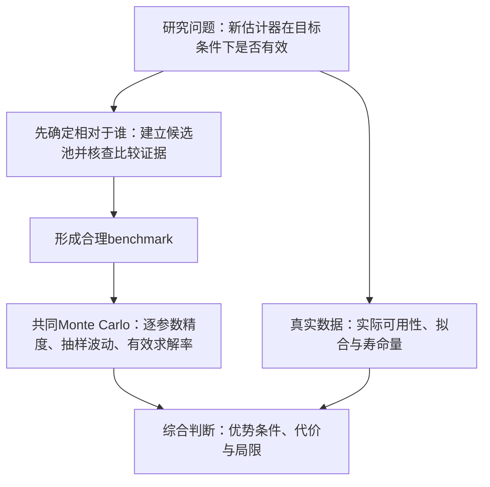

# 三参数Weibull参数估计方法的评价依据与建议

> v2.4 · 2026-09-28 · 小型分析／导师汇报。以已有文献为依据，重点讨论完整样本、小样本情形。

## 1 研究问题与评价框架

**对于完整数据条件下的三参数Weibull参数估计方法，尤其在小样本条件下，什么样的证据才能说明一种方法是有效的？**

这一问题直接关系到新估计方法的实验设计。仅优于若干经典方法，未必足以说明新方法相对于当前研究具有竞争力；一种方法提出较早，也不意味着它已失去比较价值。因此，评价首先要明确“相对于谁”，再判断“在哪些条件下、哪些方面有效”。

**本文所说的有效性，是指在目标样本条件下，相对于合理的比较对象，具有良好的参数估计精度、抽样稳定性和有效求解能力；真实数据补充说明实际可用性，不承担参数真值精度证明。** 这需要三方面相互衔接的依据。

1. **合理的比较对象。** 确定哪些经典方法仍能提供共同参照，哪些近期方法与完整样本、小样本三参数估计直接匹配；如果新方法改进已有估计器，还须保留直接母方法，识别新增步骤的收益。
2. **已知真值下的统计与计算表现。** Monte Carlo模拟是评价参数性能的核心证据。在相同生成条件和同批样本上，分别比较三个参数的Bias、RMSE和SD，同时记录有效求解率及失败原因，避免仅凭成功样本上的精度作判断。
3. **真实数据中的应用表现。** 展示方法能否运行、拟合是否合理、参数与寿命量是否具有实际解释。真实数据通常没有参数真值，拟合较好不能直接推出参数估计更准确。

**图1 评价论证链。** Benchmark选择是有效性评价的第一步；Monte Carlo提供已知真值下的参数性能证据，真实数据提供应用证据，两者共同限定结论的适用范围。

报告依次回答：**比较对象应该怎样选择、在Monte Carlo中怎样评价、真实数据能够证明什么。** 方法分类、沿革和近期进展只用于建立比较对象的选择依据，而不预设某一固定方法组合。正文六章分别承担以下任务。

| 章节 | 只回答一个问题 |
|---|---|
| 1 研究问题与评价框架 | 什么叫有效，需要哪些证据？ |
| 2 候选估计方法及其关系 | 哪些方法属于可比较的候选池，本质区别是什么？ |
| 3 文献中的实际比较依据 | 已有研究和谁比，近期哪些工作与目标任务直接可比？ |
| 4 Monte Carlo模拟的评价依据 | 已知真值时，怎样比较才公平、完整？ |
| 5 真实数据分析应证明什么 | 没有真值时，能说明什么、不能说明什么？ |
| 6 综合建议：如何选择对照并评价新方法 | 怎样按研究主张选择对照，并形成有条件的评价结论？ |

范围限定为**完整样本的三参数Weibull点估计，尤其关注小样本**。删失、截尾、二参数及特殊可靠性研究用于判断任务是否匹配；区间、预测等评价仅随相应研究主张补充。调研从杨小玉等2023年综述[181-004]及现有文献库追溯原文，逐篇记录见[附录A](附录A-文献证据.md)，具体公式与版本见[附录B](附录B-方法实现与版本.md)。最终形成“文献依据 → 对照选择 → 模拟与真实数据评价规则 → 有效性判断”的可用方案。

## 2 候选估计方法及其关系

为了确定合理benchmark，本章建立候选方法池，说明不同方法改变的是估计准则、有限样本修正、位置处理还是数值求解。各方法的适用性与已有比较结果由第3章核查，最终选型留在第6章。

### 2.1 候选方法概览

三参数Weibull同时估计形状β、尺度η和位置γ。下表与图2按主要估计依据和构造方式分为四组，2.2—2.5节依次对应A—D组；组间可以组合，不构成互斥分类或性能排序。

| 图2分组 | 代表方法与分支 | 改变什么、为何进入候选池 |
|---|---|---|
| A 似然路线 | MLE、WMLE、MMLE、DMMLE；MLE数值求解改进 | 提供共同似然参照，并区分有限样本修正、边界处理和搜索改进 |
| B 概率图路线 | LS；LRE相关构造，包括GLRA与相关系数法 | 通过分布线性化估计；位置、绘图分数和回归方向定义具体版本 |
| C 统计量、间距与构造差异 | MM、PWM、L矩；MPS；MDM | 分别采用统计量匹配、概率间距及尺度伪估计一致性，提供不同估计依据 |
| D 组合与学习（含统计量变换） | LSPF、SAM、PM、神经估计 | 变换统计量、组合位置修正与参数更新，或直接学习样本到参数的映射 |

**图2 方法关系与改进动机。** 实线表示有依据的继承、扩展或组合，虚线表示针对同类困难的替代方案，不表示性能必然改善。蓝、紫、黄、绿分别表示已有依据、统计构造变化、数值求解改进和直接学习映射；白色虚框为问题或构造依据。Fisher（1922）是通用似然原理来源；MMLE特指图中Kundu–Raqab构造；MDM区分在线与卷期年份。[可编辑源文件](图片/方法关系与改进动机.drawio)。

### 2.2 似然路线：共同参照、有限样本修正与数值求解

**MLE**根据观测密度构造似然，是常用共同参照。未知位置改变支持域，可能带来边界无界、局部分支和小样本偏差，因此实验中的MLE须写明参数域及求解版本。

**WMLE**仍属似然路线，通过有限样本权重修正估计方程，是考察小样本修正效果的候选。Cousineau（2009）[182-088]将Jacquelin的二参数构造扩展到三参数；J类权重及配套方程见附录B第5节。**DMMLE**[182-111]在Kundu–Raqab修改似然上加入Firth得分偏差修正，属于另一分支，不能视为WMLE的后继。

Newton、PSO、DE等若在相同参数域内求解同一似然，改变的是搜索过程。其价值首先体现为求解质量、收敛与效率；更高似然不能直接证明参数误差更小。

### 2.3 概率图路线：比较必须落到具体版本

概率图方法将Weibull分布关系线性化，由位置选择及回归恢复参数。它提供不同于密度似然的估计依据，但**绘图分数、位置处理、回归方向和参数恢复共同决定算法，不能只写“LS”或“LRE”**。

LS与LRE不是互斥原理，线性回归也可用最小二乘求解。Soman–Misra（1992）[182-104]扩展White的二参数方法；Li（1994）[182-107]研究广义线性回归；Park（2017/2018）[182-115/106]通过相关系数定位，并分别用概率图回归或条件二参数MLE恢复其余参数。本文考察Soman–Misra与Park构造，以区分经典回归参照和后续位置处理；不将Li、Park仅按年代串成继承链。

Soman–Misra与Park Proposed+Plot的分数和回归方向不同，即使都使用最小二乘也通常不等价。原理图、恢复公式及文献版本对照见附录B第11节，项目既有LRE与Park原版的区别见该附录第3节。

### 2.4 统计量、间距与构造差异：不同的样本信息与估计准则

MM匹配样本矩与理论矩；PWM使用概率加权矩，L矩可由PWM线性组合得到。它们为比较提供统计量匹配路线，但不能仅凭统计量不同推定性能更好。

**MPS**[182-116]最大化相邻排序观测之间概率间距的乘积，改变了MLE使用观测处密度的准则。其在后续比较研究[182-096/003]中的采用，为考察似然边界困难及不同准则提供候选依据；重复观测导致零间距，须声明处理方式。目标函数和原理图见附录B第9节。

**MDM**（2022在线／2023卷期）[182-030]由排序观测和绘图概率反推尺度伪估计，通过减小这些伪估计之间的差异来确定参数。它以构造差异为估计依据，对应图2的C组；后续比较可检验差异构造及偏移修正是否带来收益。原理公式与版本区别见附录B第11节。

### 2.5 组合与学习：统计量变换、步骤组合与直接映射

| 候选构造 | 改变的步骤 | 可供后续比较检验的问题 |
|---|---|---|
| LSPF（2013）[182-113] | 对消除位置、尺度影响的统计量构造形状似然，再恢复其余参数 | 变换构造的位置处理和有限样本表现 |
| SAM（2023）[185-005]、PM（2024）[182-117] | 分别组合最小值期望与回归更新、最小值中位数与条件似然更新 | 位置修正与组合流程在小样本下的作用；两版不能混称一种方法 |
| ANN、BPNN[183-020/184-009] | 由模拟样本及真参数学习映射，使用时从样本特征输出参数 | 直接学习估计的收益及训练域限制；网络仅提供初值时仍按最终准则归类 |

贝叶斯估计另由先验、似然与后验决策共同定义，作为候选时须说明额外信息及估计目标。以上候选改变的环节各不相同；下一章据文献的实际比较、样本条件与结果边界判断其与目标任务的关系。

## 3 文献中的实际比较依据

### 3.1 已有论文实际选择了谁

图3以气泡矩阵展示当前12篇完整样本三参数估计论文的对照选择：纵向为论文，横向为对比方法，出现气泡表示该论文使用了该方法。气泡面积与该方法在这12篇论文中的采用总次数成正比，顶部标出篇数，每篇每类方法计一次。标签第一行是中文名（方法缩写），第二行是年份和作者。本图不含MDM论文及MDM对照列，原始文献记录保留不变。

**图3 文献实际对照选择。Benchmark展示样本为12篇；第4章指标统计样本为13篇，后者保留MDM论文[182-030]。两者源自同一审核主子集，统计范围不同。**

[可编辑SVG](图片/文献对照气泡图.svg) · [矢量PDF](图片/文献对照气泡图.pdf)

在图示12篇论文中，MLE出现7篇，相关回归路线LRE出现4篇；WMLE、MPS、PWM、MMLE也多次被采用。**可以看到一种实用的比较思路：保留常用经典方法作为参照，再加入与新方法所解决问题相关的对手。**

作者的说明也支持这一思路：Cousineau比较论文[182-101]保留MLE，因为它是常用基线；LSPF论文[182-113]依据前序研究，选择BL和WMLE作为较强对手；DMMLE对比相近的MMLE、CMLE，BPNN对比CCM、MDM。具体来源及统计细节见[附录A](附录A-文献证据.md)和[比较记录](资料/比较习惯核查.md)。

频次说明哪些方法便于联系已有研究；具体选择还需要看它解决的问题以及与新方法的关系。下面几个实例更直接地说明选择理由。

| 文献 | 实际比较对象 | 从比较安排得到的启示 |
|---|---|---|
| Cousineau比较研究[182-101] | 包含MLE、WMLE、MPS | 作者保留MLE作为常用参照；经典基准与修正方法可以同时出现 |
| LSPF[182-113] | BL、WMLE | 作者根据前序研究选择较强对手，比较不必穷尽全部路线 |
| SAM[185-005]、PM[182-117] | 均包含MLE和PWM，另含概率图或LSE | 小样本新构造通常同时接受常用参照与其他估计依据的检验 |
| DMMLE[182-111] | MMLE、CMLE | 相近似然修正有助于识别新增修正的收益 |
| BPNN[184-009] | CCM、MDM | 学习型新方法也需要与同任务的统计构造比较 |

### 3.2 为什么常见对照仍然是经典方法

图3中，MLE、相关回归和矩类方法反复出现。这里的“经典”首先指估计路线；具体的权重、位置估计和回归版本可能已有较新改进。因此，判断比较是否充分，需要看作者引用和实际采用的构造。

文献中保留经典方法有两种明确理由。其一，**提供共同参照**：Cousineau[182-101]解释保留MLE是因为它常用，便于理解新方法相对于既有工作的变化。其二，**已有结果仍支持它作为有竞争力的对手**：LSPF论文[182-113]依据前序比较选择BL与WMLE，其自身结果也显示小样本下WMLE值得考虑。另一些研究直接比较相近修正，如DMMLE对MMLE、CMLE，是为了检验新增修正的收益。

这些理由能够解释保留经典方法，却还没有回答比较是否足够：**如果已有适用于相同问题的近期方法，只胜过经典参照，能否说明新方法相对于当前研究的水平？** 为回答这一点，需要进一步看近10—20年的论文究竟在改进什么。

### 3.3 近10—20年的参数估计论文在研究什么

从本调研的Weibull相关文献看，近期研究同时沿以下方向展开。表中区分“改估计方法”“改求解过程”和“改数据条件”，以便判断哪些工作与本研究直接可比。

| 研究方向 | 代表文献与具体工作 | 对比较对象选择的意义 |
|---|---|---|
| **新的估计构造与小样本组合** | LSPF（2013）[182-113]构造变换统计量似然；Park（2017/2018）[182-115/106]处理相关系数定位；SAM（2023）[185-005]、PM（2024）[182-117]组合最小值关系与参数更新 | 直接回答“近期有没有值得比较的方法”；优先检查与目标样本量和参数域的匹配 |
| **偏差修正、加权与回归改进** | WMLE（2009）[182-088]；加权误差变量估计（2010）[182-095]；WMLE形状偏差修正（2024）[182-024]；DMMLE（2025）[182-111] | 延续经典路线但改变估计构造；应比较具体改进版，并看改进涉及一个参数还是全部参数 |
| **MLE数值求解与智能优化** | DE[187-005]、PSO（2015）[187-012]、混沌模拟退火PSO（2021）[187-013]、ADGBO（2026卷期）[187-001] | 重点改善搜索、初值敏感性、收敛与计算效率；采用MLE并不意味着论文没有新工作，求解器进步与估计准则进步应分开说明 |
| **贝叶斯估计与不确定性推断** | Gibbs抽样三参数Bayes估计（2007）[182-006]，研究包含删失情形及完整样本子项 | 增加先验和后验推断；与其他方法比较时需交代所用信息及估计目标 |
| **学习型估计与统计方法结合** | 三参数ANN（2008）[183-020]；核密度—NN—GA（2014）[184-010]；小样本BPNN（2025）[184-009] | 有的直接学习参数映射，有的辅助选择带宽等过程量；需辨认网络实际替代了哪一步 |
| **删失等特殊观测条件** | Nassar–Elshahhat（2024）[182-114]、ICP-CDF-LS（2026）[182-103] | 重点是利用不完整观测；其中还有二参数工作，不能仅按“Weibull估计”题名直接选作完整三参数对手 |
| **稳健估计及具体可靠性应用** | PITE（2025）[182-003]处理离群污染；MV-MLE（2023）[182-064]涉及单应力与加速试验；AICQME[183-012]用于二参数风速拟合 | 应按子实验辨认是否与当前问题一致；特殊场景有价值，但需要相应评价目标 |

**MLE智能优化是一个值得单独讲清的例子。** 若Newton、PSO、DE等在同一参数域内求解同一个似然目标，它们比较的首先是能否找到合适的解、对初值是否敏感、计算是否高效。有限计算预算下，这些差异也可能影响最终参数误差，但求解得到更高似然值并不自动证明估计更准确。若工作还改变了目标函数、惩罚项或参数更新关系，就需要同时说明估计构造的变化。

因此，**“近期不断有新论文”和“比较中仍出现经典方法”并不矛盾**：一部分工作直接提出新的估计构造，另一部分继续改善经典方法的计算、偏差或适用条件。上述实例展示了近期工作的方向；它们并不意味着通用三参数新估计器已经消失。具体出处与实验条件见[近期文献范围核查](资料/近期文献范围核查.md)。

### 3.4 近期候选方法提供了哪些比较证据

现有证据需要分清三件事：是否研究完整三参数估计、是否覆盖目标样本量，以及结果支持到什么条件。下面按文献内部比较列出事实与边界，不将不同论文的结果合成统一排名。

| 原论文与条件 | 已有比较证据 | 证据边界 |
|---|---|---|
| WMLE，2009[182-088]；n=8、16、32 | 所试配置下J类权重的联合表现较好，讨论偏差与变异的权衡 | 原评价含中位偏差与中位相对距离，不能直接当作通常的均值Bias和RMSE |
| LSPF，2013[182-113]；β=0.5—5，n=10—500 | 作者总体建议n≤20考虑WMLE、n≥100考虑LSPF，各参数存在例外 | 结论依赖样本量与目标参数；文中WMLE采用Ng式权重代入，不能直接外推到其他版本 |
| Park，2017/2018[182-115/106] | 给出相关系数定位及两种参数恢复方案，后续[187-001]实际采用相关回归构造 | 原论文的实测拟合及存在性分析不等于逐参数模拟误差排名；须保留非负位置适用域 |
| SAM，2023[185-005]；β=1.5、2、2.5，n=5—20 | 三参数平均MAD在n≤10时优势明显，样本增大后与MLE差距缩小 | 跨参数平均指标不说明每个参数都改善，原模拟未检验β<1 |
| PM，2024[182-117]；主体n=100—2500，另有n=5比较 | 完整三参数构造，极小样本部分比较LSE、MLE、PWM，并报告位置边界输出 | 主体大样本结果不能代替极小样本结果；与SAM尚未核得直接性能比较 |
| BPNN，2025[184-009]；n=5—20 | 与CCM、MDM比较参数及1%寿命分位点的SD、RMSE | 训练参数范围有界，原输入与训练配置仍有复现缺口；不能用另一网络替代原版 |
| DMMLE，2025[182-111]；三组参数，n=50—1000 | 相对偏差改善，RMSE总体接近 | 支持偏差修正的条件性收益，尚不能据原模拟判断n=5—20表现 |

较早的综合比较同样提示评价取舍：Akram–Hayat[182-096]在β=0.5—9、n=10—100下得到不同的方法选择；其中β=3、4时MLE偏差较小，MoE的RMSE更小，且结果受收敛样本筛选影响。**小偏差、小总误差与高有效率需要分别核查，不能相互替代。**

原条件与段落定位见[性能记录](evidence/literature_performance_boundaries.json)，PM与BPNN等的任务、指标及版本证据见[附录A](附录A-文献证据.md)和[附录B](附录B-方法实现与版本.md)。第3.3节中的删失、二参数或污染研究，则因数据条件或估计目标不同，不能仅凭发表较新直接并入本任务。

### 3.5 从比较证据得到哪些选型原则

在本次已核文献范围内，尚不能确认一个通用的固定比较组合；较稳定的是按比较作用选择对手的思路。胜过经典参照，能够说明相对于这些对照的改进；若遗漏已有同任务近期竞争者，对当前研究水平的判断仍不充分。方法新旧都不能单独决定是否入选。

| 对手角色 | 为什么需要 | 选入时核查什么 |
|---|---|---|
| 共同经典基准 | 与历史结果建立联系 | 是否有明确、可解释的文献版本 |
| 有竞争力的有限样本方法 | 防止仅战胜较弱基线 | 是否有与目标样本量相关的比较证据 |
| 同任务近期方法 | 回应当前研究进展 | 是否同为完整三参数估计，参数域与样本条件是否匹配 |
| 直接母方法 | 判断新增步骤本身是否有效 | 是否保留被改进版本，其余设置是否可比 |
| 特殊场景方法 | 检验相应特殊主张 | 数据条件或目标不同时，不强行纳入一般比较 |

这些角色可以由同一个方法兼任，因此不需要机械地为每一类增加一个对手。具体benchmark应根据新方法的研究主张、样本条件、参数域以及与已有方法的关系确定。

因此，本调研不试图建立一个适用于所有完整三参数Weibull研究的固定比较组合，而是形成以下选型原则：

**首先保留能够与既有研究建立联系的共同参照；其次加入与目标样本条件直接相关、已有竞争性证据的方法；如果存在同任务的近期方法，应优先核查其是否适合作为当前竞争者；如果新方法由已有方法改进而来，则应保留直接母方法，以识别新增步骤本身的收益。**

对于数据条件、估计目标或参数域明显不同的方法，不因其发表时间较新而强行纳入比较。

第4、5章进一步明确Monte Carlo和真实数据分别提供什么评价证据，第6章在此基础上给出可直接用于实验设计的benchmark选择流程，而不是预设一个固定方法组合。

## 4 Monte Carlo模拟的评价依据

### 4.1 文献怎样设置模拟

| 来源 | 样本量与重复次数 | 主要评价内容 |
|---|---|---|
| LSPF[182-113] | n=10、20、50、100、500；每条件1000次 | 逐参数及联合Bias、RMSE、CPU时间 |
| 迭代LS[182-047] | n=10、15、20、25、30；两组真值，各1000次 | 参数及99%可靠度寿命的Bias、RMSE |
| SAM[185-005] | n=5、10、15、20；每条件10000次 | 三参数平均MAD、MSD及寿命量误差 |
| BPNN[184-009] | n=5、10、15、20；每条件1000组 | 各参数及99%可靠度寿命的SD、RMSE |

这些设计共同关注样本量变化，但参数域、重复次数和指标并不统一。评价时应让各方法处理同一批模拟样本，分别展示不同条件的结果，避免一个总体平均掩盖小样本或特定形状下的差异。

### 4.2 用什么指标评价

| 评价问题 | 需要报告什么 | 作用 |
|---|---|---|
| 在什么条件下比较 | 真参数、样本量、重复次数 | 说明结果适用范围与模拟精度 |
| 估计准不准 | Bias、RMSE或MSE | 分别反映系统偏差与总误差 |
| 估计稳不稳定 | SD | 反映重复抽样造成的波动 |
| 能否得到有效估计 | 有效率／失败率及原因 | 反映给定实现与计算预算下的可靠性 |

**指标使用统计：13篇（含MDM论文[182-030]）；图3的benchmark展示：12篇（不含该篇）。** 两者均来自同一审核主子集；同篇可使用多个指标。以下保留完整指标口径，避免随图示删减遗漏已核评价方式。

| 指标 | 已确认篇数 | 含义与限制 |
|---|---:|---|
| 逐参数RMSE | 7 | 同时包含偏差与抽样波动造成的误差 |
| 逐参数SD | 5 | 抽样波动，不包含系统偏差 |
| 逐参数Bias | 4 | 系统偏差；相对Bias另核1篇，不自动混计 |
| 逐参数MSE | 1 | 与RMSE单调对应；单位不同 |
| 跨参数平均MAE、相对MAE | 各1 | 必须核对归一化及跨参数权重 |

β、η、γ应分别评价。对参数θ，Bias是估计误差的平均值，RMSE是平方误差均值的平方根，SD描述估计值围绕其平均值的波动。MSE与RMSE排序一致，一般选一个即可；联合指标需要说明归一化，尤其不能直接将不同单位的误差相加后当作同等权重。

若研究主张涉及寿命量，可另报相应分位点误差；99%可靠度寿命对应1%分位点。区间估计则同时看覆盖率和区间长度。这些补充取决于研究要证明什么。

### 4.3 估计失败也是评价结果

三参数Weibull的支持域要求γ小于样本最小值。固定0<β<1和η>0，让γ从下方逼近最小观测时，似然可趋于无穷。因此允许这条边界路径的不受限似然没有有限全局最大值；文献中的MLE数值结果通常需要说明局部解、受限解或具体分支。这个问题取决于搜索参数域，不能只归因于真形状小于1。[DMMLE理论背景](https://pmc.ncbi.nlm.nih.gov/articles/PMC12110674/)

| 文献 | 实际处理 | 对评价的影响 |
|---|---|---|
| Akram–Hayat[182-096] | 只保留ML收敛且L偏度满足阈值的样本，β<1省略MLE | 误差反映筛样后的表现 |
| 比较研究[182-091] | 限制参数范围与迭代，报告未得到估计的次数 | 有效率与误差需要一起读 |
| MDM[182-030] | n=15的30组中MLE有6组未得到解；图中以零标记 | 零是标记，不是有效估计，不能代入RMSE |
| Cousineau比较研究[182-101] | 剔除形状估计大于5的极端输出 | 极端输出的筛除会改变误差统计 |
| PM[182-117] | 报告接近零／非正位置估计的比例 | 边界输出与一般求解失败应区分 |

数学上没有有限最大值、数值未收敛、输出超出所声明参数域，应分别记录。负位置是否有效取决于模型的物理约束；贴边结果也不应一律当作失败。第6章给出简短的统一处理建议。

## 5 真实数据分析应证明什么

| 比较项    | Monte Carlo      | 真实数据                      |
| ------ | ---------------- | ------------------------- |
| 参数真值   | 已知               | 通常未知                      |
| 主要目的   | 评价估计精度、波动与有效率    | 展示应用、拟合及实际寿命量             |
| 直接参数误差 | 可以计算             | 通常无法计算                    |
| 典型证据   | Bias、RMSE、SD、失败率 | 参数结果、经验CDF与拟合图、K-S／AD、寿命量 |

以下三个案例分别突出拟合比较、困难样本可用性和寿命量解释；其余案例保留在附录A：

| 来源 | 真实样本与实际对手 | 原论文评价方式 |
|---|---|---|
| BPNN[184-009] | 15个铝合金疲劳寿命；对CCM、MDM | K-S统计量、p值、经验CDF与拟合CDF、参数估计 |
| LSPF[182-113] | 10个轴承寿命、4点寿命；对MM、BL、w-ML | 参数结果、变换似然形状及不收敛记录 |
| SAM[185-005] | 10个轴承寿命、4点寿命；对前人Bayes、LSPF、阈值及似然估计结果 | K-S、CDF、绘图概率处误差及累积、MTTF和可靠度寿命；部分为历史结果，非统一重跑 |

这些案例表明，真实数据既可以比较拟合，也可以展示算法能否运行、参数与寿命量是否具有应用意义。SAM中部分比较沿用历史结果，LSPF还展示了困难样本的不收敛情况。选择案例时，应说明数据来源和所要展示的用途。

**真实数据可以比较多个方法，也可以只展示新方法的应用。** 若比较拟合优度，结论应表述为对这组数据的拟合差异；参数真值未知，不能据此断言参数估计更准确。需要研究稳定性时可考虑适合该模型的重抽样分析，但无需为了形式完整而增加Bootstrap。

## 6 综合建议：如何选择对照并评价新方法

### 6.1 Benchmark应怎样选择

对于完整样本、小样本的三参数Weibull点估计，本调研**不建议预先固定一个适用于所有新方法的benchmark组合**。在当前已核文献范围内，尚未确认得到普遍采用的统一比较集合；更有依据的做法，是根据比较作用和研究主张逐步确定对手。

具体选择时可以依次回答四个问题：

| 选择问题 | 选择准则 | 作用 |
|---|---|---|
| 是否需要共同参照？ | 选择已有研究中反复采用、定义明确且能够复现的方法 | 使新结果能够与既有文献建立联系 |
| 是否存在与目标样本条件直接相关的强对手？ | 优先检查具有小样本、完整三参数或相同参数域比较证据的方法 | 避免只与较弱或不匹配的基线比较 |
| 近年的同任务研究是否提出了新的竞争方法？ | 核查其数据条件、样本量、参数域和评价目标是否与当前研究一致 | 回应为什么只和经典方法比较的问题 |
| 新方法是否改进或组合了已有方法？ | 若是，应保留直接母方法或最接近的构造 | 判断新增步骤本身是否产生收益 |

因此，**方法是否进入benchmark，不由“经典／近期”或使用频次单独决定，而由任务匹配程度、比较作用和可复现性共同决定。** 同一方法可以兼任多个角色，不要求每个角色各选一种方法。

例如，MLE可以作为共同似然参照；WMLE可以代表有限样本修正；Soman–Misra或Park可以提供概率图／回归路线的比较；SAM、PM、DMMLE、BPNN等可以作为近期候选。它们都是候选实例，而不是预先规定必须同时出现的固定组合。各方法的比较证据及适用边界见第3.4节，具体构造见[附录B](附录B-方法实现与版本.md)。

在正式实验前，还需要进一步核查各候选方法的具体版本、参数适用域、失败处理及复现完整程度。例如，MLE需明确局部或受限求解及接受规则，WMLE需明确权重表和代入方式，Park需保留原位置适用域；SAM已有两个原文示例复现，但后期越域重试规则仍待澄清，原版与补救版须分开标注。**列为候选不等于完成复现；只有满足当前研究条件的方法，才进入最终benchmark集合。**

### 6.2 根据研究主张确定具体对照

研究主张决定需要什么类型的比较对象。下表用于核查候选，不要求将所有方法同时纳入；如果新方法改进已有估计器，应保留直接母方法。

| 如果新方法主要声称…… | 优先核查的比较对象 | 为什么 |
|---|---|---|
| 改善经典LS／概率图估计 | Soman–Misra[182-104]、Park[182-115/106]等具体回归构造 | 判断改进是否超过已有概率图路线，核对绘图分数与回归方向 |
| 改善位置参数估计 | SAM[185-005]、PM[182-117]或其他明确位置修正方法 | 与解决相同困难的方法直接比较；SAM与PM应分开实现 |
| 改善MLE小样本偏差 | WMLE[182-088]、DMMLE[182-111]及相应似然修正 | 区分新修正与已有偏差修正的收益；DMMLE原模拟从n=50开始，不能预设其极小样本表现 |
| 改善边界／可解性问题 | MLE、MPS[182-116]、LSPF[182-113]等 | 同时比较精度与有效求解率，明确搜索域及接受规则 |
| 使用学习型估计 | BPNN[184-009]等同任务学习方法，并保留统计方法参照 | 判断相对已有学习构造及统计方法的收益；分离学习步骤的作用还需相应消融，原输入与训练配置须先核清 |
| 改进已有方法 | 直接母方法，例如MDM[182-030] | 识别新增步骤作用，保留所改版本的概率与偏移设置 |
| 强调极小样本性能 | 优先选择已有n≈5—20证据的方法，如WMLE、SAM、BPNN及PM的极小样本子实验 | 避免拿大样本结果替代小样本证据，逐项核对参数域和指标 |

若研究主张涉及矩类构造，可进一步核查PWM或L矩等相应版本。若涉及低形状、负位置或其他特殊条件，应逐方法检查适用范围，分别说明共同可比条件与额外测试条件；不通过未说明的裁剪或扩域把修改实现写成原版。

### 6.3 Monte Carlo评价规则

| 项目 | 建议 | 文献依据与理由 |
|---|---|---|
| 样本量 | n=5、10、15、20、30为重点，补n=50或100观察趋势 | SAM、BPNN、迭代LS覆盖小样本，LSPF及综合比较提供较大n参照 |
| 参数条件 | 形状覆盖目标范围；可参考β=0.5、1、1.5、2、3、5，再按适用域取舍 | 综合比较与LSPF包含低形状到较高形状，SAM覆盖1.5—2.5；该组点为本报告建议，不是原文统一网格 |
| 尺度与位置 | 可用η=1及共同适用域内的正位置作主体条件；γ=0作为单列边界条件，再补应用单位下的尺度与位置 | LSPF提供标准化设计参照；是否等变、能否包含零位置须按方法核查，标准化条件不能自动代表其他条件；零位置不用相对位置误差 |
| 重复次数 | 每条件1000次可作起点；接近的结果可增至5000—10000次 | 已有论文采用1000、5000及10000等设置；实际精度与计算成本共同决定 |
| 主指标 | 分别报告β、η、γ的Bias、RMSE、SD，以及有效率 | 对应偏差、总误差、波动与可计算性；第4章给出文献使用记录 |
| 补充指标 | 涉及可靠寿命时加相应分位点误差；涉及区间时加覆盖率和长度 | 迭代LS、SAM、BPNN已有寿命量评价；按研究主张增补 |
| 结果展示 | 三个参数分别列图或表，各方法使用同批样本 | 便于辨别改进发生在哪个参数、样本量或条件下 |

### 6.4 统一失败处理

1. 比较前写清共同生成条件，以及各方法的参数域、接受边界、终止条件和重启预算。按各自定义判断有效输出；例如DMMLE允许位置估计等于样本最小值，不能套用其他方法的严格内点检查。
2. 每次生成样本均保留记录，区分未收敛、无有效解及越界输出；失败不填零。
3. 同时报告全部次数、有效次数和失败率。按有效估计计算的Bias、RMSE和SD应注明数量，并标为成功条件下的表现；不能只报删样后的精度。
4. 有效率差异明显时，补充共同成功样本比较，但它仍是条件性结果，不能替代全样本失败统计。实际使用的回退须作为完整流程说明；某条件全部失败时，误差记为不可计算。

### 6.5 真实数据应用建议

| 内容 | 目的 |
|---|---|
| 选取有来源的完整寿命数据，报告样本量和单位 | 说明应用对象与研究范围相符 |
| 给出参数估计及必要的寿命量 | 展示方法能够运行、结果具有实际解释 |
| 展示经验CDF与拟合曲线，按需补K-S／AD | 说明拟合表现；是否加入其他方法取决于应用问题 |
| 需要时再做稳定性或预测验证 | 回答额外主张，不把重抽样当作已知参数真值 |

**因此，本调研的结论是一套benchmark选择与评价规则，不预设一个适用于所有研究的固定名单。** 具体对照应由新方法所解决的问题、目标样本条件、参数域、近期同任务研究以及与已有方法的继承关系共同决定。

最终评价应明确：**相对于哪些对手、在哪些样本量和参数条件下、改善了哪些参数或寿命量，同时付出了怎样的波动、计算或失败代价。** Monte Carlo提供主要参数性能证据，真实数据补充实际应用证据，二者共同限定结论的适用范围，不能收束成脱离条件的“某方法更好”。

## 主要来源

经典构造与继承关系：[Fisher 1922原文](https://jhanley.biostat.mcgill.ca/bios601/Likelihood/Fisher1922.pdf)；[Greenwood等1979](https://pubs.usgs.gov/publication/70012617)；[Hosking与Wallis著作中的PWM—L矩回顾](https://assets.cambridge.org/97805210/19408/frontmatter/9780521019408_frontmatter.pdf)；[Soman–Misra 1992](https://doi.org/10.1016/0026-2714(92)90057-R)；[Li 1994](https://doi.org/10.1109/24.295002)；[Cheng–Amin 1983](https://doi.org/10.1111/j.2517-6161.1983.tb01268.x)。White的1969来源由Soman–Misra原文追溯，Cohen–Whitten的1982构造由已核比较论文及综述追溯；尚不将这种追溯写成对其原文的完整审读。

近20年代表：[Cousineau WMLE](https://doi.org/10.1348/000711007X270843)；[Nagatsuka等2013](https://doi.org/10.1016/j.csda.2012.09.005)；[Park 2017](https://doi.org/10.23055/ijietap.2017.24.4.2848)及[2018](https://doi.org/10.1155/2018/6056975)；[MDM](https://doi.org/10.1142/S0219455423500852)；[SAM 2023](https://doi.org/10.1007/s12206-023-1019-z)及[逐次逼近PM 2024](https://doi.org/10.1002/qre.3559)；[BPNN](https://doi.org/10.1016/j.probengmech.2025.103828)；[DMMLE](https://doi.org/10.3390/e27050485)。DMMLE原文明确列出Kundu–Raqab修改似然与Firth修正的来源，本文依此说明其继承关系。

选取依据还包括[Cousineau的比较研究](https://doi.org/10.1109/TDEI.2009.4784578)[182-101]和[Akram–Hayat 2014](https://doi.org/10.1080/15598608.2014.847771)。其他场景研究的身份、原文入口及证据范围统一见[附录A](附录A-文献证据.md)。
