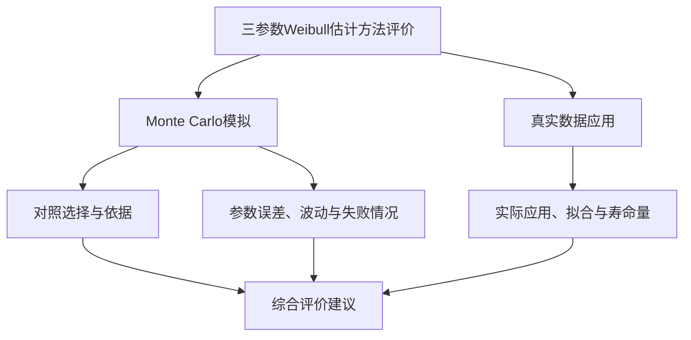

# 三参数Weibull参数估计方法的评价依据与建议

> v2.2 · 2026-09-28 · 小型分析／导师汇报。以已有文献为依据，重点讨论完整样本、小样本情形。

## 1 研究问题与评价框架

**对于完整数据条件下的三参数Weibull参数估计方法，尤其在小样本条件下，应该怎样评价其有效性？**

评价分两条线。Monte Carlo模拟已知生成参数，能够直接评价估计精度、抽样波动和有效输出比例；真实数据通常没有参数真值，主要展示实际应用、拟合及寿命量的含义。真实数据可以比较方法，也可以只展示应用。

**图1 评价框架。** 模拟承担参数性能评价，真实数据提供应用证据。

对照选择是模拟中的首要问题：只与经典方法比较，是否遗漏了近期更合适的对手？近10—20年有哪些相关改进？已有论文怎样选择和评价？本报告先说明必要的候选方法，再用文献实例回答这些问题，最后给出可采用的建议。

调研从杨小玉等2023年综述[181-004]及现有文献库追溯原文，整理实际对手、指标和真实案例。核心对象是完整样本三参数估计，小样本为重点；删失、二参数等工作用于说明任务差异。逐篇记录见[附录A](附录A-文献证据.md)，方法版本详见[附录B](附录B-方法实现与版本.md)。

## 2 候选估计方法及其关系

本章回答有哪些值得考虑的方法。解释保留到能够辨认估计依据、方法关系及适用问题，最终选择放在第6章。

### 2.1 候选方法概览

三参数Weibull同时估计形状、尺度和位置。各方法的主要区别，在于用什么样本信息、按什么关系确定这三个未知量。为与图2对应，下表按A、B、C、D四组介绍方法及其发展关系。

| 图2分组 | 代表方法与分支 | 主要思路与改进 |
|---|---|---|
| A 似然路线 | MLE、WMLE、MMLE、DMMLE；另列MLE的数值求解改进 | 以似然为基础，分别修正估计方程、改变似然构造或改善求解过程 |
| B 概率图路线 | LS最小二乘分支；LRE线性回归相关构造，包括GLRA与相关系数法 | 将分布关系线性化；绘图分数、回归方向、位置选择及参数恢复共同定义具体版本 |
| C 统计量、间距与构造差异 | MM、PWM、L矩；MPS；MDM | 分别匹配样本与理论统计量、最大化概率间距乘积，或减小尺度伪估计之间的差异 |
| D 组合与学习（含统计量变换） | LSPF、SAM、PM、神经估计 | 通过变换统计量构造似然、组合位置修正与回归或似然更新，或学习样本特征到参数的映射 |

四组按主要估计依据与构造方式组织，其中LSPF仍使用似然，SAM、PM也调用回归或似然步骤。Newton、PSO、DE等是求解工具，归属取决于其求解的统计目标，不能仅凭优化器名称认定出现了一种新估计原理。贝叶斯则由先验、似然与后验决策共同定义，本文另作说明。

**图2 方法关系与改进动机。** 节点按方法、作者和年份标识。实线表示有依据的继承、扩展或组合，虚线表示针对同类困难的替代方案；不表示性能必然改善。蓝色为已有方法或依据，紫色为统计构造变化，黄色为数值求解改进，绿色为直接学习映射。白色虚框为问题或构造依据。Fisher（1922）标示通用似然原理的重要奠基来源，不是三参数Weibull方法提出年份；MMLE特指图中Kundu–Raqab构造，MDM区分在线与卷期年份。[可编辑源文件](图片/方法关系与改进动机.drawio)。

这张图说明方法的发展不是逐代替代：同一种困难可能产生不同方案，同一个新方法也可能组合不同路线。以下把基本思路和沿革放在一起，重点解释各次改动改变了什么。

### 2.2 似然路线：从共同参照到有限样本与边界修正

MLE是已有比较研究中的常见参照。其基本依据是固定样本、改变参数，使整组观测的似然较大。记完整独立同分布样本为$t_1,\ldots,t_n$，参数为$\theta=(\beta,\eta,\gamma)$，依次表示形状、尺度与位置：

$$
F(t;\theta)=1-\exp[-((t-\gamma)/\eta)^\beta],\quad t>\gamma,\quad\beta,\eta>0;
\qquad \ell(\theta)=\sum_i\log f(t_i;\theta).
$$

其中$f$为对应密度，$t\le\gamma$时$F=0$。只有声明的参数域内存在有限最大值时，才可直接写$\hat\theta=\arg\max\ell(\theta)$。未知位置改变支持域，三参数似然可能出现边界无界、局部分支以及有限样本偏差。这些困难解释了后续修正为何出现，也使“采用MLE”本身不足以交代版本。

Fisher（1922）是通用似然原理的重要来源。Weibull专用改进形成多个分支：Cohen–Whitten（1982）修改估计条件；Cousineau（2009）[182-088]承接Jacquelin（1993）的二参数构造，扩展到三参数并引入有限样本修正权重；da Silva等（2025）[182-111]则在Kundu–Raqab（2009）修改似然的基础上加入Firth得分偏差修正，形成DMMLE。它们改变的对象不同，不能写成依次替代的同一种方法。

以WMLE形状方程为例，令$a_i=t_i-\gamma$：

$$
\frac{J_2(n)}{\beta}+\frac1n\sum_i\log a_i
-\frac{\sum_i a_i^\beta\log a_i}{\sum_i a_i^\beta}=0.
$$

普通MLE相应方程首项为$1/\beta$；WMLE引入$J_2(n)$，位置和尺度另有配套修正。**它改的是估计方程，并非只给求解器换一个名字，也不是任意逐观测加权。** 完整方程和权重边界见附录B第5节。PSO等若仍优化相同似然、使用相同约束，首先改变的是数值搜索；更高似然并不直接等于更小参数误差。

### 2.3 概率图路线：未知位置、绘图分数和回归方向产生不同版本

概率图路线将分布关系线性化。记$t_{(i)}$为排序观测，$p_i$为绘图概率：

$$
x_i(\gamma)=\log(t_{(i)}-\gamma),\qquad z_i=\log[-\log(1-p_i)],
\qquad z_i\approx\beta x_i-\beta\log\eta.
$$

位置决定点如何展开，回归则由斜率、截距恢复其余参数。这一思路直观，但未知位置怎样确定、分数怎样分配、沿哪个方向最小化残差，都能改变估计。

**LS（least squares，最小二乘）与LRE（linear regression estimation，线性回归估计）在这里是具体分支的标签，并非互斥原理。** 线性回归本身也可用最小二乘求解。图2以LS标示White—Soman–Misra分支，以“LRE相关构造”组织Li和Park的相关工作；Li原文采用GLRA/GLLS（general linear regression analysis/general linear least squares）缩写，Park的回归恢复分支称Proposed+Plot。

White（1969）的二参数最小二乘背景，由Soman–Misra（1992）[182-104]明确扩展到三参数；Li（1994）[182-107]研究广义线性回归构造；Park（2017）[182-115]用相关系数估位置，再分别用概率图回归或条件二参数MLE估其余参数，Park（2018）[182-106]进一步讨论位置估计存在性。White至Soman–Misra是明确扩展关系；不能仅凭时间顺序把Li、Park也串成直接继承链。

**读图：** 散点由理想分位数构造，γ=2时恰好线性；随机样本通常不会落在一条直线上。 右图故意固定同一绘图分数以隔离回归方向的影响；不同文献版本还可能更换分数。

下表以两个文献构造说明版本差异。LRE仅是路线标签，不能据此唯一确定算法。

| 比较项 | Soman–Misra（1992）的White扩展分支 | Park（2017）Proposed+Plot |
|---|---|---|
| 绘图分数 | 标准对数Weibull次序统计量的期望 | n≤10用$p_i=(i-3/8)/(n+1/4)$；其余用$(i-1/2)/n$，再作双对数变换 |
| 回归方向 | $x=a+bz$，最小化对数寿命方向残差 | $z=a+bx$，最小化分数方向残差 |
| 参数恢复 | $\hat\beta=1/b,\hat\eta=e^a$ | $\hat\beta=b,\hat\eta=e^{-a/b}$ |
| 位置选择 | 最大化F比 | 按原文相关系数构造定位，保留其非负位置适用域 |
| 选用理由 | 有明确出处的经典概率图参照 | 较新的相关系数组合构造，并有后续实际采用 |

**差异需要落到分数、回归方向和参数域。** 相同分数、相同位置下，两种回归一般也不等价；只有完全线性等特殊情形才一致。在相同分数、同一候选位置和带截距OLS条件下，该F比与$r^2$单调对应，不能把差别简单说成“最小二乘与相关系数”。采用不同绘图分数时应注明版本，详见附录B。

**这条路线对选型的直接启示是：LS或LRE是类别名称，引用和比较必须落到具体构造。** Park的两个恢复分支也不能省略。第3章进一步考察文献实际采用情况。

### 2.4 矩与间距：两种不同于密度似然的经典依据

普通矩法匹配样本与理论统计量，例如$n^{-1}\sum_i t_i^r=E_\theta[T^r]$，通过三个关系估计三个未知参数。Greenwood等（1979）的PWM使用概率加权矩，Hosking（1990）的L矩可由PWM线性组合得到。它们改变用于匹配的统计信息，不意味着后来的统计量在所有样本上必然更好。Cohen–Whitten的修正矩是另一支，不与PWM、L矩构成未经核实的继承链。

MPS则直接改变估计准则。Cheng–Amin的1979年报告和1983年论文[182-116]是早期来源，已核文献也追溯到Ranneby（1984）的独立提出。设$u_i=F(t_{(i)};\theta)$、$u_0=0,u_{n+1}=1$：

$$
D_i=u_i-u_{i-1},\qquad \hat\theta_{\rm MPS}=\arg\max_{\theta\in\mathcal D}\sum_{i=1}^{n+1}\log D_i.
$$

**读图：** 参数改变时，CDF及全部概率间距一起改变；乘积惩罚极小间距。

MLE使用观测处的密度，MPS使用相邻观测之间的概率质量。Akram–Hayat（2014）[182-096]及Safari等（2025）[182-003]仍将其纳入比较，说明经典准则可以持续承担参照作用。重复观测会造成零间距，采用时需要处理。

### 2.5 新构造怎样与已有路线衔接

MDM由Xie等（2022在线、2023卷期）[182-030]提出本文所指的具体构造：由每个排序观测和绘图概率反推尺度伪估计，调整形状与位置，使其差异减小。

$$
\eta_i(\beta,\gamma)=\frac{t_{(i)}-\gamma}{[-\log(1-p_i)]^{1/\beta}}.
$$

它与概率图都利用样本及概率的关系，但一个比较尺度伪估计的一致性，一个拟合变换后的直线。带偏移修正的方程与原始差异最小化也不能混称一个版本。

另一些方法重组已有步骤。Nagatsuka等（2013）[182-113]对消除位置、尺度影响后的统计量构造形状似然；Guo等SAM（2023）[185-005]用最小值期望关系结合回归更新，PM（2024）[182-117]用最小值中位数关系结合条件似然更新。两版共同采用逐次逼近流程，但所用关系不同，未确认直接升级关系。

直接学习估计则把估计器写成$\hat\theta=g_w(s(\mathbf t))$：训练阶段用模拟样本及真参数学习权重，使用阶段从样本特征输出参数。Yang等BPNN（2025）[184-009]是近期候选；Abbasi等（2008）[183-020]已有直接三参数ANN研究。网络若只提供初值，仍应按最终统计准则归类。贝叶斯则以$p(\theta\mid\mathbf t)\propto L(\theta;\mathbf t)\pi(\theta)$定义后验，再由决策规则给出估计，先验和后验决策均属于方法定义。

至此，主要区别已经明确：经典方法提供共同参照，各类改进改变了不同环节。**仅认识类别还不能完成选择，下一章进一步看近期构造是否匹配任务、经历过怎样的比较与采用。**

## 3 文献中的实际比较依据

### 3.1 已有论文实际选择了谁

图5以气泡矩阵展示当前12篇完整样本三参数估计论文的对照选择：纵向为论文，横向为对比方法，出现气泡表示该论文使用了该方法。气泡面积与该方法在这12篇论文中的采用总次数成正比，顶部标出篇数，每篇每类方法计一次。标签第一行是中文名（方法缩写），第二行是年份和作者。本图不含MDM论文及MDM对照列，原始文献记录保留不变。

[可编辑SVG](图片/文献对照气泡图.svg) · [矢量PDF](图片/文献对照气泡图.pdf)

在图示12篇论文中，MLE出现7篇，相关回归路线LRE出现4篇；WMLE、MPS、PWM、MMLE也多次被采用。**可以看到一种实用的比较思路：保留常用经典方法作为参照，再加入与新方法所解决问题相关的对手。**

作者的说明也支持这一思路：Cousineau比较论文[182-101]保留MLE，因为它是常用基线；LSPF论文[182-113]依据前序研究，选择BL和WMLE作为较强对手；DMMLE对比相近的MMLE、CMLE，BPNN对比CCM、MDM。具体来源及统计细节见[附录A](附录A-文献证据.md)和[比较记录](资料/比较习惯核查.md)。

频次说明哪些方法便于联系已有研究；具体选择还需要看它解决的问题以及与新方法的关系。下面几个实例更直接地说明选择理由。

| 文献 | 实际比较对象 | 从比较安排得到的启示 |
|---|---|---|
| Cousineau比较研究[182-101] | 包含MLE、WMLE、MPS | 作者保留MLE作为常用参照；经典基准与修正方法可以同时出现 |
| LSPF[182-113] | BL、WMLE | 作者根据前序研究选择较强对手，比较不必穷尽全部路线 |
| SAM[185-005]、PM[182-117] | 均包含MLE和PWM，另含概率图或LSE | 小样本新构造通常同时接受常用参照与其他估计依据的检验 |
| DMMLE[182-111] | MMLE、CMLE | 相近似然修正有助于识别新增修正的收益 |
| BPNN[184-009] | CCM、MDM | 学习型新方法也需要与同任务的统计构造比较 |

### 3.2 近10—20年有哪些相关改进

近期已有直接相关的新构造，不能将比较选择简化为“只有老方法可用”。下面将估计构造与观测条件、求解过程的变化分开。

| 近期工作 | 改进内容 | 与当前比较的关系 |
|---|---|---|
| WMLE，2009[182-088] | 修正MLE方程中的有限样本偏差 | 有后续比较采用的小样本修正 |
| LSPF，2013[182-113]；Park，2017/2018[182-115/106] | 分别通过变换统计量、相关系数定位处理未知位置等困难 | 与可解性及概率图估计直接相关 |
| MDM，2022在线/2023卷期[182-030] | 减小尺度伪估计之间的差异 | 完整三参数的新构造 |
| SAM，2023[185-005]；PM，2024[182-117] | 分别结合最小值期望／中位数关系更新参数 | 包含n=5等极小样本研究，两版构造不同 |
| BPNN，2025[184-009] | 从样本特征学习参数映射 | 覆盖n=5—20；采用时需落实训练配置 |
| DMMLE，2025[182-111] | 修改似然基础上的得分偏差修正 | 近期似然改进；原模拟从n=50开始 |
| ADGBO，2026卷期 | 改善MLE数值搜索 | 适合检验计算效率、求解可靠性；统计目标仍需辨明 |
| 污染估计PITE[182-003]、删失研究[182-114/103]、二参数风速校正[183-012] | 适应不同数据条件和应用 | 用于理解近期研究方向，是否进入比较取决于任务是否一致 |

由这些例子可见，近期创新同时涉及估计构造、数据条件和计算过程。经典方法仍能提供共同参照，近期方法则检验新的改进目标；二者有不同的比较作用。详细检索记录见[近期范围核查](资料/近期文献范围核查.md)。

### 3.3 文献中的性能结果怎样影响选择

| 原论文与条件 | 已报告结果 | 对选择的启示 |
|---|---|---|
| Akram–Hayat，2014[182-096]；β=0.5—9，n=10—100 | 不同参数条件下推荐不同方法；β=3、4时MLE偏差较小，MoE的RMSE更小 | Bias与RMSE可能支持不同判断；该文筛选了收敛样本，解释结果时需结合筛样方式 |
| LSPF，2013[182-113]；β=0.5—5，n=10—500 | 作者总体建议n≤20考虑WMLE、n≥100考虑LSPF；各参数有例外 | 小样本比较应重视已有有限样本修正，存在性优势不直接等于RMSE优势；文中WMLE采用Ng式权重代入 |
| WMLE，2009[182-088]；n=8、16、32 | 所试配置下J类权重的联合表现较好，并讨论偏差与变异的权衡 | 支持将小样本修正纳入考察；原评价含中位偏差与中位相对距离 |
| SAM，2023[185-005]；β=1.5、2、2.5，n=5—20 | 三参数平均MAD在n≤10时优势明显；样本增大后与MLE差距缩小 | 与极小样本任务直接相关；原指标跨参数平均，且未检验β<1 |
| DMMLE，2025[182-111]；三组参数，n=50—1000 | 相对偏差改善，RMSE总体接近 | 可代表近期偏差修正，对n=5—20的表现仍需实际比较 |

这些结果帮助解释候选方法的价值，而非形成跨论文统一排名。原条件与段落定位见[性能记录](evidence/literature_performance_boundaries.json)。

本章得到三类选择依据：**常用方法提供共同参照，其他估计路线提供不同角度，近期同任务构造检验新的改进。** 如果新方法直接修改已有估计器，还应保留其母方法。第6章据此落实具体名单与版本。

## 4 Monte Carlo模拟的评价依据

### 4.1 文献怎样设置模拟

| 来源 | 样本量与重复次数 | 主要评价内容 |
|---|---|---|
| WMLE[182-088] | n=8、16、32；每条件1024次 | 中位偏差、相对距离及波动 |
| LSPF[182-113] | n=10、20、50、100、500；每条件1000次 | 逐参数及联合Bias、RMSE、CPU时间 |
| Akram–Hayat[182-096] | n=10、20、50、100；每条件5000次 | 多个形状条件下的偏差与误差 |
| 迭代LS[182-047] | n=10、15、20、25、30；两组真值，各1000次 | 参数及99%可靠度寿命的Bias、RMSE |
| SAM[185-005] | n=5、10、15、20；每条件10000次 | 三参数平均MAD、MSD及寿命量误差 |
| BPNN[184-009] | n=5、10、15、20；每条件1000组 | 各参数及99%可靠度寿命的SD、RMSE |

这些设计共同关注样本量变化，但参数域、重复次数和指标并不统一。评价时应让各方法处理同一批模拟样本，分别展示不同条件的结果，避免一个总体平均掩盖小样本或特定形状下的差异。

### 4.2 用什么指标评价

| 评价问题 | 需要报告什么 | 作用 |
|---|---|---|
| 在什么条件下比较 | 真参数、样本量、重复次数 | 说明结果适用范围与模拟精度 |
| 估计准不准 | Bias、RMSE或MSE | 分别反映系统偏差与总误差 |
| 估计稳不稳定 | SD | 反映重复抽样造成的波动 |
| 能否得到有效估计 | 有效率／失败率及原因 | 反映给定实现与计算预算下的可靠性 |

原始13篇文献核查中的指标使用记录如下，同篇可以使用多个指标；此处保留原统计范围，与图5的12篇展示范围不同。

| 指标 | 已确认篇数 | 含义与限制 |
|---|---:|---|
| 逐参数RMSE | 7 | 同时包含偏差与抽样波动造成的误差 |
| 逐参数SD | 5 | 抽样波动，不包含系统偏差 |
| 逐参数Bias | 4 | 系统偏差；相对Bias另核1篇，不自动混计 |
| 逐参数MSE | 1 | 与RMSE单调对应；单位不同 |
| 跨参数平均MAE、相对MAE | 各1 | 必须核对归一化及跨参数权重 |

β、η、γ应分别评价。对参数θ，Bias是估计误差的平均值，RMSE是平方误差均值的平方根，SD描述估计值围绕其平均值的波动。MSE与RMSE排序一致，一般选一个即可；联合指标需要说明归一化，尤其不能直接将不同单位的误差相加后当作同等权重。

若研究主张涉及寿命量，可另报相应分位点误差；99%可靠度寿命对应1%分位点。区间估计则同时看覆盖率和区间长度。这些补充取决于研究要证明什么。

### 4.3 估计失败也是评价结果

三参数Weibull的支持域要求γ小于样本最小值。固定0<β<1和η>0，让γ从下方逼近最小观测时，似然可趋于无穷。因此允许这条边界路径的不受限似然没有有限全局最大值；文献中的MLE数值结果通常需要说明局部解、受限解或具体分支。这个问题取决于搜索参数域，不能只归因于真形状小于1。[DMMLE理论背景](https://pmc.ncbi.nlm.nih.gov/articles/PMC12110674/)

| 文献 | 实际处理 | 对评价的影响 |
|---|---|---|
| Akram–Hayat[182-096] | 只保留ML收敛且L偏度满足阈值的样本，β<1省略MLE | 误差反映筛样后的表现 |
| 比较研究[182-091] | 限制参数范围与迭代，报告未得到估计的次数 | 有效率与误差需要一起读 |
| MDM[182-030] | n=15的30组中MLE有6组未得到解；图中以零标记 | 零是标记，不是有效估计，不能代入RMSE |
| Cousineau比较研究[182-101] | 剔除形状估计大于5的极端输出 | 极端输出的筛除会改变误差统计 |
| PM[182-117] | 报告接近零／非正位置估计的比例 | 边界输出与一般求解失败应区分 |

数学上没有有限最大值、数值未收敛、输出超出所声明参数域，应分别记录。负位置是否有效取决于模型的物理约束；贴边结果也不应一律当作失败。第6章给出简短的统一处理建议。

## 5 真实数据分析应证明什么

| 比较项    | Monte Carlo      | 真实数据                      |
| ------ | ---------------- | ------------------------- |
| 参数真值   | 已知               | 通常未知                      |
| 主要目的   | 评价估计精度、波动与有效率    | 展示应用、拟合及实际寿命量             |
| 直接参数误差 | 可以计算             | 通常无法计算                    |
| 典型证据   | Bias、RMSE、SD、失败率 | 参数结果、经验CDF与拟合图、K-S／AD、寿命量 |

文献中的真实案例承担了不同任务：

| 来源 | 真实样本与实际对手 | 原论文评价方式 |
|---|---|---|
| 迭代LS[182-047] | 20个轴承转子寿命、11个铝合金寿命；对相关系数法 | K-S、拟合曲线、左尾及保守性 |
| BPNN[184-009] | 15个铝合金疲劳寿命；对CCM、MDM | K-S统计量、p值、经验CDF与拟合CDF、参数估计 |
| LSPF[182-113] | 10个轴承寿命、4点寿命；对MM、BL、w-ML | 参数结果、变换似然形状及不收敛记录 |
| SAM[185-005] | 10个轴承寿命、4点寿命；对前人Bayes、LSPF、阈值及似然估计结果 | K-S、CDF、绘图概率处误差及累积、MTTF和可靠度寿命；部分为历史结果，非统一重跑 |
| Park相关回归[182-115] | 24个机械部件寿命；对MLE3、Sirvanci–Yang、Gumbel及组合估计 | 相关系数R、p值、AD；不是参数真值误差比较 |

这些案例表明，真实数据既可以比较拟合，也可以展示算法能否运行、参数与寿命量是否具有应用意义。SAM中部分比较沿用历史结果，LSPF还展示了困难样本的不收敛情况。选择案例时，应说明数据来源和所要展示的用途。

**真实数据可以比较多个方法，也可以只展示新方法的应用。** 若比较拟合优度，结论应表述为对这组数据的拟合差异；参数真值未知，不能据此断言参数估计更准确。需要研究稳定性时可考虑适合该模型的重抽样分析，但无需为了形式完整而增加Bootstrap。

## 6 综合建议：后续实验应该怎样评价新方法

### 6.1 推荐对照与具体版本

面向一般的完整小样本三参数点估计，建议先考虑MLE、WMLE、一个明确的概率图版本及近期小样本构造SAM，分别承担共同参照、有限样本修正、不同估计依据和近期竞争者的作用。再按新方法的改进目标增补相关对手。

| 方法与角色 | 推荐版本及来源 | 为什么选择、采用要点 |
|---|---|---|
| MLE：共同参照 | 普通三参数似然的明确局部或受限实现；比较依据[182-101/096]，边界讨论[182-111] | 在所查13篇中出现8篇，便于联系既有结果。注明搜索域、求解分支和接受规则；具体数值实现尚需在实验时选定 |
| WMLE：小样本修正 | [Cousineau 2009](https://doi.org/10.1348/000711007X270843)的J类中位权重构造[182-088] | 原文含小样本修正与权重比较，后续研究有采用；保留配套方程，说明权重表与代入方式 |
| 相关回归：概率图代表 | [Park 2017 Proposed+Plot](https://doi.org/10.23055/ijietap.2017.24.4.2848)[182-115] | 有明确位置估计及回归恢复步骤。n≤10用(i−3/8)/(n+1/4)，其余用(i−1/2)/n，保留原位置适用域 |
| SAM：近期小样本竞争者 | [Guo等2023](https://doi.org/10.1007/s12206-023-1019-z)[185-005]，最小值期望关系与回归更新 | 原文直接比较n=5—20；与普通MLE、概率图和PWM有同条件比较 |

如果需要专门比较经典LS，可加入[Soman–Misra 1992](https://doi.org/10.1016/0026-2714(92)90057-R)[182-104]的White扩展分支，使用期望次序分数、对数寿命方向回归。它与Park版本的差别已在第2章说明；两者同时列入应服务于回归构造的比较。

| 进一步要检验的改进 | 增补对手与版本 | 依据 |
|---|---|---|
| 位置修正、条件似然或区间估计 | [Guo等PM 2024](https://doi.org/10.1002/qre.3559)[182-117] | 最小值中位数修正与条件似然更新，包含n=5比较；与SAM分开实现 |
| 低形状、可解性或不同准则 | [Cheng–Amin MPS 1983](https://doi.org/10.1111/j.2517-6161.1983.tb01268.x)[182-116]；[Nagatsuka等LSPF 2013](https://doi.org/10.1016/j.csda.2012.09.005)[182-113] | 分别使用概率间距准则、标准化次序统计量的形状似然；后者保留原参数恢复顺序 |
| 似然偏差修正 | [da Silva等DMMLE 2025](https://doi.org/10.3390/e27050485)[182-111] | 近期双重修改构造；原模拟从n=50开始，比较时统一参数化 |
| 学习估计 | [Yang等BPNN 2025](https://doi.org/10.1016/j.probengmech.2025.103828)[184-009] | 覆盖小样本，需补齐原输入、训练范围与配置后采用原版 |
| 改进已有估计器 | 直接母方法，例如[Xie等MDM](https://doi.org/10.1142/S0219455423500852)[182-030] | 保留所改版本的概率与偏移设置，用于识别新增步骤的收益 |
| 矩类或更广路线覆盖 | PWM、L矩的相应文献构造 | PWM在SAM、PM中被采用；L矩见综合比较[182-096]，按研究目标选入 |

这份建议按比较作用选方法，不以年份或数量决定。经典参照保持与已有工作的联系，近期同任务方法回应新的竞争要求，直接母方法检验改进本身。

### 6.2 Monte Carlo评价建议

| 项目 | 建议 | 文献依据与理由 |
|---|---|---|
| 样本量 | n=5、10、15、20、30为重点，补n=50或100观察趋势 | SAM、BPNN、迭代LS覆盖小样本，LSPF及综合比较提供较大n参照 |
| 参数条件 | 形状覆盖目标范围；可参考β=0.5、1、1.5、2、3、5，再按适用域取舍 | 综合比较与LSPF包含低形状到较高形状，SAM覆盖1.5—2.5；该组点为本报告建议，不是原文统一网格 |
| 尺度与位置 | 可从η=1、γ=0的标准化条件起步，补适合应用单位的尺度与位置条件 | LSPF采用标准化设计；只有相应等变性成立时，才能用标准化结果代表其他条件；零位置不用相对位置误差 |
| 重复次数 | 每条件1000次可作起点；接近的结果可增至5000—10000次 | 已有论文采用1000、5000及10000等设置；实际精度与计算成本共同决定 |
| 主指标 | 分别报告β、η、γ的Bias、RMSE、SD，以及有效率 | 对应偏差、总误差、波动与可计算性；第4章给出文献使用记录 |
| 补充指标 | 涉及可靠寿命时加相应分位点误差；涉及区间时加覆盖率和长度 | 迭代LS、SAM、BPNN已有寿命量评价；按研究主张增补 |
| 结果展示 | 三个参数分别列图或表，各方法使用同批样本 | 便于辨别改进发生在哪个参数、样本量或条件下 |

### 6.3 统一失败处理

1. 比较前写清各方法的参数约束、终止条件和允许的重启次数，保持计算规则一致且可追溯。
2. 每次生成样本均保留记录，区分未收敛、无有效解及越界输出；失败不填零。
3. 同时报告全部次数、有效次数和失败率；误差按有效估计计算并注明数量，避免只报删样后的精度。
4. 若方法间有效率明显不同，可补充共同成功样本上的比较。回退步骤若实际使用，应作为完整方法流程说明。

### 6.4 真实数据应用建议

| 内容 | 目的 |
|---|---|
| 选取有来源的完整寿命数据，报告样本量和单位 | 说明应用对象与研究范围相符 |
| 给出参数估计及必要的寿命量 | 展示方法能够运行、结果具有实际解释 |
| 展示经验CDF与拟合曲线，按需补K-S／AD | 说明拟合表现；是否加入其他方法取决于应用问题 |
| 需要时再做稳定性或预测验证 | 回答额外主张，不把重抽样当作已知参数真值 |

本调研的建议是：**以有依据的对照和共同Monte Carlo评价参数性能，以真实案例展示应用；方法版本、逐参数指标和失败记录共同保证结果能够解释。**

## 主要来源

经典构造与继承关系：[Fisher 1922原文](https://jhanley.biostat.mcgill.ca/bios601/Likelihood/Fisher1922.pdf)；[Greenwood等1979](https://pubs.usgs.gov/publication/70012617)；[Hosking与Wallis著作中的PWM—L矩回顾](https://assets.cambridge.org/97805210/19408/frontmatter/9780521019408_frontmatter.pdf)；[Soman–Misra 1992](https://doi.org/10.1016/0026-2714(92)90057-R)；[Li 1994](https://doi.org/10.1109/24.295002)；[Cheng–Amin 1983](https://doi.org/10.1111/j.2517-6161.1983.tb01268.x)。White的1969来源由Soman–Misra原文追溯，Cohen–Whitten的1982构造由已核比较论文及综述追溯；尚不将这种追溯写成对其原文的完整审读。

近20年代表：[Cousineau WMLE](https://doi.org/10.1348/000711007X270843)；[Nagatsuka等2013](https://doi.org/10.1016/j.csda.2012.09.005)；[Park 2017](https://doi.org/10.23055/ijietap.2017.24.4.2848)及[2018](https://doi.org/10.1155/2018/6056975)；[MDM](https://doi.org/10.1142/S0219455423500852)；[SAM 2023](https://doi.org/10.1007/s12206-023-1019-z)及[逐次逼近PM 2024](https://doi.org/10.1002/qre.3559)；[BPNN](https://doi.org/10.1016/j.probengmech.2025.103828)；[DMMLE](https://doi.org/10.3390/e27050485)。DMMLE原文明确列出Kundu–Raqab修改似然与Firth修正的来源，本文依此说明其继承关系。

选取依据还包括[Cousineau的比较研究](https://doi.org/10.1109/TDEI.2009.4784578)[182-101]和[Akram–Hayat 2014](https://doi.org/10.1080/15598608.2014.847771)。其他场景研究的身份、原文入口及证据范围统一见[附录A](附录A-文献证据.md)。
