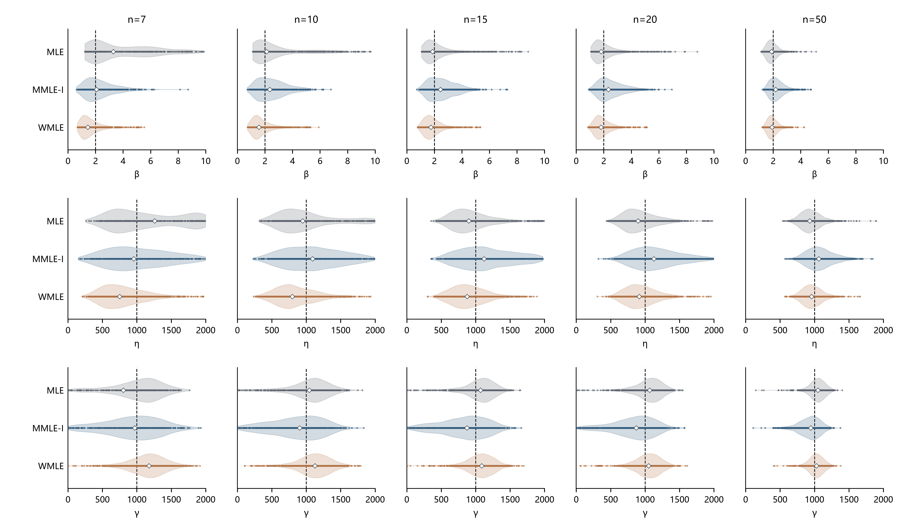

# MLE / MMLE-I / WMLE：成功率与估计分布

固定真值 **β=2、η=1000、γ=1000**，n=7/10/15/20/50，各1200组完整样本（12个100次重复块），三个方法使用相同样本。已按执行中补充改为 Bias、SD、RMSE 和 Research00 小提琴图；WMLE 只计原生产求解器首轮结果。

MMLE版本依据：采用 Cohen–Whitten (1982) MMLE-I（r=1，式3.4），对应库内182-096 Akram–Hayat §3.4.1式16的 MMLE1。

## 汇总表与图

[三行完整汇总表 CSV](汇总表.csv) · [表格 Markdown](汇总表.md) · [小提琴 PNG](估计分布小提琴.png)

追加两张曲线图见[成功率与RMSE随n变化](补充曲线/README.md)。MMLE为什么失败更多、版本与创立动机见[机制与来源说明](说明/MMLE失败机制与来源/README.md)。

每格先给成功率与联合 RMSE，再给 β、η、γ 的 **Bias / SD / RMSE**。精度统计包含各方法全部成功估计，没有按图的显示范围截断；失败不补零。SD采用ddof=0。

| 方法 | n=7 | n=10 | n=15 | n=20 | n=50 |
|---|---|---|---|---|
| MLE | 43.2%; 联合RMSE 971.5<br>β: 2.191 / 2.742 / 3.509<br>η: 362.4 / 617.1 / 715.7<br>γ: -344.0 / 559.7 / 657.0 | 59.6%; 联合RMSE 711.9<br>β: 0.938 / 2.030 / 2.236<br>η: 107.4 / 518.8 / 529.8<br>γ: -112.7 / 462.0 / 475.6 | 80.4%; 联合RMSE 511.5<br>β: 0.320 / 1.337 / 1.375<br>η: -5.0 / 389.2 / 389.2<br>γ: -5.9 / 331.9 / 331.9 | 90.6%; 联合RMSE 427.3<br>β: 0.136 / 1.048 / 1.057<br>η: -30.6 / 325.0 / 326.4<br>γ: 12.1 / 275.4 / 275.7 | 99.9%; 联合RMSE 210.0<br>β: -0.051 / 0.448 / 0.451<br>η: -50.5 / 158.8 / 166.6<br>γ: 38.0 / 122.1 / 127.9 |
| MMLE-I | 37.3%; 联合RMSE 621.1<br>β: 0.357 / 1.175 / 1.228<br>η: 36.1 / 465.4 / 466.8<br>γ: -65.0 / 404.4 / 409.6 | 56.8%; 联合RMSE 610.5<br>β: 0.531 / 1.090 / 1.213<br>η: 130.5 / 444.9 / 463.6<br>γ: -141.2 / 371.2 / 397.2 | 73.4%; 联合RMSE 579.0<br>β: 0.598 / 1.024 / 1.186<br>η: 176.0 / 396.8 / 434.0<br>γ: -177.8 / 339.5 / 383.3 | 85.0%; 联合RMSE 529.8<br>β: 0.557 / 0.952 / 1.103<br>η: 179.1 / 352.4 / 395.3<br>γ: -175.1 / 306.2 / 352.8 | 100.0%; 联合RMSE 277.5<br>β: 0.275 / 0.554 / 0.619<br>η: 82.3 / 197.4 / 213.9<br>γ: -76.3 / 159.6 / 176.9 |
| WMLE | 91.4%; 联合RMSE 496.3<br>β: -0.289 / 0.889 / 0.935<br>η: -186.5 / 336.8 / 385.0<br>γ: 149.1 / 275.5 / 313.2 | 97.2%; 联合RMSE 437.9<br>β: -0.187 / 0.858 / 0.878<br>η: -141.3 / 311.8 / 342.3<br>γ: 110.0 / 249.9 / 273.0 | 99.1%; 联合RMSE 360.3<br>β: -0.098 / 0.736 / 0.742<br>η: -89.8 / 269.9 / 284.5<br>γ: 68.7 / 210.2 / 221.2 | 99.7%; 联合RMSE 321.8<br>β: -0.047 / 0.699 / 0.700<br>η: -53.8 / 245.9 / 251.7<br>γ: 36.3 / 197.1 / 200.4 | 100.0%; 联合RMSE 187.5<br>β: -0.035 / 0.394 / 0.396<br>η: -30.0 / 146.5 / 149.6<br>γ: 22.1 / 110.9 / 113.1 |



图注：行对应β/η/γ，列对应五个n；同一参数统一线性坐标范围与刻度。中心线上散点为范围内成功估计，灰线为全部成功估计的四分位区间，白菱形为中位数，细黑虚线为真值。密度只用范围内成功值、Scott带宽并止于实际极值；γ=0保留散点、不参与正值密度。显示范围外的值及样本ID记录在[绘图记录](绘图记录.json)，仍参与表格统计。绘图母体实际副本已保存在`style_snapshot/`。

PNG绝对路径：`D:\weibull\Research\09-Weibull参数估计方法谱系与比较基线\实验\20261005-MLE-MMLE-WMLE三方法\估计分布小提琴.png`。

**一句话结论：在本次固定条件和实现下，WMLE成功率最高（n=50与MMLE-I并列）、三个参数及联合RMSE均最低，稳与准没有冲突。**

“更准”限于成功条件下的RMSE，不代表每项绝对偏差最小。例如n=7时MMLE-I的η、γ绝对偏差比WMLE小；n=15时MLE的η、γ偏差也更小。

## 指标口径与配对边界

Bias=mean(估计−真值)，SD=√mean((误差−Bias)²)，RMSE=√mean(误差²)，因此 **RMSE²=Bias²+SD²（SD用ddof=0）**。

联合RMSE=√(MSEβ+MSEη+MSEγ)=√(RMSEβ²+RMSEη²+RMSEγ²)，各项使用原始参数数值单位。本条件下η、γ主导联合量，它不具有单位不变性，逐参数结果是主要判断依据。复用共享指标函数的Bias/RMSE，将其ddof=1标准差乘√((k−1)/k)转换为ddof=0（k为成功次数）；未修改共享指标实现。

各方法成功子集不同，所以主表不直接表示相同样本上的逐件优势。三方法共同成功仅9/217/646/907/1199组，单列在[共同成功诊断](by_n_common.csv)。与WMLE的两两共同成功，MLE为518/714/963/1085/1199组，MMLE-I为348/649/872/1018/1200组。[配对结果](paired_vs_wmle.csv)使用原始联合RMSE与2000次重复块内分层bootstrap：十个点估计均倾向WMLE，但n=7的MMLE-I−WMLE差值为16.5，95%区间为[−33.6,65.1]；其余九个区间为正。因此n=7对MMLE-I的配对精度优势尚不确定，不能由主表排序推出全部样本的无条件优势。

## 成功判定与失败分类

成功率分母为每n全部1200组。沿用共享状态检查：收敛，形状、尺度有限且为正，0≤γ̂<x₁，并满足各方法参数域、位置间隙和数值验收规则。

- **MLE**：项目标准三参数对数似然和五起点优化，接受β̂≥1的有限候选；β<1且位置逼近最小值的无界候选不计成功。失败681/485/235/113/1，均为原生`unbounded`。这是有限局部求解实现的输出，不说明所有样本不存在其他有限局部解。
- **MMLE-I**：保留形状/尺度似然方程，将位置得分方程换成F(x₁)=1/(n+1)。形状域(0.1,9.99)，位置域[0,x₁−10⁻⁴]（原始单位），方程残差平方和≤10⁻¹²。失败752/518/319/180/0；其中n=7一个形状越界，其余为声明位置域内未找到根，不称为理论无解。
- **WMLE**：Cousineau权重方程，原生产求解器一次调用并保留内部五起点，形状域(0.1,9.99)，非负有效位置，位置间隙10⁻⁶（除1000后的计算单位），两条加权方程残差平方和≤10⁻⁸。失败103/34/11/4/0，均为`equation_residual`。保留原权重表、候选形状插值与[0.1,5]端点规则；没有调用E09/profile或其他追加复核。

[失败原因 CSV](failure_reasons.csv)保存完整计数。上一批149条靠追加复核恢复的WMLE记录，本批均按首轮失败计入；n=7成功率为91.4%，不是上一批复核后的99.9%。成功子集的变化会改变误差统计，不能把它解释为求解器改进。

## 复用、核验与复算

6000组样本全部复用上一批，没有新增抽样。MLE、MMLE-I的12000行直接继承已核验结果，仅重算6000次原生产WMLE以保留首轮失败。指标/图补充到达后直接重算已有18000行，未重跑求解或抽样。沿用共享`generate_sample`、`run_method`、`run_experiment`及误差汇总函数；求解统一按固定单位1000缩放后恢复原始单位，未向求解器传入真值。

核验6000个样本哈希、5848个成功WMLE的原方程（最大残差平方和2.49×10⁻⁹），以及首轮状态和参数与上一批未恢复记录的一致性；全部通过。[数值核验](verification.json)、[指标核验](metrics_verification.json)、[来源与输出哈希](manifest.json)保存证据。45个参数统计单元的RMSE/Bias/SD恒等式通过；15个图格子的45个方法分布通过范围、刻度、中心线和注释检查，PNG已目视核对。

在本目录复算表图：

```powershell
& 'D:\weibull\python\.venv\Scripts\python.exe' make_outputs.py
```

该入口从已有WMLE块及上一批MLE/MMLE数据重建、核验并生成表图，不调用求解器；需要重算WMLE时，先运行`three_methods.py --workers 6`。`config.json`保留计算启动配置，最终统计与展示规则见`analysis_policy.json`；已有块只在计算源码哈希一致时复用。

本结论限此真值、五个样本量、完整样本及上述参数域/数值规则。未提交、未推送。
