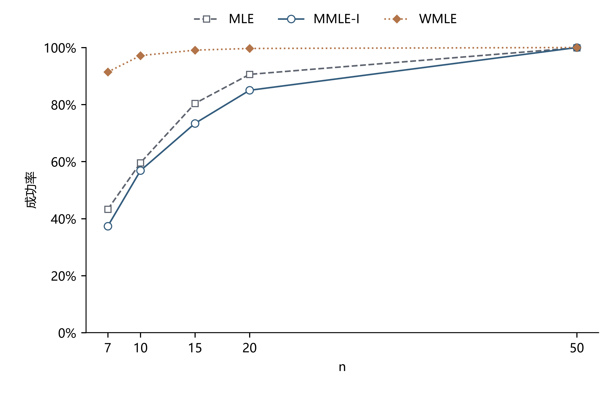
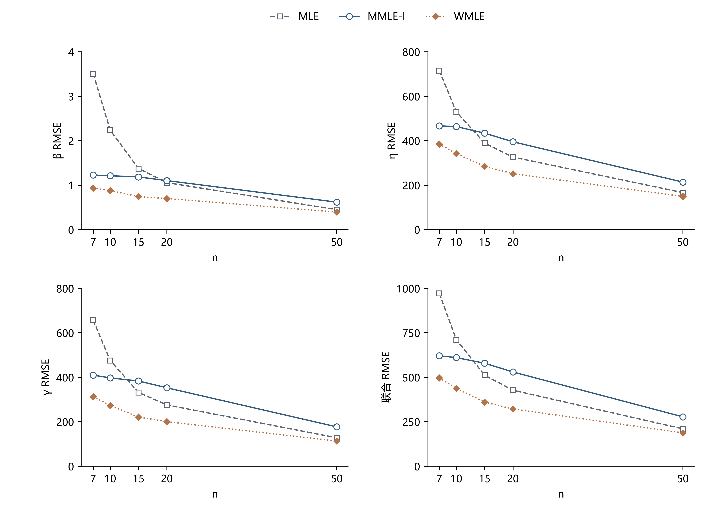

# 三方法成功率与RMSE随样本量变化

本项仅追加两张PNG，直接复用上一轮三方法汇总与18000行估计，不新增抽样或估计。条件为β=2、η=1000、γ=1000，n=7/10/15/20/50各1200组（12个100次重复块）；方法仅MLE、MMLE-I、WMLE，WMLE没有追加漏解复核。

数据源绝对路径：

- 汇总表：`D:\weibull\Research\09-Weibull参数估计方法谱系与比较基线\实验\20261005-MLE-MMLE-WMLE三方法\汇总表.csv`
- 完整结果：`D:\weibull\Research\09-Weibull参数估计方法谱系与比较基线\实验\20261005-MLE-MMLE-WMLE三方法\per_sample.csv.gz`

## 图一：成功率随n变化



图注：成功率=有效估计次数/1200，纵轴0–100%；三方法使用相同样本。成功须收敛、形状/尺度有限为正、位置非负且小于样本最小值，并满足原方法参数域、间隙及方程验收规则。MLE排除β<1的无界边界候选，MMLE-I、WMLE分别使用原批次残差容差；详细规则及失败分类见[原报告](../README.md)。WMLE保留生产求解器内置五起点，未追加复核。点间连线仅表示五个离散n的变化，不表示未计算n上的实际成功率。

PNG绝对路径：`D:\weibull\Research\09-Weibull参数估计方法谱系与比较基线\实验\20261005-MLE-MMLE-WMLE三方法\补充曲线\结果\成功率随n变化.png`。

## 图二：RMSE随n变化



图注：四格依次为β、η、γ及联合RMSE，每格三条方法线；线性坐标和固定量程分别为0–4、0–800、0–800、0–1000。参数RMSE=√mean((估计−真值)²)，采用各方法自己的全部成功估计，未按显示范围裁剪，失败不补零；成功子集不同，不能将曲线当作同一集合上的配对精度比较。联合RMSE=√(MSEβ+MSEη+MSEγ)，用原始参数数值单位，受η/γ主导，不是单位不变量。点间连线仅作离散n的趋势引导。

PNG绝对路径：`D:\weibull\Research\09-Weibull参数估计方法谱系与比较基线\实验\20261005-MLE-MMLE-WMLE三方法\补充曲线\结果\RMSE随n变化.png`。

## 复算与检查

```powershell
& 'D:\weibull\python\.venv\Scripts\python.exe' 'D:\weibull\Research\09-Weibull参数估计方法谱系与比较基线\实验\20261005-MLE-MMLE-WMLE三方法\补充曲线\程序\绘图.py'
```

[程序](程序/绘图.py)使用保存的输入汇总表和Research00绘图母体实际副本；[核验记录](程序/绘图核验.json)保存来源/脚本/母体/输出哈希、15组曲线坐标、轴范围及环境。15组成功率和60个RMSE点逐项核对原18000行结果，均一致。两张图只有轴、刻度和三方法图例，没有说明框、长备注、阈值或对数轴；PNG尺寸2790×1800和3960×2880，已目视检查。原数值、汇总表与小提琴图均保留。
