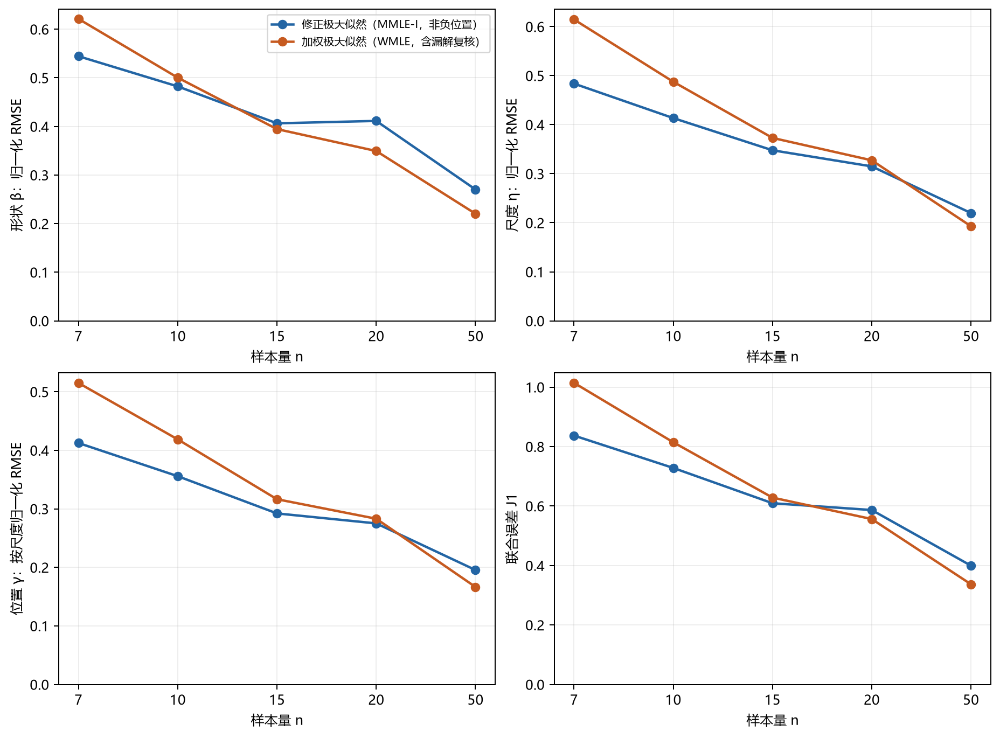
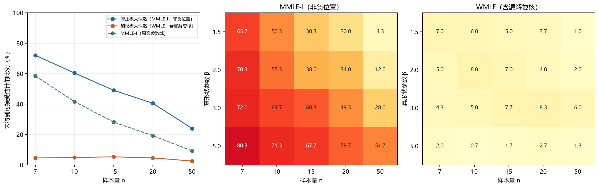
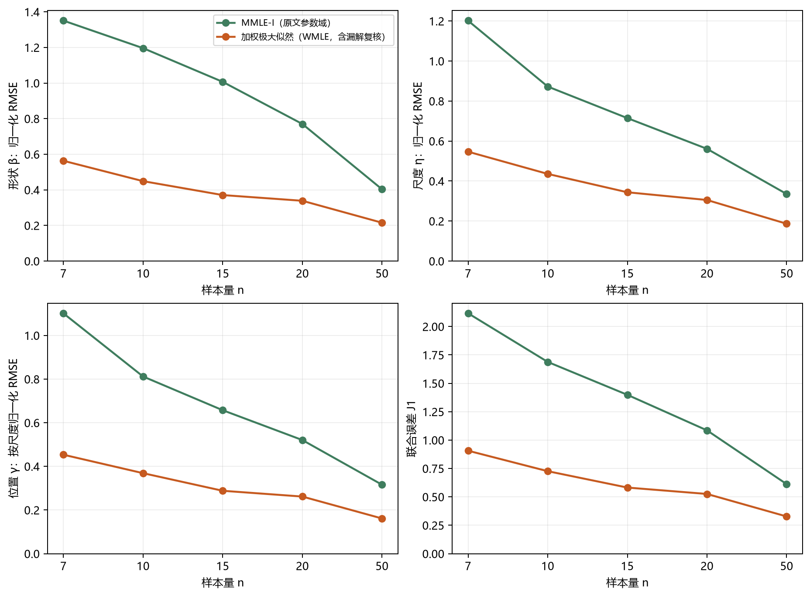

# MMLE-I 与 WMLE：完整三参数 Weibull 样本量比较

> 2026-10-05。邮件任务 research09-mmle-vs-wmle-001。60条件全部完成；6000组样本、18000行估计记录；未提交Git。

## 结论

**在本次固定网格上，WMLE的可用率明显更高；MMLE-I没有表现出普遍精度优势。** 采用原文参数域的MMLE-I，在与WMLE共同成功的样本上，β、η、γ的RMSE均较高，所有五个n的联合误差也较高。两种方法总体随n增大而误差降低，但不能把单次网格结果写成逐条件严格单调或普适规律。

若给MMLE-I加上项目的非负位置约束，它在共同成功样本中，n=7、10的联合误差较WMLE低；这仅覆盖335/1200、475/1200组，伴随很高的失败率。n=15、20的联合误差差异区间跨0；n=50时WMLE在合并共同成功集合上更准。**这说明“小样本成功子集上的精度优势”和“方法整体是否可靠可用”是两件不同的事，不能仅凭前者推荐MMLE-I替代WMLE。**

形状条件会改变判断：β=1.5时WMLE在五个n的共同成功集合上联合误差均较低；β=5时MMLE-I非负位置版在这些成功集合上仍较低，包括n=50的0.543对0.581，但此时MMLE-I只成功145/300组，WMLE成功296/300组。详表保留逐β、逐位置比的结果，不能只用按n合并均值宣布某方法全面优于另一种。

### 共同成功样本上的参数精度

每格100次、每n共1200次。表内是 **归一化 Bias / RMSE**；β除以真β，η及γ误差除以真η。原单位及各自成功集合的数值见CSV，不与本表混作同一分母。

| n | 方法 | 共同有效数 | β Bias / RMSE | η Bias / RMSE | γ Bias / RMSE | 联合J1 |
|---:|---|---:|---:|---:|---:|---:|
| 7 | MMLE-I非负位置 | 335 | −0.033 / 0.544 | −0.184 / 0.484 | 0.149 / 0.412 | 0.837 |
| 7 | WMLE | 335 | −0.600 / 0.621 | −0.576 / 0.614 | 0.458 / 0.515 | 1.014 |
| 10 | MMLE-I非负位置 | 475 | 0.045 / 0.482 | −0.064 / 0.413 | 0.049 / 0.356 | 0.728 |
| 10 | WMLE | 475 | −0.461 / 0.500 | −0.427 / 0.488 | 0.354 / 0.419 | 0.814 |
| 15 | MMLE-I非负位置 | 611 | 0.049 / 0.406 | −0.015 / 0.348 | 0.003 / 0.292 | 0.609 |
| 15 | WMLE | 611 | −0.333 / 0.394 | −0.296 / 0.373 | 0.244 / 0.316 | 0.628 |
| 20 | MMLE-I非负位置 | 714 | 0.071 / 0.411 | −0.005 / 0.315 | −0.007 / 0.275 | 0.586 |
| 20 | WMLE | 714 | −0.252 / 0.349 | −0.240 / 0.327 | 0.199 / 0.283 | 0.556 |
| 50 | MMLE-I非负位置 | 910 | 0.055 / 0.270 | 0.025 / 0.220 | −0.024 / 0.195 | 0.399 |
| 50 | WMLE | 910 | −0.105 / 0.220 | −0.100 / 0.193 | 0.089 / 0.167 | 0.337 |

配对bootstrap的ΔJ1=MMLE-I−WMLE及95%区间：n=7为−0.177 [−0.234,−0.118]，n=10为−0.086 [−0.130,−0.042]，n=15为−0.019 [−0.053,0.015]，n=20为0.030 [−0.002,0.067]，n=50为0.063 [0.037,0.087]。这些区间只描述固定条件及成功选择后的抽样不确定性，不消除成功集合的选择效应。



### 失败与位置边界

| n | MMLE-I非负位置失败 / 1200 | MMLE-I原文参数域失败 / 1200 | WMLE复核后失败 / 1200 | WMLE生产漏解恢复数 |
|---:|---:|---:|---:|---:|
| 7 | 865（72.08%） | 702（58.50%） | 55（4.58%） | 115 |
| 10 | 725（60.42%） | 500（41.67%） | 59（4.92%） | 40 |
| 15 | 589（49.08%） | 338（28.17%） | 64（5.33%） | 12 |
| 20 | 486（40.50%） | 231（19.25%） | 56（4.67%） | 5 |
| 50 | 288（24.00%） | 111（9.25%） | 31（2.58%） | 0 |

WMLE生产求解器共拒绝437组，同方程剖面复核恢复172组；265组最终仍未通过残差检查。对全部265组另用E09的独立最小二乘诊断：262个被拒绝候选的位置在0附近（原单位绝对值<0.01），256组在放开位置非负下界后找到负位置根，未再找到可接受的正位置根，9组在此次诊断预算内仍未找到根。**这支持位置非负边界是本批WMLE失败的重要来源；不等于证明全部失败理论无解。** 负根仅用于诊断，主表未换入。

MMLE-I非负位置版共2953组失败，其中2943组在声明位置搜索域未找到根、10组根的形状超过接受域。原文参数域多得到的1071个成功估计中，1064个具有负位置；其中73个同时超过主版的形状上界，另7个只有形状上界变化。原文参数域降低失败率，却增加了明显尾部误差：在相应共同成功样本上，MMLE-I原文参数域的J1由n=7的2.117降至n=50的0.612，对应WMLE为0.907与0.327。两个比较使用各自匹配的共同成功集合，不能交叉混比。



原文参数域的逐参数精度图及全表：



## 问题与实验合同

比较 Cohen–Whitten（1982）MMLE-I 与 Cousineau（2009）WMLE 的逐参数精度及估计失败率，样本量为7、10、15、20、50。参数网格沿用 Study01 New 的 E09：β={1.5,2,3,5}，η=1000，γ/η={0.1,0.5,1}，每条件100次，共60条件、6000组完整样本。抽样使用共享 `generate_sample`，命名空间沿用 `study01_selector_confirmation_20260922_v1`。前四个n复用旧样本；n=50新生成1200组，不能把全部样本称为新的独立验证。

MMLE-I非负位置版与WMLE用于同约束主比较；MMLE-I原文参数域作为敏感性比较。三个标签均独立保存，原文的MMLE II–V、MME I–III以及Kundu–Raqab（2009）同名MMLE未参与。本次不改变生产方法或开放计算器。

## 方法与版本

原文第10节推荐MMLE-I或MMLE-II；本次选择以最小顺序统计量的CDF约束为核心的MMLE-I，未把其他构造归并进来。MMLE-I采用原文（2.4）、（2.5）、（3.4），令c=ln(1+1/n)：

\[
\frac{\sum (x_i-\gamma)^\beta\ln(x_i-\gamma)}{\sum(x_i-\gamma)^\beta}
-\frac1n\sum\ln(x_i-\gamma)-\frac1\beta=0,\qquad
\eta^\beta=\frac1n\sum(x_i-\gamma)^\beta,\qquad
\frac{(x_{(1)}-\gamma)^\beta}{\eta^\beta}=c.
\]

原始PDF第7—8页（印刷2636—2637）已目视核对。新研究求解器用对数间隔网格及Brent根求解、显式方程残差检查；保留原文方程，未复现1982年的Fortran程序。旧平台MMLE的50点粗搜索、宽松残差及默认成功返回未用于本实验。

| 标签 | 形状接受域 | 位置接受域 | 求解与判定 |
|---|---|---|---|
| `cw_i_nonnegative` | 0.1<β̂<9.99 | 0≤γ̂≤x₍₁₎−10⁻⁴（原寿命单位） | MMLE-I工程约束版；97点对数间隔搜索，Brent精化，两方程归一化残差平方和≤10⁻¹² |
| `wmle_checked` | 0<β̂<约9.99 | 0≤γ̂<x₍₁₎−约10⁻³（原寿命单位） | 生产5起点Nelder–Mead，方程残差平方和≤10⁻⁸；拒绝后沿用E09的513点剖面漏解复核 |
| `cw_i_paper_domain` | 0.1<β̂<15 | 样本均值−10样本标准差≤γ̂≤x₍₁₎−10⁻⁴ | 原文第7节参数域，现代根求解；允许负γ̂ |

两主方法的形状低界及最小间隔仍有小差异，均明确保存；“同约束”指相同的非负位置、近10的形状上界，而非逐比特相同接受域。所有求解输入只除以固定常数1000，尺度和位置返回后乘回1000，未向求解器传入真参数。

WMLE采用Cousineau的中位权重J₁、J₂、J₃，不是普通加权观测似然：J₁修正规模方程，J₂修正形状方程，J₃修正位置方程。J₁/J₂只依赖n；J₃依赖n及候选β。调用当前 `python/methods/wmle.py` 和 `j3_weights.tsv`，来源为[作者公开实现](https://github.com/dcousin3/wMLE)。当前J₁/J₂为内嵌约三位小数表，J₃按0.1形状网格插值，并把候选形状裁到[0.1,5]查询；候选β超过5仍使用端点权重。相关影响属于所测工程版本，不外推为所有WMLE实现的性质。

构造论文为库内182-088，DOI [10.1348/000711007X270843](https://bpspsychub.onlinelibrary.wiley.com/doi/10.1348/000711007X270843)；182-101为同作者比较论文，不当作另一种权重构造。MMLE构造为182-091，DOI [10.1080/03610928208828412](https://doi.org/10.1080/03610928208828412)。原文和代码哈希在manifest及来源记录中。

## 指标及失败

主表同时保留原单位Bias/RMSE与归一化Bias/RMSE：形状误差除以真β，尺度误差除以真η，位置误差除以真η。位置不除以真γ。标准聚合调用共享metrics函数。

J₁=√mean(eβ²+eη²+eγ²)，沿用E09联合指标；每方法各自成功集合及两方法共同成功集合分列。失败次数以每n的1200次尝试为分母，另保留失败原因与生产WMLE漏解恢复次数。沿用E09的失败联合平方损失3只作敏感性指标，不把失败伪造成参数估计。共同成功J₁差的区间采用每设计条件内配对bootstrap，2000次、seed=20260923；它描述固定网格抽样误差，不能覆盖未测参数域。

## 复算

在本目录运行：

```powershell
& 'D:\weibull\python\.venv\Scripts\python.exe' verify.py
& 'D:\weibull\python\.venv\Scripts\python.exe' run.py --workers 2
& 'D:\weibull\python\.venv\Scripts\python.exe' summarize.py
& 'D:\weibull\python\.venv\Scripts\python.exe' verify.py --results
& 'D:\weibull\python\.venv\Scripts\python.exe' audit_boundaries.py
& 'D:\weibull\python\.venv\Scripts\python.exe' plot.py
```

`run.py`按条件保存共享流水线的results.csv、summary.json、manifest.json，已完成条件可续跑；源文件哈希或重复次数不符时拒绝沿用。绘图与估计均使用项目venv，本次已补装matplotlib 3.11.2，未改动Hermes环境。完整新复算可用`run.py --output <新目录>`，默认汇总读取本批次cells目录；绘图环境版本记录在environment.json。

## 产物与核验

| 文件 | 对应内容 |
|---|---|
| [config.json](config.json)、[manifest.json](manifest.json)、[sources.json](sources.json) | 网格、种子、版本、实现及原文哈希、实际权重 |
| [by_n_common.csv](by_n_common.csv)、[by_n_own_valid.csv](by_n_own_valid.csv) | 各n的共同成功与各自成功集合；原单位和归一化Bias/SD/RMSE/MAE、联合指标 |
| [by_beta_n_common.csv](by_beta_n_common.csv)、[by_beta_n.csv](by_beta_n.csv)、[by_cell.csv](by_cell.csv) | 逐形状及逐位置比条件，防止合并均值掩盖差异 |
| [by_n_paper_common.csv](by_n_paper_common.csv)、[paired_uncertainty.csv](paired_uncertainty.csv) | 原文参数域敏感性与主比较配对区间 |
| [per_sample.csv.gz](per_sample.csv.gz)、cells/ | 全18000行、6000个样本哈希；每条件标准结果、指标与manifest |
| [failure_reasons.csv](failure_reasons.csv)、[boundary_diagnostics.csv](boundary_diagnostics.csv) | 失败原因、位置边界、生产漏解恢复数 |
| [wmle_boundary_audit.csv](wmle_boundary_audit.csv)、[cw_domain_effects.csv](cw_domain_effects.csv) | 全265组WMLE失败诊断及MMLE参数域放宽的影响 |
| 三幅同名PNG/SVG/PDF | 主比较、失败率、原文参数域敏感性，可编辑或导出 |
| [verification.json](verification.json)、[final_verification.json](final_verification.json) | 原文算例、独立联立方程、稠密搜索和最终残差核验 |

原文100点算例得到β̂=1.614439832、η̂=1.027837477、γ̂=0.041775810，表VI为1.615、1.028、0.042；只称近似表值一致，不称逐末位复现。60组独立联立求解及稠密网格检查通过；18组固定选取失败经769点扫描仍未在声明域得到接受解。全部12900个成功估计代回原方程检查通过，MMLE最大归一化残差约9.40×10⁻¹³，WMLE最大两方程残差平方和8.88×10⁻⁹。4800个旧样本哈希逐件一致；本批没有训练模型或更改生产估计器。

行级文件的MMLE `r_squared=0` 是共用方法返回格式的占位值，本研究未计算MMLE的R²，也未用该列评价拟合。研究只解释参数误差、联合参数指标及失败情况。

本次限完整、干净、正寿命样本，单一尺度与既定离散网格；未做删失、污染、β≤1、其他尺度、MMLE其他构造或真实数据。失败是声明域和数值预算下未得到可接受估计，并非已证明数学无解。
