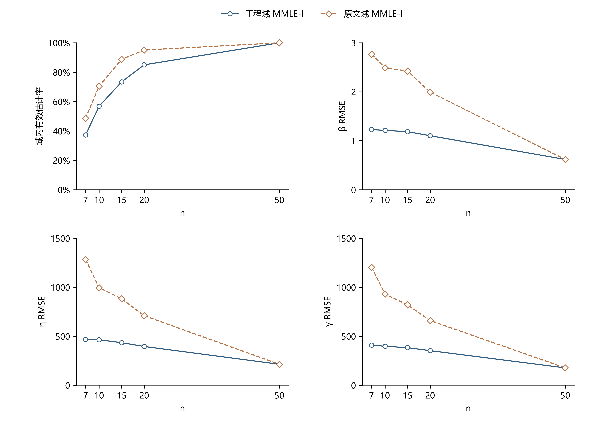

> 本文件为参数域诊断附注。主三方法结果见本批 README.md；这里引用的旧存档MLE计数不用于新主表比较。

# MMLE-I 参数域与求解复核

2026-10-05 · 邮件 `research09-mmle-domain-fix-006` · 固定 β=2、η=1000、γ=1000；n=7/10/15/20/50 各1200组。复用原来的6000组共享样本，另算CW-I的两个域，不重新抽样，不改MLE/WMLE及旧三方法主目录。

## 结论

**设置造成了部分不可用，但不是全部。** 改用原文程序域后，有效估计从4231/6000（70.52%）增至4837/6000（80.62%），恢复606次，占旧1769次不可用的34.26%。其中605次为原文域内的负位置根，1次为非负位置但形状超过旧上限9.99的根。

剩余1163次中，303次有更远的负位置根，已超出原文的“均值−10SD”下界；其中220次同时超过形状上限15。另860次通过逐样本、40位区间运算的严格正残差界核验：**对保存的样本，在全部 γ<x₁、β>0 范围内没有CW-I方程根**。这860次不是网格粗或位置域窄造成的。

本批加密搜索没有新增任何工程域或原文域内有效估计，97点旧算法漏掉的可接受根为0、发现的切根为0。求解器已补上稳定化、极值检查及域外解分类，但不能通过把域外解或无根改记为成功来提高可用率。

## 两个域的可用率与失效分类

工程域保留旧约束：0≤γ≤x₁−10⁻⁴，0.1<β<9.99。原文程序域：均值−10×样本SD≤γ≤x₁−10⁻⁴，0.1<β<15；样本SD使用ddof=1。η>0。严格形状端点沿用旧实现，本批没有恰在端点的根。

原文依据沿用已核实的[Cohen–Whitten1982原文OCR](D:/博士阶段/100科研文献管理/100科研文献管理/180_AI辅助参数估计/182_传统参数估计方法/182-091-pdf原文.md:538)：L538–540为程序参数域，§3.1为CW-I构造。理论定义要求γ<x₁，并未规定γ≥0；程序下界及形状上限仍是有限计算域，不能等同于全实数位置域。

下表的“域外根”表示找到方程根但不满足该域；“全域无根”有区间证书；“数值未决”表示未能给出根或证书。后三列是互斥的三类不可用原因。

| n | 域 | 有效/1200 | 有效率 | 域外根 | 全域无根 | 数值未决 |
|---:|---|---:|---:|---:|---:|---:|
| 7 | 工程 | 448 | 37.33% | 235 | 517 | 0 |
| 7 | 原文 | 585 | 48.75% | 98 | 517 | 0 |
| 10 | 工程 | 682 | 56.83% | 264 | 254 | 0 |
| 10 | 原文 | 846 | 70.50% | 100 | 254 | 0 |
| 15 | 工程 | 881 | 73.42% | 251 | 68 | 0 |
| 15 | 原文 | 1065 | 88.75% | 67 | 68 | 0 |
| 20 | 工程 | 1020 | 85.00% | 159 | 21 | 0 |
| 20 | 原文 | 1141 | 95.08% | 38 | 21 | 0 |
| 50 | 两域相同 | 1200 | 100.00% | 0 | 0 | 0 |
| 合计 | 工程 | 4231/6000 | 70.52% | 909 | 860 | 0 |
| 合计 | 原文 | 4837/6000 | 80.62% | 303 | 860 | 0 |

原文域是本次有文献依据的主敏感性口径，不能把80.62%称为所有真值下的普遍可用率。若完全放开负位置和形状上限，本批能找到5140/6000个根（85.67%），这只是诊断性的方程有根率；更远根的形状可达1303.24、位置可至−496965.36，未纳入原文域有效估计。

## 1769个旧不可用样本分别发生了什么

| n | 原文域负位置根 | 非负根仅形状越旧上限 | 更宽域负位置根 | 全域无根 | 旧网格漏解 |
|---:|---:|---:|---:|---:|---:|
| 7 | 136 | 1 | 98 | 517 | 0 |
| 10 | 164 | 0 | 100 | 254 | 0 |
| 15 | 184 | 0 | 67 | 68 | 0 |
| 20 | 121 | 0 | 38 | 21 | 0 |
| 50 | 0 | 0 | 0 | 0 | 0 |
| 合计 | 605 | 1 | 303 | 860 | 0 |

**只放开γ下界而保留β<9.99，恢复562次；同时采用原文β<15，再恢复44次。** 后44次由43个负位置高形状根及1个正位置高形状根构成。605个负位置根不能全算作“只改γ约束”的独立收益。

全部908个负位置根均被工程域排除，其中605个满足原文域、303个仍越原文位置下界。后303个根全部也超过旧形状上限9.99；83个满足β<15，另220个连原文形状上限也超过。不能把所有这些根只归因于γ≥0一个条件。

旧工程MMLE-I有效数比存档MLE少254个；改用原文域后比存档MLE多352个。各n的恢复量为137/164/184/121/0，原文域有效数585/846/1065/1141/1200，存档MLE为519/715/965/1087/1199。因此原来的失败率排名确实受域设定影响，**但不是所有MMLE-I不可用都属于设置伪失败**。

这里的MLE是既有β≥1、γ≥0有限局部候选的验收口径。其`unbounded`状态不能直接证明没有其他有限局部候选；本报告只比较存档的数值可用率，不把MLE状态与CW-I全域无根证书等同。

## 精度：放宽域没有自动提高准确度

以下均取各自域内全部有效估计，不裁剪、不补值。Bias为估计误差均值，SD使用ddof=0，因此RMSE²=Bias²+SD²。不同域的有效子集不同。

| n | 域 | β Bias/SD/RMSE | η Bias/SD/RMSE | γ Bias/SD/RMSE |
|---:|---|---|---|---|
| 7 | 工程 | 0.357 / 1.175 / 1.228 | 36.1 / 465.4 / 466.8 | −65.0 / 404.4 / 409.6 |
| 7 | 原文 | 1.409 / 2.385 / 2.770 | 548.7 / 1160.9 / 1284.1 | −545.1 / 1074.4 / 1204.7 |
| 10 | 工程 | 0.531 / 1.090 / 1.213 | 130.5 / 444.9 / 463.6 | −141.2 / 371.2 / 397.2 |
| 10 | 原文 | 1.336 / 2.101 / 2.490 | 473.1 / 875.5 / 995.1 | −464.1 / 806.4 / 930.4 |
| 15 | 工程 | 0.598 / 1.024 / 1.186 | 176.0 / 396.8 / 434.0 | −177.8 / 339.5 / 383.3 |
| 15 | 原文 | 1.341 / 2.019 / 2.424 | 454.3 / 756.5 / 882.4 | −438.1 / 693.1 / 819.9 |
| 20 | 工程 | 0.557 / 0.952 / 1.103 | 179.1 / 352.4 / 395.3 | −175.1 / 306.2 / 352.8 |
| 20 | 原文 | 1.017 / 1.715 / 1.994 | 343.1 / 620.8 / 709.3 | −329.8 / 571.8 / 660.1 |
| 50 | 两域 | 0.275 / 0.554 / 0.619 | 82.3 / 197.4 / 213.9 | −76.3 / 159.6 / 176.9 |

[两行完整汇总表](两行汇总表.csv)保留全精度，按两个域并列所有n；[分n统计](两口径分n统计.csv)便于筛选。原文域新增的根带来较大的参数误差，因此“恢复可解”与“提高精度”要分别报告。共同成功样本的参数估计保持一致。

图注：6000组旧样本，两个声明域。有效率分母均为各n的1200组；RMSE取各自全部域内有效估计，子集不同。线性n坐标，显示范围固定：有效率0–100%，β RMSE 0–3，η和γ RMSE 0–1500。图内仅坐标、刻度和域图例；仅PNG，450dpi。40个坐标逐一对照保存数据。

## 搜索修正与无根证书

令d=x₁−γ、δᵢ=xᵢ−x₁、tᵢ=log(1+δᵢ/d)、s=max(tᵢ)、uᵢ=tᵢ/s、k=βs。CW-I的形状方程可写成H(k,u)=k(Eₖu−mean(u))−1=0，权重正比于exp(kuᵢ)。H对k严格递增，故每个d有唯一正形状根。外层残差为C(d)=log(mean(exp(kuᵢ)))+log(log(1+1/n))；C=0等价于F(x₁)=1/(n+1)，η由尺度方程解析回代。

使用k而非直接求巨大β，避免非常负的位置产生高形状时的旧β数值括号限制。位置采用log(d/1000)网格：常规最大步长0.04；全部1769个旧不可用样本加密至0.01（相邻间隙比至多exp(0.01)，约1.0101），再向负域延伸至log(样本跨度/1000)+25，延伸段最大步长0.04。步长是可复核的数值分辨率，不是普遍无漏根证明。

变号区间用Brent；同号局部极小/极大区间再做有界极值检查，检查成对根和切根。1769条保存曲线均观察为随log(d)单调下降，未观察到内部极值；这只是有限网格行为。每个旧失败的完整曲线、极小值位置/符号、端点残差、负无穷位置极限及根均有逐样本记录。

**860个无根的判定另有连续域证据，不依靠上述单调观察。** uᵢ(d)随d单调下降：令q(y)=y/((1+y)log(1+y))，q随y下降，便有dlog(uᵢ)/dlog(1/d)=q(δᵢ/d)−q(δmax/d)≥0。因此每个d区间可由u的两端包住，包括d→0和d→∞。

对任一区间的分量下/上界lᵢ/hᵢ，取k₀使保守上界U=k₀[Σhᵢexp(k₀hᵢ)/Σexp(k₀lᵢ)−mean(l)]−1<0。于是实际形状根k*>k₀，且C(d)≥log(Σexp(k₀lᵢ)/n)+log(log(1+1/n))。当此下界>0，整个连续区间都不能有根。

自适应划分的10086个相邻区间覆盖860个样本各自的全部0<d<∞；所有U<0和C下界>0都用`mpmath.iv`40位区间运算重新核验。最小正下界为1.17374858×10⁻⁵。证书以保存的浮点样本为确切输入，给出这些样本的无根结论，不声称得到适用于任意样本的普遍存在性定理。

## γ≥0是否保留

如果γ代表从已定义时间原点起的物理下限，并有先验依据禁止负值，可以保留γ≥0；报告为“非负位置约束下的CW-I域内有效率”，同时单列负位置域外根、其他域外根及全域无根。γ约束、β上限和接近x₁的数值间隙都应明示。

如果只是为了让估计看起来更稳定，或输入本来允许任意平移，则不应把γ≥0默认为原文算法。对经典方法复核优先并列原文域与工程域。即使物理真值γ=1000，本批样本方程也可能给负估计；不能把负估计悄悄截为0——这样将改变CW-I的定义。保留约束时可将无法给出域内根的样本交给另一种事先声明的方法，但本批没有追加混合方法或回退。

建议表述：“在固定β=2、η=γ=1000的6000组样本中，CW-I原文程序域有效率80.62%，非负工程域70.52%。工程域另有909个域外方程根，860个样本全域无根；数值未决0。原文域提高可用率，但其成功子集参数RMSE更大。”

## 产物与复算

批次绝对目录：`D:\weibull\Research\09-Weibull参数估计方法谱系与比较基线\实验\20261005-MMLEI参数域与求解复核`。

| 文件 | 对应内容 |
|---|---|
| `run_domains.py`、`domain_solver.py`、`config.json` | 两域CW-I的共享生成器/runner/experiment流水线与稳定求根；60块存于`blocks/` |
| `per_sample.csv.gz` | 12000行，两域×6000组；6000个样本SHA与原批逐一相符 |
| `samples.npz` | 6000组实际输入；键n7/n10/n15/n20/n50，各1200行，行号=block×100+repeat_id |
| `旧失败逐样本归因.csv`、`逐样本曲线/<sample_sha256>.npz` | 1769个旧失败的归因、原始样本及完整曲线，文件名可与CSV一对一连接 |
| `certify_no_root.py`、`无根证书索引.csv`、`无根区间证书/<sample_sha256>.json` | 860份连续全域无根证书、全部10086个区间界与覆盖检查 |
| `summarize_domains.py`、`两行汇总表.csv`、`两口径分n统计.csv`、`域设定影响.csv` | 两口径精度/状态、旧样本连接与恢复数量 |
| `draw_domains.py`、`绘图母体.py`、`两口径有效率与RMSE.png`、`绘图核验.json` | Research00母体副本、PNG及40个图点/显示范围核验 |
| `复核记录.json`、`运行核验.json`、`原主目录保护.json`、`manifest.json` | 方程、样本、原目录及来源/输出哈希 |
| `source_snapshot/`、`reproduce.py` | 本批实际程序及共享源码快照；复算写入另一个新目录 |

使用`D:\weibull\python\.venv\Scripts\python.exe reproduce.py --output .\复核 --workers 6`可重做同样本估计、证书、统计和图；目标目录须是新目录，不能覆盖本批或原主批次。首次实际计算用`run_domains.py --workers 6`，随后`certify_no_root.py`、`summarize_domains.py`、`draw_domains.py`。环境：Python3.11、NumPy2.4.6、SciPy1.17.1、Pandas3.0.3、Matplotlib3.11.2、mpmath1.3.0。

已核验6000个样本SHA、9068个有效估计的三条方程、12000个新旧域内成败状态和1769份曲线。最大方程绝对残差4.93×10⁻¹³；新旧有效参数最大差7.14×10⁻⁸，仅数值末位变化。30个RMSE/Bias/SD恒等式通过，旧三方法主目录的219个文件及完整文件清单SHA均未改变。未改生产算法，未提交或推送。

复算入口另在`程序复核/`实际重做n=7、block=0的100组旧样本（200行两个域）及其无根证书，状态/参数与主复核批次一致；完整6000组复算尚未额外重复执行。

