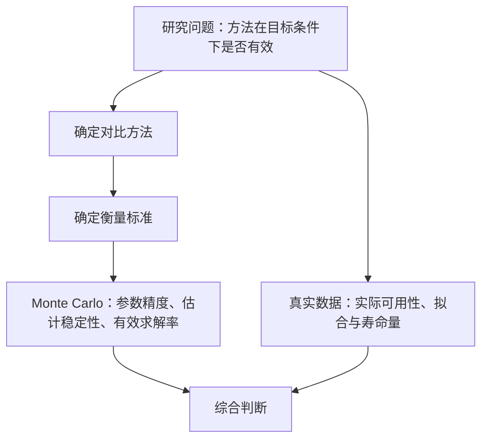
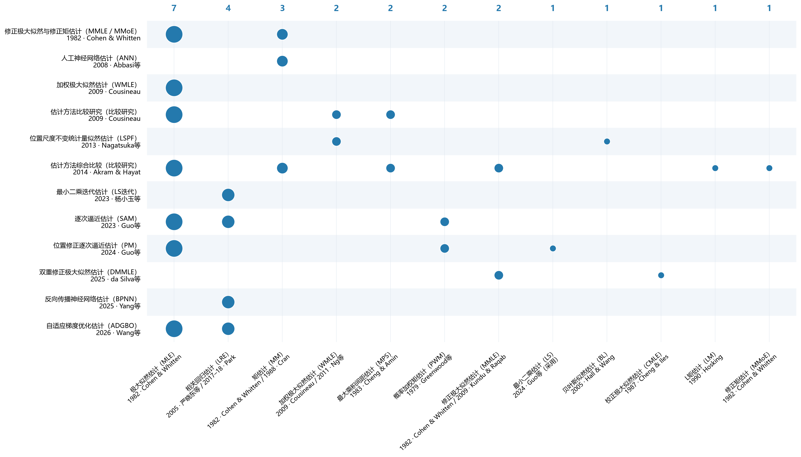
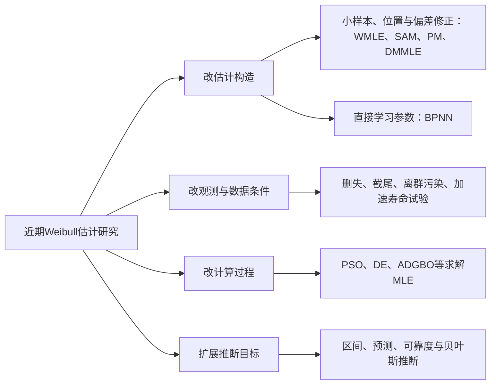

# 三参数Weibull参数估计方法的评价依据与建议

> v2.5 · 2026-09-28 · 导师汇报。完整样本、尤其小样本条件下的方法原理与文献评价实践。

## 1 研究问题与评价框架

**对于完整样本、小样本条件下的三参数Weibull分布，怎样评价一种参数估计方法的有效性？** 这一问题同时适用于新提出的方法与已有方法。

有效性是指：在目标样本条件下，相对于合理的比较对象，具有良好的**参数估计精度、估计稳定性和有效求解能力**；真实数据补充说明实际可用性。

评价分成两方面。第一方面先确定对比方法和衡量标准，再用Monte Carlo在设定的参数空间中反复抽样，观察估计值与真值的距离、不同样本间估计结果的变化，以及得到有效结果的比例。第二方面用真实数据展示能否计算、拟合怎样、寿命量如何解释。最后综合两类结果作判断。

**图1 方法有效性的两方面评价。**

一个直接的问题是：为什么不少研究仍与经典方法比较？只优于经典参照，是否足以说明相对于近期研究的表现？下面从方法原理、实际对照安排、模拟设置和真实数据分析逐步回答。文献逐篇记录见[附录A](附录A-文献证据.md)，公式与实现版本见[附录B](附录B-方法实现与版本.md)。

## 2 参数估计方法的主要思路

### 2.1 四类主要思路

三参数Weibull同时估计形状β、尺度η和位置γ。不同方法的主要区别，是依据什么样的统计关系确定这三个参数。

| 类别 | 估计依据 | 代表方法 |
|---|---|---|
| A 似然路线 | 让观测样本的似然较大 | MLE、WMLE、MMLE、DMMLE |
| B 概率图路线 | 将分布关系变成直线，再通过回归估计 | LS、LRE、相关系数法 |
| C 统计量与构造准则 | 匹配统计量，或优化间距、差异量 | MM、PWM、L矩、MPS、MDM |
| D 组合与学习 | 组合统计关系，或学习样本到参数的映射 | SAM、PM、LSPF、BPNN |

**图2 方法关系与改进动机。** 实线为继承、扩展或组合，虚线为针对同类问题的替代构造。图中区分统计构造、数值求解和学习映射。[可编辑源文件](图片/方法关系与改进动机.drawio)。

### 2.2 似然路线：从解释样本到修正偏差与改善计算

**极大似然估计（MLE）**将各观测点在给定参数下的密度相乘，选择使似然较大的参数。它从“什么参数最能解释这组样本”出发。三参数Weibull的位置未知，支持域随参数变化，小样本偏差和边界附近的求解问题因此受到关注。

围绕这些问题，**加权极大似然估计（WMLE）**通过有限样本权重修正估计方程；Cousineau（2009）[182-088]把相应构造扩展到三参数。**修改极大似然估计（MMLE）**改变似然构造以处理位置边界问题，**双重修改极大似然估计（DMMLE）**[182-111]则在Kundu–Raqab构造上进一步引入Firth得分偏差修正。它们分别针对有限样本估计与似然构造的困难。

另一批工作改进计算：用粒子群（PSO）、差分进化（DE）、自适应梯度优化（ADGBO）等搜索参数，减少初值敏感、搜索停滞或计算耗时。当似然目标与参数约束相同时，改变的是MLE的求解过程。有限计算预算下，更好的求解可能影响最终估计结果，其直接研究对象仍是搜索、收敛与效率。

### 2.3 从二参数概率图回归，到三参数位置求解

二参数Weibull的位置已知，通常取零。将样本排序，利用Weibull线性化关系形成概率图，再用最小二乘使回归残差平方和尽量小，由斜率和截距恢复形状与尺度。三参数情况下，位置也未知，线性化关系为

$$
x_i(\gamma)=\ln(t_{(i)}-\gamma),\qquad z_i=\ln[-\ln(1-p_i)],\qquad z_i\approx\beta x_i-\beta\ln\eta.
$$

位置γ会改变横坐标；位置确定以后，回归斜率和截距可以恢复形状β与尺度η。三参数方法需要解决的核心问题，是怎样确定这个未知位置。下面比较三个具体构造。

| 方法 | 位置与形状怎样求 | 其余参数怎样恢复 |
|---|---|---|
| **传统LS的三参数扩展：Soman–Misra（1992）White分支**[182-104] | 试一个γ，对平移样本做White最小二乘并计算F比；改变γ重复，选择F比最大的参数组 | 使用标准对数Weibull次序统计量的期望分数z，回归$x=a+bz$，由$\hat\beta=1/b$、$\hat\eta=e^a$恢复 |
| **LRE：Li（1994）第5节联立回归方法**[182-107] | 构造“给定γ求β”的$\beta=g_1(\gamma)$与“给定β求γ”的$\gamma=g_2(\beta)$；求两条关系的自洽解$\beta=g_1(g_2(\beta))$ | 原算法先确定β的上下界，以中点计算复合关系并收缩区间，得到β、γ后按相应回归关系恢复尺度 |
| **LRE：Park（2017）相关系数定位＋Plot**[182-115] | 计算概率图相关系数$R(\gamma)$，通过最大化相关性先确定γ；原文进一步分析导数与求根条件 | 按绘图概率构造分数z，再回归$z=a+bx$，由$\hat\beta=b$、$\hat\eta=\exp(-a/b)$恢复 |

三条流程分别突出**逐个位置拟合与评分、两条回归关系联立、相关系数定位后回归**。Li的原算法使用区间收缩，并非任意初值下单纯反复代入；Li与Park都属于线性回归估计（LRE）范围，但分别采用联立回归求解和相关系数定位的具体构造。资料中的LRE01、LRE02用于区分这两个方法。

Soman与Park都利用直线程度确定位置。在相同分数和带截距OLS条件下，F比与相关系数平方单调对应，因此不能仅以“F比还是相关系数”断言两种原文方法完全不同。具体区别还包括期望次序分数与绘图概率分数、回归方向、位置搜索或求根方式。**LS是最小二乘拟合准则，LRE是线性回归估计框架，两者不是并列、互斥的大类。** 普通线性回归通常使用最小二乘。三参数模型中，只写“LS”不能确定唯一算法，还须说明位置参数求法、分数取法和回归方向，因此比较应落到具体文献构造。

讲解材料：[LS](资料/LS.md)、[Li](资料/LRE01-Li方法.md)、[Park](资料/LRE02-park.md)；原文方程、分支和实现边界见附录B第11节。

### 2.4 统计量与构造准则：让什么量满足什么条件

这组方法可以通过“构造什么量、为什么优化它”来理解。

| 方法 | 构造的量 | 确定参数的依据 |
|---|---|---|
| 矩估计（MM） | 样本矩与相应理论矩 | 让样本统计特征与模型统计特征匹配 |
| 概率加权矩（PWM）、L矩（LM） | 概率加权统计量，或其线性组合 | 用这些统计量约束参数；PWM可线性组合得到L矩 |
| 最大乘积间距估计（MPS） | 排序观测在累计概率上的相邻间距，包括两端间距 | 最大化间距乘积；在间距总和固定时，该准则惩罚接近零的间距 |
| 最小差异法（MDM） | 由各排序观测和绘图概率反推出的尺度伪估计 | 最小化这些尺度值之间的差异，让不同观测给出的尺度尽量一致 |

MPS由Cheng–Amin（1983）[182-116]提出，用概率间距代替观测处密度作为估计依据。MDM由Xie等（2022在线／2023卷期）[182-030]提出，从分布关系构造尺度一致性准则。它们优化的量不同，对应的分别是概率间隔结构和尺度一致性。

### 2.5 组合与学习：怎样交替更新，怎样直接映射

**逐次逼近估计（SAM，Guo等2023）**[185-005]从位置参数难估计入手。样本最小值通常高于分布起点，因此利用最小值的期望关系修正位置，再通过概率图回归更新形状、尺度，反复更新直到稳定。

**位置修正逐次逼近构造（PM，Guo等2024）**[182-117]采用最小值的中位数关系修正位置，并结合条件似然更新其他参数。两者都交替处理位置与其余参数，但分别使用“期望关系＋回归”和“中位数关系＋条件似然”。详细方程和实现状态见附录B。

**位置尺度不变统计量似然估计（LSPF，Nagatsuka等2013）**[182-113]先变换样本，构造不含位置和尺度的统计量，利用其分布估计形状，再恢复其余参数。

**反向传播神经网络估计（BPNN，Yang等2025）**[184-009]用已知参数生成模拟样本训练网络，使网络学习从样本特征到参数的映射。使用时将样本特征输入网络，直接得到估计值。

## 3 文献怎样选择比较对象

### 3.1 已有论文实际选择了谁

图3展示12篇完整样本三参数估计论文的实际对照。纵向是论文提出或研究的方法，横向是比较方法；出现气泡表示采用过。标签使用中文名称与缩写。

**图3 文献实际对照选择。Benchmark展示样本为12篇；第4章指标统计样本为13篇，后者保留MDM论文[182-030]。两者源自同一审核主子集，统计范围不同。**

[可编辑SVG](图片/文献对照气泡图.svg) · [矢量PDF](图片/文献对照气泡图.pdf)

在这12篇论文中，MLE出现7篇，相关回归路线LRE出现4篇；矩估计、WMLE、MPS、PWM等也反复出现。经典方法仍是常见参照。由此自然产生一个问题：近期有不少新工作，为什么比较中仍经常出现这些方法？

本轮进一步补核6篇论文的对照选择：2篇全参数模拟比较、2篇形状估计比较、2篇实际应用比较，加上图中12篇形成18个选择案例。另有2篇仅核摘要，未计入。逐篇对手、选择理由和正文定位见[对照选择补充调研](资料/对照选择补充调研.md)。

### 3.2 为什么近期论文不少，比较中仍常见经典方法

近期研究同时在改变估计构造、观测条件、计算过程与推断目标。

例如，DE[187-005]、PSO[187-012]和ADGBO[187-001]研究MLE的搜索与求解；删失研究[182-114/103]处理不完整观测，PITE[182-003]处理污染；SAM、PM和DMMLE则直接改变估计构造。具体方向及文献身份见[近期范围核查](资料/近期文献范围核查.md)。

所以，近期论文的数量并不直接对应“完整小样本三参数点估计”的新对照数量。同时，同任务的新方法仍然存在，需要看其研究条件与比较安排。

保留经典对照也有具体理由：Cousineau比较研究[182-101]将MLE作为常用参照，便于联系既有工作；LSPF[182-113]依据前序研究选择BL和WMLE，因为已有结果显示二者具有竞争力。方法发表较早，本身不能说明精度已经较差；是否值得比较，要看相同任务下的实际证据。

### 3.3 具体论文和谁比、在哪些条件下比、想证明什么

| 论文 | 实际对手 | 参数与样本条件 | 比较目的与结果 |
|---|---|---|---|
| LSPF，Nagatsuka等2013[182-113] | BL、WMLE | β=0.5、1、2、3、4、5，η=1，γ=0；n=10、20、50、100、500 | 与已有较强方法比较精度、波动和计算；作者总体上按样本量给出不同判断，具体结果随参数而变 |
| SAM，Guo等2023[185-005] | MLE、CCWP相关系数概率图方法、PWM | β=1.5、2、2.5，γ=1；η=0.2、0.4、0.6、0.8、1、2、3、4；n=5、10、15、20 | 检验极小样本下三参数平均MAD和MSD；n≤10时平均MAD优势明显，样本增加后与MLE差距缩小 |
| DMMLE，da Silva等2025[182-111] | MMLE、CMLE | 原文(μ,α,σ)为(1,1,1)、(1,0.5,2)、(1,1.5,2)；n=50、100、500、1000 | 检验新增似然修正的收益；相对偏差改善，RMSE总体接近。此处保留原文参数符号 |
| BPNN，Yang等2025[184-009] | CCM、MDM | n=5、10、15、20，在原文给定的训练与测试参数范围内 | 比较参数和1%寿命分位点的SD、RMSE，检验学习映射的小样本估计表现 |

这些安排把研究问题、对手和实验条件联系起来：LSPF强调与已有较强对手比较，SAM强调极小样本，DMMLE强调相近构造的偏差修正，BPNN强调学习估计与统计构造的比较。具体条件记录见[性能记录](evidence/literature_performance_boundaries.json)和附录A。

补充案例进一步说明选择随研究主张变化：Ouédraogo等（2021）沿用Nagatsuka等的设计，与LSPF和BLE历史结果比较；Zarnoch与Dell（1985）检验分位数估计在林分参数域的表现，选择特定偏差修正MLE作对照；Ogbonna与Obiora-Ilouno（2021）将对手限定为已有闭式形状估计。前两篇关心完整三参数，后一篇只关心形状，不能混成同一精度排名。来源及核查细节见[补充调研S01、S02、S04](资料/对照选择补充调研.md)。

### 3.4 从实际比较安排得到的规律

| 常见比较思路 | 文献实例 | 比较作用 |
|---|---|---|
| 保留共同经典参照 | Cousineau比较研究保留MLE | 联系既有研究 |
| 选择已有较强方法 | LSPF选择BL、WMLE | 检验与有竞争力方法的差距 |
| 与相近原理或直接相关方法比较 | DMMLE对MMLE、CMLE；闭式形状估计比较已有闭式估计 | 检验具体构造的改进 |
| 沿用前序比较设计并核查适用域 | Ouédraogo等对LSPF、BLE；Zarnoch与Dell在林分参数域重比PCT与MLE | 联系前序证据，检查结论能否迁移 |
| 覆盖同任务的不同估计思路 | SAM对MLE、概率图、PWM | 观察新构造在同一任务中的表现 |

共同特点是**围绕所解决的问题组织比较**。同一方法可以承担多种比较作用，具体组合随研究问题、样本条件和方法关系而变化。当前已核文献尚未确认所有研究共同采用的一份固定名单。

## 4 Monte Carlo模拟的评价依据

### 4.1 文献怎样设置模拟

Monte Carlo模拟先设定真参数(β,η,γ)和样本量n，从该分布反复生成样本，再用每种方法估计。因为真值已知，可以直接计算每次估计的误差；重复抽样则揭示估计结果的稳定性。文献通常同时改变参数组合与样本量，观察方法在不同条件下的表现。

| 来源 | 样本量与重复次数 | 主要评价内容 |
|---|---|---|
| LSPF[182-113] | β=0.5、1、2、3、4、5，η=1，γ=0；n=10、20、50、100、500，每条件1000次 | 逐参数及联合Bias、RMSE、CPU时间 |
| 迭代LS[182-047] | n=10、15、20、25、30；两组真值，各1000次 | 参数及99%可靠度寿命的Bias、RMSE |
| SAM[185-005] | β=1.5、2、2.5，η=0.2—4，γ=1；n=5、10、15、20，每条件10000次 | 三参数平均MAD、MSD及寿命量误差 |
| BPNN[184-009] | n=5、10、15、20；每条件1000组 | 各参数及99%可靠度寿命的SD、RMSE |

这些设计共同关注样本量变化，但参数域、重复次数和指标并不统一。评价时应让各方法处理同一批模拟样本，分别展示不同条件的结果，避免一个总体平均掩盖小样本或特定形状下的差异。

### 4.2 用什么指标评价

| 评价问题 | 需要报告什么 | 作用 |
|---|---|---|
| 在什么条件下比较 | 真参数、样本量、重复次数 | 说明结果适用范围与模拟精度 |
| 估计准不准 | Bias、RMSE或MSE | 分别反映系统偏差与总误差 |
| 估计稳不稳定 | SD | 反映重复抽样造成的波动 |
| 能否得到有效估计 | 有效率／失败率及原因 | 反映给定实现与计算预算下的可靠性 |

**指标使用统计：13篇（含MDM论文[182-030]）；图3的benchmark展示：12篇（不含该篇）。** 两者均来自同一审核主子集；同篇可使用多个指标。以下保留完整指标口径，避免随图示删减遗漏已核评价方式。

| 指标 | 已确认篇数 | 含义与限制 |
|---|---:|---|
| 逐参数RMSE | 7 | 同时包含偏差与抽样波动造成的误差 |
| 逐参数SD | 5 | 重复抽样时估计值的波动，不包含系统偏差 |
| 逐参数Bias | 4 | 系统偏差；相对Bias另核1篇，不自动混计 |
| 逐参数MSE | 1 | 与RMSE单调对应；单位不同 |
| 跨参数平均MAE、相对MAE | 各1 | 必须核对归一化及跨参数权重 |

β、η、γ应分别评价。对参数θ，Bias是估计误差的平均值，RMSE是平方误差均值的平方根，SD描述估计值围绕其平均值的波动。MSE与RMSE排序一致，一般选一个即可；联合指标需要说明归一化，尤其不能直接将不同单位的误差相加后当作同等权重。

若研究主张涉及寿命量，可另报相应分位点误差；99%可靠度寿命对应1%分位点。区间估计则同时看覆盖率和区间长度。这些补充取决于研究要证明什么。

### 4.3 估计失败也是评价结果

三参数Weibull的支持域要求γ小于样本最小值。固定0<β<1和η>0，让γ从下方逼近最小观测时，似然可趋于无穷。因此允许这条边界路径的不受限似然没有有限全局最大值；文献中的MLE数值结果通常需要说明局部解、受限解或具体分支。这个问题取决于搜索参数域，不能只归因于真形状小于1。[DMMLE理论背景](https://pmc.ncbi.nlm.nih.gov/articles/PMC12110674/)

| 文献 | 实际处理 | 对评价的影响 |
|---|---|---|
| Akram–Hayat[182-096] | 只保留ML收敛且L偏度满足阈值的样本，β<1省略MLE | 误差反映筛样后的表现 |
| 比较研究[182-091] | 限制参数范围与迭代，报告未得到估计的次数 | 有效率与误差需要一起读 |
| MDM[182-030] | n=15的30组中MLE有6组未得到解；图中以零标记 | 零是标记，不是有效估计，不能代入RMSE |
| Cousineau比较研究[182-101] | 剔除形状估计大于5的极端输出 | 极端输出的筛除会改变误差统计 |
| PM[182-117] | 报告接近零／非正位置估计的比例 | 边界输出与一般求解失败应区分 |

数学上没有有限最大值、数值未收敛、输出超出所声明参数域，应分别记录。负位置是否有效取决于模型的物理约束；贴边结果也不应一律当作失败。比较时同时给出全部生成次数、有效次数、失败原因及有效结果上的误差。按成功结果计算的误差回答的是成功条件下的表现；若另看各方法共同成功的样本，应注明这一统计范围。

## 5 真实数据怎样分析

### 5.1 参数真值未知，文献实际评价什么

真实寿命样本通常不知道β、η、γ的真值，因而不能像模拟那样直接计算参数误差。文献主要从以下三方面展开：

| 分析内容 | 实际做法 | 能回答的问题 |
|---|---|---|
| 实际可用性 | 给出参数估计、运行结果及失败情况 | 这组数据能否得到有效结果？ |
| 拟合表现 | 比较经验CDF与拟合曲线，计算K-S或AD等统计量 | 模型与观测数据符合得怎样？ |
| 寿命量与应用解释 | 计算平均寿命、可靠度寿命或分位点 | 估计结果如何用于实际问题？ |

因此，真实数据分析既可能比较多个方法，也可能只展示新方法应用。比较拟合可以说明这组数据上的拟合差异；要回答参数估计离真值多远，仍主要依靠已知真值的Monte Carlo。拟合优度检验的p值也不是参数准确性的度量。

### 5.2 三个真实数据案例

| 论文与数据 | 实际比较或展示内容 | 主要说明什么 |
|---|---|---|
| BPNN[184-009]；15个铝合金疲劳寿命 | 对CCM、MDM给出参数、经验CDF、拟合CDF、K-S统计量与p值 | 比较这组数据上的拟合表现 |
| LSPF[182-113]；10点轴承寿命、4点寿命 | 对MM、BL、WMLE给出参数结果、变换似然形状及不收敛记录 | 展示困难小样本上的可计算性 |
| SAM[185-005]；10点轴承寿命、4点寿命 | 分析K-S、CDF、绘图概率处误差、平均寿命及可靠度寿命；部分对手沿用历史结果 | 说明拟合和寿命量的应用解释 |

三个案例的重点不同：BPNN侧重拟合比较，LSPF展示小样本上能否得到结果，SAM进一步解释实际寿命量。真实数据为方法提供应用证据，模拟则提供参数精度和估计稳定性的主要证据。

## 6 总结：怎样评价一种参数估计方法

首先讲清方法依据什么估计、要解决什么问题；再从文献中理解同类研究怎样选择对手。已有研究常保留经典参照，加入有竞争力的对手，或比较相近原理、直接相关的构造，具体组合随研究而变化。

Monte Carlo在已知真值下衡量目标参数空间和样本量条件中的准确性与估计稳定性，同时报告有效求解情况。真实数据展示方法在实际样本上的可用性、拟合和寿命量。

**最终判断落到具体条件：相对于哪些方法，在哪些样本量和参数范围下，哪些参数或寿命量估计得更好，以及计算、波动和失败方面有什么代价。**

## 主要来源

经典构造与继承关系：[Fisher 1922原文](https://jhanley.biostat.mcgill.ca/bios601/Likelihood/Fisher1922.pdf)；[Greenwood等1979](https://pubs.usgs.gov/publication/70012617)；[Hosking与Wallis著作中的PWM—L矩回顾](https://assets.cambridge.org/97805210/19408/frontmatter/9780521019408_frontmatter.pdf)；[Soman–Misra 1992](https://doi.org/10.1016/0026-2714(92)90057-R)；[Li 1994](https://doi.org/10.1109/24.295002)；[Cheng–Amin 1983](https://doi.org/10.1111/j.2517-6161.1983.tb01268.x)。White的1969来源由Soman–Misra原文追溯，Cohen–Whitten的1982构造由已核比较论文及综述追溯；尚不将这种追溯写成对其原文的完整审读。

近20年代表：[Cousineau WMLE](https://doi.org/10.1348/000711007X270843)；[Nagatsuka等2013](https://doi.org/10.1016/j.csda.2012.09.005)；[Park 2017](https://doi.org/10.23055/ijietap.2017.24.4.2848)及[2018](https://doi.org/10.1155/2018/6056975)；[MDM](https://doi.org/10.1142/S0219455423500852)；[SAM 2023](https://doi.org/10.1007/s12206-023-1019-z)及[逐次逼近PM 2024](https://doi.org/10.1002/qre.3559)；[BPNN](https://doi.org/10.1016/j.probengmech.2025.103828)；[DMMLE](https://doi.org/10.3390/e27050485)。DMMLE原文明确列出Kundu–Raqab修改似然与Firth修正的来源，本文依此说明其继承关系。

选取依据还包括[Cousineau的比较研究](https://doi.org/10.1109/TDEI.2009.4784578)[182-101]和[Akram–Hayat 2014](https://doi.org/10.1080/15598608.2014.847771)。其他场景研究的身份、原文入口及证据范围统一见[附录A](附录A-文献证据.md)。
