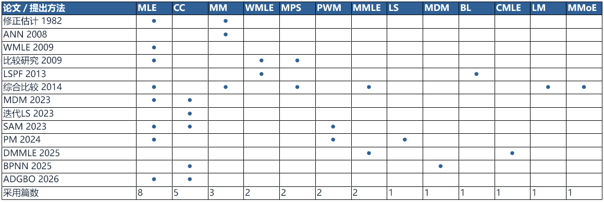

# 附录A：文献来源与逐篇证据

正文给出研究判断与比较建议；本附录用于查证，不按核查批次分章。范围为普通三参数Weibull完整样本，样本量不限；特殊任务只作来源或沿革参照。

> **2026-09-28统计更新：** 当前报告v2.5使用[比较习惯核查](资料/比较习惯核查.md)及[benchmark_comparison_audit.json](evidence/benchmark_comparison_audit.json)：45条审核记录，13篇严格模拟比较主子集；逐参数RMSE明确核到7篇、SD5篇、Bias4篇，其他指标另编码。近期方向采用[63条有界编码](evidence/recent_direction_audit.json)，其中2006年以来51条、2016年以来35条。下文原44条用途审计和38条经验用途统计保留其原口径，不与新主子集混用；182-096真实数据标记以新审核为准。旧9篇定向矩阵已停止作为当前统计依据。

## A1. 方法来源与继承关系

以下区分原始构造、直接继承、后续实际比较和仅引用。“跨作者”仅指所核作者名单没有重合，不保证团队间不存在合作关系。

### 沿革：哪些关系得到原文支持

| 关系 | 可定位的依据 | 本次结论 |
|---|---|---|
| Jacquelin（1993）→Cousineau（2009）WMLE | 182-088第2节、附录B及参考文献；182-113引言交叉说明 | 前者二参数代数构造，后者扩展到三参数并计算修正权重；直接继承由后者原文说明，未声称已审读Jacquelin全文 |
| White（1969）→Soman–Misra（1992）LS | 182-104引言、White方法小节及参考文献5 | 原文明确称其为二参数方法的三参数扩展；White原文仍属引用追溯 |
| Cohen–Whitten（1982）的修正似然/矩 | 182-096第3.4、3.6节给出构造；[1982出版条目](https://doi.org/10.1080/03610928208828412)核对题名 | 可说明基于修改条件的多个版本；未取得原始全文，不把全部版本缩成唯一MMLE公式 |
| Kundu–Raqab（2009）＋Firth（1993）→DMMLE（2025） | 182-111引言、第2—3节、结论及参考文献10、32 | DMMLE明确说明两个来源；样本最小值处理与得分修正是两层改变，并非WMLE后继 |
| MPS与Nagatsuka变换方法 | 182-116引言；182-113第1—2节 | 前者改用概率间距；后者用去位置、尺度的变换统计量建立形状似然，并顺序恢复其他参数，二者不能连成直接改进链。182-113还追溯Ranneby（1984）独立提出间距方法，该早期原文未审读 |

### 后续采用：哪些证据可以支持对照选择

| 对象 | 原文定位 | 证据性质及限制 |
|---|---|---|
| WMLE→Nagatsuka等2013（182-113） | 第3节、式10—12、表1—6、结论 | 实际比较BL、w-ML与LSPF，提出WMLE的Cousineau不在作者名单中。w-ML按Ng等（2011）方式，以平移样本的二参数MLE形状代入W3并模拟中位权重，不能等同于本项目迭代更新J3版本。作者的小样本推荐支持WMLE有比较价值，不作本项目版本的直接胜负证据 |
| WMLE/MPS→Safari等2025（182-003） | Monte Carlo simulation study、表/图结果、参考文献32 | 与Cousineau及Cheng–Amin无作者重合；实际比较WMLE、MPSE等，程序来源为ForestFit。污染任务下的采用不等于干净极小样本的优势 |
| MPS/LM及修正估计→Akram–Hayat2014（182-096） | 第3—4节、结论 | 跨作者实际比较；保留ML收敛及L-skewness筛样限制，不能按胜出次数宣称全面最优 |
| Park相关回归→Wang等2026卷期（187-001） | CCLSE方法介绍、Monte Carlo实验部分、参考文献17 | 实际采用相关系数加LS组合，对应Park2017来源；Park不在作者名单中，可支持后续采用 |
| MDM→182-025、184-009 | 作者名单、比较方法及结果 | 实际比较，但与182-030有作者重合；属于后续使用，不能计为独立团队确认 |
| SAM相关工作→187-001 | 引言及参考文献27，对照列表 | 引用的是Guo等2024（qre.3559），实验列表为CCLSE、Newton、PSO、ADGBO，不能据这条引用声称SAM已在该文中被比较；两文还有作者重合 |
| BPNN、DMMLE | 按完整题名关键词、DOI及方法名检索现有正文 | 本轮未确认独立性能比较；OCR及词形会造成漏检，这只是当前证据状态，不是“没有后续研究”的结论 |

作为辅助采用证据，[CRAN的ForestFit 2.2.3文档](https://search.r-project.org/CRAN/refmans/ForestFit/html/fitWeibull.html)明确收录三参数`wml`与`mps`，并列出Cousineau来源（2026-09-27查阅）。软件收录支持方法可获得性，不是额外一篇性能验证；这里未运行或审计软件实现。

### SAM两版应如何区分

2023来源为185-005；2024来源为182-117，Guo、Kong、Wu、Xie，*Evaluating the lifetime distribution parameters and reliability of products using successive approximation method*，40(6):3280–3303，[DOI](https://doi.org/10.1002/qre.3559)。

| 项目 | 2023 SAM，185-005 | 2024逐次逼近PM，182-117 |
|---|---|---|
| 形状估计 | 平移后的概率图线性回归 | 固定上轮位置，求解形状的似然得分方程（式8）；回归仅提供初值 |
| 尺度估计 | 使用前轮形状和新位置更新 | 使用本轮形状和前轮位置，由式13更新 |
| 位置更新 | 最小次序统计量的期望关系，修正项含Γ(1+1/β) | 最小次序统计量的分位数关系，点估计取P=0.5，修正项含(ln2)^(1/β)（式17） |
| 迭代补救 | 已读版本的初始尺度调整及越域处理有待明确 | 算法2在位置下降时加入lr乘样本最小值的增量；这是构造的一部分，不能省略后仍称原版 |
| 实验范围 | n=5、10、15、20；参数及寿命误差 | §4以n=100、500、1000、2500为主；§5.1另有n=5、每条件10000次，比较LSE、MLE、PWM |
| 指标与用途 | 参数MAD、SD及寿命评价 | Mean、STD、Bias、MSE、参数距离E²、计算时间及位置覆盖评价；包含区间推断 |

这不是简单换求解器：位置估计关系和形状估计准则均改变。两篇作者相同；本次未在182-117参考文献中定位到185-005，因而只称同团队相关构造，不断言作者明确以2023版为基础改进。两版之间未核得直接性能比较。

2024文§5.1将接近零或负的位置估计视为零，并统计这类情况。它反映作者采用的非负位置任务及处理规则，不能直接当作数学无解率。其§4.2对覆盖的文字说明包括“估计小于真值”的比例，引用时应区分单侧覆盖与双侧区间覆盖；本轮不把作者的全局最优、普遍唯一或覆盖良好声明提升为独立验证结论。2023版既有复算数据不适用于2024版。

### 主要出版入口

| 编号 | 题名/身份 | DOI |
|---|---|---|
| 181-004 | A Review of Parameter Estimation Methods of the Three-Parameter Weibull Distribution，2023 | [出版入口](https://doi.org/10.1109/ISSSR58837.2023.00013) |
| 181-008 | Weibull parameter estimation methods on wind energy applications – a review of recent developments，2024 | [出版入口](https://doi.org/10.1007/s00704-024-05184-2) |
| 182-101 | Fitting the Three-Parameter Weibull Distribution: Review and Evaluation of Existing and New Methods，2009，16(1):281–288 | [出版入口](https://doi.org/10.1109/TDEI.2009.4784578) |
| 182-096 | Comparison of Estimators of the Weibull Distribution，Akram与Hayat，2014，8(2):238–259 | [出版入口](https://doi.org/10.1080/15598608.2014.847771) |
| 182-088 | Nearly unbiased estimators for the three-parameter Weibull distribution with greater efficiency than the iterative likelihood method，2009 | [出版入口](https://doi.org/10.1348/000711007X270843) |
| 182-025 | 三参数威布尔形状参数估计方法的比较与推荐取值，2024 | [出版入口](https://doi.org/10.3901/JME.2024.16.367) |
| 182-030 | A Minimum Discrepancy Method for Weibull Distribution Parameter Estimation，2022在线/2023卷期 | [出版入口](https://doi.org/10.1142/S0219455423500852) |
| 185-005 | Weibull parameter estimation and reliability analysis with small samples based on successive approximation method，2023 | [出版入口](https://doi.org/10.1007/s12206-023-1019-z) |
| 182-003 | Robust estimation of the three parameter Weibull distribution for addressing outliers in reliability analysis，2025 | [出版入口](https://doi.org/10.1038/s41598-025-96043-1) |
| 184-009 | Estimation of Weibull distribution using the back-propagation neural network for fatigue failure data，2025 | [出版入口](https://doi.org/10.1016/j.probengmech.2025.103828) |
| 182-050 | Parameter estimation of the initial failure period for a three-parameter Weibull distribution in a small sample，2025 | [出版入口](https://doi.org/10.1080/00949655.2025.2552417) |
| 182-103 | Parameter Estimation of the Three-Parameter Weibull Distribution Based on an Iterative CDF Method，2026 | [出版入口](https://doi.org/10.3390/math14040649) |
| 187-001 | An improved adaptive gradient-based optimization algorithm for estimating the parameters of three-parameter Weibull distribution: an application of aero-engine reliability assessment，2026卷期 | [出版入口](https://doi.org/10.1016/j.ress.2025.111610) |
| 183-012 | AI-calibrated quantile matching estimation: A new method for accurate Weibull parameter prediction under irregular wind distributions，2025在线/2026卷期 | [出版入口](https://doi.org/10.1016/j.enconman.2025.120673) |

## A2. 逐篇比较与指标记录

44条记录统一列于下表；其中38条进入经验用途统计，3条理论构造、2条范围/指标待核、1条GEV扩展单列。当前对照频次及解释见正文3.1，指标频次见正文4.2，不在此另列历次统计。

S=重复生成样本评价；G=生成实例；R=真实应用；U=实测子抽样；B=参数信息向量重抽样；O=优化器重复；P=后验采样；T=理论构造。没有某代码表示未确认，不能理解为原文没有。187-002、182-085和182-105不进入主经验频次。S可仅评价自身性能，不自动表示全部对手统一重跑。

| 编号/方式 | 对手与样本设计 | 实际指标、评价含义 | 失败/限制；定位 |
|---|---|---|---|
| 182-004 / R,U | MMPDS、傅氏法；330个实测值取不同n子集；最小25，重复3次 | 相关系数、估计限均值/SD。实测拟合与子抽样稳定性；无参数真值 | AD筛样；非独立批次；OCR L179、242、275 |
| 182-024 / S,R | 原WMLE、MR/MH修正；n=3—15构造；n=4、5各1000次验证；真实n=10 | 形状Mean、Bias、RMSE。仅形状精度；实测2.01为前人参考估计 | 未核清统一失败分母；§3—5、表7/9/10 |
| 182-025 / S | CCM、LS、MDM；n=15、30、50、100、200，每条件1000次 | 形状Bias、RMSE。仅形状参数风险 | 未核清统一失败分母；模拟节、式12/13；OCR L145–159 |
| 182-030 / S | ML、概率图相关LS；共65组生成样本；含n=15的30组和n=30的15组 | 参数Mean、SD、范围；低尾CDF、保守性。参数波动与低尾分布表现 | 30组中MLE6组失败；图中零为标记；部分CDF排除失败；§3.3—4、图5—8；OCR L184、227 |
| 182-046 / S,G | 零偏移与正偏移MD、ML、LS；n=7的30组随机样本；120案例确定偏移，近千例仅概述 | 参数范围、尺度伪估计量差异。内部准则与估计分散性；不将优化目标当RMSE | 未核清；方法正文及结论；不依据frontmatter摘要 |
| 182-047 / S,R | 相关系数法；n=10、15、20、25、30，各1000次；真实20与11点 | 参数及99%可靠度寿命Bias、RMSE；实测K-S/CDF。参数及目标寿命误差；实测拟合 | 未核清统一失败分母；§3.2、§4 |
| 182-050 / S,R | w-MLE、BL、LSPF及自身分支；n=10、20、30，每条件100000次；实测案例 | 参数Bias、RMSE、Joint；实测logL。参数联合/边际误差；实测例证 | variance/RMSE公式疑点待PDF校核；不能照抄公式；§4、应用节；OCR L230–268、288、319 |
| 182-054 / S | ML、LS；零偏移/0.1偏移；n=7或15，共120组生成数据 | 参数及分位数、分散程度。参数/分布表现，未统一编码为RMSE | 未核清统一失败分母；§3.3—4、表1—11 |
| 182-064 / S | 单应力作者均值误差法；形状0.5；n=5、15、30，各1000次；只计完整单应力 | 平均估计及其距真值误差。偏差类汇总，不是逐次RMSE | 约束见式37；多应力另列；§4.1、式37、表1 |
| 182-085 / R | 高镇同各分支、两项历史修改MLE；三组恒应力试验，逐应力数据；原始观测完整性待进一步核清 | Q绝对拟合差和、R²、logL。拟合比较；暂不进已确认完整实测分母 | 未知；§4例3；OCR L319–335 |
| 182-088 / S | 迭代MLE、两步MLE、权重分支；n=8、16、32，每条件1024次 | 中位偏差、三参数相对距离中位数、SD。非通常均值Bias/RMSE；联合距离 | 失败分母未完整核清；§6—8、表5—8 |
| 182-091 / S | MLE、MMLE I–V、ME、MME I–III；n=100每条件100；部分n=25为200、n=10为10 | 参数Mean、Bias、SD；失败次数、CPU。精度/波动与可解性；实用例实为生成例 | MLE形状1.01—15、其余0.1—15；位置限制；50次求解限制；§7—9、表II/III；OCR L517–556 |
| 182-094 / G | Sinha求解程序；另二/三参数模型；生成W(30,100,3)；另n=50生成模型比较 | 收敛步数13对>50、参数、百分位、CDF。求解与模型比较；非跨估计器重复风险 | 披露容差和搜索范围；无总体失败率；§4—5；OCR L333–375 |
| 182-095 / R | 三种绘图位置、历史LS；14个清洁带失效时间 | EIVSS、拟合图。自身目标与拟合；非参数真值误差 | 未知；§3、表1—2 |
| 182-096 / S | MLE、LM、MMLE1/2、MoE、MMoE1、MPS；n=10、20、50、100，各5000次 | 参数Bias、RMSE。筛选后样本的参数风险 | ML收敛且L偏度≥−0.1699；形状<1省略MLE；§4.1；OCR L377–390 |
| 182-101 / S | MLE、MPS、WMLE、矩及混合估计；n=8、16、32、64，多形状 | Bias、SD、RMSE、参数向量距离。参数及联合风险；同WMLE作者 | 剔除形状估计>5；§3；OCR L194、223、266 |
| 182-102 / S,G | 重复模拟主要自身；生成例比ML/矩；每条件1000次；生成案例另列二/三参数 | Mean、Bias、SD。自身风险不等于统一跨方法比较 | 非负位置可接受性另述；分母待核；Properties、Examples、Appendix |
| 182-104 / G | White扩展与失效率分支；n=20表3；前两个n=30为生成例 | 参数估计及真值对照、迭代。例证，未确认重复风险 | 未知；§2、表1—3 |
| 182-111 / S,R | MMLE、CMLE；n=50、100、500、1000，各1000次；碳纤维n=69等 | 参数相对Bias、RMSE、覆盖率；实测SE、logL、AIC/BIC、KS/CVM。模拟风险/区间；实测拟合，另有二参数模型比较 | 未核清全失败分母；尺度参数化不同；§4图4—7、§5—6 |
| 182-113 / S,R | BL、w-ML；实测另MM；n=10、20、50、100、500，各1000次；真实10与4点 | 参数及Joint Bias/RMSE、CPU；实测参数与变换似然。参数风险、效率、应用 | 4点MM/BL不收敛；不等于模拟全失败统计；§3表1—6、§4表7—9 |
| 182-115 / R | MLE3、Sirvanci–Yang、Gumbel及组合；真实24点；检验临界值模拟不计参数性能S | R、p、AD。真实拟合；临界值仿真非参数风险 | 未知；§3、§5表1 |
| 182-116 / R | ML；20洪水、20污染 | 参数、剖面目标、失败例。理论/应用与失效说明；无确认重复风险 | 讨论ML失效和重复值处理；§2、§4—5 |
| 182-117 / S,R | 小n:LSE/MLE/PWM；大n:ARS/LSE/PWM/PSO/CE/DE/ABC；n=5及100—2500，10000次；真实35与4点 | 自身Bias/MSE/STD；跨法汇总E²；零位置比例；真实K-S、时间。自身逐次风险与跨法汇总误差分开 | 接近零/负位置归零；表12短横线含义未定；§4表1—9、§5.1表10—14、§6 |
| 183-020 / S,G | Johnson矩、Cran矩、SA-MLE；n=100、1000、2500、10000，各10000次 | 参数Mean、SD、MSE、区间；耗时。大样本参数风险；所列区间不自动记覆盖率 | 未知；§5—6、表1—4 |
| 184-009 / S,R | CCM、MDM；n=5、10、15、20，每条件1000组；真实15点 | 参数及1%分位点SD、RMSE；真实K-S、p、CDF。参数/寿命风险；同数据拟合 | 失败分母未完整确认；§4、§5表3 |
| 184-010 / G | ML、灰色、RRM；带宽/核函数分支；新法与RRM n=500；ML/灰色表列n=1000 | 参数、相对误差；曲线RMSE。曲线RMSE不计参数RMSE；对手n不同 | 未确认重复次数；出版元数据冲突；§3.1、§4表2—4 |
| 185-005 / S,R | MLE、CCWP、PWM；实测历史Bayes/LSPF等；n=5、10、15、20，各10000次；真实10与4点 | 参数MAD/MSD；MTTF及1%分位点MAD；真实K-S、CDF误差。MSD=三个参数SD的均值；实测含历史结果 | 未核清完整失败分母；§3式40/41、寿命式44/45、§4 |
| 187-001 / S,R | Newton、PSO、CCLSE；无噪n=10、20、50、100，1000组；真实发动机案例 | 参数误差、RMSE/RAAE、logL、CPU。抽样风险与求解质量；加噪不并入完整纯净层 | 自适应搜索域影响归因；失败分母待核；§4.1—4.3、§5 |
| 187-002 / G | GA、PSO；生成n=200、500、1000；二/三参数需进一步拆表 | fitness差；mean差与logL差表述冲突。暂不进入确认指标频次；真实风速表仅二参数 | OCR/定义冲突，暂不合并为MLE风险；§1.3表10；OCR L443–462 |
| 187-004 / S,R | 自身设置；实测GA、PSO、SA，玻璃另LR/WLR；模拟与真实35陶瓷/18玻璃 | 似然、时间、CDF误差。模拟自身评价与实测求解比较；混有二参数对手 | 搜索区间敏感；无统一失败分母；§4.1—4.3表1—6 |
| 187-005 / G | DE变体及历史SA；n=100、500、1000、2500，全部人工数据 | 目标、时间、参数。求解例证；历史CPU不可直接比较 | 作者说明处理器不同时间比较无效；§4—5 |
| 187-006 / G,R | 实测LS、生成例PWM；12减振器、生成例、闸片真实例 | logL、K-S、CDF。似然优化与拟合；不证明参数误差更小 | 未知；§3.1—3.3表1—4 |
| 187-008 / R | GA求解MLE算例；齿轮断裂实测 | 目标值、参数、收敛曲线。应用及优化演示；未确认统一多法风险 | 固定形状/尺度/位置搜索区间；§4式5—8 |
| 187-010 / G,R,O | 双线性初值与PSO-MLE；生成例；真实电子/航空例，各6次求解 | 参数及运行均值、迭代曲线。同数据优化波动不是重新抽取寿命样本 | 未知；仿真及表1—5 |
| 187-012 / G,O | PSO变体、历史SA/DE；500次实验；是否每次重抽数据未核清 | 均值、直方图、似然、收敛。不计确认独立抽样S；历史最佳值与新法均值不匹配 | 未知；§3—4，500 independent experiments段 |
| 187-013 / G | GA、PSO、SAPSO；三组生成例；n含100、20 | MAPE、R、AD、迭代、时间。生成例拟合/求解；非确认重复参数风险 | 未知；§4.2—4.3表8、12—14 |
| 182-084 / R,B | 六种范数准则；轴承/直升机/疲劳；重抽参数信息向量 | 区间、可靠性曲线与经验值。区间构造示例，不是覆盖率验证；不是原始寿命Bootstrap | 不同准则估计不是独立总体观测；摘要、参数向量及重抽步骤；OCR L231–241 |
| 182-006 / R,P | Gibbs与Monte Carlo数值积分；完整10点子例；链2000步丢100步 | 后验均值/SD/分位数、可靠度/失效率后验。P为后验采样；不是独立数据性能模拟；积分是计算参照 | 监测链均值收敛；非跨样本成功率；§4；OCR L167–205 |
| 182-067 / T | 理论LS等价构造；完整样本点/区间理论；非完全样本另节 | 卡方/平方和准则、理论区间。未确认数值性能比较；准则不是外部评价指标 | 小n正态假定影响区间的作者说明；§1—6；OCR L7、100、230、251 |
| 182-090 / T | 非正则MLE与替代估计理论；存在性、一致性、渐近分布及检验 | 理论方差/效率与区间。理论来源；不计经验指标采用次数 | 证明条件与数值失败不同；§2—7 |
| 182-093 / R | 三绘图位置与历史概率图结果；14个复印机清洁带失效 | 平方和SS、拟合CDF。存在性证明加真实拟合；不证明真值风险 | 初值及LM求解，未确认全失败统计；§3表1—3；OCR L87、130–134 |
| 182-105 / S,R | GEV-MLE与WBE；真实5批各20；合并100；模拟n=20/50/100各1000次 | 变换参数和分位点Bias/RMSE；分位点90%区间覆盖率。模型允许GEV非Weibull分支，单列邻近评价设计，不进主频次；实测合并估计非真值 | 剔除k=1边界例并报数量；实测参数发散而分位点有限；§2—4、表4—10；OCR L69、105、126–152 |
| 182-106 / R | 受限MLE、最小SSE；车辆行驶失效数据 | 相关系数、Weibullness p、logL。存在性加真实拟合比较 | 支持位置搜索界；未确认模拟失败率；§4表1；OCR L324–328 |
| 182-107 / T | 图解、近似与精确GLRA等；变换推导，旧/新分布分列；后附其他文章排除 | 平方和构造、驻点和搜索界。方法分析；未确认完整样本重复风险比较 | 讨论删失退化情形，不能算完整样本失败比例；§2—7，本文止于AUTHOR前后 |

逐条原文路径、章节、哈希、指标编码保存在[结构化证据](evidence/complete_sample_metric_audit.json)，计数可用[统计脚本](scripts/summarize_complete_sample_metrics.py)复查。全库其余文献的范围与纳排理由见[筛查台账](资料/全库比较调研台账.csv)。

## A3. 影响引用与比较的未决问题

| 问题 | 已有核查 | 本轮处理 |
|---|---|---|
| 182-096笔记作者/题名错配 | 实际PDF与正文为Akram与Hayat的2014年论文，非笔记所称Teimouri 2013 | 本文按PDF身份引用，不能把两个身份重复统计；未改动外部文献库 |
| 182-050的RMSE定义 | 已查看PDF第11页（印刷页4048）：把围绕真值的均方差写作variance，又给出sqrt(variance+bias²) | 确认是原文表述问题；无法据此判定作者代码是否也这样计算，故不照搬数值排名 |
| 182-050对手身份 | 本轮复核L239、247、252—258：w-MLE、BL、LSPF三项所列构造均与对应引文原法有差异 | 保留名义比较及版本争议，不计为规范WMLE／BL／LSPF采用；不据此证明规范LSPF后续使用 |
| 184-009与183-012的学习构造表述 | 正文不同段落的输入描述不完全一致 | 标记为复现问题，不擅自指定一个版本后称作原文复现 |
| DOI与年份登记 | 181-008、182-003笔记DOI有误；184-009实际2025；183-012在线2025、卷期2026 | 按PDF/出版来源在本Research更正，按原始出版信息定位 |
| 同文多编号/相关稿件 | 184-009有历史重复条目；182-054为相关未核实正式出版的稿件 | 不把编号数当独立论文数，不把相关稿件当独立外部验证 |

上述问题不会使全部文献失去价值。它们决定的是证据用途：可以用来识别构造、选择候选或设定验证问题；当性能定义或对手实现不清楚时，不能直接引用“优于所有方法”的结论。

还需保留以下来源问题：185-002同编号下有三份不同题名PDF，当前OCR仅对应其中一篇；182-039文件名与波斯文正文不符，与184-014关系待核；184-010文件名年份/期刊与正文冲突；181-021/181-031中英文版本关系待核。已确认184-008与183-019、187-009与187-008为重复，不另计。

评价字段方面，187-002的fitness定义和二/三参数子项待核，182-085的观测完整性待核；部分论文失败分母仍未确认。182-050的公式表述疑点不等于已证实其程序计算错误。当前44条均有评价状态，并不表示这些疑点已经关闭，也不穷尽长篇学位论文的全部子章。

## v2.1补充：条件性性能证据

报告§3.4采用已补核的Akram–Hayat2014、LSPF2013、WMLE2009、SAM2023、DMMLE2025的原文条件与结论。原文定位及SHA256见[literature_performance_boundaries.json](evidence/literature_performance_boundaries.json)。这是5篇针对性结果审读，未宣称全部候选均完成条件性能提取，也不据此建立跨论文统一排名。

## 汇报备查：采用关系与统计范围

以下材料从正文移至备查，汇报主体集中说明方法、比较实例与选择建议。

补充范围核查共编码63条定向材料，其中出版年已核的2006年以来51条、2016年以来35条。普通完整样本构造、特殊观测、数值求解等标签可以重叠；这套材料从已有库和任务线索选入，具有选择偏向，不能用来估计全领域各方向占比。HGLM（2024，DOI:10.1007/s12206-024-0911-5）和AIMGC-PSO（2026，DOI:10.1016/j.probengmech.2026.103978）是补检发现的候选，当前仅核题录／摘要，尚不能列为全文已审或判定性能。来源与补检处置见[近期范围核查](资料/近期文献范围核查.md)。

这些证据支持“近期工作解决不同任务和困难”。特殊条件及智能求解在库内反复出现，但没有同口径年度统计证明全领域注意力已经转移，更不能因此推断完整三参数估计近期没有进展。

### 2.3 从提出论文到后续采用：哪些证据支持其对照地位

提出论文中的比较说明作者已做过哪些检验，后续实际采用说明它进入了别人的研究设计，独立团队的同条件比较则提供进一步证据。这三者不能合并成一个“权威性”标签。仅被引用不等于被比较，同团队延续也不算独立确认。

| 方法 | 已确认的后续证据 | 可以怎样评价 |
|---|---|---|
| WMLE | Nagatsuka等（2013）实际比较w-ML；Safari等（2025）以WMLE为污染实验对手，作者均与Cousineau不同 | 有跨作者、跨年份采用依据，是近20年内有根据的参照；不同论文的权重处理不完全相同，不能直接搬用其排名 |
| MPS | Akram–Hayat（2014）和Safari等（2025）均实际比较 | 虽是经典方法，仍在近期研究中承担对照，保留理由不只在历史地位 |
| Park相关回归 | Wang等（2026卷期）按Park（2017）介绍CCLSE，并纳入实验；作者名单与Park不同 | 有后续实际采用，可作为近期概率图路线的代表 |
| MDM | 2024形状比较[182-025]及2025 BPNN论文实际采用，但与提出团队有作者重合 | 支持任务相关及后续采用，不能把这些论文合算成多次独立团队确认；只有新方法直接改进MDM时才另承担母方法对照作用 |
| SAM、BPNN、DMMLE | 已有提出论文；本次定向核查尚未确认足够的独立性能比较 | 可因创新点和任务匹配而选，暂不称为公认基准；未确认不等于不存在 |

WMLE和Park相关回归已有跨作者采用依据；MDM的若干后续比较与提出团队有作者重合；部分更新的构造仍主要依靠提出论文。采用证据也有场景边界，例如污染实验采用WMLE支持“它被使用”，不直接证明它在干净小样本里最好。

**调研结论是：有理由考虑近期对手，不能只比较未经改进的经典版本；但现有材料尚不能给出一个公认、全面最优的最新方法。** 以下先核查原文报告的性能条件，再在第三章与实际比较习惯结合，形成可辩护的对照建议。

本轮以已核45条比较审核记录为基础，将普通三参数、完整样本、重复抽样且评价全参数或联合风险的13篇列为主统计子集；其中2006年以来12篇、2016年以来7篇，至少含一个n≤30条件的11篇。仅估形状／位置、污染和同名方法身份不明等单列。这个集合用于有界归纳，不是全领域普查。

图4用逐篇矩阵保留“拿谁和谁比”的证据。每篇每类最多计一次，提出方法及内部新分支不计为自身对手；综合比较论文182-096记录参与方法。CC与LS分列，归到同一类别不表示具体版本相同。

**在13篇主子集中，MLE出现8篇、CC 5篇、MM 3篇；WMLE、MPS、PWM、MMLE各2篇，其余类别各1篇。** 2016年以来7篇中MLE为4篇、CC为5篇；但其中6篇属于Xie相关作者网络，不能视为独立团队投票。剔除综合比较论文后分母为12，MLE为7篇、CC仍为5篇。旧9篇图含同名版本归并问题，已由此审核取代。数据与统计规则见[比较习惯核查](资料/比较习惯核查.md)和[逐篇JSON](evidence/benchmark_comparison_audit.json)。

选择理由也有原文依据：Cousineau比较论文[182-101]明确保留常用MLE作为基线；LSPF论文[182-113]依据前序研究选BL与WMLE作较强对手；Akram–Hayat[182-096]希望补足L矩的小样本横向比较。其他论文多仅列出对手，不能把本调研的解释写成作者原话。**反复出现的是“共同参照＋与改进目标相关的对手”，尚没有足够证据确认唯一默认组合。**

