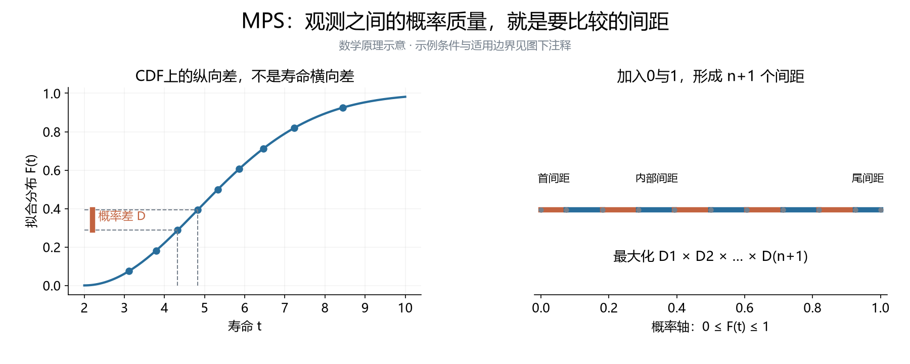
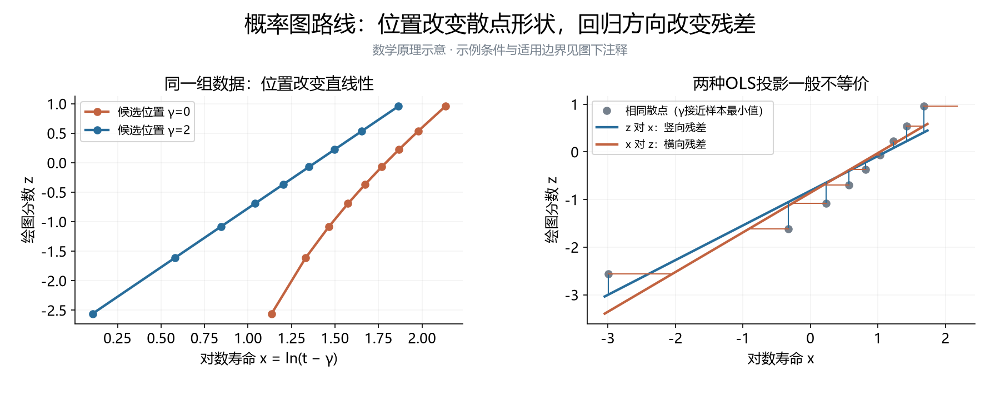

# 附录B：方法实现与版本

> 实现核查：2026-09-26；资料状态及文档整理：2026-09-28；本次接收正文方法原理与公式，不更新历史实现核查结论。本文保存公式、版本、约束、求解与验证证据。对照选择和通用评价规则见[研究报告](研究报告.md)。β、η、γ分别为形状、尺度、位置；Excel旧表头α、β、γ依次对应三者。

> **2026-09-29 版本提示：** 生产 LRE 已改为 Park（2017）Proposed+Plot 的原文分段绘图位置、非负相关系数定位及 OLS；移除固定寿命间隔，并补论文算例验证。下文的“当前”、代码一致性和 Bernard 算例均指2026-09-26核查时版本（可从 Git `80d08ca8` 恢复），作为历史记录保留，不再描述最新生产 LRE。新实现与验证见[方法页](../../src/content/algorithms/lre.md)及[测试](../../python/tests/test_lre_park2017.py)，历史研究结果未重算。

> **2026-10-07版本补充：** 共享MMLE已由CH改为Kundu–Raqab；R00指定批次的LRE换版及十三组合实际版本边界见第12节。第1—11节的“当前”仍按原核查日期理解，不将冻结历史记录改写成新程序状态。

## 通用建议与历史实现的分工

当前建议见[报告v2.5第3—6章](研究报告.md)。原v3.0固定四／五基准及具体网格已撤回，保存于Git存档`e29ead91`中的同名历史稿。方法是否入选由任务、实际比较及条件性能证据决定；数值实现细节须附属于相应文献方法，不能把Local-ML另立为新的文献估计器。

以下保存旧项目程序、公式及案例核查，不作为本次通用选型的预设。W2/W3属于模拟案例；既有位置约束、权重表、运行结果不能直接外推为一般方法定义。报告v2.5正文仅保留与候选池有关的方法区别；概率图与MDM原理、文献版本对照移入本附录第11节，MPS原理图归入第9节。WMLE配套方程沿用第5节，避免重复。

## 1. 实际用了哪些程序和版本

核查对象为[临时任务目录](../../docs/临时任务/临时任务-W2-1000-3000-MDM偏移量估计-20260825)。调用链是案例生成程序 → `studies.common.runner.run_method` → `python/methods` 中四个类。标签映射：LS→`lse`，LRE→`lre`，WMLM→`wmle`，MLM→`mle`。WMLM/MLM 是工作簿旧标签，不另代表两种统计方法。

| 产物 | 数据条件 | 存档代码版本 | 与本次核查代码的关系 |
|---|---|---|---|
| 8月25日原始临时任务 | W(2,1000,3000)，n=7、15，各50组 | `e25c0fde99222c86661e1fda35d3197c70e9e15d` | LS相同；LRE、WMLE、MLE不同 |
| 9月7日 W3 案例 | W(3,1000,γ)，γ=500、1000、3000；n=7、15，各50组 | `931ac7d281f66ebe97b8c5ab274ef6f674d6a3b5` | 四个方法文件与当前一致 |
| 9月21日最新 W2 案例 | W(2,1000,1000)，n=7、15、30，各50组 | `7df56c4ea509fff6f42edd628165c80b1b32de9e` | 四个方法文件与当前一致 |

核查时（2026-09-26）仓库 HEAD 为 `01188d8662ac008f41aa9ae528244fe2f5f7f5ed`。四方法当前生产文件和临时任务“01-Python代码”副本逐字节一致；历史 Git 对照忽略了 CRLF/LF 差异。哈希及逐文件匹配结果见[核查证据](evidence/estimator_audit.json)。这些版本号是产物记录和源码核对结果，不代表原作者发布的软件版本。

9月21日工作簿中三种 δ 面板只改变 MDM 设置，四个传统方法结果在面板中重复展示；它们不构成三批独立重复实验。

### 8月到9月变了什么

| 方法 | 8月25日版本 | 当前版本 | 科学含义 |
|---|---|---|---|
| LS | 几何网格＋局部精化 | 相同 | 本轮未发现方法文件变化 |
| LRE | 从 γ=0 出发的 L-BFGS-B，位置上界约0.999t₍₁₎ | 线性＋几何网格、最优邻域有界精化 | 主要改变搜索覆盖与数值边界，估计分数和回归方向未改变 |
| WMLE | 单一起点，最多500次迭代 | 五起点，最多1200次，并检查方程残差 | 同一方程族的求解与接受规则变化，成功率不可直接混报；R09 主批次曾改用 paper_solver 求根，见下节口径回退 |
| MLE | 单一起点，最多1000次迭代 | 五个位置初值，各最多3000次 | 似然目标不变，搜索充分性和结果选择改变；R09 主批次曾改用 paper_solver 有限驻点根，见下节口径回退 |

### 2026-10-06 口径回退：MLE 与 WMLE 回到注册表经典实现

上表“当前版本”描述的是注册表方法文件（`python/methods/mle.py`、`python/methods/wmle.py`）自身的演化，
`wmle.py` 与 `mle.py` 在 Research00 与 Research09 快照中**逐字节相同**。必须另外披露一条既定事实：

- **2026-10-05—10-06 的 R09 主要批次并不调用这两个方法文件**，而是用 `实验/W(*)/程序/source_snapshot/paper_solver.py`
  的剖面求根计算 MLE 与 WMLE：MLE 取似然方程的有限驻点局部极大根（β 下界 1.01）；WMLE 取作者加权方程的驻点根，
  **允许 γ̂<0**（下界 mean−10·sd）、形状上界 15。因此那批结果的“WMLE 48000/48000 全有解”是**求根口径的方程可用率**，
  不是旧生产程序的首轮成功率。同一批 200 组样本的直接对照：经典实现 191/200、求根实现 200/200；
  9 个经典实现的失败组中有 8 组在经典参数域内本来就有根（与 Research00 2026-09-30 诊断记录的 8 组一致）。
- 按用户 2026-10-06 决定，MLE 与 WMLE **回退为注册表经典实现**（与 Research00 生产程序逐字节相同），
  八批各 6000 组样本不变、三方法全部重算，成功率随之回落：八批 WMLE 有解率 78.5%–100%、
  MLE 29.2%–100%、MMLE 仍为 100%。九格图量程改为按各批数据自适应。

**混报边界**：求根口径回答“方程在参数域内有没有解”，经典实现回答“生产程序的 Nelder–Mead 求解能否达到残差阈值”，
两者的成功数与成功率不可互换或并列比较；引用任一数字时必须同时注明所用实现。

## 2. LS：具体是哪一种最小二乘

源码：[lse.py](../../python/methods/lse.py)。原始依据：Soman & Misra（1992），库内182-104，第2节 White 方法的三参数扩展。

将样本排序，给定候选 γ，令 xᵢ=ln(t₍ᵢ₎−γ)。当前 LS 的另一轴是 zᵢ=E[W₍ᵢ:ₙ₎]，其中 W=ln E、E服从标准指数分布。这是标准对数 Weibull 的次序统计量期望，**不是**将 Bernard 中位秩直接双对数变换。代码按 n 缓存数值积分结果；积分区间为[-60,10]，因此也是有明确数值近似的实现。

依次执行：

1. 固定 γ，拟合 **xᵢ=a+bzᵢ**，最小化对数寿命方向的残差平方和。
2. 计算 F(γ)=[SSTₓ/(n−1)]/[SSEₓ/(n−2)]，搜索使 F 最大的位置参数。
3. 返回 β̂=1/b，η̂=exp(a)，γ̂为选中的位置。

当前搜索为200点几何网格＋局部有界精化；γ≥0，且离样本最小值至少 `max(|t₍₁₎|×10⁻⁹,10⁻¹²)`。n<3 或退化样本返回失败；合法的 γ=0 边界估计可接受。

**采用范围要写清楚：** 原文还讨论形状3—6时的另外两种近似程序；本项目没有随形状切换到那些分支。把当前程序用于较大形状，是当前所选分支的扩展使用，不能说已经实现了整篇论文的全部推荐程序。它也不等于其他论文中最小化原始 CDF 残差的“LS”。

## 3. LRE：相关系数选位置，再做哪个方向的回归

源码：[lre.py](../../python/methods/lre.py)、[base.py](../../python/base.py)。实际步骤为：

1. pᵢ=(i−0.3)/(n+0.4)，zᵢ=ln[−ln(1−pᵢ)]。
2. 对每个候选 γ，计算 xᵢ=ln(t₍ᵢ₎−γ)，最大化 corr(x,z)²。
3. 固定 γ̂，拟合 **zᵢ=a+bxᵢ**，得到 β̂=b，η̂=exp(−a/b)。

当前使用201点线性网格与201点几何网格合并去重，再做局部有界精化。γ≥0，网格接近样本最小值；目标函数还拒绝 γ≥t₍₁₎−10⁻⁵。因此实际有一个依赖数据单位的绝对间隔保护，不能笼统称完全尺度无关。n<3或退化样本失败；当前代码不会为退化样本返回形状1作为有效结果。

### 与 Li、Park 原文究竟是什么关系

- **Li（1994），182-107：** 第2节式(2-4)支持 Weibull 线性化关系；第4节式(4-1a)采用有限差分等构造推导位置近似，第5节讨论联立曲线求解。当前直接优化相关系数的代码不能据此称为其第4节公式的直接实现。测试文件名含 `li1994` 也不能替代算法对应证明。
- **Park（2018），182-106：** 已有全文讨论 Weibull 图相关系数的位置估计，但式(4)的绘图位置是 n≤10 时(i−3/8)/(n+1/4)、n≥11时(i−1/2)/n，和当前 Bernard 公式不同。
- **Park（2017），182-115：** 已核§2、§5和表1。n≤10用(i−3/8)/(n+1/4)，n≥11用(i−1/2)/n；在[0,min(t))最大化相关系数。原文明确列出 **Proposed+Plot**（z对x回归）及 **Proposed+MLE2**（固定位置后做二参数MLE）两种恢复方案。当前LRE与前者回归方向相同，但分数及有限搜索细节不同。表1的24个寿命复算得到γ=9.197683；Plot的β=1.363761、η=15.116027；MLE2的β=1.358983、η=15.076296。MLE2吻合原表三位小数；Plot原表β=1.363与通常四舍五入不符，尚未解释。

因此论文可将现版命名为：**“Bernard绘图位置的相关系数–OLS估计（项目LRE实现，γ≥0）”**，把 Li 作为变换背景、Park 作为相关系数路线来源，并提供自己的实现设置。

## 4. LS 和 LRE 的真正差别

| 要素 | 当前LS | 当前LRE |
|---|---|---|
| 绘图分数 zᵢ | 对数Weibull次序统计量的期望 | Bernard概率经双对数变换 |
| 回归方向 | 对数寿命 x 对分数 z | 分数 z 对对数寿命 x |
| 形状恢复 | 斜率的倒数 | 斜率本身 |
| 位置选择 | 最大化 F 比 | 最大化相关系数平方 |
| 搜索细节 | 几何网格200点＋精化 | 线性201点＋几何201点＋精化 |

**不能只把差别解释成“LS最大化F、LRE最大化相关系数”。** 对同一组分数、同一候选 γ、带截距OLS，SSEₓ=SSTₓ(1−r²)，故

\[
F=\frac{n-2}{n-1}\frac{1}{1-r^2}.
\]

在非退化且非完全共线时，F最大化与r²最大化等价。主要统计差异来自分数和回归方向，搜索差别再引入数值差异。

固定相同 γ 和相同分数，记中心化平方和为 Sₓₓ、Szz、交叉和为 Sₓz：

\[
\widehat\beta_{z\,对\,x}=S_{xz}/S_{xx},\qquad
\widehat\beta_{x\,对\,z}=S_{zz}/S_{xz},\qquad
\frac{\widehat\beta_{x\,对\,z}}{\widehat\beta_{z\,对\,x}}=1/r^2.
\]

所以交换回归方向并再取倒数一般不会还原同一个估计。实际 LS、LRE 还更换分数，不能据此断言所有样本上哪一种形状估计一定更大。

### 一个现成样本显示两项差异各自的影响

使用最新 W(2,1000,1000) 案例 n=7、第2组样本，分别组合两种分数和两个回归方向；每种分数用独立密网格搜索 γ：

| 分数 | 回归方向 | 形状 | 尺度 | 位置 |
|---|---|---:|---:|---:|
| 次序统计量期望 | x对z，对应当前LS路线 | 4.129 | 1714.327 | 256.845 |
| 次序统计量期望 | z对x | 3.819 | 1733.893 | 256.845 |
| Bernard | x对z | 4.581 | 1961.432 | 0 |
| Bernard | z对x，对应当前LRE路线 | 4.262 | 1977.757 | 0 |

这是一项机制诊断，不是性能比较；它不能证明哪一个版本更准。独立密网格与生产程序的小数尾差来自搜索设置，详见[数值证据](evidence/estimator_audit.json)。

## 5. WMLE：修正哪些方程，怎样判成功

源码：[wmle.py](../../python/methods/wmle.py)，权重文件：[j3_weights.tsv](../../python/methods/j3_weights.tsv)。构造来源：Cousineau（2009），182-088；182-101是比较研究，不能替代构造来源。

设 aᵢ=tᵢ−γ。当前程序联立求解：

\[
r_1=J_2(n)/\beta+\overline{\ln a}-\frac{\sum a_i^\beta\ln a_i}{\sum a_i^\beta}=0,
\]
\[
r_2=\overline{a^{-1}}\frac{\sum a_i^\beta}{\sum a_i^{\beta-1}}-J_3(n,\beta)=0,
\qquad
\widehat\eta=\left[\frac{\sum a_i^{\widehat\beta}}{nJ_1(n)}\right]^{1/\widehat\beta}.
\]

这里 J₁、J₂、J₃ 是原构造中相应统计量中位数的权重，不是项目误差评价指标的同名 J。它也不是任意给观测值加权的一般“加权似然”。

当前求解器最小化 r₁²+r₂²，用五个(形状,位置)初值：(2,0.9t₍₁₎)、(2,0.5t₍₁₎)、(2,0.1t₍₁₎)、(1.2,0.9t₍₁₎)、(4,0.9t₍₁₎)，每个使用Nelder–Mead，最多1200次。接受检查包括优化成功、有限结果、残差平方和≤10⁻⁸；同等残差附近再按仅依赖样本的初值距离规则选解，不使用真参数。

必须披露的实现边界：

- γ≥0，γ<t₍₁₎−10⁻⁶；形状搜索上限10，形状≥9.99按触及上界处理。均为当前实现约束。
- J₃表的形状范围为0.1—5，超出时使用端点值。因此形状5—10的搜索并不意味着已有相应的原始权重信息。宽形状域比较须先处理这项限制。
- 当前权重表按n与形状插值；J₁在n>100使用Gamma分布中位数公式，J₂在n>100取1。权重规则属于版本的一部分。
- 临时任务的代码副本未包含 `j3_weights.tsv`，而 WMLE 导入时必须加载它。这个副本是代码阅读材料，不能宣称已经是完整的独立可运行复现包。正式程序从仓库方法目录读取该表，因而本次可复算。

### 最新案例中三次失败已经找到同方程解

最新W2存档的WMLE失败均发生在n=7：

| 重复编号 | 原状态 | 恢复后形状 | 恢复后尺度 | 恢复后位置 | 独立代入残差平方和 |
|---|---|---:|---:|---:|---:|
| 29 | equation_residual | 0.685400 | 383.523106 | 1430.528794 | 3.14×10⁻²⁷ |
| 40 | equation_residual | 0.687321 | 486.180036 | 1121.579710 | 5.05×10⁻²⁹ |
| 45 | equation_residual | 0.689040 | 418.954418 | 1497.190739 | 1.58×10⁻³⁰ |

使用的是已有[Study01求根器](<../../Study/Study 01 New/数据/E09_六方法共同测试/wmle_solver.py>)：固定位置先求形状根，再在位置方向括根；必要时使用最小二乘补救。本轮输入原始单位样本，未采用 Study01 某些运行流程中的除以1000归一化。三组结果均满足生产参数域；尺度恢复也单独核对，差异小于2×10⁻¹³。见[完整记录](evidence/wmle_case_recovery.json)。

**结论仅限这三组：原求解器漏找根。** 有效估计仍可能误差较大，必须保留其实际误差；不能因为形状远离真值2就删掉。本轮没有修改原Excel或生产算法，也没有重新评定所有方法的总体名次。若正式实验采用补救求解器，应标注该计算版本、记录总耗时，并重新生成对应结果。

## 6. MLE：当前并不是无限制全局MLE的完整求解

源码：[mle.py](../../python/methods/mle.py)。程序最大化三参数Weibull对数似然：

\[
\ell=n\ln\beta-n\ln\eta+(\beta-1)\sum\ln[(t_i-\gamma)/\eta]
-\sum[(t_i-\gamma)/\eta]^\beta.
\]

位置初值为0、0.25t₍₁₎、0.5t₍₁₎、0.75t₍₁₎、0.9t₍₁₎，各自用线性化回归初始化形状/尺度，再用Nelder–Mead；每次最多3000次，`xatol=10⁻⁷`、`fatol=10⁻¹⁰`。目标函数对β≤0.01、η≤0.01、γ<0或γ≥t₍₁₎返回惩罚值。

**结果接受时又要求形状≥1、优化器成功，再从这些候选中选似然最大者。** 当前没有逐个做Hessian负定检查，也没有全局性证明。因此宜称“项目多起点数值MLE实现（有限候选筛选）”，不能把优化器成功直接写成已证明找到有限局部极大或全局极大。它也不能仅因测试文件提到 Hirose（1996），就宣称完整复现了该文的重参数化求解程序。

三参数模型在允许β<1且γ接近样本最小值时，似然可沿边界发散。这是全局问题；**不等于该样本不存在任何有意义的有限局部候选**。当前 `unbounded` 状态的具体触发是“没找到接受候选、但搜索碰到β<1候选”，属于程序路径记录，不能把每条记录升级成理论无解证明。

因此，现表的MLE失败比例应先解释为**这一搜索和筛选版本的不可用比例**。要用它论证一种新方法在小样本下更可靠，需要补充更充分的局部/剖面求解审计。直接加入β≥1硬约束会定义另一个受限估计器，不能无说明地替换。

## 7. 为什么用这几个版本，其他版本差在哪里

能够确认的是：它们已经进入统一调用接口和临时任务生成链；LS、WMLE有明确构造来源，LRE易于实现和追溯，MLE提供通行的似然参照。没有找到证明这些具体版本经全面筛选后优于其他版本的记录。**“项目一直用”解释历史来源，不能独立承担论文中的优选理由。**

| 可替代版本 | 改变什么 | 是否等价 | 本Research对下一次正式比较的建议 |
|---|---|---|---|
| Bernard / 精确Beta中位秩 / Park2018绘图位置 | 回归分数zᵢ | 不等价，尤其小样本下 | 当前先明确采用版本及来源；若以后声称某分数更优，再作预先设计的比较，不得用测试集挑有利版本 |
| 回归x对z / z对x | 残差方向及参数恢复 | 不等价，见第4节 | 以公式命名，别只写RRX/RRY缩写 |
| 相关法γ＋OLS / 相关法γ＋2P MLE | γ之后估计形状、尺度的准则 | 不等价 | 作为明确的两阶段候选，不能自动称同一LRE |
| γ≥0 / 允许负γ | 可行域及边界解 | 不等价 | 按问题依据预先选定；保留原方法域与受限版本的区别 |
| White/Soman分支 / 原始CDF-LS / 加权回归 | 分数、目标、权重或近似步骤 | 通常不同方法 | 当前LS可作历史补充；正式比较避免把多个同族变体算作近期进展 |
| WMLE单起点 / 多起点 / 方程括根补救 | 对同一方程的寻找能力 | 找到同一根时统计定义相同；多根选取仍需冻结 | 采用经过审计的补救求解，不能保留已知漏根来削弱对手 |
| MLE直接优化 / 剖面求解 / 显式受限MLE | 数值路径，或连统计定义一起改变 | 需逐项区分 | 优先查清有限候选和发散边界，再将比较写进论文 |

另外，代码注册表中的 `rrx`、`rry`、`blre` 当前都映射到同一 `lre`，`wlse`、`eiv`映射到同一 `lse`。这些别名并未实现相应的独立统计版本。基础类虽支持 `rank_method='exact'`，统一runner当前将额外参数传给 `run()`而非构造函数；不能以为传一个同名参数就已切换绘图位置。精确中位秩与本LS的次序统计量期望也不是同一概念。

## 8. 存档失败状态与返回指标

最新W2存档每种n各50组的状态如下；只计一个δ面板，避免重复计数：

| n | LS有效 | LRE有效 | WMLE有效 | MLE有效 |
|---:|---:|---:|---:|---:|
| 7 | 50/50 | 50/50 | 47/50 | 20/50 |
| 15 | 50/50 | 50/50 | 50/50 | 38/50 |
| 30 | 50/50 | 50/50 | 50/50 | 49/50 |

WMLE三条原失败为 `equation_residual`，本轮均恢复；MLE的30、12、1条原失败记录均为 `unbounded`，其语义限于第6节。LS的γ=0次数为6、2、0；LRE为9、3、0。这些合法位置边界估计不能当失败。

原样本与失败记录均保留。具体统计口径见[主报告第4章与第6章](研究报告.md)；同方程求根补救的证据见第5节。

### 返回R²的实际定义

当前 `base._calculate_r2` 算的是**变换后的Weibull概率图**：以 zᵢ为响应，以 βln(tᵢ−γ)−βlnη为预测。部分方法文件中的公式注释写成原始CDF残差R²，与实际执行不一致。

该R²很接近LRE本身优化的目标，不能作为独立证明LRE参数估计优于其他方法的标准。参数误差与寿命目标的评价定义见主报告。

## 9. 新补方法的实现边界

### DMMLE：采用哪个版本，怎样判断成功

采用[作者公开代码的固定提交](https://github.com/FSQuintino/dmmle_Weibull/tree/e733f90ee86351915037130deefa9d39e7e7506c)中DM2的观测信息矩阵版本作为复现对象。它估计的是原文(μ,α,σ)，与项目(γ,β,η)的映射为γ=μ、β=α、η=σ^(1/α)。**直接把作者返回的scale_est当作η会造成错误比较。**

令μ̂=min(x)，仅删除一个最小观测，余下yᵢ=xᵢ−μ̂，m=n−1。修改对数似然为

\[
\ell_M=m\log\alpha-m\log\sigma+(\alpha-1)\sum\log y_i-\sigma^{-1}\sum y_i^\alpha.
\]

代码用I=−∂²ℓM/∂φ∂φᵀ，φ=(α,σ)，构造U*ⱼ=∂ℓM/∂φⱼ+½tr(I⁻¹∂I/∂φⱼ)，并迭代φ←φ+I⁻¹U*。默认初值(1,1)，相对更新量绝对值之和低于10⁻⁸或达到20次即停止。代码达到次数上限也可能返回数值，因此正式比较还必须记录残差及停止原因；“返回了参数”不能直接算收敛。

| 作者示例 | n | 独立转写α | 独立转写σ | 换算η | γ |
|---|---:|---:|---:|---:|---:|
| invest | 132 | 0.5653818623 | 1.4984826352 | 2.0449279687 | 5.012 |
| gauge | 69 | 2.3422596662 | 1.7144741223 | 1.2588078053 | 1.312 |

两个示例均10次停止，调整得分最大绝对残差分别小于5×10⁻¹⁰和3×10⁻¹⁰，与作者Notebook存储点估计吻合。信息矩阵对参数的解析导数经中心差分检查，最大绝对差小于6×10⁻⁷。此处只验证独立转写与两个点估计示例，未验证置信区间、偏差阶数或极小样本性能。

该方法定义允许γ̂=min(x)。不得沿用其他方法的严格γ<min(x)检查而把所有结果判失败，也不得擅自减去ε后仍称原版DMMLE。重复最小值时，删除一个观测后仍有y=0，当前公式不可直接计算；核验样本[1,1,2,3]已明确记为该输入情形，而非伪装成收敛。正式比较需分别声明模型支持、估计准则允许的边界和数值接受条件。

### MPS、变换估计与删失方法

MPS令Dᵢ=F(x₍ᵢ₎)−F(x₍ᵢ₋₁₎)，补F(x₍₀₎)=0、F(x₍ₙ₊₁₎)=1，最大化Σlog(Dᵢ)/(n+1)。不能漏掉端点间距。对于严格递增观测，令zᵢ=((xᵢ−γ)/η)^β，可用log(−expm1(−z₁))、−zᵢ₋₁+log(−expm1(−(zᵢ−zᵢ₋₁)))及−zₙ稳定计算各项。重复观测使普通间距为0；舍入或分组数据须另定有来源的扩展，不能默默加随机扰动。平台MPS仍未实现；独立研究实现与核验见文末复核资料及整合前技术附录第12节，本段保留原始准则和要求。



**图B1 概率间距路线基本原理（原正文图4）。** 参数改变时，CDF及全部概率间距一起改变；乘积惩罚极小间距。此图解释准则，不给出性能排序。

Nagatsuka方法先以标准化次序统计量W的似然估β；随后令η̃=[mean((x−xmin)^β̂)]^(1/β̂)，γ̂=xmin−n^(−1/β̂)η̃Γ(1+1/β̂)，η̂=[mean((x−γ̂)^β̂)]^(1/β̂)。其形状步骤涉及积分似然，尚未数值复现。位置可为负；若裁为0，便是另一个约束版本。Nassar 2024属于二参数删失模型，适用性判断见附录A，不列作完整三参数算法。

### 新增核验的复查入口

[核验脚本](scripts/audit_new_original_methods.py)与[结果、数据及作者代码哈希](evidence/new_original_methods_audit.json)共同保留复查依据。脚本读取指定Notebook为数据，不执行其中R代码；下载固定提交的`weibull_fit.ipynb`后运行：

```powershell
& python/.venv/Scripts/python.exe 'Research/09-Weibull参数估计方法谱系与比较基线/scripts/audit_new_original_methods.py' '<本地weibull_fit.ipynb路径>'
```

## 10. SAM与BPNN的原文级版本核查

### SAM（2023）：公式、示例和边界重试

来源为185-005，PDF第4—5页式(23)—(30)、图1及第11—12页表12—15。已有OCR把幂、下标和Gamma函数识别错误，本节以PDF版面为准，不修改文献库原文件。核查对象是**形状也由样本估计**的分支；原文另有用先验固定形状的分支，两者使用信息不同，不能混入同一无先验比较。

以Bernard绘图位置构造zᵢ=ln[−ln(1−(i−0.3)/(n+0.4))]，令γ₀=0，回归z对ln(t)得到β₀，η₀=exp(mean(ln(t))−mean(z)/β₀)。随后按以下顺序更新：

\[
\gamma_j=t_{(1)}-\eta_{j-1}n^{-1/\beta_{j-1}}\Gamma(1+1/\beta_{j-1}),
\quad \eta_j=\left[\frac1n\sum_i(t_i-\gamma_j)^{\beta_{j-1}}\right]^{1/\beta_{j-1}}.
\]

再将z对ln(t−γⱼ)作带截距OLS，得到新βⱼ。尺度更新使用**上一轮形状**，不能悄悄改成新形状或每轮二参数MLE。初始位置更新非正时，原文式(36)以lr=0.99缩小η₀。论文数值精度ε=10⁻⁵；图1和正文停止式写γⱼ−γⱼ₋₁≤ε，并依赖位置递增的论述。研究核验另记录绝对增量停止和位置不动点残差，不把这一数值检查冒充原文规则。

| 原文示例 | β复算 | η复算 | γ复算 | 迭代次数 | 原表三位小数 |
|---|---:|---:|---:|---:|---|
| 表12十个轴承寿命 | 1.251312 | 87.708970 | 139.730961 | 44 | 三个参数均吻合表13 |
| 表14四个寿命 | 2.202227 | 4.159369 | 1.137120 | 113 | 三个参数均吻合表15 |

第二例初始尺度缩小3次；两例迭代均递增，因而带符号与绝对增量停止给出相同结果。它们验证公式转写，不能证明算法对任意样本必然成功。

另作固定种子20260927的数值诊断：β∈{0.5,1.5,3}、n∈{5,10,20}、η=2、γ=1，每格100组，共900组；只检查运行与停止，不比较精度优劣。在**只调整初始尺度、后续越域即记录失败**的解释下，绝对增量版846组通过局部残差检查，54组位置更新越出(0,min(t))。带符号停止版846组通过、48组越域、6组虽停止却未通过残差检查。后者说明负增量可能提前触发原文停止式。β=0.5属原文仿真形状域外，但异常并不只出现在该条件。

这里的54组不是“理论无解”的证据：图1在非正位置时回到“调整初始尺度”框，但尚未明确后期越域时是否重置整条迭代、怎样保留形状，以及重试预算。原版与补救版须分别命名。当前状态为**两个原文示例复现，作者边界重试仍待澄清；整合前技术附录第13节记录可审计的初值调整分支**。完整异常样本和停止结果保存在[核验记录](evidence/sam_audit.json)，复查用[独立脚本](scripts/audit_sam.py)。

### BPNN（2025）：可确定的网络与仍缺失的配置

184-009本地PDF是36页的网页打印版。第15—16页、§3.1—3.2及图6已视觉核对：7输入、25和15两个隐藏层、3输出；文字分别给两个隐藏层配置Tansig、Purelin。β、η、γ训练范围分别为[1,4]、[0,10]、[0,10]，n在5—20随机取整数；生成10000组，文中指定7000训练、2000测试。

原版存在以下复现缺口，不能靠自行猜测后声称已复现：

| 项目 | 已知与待核清之处 | 对复现的影响 |
|---|---|---|
| 输入定义 | §3.1及图6支持最小、最大、中位数、均值、众数、变异系数、n，共7项；§3.2改列均值、中位数、众数、最小、最大、一阶矩、二阶矩，再加n | 若照后段是8项且均值与一阶原点矩重合，不能确认作者实际程序输入 |
| 众数 | 未找到连续小样本众数的具体计算定义 | 频数法、核密度及分组法不同；不得擅自选一种当作者版本 |
| 网络与训练 | 25/15节点已给出；未取得权重、随机种子、输入输出预处理、具体训练器及完整停止配置 | 无法直接复现表中点估计；“同结构重新训练”应明确另起实现版本 |
| 数据划分 | 10000组中明确7000训练、2000测试，余1000用途未说明；文本称反复试验使test MSE最低 | 不擅自补成70/15/15；本项目须独立验证集选型，最终测试仅作评价 |
| 尺度与外推 | 实例把寿命单位改为10⁵次；训练域有界，未给普适自动缩放规则 | 必须冻结单位与域外评价，不可利用测试真参数选缩放 |

原文声明数据可按请求提供。本轮按两篇DOI检索未取得可执行作者代码或BPNN权重；这只描述本次检索结果，不证明代码不存在。需要补的优先材料已从“再下载论文”转为：**作者训练/预测脚本或已训练网络、特征与归一化定义、完整训练划分及优化配置**。在取得前，BPNN保持有科学纳入理由的候选，不能用现有另一网络代替它后宣称战胜原文方法。出版入口：[BPNN](https://www.sciencedirect.com/science/article/pii/S0266892025001006)、[SAM](https://doi.org/10.1007/s12206-023-1019-z)。

## 11. 正文移入的方法原理与文献版本

本节用于理解方法和核对版本；不以项目既有实现代替文献原版。正文第2章仅保留候选池所需的区别，完整选型建议见报告第6章。

### 11.1 分布、似然与WMLE方程入口

完整独立同分布样本记为$t_1,\ldots,t_n$，参数$\theta=(\beta,\eta,\gamma)$依次表示形状、尺度、位置：

$$
F(t;\theta)=1-\exp[-((t-\gamma)/\eta)^\beta],\quad t>\gamma,\quad\beta,\eta>0;
\qquad \ell(\theta)=\sum_i\log f(t_i;\theta).
$$

其中$f$为对应密度，$t\le\gamma$时$F=0$。只有在声明的参数域内存在有限最大值，才可直接写$\hat\theta=\arg\max\ell(\theta)$；局部或受限求解须另作说明，见第6节。

WMLE的完整形状、位置方程及尺度恢复式见第5节。相对于普通MLE形状方程的$1/\beta$，Cousineau构造引入$J_2(n)/\beta$，并配套位置和尺度修正。J类权重改变估计方程，不是任意逐观测加权，也不是仅改变数值求解器。

### 11.2 概率图原理与Soman–Misra、Park版本对照

记$t_{(i)}$为排序观测，$p_i$为绘图概率：

$$
x_i(\gamma)=\log(t_{(i)}-\gamma),\qquad z_i=\log[-\log(1-p_i)],
\qquad z_i\approx\beta x_i-\beta\log\eta.
$$

位置决定点的展开方式，回归由斜率、截距恢复其余参数。使用精确期望次序分数时，$z_i$直接按该期望定义，不能等同于任意绘图概率的双对数变换。



**图B2 概率图路线基本原理（原正文图3）。** 散点由理想分位数构造，γ=2时恰好线性；随机样本通常不会落在一条直线上。右图固定同一绘图分数以隔离回归方向的影响，不同文献版本还可能更换分数。

| 比较项 | Soman–Misra（1992）的White扩展分支[182-104] | Park（2017）Proposed+Plot[182-115] |
|---|---|---|
| 绘图分数 | 标准对数Weibull次序统计量的期望 | n≤10用$p_i=(i-3/8)/(n+1/4)$；其余用$(i-1/2)/n$，再作双对数变换 |
| 回归方向 | $x=a+bz$，最小化对数寿命方向残差 | $z=a+bx$，最小化分数方向残差 |
| 参数恢复 | $\hat\beta=1/b,\hat\eta=e^a$ | $\hat\beta=b,\hat\eta=e^{-a/b}$ |
| 位置选择 | 最大化F比 | 按原文相关系数构造定位，保留其非负位置适用域 |

在相同分数、同一候选位置和带截距OLS条件下，F比与$r^2$单调对应；差异不能简单归结为“最小二乘与相关系数”。交换回归方向一般仍不等价，推导见第4节。Park另有Proposed+MLE2恢复分支，不应省略分支名称；项目Bernard分数LRE与Park原版的关系见第3节。

#### Li（1994）第5节：两条回归关系的联立求解

给定位置γ，由第一条线性回归求$\hat\beta=g_1(\gamma)$；给定形状β，由另一条回归求$\hat\gamma=g_2(\beta)$。求解目标为$\beta=g_1(g_2(\beta))$。原文式(5-3)先确定β的上下界，算法以区间中点计算$\beta'=g_1(g_2(\beta))$，按β′与β的关系更新上下界，直至区间宽度满足阈值。该流程与任意初值的直接固定点代入有区别，也与第4节有限差分近似公式有区别。原文见[182-107第5节](../../src/content/182-107-pdf原文.md)。

三方法比较以Soman的White扩展、Li第5节联立解、Park Proposed+Plot为明确对象，PPT中的LRE01／LRE02仅沿用资料文件的区分名。

### 11.3 MDM尺度伪估计构造

Xie等（2022在线／2023卷期）[182-030]由每个排序观测和绘图概率反推尺度伪估计：

$$
\eta_i(\beta,\gamma)=\frac{t_{(i)}-\gamma}{[-\log(1-p_i)]^{1/\beta}}.
$$

调整形状与位置，使这些伪估计的差异减小。它与概率图都利用样本及概率的关系，但分别比较尺度伪估计的一致性、拟合变换后的直线。带偏移修正的方程与原始差异最小化须按具体版本区分，不能只用“MDM”标签替代概率与偏移设置。

## 12. 2026-10-06/07 口径变更与R00接入

### 12.1 MMLE：共享注册名由CH改为Kundu–Raqab构造

工单025将共享[mmle.py](../../python/methods/mmle.py)改为Kundu–Raqab（2009）构造的单组样本形式，注册名仍为`mmle`。原Cohen–Whitten（1982）工程实现原字节保留在[mmle_ch.py](../../python/methods/mmle_ch.py)，以`mmle_ch`注册；[registry.py](../../python/methods/registry.py)分别分派两个类。

新构造取位置估计为原样本最小值γ̂=x₍₁₎，只删除一个最小观测，在剩余距离x₍ᵢ₎−x₍₁₎（i=2,…,n）上估计形状与尺度。形状由初值1作固定点迭代，绝对步长容差10⁻⁸、上限10000次；未收敛记`fixed_point_not_converged`并返回失败。没有Firth修正、额外参数上界、重试或备用求解器，R²保留参考实现的0占位。它承接原文印刷页1840式(4)、1841式(6)、(9)–(11)的构造，不表示复现了原文双样本应力–强度实验。

| 文件 | 当前注册或用途 | 工作区SHA256 |
|---|---|---|
| `python/methods/mmle.py` | `mmle`，Kundu–Raqab单样本构造 | `afe5318c04373254ad6acffc47e9cf7ff7ba80efa667865102ce8fc49edb85f9` |
| `python/methods/mmle_ch.py` | `mmle_ch`，原CH工程实现 | `e0e3f919fb8aba6d235f7b55a494ca9e4f6f88fcb8b5c1a1d3142f0f34e1de3a` |
| `python/methods/registry.py` | 两个注册名分别分派 | `49dd3d536670ae6759afabe4e842e0054f0bd146deffcf51563ace95a1c0643f` |

旧`mmle.py`与现`mmle_ch.py`工作区字节SHA完全相同。对拍复用存档样本，参考类取自R09 [compute.py](实验/W(2,1000,500)/程序/compute.py)中的实际`KROriginal`，不重抽样：

| 核对对象 | 样本组数 | 不一致数 | 最大参数绝对差 |
|---|---:|---:|---:|
| R00两批原样本：新MMLE与实际参考类 | 200 | 0 | 0 |
| R09原批样本：新MMLE与实际参考类 | 6000 | 0 | 0 |
| 同6000组与存档估计CSV | 6000 | 0 | 2.2737367544323206×10⁻¹³ |

成功／失败集合及原有诊断一致；CSV存在末位浮点差异，不能将该项最大差写成严格0。原始对拍与输入哈希见[025正式证据](<D:/Hermes Email/执行完毕/research00-mmle-method-program-025/pilot-r00-result.json>)、[6000组证据](<D:/Hermes Email/执行完毕/research00-mmle-method-program-025/pilot-result.json>)及[025结果](<D:/Hermes Email/执行完毕/research00-mmle-method-program-025/result.md>)。

影响范围为共享类直接导入、`mmle`注册分派及后续使用该注册名的调用；冻结历史快照和旧结果不会自动换版。026在R00原八组合补入1200条MMLE，032在五组合原样本上补入750条。两个调用点均按删除后的保留观测检查γ̂<x₍₂₎；不能沿用其它方法的γ̂<x₍₁₎规则将这种构造全部判失败。共享`check_status`默认语义、Study程序和既有历史结果未在本次文档同步中改动。

### 12.2 LRE：026换版只作用于指定批次

026将R00 [W(5,1000,500)/20260929-新抽样](../00-方法对比/W(5,1000,500)/20260929-新抽样/README.md)的150条LRE从Park（2017）Proposed+Plot改回历史Bernard相关系数–OLS实现。三档n=7、15、30各50组样本不变，换版前后各150条收敛，150组参数均变化；此记录不判断哪版更优。

| 本批文件 | 版本 | SHA256 |
|---|---|---|
| `程序/完整矩阵/历史LRE/lre_park2017.py` | 换版前Park原件 | `6daa00d43311ed19bf2d74131220fb51b40e4fd91569f48b981b1beaa8c9c7ae` |
| `程序/依赖快照/python/methods/lre.py` | 当前Bernard | `730e86750f5ac1b31dd1cee9f3a73a8932e501661dfbf1e82c056de44f9a663f` |

逐组前后参数见[差值记录](../00-方法对比/W(5,1000,500)/20260929-新抽样/程序/完整矩阵/数据/lre_change.json)，实施范围与哈希见[本批manifest](../00-方法对比/W(5,1000,500)/20260929-新抽样/程序/完整矩阵/manifest.json)及[026结果](<D:/Hermes Email/执行完毕/research00-fill-full-matrix-026/result.md>)。β、η、γ的绝对差中位数分别为0.224984、19.767471、15.875777，最大绝对差分别为2.348267、295.924348、292.225037。

原Park结果JSON和旧独立n30工作簿仍作历史证据保留；当前主表为`W5,1000,500.xlsx`，不能用旧Park表解释当前Bernard结果。

**十三组合的版本边界：** 原八组合当前完整矩阵的LRE均为Bernard；032五组合W1.5,100,500、W1.5,1000,500、W2,100,500、W3,100,500、W5,100,500复用20261004存档的Park LRE，未重算该方法。共享`python/methods/lre.py`也仍为Park，SHA为上述`6daa…`完整值。因而026的换版不代表共享LRE回退，也不代表十三组合采用同一LRE版本。各批冻结程序、取数记录与[032结果](<D:/Hermes Email/执行完毕/research00-add-stash-5combos-032/result-attempt-1.md>)共同限定适用范围。

### 12.3 当前交付与有解率

R00十三组合均为n=7、15、30各50组，八方法为MDM δ=0.10/0.15/0.20、LSE、LRE、MLE、WMLE、MMLE。每组合主表含六个配对工作表，正式图像为小提琴、有解率及九张MDM图，共11张PNG。当前发送目录为`../00-方法对比/交付/13 组参数结果`，程序在`交付/程序`；历史统计CSV不放入发送结果。

有解率按主Excel展示规则统计：三参数均显示有限数值即计为有解，每个组合／n／方法的分母为50，不因图中省略极端值而改变。原八组合六条、后五组合八条MDM记录虽显示参数，但标准支撑边界检查记失败；这些差异保留注记，不补解、不改值、不替换统计规则。MMLE的γ̂=x₍₁₎是其构造的一部分，按保留观测检查，不与上述MDM边界差异混为一类。

五组合共用种子20261004，同一n与组号跨β、η共用潜在指数变量，与原八组合不共用样本。跨图312格均按各组合单独取数，不合并不同抽样协议，也不将跨批差异解释成只改变真参数的配对因果比较。十三组合交付和批次索引见[R00 README](../00-方法对比/README.md)；本节仅同步版本与产物说明，没有修改R00/R09的数值、程序、表图或压缩包。


### 12.4 LRE 版本决定：后五组未换版（2026-10-08）

原八组LRE使用历史Bernard绘图位置的相关系数–OLS版；后五组W(1.5,100,500)、W(1.5,1000,500)、W(2,100,500)、W(3,100,500)、W(5,100,500)使用Park（2017）Proposed+Plot版，复用20261004存档。十三组的LRE版本不统一。

2026-10-08用户决定：后五组暂不换版，保留Park（未换版）。日后若另行授权统一，须重算这五组的750 条LRE（5组合×n=7/15/30×每档50组），并刷新对应主表、图像及交付副本。

决定与当前交付入口见[R00交付README：口径边界（必读）](../00-方法对比/交付/README.md)，当前结果在[13 组参数结果](<../00-方法对比/交付/13 组参数结果/>)。检索关键词：`LRE 版本`、`Park`、`Bernard`、`未换版`、`750 条`。

## 原始来源与引用建议

- LS：Soman, K. P., & Misra, K. B. (1992). *A Least Square Estimation of Three Parameters of a Weibull Distribution*. Microelectronics Reliability, 32(3), 303–305. [DOI](https://doi.org/10.1016/0026-2714(92)90057-R)，本地[182-104正文](../../src/content/182-104-pdf原文.md)。引用具体分支，不笼统声称实现整篇论文。
- LRE变换背景：Li, Y.-M. (1994). *A General Linear-Regression Analysis Applied to the 3-Parameter Weibull Distribution*. IEEE Transactions on Reliability, 43(2), 255–263. [DOI](https://doi.org/10.1109/24.295002)，本地[182-107正文](../../src/content/182-107-pdf原文.md)。
- 相关系数路线：Park, C. (2018). *A Note on the Existence of the Location Parameter Estimate of the Three-Parameter Weibull Model Using the Weibull Plot*. Mathematical Problems in Engineering, 2018, 6056975. [DOI](https://doi.org/10.1155/2018/6056975)，本地[182-106正文](../../src/content/182-106-pdf原文.md)。2017构造来源的两种组合及数值例已核查，见第3节。
- WMLE：Cousineau, D. (2009). *Nearly unbiased estimators for the three-parameter Weibull distribution with greater efficiency than the iterative likelihood method*. British Journal of Mathematical and Statistical Psychology, 62(1), 167–191. [DOI](https://doi.org/10.1348/000711007X270843)，库内182-088。
- MLE理论与比较依据：Hirose, H. (1996). *Maximum likelihood estimation in the 3-parameter Weibull distribution. A look through the generalized extreme-value distribution*. IEEE Transactions on Dielectrics and Electrical Insulation, 3(1), 43–55，库内182-105；当前多起点实现需作为项目计算选择另行说明。


## 复核资料

第1—11节中的程序和数值状态为原核查快照，不自动代表之后源码；第12节另记录2026-10-06/07的换版及R00接入证据。版本、工作簿和失败复核证据分别见[estimator_audit](evidence/estimator_audit.json)、[workbook_audit](evidence/workbook_audit.json)、[wmle_case_recovery](evidence/wmle_case_recovery.json)。MPS/L矩及共同样本接入结果保存在[mps_lm_audit](evidence/mps_lm_audit.json)和[common_sample_audit](evidence/common_sample_audit.json)。详细执行过程见Git存档`e29ead91`中的整合前技术附录，不作为新方法性能排名。
