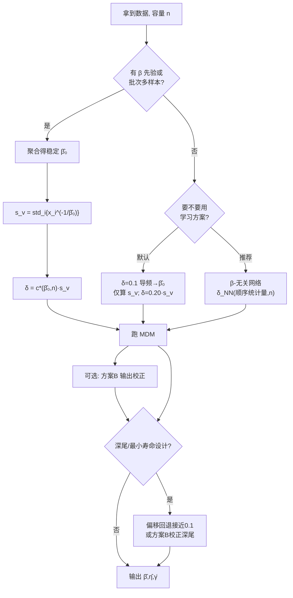

# 三参数 Weibull 分布 MDM 方法最优偏移量 $\delta$

## 诊断、综合与面向学习的扩展（最终整合版）

> **一句话结论。** 偏移量 $\delta$ 不是"可调可不调"的微调旋钮，而是 MDM 能否稳定求解三参数 Weibull 的关键正则化量。它**不是全局常数**：在归一化坐标 $c=\delta/s_v(\beta,n)$ 下相对稳定（约 $0.12\!\sim\!0.40$，全局最优 $c^\*\approx0.20$），其原始值随形状 $\beta$ 跨数个量级、与尺度 $\eta$ 无关、与位置比 $\gamma_0/\eta$ 无关。但两份原稿都止步于"验证最优 $\delta$ 存在"，**真正未解决的核心难题是：设 $\delta$ 需要 $\beta$，而估 $\beta$ 又依赖 $\delta$——这个循环依赖至今没有 $\beta$-无关的落地解。** 本报告把它讲清，并论证用**神经网络从数据直接输出 $\delta$（或直接校正偏差）** 正是为打破该循环而生的方案。

> **数据来源说明。** 本版整合两份原始报告：GPT 版（150 个参数格 $\times$ 每格 300 次重复 $\approx 4.5\times10^5$ 次估计，原始量纲 $\delta$）与 Claude 版（96 个参数格 $\times$ 每格 1600 次、标定/检验分半 $\approx 1.5\times10^5$ 次估计，归一化 $c$）。文中"原 GPT 表/图""原 Claude 表/图"均指对应原稿。神经网络部分、$\beta$-循环的诊断与解法、贝叶斯/集成方案为本版**新增**。

---

## 本版相对两份原稿的改动总览

| 原稿问题 | 出处 | 本版处理 |
|---|---|---|
| 称"最优 $\delta$ 随 $n$ 增大而减小" | GPT §6.3 / 原表 3 | **判为不稳健**：与闭式 $s_v(\beta,n)$ 随 $n$ 上升、Claude $c^\*$ 随 $n$ 上升均矛盾；解释为小 $n$ 的"稳定性溢价"伪迹（§2.3） |
| $\gamma/\eta$ 当作"弱因子"（仍非零） | GPT §6.3 | **判为误判**：$s_v$ 只依赖 $(\beta,n)$，理论与 Claude 实测比值 $1.000$ 一致，$\gamma_0/\eta$ **严格无关**（§4.3） |
| 分层增益 $+12\%/+13\%$ 无外样本验证 | GPT §8 / 原表 5 | 改以 Claude 留出半数据为准（降到基线 $72\%\!\sim\!75\%$），GPT 百分比标注为样本内上限（§5.1） |
| 自适应"完全可落地、$+2\%$" | GPT §8.2 | **修正**：朴素单样本插件会发散、复合误差反升到 $1.30$；仅批次级 $\hat\beta$ 可行（§5.2、§6.1） |
| 缺安全护栏 / 风险方向 | GPT 全文 | 补 Claude 的 $\hat\gamma\,{+}8\%$、深尾寿命 $x_R(0.999)\,{+}10\%$ 高估，并**新增工程含义与决策规则**（§5.3） |
| 安全护栏只给数字、工程含义未讲透 | Claude §8.2 | 新增：非对称损失下的 $\delta$ 回退量、$B_{10}$/最小寿命设计的取舍（§5.3） |
| $c\approx0.20$ 的落地前提没说清 | Claude §9 | **点破隐藏循环**：算 $s_v$ 仍需 $\beta$；给出"导频 $\hat\beta$ 仅用于 $s_v$"的折中与流程图（§4.1、§6.2） |
| $\eta$ 不变性只有理论、未实测 | Claude §7.3 | 吸收 GPT 的 $\eta=50/100/200$ 实测（曲线重合）作为经验旁证（§4.2） |
| 两版均无"如何设 $\delta$"的闭环决策 + 学习方法 | 两版 | **新增** §4（决策流程图）、§6（神经网络三方案 + 伪代码）、§7（其他改进）、§9（研究路线图） |

---

# 第一部分　诊断：两份报告各自缺什么

## 1　共识与定位

两版在**核心结论上一致、且数值上互相印证**——这是最重要的背景，因为它说明结论可信，分歧只在表达与落地：

- 最优 $\delta$ 存在，但不是跨场景唯一；
- $\beta$ 是主导因素（$\delta^\*$ 随 $\beta$ 单调递减），$n$ 次之；
- 最优 $\delta$ 与尺度 $\eta$ 无关；
- 常用默认 $\delta=0.1$ 只在 $\beta\approx3$ 附近接近最优；
- 偏移量"首先是稳定器，其次才是精度调节器"。

**数值印证（关键）。** 把 GPT 的原始 $\delta^\*$ 与 Claude 的 $c^\*\!\cdot\!s_v$ 对照，二者几乎逐点一致：

| $\beta$ | GPT 原始 $\delta^\*$（原表 2） | Claude $c^\*(n{=}10)$ | $s_v(\beta,10)$（原 Claude §2.1） | $c^\*\!\cdot\!s_v$ |
|---|---|---|---|---|
| 1.0 | $\approx1.0$（$\beta{=}0.8$） | 0.277 | 4.26 | 1.18 |
| 2.0 | 0.20 | 0.238 | 0.96 | 0.23 |
| 3.0 | 0.10 | 0.198 | 0.52 | 0.10 |
| 5.0 | 0.05 | 0.139 | $\approx0.35$ | 0.05 |

也就是说 **GPT 的经验式 $\delta^\*(\beta)\approx1.0\,\beta^{-1.8}$ 与 Claude 的 $\delta=c^\*\!\cdot\!s_v$ 是同一条规律的两种写法**；Claude 多给出了"$\delta$ 为什么这样变"的机理（$s_v$），GPT 多给出了"直接查表设值"的便利。两版不是竞争，而是互补。

## 2　GPT 版的关键问题

### 2.1　原始量纲表达掩盖了机理
GPT 用原始 $\delta$，于是同一个 $\delta=0.1$ 在不同 $\beta$ 上对应天差地别的"有效偏移强度"（因为 $g(\gamma)$ 的天然值域是 $[-s_v,+s_v]$，而 $s_v$ 随 $\beta$ 相差上百倍）。归一化 $c=\delta/s_v$ 才是可跨 $\beta$、跨 $n$ 比较的坐标。GPT 的 $\beta^{-1.8}$ 拟合等于在原始坐标里"重新发现"了 $s_v(\beta)$ 的衰减，却没说清它来自哪里。

### 2.2　$\gamma/\eta$ 被误判为"弱因子"
GPT 报告 $\gamma/\eta$ 增大时最优 $\delta$ "略有下降"，把它列为第三位因子。但判别量 $s_v=\operatorname{std}_i\{x_i^{-1/\beta}\}$ 只由秩（$x_i$，仅依赖 $n$）和 $\beta$ 决定，与 $\gamma,\eta$ **无关**；平移 $\gamma_0$ 只是把整条 $\sigma_{\min}(\gamma)$ 曲线水平移动，梯度剖面形状不变，最优 $c$ 不变。Claude 的实测复合误差比值恰为 $1.000$ 证实了这一点。**GPT 观察到的弱趋势是样本内噪声**（或 $\gamma\!=\!0$ 边界附近的截断效应），不应作为因子保留。

### 2.3　"$\delta$ 随 $n$ 减小"与自身结论矛盾（最重要的错误）
GPT 原表 3 给出 $\delta^\*$：$n{=}5{\to}0.15,\,10{\to}0.15,\,20{\to}0.10,\,30{\to}0.08,\,50{\to}0.08,\,100{\to}0.05$，并断言"样本越多、所需偏移越小"。这有两重问题：

1. **与闭式结构矛盾。** 令 $V=E^{-1/\beta}$（$E\sim\mathrm{Exp}(1)$），则 $s_v$ 是 $V$ 的样本标准差的有限样本版本。$\operatorname{Var}(V)=\Gamma(1-2/\beta)-\Gamma(1-1/\beta)^2$，当 $\beta>2$ 时有限、当 $\beta\le2$ 时发散。有限样本下 $s_v$ **随 $n$ 单调上升**（$\beta>2$ 收敛到有限极限，$\beta\le2$ 缓慢发散）。例如 $\beta{=}3$：$n{=}10$ 时 $s_v{=}0.52$，渐近极限 $\sqrt{\Gamma(1/3)-\Gamma(2/3)^2}\approx0.92$，即随 $n$ 增大而升。由 $\delta^\*=c^\*\!\cdot\!s_v$、且 Claude 的 $c^\*$ 也随 $n$ 升（标度律含 $+0.161\ln n$），**精度最优的原始 $\delta$ 应随 $n$ 上升或持平，而非下降**。
2. **与自身的 $+1.4\%$ 矛盾。** 若 $\delta^\*$ 真的随 $n$ 变化达 $3$ 倍（$0.15\!\to\!0.05$），按 $n$ 分层本应有可观增益；但 GPT 自己报告按 $n$ 分层仅 $+1.4\%$。

**正确解释（本版结论）：** $\delta$ 有**双重角色**——小 $n$ 时 NE 含大量异常驱动的大误差，损失函数偏好更大的 $\delta$ 以**压制异常（稳定性溢价）**；$n$ 增大后异常消失，溢价退去，最优 $\delta$ 回落到由精度决定的水平。GPT 用"封顶均值 NE + 含异常"的度量，捕捉到的是稳定性溢价；Claude 用"中位 log 复合损失 + 放开负 $\gamma$"，隔离出的是精度最优 $c^\*$（随 $n$ 升）。两者在各自损失下都对，但 **GPT 把一个度量伪迹包装成了普适规律**。落地建议：把"稳定性所需的 $\delta$ 下界"与"精度最优的 $\delta$"分开陈述。

### 2.4　外样本验证缺失与自适应过度乐观
GPT 无标定/检验分半，其 $+12\%/+13\%$ 分层增益是样本内值；尤其"全场景分层 $+13\%$ > 按 $\beta$ $+12\%$"这种"越细越好"的排序，正是 Claude 在留出集上证伪的过拟合方向（Claude 发现 per-$(\beta,\gamma_0,n)$ 反而劣于 per-$(\beta,n)$）。GPT 的三步自适应"$+2.4\%$、完全可落地"也未诊断 $\hat\beta$ 与 $\delta$ 的纠缠（见 §5.2）。

### 2.5　完全没有安全护栏
GPT 推荐对小 $\beta$ 用更大的 $\delta$，却未提示其后果。事实上**它自己的原表 1 已含证据**：$\delta$ 从 $0$ 增到所选最优 $0.15$ 时，$\gamma$ 偏差从 $-22.9$ 穿过 $0$ 升到 $+10.0$（系统性高估），GPT 却只称之为"偏差 $\approx0$ 的甜点"，未点出对深尾/最小寿命设计的风险方向。

## 3　Claude 版的不足

### 3.1　安全护栏的工程含义没讲透
Claude 正确指出最优偏移会使 $\hat\gamma$ 高估约 $+8\%$、深分位寿命 $x_R(0.999)$ 高估约 $+10\%$（"高估寿命 = 低估风险"的危险方向），但停在定性提示，没有把它变成可执行的工程规则：高估多少应回退多少 $\delta$？$+28\%$ 的复合精度增益与 $+10\%$ 的深尾寿命高估如何权衡？当损失非对称（低估寿命才危险）时目标函数该怎么改？本版在 §5.3 补齐。

### 3.2　$c\approx0.20$ 的落地前提存在隐藏循环
Claude 对单个小样本建议"退而用全局 $c\approx0.20$"，但 $\delta=0.20\cdot s_v(\beta,n)$ 需要 $s_v$，而 $s_v=\operatorname{std}_i\{x_i^{-1/\beta}\}$ **需要 $\beta$**。恰恰在"$\beta$ 未知的单样本"这一最需要回退的场景，你算不出 $s_v$。Claude 没有闭合这个环。本版明确：可用导频 $\hat\beta_0$ **仅用于计算 $s_v$**（注意：用于 $s_v$ 比用于选 $c$ 稳健得多，因为 $c$ 对 $\beta$ 敏感而 $s_v$ 经 $\hat\beta_0$ 的轻微偏差只温和传导），或干脆用 §6 的 $\beta$-无关网络。

### 3.3　覆盖面更窄、$\eta$ 不变性仅理论
Claude 主网格 $n\le50$、主区间 $\beta\ge1$（$\beta{=}0.5$ 仅放附录），$\delta$ 网格也较 GPT 少；$\eta$ 不变性只在理论上论证（固定 $\eta{=}1000$），未做 GPT 那样的 $\eta=50/100/200$ 实测。可读性上，Claude 的抛物线/包络推导严谨但不如 GPT 的"碗形 + 陡壁"叙事直观。

## 4'　两版共同缺失（即第三部分要补的内容）
1. **$\beta$-无关的设 $\delta$ 闭环**（§3.2 的循环既是 Claude 也是 GPT 的盲点——GPT 的三步法用 $\delta{=}0.1$ 导频估 $\hat\beta$，而 Claude 证明该 $\hat\beta$ 有偏纠缠）。
2. **清晰分"已知 $\beta$ / 未知 $\beta$"的外样本收益**与其在场景上的分布。
3. **学习方法（神经网络）整套方案**——用户的核心研究方向。
4. **贝叶斯框架、集成方法、解析偏差修正**等替代路线。

---

# 第二部分　综合精华

## 4'.1　数学基础（采 Claude 闭式 + GPT 几何直觉）

记升序观测 $t_{(1)}\le\cdots\le t_{(n)}$，Bernard 中位秩
$$F_i=\frac{i-0.3}{n+0.4},\qquad x_i=-\ln(1-F_i).$$
给定 $(\beta,\gamma)$ 定义伪尺度与其样本标准差目标
$$\hat\eta_i(\beta,\gamma)=\frac{t_{(i)}-\gamma}{x_i^{1/\beta}},\qquad \sigma(\beta\mid\gamma)=\operatorname{std}_i\{\hat\eta_i\}.$$

**关键代数事实（Claude）：** 固定 $\beta$ 时 $\sigma^2$ 是关于 $\gamma$ 的开口向上抛物线，
$$\sigma^2(\beta\mid\gamma)=C_{uu}-2\gamma\,C_{uv}+\gamma^2 C_{vv},\quad a_i=x_i^{1/\beta},\ u_i=\tfrac{t_i}{a_i},\ v_i=\tfrac1{a_i}.$$
廓线 $S(\gamma)=\min_\beta\sigma(\beta\mid\gamma)$ 的梯度由包络定理给出（在内层最优 $\beta^\*(\gamma)$ 处）：
$$g(\gamma)=S'(\gamma)=\frac{\gamma\,C_{vv}-C_{uv}}{S(\gamma)}.$$
$g$ 在 $(-\infty,t_{\min})$ 上单调递增，由 $-s_v$ 经 $0$（顶点 $\gamma_v$）升至 $+s_v$，其中
$$\boxed{\,s_v=\sqrt{C_{vv}}=\operatorname{std}_i\{x_i^{-1/\beta}\}\ \text{（只依赖 }\beta,n\text{）}.}$$
偏移根即在此单调曲线上解 $g(\hat\gamma)=\delta$（取最靠近 $t_{\min}$ 的根）。

**几何直觉（GPT）：** $\sigma_{\min}(\gamma)$ 是"宽底碗 + 右侧陡壁"，真实 $\gamma$ 落在上升右翼上；$\nabla{=}0$（碗底）平坦失稳，正偏移把解点沿陡壁推到斜率 $=\delta$ 的稳定位置。

**为什么必须设偏移：** $\delta$ 是偏置-方差**正则化量**——引入少量向上的位置偏置，换取大幅方差下降。原 Claude §3 在 $n{=}7,\,W(2,1000,1000)$ 上复现："招牌"对比：$\delta{=}0$ 时 $\hat\gamma$ 散布约 $[-419,1653]$、含大量危险低估（甚至负值），$\mathrm{MdAE}/\eta{=}0.46$；$\delta{=}0.1$ 收窄到 $[363,1660]$、$\mathrm{MdAE}/\eta{=}0.25$，位置误差近乎减半。

## 4'.2　核心结论（含 $\eta$ 不变性的理论 + 实测双证）
- **$\delta$ 与 $\eta$ 无关**：$g=\mathrm d\sigma_{\min}/\mathrm d\gamma$ 无量纲（理论，两版一致）；GPT 实测 $\eta=50/100/200$ 三条 NE–$\delta$ 曲线重合（经验旁证）。
- **$\gamma_0/\eta$ 无关**：理论（$s_v$ 与 $\gamma_0$ 无关）+ Claude 实测比值 $1.000$。"参数组合"层级**塌缩为 $(\beta,n)$**。
- **标度律（采 Claude，可直接查表）：**
$$c^\*(\beta,n)=\exp\!\big(-1.535-0.482\ln\beta+0.161\ln n\big),\qquad \delta^\*=c^\*\!\cdot\!s_v(\beta,n).$$

## 4'.3　$\beta\ge1$ 用复合目标、$\beta<1$ 必须单独标定
目标函数用稳健 log-参数复合中位损失（三参数同权、量纲不变）：
$$\ell_j=(\ln\hat\beta-\ln\beta)^2+(\ln\hat\eta-\ln\eta)^2+\Big(\tfrac{\hat\gamma-\gamma}{\eta}\Big)^2,\qquad L=\operatorname{median}_j\ell_j.$$
Claude 验证：$\beta\ge1$ 时"只优化 $\gamma$"与复合目标几乎等价（其余参数劣化 $\le4\%$、深尾寿命 $<1\%$）；但 $\beta<1$（早期失效区）二者显著分叉——让 $\gamma$ 最优会使 $\beta$ 劣化达 $64\%$，故 $\beta<1$ 必须用复合目标且**单独标定**，不与 $\beta\ge1$ 混合。

## 5　收益与安全护栏（综合，并补工程含义）

### 5.1　提升阶梯（以 Claude 留出半为准）
相对固定 $\delta=0.1$（复合损失，80 格中位，越低越好）：

| 层级 | 复合损失（占基线） | $\gamma$-$\mathrm{MdAE}/\eta$（占基线） |
|---|---|---|
| 固定 $\delta=0.1$（基线） | 1.000 | 1.000 |
| 全局 $c^\*\approx0.20$ | **0.749** | 0.823 |
| 每-$n$ $c^\*$ | 0.738 | 0.819 |
| 每-$(\beta,n)$ $c^\*$ | **0.722** | 0.803 |
| 每样本 oracle（理论上界，不可实现） | 0.136 | 0.384 |

**读数：** 最大且最简单的一跳来自**归一化本身**——仅把固定 $\delta$ 换成 $c^\*\approx0.20$ 就降到 $75\%$；再细分到 $(\beta,n)$ 只多挤几个百分点（$72\%$）。**绝大部分可榨取的改进位于不可知的"样本层"**（oracle $0.136$），任何固定规则都触不到——这一点对第三部分至关重要。
（GPT 原表 5 的 $+12\%/+13\%/+31\%$ 为样本内、且基于封顶 NE，量级与上表不可直接比，仅作样本内上限参考。）

### 5.2　按 $\beta$ 的分布（解释"0.1 为何曾够用"）
$\delta{=}0.1$ 仅在 $\beta\approx3$ 接近最优（提升约 $4\%$，因 $c_0\approx0.178$ 恰落在最优带）；对 $\beta{=}1.5$ 提升 $33\%$、$\beta{=}1$ 提升 $29\%$（偏小），对 $\beta{=}5$ 提升 $51\%$（$c_0\approx0.35$ 偏大）。**轻尾/重尾差异：** 重尾（小 $\beta$）需更大 $c$、收益最大，$\beta<1$ 还须复合目标；**小 $n$/大 $n$：** 绝对误差小 $n$ 更大，但偏移对小 $n$ 主要是"稳定"价值（GPT：$n{=}5$ 时 $\delta{=}0$ 异常率 $\approx12\%$，加 $\delta{=}0.1$ 后近 $0$）。

### 5.3　安全护栏：偏移把寿命推向危险方向（补工程含义）
**现象（Claude）：** 在复合最优 $c\approx0.2$ 处，$\hat\gamma$ 带符号中位误差约 $+8\%$（固定 $0.1$ 仅 $+1.3\%$）；深分位寿命 $x_R(0.999)$ 由固定 $0.1$ 的 $-0.2\%$ 变为 $+10\%$（高估寿命 = 低估失效风险），而 $P95$ 尾部未改善。

**本版补充的工程规则：**
1. **目标对齐损失方向。** 可靠性设计里"低估寿命安全、高估危险"，应把对称的 $\ell_j$ 换成对寿命方向不对称的损失，例如对 $x_R$ 的高估施加更重惩罚：$\ \rho(e)=e^2\cdot\big(1+\kappa\,\mathbb 1[e>0]\big)$（$e=\ln\hat x_R-\ln x_R$，$\kappa$ 取 $2\!\sim\!4$）。在此损失下重扫 $\delta$，最优会自动回退向更小值。
2. **深尾设计的 $\delta$ 回退表（经验起点，需在你的 $(\beta,n)$ 上小规模标定）。** 关注 $B_{10}$/最小寿命/$R\ge0.99$ 设计时，把复合最优 $c$ 向 $0.1$ 方向收：$R\le0.9$ 用 $c^\*$；$R\in[0.9,0.99]$ 用 $0.6c^\*+0.4c_{0.1}$；$R\ge0.999$ 直接用接近 $c_{0.1}$ 的偏移（其中 $c_{0.1}=0.1/s_v$）。
3. **更稳妥的做法**是不回退 $\delta$、而在**输出端**用 §6 方案 B 专门校正 $\gamma$/深尾的系统性高估——既保留复合增益，又消除危险偏置。
4. **报告纪律：** 任何采用本结论的工程报告都应**按参数和方向分开汇报误差**（不要只报一个复合数），否则会掩盖危险方向。

---

# 第三部分（最重要）　如何设置 $\delta$、收益几何、与学习方法

## 4'.4 → 此节即用户的 3.1–3.5

## 6.0　核心难题的正式陈述：$\beta$-循环
设最优 $\delta$ 依赖 $(\beta,n)$（已确证）。$n$ 总是已知，于是问题只剩 $\beta$。但：

$$\underbrace{\text{设 }\delta}_{\text{需要 }\beta}\ \xrightarrow{\ \text{跑 MDM}\ }\ \hat\beta\ \xrightarrow{\ \ }\ \underbrace{\text{重设 }\delta}_{\text{用 }\hat\beta}$$

而 Claude 实证 $\hat\beta$ 与 $\delta$ **高度纠缠**：在导频 $\delta{=}0.1$ 下真值 $\beta{=}5$ 常被读成 $2.4\!\sim\!3.7$；用带偏 $\hat\beta$ 查表会把 $\delta$ 设错，单样本 $\hat\beta$ 的随机性进一步放大，两步迭代甚至发散（复合误差比 $1.30>1$，比不做还差）。**这就是两版共同的盲点，也是本部分一切方案要解决的对象。**

> 修正之道有二：(i) 把"个性化 $\delta$"的野心**降级**——单样本就用 $\beta$-鲁棒的全局规则（$c\approx0.2$，且 $\hat\beta_0$ 仅用于 $s_v$）；(ii) 在**总体/批次层面**取稳定 $\hat\beta_0$（对同总体多样本取中位）破解纠缠——Claude 证明此时复合误差比 $0.75$，与"已知真 $\beta$"的 $0.72$ 基本持平。**单一小样本无法可靠个性化。** 神经网络（§6）提供第三条路：直接从数据特征学 $\delta$，结构上绕开 $\beta$。

## 6.1　决策流程（回答 3.1）

```text
输入：一批数据（容量 n），已检验近似 Weibull
│
├─ Q：是否拥有可靠 β 先验，或同总体/同批次的多份样本可聚合？
│
├─【是】总体/批次级 β 可得 ────────────────────────────────────┐
│      1. 聚合多样本得稳定 β̂₀（批次中位）                      │
│      2. 计算 s_v(β̂₀, n) = std_i{ x_i^(−1/β̂₀) }              │
│      3. δ = c*(β̂₀, n)·s_v   或   偏差抵消规则 δ*(β̂₀, n)      │
│      4. 跑 MDM 得 (β̂, η̂, γ̂)                                 │
│      5.（可选）用方案 B 校正输出端系统偏差                    │
│      → 可回收约 28% 复合误差（held-out）                      │
│                                                              │
└─【否】单个小样本、β 未知 ────────────────────────────────────┤
       默认路线：                                              │
         a. 用 δ=0.1 跑导频，得 β̂₀ —— 仅用于算 s_v（勿用于选 c）│
         b. δ = 0.20 · s_v(β̂₀, n)   （全局最优 c≈0.20）        │
         c. 跑 MDM；接受"无法可靠个性化"                       │
       推荐路线（见 §6）：                                      │
         a'. 用训练好的 β-无关网络 δ_NN(顺序统计量, n) 直接给 δ │
         b'. 跑 MDM；（可选）方案 B 校正                        │
                                                              │
横切规则（深尾/最小寿命设计）：────────────────────────────────┘
   偏移取更保守（更接近 0.1），或用方案 B 专门校正 γ/深尾 +8%/+10% 高估
```

等价的判定图（Mermaid，便于放进文档）：



## 6.2　收益到底多少（回答 3.2，全部基于两版数据并标注来源）
- **相对传统 $\delta{=}0$：** 主要增益来自"用任何合理正偏移"——$\hat\gamma$ 位置误差近乎减半、危险低尾被托住（Claude：$\mathrm{MdAE}/\eta\ 0.46\!\to\!0.25$；GPT 样本内：NE $0.822\!\to\!0.440$）。
- **已知 $\beta$（外样本，Claude）：** 由 $\delta{=}0.1$ 再到每-$(\beta,n)$ 最优，复合误差降到 $72\%$（约 $-28\%$）、$\gamma$-$\mathrm{MdAE}$ 降到 $80\%$。
- **未知 $\beta$、数据驱动（外样本，Claude）：** 全局 $c\approx0.20$ 降到 $75\%$；批次级两步法降到 $0.75$（$\approx$ 已知真 $\beta$ 的 $0.72$）；**朴素单样本插件失败（$1.30$）**。
- **场景分布：** $\beta\approx3$ 仅 $\sim4\%$，$\beta{=}1.5$ 达 $33\%$，$\beta{=}5$ 达 $51\%$；小 $n$ 偏"稳定"价值、大 $n$ 偏"精度"价值。
- **不可达上界：** 每样本 oracle 降到 $0.136/0.384$——衡量"学习方法"理论天花板的标尺。

## 6.3　用神经网络学习最优偏移量（回答 3.3 与 3.4）

### 6.3.0　先厘清"学什么"——这决定方案是否值得做
关键判断：**$\delta^\*=f(\beta,n)$ 这个全局映射已被标度律解析地解决了**（一个两特征 log-线性回归就够），用神经网络去拟合它是杀鸡用牛刀、几乎没有增量价值。神经网络真正的用武之地是两处，恰好对应 §6.0 的循环与 §5.1 的"样本层不可知增益"：

1. **绕开 $\beta$（$\beta$-无关推断）：** 直接从样本（顺序统计量）输出 $\delta$，结构上不需要先估 $\beta$——这是对循环的釜底抽薪。
2. **逼近 oracle（榨取样本层信号）：** 用样本中可观测的特征预测"本样本最优 $\delta$ 相对场景最优的偏离"。**但务必清醒**：Claude 的分析强烈暗示样本层增益的大部分是**不可约噪声**（oracle 之所以不可实现，正因为它依赖不可观测的实现噪声）。因此方案 A 的现实天花板介于每-$(\beta,n)$ 最优（$0.72$）与 oracle（$0.14$）之间，"到底有多少可预测信号"本身就是一个值得发表的实证问题。

### 关于训练标签（直接回答 3.4 的核心困惑）
"最优 $\delta$"**没有解析解**（它来自一个非线性估计量的偏置-方差权衡），所以标签必须靠蒙特卡洛：在 $(\beta,n)$ 网格上对每格跑大量重复，取使复合损失最小的 $\delta$ 作为**场景级标签** $\delta^\*(\beta,n)$（因 $\gamma_0/\eta$ 无关、$\eta$ 可固定）。两种训练范式：
- **(i) 回归到场景标签：** 标签 $=\delta^\*(\beta,n)$（或直接用标度律给出，无需对每个训练样本重跑 MC）。网络输入只有样本，学会"通过样本隐式推断 $(\beta,n)$ 再映到 $\delta^\*$"。
- **(ii) 决策导向（无显式标签）：** 不要标签，直接最小化下游复合损失 $L(\delta;\text{样本},\text{真值})$。这需要对 MDM 求解器关于 $\delta$ 求导——**可行**：由隐函数定理，$\hat\gamma$ 解 $g(\hat\gamma)=\delta$，故 $\dfrac{\mathrm d\hat\gamma}{\mathrm d\delta}=\dfrac{1}{g'(\hat\gamma)}$（$g'>0$ 良定义），下游 $\hat\beta=\beta^\*(\hat\gamma),\hat\eta=\hat\eta(\hat\gamma)$ 对 $\hat\gamma$ 光滑，于是 $L$ 对 $\delta$ 可微，可端到端反传。这是逼近 oracle 的正道。

**3.4 其余问题的明确回答：**
- *需要真 $\beta$ 吗？* 训练时知道（你模拟出来的），用于算标签/损失；但网络**输入只有样本**（$\beta$-无关），推理时不需要 $\beta$——这正是优雅之处。
- *训练集范围：* $\beta\in[0.5,8]$ 对数均匀（$\beta<1$ 单独成档、用复合目标）、$n\in\{5,7,10,15,20,30,50,75,100\}$、$\gamma_0/\eta\in[0,1]$（虽无关但纳入以确认不变性、防止网络误用绝对尺度）、$\eta$ 固定 $=1$（对 $\delta$ 预测尺度无关；对参数预测则归一化后再缩放）。
- *全局模型还是按 $n$ 分组？* **一个全局模型 + 把 $n$ 作为输入特征**更优（共享统计强度、用分位嵌入 + $\ln n$ 自然处理连续 $n$）；标度律的光滑性表明单模型足以覆盖，无需碎片化的按 $n$ 小模型。

### 输入表示（三方案共用的关键设计）
样本容量 $n$ 可变（$5\!\sim\!100$），需固定维度且尊重"顺序统计量是充分量"：把经验分位函数插值到 **固定 $K{=}64$ 个概率水平** $p_k$ 上，并做尺度归一化：
$$\mathbf q\in\mathbb R^{K},\quad q_k=\frac{\hat Q(p_k)-m}{s},\quad m=\operatorname{median}(t),\ s=\mathrm{IQR}(t),$$
再附标量 $\ln n$（可选附 MDM 特征 $\hat\beta_{\mathrm{MDM}},\,s_v(\hat\beta_{\mathrm{MDM}},n)$）。$\delta$ 在 log 空间预测（跨数量级）。

### 方案 A：网络学 $\delta(\text{数据特征})$
- **结构：** MLP，$[\,K{+}1\,]\!\to\!256\!\to\!256\!\to\!128\!\to\!1$，GELU 激活，输出 $\log\delta$（或 $\log c$ 再乘 $s_v$；若要严格 $\beta$-无关则直接输出 $\log\delta$）。
- **数据量：** 范式 (i) 先在 $\sim$（12 $\beta\times$9 $n$）$=108$ 格 $\times\,2000$ 次重复（$\approx2\times10^5$ 次拟合，与现有工作同量级）拟合 $c^\*(\beta,n)$ 标度律；再据连续 $(\beta,n)$ **在线生成无限** $(\text{样本},\,\delta^\*\!=\!c^\*\!\cdot\!s_v)$ 对，约 $10^6$ 个训练样本。范式 (ii) 全程在线生成、每步抽新样本（等效无限）。
- **目标函数：** (i) $\min_\theta \mathbb E[(\log\delta_{\mathrm{NN}}-\log\delta^\*(\beta,n))^2]$；(ii) $\min_\theta \mathbb E_{\text{场景,样本}}\big[L\big(\delta_{\mathrm{NN}}(\text{样本});\text{真值}\big)\big]$（可微 MDM）。
- **预期与困难：** (i) 复现标度律精度（$\approx0.72$）但**$\beta$-无关——其落地价值正是解决循环**；(ii) 有望低于 $0.72$ 向 oracle 靠拢，但受不可约噪声限制，现实增益可能有限（乐观到 $0.5\!\sim\!0.65$），且穿过求解器训练不稳、易过拟合噪声。OOD 风险：真数据非 Weibull 时分位嵌入会失真。

### 方案 B：网络学偏差修正（**本版推荐先做**）
- **思路：** 固定导频 $\delta$（标度律 $\delta$ 或 $0.1$）跑一次 MDM，把 $(\hat\beta,\hat\eta,\hat\gamma)$ 及 $n$、$s_v$、几个 $\sigma_{\min}$ 曲线特征喂入小网络，输出**乘性修正量** $(\rho_\beta,\rho_\eta,\rho_\gamma)$，得 $\tilde\beta=\hat\beta\,\rho_\beta$ 等。直接打掉已知的 $+8\%/+10\%$ 系统偏置。
- **结构：** 小 MLP，输入 $\sim$8 维 $\to\!64\!\to\!64\!\to\!3$，输出经 $\exp$ 保正；可对深尾方向加不对称惩罚（见 §5.3）。
- **数据量/目标：** 在线生成 $\sim10^5\!\sim\!10^6$ 个 (导频估计, 真值) 对；目标 = 复合 log 损失（或对寿命方向不对称的 $\rho$）。
- **为何推荐：** 输入是少数**稳定**的汇总量，训练稳、样本效率高；它**把"稳定"（由 $\delta$ 负责）与"精度"（由校正负责）解耦**，可叠加在任何 $\delta$ 上，直接改善"关心的量"（参数/寿命），并天然消除危险偏置。困难：偏差依赖导频 $\delta$，须固定导频并按 $(\hat\beta,n)$ 条件化。

### 方案 C：端到端直接估计 $(\beta,\gamma,\eta)$
- **思路（神经/摊还推断，SBI）：** 网络把样本（分位嵌入或 DeepSets）直接映到 $(\beta,\gamma,\eta)$，跳过 MDM。原则上可逼近训练先验下的贝叶斯估计量、超越任何手工估计量。
- **结构：** 编码器（分位嵌入 / 置换不变 DeepSets）$\to$ MLP 头；**尺度处理是成败关键**——$\beta$ 尺度无关可直接预测；$\gamma,\eta$ 须先用样本的鲁棒尺度归一化、预测归一化量再缩放（或在 log 空间）。
- **MDM 在此还有意义吗？** **有，但角色变了**：(1) 作可解释、尺度等变的强基线与**特征提取器**（把 $\hat\beta_{\mathrm{MDM}},\hat\gamma_{\mathrm{MDM}},s_v,\sigma_{\min}$ 曲线特征喂给网络）；(2) 作 OOD 时的**护栏/回退**；(3) 提供 $g(\gamma),s_v$ 这些结构量。**最佳形态是 C+B 的混合**：MDM 特征 $\to$ 精修网络。困难：OOD 鲁棒性、尺度处理、丢失可解释性（除非混合）。

### 三方案取舍小结
| | 输入 | 直接目标 | 工程量 | 现实增益上限 | 主要风险 |
|---|---|---|---|---|---|
| A | 样本分位 $+\ln n$ | $\delta$ | 中 | 解循环；(ii) 或近 oracle | 穿求解器训练不稳 / 噪声过拟合 |
| **B** | 导频估计 $\sim$8 维 | 修正量 | **低** | 直接消偏置、稳健 | 偏差随导频 $\delta$ 变 |
| C/混合 | 样本（+MDM 特征） | $(\beta,\gamma,\eta)$ | 高 | 最高（摊还贝叶斯） | OOD / 尺度 / 失可解释 |

**推荐次序：B（最低成本、最稳、直击精度）→ A(i)（解 $\beta$ 循环）→ C+B 混合 + 可微 MDM 的 A(ii) 作为研究前沿。**

### 伪代码

**通用：数据生成与特征**
```python
import numpy as np
def sample_weibull3(beta, eta, gamma, n, rng):
    E = rng.exponential(1.0, size=n)
    return np.sort(gamma + eta * E**(1.0/beta))          # 升序观测

def quantile_embed(t, K=64):
    p = (np.arange(1, K+1) - 0.5) / K
    Q = np.quantile(t, p)
    m, s = np.median(t), np.subtract(*np.percentile(t, [75, 25]))
    return (Q - m) / (s + 1e-12)                          # 尺度归一化, 维度 K

def s_v(beta, n):
    F = (np.arange(1, n+1) - 0.3) / (n + 0.4)
    x = -np.log(1 - F)
    return np.std(x**(-1.0/beta))                         # 仅依赖 (beta, n)

# 标度律给出场景级标签 (范式 i)
def c_star(beta, n):  return np.exp(-1.535 - 0.482*np.log(beta) + 0.161*np.log(n))
def delta_star(beta, n):  return c_star(beta, n) * s_v(beta, n)
```

**MDM 偏移求解器（可微，供方案 A(ii) / C 基线）**
```python
def mdm_profile_solve(t, delta, beta_grid):
    # C_uu,C_uv,C_vv 随 beta 闭式; S(beta|gamma)^2 = C_uu - 2 gamma C_uv + gamma^2 C_vv
    # g(gamma) = (gamma C_vv - C_uv)/S ; 在顶点右侧取累计最大, 解 g=delta 最靠 t_min 的根
    # 返回 gamma_hat, beta_hat, eta_hat ; 全程可用 autograd, 因 dγ̂/dδ = 1/g'(γ̂)
    ...
    return beta_hat, eta_hat, gamma_hat
```

**方案 B：偏差修正网络（推荐先实现）**
```python
import torch, torch.nn as nn
class BiasNet(nn.Module):
    def __init__(self, d_in=8):
        super().__init__()
        self.net = nn.Sequential(nn.Linear(d_in,64), nn.GELU(),
                                 nn.Linear(64,64), nn.GELU(), nn.Linear(64,3))
    def forward(self, x):                  # x: [β̂, η̂_norm, γ̂_norm, ln n, s_v, ...]
        return torch.exp(self.net(x))      # ρ_β, ρ_η, ρ_γ 乘性修正(保正)

def composite_log_loss(bh, eh, gh, b, e, g, eta, kappa=0.0):
    lb=(torch.log(bh)-np.log(b))**2; le=(torch.log(eh)-np.log(e))**2
    lg=((gh-g)/eta)**2
    L = lb+le+lg
    if kappa>0:                            # 对深尾寿命高估加重(见 §5.3)
        ...
    return L.median()

net, opt = BiasNet(), torch.optim.Adam(BiasNet().parameters(), 1e-3)
for step in range(200_000):
    beta,n = sample_prior(); gamma,eta = sample_loc_scale(beta)
    t = sample_weibull3(beta, eta, gamma, n, rng)
    bh,eh,gh = mdm_profile_solve(t, delta=delta_star(beta_pilot,n), beta_grid=GRID)
    x = make_features(bh,eh,gh,n,t)        # ~8 维, 含 s_v(β̂,n)
    rho = net(torch.tensor(x))
    Lb,Le,Lg = bh*rho[0], eh*rho[1], gh+ (rho[2]-1)*eh   # 视乘/加性约定
    loss = composite_log_loss(Lb,Le,Lg, beta,eta,gamma, eta)
    opt.zero_grad(); loss.backward(); opt.step()
```

**方案 A(ii)：决策导向、$\beta$-无关地学 $\delta$**
```python
class DeltaNet(nn.Module):
    def __init__(self, K=64):
        super().__init__()
        self.net = nn.Sequential(nn.Linear(K+1,256), nn.GELU(),
                  nn.Linear(256,256), nn.GELU(), nn.Linear(256,128), nn.GELU(),
                  nn.Linear(128,1))         # 输出 log δ
    def forward(self, q, logn): return self.net(torch.cat([q, logn],-1))

dnet, opt = DeltaNet(), torch.optim.Adam(DeltaNet().parameters(), 1e-3)
for step in range(300_000):
    beta,n = sample_prior(); gamma,eta = sample_loc_scale(beta)
    t = sample_weibull3(beta, eta, gamma, n, rng)
    q = torch.tensor(quantile_embed(t))
    log_delta = dnet(q, torch.log(torch.tensor([float(n)])))
    delta = torch.exp(log_delta)
    bh,eh,gh = mdm_profile_solve(t, delta, GRID)   # 可微: 端到端反传到 δ→θ
    loss = composite_log_loss(bh,eh,gh, beta,eta,gamma, eta)
    opt.zero_grad(); loss.backward(); opt.step()
# 推理: 只用样本, 不需 β
```
（范式 (i) 把 `loss` 换成 `(log_delta - log(delta_star(beta,n)))**2` 即可，无需可微求解器。）

## 7　其他改进方法（回答 3.5）

### 7.1　无网络的自适应偏移（先试，因为最便宜）
破解 §6.0 的发散，可用**带阻尼的不动点**而非朴素迭代：$\delta^{(k+1)}=(1-\alpha)\delta^{(k)}+\alpha\,c^\*(\hat\beta^{(k)},n)s_v(\hat\beta^{(k)},n)$，$\alpha\in(0.2,0.5)$，迭代 2–3 步；或对 $\hat\beta$ 做收缩 $\hat\beta_{\mathrm{sh}}=w\hat\beta+(1-w)\beta_{\mathrm{prior}}$。这给出比"朴素插件发散"稳健、比"全局 $c$"略好的折中，可作神经网络的强基线。

### 7.2　贝叶斯框架（机理上最干净）
$\delta$ 本质是个**粗糙的频率学派正则化**——它存在的唯一理由是"避开平坦谷底、防 $\gamma\!\to\!t_{(1)}$ 发散"。贝叶斯的等价物是对 $\gamma$ 放**正确的先验**（如惩罚 $\gamma\to t_{(1)}$ 的先验），对 $(\beta,\eta)$ 放弱信息先验，做 MCMC/变分后验，**根本不需要 $\delta$**。进一步，**分层/经验贝叶斯**在批次上联合估计 $\beta$——这正是 Claude "批次级 $\beta$ 才可行"发现的原理化版本：把同总体多样本的 $\beta$ 视为共享/部分共享参数，自动实现稳健 $\hat\beta_0$。

### 7.3　集成（对冲"样本最优 $\delta$ 不可知"）
既然每样本最优 $\delta$ 不可预测，可在一条 **$\delta$-路径** $\{\delta_1,\dots,\delta_m\}$ 上各得一组估计，再聚合：取中位、或按外样本稳定性准则加权、或用一个**元学习器（stacking）** 学习组合权重；亦可对 MDM 估计做 bootstrap 装袋降方差。集成把"选一个 $\delta$"换成"在一段 $\delta$ 带上平均"，显著降低对单点选择的敏感性。

### 7.4　解析偏差修正（方案 B 的非神经替代）
用 **jackknife/bootstrap** 估计并扣除 $\hat\gamma,\hat\beta$ 的系统偏置，是 §6 方案 B 的轻量解析对照——无需训练，可作为 B 的基线与可解释性回退。

---

# 第四部分　产出

## 8　实操指南（速查，已并入修正）
1. **默认不要用原始固定 $\delta=0.1$；改用归一化偏移。** 先算 $s_v(\beta,n)=\operatorname{std}_i\{x_i^{-1/\beta}\}$，再取 $\delta=c\cdot s_v$。
2. **单个小样本且 $\beta$ 未知：** 取 $c\approx0.20$（全局最优），简单稳健；其中 $s_v$ 用 $\delta{=}0.1$ 导频得的 $\hat\beta_0$ 计算（$\hat\beta_0$ 仅用于 $s_v$，**不要**用它去选 $c$）。**不要做朴素两步插件**（会发散）。
3. **有 $\beta$ 先验或同总体批量数据：** 取 $c=c^\*(\beta,n)$（标度律），或用偏差抵消的两步规则，回收 $(\beta,n)$ 级增益（外样本约 $-28\%$）。
4. **关心深分位/最小寿命设计：** 警惕偏移带来的 $\hat\gamma\,{+}8\%$ 与深尾寿命 $\,{+}10\%$ 高估；按 §5.3 回退 $\delta$ 或用方案 B 校正，并按方向分开汇报误差。
5. **$\beta<1$：** 必须用复合目标、单独标定，不与 $\beta\ge1$ 混合。
6. **$\eta$ 任意大小都不影响 $\delta$ 选取**（尺度不变性，理论 + GPT 实测双证）。

## 9　研究路线图：从现在到可发表论文

| 阶段 | 目标与产物 | 关键实验/消融 | 基线对照 | 里程碑判据 |
|---|---|---|---|---|
| **M0 复现与统一** | 在统一代码里复现两版核心数 + 闭式求解器 + 可微 MDM | $\delta\leftrightarrow c\cdot s_v$ 一致性；$\gamma_0/\eta$ 无关；$\eta$ 不变 | GPT/Claude 原数 | 数值对齐到 $10^{-2}$；$s_v$ 与文献数表吻合 |
| **M1 度量与护栏定调** | 锁定复合 log 损失 + 不对称寿命损失；产出按方向分解的护栏曲线 | 对称 vs 不对称损失下的 $\delta^\*$ 移动；$\hat\gamma,x_R(R)$ 带符号误差随 $\delta$ | 固定 $\delta{=}0.1$ | 护栏在 $\beta\times n$ 网格上稳定 |
| **M2 方案 B（首篇主结果）** | 偏差修正网络 + jackknife 解析对照 | 留一格交叉验证；导频 $\delta$ 敏感性；不对称惩罚 $\kappa$ 扫描 | 固定/全局 $c$、解析 jackknife | 复合误差显著低于全局 $c$ 且消除危险偏置（外样本） |
| **M3 方案 A** | $\beta$-无关 $\delta_{\mathrm{NN}}$：(i) 标签回归先行，(ii) 可微 MDM 决策导向 | per-$(\beta,n)$ vs A vs oracle 的间隙分解（"可预测信号占比"） | 标度律、带阻尼自适应 | A(i) 达标度律精度且 $\beta$-无关；量化 A(ii) 相对 $0.72$ 的真实改进 |
| **M4 方案 C/混合 + 稳健性** | MDM 特征 $\to$ 精修网络（SBI）；截尾/其他秩公式/非 Weibull 误设 | 尺度等变验证；OOD 与误设鲁棒性；与贝叶斯/分层对照 | MLE、矩法、贝叶斯后验 | 在干净数据上逼近贝叶斯上界，且 OOD 有可控回退 |
| **M5 成文** | 投稿稿 + 开源代码与复现脚本 | 全消融汇总、计算成本表 | —— | 可复现、结论稳健、贡献清晰 |

**论文贡献定位（建议）：** (a) 用闭式 $s_v$ 统一并纠正既有"原始 $\delta$"经验（含 $n$-方向、$\gamma/\eta$ 两处更正）；(b) 提出并验证安全护栏与方向敏感损失；(c) **以 $\beta$-无关神经偏移/偏差修正打破 $\beta$-循环**，并用 oracle 间隙分解界定"样本层可预测增益"的边界。目标场域：可靠性工程/统计计算类期刊（如 *Reliability Engineering & System Safety*、*Technometrics*、*IEEE Trans. Reliability*）。

---

# 附录

## A　$\beta<1$（早期失效区）对照
$\beta<1$ 对应递减失效率：$s_v$ 极大（$n{=}10$ 时 $\beta{=}0.5$ 的 $s_v\approx64$），固定 $\delta{=}0.1$ 在归一化轴的落点 $c_0\approx0.002$——**几乎等于不设偏移**；最优 $c$ 很大（$\gamma$/寿命约 $0.77$、$\beta$ 约 $0.34$）。**$\gamma$-代理在此失效**：让 $\gamma$ 最优会使 $\beta$ 劣化约 $64\%$，故 $\beta<1$ 必须用复合目标且单独标定。神经网络训练时 $\beta<1$ 应单独成档，避免与主区间互相稀释。

## B　方法与复现细节（采两版交集）
- **求解器：** 闭式 $\sigma^2(\beta\mid\gamma)=C_{uu}-2\gamma C_{uv}+\gamma^2C_{vv}$；梯度 $g=(\gamma C_{vv}-C_{uv})/S$；反演仅取顶点右侧、对 $g$ 取累计最大消除平坦区微波动、取最靠 $t_{\min}$ 的根（单调安全）。自检：$s_v$ 与文献数表吻合（$n{=}10$：$\beta{=}0.5/1/1.5/2/3\to64/4.26/1.63/0.96/0.52$），闭式 $\sigma^2$ 与直接计算一致到 $10^{-10}$。
- **oracle 上界：** 对每个样本在 $\gamma$ 网格上直接取使该样本复合损失最小的 $\hat\gamma$，作为"偏移定位"的理论天花板。
- **网格与重复：** 内层 $\beta$ 取 $[0.1,20]$ 上 250 对数格点；$\gamma$ 取 500 节点；$c$ 取 $[0,0.97]$ 上 50 点；每格 1600 次并标定/检验分半（Claude）。GPT 侧：$n\in\{5,10,20,30,50,100\}$、$\beta\in\{0.8,1.2,2,3,5\}$、$\gamma/\eta\in\{0,0.05,0.1,0.2,0.5\}$、12 个 $\delta$、每格 300 次，并实测 $\eta=50/100/200$。
- **复现包结构（GPT 交付，建议沿用并扩展神经网络模块）：** `mdm_core.py`（采样、$\sigma_{\min}$ 曲线、偏移求根）、`run_mc.py`（蒙特卡洛驱动）、`analyze.py`（各层级最优 $\delta$、策略对比、自适应）、`make_figures.py`、`build_report`。**新增建议：** `nn_data.py`（在线生成 + 分位嵌入）、`nn_models.py`（DeltaNet/BiasNet）、`diff_mdm.py`（可微求解器）、`train.py`、`eval_oracle_gap.py`。

## C　记号表
| 记号 | 含义 |
|---|---|
| $\beta,\eta,\gamma$ | 形状/尺度/位置参数；$\gamma$ 为最小寿命门限 |
| $F_i,x_i$ | Bernard 中位秩与 $-\ln(1-F_i)$ |
| $\sigma(\beta\mid\gamma),\,S(\gamma)$ | 伪尺度标准差；其对 $\beta$ 的廓线极小 |
| $g(\gamma)=S'(\gamma)$ | 廓线梯度，值域 $[-s_v,+s_v]$，单调递增 |
| $\delta,\ c=\delta/s_v$ | 原始偏移量；归一化偏移 |
| $s_v=\operatorname{std}_i\{x_i^{-1/\beta}\}$ | 判别量/天然标尺，只依赖 $(\beta,n)$ |
| $x_R$ | 寿命分位 $\gamma+\eta(-\ln R)^{1/\beta}$ |
| oracle | 每样本理论最优（不可实现上界） |

*— 报告结束 —*
