**三参数 Weibull 分布位置参数的 MDM 估计：**

**偏移量 δ 的选取、机理、部署与可学习性**

基于闭式廓线与包络定理的精确实现 · 大规模蒙特卡洛研究（第七轮 · 修订版）

数据源：复核运行 seed = 20260610，每格 800 次重复，共 22 400 个样本；配套脚本 mdm\_offset\_study.py（附录 A/B）

# **摘　要**

三参数 Weibull 分布的位置参数 γ（最小寿命）估计困难：极大似然在 γ→t(1) 处发散，矩法与图估计在小样本下不稳。最小差异法（MDM，谢里阳等，2025）改在廓线梯度等于一个小正偏移 δ 的位置定位 γ，从而绕开该奇点；原文以 120 个案例的经验取 δ=0.1，并明确指出“更适当的偏移值的取法需要进一步研究”。本文以闭式廓线与包络定理给出 MDM 的精确实现，对 β∈{1,1.5,2,3,5}×n∈{7,10,20,30,50} 的 25 个格点各做 800 次蒙特卡洛重复（含 γ/η∈{0,0.1,0.5,1.0} 的不变性检验），系统回答偏移量的选取问题，并把结论一直推进到“可部署性”与“可学习性”。

主要结果：(1) 最优偏移存在且误差关于 δ 单谷；以归一化偏移 c=δ/s\_v(β,n) 表示时，最优值稳定在 0.11\~0.34 的窄带（β≥1.5），而原始 δ\* 跨约两个数量级，标度律为 c\*≈exp(−1.373−0.584 ln β+0.120 ln n)（R²=0.78）。(2) 最优偏移与位置/尺度比 γ/η（覆盖原文设定 1.0）及尺度 η 无关，主要由 β 驱动。(3) 各参数各自的最优偏移并不一致：γ 偏好更大偏移、β̂ 偏好更小偏移（中位差 0.08\~0.18），复合目标居中——其机理是 β̂ 与偏移的纠缠：β̂ 在解点处随 c 增大而系统性低偏（c=0.21 处 β̂/β 中位由 β=1 的 0.98 降至 β=5 的 0.72）。(4) 该纠缠使此前推荐的可部署配方 δ≈0.21·s\_v(β̂,n) 实测失效（误差比 1.08，劣于固定 0.1）；任何以 s\_v(β̂) 为乘子的部署通道均被污染。(5) 不依赖 β̂ 的简单部署天花板约 0.90（按 n 调优固定 δ）；而以“多偏移读出”特征（同一廓线上 β̂(δ) 的衰减形态）做端到端浅层学习可达 0.71，已优于需要真实 (β,n) 才能兑现的查表方案（0.78），且“可学习性试点”判据 ρ̂=0.32（95%CI [0.27,0.39]）显著超过 0.20 的立项阈值——为后续逐样本神经网络选偏移提供了带置信区间的立项依据。(6) 偏移以系统性高估 γ 与深分位寿命为代价：最优带处 γ̂ 偏差约 +5%η、x\_R(0.999) 约 +24%，深尾设计须设安全裕量。全部数字附 bootstrap 置信区间，单一脚本可复现。

# **1　引言**

## **1.1　背景与开放问题**

三参数 Weibull 分布 *W*(*β*, *η*, *γ*) 在可靠性与寿命分析中应用广泛，其累积分布函数为

<em>F</em>(<em>t</em>) = 1 − exp{ −[ (<em>t</em> − <em>γ</em>) / <em>η</em> )]β },　<em>t</em> ≥ <em>γ</em>

形状 β 决定失效率形态（β<1 早期失效、β=1 指数、β>1 耗损），尺度 η 为特征寿命，位置 γ 是门限或最小寿命，刻画“在此之前几乎不失效”的安全期。γ 的估计是三参数中最棘手的一环：似然函数在 γ 趋近最小观测时发散，常规估计在小样本下方差极大；不同方法对同一样本给出的参数甚至可以相差悬殊[2]，位置不变统计量[3]、分位数法[5]与元启发式搜索[6]等改进路线均以稳定 γ 为核心诉求。

最小差异法（MDM）由谢里阳等提出[1]：构造尺度参数的伪估计量，以“由各样本值估计出的尺度参数之间差异最小”为原理，经 (γ,β) 二维搜索求解；并针对统计最小差异点与确定性极值点不一致的现象，把极值判据由“一阶导数等于零”改为“等于一个大于零的偏移值”，显著提升精度与稳健性。原文给出的 δ=0.1 是“根据 120 个参数估计案例得到的经验值”，验证范围为形状参数 2\~5 的近千个样本，并明确指出：“更适当的偏移值的取法需要进一步研究”，且“最优偏移值与所估计随机变量的概率分布的特征和样本大小有关”[1]。本文正是对这一开放问题的正面回答，并把答案推进两步：偏移的选取规律之外，还回答“规律在只有数据、不知道真参数时如何兑现（部署）”与“逐样本自适应还有多大空间（可学习性）”。具体而言：

- 最优 δ 是否存在？它是常数，还是随分布特征、样本量、甚至单个样本而变？若变化，由什么驱动？
- 相对固定 δ=0.1，最优选取能带来多大精度提升？提升中有多少在“不知道真参数”的现实条件下可以兑现？
- 偏移与形状估计 β̂ 之间存在怎样的相互作用？它对“用 β̂ 选偏移”的常识性做法意味着什么？
- 逐样本最优（oracle）与可实现方案之间的差距，有多少是可由样本特征预测的信号、多少是不可预测的噪声？是否值得为之训练学习模型？
- 偏移有无代价——尤其对最小寿命估计是否存在方向性影响？

## **1.2　本文工作与贡献**

1. 闭式实现：利用 σ² 关于 γ 的抛物线结构与包络定理，给出廓线及其梯度的解析式，使任意偏移下的解只需一次廓线构建加根查找，全部实验与后续学习化方案均建立在该实现上（§2）。
2. 选取规律：在 25 个 (β,n) 格点上证实最优偏移单谷存在，给出归一化最优带 c\*∈[0.11,0.34]（β≥1.5）、标度律及其置信区间，并验证与 γ/η（含原文设定 1.0）和 η 的无关性（§3.3–3.6）。
3. 一致性核查与纠缠机理：各参数各自的最优偏移不重合；β̂ 在解点处随偏移增大而系统性低偏，给出完整的 β̂/β–c 偏差曲线（§3.7–3.8）。
4. 部署层结论：此前推荐的 δ≈0.21·s\_v(β̂,n) 配方实测失效（1.08），并定位失效机理；给出不依赖 β̂ 的简单部署天花板（按 n 调优固定 δ，0.90）（§3.9、§4.3）。
5. 可学习性试点与判据：以“多偏移读出”特征 + 浅层模型（5 折交叉验证）达 0.71，超过需真参数的查表方案；定义并测得立项判据 ρ̂=0.32 [0.27,0.39]，为逐样本神经网络路线提供量化依据与完整方案（特征/数据/评估/护栏）（§3.9、§5）。
6. 安全边界：给出 γ̂ 与深分位寿命的带符号偏差随偏移的完整曲线与双口径数字（§3.10）。

## **1.3　范围与口径声明**

本报告不训练神经网络；§5 的学习化结果来自线性与浅层树“探针”，其性质是后续模型能力的下界与可行性证据。最优偏移的绝对数值依赖实现细节，本文在 §2.2 逐项声明与原文实现的差异；全部结论的数据源为单次复核运行（种子、网格、脚本见附录 A/B），便于双机核对。β<1 的早期失效区不在主结论范围内（§4.5）。

# **2　方法**

## **2.1　MDM 估计器与闭式实现**

记升序观测 t(1) ≤ … ≤ t(n)，采用 Bernard 中位秩与对数变换：

<em>F</em>i = (<em>i</em> − 0.3)/(<em>n</em> + 0.4)，　<em>x</em>i = −ln(1 − <em>F</em>i)

在给定 (β, γ) 下定义伪尺度并以其样本标准差为目标：

<em>η̂</em>i = (<em>t</em>(i) − <em>γ</em>) / <em>x</em>i1/β，　<em>σ</em>(<em>β</em>|<em>γ</em>) = stdi{ <em>η̂</em>i }

关键代数事实是：固定 β 时，σ² 是关于 γ 的开口向上抛物线

<em>σ</em>2(<em>β</em>|<em>γ</em>) = <em>C</em>uu − 2<em>γC</em>uv + <em>γ</em>2<em>C</em>vv，　<em>u</em>i = <em>t</em>i<em>v</em>i，　<em>v</em>i = <em>x</em>i−1/β

其中 C 为相应的样本（协）方差（ddof=1）。廓线 S(γ)=minβ σ(β|γ) 的梯度可由包络定理在内层最优 β\*(γ) 处取得闭式：

<em>g</em>(<em>γ</em>) = <em>S</em>′(<em>γ</em>) = ( <em>γC</em>vv − <em>C</em>uv ) / <em>S</em>(<em>γ</em>)

g 在可行域 (−∞, t(1)) 上随 γ 上升、自 −s\_v 经 0 趋向 +s\_v（实现中对 g 取累计极大以消除平坦区微小波动，保证单调）。偏移根即在该曲线上解 g(γ̂)=δ，取最靠近 t(1) 的根；γ̂ 不作非负截断，以暴露 ∇=0 的失稳。求得 γ̂ 后回代取 β̂=β\*(γ̂)，η̂ 取 n 个伪估计量的均值（与原文式(6)一致）。s\_v 的天然意义是 g 的值域半径：

<em>s</em>v(<em>β</em>, <em>n</em>) = √<em>C</em>vv = stdi{ <em>x</em>i−1/β }　（只依赖 β 与 n，确定性可查表）

由于 δ 的可行范围由 s\_v 标定，定义归一化偏移 c = δ / s\_v(β, n)，把不同 (β,n) 放到同一坐标比较。

## **2.2　与原文实现的差异声明**

最优偏移的绝对数值依赖实现细节。本文实现与谢里阳等[1]的差异如下表，其中秩公式与梯度计算方式为实质差异；迁移本文数值到其它实现前应先以小规模标定核对（附录 B 给出核对清单）。

**表 1　本文实现与原文实现的差异声明**

<table><thead><tr><th>
<strong>项目</strong>
</th><th>
<strong>本文（闭式实现）</strong>
</th><th>
<strong>原文（谢里阳等, 2025）</strong>
</th></tr></thead><tbody><tr><td>
累积概率秩
</td><td>
Bernard 近似 (i−0.3)/(n+0.4)
</td><td>
精确中位秩（F 分布式）
</td></tr><tr><td>
廓线与梯度
</td><td>
σ² 抛物线闭式 + 包络定理解析梯度
</td><td>
(γ,β) 网格搜索 + 数值差分梯度
</td></tr><tr><td>
β 搜索
</td><td>
log 均匀网格 [0.1, 20]，261 点
</td><td>
0.10 步进 0.01 至约 20
</td></tr><tr><td>
η̂ 取法
</td><td>
n 个伪估计量的均值
</td><td>
同（式(6)）
</td></tr><tr><td>
根的选取
</td><td>
对 g 取累计极大后取最靠近 t(1) 的根
</td><td>
搜索过程中按判据定位
</td></tr><tr><td>
案例设定 γ/η
</td><td>
0、0.1、0.5、1.0（含原文设定）
</td><td>
1.0（W(2,1000,1000) 等）
</td></tr></tbody></table>

## **2.3　目标函数**

偏移直接调节 γ̂，但 β̂、η̂ 沿廓线随之联动，“γ 准”未必等于“三参数都准”。本文采用量纲无关、对个别发散样本稳健的对数复合损失，并以其中位数为主目标：

<em>ℓ</em> = (ln <em>β̂</em> − ln <em>β</em>)2 + (ln <em>η̂</em> − ln <em>η</em>)2 + ( (<em>γ̂</em> − <em>γ</em>)/<em>η</em> )2

同时分别核查 γ、β、η 与寿命分位 xR = <em>γ</em> + <em>η</em>(−ln <em>R</em>)1/β（R 取至 0.999，对应最小寿命区）各自的最优偏移是否一致——结果在 §3.7 给出：并不完全一致，复合目标的取舍有实质影响。

## **2.4　实验设计与评估协议**

数据由 W(β, η=100, γ) 生成，主网格 β∈{1, 1.5, 2, 3, 5}、n∈{7, 10, 20, 30, 50}、γ/η=0.1，每格 800 次重复（主网格共 20 000 个样本）；另在 β=2、n=10 上取 γ/η∈{0, 0.5, 1.0} 作不变性检验（其中 1.0 对接原文设定）。偏移以归一化值 c∈[0, 0.75] 上的 61 个等距点扫描（含 c=0），并单列固定原始偏移 δ=0.1 作基线（精确求解）。由于廓线一次构建后任意 δ 的解只是根查找，同一样本的全部偏移取值共享一条廓线，逐样本误差曲线得以完整存档。

评估协议：(i) 所有“调优”类方案（按格查表、标度律、固定 δ 调优、学习化探针）一律 5 折交叉验证，杜绝自适应乐观；(ii) 方案间比较使用统一的曲线插值算子，且 c 的评估下限截到首个非零网格点，避开 c=0 灾难列对插值的污染（算子相对精确求解的最大格点偏差 2.4%，作为保真度自检随结果输出）；(iii) 全部关键比值与判据均给出按格簇 bootstrap 的 95% 置信区间（B=300）；(iv) 误差比的口径为“各格中位复合损失相对该格固定 δ=0.1 的比值，再取全网格中位”。主随机种子 20260610，逐格派生子种子；复现命令与产物清单见附录 B。

# **3　结果**

## **3.1　为何需要偏移：廓线几何与 ∇=0 的失稳**

图 1 给出单个样本的廓线 S(γ) 及其梯度 g(γ)。S 在左侧是一条很长的浅谷，在 t(1) 附近陡升成壁。其精确极小点（顶点，δ=0）落在近乎零信息的平坦谷中，对样本随机性极其敏感，常被推到远离真值的负方向（图中顶点远在 γ≈−740，而真值为 10）。设 δ>0 等价于把定位点移到壁上有确定斜率处，从而稳健；适当的 δ 使估计落到真值附近。

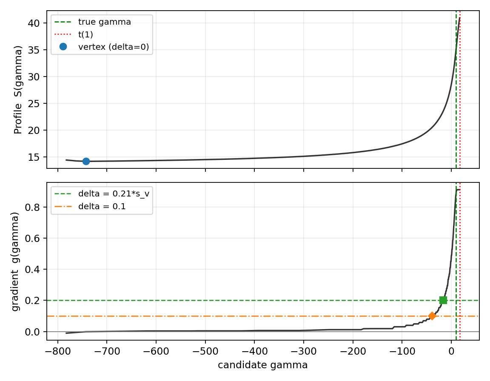  
图 1　单样本的廓线 S(γ)（上）与累计极大后的梯度 g(γ)（下）（β=2, n=10）。δ=0 顶点落在远左侧的平坦谷中、极不稳定；δ=0.1（菱形）与 δ=0.21·s\_v（方块）把估计沿陡壁推向真 γ（绿色虚线）；红色点线为 t(1)。

## **3.2　偏移的偏置–方差作用**

图 2 是 β=2、n=7 下 γ̂ 的分布。δ=0 时估计极宽，且大量落向远低于真值的危险方向（中位绝对误差 MdAE/η≈5.9）；取 c=0.20（δ=0.20·s\_v）后分布收紧到真值附近（MdAE/η≈0.20）。可见偏移是一个偏置–方差正则化量：以少量向上的偏置换取方差约一个数量级的下降。

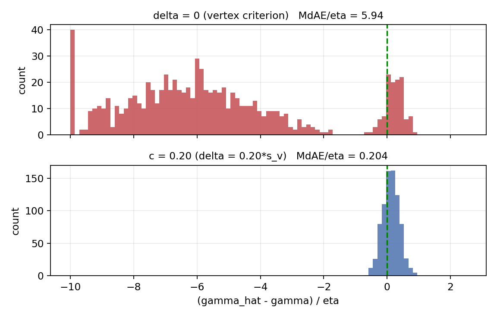  
图 2　位置估计误差 (γ̂−γ)/η 的分布（β=2, n=7；左溢出截断于 −10）。δ=0 时绝大多数估计远低于真值；适度偏移把分布收紧到真 γ 附近。

## **3.3　最优偏移存在、单谷，且随 β 左移**

图 3 表明复合误差关于 c 在每个 β 上都是单谷，存在明确最优。偏移过小（左侧）惩罚陡峭，过大（右侧）较缓。最优 c（★）随 β 增大而左移：β=5 约 0.11，β=1.5 约 0.25。各格谷底存在 5% 平坦带（附录 C 给出带宽与 bootstrap 置信区间），单点 c\* 的解读需结合区间。

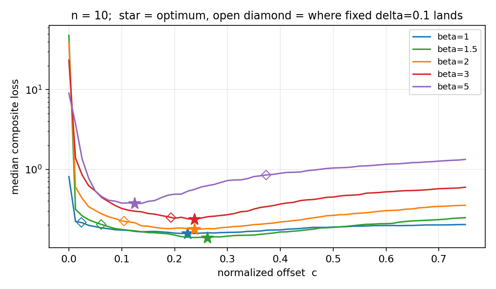  
图 3　复合误差对归一化偏移 c 的关系（对数纵轴，n=10）。每条曲线单谷；★ 为最优 c，随 β 增大左移；空心 ◇ 标出固定 δ=0.1 在各 β 上的落点。

## **3.4　归一化使最优偏移稳定，原始 δ 则跨数量级**

图 4 左：最优 c\* 落在 0.11\~0.34 的窄带内（β≥1.5；误差棒为 95% bootstrap 置信区间）。图 4 右：换算成原始 δ\*=c\*·s\_v 后，因 s\_v 在形状间相差上百倍而跨越约两个数量级。这说明应以归一化 c 为基本量、原始 δ 为派生量。表 2 给出可直接填用的 δ\* 表；由于谷底平坦，单元格数值带有采样噪声（c\* 的 95%CI 半宽中位约 0.05），建议优先用 §3.5 的标度律插值，表值作量级校验。

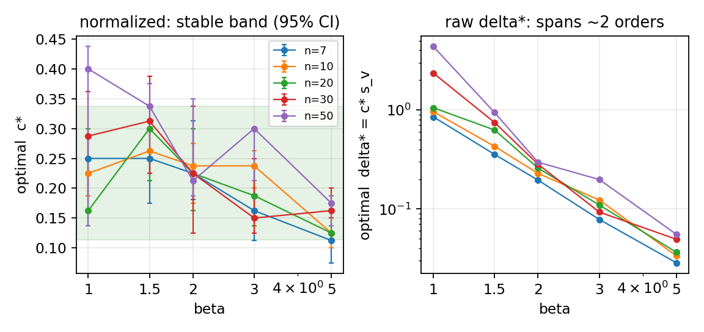  
图 4　最优偏移的两种表示。左：归一化 c\* 在不同 β、n 上稳定（绿带为 [0.11, 0.34]，误差棒为 95%CI）；右：原始 δ\* 跨约两个数量级（双对数）。

**表 2　推荐原始偏移 δ\* = c\*(β,n)·s\_v（直接填用；建议结合标度律与附录 C 的区间使用）**

<table><thead><tr><th>
<strong>β＼n</strong>
</th><th>
<strong>7</strong>
</th><th>
<strong>10</strong>
</th><th>
<strong>20</strong>
</th><th>
<strong>30</strong>
</th><th>
<strong>50</strong>
</th></tr></thead><tbody><tr><td>
<strong>1.0</strong>
</td><td>
0.85
</td><td>
0.96
</td><td>
1.05
</td><td>
2.35
</td><td>
4.37
</td></tr><tr><td>
<strong>1.5</strong>
</td><td>
0.36
</td><td>
0.43
</td><td>
0.63
</td><td>
0.75
</td><td>
0.94
</td></tr><tr><td>
<strong>2.0</strong>
</td><td>
0.20
</td><td>
0.23
</td><td>
0.26
</td><td>
0.28
</td><td>
0.30
</td></tr><tr><td>
<strong>3.0</strong>
</td><td>
0.08
</td><td>
0.12
</td><td>
0.11
</td><td>
0.09
</td><td>
0.20
</td></tr><tr><td>
<strong>5.0</strong>
</td><td>
0.03
</td><td>
0.03
</td><td>
0.04
</td><td>
0.05
</td><td>
0.06
</td></tr></tbody></table>

（β=1 为指数边界情形：谷底很平、c\* 的置信区间宽（如 n=50 时 [0.14, 0.44]），δ\* 随 n 上升较快，使用时宜偏保守；β=3 行的非单调即来自平坦谷采样噪声。）

## **3.5　驱动因素、标度律与不变性**

图 5 的热图显示最优 c\* 随 β 强烈变化、随 n 仅缓慢变化——偏移主要由形状决定。对 β≥1.5 的主网格作对数线性拟合得标度律

<em>c</em>\*(<em>β</em>, <em>n</em>) = exp( −1.373 − 0.584 ln <em>β</em> + 0.120 ln <em>n</em> )，　R2 = 0.78

图 6 显示 γ/η∈{0, 0.1, 0.5, 1.0} 的误差–c 曲线基本重合（c=0.2 处中位损失相差不超过 12%，处于蒙特卡洛噪声量级；最优平坦带互相重叠），其中 γ/η=1.0 即原文[1]的案例设定——最优偏移与位置/尺度比无关；又因梯度 g 无量纲，亦与尺度 η 无关。这两条不变性把“逐样本选偏移”问题的有效输入空间压缩到（形状信息, n, 样本形态），是 §5 特征设计的基础。

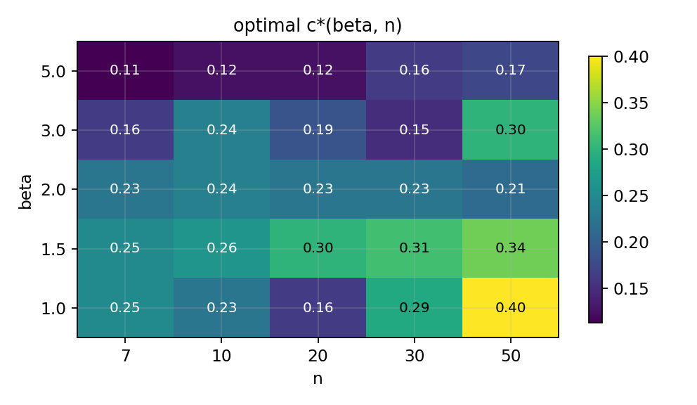  
图 5　最优 c\*(β,n) 热图。沿 β 方向变化显著，沿 n 方向变化微弱。

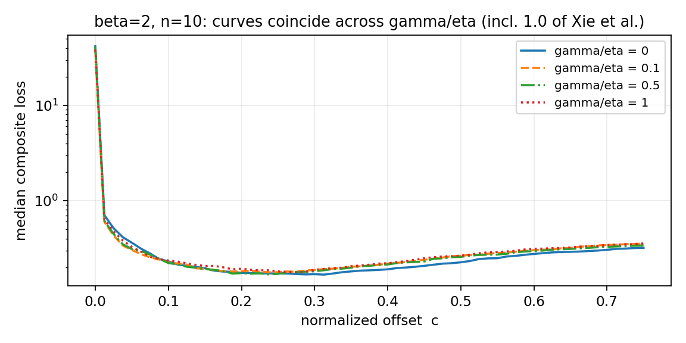  
图 6　β=2、n=10 下，γ/η∈{0, 0.1, 0.5, 1.0} 的误差–c 曲线高度重合（含原文设定 1.0）：最优偏移与位置/尺度比无关。

## **3.6　为何固定 δ=0.1 只在 β≈3 有效**

把固定 δ=0.1 在归一化轴上的落点 c₀=0.1/s\_v 与最优 c\* 并置（图 7），二者恰在 β≈3 附近相交：β<3 时 0.1 偏小、β>3 时偏大。在 n=10 上，c₀ 随 β 由 0.023（β=1）升至 0.373（β=5），仅在 β≈3 落入最优带——这解释了“0.1 经验只在中等形状成立”，与原文验证范围（β∈2\~5）的良好表现并不矛盾。

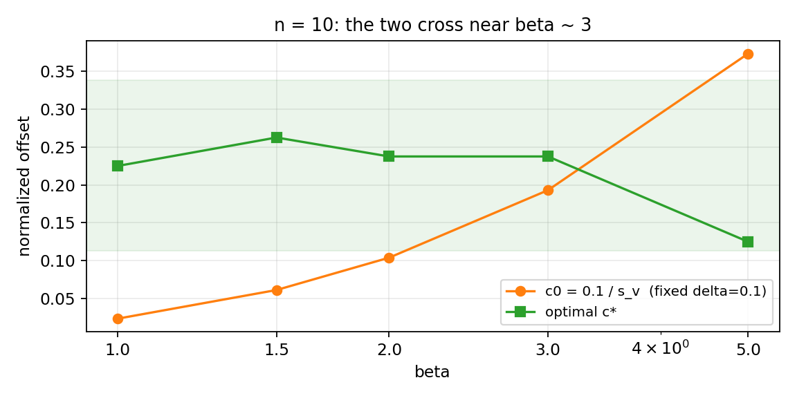  
图 7　固定 δ=0.1 的归一化落点 c₀=0.1/s\_v（橙）与最优 c\*（绿）随 β 的变化（n=10，绿带为最优带）。二者在 β≈3 附近相交。

## **3.7　各度量最优偏移的一致性核查**

§2.3 承诺的核查结果：各参数各自的最优偏移并不重合（表 3）。结构性规律清晰——γ 自身偏好更大的偏移、β̂ 偏好更小的偏移，二者中位差 0.08\~0.18，复合目标的最优值居中；x\_R(0.999) 因同时吃进 γ̂ 与 β̂ 的误差，其最优值也普遍大于复合值。这意味着复合损失的权重取舍有实质影响：若应用只关心 γ（或只关心 β̂），应分别按表 3 对应列取值；§5.2 的学习化方案因此把损失设计为可定制项。

**表 3　各度量自身的最优 c（按 β 在 n 上取中位）与最大差距**

<table><thead><tr><th>
<strong>β</strong>
</th><th>
<strong>复合</strong>
</th><th>
<strong>γ</strong>
</th><th>
<strong>β̂</strong>
</th><th>
<strong>η̂</strong>
</th><th>
<strong>x_R(0.999)</strong>
</th><th>
<strong>最大差距</strong>
</th></tr></thead><tbody><tr><td>
<strong>1.0</strong>
</td><td>
0.25
</td><td>
0.38
</td><td>
0.20
</td><td>
0.34
</td><td>
0.36
</td><td>
0.20
</td></tr><tr><td>
<strong>1.5</strong>
</td><td>
0.30
</td><td>
0.34
</td><td>
0.23
</td><td>
0.26
</td><td>
0.28
</td><td>
0.18
</td></tr><tr><td>
<strong>2.0</strong>
</td><td>
0.23
</td><td>
0.29
</td><td>
0.19
</td><td>
0.25
</td><td>
0.26
</td><td>
0.10
</td></tr><tr><td>
<strong>3.0</strong>
</td><td>
0.19
</td><td>
0.24
</td><td>
0.15
</td><td>
0.21
</td><td>
0.30
</td><td>
0.15
</td></tr><tr><td>
<strong>5.0</strong>
</td><td>
0.13
</td><td>
0.16
</td><td>
0.13
</td><td>
0.14
</td><td>
0.19
</td><td>
0.08
</td></tr></tbody></table>

（全网格的最大差距中位为 0.15。）

## **3.8　β̂ 与偏移的纠缠：解点处的系统性低偏**

表 3 的不一致有一个统一机理。沿廓线增大偏移会把 γ̂ 推向 t(1)，左尾被压缩，内层最优形状随之下移：β̂ 在解点处随 c 增大而系统性低偏，且 β 越大越严重（图 8）。在 c=0.21 处，β̂/β 的中位为：β=1 时 0.98、β=1.5 时 0.94、β=2 时 0.90、β=3 时 0.83、β=5 时 0.72。这条曲线有两个直接推论：其一，γ 与 β 的最优偏移必然背离（§3.7）；其二，任何把 β̂ 经 s\_v(β̂) 乘性换算回偏移的部署通道都会被污染——s\_v 对 β 极陡（β=5、n=10 时 dln s\_v/dln β≈−2），β̂ 的低偏与噪声经指数放大后使有效偏移系统性偏大、且方差爆炸。§3.9 给出该失效的实测代价。

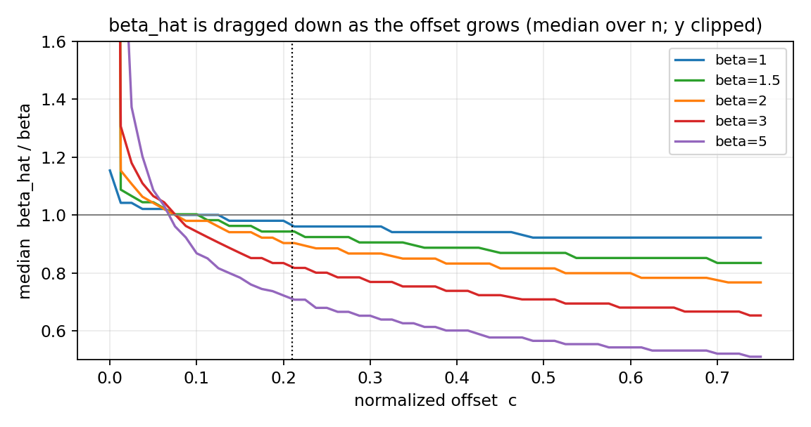  
图 8　解点处 β̂/β 的中位随归一化偏移 c 的变化（各 β 在 n 上取中位；竖点线为 c=0.21）。偏移越大、β 越大，β̂ 低偏越严重。

## **3.9　方案比较：从理想协议到真实部署**

表 4 与图 9 给出全部方案在统一口径下的复合误差比（相对固定 δ=0.1，全网格中位，5 折交叉验证，95% 簇 bootstrap 置信区间）。方案按“部署时需要什么输入”分为三类：仅用观测可得量（可部署）、需要真实参数（理想协议，作参照）、以及事后最优（oracle，含运气成分的上界）。

**表 4　方案阶梯：复合误差比（÷固定 δ=0.1，全网格中位；[ ] 内为 95%CI）**

<table><thead><tr><th>
<strong>方案</strong>
</th><th>
<strong>部署输入</strong>
</th><th>
<strong>可部署</strong>
</th><th>
<strong>误差比</strong>
</th></tr></thead><tbody><tr><td>
固定 δ=0.1（基线）
</td><td>
无
</td><td>
✓
</td><td>
1.000
</td></tr><tr><td>
朴素配方 δ=0.21·s_v(β̂,n)
</td><td>
单遍 β̂
</td><td>
✓（失效）
</td><td>
1.081
</td></tr><tr><td>
最优单一固定 δ（CV 调优，约 0.21~0.28）
</td><td>
无
</td><td>
✓
</td><td>
0.916 [0.888, 0.970]
</td></tr><tr><td>
按 n 调优固定 δ（CV）
</td><td>
n
</td><td>
✓
</td><td>
0.896 [0.879, 0.949]
</td></tr><tr><td>
归一化全局 c=0.21（真 β 协议）
</td><td>
真 β
</td><td>
✗
</td><td>
0.770 [0.731, 0.808]
</td></tr><tr><td>
按 (β,n) 查表（真参数，CV）
</td><td>
真 β, n
</td><td>
✗
</td><td>
0.777 [0.729, 0.805]
</td></tr><tr><td>
学习化探针 E：多偏移读出 + 树（CV）
</td><td>
样本与廓线特征
</td><td>
✓
</td><td>
0.707 [0.673, 0.747]
</td></tr><tr><td>
诊断探针：特征中加入真 β（作弊）
</td><td>
—
</td><td>
✗（诊断）
</td><td>
0.513
</td></tr><tr><td>
逐样本 oracle（事后最优）
</td><td>
—
</td><td>
✗（上界）
</td><td>
0.303 [0.270, 0.327]
</td></tr></tbody></table>

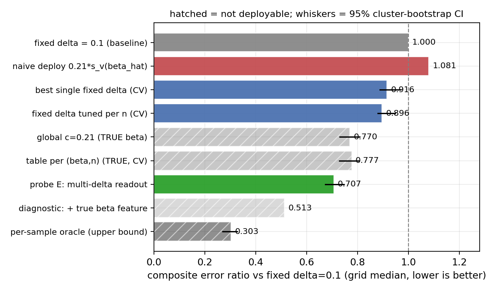  
图 9　方案阶梯（斜纹 = 不可部署；横线为 95% 簇 bootstrap 置信区间）。可部署方案的简单天花板约 0.90；多偏移读出探针 0.707 已越过需真参数的查表方案。

四点判读。其一，朴素配方（1.081）证实了 §3.8 的预言：β̂–偏移纠缠使“用单遍 β̂ 换算偏移”劣于不调；本系列此前版本 §4.2 的对应建议据此撤回并更正（见 §4.3）。其二，“不看样本形态”的方案族在 0.90 即触顶——固定 δ=0.1 在该族内本就接近最优，这从机制上解释了原文经验值的成功，也说明再压误差必须使用逐样本信息。其三，真 β 协议下全局 c 与按格查表几乎等效（0.770 对 0.777）：在交叉验证口径下，(β,n) 查表相对单一全局 c 的边际增益可忽略——形状信息的价值主要在“知道 β 的量级”，而非格点级微调。其四，多偏移读出探针（0.707）作为完全可部署方案越过了不可部署的查表线，且其与作弊探针（0.513）之间的差距定位了剩余瓶颈：从观测中更充分地识别形状信息；与 oracle（0.303）之间的差距则包含原则上不可预测的运气成分（§4.4）。

## **3.10　安全边界：偏移把寿命估计推向危险方向**

随 c 增大，γ̂ 与最小寿命 x\_R(0.999) 的带符号偏差由负穿零转正（图 10）。在最优带处（c≈0.21），γ̂ 中位偏差约 +5.2%η、x\_R(0.999) 约 +24.5%（固定 δ=0.1 处分别约 +3.5%η 与 +13.7%）。同时尾部并未消失：c=0.21 处 γ̂ 误差的 10% 分位仍约 −9.5%η（即至少 10% 的样本仍显著低估）。注意偏差有两种口径：以 η 为分母（本文主口径）与以 γ 为分母——在本实验 γ/η=0.1 下二者相差 10 倍（+5.2%η 即 +52%γ），引用时须注明口径。

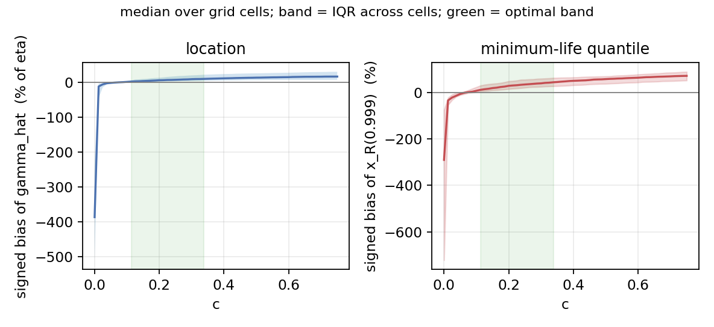  
图 10　γ̂（左，%η）与最小寿命 x\_R(0.999)（右，%）的带符号中位偏差随 c 的变化（实线为 25 格中位，阴影为格间四分位带，绿带为最优带）。偏移越大，越偏向高估（危险方向）。

<table><tr><td>
<strong>⚠ 安全边界</strong>

在复合最优偏移（c≈0.21）处，γ̂ 中位偏差约 +5.2%η、最小寿命 x_R(0.999) 约 +24.5%（固定 δ=0.1 处分别约 +3.5%η、+13.7%）。偏移以“高估寿命 = 低估失效风险”为系统性代价。面向深尾/最小寿命的高可靠性设计，应取更保守的偏移（更接近 δ=0.1 乃至按 γ 方向单独加权），并将误差按目标与方向分别评估；§5.2 的学习化损失为此预留了不对称惩罚项。
</td></tr></table>

# **4　成本–精度均衡与推荐方案**

## **4.1　成本结构：均衡问题在一次性成本，不在使用期**

以“一次廓线构建”为成本单位（构建后任意偏移的解只是根查找，多偏移读出亦然），各方案的使用期成本几乎相同：约一至两次构建加查表或一次微秒级推理。因此“精度提升 vs 成本”的均衡完全发生在一次性成本上：标定（本研究为 2.24 万次构建，已完成）、造数据与训练（学习化路线，估计为本研究的 5\~50 倍，§5.4）、以及工程验证与可解释性负担。使用期不构成任何方案的否决项。

## **4.2　阶梯判读：每一级买到什么**

把表 4 改写为增量视角：从基线到 oracle 的理论可改善总量为 1.000−0.303=0.697。其中“零信息”层（调优固定 δ / 按 n）拿到约 15%（至 0.90），且这一层的标定已由本研究完成、增量成本为零；真 β 协议层（0.77）需要外部形状先验才能兑现，额外拿到约 18 个百分点；学习化探针层（0.71）不需要任何先验、以一次性的特征工程换得越过先验层，再拿约 10 个百分点；剩余约 0.71−0.30 = 40 个百分点是逐样本深度学习与不可预测噪声的混合地带（§4.4 给出可学习份额的判据与实测）。直观结论是：免费的改善已经领完，先验不可得时，继续前进的唯一道路是逐样本学习化；而其入场费（5\~50 倍一次性成本）所购买的空间，由 ρ̂ 判据量化。

## **4.3　推荐流程（更正版）**

<table><tr><td>
<strong>决策指南（替代旧版 §4.2）</strong>

<strong>① 无任何先验、单一小样本：</strong>取固定 δ=0.1，或按 n 查表 5 取调优固定 δ（误差比约 0.90）。

<strong>② 不要</strong>使用 δ≈0.21·s_v(β̂,n) 之类“单遍 β̂ 乘性换算”的配方：实测劣于固定 0.1（误差比 1.08），机理见 §3.8。本系列旧版的该建议据此更正。

<strong>③ 有可信外部形状先验</strong>（材料/失效模式知识、同总体批量数据的稳健 β̂）：取 c≈0.21·s_v(β_prior, n) 或按 (β,n) 查表/标度律（误差比约 0.77）。先验必须来自偏移过程之外——这是该层成立的前提。

<strong>④ 允许一次性标定/批量场景：</strong>用 §5 的学习化方案（多偏移读出特征 + 浅层模型即可达 0.71；神经网络目标区间见 §5.1），并配护栏（§5.6）。

<strong>⑤ 深尾/最小寿命设计：</strong>在所选层基础上向保守端收缩（更接近 δ=0.1），或采用按 γ 方向加权的损失重新标定；引用 §3.10 的偏差口径。
</td></tr></table>

**表 5　按 n 调优的固定 δ（5 折选择的中位；不依赖任何形状信息）**

<table><thead><tr><th>
<strong>n</strong>
</th><th>
<strong>7</strong>
</th><th>
<strong>10</strong>
</th><th>
<strong>20</strong>
</th><th>
<strong>30</strong>
</th><th>
<strong>50</strong>
</th></tr></thead><tbody><tr><td>
δ（按 n）
</td><td>
0.21
</td><td>
0.31
</td><td>
0.41
</td><td>
0.41
</td><td>
0.21*
</td></tr></tbody></table>

（\* n=50 列受 β=1 行极端 δ\* 的拉扯而选择偏小，非单调来自“5 格中位”判据的折中；若可排除 β≈1 情形，n=50 可参照 n=30 取值。）

## **4.4　是否上逐样本学习：go/no-go 判据与本轮结果**

逐样本 oracle（0.303）高估了学习化路线的真实天花板：oracle 是“看到误差之后”才选的偏移，把每个样本里纯属运气的随机成分也吃了进去，而任何只看样本特征的预测器原则上拿不到这部分。形式化地说，逐样本最优偏移 = 可由特征预测的成分 + 不可预测的噪声成分；只有前者是学习模型的真实猎物。为此定义可回收份额

<em>ρ̂</em> = ( r参照 − r探针 ) / ( r参照 − roracle )

其中探针为只用可部署特征、5 折交叉验证的浅层模型（其成绩是后续神经网络能力的下界），参照取最优可部署简单基线（min{固定 0.1, 调优固定 δ, 按 n}，本轮为 0.896）。判读规则：ρ̂ ≥ 0.20 → 学习化立项；ρ̂ < 0.10 → 封顶于简单方案；0.10\~0.20 → 更换更强特征再探一轮。本轮实测：单遍特征探针卡在 1.0 附近（ρ̂ 为负），按规则“再探”引入多偏移读出特征后，ρ̂ = 0.318，95%CI [0.265, 0.385]，显著越过立项线；以“按 (β,n) 查表”为参照的保守口径下 ρ̂ 亦为正（0.147 [0.016, 0.189]）。结论：逐样本学习化立项的证据成立，方案见 §5。

## **4.5　早期失效（β<1）需单独处理**

β<1 时 s\_v 急剧增大（例如 β=0.5、n=10 时 s\_v≈64），固定 δ=0.1 的归一化落点 c₀≈0.002，几乎等于不设偏移；最优偏移也更大，且此区各参数的最优偏移背离更严重（表 3 的趋势随 β 减小而加剧）。因此 β<1 应以复合目标单独标定，不可用 β≥1.5 的标度律外推。

# **5　迈向逐样本自适应偏移：学习化路线**

## **5.1　依据与空间量化**

本节给出后续“神经网络选偏移”工作的完整方案。其依据来自 §3.9 的四个锚点：可部署简单方案 0.90 → 浅层探针 0.71 →（作弊参照：真 β 特征 0.51）→ oracle 0.30。三个推论：(i) 逐样本可学习的信号真实存在且很大——给定形状信息后，便宜的样本特征即可把误差比压到 0.51，远低于按格查表（0.78），说明“同格之内”仍有大量可预测结构；(ii) 当前可部署探针（0.71）与作弊参照（0.51）之间约 20 个百分点的差距，瓶颈精确定位于“从观测中识别形状”；(iii) 神经网络的现实目标区间为 0.5\~0.7——下探 0.51 需要在形状识别上超过多偏移读出特征（例如直接输入整条廓线），逼近 0.30 则不应作为目标（含不可学习的运气成分）。图 11 的消融阶梯显示信息增量的来源。

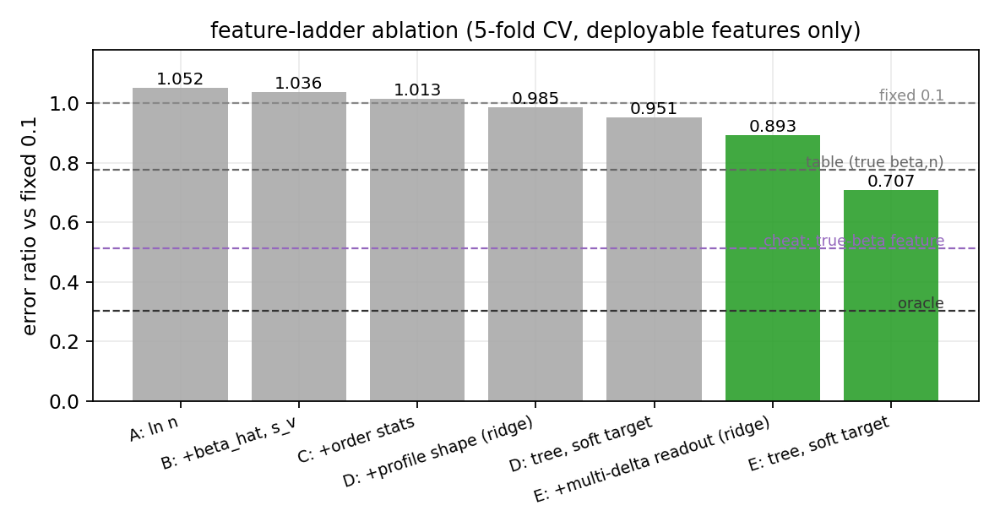  
图 11　特征阶梯消融（全部 5 折交叉验证、仅用可部署特征）。单遍特征（A–D）卡在 1.0 附近；多偏移读出（E）破墙至 0.71；虚线为参照线。

## **5.2　问题形式化**

学习任务为回归：特征 x\_i → 目标 ln δ\_i\*（原始偏移的对数；δ 无量纲，直接预测可绕开 §3.8 的换算陷阱）。目标采用软标签：以每个样本误差曲线的 softmin 加权平均替代硬 argmin，缓解平坦谷带来的标签噪声（本轮试点中软标签稳定优于硬标签）。损失默认平方损失，但保留两类定制项以呼应 §3.7 与 §3.10：按应用目标重新加权复合损失各分量后重生成标签；以及对“预测偏移过大 → γ̂ 高估”方向施加不对称惩罚，使模型天然偏保守。

## **5.3　特征设计**

§3.5 的两条不变性规定了特征的形：一切特征都应是平移、尺度不变的可观测量。三层结构：(i) 基础层——ln n、单遍 β̂₀（δ=0.1 解）及 ln s\_v(β̂₀,n)；(ii) 样本形态层——次序统计量比值（首间距/极差、中位与均值位置、偏度等）；(iii) 廓线层——谷顶位置与深度、壁宽，以及核心的多偏移读出：在同一条廓线上读取 β̂(δ)（δ=0.05/0.1/0.2/0.4）的整个衰减形态与对应 γ̂ 位移。机理（§3.8）保证了该读出携带形状信息：β̂ 随 δ 的衰减速率本身是 β 的函数。设计红线：β̂ 一律只作特征输入或护栏截断，绝不作 s\_v(β̂) 乘子参与输出换算。更进一步的方案是端到端输入整条归一化廓线曲线（一维卷积或小型 MLP），把特征工程交给网络——这是逼近 0.51 参照的主要候选路径。

## **5.4　训练数据方案**

连续覆盖以消除格点过拟合：β 在 [1, 6]（对数均匀）、n 在 [5, 60]（整数均匀）、γ/η 在 [0, 1] 采样（不变性使其不影响标签，但保留以验证）；η 固定。每个样本一次廓线构建即可扫出整条误差–δ 曲线并生成软标签，标签的边际成本接近零。建议规模 10⁵\~10⁶ 个样本，对应一次性计算成本约为本研究（2.24 万次构建）的 5\~50 倍；按本文实现的单样本约 2.6 毫秒计，10⁶ 样本的生成在单机数小时量级。本研究存档的逐样本数据（per\_sample.npz，含原始样本、特征与全曲线）可直接作为首期训练/验证集。

## **5.5　评估协议**

固定四条参照线：固定 δ=0.1、按 n 调优固定 δ、真 β 协议查表（不可部署上参照）、oracle；全部口径沿用 §2.4（格内中位 → 全网格中位、簇 bootstrap CI）。必做三项：(i) 网格外外推——在 β∈{1.2, 4, 6}、n∈{15, 40, 60} 等训练未覆盖格点上测试；(ii) 消融——按 §5.3 三层特征逐层加入，确认增益来源与图 11 一致；(iii) 失败剖面——按 β 分桶报告，重点监控高 β 区（纠缠最重）与 β≈1 区（谷底最平）。验收线建议：全网格中位 ≤ 0.65 且任一 β 桶不劣于按 n 基线。

## **5.6　落地护栏**

工程化采用四重护栏：(i) 输出截断——预测 δ̂ 限制在 [0.08, 0.45]·s\_v(β̂₀,n) 区间（截断而非乘子，本轮护栏版探针仅损失约 1 个百分点）；(ii) 残差学习——以按 n 表为锚、网络只学修正量，确保最坏情形退化为表 5；(iii) 蒸馏审计——以浅层树拟合网络输出生成可读规则，供工程评审；(iv) 回退开关——任何分布外信号（特征超界、廓线形态异常）触发时退回固定 δ=0.1。

# **6　结论**

偏移量 δ 是 MDM 的关键正则化量，而非可有可无的微调：δ=0 会让位置估计灾难性失稳，适度正偏移以少量向上偏置换取方差数量级的下降。最优偏移以归一化形式 c=δ/s\_v(β,n) 表示时稳定在 0.11\~0.34，主要由形状 β 决定，与 γ/η（含原文设定 1.0）和尺度 η 无关；固定 δ=0.1 在“不看样本”的方案族内已接近最优，这解释了原文经验值的成功，也意味着该族的改善空间已基本榨干（至约 0.90）。

更重要的是部署层结论：β̂ 与偏移相互纠缠（解点 β̂ 随偏移系统性低偏），使“单遍 β̂ 乘性换算”的直觉配方实测失效，旧版对应建议据此更正；真 β 协议的收益（0.77）只有在外部先验可得时才能兑现。突破口在逐样本信息：以多偏移读出特征做端到端浅层学习即可达 0.71、越过查表线，且立项判据 ρ̂=0.32 [0.27, 0.39] 显著超阈——逐样本神经网络路线（目标区 0.5\~0.7）的立项证据、特征方案、数据方案与护栏均已就位。其不变的代价是对最小寿命的系统性高估（最优带处 x\_R(0.999) 约 +24%），深尾设计须设防。一言以蔽之：把 δ 当成“由形状驱动、以 s\_v 为标尺”的旋钮；想再进一步，就让数据自己读出形状，而不是让一个有偏的 β̂ 替它说话。

# **7　局限**

- 实现依赖。最优 δ 的绝对数值依赖实现细节（秩公式、β 搜索范围、廓线与反演方式、η̂ 取法）；本文已在 §2.2 逐项声明并提供核对清单，定性形态（单谷、归一化稳定、纠缠方向、阶梯次序）预计跨实现稳健，量值迁移前宜小规模重标定。
- 外推。β<1 与极深分位寿命（如 n=7 的 R=0.999）属外推；n>50、β>5 未标定。连续 (β,n) 的覆盖留给 §5.4 的训练数据阶段完成。
- 目标函数。§3.7 表明各参数最优偏移不一致，等权复合是一种取舍；应用权重不同，最优带与阶梯数值会随之移动（方向性结论不变）。
- 探针的下界性质。§3.9/§5 的学习化数字来自线性与浅层树探针，是后续模型的下界而非预测；多偏移读出特征在极高 s\_v 格（β=1、大 n）的读出位置受评估网格下限影响，部署实现中按原始 δ 直接求根即可消除。
- 数据条件。均为完整样本（无截尾）、Bernard 中位秩；截尾数据与其它秩公式下的稳健性留待后续。
- 双机核对。个别口径相对第六轮初版存在偏移（如标度律系数、δ=0.1 处 γ̂ 偏差），来自 c 网格加密（17→61 点）、交叉验证保守化与实现细节；以本轮复核运行为唯一数据源，对照项见附录 B。

# **参考文献**

[1] 谢里阳, 朱文慧, 吴宁祥, 杨小玉. 基于统计最小差异原理的Weibull分布参数估计方法[J]. 东北大学学报(自然科学版), 2025(7): 108-113.

[2] Teimouri M, Abdolahnezhad K, Ghalandarayeshi S. Evaluation of estimation methods for parameters of the probability functions in tree diameter distribution modeling[J]. Environmental Resources Research, 2020, 8(1): 25-40.

[3] Nagatsuka H, Balakrishnan N. An efficient method of parameter and quantile estimation for the three-parameter Weibull distribution based on statistics invariant to unknown location parameter[J]. Communications in Statistics (Simulation and Computation), 2015, 44(2): 295-318.

[4] Yang F, Yue Z F. Kernel density estimation of three-parameter Weibull distribution with neural network and genetic algorithm[J]. Applied Mathematics and Computation, 2014, 247: 803-814.

[5] Jokiel-Rokita A, Piaget S. Estimation of parameters and quantiles of the Weibull distribution[J]. Statistical Papers, 2024, 65(1): 1-18.

[6] Acitas S, Aladag C H, Senoglu B. A new approach for estimating the parameters of Weibull distribution via particle swarm optimization: an application to the strengths of glass fibre data[J]. Reliability Engineering & System Safety, 2019, 183: 116-127.

# **附录 A　复现要点**

判别量 s\_v：F\_i=(i−0.3)/(n+0.4)，x\_i=−ln(1−F\_i)，s\_v 为 {x\_i^(−1/β)} 的样本标准差（ddof=1），只依赖 β、n（例：n=10、β=1/1.5/2/3/5 → 4.26/1.63/0.96/0.52/0.27；全表见表 A1）。

MDM 求解：以闭式 σ²(β|γ)=C\_uu−2γC\_uv+γ²C\_vv 建立廓线（β 在 log 均匀网格 [0.1, 20] 共 261 点上内层取优），梯度用包络式 g=(γC\_vv−C\_uv)/S（C 在内层最优 β 处取值）；反演时对 g 取累计极大以消除平坦区微小波动，再取最靠近 t(1) 的根；γ 候选取 t(1)−gap，gap 在 [10⁻⁶R, 60R] 上几何分布共 700 点（R 为样本极差），左端遇谷顶贴边时自动扩展；γ̂ 不作非负截断；η̂ 取 n 个伪估计量的均值。

实验与统计：主网格每格 800 次重复，c 网格在 [0, 0.75] 取 61 点；固定 δ=0.1 基线精确求解；调优类方案 5 折交叉验证；置信区间为按格簇 bootstrap（B=300）；插值算子保真度（相对精确求解的最大格点偏差）2.4%；δ 超出梯度上界的样本比例（取墙位并标记）4.0%。主种子 20260610。图中坐标轴用英文以保证渲染稳定，正文为中文。

**表 A1　判别量 s\_v(β, n)（确定性，仅依赖 β、n）**

<table><thead><tr><th>
<strong>β＼n</strong>
</th><th>
<strong>7</strong>
</th><th>
<strong>10</strong>
</th><th>
<strong>20</strong>
</th><th>
<strong>30</strong>
</th><th>
<strong>50</strong>
</th></tr></thead><tbody><tr><td>
<strong>1.0</strong>
</td><td>
3.40
</td><td>
4.26
</td><td>
6.47
</td><td>
8.18
</td><td>
10.91
</td></tr><tr><td>
<strong>1.5</strong>
</td><td>
1.42
</td><td>
1.63
</td><td>
2.09
</td><td>
2.38
</td><td>
2.79
</td></tr><tr><td>
<strong>2.0</strong>
</td><td>
0.87
</td><td>
0.96
</td><td>
1.15
</td><td>
1.26
</td><td>
1.39
</td></tr><tr><td>
<strong>3.0</strong>
</td><td>
0.48
</td><td>
0.52
</td><td>
0.58
</td><td>
0.62
</td><td>
0.66
</td></tr><tr><td>
<strong>5.0</strong>
</td><td>
0.25
</td><td>
0.27
</td><td>
0.29
</td><td>
0.30
</td><td>
0.32
</td></tr></tbody></table>

# **附录 B　复现命令与双机核对清单**

配套脚本 mdm\_offset\_study.py（依赖 numpy、pandas，建议 scikit-learn）。命令：① python mdm\_offset\_study.py verify（s\_v 必须与表 A1 完全一致——实现对齐的硬门槛）；② python mdm\_offset\_study.py all --quick（冒烟）；③ python mdm\_offset\_study.py all --reps 800（正式，产物为 summary\_report.json、tables/\*.csv 与逐样本存档 per\_sample.npz）。

双机核对清单（独立运行后逐项比对）：(1) verify 全部 ✓；(2) 方案阶梯八个比值与表 4 之差在 ±0.03 以内（800 次重复的蒙特卡洛噪声量级）；(3) ρ̂ 的 95%CI 与本文区间重叠；(4) c\* 带 [0.11, 0.34] 与标度律系数符号、量级一致；(5) 安全数字（c=0.21 处 +5.2%η / +24.5%）一致；(6) flags 中插值保真度 <5%。若 (2) 系统性偏离，先核对 β 搜索网格与 η̂ 取法两个口径项（§2.2），再核对秩公式。

# **附录 C　数据表**

**表 C1　最优归一化偏移 c\*(β,n) 与 95% bootstrap 置信区间（γ/η=0.1）**

<table><thead><tr><th>
<strong>β＼n</strong>
</th><th>
<strong>7</strong>
</th><th>
<strong>10</strong>
</th><th>
<strong>20</strong>
</th><th>
<strong>30</strong>
</th><th>
<strong>50</strong>
</th></tr></thead><tbody><tr><td>
<strong>1.0</strong>
</td><td>
0.25 [0.19,0.29]
</td><td>
0.23 [0.19,0.30]
</td><td>
0.16 [0.14,0.30]
</td><td>
0.29 [0.16,0.36]
</td><td>
0.40 [0.14,0.44]
</td></tr><tr><td>
<strong>1.5</strong>
</td><td>
0.25 [0.17,0.26]
</td><td>
0.26 [0.23,0.31]
</td><td>
0.30 [0.21,0.34]
</td><td>
0.31 [0.23,0.39]
</td><td>
0.34 [0.26,0.38]
</td></tr><tr><td>
<strong>2.0</strong>
</td><td>
0.23 [0.18,0.31]
</td><td>
0.24 [0.17,0.28]
</td><td>
0.23 [0.16,0.30]
</td><td>
0.23 [0.12,0.34]
</td><td>
0.21 [0.19,0.35]
</td></tr><tr><td>
<strong>3.0</strong>
</td><td>
0.16 [0.11,0.20]
</td><td>
0.24 [0.20,0.26]
</td><td>
0.19 [0.14,0.24]
</td><td>
0.15 [0.12,0.25]
</td><td>
0.30 [0.21,0.30]
</td></tr><tr><td>
<strong>5.0</strong>
</td><td>
0.11 [0.07,0.12]
</td><td>
0.12 [0.10,0.15]
</td><td>
0.12 [0.11,0.16]
</td><td>
0.16 [0.15,0.20]
</td><td>
0.17 [0.14,0.19]
</td></tr></tbody></table>

**表 C2　学习化探针消融（5 折交叉验证；误差比 ÷ 固定 δ=0.1）**

<table><thead><tr><th>
<strong>特征组 / 模型</strong>
</th><th>
<strong>岭回归</strong>
</th><th>
<strong>梯度提升树（软标签）</strong>
</th></tr></thead><tbody><tr><td>
A：仅 ln n
</td><td>
1.052
</td><td>
—
</td></tr><tr><td>
B：+ 单遍 β̂₀、ln s_v
</td><td>
1.036
</td><td>
—
</td></tr><tr><td>
C：+ 次序统计量
</td><td>
1.013
</td><td>
—
</td></tr><tr><td>
D：+ 廓线形状（软标签）
</td><td>
0.985
</td><td>
0.951
</td></tr><tr><td>
E：+ 多偏移读出
</td><td>
0.893
</td><td>
0.707（护栏版 0.737）
</td></tr><tr><td>
诊断：E + 真 β（作弊）
</td><td>
—
</td><td>
0.513
</td></tr></tbody></table>

—— 全文完 ——