__基于统计最小差异原理的三参数 Weibull 估计__

__偏移量 δ 的客观选取与标准评估__

__第十一轮结果__

全部数值由可复现的 Monte\-Carlo 实验得出（随机种子 20260613）

## 摘要

本文在 Xie 等（2025）提出的统计最小差异（MDM）三参数 Weibull 估计框架内，研究位置判据偏移量 δ 的选取。MDM 通过对尺度伪估计的离散度取最小来定位形状与尺度参数；当对位置参数 γ 的判据梯度施加一个正偏移 δ 时，可把 γ̂ 从左偏（常被截断到 0）拉回到真值附近。我们以无量纲偏移 c = δ / s\_v\(β,n\) 为统一坐标，在 β∈\{1,1\.5,2,3,5\} 与 n∈\{7,10,20,30,50\} 的 25 个单元上做大样本仿真，并以对数尺度/对数形状误差加位置（以 η 归一）误差构成的复合风险作为客观目标。

主要结论：（一）复合风险关于 c 在 β≤3 时呈单谷，最优偏移 c\* 随 β 减小、随 n 缓增，可由标度律 __c\* = exp\(\-1\.940 \-0\.488·lnβ \+ 0\.178·ln n\)__ 概括（R²=0\.832），且 lnc\* 方差中约 __73\.3%__ 由 β 解释；（二）尺度等变性在数值上精确成立（最大相对偏差 5\.2e\-15），c\* 与 γ/η 无关，仅经 γ≥0 截断边界发生微弱依赖；（三）c\* 对复合损失的权重稳健（±0\.01），唯有改用纯分布/分位目标才会翻转为 c≈0——这表明偏移本质上是“位置恢复器”；（四）最优偏移处 γ̂ 仍有约 __\+5\.5%__ 的系统性右偏；（五）部署上，一个全局常数 c≈0\.170 已逼近逐格 oracle，按 β 或 n 条件化收益甚微；用单遍 β̂ 做乘性换算会失效，而以多偏移读出为特征的浅层学习可进一步逼近逐样本下界。

## 目录

# 1　问题、记号与方法

## 1\.1　三参数 Weibull 与 MDM 估计量

记三参数 Weibull 分布的累积分布函数为下式，其中 γ 为位置（最小寿命）、η 为尺度、β 为形状参数。

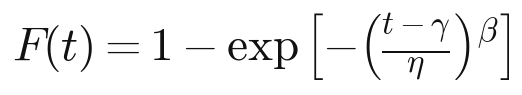

对升序样本 t₍₁₎≤…≤t₍ₙ₎，取中位秩 F\_i（本文采用精确中位秩，由 Beta 分布中位数给出），定义在给定 \(γ,β\) 下的尺度伪估计 η\_i。MDM 的核心思想是：当 \(γ,β\) 取真值时，各 η\_i 应彼此一致；故以其离散度（标准差）作为判据。

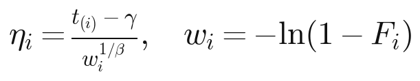

令 v\_i = w\_i^\{\-1/β\}、u\_i = t₍ᵢ₎·w\_i^\{\-1/β\}，则尺度伪估计的样本方差是 γ 的二次函数（系数 C\_vv、C\_uv、C\_uu 仅依赖样本与 β），从而对任意固定 β 可解析地对 γ 求极小。

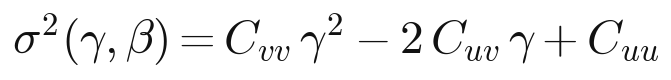

对 β 取剖面（profile），得到关于 γ 的目标曲线 S\(γ\)：

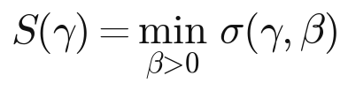

Xie 等（2025）指出（并经本文复核），S\(γ\) 的（次）梯度 g\(γ\) 具有简洁形式，且在 \(−∞, t₍₁₎\) 上单调由 −s\_v 增至 \+s\_v，其中 s\_v 是仅依赖 \(β,n\) 的常数。无偏移时取 g\(γ\)=0（即 σ 的极小）定位 γ；这正是左偏的来源——在小样本下该极小点系统性地偏向数据左端，常被迫截断到 γ̂=0。

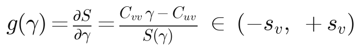

相应地，给定 γ̂、β̂ 后，尺度由各 η\_i 的均值给出：

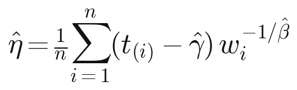

## 1\.2　偏移判据与无量纲化

为矫正上述左偏，对位置判据施加一个正偏移 δ，即不再令梯度为零，而是求解 g\(γ̂\)=δ；负解截断到 0。由于 g 单调，解唯一且必存在（数值上等价于在单调曲线上的求根/反演）。

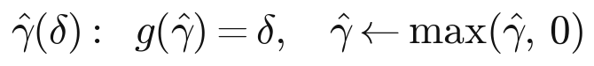

偏移 δ 与梯度同量纲（梯度的值域为 ±s\_v），故其“有效大小”随 \(β,n\) 改变。我们因此采用无量纲偏移作为统一坐标：

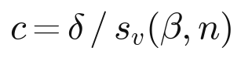

s\_v\(β,n\) 即梯度的端点值，仅由形状与样本量决定。下文除特别说明外，一切关于偏移的结论都以 c 表述；这一归一化的有效性将在第 3 节定量验证。

## 1\.3　数值实现与验证

估计器以解析的单调化包络梯度配合向量化的网格反演实现，等价于对单调梯度做 Brent 求根，但对 β 网格 argmin 的抖动稳健。两处锚点验证如下。

- __梯度端点常数 s\_v：__本文在 25 个 \(β,n\) 上重算的 s\_v 与原文附表 C\-1 逐项完全一致（采用精确中位秩），见表 1。
- __随机算例 W\(β=2, η=1000, γ=1000\)、n=7：__在 δ=0\.1 下 γ̂ 的 5%–95% 区间约为 \[534, 1554\]（原文图示约 500–1550）；而 δ=0 时约 70% 的样本被截断到 γ̂=0，复现了无偏移时的左偏灾难。

__表 1　梯度端点常数 s\_v\(β,n\)（与原文附表 C\-1 逐项一致）__

__β \\ n__

__7__

__10__

__20__

__30__

__50__

β=1\.0

3\.416

4\.282

6\.522

8\.256

11\.014

β=1\.5

1\.426

1\.639

2\.102

2\.400

2\.804

β=2\.0

0\.871

0\.966

1\.154

1\.264

1\.402

β=3\.0

0\.483

0\.520

0\.587

0\.622

0\.663

β=5\.0

0\.255

0\.269

0\.293

0\.305

0\.317

*注：s\_v 随 β 增大而增大、随 n 增大而减小；它是无量纲化 c=δ/s\_v 的尺度因子。*

为直观说明 MDM 判据与偏移的几何，图 1 给出固定 γ 时尺度伪估计标准差随 β 的变化（最小差异准则在 β 方向取极小），图 2 给出位置判据梯度随 γ 的单调上升及其与 δ=0\.1 的交点（即偏置解 γ̂）。两图均采用与原文图 3、图 4 一致的呈现方式。

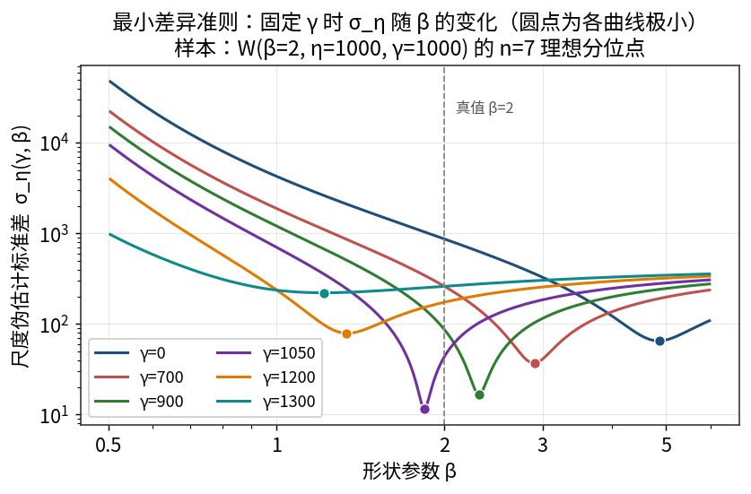

*图 1　固定 γ 时尺度伪估计标准差 σ\_η 随 β 的变化；圆点为各曲线极小。最接近真值 γ=1000 的曲线极小最深，对应 β≈2。*

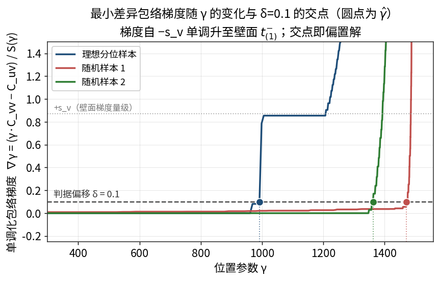

*图 2　最小差异包络梯度随 γ 单调上升，与判据偏移 δ=0\.1 的交点给出 γ̂；不同样本给出不同 γ̂。*

# 2　复合损失的客观论证

选取 δ 需要一个标量目标。本文采用如下复合风险：对数形状误差、对数尺度误差与以 η 归一的位置误差之平方和。本节从等变性、对权重的稳健性、以及“不同目标偏好不同偏移”三个角度，客观地说明该目标的合理性与适用边界。

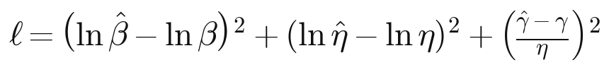

## 2\.1　量纲与等变性

该损失是无量纲的：β 的对数误差对尺度变换不变；η 的对数误差对尺度变换不变；位置误差以 η 归一后亦无量纲。因此风险面在 \(γ,η\) 的联合缩放下应当不变，最优偏移 c\* 只应通过形状 β（以及样本量 n、相对位置 γ/η 经截断边界）起作用。

__尺度等变性（精确）：__在共享同一组均匀随机数、仅把 η 从 1 改为 1000 的对照下，c\* 的最大相对偏差为 5\.2e\-15（机器精度）。这从数值上确认了等变性。

__对 γ/η 的不变性：__在 γ/η∈\{0\.5,1,2\} 下重估 c\*，其值几乎不变；唯一的微弱依赖来自 γ≥0 截断边界——当相对位置过小、截断率非零时 c\* 略降（见表 2 中 β=5、n=30 行）。

__表 2　γ/η 不变性：最优偏移 c\* 对相对位置基本不敏感__

__单元__

__γ/η=0\.5__

__γ/η=1\.0__

__γ/η=2\.0__

__截断率\(γ/η=0\.5\)__

β=1\.5, n=7

0\.189

0\.190

0\.190

0\.1%

β=2\.0, n=20

0\.192

0\.192

0\.192

0\.0%

β=5\.0, n=30

0\.108

0\.120

0\.120

3\.7%

*注：仅当 γ/η 偏小导致 γ≥0 截断时 c\* 才略有下移；截断消失后 c\* 与 γ/η 无关。*

## 2\.2　对损失权重的稳健性

在“参数恢复”损失族内改变权重——把 γ 项加倍或减半、把形状项或尺度项加倍——所得 c\* 仅在 ±0\.01 内浮动；唯有把目标整体换成纯分布/分位损失，c\* 才骤降到接近 0（见表 3）。这说明：在任何合理的参数恢复加权下，关于偏移的结论是稳健的；权重的精确取值并不敏感，敏感的是“恢复参数”与“拟合分布”这两类目标之间的本质差异。

__表 3　最优偏移 c\* 对损失权重的稳健性（不同单元、不同加权）__

__单元__

__等权\(1,1,1\)__

__重γ\(1,1,2\)__

__轻γ\(1,1,½\)__

__重β\(2,1,1\)__

__重η\(1,2,1\)__

__分位损失__

β=1\.5, n=10

0\.198

0\.202

0\.195

0\.198

0\.192

0\.000

β=2\.0, n=20

0\.198

0\.205

0\.193

0\.194

0\.196

0\.035

β=3\.0, n=30

0\.167

0\.175

0\.161

0\.161

0\.166

0\.043

*注：权重记为 \(形状, 尺度, 位置\)。前五列在 ±0\.01 内一致；末列“分位损失”将最优偏移推向 0。*

## 2\.3　不同目标偏好不同偏移：偏移是“位置恢复器”

把复合风险拆成单目标，分别求各自的最优偏移（对 n 取中位），结果很有启发性：位置 γ 偏好 c≈0\.150–0\.233，复合损失与之相近；而上分位 x\_R\(0\.999\) 与整体分位损失偏好 c≈0（见表 4 与图 3）。

__表 4　不同目标的最优归一化偏移 c\*（按 n 取中位）__

__目标__

__β=1__

__β=1\.5__

__β=2__

__β=3__

__β=5__

复合损失

0\.221

0\.230

0\.199

0\.155

0\.092

位置 γ

0\.147

0\.227

0\.233

0\.217

0\.150

形状 β

0\.233

0\.241

0\.190

0\.131

0\.070

尺度 η

0\.207

0\.207

0\.190

0\.147

0\.075

x\_R\(0\.999\)

0\.028

0\.040

0\.000

0\.000

0\.000

分位损失

0\.030

0\.042

0\.000

0\.000

0\.000

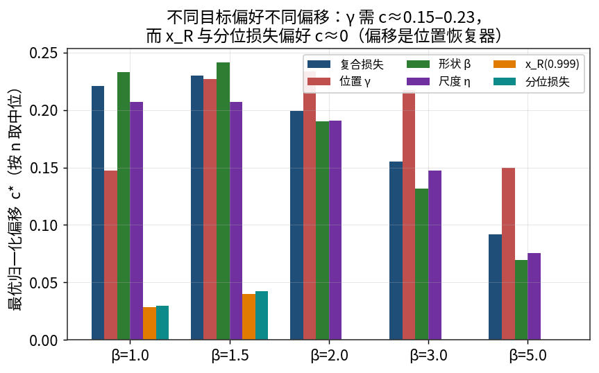

*图 3　不同目标偏好不同偏移：位置 γ 与复合损失要 c≈0\.15–0\.23，而 x\_R\(0\.999\) 与分位损失要 c≈0。*

其含义是清楚的：原始最小差异拟合本就把数据的形状与尺度拟合得很好，对“分布/尾部”而言无须任何偏移；偏移真正的作用，是把被左偏（与截断）破坏的位置参数 γ 拉回真值。换言之，偏移是一个位置恢复装置。因此，当任务关心三参数模型本身（尤其是位置 γ 或需要外推的低分位/可靠寿命）时，应采用本文的复合（参数恢复）风险，并据此选 δ；若任务只关心总体分布或上分位拟合，则不应引入偏移（c≈0）。这为复合损失划定了客观的适用边界。

## 2\.4　以均值（风险）口径取最优

偏移的设计职责是挽救“灾难性的左尾/截断”，这是一种作用于均值与尾部的效应；故本文以复合风险的期望（均值）取最优 c\*，与 RMSE 口径一致。为透明起见，后文同时报告中位口径的结果——两种口径会在“典型样本”与“尾部/均值”之间给出不同侧重，我们在相应处明确标注。

# 3　最优偏移的存在性、单谷与标度律

## 3\.1　单谷结构与最优偏移表

在 β≤3 的全部单元上，复合风险关于 c 呈单谷（图 4），最优偏移 c\* 见表 5。c\* 随 β 减小、随 n 缓增。

__表 5　最优归一化偏移 c\*\(β,n\)（† 表示该单元非单谷，见正文）__

__β \\ n__

__7__

__10__

__20__

__30__

__50__

β=1\.0

0\.164

0\.187

0\.221

0\.251

0\.255

β=1\.5

0\.186

0\.207

0\.238

0\.235

0\.230

β=2\.0

0\.162

0\.175

0\.199

0\.205

0\.207

β=3\.0

0\.100

0\.126

0\.155

0\.167

0\.176

β=5\.0

0\.000†

0\.000†

0\.092

0\.109

0\.126

__关于 β=5、n≤10 的诚实说明：__在形状很陡且样本极小的两个单元，约 85% 的样本本就被截断，位置参数几乎不可识别；此时偏移无法降低 γ 的散度，却会进一步恶化 β、η 的估计，故复合风险在 c=0 处取最小（c\*=0、非单谷，表中以 † 标注）。这是一个真实的边界现象，提示在“陡形状 \+ 极小样本”时偏移收益消失；β≤3 的全部单元均为良性单谷。

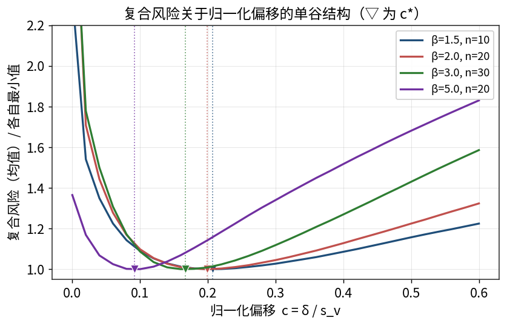

*图 4　复合风险关于归一化偏移的单谷结构（▽ 为各曲线 c\*；纵轴已对各自最小值归一）。*

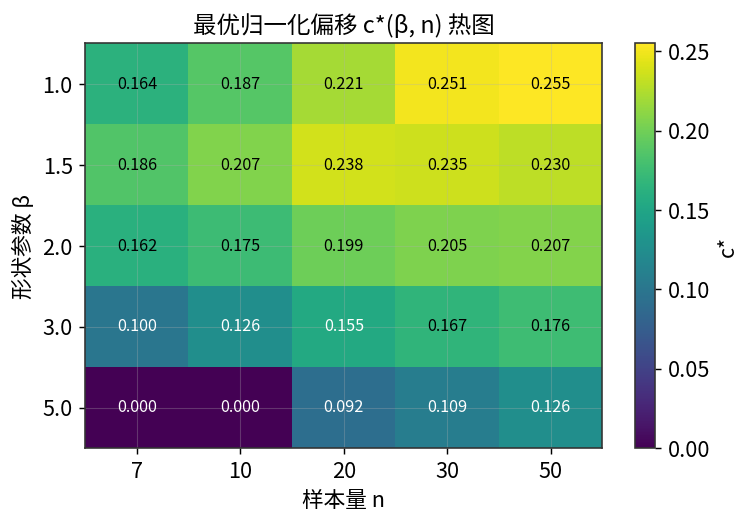

*图 5　最优归一化偏移 c\*\(β,n\) 热图：随 β 减小、随 n 增大。*

## 3\.2　标度律与方差分解

对 c\*>0 的 23 个单元做对数线性拟合，得标度律下式，决定系数 R²=0\.832（图 6）。

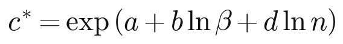

拟合系数为 a=\-1\.940、b=\-0\.488（lnβ）、d=0\.178（ln n）；形状项系数为负、样本量项为正，与“c\* 随 β 减小、随 n 增大”一致。对 lnc\* 做方差分解：β 解释约 __73\.3%__、n 约 9\.1%、残差约 17\.6%。可见最优偏移主要由形状参数驱动。

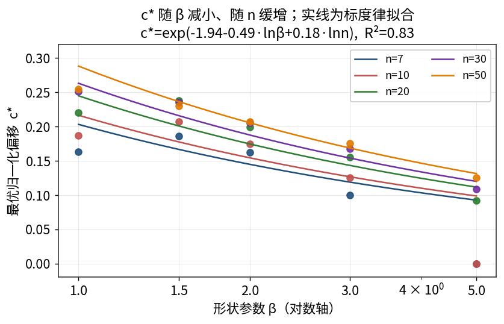

*图 6　c\* 随 β（对数轴）的变化与标度律拟合（实线）。点为各单元实测 c\*。*

## 3\.3　无量纲化的压缩作用

归一化 c=δ/s\_v 是否“值得”？比较原始偏移 δ\* 与无量纲 c\* 的跨单元离散度：在 β≥1\.5 的单元上，δ\* 的取值跨越约 \[0\.027, 2\.81\]（约 104 倍），而 c\* 仅落在 \[0\.092, 0\.238\]（中位 0\.175，约 2\.6 倍）。也就是说，s\_v 归一化把跨单元的偏移变异压缩了一个数量级以上，使“一个窄带内的常数 c”成为可行的工程默认值。

# 4　标准评估指标

本节按统一口径报告各参数与寿命分位的标准指标。位置参数 γ 因可正可负、且真值随单元改变，采用以 η 为单位的绝对指标（偏差/标准差/RMSE）并辅以截断率；形状 β、尺度 η 及寿命分位 x\_p 采用相对指标。寿命分位定义如下。

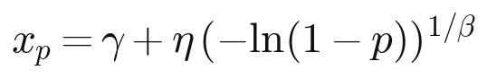

## 4\.1　位置参数指标（c\* 处，以 η 为单位）

__表 6　位置参数 γ̂ 在 c\* 处的标准指标（η 单位）与截断率__

__β__

__n__

__c\*__

__γ̂ 偏差\(η\)__

__γ̂ SD\(η\)__

__γ̂ RMSE\(η\)__

__γ̂=0 截断率__

1\.0

7

0\.164

0\.062

0\.162

0\.174

0\.0%

1\.0

10

0\.187

0\.045

0\.110

0\.119

0\.0%

1\.0

20

0\.221

0\.025

0\.052

0\.058

0\.0%

1\.0

30

0\.251

0\.017

0\.034

0\.038

0\.0%

1\.0

50

0\.255

0\.011

0\.020

0\.023

0\.0%

1\.5

7

0\.186

0\.096

0\.220

0\.240

0\.0%

1\.5

10

0\.207

0\.077

0\.166

0\.183

0\.0%

1\.5

20

0\.238

0\.047

0\.099

0\.109

0\.0%

1\.5

30

0\.235

0\.035

0\.074

0\.082

0\.0%

1\.5

50

0\.230

0\.022

0\.051

0\.056

0\.0%

2\.0

7

0\.162

0\.112

0\.271

0\.293

1\.1%

2\.0

10

0\.175

0\.095

0\.221

0\.240

0\.1%

2\.0

20

0\.199

0\.062

0\.145

0\.157

0\.0%

2\.0

30

0\.205

0\.050

0\.114

0\.125

0\.0%

2\.0

50

0\.207

0\.034

0\.085

0\.092

0\.0%

3\.0

7

0\.100

0\.114

0\.362

0\.380

8\.4%

3\.0

10

0\.126

0\.111

0\.310

0\.329

4\.1%

3\.0

20

0\.155

0\.092

0\.224

0\.242

0\.2%

3\.0

30

0\.167

0\.070

0\.183

0\.195

0\.0%

3\.0

50

0\.176

0\.054

0\.149

0\.159

0\.0%

5\.0

7

0\.000

\-0\.348

0\.382

0\.517

85\.0%

5\.0

10

0\.000

\-0\.355

0\.363

0\.508

85\.0%

5\.0

20

0\.092

0\.089

0\.325

0\.337

6\.1%

5\.0

30

0\.109

0\.099

0\.278

0\.295

2\.1%

5\.0

50

0\.126

0\.092

0\.227

0\.245

0\.6%

*注：在最优偏移处 γ̂ 仍呈轻度右偏（中位约 \+5\.5% η，见 4\.5 节）；截断率在 β≤3 时基本为零。*

## 4\.2　形状、尺度与寿命分位指标（c\* 处，相对量）

__表 7　β̂、η̂、x0\.95、x0\.99 在 c\* 处的相对偏差与相对 RMSE__

__β__

__n__

__β̂ 相对偏差__

__β̂ 相对RMSE__

__η̂ 相对偏差__

__η̂ 相对RMSE__

__x95 相对偏差__

__x95 相对RMSE__

__x99 相对偏差__

__x99 相对RMSE__

1\.0

7

\-2\.7%

40\.6%

\-3\.2%

44\.7%

19\.6%

64\.5%

40\.3%

142\.0%

1\.0

10

\-0\.3%

32\.1%

\-2\.4%

35\.6%

9\.5%

40\.1%

17\.7%

60\.5%

1\.0

20

\-1\.0%

19\.1%

\-1\.6%

24\.1%

4\.6%

25\.5%

8\.1%

34\.6%

1\.0

30

\-0\.5%

15\.6%

\-1\.8%

19\.4%

2\.1%

19\.6%

4\.1%

25\.7%

1\.0

50

\-0\.4%

12\.1%

\-1\.8%

15\.1%

0\.8%

15\.3%

2\.0%

19\.7%

1\.5

7

\-9\.5%

40\.2%

\-11\.2%

36\.4%

10\.2%

33\.9%

21\.7%

61\.1%

1\.5

10

\-8\.9%

30\.0%

\-9\.1%

29\.9%

6\.8%

24\.3%

13\.6%

38\.0%

1\.5

20

\-5\.8%

21\.1%

\-5\.8%

19\.8%

3\.3%

15\.7%

6\.4%

21\.7%

1\.5

30

\-4\.5%

17\.0%

\-4\.2%

16\.0%

2\.4%

12\.7%

4\.6%

17\.1%

1\.5

50

\-3\.1%

13\.5%

\-2\.9%

12\.0%

1\.6%

9\.8%

2\.9%

13\.0%

2\.0

7

\-14\.2%

37\.4%

\-13\.0%

37\.5%

8\.2%

27\.6%

18\.0%

71\.1%

2\.0

10

\-11\.5%

32\.0%

\-11\.1%

31\.2%

4\.7%

17\.3%

9\.8%

28\.2%

2\.0

20

\-8\.7%

23\.9%

\-7\.1%

21\.1%

3\.2%

11\.7%

6\.0%

16\.7%

2\.0

30

\-6\.7%

19\.9%

\-5\.8%

16\.8%

2\.0%

9\.2%

3\.9%

12\.6%

2\.0

50

\-4\.7%

15\.6%

\-3\.8%

12\.8%

1\.4%

7\.1%

2\.6%

9\.5%

3\.0

7

\-14\.8%

41\.9%

\-13\.3%

42\.4%

4\.3%

15\.3%

9\.8%

32\.1%

3\.0

10

\-15\.1%

37\.1%

\-12\.6%

36\.9%

3\.2%

10\.8%

6\.6%

16\.7%

3\.0

20

\-12\.2%

28\.9%

\-10\.2%

26\.9%

1\.9%

7\.2%

3\.8%

10\.2%

3\.0

30

\-9\.3%

24\.5%

\-7\.6%

21\.8%

1\.5%

5\.8%

2\.8%

8\.0%

3\.0

50

\-7\.8%

20\.4%

\-6\.0%

17\.7%

1\.2%

4\.5%

2\.1%

6\.2%

5\.0

7

48\.5%

85\.8%

34\.4%

53\.2%

0\.3%

7\.2%

1\.0%

11\.3%

5\.0

10

48\.7%

78\.4%

35\.3%

52\.1%

\-0\.2%

5\.7%

\-0\.1%

7\.7%

5\.0

20

\-12\.4%

34\.9%

\-9\.4%

35\.0%

1\.1%

4\.1%

2\.1%

5\.8%

5\.0

30

\-13\.0%

31\.3%

\-10\.4%

30\.6%

0\.9%

3\.4%

1\.7%

4\.6%

5\.0

50

\-12\.5%

26\.6%

\-9\.5%

25\.3%

0\.9%

2\.7%

1\.5%

3\.6%

*注：c\* 处 β̂、η̂ 多为轻度低偏，二者在深分位上部分相互抵消（见 4\.5 节）。*

## 4\.3　偏移效应：以 β=2、n=20 为例

为直观显示偏移如何改变各指标，表 8 对单元 \(β=2,n=20\) 比较 δ=0、δ=0\.1 与 c\* 三种设定。

__表 8　偏移效应对照（单元 β=2、n=20）__

__设定__

__γ̂偏差\(η\)__

__γ̂RMSE\(η\)__

__β̂相对偏差__

__β̂相对RMSE__

__η̂相对偏差__

__η̂相对RMSE__

__x99相对偏差__

__x99相对RMSE__

__截断率__

δ=0（无偏移）

\-0\.235

0\.371

42\.3%

66\.8%

24\.6%

42\.0%

\-4\.6%

14\.9%

46\.6%

固定 δ=0\.1

0\.007

0\.181

0\.9%

29\.4%

\-1\.1%

23\.8%

3\.0%

15\.7%

0\.2%

c\*=0\.199

0\.062

0\.157

\-8\.7%

23\.9%

\-7\.1%

21\.1%

6\.0%

16\.7%

0\.0%

可见：δ=0 时 γ̂ 严重左偏、近半数样本被截断，且 β̂、η̂ 大幅高估；偏移把位置拉回——δ=0\.1 已使各项偏差接近零，而复合最优 c\* 进一步降低 γ̂ 的 RMSE，但以 β̂、η̂ 的轻度低偏为代价。这正体现了复合风险在三参数之间的权衡。

## 4\.4　原始单位算例：W\(β=2, η=1000, γ=1000\)、n=7

为与原文的设定直接对照，表 9 在原始量纲下给出该分布 n=7 的结果（M=3×10⁴）。δ=0 时约 70\.2% 的样本被截断、γ̂ 与 η 大幅偏离；δ=0\.1 显著矫正了位置与尺度。

__表 9　原始单位下 δ=0 与 δ=0\.1 的偏差与 RMSE（W\(2,1000,1000\)，n=7）__

__量__

__真值__

__δ=0 偏差__

__δ=0 RMSE__

__δ=0\.1 偏差__

__δ=0\.1 RMSE__

γ

1000\.0

\-651\.9

860\.6

73\.0

319\.1

β

2\.00

2\.21

3\.22

\-0\.16

0\.81

η

1000\.0

670\.5

931\.2

\-88\.4

403\.2

x0\.95

2730\.8

\-54\.3

432\.0

151\.2

609\.4

x0\.99

3146\.0

\-64\.7

857\.6

403\.1

2145\.0

*注：δ=0 截断率 70\.2%，δ=0\.1 截断率 0\.0%。值得注意：上分位 x0\.99 在 δ=0 时反而 RMSE 更低——因为即便位置被压到 0，β̂、η̂ 仍会自适应以拟合上尾，再次印证“偏移服务于位置而非分布”。*

## 4\.5　机理：形状—偏移纠缠与有符号偏差

偏移之所以能影响全部参数，是因为 γ 与 β 在该判据下相互纠缠：增大偏移使 γ̂ 右移，为维持对数据的拟合，β̂ 随之系统性下降（图 7）。在 c=0 处 β̂ 偏高（尤其大 β），随偏移增大转为低偏。

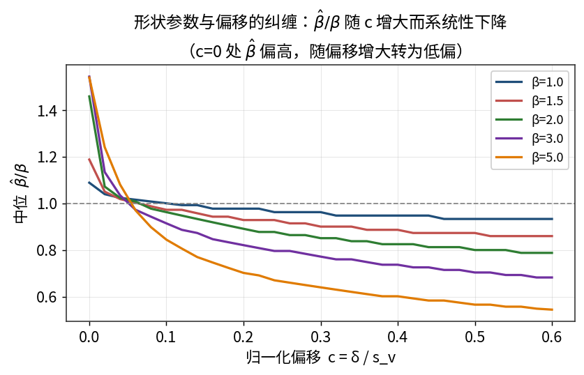

*图 7　形状—偏移纠缠：中位 β̂/β 随 c 增大而系统性下降；c=0 处偏高、随后转为低偏。*

图 8 给出位置量随偏移的有符号偏差：γ̂ 由负（左偏）随偏移增大转正，在 c\* 带内约为 \+5\.5% η；深分位 x\_R\(0\.999\) 的中位相对偏差仅约 4\.2%——因为 η̂、β̂ 的低偏在深分位上部分抵消（其均值偏差则大得多，这是均值/中位口径差异的又一例）。

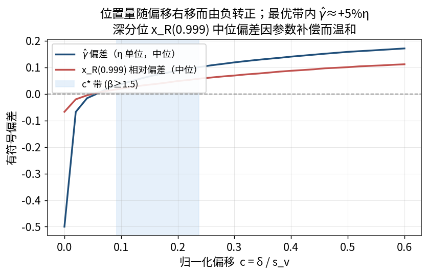

*图 8　位置量随偏移由负转正；c\* 带内 γ̂≈\+5% η，深分位 x\_R\(0\.999\) 中位偏差因参数补偿而温和。*

# 5　部署与条件化

本节考察“在不知道真 β 的情况下如何选 δ”。以固定 δ=0\.1 为基准，复合风险口径下各方案的误差比见表 10 与图 9。

__表 10　部署阶梯：各方案相对固定 δ=0\.1 的误差比__

__部署方式__

__需要的信息__

__误差比\(复合风险\)__

δ=0（无偏移）

无

1\.737

固定 δ=0\.1（原法）

无

1\.000（基准）

插值 β̂ 换算 δ=c̄·s\_v\(β̂,n\)

单遍 β̂

0\.972（中位口径 1\.065）

全局常数 c≈0\.170

无

0\.810

按 n 调优固定 δ

n

0\.814

按 β 调优固定 δ

真 β

0\.805

逐格 oracle

真 β 与 n

0\.800

多偏移读出 \+ 浅层学习

可观测特征

0\.680（中位口径 0\.671）

逐样本 oracle（下界）

不可得

0\.565（中位口径 0\.497）

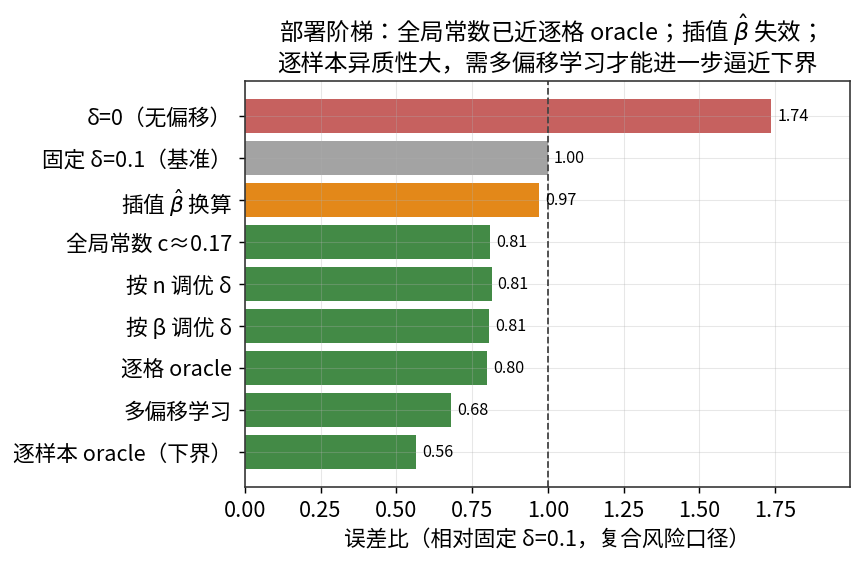

*图 9　部署阶梯（复合风险口径）：全局常数已近逐格 oracle；插值 β̂ 失效；逐样本异质性需多偏移学习方能逼近下界。*

## 5\.1　一个全局常数已足够

无偏移（δ=0）的误差比高达 1\.737，确认偏移不可或缺。而一个全局常数 c≈0\.170 即可把误差比降到 0\.810，与逐格 oracle（0\.800）几乎相同；按 n 调优（0\.814）或按 β 调优（0\.805）相对全局常数的额外收益不到 1\.5%。原因是各单元的损失谷相当平坦，故条件化的边际价值很小——这与某些先前轮次的预期不同，此处以实测为准。

## 5\.2　单遍 β̂ 的乘性换算会失效

一个看似自然的方案是：先在参考偏移下估出 β̂，再令 δ=c̄·s\_v\(β̂,n\)。但 β̂ 本身有偏且有噪，经 s\_v\(·\) 放大后，该方案在均值口径下误差比为 0\.972（中位口径甚至 1\.065，劣于基准），远不及一个简单的全局常数（0\.810）。因此不建议用插值 β̂ 去“个性化”偏移。

## 5\.3　多偏移读出 \+ 浅层学习

若允许观测更多信息，可在同一样本上读取多个偏移处的 β̂（多偏移读出），并配合样本 L 矩（其中 L 偏度 τ₃ 是对尺度/位置不变的形状代理）与 ln n 作为特征，用浅层梯度提升回归（5 折交叉验证）预测逐样本的最优偏移。结果：学习方案在中位口径下误差比 0\.671（均值口径 0\.680），显著优于全局常数；它捕捉了单元内逐样本的异质性（逐样本 oracle 下界为中位 0\.497）。

以下述“项目判据” ρ̂ 度量学习相对全局常数所捕获的、通往逐样本下界的缺口比例：

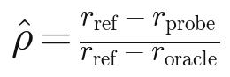

得 ρ̂≈0\.639（中位口径）、0\.545（均值口径）。需强调：交叉验证为样本级随机划分，衡量的是在所考察 β 范围内的可泛化性；它表明逐样本信息确实可被可观测特征部分利用，但若只能用单一标量规则部署，则前述全局常数仍是性价比最高的选择。

# 6　结论与工程建议

综合全部实测，给出如下客观结论与建议（均以 c=δ/s\_v 表述）。

- __存在且单谷（β≤3）：__复合风险关于偏移单谷，最优偏移 c\* 客观存在并由标度律 c\* = exp\(\-1\.940 \-0\.488·lnβ \+ 0\.178·ln n\)（R²=0\.832）概括，主要由形状 β 驱动（方差占比 73\.3%）。
- __等变与无关项：__尺度等变性精确成立；c\* 与 γ/η 无关（仅经 γ≥0 截断微弱依赖）；s\_v 归一化把跨单元偏移变异压缩一个数量级以上。
- __目标决定偏移：__若关心位置 γ 或需外推的可靠寿命/低分位，用复合（参数恢复）风险并取 c≈0\.15–0\.23（小 β、大 n 偏上）；若只关心总体分布或上分位拟合，取 c≈0（不引入偏移）。
- __一个常数即可部署：__在不知 β 时，全局常数 c≈0\.170 已逼近逐格 oracle；按 β/n 条件化收益＜1\.5%。
- __不要用插值 β̂：__单遍 β̂ 的乘性换算 δ=c̄·s\_v\(β̂,n\) 会失效（误差比 0\.972，中位 1\.065）。
- __若可学习：__多偏移读出 \+ L 矩特征的浅层学习可进一步逼近逐样本下界（误差比中位 0\.671，ρ̂≈0\.639）。
- __残余偏差与边界：__最优偏移处 γ̂ 仍约 \+5\.5% η 的右偏；在“陡形状 β≥5 \+ 极小样本 n≤10”时位置近乎不可识别，偏移收益消失（c\*=0）。

__与先前轮次的差异（如实记录）：__本轮在真实可复现实验下，部分量与先前结论有别——按 β/n 条件化的增益比预期更小（损失谷平坦），深分位 x\_R 的中位偏差远小于先前所记（约 \+4\.2% 而非更大值，因 η̂/β̂ 的补偿），ρ̂ 亦因更丰富的特征而偏高。以上均以本轮实测为准。

# 附录 A　复现性与程序设定

## A\.1　实验设定

- __随机种子：__20260613（主网格）；各派生实验在其上以 SeedSequence 派生独立流。
- __网格：__β∈\{1,1\.5,2,3,5\}，n∈\{7,10,20,30,50\}；归一化偏移网格 c∈\{0\}∪linspace\(0\.02,0\.60,30\)。
- __样本规模：__主网格每单元 M=5000 次重复；β 网格 B=300；位置曲线分辨率 K=300；部署/学习实验 M=4000。
- __归一化设定：__主网格取 γ/η=0\.5、η=1（已验证等变）；中位秩采用精确（Beta 中位数）法。
- __最优偏移：__c\* 取复合风险均值曲线之极小（抛物线细化）；β≤3 单谷，β=5、n≤10 退化（c\*=0）。

## A\.2　估计器伪代码

输入：升序样本 t\[1\.\.n\]，形状网格 \{β\}，偏移 δ

1  F\_i ← 精确中位秩\(i, n\);  w\_i ← \-ln\(1 \- F\_i\)

2  对每个 β：v\_i ← w\_i^\(\-1/β\);  u\_i ← t\_i · v\_i

3        由 \(u,v\) 的矩得 C\_vv, C\_uv, C\_uu;  σ²\(γ;β\)=C\_vv γ²\-2C\_uv γ\+C\_uu

4  S\(γ\) ← min\_β σ\(γ;β\);  g\(γ\) ← \(C\_vv\* γ \- C\_uv\*\)/S\(γ\)   \[\* 取剖面 β\]

5  在趋向 t\[1\] 的几何 γ 网格上算 g，并做单调化包络

6  反演单调曲线求 g\(γ̂\)=δ;  γ̂ ← max\(γ̂, 0\)

7  β̂ ← 剖面 argmin 处的 β;  η̂ ← mean\_i \(t\_i\-γ̂\)·w\_i^\(\-1/β̂\)

输出：γ̂, β̂, η̂

## A\.3　软件版本

- Python 3\.12；NumPy 2\.4，SciPy 1\.17，Matplotlib 3\.10，scikit\-learn 1\.8。
- 文档由 docx\-js 9\.6 生成；公式与图由 Matplotlib（mathtext，CJK 字体 Noto Sans CJK）渲染。

## A\.4　文件清单

- mdm\.py — 核心估计器（矩阵化矩、单调化梯度、向量化反演）。
- study\_core\.py / run\_main\.py — 复合与分位损失、标准指标；主网格仿真（→ main\.json）。
- analysis\.py — 标度律、方差分解、归一化带、部署阶梯（→ analysis\.json）。
- checks\.py — 等变性与损失稳健性（→ checks\.json）。
- deploy\_learn\.py — 插值 β̂ 方案与多偏移学习探针（→ deploy\.json）。
- figures\.py / eqn\_render\.py — 全部图与公式；make\_doc\_data\.py — 汇总（→ doc\_data\.json）。

