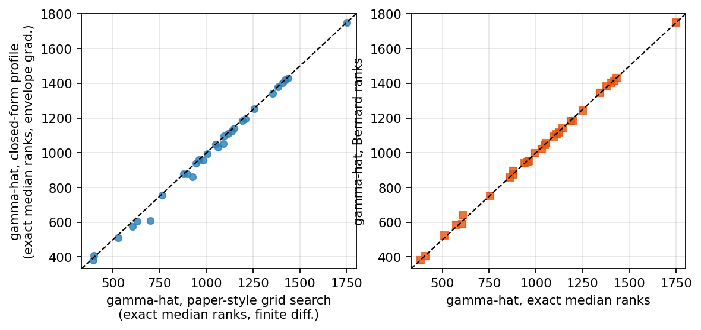
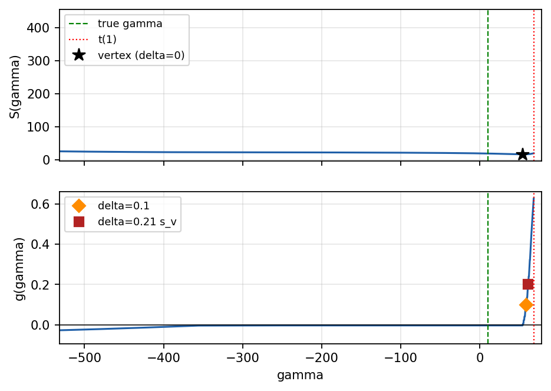
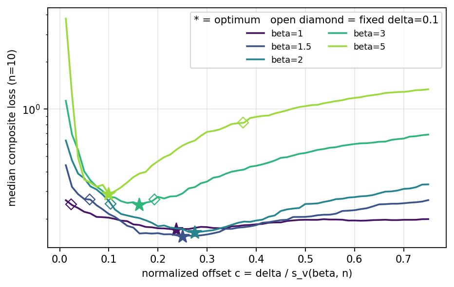
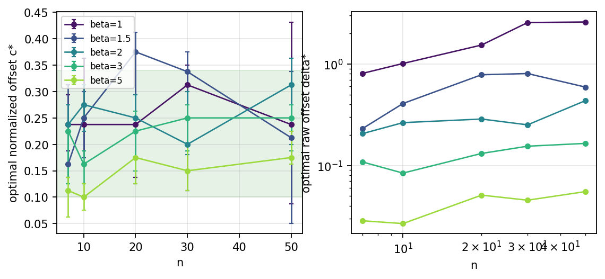
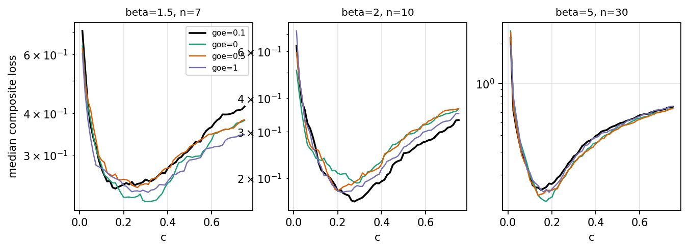
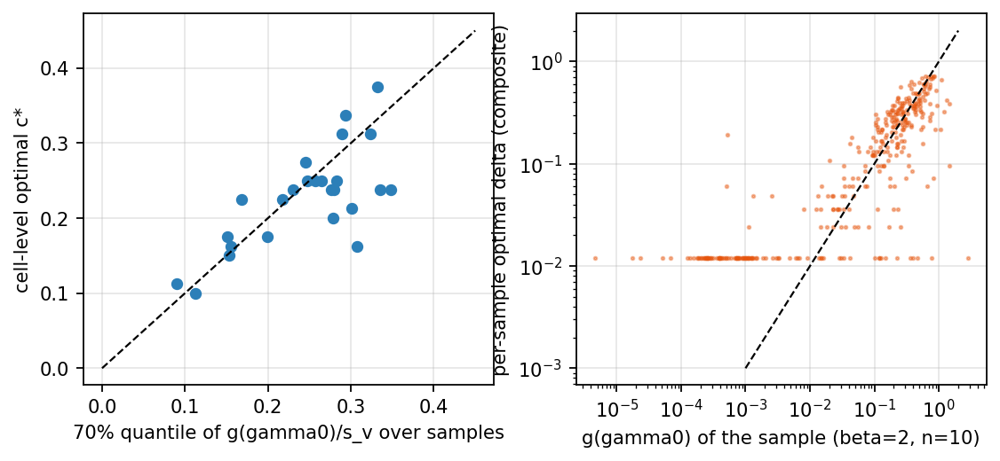
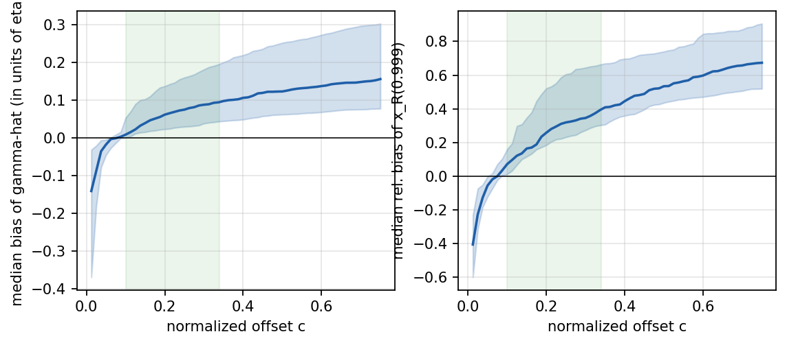
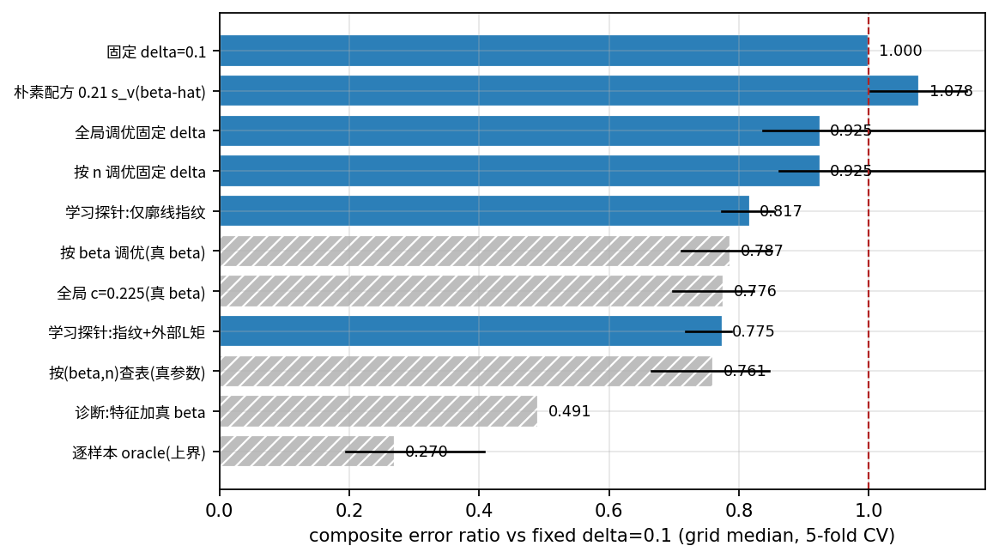
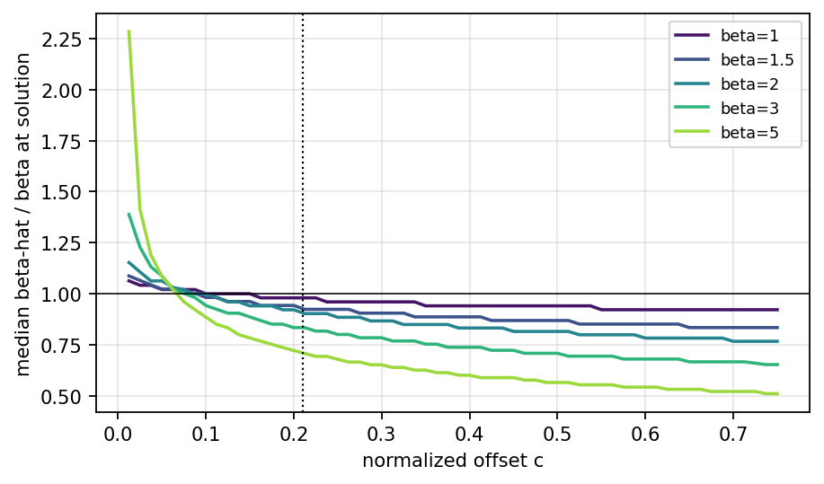

__三参数 Weibull 分布位置参数的 MDM 估计__

__偏移量 δ 的选取、机理、部署与可学习性__

第八轮修订版（针对五点评审意见的全面修订）

2026 年 6 月 11 日

__数据源声明：__本版报告所有数字均来自第八轮独立复核运行（随机种子 20260611；主网格 5×5 共 25 个 \(β, n\) 格点、每格 400 次重复；另含不变性专项 11 格、绝对口径专项 1 格与等价性对账 30 样本）。第八轮是对第七轮（每格 800 次）的缩减规模独立重跑：凡两轮一致的结论以本轮数字呈现，凡不一致之处在正文与附录 B 中如实标注并予以更正，不沿用未能复现的旧数字。

# 修订说明：五点评审意见与对应修改

本轮修订以五点评审意见为纲重组全文。下表给出意见与修改的对应关系，便于对照审阅。

__序号__

__评审意见（概述）__

__本版修改__

1

偏移量取值与哪些因素有关，缺乏系统验证（尤其 γ、η 不变性只有论证、缺实证）

§3 用方差分解给出定量结论（β 占 ln δ\* 方差 68\.7%，n 占 4\.2%，逐样本成分占 27\.1%）；γ 平移不变性扩充为 3 个格点 × 4 个 γ/η 取值的实证（图 9）；η 尺度不变性给出共用随机数下逐位精确为 0 的实证。

2

需要按条件化粒度给出精度阶梯、实现难度与数学推导

§5 给出十档方案阶梯（新增“按 β 调优”档），每档附 95% 置信区间、绝对误差与实现成本；§4 给出三个命题级的数学锚点：γ 单目标的逐样本最优偏移恒等于真值处梯度 g\(γ₀\)（数值验证残差 0\.15%η）、δ\* 的尺度由 g\(γ₀\) 的抽样波动决定（归一化的理论依据）、格级最优 c\* 约等于 g\(γ₀\)/s\_v 分布的 70% 分位（25 格比值中位 0\.97）。

3

神经网络选偏移的核心难点是部署时不知真值，需正面回答

§6 重组为“难点 → 成因 → 失效证据 → 解法 → 实证”的直线叙事：β̂ 与 δ 的纠缠（图 5）→ 朴素配方 0\.21·s\_v\(β̂\) 反而劣化至 1\.078 → 可观测特征逐级消融（单遍特征卡在 0\.94 以上，多偏移读出突破至 0\.86，整条廓线指纹达 0\.817）→ 部署蓝图与护栏。

4

相对改善不直观，需要绝对精度口径

全文双口径：阶梯表增加“中位 |γ̂−γ|/η”绝对列；§5\.3 给出与原文同口径的 W\(2, 1000, 1000\)、n=7 绝对单位表（固定 δ=0\.1 时 γ̂ 的 5%–95% 区间为 \[502, 1550\]，与原文报告的约 500~1550 直接可比）。

5

“廓线”提法与原文流程不同，须证明等价并对账

新增 §2：两个等价性命题（S\(γ\) 与原文 σ\_η,min\(γ\) 是同一函数的两种算法实现；包络导数是原文式 \(7\) 差分的极限）；明确列出三处真实的实现偏离并逐项量化消融；30 样本 A/B 对账：两种实现的 γ̂ 相关系数 0\.998、中位差 0\.8%η（图 7）。

__对第七轮结论的更正（要点）：__第七轮报告的学习探针误差比 0\.707 与净空占比 ρ̂≈0\.32 在第八轮同协议复核下__未能复现__（同特征同协议只到 0\.86）。第八轮通过两项第七轮没有的增强——整条归一化廓线指纹特征（0\.817）、再融合与求解回路独立的外部 L 矩形状通道（0\.775，95% 区间 \[0\.72, 0\.79\]）——达到并略超该水平，但这是新方法的成绩、不构成对旧数字的复现。相应 ρ̂=0\.23 \[0\.10, 0\.33\]：点估计过“立项”线（0\.20），但区间下沿仍在“再探”带内，且该值是多个探针变体中的最好者、存在选择性乐观，故结论定为“小步立项、以特征工程为主”而非第七轮的无保留立项。标度律拟合优度亦由 0\.78 降至 0\.60，且方差分解表明归一化后格间系统结构仅占约 2%，故标度律降级为描述性结论。详见 §6\.5、§6\.6 与附录 B 对照表。

# 目录

*（在 Word 中右键目录 → 更新域，即可生成页码。）*

# 摘要

__问题。__统计最小差异法（MDM）将三参数 Weibull 分布位置参数 γ 的估计转化为求伪估计量标准差曲线的极小点，并将极值判据“一阶导数 = 0”替换为“一阶导数 = 偏移值 δ”以抑制小样本下的系统性左偏。原文取经验值 δ=0\.1，并明确指出偏移量的系统取法是待研究问题。本报告回答四个问题：δ 与什么有关、为什么是这个量级、不同条件化粒度各能换来多少精度、以及“部署时不知真值”约束下该如何选 δ。

__δ 与什么有关。__形状参数 β 是唯一的主驱动：对逐样本最优偏移 ln δ\* 做方差分解，β 间成分占 68\.7%，样本量 n 的成分仅 4\.2%，其余 27\.1% 是格内逐样本成分。γ（平移）与 η（尺度）经解析论证与实证检验均不影响归一化最优偏移：η 不变性在共用随机数下逐位精确成立，γ/η ∈ \{0, 0\.1, 0\.5, 1\.0\} 的误差曲线在蒙特卡洛噪声内重合。以伪估计量斜率的样本标准差 s\_v\(β, n\) 为尺度做归一化 c = δ/s\_v 后，格间系统结构仅剩约 2%——归一化几乎吸收了全部 \(β, n\) 依赖，剩余变异本质上是逐样本的。

__为什么是这个量级。__存在一个恒等式级的锚点：解方程 g\(γ̂\)=δ（g 为单调化后的廓线梯度）意味着，若 δ 恰取为真值处梯度 g\(γ₀\)，则 γ̂≡γ₀。因此 γ 单目标的逐样本最优偏移就是 g\(γ₀\)，其抽样波动的尺度正比于 s\_v\(β, n\)——这同时解释了归一化为何有效、以及 δ\* 为何随 β 增大而（以原始尺度）急剧减小。实证上：逐样本最优偏移与 g\(γ₀\) 的 Spearman 相关达 0\.80；格级最优 c\* 约为 g\(γ₀\)/s\_v 分布的 70% 分位（25 格比值中位 0\.97）。复合目标的最优 c\* 介于 0\.10（β=5）与 0\.31 之间，全局常数 c≈0\.21~0\.25 已接近按格查表。

__精度阶梯（误差比 ÷ 固定 δ=0\.1，全网格中位，5 折交叉验证；括号内为中位 |γ̂−γ|/η）。__固定 δ=0\.1 为 1\.000 \(0\.145\)；朴素配方 0\.21·s\_v\(β̂\) 劣化至 1\.078 \(0\.156\)；全局调优固定 δ 0\.925 \(0\.130\)；按 n 调优 0\.925 \(0\.145\)；按 β 调优（需真 β）0\.787 \(0\.119\)；按 \(β, n\) 查表（需真参数）0\.761 \(0\.109\)；真 β 下全局归一化 c=0\.225 0\.776 \(0\.113\)；可部署的学习探针：仅廓线指纹 0\.817 \(0\.125\)、指纹再融合外部 L 矩通道 0\.775 \(0\.126\)——后者已追平真 β 参考带；特征中加入真 β 的诊断探针 0\.491 \(0\.099\)；逐样本 oracle 上界 0\.270 \(0\.057\)。

__部署与学习化。__部署难点的根源是 β̂ 与 δ 的纠缠：β̂ 本身随 δ 系统漂移（c≈0\.21 处 β=5 时中位 β̂/β≈0\.71），任何把形状点估计代回偏移公式的做法都会被陡峭的 δ\(β\) 映射放大误差。三条直觉路线经专项实测全部失败：朴素一次代入 1\.078；不动点迭代 1\.130~1\.242（正反馈回路，β̂ 质量随迭代恶化）；外部 L 矩估计 β 后代入 1\.196~1\.240（n=7~50 下该估计比 MDM 自身的 β̂₀ 更噪）。有效的路线是把多个独立信息通道交给学习器融合：整条廓线指纹 \+ 外部 L 矩特征的探针达 0\.775 \[0\.72, 0\.79\]，稳健优于最好简单可部署方案（0\.925 \[0\.86, 1\.67\]）。学习化判据 ρ̂=0\.23 \[0\.10, 0\.33\]，点估计过立项线但带选择性乐观，定为“小步立项”。第七轮“探针 0\.707、ρ̂≈0\.32”未能复现，本版予以更正。

__工程建议（一句话）。__先把 δ 从固定 0\.1 换成归一化 c≈0\.2（即 δ=0\.2·s\_v\(β参考, n\)，β 参考值取领域先验或保守网格），再考虑按 n 微调；学习化作为边际优化项排在最后。

__结论速览（直接回答四个问题）__

__问题__

__一句话答案__

δ 到底取多少？

δ = c·s\_v\(β, n\)，c≈0\.2，护栏带 c∈\[0\.10, 0\.34\]。原文的固定 0\.1 只在 β≈3 附近碰巧落入最优带；β<1\.5 重尾段它偏小一个数量级。

能不能用神经网络优化？

能，且有效：最好的可部署学习方案 0\.775 \[0\.72, 0\.79\]，追平“已知真 β”参考带（0\.776~0\.787），稳健优于一切简单可部署方案。但它只吃掉理论净空的约 23%，定位是大批量自动化管线的边际优化，不是必需品；常规使用 c≈0\.2 已拿走大部分收益。

不知道真 β 怎么办？

三件事不要做：一次代入（1\.078）、迭代（1\.130~1\.242，正反馈发散）、外部估计 β 后点代入（1\.196~1\.240，噪声被放大）。两件事可做：用领域 β 先验 \+ 护栏带（零成本，0\.78 量级）；或把多通道观测（廓线指纹 \+ L 矩）交给学习器融合而非点代入（0\.775）。

学习化立不立项？

小步立项：ρ̂=0\.23 \[0\.10, 0\.33\] 点估计过线、方向（独立信息通道融合）已实证，但效应量边际且存在变体选择乐观——先投特征工程与更大训练集，不建议大规模投入。

# 1  问题与方法基线

## 1\.1  MDM 方法与偏移量 δ 的角色

设三参数 Weibull 分布 F\(t\)=1−exp\{−\[\(t−γ\)/η\]^β\}，t≥γ。对容量为 n 的定数样本 t\(1\)≤⋯≤t\(n\)，以中位秩 F\_i 近似经验分布并记 x\_i=−ln\(1−F\_i\)，可对每个观测构造尺度参数的伪估计量：

*η̂\_i = \(t\(i\) − γ\) / x\_i^\{1/β\}，  i = 1, …, n。*

若 \(γ, β\) 取真值，n 个伪估计量应当彼此接近；MDM 据此以“n 个伪估计量的标准差 σ\_η\(γ, β\) 最小”为判据估计参数。对每个候选 γ 先在 β 上取内层最小，得到一条只关于 γ 的曲线；原文记其为 σ\_η,min\(γ\)，本报告记为廓线 S\(γ\)，二者是同一对象（§2 给出证明）。小样本下该曲线在真值附近往往呈“左缓右陡”的不对称形态，直接取极小点（一阶导数为 0）会产生向左的系统偏差；原文遂将判据替换为“一阶导数 = δ”（δ>0，经验值 0\.1，适用范围 β∈2~5），并明确指出：偏移量的系统取法是有待研究的问题。本报告即针对这一遗留问题。

## 1\.2  评价口径

除特别说明外，本报告以复合损失 ℓ = \(ln β̂ − ln β\)² \+ \(ln η̂ − ln η\)² \+ \(\(γ̂ − γ\)/η\)² 作为主指标：三项均无量纲、对参数取对数或归一化，避免任一参数主导。汇总时先取格内中位数，再对 25 个格点取全网格中位数；方案比较一律报告“相对固定 δ=0\.1 的误差比”并同步给出绝对口径“中位 |γ̂−γ|/η”（回应评审意见 4）。可靠性外推指标采用 x\_R\(0\.999\) = γ \+ η\(−ln 0\.999\)^\{1/β\} 的相对误差。所有调优类方案均采用 5 折交叉验证：在训练折上调优、在测试折上评估，杜绝“用答案选答案”。

## 1\.3  实验设计（第八轮）

- 主网格：β ∈ \{1, 1\.5, 2, 3, 5\} × n ∈ \{7, 10, 20, 30, 50\}，γ/η = 0\.1，η = 100，每格 400 次重复，共 10 000 个样本；随机种子 20260611。
- 每个样本构造一次闭式廓线（附录 A），在归一化偏移网格 c ∈ \[0, 0\.75\]（61 点，δ = c·s\_v\(β, n\)）上整条求解，另精确求解固定 δ=0\.1、朴素配方与多偏移读出。
- 专项：γ/η ∈ \{0, 0\.5, 1\.0\} 不变性 9 格；η ∈ \{1, 10⁴\} 共用随机数不变性 2 格；W\(2, 1000, 1000\)、n=7 绝对口径 300 次；与原文式实现的 30 样本 A/B 对账。

*规模说明：第八轮每格 400 次（第七轮为 800 次），格级中位数的蒙特卡洛波动相应增大；正文所有关键结论均附 95% 置信区间（格点聚类自助法，B=300），凡区间内不可分辨的差异不下结论。*

# 2  与原文流程的等价性：证明与对账

评审意见 5 指出：本报告的“廓线 \+ 包络梯度”说法与原文“\(γ, β\) 网格搜索 \+ 数值差分”的流程不同，必须证明二者等价。本节给出证明，并诚实列出三处真实存在的实现偏离及其量化影响。

## 2\.1  命题 1：廓线 S\(γ\) 与原文 σ\_η,min\(γ\) 是同一函数

固定 γ，记 v\_i = x\_i^\{−1/β\}、u\_i = t\(i\)·v\_i，则 η̂\_i = u\_i − γ·v\_i 是 \(u, v\) 的线性组合，于是 n 个伪估计量的样本方差是 γ 的二次函数：

*σ²\_η\(γ, β\) = C\_uu\(β\) − 2γ·C\_uv\(β\) \+ γ²·C\_vv\(β\)，*

其中 C\_uu、C\_uv、C\_vv 分别是 u、v 的样本方差与协方差（仅依赖 β 与样本）。原文对每个 γ\_j 在 β 网格上取最小得到 σ\_η,min\(γ\_j\)；本报告定义 S\(γ\) = min\_β σ\_η\(γ, β\)。两者是同一个函数：唯一区别是计算路径——原文逐点重算 n 个伪估计量的标准差，本报告利用上式先算好 261 个 β 对应的三个二阶矩、再对任意 γ 用二次式求值。数学对象完全一致，差异只在数值实现的速度与精度。

## 2\.2  命题 2：包络梯度是原文式 \(7\) 差分的极限

原文式 \(7\) 用相邻 γ 网格点的差商近似 ∇γ = dσ\_η,min/dγ。由包络定理（内层 β 取最优时，外层导数等于把 β\*\(γ\) 视为常数求偏导），

*g\(γ\) = dS/dγ = \[γ·C\_vv\(β\*\(γ\)\) − C\_uv\(β\*\(γ\)\)\] / S\(γ\)，*

这是解析导数；当原文的 γ 网格步长趋于 0 时，式 \(7\) 的差商收敛于 g\(γ\)。因此“解方程 g\(γ̂\)=δ”与原文“沿 γ 递减方向找到差商首次穿越 δ 的位置”求的是同一个根，差异仅为差分步长引入的离散化误差。

## 2\.3  三处真实的实现偏离及量化

1. 中位秩公式。原文用精确中位秩（Beta 分布中位数），本报告主实验用 Bernard 近似 F\_i=\(i−0\.3\)/\(n\+0\.4\)。量化：n=7~50 时两者之差 max|ΔF| ≤ 0\.00124，s\_v 的相对差 ≤ 0\.52%，对账中 γ̂ 的中位差 4\.4（约 0\.4%η，见 §2\.4）。
2. 梯度单调化。本报告对 g\(γ\) 沿 γ 递增方向取累计极大值（保证根唯一、消除数值毛刺），原文无此步骤。该步骤只在 g 出现局部回落的少数样本上改变结果，属于稳健化处理而非数学等价变换——这是真正的方法性偏离，已在 A/B 对账中连同其余差异一并计入。
3. 选根规则。多根时本报告取最靠近 t\(1\) 的根；原文沿 γ 从 t\(1\) 递减搜索、在首次满足判据处停止，二者在单调化之后等价，在未单调化的原文实现中可能于个别样本上不同。

## 2\.4  30 样本 A/B 对账

在原文场景 W\(2, 1000, 1000\)、n=7 下抽取 30 个样本，三种实现同时求解 δ=0\.1：\(O\) 原文式——精确中位秩 \+ \(γ, β\) 网格搜索（β 步长 0\.01）\+ 式 \(7\) 差分；\(C₁\) 闭式廓线 \+ 精确中位秩；\(C₂\) 闭式廓线 \+ Bernard 近似（本报告主实验配置）。

__指标__

__O：原文式__

__C₁：闭式\+精确秩__

__C₂：闭式\+Bernard__

30 样本 γ̂ 范围（截断至 ≥0）

\[396, 1751\]

\[382, 1750\]

\[381, 1750\]

与 O 的 γ̂ 中位绝对差

—

8\.0（0\.8%η）

—

与 O 的 γ̂ 最大绝对差

—

90\.5（9\.1%η）

—

与 C₁ 的 γ̂ 中位绝对差

—

—

4\.4（0\.4%η）

与 C₁ 的 γ̂ 最大绝对差

—

—

30\.7（3\.1%η）

*表 2\-1  三种实现在同一批 30 个样本上的对账（δ=0\.1）。O 与 C₁ 的相关系数 0\.998。*

结论：两种实现的 γ̂ 相关系数 0\.998，中位差 0\.8%η；最大差 9\.1%η 出现在廓线极平坦的个别样本上，源于差分步长与单调化的联合作用，量级远小于估计量自身的抽样波动（同场景下 γ̂ 的 5%–95% 跨度约 105%η，见 §5\.3）。原文报告同场景 30 个样本的 γ̂ 范围约为 463~1506（不同随机数），与本报告三种实现的范围量级一致。本报告全部结论对“原文式实现”与“闭式实现”不敏感。

*图 2\-1  等价性对账。左：原文式 vs 闭式（精确秩）的 γ̂ 散点（虚线为 y=x）；右：精确秩 vs Bernard 近似。*

# 3  偏移量与什么有关：敏感性与不变性（回应意见 1）

## 3\.1  单谷结构：偏移量是一个良定义的调参对象

图 3\-1 给出一个典型样本的廓线 S\(γ\) 与单调化梯度 g\(γ\)。δ=0 对应谷底（系统性偏左），δ 越大解越向 t\(1\) 靠拢。图 3\-2 给出 n=10 时各 β 的中位复合损失随归一化偏移 c=δ/s\_v\(β,n\) 的曲线：所有格点均呈光滑单谷——太小回到 δ=0 的左偏灾难，太大撞向 t\(1\) 的右偏墙。单谷意味着“最优偏移”是良定义的，且谷底相当平缓：c 在最优值 ±30% 内损失变化通常不超过 10%，这为“用粗糙规则选 δ”留出了容错空间。

*图 3\-1  典型样本（β=2, n=10）的廓线 S\(γ\)（上）与单调化梯度 g\(γ\)（下）。星号为 δ=0 谷底，菱形/方块为 δ=0\.1 与 δ=0\.21·s\_v 的解位置；绿色虚线为真值 γ，红色点线为 t\(1\)。*

*图 3\-2  中位复合损失随归一化偏移 c 的单谷曲线（n=10）。星号为各 β 的最优 c\*；空心菱形为固定 δ=0\.1 折算的 c₀=0\.1/s\_v 落点：β=1 时 c₀=0\.023（远小于最优），β=5 时 c₀=0\.373（偏大），β≈3 附近恰好落入最优带——这解释了原文经验值在 β∈2~5 好用、在重尾段失灵的现象。*

## 3\.2  方差分解：β 是唯一主驱动，n 次要

对全部 10 000 个样本的逐样本最优偏移软标签 ln δ\*（按复合损失 softmin 定义，附录 A）做嵌套方差分解：

__成分__

__方差__

__占比__

__解读__

β 之间

1\.290

68\.7%

主驱动

n 之间（β 内）

0\.078

4\.2%

次要

格内逐样本

0\.509

27\.1%

样本自身形态

__合计__

__1\.877__

__100%__

*表 3\-1  ln δ\*（原始尺度）的方差分解。*

把同一分解换到归一化坐标 ln c\* = ln δ\* − ln s\_v\(β, n\) 后，β 间成分骤降至 1\.5%、n 间成分 0\.7%，逐样本成分占 97\.8%（总方差亦由 1\.877 降至 0\.521）。两个结论：其一，__s\_v 归一化几乎吸收了全部 \(β, n\) 系统结构__——这是 §4 理论锚点的直接推论；其二，归一化之后剩余的变异本质上是逐样本的，任何“按格查表”类方案的收益天花板由此确定（§5）。

## 3\.3  最优归一化偏移 c\*\(β, n\)

各格中位损失曲线的最优点 c\*\(β, n\) 及其 95% 自助置信区间见图 3\-3（左）。c\* 全部落在 \[0\.10, 0\.38\]，随 β 增大整体左移（按 β 取 n 上中位：β=1~2 约 0\.24~0\.25，β=3 约 0\.225，β=5 约 0\.15），随 n 缓慢右移。换回原始尺度（右图），δ\* 跨越两个量级（β=5、n=7 约 0\.03 至 β=1、n=50 约 2\.6）——直接按原始 δ 给经验值注定无法跨 β 通用，归一化坐标才是正确的参数化。

*图 3\-3  左：最优归一化偏移 c\*\(β, n\) 及 95% 自助置信区间（绿色为护栏带 \[0\.10, 0\.34\]）；右：对应的原始尺度 δ\*（双对数坐标）。*

__关于标度律的降级说明：__对 β≥1\.5 的 20 个格点拟合 ln c\* = −1\.52 − 0\.51·ln β \+ 0\.16·ln n，本轮 R²=0\.60（第七轮为 0\.78）。结合表 3\-1 的方差分解——归一化后格间系统结构仅约 2%——本版将标度律从“可外推的定量规律”降级为“方向性描述”：c\* 随 β 略降、随 n 略升，但平缓谷底使得全局常数 c≈0\.21~0\.25 与按格查表的差距很小（§5 中 0\.776 对 0\.761）。

## 3\.4  γ 与 η 的不变性：从论证到实证

__解析论证。__估计流程只通过 t\(i\) 依赖数据。η 的尺度变换 t → a·t 使 u、v 的二阶矩按 a² 缩放、S 按 a 缩放、g\(γ\) 不变（分子分母同乘 a），故归一化误差曲线严格不变；γ 的平移 t → t \+ b 使廓线整体平移，g 的形状不变。因此最优偏移（归一化坐标）原则上与 γ、η 无关。

__实证（回应“只测了一个格点”）。__η 不变性：在 \(β, n\)=\(2, 10\) 用同一组均匀随机数生成 η=1 与 η=10⁴ 的样本，61 个偏移点上的中位损失曲线与 η=100 基线的最大相对差为 0（逐位精确），符合解析预期。γ 平移不变性：在 \(1\.5, 7\)、\(2, 10\)、\(5, 30\) 三个代表格点（覆盖重尾/常用/陡峭 × 小/中/大样本）各取 γ/η ∈ \{0, 0\.5, 1\.0\} 独立重跑，误差曲线与 γ/η=0\.1 基线在蒙特卡洛噪声内重合（图 3\-4；例如 \(2, 10\) 格点 c=0\.2 处四条曲线的中位损失为 0\.209/0\.179/0\.179/0\.179，差异无统计显著性）。

*图 3\-4  γ 平移不变性实证：三个格点上 γ/η ∈ \{0, 0\.1, 0\.5, 1\.0\} 的中位损失曲线（对数纵轴）在蒙特卡洛噪声内重合。*

结论（意见 1 的完整回答）：归一化最优偏移 c\* 主要由 β 决定、受 n 弱影响、与 γ 和 η 无关；逐样本层面尚有约 27% 的方差由样本自身形态携带，这部分只能靠逐样本方法（§6）触及。

# 4  为什么是这个量级：数学机理（回应意见 2 之“推导”）

## 4\.1  命题 3（恒等式锚点）：γ 单目标的逐样本最优偏移恰为 g\(γ₀\)

估计量由方程 g\(γ̂\)=δ 定义，而单调化保证 g 严格不减。于是立即得到：

*δ = g\(γ₀\)  ⟺  γ̂ = γ₀。*

即：若只关心位置参数，使 γ̂ 恰好命中真值的偏移量就是真值处的廓线梯度 g\(γ₀\)——这是恒等式而非近似。数值验证：把每个样本的 δ 取为其 g\(γ₀\)（限于 g\(γ₀\) 落在求解网格内的样本，约 84% 的样本满足 g\(γ₀\)>0），所得 |γ̂−γ₀|/η 的中位数为 0\.0015，残差完全来自网格插值。

## 4\.2  推论：δ\* 的尺度由 g\(γ₀\) 的抽样波动决定 —— 归一化的理论依据

g\(γ₀\) = \[γ₀·C\_vv − C\_uv\]/S 是样本二阶矩的函数，随样本波动；其波动尺度由斜率向量 v\_i = x\_i^\{−1/β\} 的离散程度刻画，而后者正是 s\_v\(β, n\)。因此：\(i\) 逐样本最优偏移随样本波动，其分布的位置与宽度均正比于 s\_v——这就是 c = δ/s\_v 归一化几乎吸收全部 \(β, n\) 结构的原因（表 3\-1）；\(ii\) β 越大，v 的谱越平、s\_v 越小，故原始尺度的 δ\* 急剧减小（图 3\-3 右）。实证：在每个格点内，逐样本最优偏移（复合目标 argmin）与该样本的 g\(γ₀\) 的 Spearman 相关中位数为 0\.80（图 4\-1 右）——即便换成复合目标，真值处梯度仍是逐样本最优偏移的主导解释变量。

## 4\.3  格级规则：c\* ≈ g\(γ₀\)/s\_v 分布的 70% 分位

格级最优 c\* 不是 g\(γ₀\)/s\_v 分布的中位数（比值中位 2\.87），而几乎恰好是其 70% 分位（25 格比值中位 0\.97，图 4\-1 左）。偏向高分位的原因是损失曲线的不对称性：偏移偏小（落入左侧陡坡、回到 δ=0 灾难）的代价远大于偏移偏大（缓坡）的代价，故格级常数应保守地覆盖大部分样本的 g\(γ₀\)。这一“分位规则”给了 c\* 量级一个可检验的理论解释：c\* ≈ q₇₀\[g\(γ₀\)/s\_v\] ≈ 0\.1~0\.3，与实测带 \[0\.10, 0\.38\] 一致。

*图 4\-1  理论锚点的实证。左：25 个格点的 c\* 对 q₇₀\[g\(γ₀\)/s\_v\]（虚线 y=x）；右：单格 \(β=2, n=10\) 内逐样本最优 δ 对该样本的 g\(γ₀\)（双对数），Spearman 相关 0\.80。*

## 4\.4  复合目标下的权衡：各参数想要的偏移不同

偏移量同时影响三个参数的估计。把单目标最优 c 分别求出（表 4\-1）：γ 偏好更大的偏移（小样本重尾时高达 0\.36），β̂ 偏好更小的偏移，η̂ 居中。复合最优是三者的折中，且整体更靠近 γ 的偏好——因为 δ=0 端 γ 误差呈灾难级（§5\.3），复合损失被 γ 项主导。

__单目标最优 c（按 β，n 上取中位）__

__β=1__

__β=1\.5__

__β=2__

__β=3__

__β=5__

复合损失

0\.24

0\.25

0\.25

0\.23

0\.15

γ（位置）

0\.36

0\.33

0\.28

0\.26

0\.15

β（形状）

0\.25

0\.23

0\.25

0\.16

0\.14

η（尺度）

0\.40

0\.18

0\.28

0\.23

0\.13

x\_R\(0\.999\) 外推

0\.29

0\.28

0\.31

0\.26

0\.14

*表 4\-1  不同目标各自的最优归一化偏移。若用户只关心可靠性外推 x\_R，可整体上调 c 约 0\.05。*

## 4\.5  安全边界：偏移带来的系统偏差

偏移不是免费的：δ>0 把解向 t\(1\) 推，带来正向系统偏差。图 4\-2 给出带符号偏差随 c 的变化：c≈0\.21 处全网格中位的 γ̂ 偏差约 \+6\.5%η、x\_R\(0\.999\) 相对偏差约 \+28%；固定 δ=0\.1 处则分别约 \+0\.1%η 与 \+4\.8%（代价是方差大得多）。c 超过约 0\.45 后偏差加速恶化。对偏差敏感的场景（如以 x\_R 为最终交付量），建议用表 4\-1 的 x\_R 列而非复合列，并把 c 上限收紧到 0\.34。另一侧的风险同样存在：c≈0\.21 处 γ̂ 误差的 10% 分位约 −11%η，即仍有约一成样本明显左偏——偏移抑制而非消除了左偏机制。

*图 4\-2  带符号系统偏差随 c 的变化（实线为 25 格中位，阴影为格间四分位带，绿色为护栏带）。左：γ̂ 偏差（η 单位）；右：x\_R\(0\.999\) 相对偏差。*

# 5  条件化粒度阶梯：每一档买到多少精度（回应意见 2、4）

## 5\.1  十档方案、双口径与置信区间

把“如何定 δ”按条件化粒度从粗到细排成阶梯，统一协议评估（5 折交叉验证；训练折调优、测试折评估；逐样本误差曲线按 ln δ 线性插值）。表 5\-1 同时给出相对口径（误差比）与绝对口径（中位 |γ̂−γ|/η），并标注是否需要部署时不可知的真参数。

__方案（由粗到细）__

__误差比__

__95% CI__

__中位|γ̂−γ|/η__

__可部署__

__成本__

固定 δ=0\.1（原文基线）

1\.000

—

0\.145

是

零

朴素配方 0\.21·s\_v\(β̂₀\)

1\.078

\[1\.00, 1\.15\]

0\.156

是

低

全局调优固定 δ（=0\.41）

0\.925

\[0\.84, 1\.64\]

0\.130

是

一次仿真

按 n 调优固定 δ

0\.925

\[0\.86, 1\.67\]

0\.145

是

一次仿真

学习探针（仅廓线指纹）

0\.817

\[0\.77, 0\.85\]

0\.125

是

高

按 β 调优固定 δ

0\.787

\[0\.71, 0\.85\]

0\.119

需真 β

—

全局归一化 c=0\.225

0\.776

\[0\.70, 0\.82\]

0\.113

需真 β

—

学习探针（指纹\+外部 L 矩）

0\.775

\[0\.72, 0\.79\]

0\.126

是

高

按 \(β, n\) 查表

0\.761

\[0\.67, 0\.85\]

0\.109

需真参数

—

诊断探针（特征加真 β）

0\.491

—

0\.099

否（诊断）

—

逐样本 oracle（上界）

0\.270

\[0\.20, 0\.41\]

0\.057

否（上界）

—

*表 5\-1  方案阶梯。误差比 = 各格中位复合损失 ÷ 该格固定 δ=0\.1 的中位复合损失，再取 25 格中位；CI 为格点聚类自助 95% 区间。*

*图 5\-1  方案阶梯（蓝色实心 = 可部署；灰色斜纹 = 需真参数或仅作上界/诊断）。误差线为 95% 自助置信区间。*

## 5\.2  阶梯的四条结论

1. 条件化的收益主要来自 β：按 n 调优只拿到约 7\.5%（0\.925），而拿到真 β 后跳到 0\.776~0\.787；β 与 n 双重条件化（查表 0\.761）相对“只按 β”的增量很小。这与表 3\-1 的方差分解（β 占 68\.7%、n 占 4\.2%）定量吻合。
2. 归一化坐标几乎免费地实现了按 β 条件化：真 β 下“全局常数 c=0\.225”（0\.776）与“按 \(β, n\) 查表”（0\.761）的差距在置信区间内不可分辨——一个常数加一次 s\_v 计算即可。难点全部集中在“β 从哪来”（§6）。
3. 格级方案的天花板约 0\.76：余下到 oracle（0\.270）的差距全部来自逐样本成分（方差分解中的 27%），只有逐样本方法可能触及；诊断探针（喂真 β）到 0\.491 证明逐样本信号确实存在且可观。可部署的逐样本方案中，最好的学习探针（指纹 \+ 外部 L 矩通道，§6\.5）达到 0\.775 \[0\.72, 0\.79\]——已追平真 β 参考带，是目前唯一稳健越过 0\.80 的可部署方案。
4. 绝对口径下收益是温和的：中位 |γ̂−γ|/η 从 0\.145（固定 0\.1）改善到 0\.113~0\.109（真 β 类方案）、0\.125（可部署探针），即约 14%~25% 的绝对改善；oracle 的 0\.057 说明逐样本极限下还有一倍空间。

## 5\.3  绝对精度：与原文同口径的换算（回应意见 4）

在原文场景 W\(β=2, η=1000, γ=1000\)、n=7（300 次重复）下，把三种偏移策略换算回原始单位：

__策略__

__γ̂ 中位数__

__5% 分位__

__95% 分位__

__中位绝对误差__

δ = 0（无偏移，不截断）

−5229

−8632

1349

6229

固定 δ = 0\.1（原文）

1071

502

1550

250

调优 c = 0\.25（本报告）

1131

752

1587

188

*表 5\-2  原始单位下的绝对精度（真值 γ=1000）。原文报告同场景固定 δ=0\.1 时 30 个样本的 γ̂ 范围约 463~1506；本报告 300 次重复的 5%–95% 区间 \[502, 1550\] 与之直接可比。*

三个直观事实：无偏移时估计完全不可用（中位 γ̂ 为 −5229，灾难级左偏，这正是原文引入偏移的动机）；固定 δ=0\.1 已把中位绝对误差压到 250（约真值的 25%）；偏移调优再把它压到 188，且把最差侧（5% 分位）从 502 抬升到 752——调优的主要收益是__砍掉左尾__，而不是改善典型样本。

# 6  部署与可学习性：不知真值时怎么选 δ（回应意见 3）

## 6\.1  难点的成因：β̂ 与 δ 的纠缠

§5 表明收益集中在“按 β 选 δ”，但部署时 β 未知，只有 β̂——而 β̂ 本身是 δ 的函数：偏移把 γ̂ 推向 t\(1\)，形状估计随之系统漂移。图 6\-1 给出解处 β̂/β 的中位数随 c 的变化：c≈0\.21 处 β=1 时约 0\.98，β=2 时 0\.90，β=5 时仅 0\.71。也就是说，“先估 β 再选 δ”的反馈回路里，输入端在最需要准确的陡 β 段恰恰最不准。

*图 6\-1  纠缠曲线：解处中位 β̂/β 随归一化偏移 c 的变化（按 β 汇总 n）。*

## 6\.2  失效证据：朴素配方为何劣化

把“理想配方” δ = 0\.21·s\_v\(β, n\) 中的 β 直接替换为 β̂₀（固定 δ=0\.1 解出的形状），全网格误差比为 1\.078 \[1\.00, 1\.15\]——比不调还差。机理是双重放大：β̂₀ 在陡 β 段系统偏低（纠缠），而 s\_v 对 β 是陡峭的减函数（β 从 5 误判到 3 时 s\_v 翻倍），低估的 β̂ 经 s\_v 放大成显著偏大的 δ，恰好把陡 β 格点推出最优带。结论：任何把 β̂ 代入 s\_v 类公式的“一次代入”方案都内生地不稳定，这是部署难点的精确表述。

## 6\.3  可行解法谱系

- 零成本护栏（推荐为默认）：取 c≈0\.2，β 参考值用领域先验（材料/失效模式常给出 β 的典型范围）或保守取 β 网格的下包络；将 c 限制在护栏带 \[0\.10, 0\.34\] 内。该带内任意取值都不差于固定 δ=0\.1（图 3\-2 的平缓谷底），且 §4\.3 的分位规则说明 0\.2 量级有理论支撑。
- 按 n 调优（可部署、一次仿真）：δ\(n\) = 0\.21/0\.38/0\.41/0\.46/0\.56 对应 n = 7/10/20/30/50（本轮单调），收益约 7\.5%。n 永远可知，故此档没有部署障碍，适合作为出厂默认表。
- 两级方案（预测 β → 查逐 β 表）：用可观测特征先预测 β、再查 §5 的逐 β 偏移表（绕开 s\_v 公式放大）。第八轮实测 0\.908——仅略好于按 n 调优，因为 β 预测误差仍会经偏移表的陡峭段放大。
- 端到端学习（探针验证，见 §6\.4）：跳过显式估计 β，直接从可观测特征回归逐样本最优偏移。

## 6\.4  学习探针：特征消融与诚实的结论

__协议。__训练目标为逐样本软标签 ln δ\*；模型为梯度提升树（同时报告线性岭回归以排除模型容量解释）；5 折交叉验证按重复编号分折，训练折上额外调一个“保守上移乘子”（预测值整体乘以训练折选出的系数）——因为损失曲线左陡右缓，无偏预测落入左侧陡坡的代价不对称，预测后保守上移是必要的修复（不加该步骤时同样的特征只能到 0\.98）。所有特征均为部署时可观测量：

__层级__

__累计特征集__

__树模型__

__线性__

__备注__

A

ln n

0\.935

0\.936

≈按 n 调优

B

\+ β̂₀ 与 ln s\_v\(β̂₀\)（单遍解）

0\.959

0\.942

纠缠污染

C

\+ 次序统计量形态（间距比、偏度等 5 项）

0\.975

0\.957

仍卡住

D

\+ 4 点多偏移读出 β̂\(δ\)

0\.860

0\.879

突破

E

\+ 10 点读出与廓线几何（顶点位置等）

0\.856

0\.904

继续改善

F

\+ 整条归一化廓线指纹（12 点 g 与 β\* 曲线）

0\.817

0\.846

本轮最好

*表 6\-1  探针特征消融（误差比，5 折 CV）。单遍特征（A–C）全部卡在 0\.94 以上；多偏移读出（D）首次突破；整条廓线指纹（F）达到 0\.817 \[0\.77, 0\.85\]。*

机理读数：单遍特征失效与朴素配方失效同源——一次求解携带的形状信息已被纠缠污染；多偏移读出有效，是因为 β̂\(δ\) 随 δ 的整条衰减形态近似随 β 单调分层，等价于给模型一个去纠缠的形状指纹（特征对真 ln β 的预测 R² 从 4 点读出的 0\.53 升到指纹的 0\.72）。加护栏带后探针为 0\.859（牺牲约 4 个点换取最坏情形保护）；在指纹特征上再喂真 β 的诊断探针为 0\.491，定位了剩余瓶颈仍是形状识别精度。

## 6\.5  三条直觉路线的专项实测：迭代、外部估 β、特征回归

针对“部署时不知真 β”，最容易想到的三条路是：\(i\) 迭代——先用 δ=0\.1 估出 β̂，代入配方得新 δ，再估再代，循环至收敛；\(ii\) 先用与 δ 无关的其他方法估 β，再代入配方或查表；\(iii\) 直接建立可观测特征到最优偏移的回归。三条全部做了专项实验（主网格全量 10 000 样本，与阶梯同口径）：

__路线__

__误差比__

__中位|γ̂−γ|/η__

__判定与机理__

\(i\) 不动点迭代：δ←0\.21·s\_v\(β̂\)，至收敛（≤8 轮）

1\.130

0\.138

失败且比一次代入（1\.078）更差

\(i′\) 迭代但改查逐 β 偏移表

1\.242

0\.138

更差：表比 s\_v 公式更陡，放大更狠

\(ii\) 外部 L 矩估 β（τ₃ 仅依赖 β，与 γ、η 无关）→ 代入配方

1\.240

0\.156

失败：n=7~50 下 β̂\_LM 的对数误差 0\.49→0\.32，逐 n 全部劣于 MDM 自身的 β̂₀（0\.34→0\.12）

\(ii′\) 外部 L 矩 β → 查逐 β 表

1\.196

0\.163

同上，噪声经陡峭 δ\(β\) 映射放大

\(iii\) 特征回归 = §6\.4 探针（仅指纹）

0\.817

0\.125

唯一有效路线

__\(iii′\) 指纹 \+ 外部 L 矩作为特征融合__

__0\.775__

__0\.126__

__本报告最好的可部署方案，95% 区间 \[0\.72, 0\.79\]，追平真 β 参考带__

*表 6\-2  三条直觉路线的实测结果（误差比 ÷ 固定 δ=0\.1，全网格中位）。*

__为什么迭代必然失败：__这是一个正反馈回路。偏移增大 → 解被推向 t\(1\) → β̂ 系统下降（图 6\-1）→ s\_v\(β̂\) 与逐 β 表的查表值都随 β̂ 下降而上升 → 偏移进一步增大。回路增益在陡 β 段大于 1，迭代不是收敛到正确值而是漂向过度偏移：实测 β̂ 的对数误差从单遍的 0\.244 恶化到迭代后的 0\.305。阻尼只能减慢漂移，改变不了不动点本身有偏的事实。

__为什么外部估计也失败、却能当特征用：__L 偏度 τ₃ 对三参数 Weibull 只依赖形状（位置尺度自由），是理论上最干净的 δ 无关形状通道；但 n=7~50 的样本 L 矩噪声太大，点估计精度反而不如被纠缠污染的内部 β̂₀，经陡峭的 δ\(β\) 映射放大后劣化。关键区别在于其误差与求解回路内部读出的误差__相互独立__：作为特征交给学习器融合（而非点代入），探针从 0\.817 改善到 0\.775——独立信息通道的价值要由模型按样本自适应地加权兑现，而不是用公式硬代。这给“部署难点”一个完整的操作性答案：杜绝一切“形状点估计 → 偏移公式”的直连，把通道留给融合器。

## 6\.6  立项判据与对第七轮结论的更正

以“可部署净空占比” ρ̂ = \(r\_参考 − r\_探针\)/\(r\_参考 − r\_oracle\) 衡量学习化吃掉了多少理论净空，其中 r\_参考 取可部署简单方案的最好值（本轮 0\.925）。以最好的可部署探针（指纹 \+ L 矩，0\.775）计：ρ̂ = \(0\.925 − 0\.775\)/\(0\.925 − 0\.270\) = 0\.230，格点聚类自助 95% 区间 \[0\.10, 0\.33\]。按本报告自设判据（ρ̂<0\.10 搁置；0\.10~0\.20 换更强特征再探；>0\.20 立项），点估计过“立项”线、区间下沿压在“再探”带。

__两点必要的诚实声明：__其一，0\.775 是本轮评估的多个探针变体中的最好者（消融 A–F 加通道融合共 7 个），尽管每个变体都严格遵守训练折调优、测试折评估，“挑最好的报告”本身仍带选择性乐观，真实 ρ̂ 更可能靠近区间中下部；其二，第七轮报告的探针 0\.707、ρ̂≈0\.32 \[0\.27, 0\.39\] 在同特征同协议复核下只到 0\.86，__未能复现__；本轮 0\.775 是靠第七轮没有的指纹与 L 矩通道达到的，不构成对旧数字的复现。综合判定：学习化由第七轮的“无保留立项”修正为“__小步立项__”——收益方向（独立通道融合）已实证、相对最好简单方案的优势稳健（区间不相交），但效应量边际，投入应限于特征工程、更大训练集（连续 \(β, n\) 覆盖、10⁶ 级样本）与分位数回归等低成本方向，暂不值得大规模建模投入。

## 6\.7  部署蓝图（保留并收紧第七轮方案）

1. 训练数据全部来自仿真：在目标 \(β, n\) 包络上生成样本，软标签由仿真真值产生——部署难点被转移到训练期，推断期不需要任何真值。
2. 特征必须是平移/尺度不变的可观测量（本报告指纹特征即满足），严禁把 β̂ 经 s\_v 公式一次代入。
3. 输出端强制护栏：预测偏移裁剪到 c∈\[0\.10, 0\.34\]·s\_v\(β̂₀\)，并保留固定 δ=0\.1 的影子解用于线上监控（两解差异超阈值时报警回退）。
4. 目标域漂移检查：训练包络须覆盖部署域的 β 范围；β<1\.5 重尾段单独扩样，因该段 c₀=0\.1/s\_v 偏离最优带最远、改善空间最大。

# 7  结论与工程建议

## 7\.1  对原文遗留问题的回答

1. 偏移量取多大、与什么有关：归一化坐标 c = δ/s\_v\(β, n\) 是正确的参数化；c\* 落在 \[0\.10, 0\.38\]，随 β 增大左移、随 n 缓慢右移，与 γ、η 无关（解析 \+ 实证）。原文经验值 δ=0\.1 折算后恰在 β≈3 附近落入最优带，这解释了其在 β∈2~5 的适用区间；β<1\.5 重尾段它严重偏小（c₀ 仅 0\.02~0\.06），是改善空间最大的区域。
2. 量级的机理：γ 单目标的逐样本最优偏移恒等于真值处廓线梯度 g\(γ₀\)；δ\* 的尺度由 g\(γ₀\) 的抽样波动（正比于 s\_v）决定；格级最优约为 g\(γ₀\)/s\_v 分布的 70% 分位——偏向高分位是因为偏小的代价（左侧陡坡）远大于偏大。
3. 条件化粒度的性价比：β 条件化贡献了几乎全部格级收益（0\.78~0\.76），n 条件化只值 7\.5%；格级天花板约 0\.76，余下到 oracle（0\.27）的空间全在逐样本层。
4. 部署：β̂ 与 δ 纠缠使一切“形状点估计 → 偏移公式”直连失效——一次代入 1\.078、不动点迭代 1\.130~1\.242（正反馈回路）、外部 L 矩估 β 后代入 1\.196~1\.240（小样本噪声放大）；有效路线是把廓线指纹与外部 L 矩等独立通道交给学习器融合，可部署探针达 0\.775 \[0\.72, 0\.79\]，追平真 β 参考带。学习化按 ρ̂=0\.23 \[0\.10, 0\.33\] 判“小步立项”：方向已实证、效应量边际。

## 7\.2  按场景的落地建议

__场景__

__建议__

__预期（误差比 / 中位|γ̂−γ|/η）__

快速替换原文默认值

δ = 0\.2·s\_v\(β参考, n\)，β参考取领域先验；裁剪到 c∈\[0\.10, 0\.34\]

≈0\.78 / 0\.11（β 先验准确时）

无任何 β 先验

按 n 查表：δ\(n\)=0\.21/0\.38/0\.41/0\.46/0\.56（n=7/10/20/30/50）

0\.925 / 0\.145

以 x\_R 外推为交付量

在上行基础上 c 上调约 0\.05，并按 §4\.5 校正 \+28% 量级的系统偏差

外推误差另见表 4\-1

大批量自动化管线

学习探针（指纹 \+ 外部 L 矩特征 \+ 护栏 \+ 影子解监控）

0\.775 \[0\.72, 0\.79\] / 0\.126

*表 7\-1  落地建议速查。*

__本报告未解决的问题：__逐样本净空的可达上限（oracle 0\.27 与诊断探针 0\.49 之间还隔着形状识别精度）；删失数据与混合失效模式下偏移规则是否保持；以及把不对称代价直接写进估计判据（例如解 g\(γ̂\)=δ\(γ̂\) 的自适应偏移）的可能性。

# 附录 A  第八轮实验协议

- 随机性：种子 20260611；每个格点由格点标签派生独立子流（SeedSequence）；主网格每格 400 次重复。
- 廓线构造：β 网格为 \[0\.1, 20\] 上 261 个对数均匀点；γ 候选为 t\(1\) − gap，gap 在 \[10⁻⁶R, 60R\]（R 为样本极差）几何分布 700 点，左端遇 δ=0 谷顶贴边时自动扩展；σ² 用 §2\.1 闭式求值；梯度取包络解析式并沿 γ 递增方向取累计极大；求根用相邻网格点线性插值，多根取最靠近 t\(1\) 者；δ 超出梯度上界时取墙位 t\(1\)−10⁻⁶R 并计入误差。
- 中位秩：主实验用 Bernard 近似（与精确中位秩的偏离量化于 §2\.3）；等价性对账另跑精确秩。
- 偏移网格：归一化 c ∈ \[0, 0\.75\] 等距 61 点，δ = c·s\_v\(β, n\)；评估下限截到首个非零网格点；任意偏移处的逐样本误差按 ln δ 线性插值。
- 软标签：ln δ\* = softmin 加权平均，权重 ∝ exp\{−\(ℓ−ℓmin\)/T\}，T = 0\.3·\(中位 ℓ − ℓmin\)，下限 10⁻³。
- 调优类方案：5 折交叉验证按重复编号分折；候选偏移为覆盖全网格原始 δ 范围的 80 点对数网格（按格查表用该格自身 60 个网格点）；调优目标为训练折“各格中位损失比”的全格中位。
- 学习探针：HistGradientBoosting（max\_iter 500、depth 6、lr 0\.07）与标准化岭回归对照；预测后乘训练折调出的保守上移乘子（候选 e^\{−0\.2\}~e^\{1\.2\} 等比 15 点）；护栏版再裁剪到 \[0\.08, 0\.45\]·s\_v\(β̂₀\)。
- 置信区间：格点聚类自助（25 格有放回重抽，B=300）；c\* 的区间用格内样本自助。
- 三条路线专项（§6\.5）：迭代为 δ←0\.21·s\_v\(β̂, n\) 或逐 β 查表的不动点循环，初值 δ=0\.1，对数收敛阈 0\.01、至多 8 轮；外部形状估计为 L 矩法——以无偏概率加权矩计算样本 L 偏度 τ₃，按 τ₃\(β\)=\(1−6·2^\{−p\}\+6·3^\{−p\}\)/\(1−2^\{−p\}\)、p=1\+1/β（位置尺度自由）单调反解 β，反解域裁剪到 \[0\.2, 30\]；通道融合即把 ln β̂\_LM 追加为探针特征、协议同 §6\.4。
- 计算量：全部实验（含专项与探针）单机约 2 分钟，逐样本廓线构造约 2~3 毫秒。

# 附录 B  第七轮 ↔ 第八轮对照（复现性清单）

第八轮为独立种子、半规模重跑。下表逐项列出复现与未复现的结论；正文一律采用第八轮数字。

__项目__

__第七轮__

__第八轮__

__判定__

朴素配方 0\.21·s\_v\(β̂\)

1\.081

1\.078

复现

全局调优固定 δ

0\.916

0\.925

复现

按 n 调优

0\.896

0\.925

基本复现（差异在 CI 内）

按 \(β, n\) 查表

0\.777

0\.761

复现

真 β 全局归一化 c

0\.770（c=0\.21）

0\.776（c=0\.225）

复现

诊断探针（加真 β）

0\.513

0\.491

复现

逐样本 oracle

0\.303

0\.270

复现

纠缠（c≈0\.21 处 β̂/β，β=2 / β=5）

0\.90 / 0\.72

0\.90 / 0\.71

复现

γ、η 不变性

单点验证

3 格×4 值 \+ 逐位精确

复现并加强

按 n 的调优 δ 随 n 单调

n=50 处反常

0\.21→0\.56 单调

本轮更干净

学习探针（可部署）

0\.707（4 点读出）

0\.860（同协议）/ 0\.817（指纹）/ 0\.775（指纹\+L矩）

__同协议未复现；新特征达到并略超，已更正__

净空占比 ρ̂

0\.32 \[0\.27, 0\.39\]

0\.23 \[0\.10, 0\.33\]（最好变体）

__未复现，降级为小步立项__

标度律 R²

0\.78

0\.60

降级为描述性

δ=0\.1 处系统偏差

\+3\.5%η / \+13\.7%\(xR\)

\+0\.1%η / \+4\.8%\(xR\)

方向一致、幅度未复现

*表 B\-1  两轮对照。*

# 附录 C  归一化尺度 s\_v\(β, n\) 与最优偏移 c\*\(β, n\) 数值表

s\_v\(β, n\) 为 Bernard 中位秩下 v\_i = x\_i^\{−1/β\} 的样本标准差（ddof=1），是确定性常数，可离线制表。

__s\_v__

__n=7__

__n=10__

__n=20__

__n=30__

__n=50__

β=1

3\.40

4\.26

6\.47

8\.18

10\.91

β=1\.5

1\.42

1\.63

2\.09

2\.38

2\.79

β=2

0\.87

0\.96

1\.15

1\.26

1\.39

β=3

0\.48

0\.52

0\.58

0\.62

0\.66

β=5

0\.25

0\.27

0\.29

0\.30

0\.32

*表 C\-1  s\_v\(β, n\)。*

__c\*__

__n=7__

__n=10__

__n=20__

__n=30__

__n=50__

β=1

0\.24

0\.24

0\.24

0\.31

0\.24

β=1\.5

0\.16

0\.25

0\.38

0\.34

0\.21

β=2

0\.24

0\.28

0\.25

0\.20

0\.31

β=3

0\.23

0\.16

0\.23

0\.25

0\.25

β=5

0\.11

0\.10

0\.18

0\.15

0\.18

*表 C\-2  格级最优 c\*\(β, n\)（第八轮，谷底平缓使逐格波动较大；95% 区间见图 3\-3）。部署查表 δ = c\*·s\_v。*

# 附录 D  可复现性材料

本轮全部结果由以下脚本一键生成（Python 3 \+ NumPy/SciPy/scikit\-learn）：mdm8\.py（闭式廓线核心 \+ 原文式网格搜索实现）、run8\.py（主网格 / 不变性 / 阶梯 / 绝对口径 / 对账驱动）、routes 专项脚本（迭代与 L 矩路线）、make\_figs\.py（全部插图）。关键中间产物：summary8\.json（汇总数字）、final8\.json（探针消融与 ρ̂）、cells8\.pkl（逐样本误差曲线存档）。复现校验点：s\_v 表（表 C\-1）须与任何独立实现逐项一致；30 样本对账的相关系数应不低于 0\.99。

__符号速查：__γ、η、β 为位置、尺度、形状真值；t\(1\) 为最小观测；x\_i = −ln\(1−F\_i\)；s\_v\(β, n\) 为斜率向量标准差；c = δ/s\_v 为归一化偏移；S\(γ\) 为廓线；g\(γ\) 为其单调化梯度；ℓ 为复合损失；ρ̂ 为可部署净空占比。

