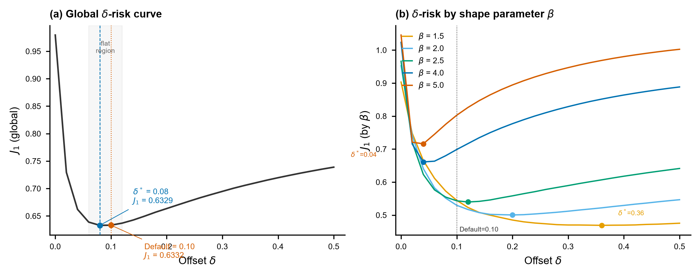
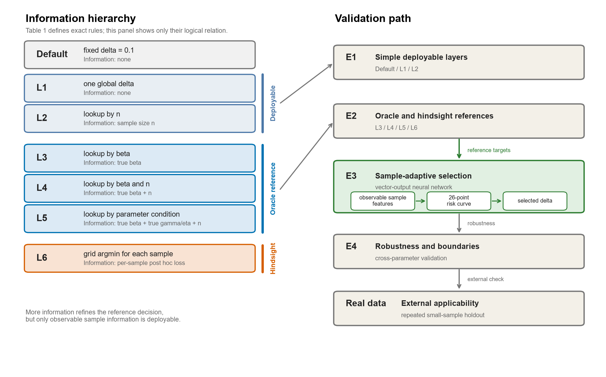
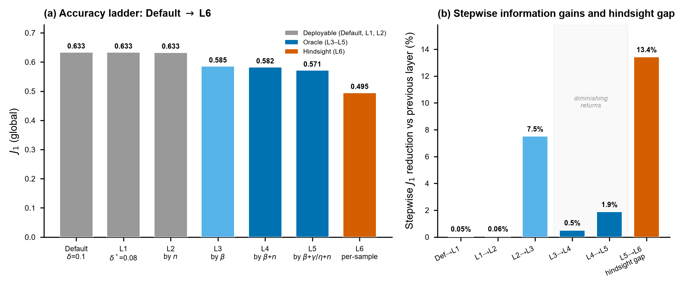
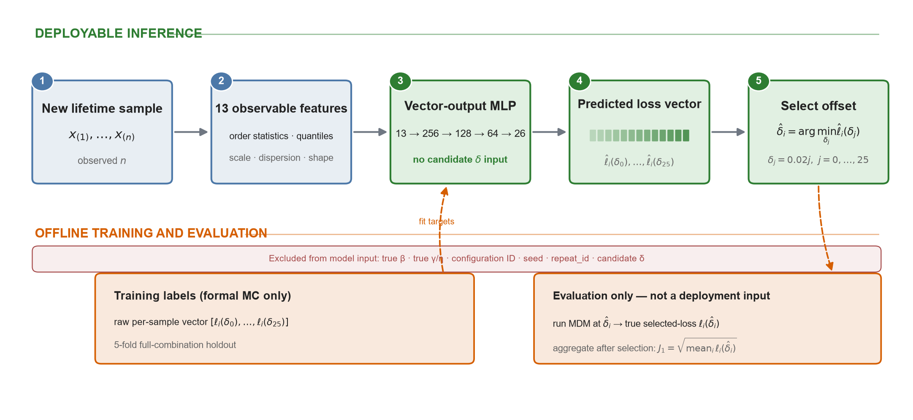
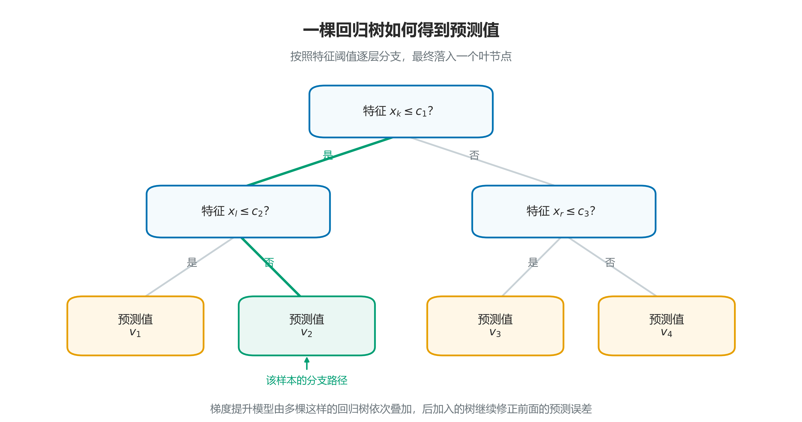
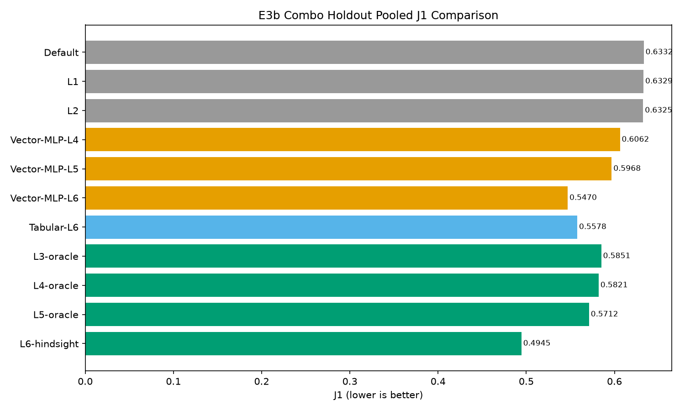

# 前情提要与本次汇报结构

## 第1页 **本次汇报结构**

1. **定义问题**
2. **真参数未知时，如何实现“样本—最优偏移量”的选择**
3. **关于神经网络的答疑与可信性验证**
4. **论文准备**
5. **下一个研究课题**

### **口述稿**

> 上次组会上，我初步汇报了用神经网络选择 delta 的想法，主要讲了评价指标的选择和一部分信息层级。之后老师建议把这项工作写成论文，所以这段时间我对研究问题、实验方法、证据边界和论文结构又做了进一步细化。
>
> 今天的汇报分为五部分。第一部分先定义这项研究究竟要解决什么问题，也就是怎样理解和确定“最优偏移量”。第二部分讨论在真参数未知的实际条件下，怎样根据一个样本实现“样本—最优偏移量”的选择。第三部分针对神经网络方法中可能影响主结果可信性的几个疑问进行补充验证，包括输入形式、样本量和训练方式。第四部分再汇报目前的论文准备情况和整体框架。最后简要汇报下一个研究课题的考虑。

---

# 第一部分 定义问题

## 第2页 **怎么从个体到通用来定义最优偏移量？**

**老师提问**

> 100个样本得到100个个体最优偏移量，最终应该选择哪个作为通用值？

**初步回答**

- **关注整体表现**：选择使100个样本平均损失最小的偏移量。
- **关注绝对最差表现**：选择使最大损失最小的偏移量。
- **关注尾部表现**：选择使高分位数损失最小的偏移量。

本文以整体平均表现为主要目标：

$$
\delta_{\mathrm{global}}^*
=\arg\min_{\delta}\frac{1}{N}\sum_{i=1}^{N}L_i(\delta)
$$

### **口述稿**

> 老师上次提出了一个问题：100个样本会得到100个个体最优偏移量，那么最终应该选择哪个作为通用值？
>
> 我现在的理解是，不能直接把这100个个体最优值取平均，也不能只根据它们出现的次数来决定。最终选择哪个值，首先取决于我们希望优化什么目标。
>
> 如果关注100个样本的整体表现，就应该让完整候选范围内的每一个偏移量都在这100个样本上接受评价，然后选择使平均损失最小的偏移量。如果关注绝对最差的样本，就选择使最大损失最小的偏移量。如果关注的不是单个最坏样本，而是整体的尾部风险，也可以选择使高分位数损失最小的偏移量。
>
> 这篇研究主要关注整体参数估计精度，因此采用平均损失最小作为通用偏移量的选择目标。不过，这个回答还隐含了一个前提：我们是在一个已经确定的参数空间内进行评价。下一步还需要追问，如果参数空间发生变化，这个通用最优值是否仍然不变。

---

## 第3页 **通用最优偏移量依赖参数空间及其权重**

**进一步追问**

> 如果改变或扩大当前参数空间，原来得到的通用最优偏移量会不会改变？



- 45个正式设计组合等权汇总：$\delta^*=0.08$。
- 只看 $\beta=1.5$：$\delta^*=0.36$。
- 只看 $\beta=5.0$：$\delta^*=0.04$。
- 全局最优值接近0.1，是不同参数条件下的选择需求聚合后的结果，并不表示0.1在每种条件下都接近最优。

因此，后续需要研究的不是一个脱离条件的“绝对最优值”，而是**不同可用信息层级下的最优偏移量选择规则**。

### **口述稿**

> 在初步回答老师的问题以后，我又反过来考虑了一个问题：我们刚才确定的通用最优值，其实是在一个已经给定的参数空间和权重下得到的。如果换一个参数区间，或者扩大当前参数空间，这个答案会不会改变？
>
> 从现有正式结果中可以看到，答案是有可能改变的。左图把45个正式设计组合等权汇总以后，全局最优偏移量是0.08，而且0.06到0.12之间比较平坦，所以原来使用的0.1仍然是一个很强的基线。
>
> 但是把结果按形状参数 beta 分开以后，情况明显不同。beta 等于1.5时，最优偏移量是0.36；beta 等于5时，最优偏移量是0.04。也就是说，全局最优值接近0.1，是不同参数条件下的选择需求聚合以后形成的结果，而不是因为0.1在所有条件下都接近最优。
>
> 因此，严格来说不存在一个脱离参数空间、设计权重和使用条件的绝对通用最优值。在建立信息层级以前，首先需要把本文使用的参数空间、偏移量候选范围和评价指标明确下来。

---

## 第4页 **参数空间、候选网格和评价指标**

| 项目 | 正式设置 |
|---|---|
| 形状参数 $\beta$ | 1.5、2.0、2.5、4.0、5.0 |
| 尺度参数 $\eta$ | 1.0 |
| 位置比例 $\gamma/\eta$ | 0.1、0.5、1.0 |
| 样本量 $n$ | 7、10、20 |
| 偏移量 $\delta$ | 0.00–0.50，步长0.02，共26点 |
| Monte Carlo重复 | 每个参数组合1000次 |
| 设计权重 | 45个参数组合等权 |

单样本参数估计损失：

$$
L_i(\delta)=
\left(\frac{\hat\beta_i-\beta}{\beta}\right)^2
+\left(\frac{\hat\eta_i-\eta}{\eta}\right)^2
+\left(\frac{\hat\gamma_i-\gamma}{\eta}\right)^2
$$

整体评价指标：

$$
J_1=\sqrt{\frac{1}{N}\sum_{i=1}^{N}L_i(\hat\delta_i)}
$$

### **口述稿**

> 在建立不同的信息层级以前，我先说明正式实验的参数空间和评价指标，因为后面所有“最优”和“改善”都只在这个共同合同下成立。
>
> 本文的形状参数 beta 取1.5、2、2.5、4和5；尺度参数 eta 基于尺度等变性固定为1；位置参数用 gamma 与 eta 的比值表示，取0.1、0.5和1；样本量取7、10和20。这样一共形成45个参数组合，并在总体评价时等权处理。
>
> 偏移量从0到0.5、以0.02为步长进行扫描，一共26个候选点。每个参数组合进行1000次 Monte Carlo 重复。因此，本文选择的是离散候选网格内的最优点，不是连续偏移量空间中的理论最优值。
>
> 评价方面，首先对每个样本计算三个参数的无量纲平方误差。beta和eta分别用自身进行归一化；gamma可能为0，因此用尺度参数eta归一化。平方项同时处理正负偏差，并对较大误差给予更高惩罚。当前没有预设某一个参数比另外两个更重要，所以三个参数采用等权。
>
> 最后，把每个样本在所选偏移量下的真实损失先求平均、再开平方，得到整体评价指标 $J_1$。后面所有层级都使用同一个 $J_1$ 进行比较。因此，后面所说的全局最优或分层最优，只在这45个等权参数组合、26个候选偏移量和当前损失定义下成立。

---

## 第5页 **“最优偏移量”应理解为不同可用信息条件下的最优选择规则**



- **简单可部署层级**：Default、L1、L2，只使用固定规则或实际已知的样本量。
- **真参数已知的理想参照**：L3、L4、L5，逐步加入真实 $\beta$、$n$ 和 $\gamma/\eta$ 信息。
- **逐样本事后参照**：L6，对每个样本在已知完整损失曲线后选择最优偏移量。

### **口述稿**

> 在前面统一的参数空间和评价指标下，我再把“最优偏移量”按照选择时能够使用的信息分成六个层级。这里不逐项展开每一个层级的计算细节，主要把它们分成三类。
>
> 第一类是简单可部署层级。Default 是固定使用0.1；L1是在给定参数空间内重新确定一个全局最优常数；L2进一步利用实际已知的样本量 n，为不同样本量选择偏移量。这几种规则都可以直接用于新样本。
>
> 第二类是L3到L5，它们逐步使用真实的 beta、样本量以及 gamma 与 eta 的比值。因为实际应用时真参数未知，所以这些层级不是部署方法，而是真参数已知条件下的理想信息参照。它们的作用是回答：如果能够获得更多与参数条件有关的信息，偏移量选择最多可以改善多少。
>
> 第三类是L6。它是在样本生成以后，回看这个样本在26个候选偏移量下的真实损失，再选出其中最小的一个。因此它是逐样本的事后参照，也不是实际使用时能够直接获得的规则。
>
> 这个层级的核心不是把所有层级都作为最终方法，而是区分哪些信息能够实际使用、哪些只用于衡量信息价值，并进一步判断有没有必要从统一固定值走向更细的样本自适应选择。

---

## 第6页 **不同信息层级能带来多少改善？**



- Default → L1：$J_1$ 降低0.048%。
- L1 → L2：$J_1$ 降低0.059%。
- L2 → L3：加入真实 $\beta$ 信息后，$J_1$ 降低7.51%。
- L5 → L6：从组级规则转为逐样本事后选择后，仍存在13.42%的 hindsight gap。
- 各组只负责确定各自的 $\delta_g^*$；随后回填到组内样本，对全部样本损失统一汇总得到该层级的 $J_1$。

### **口述稿**

> 这张图比较了不同信息层级下的整体参数估计损失。左图给出各层级的绝对 $J_1$，右图给出相对上一个层级的逐级降幅。
>
> 这里虽然每个层级可能划分出很多组，但图中展示的仍然是一个总体 $J_1$。具体做法是：先在每个组内扫描26个候选偏移量，得到该组的最优偏移量 $\delta_g^*$；再把这个偏移量回填给组内每一个样本，取出每个样本在所选偏移量下的损失；最后把全部45,000个样本的损失放在一起求平均并开平方，得到该层级唯一的总体 $J_1$。因此，它不是各组 $J_1$ 的简单算术平均，而是按组内样本数加权后的总体汇总。
>
> 从简单可部署层级看，Default、L1和L2的结果都在0.633附近。重新寻找一个全局常数，或者只按照样本量选择偏移量，带来的降幅分别为0.048%和0.059%。这说明在当前正式设计下，原来的0.1是一个很强的固定基线，仅仅更换另一个统一常数，或者只按样本量查表，改善都比较有限。
>
> 但是，当L3引入真实 beta 信息以后，相对L2的 $J_1$ 降低了7.51%。继续加入样本量和位置比例信息后，L4和L5还可以进一步改善。这里后两级的降幅分别是0.51%和1.88%，因此不把它概括成严格的单调递减。
>
> 最后，L6从组级选择变成对每一个样本进行事后选择，相对L5还存在13.42%的差距。这个差距不能理解为可以直接获得的部署收益，因为L6需要事后知道每个样本在所有偏移量下的真实损失；但它说明逐样本选择仍然存在值得研究的空间。
>
> 因此，下一步的问题就变成了：真参数未知时，能不能只根据实际能够观察到的样本信息，实现更细的偏移量选择。

---

# 第二部分 真参数未知时，如何实现“样本—最优偏移量”的选择

## 第7页 **事后最优如何转化为实际选择？**

**离线研究阶段**

```text
模拟样本 + 已知真参数
        ↓
26个偏移量对应的真实损失曲线
        ↓
曲线最小点 = 样本的事后最优偏移量
```

**实际使用阶段**

```text
观测样本
   ↓
如何推断不可见的26点损失曲线？
   ↓
选择偏移量
```

需要建立的映射：

$$
\text{可观测样本信息}
\longrightarrow
\text{26点损失曲线}
\longrightarrow
\text{所选偏移量}
$$

### **口述稿**

> 前面的L3到L6能够建立真参数条件、具体样本与最优偏移量之间的关系，是因为在模拟实验中真参数是已知的。对于每一个模拟样本，我可以计算它在26个候选偏移量下的真实参数估计损失，从而得到一条完整的损失曲线，并把曲线的最小点作为这个样本的事后最优偏移量。
>
> 但是在实际使用时，情况不一样。我们拿到的只有一个观测样本，真参数未知，因此也无法直接计算这个样本在不同偏移量下的真实估计误差。也就是说，真正需要的26点损失曲线在使用时是不可见的。
>
> 因此，实际需要解决的并不是简单记住一个最优偏移量，而是建立这样一个映射：从当前样本中能够观察到的信息出发，推断它对应的26点损失曲线，再根据预测曲线的最小点选择偏移量。
>
> 这就是后面引入神经网络所要解决的具体问题。

---

## 第8页 **用神经网络来近似“可观测样本信息—完整损失曲线”之间未知且复杂的映射**



设排序后的样本为 $x_{(1)}\le\cdots\le x_{(n)}$：

| 类别 | 输入特征 | 计算方法 |
|---|---|---|
| 样本量 | $n$ | 样本中的观测数量 |
| 极值 | $x_{\min},x_{\max}$ | $x_{(1)},x_{(n)}$ |
| 极差 | $range$ | $x_{\max}-x_{\min}$ |
| 分位数 | $Q_1,Med,Q_3$ | 采用排序样本的线性插值经验分位数 |
| 四分位距 | $IQR$ | $Q_3-Q_1$ |
| 均值 | $\bar x$ | $n^{-1}\sum_i x_i$ |
| 标准差 | $s$ | $\sqrt{\sum_i(x_i-\bar x)^2/(n-1)}$ |
| 变异系数 | $CV$ | $s/\bar x$ |
| 偏度 | $g_1$ | $n^{-1}\sum_i[(x_i-\bar x)/s]^3$ |
| 超额峰度 | $g_2$ | $n^{-1}\sum_i[(x_i-\bar x)/s]^4-3$ |

- $x_{\min}$、$x_{\max}$、$range$、$Q_1$、$Med$、$Q_3$、$IQR$、$\bar x$、$s$：使用训练折统计量进行z-score。
- $n$、$CV$、$g_1$、$g_2$：原值输入。
- **输出**：26个候选偏移量对应的预测损失；取预测曲线最小点作为所选偏移量。

**小样本分位数怎样计算？**

对分位比例 $p$，令 $h=(n-1)p$、$k=\lfloor h\rfloor$、$a=h-k$，则

$$
Q_p=(1-a)x_{(k+1)}+a x_{(k+2)}.
$$

| $n$ | $Q_1$ | $Med$ | $Q_3$ |
|---:|---|---|---|
| 7 | $(x_{(2)}+x_{(3)})/2$ | $x_{(4)}$ | $(x_{(5)}+x_{(6)})/2$ |
| 10 | $0.75x_{(3)}+0.25x_{(4)}$ | $(x_{(5)}+x_{(6)})/2$ | $0.25x_{(7)}+0.75x_{(8)}$ |
| 20 | $0.25x_{(5)}+0.75x_{(6)}$ | $(x_{(10)}+x_{(11)})/2$ | $0.75x_{(15)}+0.25x_{(16)}$ |

### **口述稿**

> 为了近似前面这条不可见的损失曲线，我采用了一个向量输出的多层感知机，也就是 Vector-MLP。
>
> 之所以考虑神经网络，是因为当前样本信息与26点损失曲线之间没有已知、可靠的解析关系，而且这个映射可能同时包含非线性和多个样本特征之间的交互。因此，神经网络在这里是实现这个映射的工具，而不是研究本身的目的。
>
> 对于一个新的寿命样本，首先提取13个实际可观测的统计特征，然后把这些特征输入网络。网络不直接输出一个偏移量，而是一次输出26个候选偏移量对应的预测损失。最后对这条预测损失曲线取最小点，得到这个样本所选择的偏移量。
>
> 这13个输入可以分成四类。第一类是样本量 n。第二类是位置和尺度信息，包括最小值、最大值、极差、均值和样本标准差。第三类是分布位置和离散结构，包括第一四分位数、中位数、第三四分位数和四分位距。第四类是无量纲形状信息，包括变异系数、偏度和超额峰度。
>
> 具体计算都只使用当前观测样本。标准差的分母使用 $n-1$；变异系数是标准差除以样本均值；偏度和超额峰度分别由标准化后的三阶和四阶中心矩计算。最小值到标准差这9个有量纲特征，只使用训练折的均值和标准差进行z-score；样本量、变异系数、偏度和峰度保持原值输入。所有特征在实际选择时都能从样本直接获得，输入中不包含真实 beta、eta、gamma或参数组合编号。
>
> 对于小样本分位数，这里采用的是排序样本上的线性插值经验分位数。具体做法是先计算位置 $(n-1)p$，如果这个位置不是整数，就在相邻两个顺序统计量之间按距离插值。因此，分位数不要求一定等于某一个实际观测值。例如 $n=7$ 时，第一四分位数是第2和第3个顺序统计量的平均，中位数是第4个，第三四分位数是第5和第6个的平均。$n=10$和20时也按照同一个公式计算，页面表格给出了具体权重。
>
> 这些分位数只是对当前经验分布的描述，不是把它们当作总体真实分位数。小样本下分位数本身会有较大波动，而这种波动没有被人为消除，反而会作为当前样本不确定程度的一部分进入模型。
>
> 老师之前还问过，为什么这里使用统计特征，而不是直接把原始样本输入神经网络。这里我先说明当前采用的方法；在后面的第三部分，我会用原始样本输入和统计特征输入的直接对照，专门回答这个问题。
>
> 在离线训练阶段，模拟数据的真参数已知，因此能够计算每个样本的26点真实损失曲线，并把它作为监督标签。但是，真实 beta、真实 gamma 与 eta 的比值、参数组合编号以及候选偏移量本身都不作为模型输入。
>
> 在最终评价时，也不是用网络训练误差代替参数估计效果，而是在网络选出的偏移量下重新进行MDM估计，再用真实 selected loss 汇总 $J_1$。因此，网络的曲线拟合和最终的偏移量选择效果是两个不同层面的评价。

---

## 第9页 **Vector-MLP是什么样的网络，为什么这样设计？**


**为什么采用这种结构？**

- **多层感知机（MLP）**：适合“固定维特征向量 → 固定维连续值向量”的非线性回归；13个统计特征不存在图像或时间序列式的局部结构。
- **三层ReLU隐藏层**：把13维样本信息逐层变换为与损失曲线有关的非线性表示。
- **26维线性输出层**：每个节点对应一个候选 $\delta$ 的预测损失，一次得到完整曲线，再取最小点。
- **结构边界**：256–128–64是当前冻结的工程设置，不是理论上唯一或最优的网络结构。

| 训练与评价 | 设置 |
|---|---|
| 训练 | 26维标准化MSE；Adam；学习率 $10^{-3}$；L2正则 $10^{-4}$；batch 256；提前停止 |
| 评价 | 5折完整参数组合留出；seed 42、2026、3407 |

### **口述稿**

> 这一页回答两个问题：我具体使用了什么神经网络，以及为什么这个任务采用这样的网络结构。
>
> 这里使用的是多层感知机，也就是最基本的一类全连接前馈神经网络。所谓前馈，就是信息只按照图中从左到右传播；所谓全连接，就是相邻两层之间的每个节点都有可学习的连接。每个神经元先对上一层信息进行加权组合，再通过激活函数进行非线性变换。
>
> 网络输入层对应前一页介绍的13个统计特征。随后经过256、128和64个神经元组成的三个隐藏层，隐藏层使用ReLU激活函数，使模型能够表达样本特征与损失曲线之间不是简单直线关系的复杂映射。最后的输出层包含26个节点，每个节点对应一个候选偏移量的预测损失，因此一次预测就可以得到完整的26点损失曲线，再选择预测损失最小的偏移量。
>
> 图中左侧把13项输入逐一标出，包括样本量、极值、极差、分位数、均值、标准差、变异系数、偏度和峰度；右侧输出则按照 $\delta=0.00,0.02,\ldots,0.50$ 排列，分别表示26个候选偏移量的预测损失。网络本身不直接输出偏移量，而是在得到这26个预测值以后，取最小预测损失所在的位置作为 $\hat\delta$。
>
> 之所以选择MLP，是因为当前输入是固定长度的特征向量，输出也是固定长度的连续损失向量，这是一个典型的多输出非线性回归问题。同时，这13个统计特征不像图像那样存在空间邻域，也不像时间序列那样存在前后顺序，因此没有必要为了形式复杂而使用卷积网络或循环网络。输出层使用线性输出，因为这里预测的是连续损失值，而不是进行类别判断。
>
> 256、128和64这三个宽度不是从理论上证明的唯一最优结构，而是当前实验采用并在正式比较前冻结的工程设置。它提供了足够的非线性表达容量，同时通过L2正则、提前停止、完整参数组合留出和三个随机种子控制过拟合与训练偶然性。因此，我能够说明为什么选择这一类网络、当前具体用了什么结构以及怎样验证它，但不会把当前层数和宽度表述为神经网络结构的理论最优解。
>
> 数据仍然来自45个正式参数组合、共45,000条样本级损失曲线。训练采用标准化后的26维均方误差、Adam优化器、$10^{-3}$ 学习率和 $10^{-4}$ 的L2正则；正式评价仍采用5折完整参数组合留出，并使用三个训练随机种子检查稳定性。

---

## 第10页 **其他机器学习方法能否实现这一选择？**

**可以。关键不是必须使用神经网络，而是能否预测不同候选 $\delta$ 下的损失。**



| 项目 | Vector-MLP-L6 | Tabular-L6 |
|---|---|---|
| 学习器 | 多层感知机 | 直方图梯度提升回归树 |
| 问题表示 | $\mathbf{x}\rightarrow$ 完整26点曲线 | $(\mathbf{x},\delta_j)\rightarrow$ 单个损失 |
| 每个样本 | 一次预测 | 对26个候选点逐一预测 |
| pooled $J_1$ | 0.547003 | 0.557849 |

- 相同样本信息、L6损失标签、参数组合留出和最终 $J_1$ 评价。
- 当前受控比较中Vector-MLP相对降低约1.94%；这不等于已经证明神经网络对所有机器学习方法最优。

### **口述稿**

> 这里进一步回答一个可能的质疑：这个任务是不是只有神经网络才能完成？答案是否定的。真正需要实现的是，根据样本信息预测不同候选偏移量下的损失，再选择预测损失最小的偏移量。只要一个模型能够学习这种非线性关系，原则上都可以实现样本自适应选择。
>
> 上一页已经展示了Vector-MLP的网络结构。这一页不再试图把Tabular-L6的完整计算过程全部塞进一张图，而是先用一棵简单的回归树说明这种学习器的基本原理。
>
> 图中，一棵回归树根据输入特征是否超过某个阈值逐层分支。一个样本沿着相应路径落入某个叶节点，叶节点给出的数值就是这棵树的预测结果。梯度提升模型就是依次建立多棵这样的回归树，让后加入的树继续修正前面模型尚未预测好的部分，最后将各棵树的结果加权相加。
>
> 在本研究的Tabular-L6中，每次输入是13项样本统计特征加一个候选偏移量 $\delta_j$，输出是该候选偏移量对应的一个预测损失 $\widehat L(\delta_j)$。对同一个样本分别代入26个候选偏移量，便能得到26个预测损失并选择最小点。以一折数据为例，36,000个训练样本展开为936,000行；当前模型最多迭代200棵树，最大深度为6，学习率为0.1。
>
> 为了使比较有意义，两条路线使用相同的样本信息、相同的L6逐样本损失标签、相同的参数组合留出和相同的最终 $J_1$ 评价，主要区别是学习器以及风险曲线的表示方式。
>
> 结果上，Vector-MLP-L6的 pooled $J_1$ 为0.547003，Tabular-L6为0.557849，Vector-MLP相对降低约1.94%。因此，这一页支持两个有限结论：第一，神经网络不是唯一可行方法；第二，在当前受控比较中，一次联合预测完整曲线的Vector-MLP表现更好。它不能扩大为已经比较所有机器学习方法，也不能据此宣称当前神经网络结构具有普遍最优性。

---

## 第11页 **Vector-MLP-L6相对L2降低13.52%**



- L2：$J_1=0.632541$。
- Vector-MLP-L6：$J_1=0.547003$，相对L2降低13.52%。
- Tabular-L6：$J_1=0.557849$。
- L6-hindsight：$J_1=0.494530$。

### **口述稿**

> 这张图展示了完整参数组合留出下的所有方法比较，并按照 pooled $J_1$ 从低到高排列，也就是越靠上表现越好。
>
> 灰色是Default、L1和L2三种简单可部署基线；橙色是不同监督粒度的Vector-MLP；蓝色是直接预测单个偏移量的Tabular-L6；绿色是使用真参数的组级理想参照以及逐样本事后参照。
>
> 本文的主要比较对象是L2和Vector-MLP-L6。L2的 pooled $J_1$ 为0.632541，Vector-MLP-L6为0.547003，相对降低13.52%。这说明在真参数不作为输入的条件下，样本可观测信息能够带来比按样本量查表更细的偏移量选择。
>
> Vector-MLP-L6也优于上一页介绍的标量风险预测基线Tabular-L6，后者的 $J_1$ 为0.557849。另一方面，逐样本事后参照L6的 $J_1$ 为0.494530，仍然低于Vector-MLP-L6，说明模型获得了部分逐样本选择收益，但还没有达到事后最优边界。
>
> 图中Vector-MLP-L6的数值也低于L3到L5的组级理想参照，但这不能表述为“神经网络超越了真参数方法”。L3到L5是在组级分配一个偏移量，而Vector-MLP-L6使用逐样本损失曲线作为离线监督标签，二者的决策粒度不同。完整展示这些方法，是为了定位模型处于整个比较空间中的位置；本文的主要结论仍然锚定相对L2的13.52%降幅。

---

## 第12页 **不同样本量和随机种子下的稳定性**

**按样本量比较**

| 样本量 | L2 $J_1$ | Vector-MLP-L6 $J_1$ | 相对降低 |
|---:|---:|---:|---:|
| $n=7$ | 0.739286 | 0.657558 | 11.05% |
| $n=10$ | 0.644520 | 0.549815 | 14.69% |
| $n=20$ | 0.488235 | 0.403679 | 17.32% |

**按训练随机种子比较**

| seed | pooled $J_1$ | 相对L2降低 |
|---:|---:|---:|
| 42 | 0.547003 | 13.52% |
| 2026 | 0.546133 | 13.66% |
| 3407 | 0.544009 | 14.00% |

### **口述稿**

> 为了检查前面的13.52%是否主要由某一个样本量或某一个训练随机种子造成，我又从两个角度进行了分层检查。
>
> 首先按样本量看。对于 $n=7$、10和20，Vector-MLP-L6相对L2的 $J_1$ 分别降低11.05%、14.69%和17.32%。三个正式样本量下的改善方向一致，同时也能看到小样本本身仍然更难：无论是L2还是Vector-MLP，$n=7$ 的绝对 $J_1$ 都明显高于 $n=20$。
>
> 这里三个样本量上的相对降幅依次增加，但目前只检验了7、10和20三个离散点，因此我只把它表述为三个正式样本量下方向一致，不把它外推成收益随样本量单调增加的一般规律。
>
> 第二个检查是训练随机种子。seed 42、2026和3407对应的 pooled $J_1$ 分别为0.547003、0.546133和0.544009，相对L2的降幅在13.52%到14.00%之间。三个seed的最大 $J_1$ 差值为0.002994，约为三者均值的0.55%。
>
> 因此，当前正式结果支持的是：在现有参数网格的完整组合留出评价中，Vector-MLP-L6相对L2的改善方向跨三个样本量和三个训练随机种子保持一致。它仍然不是连续参数空间、边界参数条件或真实数据上的泛化证明。

---

# 第三部分 关于神经网络的答疑与可信性验证

## 第13页 **问题1：输入原始样本与输入特征的区别？**

**老师提问**

> 为什么使用统计特征，而不直接把原始样本输入神经网络？

| 联合模型输入 | 三seed平均 pooled $J_1$ | $n=7$ | $n=10$ | $n=20$ |
|---|---:|---:|---:|---:|
| 13个统计特征F13 | 0.533733 | 0.640496 | 0.534961 | 0.397721 |
| 排序原始样本 + padding/mask | 0.536972 | 0.643962 | 0.539250 | 0.399409 |

- RAW相对F13的差异约为0.4%—0.8%，没有带来选择精度收益。
- F13固定维、排列不变且易解释；RAW保留更多原始信息，但需要网络自行学习统计结构。
- 结论限于当前等容量MLP和既有参数网格，不代表所有原始样本网络。

### **口述稿**

> 老师之前问过，为什么这里使用统计特征，而不直接把原始样本输入神经网络。首先，原始样本并不是不能输入。它的主要特点是样本长度会随着 n 改变，而且观测值本身没有固定的输入顺序。相比之下，统计特征能够提供固定维、排列不变并且更容易解释和审计的表示。
>
> 但是，“神经网络可以自己学习特征”这个质疑是成立的，所以不能只靠表示性质选择F13。Study1.5在相同TEST、相同26点损失曲线标签和近似相同网络容量下，对F13和排序原始样本RAW进行了三个seed的受控比较。
>
> RAW方案把观测值升序排列并padding到20，再用mask标记有效位置；mask的数量已经隐式表达样本量，不再额外输入数值 n。联合模型中，F13和RAW的三seed平均 pooled $J_1$ 分别为0.533733和0.536972；按 n 分层，RAW均略高约0.4%到0.8%。
>
> 因此，当前结果支持把F13作为统一模型的实现方案：它更简单、更容易解释，并且没有观察到RAW带来精度收益。但这个结论只适用于当前等容量MLP和既有参数网格；它不能证明13个特征无损，也不能排除DeepSets等更适合原始集合输入的网络取得不同结果。

---

## 第14页 **问题2：统计特征输入与联合训练是否正确反映了不同样本量下的估计差异？**

| 测试 $n$ | hindsight下界 | F13联合 | F13专用 | RAW联合 | RAW专用 |
|---:|---:|---:|---:|---:|---:|
| 7 | 0.586460 | 0.640496 | 0.647358 | 0.643962 | 0.646315 |
| 10 | 0.492945 | 0.534961 | 0.530406 | 0.539250 | 0.532026 |
| 20 | 0.359982 | 0.397721 | 0.385601 | 0.399409 | 0.387293 |

- 各方案均保留“小样本更难”的基本规律，没有抹平样本量差异。
- 联合训练有利于 $n=7$，但在 $n=10,20$ 上不如专用模型；统一模型不是每个 $n$ 上的最优设计。
- 专用训练后F13与RAW差异不超过0.0017，联合训练损失不能归因于统计特征提取。

### **口述稿**

> 这一页回答联合训练会不会掩盖不同样本量下的差异。这里把训练组织和输入表示拆开，同时比较F13与RAW的联合模型和按 n 专用模型；这些都是复用Study1.5既有90个模型得到的三seed结果，没有重新训练。
>
> 首先看难度规律。hindsight下界从 n=7 的0.586460下降到 n=20 的0.359982；F13联合模型也从0.640496下降到0.397721，RAW和专用模型同样保持这个顺序。因此，没有观察到统计特征或联合训练把“小样本更难”这一规律抹平。
>
> 但是，“没有抹平差异”不等于“联合训练对每个 n 都最好”。相对F13专用模型，联合训练在 n=7 上降低0.006862，但在 n=10 和20上分别增加0.004556和0.012120。也就是说，小样本从共享数据中获益，而较大样本出现了任务竞争或负迁移。
>
> 这是否说明问题出在统计特征？补充的二乘二交互分析表明不是。按 n 专用训练后，F13和RAW在三个样本量上的差异只有0.0010到0.0017，而且方向不一致。尤其 n=20 上，两种表示的联合训练代价几乎完全相同，因此该损失主要来自混合训练，而不是特征提取。
>
> 因此当前选择F13联合模型的理由应限定为：它用一个模型覆盖三个正式样本量，结构简单，而且Study01正式结果相对L2在三个 n 上都改善；不能再说它是每个 n 上的最优训练方案。若后续追求各样本量的极致精度，按 n 专用模型或部分共享结构是明确的改进方向。
>
> 这项补充分析属于Study1.5内部的答疑证据，不进入Study01 formal证据链。它不推翻Study01的有效性结论，但限制了方法表述：当前方案已证明有效，尚未证明设计最优。

---

## 第15页 **问题3：评价是否会被某个样本量主导而被误导？**

| 样本量 | L2 $J_1$ | Vector-MLP-L6 $J_1$ | 相对降低 |
|---:|---:|---:|---:|
| $n=7$ | 0.739286 | 0.657558 | 11.05% |
| $n=10$ | 0.644520 | 0.549815 | 14.69% |
| $n=20$ | 0.488235 | 0.403679 | 17.32% |

- pooled $J_1$：回答等权正式参数空间下的总体表现，仍是主评价指标。
- 按 $n$ 分层：检查总体改善是否只由某一特定样本量贡献。
- 三个样本量下改善方向一致，因此总体结论不是由某一个 $n$ 单独造成。

### **口述稿**

> 第三个问题是，把不同样本量的结果汇总为 pooled $J_1$，会不会因为某个样本量的误差更大而误导总体评价。这个疑问是合理的，因为 $n=7$ 的绝对损失高于 $n=20$，因此它对总体损失的实际贡献也会更大。
>
> 但 pooled $J_1$ 本身并没有失效。它回答的是：在预先确定的45个等权参数组合下，方法的总体表现怎样。因此，它仍然是本文的主评价指标。需要补充的是按 n 分层检查，用来判断总体结论是否只由某一个样本量产生。
>
> 从正式结果看，Vector-MLP-L6相对L2在 $n=7$、10和20下分别降低11.05%、14.69%和17.32%，三个样本量下改善方向一致。因此，pooled结果虽然会综合不同样本量的绝对风险，但“Vector-MLP-L6优于L2”这一总体判断不是由某一个 n 单独造成的。
>
> 所以这里不是用分层指标替代 pooled 指标，而是用“总体主评价加分层可信性检查”的方式，防止只看平均结果而忽略内部差异。

---

## 第16页 **问题4：能否描述一下从全局偏移量=0.1到MLP-L6自适应偏移量，估计效果好了多少？**

**正式主结果：在45个参数组合的完整组合留出评价中，$J_1$ 从0.633219降至0.547003，相对降低13.62%。**

**固定参数组直观对照：$W(2,1000,1000)$，$n=7,10,20$ 各1000次，共3000个对齐样本。**

| 方法 | pooled $J_1$ | $\beta$ RMSE | $\eta$ RMSE | $\gamma$ RMSE | 失败率 |
|---|---:|---:|---:|---:|---:|
| MDM-L6-oracle（事后上界） | 0.424 | 0.269 | 0.258 | 0.201 | 0 |
| **MDM-MLP** | **0.470** | **0.338** | **0.256** | **0.203** | **0** |
| MDM-$0.1$ | 0.567 | 0.382 | 0.331 | 0.258 | 0 |
| LSE | 1.095 | 0.861 | 0.510 | 0.444 | 0 |
| WMLE | 1.113 | 0.711 | 0.634 | 0.576 | 0 |
| MLE | 1.762 | 1.407 | 0.762 | 0.739 | 32.4% |
| LRE | 2.103 | 1.537 | 1.050 | 0.977 | 0 |

- 在该固定参数组下，MDM-MLP相对MDM-$0.1$使 $J_1$ 降低17.23%；$\beta$、$\eta$、$\gamma$ RMSE分别降低11.64%、22.57%和21.50%。
- 从固定0.1到L6事后上界的可改善区间看，MDM-MLP已经实现约68.00%；但相对当前MLP结果，仍有约9.79%的进一步降低空间。
- MDM三种方案均优于本次对照中的传统方法；该结论只用于说明当前参数组下的相对位置，不外推为全参数空间的方法优劣。

### **口述稿**

> 第四个问题是，能不能更直接地描述从固定偏移量0.1到MLP-L6自适应选择以后，参数估计效果究竟改善了多少。
>
> 这个问题我用两层结果回答。第一层是论文的正式主结果：在45个参数组合的完整组合留出评价中，固定使用0.1的 pooled $J_1$ 为0.633219，Vector-MLP-L6为0.547003，相对降低13.62%。这说明改善不是由某一个参数组合偶然造成的。
>
> 第二层是为了让这个改善更有体感，我固定真参数为 $W(2,1000,1000)$，对 $n=7$、10和20各使用1000个完全对齐的样本，同时比较MDM的固定偏移量、自适应偏移量、事后上界以及四种传统估计方法。在这个例子中，MDM-MLP的 $J_1$ 为0.470，固定0.1为0.567，相对降低17.23%。分参数看，beta、eta和gamma的RMSE分别降低11.64%、22.57%和21.50%，所以这次改善不是只靠某一个参数得到的。
>
> 横向位置上，MDM-MLP优于本次比较中的LSE、WMLE、MLE和LRE，也明显优于固定0.1。从固定0.1到L6事后上界的可改善区间看，当前模型已经实现约68%；但它仍没有达到逐样本事后上界0.424，说明后续还有继续优化的空间。
>
> 这里需要强调两个边界。第一，13.62%来自45个正式参数组合，是论文的主证据；后面这张横向表只对应一个固定参数组，主要用于直观解释，不能据此宣布MDM在所有条件下都优于传统方法。第二，L6使用了事后信息，只是理论参照，不能作为实际可部署方法。

---

## 第16A页 **$n=7$：小样本下，自适应偏移量主要改善尺度参数与位置参数的稳定性**

**真值：$\beta=2$，$\eta=1000$，$\gamma=1000$；每格依次为“均值 / 中位数 / 95%经验区间 / 观测范围”。**

| 方法 | $\beta$ | $\eta$ | $\gamma$ | 成功数 |
|---|---|---|---|---:|
| MDM-L6-oracle | 1.72 / 1.77 / 0.62–2.72 / 0.35–6.22 | 840 / 856 / 308–1316 / 89–1670 | 1135 / 1088 / 843–1594 / 737–1996 | 1000 |
| **MDM-MLP** | **1.78 / 1.67 / 0.61–3.80 / 0.35–6.22** | **850 / 880 / 310–1307 / 89–1866** | **1124 / 1080 / 806–1594 / 516–1996** | **1000** |
| MDM-$0.1$ | 1.85 / 1.73 / 0.61–3.57 / 0.35–15.00 | 900 / 842 / 302–1725 / 89–2234 | 1079 / 1103 / 497–1603 / 331–1996 | 1000 |
| LSE | 2.51 / 1.71 / 0.51–8.19 / 0.23–18.40 | 1076 / 875 / 285–2303 / 81–2650 | 914 / 1087 / 0–1629 / 0–2002 | 1000 |
| WMLE | 3.06 / 2.88 / 1.48–5.00 / 1.34–5.86 | 1387 / 1256 / 476–2350 / 240–2753 | 631 / 782 / 0–1442 / 0–1751 | 1000 |
| MLE | 5.36 / 5.19 / 1.38–13.98 / 1.23–26.59 | 1578 / 1806 / 528–2352 / 247–2583 | 426 / 0 / 0–1412 / 0–1760 | 538 |
| LRE | 4.76 / 4.47 / 1.14–9.67 / 0.54–21.73 | 2015 / 2042 / 781–2466 / 302–2804 | 38 / 0 / 0–1062 / 0–1354 | 1000 |

注：95%经验区间是1000次蒙特卡洛估计值的2.5%–97.5%分位区间，不是单次估计的置信区间；MLE统计量仅基于538次成功估计，失败惩罚已计入上一页的总体指标。

### **口述稿**

> 这一页单独看最困难的 $n=7$。每个参数从左到右依次给出均值、中位数、95%经验区间和1000次模拟中的观测范围，因此能够看到总体指标背后的估计分布。
>
> 相比固定0.1，自适应偏移量对 eta 和 gamma 的尾部改善最直观：eta 的95%区间上界由1725降到1307，gamma的下界由497提高到806；beta的极端最大值也由15.00降到6.22。这里不强调每一个统计量都单调改善，而是说明小样本下最容易出现的偏离和长尾得到明显抑制。
>
> 传统方法中，MLE只有538次成功；LRE的gamma中位数接近0。这也解释了为什么只报告成功样本的均值并不足够，上一页还必须同时报告失败率和统一风险指标。

---

## 第16B页 **$n=10$：样本量增加后，自适应偏移量的改善仍然存在**

**真值：$\beta=2$，$\eta=1000$，$\gamma=1000$；每格依次为“均值 / 中位数 / 95%经验区间 / 观测范围”。**

| 方法 | $\beta$ | $\eta$ | $\gamma$ | 成功数 |
|---|---|---|---|---:|
| MDM-L6-oracle | 1.77 / 1.82 / 0.79–2.55 / 0.56–5.41 | 875 / 904 / 360–1254 / 183–1725 | 1107 / 1076 / 865–1541 / 812–1735 | 1000 |
| **MDM-MLP** | **1.84 / 1.78 / 0.79–3.34 / 0.56–7.13** | **895 / 936 / 358–1282 / 180–1789** | **1088 / 1053 / 819–1541 / 655–1738** | **1000** |
| MDM-$0.1$ | 1.92 / 1.79 / 0.78–3.54 / 0.56–5.59 | 941 / 909 / 357–1638 / 181–2313 | 1046 / 1053 / 534–1557 / 290–1743 | 1000 |
| LSE | 2.34 / 1.74 / 0.67–6.70 / 0.39–11.77 | 1060 / 908 / 345–2246 / 169–2721 | 935 / 1062 / 0–1581 / 0–1804 | 1000 |
| WMLE | 2.86 / 2.44 / 1.42–5.00 / 1.33–5.54 | 1332 / 1152 / 569–2280 / 259–2629 | 687 / 886 / 0–1412 / 0–1720 | 1000 |
| MLE | 3.58 / 2.35 / 1.23–9.26 / 1.16–15.36 | 1283 / 1063 / 477–2302 / 241–2638 | 718 / 950 / 0–1481 / 0–1721 | 603 |
| LRE | 4.64 / 4.50 / 1.29–7.85 / 0.56–14.36 | 2008 / 2051 / 801–2392 / 409–2714 | 49 / 0 / 0–1122 / 0–1653 | 1000 |

注：95%经验区间是1000次蒙特卡洛估计值的2.5%–97.5%分位区间；MLE统计量仅基于603次成功估计。

### **口述稿**

> 当样本量增加到10以后，各方法的分布总体开始收缩，但固定偏移量和自适应偏移量之间仍有清楚差别。
>
> MDM-MLP相对MDM-0.1，eta的95%区间上界由1638降到1282，gamma的下界由534提高到819，beta的上界也由3.54降到3.34。这说明自适应选择的收益并非只发生在 $n=7$ 的极小样本情形。
>
> 同时，MLP与事后上界已经比较接近，但仍没有重合。因此，这张表既说明了当前模型的有效性，也保留了继续优化的空间。

---

## 第16C页 **$n=20$：基准估计已经改善，自适应偏移量仍能进一步收紧分布**

**真值：$\beta=2$，$\eta=1000$，$\gamma=1000$；每格依次为“均值 / 中位数 / 95%经验区间 / 观测范围”。**

| 方法 | $\beta$ | $\eta$ | $\gamma$ | 成功数 |
|---|---|---|---|---:|
| MDM-L6-oracle | 1.86 / 1.92 / 1.05–2.45 / 0.77–3.06 | 923 / 943 / 570–1204 / 352–1410 | 1064 / 1043 / 896–1343 / 844–1610 | 1000 |
| **MDM-MLP** | **1.88 / 1.85 / 1.05–2.95 / 0.77–3.97** | **932 / 950 / 570–1227 / 352–1410** | **1056 / 1033 / 876–1343 / 803–1610** | **1000** |
| MDM-$0.1$ | 2.02 / 1.93 / 1.04–3.38 / 0.77–4.14 | 983 / 966 / 565–1495 / 346–1704 | 1009 / 1014 / 624–1353 / 476–1610 | 1000 |
| LSE | 2.21 / 1.92 / 0.96–5.38 / 0.70–7.32 | 1035 / 974 / 556–2022 / 349–2316 | 962 / 1021 / 0–1368 / 0–1612 | 1000 |
| WMLE | 2.60 / 2.20 / 1.50–5.00 / 1.43–5.37 | 1244 / 1049 / 674–2182 / 522–2436 | 770 / 956 / 0–1276 / 0–1406 | 1000 |
| MLE | 2.28 / 1.87 / 1.16–6.35 / 1.07–8.24 | 1006 / 896 / 546–2121 / 418–2347 | 976 / 1069 / 0–1364 / 0–1493 | 888 |
| LRE | 4.64 / 4.66 / 1.39–6.51 / 0.86–9.38 | 1983 / 2041 / 775–2278 / 469–2417 | 69 / 0 / 0–1123 / 0–1368 | 1000 |

注：95%经验区间是1000次蒙特卡洛估计值的2.5%–97.5%分位区间；MLE统计量仅基于888次成功估计。

### **口述稿**

> 到 $n=20$ 时，固定0.1本身已经比小样本时稳定，但自适应偏移量仍然进一步收紧了估计分布。
>
> 相比固定0.1，MDM-MLP将beta的95%区间上界由3.38降到2.95，eta的上界由1495降到1227，gamma的下界由624提高到876；三个参数同时向事后上界靠近。
>
> 三张分表合起来说明两点：第一，样本量增加本身会改善估计；第二，在每一个样本量内部，MLP相对固定0.1仍有增益。因此上一页的 pooled 改善不是被某一个样本量单独主导的。

---

# 第四部分 论文准备

## 第17页 **论文论证链与五部分结构**

```text
为什么一个通用偏移量不能回答所有条件？
                  ↓
怎样定义“最优”，并比较不同信息条件下的选择？
                  ↓
真参数未知时，怎样根据观测样本实现更细的选择？
                  ↓
这种方法能改善多少，在什么范围内成立？
                  ↓
对实际使用和后续验证意味着什么？
```

| 论文部分 | 在论证链中的任务 |
|---|---|
| **1. Introduction** | 提出固定偏移量的条件依赖性、研究缺口和本文问题 |
| **2. Methodology** | 定义损失、最优偏移量、信息层级和样本自适应方法 |
| **3. Simulation and Results** | 用统一实验合同回答固定值、信息价值和模型效果 |
| **4. Discussion** | 解释适用路线、证据边界和仍需验证的问题 |
| **5. Conclusion** | 直接回答研究问题，区分已证结果与后续工作 |

### **口述稿**

> 在主结果及其可信性验证之后，前面的研究内容最终需要压缩成一篇传统的小论文，而不是按照E1、E2、E3、E4这些内部实验编号去罗列工作。因此，我把论文组织成五个部分，并让它们共同服务于同一条论证链。
>
> 这条论证链从一个问题开始：为什么一个通用偏移量不能回答所有参数条件。接着需要定义什么叫最优，并建立不同可用信息条件下的选择层级。然后再进入实际问题：真参数未知时，怎样只根据观测样本实现更细的偏移量选择。最后用模拟结果回答这种方法能够改善多少，以及这些结论目前在哪些边界内成立。
>
> 对应到论文中，Introduction负责提出问题和研究缺口；Methodology负责定义损失、信息层级和样本自适应方法；Simulation and Results负责给出正式实验和证据；Discussion负责解释实际意义、方法选择和证据边界；Conclusion只直接回答研究问题，不再引入新的结果。
>
> 所以这里希望老师重点判断的是整条论证链是否成立，以及五个部分的承接是否合理，而不是具体句子怎样表达。

---

## 第18页 **论文骨架**

**1. Introduction**

- MDM偏移量及固定0.1的研究背景
- 通用最优值的条件依赖性与现有研究缺口
- 研究问题、主要贡献和论文结构

**2. Methodology**

- MDM偏移机制、参数估计损失与 $J_1$
- 通用最优与条件最优的操作性定义
- L1–L6信息层级及可部署性边界
- Vector-MLP风险曲线预测与偏移量选择

**3. Simulation and Results**

- 正式参数空间、候选偏移量与评价合同
- 固定0.1、全局最优和按样本量选择
- 真参数理想参照与逐样本事后空间
- Vector-MLP完整组合留出主结果
- 特征消融、输入敏感性和边界参照

**4. Discussion**

- 固定值、条件查表和样本自适应三种使用路线
- 统计特征、模型选择及解释边界
- 当前网格、连续参数空间和真实数据限制

**5. Conclusion**

- 回答本文研究问题
- 区分当前已证结果与仍待完成的验证

### **口述稿**

> 这一页是目前准备的详细论文骨架。这里列出的不是最终标题措辞，而是每一部分需要承担的内容。
>
> Introduction首先交代MDM偏移量和固定0.1的背景，然后从通用最优值依赖参数空间这一点提出研究缺口，最后给出研究问题和贡献。
>
> Methodology负责把整个研究合同定义清楚，包括偏移机制、三参数估计损失、$J_1$、通用最优和条件最优的操作性定义，以及L1到L6的信息层级。在此基础上，再介绍Vector-MLP如何预测风险曲线并选择偏移量。
>
> Simulation and Results先说明正式参数空间和评价合同，然后依次报告固定0.1、全局最优、按样本量选择、真参数理想参照和逐样本事后空间，最后进入Vector-MLP的完整组合留出主结果，以及特征、输入和边界方面的补充验证。
>
> Discussion不再重复结果，而是把这些结果转化为固定值、条件查表和样本自适应三种可能的使用路线，同时讨论统计特征、模型选择、当前参数网格和真实数据验证的限制。Conclusion只回答研究问题，并把已经得到证据的结论和仍待验证的内容分开。
>
> 这里希望老师审查的是：这个骨架是否能够支撑论文主问题，各部分的内容归属是否合理，以及有没有缺失的必要环节。具体的标题措辞和正文表达后续还会继续修改，不是这次希望老师逐句审查的内容。

---

## 第19页 **论文准备进度与待完成工作**

**已完成**

- 研究问题、损失函数、最优定义和信息层级
- E1–E3正式实验及Vector-MLP主体结果
- E4a正式特征组消融：5 folds × 3 seeds
- E4b/E4c边界与网格外参数的reference landscape
- 原始样本、统计特征和样本量关系的汇报前验证
- 内部论文骨架和Ch1–Ch6主体写作材料

**待完成**

- 将内部研究材料压缩重组为五部分正式稿件
- 决定是否开展NN selector的边界及网格外推验证
- 真实数据外部验证
- 投稿图表、Discussion、Conclusion及全文统一

**请导师判断**

1. 当前论证链和五部分骨架是否需要调整？
2. NN网格外推和真实数据验证是否必须在投稿前完成？
3. 哪些补充结果应进入正文，哪些适合放入补充材料或作为局限？

### **口述稿**

> 从论文准备进度看，目前已经完成了研究问题、损失函数、最优定义和信息层级的确定，E1到E3的正式实验及Vector-MLP主体结果也已经完成。
>
> 在补充验证方面，E4a已经完成5折、3个seed的正式特征组消融。E4b和E4c也已经完成边界参数和网格外参数的reference landscape，但它们目前只说明这些条件下的理想参照和风险分布，还不能表述为神经网络已经通过网格外推验证。另外，原始样本输入、统计特征输入以及不同样本量训练方式的汇报前验证也已经完成，不过这些结果目前是一折一个seed的敏感性检查。
>
> 写作方面，当前已有内部论文骨架和第一到第六部分的主体材料，但这些材料原来是按照内部研究论证拆分的，还需要进一步压缩重组为前面展示的五部分正式稿件。
>
> 目前主要缺少三类工作。第一是完成五部分稿件和投稿图表的统一；第二是决定是否还需要开展神经网络selector在边界条件和网格外参数上的验证；第三是真实数据的外部验证。
>
> 因此，这里希望老师帮助判断三个问题：当前论证链和骨架是否需要调整；神经网络网格外推和真实数据验证是否必须在投稿前完成；以及现有补充结果中哪些应进入正文，哪些更适合放在补充材料或作为研究局限说明。

---

# 第五部分 下一个研究课题

## 第20页 **Study02：参数估计还是直接估计目标分位点？**

**核心研究问题**

> 如果工程上只需要 $x_{0.95}$，保留完整 Weibull 参数化究竟付出了多少分位点精度代价？

$$
x_R=F^{-1}(1-R)
=\gamma+\eta[-\ln(R)]^{1/\beta}
$$

**两条比较路线**

```text
参数间接路线：样本 → NN估计(β, η, γ) → 计算x₀.₉₅

工程目标路线：样本 → NN直接估计x₀.₉₅
```

- 主要比较：$x_{0.95}$ 的样本外估计精度。
- 同时检查：参数精度、非目标分位点和不同参数区域下的代价与边界。
- 当前阶段：参数估计前置研究正在推进；正式主比较尚未开始。

### **口述稿**

> 下一个研究课题是Study02。Study01关注的是怎样通过选择MDM偏移量改善完整参数估计；Study02进一步追问，当工程最终只关心一个具体寿命指标时，是否仍然有必要先把完整的三个Weibull参数都估计出来。
>
> Study02当前聚焦的目标是 $x_{0.95}$。这里的 $x_{0.95}$ 指可靠度仍为95%时的寿命，等价于失效分布的下侧5%分位点，不是通常统计记号中的第95百分位。
>
> 研究将比较两条分别优化的路线。第一条是参数间接路线：神经网络先估计 beta、eta和gamma三个参数，再根据参数计算 $x_{0.95}$。第二条是工程目标路线：神经网络跳过完整参数估计，直接输出 $x_{0.95}$。
>
> 核心比较是两条路线在 $x_{0.95}$ 样本外估计精度上的差异。同时还需要检查，直接对齐工程目标以后，完整参数精度和其他非目标分位点是否付出代价，以及这种差异在不同参数区域和样本量下是否成立。
>
> 目前Study02还在推进正式主研究之前的参数估计前置研究，用于冻结输入、损失、模型和比较口径。相关方案和pilot已经推进，但参数路线与直接分位点路线的正式主比较尚未开始。因此这一页只汇报研究问题和下一步方向，不报告尚未形成的正式结果。
