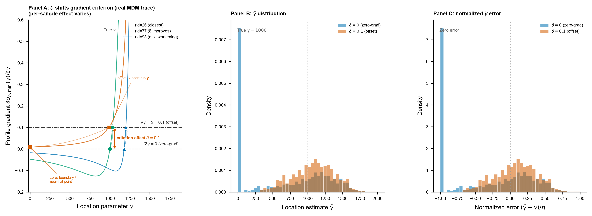

# 第1章 引言

三参数 Weibull 分布常用于疲劳寿命和可靠性分析，因为它能同时刻画失效机理（形状参数 β）、特征寿命（尺度参数 η）和安全阈值（位置参数 γ）。但工程试验成本高，实际样本量常只有 7–20 个。在这种小样本条件下，三个参数的联合估计对样本波动高度敏感，尤其是位置参数 γ 会改变分布支撑集，使传统估计方法面临困难(182-022; 182-090; 182-099)。

极大似然估计（MLE）是最常用方法之一，但三参数 Weibull 的位置参数使正则条件不再自动成立。Smith(1985)证明，当 β < 2 时 Fisher 信息矩阵发散，MLE 的渐近性质失效；Cohen 与 Whitten 也指出实际应用中只有 β > 2.2 时才建议使用 MLE(182-090; 182-091)。围绕 MLE、LSE、MPS、PWM、WMLE、Bayesian 和偏差修正方法，已有大量小样本改进研究(182-029; 182-060; 182-088; 182-096)。这些工作说明三参数 Weibull 小样本估计本身是一个长期问题，但本文并不重新展开一般方法比较。

谢里阳等在前两篇工作中提出并发展了 Minimum Discrepancy Method（MDM）作为三参数 Weibull 的新估计方法(182-030; 182-046)。第一篇工作提出最小差异原理：通过构造尺度参数伪估计量，并搜索使伪尺度估计差异最小的参数组合来完成估计。第二篇工作进一步发现，在位置参数 γ 的搜索过程中，如果沿用原始 `y = 0` 判据，有限样本下得到的 γ 估计值可能出现较大波动；这与判据曲线在局部平坦谷底附近的形态有关。为避免搜索落入不稳定区域，原作者引入一个小的正偏移量 δ，将判据由 `y = 0` 调整为 `y = δ`，并用经验值 `δ = 0.1` 改善了估计精度和稳定性。

问题在于，前述工作证明了 `δ = 0.1` 有效，却没有系统回答 δ 本身的性质。谢里阳等(182-046)明确说明，`0.1` 是“根据 120 个参数估计案例得到的经验值”，且更适当的偏移值与概率分布特征和样本大小有关。这留下了一个直接的方法发展问题：MDM 中的 offset 是否存在最优值？如果存在，最优值是在全局、按样本量、按真参数条件，还是逐样本层级上定义？不同层级能带来多少估计精度或稳定性改善？实际使用时真参数不可见，又该如何取得更合适的 δ？

本文接续 MDM 的前两篇工作，目标不是重新证明 MDM 是否优于 MLE/LSE，也不是把问题改写成“用神经网络优化 MDM”。本文要做的是把 MDM 中的经验 offset 从“`δ = 0.1` 有效”推进到“δ 的最优性、信息层级和可部署选择方式可以被正式评估”。具体而言，本文先在统一 Monte Carlo 框架下检验 `δ = 0.1` 是否接近最优全局常数，再建立 Default/L1–L6 信息层级，量化从全局常数、按样本量查表、按真参数 oracle 到逐样本 hindsight 的精度收益；最后，在真参数不可见的部署条件下，讨论能否仅凭样本值和样本量 `n` 选择更合适的 δ。

---

# 第2章 MDM 方法与偏移量问题

## §1 MDM 的基本步骤

三参数 Weibull 分布的累积分布函数为

$$F(t) = 1 - \exp\left[-\left(\frac{t - \gamma}{\eta}\right)^{\beta}\right], \quad t > \gamma$$

其中 β > 0 为形状参数，η > 0 为尺度参数，γ 为位置参数（失效阈值）。给定有序失效时间 $t_{(1)} \leq t_{(2)} \leq \cdots \leq t_{(n)}$，用 Bernard 中位秩公式估计经验累积概率 $\hat{F}(t_{(i)}) = (i - 0.3)/(n + 0.4)$，并令变换值 $x_i = -\ln(1 - \hat{F}(t_{(i)}))$。Weibull 分布经此变换可线性化为 $y = \gamma + \eta\, x^{1/\beta}$，这是 MDM 的几何基础。

MDM 的核心是尺度参数的伪估计量(182-030)。对于给定的候选参数 (β, γ)，每个样本点可反解出一个伪尺度参数估计：

$$\hat{\eta}_i = \frac{t_{(i)} - \gamma}{x_i^{1/\beta}}, \quad i = 1, 2, \ldots, n$$

当 (β, γ) 接近真值时，$n$ 个 $\hat{\eta}_i$ 应当一致——它们之间的差异源于样本波动。MDM 的核心判据是最小化这组伪尺度参数的条件标准差：

$$\sigma_\eta(\beta, \gamma) = \text{std}\left(\hat{\eta}_1, \hat{\eta}_2, \ldots, \hat{\eta}_n\right)$$

MDM 采用两步搜索策略。**内层**：对给定 γ，搜索使 $\sigma_\eta$ 最小的 β，$\beta^*(\gamma) = \arg\min_{\beta \in [0.1, 15.0]} \sigma_\eta(\beta, \gamma)$，得到 profile 标准差曲线 $\sigma_{\eta,\min}(\gamma)$。**外层**：在 γ 方向上搜索 $\sigma_{\eta,\min}(\gamma)$ 的极值点确定 γ̂，进而回代得到 (β̂, η̂)。

与 MLE 需要求解非线性方程组不同，MDM 采用搜索策略，不存在方程无解的问题(182-030; 182-046)。前作已围绕 MDM 与 MLE/LSE 的比较给出充分讨论，本文只把这些结果作为背景，重点转向 MDM 内部 offset 判据的性质。本节只写到读懂 γ profile 所需的最少步骤；完整的搜索协议、伪尺度参数构造细节和实现见 `python/methods/mdm.py`。

## §2 γ 搜索的不稳定来源与梯度偏移判据

在 MDM 的外层 γ 搜索中，原始思路是寻找 profile 标准差曲线 $\sigma_{\eta,\min}(\gamma)$ 的极值点，即使用 `y = 0` 的梯度判据。在确定性或理想样本意义下，$\sigma_{\eta,\min}(\gamma)$ 在真实 γ 附近应达到极值，其梯度应为零。

但谢里阳等(182-046)指出，有限随机样本会破坏这一理想关系：真实 γ 附近的梯度未必等于零，且在不同样本下可能大于零，也可能小于零。若直接以零梯度为判据，某些样本的位置参数估计会产生较大误差。这一不稳定来源与判据曲线在局部平坦谷底附近的形态有关。

第二篇 MDM 工作的修正是将判据从 `y = 0` 改为 `y = δ`（δ > 0）：

$$\left.\frac{\partial \sigma_{\eta,\min}(\gamma)}{\partial \gamma}\right|_{\gamma=\hat{\gamma}} = \delta$$

引入 δ > 0 的作用，是把"寻找零梯度极值点"改为"寻找达到一个小正梯度阈值的位置"，即用一条 y = δ 的水平判据线替代 y = 0 判据线。谢里阳等取 δ = 0.1（经验值，来自 120 个参数估计案例），并报告该修正在总体上缩小了位置参数估计的离散范围。换言之，offset 改变的是 γ 搜索判据的位置，而不是后处理修正。

本文的研究对象即此 δ：它是经验常数，还是可优化的决策变量？若是后者，最优值应在什么信息层级上定义、能带来多少改善、能否在真参数不可见的部署条件下逼近？

## §3 为什么 δ 不是任意小正数

一个自然的直觉是：既然 y = 0 不稳定，那只要取一个很小的正 δ 就能避开不稳定区域。但这一直觉并不成立。

δ 是稳定性收益与过度移动代价之间的折中。从 §2 的判据构造可以直接看出，δ 决定的是 y = δ 水平线与 $\sigma_{\eta,\min}(\gamma)$ 曲线的交点位置，即 γ 搜索落在 profile 曲线上的哪个点。δ 太小，搜索位置仍靠近 y = 0 判据下的不稳定谷底，对梯度的随机正负波动依然敏感；δ 太大，搜索位置整体偏移到 profile 曲线更陡的区段，γ̂ 系统性地偏离真值，引入新的偏差。

因此 δ 的取值是一个真实的决策问题，而不是"取一个小正数即可"。本章只给出这一机制理由；δ = 0.1 是否在数值上接近某个有意义的折中点、平坦区间有多宽、不同参数条件下最优 δ 朝哪个方向移动，这些正式数值证据留给第 4 章。

## §4 三子图机制/波动诊断

为使 §2-§3 的机制论证具体化，本节在同一代表配置下展示 δ 对 MDM γ 搜索的实际影响。代表配置固定为 `W(β=2, η=1000, γ=1000), n=7`，贴近 182-046 报告的工程语境。

**Figure 1.** δ 对 MDM γ 搜索判据与估计波动的影响。代表配置 `W(2, 1000, 1000), n=7`。Panel A：真实 MDM γ profile / 梯度判据图，横轴 γ，纵轴 profile gradient / 判据值；标出 `y = 0` 与 `y = 0.1` 两条水平判据线，以及二者对应的 γ 搜索位置。Panel B：同一配置下 `δ = 0` 与 `δ = 0.1` 的 γ̂ 分布，并标出真值 γ = 1000。Panel C：同一配置下 `δ = 0` 与 `δ = 0.1` 的归一化误差 (γ̂ − γ)/η 分布。样本选择规则和可复现记录见 `code/_fig1_sample_provenance.md`。

本图用于说明 δ 改变的是 γ 搜索判据位置，并展示 `y = 0` 与 `y = 0.1` 下 γ 估计波动的实际差异，而不是声称 `δ = 0.1` 对每个样本都改善。Panel A 基于 MDM 实现的真实 trace（非 stylized schematic）；Panel B/C 的分布基于与正式 MC 协议（第 3 章 §3）等价的配置生成。

## §5 承接

既然 δ 是 MDM 搜索判据中的决策量，而非任意小正数，下一章必须先定义"最优 δ"的操作性含义：在给定信息层级、δ grid 和正式 MC 风险函数下，δ* 是什么，又按哪些层级组织。

---
