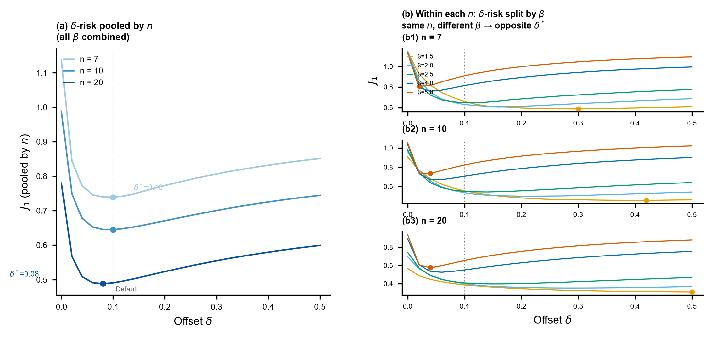

# 第4章 δ = 0.1 是否为最优全局常数？——L1 与 L2

## §1 全局 δ-risk 曲线

**图 3**(a) 展示了设计网格 pooled J₁ 随 δ 的变化曲线（基于 45 个参数组合 × R = 1000 的完整 MC 扫描）。因为每个参数组合的重复数相同，45 个 $(\beta,\gamma/\eta,n)$ 设计格点在该指标中等权。本章以下简称的“全局”均指这一正式设计网格下的等权 pooled 口径，不代表真实应用的参数分布。

**Figure 3.** δ 对 MDM 估计精度的影响。(a) 正式设计网格的等权 pooled δ-risk 曲线：J₁ 随偏移量 δ 的变化（45 参数组合 × R = 1000）。蓝色虚线标注该设计测度下的最优 δ\* = 0.08，橙色点线标注 Default δ = 0.10，灰色阴影为平坦区间 [0.06, 0.12]。(b) 分形状参数 β 的 δ-risk 曲线：5 个 β 值对应不同最优 δ（β = 1.5 时 δ\* = 0.36，β = 5.0 时 δ\* = 0.04），揭示全局平坦是不同 β 条件下最优 δ 方向相反、聚合后互相抵消的结果。

**正式设计网格等权 pooled 口径下，L1 最优常数 δ\* = 0.08，对应 J₁ = 0.6329。**

作为对比，Default δ = 0.1 对应 J₁ = 0.6332。两者差异为 0.048%（J₁ 差值 < 0.001），在本文设计测度下可忽略（**表 3**）。从这一等权设计网格视角看，δ = 0.1 近似最优——但这既不意味着"没有改进空间"，也不构成对其他参数分布的普遍最优性声明，原因见 §3。

**Table 3.** L1 最优 δ\* vs Default — 全缓存经验设计风险与分 β

| 层级 | δ | J₁ (全局) | 改善 vs Default |
|------|---|---------|----------------|
| **Default** | 0.10 | 0.6332 | — |
| **L1** (全局最优常数) | 0.08 | 0.6329 | +0.05% |

分 β 的 L1 vs Default（全局 δ\*=0.08 应用于各组合）：

| β | Default J₁ 范围 | L1 J₁ 范围 | L1 vs Default 典型改善 |
|---|---------------|-----------|----------------------|
| 1.5 | 0.33–0.72 | 0.33–0.78 | **−1% ~ −8%（恶化）** |
| 2.0 | 0.33–0.68 | 0.33–0.72 | −0.1% ~ −7%（持平或恶化） |
| 2.5 | 0.38–0.66 | 0.37–0.68 | +0.8% ~ −5%（混合） |
| 4.0 | 0.55–0.81 | 0.53–0.80 | **+2.1% ~ +3.5%（改善）** |
| 5.0 | 0.64–0.92 | 0.61–0.88 | **+2.9% ~ +4.3%（改善）** |

**L2 按 n 分层**：L2 全局 J₁ = 0.6325，相比 L1 改善 0.059%。

**结论**：在正式设计网格及其等权 pooled 口径下，全局常数层面（L1）和按 n 查表（L2）均无法系统性超越 Default。全局 δ\*=0.08 ≈ Default 0.1 是不同 β 条件下最优 δ 方向相反、聚合后抵消的结果。

数据溯源：`artifacts/formal/E1_baseline/summary.json`，`table_default_vs_L1.csv`，`table_L2_by_n.csv`

### 选点与评价分离的敏感性审计

表 3 的风险曲线用全部 1000 个 repeat id 估计并选取网格 argmin，因而首先是对正式设计网格的经验描述。为检查 26 个候选点中的择优噪声，本文另用 5 折 `repeat_id` cross-fitting 在未参与选点的重复上评价 L1/L2。

| 层级 | 全缓存同批选点/评价 J₁ | 5-fold cross-fit J₁ | 差值 |
|------|----------------------------:|--------------------:|------:|
| Default | 0.633219 | 0.633219 | 0 |
| L1 | 0.632913 | 0.632913 | 0 |
| L2 | 0.632541 | 0.632732 | +0.000191 |

L1 在五个训练折中都选择 $δ^*=0.08$，因而 cross-fit 与全缓存结果完全一致。L2 只在一折的 $n=7$ 选点中由 0.10 变为 0.08，使 cross-fit J₁ 比同批选点/评价值高 0.030%。在更严格的留出口径下，L1 相对 Default 改善 0.048%，L2 相对 Default 改善 0.077%，L2 相对 L1 仅改善 0.029%。因此“0.1 是强基线、L1/L2 难以产生有实质意义的改进”并非同批数据择优造成的假象。

cross-fit 溯源：`artifacts/formal/E1_E2_crossfit/model_comparison.csv`、`comparison_vs_same_sample.csv`、`selected_deltas.csv`。

δ-risk 曲线在 δ ∈ [0.06, 0.12] 区间极为平坦，完整 26 点曲线见 `artifacts/formal/E1_baseline/delta_risk_curve.csv`。这一平坦区间解释了为什么原文经验取值 δ = 0.1 仍然有效：在全局聚合层面，0.1 落在了对精度不敏感的平台上。

## §2 分 n 的 δ-risk 曲线

L2 按 n 分层选择最优 δ。分 n 的最优值如下：

| n | δ\*(L2) | J₁(L2) |
|---|---|---|
| 7 | 0.10 | 0.7393 |
| 10 | 0.10 | 0.6445 |
| 20 | 0.08 | 0.4882 |

n = 7 和 n = 10 的最优 δ 均为 0.10（恰好等于 Default），仅 n = 20 略偏至 0.08。L2 全局 J₁ = 0.6325，相比 L1 的 0.6329，改善仅 0.059%。

**图 4** 将这一结果可视化，并揭示其背后的异质性结构。

**Figure 4.** 样本量 n 对 δ-risk 的影响与 β 异质性。(a) 按 n 汇总的 δ-risk 曲线（所有 β 合并）：n = 7/10/20 的最优 δ\* 分别为 0.10/0.10/0.08，J₁ 水平由 n=7 时约 0.74 降至 n=20 时约 0.49，但最优 δ 几乎不随 n 移动。(b) 在每个 n 内部按 β 分解：同一 n 下，β = 1.5（橙）和 β = 5.0（红）的最优 δ 方向相反（如 n = 7 时 β=1.5 → δ\* = 0.30，β=5.0 → δ\* = 0.02）。这说明 pooled by n 的曲线掩盖了同一 n 内 β 造成的强异质性——n 决定 J₁ 的整体水平，但不决定 δ\* 的方向。

**结论：按 n 分层（L2）相比全局常数（L1）几乎没有收益。** 样本量 n 强烈影响 J₁ 的水平（n 越大估计越准），但单独按 n 选 δ 的边际收益极小，因为同一 n 内不同 β 的最优 δ 方向相反，pooled 后互相抵消。

## §3 L1 vs Default 的分参数视角——为什么全局看起来无改进

全局 J₁ 的近乎相等掩盖了一个重要的分参数现象。**图 3**(b) 将 δ-risk 曲线按 β 分解，Table 3 则从 L1 vs Default 的角度量化了这种结构差异：β = 1.5 时 L1 反而恶化 1%–8%，β = 4.0–5.0 时 L1 稳定改善约 2%–4%。完整 45 组合见 `table_default_vs_L1.csv`。

这一模式揭示了全局最优 δ\* = 0.08 ≈ Default 0.1 的真正成因：**不同 β 条件下最优 δ 方向相反**。具体而言，最优 δ\* 与 β 强相关——β 小时需要更大的 δ（β = 1.5 时 δ\* ≈ 0.36），β 大时需要更小的 δ（β = 5.0 时 δ\* ≈ 0.04）。全局常数 δ\* = 0.08 是这些相反方向的误差在聚合后互相抵消的结果，而非"所有条件下都接近最优"。

这意味着：**全局常数层面（L1）确实无法系统性地超越 Default 0.1**。但这不是一个简单的负结果，而是给出两层含义：一方面，前作经验值 0.1 在全局聚合层面确实是强基线；另一方面，改进空间并没有消失，而是被不同 β 条件下相反方向的最优 δ 抵消了。若要继续寻找收益，问题必须转向更高信息层级。

γ/η 的效应相对次要：相同 β 下，γ/η = 0.1（小位置参数）时 L1 改善最大或恶化最小，γ/η ≥ 0.5 时 L1 的劣势更明显。这可能与 MDM 在大位置参数场合的搜索敏感性有关，但本章不把它作为独立机理结论。

## §4 本章小结

本章回答论文主问题 Q1：**δ = 0.1 是否为最优全局常数？**

- **全局层面**：L1 最优 δ\* = 0.08 与 Default 0.1 差异为 0.048%（J₁: 0.6329 vs 0.6332），工程上可忽略。δ ∈ [0.06, 0.12] 为平坦区间。
- **按 n 分层**：L2 相比 L1 改善仅 0.059%。样本量 n 强烈影响 J₁ 的水平（n=20 的 J₁ ≈ 0.49 vs n=7 的 0.74），但单独按 n 选 δ 的边际收益极小，因为同一 n 内不同 β 的最优 δ 方向相反、pooled 后互相抵消（**图 4**）。
- **分参数视角**：全局常数的"近似最优"是不同 β 条件下最优 δ 方向相反、聚合后互相抵消的结果。β = 4.0–5.0 时 L1 在各组合中均低于 Default 2–4%，β = 1.5 时 L1 反而恶化 1–8%。

结论：**在本文正式设计网格的等权 pooled 口径下，全局常数 δ 和按 n 查表均无法系统性地超越经验值 0.1。** 原文的 0.1 因而是该设计测度下的强基线，但这不等于已证明其对任意真实参数分布都近似最优。L1/L2 收益极小，也不等于没有改进空间；改进空间来自更高信息层级，尤其 β 异质性——第 5 章在 oracle 条件下回答这一问题。

---
