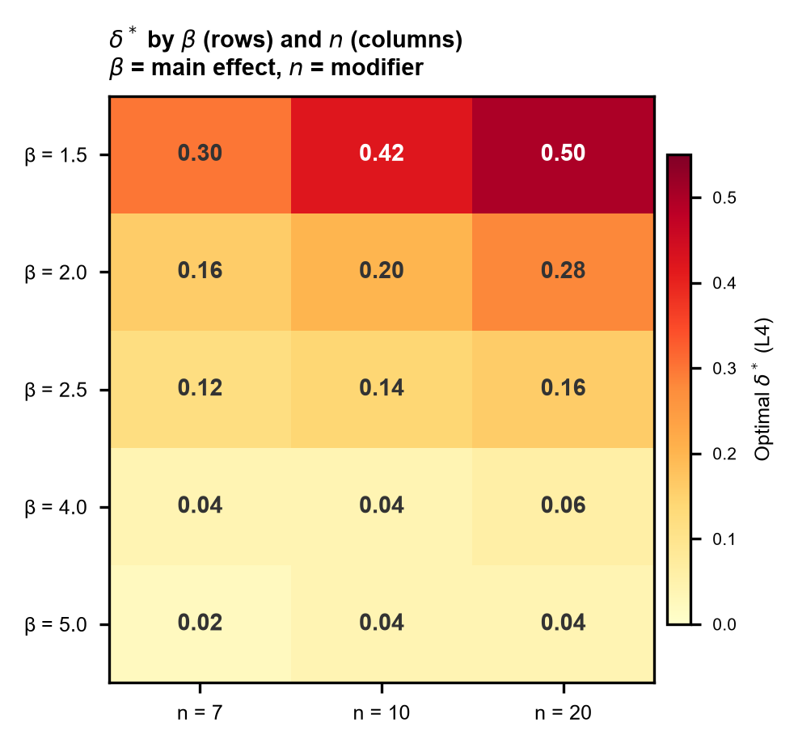
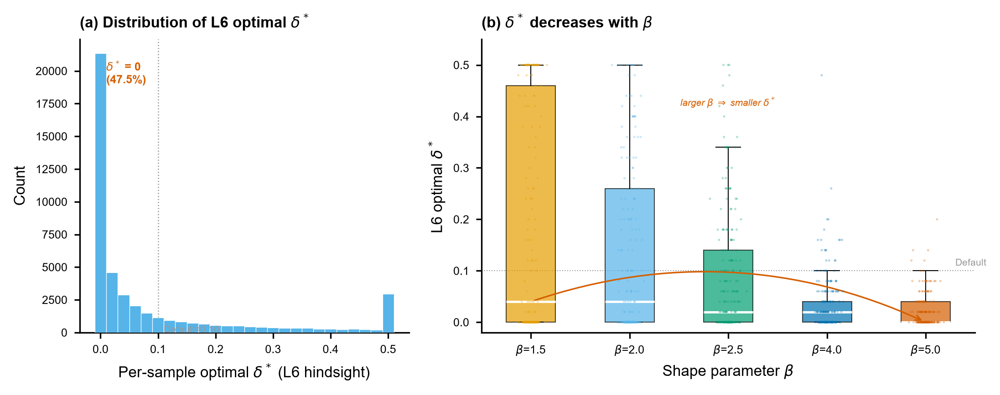

# 第5章 Oracle 层级——L3 到 L6 的参照精度

第 4 章表明，全局常数（L1）和按 n 查表（L2）均无法系统性超越经验值 δ = 0.1。一个自然的问题是：如果**知道更多**——不仅知道 n，还知道 β、γ/η，甚至逐样本——精度能提升多少？本章在 oracle 条件下（真参数已知）回答这一问题，量化每一级信息的边际价值，并给出扫描网格内的逐样本 hindsight 参照。

## §1 阶梯总览：Default → L6

**图 5** 和 **表 4** 展示了从 Default 到 L6 的完整精度阶梯。

**Figure 5.** Oracle 层级的精度阶梯。(a) Default–L6 各层级的绝对 $J_1$：灰色=可部署（Default, L1, L2），蓝色=oracle（L3–L5），橙色=hindsight（L6）。(b) 相邻层级的逐级相对 $J_1$ 降幅，定义为 $(J_{1,k-1}-J_{1,k})/J_{1,k-1}$：L2→L3 为 7.51%，是从简单可部署层级进入组级 oracle 的主要信息增益；L3→L4 和 L4→L5 分别为 0.51% 和 1.88%，均低于 L2→L3，但两者不呈单调递减。L5→L6 为 13.42%，但它来自从组级选择转向逐样本事后选择，因而单独标记为 **hindsight gap**，不与 L2→L3 并称为同质的信息增益。Panel A 只承担绝对精度定位，Panel B 区分信息层级收益与 hindsight gap；本图不纳入 MLE 横向锚点。

**Table 4.** Default–L6 全缓存经验风险阶梯

| 层级 | 决策粒度 | δ\* | J₁ (全局) | 改善 vs Default | 改善 vs 上一级 | 性质 |
|------|---------|-----|---------|----------------|--------------|------|
| **Default** | 固定 0.1 | 0.10 | 0.6332 | — | — | 基线 |
| **L1** | 全局最优常数 | 0.08 | 0.6329 | +0.05% | +0.05% | 可部署 |
| **L2** | 按 n | 0.08–0.10 | 0.6325 | +0.11% | +0.06% | 可部署 |
| **L3** | 按 β | — | 0.5851 | +7.60% | **+7.51%** | oracle |
| **L4** | 按 β+n | — | 0.5821 | +8.07% | +0.51% | oracle |
| **L5** | 按 β+γ/η+n | — | 0.5712 | +9.80% | +1.88% | oracle |
| **L6** | 逐样本 | — | 0.4945 | +21.90% | **+13.42%** | hindsight |
| | | | | | | |

数据溯源：`artifacts/formal/E2_oracle_layers/ladder_L1_L6.csv`，`artifacts/formal/E1_baseline/summary.json`。Figure 5(b) 与表 4 的“改善 vs 上一级”使用同一逐级相对降幅公式。

### L1–L5 cross-fit 敏感性

表 4 用全部 1000 个 repeat id 估计各组风险曲线，并在同一缓存上报告网格 argmin 处的经验 J₁。为排除同批选点/评价的择优偏差，L1–L5 另进行 5 折 `repeat_id` cross-fitting。L6 不进入该表，因为它的定义就是对每个样本事后查看整条损失曲线，不是一个可在留出样本上直接应用的查表规则。

| 层级 | 全缓存同批选点/评价 J₁ | 5-fold cross-fit J₁ | cross-fit 相对变化 |
|------|----------------------------:|--------------------:|-------------------:|
| Default | 0.633219 | 0.633219 | 0 |
| L1 | 0.632913 | 0.632913 | 0 |
| L2 | 0.632541 | 0.632732 | +0.030% |
| L3 | 0.585068 | 0.585068 | 0 |
| L4 | 0.582090 | 0.582585 | +0.085% |
| L5 | 0.571170 | 0.571924 | +0.132% |

cross-fit 后的核心阶梯不变：L2→L3 改善 7.53%，L3→L4 改善 0.42%，L4→L5 改善 1.83%。L1 的全局选点和 L3 的 5 个 $\beta$ 选点在五折中完全稳定；L2 的 3 个分组中有 2 个完全稳定，L4 为 10/15，L5 为 28/45。后两层的个别 $δ^*$ 会因 Monte Carlo 子样本而移动，但留出 J₁ 只轻微上调，说明层级收益结构不依赖同批数据择优。

cross-fit 溯源：`artifacts/formal/E1_E2_crossfit/model_comparison.csv`、`comparison_vs_same_sample.csv`、`selection_stability.csv`。

阶梯呈现一个主要信息增益、两个幅度较低但不单调的后续组级增益，以及一个 hindsight gap：

- **L2→L3：+7.5%**——这是可部署层级与组级 oracle 层级之间的主要信息增益。仅引入 β 信息（每个 β 对应一个最优 δ\*），就获得了全部可部署层级（Default/L1/L2，合计改善 ≤0.11%）无法触及的精度增益。
- **L3→L4→L5：+0.51% 和 +1.88%**——两级增益均低于 L2→L3 的 7.51%，但 L4→L5 高于 L3→L4，因而不构成单调递减序列。
- **L5→L6：+13.4% hindsight gap**——这一差距不是再加入一个真参数就能获得的下一级信息收益，而是从组级选择切换为逐样本事后查看整条损失曲线后的选择。它用于表示扫描网格内的最强 hindsight 参照，不是部署阶梯的下一步（§4）。

以下各节逐层分析。

## §2 L3：β 信息是主要驱动因素

L3 为每个 β 值分配一个最优 δ\*。结果如下：

| β | δ\*(L3) | J₁(L3) |
|---|--------|--------|
| 1.5 | 0.36 | 0.4689 |
| 2.0 | 0.20 | 0.5004 |
| 2.5 | 0.12 | 0.5397 |
| 4.0 | 0.04 | 0.6611 |
| 5.0 | 0.04 | 0.7161 |

**在正式网格的 5 个 $\beta$ 水平上，L3 的最优 $\delta^*$ 随 $\beta$ 单调不增**：$\beta=1.5/2.0/2.5/4.0/5.0$ 对应的 $\delta^*$ 依次为 0.36/0.20/0.12/0.04/0.04，Spearman $\rho=-0.975$；末两个设计点并列。这一结果与第 4 章 §3 的分 $\beta$ 分析一致——L1 全局 $\delta^*=0.08$ 是不同 $\beta$ 条件下选点差异在聚合后抵消的结果。该相关系数只描述 5 个预设设计点，不用于推断正式网格之外的总体相关性。

**为什么 β 会成为主要分层变量？** 当前结果直接支持的经验关系是：β 越小，最优 δ 越大；β 越大，最优 δ 越接近低值。为检查这一关系是否伴随 profile 曲线几何变化，我们在固定 $\eta=1$、$\gamma/\eta=0.5$ 下重建 5 个 $\beta$、3 个 $n$、每格 20 个 repeat，共 300 个正式 seed 样本，并提取真实 $\gamma$ 邻域内的局部梯度斜率作为曲率代理。$\beta$ 与该代理的 Spearman $\rho$ 在 $n=7/10/20$ 下分别为 −0.463、−0.495 和 −0.529，三个样本量下方向一致；这说明有限样本 profile 曲线几何随 $\beta$ 系统变化，与上述机制解释一致。不过，真实 $\gamma$ 处梯度的方向并未跨 $n$ 保持一致，且该审计没有识别“尾部形态 → profile 几何 → 最优 $\delta$”的因果链。因此，本文只把 $\beta$ 作为观测到的主要信息层级，不将尾部形态解释写成已证明机制。

L3 以仅 5 个 δ\* 值（每个 β 一个）就获得了 +7.6% 的改善，说明**当前主网格中最大的 oracle 收益来自对 β 条件的自适应**。这为第 6 章提供了任务方向：样本自适应方法应优先学习与 β 相关的可观测形态特征，同时必须检查这种学习在不同 n 下是否稳定。

## §3 L4–L5：n 和 γ/η 的边际贡献

### L4（按 β+n）

L4 在 L3 基础上加入 n 信息，为每个 (β, n) 组合分配 δ\*。从 L3 到 L4，J₁ 从 0.5851 降至 0.5821，逐级相对降幅为 0.51%。

L4 的 $\delta^*$ 表（**图 6**）显示，固定 $n$ 改变 $\beta$ 所对应的选点跨度，大于固定 $\beta$ 改变 $n$ 所对应的跨度。

**Figure 6.** L4 层级最优 δ\* 的 β×n 结构（数据来自 L4_by_beta_n.csv）。行为形状参数 β（1.5–5.0），列为样本量 n（7/10/20），颜色和数值为该 (β, n) 组合的最优 δ\*。固定 $n$ 改变 $\beta$ 时，三个 $n$ 水平上的 $\delta^*$ 跨度为 0.28/0.38/0.46，平均为 0.37；固定 $\beta$ 改变 $n$ 时，五个 $\beta$ 水平上的跨度为 0.20/0.12/0.04/0.02/0.02，平均为 0.08。前一平均跨度为后一平均跨度的 4.67 倍。该比较只描述正式设计网格中的选点变化，不构成正式方差分解或假设检验。

分 $\beta$ 看，$\beta=1.5$ 时 $\delta^*$ 随 $n=7/10/20$ 由 0.30 增至 0.42/0.50，跨度为 0.20；$\beta=2.0$ 时跨度为 0.12。$\beta=4.0$ 和 5.0 时，相应跨度均为 0.02。因而 $n$ 仍应作为分层诊断和部署变量保留；与此同时，从 pooled $J_1$ 看，L3→L4 的逐级相对降幅为 0.51%。

### L5（按 β+γ/η+n）

L5 进一步加入 $\gamma/\eta$ 信息，$J_1$ 从 0.5821 降至 0.5712，逐级相对降幅为 1.88%。在 15 个 $(\beta,n)$ 单元中，固定 $(\beta,n)$ 改变 $\gamma/\eta$ 时，最优 $\delta^*$ 的跨度平均为 0.092、中位数为 0.08，范围为 0–0.22；其中 1/15 个单元跨度为 0。该分布说明 $\gamma/\eta$ 对选点的关联幅度随 $(\beta,n)$ 而变，不能由单个参数组合概括。

### 后续组级信息增益的解读

L2→L3、L3→L4 和 L4→L5 的逐级相对 $J_1$ 降幅分别为 7.51%、0.51% 和 1.88%。后两级均低于引入 $\beta$ 信息的 L2→L3，但从 0.51% 回升至 1.88%，不支持单调递减表述。这对实际部署的含义是：样本自适应方法应优先捕捉与 $\beta$ 相关的形态信息，同时仍需评估 $n$ 与 $\gamma/\eta$ 所对应的附加信息。尤其 $n$ 是实际使用时已知且低成本的信息，也是小样本可靠性估计中需要分层说明的变量。因此，后续 NN 或其他自适应策略即使以 $\beta$ 相关特征为主，也必须报告不同 $n$ 下的表现。

## §4 L6：逐样本 hindsight benchmark（扫描网格内）

L6 为每个 MC 重复样本单独选取 $\delta_i^*=\arg\min_{\delta\in D}\ell_i(\delta)$，是本文 δ 扫描网格（0.00–0.50，步长 0.02）上的逐样本 hindsight benchmark——事后回看每个样本在哪个离散网格点上单样本损失 $\ell_i(\delta)$ 最低。它反映的是离散网格上的参照基准，而非连续 δ 空间内的全局最优；网格外的 δ 值未被检验。对所有样本完成这一事后选择后，再用 $J_1=\sqrt{R^{-1}\sum_i\ell_i(\delta_i^*)}$ 汇总 L6 的整体表现。

**图 7** 用逐样本选点分布解释 hindsight gap 的来源及其不可部署性，不把该分布当作实际应用中可直接照抄的 $\delta$ 推荐分布。

**Figure 7.** L6 hindsight gap 的逐样本来源。(a) 全样本直方图：47.46% 的样本最优 $\delta^*=0$，6.57% 的样本最优 $\delta^*=0.50$，显示事后选择包含大量端点质量，且两个精确端点的方法含义不同。(b) 分 $\beta$ 的 boxplot：它不重复 Figure 6 对 $\beta$ 主分层的说明，而是显示给定 $\beta$ 后的组内逐样本分布仍不等于一个查表点；例如 $\beta=1.5$ 的中位数为 0.04，但 IQR 延伸至 0.46，而 $\beta=5.0$ 的中位数为 0 且 IQR 仅到 0.04。两面板共同说明 L5→L6 的 13.42% 来自逐样本事后选择空间，不是一张可直接部署的 $\delta$ 查表。

L6 的 J₁ = 0.4945，相比 L5 改善 13.4%——看似可观，但需要谨慎解读：

1. **下端点 δ\* = 0 的堆积**。47.46% 的样本最优 δ\* 恰好为零。这不是说"这些样本不需要偏移"，而是 δ grid 上具有方法含义的“无偏移”候选 δ = 0 恰好对这些 MC 样本给出了最低的 $\ell_i(\delta)$；这一现象同时提示 L6 含有较强的逐样本偶然性。

2. **上端点 δ\* = 0.50 的截断含义**。L6 中 6.57% 的样本在人为设置的网格上界取得最小损失，且该比例在 $n=7/10/20$ 下分别为 4.24% / 5.85% / 9.63%；若将 near-upper 定义为 $\delta\ge0.46$，pooled 比例为 7.58%。这表明部分逐样本损失曲线可能在 0.50 之外继续下降；它不推翻 existing-grid hindsight 参照，但禁止将当前 L6 解读为连续空间最优或已证明 0.50 上界充分。

3. **L6 的不可部署性**。L6 的最优 δ\* 是事后（hindsight）选出的——实际使用中不可能事先知道某个新样本的最优 δ。L6 的价值在于给出扫描网格内的 hindsight 参照，而非作为部署目标。

4. **L6 可以作为压力测试参照，但不能写成部署目标**。L5 的 J₁ = 0.5712 是"组级真参数信息能达成的参照"，而样本自适应方法的任务是用可观测样本特征尽量逼近或解释 oracle/hindsight 阶梯中的可学习部分。L6 的 +13.4% 中有相当部分来自逐样本差异和偶然性，因此它适合作为 sample-level hindsight target test 或最强的离线 hindsight 参照；若 E3 使用 L6 监督粒度，必须用真实 selected-loss J₁、near-optimal/regret 和边界诊断解释结果，不能把 L6 写成实际部署目标。

## §5 MLE 锚点

标准 MLE 在同一参数网格上的表现为 J₁ = 1.1009（仅算收敛样本），失败率 30.4%。这一结果仅在此作为绝对精度背景，不进入 Figure 5 或 Table 4，也不与只计收敛样本的 MLE 展开横向排名。本文的实证主线始终是 MDM 内部选择 $\delta$ 能否进一步降低误差。

MLE 背景数据溯源：`artifacts/formal/shared_data/mle_anchor.csv`。

## §6 本章小结

- **主要信息增益与 hindsight gap 必须分开**：L2→L3（+7.5%）表示引入 $\beta$ 组级信息的主要收益；L5→L6（+13.4%）则是逐样本 hindsight gap，不是同质的下一级信息收益。
- **L3 之后的两级组级增益均低于 L2→L3，但不单调**：在 $\beta$ 基础上继续加入 $n$（L4）和 $\gamma/\eta$（L5），逐级相对 $J_1$ 降幅分别为 0.51% 和 1.88%。主要组级增益来自 $\beta$ 自适应，但 $n$ 仍应作为可部署查表变量和小样本诊断维度保留。
- **Figure 7 解释 L6 为何是 hindsight benchmark 而不是部署查表**：47.46% 的样本 $\delta^*=0$ 反映无偏移候选的重要性及逐样本偶然性；6.57% 的样本 $\delta^*=0.50$ 是人为上界截断警示；分 $\beta$ 后仍可见组内逐样本分散。L6 可以作为 E3 的 sample-level target test，但结果必须回到 selected-loss 和边界诊断解释，不能被写成可直接部署的目标。

结论：**oracle 精度的最大增益来自 β 信息，但 n 仍是部署和审稿解释中不可省略的维度。** L3 以 5 个 δ\* 值获取了大部分收益，L4/L5 的 pooled 边际改善有限，L6 则给出逐样本 hindsight 的压力测试参照。这意味着第 6 章的样本自适应方法应优先学习与 β 相关的样本形态，同时按 n 分层检验其收益是否稳定，并清楚区分可部署输入、oracle 参照和 hindsight 诊断。

---
