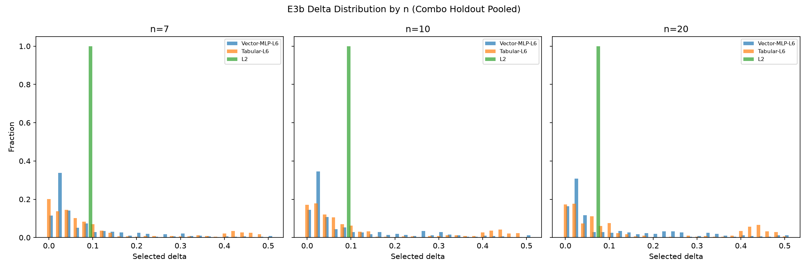

# 第6章 样本自适应偏移量选择

第 5 章表明，L3-L5 oracle 层级能够显著降低 MDM 偏移量选择带来的参数误差，但这些层级依赖真参数信息，不能直接用于实际部署。L6 逐样本 hindsight 又进一步降低 J1，却只能在事后知道每个样本在整个 delta 网格上的真实损失后才能选出。因此，本章的问题不是“能否用神经网络替代 MDM”，而是更具体的部署问题：

> 在真参数不可见时，能否仅凭样本可观测统计特征，为新样本选择比固定 `delta = 0.1` 和 L2 查表更合适的偏移量？

本章使用 Formal E3 的 existing-grid 证据回答这一问题。E3a 是轻量 scalar risk-curve pilot，用于验证样本特征和候选 delta 到 loss 的学习信号；E3b 是更严格的 vector-output MLP follow-up，用 5-fold full `(beta, gamma/eta, n)` combo holdout 检验未见参数组合上的选择质量。当前正文主张限定为：**在本文正式离散网格内，样本可观测特征含有实质的可部署偏移量选择信号**。本章不把 E3b 外推为 continuous-space 泛化结论，也不自动完成第 7 章的边界与稳健性验证。

## §1 从 oracle 参照到可部署选择器

L3-L5 的最优 delta 是按真参数分组得到的。例如 L5 按 `(beta, gamma/eta, n)` 给出组级最优 delta。实际使用时，新样本的 `beta` 和 `gamma/eta` 正是待估参数，不能作为输入。因此，样本自适应选择器只能使用下列可观测信息：

```text
n,
x_(1), x_(n), range,
Q1, Med, Q3, IQR,
x_bar, s, CV,
g1, g2
```

E3a 采用 scalar risk-curve 形式：输入 `sample_features + candidate delta`，输出该候选 delta 的 raw loss。E3b 改为 vector-output 形式：输入样本特征一次性输出 26 维 loss curve，再通过 `argmin_delta` 选择偏移量。E3b 不把 candidate `delta` 放进 vector 模型输入，这更接近部署时“给定一个样本，一次性预测其风险曲线”的使用方式。

训练标签使用单样本 raw loss：

```text
loss_i(delta) =
((beta_hat_i(delta)-beta)/beta)^2
+ ((eta_hat_i(delta)-eta)/eta)^2
+ ((gamma_hat_i(delta)-gamma)/eta)^2
```

最终评价仍使用全文主指标：

```text
J1 = sqrt(mean_i loss_i(delta_hat_i))
```

也就是说，模型训练拟合的是风险曲线，论文评价的是用预测曲线选出的 `delta_hat` 在真实 MDM 估计结果上的 selected-loss J1。predicted-loss MSE 不是本章主指标。

## §2 E3b 实验合同与来源

E3b 复用 E1/E2 的正式 MC 扫描数据，不重跑 MDM。正式网格为 `beta={1.5,2.0,2.5,4.0,5.0}`、`eta=1.0`、`gamma/eta={0.1,0.5,1.0}`、`n={7,10,20}`、`delta=0.00:0.02:0.50`、每个参数组合 `R=1000`。主判断采用 5-fold full `(beta, gamma/eta, n)` combo holdout，每折留出 9 个完整参数组合，合计 45,000 个测试样本。

E3b 比较以下方法：

- **Default**：固定 `delta = 0.1`。
- **L1**：全局最优常数。
- **L2**：按 `n` 查表。
- **L3-L5 oracle**：按真参数分组的参照层级。
- **L6 hindsight**：逐样本扫描网格内 hindsight benchmark。
- **Vector-MLP-L4/L5/L6**：vector-output MLP，差异在于监督粒度。
- **Tabular-L6**：scalar tabular baseline，用于判断向量 MLP 是否真的利用了样本特征。

数据溯源如下：

- 代码入口：`code/run_E3b_vector_mlp.py`
- 产物目录：`artifacts/formal/E3b_vector_mlp/`
- 主结果：`model_comparison.csv`
- 稳定性：`seed_stability.csv`
- 诊断：`endpoint_diagnostics.csv`、`near_optimal_diagnostics.csv`、`feature_ablation.csv`
- 验收报告：`E3b_acceptance_report.md`
- 契约测试：`python/tests/test_study01_e3b_contract.py`，11 passed, 0 skipped, 0 failed

需要注意 provenance 口径：`manifest.json` 记录的 `git_commit=04e99c5` 是生成时的基础 HEAD，且 `workspace_dirty=true`，因为 E3b 脚本和产物是在提交前同轮新建。最终可审计封存点是 `bedd65a`，该提交包含 E3b 脚本、产物、run log、contract tests 和 coworker 报告。正文引用时应写成“E3b package sealed at `bedd65a`”，而不是写成 `manifest.git_commit` 指向生成器提交。

## §3 主结果：样本特征显著优于简单可部署层级

**图 8** 展示了 E3b 各方法的 pooled J1 对比。


**Figure 8.** E3b combo holdout 下的模型 J1 对比。灰色为简单可部署基线，蓝色为 oracle/hindsight 参照，橙色为样本自适应模型。主判断使用 45 个完整 `(beta, gamma/eta, n)` 组合的 5-fold holdout。

**Table 5.** E3b combo holdout pooled 结果

| 方法 | J1 ↓ | failure rate | n=7 J1 | n=10 J1 | n=20 J1 | 性质 |
|------|-----:|-------------:|-------:|--------:|--------:|------|
| L6-hindsight | 0.494530 | 0.000 | 0.591115 | 0.503582 | 0.361479 | hindsight |
| **Vector-MLP-L6** | **0.547003** | **0.000** | **0.657558** | **0.549815** | **0.403679** | 可部署输入 |
| Tabular-L6 | 0.557849 | 0.000 | 0.666695 | 0.563795 | 0.413813 | 可部署输入 |
| L5-oracle | 0.571170 | 0.000 | 0.676581 | 0.579700 | 0.429992 | oracle |
| L4-oracle | 0.582090 | 0.000 | 0.685935 | 0.591759 | 0.442494 | oracle |
| L3-oracle | 0.585068 | 0.000 | 0.690009 | 0.592188 | 0.447339 | oracle |
| Vector-MLP-L5 | 0.596829 | 0.000 | 0.708311 | 0.605144 | 0.448010 | 可部署输入 |
| Vector-MLP-L4 | 0.606229 | 0.000 | 0.712337 | 0.617645 | 0.462204 | 可部署输入 |
| L2 | 0.632541 | 0.000 | 0.739286 | 0.644520 | 0.488235 | 可部署查表 |
| L1 | 0.632913 | 0.000 | 0.739733 | 0.645104 | 0.488235 | 可部署常数 |
| Default | 0.633219 | 0.000 | 0.739286 | 0.644520 | 0.490866 | 经验基线 |
| MLE anchor | 1.1009 | 0.304 | — | — | — | 绝对精度锚点 |

结果显示，`Vector-MLP-L6` 的 pooled J1 为 0.547003，明显优于 L2 的 0.632541，改善幅度为 0.085538。它也优于 `Tabular-L6`（0.557849），说明 vector-output risk curve 不是只复现一个普通 tabular baseline，而是在同一输入边界下取得了更强的选择质量。

更重要的是，`Vector-MLP-L6` 落在 oracle 阶梯内部：它优于 L3/L4/L5 组级 oracle 参照，但仍未达到 L6 hindsight。这个结果并不矛盾。L5 是按真参数组合查表的组级 oracle，不包含同一参数组合内的逐样本形状差异；而样本统计特征包含每个样本的 order statistics、分位数、离散度和形状信息，可以在 existing-grid 上利用一部分组内差异。因此，`Vector-MLP-L6` 数值上优于 L5，不能被解读为“超过理论上界”，也不能被解读为使用了真参数输入。真正不可部署的 hindsight 参照仍是 L6，其 J1=0.494530。

## §4 按 n 分层：三个样本量方向一致

第 4 章已经说明，`n` 单独作为查表变量几乎不能带来系统改进；但 `n` 仍然是部署时已知且审稿人最关心的小样本维度。E3b 因此必须检查每个 `n` 下的方向是否一致。

`Vector-MLP-L6` 在三个样本量下均优于 L2：

- `n=7`：0.657558 vs L2 0.739286
- `n=10`：0.549815 vs L2 0.644520
- `n=20`：0.403679 vs L2 0.488235

这一结果说明，样本自适应信号不是由某一个 `n` 分层单独拉动的。小样本 `n=7` 仍是误差最高的场景，但改善方向与 `n=10`、`n=20` 一致。换言之，E3b 支持的是“在当前离散正式网格内，样本特征能够跨样本量提供更细的 delta 选择信息”，而不是“某一个样本量偶然受益”。

## §5 稳定性与 endpoint 诊断

E3b 对 `Vector-MLP-L6` 进行了 3 seed 稳定性检查。

**Table 6.** `Vector-MLP-L6` seed stability

| seed | pooled J1 ↓ | n=7 J1 | n=10 J1 | n=20 J1 | endpoint rate |
|-----:|------------:|-------:|--------:|--------:|--------------:|
| 42 | 0.547003 | 0.657558 | 0.549815 | 0.403679 | 0.4881 |
| 2026 | 0.546133 | 0.657899 | 0.549735 | 0.399680 | 0.4884 |
| 3407 | 0.544009 | 0.657170 | 0.545974 | 0.397339 | 0.5624 |

三组 seed 的 pooled J1 非常接近，且均明显优于 L2。因此，本章可以写“E3b 主 J1 结论在三 seed 下稳定”。但 endpoint rate 有一定波动，尤其 seed 3407 上升到 0.5624，说明模型的具体 delta 分布仍具有训练敏感性。该敏感性不推翻 selected-loss 结论，但提示后续 E4 或 E3c 若要形成更强部署推荐，必须继续检查 endpoint 行为的稳健性。

**图 9** 展示了 delta 分布和 endpoint 诊断。



**Figure 9.** E3b 预测 delta 分布诊断。`Vector-MLP-L6` 的 endpoint 选择率较高，但需与真实 selected-loss、near-optimal/regret 共同解释。

`Vector-MLP-L6` pooled endpoint 诊断为：

- `P(delta_hat=0)` = 0.1408
- `P(delta_hat=0.5)` = 0.0106
- `P(delta_hat in {0,0.02,0.48,0.5})` = 0.4881

endpoint rate 高不能直接判为缺陷，因为 L6 hindsight 本身也高度 endpoint 化：E3b 报告中 L6-hindsight 的 extreme rate 为 0.6474。这说明当前 delta-risk 曲线在许多样本上确实把最优或近最优点推向网格边界。正确的判断标准仍是 selected-loss J1 和 near-optimal/regret，而不是 endpoint rate 单项。

## §6 near-optimal 与特征消融

E3b 的 near-optimal 诊断进一步支持主结果。相对 L2，`Vector-MLP-L6` 降低了平均 regret，并显著提高 near-optimal hit rate。

**Table 7.** Near-optimal / regret 诊断

| 方法 | mean regret ↓ | mean relative regret ↓ | near 1% | near 2% | near 5% |
|------|--------------:|-----------------------:|--------:|--------:|--------:|
| **Vector-MLP-L6** | **0.054652** | **2.155035** | **0.3138** | **0.3481** | **0.4090** |
| Tabular-L6 | 0.066636 | 3.173833 | 0.2854 | 0.3083 | 0.3587 |
| L2 | 0.155548 | 7.427484 | 0.0919 | 0.1221 | 0.1878 |

这说明 `Vector-MLP-L6` 的优势并非只来自少数极端样本拉低 J1；它在更广泛样本上提高了接近逐样本最优 delta 的概率。L2 的 near 5% 仅为 0.1878，而 `Vector-MLP-L6` 为 0.4090。

E3b 还对 `Vector-MLP-L6` 做了 fold 1、seed 42 的特征消融。

**Table 8.** Feature ablation（fold 1, seed 42）

| 特征组 | 特征数 | pooled J1 ↓ | n=7 | n=10 | n=20 | endpoint rate | near 5% |
|--------|-------:|------------:|----:|-----:|-----:|--------------:|--------:|
| full | 13 | 0.528518 | 0.616461 | 0.560808 | 0.378764 | 0.4883 | 0.4112 |
| n only | 1 | 0.606215 | 0.693084 | 0.643236 | 0.456478 | 0.0000 | 0.2120 |
| scale/quantile | 10 | 0.535027 | 0.623536 | 0.563625 | 0.390246 | 0.5538 | 0.3990 |
| shape | 4 | 0.544438 | 0.622079 | 0.573398 | 0.416499 | 0.5744 | 0.4033 |

消融结果给出两个直观结论。第一，`n only` 明显弱于 full features，说明 E3b 的收益不是 L2 查表的复杂版本；模型确实需要样本内部的尺度、分位数和形状信息。第二，scale/quantile 和 shape 两组特征均有信号，且 shape 组接近 full features，提示样本形状信息与第 5 章发现的 β 主效应相呼应。不过该消融只在 fold 1、seed 42 上运行，当前只作为解释性诊断，不作为独立主结论。

## §7 本章边界

本章的结论必须保持三个边界。

第一，E3b 是 **existing-grid** 结论。训练和测试均来自本文正式离散网格，只是通过 full-combo holdout 避免同一参数组合的 repeat 同时出现在训练和测试中。因此，E3b 可以支撑“当前正式离散网格上存在可部署样本自适应信号”，但不能单独支撑“连续参数空间上稳定泛化”的部署推荐。

第二，E3b 的模型输入没有真参数泄漏。真参数和 `repeat_id` 只用于复现样本、计算可观测样本统计特征和离线 loss 标签；模型输入不包含 `beta`、`eta`、`gamma`、`gamma/eta`、参数组合 ID、seed 或 `repeat_id`。这一点已由 contract tests 验证。

第三，E3b 不是把 NN 作为论文目的。NN 只是样本自适应 delta 选择的一种实现工具。本章真正回答的是：当 Default/L1/L2 收益很小、L3-L5 又不可部署时，样本可观测特征是否能提供中间桥梁。E3b 的答案是肯定的，但限定在现有正式离散网格内。

## §8 本章小结

本章从 Ch5 的 oracle 参照出发，检验了真参数不可见条件下的样本自适应偏移量选择。E3b 的核心结果是：

- `Vector-MLP-L6` pooled J1=0.547003，明显优于 L2=0.632541、L1=0.632913 和 Default=0.633219。
- `Vector-MLP-L6` 在 `n=7/10/20` 三个分层上均优于 L2，说明收益不是单一样本量驱动。
- 3 seed 下 pooled J1 为 0.547003 / 0.546133 / 0.544009，主 J1 结论稳定。
- near-optimal 诊断显示，`Vector-MLP-L6` 相比 L2 更常选到接近逐样本最优的 delta。
- endpoint 选择率较高，但 L6 hindsight 本身也高度 endpoint 化，因此 endpoint 只能作为边界诊断，不能单独判定成功或失败。

结论：**在本文正式离散网格内，样本可观测特征能够为 MDM 偏移量选择提供实质性信息，并显著优于固定 `delta=0.1` 与按 `n` 查表。** 这说明 L3-L6 oracle 阶梯中的一部分收益可以通过可部署样本特征近似获得。下一章需要回答的是：这种 existing-grid 信号在更宽参数范围、边界样本量、失败处理和计算成本约束下是否仍然可靠。

---

【作者备注】

- 本章当前使用 E3b diagnostic plots，不代表最终投稿图表已冻结。正式图表可压缩为：主结果表 + 一个模型 J1 图 + 一个 seed/endpoint 诊断表。
- 若后续不启动 E3c/E4，Ch7 和 Discussion 必须把本章结论限定为 existing-grid，不写成连续空间部署推荐。
- `Vector-MLP-L6` 超过 L5-oracle 时，正文必须强调 L5 是组级 oracle，不是逐样本上界；避免审稿人误解为层级定义矛盾。
