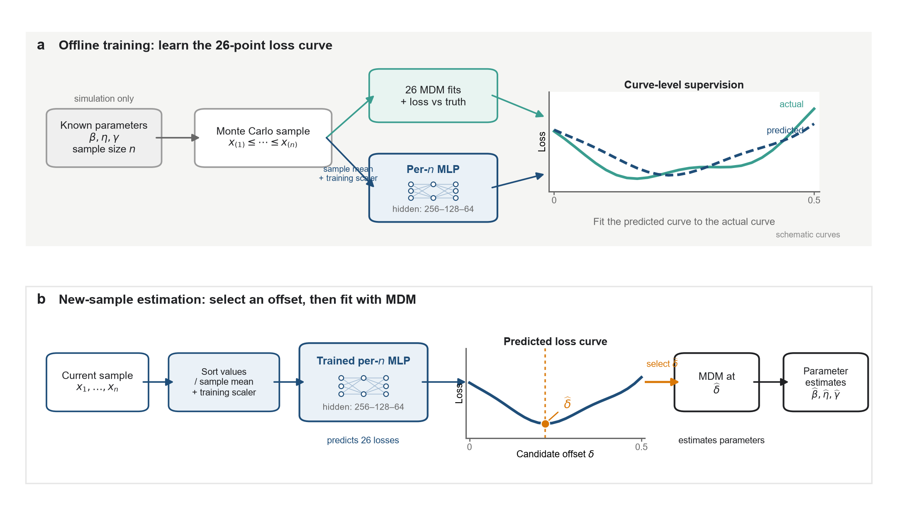
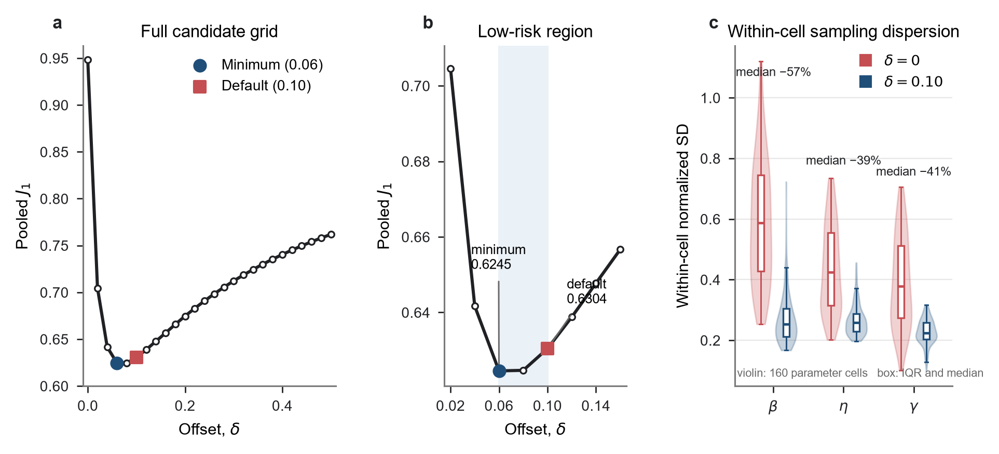
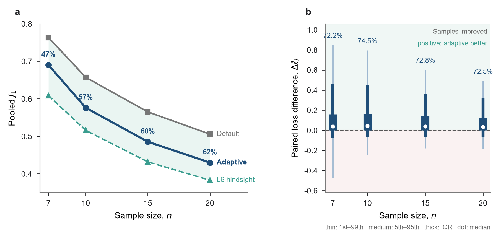
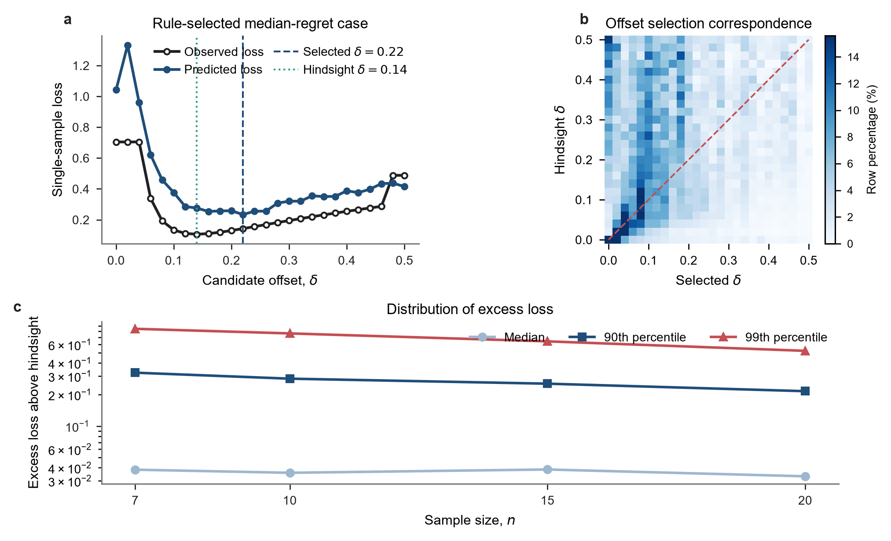
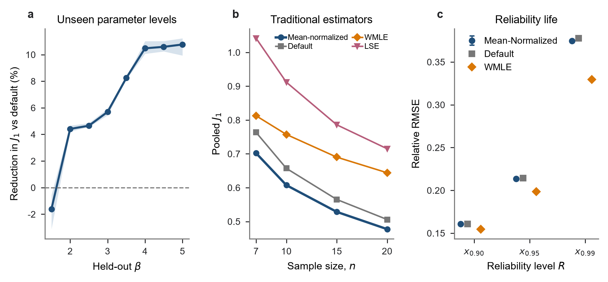

# 三参数 Weibull 分布最小差异法的样本自适应偏移量选择

> 中文工作稿 v1.3。正文以预先固定的随机种子 42 报告单模型主结果，另外两个随机种子仅用于附录中的初始化敏感性核查。作者、单位、基金和目标期刊格式待定。

## 摘要

三参数 Weibull 分布的最小差异法（minimum discrepancy method，MDM）通过在位置参数搜索判据中引入偏移量 $\delta$，改善有限样本下估计结果的稳定性。现有方法通常采用经验值 $\delta=0.1$，但在估计稳定性得到改善后，如何进一步选择偏移量以避免不必要的精度损失，尚缺乏系统研究。本文比较统一取值、参数条件规则和逐样本事后参照，用以识别合理偏移量的决定因素。在真参数未知时，按样本量分别训练多层感知机（multilayer perceptron，MLP），以样本均值归一化的排序样本为输入，预测各候选偏移量对应的估计损失，再选择预测损失最小的偏移量。

在预设参数空间和评价准则下，经验值 $\delta=0.1$ 已接近最佳统一常数；预设候选网格内的逐样本事后参照相对固定规则的误差降幅为 21.9%。在真参数未知的条件下，基于 MLP 的样本自适应选择在未见 $\gamma/\eta$ 水平的留出评价中将三参数联合估计误差降低 7.27%（配对重采样 95% 置信区间为 6.94%—7.64%），三个参数的标准化偏差、标准差和均方根误差均有所下降，且未出现估计失败。机制诊断进一步显示，同一参数条件下的低风险偏移量仍随样本实现而变化；在相同可观测输入下，较灵活的经验规则还能进一步降低风险，但仍不能达到逐样本事后参照。

进一步验证表明，按形状参数水平逐一留出时，汇总误差降幅仍为 7.3%，但最低形状参数水平下略差于固定偏移量。样本自适应方法的三参数联合估计误差低于同条件下的加权极大似然法和最小二乘法。可靠度寿命分析显示，参数估计误差的改善仅有限地传递到 $x_{0.90}$、$x_{0.95}$ 和 $x_{0.99}$。因此，本文方法的主要作用是改进 MDM 内部的偏移量选择，而不是保证所有派生工程指标同步改善。

**关键词：** 三参数 Weibull 分布；最小差异法；偏移量选择；小样本参数估计；多层感知机；风险曲线预测

## 1 引言

三参数 Weibull 分布以形状参数 $\beta$、尺度参数 $\eta$ 和位置参数 $\gamma$ 描述寿命数据。位置参数使分布能够表示非零寿命起点，也使参数估计比二参数情形更为复杂。特别是在小样本条件下，不同估计方法可能得到差异较大的参数结果，方法的相对表现还会随形状参数、样本量和评价指标而改变[1,4–7]。因此，三参数 Weibull 参数估计不仅要求算法能够得到数值解，还需要考察有限样本下的误差和稳定性。

现有估计方法主要包括极大似然法、矩估计法、最小二乘法及其修正形式。三参数模型的样本支持域随位置参数变化，极大似然估计可能面临非正则性、偏差较大或部分样本无有限解等问题[4,5]。已有比较研究也表明，没有一种估计方法能在所有参数条件和样本量下保持同样的优势[1,5–7]。这使得从估计原理出发建立适合小样本的替代方法，仍具有实际意义。

最小差异法根据三参数 Weibull 分布构造尺度参数的伪估计量，并以不同样本点所得伪尺度参数之间的差异作为判据[2]。在给定位置参数和形状参数时，若二者更接近真值，各样本点对应的伪尺度参数应更为集中。后续研究指出，有限随机样本反映的最小差异位置未必与确定性曲线的极值点重合，因此在位置参数搜索的梯度判据中引入正偏移量，并以 $\delta=0.1$ 作为经验取值[3]。这一处理明显改善了部分小样本估计的稳定性，但偏移量本身也会改变有限样本估计风险，其合理取值及决定因素仍缺少系统研究。

统计估计中，依据当前数据选择调节参数已有较长的研究历史。既有工作利用 jackknife 或 pilot estimator 估计渐近均方误差，为当前数据集选择稳健回归或最小距离估计器的调节参数[9–11]；近期研究还通过训练—验证双层优化联合更新稳健回归模型和调节参数[12]。神经网络也已用于非参数回归带宽选择[13]，模拟决策方法则可以学习给定观测和候选动作时的条件代价[14]。这些研究说明，数据驱动调参本身并非新问题；但它们没有考察三参数 Weibull MDM 的梯度偏移量，也没有说明总体参数、有限样本实现和事后损失信息分别如何影响该偏移量的风险。

由此，本文研究的问题是：在三参数 Weibull 小样本 MDM 估计中，偏移量 $\delta$ 如何影响有限样本估计风险，其合理取值受哪些因素决定，以及在总体参数未知时能否仅依据观测样本实现有效选择。本文先比较统一规则、参数条件规则和逐样本事后参照，再以样本均值归一化的排序样本为输入，预测各候选偏移量的损失曲线并确定 $\delta$。最后，通过仅使用相同可观测样本的条件风险参照，分析当前网络尚未获得的收益与逐样本事后信息之间的关系。神经网络仅用于选择偏移量，最终的 $\hat\beta$、$\hat\eta$ 和 $\hat\gamma$ 仍由 MDM 计算。

研究以统一的 Monte Carlo 设计比较固定、分组和逐样本偏移量规则，先明确经验值 $0.1$ 的位置以及增加选择信息所能获得的收益，再用样本均值归一化的排序样本预测候选偏移量的损失曲线。参数水平留出、传统估计方法参照和可靠度寿命误差用于检验主结果的适用边界及工程后果，训练稳定性作为可信性检查列于支撑验证。既有神经网络方法曾直接输出三参数 Weibull 参数[15,16]；本文不以神经网络替代 MDM，也不把离散设计内的留出结果解释为连续参数空间的普遍泛化。

## 2 方法

### 2.1 三参数 Weibull 分布与 MDM 偏移量

三参数 Weibull 分布的累积分布函数为

$$
F(t)=
\begin{cases}
0, & t\leq\gamma,\\
1-\exp\left[-\left(\dfrac{t-\gamma}{\eta}\right)^\beta\right], & t>\gamma.
\end{cases}
$$

其中 $\beta>0$、$\eta>0$，$\gamma$ 为位置参数。给定升序样本 $t_{(1)}\leq\cdots\leq t_{(n)}$，采用中位秩估计[8]

$$
F_i=\frac{i-0.3}{n+0.4},\qquad q_i=-\ln(1-F_i).
$$

当候选形状参数和位置参数分别为 $\beta$ 和 $\gamma$ 时，第 $i$ 个样本点给出的伪尺度参数为[2]

$$
\eta_i(\beta,\gamma)=\frac{t_{(i)}-\gamma}{q_i^{1/\beta}}.
$$

若候选 $\beta$ 和 $\gamma$ 与样本所来自的分布相符，$\eta_i$ 之间的差异应较小。本文以样本标准差 $s_\eta(\beta,\gamma)$ 表示这种差异。对每个候选 $\gamma$，先求

$$
\beta^*(\gamma)=\arg\min_{0.1\leq\beta\leq15}s_\eta(\beta,\gamma),
\qquad
S(\gamma)=s_\eta\bigl(\beta^*(\gamma),\gamma\bigr),
$$

再根据廓线 $S(\gamma)$ 的梯度 $g(\gamma)=\mathrm dS(\gamma)/\mathrm d\gamma$ 确定位置参数；该梯度在前期文献中记为 $\nabla(\gamma)$[3]。无偏移判据对应 $g(\hat\gamma)=0$；引入正偏移量后，判据写为

$$
g(\hat\gamma)=\delta.
$$

在非负位置参数约束下，若 $g(0)\geq\delta$，取 $\hat\gamma=0$；否则在 $0<\gamma<t_{(1)}$ 内求交点。得到 $\hat\gamma$ 后，取 $\hat\beta=\beta^*(\hat\gamma)$，并以伪尺度参数的平均值估计尺度参数：

$$
\hat\eta=\frac{1}{n}\sum_{i=1}^{n}
\frac{t_{(i)}-\hat\gamma}{q_i^{1/\hat\beta}}.
$$

因此，$\delta$ 改变的是位置参数搜索判据，而不是三参数 Weibull 模型或 MDM 的基本估计原理。本文保留上述估计步骤，只研究 $\delta$ 应当如何选择。

偏移量的作用可由经验梯度的局部扰动来理解。记总体参数为 $\theta_0=(\beta_0,\eta_0,\gamma_0)$，给定该参数时的平均梯度曲线为 $\bar g_{\theta_0}(\gamma)=\operatorname{E}\{g_X(\gamma)\mid\theta_0\}$，有限样本带来的曲线扰动为 $\varepsilon_X(\gamma)$，则

$$
g_X(\gamma)=\bar g_{\theta_0}(\gamma)+\varepsilon_X(\gamma).
$$

若 $\gamma_\delta$ 满足 $\bar g_{\theta_0}(\gamma_\delta)=\delta$，且该交点附近可微、导数非零，一阶展开给出

$$
\hat\gamma_\delta-\gamma_\delta
\approx-
\frac{\varepsilon_X(\gamma_\delta)}{\bar g_{\theta_0}'(\gamma_\delta)}.
$$

因此，改变 $\delta$ 一方面会移动平均曲线上的目标交点，另一方面会改变有限样本扰动向位置参数误差的传递；位置参数的变化又会影响 $\hat\beta$ 和 $\hat\eta$。正偏移量首先用于减轻无偏移判据在有限样本下的误差放大，进一步选择 $\delta$ 则是在这一基础上比较三参数联合估计风险。合理取值取决于平均曲线的位置和局部形态，也取决于当前样本造成的曲线扰动，因而仍需用有限样本结果评价。

### 2.2 偏移量的评价准则与选择参照

对第 $i$ 个 Monte Carlo 样本，定义三参数联合损失

$$
\ell_i(\delta)=
\left(\frac{\hat\beta_i(\delta)-\beta_i}{\beta_i}\right)^2+
\left(\frac{\hat\eta_i(\delta)-\eta_i}{\eta_i}\right)^2+
\left(\frac{\hat\gamma_i(\delta)-\gamma_i}{\eta_i}\right)^2.
$$

形状参数和尺度参数误差分别以各自真值标准化；位置参数误差以 $\eta_i$ 标准化，从而避免 $\gamma_i$ 接近零时产生不稳定比值。对 $N$ 个评价样本，汇总指标为

$$
J_1=\sqrt{\frac{1}{N}\sum_{i=1}^{N}\ell_i}.
$$

$J_1$ 汇总三个参数的标准化误差，数值越小表示三参数联合估计误差越小。偏移量选择需要统一的标量目标：对单个样本和候选偏移量使用 $\ell_i(\delta)$，网络据此学习 26 点损失曲线；对全部评价样本则以 $J_1$ 汇总比较不同规则。最终参数结果另按 $\beta$、$\eta$ 和 $\gamma$ 分别报告标准化偏差、标准差和均方根误差；前两者分别以参数真值标准化，位置参数仍以 $\eta_i$ 标准化。无偏移判据与固定偏移量的稳定性比较则在每个参数组合内，根据 300 次重复抽样分别计算上述三种标准化误差的标准差，再汇总 160 个参数组合的分布。

候选偏移量为 $\mathcal D=\{0,0.02,\ldots,0.50\}$。为了分清“最优偏移量”依赖什么信息，设置 Default 和 L1—L6 七种规则。Default 固定取 $\delta=0.1$；L1 在全部训练样本上选择一个统一常数；L2 按样本量 $n$ 选择；L3 按真值 $\beta$ 选择；L4 按 $(\beta,n)$ 选择；L5 按 $(\beta,\gamma/\eta,n)$ 选择；L6 对每个样本直接取 26 个实际损失中的最小值。L1 和 L2 是可执行的简单规则，L3—L5 需要未知真参数，仅用于衡量增加信息后可能获得的收益；L6 使用估计完成后才知道的逐样本实际损失，是事后最优参照，不是可部署方法，也不是连续 $\delta$ 空间中的理论下界。

L1—L5 均采用五折交叉评价：只在训练折选择偏移量，再在对应测试折计算损失。这样可以避免用评价样本本身确定规则。L5 给出各真参数条件下平均损失最低的偏移量；L6 还使用当前样本在 26 个候选点上的实际损失。因此，L6 是固定候选网格内的逐样本事后参照，不是只依据当前观测样本可实现的决策规则，也不是连续偏移量空间的理论下界。

### 2.3 Monte Carlo 设计与评价协议

Monte Carlo 参数设计见表 1。尺度参数固定为 $\eta=1000$，位置参数由 $\eta$ 与 $\gamma/\eta$ 的取值共同确定。

**表 1  Monte Carlo 参数设计。**

| 设计因素 | 取值 | 水平数 |
|---|---|---:|
| 形状参数 $\beta$ | 1.5、2.0、2.5、3.0、3.5、4.0、4.5、5.0 | 8 |
| 尺度参数 $\eta$ | 1000 | 1 |
| 位置—尺度比 $\gamma/\eta$ | 0.10、0.25、0.50、0.75、1.00 | 5 |
| 样本量 $n$ | 7、10、15、20 | 4 |
| 候选偏移量 $\delta$ | 0.00、0.02、……、0.50 | 26 |
| 每组合重复数 | 300 | 1 |

上述设计共形成 160 个参数组合和 48,000 个样本；每个样本在 26 个候选偏移量下运行 MDM，共得到 1,248,000 次估计结果。随机样本由三参数 Weibull 分布的逆累积分布变换生成，抽样种子按参数组合和重复编号确定并随代码归档。

信息层级与 MLP 采用不同但各自独立的评价协议。L1—L5 按重复编号进行五折交叉评价，使每个参数组合在训练折和测试折中都有独立重复样本。MLP 则检验未见 $\gamma/\eta$ 水平：对每个 $n$，五折依次留出一个完整的 $\gamma/\eta$ 水平，测试折包含该水平下全部 8 个 $\beta$，训练折只使用其余四个水平。每个 $n$ 和每个留出折分别训练模型。均值归一化 MLP、固定 $\delta=0.1$ 和 L6 的主比较使用完全相同的测试样本。两套协议分别回答信息层级和样本自适应选择问题，结果不作无条件的横向排名。参数设计、失败处理、重复训练设置和两类划分的完整说明见附录 A、B。

### 2.4 利用初估参数选择偏移量

L3–L5 依赖未知真参数，实际中不能直接使用；一个自然且可执行的做法是利用初估参数选择偏移量。本文先以固定 $\delta=0.1$ 的 MDM 或加权极大似然估计得到初步 $\hat\beta$、$\hat\eta$、$\hat\gamma$，再把这些估计当作真参数去查询 L3–L5 对应的条件均值损失曲线，选择损失最小的 $\delta$ 后，读取同一样本在该 $\delta$ 下的 MDM 估计。条件集与 L3–L5 相同（仅形状参数、形状参数与样本量、或全部参数与样本量），查询方式为就近网格点，或在连续估计处对损失曲线插值；损失曲线始终只用训练折构成，因此本检验只量化“用估计代替真值”本身会损失多少收益。若把新估计再次用于选择即为迭代，迭代在偏移量不变、出现循环或达到 10 次更新时停止。该检验提供负向参照：不参与主方法训练，也不与 MLP 在同一评价协议下排名。

### 2.5 基于归一化排序样本的自适应选择

真参数未知时，L3—L5 不能直接应用，而 L6 的实际损失只能在仿真中事后获得。本文据此把偏移量选择转化为一个多输出回归任务：用当前样本预测 26 个候选偏移量对应的损失，再取预测损失最小的候选值。

对每个样本量 $n$ 单独训练一个 MLP。先将样本升序排列，再除以该样本的算术平均值：

$$
X_n=\operatorname{sort}(x_1,\ldots,x_n),\qquad
Z_n=\frac{X_n}{\bar x},
$$

输出为预测损失向量

$$
\widehat{\boldsymbol\ell}(Z_n)=
\left(\widehat\ell_{\delta_1},\ldots,
\widehat\ell_{\delta_{26}}\right).
$$

选择规则及最终估计为

$$
\hat\delta(Z_n)=\arg\min_{\delta_j\in\mathcal D}
\widehat\ell_{\delta_j}(Z_n),
$$

$$
(\hat\beta,\hat\eta,\hat\gamma)
=\operatorname{MDM}\bigl(X_n;\hat\delta(Z_n)\bigr).
$$

输入不包含真参数、参数组合编号、重复编号或手工统计特征。均值归一化去除了样本的整体正尺度；在此之后，仅用相应训练折对各排序位置分别进行 StandardScaler 标准化，测试折不参与拟合；26 维目标也只用训练折拟合标准化参数。若某个候选偏移量的 MDM 估计失败，则以训练折有效损失的第 99 百分位数填充该候选的训练目标，测试信息不参与惩罚值计算。网络包含 3 个隐藏层，采用 ReLU 激活函数和 Adam 优化器，以标准化后的预测损失曲线与实际损失曲线之间的平方误差训练。网络并不直接以汇总 $J_1$ 为训练目标：监督信号是每个样本在 26 个候选偏移量下的联合损失曲线 $\ell_i(\delta)$，$J_1$ 仅在评价阶段用于汇总不同样本的联合估计误差。正文固定随机种子 42 报告单模型主结果，另外两个预设种子只检验初始化敏感性，不对三条预测曲线进行集成。下文将这一选择器称为均值归一化 MLP（Mean-normalized MLP）。网络配置和初始化敏感性结果见附录 B。

选择预测整条损失曲线而不是直接分类“最佳偏移量”，是为了保留相邻候选值之间的相对损失信息。网络只改变 $\delta$ 的选择方式，不输出 Weibull 参数。训练标签来自有真值的 Monte Carlo 样本；实际应用时只需要当前样本。完整流程见图 1。

**图 1  样本自适应偏移量选择方法。** **a，** 离线训练时，同一个 Monte Carlo 样本经 26 个候选偏移量下的 MDM 估计形成实际损失曲线，同时由对应样本量的 MLP 预测损失曲线；两条曲线之间的误差用于训练网络。**b，** 应用时仅输入当前样本，网络预测 26 点损失曲线并以最低点确定 $\widehat{\delta}$，随后仍由 MDM 给出 $\widehat{\beta}$、$\widehat{\eta}$ 和 $\widehat{\gamma}$。图中曲线仅用于说明方法流程，不代表某一参数组合的数值结果。

### 2.6 条件风险经验参照

为分清当前 MLP 的学习差距与 L6 所使用的事后信息，进一步考虑只允许使用当前可观测输入 $Z$ 的理想选择规则：

$$
\delta_Z^*(Z)=\arg\min_{\delta\in\mathcal D}
\operatorname{E}\!\left[\ell(\delta,X,\theta)\mid Z\right].
$$

该规则选择条件期望损失最低的偏移量，不使用真参数或当前样本在各候选点上已实现的损失。L6 则在这些信息全部揭示后取 $\min_\delta\ell(\delta,X,\theta)$。由于期望和最小化操作的次序不同，仅依据 $Z$ 的理想选择风险一般高于 L6。

本文不尝试精确计算该 Bayes 风险，而是构造一个较灵活的 $Z$-only 经验参照。对每个 $n$，在当前 160 个设计单元内以 repeats 0–159 拟合候选回归器，160–199 选择模型，200–299 作为未触及确认集。候选集包括 Ridge、KNN、ExtraTrees、当前 MLP 结构和较宽 MLP；输入始终只有 $Z$，真参数只用于构造 Monte Carlo 损失标签和事后评价。候选选择与确认分开，同时以配对 repeat 块 bootstrap 检查主要风险差。完整设置和学习曲线见附录 F。

### 2.7 样本实现的机制诊断

为考察同一参数条件下低风险偏移量为何随样本改变，进一步分析 MDM 的位置参数搜索曲线。对样本 $X$，记

$$
\sigma_{\min,X}(\gamma)=\min_{\beta}\operatorname{sd}\{\eta_i(\beta,\gamma)\},
\qquad
g_X(\gamma)=\frac{\partial\sigma_{\min,X}(\gamma)}{\partial\gamma}.
$$

MDM 在约束 $\gamma\geq0$ 下寻找满足 $g_X(\hat\gamma)=\delta$ 的位置；若 $g_X(0)\geq\delta$，则取边界解 $\hat\gamma=0$。因此，即使真参数相同，不同抽样结果仍可能产生不同的经验梯度曲线和交点。

机制诊断预先选取参数域的四个角点与中心点，并与 $n=7,10,15,20$ 交叉，共 20 个参数单元。每个单元使用未参与训练和选模的 repeats 200—299，共 2,000 个确认样本。26 点实际损失直接复用既有扫描结果，每个样本仅重新生成一条 MDM 梯度轨迹。记录 $g_X(0)$、固定 $\delta=0.1$ 时的 $\hat\gamma_{0.1}/\eta$ 及 26 点事后低风险偏移量，并在各参数单元内计算相关关系；同时按 $\hat\gamma_{0.1}/\eta$ 的单元内三分位组汇总实际损失曲线。该实验只诊断数值机制，不训练新的选择器。

### 2.8 支撑验证与报告指标

主结果之外设置四项支撑验证。第一，逐一留出 8 个 $\beta$ 水平，在其余 7 个水平上训练，并在未参与训练的 $\beta$ 上评价，以检验当前离散参数域内的形状参数泛化。第二，在相同的 48,000 个样本上运行加权极大似然法（weighted maximum likelihood estimation，WMLE）和最小二乘法（least-squares estimation，LSE），作为 MDM 之外的误差参照。第三，将各方法的参数估计传递到可靠度寿命 $x_R$，其中 $x_R$ 满足 $P(T>x_R)=R$：

$$
x_R=\gamma+\eta[-\ln(R)]^{1/\beta},
$$

并对 $R=0.90,0.95,0.99$ 报告相对偏差、相对均方根误差（RMSE）、相对平均绝对误差和绝对相对误差的第 95 百分位数。可靠度寿命结果不反向用于训练或选择 $\delta$。这里的下标表示可靠度而非累积分布概率，因此公式中使用 $-\ln(R)$。第四，选取覆盖参数和样本量边界的少量样本，将原样本同时乘以 $10^{-3}$、1 和 $10^3$，检查所选 $\delta$、MDM 参数估计和损失是否满足尺度等变性。

所有方法均报告汇总 $J_1$、按 $n$ 分层的 $J_1$ 和失败率。汇总结果按样本等权计算；由于各组合重复次数相同，这也等价于对 160 个组合等权。未收敛结果不从汇总中删除。主方法在正式数据中没有估计失败；WMLE 的 1 次未收敛按预先规定的失败规则计入评价。

主结果的 Monte Carlo 不确定性通过配对重复块 bootstrap 估计。每个重复块在 160 个参数—样本量组合中各含一个样本，重采样时保持方法间配对和组合等权，共进行 20,000 次重采样。该区间以当前 160 个设计单元为条件，反映有限 Monte Carlo 重复带来的误差。另将 160 个设计单元的均值损失作为配对重采样单元，检查汇总改善对设计构成的敏感性；该范围不解释为连续参数总体的置信区间。

## 3 结果
### 3.1 不同信息条件下的偏移量选择

正偏移量首先收窄了重复抽样下的估计波动。对 160 个参数组合分别计算 300 次重复抽样的标准化估计标准差后，$\delta=0$ 时 $\beta$、$\eta$ 和 $\gamma$ 的组合间中位数分别为 0.5870、0.4241 和 0.3782；采用 $\delta=0.10$ 后降至 0.2526、0.2589 和 0.2236，中位降幅分别为 57.0%、39.0% 和 40.9%（图 2c）。$\beta$ 和 $\eta$ 的 160 个组合均表现为波动减小，$\gamma$ 为 154 个组合。该结果直接说明，经验正偏移量的首要作用是改善有限样本估计的稳定性。

固定偏移量的整体误差曲线在较小正偏移量附近达到低值（图 2a、b）。26 点网格中的最低值位于 $\delta=0.06$，$J_1=0.624518$；$\delta=0.08$ 时为 0.624666。与网格最低点相比，$\delta=0.10$ 的 $J_1$ 高 0.93%，说明经验值已经接近最佳统一常数。误差在 $\delta=0.12$ 时升至 0.638755，因此低风险区域虽较平缓，却不能解释为更大的偏移量范围内均无差别。

**图 2  正偏移量对估计稳定性和联合误差的影响。** a，26 个候选偏移量在整个设计域上的汇总 $J_1$；b，低误差区域的局部放大；c，在每个参数组合内分别计算 300 次重复抽样的标准化估计标准差，并比较 $\delta=0$ 与 $\delta=0.10$ 在 160 个参数组合上的分布。小提琴图表示完整分布，箱体表示四分位距和中位数；百分数表示组合间中位标准差的降幅。不同真参数组合的估计值未直接混合计算标准差。

交叉评价进一步显示，仅重新选择一个统一常数或按样本量查表，改善仍然有限（表 2）。L1 和 L2 的 $J_1$ 分别为 0.6252 和 0.6230，相对 Default 降低 0.83% 和 1.17%。当规则可以使用真值 $\beta$ 时，L3 降至 0.5905；继续加入 $n$ 和 $\gamma/\eta$ 后，L4 和 L5 分别为 0.5885 和 0.5813。L6 在 26 点网格内事后选取当前样本实际损失最小的 $\delta$，$J_1$ 为 0.4923，相对 Default 降低 21.91%。这一差距同时包含总体参数条件、有限样本实现和事后完全损失信息的影响，不能直接解释为现实选择方法可以获得的收益。

**表 2  不同信息条件下的偏移量选择。L1—L5 采用重复编号五折交叉评价；L6 为固定候选网格内的逐样本事后参照。**

| 规则 | 选择信息 | 汇总 $J_1$ | $n=7$ | $n=10$ | $n=15$ | $n=20$ |
|---|---|---:|---:|---:|---:|---:|
| Default | 固定 $\delta=0.1$ | 0.6304 | 0.7633 | 0.6571 | 0.5651 | 0.5058 |
| L1 | 全局统一 | 0.6252 | 0.7538 | 0.6535 | 0.5628 | 0.5013 |
| L2 | 按 $n$ | 0.6230 | 0.7491 | 0.6526 | 0.5610 | 0.5009 |
| L3 | 按 $\beta$（真参数参照） | 0.5905 | 0.7199 | 0.6119 | 0.5272 | 0.4735 |
| L4 | 按 $(\beta,n)$（真参数参照） | 0.5885 | 0.7166 | 0.6122 | 0.5250 | 0.4706 |
| L5 | 按 $(\beta,\gamma/\eta,n)$（真参数参照） | 0.5813 | 0.7127 | 0.6030 | 0.5162 | 0.4622 |
| L6 | 逐样本事后参照 | 0.4923 | 0.6083 | 0.5159 | 0.4319 | 0.3831 |

上述结果给出两条可以继续检验的选择路线。第一条路线先估计参数，再根据参数初值选择偏移量，并考察重复更新参数与偏移量能否进一步降低误差。第二条路线利用 Monte Carlo 样本的真参数和各候选偏移量下的实际损失构造训练数据，由网络学习当前样本与候选损失曲线之间的关系。以下两节依次报告这两种方案。

### 3.2 利用初估参数选择偏移量

把初步参数估计直接当作真参数来选择偏移量，不能恢复 L3–L5 的收益。在全部 12 种单步初估参数选择变体（两种初估方式、三种条件集、两种查询映射）中，最优规则（WMLE 初估、仅按形状参数、连续插值）的汇总 $J_1$ 为 0.6507，仍高于固定 $\delta=0.1$ 的 0.6304；配对重复块 bootstrap 的 95% 置信区间为 $[0.0186,\,0.0219]$，且全部变体的区间均严格位于零线以上，即均显著劣于经验规则。该负结果并非完全均匀：最优规则仅在 $\beta=1.5$ 优于固定规则（$J_1$ 差 $-0.0104$），$\beta=2.0$–5.0 均更差。把新估计再次用于选择的迭代一致地进一步变差，因此不构成可用方法。完整变体、置信区间和分 $\beta$ 结果见附录 C。

### 3.3 样本自适应偏移量选择

在按每个 $n$ 的 $\gamma/\eta$ 水平留出评价中，样本自适应方法的汇总 $J_1$ 为 0.584553。相同测试样本上，固定 $\delta=0.1$ 的 $J_1$ 为 0.630409，L6 为 0.492297（表 3）。样本自适应选择相对经验值降低 7.27%；在保持当前设计和组合等权的配对重复块 bootstrap 中，95% 置信区间为 6.94%—7.64%。三种方法在该评价中均无估计失败。L6 仅给出同一候选网格内的事后对照，其与 Default 的差距不用来表示现实选择方法可获得的比例。

**表 3  样本自适应方法的主比较。三种方法使用同一留出协议和同一测试样本。**

| 方法 | 汇总 $J_1$ | $n=7$ | $n=10$ | $n=15$ | $n=20$ | 失败率 |
|---|---:|---:|---:|---:|---:|---:|
| Mean-normalized MLP | 0.5846 | 0.7013 | 0.6071 | 0.5294 | 0.4756 | 0.00% |
| Default（$\delta=0.1$） | 0.6304 | 0.7633 | 0.6571 | 0.5651 | 0.5058 | 0.00% |
| L6（逐样本事后参照） | 0.4923 | 0.6083 | 0.5159 | 0.4319 | 0.3831 | 0.00% |

$J_1$ 给出偏移量选择和规则比较所需的统一目标，逐参数指标用于检查这一改善如何落实到参数估计。与固定 $\delta=0.1$ 相比，样本自适应选择下 $\beta$、$\eta$ 和 $\gamma$ 的标准化偏差绝对值、标准差和均方根误差均有所下降（表 4）。因此，联合指标的改善并非由单一参数主导，也不是以增加另外两个参数的波动为代价。

**表 4  固定偏移量与样本自适应选择的逐参数误差。结果基于同一 48,000 个折外测试样本（160 个参数组合 $\times$ 300 次重复），样本自适应选择采用预先固定的 seed 42 主模型；每个样本在两种规则下均有估计结果，且均无估计失败。**

| 参数 | 方法 | 标准化 Bias | 标准化 SD | 标准化 RMSE | 标准化误差 P5–P95 |
|---|---|---:|---:|---:|---:|
| $\beta$ | 固定 $\delta=0.1$ | -0.2327 | 0.3293 | 0.4032 | [-0.6761, 0.3433] |
| $\beta$ | 样本自适应选择 | -0.2008 | 0.3165 | 0.3749 | [-0.6533, 0.3563] |
| $\eta$ | 固定 $\delta=0.1$ | -0.1998 | 0.3011 | 0.3614 | [-0.6624, 0.3107] |
| $\eta$ | 样本自适应选择 | -0.1827 | 0.2813 | 0.3354 | [-0.6395, 0.2934] |
| $\gamma$ | 固定 $\delta=0.1$ | 0.1868 | 0.2633 | 0.3228 | [-0.2406, 0.6236] |
| $\gamma$ | 样本自适应选择 | 0.1700 | 0.2445 | 0.2978 | [-0.2297, 0.5914] |

各样本等权汇总。$\beta$ 和 $\eta$ 的误差分别除以其真值，$\gamma$ 的误差除以真尺度参数 $\eta$；P5–P95 表示标准化带符号误差的第 5—95 百分位区间。由于 160 个参数组合的真值不同，表中不直接混合原始估计值计算范围。

四个已训练样本量下，均值归一化 MLP 的 $J_1$ 依次为 0.7013、0.6071、0.5294 和 0.4756，均低于固定 $\delta=0.1$（图 3a）。各方法的误差都随 $n$ 增大而下降，样本自适应选择没有改变样本量增加后估计更准确的基本趋势。这一比较只涉及四个分别训练过的样本量，不表示网络能够直接处理任意 $n$。

汇总 $J_1$ 之外，逐样本配对结果进一步显示了改善的分布。令 $\Delta\ell_i=\ell_{i,\mathrm{Default}}-\ell_{i,\mathrm{Adaptive}}$，正值表示样本自适应选择误差更低；$n=7,10,15,20$ 时，$\Delta\ell_i>0$ 的样本比例分别为 62.5%、66.0%、62.2% 和 58.5%，各组中位数均为正（图 3b）。分布仍有负值尾部，说明该方法改善了多数样本和总体误差，但并不保证每个样本都优于固定偏移量。

**图 3  不同样本量下的总体与逐样本结果。** **a，** 均值归一化 MLP、固定经验偏移量和逐样本事后参照在四个已训练样本量下的汇总 $J_1$；阴影只表示 Default 与 L6 之间的观测差距，不表示它能被仅依据当前样本的方法全部获得。**b，** 逐样本配对损失差 $\Delta\ell_i=\ell_{i,\mathrm{Default}}-\ell_{i,\mathrm{Adaptive}}$ 的分布；细线、中线、粗线和白点依次表示第 1—99、第 5—95 百分位区间、四分位距和中位数，百分数表示误差降低的样本比例。

### 3.4 样本实现与选择机制

图 4a 给出一个折外测试样本，其实际损失在 $\delta=0.14$ 处最低，而网络选择了 $\delta=0.22$。预测曲线没有逐点复原实际曲线，但保留了较低损失所在的局部区域。全部测试样本的选择结果也不是与 L6 偏移量逐一重合（图 4b）。这说明主结果并非来自网络准确识别了每个样本的事后最优格点，而是来自其在总体上更常把选择放在低损失区域。

以所选偏移量的实际损失减去 L6 损失，得到逐样本超额损失。$n=7,10,15,20$ 时，其中位数分别为 0.0383、0.0358、0.0385 和 0.0331；第 99 百分位数仍为 0.8473、0.7656、0.6431 和 0.5220（图 4c）。因此，汇总 $J_1$ 的改善并不等于每个样本都改善，当前方法与 L6 之间仍有明显差距。

**图 4  从损失曲线预测到偏移量选择。** **a，** 折外测试样本中的中位超额损失代表例；**b，** 全部折外预测中所选偏移量与事后最优偏移量的对应分布；**c，** 不同样本量下相对于事后参照的超额损失中位数、第 90 和第 99 百分位数。

参数组合层面的结果并不均匀。160 个 $(\beta,\gamma/\eta,n)$ 组合中，125 个组合的 $J_1$ 低于固定 $\delta=0.1$，35 个组合发生退化，最大退化为 17.50%。对 160 个设计单元均值进行配对重采样时，汇总降幅的 95% 设计构成敏感性范围为 6.04%—8.46%。退化较多出现在 $\gamma/\eta$ 网格边界，并在较大样本量下更常见。完整参数空间热图见附录 F，这一分布说明汇总改善不等于每个参数条件均有利。

为进一步区分参数条件、当前样本和事后信息的作用，在独立的 16,000 个确认样本上进行条件风险诊断。同一 $(\beta,\gamma/\eta,n)$ 条件内，L5 选择的平均低风险偏移量与 L6 的逐样本事后偏移量只有 12.6% 完全一致；各条件内 L6 偏移量的中位有效候选数为 6.09。这表明，低风险偏移量不仅随总体参数改变，同一参数条件下的有限样本实现也会影响选择。

MDM 梯度曲线的诊断进一步说明了这种变化从何而来。在 20 个预设参数单元中，$g_X(0)$ 与 L6 偏移量的单元内 Spearman 相关系数中位数为 0.652，四分位区间为 0.549—0.779，19 个单元方向为正。固定 $\delta=0.1$ 时的 $\hat\gamma_{0.1}/\eta$ 与 L6 偏移量呈更稳定的反向关系：相关系数中位数为 $-0.765$，四分位区间为 $-0.803$—$-0.609$，20 个单元方向均为负（图 5）。按 $\hat\gamma_{0.1}/\eta$ 从低到高分组后，平均超额损失曲线的最低点依次位于 $\delta=0.10$、0.04 和 0.02。L6 位置估计落在 $\hat\gamma=0$ 边界的样本只占 7.1%，说明观察到的变化主要对应经验梯度曲线和交点的整体移动，而不是简单的边界切换。

**图 5  样本实现对 MDM 偏移量的影响。** **a，** 在相同真参数 $(\beta,\gamma/\eta,n)=(3,0.5,10)$ 下，三个确认样本产生的经验梯度曲线及各自 L6 交点；**b，** 在 20 个预设参数单元内按 $\hat\gamma_{0.1}/\eta$ 分为低、中、高三组后的平均超额损失曲线；**c，** 各参数单元内 $\hat\gamma_{0.1}/\eta$ 与 L6 偏移量的 Spearman 相关。代表样本用于展示曲线形态，统计结论来自 2,000 个确认样本。

同一 16,000 个样本上，Default、论文 MLP、在所有设计单元上重训的当前 MLP 结构、较灵活的 $Z$-only 经验参照和 L6 的 $J_1$ 分别为 0.6267、0.5827、0.5680、0.5618 和 0.4906。按可加风险 $R=J_1^2$ 分解 Default 到 L6 的观测差距，论文 MLP 已降低 34.96%；其后 11.09% 与评价协议、参数覆盖和重拟合共同相关，较灵活的回归规则再降低 4.61%，剩余 49.34% 仍混合进一步可学习部分与事后完全信息差。完整风险路径和学习曲线见附录 F。

### 3.5 支撑验证

固定 seed 42 的主结果之外，两个辅助随机初始化所得汇总 $J_1$ 与主结果共同落在 0.5846—0.5855，标准差为 0.0004，说明观察到的总体改善不依赖某一次初始化。逐一留出未参与训练的 $\beta$ 水平后，seed 42 下样本自适应方法的汇总 $J_1$ 为 0.5841，固定 $\delta=0.1$ 为 0.6304，误差降低 7.35%，且未出现估计失败（图 6a）。留出 $\beta=1.5$ 时，样本自适应方法的 $J_1$ 为 0.5541，略高于固定规则的 0.5477；其余七个留出水平上仍保持改善。该实验说明汇总收益可以保持，但不支持所有未见形状参数水平都改善，也没有检验网格之外的连续外推。

在相同 48,000 个样本和同一 $J_1$ 定义下，WMLE 和 LSE 的汇总 $J_1$ 分别为 0.7288 和 0.8725，高于样本自适应方法的 0.5846（图 6b）。LSE 无失败，WMLE 有 1 个样本未收敛，失败率为 0.002%。这一比较给出了本文方法在传统估计方法中的误差位置，但其作用是外部参照；偏移量选择的主要结论仍来自 MDM 内部的同样本比较。

参数误差的改善没有等比例传递到可靠度寿命。样本自适应方法对 $x_{0.90}$、$x_{0.95}$ 和 $x_{0.99}$ 的相对 RMSE 分别为 0.1608、0.2136 和 0.3753；固定 $\delta=0.1$ 对应为 0.1607、0.2142 和 0.3777（图 6c）。自适应方法在 $x_{0.90}$ 上略差，在 $x_{0.95}$ 和 $x_{0.99}$ 上略好，差异均较小；WMLE 三个可靠度寿命的相对 RMSE 最低。因此，较低的 $J_1$ 不能据此推断可靠度寿命获得同幅度改善。

**图 6  主结果的支撑验证。** a，逐一留出未参与训练的 $\beta$ 水平后，样本自适应方法相对于固定偏移量的 $J_1$ 降幅；b，与 WMLE、LSE 的汇总 $J_1$ 参照；c，样本自适应方法、固定偏移量和 WMLE 对 $x_{0.90}$、$x_{0.95}$、$x_{0.99}$ 的相对 RMSE。未见参数的完整分层结果见附录 D，传统方法和可靠度寿命指标见附录 E。

## 4 讨论

### 4.1 不同可用信息下的偏移量选择

图 2 已确认正偏移量能够抑制无偏移判据的抽样波动，因而后续取值均以固定 $\delta=0.1$ 为经验基准。表 4 进一步表明，样本自适应选择带来的 $J_1$ 下降同时落实到三个参数的偏差、标准差和均方根误差，而不是只反映在联合指标中。

如果实际应用只能采用一个统一偏移量，那么在本文参数设计和评价准则下，网格内最佳取值为 $\delta=0.06$，而经验值 $\delta=0.1$ 的 $J_1$ 仅高约 0.9%。因此，针对与本文相同的参数范围进行专门设置时，可以选择 $\delta=0.06$；若更重视规则的简洁性和既有方法的延续性，保留 $\delta=0.1$ 几乎不会造成明显的精度损失。

样本量 $n$ 在实际估计时通常已知，但仅根据 $n$ 分别设置固定偏移量的收益较小。与统一采用 $\delta=0.1$ 相比，按样本量设置偏移量仅使汇总 $J_1$ 降低约 1.2%；在同一评价协议下，它相对于最佳统一常数的进一步改善也不足 0.4%。因此，现有结果尚不足以说明有必要仅为不同样本量维护多套固定偏移量。

真参数未知是实际应用中的基本条件。此时不能使用依赖 $\beta$、$\eta$ 或 $\gamma$ 真值的选择规则，但可以利用当前样本预测各候选偏移量的估计损失。在本文训练域内，样本自适应方法相对于固定 $\delta=0.1$ 将汇总 $J_1$ 降低约 7.3%，高于重新选择统一常数或仅按样本量设置偏移量所获得的改善。因此，当样本量和参数范围与已检验条件相符时，可以采用样本自适应选择；不满足这些条件时，$\delta=0.1$ 仍是更稳妥的默认方案。

### 4.2 样本信息与偏移量选择

均值归一化的排序样本保留了样本内的相对位置、间距和离散结构，同时去除整体正尺度。它没有预先指定哪一种统计特征最重要，而是让网络从有真值的 Monte Carlo 数据中学习样本排列与 26 点损失曲线之间的联系。按 $\gamma/\eta$ 水平留出时四个样本量均获得汇总改善；按 $\beta$ 水平留出时总体收益仍在，但 $\beta=1.5$ 的例外表明这种联系在参数边界上可能减弱。

预测整条损失曲线也使问题不同于直接分类最佳格点。相邻 $\delta$ 的实际损失往往接近，最佳格点可能因轻微抽样变化而跳动。如果只学习一个类别，错误地选到相邻格点和选到高损失端点会受到相同惩罚；损失曲线回归则保留了候选之间的差别。图 4 显示，预测曲线不需要逐点准确，只要能把较低实际损失的候选排在前部，就可能降低总体误差。条件风险诊断也得到相同判断：灵活 $Z$-only 参照的确认风险低于论文 MLP，但它与 L6 偏移量的精确一致率略低（0.2178 vs 0.2301）。格点命中率因此不能代替实际选择风险。

网络仍会在部分样本上选错低损失区域，超额损失尾部和 35 个退化组合表明，方法的收益在样本与参数条件之间并不均匀。同一参数条件内，不同抽样结果会改变经验梯度曲线；$\hat\gamma_{0.1}/\eta$ 与低风险偏移量在全部 20 个诊断单元中呈稳定反向关系。因而，按参数条件维护一个平均规则仍会遗漏样本层面的变化，这为样本自适应选择提供了数值依据。

条件风险参照同时限定了对 L6 的解释。论文 MLP 与在所有设计单元上重训的同结构 MLP 之间的差距，混合了留出协议、参数覆盖和重拟合影响；继续改用较灵活的 $Z$-only 回归器后，风险还能进一步下降。这说明当前 MLP 尚未用尽可观测样本中的信息。但该经验参照到 L6 的剩余差距仍包含模型和数据限制，无法仅据当前实验将其全部归为不可观测的完全信息。

利用初估参数选择偏移量的负结果说明了本文为何没有采用这种简单的 plug-in 路线。把初步估计当作真参数使用时，最优变体仍劣于固定规则，且迭代一致变差；稳健最小距离估计的调参研究也曾报告 pilot estimator 会显著影响最终选择，而迭代 pilot 未带来明显优势[10,11]。本文中，初步 $\hat\beta$ 落入正确 $\beta$ 网格单元的比例仅为约 17%–20%，这一现象与初估噪声使样本被错误路由的解释一致，但连续插值同样失败、误差分层可能与真 $\beta$ 混杂，因此该解释只作为支持性证据，不构成唯一机制的证明。相比之下，样本到风险曲线的预测不依赖参数初估的准确性，保留了候选偏移量之间的相对损失信息；在已检验方案中，它获得了 plug-in 未能获得的总体收益。

### 4.3 与传统方法和工程指标的关系

WMLE 和 LSE 不使用 MDM 偏移量，因而为主结果提供了外部尺度。在当前参数设计下，样本自适应 MDM 的三参数联合误差较低；这并不意味着它在所有条件下都优于传统估计法。已有研究已经表明，三参数 Weibull 估计方法的排序会随参数范围、样本量和评价准则变化[4–7]；本文的比较同样只对当前完整样本和离散参数域成立。

可靠度寿命结果进一步限定了参数误差指标的含义。$J_1$ 对 $\beta$、$\eta$ 和 $\gamma$ 的标准化误差赋予同等结构，而 $x_R$ 是三个参数的非线性函数。不同参数误差可能在 $x_R$ 中相互抵消或叠加，因此较低的 $J_1$ 不保证每一种可靠度寿命的误差都更低。本文方法在 $x_{0.95}$ 上只比固定规则略低，WMLE 反而更好。实际应用若主要关心某一可靠寿命，应直接以该工程量评价甚至设计选择规则，不能只依据参数联合误差决定方法。

### 4.4 适用边界

本文仍有四项明确限制。第一，参数和偏移量均采用离散网格。留出评价说明方法能处理部分未进入训练的网格水平，但不能证明对连续参数空间或更远范围仍有相同收益；留出 $\beta=1.5$ 时的局部退化尤其需要注意。第二，虽然 $\eta$ 在 Monte Carlo 设计中固定为 1000，输入中的样本均值归一化对任意正倍率变换保持不变；代表性样本上从选择器到 MDM 的联合检查也确认，将数据乘以 $10^{-3}$ 或 $10^3$ 不改变所选偏移量和标准化损失，$\hat\eta$ 与 $\hat\gamma$ 按同一比例变化。这解决了正尺度和单位变换问题，但不等于检验了任意新的参数分布。第三，每个样本量使用独立网络，当前证据只覆盖 $n=7,10,15,20$，不能直接用于其他 $n$。第四，L6 只是 26 点网格内的事后参照，其数值既不是连续偏移量上的理论最优，也不代表现实方法能够达到。$Z$-only 参照也只是一个已实现规则在确认集上的风险估计，不是精确 Bayes 风险。

本文尚未用与训练域充分匹配的真实寿命数据完成外部验证。Monte Carlo 仿真的优势是参数真值已知，可以直接评价估计误差；其不足是不能覆盖真实数据中的模型偏离、测量误差、删失和混合失效机制。因此，本文结论限于当前设计域内的 MDM 偏移量选择，尚不能推及所有三参数 Weibull 应用场景。

## 5 结论

本文研究了三参数 Weibull MDM 中偏移量的进一步选择问题。在当前设计域内，$\delta=0.1$ 已接近最佳统一常数，单纯替换为另一个固定值改善很小。参数条件平均规则与逐样本事后参照的差异进一步表明，合理偏移量还受有限样本实现的影响。

在真参数未知的条件下，以样本均值归一化的排序样本预测候选偏移量的损失曲线，可以实现样本自适应选择而不改变 MDM 的参数估计过程。该方法在未见 $\gamma/\eta$ 水平的留出评价中将汇总 $J_1$ 从 0.6304 降至 0.5846，相对降低 7.3%，四个已训练样本量下均保持改善。未见 $\beta$ 水平评价中的汇总收益得以保持，但最低 $\beta$ 水平出现例外；可靠度寿命分析也表明，参数联合误差的收益不会自动等比例传递到工程指标。

因此，$\delta=0.1$ 仍适合作为简单的默认规则；当应用范围与已检验的参数和样本量条件相符时，可用样本自适应选择进一步改善 MDM 的三参数联合估计精度。把初步参数估计直接当作真参数进行选择没有获得类似收益，而损失曲线回归能够利用样本实现中与偏移量风险有关的信息。当前 MLP 尚未达到更灵活的 $Z$-only 经验参照，而该参照与 L6 之间的剩余差距也不能全解释为网络不足。连续参数空间、其他样本量和真实数据仍需单独验证。

## 数据与代码可用性

本文 Monte Carlo 设计、估计程序、模型训练代码、逐样本结果、汇总表和绘图脚本均已归档。投稿时将在不违反仓库与数据管理要求的前提下提供匿名代码与必要的结果数据，并以最终存档地址替换本段。

## 作者贡献

[待作者名单和分工确定后填写。]

## 基金项目

[待填写。]

## 利益冲突

作者声明不存在利益冲突。

## 参考文献

[1] Yang X, Xie L, Liu Y, et al. A review of parameter estimation methods of the three-parameter Weibull distribution. In: *2023 9th International Symposium on System Security, Safety, and Reliability (ISSSR)*. 2023: 20–31. doi:10.1109/ISSSR58837.2023.00013.

[2] Xie L, Wu N, Yang X. A minimum discrepancy method for Weibull distribution parameter estimation. *International Journal of Structural Stability and Dynamics*. 2023;23(8):2350085. doi:10.1142/S0219455423500852.

[3] 谢里阳, 朱文慧, 吴宁祥, 杨小玉. 基于统计最小差异原理的 Weibull 分布参数估计方法. *东北大学学报（自然科学版）*. 2025;46(7):108–112+130. doi:10.12068/j.issn.1005-3026.2025.20240194.

[4] Cohen AC, Whitten B. Modified maximum likelihood and modified moment estimators for the three-parameter Weibull distribution. *Communications in Statistics—Theory and Methods*. 1982;11(23):2631–2656. doi:10.1080/03610928208828412.

[5] Cousineau D. Fitting the three-parameter Weibull distribution: review and evaluation of existing and new methods. *IEEE Transactions on Dielectrics and Electrical Insulation*. 2009;16(1):281–288. doi:10.1109/TDEI.2009.4784578.

[6] Akram M, Hayat A. Comparison of estimators of the Weibull distribution. *Journal of Statistical Theory and Practice*. 2014;8(2):238–259. doi:10.1080/15598608.2014.847771.

[7] Teimouri M, Hoseini SM, Nadarajah S. Comparison of estimation methods for the Weibull distribution. *Statistics*. 2013;47(1):93–109. doi:10.1080/02331888.2011.559657.

[8] Benard A, Bos-Levenbach EC. Het uitzetten van waarnemingen op waarschijnlijkheids-papier. *Statistica Neerlandica*. 1953;7(3):163–173. doi:10.1111/j.1467-9574.1953.tb00821.x.

[9] Kelly G. Adaptive choice of tuning constant for robust regression estimators. *Journal of the Royal Statistical Society: Series D (The Statistician)*. 1996;45(1):35–40. doi:10.2307/2348409.

[10] Warwick J. A data-based method for selecting tuning parameters in minimum distance estimators. *Computational Statistics & Data Analysis*. 2005;48(3):571–585. doi:10.1016/j.csda.2004.03.006.

[11] Warwick J, Jones MC. Choosing a robustness tuning parameter. *Journal of Statistical Computation and Simulation*. 2005;75(7):581–588. doi:10.1080/00949650412331299120.

[12] Zhang C, Zhang T, Yin F, Zoubir AM. Data-adaptive M-estimators for robust regression via bi-level optimization. *Signal Processing*. 2023;210:109063. doi:10.1016/j.sigpro.2023.109063.

[13] Giordano F, Parrella ML. Neural networks for bandwidth selection in local linear regression of time series. *Computational Statistics & Data Analysis*. 2008;52(5):2435–2450. doi:10.1016/j.csda.2007.08.013.

[14] Gorecki M, Macke JH, Deistler M. Amortized Bayesian decision making for simulation-based models. *Transactions on Machine Learning Research*. 2024. OpenReview:BQE4MTAfCE.

[15] Abbasi B, Rabelo L, Hosseinkouchack M. Estimating parameters of the three-parameter Weibull distribution using a neural network. *European Journal of Industrial Engineering*. 2008;2(4):428–445. doi:10.1504/EJIE.2008.018438.

[16] Yang X, Li A, Yang B, et al. Estimation of Weibull distribution using the back-propagation neural network for fatigue failure data. *Probabilistic Engineering Mechanics*. 2025;82:103828. doi:10.1016/j.probengmech.2025.103828.
