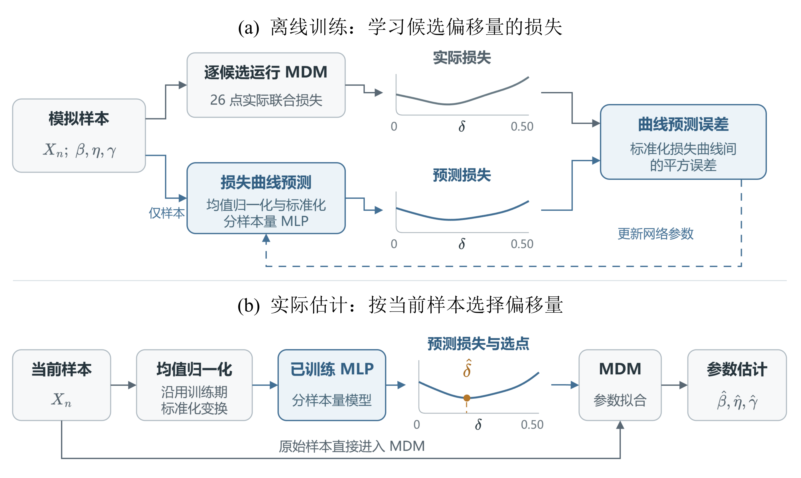
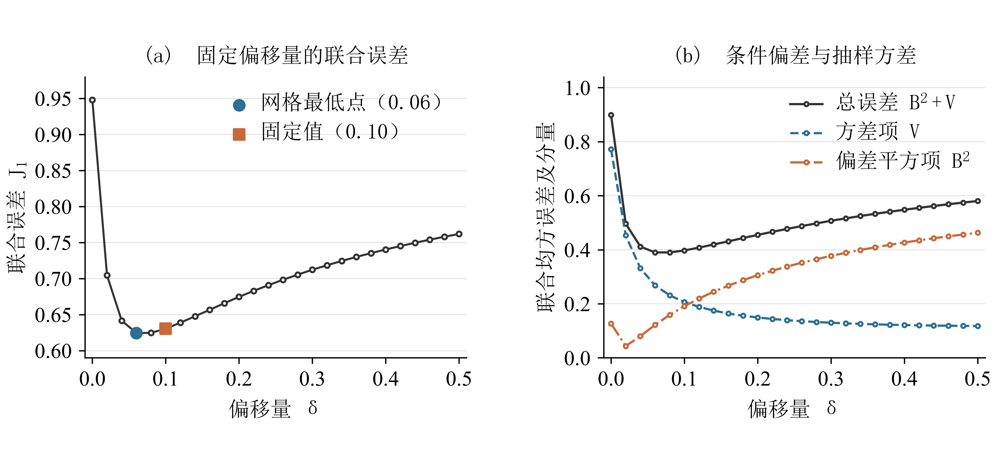
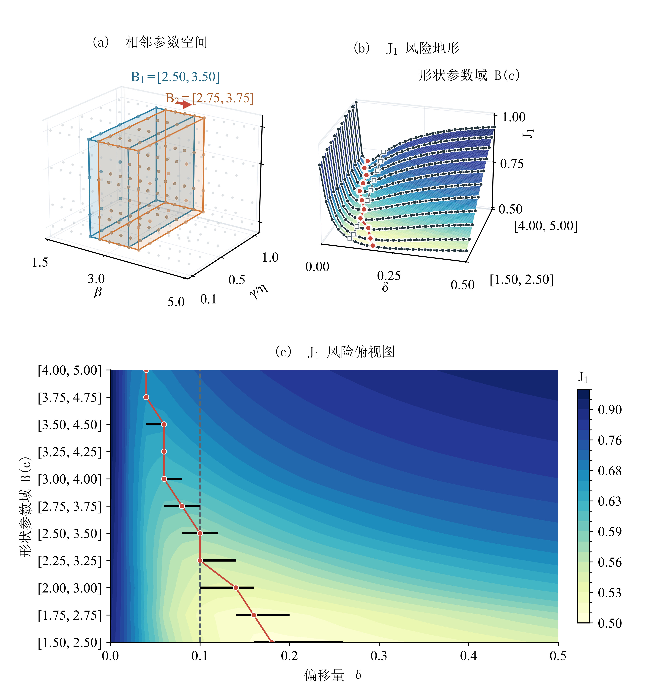
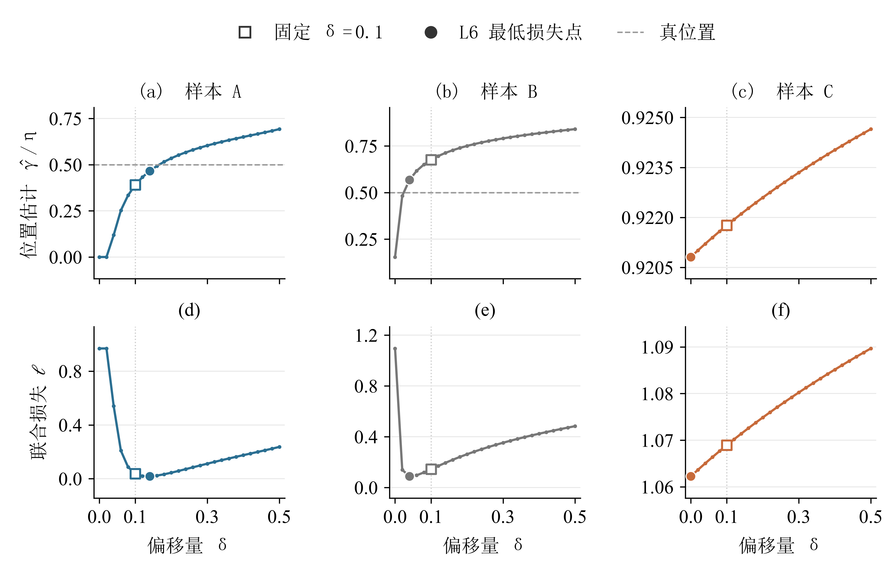
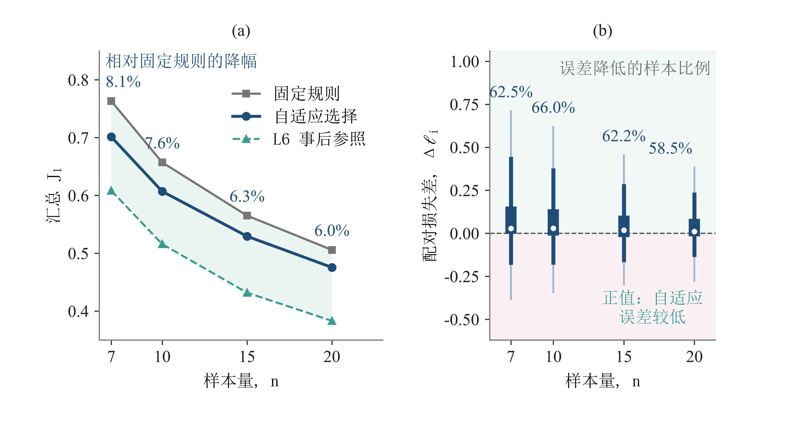
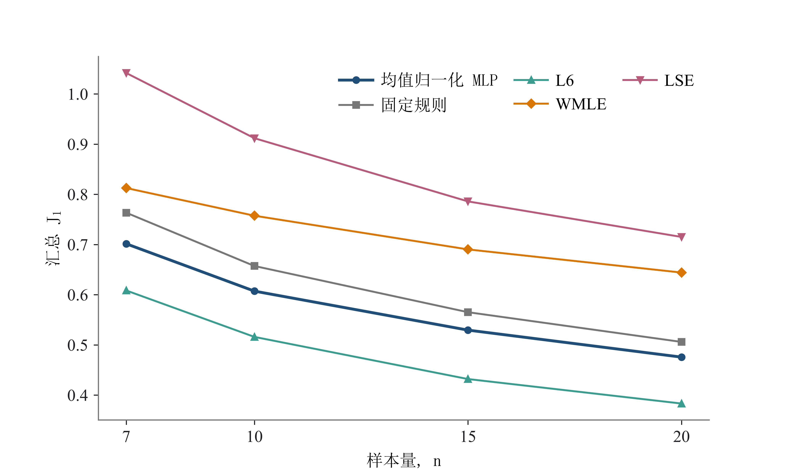

# 三参数 Weibull 分布小样本参数估计的自适应最小差异法

> 新稿 v2.0，结构审阅版，2026-09-09。当前先确定论证和章节，再补缺失内容。
> **已有**：旧稿文字可承接本节；**部分已有**：已放入旧材料，缺项留空；**待填**：只有本节目的，正文空置。标注仅表示材料状态。
> 本稿有17个二级小节：5节已有、11节部分已有、1节待填；摘要与新结论另留空。已有小节占约29%，这是按小节等权计算的草稿材料状态，不是研究工作量完成率。

**论证主线：** 小样本估计困难 → MDM原有结构与固定偏移 → AMDM完整方法 → 共同比较 → 样本适配与收益边界。

旧稿文字按新结构归位；图表号、文献号和附录字母暂沿用旧稿，结构确定后统一编排。下面的旧评价结果均保留其原数据身份；新确认结果尚空缺。原文与旧附录统一见[旧稿入口](旧稿/README.md)，实验来源见[证据索引](../01-证据索引.md)。

## 摘要

> 待填：结构和主结果确定后，写背景、AMDM方法、关键发现与范围。旧摘要保存在[旧正文](旧稿/Study01论文初稿-v1.12.md)。

<!-- 摘要正文留空 -->

## 1 引言

### 1.1 小样本估计问题与MDM的发展

> **已有**｜本节写：交代三参数估计困难、原MDM和固定正偏移的来历。
> 材料来源：[旧正文§1前三段](旧稿/Study01论文初稿-v1.12.md)。

三参数 Weibull 分布能够描述具有非零寿命起点的数据，广泛用于寿命与可靠性分析。其位置参数既确定分布的寿命起点，也使样本支持域随待估参数变化，因而增加了参数估计的难度。已有研究提出了极大似然法、矩估计法、最小二乘法及其修正方法。在小样本条件下，极大似然估计可能出现较大偏差或无有限解，其他方法的表现也会随参数条件、样本量和评价标准改变，尚无一种方法在所有条件下始终最优[1–5]。

针对三参数 Weibull 的小样本估计，谢里阳等[6]提出了最小差异法。该方法根据各样本点构造尺度参数的伪估计量，通过减小伪估计量之间的差异确定形状参数和位置参数，并在原研究中较极大似然法和最小二乘法表现出更好的准确性和稳健性[6]。后续研究又在位置参数搜索判据中引入正偏移量 $\delta=0.1$，进一步改善了小样本估计的精度和稳定性[7]。该研究指出，随机样本在真参数处未必满足零梯度判据，并以经验偏移量调整搜索位置；$0.1$ 来自 120 个估计案例，更适当的取值与选择方式仍待研究[7]。因此，进一步完善 MDM，需要说明偏移量怎样改变估计误差，并建立超出统一经验常数的选择依据。

统计估计中的调节量常凭经验设定，但更合适的取值往往与当前数据有关。围绕这一问题，早期研究根据当前数据估计均方误差，为稳健回归和最小距离估计选择调节参数[8–10]；后续工作又将训练和验证风险用于调参，或利用神经网络学习非参数回归的带宽[11,12]。近年来，模拟决策方法进一步直接学习给定观测下不同候选决策的条件损失[13]。这些方法都是根据当前数据下不同候选取值的风险，代替完全固定的经验常数。

### 1.2 本文的研究问题与贡献

> **部分已有**｜本节写：把论文目的收束到AMDM完整估计方法及其样本适配机制。
> 材料来源：[旧正文§1末段](旧稿/Study01论文初稿-v1.12.md)。

针对 MDM 经验偏移量的取值依据与进一步优化问题，本文从参数空间、样本实现和自适应选择三个层面展开研究。通过 Monte Carlo 候选扫描考察统一偏移量对参数空间的依赖，比较不同信息条件下的选择规则，区分总体参数与抽样差异带来的优化空间；结合 MDM 搜索路径和联合误差分析，解释偏移量作用于三参数估计的过程。在此基础上，建立由归一化排序样本预测候选损失曲线的偏移量选择方法，通过参数水平留出评价检验其在总体参数未知时能否进一步提高估计精度。

> **待补：** 用完整估计器的定位重写研究问题、三项研究内容和贡献。

<!-- 本节待补正文留空 -->

## 2 自适应最小差异法

### 2.1 MDM估计结构与固定偏移

> **部分已有**｜本节写：说明伪尺度一致性、条件求解和偏移量作用，为AMDM定义提供基础。
> 材料来源：[旧正文§2.1](旧稿/Study01论文初稿-v1.12.md)。

三参数 Weibull 分布的累积分布函数为

$$
F(t)=
\begin{cases}
0, & t\leq\gamma,\\
1-\exp\left[-\left(\dfrac{t-\gamma}{\eta}\right)^\beta\right], & t>\gamma.
\end{cases}
$$

其中 $\beta>0$、$\eta>0$，$\gamma$ 为位置参数。给定升序样本 $t_{(1)}\leq\cdots\leq t_{(n)}$，采用中位秩估计[14]

$$
F_i=\frac{i-0.3}{n+0.4},\qquad q_i=-\ln(1-F_i).
$$

当候选形状参数和位置参数分别为 $\beta$ 和 $\gamma$ 时，第 $i$ 个样本点给出的伪尺度参数为[6]

$$
\eta_i(\beta,\gamma)=\frac{t_{(i)}-\gamma}{q_i^{1/\beta}}.
$$

若各样本点恰为秩概率 $F_i$ 对应的理论分位点，代入真形状参数与真位置参数后，各 $\eta_i$ 均等于真尺度参数。实际抽样得到的 $t_{(i)}$ 通常偏离这些分位点，因而即使代入真参数，伪尺度参数之间仍存在差异。MDM 利用这种差异随候选参数变化的规律进行估计，但某次样本的差异最小点未必对应真参数[7]。

伪尺度参数之间的差异用样本标准差 $s_\eta(\beta,\gamma)$ 表示。对每个候选 $\gamma$，先求

$$
\beta^*(\gamma)=\arg\min_{0.1\leq\beta\leq15}s_\eta(\beta,\gamma),
\qquad
S(\gamma)=s_\eta\bigl(\beta^*(\gamma),\gamma\bigr),
$$

再根据廓线 $S(\gamma)$ 的梯度确定位置参数。沿用前期文献的记号[7]，定义 $\nabla(\gamma)\equiv\mathrm dS(\gamma)/\mathrm d\gamma$。无偏移判据对应 $\nabla(\hat\gamma)=0$；引入正偏移量后，判据写为

$$
\nabla(\hat\gamma)=\delta.
$$

在非负位置参数约束下，若 $\nabla(0)\geq\delta$，取 $\hat\gamma=0$；否则在 $0<\gamma<t_{(1)}$ 内求交点。得到 $\hat\gamma$ 后，取 $\hat\beta=\beta^*(\hat\gamma)$，并以伪尺度参数的平均值估计尺度参数：

$$
\hat\eta=\frac{1}{n}\sum_{i=1}^{n}
\frac{t_{(i)}-\hat\gamma}{q_i^{1/\hat\beta}}.
$$

对于一个给定样本，上述计算随候选 $\gamma$ 形成一组相互对应的三参数估计：$\beta^*(\gamma)$ 由条件最小差异确定，尺度参数由伪尺度参数的平均值确定。调节 $\delta$ 改变的是梯度判据在这组候选解中的选择位置。它先改变位置估计，再通过形状参数的条件优化和尺度参数的计算，使三个估计量共同变化。因此，偏移量虽只出现在位置参数判据中，其效果需要以三参数联合误差评价。

经验正偏移量的作用可以从重复抽样理解。不同样本形成不同的廓线，零梯度判据在这些廓线上的落点可能较为分散；改用正梯度水平后，估计的抽样离散程度与平均位置都会变化[7]。离散程度下降有利于提高精度，但估计中心也可能偏离真值。合适的偏移量因而取决于这两种变化共同形成的误差，而不能仅由结果是否集中判断。第 4.1 节用重复抽样数据分解这两部分影响。

在同一参数条件下，抽样得到的次序统计量与间距仍有差异，候选解路径及其相对真值的位置也随之改变。针对该条件选择一个平均误差较低的偏移量，可以改善重复抽样表现；进一步利用当前样本，则可能区分同一条件内不同候选的相对优劣。这两种选择针对同一个参数估计目标，区别在于所利用的信息。交点对样本曲线变化的局部关系见附录 B.7。

> **待补：** 核对原始MDM、固定偏移方法和当前零偏移实现的关系。

<!-- 本节待补正文留空 -->

### 2.2 AMDM的样本自适应估计流程

> **部分已有**｜本节写：给出样本输入、损失预测、偏移量选择与三参数求解的完整流程。
> 材料来源：[旧正文§2.4](旧稿/Study01论文初稿-v1.12.md)。

实际估计时可用的信息来自当前观测样本。本文据此把偏移量选择转化为一个多输出回归任务：用当前样本预测 26 个候选偏移量对应的损失，再取预测损失最小的候选值。

对每个样本量 $n$ 单独训练一个 MLP。先将样本升序排列，再除以该样本的算术平均值：

$$
X_n=\operatorname{sort}(x_1,\ldots,x_n),\qquad
Z_n=\frac{X_n}{\bar x},
$$

输出为预测损失向量

$$
\widehat{\boldsymbol\ell}(Z_n)=
\left(\widehat\ell_{\delta_1},\ldots,
\widehat\ell_{\delta_{26}}\right).
$$

将网络输出逆标准化到原损失尺度，并将负预测值截为零后，选择规则及最终估计为

$$
\hat\delta(Z_n)=\arg\min_{\delta_j\in\mathcal D}
\widehat\ell_{\delta_j}(Z_n),
$$

$$
(\hat\beta,\hat\eta,\hat\gamma)
=\operatorname{MDM}\bigl(X_n;\hat\delta(Z_n)\bigr).
$$

若多个候选预测损失相同，则取候选网格中较小的偏移量。输入为均值归一化后的排序样本。各排序位置的 StandardScaler 和 26 维目标的标准化参数均由相应训练折拟合。若某个候选偏移量的 MDM 估计失败，则以训练折有效损失的第 99 百分位数填充该候选的训练目标。网络包含 3 个隐藏层，采用 ReLU 激活函数和 Adam 优化器，以标准化后的预测损失曲线与实际损失曲线之间的平方误差训练。监督信号是每个样本在 26 个候选偏移量下的联合损失曲线 $\ell_i(\delta)$，$J_1$ 用于评价阶段的样本汇总。正文以固定随机种子 42 的折外模型报告主结果，另外两个预设种子用于检验初始化敏感性。下文将这一选择器称为均值归一化 MLP（Mean-normalized MLP）。网络配置和初始化敏感性结果见附录 B。

采用整条损失曲线作为监督信号，是为了同时保留候选偏移量的优劣顺序和选错时的损失代价。若只用最低损失格点作为类别标签，两个损失几乎相同的候选与两个损失相差很大的候选都会被区分为不同类别；曲线标签则保留了这种代价差别，使训练目标与最终的联合误差评价相联系。训练时利用 Monte Carlo 样本的真参数计算各候选损失；应用时只需当前观测样本，网络确定 $\delta$ 后由 MDM 完成 Weibull 参数估计。完整流程见图 1。

**图 1  样本自适应偏移量选择方法。** **a，** 用模拟样本的实际候选损失训练损失曲线预测网络；**b，** 根据当前样本的预测损失选择偏移量，再由 MDM 估计参数。示意曲线连接 26 个候选点，橙色圆点表示所选偏移量；蓝色表示损失预测与选点，虚线表示网络参数更新。

> **待补：** 统一AMDM名称及算法表述，核定最终模型身份；旧图1对应规划F01。

<!-- 本节待补正文留空 -->

### 2.3 损失学习的统计解释与适用条件

> **已有**｜本节写：说明预测条件损失的含义、训练与推断信息差异及尺度等变关系。
> 材料来源：[旧正文§4.2中段、§2.4尺度段](旧稿/Study01论文初稿-v1.12.md)。

这种联系对应的是给定可观测样本后的期望损失。以当前训练设计的参数混合分布及其权重定义条件期望，仅使用可观测输入 $Z$ 的理想规则为

$$
\delta_Z^*(Z)=\arg\min_{\delta\in\mathcal D}
\operatorname{E}\!\left[\ell(\delta,X,\theta)\mid Z\right].
$$

损失曲线回归旨在近似这些候选的条件期望损失，再以预测最低点作出选择。最终需要评价的是所选候选带来的实际估计误差：当损失曲线底部较平坦时，选点未与 L6 完全重合也可能只付出很小代价，因而精确格点一致率不能代替损失评价。L6 还使用真参数及当前样本所有候选的已实现损失，其事后最小值所利用的信息多于可执行规则；MLP 与 L6 的差距同时包含预测和选择误差，以及条件决策与事后选择的信息差。

对正尺度变换 $X\mapsto cX$，归一化输入满足 $Z(cX)=Z(X)$，因而同一网络选择的偏移量不变。MDM 的廓线满足 $S_{cX}(c\gamma)=cS_X(\gamma)$，其梯度及偏移量均为无量纲量；在相同求解和选解规则下，$\hat\beta$ 不变，$\hat\eta$ 与 $\hat\gamma$ 按 $c$ 倍变化。推导及数值检查见附录 B.3。

## 3 实验设计与评价

### 3.1 数据设计与开发、确认划分

> **部分已有**｜本节写：交代旧开发数据和评价划分，给冻结后的新确认留出独立位置。
> 材料来源：[旧正文§2.3](旧稿/Study01论文初稿-v1.12.md)。

Monte Carlo 参数设计见表 1。尺度参数固定为 $\eta=1000$，位置参数由 $\eta$ 与 $\gamma/\eta$ 的取值共同确定。

**表 1  Monte Carlo 参数设计。**

| 设计因素 | 取值 | 水平数 |
|---|---|---:|
| 形状参数 $\beta$ | 1.5、2.0、2.5、3.0、3.5、4.0、4.5、5.0 | 8 |
| 尺度参数 $\eta$ | 1000 | 1 |
| 位置—尺度比 $\gamma/\eta$ | 0.10、0.25、0.50、0.75、1.00 | 5 |
| 样本量 $n$ | 7、10、15、20 | 4 |
| 候选偏移量 $\delta$ | 0.00、0.02、……、0.50 | 26 |
| 每组合重复数 | 300 | 1 |

上述设计共形成 160 个参数组合和 48,000 个样本；每个样本在 26 个候选偏移量下运行 MDM，共得到 1,248,000 次估计结果。随机样本由三参数 Weibull 分布的逆累积分布变换生成，抽样种子按参数组合和重复编号确定并随代码归档。

为检验统一偏移量对参数域的敏感性，将 $\beta$ 水平加密至步长 0.25，构造宽度为 1.00、包含 5 个连续水平的 11 个滑动区间，区间中心由 2.00 移至 4.50。其余参数、样本量和权重保持不变，每个参数组合使用 100 次重复。各域分别计算 26 点汇总风险曲线、离散最低点及最低 $J_1$ 以上 1% 内的候选范围，并以 5,000 次重复块 bootstrap 描述最低点稳定性；样本构造见附录 A.1。

信息层级与 MLP 采用两种不同的评价划分。L1—L5 按重复编号进行五折交叉评价，使每个参数组合在训练折和测试折中都有独立重复样本。MLP 检验未见 $\gamma/\eta$ 水平：对每个 $n$，五折依次留出一个完整的 $\gamma/\eta$ 水平，测试折包含该水平下全部 8 个 $\beta$，训练折使用其余四个水平。每个 $n$ 和每个留出折分别训练模型。均值归一化 MLP、固定 $\delta=0.1$ 和 L6 的主比较使用完全相同的折外评价样本。输入表示筛选与主评价使用同一批折外样本，本文报告选定表示后的折外结果；筛选过程见附录 B.3。信息层级结果与样本自适应结果分别报告，参数设计、失败处理、重复训练设置和两类划分的完整说明见附录 A、B。

> **待补：** 填写结构确定后获准的新确认设计，旧数据不改称新确认。

<!-- 本节待补正文留空 -->

### 3.2 比较方法与信息条件

> **部分已有**｜本节写：区分实际竞争方法、真参数条件规则和事后参照。
> 材料来源：[旧正文§2.2末段、旧附录§E.1](旧稿/Study01论文初稿-v1.12.md)。

候选偏移量为 $\mathcal D=\{0,0.02,\ldots,0.50\}$。为了考察低风险偏移量与哪些条件有关，设置 Default 和 L1—L6 七种规则。Default 固定取 $\delta=0.1$；L1 在当前设计的全部训练样本上选择一个统一常数；L2 按样本量 $n$ 选择；L3 按真值 $\beta$ 选择；L4 按 $(\beta,n)$ 选择；L5 按 $(\beta,\gamma/\eta,n)$ 选择；L6 对每个样本直接取 26 个实际损失中的最小值。L1 和 L2 表示简单选择规则；L3—L5 依次量化增加参数信息后的条件平均风险；L6 量化获得当前样本全部候选损失后的逐样本事后水平。

L1—L5 均采用五折交叉评价：在训练折选择偏移量，再在对应测试折计算损失。五个测试折合并后得到各信息层级的汇总结果。L6 则直接汇总每个样本在 26 个候选点上的最低实际损失。

WMLE 和 LSE 使用与主方法相同的 48,000 个 Monte Carlo 样本。WMLE 为 Cousineau 型加权估计，LSE 为基于对数 Weibull 次序统计量期望的回归估计；二者均约束位置参数非负。数值结果对应归档运行的具体实现，复现应以其来源提交和清单为准，而非替换为其他同名估计器。其完整求解配置和独立参考文献条目还需随投稿代码包一并核定。表 E1 补充正文未展开的三参数 Bias 和 RMSE。

> **待补：** 核定各代MDM及竞争方法的定义、来源与统一失败处理。

<!-- 本节待补正文留空 -->

### 3.3 评价指标与不确定性

> **已有**｜本节写：定义联合参数误差、偏差—方差分解及配对评价口径。
> 材料来源：[旧正文§2.2指标部分](旧稿/Study01论文初稿-v1.12.md)。

对第 $i$ 个 Monte Carlo 样本，定义三参数联合损失

$$
\ell_i(\delta)=
\left(\frac{\hat\beta_i(\delta)-\beta_i}{\beta_i}\right)^2+
\left(\frac{\hat\eta_i(\delta)-\eta_i}{\eta_i}\right)^2+
\left(\frac{\hat\gamma_i(\delta)-\gamma_i}{\eta_i}\right)^2.
$$

形状参数和尺度参数误差分别以各自真值标准化；位置参数误差以 $\eta_i$ 标准化，从而避免 $\gamma_i$ 接近零时产生不稳定比值。对 $N$ 个评价样本，汇总指标为

$$
J_1=\sqrt{\frac{1}{N}\sum_{i=1}^{N}\ell_i}.
$$

以固定偏移量 $\delta=0.1$ 的方法（Default）为基准，方法 $m$ 的 $J_1$ 相对降幅定义为

$$
r_{J_1}(m)=\frac{J_{1,\mathrm{Default}}-J_{1,m}}
{J_{1,\mathrm{Default}}}\times100\%.
$$

其中，$J_{1,m}$ 为方法 $m$ 在相同评价样本上的汇总指标。正值表示误差降低，负值表示误差增加。附录 F 的条件风险诊断另以均方损失 $\mathcal R=J_1^2$ 定义可加的风险差。

$J_1$ 越小，表示三个标准化参数误差等权汇总后的联合误差越小。训练时使用单样本损失 $\ell_i(\delta)$ 构造 26 点曲线，评价时使用 $J_1$ 汇总，并分别报告三个参数的标准化 Bias、SD 和 RMSE。各样本等权汇总的 Bias 和 SD 分别反映平均偏差与总体离散程度；固定参数组合内的 SD 则反映重复抽样的波动。

为解释偏移量改变精度的来源，在每个参数组合 $c$ 内分别计算三个标准化误差 $e_{c,k}$ 的均值与方差，再按设计权重 $w_c$ 汇总：

$$
\begin{aligned}
J_1^2(\delta)&=B^2(\delta)+V(\delta),\\
B^2(\delta)&=\sum_cw_c\sum_k\bar e_{c,k}(\delta)^2,\\
V(\delta)&=\sum_cw_c\sum_k v_{c,k}(\delta).
\end{aligned}
$$

其中 $k\in\{\beta,\eta,\gamma\}$，当前设计 $w_c=1/160$；$v_{c,k}$ 为组合内以重复数作分母的经验方差。$B^2$ 衡量各组合估计中心偏离真值的程度，$V$ 衡量组合内的抽样离散程度。二者均先在固定真参数条件下计算，从而保留条件偏差，避免不同组合的正负偏差在混合平均中抵消。具体计算及逐参数 SD 分布见附录 A.6。

### 3.4 机制诊断与适用范围验证

> **部分已有**｜本节写：说明路径、样本匹配、分n和适用范围分别如何检验。
> 材料来源：[旧正文§2.5—2.6](旧稿/Study01论文初稿-v1.12.md)。

为考察同一参数条件下低风险偏移量为何随样本改变，进一步分析第 2.1 节定义的 MDM 位置参数搜索曲线。以 $S_X(\gamma)$ 和 $\nabla_X(\gamma)$ 标明廓线及梯度对当前样本 $X$ 的依赖；即使真参数相同，不同抽样结果仍可能产生不同的梯度轨迹、内部交点或边界解。

机制诊断从参数域中预先选取 20 个参数—样本量单元，并使用未参与模型训练的 2,000 个确认样本。每个样本复用已有的 26 点损失扫描，只重新生成 MDM 梯度轨迹；随后考察 $\nabla_X(0)$、固定 $\delta=0.1$ 时的 $\hat\gamma_{0.1}/\eta$ 与事后低风险偏移量之间的关系。参数单元、确认样本和分组方式见附录 F。

除主比较外，本文还检验未参与训练的 $\beta$ 水平、网络初始化、整体尺度变换和不同参数条件下的效果差异。在相同的 48,000 个样本上，另以加权极大似然法（weighted maximum likelihood estimation，WMLE）和最小二乘法（least-squares estimation，LSE）作为 MDM 之外的误差参照，并将参数估计传递到可靠度寿命 $x_R$。其中 $x_R$ 满足 $P(T>x_R)=R$：

$$
x_R=\gamma+\eta[-\ln(R)]^{1/\beta},
$$

本文评价 $R=0.90,0.95,0.99$ 三个寿命点。所有方法报告汇总及分样本量的 $J_1$ 和失败率，主方法另报告逐参数误差；主结果的不确定性采用保持方法间配对关系的重复块 bootstrap，区间条件于已训练选择器和当前设计，不包含表示筛选与重新训练的不确定性。各项验证的完整指标、失败处理和重采样设置见附录 A、B、D 和 E。

> **待补：** 补实际AMDM选点及同条件样本匹配诊断；扩展n和几何比较先作结构取舍。

<!-- 本节待补正文留空 -->

## 4 结果

### 4.1 固定偏移的作用与改进空间

> **已有**｜本节写：先用风险分解和参数域变化说明为何需要进一步调节。
> 材料来源：[旧正文§3.1](旧稿/Study01论文初稿-v1.12.md)。

在完整参数设计中，经验偏移量 $\delta=0.10$ 接近最低联合误差：26 点扫描的最低值位于 $\delta=0.06$，$J_1=0.624518$，而 $\delta=0.10$ 的 $J_1=0.630409$，仅高出 0.93%（图 2a）。在这一混合参数空间中，用另一个统一常数替代经验值的改善幅度较小。

风险分解解释了该低值区域的形成。由无偏移判据调至 $\delta=0.10$，抽样方差项的降幅超过条件偏差平方项的增幅，$J_1$ 从 0.9481 降至 0.6304；继续增大至 0.50，方差仍下降，但偏差增加使 $J_1$ 回升至 0.7619（图 2b）。组合内偏差与方差的分解及逐参数抽样波动见附录 A.6。

**图 2  偏移量对联合估计误差的影响。** **a，** 26 个候选偏移量的汇总 $J_1$；**b，** 相应的联合均方误差 $J_1^2$、条件偏差平方项 $B^2$ 与组合内方差项 $V$。各分量先根据每个参数组合的 300 次重复抽样计算，再对 160 个组合等权汇总。

统一值的上述表现来自多个参数条件的混合。为考察其对参数空间的依赖，在保持域宽、样本量构成与条件权重不变的情况下，沿形状参数轴平移评价范围。

固定宽度形状参数域的比较显示，统一偏移量随参数域有序移动（图 3）。区间由 $[1.50,2.50]$ 移至 $[4.00,5.00]$ 时，离散最低点由 $\delta=0.18$ 降至 0.04，1% 近优范围由 0.16—0.26 移至 0.04。$\delta=0.10$ 在 $[2.25,3.25]$ 和 $[2.50,3.50]$ 内达到最低风险，在最低与最高两个区间则分别比最低 $J_1$ 高 5.06% 和 9.16%。重复块 bootstrap 的最低点区间支持这一移动方向。统一偏移量因而是针对给定参数域的风险折中。

**图 3  固定宽度参数域对统一偏移量的影响。** **a，** 蓝、橙盒体表示沿 $\beta$ 轴平移的相邻参数域 $B_1=[2.50,3.50]$ 与 $B_2=[2.75,3.75]$，均覆盖全部 $\gamma/\eta$ 和 $n$；**b，** 11 个参数域的 $J_1$ 风险地形，深色曲线与圆点为 26 个候选偏移量的实际评价值，红点为离散最低点，白色方块表示 $\delta=0.10$；**c，** 风险地形俯视图，黑色线段表示最低 $J_1$ 以上 1% 内的候选范围。曲面与色带由格点间线性插值绘制。

### 4.2 同条件样本差异与实际自适应调节

> **部分已有**｜本节写：连接同参数的样本差异、实际AMDM选点和已实现误差。
> 材料来源：[旧正文§3.2关键段、§3.4](旧稿/Study01论文初稿-v1.12.md)。

重新选择统一偏移量或仅按样本量查表的收益较小：L1 和 L2 的 $J_1$ 分别为 0.6252 和 0.6230，相对 Default 降低 0.83% 和 1.17%（表 2）。

当规则可以使用真值 $\beta$ 时，L3 降至 0.5905；继续加入 $n$ 和 $\gamma/\eta$ 后，L4 和 L5 分别为 0.5885 和 0.5813。L3—L5 表明，不同参数条件下的平均损失曲线存在差异，因而按条件选择偏移量可以进一步降低风险。其中，仅区分样本量的改善很小，使用形状参数信息时改善明显增大。L2 与 L3 的信息集合并非包含关系，不将两者差值解释为逐级增加单一信息的净效应。

L6 在 26 点网格内查看当前样本的全部已实现损失，再事后选取最小值，得到 $J_1=0.4923$，相对 Default 降低 21.91%。在独立确认样本中，L5 的参数条件平均选点与 L6 选点有 12.6% 完全一致；同一参数条件内，L6 偏移量的中位有效候选数为 6.09。这说明低风险偏移量既随参数条件改变，也会在同一条件内随抽样结果变化。

相同真参数下，不同抽样结果形成不同的候选解路径，偏移量对应的联合损失也随之改变。图 7 按列展示 $(\beta,\gamma/\eta,n)=(3,0.5,10)$ 下三个样本的位置估计及联合损失。在样本 A 中，将偏移量从 0.10 提高至 0.14，位置估计向真值靠近，联合损失降低；在样本 B 中，偏移量降至 0.04 时取得较低联合损失。样本 C 的位置估计随偏移量变化较小，损失在整个候选区间内缓慢上升，最低点位于 0。三个样本的目标真值相同，但适合各自候选解路径的偏移量不同。

这一差异也体现于分组诊断。在 20 个预设诊断单元、2,000 个确认样本中，固定 $\delta=0.1$ 时的位置估计 $\hat\gamma_{0.1}/\eta$ 与 L6 偏移量在全部单元内均呈负相关，Spearman 相关系数中位数为 $-0.765$，四分位区间为 $[-0.803,-0.609]$。按该位置估计从低到高分组后，平均超额损失曲线的最低点依次位于 $\delta=0.10$、0.04 和 0.02（附录图 F4）。固定规则得到的估计位置与候选损失的相对高低存在联系，为利用当前样本选择偏移量提供了依据。完整指标见附录 F.3，损失曲线预测及选点诊断见附录图 B1。

**图 7  同一参数条件下的样本估计路径与联合损失。** 三列分别为样本 A、B、C；上排为位置估计，下排为三参数联合损失，均按 26 个候选偏移量绘制。空心方块为固定 $\delta=0.1$，实心圆为 L6 最低损失点。各面板独立设置纵轴范围，水平虚线标出显示范围内的真位置 $\gamma/\eta=0.5$。

> **待补：** 补真实折外AMDM点与样本匹配结果；旧图7仅标固定点和L6，对应规划F03。

<!-- 本节待补正文留空 -->

### 4.3 AMDM与基准方法的参数估计性能

> **部分已有**｜本节写：在共同评价中展示完整方法的总体和分n竞争力。
> 材料来源：[旧正文§3.3主比较、旧附录§E.1表图](旧稿/Study01论文初稿-v1.12.md)。

在位置尺度比水平留出评价的同一 48,000 个样本上，样本自适应选择将汇总 $J_1$ 从固定偏移量的 0.630409 降至 0.584553，相对降低 7.27%；配对重复块 bootstrap 95% 区间为 6.94%—7.64%（表 3）。L6 的 $J_1$ 为 0.492297，三种规则均无估计失败。

**表 3  样本自适应选择的汇总与分样本量联合误差。**

| 方法 | 汇总 $J_1$ | $n=7$ | $n=10$ | $n=15$ | $n=20$ | 失败率 |
|---|---:|---:|---:|---:|---:|---:|
| Mean-normalized MLP | 0.5846 | 0.7013 | 0.6071 | 0.5294 | 0.4756 | 0.00% |
| Default（$\delta=0.1$） | 0.6304 | 0.7633 | 0.6571 | 0.5651 | 0.5058 | 0.00% |
| L6（逐样本事后参照） | 0.4923 | 0.6083 | 0.5159 | 0.4319 | 0.3831 | 0.00% |

改善覆盖四个已训练样本量。$n=7,10,15,20$ 时，$J_1$ 相对固定偏移量分别降低 8.12%、7.62%、6.32% 和 5.98%（图 6a）；各方法的误差均随样本量增大而下降。

逐样本配对结果也呈现整体改善。令 $\Delta\ell_i=\ell_{i,\mathrm{Default}}-\ell_{i,\mathrm{Adaptive}}$，正值表示自适应误差更低。四个样本量下，正值样本比例分别为 62.5%、66.0%、62.2% 和 58.5%，各组中位数均为正（图 6b）。

**图 6  不同样本量下的总体与逐样本结果。** **a，** 均值归一化 MLP、固定经验偏移量和逐样本事后参照在四个已训练样本量下的汇总 $J_1$；阴影表示 Default 与 L6 之间的观测差距。**b，** 逐样本配对损失差 $\Delta\ell_i=\ell_{i,\mathrm{Default}}-\ell_{i,\mathrm{Adaptive}}$ 的分布；细线、中线、粗线和白点依次表示第 1—99、第 5—95 百分位区间、四分位距和中位数，百分数表示误差降低的样本比例。

**表 E1  WMLE 与 LSE 在原参数尺度下的 Bias 和 RMSE。**

| 方法 | 汇总 $J_1$ | 失败率 | Bias $\beta$ | Bias $\eta$ | Bias $\gamma$ | RMSE $\beta$ | RMSE $\eta$ | RMSE $\gamma$ |
|---|---:|---:|---:|---:|---:|---:|---:|---:|
| WMLE | 0.7288 | 0.002% | -0.3505 | -47.6025 | 46.7441 | 1.4180 | 416.5679 | 374.1931 |
| LSE | 0.8725 | 0.000% | -0.0799 | -37.5334 | 32.6643 | 2.1619 | 460.5690 | 419.9131 |

**图 E1  传统方法的分样本量参照。** 均值归一化 MLP、Default、L6、WMLE 和 LSE 在 $n=7,10,15,20$ 下的 $J_1$。

> **待补：** 填写冻结后的共同独立确认结果；旧图6/E1对应规划F04。

<!-- 本节待补正文留空 -->

### 4.4 精度改善与抽样稳定性

> **部分已有**｜本节写：说明误差降低来自偏差、单元内离散还是尾部变化。
> 材料来源：[旧正文§3.3逐参数表](旧稿/Study01论文初稿-v1.12.md)。

$J_1$ 给出偏移量选择和规则比较所需的统一目标，逐参数指标用于检查这一改善如何落实到参数估计。与固定 $\delta=0.1$ 相比，样本自适应选择下 $\beta$、$\eta$ 和 $\gamma$ 的汇总标准化偏差绝对值、混合设计误差标准差和均方根误差均有所下降（表 4），联合指标的改善同时覆盖三个参数。

**表 4  固定偏移量与样本自适应选择的逐参数误差。**

| 参数 | 方法 | 汇总标准化 Bias | 混合设计误差 SD | 汇总标准化 RMSE | 标准化误差 P5–P95 |
|---|---|---:|---:|---:|---:|
| $\beta$ | 固定 $\delta=0.1$ | -0.2327 | 0.3293 | 0.4032 | [-0.6761, 0.3433] |
| $\beta$ | 样本自适应选择 | -0.2008 | 0.3165 | 0.3749 | [-0.6533, 0.3563] |
| $\eta$ | 固定 $\delta=0.1$ | -0.1998 | 0.3011 | 0.3614 | [-0.6624, 0.3107] |
| $\eta$ | 样本自适应选择 | -0.1827 | 0.2813 | 0.3354 | [-0.6395, 0.2934] |
| $\gamma$ | 固定 $\delta=0.1$ | 0.1868 | 0.2633 | 0.3228 | [-0.2406, 0.6236] |
| $\gamma$ | 样本自适应选择 | 0.1700 | 0.2445 | 0.2978 | [-0.2297, 0.5914] |

注：误差按第 3.3 节标准化。Bias 和 SD 为汇总误差的均值和标准差；P5–P95 为带符号误差的第 5—95 百分位区间。

> **待补：** 补AMDM单元内Bias/SD/RMSE及尾部分析；旧表4的混合设计SD不能替代，规划F05可并入结果表。

<!-- 本节待补正文留空 -->

### 4.5 改善范围、退化条件与样本量表现

> **部分已有**｜本节写：展示何处改善或退化，以及证据覆盖到哪些条件。
> 材料来源：[旧正文§3.3末段、§3.5首段](旧稿/Study01论文初稿-v1.12.md)。

在参数组合层面，160 个单元中 125 个改善、35 个退化，最大退化为 17.50%；退化较多出现在位置尺度比网格边界，并在较大样本量下更常见。对设计单元均值进行配对重采样时，汇总降幅的 95% 设计构成敏感性范围为 6.04%—8.46%。完整分布见附录 F 图 F2。

两个辅助初始化与主模型的汇总 $J_1$ 均落在 0.5846—0.5855，表明主结果在这三个预设初始化下的波动较小。逐一留出 $\beta$ 水平时，样本自适应方法的汇总 $J_1$ 为 0.5841，较固定 $\delta=0.1$ 降低 7.35%；其中七个留出水平保持改善，$\beta=1.5$ 略有退化。完整分层结果见附录 B 和 D。

> **待补：** 新确认和获准的范围扩展完成后填入；旧附图D1/F2对应规划F06。

<!-- 本节待补正文留空 -->

## 5 讨论

### 5.1 MDM结构为何可能有利于小样本估计

> **待填**｜本节写：梳理多次序统计量联合约束、支持边界敏感性、条件求解与偏差—方差调节；区分解释假设和已有证据。
> 材料来源：[作者规划整理版§四](../作者规划1-整理版.md)。

> **待补：** 先确定哪些解释是本文必要论点，再决定是否补几何比较；不预写机制结论。

<!-- 本节待补正文留空 -->

### 5.2 样本适配的收益来源

> **部分已有**｜本节写：解释可观测样本信息的作用，并区分参数条件规律与同条件样本匹配。
> 材料来源：[旧正文§4.2其余段落](旧稿/Study01论文初稿-v1.12.md)。

参数条件与样本实现分别对应平均风险和单次抽样损失两个层面。L3—L5 表明，不同参数条件下的平均损失曲线存在差异；同一参数条件内，L5 与 L6 的选点却仅有 12.6% 完全一致，说明知道参数条件仍不足以确定每个样本的低风险偏移量。因此，条件平均规则能够描述参数域中的差异，却不能代替对当前样本的判断。

同一真参数决定的是抽样分布，某个样本的次序统计量和间距则决定当前 MDM 廓线。偏移量是一项估计规则的调节量，其低损失取值取决于样本所形成的候选解路径，而不是总体固有的另一个分布参数。因此，同一真值下出现不同的事后低风险偏移量，与条件平均规则并不矛盾：前者针对本次实现的损失，后者针对该条件下重复抽样的平均损失。图 7 将搜索落点与同样本损失联系起来，分组结果进一步显示了可用于选择的统计规律（附录图 F4）。

样本自适应规则的任务，是利用当前可观测信息判断哪些候选偏移量更可能给出较小误差。真参数及本次抽样误差在实际估计时不可知，因而需要在训练设计中学习样本特征与候选损失之间的关系，而不能直接恢复每个样本的事后最佳值。

归一化排序样本保留了相对位置、间距和离散结构，使网络能够利用这些信息预测候选损失，而无需先确定总体参数。另一种自然的实现是先估计参数，再查询条件平均规则；不过，以估计值替代真值会引入条件匹配误差，而且即使准确匹配参数条件，条件平均规则仍会遗漏样本内的损失差异。附录 C 中已检验的初估参数规则未降低整体 $J_1$，说明所检验的查表规则未能将真参数参照的收益转化为实际估计收益。直接预测损失曲线则把观测样本与选择目标联系起来，省去了先估参数再匹配条件规则的中间步骤。

附录 F 进一步比较了在全部设计单元上拟合的同结构 MLP 与较灵活的可观测输入规则。后者在独立确认样本上取得更低风险，说明在该评价设置下，仅使用样本信息仍有进一步改善的空间。这一同域比较检验模型对当前样本信息的利用程度；灵活规则与 L6 的剩余差距仍同时包含可改进的预测误差与事后信息差。

> **待补：** 依据同条件匹配诊断回答核心机制问题；不把L5到L6的差额当成已实现收益。

<!-- 本节待补正文留空 -->

### 5.3 可靠度寿命与使用边界

> **已有**｜本节写：解释参数收益向寿命的传递，并明确使用范围。
> 材料来源：[旧正文§4.3—4.4](旧稿/Study01论文初稿-v1.12.md)。

在当前参数设计和联合误差准则下，样本自适应 MDM 的 $J_1$ 低于 WMLE 和 LSE，说明其收益在传统参数估计方法的比较中仍有意义。但方法排序依赖评价目标：本文对三个标准化参数误差的平方等权求和，可靠度寿命 $x_R$ 则是三个参数的组合函数，其局部误差取决于各参数的敏感度以及估计误差之间的协方差（附录 E.3）。即使三个参数的边际均方误差分别下降，也不能据此确定某个寿命点的误差会以相同比例下降。

寿命点比较体现了这一差别。样本自适应选择相对固定偏移量的寿命误差变化较小，而 WMLE 在三个已评价寿命点上的相对 RMSE 均更低。因此，本文所建立的优势应解释为联合参数估计精度的改善；若应用主要关心某一可靠度寿命，应直接按该寿命点的误差选择方法。候选损失也可以围绕寿命目标定义，但相应收益需要通过新的训练与评价检验。

现有证据限于独立同分布、完整观测、非负位置参数的离散设计，并只对 $n=7,10,15,20$ 分别训练模型。参数单元的效果分布和形状参数留出结果说明，汇总改善不保证每个条件均改善；连续参数域、其他样本量及模型偏离仍需验证。L6 的参照范围为预设的 26 点候选网格，针对右端损失仍下降样本的扩展核查见附录 A.5。

输入表示筛选复用了现有折外评价数据。后续应先冻结表示、训练与选点规则，再以新的独立重复样本确认整体收益和条件差异。真实数据验证也应与研究范围匹配，并根据实际数据处理测量误差、删失和混合失效机制。

## 6 结论

> 待填：回答固定偏移的作用与空间、AMDM的样本级调节、完整方法的性能及范围。旧结论保存在[旧正文§5](旧稿/Study01论文初稿-v1.12.md)，本稿不预写新结论。

<!-- 新结论正文留空 -->

## 附录材料

现有[附录v1.10](旧稿/Study01论文附录-v1.10.md)完整保留。A承接设计与偏移敏感性，B承接网络与训练细节，C保留查表负结果，D保留β留出，E保留传统参照与寿命，F保留可观测信息和分组诊断。旧正文完整L1—L6表与图4/5作为附录候选保留在旧稿，不另建新骨架。

新稿图位、现有资产与待补状态统一见[图表索引](figures/figure-index.md)（F01—F06、T01—T03；2026-09-20更新映射，未新增图或结果）。新图暂按用途归位：方法流程在2.2；固定偏移图2/3可合并于4.1；实际选点在4.2；方法比较在4.3；稳定性在4.4；适用范围在4.5。新表分别承接数据设计、方法定义和主要结果。真实资产由[图件索引](figures/figure-index.md)维护。

## 声明

> 待填：作者与单位、贡献、基金、利益冲突及最终数据/代码地址。旧稿已有占位说明保存在原文件中。

## 参考文献

> 沿用旧稿文献供现有文字引用；方法身份核查和结构确认后统一修订编号。

[1] Yang X, Xie L, Liu Y, et al. A review of parameter estimation methods of the three-parameter Weibull distribution. In: *2023 9th International Symposium on System Security, Safety, and Reliability (ISSSR)*. 2023: 20–31. doi:10.1109/ISSSR58837.2023.00013.

[2] Cohen AC, Whitten B. Modified maximum likelihood and modified moment estimators for the three-parameter Weibull distribution. *Communications in Statistics—Theory and Methods*. 1982;11(23):2631–2656. doi:10.1080/03610928208828412.

[3] Cousineau D. Fitting the three-parameter Weibull distribution: review and evaluation of existing and new methods. *IEEE Transactions on Dielectrics and Electrical Insulation*. 2009;16(1):281–288. doi:10.1109/TDEI.2009.4784578.

[4] Akram M, Hayat A. Comparison of estimators of the Weibull distribution. *Journal of Statistical Theory and Practice*. 2014;8(2):238–259. doi:10.1080/15598608.2014.847771.

[5] Teimouri M, Hoseini SM, Nadarajah S. Comparison of estimation methods for the Weibull distribution. *Statistics*. 2013;47(1):93–109. doi:10.1080/02331888.2011.559657.

[6] Xie L, Wu N, Yang X. A minimum discrepancy method for Weibull distribution parameter estimation. *International Journal of Structural Stability and Dynamics*. 2023;23(8):2350085. doi:10.1142/S0219455423500852.

[7] 谢里阳, 朱文慧, 吴宁祥, 杨小玉. 基于统计最小差异原理的 Weibull 分布参数估计方法. *东北大学学报（自然科学版）*. 2025;46(7):108–112+130. doi:10.12068/j.issn.1005-3026.2025.20240194.

[8] Kelly G. Adaptive choice of tuning constant for robust regression estimators. *Journal of the Royal Statistical Society: Series D (The Statistician)*. 1996;45(1):35–40. doi:10.2307/2348409.

[9] Warwick J. A data-based method for selecting tuning parameters in minimum distance estimators. *Computational Statistics & Data Analysis*. 2005;48(3):571–585. doi:10.1016/j.csda.2004.03.006.

[10] Warwick J, Jones MC. Choosing a robustness tuning parameter. *Journal of Statistical Computation and Simulation*. 2005;75(7):581–588. doi:10.1080/00949650412331299120.

[11] Zhang C, Zhang T, Yin F, Zoubir AM. Data-adaptive M-estimators for robust regression via bi-level optimization. *Signal Processing*. 2023;210:109063. doi:10.1016/j.sigpro.2023.109063.

[12] Giordano F, Parrella ML. Neural networks for bandwidth selection in local linear regression of time series. *Computational Statistics & Data Analysis*. 2008;52(5):2435–2450. doi:10.1016/j.csda.2007.08.013.

[13] Gorecki M, Macke JH, Deistler M. Amortized Bayesian decision making for simulation-based models. *Transactions on Machine Learning Research*. 2024. OpenReview:BQE4MTAfCE.

[14] Benard A, Bos-Levenbach EC. Het uitzetten van waarnemingen op waarschijnlijkheids-papier. *Statistica Neerlandica*. 1953;7(3):163–173. doi:10.1111/j.1467-9574.1953.tb00821.x.
