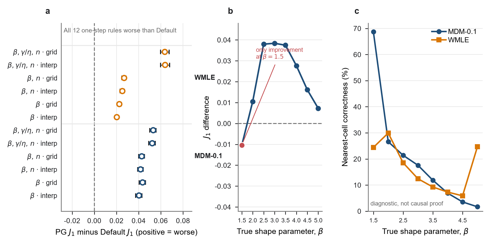
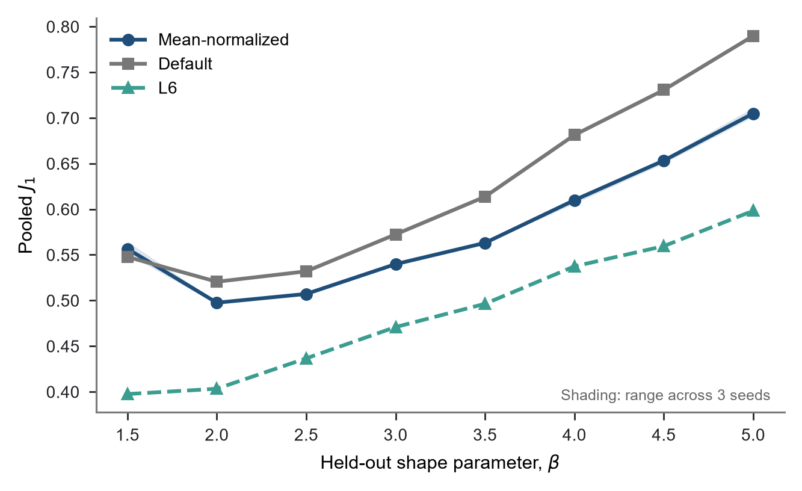
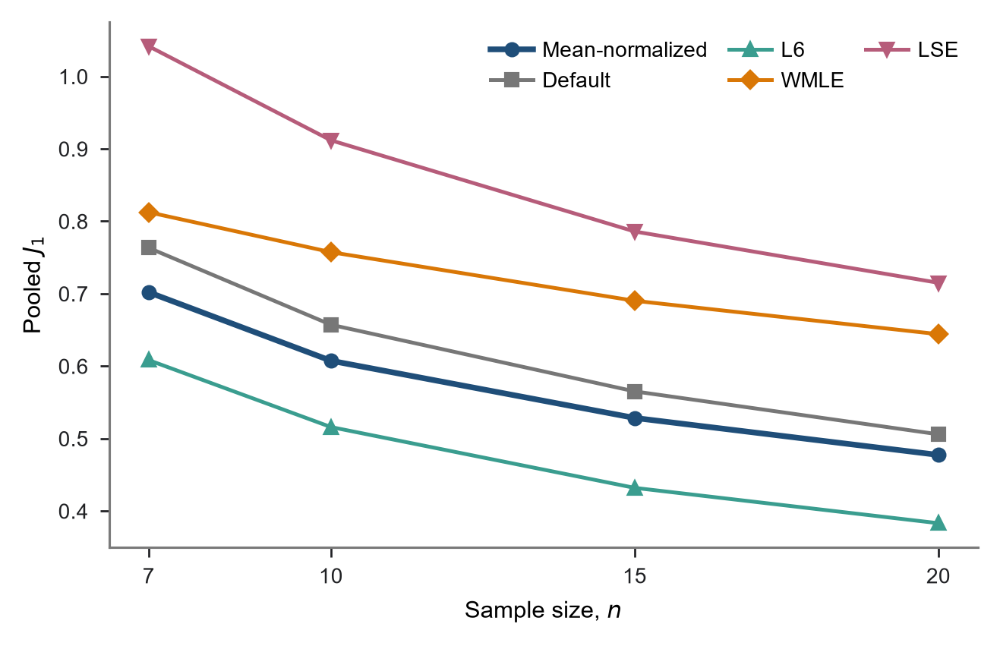
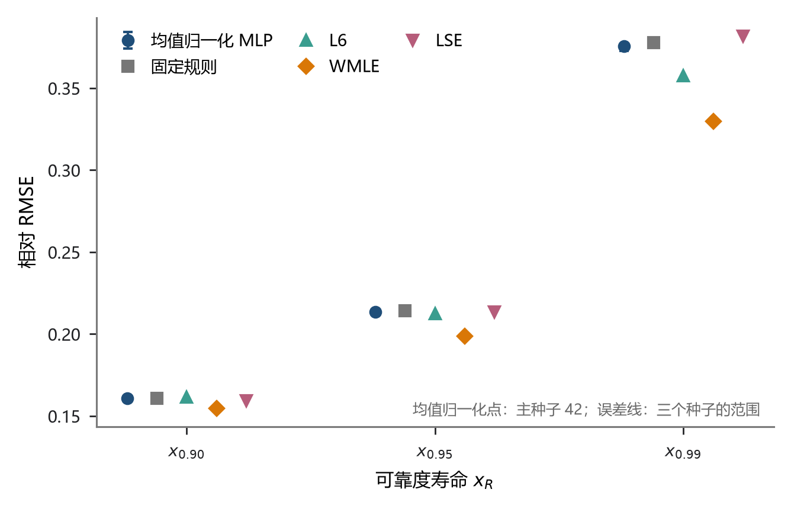
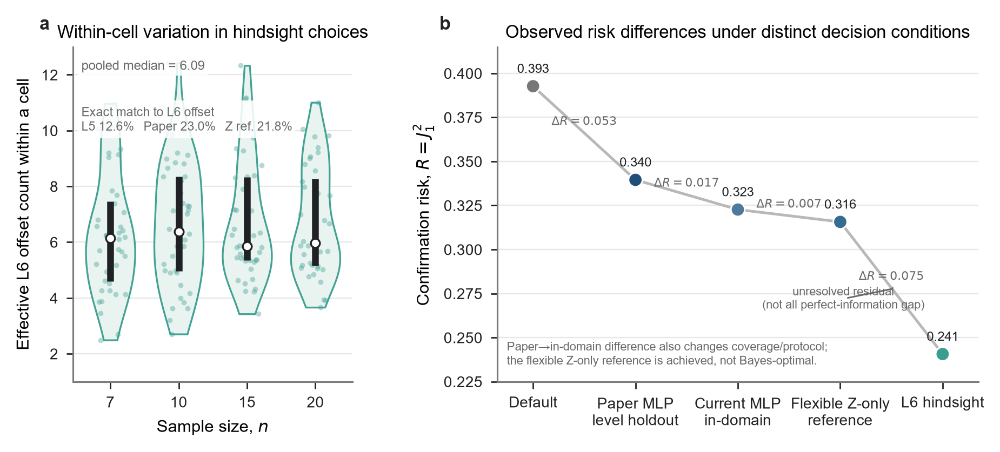
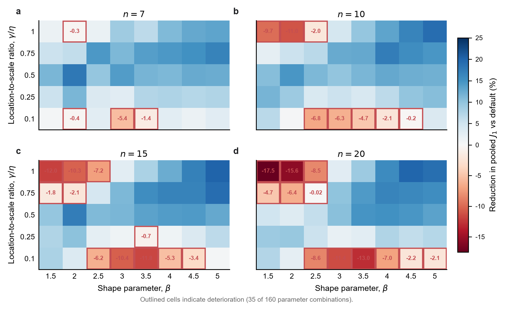
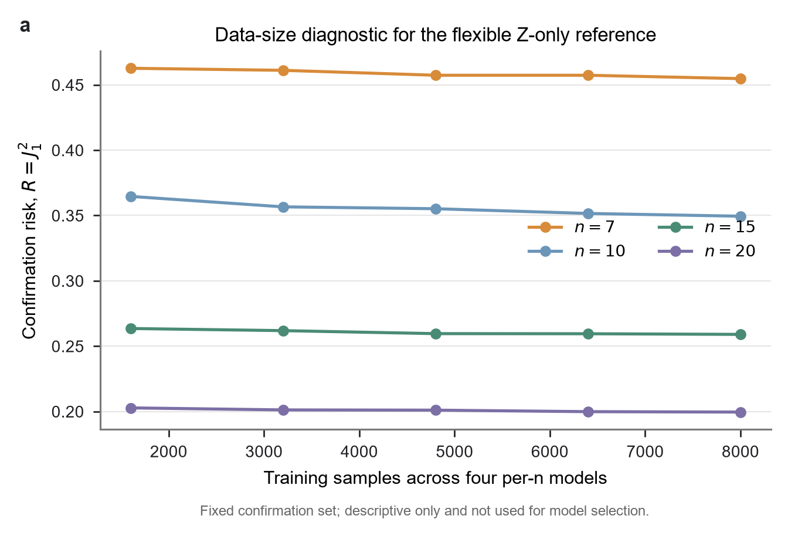

# 三参数 Weibull 分布最小差异法的样本自适应偏移量选择：附录

> 中文工作稿 v1.2，与《Study01论文初稿-v1.2.md》配套。由 v1.1 原样复制建立。正文固定随机种子 42 报告主结果，本附录补充初始化敏感性、实验设计、训练细节、完整分层结果、条件风险机制诊断和复现信息。投稿时应按目标期刊格式将“附录”改为“补充材料”或相应栏目。

## 附录 A  Monte Carlo 设计与评价细节

### A.1 参数空间与样本生成

完整参数设计已列于正文表 1。位置参数由 $\eta=1000$ 和五个 $\gamma/\eta$ 水平确定。

样本由三参数 Weibull 分布的逆累积分布变换生成。随机数种子由固定命名空间、参数组合和重复编号共同确定，使同一 `(参数组合, repeat_id)` 能够重建为同一个样本。各候选偏移量共享同一原始样本，方法之间也使用相同样本键，因而所有比较均为配对比较。

### A.2 损失、失败结果与汇总方式

联合损失 $\ell_i$ 和汇总指标 $J_1$ 沿用正文第 2.2 节的定义。汇总时每个样本权重相同；160 个参数组合的重复次数相同，因此也等价于组合等权。未收敛结果不作静默删除。训练标签中若某一候选偏移量估计失败，以训练折全部有效损失的第 99 百分位数填充，该惩罚值只由训练折计算。正式均值归一化 MLP、Default 和 L6 均无失败。WMLE 有 1 个样本未收敛，按预先规定的失败规则计入全部样本结果。

主结果的置信区间使用 300 个重复块进行配对 percentile bootstrap，共 20,000 次重采样。每个重复块在 160 个设计单元中各含一个样本，因此重采样不改变设计单元权重，并始终保留自适应方法与 Default 的同样本配对。另对 160 个设计单元的均值损失进行配对重采样，用于描述结果对当前参数网格构成的敏感性。

### A.3 两类交叉评价协议

两类交叉评价的实施差别列于表 A1。

**表 A1  信息层级与神经网络的评价划分。**

| 评价对象 | 划分单位 | 训练折用途 | 测试折用途 | 回答的问题 |
|---|---|---|---|---|
| L1 至 L5 | repeat_id 五折 | 确定规则或条件均值损失曲线 | 计算所选规则的损失 | 已知信息增加后有多少潜在收益 |
| 均值归一化 MLP | 每个 $n$ 的 $\gamma/\eta$ 水平五折留出 | 训练输入标准化、目标标准化和 MLP | 评价未见 $\gamma/\eta$ 水平；每折覆盖全部 8 个 $\beta$ | 样本自适应选择能否用于未参与训练的位置尺度比水平 |

神经网络评价共包含 $4\times5\times3=60$ 个折外模型。均值归一化 MLP、Default 和 L6 使用同一测试样本。两类协议不用于彼此之间的无条件排名。

### A.4 复现材料

当前工作稿对应的代码与数据均保存在 Study01 目录。下列路径用于写作阶段核对，投稿时应替换为匿名存档地址或公开仓库地址。

| 内容 | 当前相对路径 |
|---|---|
| 正式主结果清单 | `Study/01-study-MDM最小偏移量优化研究/artifacts/formal/E8_mean_normalized_selector/specialist/manifest.json` |
| 正式主结果派生程序 | `Study/01-study-MDM最小偏移量优化研究/code/prepare_mean_normalized_main_evidence.py` |
| 主结果不确定性 | `Study/01-study-MDM最小偏移量优化研究/artifacts/formal/E8_mean_normalized_selector/main_uncertainty/` |
| 不确定性派生程序 | `Study/01-study-MDM最小偏移量优化研究/code/analyze_e8_main_uncertainty.py` |
| 原始折外预测来源 | E5 均值归一化 60 折模型的封存结果，来源提交和文件哈希见 E8 `manifest.json` |
| 利用初估参数选择偏移量实验 | `Study/01-study-MDM最小偏移量优化研究/artifacts/formal/pg_selector/` |
| 未见 $\beta$ 验证 | `Study/01-study-MDM最小偏移量优化研究/artifacts/formal/E8_mean_normalized_selector/unseen_beta/` |
| 传统方法参照 | `Study/01-study-MDM最小偏移量优化研究/artifacts/formal/E6_dimensional_raw/traditional_ref/` |
| 可靠度寿命 | `Study/01-study-MDM最小偏移量优化研究/artifacts/formal/E8_mean_normalized_selector/quantiles/` |
| 尺度等变检查 | `Study/01-study-MDM最小偏移量优化研究/artifacts/formal/E8_mean_normalized_selector/scale_equivariance/` |
| 条件风险机制诊断 | `Study/01-study-MDM最小偏移量优化研究/artifacts/formal/E10_z_only_benchmark/` |
| 绘图代码与派生数据 | `figures/scripts/`、`figures/data/derived/` |

## 附录 B  网络训练、输入表示与稳定性

### B.1 训练设置

正文第 2.5 节已经定义网络的输入、输出和偏移量选择过程。表 B1 补充实现所需的训练参数。输入和 26 维目标均只用训练折拟合标准化参数，测试折只执行变换。

**表 B1  均值归一化 MLP 的训练设置。**

| 项目 | 设置 |
|---|---|
| 网络组织 | $n=7,10,15,20$ 分别训练 |
| 隐藏层 | 256、128、64 |
| 激活函数 | ReLU |
| 优化器 | Adam |
| 初始学习率 | $10^{-3}$ |
| $L_2$ 正则化系数 | $10^{-4}$ |
| 批量大小 | 256 |
| 最大迭代次数 | 300 |
| 提前停止 | 训练折中 15% 作验证；连续 20 次迭代无改善时停止 |
| 随机种子 | 42（正文主结果）；2026、3407（初始化敏感性） |
| 输入表示 | 排序样本除以该样本的算术平均值 |
| 输入标准化 | 归一化后在训练折内逐位置 StandardScaler |
| 目标标准化 | 训练折内 26 维 StandardScaler |
| 训练损失 | 标准化后 26 维预测曲线与实际曲线的平方误差 |

### B.2 随机初始化稳定性

正文固定 seed 42 报告单模型主结果。表 B2 另列两个预设随机种子，用于判断观察到的收益是否来自一次偶然初始化；三条预测曲线不作平均或集成。随机种子影响权重初值、训练数据内部验证划分和优化过程，三次训练均无估计失败。

**表 B2  三个随机种子的汇总与分样本量结果。**

| 随机种子 | 汇总 $J_1$ | $n=7$ | $n=10$ | $n=15$ | $n=20$ | 失败率 |
|---:|---:|---:|---:|---:|---:|---:|
| 42（主结果） | 0.5846 | 0.7013 | 0.6071 | 0.5294 | 0.4756 | 0% |
| 2026 | 0.5849 | 0.7046 | 0.6041 | 0.5285 | 0.4773 | 0% |
| 3407 | 0.5855 | 0.7000 | 0.6111 | 0.5274 | 0.4792 | 0% |

### B.3 输入表示的选择与尺度敏感性

在相同 160 组合设计、相同折外样本和相同网络合同下，额外比较了三种已有的正尺度不变表示：排序样本除以样本均值、样本均方根和样本标准差。三种表示在候选筛选中的汇总 $J_1$ 分别为 0.5850、0.5854 和 0.5894。均值与均方根归一化的结果接近；本文选用前者，是因为它在该次筛选中的 $J_1$ 略低、定义直接，并已有完整折外模型可供主结果和敏感性核查。这一选择不表明样本均值归一化在其他任务中普遍优于均方根归一化。

作为敏感性参照，保留绝对水平的 Dimensional-RAW-MLP 在同一固定 $\eta=1000$ 设计下的 $J_1$ 为 0.5543，低于归一化方法。这表明绝对水平在该固定尺度任务中具有预测信息，同时也显示出去除这一信息带来的精度代价。有量纲结果作为敏感性分析保留，不作为论文主方法。

均值归一化在数学上对 $X\mapsto cX$（$c>0$）不变。为检查它与后续 MDM 组合后的实际行为，选取覆盖 $n=7,10,15,20$ 和参数边界与中间水平的 4 个真实 Monte Carlo 样本，分别运行 $X\times10^{-3}$、$X$ 和 $X\times10^3$，共 12 次生产 MDM。所有尺度下的预测损失曲线和所选 $\delta$ 一致，$\hat\beta$ 不变，$\hat\eta$ 和 $\hat\gamma$ 按 $c$ 倍变化，$J_1$ 中的标准化损失保持一致。

### B.4 三参数联合损失的误差分解

正文使用的 $J_1$ 由 $\beta$、$\eta$ 和 $\gamma$ 三个标准化平方误差共同构成。为判断总体改善是否只来自某一个参数，表 B3 按正文主 seed 分别给出三个误差分量；Default 使用相同评价样本。该分解只解释联合指标的组成，不替代正文中的主评价。

**表 B3  联合损失的三参数误差分解。**

| 参数 | Default 标准化 RMSE | 自适应标准化 RMSE | 均方误差贡献降幅 | Default 绝对误差中位数 | 自适应绝对误差中位数 | Default P95 | 自适应 P95 |
|---|---:|---:|---:|---:|---:|---:|---:|
| $\beta$ | 0.4032 | 0.3749 | 13.6% | 0.3140 | 0.2825 | 0.6983 | 0.6825 |
| $\eta$ | 0.3614 | 0.3354 | 13.9% | 0.2659 | 0.2409 | 0.6739 | 0.6504 |
| $\gamma$ | 0.3228 | 0.2978 | 14.9% | 0.2225 | 0.2044 | 0.6255 | 0.5935 |

三个参数的标准化 RMSE、绝对误差中位数和第 95 百分位数均有所下降，说明联合 $J_1$ 的改善不是由单一参数独自形成。三个参数的均方误差贡献降幅为 13.6%—14.9%，但仍均保留非零的尾部误差，因此这一结果不能解释为所有样本上的参数估计都同步改善。

### B.5 主结果的不确定性与组合异质性

在固定当前 160 个设计单元及其等权方式下，配对重复块 bootstrap 给出的汇总改善为 7.27%，95% 置信区间为 6.94%—7.64%。按样本量分层后，四组点估计和区间如表 B4 所示。这些区间以已固定的 seed 42 选择器和当前设计为条件，反映有限 Monte Carlo 重复带来的不确定性。表示选择、模型筛选和训练初始化不在该区间中；未检验的连续参数值或真实数据集也不纳入推断范围。

**表 B4  样本自适应选择相对 Default 的 $J_1$ 降幅及配对重复块 bootstrap 95% 置信区间。**

| 范围 | $J_1$ 降幅 | 95% 置信区间 |
|---|---:|---:|
| 全部样本 | 7.27% | 6.94%—7.64% |
| $n=7$ | 8.12% | 7.33%—9.00% |
| $n=10$ | 7.62% | 7.24%—8.00% |
| $n=15$ | 6.32% | 5.95%—6.69% |
| $n=20$ | 5.98% | 5.52%—6.44% |

设计单元之间的改善幅度存在明显差异。160 个单元中，125 个的单元 $J_1$ 低于 Default，35 个更高；单元相对改善的中位数为 7.40%，四分位区间为 1.39%—12.65%，范围为 $-17.50\%$—19.98%。将 160 个单元均值配对重采样时，汇总降幅的 95% 设计构成敏感性范围为 6.04%—8.46%。该范围用来检查少数参数单元是否支配汇总结论，不是连续参数总体的置信区间。

## 附录 C  利用初估参数选择偏移量

### C.1 初估参数选择规则

正文第 2.4 节给出了利用初估参数选择偏移量的基本步骤。完整实验由两个初始估计量、三个选择族和两种查询方式组成：初始估计量为 MDM-0.1 和 WMLE；PG-beta、PG-beta-n、PG-full 分别使用 $\hat\beta$、$(\hat\beta,n)$ 和 $(\hat\beta,\hat\gamma/\hat\eta,n)$；查询采用最近网格点或连续插值。单步规则只更新一次，迭代规则在偏移量不再变化、出现循环或达到 10 次更新时终止。条件均值损失曲线只由训练折构造。

### C.2 单步与迭代结果

表 C1 列出 12 种单步规则及其迭代终止结果。$J_1$ 差按“初估参数选择规则减 Default”计算，正值表示初估参数选择规则误差更高；置信区间采用固定随机种子的配对 repeat-block bootstrap。

**表 C1  利用初估参数选择偏移量的完整变体结果。差值为正表示劣于 Default。**

| 初始估计 | 选择族 | 映射 | 单步 $J_1$ | 单步差值 | 单步 95% CI | 迭代终止 $J_1$ | 迭代差值 |
|---|---|---|---:|---:|---|---:|---:|
| MDM-0.1 | PG-beta | 插值 | 0.6707 | +0.0403 | [0.0372, 0.0429] | 0.6897 | +0.0593 |
| MDM-0.1 | PG-beta | 最近网格 | 0.6740 | +0.0435 | [0.0404, 0.0462] | 0.6866 | +0.0562 |
| MDM-0.1 | PG-beta-n | 插值 | 0.6722 | +0.0417 | [0.0390, 0.0441] | 0.7039 | +0.0735 |
| MDM-0.1 | PG-beta-n | 最近网格 | 0.6732 | +0.0428 | [0.0400, 0.0452] | 0.7011 | +0.0707 |
| MDM-0.1 | PG-full | 插值 | 0.6827 | +0.0523 | [0.0492, 0.0549] | 0.7415 | +0.1110 |
| MDM-0.1 | PG-full | 最近网格 | 0.6836 | +0.0531 | [0.0499, 0.0558] | 0.7320 | +0.1016 |
| WMLE | PG-beta | 插值 | 0.6507 | +0.0203 | [0.0186, 0.0219] | 0.6910 | +0.0606 |
| WMLE | PG-beta | 最近网格 | 0.6530 | +0.0226 | [0.0209, 0.0243] | 0.6898 | +0.0594 |
| WMLE | PG-beta-n | 插值 | 0.6557 | +0.0253 | [0.0233, 0.0271] | 0.7076 | +0.0772 |
| WMLE | PG-beta-n | 最近网格 | 0.6573 | +0.0269 | [0.0249, 0.0287] | 0.7068 | +0.0764 |
| WMLE | PG-full | 插值 | 0.6943 | +0.0639 | [0.0598, 0.0680] | 0.7669 | +0.1365 |
| WMLE | PG-full | 最近网格 | 0.6940 | +0.0636 | [0.0597, 0.0674] | 0.7606 | +0.1302 |

**图 C1  利用初估参数选择偏移量的评价。** a，12 种单步变体相对 Default 的 $J_1$ 差及配对 repeat-block bootstrap 95% 置信区间，正值表示初估参数选择规则误差更高；b，最佳单步规则按真 $\beta$ 的结果；c，MDM-0.1 与 WMLE 初步 $\hat\beta$ 落入最近正确 $\beta$ 网格单元的比例。面板 c 为诊断性结果，不作为单一因果解释。

### C.3 分形状参数结果与解释边界

表 C2 给出最佳单步规则按真 $\beta$ 的完整结果。初步 $\hat\beta$ 的网格单元正确率只作诊断，不能单独证明初估参数选择规则失败的原因；连续插值结果也应与该诊断一并考虑。

**表 C2  最佳单步初估参数选择规则按真 $\beta$ 的结果。**

| 真 $\beta$ | 样本数 | 初估参数选择 $J_1$ | Default $J_1$ | 差值 |
|---:|---:|---:|---:|---:|
| 1.5 | 6000 | 0.5373 | 0.5477 | -0.0104 |
| 2.0 | 6000 | 0.5310 | 0.5205 | +0.0105 |
| 2.5 | 6000 | 0.5698 | 0.5319 | +0.0380 |
| 3.0 | 6000 | 0.6107 | 0.5724 | +0.0384 |
| 3.5 | 6000 | 0.6511 | 0.6136 | +0.0374 |
| 4.0 | 6000 | 0.7088 | 0.6812 | +0.0276 |
| 4.5 | 6000 | 0.7466 | 0.7305 | +0.0161 |
| 5.0 | 6000 | 0.7970 | 0.7898 | +0.0072 |

## 附录 D  未见形状参数水平验证

补充实验逐一留出 8 个 $\beta$ 水平，并用其余 7 个水平训练各样本量网络。表 D1 给出正文主 seed 的各留出水平结果；图 D1 同时标出另外两个 seed 所形成的范围。

**表 D1  逐一留出 $\beta$ 水平时的汇总 $J_1$。**

| 留出 $\beta$ | 均值归一化 MLP | Default | L6 |
|---:|---:|---:|---:|
| 1.5 | 0.5541 | 0.5477 | 0.3975 |
| 2.0 | 0.4962 | 0.5205 | 0.4033 |
| 2.5 | 0.5076 | 0.5319 | 0.4366 |
| 3.0 | 0.5413 | 0.5724 | 0.4709 |
| 3.5 | 0.5626 | 0.6136 | 0.4963 |
| 4.0 | 0.6107 | 0.6812 | 0.5373 |
| 4.5 | 0.6557 | 0.7305 | 0.5595 |
| 5.0 | 0.7113 | 0.7898 | 0.5982 |

**图 D1  未见形状参数水平验证。** 逐一留出八个 $\beta$ 水平时，均值归一化 MLP、Default 和 L6 的 $J_1$。折线为主 seed 42，蓝色范围表示三个随机种子的取值范围。留出 $\beta=1.5$ 时自适应方法略差于 Default，其余七个水平保持改善。

该验证限定于当前八点离散 $\beta$ 网格，不涉及网格外连续外推。参数组合中的局部退化和已训练样本量边界已在正文第 3.4 节和第 4.4 节说明，不在附录重复。

## 附录 E  传统方法参照与可靠度寿命

### E.1 WMLE 与 LSE 的同条件参照

WMLE 和 LSE 使用与主方法相同的 48,000 个 Monte Carlo 样本。表 E1 补充正文未展开的三参数 Bias 和 RMSE。

**表 E1  WMLE 与 LSE 的参数误差。**

| 方法 | 汇总 $J_1$ | 失败率 | Bias $\beta$ | Bias $\eta$ | Bias $\gamma$ | RMSE $\beta$ | RMSE $\eta$ | RMSE $\gamma$ |
|---|---:|---:|---:|---:|---:|---:|---:|---:|
| WMLE | 0.7288 | 0.002% | -0.3505 | -47.6025 | 46.7441 | 1.4180 | 416.5679 | 374.1931 |
| LSE | 0.8725 | 0.000% | -0.0799 | -37.5334 | 32.6643 | 2.1619 | 460.5690 | 419.9131 |

**图 E1  传统方法的分样本量参照。** 均值归一化 MLP、Default、L6、WMLE 和 LSE 在 $n=7,10,15,20$ 下的 $J_1$。WMLE 的 1 次未收敛保留在全部样本结果中。

### E.2 可靠度寿命

可靠度寿命沿用正文第 2.7 节的定义，即 $x_R$ 满足 $P(T>x_R)=R$。表 E2 报告正文未逐项列出的相对偏差、相对 RMSE、相对 MAE 和绝对相对误差第 95 百分位数。

**表 E2  可靠度寿命的相对误差。**

| 方法 | 可靠度寿命 | 相对 Bias | 相对 RMSE | 相对 MAE | P95（绝对相对误差） | 失败率 |
|---|---|---:|---:|---:|---:|---:|
| 均值归一化 MLP | $x_{0.90}$ | 0.0223 | 0.1608 | 0.1090 | 0.3198 | 0.000% |
| 均值归一化 MLP | $x_{0.95}$ | 0.0527 | 0.2136 | 0.1401 | 0.4180 | 0.000% |
| 均值归一化 MLP | $x_{0.99}$ | 0.1405 | 0.3753 | 0.2369 | 0.7337 | 0.000% |
| Default | $x_{0.90}$ | 0.0212 | 0.1607 | 0.1094 | 0.3202 | 0.000% |
| Default | $x_{0.95}$ | 0.0504 | 0.2142 | 0.1424 | 0.4195 | 0.000% |
| Default | $x_{0.99}$ | 0.1320 | 0.3777 | 0.2454 | 0.7284 | 0.000% |
| L6 | $x_{0.90}$ | 0.0213 | 0.1613 | 0.1094 | 0.3210 | 0.000% |
| L6 | $x_{0.95}$ | 0.0464 | 0.2123 | 0.1395 | 0.4159 | 0.000% |
| L6 | $x_{0.99}$ | 0.1138 | 0.3576 | 0.2220 | 0.6924 | 0.000% |
| WMLE | $x_{0.90}$ | 0.0130 | 0.1547 | 0.1088 | 0.3052 | 0.002% |
| WMLE | $x_{0.95}$ | 0.0186 | 0.1986 | 0.1414 | 0.3879 | 0.002% |
| WMLE | $x_{0.99}$ | 0.0361 | 0.3296 | 0.2397 | 0.6347 | 0.002% |
| LSE | $x_{0.90}$ | 0.0300 | 0.1594 | 0.1083 | 0.3182 | 0.000% |
| LSE | $x_{0.95}$ | 0.0549 | 0.2133 | 0.1418 | 0.4158 | 0.000% |
| LSE | $x_{0.99}$ | 0.1144 | 0.3815 | 0.2506 | 0.7330 | 0.000% |

**图 E2  可靠度寿命误差。** 五种方法在 $x_{0.90}$、$x_{0.95}$ 和 $x_{0.99}$ 上的相对 RMSE。均值归一化 MLP 的点为主 seed 42，误差线表示三个随机种子的取值范围。

## 附录 F  条件风险与样本实现

### F.1 决策对象与数据分区

L5 在每个 $(\beta,\gamma/\eta,n)$ 条件下选择训练样本平均损失最低的偏移量。L6 还知道当前样本在 26 个候选偏移量上的已实现损失，因而是事后选择。只允许使用当前可观测输入 $Z=\operatorname{sort}(X)/\bar X$ 时，理想决策应最小化 $E\{\ell(\delta,X,\theta)\mid Z\}$，而不是直接最小化已经揭示的单样本损失。

本实验不估计精确 Bayes 风险。它使用当前 160 个设计单元，将 repeat 0–159 用于拟合，160–199 用于候选规则选择，200–299 作为未参与训练或选模的确认集。每个 $n$ 独立选择回归器，候选包括 Ridge、KNN、ExtraTrees、当前 MLP 结构和较宽 MLP。训练器只接收 $Z$ 和 26 维 Monte Carlo 损失标签；真参数只用于构造标签、L5/L6 参照和事后评分。确认集共含 16,000 个唯一样本。

### F.2 确认集风险

**表 F1  不同决策条件下的确认集风险。**

| 决策条件 | $R=E(\ell)$ | $J_1=\sqrt R$ | 信息口径 |
|---|---:|---:|---|
| Default | 0.392691 | 0.626651 | 固定 $\delta=0.1$ |
| L5 | 0.333483 | 0.577480 | 真参数条件下的平均选择 |
| 论文 MLP | 0.339531 | 0.582693 | 按 $\gamma/\eta$ 水平留出的已实现规则 |
| 同域当前 MLP 结构 | 0.322668 | 0.568039 | 所有当前设计单元参与拟合，确认集独立 |
| 灵活 $Z$-only 经验参照 | 0.315658 | 0.561835 | 验证集选择的已实现候选规则 |
| L6 | 0.240646 | 0.490557 | 逐样本已实现 26 点损失全部已知 |

灵活 $Z$-only 参照相对论文 MLP 的配对风险差为 $-0.023873$，repeat-block bootstrap 95% 置信区间为 $[-0.025405,-0.022366]$。相对同域当前 MLP 结构的差为 $-0.007010$，95% 置信区间为 $[-0.008727,-0.005408]$。这说明当前 MLP 尚未充分利用当前可观测输入中的信息。论文 MLP 与同域重训结构的差异还同时改变参数覆盖、评价协议和重新拟合，不解释为纯留出效应。

以 Default 到 L6 的 $R$ 差距为分母，论文 MLP 已降低 34.96%；论文 MLP 到同域当前 MLP 结构为 11.09%；灵活规则再降低 4.61%；其到 L6 的剩余为 49.34%。最后一段同时包含进一步的模型/数据改进空间和事后完全信息差，现有实验无法将两者分开。

**图 F1  不同决策条件下的确认风险。** a，同一参数单元内 L6 事后偏移量的多样性及三种规则与 L6 的完全一致率；b，五种决策条件在确认集上的 $R=J_1^2$。经验参照是已实现规则，不是精确 Bayes 风险。

### F.3 同一参数条件内的偏移量变化

在 160 个参数条件中，L5 与 L6 的偏移量完全一致率为 12.56%；论文 MLP 与 L6 为 23.01%；灵活 $Z$-only 参照与 L6 为 21.78%。后者的实际风险更低，但与 L6 格点完全一致率略低，说明最佳格点命中率不适合作为损失曲线预测的唯一评价。各参数条件内 L6 有效偏移量候选数的中位数为 6.09，说明同一参数条件内的样本实现会改变事后低风险选择。

为进一步检查 MDM 内部的数值过程，从参数域的四个角点与中心点中预先选取 5 个 $(\beta,\gamma/\eta)$ 位置，并与四个样本量交叉，形成 20 个诊断单元。每个单元使用 repeats 200—299，共 2,000 个确认样本。该分析复用 26 点损失扫描，只为每个样本重建一条

$$
g_X(\gamma)=\frac{\partial}{\partial\gamma}
\min_\beta\operatorname{sd}\{\eta_i(\beta,\gamma)\}
$$

曲线，不训练新模型。单元内 $g_X(0)$ 与 L6 偏移量的 Spearman 相关中位数为 0.652（四分位区间 0.549—0.779），19/20 个单元为正。固定 $\delta=0.1$ 时的 $\hat\gamma_{0.1}/\eta$ 与 L6 偏移量的相关中位数为 $-0.765$（四分位区间 $-0.803$—$-0.609$），20/20 个单元为负。按 $\hat\gamma_{0.1}/\eta$ 的单元内三分位分组后，平均超额损失曲线的最低点依次为 0.10、0.04 和 0.02。L6 的 $\hat\gamma=0$ 边界解占 7.1%，固定偏移量下的边界解占 5.75%。因此，样本实现的作用主要表现为经验梯度曲线及其交点移动，边界切换只解释少数样本。逐样本指标、单元内相关和条件曲线见 `artifacts/formal/E11_profile_mechanism/`。

**图 F2  参数条件下的效果分布。** 各 $n$ 下 $\beta\times\gamma/\eta$ 单元相对 Default 的 $J_1$ 变化。160 个单元中 125 个改善，35 个退化；勾边单元表示退化。该图说明总体改善并不保证每个参数条件都有利。

### F.4 数据量诊断

**图 F3  $Z$-only 经验参照的数据量诊断。** 每个参数条件使用 40、80、120、160 和 200 个拟合 repeat 时，固定确认集上的风险随数据量增加缓慢下降。每条曲线的候选规则已固定，确认集不参与选模。160 到 200 repeats 的 pooled $R$ 再降低 0.43%，这只是数据敏感性诊断，不证明已逼近 Bayes 风险。
