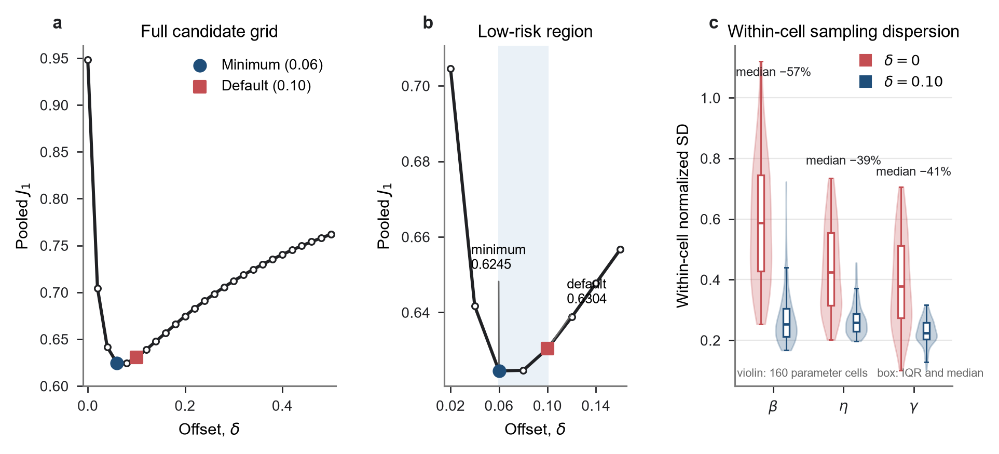
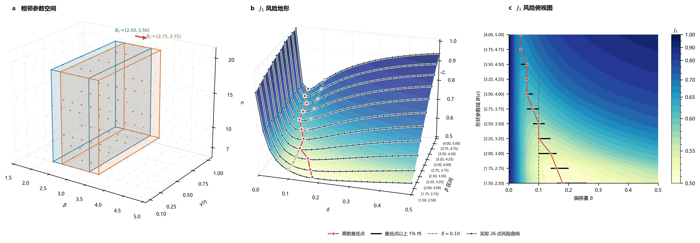
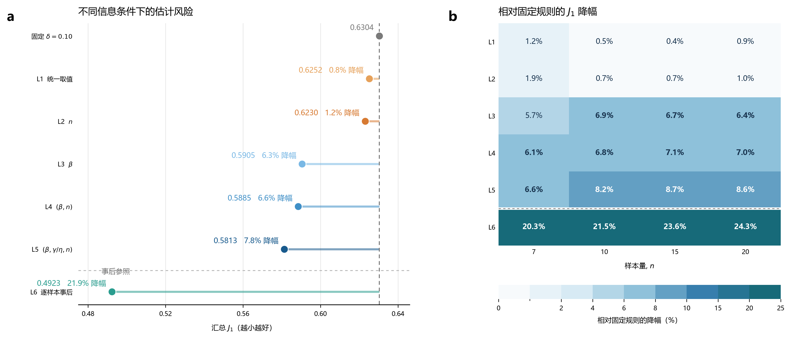
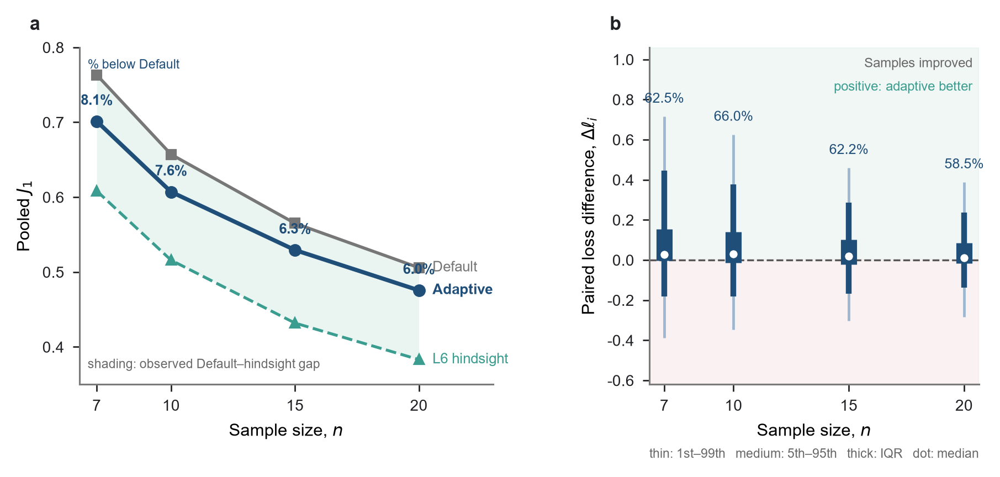

# 三参数 Weibull 分布最小差异法的样本自适应偏移量选择

> 中文修订稿 v1.9，配套附录 v1.8。作者、单位和基金待补；目标期刊暂缓确定，英文转换在中文定稿后进行。

## 摘要

三参数 Weibull 分布的最小差异法（MDM）采用正偏移量改善小样本估计，但经验常数难以适应不同参数条件及样本波动。本文研究偏移量的有限样本风险，并提出基于归一化排序样本的自适应选择方法：预测 26 个候选偏移量的损失，再由 MDM 在所选偏移量下估计参数。在 $1.5\leq\beta\leq5.0$、$0.10\leq\gamma/\eta\leq1.00$、$n\in\{7,10,15,20\}$ 的 160 个离散组合中，经验值 0.1 接近完整设计的最佳统一取值，而固定宽度形状参数域由低值向高值平移时，最佳统一偏移量由 0.18 移至 0.04。按位置尺度比水平留出评价，自适应选择将联合误差 $J_1$ 从 0.6304 降至 0.5846，降低 7.27%（已训练选择器和当前设计条件下的 95% 配对重采样区间：6.94%—7.64%）；改善覆盖四个样本量，三个参数的汇总标准化 RMSE 均下降。梯度轨迹与分组损失曲线显示，同一参数条件下的样本波动伴随低风险偏移量的移动。上述结果支持在所评价设计内利用样本信息改进 MDM 偏移量选择；现有折外数据参与过输入表示筛选，仍需独立确认。

**关键词：** 三参数 Weibull 分布；最小差异法；偏移量选择；小样本参数估计；多层感知机；风险曲线预测

## 1 引言

三参数 Weibull 分布能够描述具有非零寿命起点的数据，广泛用于寿命与可靠性分析。其位置参数既确定分布的寿命起点，也使样本支持域随待估参数变化，因而增加了参数估计的难度。已有研究提出了极大似然法、矩估计法、最小二乘法及其修正方法。在小样本条件下，极大似然估计可能出现较大偏差或无有限解，其他方法的表现也会随参数条件、样本量和评价标准改变，尚无一种方法在所有条件下始终最优[1,4–7]。

针对三参数 Weibull 的小样本估计，谢里阳等[2]提出了最小差异法。该方法根据各样本点构造尺度参数的伪估计量，通过减小伪估计量之间的差异确定形状参数和位置参数，并在原研究中较极大似然法和最小二乘法表现出更好的准确性和稳健性[2]。后续研究又在位置参数搜索判据中引入正偏移量 $\delta=0.1$，进一步改善了小样本估计的精度和稳定性[3]。但 $0.1$ 是根据算例确定的经验取值，是否存在更合适的偏移量以及如何选择，仍值得研究。

统计估计中的调节量常凭经验设定，但更合适的取值往往与当前数据有关。围绕这一问题，早期研究根据当前数据估计均方误差，为稳健回归和最小距离估计选择调节参数[9–11]；后续工作又将训练和验证风险用于调参，或利用神经网络学习非参数回归的带宽[12,13]。近年来，模拟决策方法进一步直接学习给定观测下不同候选决策的条件损失[14]。这些方法都是根据当前数据下不同候选取值的风险，代替完全固定的经验常数。

本文围绕两个问题展开：偏移量的适宜取值由哪些条件决定，以及总体参数未知时能否仅依据观测样本作出有效选择。首先用重复抽样风险区分统一取值、参数条件规则和逐样本事后参照，识别偏移量随参数域及样本变化的规律；随后以归一化排序样本预测候选损失曲线，检验这种差异能否转化为参数估计收益；最后通过 MDM 梯度轨迹解释样本波动与低风险偏移量之间的联系。本文的贡献在于偏移量的有限样本风险规律及其样本自适应实现，网络承担候选损失预测任务。

## 2 问题定义与方法

### 2.1 三参数 Weibull 分布与 MDM 偏移量

三参数 Weibull 分布的累积分布函数为

$$
F(t)=
\begin{cases}
0, & t\leq\gamma,\\
1-\exp\left[-\left(\dfrac{t-\gamma}{\eta}\right)^\beta\right], & t>\gamma.
\end{cases}
$$

其中 $\beta>0$、$\eta>0$，$\gamma$ 为位置参数。给定升序样本 $t_{(1)}\leq\cdots\leq t_{(n)}$，采用中位秩估计[8]

$$
F_i=\frac{i-0.3}{n+0.4},\qquad q_i=-\ln(1-F_i).
$$

当候选形状参数和位置参数分别为 $\beta$ 和 $\gamma$ 时，第 $i$ 个样本点给出的伪尺度参数为[2]

$$
\eta_i(\beta,\gamma)=\frac{t_{(i)}-\gamma}{q_i^{1/\beta}}.
$$

若候选 $\beta$ 和 $\gamma$ 与样本所来自的分布相符，$\eta_i$ 之间的差异应较小。本文以样本标准差 $s_\eta(\beta,\gamma)$ 表示这种差异。对每个候选 $\gamma$，先求

$$
\beta^*(\gamma)=\arg\min_{0.1\leq\beta\leq15}s_\eta(\beta,\gamma),
\qquad
S(\gamma)=s_\eta\bigl(\beta^*(\gamma),\gamma\bigr),
$$

再根据廓线 $S(\gamma)$ 的梯度确定位置参数。沿用前期文献的记号[3]，定义 $\nabla(\gamma)\equiv\mathrm dS(\gamma)/\mathrm d\gamma$。无偏移判据对应 $\nabla(\hat\gamma)=0$；引入正偏移量后，判据写为

$$
\nabla(\hat\gamma)=\delta.
$$

在非负位置参数约束下，若 $\nabla(0)\geq\delta$，取 $\hat\gamma=0$；否则在 $0<\gamma<t_{(1)}$ 内求交点。得到 $\hat\gamma$ 后，取 $\hat\beta=\beta^*(\hat\gamma)$，并以伪尺度参数的平均值估计尺度参数：

$$
\hat\eta=\frac{1}{n}\sum_{i=1}^{n}
\frac{t_{(i)}-\hat\gamma}{q_i^{1/\hat\beta}}.
$$

因此，本文围绕位置参数搜索判据中的 $\delta$ 展开研究，三参数 Weibull 模型及 MDM 的其余估计步骤保持不变。

偏移量对交点的影响可在共同搜索区间内作局部解释。固定样本量 $n$，以一个固定参考样本 $X^{\mathrm{ref}}$ 的梯度曲线为 $g_{\mathrm{ref}}(\gamma)$，并记另一同样本量样本的曲线差为 $e_X(\gamma)=\nabla_X(\gamma)-g_{\mathrm{ref}}(\gamma)$。若两条曲线与水平线 $\delta$ 的交点均位于共同可行区间 $0<\gamma<\min(X_{(1)},X^{\mathrm{ref}}_{(1)})$ 内，且邻域内可微、参考斜率非零、扰动及其局部斜率足够小，则

$$
\hat\gamma_{\delta,X}-\hat\gamma_{\delta,\mathrm{ref}}
\approx-\frac{e_X(\hat\gamma_{\delta,\mathrm{ref}})}
{g'_{\mathrm{ref}}(\hat\gamma_{\delta,\mathrm{ref}})}.
$$

该局部关系说明，改变 $\delta$ 会改变交点所处的曲线位置，并通过 MDM 联合求解影响三个参数的误差。它描述两条给定样本曲线的交点差；估计稳定性与风险变化由重复抽样评价。展开条件及边界见附录 B.7。

### 2.2 偏移量的评价准则与选择参照

对第 $i$ 个 Monte Carlo 样本，定义三参数联合损失

$$
\ell_i(\delta)=
\left(\frac{\hat\beta_i(\delta)-\beta_i}{\beta_i}\right)^2+
\left(\frac{\hat\eta_i(\delta)-\eta_i}{\eta_i}\right)^2+
\left(\frac{\hat\gamma_i(\delta)-\gamma_i}{\eta_i}\right)^2.
$$

形状参数和尺度参数误差分别以各自真值标准化；位置参数误差以 $\eta_i$ 标准化，从而避免 $\gamma_i$ 接近零时产生不稳定比值。对 $N$ 个评价样本，汇总指标为

$$
J_1=\sqrt{\frac{1}{N}\sum_{i=1}^{N}\ell_i}.
$$

以固定偏移量 $\delta=0.1$ 的方法（Default）为基准，方法 $m$ 的 $J_1$ 相对降幅定义为

$$
r_{J_1}(m)=\frac{J_{1,\mathrm{Default}}-J_{1,m}}
{J_{1,\mathrm{Default}}}\times100\%.
$$

其中，$J_{1,m}$ 为方法 $m$ 在相同评价样本上的汇总指标。正值表示误差降低，负值表示误差增加。下文的“$J_1$ 降幅”均按此定义计算。附录 F 的条件风险诊断另以均方损失 $\mathcal R=J_1^2$ 定义可加的风险差。

$J_1$ 越小，表示三个标准化参数误差等权汇总后的联合误差越小。该权重定义本文的参数估计目标。训练时使用单样本损失 $\ell_i(\delta)$ 构造 26 点曲线，评价时使用 $J_1$ 汇总，并分别报告三个参数的标准化 Bias、SD 和 RMSE。稳定性比较则先在每个参数组合内根据 300 次重复抽样计算标准化误差 SD，再汇总 160 个组合的分布。

候选偏移量为 $\mathcal D=\{0,0.02,\ldots,0.50\}$。为了考察低风险偏移量与哪些条件有关，设置 Default 和 L1—L6 七种规则。Default 固定取 $\delta=0.1$；L1 在当前设计的全部训练样本上选择一个统一常数；L2 按样本量 $n$ 选择；L3 按真值 $\beta$ 选择；L4 按 $(\beta,n)$ 选择；L5 按 $(\beta,\gamma/\eta,n)$ 选择；L6 对每个样本直接取 26 个实际损失中的最小值。L1 和 L2 表示简单选择规则；L3—L5 依次量化增加参数信息后的条件平均风险；L6 量化获得当前样本全部候选损失后的逐样本事后水平。

L1—L5 均采用五折交叉评价：在训练折选择偏移量，再在对应测试折计算损失。五个测试折合并后得到各信息层级的汇总结果。L6 则直接汇总每个样本在 26 个候选点上的最低实际损失。

### 2.3 Monte Carlo 设计与评价协议

Monte Carlo 参数设计见表 1。尺度参数固定为 $\eta=1000$，位置参数由 $\eta$ 与 $\gamma/\eta$ 的取值共同确定。

**表 1  Monte Carlo 参数设计。**

| 设计因素 | 取值 | 水平数 |
|---|---|---:|
| 形状参数 $\beta$ | 1.5、2.0、2.5、3.0、3.5、4.0、4.5、5.0 | 8 |
| 尺度参数 $\eta$ | 1000 | 1 |
| 位置—尺度比 $\gamma/\eta$ | 0.10、0.25、0.50、0.75、1.00 | 5 |
| 样本量 $n$ | 7、10、15、20 | 4 |
| 候选偏移量 $\delta$ | 0.00、0.02、……、0.50 | 26 |
| 每组合重复数 | 300 | 1 |

上述设计共形成 160 个参数组合和 48,000 个样本；每个样本在 26 个候选偏移量下运行 MDM，共得到 1,248,000 次估计结果。随机样本由三参数 Weibull 分布的逆累积分布变换生成，抽样种子按参数组合和重复编号确定并随代码归档。

为检验统一偏移量对参数域的敏感性，将 $\beta$ 水平加密至步长 0.25，构造宽度为 1.00、包含 5 个连续水平的 11 个滑动区间，区间中心由 2.00 移至 4.50。其余参数、样本量和权重保持不变，每个参数组合使用 100 次重复。各域分别计算 26 点汇总风险曲线、离散最低点及最低 $J_1$ 以上 1% 内的候选范围，并以 5,000 次重复块 bootstrap 描述最低点稳定性；样本构造见附录 A.1。

信息层级与 MLP 采用两种不同的评价划分。L1—L5 按重复编号进行五折交叉评价，使每个参数组合在训练折和测试折中都有独立重复样本。MLP 检验未见 $\gamma/\eta$ 水平：对每个 $n$，五折依次留出一个完整的 $\gamma/\eta$ 水平，测试折包含该水平下全部 8 个 $\beta$，训练折使用其余四个水平。每个 $n$ 和每个留出折分别训练模型。均值归一化 MLP、固定 $\delta=0.1$ 和 L6 的主比较使用完全相同的折外评价样本。输入表示也在这批折外样本上进行过筛选，因此该结果是选定方法的折外评价，尚不是独立于方法筛选的最终确认；筛选过程见附录 B.3。信息层级结果与样本自适应结果分别报告，参数设计、失败处理、重复训练设置和两类划分的完整说明见附录 A、B。

### 2.4 基于归一化排序样本的自适应选择

实际估计时可用的信息来自当前观测样本。本文据此把偏移量选择转化为一个多输出回归任务：用当前样本预测 26 个候选偏移量对应的损失，再取预测损失最小的候选值。

对每个样本量 $n$ 单独训练一个 MLP。先将样本升序排列，再除以该样本的算术平均值：

$$
X_n=\operatorname{sort}(x_1,\ldots,x_n),\qquad
Z_n=\frac{X_n}{\bar x},
$$

输出为预测损失向量

$$
\widehat{\boldsymbol\ell}(Z_n)=
\left(\widehat\ell_{\delta_1},\ldots,
\widehat\ell_{\delta_{26}}\right).
$$

将网络输出逆标准化到原损失尺度，并将负预测值截为零后，选择规则及最终估计为

$$
\hat\delta(Z_n)=\arg\min_{\delta_j\in\mathcal D}
\widehat\ell_{\delta_j}(Z_n),
$$

$$
(\hat\beta,\hat\eta,\hat\gamma)
=\operatorname{MDM}\bigl(X_n;\hat\delta(Z_n)\bigr).
$$

若多个候选预测损失相同，则取候选网格中较小的偏移量。输入为均值归一化后的排序样本。各排序位置的 StandardScaler 和 26 维目标的标准化参数均由相应训练折拟合。若某个候选偏移量的 MDM 估计失败，则以训练折有效损失的第 99 百分位数填充该候选的训练目标。网络包含 3 个隐藏层，采用 ReLU 激活函数和 Adam 优化器，以标准化后的预测损失曲线与实际损失曲线之间的平方误差训练。监督信号是每个样本在 26 个候选偏移量下的联合损失曲线 $\ell_i(\delta)$，$J_1$ 用于评价阶段的样本汇总。正文以固定随机种子 42 的折外模型报告主结果，另外两个预设种子用于检验初始化敏感性。下文将这一选择器称为均值归一化 MLP（Mean-normalized MLP）。网络配置和初始化敏感性结果见附录 B。

整条曲线标签同时给出候选值及其损失大小：即使两个候选值的实际损失很接近，它们之间的差异也会保留在训练目标中。网络确定 $\delta$ 后，仍由 MDM 完成 Weibull 参数估计。训练标签来自有真值的 Monte Carlo 样本，应用阶段的输入为当前观测样本。完整流程见图 1。

对正尺度变换 $X\mapsto cX$，归一化输入满足 $Z(cX)=Z(X)$，因而同一网络选择的偏移量不变。MDM 的廓线满足 $S_{cX}(c\gamma)=cS_X(\gamma)$，其梯度及偏移量均为无量纲量；在相同求解和选解规则下，$\hat\beta$ 不变，$\hat\eta$ 与 $\hat\gamma$ 按 $c$ 倍变化。推导及数值检查见附录 B.3。

**图 1  样本自适应偏移量选择方法。** **a，** 离线训练时，同一个 Monte Carlo 样本经 26 个候选偏移量下的 MDM 估计形成实际损失曲线，同时由对应样本量的 MLP 预测损失曲线；两条曲线之间的误差用于训练网络。**b，** 应用时仅输入当前样本，网络预测 26 点损失曲线并以最低点确定 $\widehat{\delta}$，原始样本与所选偏移量共同进入 MDM，给出 $\widehat{\beta}$、$\widehat{\eta}$ 和 $\widehat{\gamma}$。圆点对应 26 个候选偏移量，连线用于连接离散节点；图中数值为流程示意。

### 2.5 样本实现的机制诊断

为考察同一参数条件下低风险偏移量为何随样本改变，进一步分析第 2.1 节定义的 MDM 位置参数搜索曲线。以 $S_X(\gamma)$ 和 $\nabla_X(\gamma)$ 标明廓线及梯度对当前样本 $X$ 的依赖；即使真参数相同，不同抽样结果仍可能产生不同的梯度轨迹、内部交点或边界解。

机制诊断从参数域中预先选取 20 个参数—样本量单元，并使用未参与模型训练的 2,000 个确认样本。每个样本复用已有的 26 点损失扫描，只重新生成 MDM 梯度轨迹；随后考察 $\nabla_X(0)$、固定 $\delta=0.1$ 时的 $\hat\gamma_{0.1}/\eta$ 与事后低风险偏移量之间的关系。参数单元、确认样本和分组方式见附录 F。

### 2.6 支撑验证

除主比较外，本文还检验未参与训练的 $\beta$ 水平、网络初始化、整体尺度变换和不同参数条件下的效果差异。在相同的 48,000 个样本上，另以加权极大似然法（weighted maximum likelihood estimation，WMLE）和最小二乘法（least-squares estimation，LSE）作为 MDM 之外的误差参照，并将参数估计传递到可靠度寿命 $x_R$。其中 $x_R$ 满足 $P(T>x_R)=R$：

$$
x_R=\gamma+\eta[-\ln(R)]^{1/\beta},
$$

本文评价 $R=0.90,0.95,0.99$ 三个寿命点。所有方法报告汇总及分样本量的 $J_1$ 和失败率，主方法另报告逐参数误差；主结果的不确定性采用保持方法间配对关系的重复块 bootstrap。各项验证的完整指标、失败处理和重采样设置见附录 A、B、D 和 E。

## 3 结果

### 3.1 固定偏移量与参数域

正偏移量首先收窄了重复抽样下的估计波动。对 160 个参数组合分别计算 300 次重复抽样的标准化估计标准差后，$\delta=0$ 时 $\beta$、$\eta$ 和 $\gamma$ 的组合间中位数分别为 0.5870、0.4241 和 0.3782；采用 $\delta=0.10$ 后降至 0.2526、0.2589 和 0.2236，中位降幅分别为 57.0%、39.0% 和 40.9%（图 2c）。$\beta$ 和 $\eta$ 的 160 个组合均表现为波动减小，$\gamma$ 为 154 个组合。这一比较验证了经验正偏移量在有限样本下改善估计稳定性的原始作用。

固定偏移量的整体误差曲线在较小正偏移量附近达到低值（图 2a、b）。26 点网格中的最低值位于 $\delta=0.06$，$J_1=0.624518$；$\delta=0.08$ 时为 0.624666，$\delta=0.10$ 时为 0.630409，$\delta=0.12$ 时升至 0.638755。经验值 $\delta=0.10$ 比网格最低值高 0.93%，处于当前完整设计的低风险区域。该曲线汇总了当前参数范围、样本量构成和各参数条件的权重；下文进一步考察参数域改变时统一取值的移动。
![[Study/01-study-MDM最小偏移量优化研究/manuscript/figures/main/fig1_offset_baseline.png]]

**图 2  正偏移量对估计稳定性和联合误差的影响。** **a，**26 个候选偏移量在整个设计域上的汇总 $J_1$；**b，**低误差区域的局部放大；**c，**在每个参数组合内分别计算 300 次重复抽样的标准化估计标准差，并比较 $\delta=0$ 与 $\delta=0.10$ 在 160 个参数组合上的分布。小提琴图表示完整分布，箱体表示四分位距和中位数；百分数表示组合间中位标准差的降幅。不同真参数组合的估计值未直接混合计算标准差。

固定经验值因此提供了低风险基准；进一步选择的依据在于参数域和样本之间的风险差异。

固定宽度形状参数域的比较显示，统一偏移量随参数域有序移动（图 3）。区间由 $[1.50,2.50]$ 移至 $[4.00,5.00]$ 时，离散最低点由 $\delta=0.18$ 降至 0.04，1% 近优范围由 0.16—0.26 移至 0.04。$\delta=0.10$ 在 $[2.25,3.25]$ 和 $[2.50,3.50]$ 内达到最低风险，在最低与最高两个区间则分别比最低 $J_1$ 高 5.06% 和 9.16%。重复块 bootstrap 的最低点区间支持这一移动方向。统一偏移量因而是针对给定参数域的风险折中。

**图 3  固定宽度参数域对统一偏移量的影响。** **a，**11 个参数域在 26 个候选偏移量上的汇总 $J_1$；每格对应一个实际评价值。**b，**各域的离散最低点和最低 $J_1$ 以上 1% 内的候选范围，竖虚线为固定偏移量 0.10。两个面板的参数域顺序相同；连线仅辅助观察离散最低点的移动。

### 3.2 参数条件与逐样本选择空间

L1—L5 在同一设计上按不同信息分组，并在训练折内为每组选择平均损失最低的偏移量。各规则的定义见表 2，分组定义见附录表 A2。

重新选择统一偏移量或仅按样本量查表的收益较小：L1 和 L2 的 $J_1$ 分别为 0.6252 和 0.6230，相对 Default 降低 0.83% 和 1.17%（表 2）。

当规则可以使用真值 $\beta$ 时，L3 降至 0.5905；继续加入 $n$ 和 $\gamma/\eta$ 后，L4 和 L5 分别为 0.5885 和 0.5813。L3—L5 表明，不同参数条件下的平均损失曲线存在差异，因而按条件选择偏移量可以进一步降低风险。其中，仅区分样本量的改善很小，使用形状参数信息时改善明显增大。L2 与 L3 的信息集合并非包含关系，不将两者差值解释为逐级增加单一信息的净效应。

L6 在 26 点网格内查看当前样本的全部已实现损失，再事后选取最小值，得到 $J_1=0.4923$，相对 Default 降低 21.91%。在独立确认样本中，L5 的参数条件平均选点与 L6 选点有 12.6% 完全一致；同一参数条件内，L6 偏移量的中位有效候选数为 6.09。这说明低风险偏移量既随参数条件改变，也会在同一条件内随抽样结果变化。第 3.4 节进一步检验这种样本间变化的原因。

**表 2  不同信息条件下的偏移量选择。L1—L5 采用重复编号五折交叉评价；L6 为固定候选网格内的逐样本事后参照。**

| 规则 | 选择信息 | 汇总 $J_1$ | 相对 Default 的 $J_1$ 降幅 |
|---|---|---:|---:|
| Default | 固定 $\delta=0.1$ | 0.6304 | — |
| L1 | 全局统一 | 0.6252 | 0.83% |
| L2 | 按 $n$ | 0.6230 | 1.17% |
| L3 | 按 $\beta$（真参数参照） | 0.5905 | 6.33% |
| L4 | 按 $(\beta,n)$（真参数参照） | 0.5885 | 6.65% |
| L5 | 按 $(\beta,\gamma/\eta,n)$（真参数参照） | 0.5813 | 7.79% |
| L6 | 逐样本事后参照 | 0.4923 | 21.91% |

分样本量结果呈现相同趋势：L1/L2 的降幅均不足 2%，L3—L5 在四个样本量下均有更大改善（图 4）。因此，参数条件比单独的样本量分类提供了更充分的选择依据。

**图 4  不同信息条件下的估计风险。** **a，** 固定经验偏移量与 L1–L6 的汇总 $J_1$；水平线段表示相对 Default 的降低幅度。L1–L5 为重复编号五折交叉评价所得的条件平均规则；L6 为候选网格内的逐样本事后参照，以虚线与前五层分隔。**b，** L1–L6 在四个样本量下相对 Default 的 $J_1$ 降幅；颜色和单元格数字均表示百分比。面板 a 对应表 2 的汇总结果，面板 b 提供表中未重复列出的分样本量信息。

参数条件和样本实现中的风险差异为自适应选择提供了依据。下一节检验归一化排序样本能否在无需真参数输入的情况下，将这种差异转化为估计收益。

### 3.3 样本自适应选择的参数估计收益

在位置尺度比水平留出评价的同一 48,000 个样本上，样本自适应选择将汇总 $J_1$ 从固定偏移量的 0.630409 降至 0.584553，相对降低 7.27%；配对重复块 bootstrap 95% 区间为 6.94%—7.64%（表 3）。该区间条件于已训练选择器和当前设计，不包含表示筛选与重新训练的不确定性。L6 的 $J_1$ 为 0.492297，三种规则均无估计失败。

**表 3  样本自适应方法的主比较。MLP 按位置尺度比水平留出；固定规则和事后参照在相同折外样本上评分。**

| 方法 | 汇总 $J_1$ | $n=7$ | $n=10$ | $n=15$ | $n=20$ | 失败率 |
|---|---:|---:|---:|---:|---:|---:|
| Mean-normalized MLP | 0.5846 | 0.7013 | 0.6071 | 0.5294 | 0.4756 | 0.00% |
| Default（$\delta=0.1$） | 0.6304 | 0.7633 | 0.6571 | 0.5651 | 0.5058 | 0.00% |
| L6（逐样本事后参照） | 0.4923 | 0.6083 | 0.5159 | 0.4319 | 0.3831 | 0.00% |

$J_1$ 给出偏移量选择和规则比较所需的统一目标，逐参数指标用于检查这一改善如何落实到参数估计。与固定 $\delta=0.1$ 相比，样本自适应选择下 $\beta$、$\eta$ 和 $\gamma$ 的汇总标准化偏差绝对值、混合设计误差标准差和均方根误差均有所下降（表 4），联合指标的改善同时覆盖三个参数。

**表 4  固定偏移量与样本自适应选择的逐参数误差。结果基于同一 48,000 个折外测试样本（160 个参数组合，每组合 300 次重复），样本自适应选择采用预先固定的 seed 42 折外模型；每个样本在两种规则下均有估计结果，且均无估计失败。**

| 参数 | 方法 | 汇总标准化 Bias | 混合设计误差 SD | 汇总标准化 RMSE | 标准化误差 P5–P95 |
|---|---|---:|---:|---:|---:|
| $\beta$ | 固定 $\delta=0.1$ | -0.2327 | 0.3293 | 0.4032 | [-0.6761, 0.3433] |
| $\beta$ | 样本自适应选择 | -0.2008 | 0.3165 | 0.3749 | [-0.6533, 0.3563] |
| $\eta$ | 固定 $\delta=0.1$ | -0.1998 | 0.3011 | 0.3614 | [-0.6624, 0.3107] |
| $\eta$ | 样本自适应选择 | -0.1827 | 0.2813 | 0.3354 | [-0.6395, 0.2934] |
| $\gamma$ | 固定 $\delta=0.1$ | 0.1868 | 0.2633 | 0.3228 | [-0.2406, 0.6236] |
| $\gamma$ | 样本自适应选择 | 0.1700 | 0.2445 | 0.2978 | [-0.2297, 0.5914] |

注：各样本等权。$\beta$、$\eta$ 误差分别除以各自真值，$\gamma$ 误差除以真尺度参数 $\eta$。Bias 和 SD 为混合设计下标准化误差的均值和标准差；SD 同时包含组合内抽样波动与组合间平均误差差异，口径不同于图 2 的组合内 SD。P5–P95 为标准化带符号误差的第 5—95 百分位区间。

改善覆盖四个已训练样本量。$n=7,10,15,20$ 时，$J_1$ 相对固定偏移量分别降低 8.12%、7.62%、6.32% 和 5.98%（图 5a）；各方法的误差均随样本量增大而下降。

逐样本配对结果也呈现整体改善。令 $\Delta\ell_i=\ell_{i,\mathrm{Default}}-\ell_{i,\mathrm{Adaptive}}$，正值表示自适应误差更低。四个样本量下，正值样本比例分别为 62.5%、66.0%、62.2% 和 58.5%，各组中位数均为正（图 5b）。

**图 5  不同样本量下的总体与逐样本结果。** **a，** 均值归一化 MLP、固定经验偏移量和逐样本事后参照在四个已训练样本量下的汇总 $J_1$；阴影表示 Default 与 L6 之间的观测差距。**b，** 逐样本配对损失差 $\Delta\ell_i=\ell_{i,\mathrm{Default}}-\ell_{i,\mathrm{Adaptive}}$ 的分布；细线、中线、粗线和白点依次表示第 1—99、第 5—95 百分位区间、四分位距和中位数，百分数表示误差降低的样本比例。

在参数组合层面，160 个单元中 125 个改善、35 个退化，最大退化为 17.50%；退化较多出现在位置尺度比网格边界，并在较大样本量下更常见。对设计单元均值进行配对重采样时，汇总降幅的 95% 设计构成敏感性范围为 6.04%—8.46%。完整分布见附录 F 图 F2。

### 3.4 样本波动与低风险偏移量的移动

相同真参数下，不同样本的经验梯度轨迹及搜索交点仍有差异（图 6a、b）。这一现象与第 3.2 节的逐样本偏移量变化相对应。损失曲线预测及选点对应的补充诊断见附录图 B1。

在 20 个预设诊断单元、2,000 个确认样本中，固定 $\delta=0.1$ 时的位置估计 $\hat\gamma_{0.1}/\eta$ 与 L6 偏移量在全部单元内均呈负相关，Spearman 相关系数中位数为 $-0.765$，四分位区间为 $[-0.803,-0.609]$（图 6d）。按该位置估计从低到高分组后，平均超额损失曲线的最低点依次位于 $\delta=0.10$、0.04 和 0.02（图 6c）。轨迹、相关与分组曲线共同表明，低风险偏移量随样本实现而变化。完整指标及边界解比例见附录 F.3。

**图 6  有限样本波动与 MDM 偏移量选择。** **a，**在相同真参数 $(\beta,\gamma/\eta,n)=(3,0.5,10)$ 下，三个确认样本的经验梯度轨迹；纵轴覆盖全部重建节点。**b，**同一组曲线的搜索交点区域，横轴和纵轴均作局部放大；完整曲线见面板 a。小圆点为重建节点，大圆点为 L6 交点，颜色在各面板保持一致。**c，**20 个诊断单元内按固定偏移量位置估计分为低、中、高三组后的平均超额损失；圆点为 26 个实际评价候选。**d，**各单元内固定偏移量位置估计与 L6 偏移量的 Spearman 相关。三个代表样本仅展示轨迹，统计结果来自 2,000 个确认样本；图不分解各机制对网络收益的贡献。

### 3.5 留出验证与传统方法参照

两个辅助初始化与主模型的汇总 $J_1$ 均落在 0.5846—0.5855，表明主结果在这三个预设初始化下的波动较小。逐一留出 $\beta$ 水平时，样本自适应方法的汇总 $J_1$ 为 0.5841，较固定 $\delta=0.1$ 降低 7.35%；其中七个留出水平保持改善，$\beta=1.5$ 略有退化。完整分层结果见附录 B 和 D。

在相同 48,000 个样本和同一 $J_1$ 定义下，WMLE 和 LSE 的汇总 $J_1$ 分别为 0.7288 和 0.8725，均高于样本自适应 MDM 的 0.5846。参数误差的改善向可靠度寿命的传递则较小：样本自适应方法在 $x_{0.90}$ 上略差于固定偏移量，在 $x_{0.95}$ 和 $x_{0.99}$ 上略好，而 WMLE 在三个寿命点上均取得最低相对 RMSE。传统方法和可靠度寿命的完整比较见附录 E；尺度等变检查见附录 B.3。

## 4 讨论

### 4.1 偏移量选择的实际含义

偏移量的选择应与预期评价范围一致。若需要一个统一常数，可在事先明确的参数域、样本量构成及权重下计算汇总风险曲线；当前宽混合设计中的 $\delta=0.1$ 接近最低值，为简单应用提供了经验基准。仅按样本量设置多套固定规则的附加收益较小，主要选择空间来自参数条件和样本实现的差异。

样本自适应方法通过观测样本预测候选损失，使总体参数未知时仍可针对当前样本选择偏移量。其收益落实到三个参数的汇总标准化 RMSE，同时保留了 MDM 的参数求解过程。均值归一化还使输入在正尺度变换下保持不变，便于在相同参数比和样本量条件下处理不同量纲的样本；这一性质由第 2.4 节的等变关系及附录 B.3 的数值检查支持。

### 4.2 从样本结构到候选损失

归一化排序样本保留了相对位置、间距与离散结构。这些量参与伪尺度参数、廓线及其梯度的构造，从而影响位置搜索交点和三个参数的联合估计。图 6 的轨迹与条件损失提供了这条数值联系的关联性证据；它解释了样本适应的依据，尚未分解网络具体利用哪些信息及各机制的收益贡献。

以当前训练设计的参数混合分布及其权重定义条件期望，仅使用可观测输入 $Z$ 的理想规则为

$$
\delta_Z^*(Z)=\arg\min_{\delta\in\mathcal D}
\operatorname{E}\!\left[\ell(\delta,X,\theta)\mid Z\right].
$$

损失曲线预测据此为每个候选保留损失大小和相邻候选之间的差异，最终评价应落在所选候选的实际估计损失上。L6 则额外知道真参数及当前样本全部候选的已实现损失，所以与 L6 的差距同时涉及可学习的选择误差和事后信息差，不能全部解释为网络误差。同域可观测输入参照用于讨论尚可降低的经验风险及事后参照的区别，见附录 F；初估参数查表的完整对照见附录 C。

### 4.3 参数估计收益与可靠度寿命目标

本文以三个标准化参数误差的等权联合损失选择偏移量，传统方法参照也据此评价。可靠度寿命 $x_R$ 则是参数的组合函数，其误差权重随可靠度和真参数变化，并包含参数误差之间的协方差项（附录 E.3）。因此，参数联合误差降低与某一寿命点精度提高是不同的评价要求。

第 3.5 节的结果支持将当前方法用于所评价设计中的联合参数估计改进；若任务主要关注特定可靠度寿命，应直接依据该寿命点的误差选择方法。以寿命误差重新定义候选损失，需要相应训练与评价，属于不同的目标设定。

### 4.4 适用范围与后续确认

现有证据限于独立同分布、完整观测、非负位置参数的离散设计，并只对 $n=7,10,15,20$ 分别训练模型。参数单元的效果分布和形状参数留出结果说明，汇总改善不保证每个条件均改善；连续参数域、其他样本量及模型偏离仍需验证。L6 的参照范围为预设的 26 点候选网格，针对右端损失仍下降样本的扩展核查见附录 A.5。

输入表示筛选复用了现有折外评价数据。后续应先冻结表示、训练与选点规则，再以新的独立重复样本确认整体收益和条件差异。真实数据验证也应与研究范围匹配，并根据实际数据处理测量误差、删失和混合失效机制。

## 5 结论

三参数 Weibull 小样本 MDM 的适宜偏移量同时受参数域和样本实现影响。统一值反映给定评价范围下的风险折中，样本内的相对结构则为进一步选择提供依据。

以归一化排序样本预测候选损失曲线，再由 MDM 完成参数求解，在当前离散设计的折外评价中将汇总 $J_1$ 从 0.6304 降至 0.5846，降低约 7.3%；这一收益覆盖四个已训练样本量，并体现为三个参数的汇总标准化 RMSE 下降。本文由此建立了偏移量风险规律、样本信息和参数估计收益之间的证据联系，为冻结规则后的独立确认提供了基础。

## 数据与代码可用性

本文 Monte Carlo 设计、估计程序、模型训练代码、逐样本结果、汇总表和绘图脚本均已归档。投稿时将在不违反仓库与数据管理要求的前提下提供匿名代码与必要的结果数据，并以最终存档地址替换本段。

## 作者贡献

[待作者名单和分工确定后填写。]

## 基金项目

[待填写。]

## 利益冲突

[待全体作者确认后填写。]

## 参考文献

[1] Yang X, Xie L, Liu Y, et al. A review of parameter estimation methods of the three-parameter Weibull distribution. In: *2023 9th International Symposium on System Security, Safety, and Reliability (ISSSR)*. 2023: 20–31. doi:10.1109/ISSSR58837.2023.00013.

[2] Xie L, Wu N, Yang X. A minimum discrepancy method for Weibull distribution parameter estimation. *International Journal of Structural Stability and Dynamics*. 2023;23(8):2350085. doi:10.1142/S0219455423500852.

[3] 谢里阳, 朱文慧, 吴宁祥, 杨小玉. 基于统计最小差异原理的 Weibull 分布参数估计方法. *东北大学学报（自然科学版）*. 2025;46(7):108–112+130. doi:10.12068/j.issn.1005-3026.2025.20240194.

[4] Cohen AC, Whitten B. Modified maximum likelihood and modified moment estimators for the three-parameter Weibull distribution. *Communications in Statistics—Theory and Methods*. 1982;11(23):2631–2656. doi:10.1080/03610928208828412.

[5] Cousineau D. Fitting the three-parameter Weibull distribution: review and evaluation of existing and new methods. *IEEE Transactions on Dielectrics and Electrical Insulation*. 2009;16(1):281–288. doi:10.1109/TDEI.2009.4784578.

[6] Akram M, Hayat A. Comparison of estimators of the Weibull distribution. *Journal of Statistical Theory and Practice*. 2014;8(2):238–259. doi:10.1080/15598608.2014.847771.

[7] Teimouri M, Hoseini SM, Nadarajah S. Comparison of estimation methods for the Weibull distribution. *Statistics*. 2013;47(1):93–109. doi:10.1080/02331888.2011.559657.

[8] Benard A, Bos-Levenbach EC. Het uitzetten van waarnemingen op waarschijnlijkheids-papier. *Statistica Neerlandica*. 1953;7(3):163–173. doi:10.1111/j.1467-9574.1953.tb00821.x.

[9] Kelly G. Adaptive choice of tuning constant for robust regression estimators. *Journal of the Royal Statistical Society: Series D (The Statistician)*. 1996;45(1):35–40. doi:10.2307/2348409.

[10] Warwick J. A data-based method for selecting tuning parameters in minimum distance estimators. *Computational Statistics & Data Analysis*. 2005;48(3):571–585. doi:10.1016/j.csda.2004.03.006.

[11] Warwick J, Jones MC. Choosing a robustness tuning parameter. *Journal of Statistical Computation and Simulation*. 2005;75(7):581–588. doi:10.1080/00949650412331299120.

[12] Zhang C, Zhang T, Yin F, Zoubir AM. Data-adaptive M-estimators for robust regression via bi-level optimization. *Signal Processing*. 2023;210:109063. doi:10.1016/j.sigpro.2023.109063.

[13] Giordano F, Parrella ML. Neural networks for bandwidth selection in local linear regression of time series. *Computational Statistics & Data Analysis*. 2008;52(5):2435–2450. doi:10.1016/j.csda.2007.08.013.

[14] Gorecki M, Macke JH, Deistler M. Amortized Bayesian decision making for simulation-based models. *Transactions on Machine Learning Research*. 2024. OpenReview:BQE4MTAfCE.
