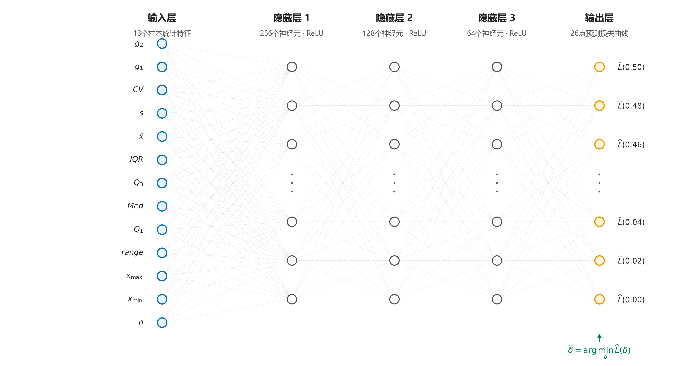

# 前情提要与本次汇报结构

## 第1页 **本次汇报结构**

1. **定义问题**
2. **真参数未知时，如何实现“样本—最优偏移量”的选择**
3. **关于神经网络的答疑与可信性验证**
4. **论文准备**
5. **下一个研究课题**

### **口述稿**

> 上次组会上，我初步汇报了用神经网络选择 delta 的想法，主要讲了评价指标的选择和一部分信息层级。之后老师建议把这项工作写成论文，所以这段时间我对研究问题、实验方法、证据边界和论文结构又做了进一步细化。

---

# 第一部分 定义问题

## 第2页 **怎么从个体到通用来定义最优偏移量？**

**老师提问**

> 100个样本得到100个个体最优偏移量，最终应该选择哪个作为通用值？

**初步回答**

- **关注整体表现**：选择使100个样本平均损失最小的偏移量。
- **关注绝对最差表现**：选择使最大损失最小的偏移量。
- **关注尾部表现**：选择使高分位数损失最小的偏移量。

**本文关注总体参数估计精度，因此以全部样本的平均损失最小为主要目标：**

$$
\delta_{\mathrm{global}}^*
=\arg\min_{\delta}\frac{1}{N}\sum_{i=1}^{N}L_i(\delta)
$$

### **口述稿**

> 老师上次提出了一个问题：100个样本会得到100个个体最优偏移量，那么最终应该选择哪个作为通用值？
>
> 我现在的理解是，选择哪个偏移量取决于我们关注什么。如果关注整体表现，就选择使平均损失最小的偏移量；如果关注绝对最差表现，就选择使最大损失最小的偏移量；如果关注尾部风险，就选择使高分位数损失最小的偏移量。
>
> 本文关注总体参数估计精度，因此采用平均损失最小作为通用偏移量的选择目标。也就是说，让每个候选偏移量都在全部样本上接受评价，再选择平均损失最小的一个。不过，这个回答是在参数空间已经确定的前提下成立的，因此还要进一步追问：参数空间改变以后，这个通用值会不会改变？

---

## 第3页 **通用最优偏移量依赖参数空间及其权重**

**进一步追问**

> 如果改变或扩大当前参数空间，原来得到的通用最优偏移量会不会改变？


- 本次扩展后的45个正式设计组合等权汇总：$\delta^*=0.08$。
- $0.06$—$0.12$附近风险曲线较平坦，$0.08$与原来使用的$0.10$差别很小。
- 只看 $\beta=1.5$：$\delta^*=0.36$。
- 只看 $\beta=5.0$：$\delta^*=0.04$。

**通用最优偏移量是给定参数空间及其权重下的最优；改变或扩展参数空间，最优值可能随之改变。**

### **口述稿**

> 在初步回答老师的问题以后，我又进一步追问：这个通用最优值是在给定参数空间内得到的，如果改变或扩大参数空间，答案会不会改变？
>
> 在这次扩展后的45个正式参数组合上综合评价，网格最优偏移量是0.08。风险曲线在0.06到0.12附近比较平坦，所以0.08与原来使用的0.1差别很小，0.1仍然是一个很强的固定基线。
>
> 但是按形状参数 beta 分开以后，情况明显不同：beta等于1.5时，最优偏移量是0.36；beta等于5时，则是0.04。这说明全局结果接近0.1，是当前参数条件综合以后的结果，并不表示每种条件下的最优值都接近0.1。如果以后加入其他beta范围或改变各参数条件的权重，通用最优值就可能随之改变。
>
> 因此，通用最优偏移量依赖参数空间及其权重。接下来需要先把本文采用的参数空间、候选网格和评价指标固定下来，再讨论不同信息条件下可以怎样选择偏移量。

---

## 第4页 **参数空间、候选网格和评价指标**

| 项目 | 正式设置 |
|---|---|
| 形状参数 $\beta$ | 1.5、2.0、2.5、4.0、5.0 |
| 尺度参数 $\eta$ | 1.0 |
| 位置比例 $\gamma/\eta$ | 0.1、0.5、1.0 |
| 样本量 $n$ | 7、10、20 |
| 偏移量 $\delta$ | 0.00–0.50，步长0.02，共26点 |
| Monte Carlo重复 | 每个参数组合1000次 |
| 设计权重 | 45个参数组合等权 |

**尺度等变性说明**

若所有寿命观测同时乘以常数 $c$，则

$$
(\beta,\eta,\gamma)\longrightarrow(\beta,c\eta,c\gamma).
$$

- $\beta$、$\gamma/\eta$和相应的偏移量选择不变；$\gamma/\eta$表示位置移动量相当于多少个尺度单位。
- 例如 $W(2,1,1)$ 的全部观测乘1000后，得到尺度等价的 $W(2,1000,1000)$；二者只差数值尺度或物理单位。
- 因此正式模拟固定 $\eta=1$；需要恢复实际尺度时，应将样本、$\eta$和$\gamma$同时乘以相同倍数，不能只改变 $\eta$。

单样本参数估计损失：

$$
L_i(\delta)=
\left(\frac{\hat\beta_i-\beta}{\beta}\right)^2
+\left(\frac{\hat\eta_i-\eta}{\eta}\right)^2
+\left(\frac{\hat\gamma_i-\gamma}{\eta}\right)^2
$$

整体评价指标：

$$
J_1=\sqrt{\frac{1}{N}\sum_{i=1}^{N}L_i(\hat\delta_i)}
$$

### **口述稿**

> 在建立不同的信息层级以前，我先说明正式实验的参数空间和评价指标，因为后面所有“最优”和“改善”都只在这个共同合同下成立。
>
> 本文的形状参数 beta 取1.5、2、2.5、4和5；位置参数用 gamma 与 eta 的比值表示，取0.1、0.5和1；样本量取7、10和20。这样一共形成45个参数组合，并在总体评价时等权处理。
>
> 尺度参数 eta 固定为1，依据是尺度等变性。简单来说，如果把所有寿命观测同时放大 c 倍，那么 eta 和 gamma 也同时放大 c 倍，但 beta、gamma与eta的比值以及相应的偏移量选择不变。gamma与eta的比值表示位置移动量相当于多少个尺度单位，它不是位置参数占均值的比例。
>
> 例如，从 $W(2,1,1)$ 转换到 $W(2,1000,1000)$，需要把样本值、eta和gamma全部乘1000。两者的分布形状和标准化问题相同，只是数值尺度或物理单位不同。因此模拟时固定eta等于1不会损失这些尺度等价情形，需要展示实际尺度时再整体换算即可。如果只把eta乘1000而不改变gamma，gamma与eta的比值就会改变，那就不再是同一个标准化参数条件。
>
> 偏移量从0到0.5、以0.02为步长进行扫描，一共26个候选点。每个参数组合进行1000次 Monte Carlo 重复。因此，本文选择的是离散候选网格内的最优点，不是连续偏移量空间中的理论最优值。
>
> 评价方面，首先对每个样本计算三个参数的无量纲平方误差。beta和eta分别用自身进行归一化；gamma可能为0，因此用尺度参数eta归一化。平方项同时处理正负偏差，并对较大误差给予更高惩罚。当前没有预设某一个参数比另外两个更重要，所以三个参数采用等权。
>
> 最后，把每个样本在所选偏移量下的真实损失先求平均、再开平方，得到整体评价指标 $J_1$。后面所有层级都使用同一个 $J_1$ 进行比较。因此，后面所说的全局最优或分层最优，只在这45个等权参数组合、26个候选偏移量和当前损失定义下成立。

---

## 第5页 **“最优偏移量”应理解为不同可用信息条件下的最优选择规则**

| 层级 | 选择时可用的信息 | 偏移量选择方式 | 性质 |
|---|---|---|---|
| Default | 不区分任何条件 | 所有样本固定使用0.1 | 基线 |
| L1 | 给定的总体参数空间 | 整个参数空间选择一个偏移量 | 可部署 |
| L2 | 样本量 $n$ | 每个 $n$ 选择一个偏移量 | 可部署 |
| L3 | 真实 $\beta$ | 每个 $\beta$ 选择一个偏移量 | 理想参照 |
| L4 | 真实 $\beta$、$n$ | 每个 $(\beta,n)$ 选择一个偏移量 | 理想参照 |
| L5 | 真实 $\beta$、$n$、$\gamma/\eta$ | 每个参数组合选择一个偏移量 | 理想参照 |
| L6 | 单个样本的完整真实损失曲线 | 每个样本选择自己的偏移量 | 事后参照 |

### **口述稿**

> 从Default到L5，偏移量选择所使用的信息逐步增加，选择范围也从所有样本共用一个值，逐渐细化到每个参数组合使用一个值。
>
> Default固定使用0.1；L1在整个参数空间内选择一个全局偏移量；L2加入实际已知的样本量，为不同n分别选择。L1和L2使用的信息在实际应用中可以获得，因此属于可部署层级。
>
> L3到L5依次使用真实beta、真实beta与样本量，以及完整的真实参数组合。由于实际使用时真参数未知，这三个层级只能作为理想参照，用来衡量不同参数信息能够提供多少选择空间。
>
> L6进一步利用单个样本在26个候选偏移量下的完整真实损失曲线，为每个样本单独选择偏移量。因此它是逐样本事后参照，只用于衡量逐样本选择空间，不能直接部署。

---

## 第6页 **不同信息层级能带来多少改善？**

**怎么得到每个层级的 $J_1$？**

$$
\text{按该层级的信息分组}
\longrightarrow
\text{组内扫描26个 }\delta\text{ 并选择平均损失最小点}
\longrightarrow
\text{将所选 }\delta\text{ 回填到测试样本}
\longrightarrow
\text{汇总全部样本得到 }J_1
$$


- Default → L1：$J_1$ 降低0.048%。
- L1 → L2：$J_1$ 降低0.059%。
- L2 → L3：加入真实 $\beta$ 信息后，$J_1$ 降低7.51%。
- L5 → L6：从组级规则转为逐样本事后选择后，仍存在13.42%的 hindsight gap。
- **Default、L1和L2只是接近，并非完全相等**：全局风险曲线在0.1附近较平坦；按 $n$ 分组后，每个 $n$ 内不同 $\beta$ 对偏移量的需求仍相互抵消，因此L1和L2只能带来0.048%和0.059%的小幅改善。

### **口述稿**

> 这张图比较了不同信息层级下的整体参数估计损失。左图给出各层级的绝对 $J_1$，右图给出相对上一个层级的逐级降幅。
>
> 这张图不是直接把各组已经算好的 $J_1$ 再取平均。具体做法是，先按照该层级允许使用的信息对样本分组；在每个组内扫描26个候选偏移量，选择平均损失最小的 $\delta_g^*$；再把这个偏移量回填给该组测试样本；最后将全部测试样本的未开方损失统一汇总并开平方，得到该层级唯一的总体 $J_1$。
>
> 从简单可部署层级看，Default、L1和L2的结果都在0.633附近，但它们只是非常接近，并不是完全相等。L1相对Default降低0.048%，L2相对L1再降低0.059%。
>
> 这里有两个原因。第一，前面已经看到，全局风险曲线在0.06到0.12附近比较平坦，所以把固定0.1换成全局网格最优0.08，本身只能产生很小变化。第二，L2虽然按照样本量分组，但在每一个相同的 $n$ 内，仍然混合了不同的 $\beta$；而不同 $\beta$ 对偏移量的选择方向差异很大，这些需求在组内继续相互抵消。因此，只增加样本量信息还不足以明显拉开结果。
>
> 但是，当L3引入真实 beta 信息以后，相对L2的 $J_1$ 降低了7.51%。继续加入样本量和位置比例信息后，L4和L5还可以进一步改善。这里后两级的降幅分别是0.51%和1.88%，因此不把它概括成严格的单调递减。
>
> 最后，L6从组级选择变成对每一个样本进行事后选择，相对L5还存在13.42%的差距。这个差距不能理解为可以直接获得的部署收益，因为L6需要事后知道每个样本在所有偏移量下的真实损失；但它说明逐样本选择仍然存在值得研究的空间。
>
> 因此，下一步的问题就变成了：真参数未知时，能不能只根据实际能够观察到的样本信息，实现更细的偏移量选择。

---

# 第二部分 真参数未知时，如何实现“样本—最优偏移量”的选择

## 第7页 **事后最优如何转化为实际选择？**

**离线研究阶段**

```text
模拟样本 + 已知真参数
        ↓
26个偏移量对应的真实损失曲线
        ↓
曲线最小点 = 样本的事后最优偏移量
```

**实际使用阶段**

```text
观测样本
   ↓
如何推断不可见的26点损失曲线？
   ↓
选择偏移量
```

需要建立的映射：

$$
\text{可观测样本信息}
\longrightarrow
\text{26点损失曲线}
\longrightarrow
\text{所选偏移量}
$$

### **口述稿**

> 前面的L3到L6能够建立真参数条件、具体样本与最优偏移量之间的关系，是因为在模拟实验中真参数是已知的。对于每一个模拟样本，我可以计算它在26个候选偏移量下的真实参数估计损失，从而得到一条完整的损失曲线，并把曲线的最小点作为这个样本的事后最优偏移量。
>
> 但是在实际使用时，情况不一样。我们拿到的只有一个观测样本，真参数未知，因此也无法直接计算这个样本在不同偏移量下的真实估计误差。也就是说，真正需要的26点损失曲线在使用时是不可见的。
>
> 因此，实际需要解决的并不是简单记住一个最优偏移量，而是建立这样一个映射：从当前样本中能够观察到的信息出发，推断它对应的26点损失曲线，再根据预测曲线的最小点选择偏移量。
>
> 这就是后面引入神经网络所要解决的具体问题。

---

## 第8页 **用神经网络来近似“可观测样本信息—完整损失曲线”之间未知且复杂的映射**


设排序后的样本为 $x_{(1)}\le\cdots\le x_{(n)}$：

| 类别 | 输入特征 | 计算方法 |
|---|---|---|
| 样本量 | $n$ | 样本中的观测数量 |
| 极值 | $x_{\min},x_{\max}$ | $x_{(1)},x_{(n)}$ |
| 极差 | $range$ | $x_{\max}-x_{\min}$ |
| 分位数 | $Q_1,Med,Q_3$ | 采用排序样本的线性插值经验分位数 |
| 四分位距 | $IQR$ | $Q_3-Q_1$ |
| 均值 | $\bar x$ | $n^{-1}\sum_i x_i$ |
| 标准差 | $s$ | $\sqrt{\sum_i(x_i-\bar x)^2/(n-1)}$ |
| 变异系数 | $CV$ | $s/\bar x$ |
| 偏度 | $g_1$ | $n^{-1}\sum_i[(x_i-\bar x)/s]^3$ |
| 超额峰度 | $g_2$ | $n^{-1}\sum_i[(x_i-\bar x)/s]^4-3$ |

- $x_{\min}$、$x_{\max}$、$range$、$Q_1$、$Med$、$Q_3$、$IQR$、$\bar x$、$s$：使用训练折统计量进行z-score。
- $n$、$CV$、$g_1$、$g_2$：原值输入。
- **输出**：26个候选偏移量对应的预测损失；取预测曲线最小点作为所选偏移量。

**小样本分位数怎样计算？**

对分位比例 $p$，令 $h=(n-1)p$、$k=\lfloor h\rfloor$、$a=h-k$，则

$$
Q_p=(1-a)x_{(k+1)}+a x_{(k+2)}.
$$

| $n$ | $Q_1$ | $Med$ | $Q_3$ |
|---:|---|---|---|
| 7 | $(x_{(2)}+x_{(3)})/2$ | $x_{(4)}$ | $(x_{(5)}+x_{(6)})/2$ |
| 10 | $0.75x_{(3)}+0.25x_{(4)}$ | $(x_{(5)}+x_{(6)})/2$ | $0.25x_{(7)}+0.75x_{(8)}$ |
| 20 | $0.25x_{(5)}+0.75x_{(6)}$ | $(x_{(10)}+x_{(11)})/2$ | $0.75x_{(15)}+0.25x_{(16)}$ |

### **口述稿**

> 为了近似前面这条不可见的损失曲线，我采用了一个向量输出的多层感知机，也就是 Vector-MLP。
>
> 之所以考虑神经网络，是因为当前样本信息与26点损失曲线之间没有已知、可靠的解析关系，而且这个映射可能同时包含非线性和多个样本特征之间的交互。因此，神经网络在这里是实现这个映射的工具，而不是研究本身的目的。
>
> 对于一个新的寿命样本，首先提取13个实际可观测的统计特征，然后把这些特征输入网络。网络不直接输出一个偏移量，而是一次输出26个候选偏移量对应的预测损失。最后对这条预测损失曲线取最小点，得到这个样本所选择的偏移量。
>
> 这13个输入可以分成四类。第一类是样本量 n。第二类是位置和尺度信息，包括最小值、最大值、极差、均值和样本标准差。第三类是分布位置和离散结构，包括第一四分位数、中位数、第三四分位数和四分位距。第四类是无量纲形状信息，包括变异系数、偏度和超额峰度。
>
> 具体计算都只使用当前观测样本。标准差的分母使用 $n-1$；变异系数是标准差除以样本均值；偏度和超额峰度分别由标准化后的三阶和四阶中心矩计算。最小值到标准差这9个有量纲特征，只使用训练折的均值和标准差进行z-score；样本量、变异系数、偏度和峰度保持原值输入。所有特征在实际选择时都能从样本直接获得，输入中不包含真实 beta、eta、gamma或参数组合编号。
>
> 对于小样本分位数，这里采用的是排序样本上的线性插值经验分位数。具体做法是先计算位置 $(n-1)p$，如果这个位置不是整数，就在相邻两个顺序统计量之间按距离插值。因此，分位数不要求一定等于某一个实际观测值。例如 $n=7$ 时，第一四分位数是第2和第3个顺序统计量的平均，中位数是第4个，第三四分位数是第5和第6个的平均。$n=10$和20时也按照同一个公式计算，页面表格给出了具体权重。
>
> 这些分位数只是对当前经验分布的描述，不是把它们当作总体真实分位数。小样本下分位数本身会有较大波动，而这种波动没有被人为消除，反而会作为当前样本不确定程度的一部分进入模型。
>
> 老师之前还问过，为什么这里使用统计特征，而不是直接把原始样本输入神经网络。这里我先说明当前采用的方法；在后面的第三部分，我会用原始样本输入和统计特征输入的直接对照，专门回答这个问题。
>
> 在离线训练阶段，模拟数据的真参数已知，因此能够计算每个样本的26点真实损失曲线，并把它作为监督标签。但是，真实 beta、真实 gamma 与 eta 的比值、参数组合编号以及候选偏移量本身都不作为模型输入。
>
> 在最终评价时，也不是用网络训练误差代替参数估计效果，而是在网络选出的偏移量下重新进行MDM估计，再用真实 selected loss 汇总 $J_1$。因此，网络的曲线拟合和最终的偏移量选择效果是两个不同层面的评价。

---

## 第9页 **Vector-MLP是什么样的网络，为什么这样设计？**



| 可能提问 | 回答 |
|---|---|
| 这是不是神经网络？ | 是。MLP是最经典的一类全连接前馈神经网络。 |
| 为什么选择MLP？ | 当前任务是“13维固定特征 → 26维连续损失曲线”的非线性回归；输入不具有图像的空间邻域或时间序列的先后结构。 |
| 为什么是256–128–64？ | 采用逐层收缩的工程配置，在正式评价前冻结；它提供非线性表达容量，并配合L2正则和提前停止，但没有经过系统结构搜索，也未被证明为最优。 |

**数据与结构规模：每折约36,000条训练损失曲线；13–256–128–64–26网络约含46,426个可训练参数。**

| 训练与评价 | 设置 |
|---|---|
| 训练 | 26维标准化MSE；Adam；学习率 $10^{-3}$；L2正则 $10^{-4}$；batch 256；提前停止 |
| 评价 | 5折完整参数组合留出；seed 42、2026、3407 |

**当前结果证明这套固定MLP能够完成样本自适应选择，不证明该网络结构本身最优。**

### **口述稿**

> 这一页回答两个问题：我具体使用了什么神经网络，以及为什么这个任务采用这样的网络结构。
>
> 首先，它确实是神经网络。这里使用的是多层感知机，也就是最经典的一类全连接前馈神经网络。所谓前馈，是信息只按照图中从左到右传播；所谓全连接，是相邻两层之间的每个节点都有可学习的连接。每个神经元先对上一层信息进行加权组合，再通过激活函数完成非线性变换。
>
> 网络输入层对应前一页介绍的13个统计特征。随后经过256、128和64个神经元组成的三个隐藏层，隐藏层使用ReLU激活函数，使模型能够表达样本特征与损失曲线之间不是简单直线关系的复杂映射。最后的输出层包含26个节点，每个节点对应一个候选偏移量的预测损失，因此一次预测就可以得到完整的26点损失曲线，再选择预测损失最小的偏移量。
>
> 图中左侧把13项输入逐一标出，包括样本量、极值、极差、分位数、均值、标准差、变异系数、偏度和峰度；右侧输出则按照 $\delta=0.00,0.02,\ldots,0.50$ 排列，分别表示26个候选偏移量的预测损失。网络本身不直接输出偏移量，而是在得到这26个预测值以后，取最小预测损失所在的位置作为 $\hat\delta$。
>
> 之所以选择MLP，是因为当前输入是固定长度的特征向量，输出也是固定长度的连续损失向量，这是一个典型的多输出非线性回归问题。同时，这13个统计特征不像图像那样存在空间邻域，也不像时间序列那样存在前后顺序，因此没有必须使用卷积网络或循环网络的结构依据。输出层使用线性输出，因为这里预测的是连续损失值，而不是进行类别判断。MLP并不是唯一可行方法，下一页还会用梯度提升树进行受控对照。
>
> 至于为什么使用256、128和64个神经元，这不是系统搜索所有层数和宽度以后得到的最优答案，而是正式评价前冻结的一套逐层收缩工程配置。每折约有36,000条训练损失曲线，这个网络约有46,426个可训练参数；三个隐藏层为非线性映射提供表达容量，再用L2正则和提前停止限制过拟合。
>
> 因此，现有实验能够证明的是，这套预先固定的MLP在完整组合留出和多seed检查下能够完成样本自适应偏移量选择；它不能证明三层一定优于两层或四层，也不能证明256、128和64是最优神经元数量。论文的重点是偏移量选择问题，不是神经网络结构搜索。
>
> 数据仍然来自45个正式参数组合、共45,000条样本级损失曲线。训练采用标准化后的26维均方误差、Adam优化器、$10^{-3}$ 学习率和 $10^{-4}$ 的L2正则；正式评价仍采用5折完整参数组合留出，并使用三个训练随机种子检查稳定性。

---

## 第10页 **其他机器学习方法能否实现这一选择？**

**可以。关键不是必须使用神经网络，而是能否预测不同候选 $\delta$ 下的损失。**


**Tabular-L6怎样完成偏移量选择？**

$$
(\text{13项样本特征},\delta_j)
\longrightarrow
\text{预测该点损失}
\xrightarrow{\text{同一样本遍历26个候选点}}
\text{选择预测损失最小的 }\delta
\longrightarrow
\text{用真实损失汇总 }J_1
$$

| 项目 | Vector-MLP-L6 | Tabular-L6 |
|---|---|---|
| 学习器 | 多层感知机 | 直方图梯度提升回归树 |
| 问题表示 | $\mathbf{x}\rightarrow$ 完整26点曲线 | $(\mathbf{x},\delta_j)\rightarrow$ 单个损失 |
| 每个样本 | 一次预测 | 对26个候选点逐一预测 |
| pooled $J_1$ | 0.547003 | 0.557849 |

- 相同45,000个样本、相同26点L6真实损失标签、相同5折参数组合留出和相同最终 $J_1$ 评价。
- 两种模型都先在各折未见参数组合上选择偏移量，再用所选点对应的真实损失计算 $J_1$；表中不是训练MSE。
- 当前受控比较中Vector-MLP相对降低约1.94%；这不等于已经证明神经网络对所有机器学习方法最优。

### **口述稿**

> 这里进一步回答一个可能的质疑：这个任务是不是只有神经网络才能完成？答案是否定的。真正需要实现的是，根据样本信息预测不同候选偏移量下的损失，再选择预测损失最小的偏移量。只要一个模型能够学习这种非线性关系，原则上都可以实现样本自适应选择。
>
> 上一页已经展示了Vector-MLP的网络结构。这一页不再试图把Tabular-L6的完整计算过程全部塞进一张图，而是先用一棵简单的回归树说明这种学习器的基本原理。
>
> 图中，一棵回归树根据输入特征是否超过某个阈值逐层分支。一个样本沿着相应路径落入某个叶节点，叶节点给出的数值就是这棵树的预测结果。梯度提升模型就是依次建立多棵这样的回归树，让后加入的树继续修正前面模型尚未预测好的部分，最后将各棵树的结果加权相加。
>
> 在本研究的Tabular-L6中，每次输入是13项样本统计特征加一个候选偏移量 $\delta_j$，输出是该候选偏移量对应的一个预测损失 $\widehat L(\delta_j)$。对同一个样本分别代入26个候选偏移量，便能得到26个预测损失并选择最小点。以一折数据为例，36,000个训练样本展开为936,000行；当前模型最多迭代200棵树，最大深度为6，学习率为0.1。
>
> 为了使比较有意义，两条路线使用相同的45,000个样本、相同的26点L6逐样本真实损失标签和相同的5折参数组合留出。对每一折，它们都只在训练组合上学习，再对未见参数组合的样本预测损失并选择偏移量。最后回到所选偏移量对应的真实损失，汇总得到 $J_1$。因此，表中比较的是偏移量选择后的真实参数估计效果，不是两个模型各自的训练MSE。
>
> 结果上，Vector-MLP-L6的 pooled $J_1$ 为0.547003，Tabular-L6为0.557849，Vector-MLP相对降低约1.94%。因此，这一页支持两个有限结论：第一，神经网络不是唯一可行方法；第二，在当前受控比较中，一次联合预测完整曲线的Vector-MLP表现更好。它不能扩大为已经比较所有机器学习方法，也不能据此宣称当前神经网络结构具有普遍最优性。

---

## 第11页 **综合所有理想情况和训练情况给出指标榜单**

**榜单怎样得到？**

1. **共同评价基础**：45个参数组合 × 每组1000个样本；每个样本均有26个候选偏移量对应的真实损失。
2. **训练模型**：将45个组合分成5组；每轮用36组训练、9个完整未见组合测试，轮换5次，使每个组合恰好测试一次。
3. **基线与理想参照**：Default、L1—L5和L6不训练神经网络，而是分别按照固定值、相应信息分组或逐样本真实损失曲线选点。
4. **统一评价**：所有方法都在同一批45,000个样本上取出“所选偏移量对应的真实损失”，再按同一公式汇总 pooled $J_1$ 并排序。

**五轮完整参数组合留出检验训练模型对未见参数组合的选择能力；L3—L6只用于理想信息参照，不能理解为经过训练的可部署模型。**


- L2：$J_1=0.632541$。
- Vector-MLP-L6：$J_1=0.547003$，相对L2降低13.52%。
- Tabular-L6：$J_1=0.557849$。
- L6-hindsight：$J_1=0.494530$。

$$
\frac{0.632541-0.547003}{0.632541}\times100\%=13.52\%.
$$

**Vector-MLP-L6的0.547003为预先指定的primary seed 42结果；L2与Vector-MLP在同一批留出测试样本上评价。**

### **口述稿**

> 这张图综合了简单基线、使用真参数的理想参照和经过训练的机器学习模型，并按照 pooled $J_1$ 从低到高排列，也就是越靠上表现越好。
>
> 榜单中的项目有两种来源。对于Vector-MLP和Tabular这类需要训练的模型，45个完整参数组合先分成5组，每组9个组合。第一轮使用其中36个组合训练，在另外9个完整未见组合上测试；下一轮更换测试组。轮换5次以后，45个参数组合都恰好作为测试组合出现一次。这里划分的是完整参数组合，而不是从同一参数组合中随机拆分训练样本和测试样本，因此检验的是模型面对训练时未见参数组合时的选择能力。
>
> Default、L1到L5以及L6则不是训练模型。Default固定使用0.1；L1到L5按照前面定义的不同信息层级选点；L6直接使用单个样本的真实损失曲线取最小点。它们在榜单中承担基线、理想信息参照或事后参照，不能理解为同样经过了五轮神经网络训练。
>
> 两类结果最后回到同一个评价基础：45个参数组合、每组1000个样本，共45,000个样本。每种方法都先给出自己的偏移量选择，再取出该点对应的真实参数估计损失，按同一个公式汇总 pooled $J_1$，然后形成榜单。共同的是评价样本和评价公式，不同的是偏移量如何选出。
>
> 灰色是Default、L1和L2三种简单可部署基线；橙色是不同监督粒度的Vector-MLP；蓝色是直接预测单个偏移量的Tabular-L6；绿色是使用真参数的组级理想参照以及逐样本事后参照。
>
> 本文的主要比较对象是L2和Vector-MLP-L6。两者在同一批留出测试样本上评价：L2的 pooled $J_1$ 为0.632541，Vector-MLP-L6在预先指定的primary seed 42下为0.547003，按照二者差值除以L2计算，相对降低13.52%。这说明在真参数不作为输入的条件下，样本可观测信息能够带来比按样本量查表更细的偏移量选择。
>
> Vector-MLP-L6也优于上一页介绍的标量风险预测基线Tabular-L6，后者的 $J_1$ 为0.557849。另一方面，逐样本事后参照L6的 $J_1$ 为0.494530，仍然低于Vector-MLP-L6，说明模型获得了部分逐样本选择收益，但还没有达到事后最优边界。
>
> 图中Vector-MLP-L6的数值也低于L3到L5的组级理想参照，但这不能表述为“神经网络超越了真参数方法”。L3到L5是在组级分配一个偏移量，而Vector-MLP-L6使用逐样本损失曲线作为离线监督标签，二者的决策粒度不同。完整展示这些方法，是为了定位模型处于整个比较空间中的位置；本文的主要结论仍然锚定相对L2的13.52%降幅。

---

## 第12页 **不同样本量下的改善方向一致**

| 样本量 | L2 $J_1$ | Vector-MLP-L6 $J_1$ | 相对降低 |
|---:|---:|---:|---:|
| $n=7$ | 0.739286 | 0.657558 | 11.05% |
| $n=10$ | 0.644520 | 0.549815 | 14.69% |
| $n=20$ | 0.488235 | 0.403679 | 17.32% |

### **口述稿**

> 为了检查前面的13.52%是否主要由某一个样本量造成，这里先按样本量进行分层。对于 $n=7$、10和20，Vector-MLP-L6相对L2的 $J_1$ 分别降低11.05%、14.69%和17.32%。三个正式样本量下的改善方向一致，同时也能看到小样本本身仍然更难：无论是L2还是Vector-MLP，$n=7$ 的绝对 $J_1$ 都明显高于 $n=20$。
>
> 这里三个样本量上的相对降幅依次增加，但目前只检验了7、10和20三个离散点，因此我只把它表述为三个正式样本量下方向一致，不把它外推成收益随样本量单调增加的一般规律。
>
> 训练随机种子的影响不在这一页混合讨论，放到第三部分的问题5中单独回答。

---

# 第三部分 关于神经网络的答疑与可信性验证

## 第13页 **问题1：输入原始样本与输入特征的区别？**

**老师提问**

> 为什么使用统计特征，而不直接把原始样本输入神经网络？

| 两个核心质疑 | 回答思路 |
|---|---|
| 神经网络本身能自动提取特征，为什么还要人工计算？ | “能够表示”不等于在有限数据和容量下“能够高效、稳定地学出”；统计特征预先加入排列不变性和统计结构，使网络集中学习未知映射。 |
| 特征是对原始样本的压缩，是否必然损失信息？ | F13确实可能丢失信息，也未被证明是充分统计量；需要检验丢失的是否为偏移量选择所需的任务相关信息。 |

**受控比较：同一训练与TEST、同一26点损失标签、相同组合留出、近似相同网络容量；表内为三个seed平均。**

| 联合模型输入     | pooled $J_1$ |    $n=7$ |   $n=10$ |   $n=20$ |
| ---------- | -----------: | -------: | -------: | -------: |
| 13个统计特征F13 |     0.533733 | 0.640496 | 0.534961 | 0.397721 |
| 原始样本       |     0.536972 | 0.643962 | 0.539250 | 0.399409 |


- RAW保留全部样本值，但没有把额外信息转化为稳定的选择精度收益：pooled $J_1$ 相对F13增加0.003239。
- 三个 $n$ 下均有2/3个seed为F13更好，差异较小且并非每个seed方向一致。
- **当前选择F13不是因为它被证明无损或普遍更优，而是当前任务中效果近似；此时F13固定维、排列不变、学习负担更小且更易解释。**

### **口述稿**

> 老师之前问过，输入原始样本和输入统计特征有什么区别。这里有两个必须正面回答的质疑：第一，神经网络本身能够建立隐式联系，为什么还要人工提取特征；第二，统计特征毕竟压缩了样本，会不会丢失原始信息。
>
> 对第一个质疑，神经网络理论上确实可以从原始样本中自行学习均值、分位数、离散程度和极端值等统计结构。但“能够表示这种关系”不等于在有限训练数据和有限网络容量下能够高效、稳定地学出来。原始样本路线要先从样本值中学习这些基础统计结构，再学习它们与26点损失曲线之间的关系。F13则预先完成确定的统计运算和排列不变处理，让网络集中学习真正未知的“样本信息到损失曲线”的映射。因此人工特征不是替代神经网络，而是给它加入与统计问题相符的先验结构，降低学习负担。
>
> 对第二个质疑，答案是统计特征确实可能损失信息。F13是原始样本的确定性压缩，也没有被证明是当前任务的充分统计量；原始样本中的局部间距等细节可能在压缩后消失。因此不能靠原理直接宣布F13无损，真正需要检验的是：这些被丢失的信息是否会影响最终偏移量选择。
>
> 为此，Study1.5在相同训练数据、同一固定TEST、相同26点损失标签、相同组合留出和近似相同网络容量下，比较了F13与保留全部样本值的RAW输入。三seed平均 pooled $J_1$ 分别为0.533733和0.536972，RAW高0.003239；三个样本量下均有2/3个seed表现为F13更好，但方向不是每个seed都一致。这说明两种表示效果接近，当前没有观察到RAW的额外信息转化为稳定精度收益。
>
> 因此，我选择F13不是因为已经证明它无损或对所有原始样本网络都更优，而是因为当前任务和当前MLP下，两者效果近似；此时F13具有固定维、排列不变、学习负担更小和容易解释的优势。这个结论不排除DeepSets等更适合集合输入的网络将来从原始样本中获得额外收益。

---

## 第13A页 **特征组消融：13个输入特征是否都在发挥作用？**

**正式E4a：主参数网格、5个组合留出fold、3个训练seed；每组15次运行，表中为 pooled $J_1$ 的均值±标准差，越低越好。**

| 输入特征组 | 具体输入 | 特征数 | pooled $J_1$ | 相对完整F13变化 |
|---|---|---:|---:|---:|
| **完整F13** | $n$ + 尺度/分位数特征 + 形状特征 | 13 | **0.5456 ± 0.0098** | — |
| 尺度/分位数 | $n,x_{\min},x_{\max},R,Q_1,Q_2,Q_3,IQR,\bar x,s$ | 10 | 0.5506 ± 0.0115 | +0.91% |
| 形状 | $n,CV,g_1,g_2$ | 4 | 0.5816 ± 0.0204 | +6.59% |
| 仅样本量 | $n$ | 1 | 0.6378 ± 0.0189 | +16.88% |

- 仅输入 $n$ 明显不足：15/15次配对运行均差于完整F13，说明模型不是只按样本量查表。
- 形状组优于仅样本量，但仍不足以替代完整输入；尺度/分位数组最接近完整F13。
- 完整F13的平均结果最好；但尺度/分位数组与完整F13差距较小，不能把各组差值解释为单个特征的独立贡献率。
- **RAW对照说明“压缩后的特征是否够用”；本页消融进一步说明“特征内部哪些信息组在起作用”。**

### **口述稿**

> 上一页比较原始样本和统计特征，回答的是特征压缩会不会明显损害偏移量选择。这里再向内看一步：既然正式模型输入13个特征，这些特征是否真的都在发挥作用，还是网络实际上只看了样本量。
>
> E4a是在Study01主参数网格上完成的正式特征组消融，共5个组合留出fold、3个训练seed，因此每个特征组有15次运行。完整F13包括样本量、尺度与分位数信息以及形状信息；另外分别只保留尺度与分位数组、形状组，或者只保留样本量。比较口径仍然是 pooled $J_1$，越低越好。
>
> 结果中，完整F13的平均 $J_1$ 最低，为0.5456。只保留尺度和分位数特征时为0.5506，与完整输入最接近；只保留形状特征时升至0.5816；只输入样本量时进一步升至0.6378。尤其是仅样本量组在15次配对运行中全部差于完整F13，说明网络并不是简单地根据 n 查一个固定偏移量，而是确实利用了样本内部的统计信息。
>
> 这项消融说明，在当前分组下，尺度与分位数信息承担了主要的预测作用，形状信息加入完整模型后带来较小的平均增益。不过，各特征组有重叠，也不是逐个特征的正交删除，因此不能把0.91%或6.59%直接解释成某一类特征的独立贡献率，更不能据此宣布某个单独特征没有用。
>
> 所以问题1由两类证据共同回答：RAW对照表明，当前MLP下保留全部样本值没有形成稳定优势；正式特征组消融则表明，F13的效果不是只由样本量产生，样本内部的尺度、分位数和形状信息确实参与了偏移量选择。

---

## 第14页 **问题2-1：特征维数相同时，结果是否仍符合“$n$越大估计越准”？为什么？**

| 测试 $n$ | 每个样本的输入维数 | hindsight下界 | F13联合模型 $J_1$ |
|---:|---:|---:|---:|
| 7 | 13 | 0.586460 | 0.640496 |
| 10 | 13 | 0.492945 | 0.534961 |
| 20 | 13 | 0.359982 | 0.397721 |

- 输入维数相同不等于输入信息相同：F13直接包含 $n$，其余统计特征的取值与抽样波动也随 $n$ 改变。
- 网络学习的是样本量条件化映射：$\widehat{\mathbf L}=g(\mathbf z,n)$，而不是三套人工指定的规则。
- F13与hindsight均保持 $J_1(n=7)>J_1(n=10)>J_1(n=20)$。
- **“$n$越大估计越准”是数据与估计问题本身的规律；不同 $n$ 下的统计特征和真实损失曲线都带有这一规律，网络据此学习偏移量选择后，优化结果在三个已验证样本量上仍保持 $n$ 越大、$J_1$ 越低。**

### **口述稿**

> 问题2的第一问是，不同样本量都被压缩成相同维数的统计特征后，最终结果是否仍然符合 n 越大估计越准的规律。结果是符合的：F13联合模型的 $J_1$ 从 n=7 的0.640496下降到 n=20 的0.397721。
>
> 这里“输入特征数量相同”不等于“输入信息相同”。第一，F13直接把 n 作为第13个输入；第二，即使特征名称相同，均值、分位数、极差、标准差、偏度和峰度的具体取值及抽样波动也随 n 改变。网络学习的是一个以样本特征和 n 为条件的统一映射，同一个模型可以据此预测不同的损失曲线并选择不同偏移量。
>
> 但还要区分网络的调整作用和问题本身的难度。即使使用每个样本的真实损失进行事后最优选择，hindsight也从 n=7 的0.586460下降到 n=20 的0.359982。因此，小样本更难首先是参数估计本身的固有规律，并不是神经网络通过输入 n 人为制造出来的。
>
> 网络训练时也没有人为加入“J1必须随 n 增大而下降”的单调约束。它之所以在训练后仍保持这一规律，是因为不同 n 下的统计特征分布和26点真实损失曲线标签本身就反映了样本量差异。网络只是在各自的误差结构内选择更合适的偏移量，能够降低误差，但不能补回小样本缺少的信息。因此优化以后，三个已验证样本量仍表现为 n 越大、J1越低。
>
> 所以第一问可以回答为：固定维统计特征没有抹平样本量规律，F13结果仍然满足 n 越大估计越准；这是因为原始估计难度本身随 n 改变，同时模型又能利用显式 n 和随 n 改变的统计特征分布进行条件化选择。

---

## 第14A页 **问题2-2：训练和应用时都不输入 $n$，规律是否仍然存在？**

| 测试 $n$ | F13联合：显式输入 $n$ | F12联合：不输入 $n$ | 删除 $n$ 后的变化 |
|---:|---:|---:|---:|
| 7 | 0.640496 | 0.643348 | +0.45% |
| 10 | 0.534961 | 0.539720 | +0.89% |
| 20 | 0.397721 | 0.402196 | +1.13% |
| pooled | 0.533733 | 0.537578 | +0.72% |

- F12在训练和应用时都不输入 $n$，仍保持 $J_1(n=7)>J_1(n=10)>J_1(n=20)$。
- 剩余12个统计特征可用简单分类器以86.88%的准确率识别 $n$，随机水平为33.3%。
- 显式 $n$ 在三seed平均上提供有限增益，但不是形成样本量规律的必要条件。
- **统计特征的抽样分布隐式携带样本量信息；应用时 $n$ 天然已知且输入成本近乎为零，因此正式模型仍保留 $n$。**

### **口述稿**

> 第二问先把 n 从输入中完全删除。F12在训练和应用时都只接收其余12个统计特征，但结果仍然从 n=7 的0.643348下降到 n=20 的0.402196，说明不显式输入 n 时，“n越大估计越准”的规律仍然存在。
>
> 它能够保留这项规律有两个原因。第一，小样本的固有估计误差本来就更大；第二，统计特征本身的抽样分布依赖样本量。用这12个特征训练一个简单分类器，对 n=7、10和20的识别准确率达到86.88%，明显高于33.3%的随机水平。因此，网络虽然没有直接看到 n，仍能从特征组合中概率性地识别样本量信息。
>
> 与F13相比，删除 n 后三seed平均 pooled $J_1$ 从0.533733增加到0.537578，增加0.72%；三个样本量上分别增加0.45%、0.89%和1.13%。所以显式 n 平均上提供了有限增益，但不是模型工作的必要条件。
>
> 应用中 n 本来就是观测个数，天然可得，增加一个输入几乎没有成本。因此正式模型仍保留 n；这里的F12不是为了建议删除 n，而是用来证明统计特征本身并没有丢失样本量规律。

---

## 第14B页 **问题2-2（续）：应用未参与训练的 $n$ 时，是否具有泛化性？**

**已有相似证据：只用 $n=7,20$ 训练并测试未见过的 $n=10$。**

| 输入表示 | 相对 $n=10$ 专用模型增加的 $J_1$ | 当前解释 |
|---|---:|---|
| F13 | +0.011204 | 能够插值，但存在约2.1%的代价 |
| F12 | +0.011700 | 不输入 $n$ 仍可迁移，但同样存在代价 |
| RAW | +0.065708 | 对未见样本量的迁移明显更脆弱 |

**拟新增 $n=15$ 插值验证：联合模型训练仍只使用 $n=7,10,20$，$n=15$ 仅用于测试。**

| 对照 | 回答的问题 |
|---|---|
| 固定偏移量0.1 | 未见样本量上是否仍优于简单基线 |
| F13 / F12 / RAW联合模型 | 显式样本量、隐式特征和原始样本表示谁更能插值 |
| $n=15$专用模型 | 联合模型为迁移付出多少精度代价 |
| $n=15$ hindsight | 当前候选网格内仍有多少可改善空间 |

**该页是待验证问题，不是当前结果；实验只扩展 $n=15$，不修改已封存的Study1.5 Stage1或Study01正式证据。**

### **口述稿**

> 现有结果仍留下一个自然问题：如果实际样本量是训练中从未出现过的 n=15，模型还能不能使用。因为15位于10和20之间，这是样本量插值问题，而不是超出训练范围的外推。
>
> Study1.5已有一个相似但不完全相同的证据：只用 n=7和20训练，再测试未见过的 n=10。相对n=10专用模型，F13和F12的 $J_1$ 分别增加0.011204和0.011700，大约是2.1%到2.2%的迁移代价；RAW增加0.065708，说明当前padding和mask表示对未见样本量更脆弱。这提示统计特征具有一定插值能力，但不能据此直接宣布n=15也有效。
>
> 真正验证n=15时，联合模型的训练、验证、标准化和早停都仍然只使用n=7、10和20，n=15只进入最终测试。评价时同时比较固定0.1、F13、F12、RAW、n=15专用模型和hindsight，分别判断是否优于简单基线、迁移代价有多大以及距离事后下界还有多少空间。
>
> 由于当前没有n=15的真实26点损失曲线，仅把15输入网络只能看到模型输出，不能判断选择是否正确。因此需要新增n=15的蒙特卡洛评价数据。这项工作应作为Study1.5的独立扩展，只做n=15，不覆盖Stage1，也不提前写成Study01的正式泛化结论。

---

## 第14C页 **补充验证：联合模型覆盖多个 $n$，但不保证每个 $n$ 都最优**

**表中为“联合模型 $J_1$ − 同输入专用模型 $J_1$”；正数表示联合训练更差。**

| 测试 $n$ | F13联合−专用 | 三seed方向 | RAW联合−专用 | 三seed方向 |
|---:|---:|---|---:|---|
| 7 | −0.006862 | 联合更好2/3 | −0.002352 | 联合更好2/3 |
| 10 | +0.004556 | 联合更差2/3 | +0.007224 | 联合更差3/3 |
| 20 | +0.012120 | 联合更差3/3 | +0.012116 | 联合更差3/3 |

- 12/12个“输入表示 × 训练组织 × seed”组合均保持 $J_1(n=7)>J_1(n=10)>J_1(n=20)$。
- $n=7$ 的平均收益方向不完全稳定；$n=20$ 的联合训练代价在F13和RAW下均为3/3 seed一致。
- **统一模型是覆盖多个正式样本量的部署折中，不是每个 $n$ 下的精度最优方案。**

### **口述稿**

> 这一页是对前两问的补充，不承担“网络如何识别 n”或“未见 n 能否泛化”的直接回答，而是检查把多个样本量放在一起训练是否会产生精度折中。
>
> 三seed平均上，n=7 的联合模型略好，但F13和RAW都只有2/3个seed保持这个方向，不能确定地说小样本必然从联合训练获益。n=10时，F13有2/3个seed、RAW有3/3个seed表现为联合模型更差；n=20时两种输入都是3/3个seed显示专用模型更好，联合训练代价最稳定。
>
> 因此当前F13联合模型的价值，是用一个模型覆盖Study01的三个正式样本量，并且正式结果相对L2在三个 n 上都改善；它并不是每个 n 下的精度最优方案。如果应用目标是各样本量的极致精度，就应考虑按 n 专用模型或部分共享结构。
>
> 这项补充分析属于Study1.5内部答疑证据，不改变Study01已经封存的正式结果，只用于限制对统一模型的表述。

---

## 第15页 **问题3：pooled改善是否由某个样本量单独驱动？**

**权重检查：45个正式参数组合中，$n=7,10,20$ 各15组且重复次数相同，因此三个样本量各占总评价样本的 $1/3$。**

由于 $J_1$ 先汇总未开方损失再开方，在当前等权设计下：

$$
J_{1,\mathrm{pooled}}^2
=\frac{J_{1,n=7}^2+J_{1,n=10}^2+J_{1,n=20}^2}{3}.
$$

| 样本量 | L2 $J_1$ | Vector-MLP-L6 $J_1$ | 相对降低 | 对总体风险降幅的贡献 |
|---:|---:|---:|---:|---:|
| $n=7$ | 0.739286 | 0.657558 | 11.05% | 37.72% |
| $n=10$ | 0.644520 | 0.549815 | 14.69% | 37.37% |
| $n=20$ | 0.488235 | 0.403679 | 17.32% | 24.92% |

| 敏感性口径           | Vector-MLP-L6相对L2降低 |
| --------------- | ------------------: |
| 正式 pooled RMS   |              13.52% |
| 删除 $n=7$ 后重新汇总  |              15.64% |
| 删除 $n=10$ 后重新汇总 |              12.91% |
| 删除 $n=20$ 后重新汇总 |              12.61% |

**三个样本量均有实质贡献；删除任一层后结论仍成立，因此总体改善不是由单个 $n$ 驱动。**

### **口述稿**

> 第三个问题是，把不同样本量汇总为 pooled $J_1$ 后，观察到的改善会不会主要由某一个样本量驱动。原来的“分别看三个 n 是否都改善”只能排除方向相反，还不能说明总体降幅究竟来自哪里，所以这里进一步做了权重检查、贡献分解和删一组敏感性检查。
>
> 首先看权重。45个正式参数组合中，$n=7$、10和20各有15组，而且每组重复次数相同，所以三个样本量在总体评价中各占三分之一，不存在某一个 n 因样本数更多而获得更高权重。
>
> 其次，因为 $J_1$ 是先对未开方损失取均值再开方，所以我在 $J_1^2$ 的风险尺度上分解总体降幅。结果显示，$n=7$、10和20分别贡献37.72%、37.37%和24.92%。三个样本量都提供了实质改善，而且没有任何一层贡献超过一半。因此，虽然小样本的绝对误差更大，它并没有单独决定最终改善。
>
> 最后做删一组敏感性检查。分别删除 $n=7$、10或20后重新按照正式口径汇总，改善仍为15.64%、12.91%和12.61%。也就是说，去掉任意一个样本量，Vector-MLP-L6优于L2的判断都没有改变。
>
> 因此，pooled $J_1$ 仍作为正式参数空间下的总体主评价，分层贡献和删一组结果则作为可信性检查。这里能回答的是三个正式样本量下的总体结论不由单个 n 驱动，不能进一步外推到尚未验证的其他样本量。

---

## 第16页 **问题4：能否描述一下从全局偏移量=0.1到MLP-L6自适应偏移量，估计效果好了多少？**

**正式主结果：在45个参数组合的完整组合留出评价中，$J_1$ 从0.633219降至0.547003，相对降低13.62%。**

**固定参数组直观对照：$W(2,1000,1000)$，$n=7,10,20$ 各1000次，共3000个对齐样本。**

| 方法 | pooled $J_1$ | $\beta$ RMSE | $\eta$ RMSE | $\gamma$ RMSE | 失败率 |
|---|---:|---:|---:|---:|---:|
| MDM-L6-oracle（事后上界） | 0.424 | 0.269 | 0.258 | 0.201 | 0 |
| **MDM-MLP** | **0.470** | **0.338** | **0.256** | **0.203** | **0** |
| MDM-$0.1$ | 0.567 | 0.382 | 0.331 | 0.258 | 0 |
| LSE | 1.095 | 0.861 | 0.510 | 0.444 | 0 |
| WMLE | 1.113 | 0.711 | 0.634 | 0.576 | 0 |
| MLE | 1.762 | 1.407 | 0.762 | 0.739 | 32.4% |
| LRE | 2.103 | 1.537 | 1.050 | 0.977 | 0 |

- 在该固定参数组下，MDM-MLP相对MDM-$0.1$使 $J_1$ 降低17.23%；$\beta$、$\eta$、$\gamma$ RMSE分别降低11.64%、22.57%和21.50%。
- 从固定0.1到L6事后上界的可改善区间看，MDM-MLP已经实现约68.00%；但相对当前MLP结果，仍有约9.79%的进一步降低空间。
- MDM三种方案均优于本次对照中的传统方法；该结论只用于说明当前参数组下的相对位置，不外推为全参数空间的方法优劣。

### **口述稿**

> 第四个问题是，能不能更直接地描述从固定偏移量0.1到MLP-L6自适应选择以后，参数估计效果究竟改善了多少。
>
> 这个问题我用两层结果回答。第一层是论文的正式主结果：在45个参数组合的完整组合留出评价中，固定使用0.1的 pooled $J_1$ 为0.633219，Vector-MLP-L6为0.547003，相对降低13.62%。这说明改善不是由某一个参数组合偶然造成的。
>
> 第二层是为了让这个改善更有体感，我固定真参数为 $W(2,1000,1000)$，对 $n=7$、10和20各使用1000个完全对齐的样本，同时比较MDM的固定偏移量、自适应偏移量、事后上界以及四种传统估计方法。在这个例子中，MDM-MLP的 $J_1$ 为0.470，固定0.1为0.567，相对降低17.23%。分参数看，beta、eta和gamma的RMSE分别降低11.64%、22.57%和21.50%，所以这次改善不是只靠某一个参数得到的。
>
> 横向位置上，MDM-MLP优于本次比较中的LSE、WMLE、MLE和LRE，也明显优于固定0.1。从固定0.1到L6事后上界的可改善区间看，当前模型已经实现约68%；但它仍没有达到逐样本事后上界0.424，说明后续还有继续优化的空间。
>
> 这里需要强调两个边界。第一，13.62%来自45个正式参数组合，是论文的主证据；后面这张横向表只对应一个固定参数组，主要用于直观解释，不能据此宣布MDM在所有条件下都优于传统方法。第二，L6使用了事后信息，只是理论参照，不能作为实际可部署方法。

---

## 第16A页 **$n=7$：小样本下，自适应偏移量主要改善尺度参数与位置参数的稳定性**

**真值：$\beta=2$，$\eta=1000$，$\gamma=1000$。**

| 方法 | $\beta$均值 | $\beta$中位数 | $\beta$ 95%经验区间 | $\beta$最小–最大 | $\eta$均值 | $\eta$中位数 | $\eta$ 95%经验区间 | $\eta$最小–最大 | $\gamma$均值 | $\gamma$中位数 | $\gamma$ 95%经验区间 | $\gamma$最小–最大 | 成功数 |
|---|---:|---:|---:|---:|---:|---:|---:|---:|---:|---:|---:|---:|---:|
| MDM-L6-oracle | 1.72 | 1.77 | 0.62–2.72 | 0.35–6.22 | 840 | 856 | 308–1316 | 89–1670 | 1135 | 1088 | 843–1594 | 737–1996 | 1000 |
| **MDM-MLP** | **1.78** | **1.67** | **0.61–3.80** | **0.35–6.22** | **850** | **880** | **310–1307** | **89–1866** | **1124** | **1080** | **806–1594** | **516–1996** | **1000** |
| MDM-$0.1$ | 1.85 | 1.73 | 0.61–3.57 | 0.35–15.00 | 900 | 842 | 302–1725 | 89–2234 | 1079 | 1103 | 497–1603 | 331–1996 | 1000 |
| LSE | 2.51 | 1.71 | 0.51–8.19 | 0.23–18.40 | 1076 | 875 | 285–2303 | 81–2650 | 914 | 1087 | 0–1629 | 0–2002 | 1000 |
| WMLE | 3.06 | 2.88 | 1.48–5.00 | 1.34–5.86 | 1387 | 1256 | 476–2350 | 240–2753 | 631 | 782 | 0–1442 | 0–1751 | 1000 |
| MLE | 5.36 | 5.19 | 1.38–13.98 | 1.23–26.59 | 1578 | 1806 | 528–2352 | 247–2583 | 426 | 0 | 0–1412 | 0–1760 | 538 |
| LRE | 4.76 | 4.47 | 1.14–9.67 | 0.54–21.73 | 2015 | 2042 | 781–2466 | 302–2804 | 38 | 0 | 0–1062 | 0–1354 | 1000 |

注：95%经验区间是1000次蒙特卡洛估计值的2.5%–97.5%分位区间，不是单次估计的置信区间；MLE统计量仅基于538次成功估计，失败惩罚已计入上一页的总体指标。

### **口述稿**

> 这一页单独看最困难的 $n=7$。每个参数从左到右依次给出均值、中位数、95%经验区间和1000次模拟中的观测范围，因此能够看到总体指标背后的估计分布。
>
> 相比固定0.1，自适应偏移量对 eta 和 gamma 的尾部改善最直观：eta 的95%区间上界由1725降到1307，gamma的下界由497提高到806；beta的极端最大值也由15.00降到6.22。这里不强调每一个统计量都单调改善，而是说明小样本下最容易出现的偏离和长尾得到明显抑制。
>
> 传统方法中，MLE只有538次成功；LRE的gamma中位数接近0。这也解释了为什么只报告成功样本的均值并不足够，上一页还必须同时报告失败率和统一风险指标。

---

## 第16B页 **$n=10$：样本量增加后，自适应偏移量的改善仍然存在**

**真值：$\beta=2$，$\eta=1000$，$\gamma=1000$。**

| 方法 | $\beta$均值 | $\beta$中位数 | $\beta$ 95%经验区间 | $\beta$最小–最大 | $\eta$均值 | $\eta$中位数 | $\eta$ 95%经验区间 | $\eta$最小–最大 | $\gamma$均值 | $\gamma$中位数 | $\gamma$ 95%经验区间 | $\gamma$最小–最大 | 成功数 |
|---|---:|---:|---:|---:|---:|---:|---:|---:|---:|---:|---:|---:|---:|
| MDM-L6-oracle | 1.77 | 1.82 | 0.79–2.55 | 0.56–5.41 | 875 | 904 | 360–1254 | 183–1725 | 1107 | 1076 | 865–1541 | 812–1735 | 1000 |
| **MDM-MLP** | **1.84** | **1.78** | **0.79–3.34** | **0.56–7.13** | **895** | **936** | **358–1282** | **180–1789** | **1088** | **1053** | **819–1541** | **655–1738** | **1000** |
| MDM-$0.1$ | 1.92 | 1.79 | 0.78–3.54 | 0.56–5.59 | 941 | 909 | 357–1638 | 181–2313 | 1046 | 1053 | 534–1557 | 290–1743 | 1000 |
| LSE | 2.34 | 1.74 | 0.67–6.70 | 0.39–11.77 | 1060 | 908 | 345–2246 | 169–2721 | 935 | 1062 | 0–1581 | 0–1804 | 1000 |
| WMLE | 2.86 | 2.44 | 1.42–5.00 | 1.33–5.54 | 1332 | 1152 | 569–2280 | 259–2629 | 687 | 886 | 0–1412 | 0–1720 | 1000 |
| MLE | 3.58 | 2.35 | 1.23–9.26 | 1.16–15.36 | 1283 | 1063 | 477–2302 | 241–2638 | 718 | 950 | 0–1481 | 0–1721 | 603 |
| LRE | 4.64 | 4.50 | 1.29–7.85 | 0.56–14.36 | 2008 | 2051 | 801–2392 | 409–2714 | 49 | 0 | 0–1122 | 0–1653 | 1000 |

注：95%经验区间是1000次蒙特卡洛估计值的2.5%–97.5%分位区间；MLE统计量仅基于603次成功估计。

### **口述稿**

> 当样本量增加到10以后，各方法的分布总体开始收缩，但固定偏移量和自适应偏移量之间仍有清楚差别。
>
> MDM-MLP相对MDM-0.1，eta的95%区间上界由1638降到1282，gamma的下界由534提高到819，beta的上界也由3.54降到3.34。这说明自适应选择的收益并非只发生在 $n=7$ 的极小样本情形。
>
> 同时，MLP与事后上界已经比较接近，但仍没有重合。因此，这张表既说明了当前模型的有效性，也保留了继续优化的空间。

---

## 第16C页 **$n=20$：基准估计已经改善，自适应偏移量仍能进一步收紧分布**

**真值：$\beta=2$，$\eta=1000$，$\gamma=1000$。**

| 方法 | $\beta$均值 | $\beta$中位数 | $\beta$ 95%经验区间 | $\beta$最小–最大 | $\eta$均值 | $\eta$中位数 | $\eta$ 95%经验区间 | $\eta$最小–最大 | $\gamma$均值 | $\gamma$中位数 | $\gamma$ 95%经验区间 | $\gamma$最小–最大 | 成功数 |
|---|---:|---:|---:|---:|---:|---:|---:|---:|---:|---:|---:|---:|---:|
| MDM-L6-oracle | 1.86 | 1.92 | 1.05–2.45 | 0.77–3.06 | 923 | 943 | 570–1204 | 352–1410 | 1064 | 1043 | 896–1343 | 844–1610 | 1000 |
| **MDM-MLP** | **1.88** | **1.85** | **1.05–2.95** | **0.77–3.97** | **932** | **950** | **570–1227** | **352–1410** | **1056** | **1033** | **876–1343** | **803–1610** | **1000** |
| MDM-$0.1$ | 2.02 | 1.93 | 1.04–3.38 | 0.77–4.14 | 983 | 966 | 565–1495 | 346–1704 | 1009 | 1014 | 624–1353 | 476–1610 | 1000 |
| LSE | 2.21 | 1.92 | 0.96–5.38 | 0.70–7.32 | 1035 | 974 | 556–2022 | 349–2316 | 962 | 1021 | 0–1368 | 0–1612 | 1000 |
| WMLE | 2.60 | 2.20 | 1.50–5.00 | 1.43–5.37 | 1244 | 1049 | 674–2182 | 522–2436 | 770 | 956 | 0–1276 | 0–1406 | 1000 |
| MLE | 2.28 | 1.87 | 1.16–6.35 | 1.07–8.24 | 1006 | 896 | 546–2121 | 418–2347 | 976 | 1069 | 0–1364 | 0–1493 | 888 |
| LRE | 4.64 | 4.66 | 1.39–6.51 | 0.86–9.38 | 1983 | 2041 | 775–2278 | 469–2417 | 69 | 0 | 0–1123 | 0–1368 | 1000 |

注：95%经验区间是1000次蒙特卡洛估计值的2.5%–97.5%分位区间；MLE统计量仅基于888次成功估计。

### **口述稿**

> 到 $n=20$ 时，固定0.1本身已经比小样本时稳定，但自适应偏移量仍然进一步收紧了估计分布。
>
> 相比固定0.1，MDM-MLP将beta的95%区间上界由3.38降到2.95，eta的上界由1495降到1227，gamma的下界由624提高到876；三个参数同时向事后上界靠近。
>
> 三张分表合起来说明两点：第一，样本量增加本身会改善估计；第二，在每一个样本量内部，MLP相对固定0.1仍有增益。因此上一页的 pooled 改善不是被某一个样本量单独主导的。

---

## 第17页 **问题5：神经网络的结果是否依赖某一次随机初始化和训练过程，换个seed呢？**

**seed是计算机伪随机过程的起点：相同seed使同一训练过程可复现，换seed则让模型从另一条等价的随机训练路径重新学习。**

| 换seed后会改变               | 本次保持不变            |     |
| ----------------------- | ----------------- | --- |
| 网络初始权重                  | 蒙特卡洛样本与真实损失标签     |     |
| early stopping使用的内部验证样本 | 5折参数组合留出及最终TEST样本 |     |
| Adam训练中的样本打乱与小批次顺序      | 输入特征、网络结构和全部超参数   |     |

| 训练seed | pooled $J_1$ | 相对L2降低 |
|---:|---:|---:|
| 42（primary seed） | 0.547003 | 13.52% |
| 2026 | 0.546133 | 13.66% |
| 3407 | 0.544009 | 14.00% |

- 三seed平均 $J_1=0.545715$，标准差为0.001540，结果范围为0.544009—0.547003。
- 最大差值为0.002994，仅约为三seed均值的0.55%。
- 三个seed下均稳定优于L2，改善幅度保持在13.52%—14.00%。
- **seed 42是预先指定的主结果，不是事后挑选的最好seed；另外两个seed用于训练随机性检查。**

### **口述稿**

> 第五个问题是，当前神经网络结果会不会依赖某一次随机初始化和训练过程，换一个seed以后结论是否还成立。
>
> seed可以理解为计算机产生伪随机数时使用的起点。神经网络训练不是从一套固定权重开始，也不是每次都按完全相同的样本顺序更新参数。指定同一个seed，是为了让这些随机步骤能够复现；换一个seed，相当于保持研究问题和训练条件不变，让模型从另一组初始权重和另一条训练路径重新学习。
>
> 在当前MLP实现中，seed具体影响三部分：第一是网络初始权重；第二是early stopping内部划出的验证样本；第三是Adam训练时样本打乱和小批次顺序。这些变化可能使模型停在略有不同的参数位置，因此即使训练数据相同，最终 $J_1$ 也不会完全一样。
>
> 但本次换seed时，蒙特卡洛样本、26点真实损失标签、5折参数组合留出、最终TEST样本、输入特征、网络结构和超参数全部保持不变。因此，三个结果之间的差别主要反映训练过程本身的随机性，而不是数据或评价条件发生了改变。
>
> Study01按照既定协议把seed 42作为primary seed，正文主结果的 pooled $J_1$ 为0.547003，相对L2降低13.52%。这里没有事后选择表现最好的seed；事实上，seed 42反而是三个结果中 $J_1$ 最高、也就是最保守的一次。
>
> 随后用seed 2026和3407在相同训练合同下重新训练，得到的 pooled $J_1$ 分别为0.546133和0.544009，相对L2降低13.66%和14.00%。三个seed的平均值为0.545715，标准差为0.001540，最大差值0.002994，只占均值约0.55%。
>
> 如果三个seed的结果相差很大，就说明结论可能依赖一次幸运初始化，模型稳定性不足。现在三次结果最大只差0.002994，而且都稳定优于L2，所以当前13.52%的主改善不是由某一次幸运训练造成的。Study1.5比较输入表示和训练组织时使用三seed平均，是为了减少这种训练随机性对小差异比较的影响；Study01正文则继续报告预先指定的primary seed，并把另外两个seed作为稳定性证据。
>
> 这里的边界是，三个seed共用同一固定TEST集，所以它检验的是模型初始化、训练顺序等训练随机性，不是三个独立测试数据集上的抽样不确定性，也不能替代对新参数空间和真实数据的泛化验证。

---

# 第四部分 论文准备

## 第18页 **论文整体论证链**

```text
为什么一个通用偏移量不能回答所有条件？
                  ↓
怎样定义“最优”，并比较不同信息条件下的选择？
                  ↓
真参数未知时，怎样根据观测样本实现更细的选择？
                  ↓
这种方法能改善多少，在什么范围内成立？
                  ↓
对实际使用和后续验证意味着什么？
```

### **口述稿**

> 在主结果及其可信性验证之后，前面的研究内容需要压缩成一篇传统的小论文，而不是按照E1、E2、E3、E4这些内部实验编号罗列工作。因此，我先把整篇论文需要完成的论证链提取出来。
>
> 这条论证链从一个问题开始：为什么一个通用偏移量不能回答所有参数条件。接着需要定义什么叫最优，并建立不同可用信息条件下的选择层级。然后再进入实际问题：真参数未知时，怎样只根据观测样本实现更细的偏移量选择。最后用模拟结果回答这种方法能够改善多少，以及这些结论目前在哪些边界内成立。
>
> 这一页只判断论证链是否完整；下一页再把这条链映射到五部分论文骨架中。

---

## 第19页 **论文骨架**

| 一级部分                          | 论文骨架                                                                                                                                                     | 本部分需要回答的问题            |
| ----------------------------- | -------------------------------------------------------------------------------------------------------------------------------------------------------- | --------------------- |
| **1. Introduction**           | MDM系列研究与经验偏移量0.1 → 最优性缺口 → 研究问题与贡献                                                                                                                       | 为什么还需要研究偏移量选择？        |
| **2. Methodology**            | MDM偏移机制 → 损失与最优值定义 → L1–L6信息层级 → Vector-MLP样本自适应方法                                                                                                       | 偏移量是什么、怎样定义最优、实际怎样选择？ |
| **3. Simulation and Results** | ① 正式实验设置：参数空间、候选网格、Monte Carlo设置<br>② Default、L1、L2：固定0.1是否足够<br>③ L3–L6：更充分的信息是否存在改善空间<br>④ Vector-MLP：真参数未知时能否实现更细选择<br>⑤ 按 $n$、三个seed和E4a消融：正式主结果是否稳定 | 本文依次得到了哪些正式证据？        |
| **4. Discussion**             | ① 解释0.1总体较强但按 $\beta$ 分组后不同<br>② <br>③ 形成固定值、条件查表和样本自适应三条路线<br>④ 说明E4b/E4c、网格外selector和真实数据验证边界                                                          | 这些结果为什么出现、应当怎样使用和推广？  |
| **5. Conclusion**             | 回答研究问题 → 区分已证结果与待证部署结论                                                                                                                                   | 本文最终解决了什么、还缺什么？       |

### **口述稿**

> 这篇论文最终仍然按照传统小论文组织为五个一级部分，但五部分下面要保留原研究骨架的论证顺序，不能只列成五个宽泛的内容名称。
>
> Introduction负责从MDM系列研究和经验偏移量0.1进入最优性缺口。Methodology解释偏移量在MDM中改变什么，定义损失与最优值，建立L1到L6的信息层级，最后给出Vector-MLP怎样根据样本预测损失曲线并选择偏移量。
>
> Simulation and Results是正文的核心，共分五步。第一步交代正式参数空间、候选网格、Monte Carlo次数、组合留出和评价方式；第二步回答固定0.1是否已经足够；第三步用L3到L6确认理想信息条件下仍有多少改善空间；第四步回答真参数未知时，Vector-MLP能否利用样本可观测信息实现更细选择；第五步通过按n分层、三个训练seed和E4a正式特征组消融检查主结果是否稳定。
>
> Discussion不再堆放正式主结果，而是解释这些结果为什么出现、应当怎样使用以及能够推广到哪里。0.1为什么总体上很强、beta分组为什么不同，以及MLP与梯度提升树的关系，都在这里讨论。
>
> Discussion最后形成固定值、条件查表和样本自适应三条使用路线，并说明E4b和E4c目前只提供reference landscape，神经网络selector的网格外验证和真实数据外部验证仍未完成。Conclusion只回答研究问题，区分已经证明的结论和仍待完成的部署验证。
>
> 因此，这一页希望老师审查的是五部分之间的承接，以及Results内部五步论证是否完整，而不是逐句修改标题或正文措辞。

---

## 第20页 **论文准备进度与待完成工作**

**已完成**

- 研究问题、损失函数、最优定义和信息层级
- E1–E3正式实验及Vector-MLP主体结果
- E4a正式特征组消融：5 folds × 3 seeds
- E4b/E4c边界与网格外参数的reference landscape
- 原始样本、统计特征和样本量关系的汇报前验证
- 内部论文骨架和Ch1–Ch6主体写作材料

**待完成**

- 将内部研究材料压缩重组为五部分正式稿件
- 决定是否开展NN selector的边界及网格外推验证
- 真实数据外部验证
- 投稿图表、Discussion、Conclusion及全文统一

**请导师判断**

1. 当前论证链和五部分骨架是否需要调整？
2. NN网格外推和真实数据验证是否必须在投稿前完成？
3. 哪些补充结果应进入正文，哪些适合放入补充材料或作为局限？

### **口述稿**

> 从论文准备进度看，目前已经完成了研究问题、损失函数、最优定义和信息层级的确定，E1到E3的正式实验及Vector-MLP主体结果也已经完成。
>
> 在补充验证方面，E4a已经完成5折、3个seed的正式特征组消融。E4b和E4c也已经完成边界参数和网格外参数的reference landscape，但它们目前只说明这些条件下的理想参照和风险分布，还不能表述为神经网络已经通过网格外推验证。另外，原始样本输入、统计特征输入以及不同样本量训练方式的汇报前验证也已经完成，不过这些结果目前是一折一个seed的敏感性检查。
>
> 写作方面，当前已有内部论文骨架和第一到第六部分的主体材料，但这些材料原来是按照内部研究论证拆分的，还需要进一步压缩重组为前面展示的五部分正式稿件。
>
> 目前主要缺少三类工作。第一是完成五部分稿件和投稿图表的统一；第二是决定是否还需要开展神经网络selector在边界条件和网格外参数上的验证；第三是真实数据的外部验证。
>
> 因此，这里希望老师帮助判断三个问题：当前论证链和骨架是否需要调整；神经网络网格外推和真实数据验证是否必须在投稿前完成；以及现有补充结果中哪些应进入正文，哪些更适合放在补充材料或作为研究局限说明。

---

# 第五部分 下一个研究课题

## 第21页 **Study02：参数估计还是直接估计目标分位点？**

**核心研究问题**

> 如果工程上只需要 $x_{0.95}$，保留完整 Weibull 参数化究竟付出了多少分位点精度代价？

$$
x_R=F^{-1}(1-R)
=\gamma+\eta[-\ln(R)]^{1/\beta}
$$

**两条比较路线**

```text
参数间接路线：样本 → NN估计(β, η, γ) → 计算x₀.₉₅

工程目标路线：样本 → NN直接估计x₀.₉₅
```

- 主要比较：$x_{0.95}$ 的样本外估计精度。
- 同时检查：参数精度、非目标分位点和不同参数区域下的代价与边界。
- 当前阶段：参数估计前置研究正在推进；正式主比较尚未开始。

### **口述稿**

> 下一个研究课题是Study02。Study01关注的是怎样通过选择MDM偏移量改善完整参数估计；Study02进一步追问，当工程最终只关心一个具体寿命指标时，是否仍然有必要先把完整的三个Weibull参数都估计出来。
>
> Study02当前聚焦的目标是 $x_{0.95}$。这里的 $x_{0.95}$ 指可靠度仍为95%时的寿命，等价于失效分布的下侧5%分位点，不是通常统计记号中的第95百分位。
>
> 研究将比较两条分别优化的路线。第一条是参数间接路线：神经网络先估计 beta、eta和gamma三个参数，再根据参数计算 $x_{0.95}$。第二条是工程目标路线：神经网络跳过完整参数估计，直接输出 $x_{0.95}$。
>
> 核心比较是两条路线在 $x_{0.95}$ 样本外估计精度上的差异。同时还需要检查，直接对齐工程目标以后，完整参数精度和其他非目标分位点是否付出代价，以及这种差异在不同参数区域和样本量下是否成立。
>
> 目前Study02还在推进正式主研究之前的参数估计前置研究，用于冻结输入、损失、模型和比较口径。相关方案和pilot已经推进，但参数路线与直接分位点路线的正式主比较尚未开始。因此这一页只汇报研究问题和下一步方向，不报告尚未形成的正式结果。
