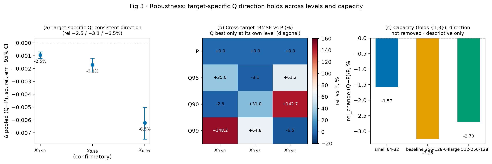
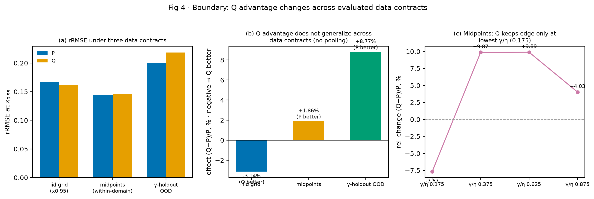

# 面向目标可靠度分位点的三参数 Weibull 神经估计：任务对齐损失的精度收益、作用机制与泛化边界

> 论文初稿（S5A）· 经验研究（IMRaD）· 学科：可靠性工程 × 统计学习
> 状态：`S5A CODEX/MENTOR PRE-REVIEW APPROVED`（2026-08-08；等待用户决定是否进入模拟审稿）
> 作者/单位/基金/CRediT 分工待作者确认（见文末声明）
> 所有实验数值均来自封存 sealed 证据（`artifacts/pq_iid_main/`、`artifacts/pq_s3_*/`、`artifacts/pq_v3/`），
> 本稿不手抄数值；逐项来源见 `16-PQ-引用与完整性审计.md`。

---

## 摘要

三参数 Weibull 分布（形状 $\beta$、尺度 $\eta$、位置 $\gamma$）是可靠性工程中描述寿命与强度数据的标准模型之一，工程上最常关心的是**目标可靠度寿命点** $x_p$——满足可靠度函数 $R(x_p)=p$ 的寿命值（等价于 CDF 的 $1-p$ 分位点）。用神经网络从少量有序样本估计三参数时，训练损失有两种自然选择：**参数精度损失（P）**直接最小化 $\beta,\eta,\gamma$ 的相对误差；**目标分位点损失（Q）**仍输出结构完全相同的三参数，但损失直接以 $x_{0.95}$ 的相对平方误差为目标，梯度经 Weibull 公式传播到三个输出。由于 $x_p$ 对三维参数存在欠定解（近似等分位点曲面），"先把参数估计准、再由参数算分位点"（P）与"直接对准目标分位点"（Q）的优劣无法由定义先验回答。

本文在训练与测试覆盖相同参数组合、仅使用相互独立重复样本的**同分布**受控设计中系统比较 P 与 Q。120 个配对的 P/Q 网络训练（5 折 × 4 样本量 × 3 种子 × 2 损失）显示：Q 在 $x_{0.95}$ 上的 pooled rRMSE 为 0.1611，比 P 的 0.1663 低约 3.1%（$(Q-P)/P=-3.1\%$），模型级配对差 $\hat\Delta=-0.00171$，fold×seed 交叉 95% 置信区间 $[-0.00225,-0.00119]$ 不含 0。在本文测试的样本量范围（$n=7$–20）内，相对改善在较小样本量上较大（$n\in\{7,10,15,20\}$ 相对改善 −3.1%/−4.1%/−2.6%/−2.0%，四档区间均不含 0）；未测试更大样本量，不能外推大样本表现。机制分析（复用同批预测，无重训）给出精确无余项分解恒等式 $x$ 相对误差 $=C_\beta+C_\eta+C_\gamma$：Q 的单个参数误差远大于 P（$\hat\beta/\beta$ 中位数约 6.9 vs 约 1），但三个分量高度相互抵消（精确抵消指数 Q 0.915 vs P 0.352），净剩目标误差低于 P——即**已证的结果空间机制**：Q 的较小净目标误差由较大的参数误差分量相互抵消实现（精确恒等式直接支持），而非单参数更准；**为何 Q-loss 训练形成该补偿解尚未直接检验**（训练动力学原因，未证）。稳健性实验表明方向在 $x_{0.90}/x_{0.99}$ 上成立，且在所测网络容量档（E2 描述性、仅 fold $\{1,3\}$）中方向一致，但存在明确边界：在域内参数中点样本上 Q 的优势未保持（P 反而优 1.86%，区间不含 0），在 gamma 层级留出的 OOD 上 Q 比 P 高 8.77%（P 更优）。因此本文可陈述的是：**在冻结的合同内，Q 获得较低的目标误差并呈现上述代数误差结构**；显式可微仅是本实现能直接反向传播的条件，而非 Q 更优的充分条件；收益不是"恢复完整分布"或"自动泛化"。其适用边界限于本文冻结的参数网格、独立重复样本、网络、优化与损失合同。

**关键词**：三参数 Weibull；可靠度寿命点；神经网络参数估计；任务对齐学习；决策聚焦学习；目标分位点损失

## Abstract

The three-parameter Weibull distribution (shape $\beta$, scale $\eta$, location $\gamma$) is a standard model for lifetime and strength data in reliability engineering, where the quantity of primary interest is the **target reliability lifetime** $x_p$, defined by the survival function $R(x_p)=p$ (equivalently the $(1-p)$-quantile of the CDF). When a neural network estimates the three parameters from small ordered samples, two natural training losses exist: a **parameter-precision loss (P)** that directly minimizes the relative errors of $\beta,\eta,\gamma$, and a **target-quantile loss (Q)** that outputs the identical three parameters but minimizes the relative squared error of $x_{0.95}$, with gradients propagated through the Weibull formula. Because $x_p$ is an underdetermined scalar function of three parameters, the relative performance of "estimate parameters accurately first" (P) versus "align directly to the target quantile" (Q) cannot be settled a priori.

We compare P and Q in a same-distribution controlled design in which training and test cover identical parameter combinations with mutually independent repeated samples. Across 120 paired P/Q fits (5 folds × 4 sample sizes × 3 seeds × 2 losses), Q attains a pooled rRMSE of 0.1611 at $x_{0.95}$, about 3.1% lower than P's 0.1663 ($(Q-P)/P=-3.1\%$), with a model-level paired difference $\hat\Delta=-0.00171$ and a fold×seed crossed 95% CI $[-0.00225,-0.00119]$ excluding zero. Within the tested sample-size range ($n=7$–20), the relative improvement is larger at the smaller sizes (relative improvements −3.1%, −4.1%, −2.6%, −2.0% for $n=7,10,15,20$; all CIs exclude zero); larger sample sizes were not tested, so nothing is claimed beyond this range. A mechanism analysis (reusing the same held-out predictions, no retraining) yields an exact, residual-free decomposition of the relative $x$ error into $C_\beta+C_\eta+C_\gamma$: Q's individual parameter errors are far larger than P's (median $\hat\beta/\beta\approx6.9$ vs ≈1), yet its three components cancel extensively (exact-cancellation index 0.915 vs 0.352), leaving a smaller net target error. This is a **proven result-space mechanism**: Q's smaller net target error is achieved by mutually canceling larger parameter-error components, directly supported by the exact identity — not by more accurate parameters. Why Q-loss training produces this compensating solution is **not directly tested** (a training-dynamics cause). Robustness experiments confirm the direction at $x_{0.90}$ and $x_{0.99}$, and the direction is consistent across the tested network-capacity levels (E2 descriptive, folds $\{1,3\}$ only), but reveal clear boundaries: at within-domain midpoint samples the advantage is not preserved (P is 1.86% better, CI excluding zero), and under gamma-level holdout OOD Q is 8.77% worse than P. Hence what can be stated is: **within the frozen contract, Q attains a lower target error and exhibits the algebraic error structure above**; explicit differentiability is only the condition that enables direct backpropagation in this implementation, not a sufficient condition for Q to be better; the benefit is not full-distribution recovery or automatic generalization. Its boundary of applicability is confined to this study's frozen parameter grid, independent replicate samples, network, optimization, and loss contract.

**Keywords**: three-parameter Weibull; reliability lifetime; neural parameter estimation; task-aligned learning; decision-focused learning; target-quantile loss

---

## 1 引言

Weibull 分布自 Weibull（1951）提出以来，已成为可靠性工程中最广泛使用的寿命/强度模型之一 [1,2,3]。三参数形式 $X\sim W(\beta,\eta,\gamma)$ 的概率密度为
$$
f(x)=\frac{\beta}{\eta}\left(\frac{x-\gamma}{\eta}\right)^{\beta-1}\exp\left[-\left(\frac{x-\gamma}{\eta}\right)^{\beta}\right],\quad x>\gamma,
$$
其中 $\beta>0$ 为形状参数（决定失效机理），$\eta>0$ 为尺度参数，$\gamma$ 为位置（最小寿命）参数。对许多工程问题，最受关注的是**可靠度寿命点** $x_p$：满足可靠度/生存函数
$$
R(x_p)=P(X>x_p)=\exp\left[-\left(\frac{x_p-\gamma}{\eta}\right)^{\beta}\right]=p
$$
的寿命值，即 CDF 的 $1-p$ 分位点。其显式解为
$$
x_p=\gamma+\eta[-\ln p]^{1/\beta}.
$$
注意 $p=0.95$ 是**可靠度水平**（生存概率），$x_{0.95}$ **不是**通常的 CDF $0.95$-分位点（后者应使用 $-\ln(1-p)$）；可靠度/生存函数的定义与寿命点公式以 Weibull（1951）原始分布函数与可靠性专著为依据 [1,2,3,4]。

在工程实践中这类寿命点常以"B 寿命"表述，其角标指**累计失效百分比**：$x_{0.95}$ 对应可靠度 0.95（即累计失效 5%），按常见 B-life 记法写作 **B5**（而非 B95）；它是设计、维修策略与安全评估的直接输入 [2,4]。因此，对 $x_{0.95}$ 的估计精度直接对应工程决策的精度，而不仅是统计推断的中间产物——这正是"目标对齐损失"在本问题中可能具有价值的出发点。

三参数 Weibull 的参数估计已有长期研究（矩估计、极大似然、线性/图解法、贝叶斯方法等，见文献综述 [2,3]），近期发展包括基于统计最小差异原理的方法 [5,6] 与基于反向传播神经网络（BPNN）的小样本估计 [7]。神经网络方法的核心价值在于小样本下无需显式迭代求解，可从数据直接学习从有序样本到三参数的映射。但当网络直接输出三个参数时，存在两类自然监督信号：

- **P（参数精度损失）**：直接最小化 $\beta,\eta,\gamma$ 的相对误差，属于"先把参数估计准"的两阶段思想在神经网络内的直接实现。
- **Q（目标分位点损失）**：网络仍输出完全相同、结构性合法的三参数，但损失直接以 $x_{0.95}$ 的相对平方误差为目标，梯度经 Weibull 公式传播到三个输出。这属于**任务/目标对齐学习**的范畴——训练损失直接对准下游最终标量目标，而非中间参数。

任务对齐学习的理念在运筹学与机器学习交叉领域已有一批研究：Elmachtoub 与 Grigas 提出"Smart Predict-then-Optimize (SPO)"框架——引入 SPO loss（决策损失）与凸代理 SPO+，并在温和条件下证明 **SPO+ 对 SPO loss 的统计一致性**，且在若干特定问题上取得数值改进 [9]；Wilder 等提出决策聚焦学习（decision-focused learning），在组合优化中直接以决策质量训练 [10]；Donti 等展示了在随机优化中通过可微 argmin 直接最小化任务损失（task-based end-to-end learning）[11]。这些工作的共同命题是：**当中间量的预测误差与最终标量目标存在非线性、甚至欠定的关系时，最小化中间量误差未必最小化目标误差**。

把这一命题放回可靠性工程的语境：三参数 Weibull 的经典估计方法（矩估计、极大似然、图解法等）在样本量较大时具有良好的渐近性质 [2,3,4]，但小样本（$n\lesssim 20$）下三参数估计面临众所周知的不稳定问题——位置参数 $\gamma$ 与形状/尺度参数高度相关，似然面平缓，估计对样本异常敏感。在分位点估计的方法学层面，Koenker 与 Bassett 的回归分位数方法 [8] 建立了"直接估计条件分位数而非先估计整体分布"的经典范式；本文的目标可靠度分位点损失（Q）与这一思想只是类比，并非方法学延续。神经网络方法 [7] 正是为这类小样本场景引入的替代路线：它从大量模拟样本中学习"有序样本 → 三参数"的映射，把推断成本前移到训练阶段。作为对照，本文引用的相关神经参数估计实例（如基于 BPNN 的参数估计 [7]）以"以参数准确为目标"的监督信号为主（等价于本文的 P 路线）。本文提出并检验一个更直接的选择：既然下游工程关心的往往是单个可靠度寿命点 $x_p$，为何不让训练损失直接对准这个标量目标（Q 路线）？本文直接检验这一问题。

本文的贡献是把这一命题带进可靠性工程的神经参数估计场景，并用受控实验给出定量回答。研究问题（RQ）为：

> 在训练与测试覆盖相同参数组合、但使用相互独立重复样本的同分布设定下，仅改变训练目标（P vs Q），哪一种能更准确地估计 $x_{0.95}$？

这一问题是**经验问题而非数学必然**：$x_p$ 对三维参数是一个标量函数，不同参数组合可以给出几乎相同的 $x_p$（近似等分位点曲面），神经网络存在欠定解空间。若工程目标只有一个明确分位点，把损失对齐到该目标（Q）可能比追求参数全准（P）更高效；但也可能只是把误差从参数转移到分位点，或收益仅对训练参数网格有效（本文通过边界实验检验其在参数网格之外是否保持）。本文通过**主效应（confirmatory）→ 作用机制（mechanism）→ 稳健性（robustness）→ 边界（boundary）** 的证据层级，给出效应量、机制证据与边界条件。

**不主张（预注册边界）**：本文不主张 Q 的单参数估计准确、Q 对其他分位点/完整分布准确、Q 能恢复完整分布、Q 具有跨参数/跨尺度泛化能力，也不主张"由定义必然 Q 更优"。

---

## 2 方法

### 2.1 设计原则与证据地位

本文采用三层证据结构，贯穿全文：**confirmatory**（主推断，唯一正式区间推断）、**mechanism**（复用 confirmatory 预测的机制分解，直接证据）、**robustness / boundary**（目标水平、网络容量、域内插值、gamma-holdout OOD 的扩展）。三组边界数据合同（同分布网格点、域内中点、gamma-holdout OOD）分属**不同科学问题，禁止池化**成一个 estimand（详见 §6）。

### 2.2 参数空间、样本身份与 Study01 对齐

为保证后续与封存 Study01 研究的横向可比性，本实验在**相同参数网格与样本身份体系**下进行：

| 项 | 值 |
|---|---|
| 形状 $\beta$ | $\{1.5,2.0,2.5,3.0,3.5,4.0,4.5,5.0\}$ |
| 尺度 $\eta$ | 1000（固定） |
| 位置 $\gamma/\eta$ | $\{0.10,0.25,0.50,0.75,1.00\}$，即 $\gamma\in\{100,250,500,750,1000\}$ |
| 样本量 $n$ | $\{7,10,15,20\}$ |
| 每组合重复 | 300（独立重复） |
| 组合数 / 样本总数 | 160 / 48,000 |
| 训练种子 | 42, 2026, 3407 |
| 输入表示 | 升序排序原始有量纲样本 $X_n$，逐位置 StandardScaler 仅由训练行拟合 |
| 名义网络 | MLP($n\to 256\to 128\to 64\to 3$)，ReLU，float64 |

样本生成契约、命名空间与样本 key 与 Study01 Dimensional-RAW 完全一致（`generate_sample(…, seed="study01_nrmc_v1")`），保证每个样本字节可追溯。P/Q 两条路线使用**同一个 PyTorch 训练实现**，除损失函数外全部相同（初始化、数据行、batch 顺序、scaler、checkpoint 选择均逐 fit 配对验证）。

**对齐的意义与边界**：选择与封存 Study01 对齐的参数空间、样本身份与输入表示，是为使本研究与既有小样本神经参数估计工作（包括 BPNN 方法 [7]）在**同一数据合同**上可比，从而把差异归因于损失选择而非数据或网络设置。对齐范围是明确的：参数网格、样本身份、原始排序输入、名义网络、主要训练预算与训练种子**完全相同**；研究标签/损失（P/Q 对照）、拆分方案（本主协议 repeat-stratified vs Study01 gamma/η 留出）与优化实现（PyTorch Adam vs sklearn 轨迹）**有意不同**。因此本文与 Study01 的横向比较仅在共同样本身份**且**指标可比（同为 $x_p$ 可靠度寿命点估计）时进行，不主张优化轨迹或拆分方案等价，也不修改 Study01 的封存结果。

### 2.3 合法参数化

为避免神经输出越出 Weibull 参数支持域，采用共享的 domain-explicit 解码器：
$$
\hat\beta=\mathrm{softplus}(o_1)+\varepsilon,\qquad
\hat\eta=\mathrm{softplus}(o_2)+\varepsilon,\qquad
\hat\gamma=\min(X)\,\big(\delta+(1-2\delta)\,\mathrm{sigmoid}(o_3)\big),
$$
其中 $\varepsilon$ 为小常数、$\delta=10^{-7}$。该解码器**结构性**保证 $0<\hat\gamma<\min(X)$（依赖冻结的正位置域 $\gamma\in[100,1000]$，所有样本满足 $\min(X)>\gamma$）；P/Q 共用同一解码器，因此参数支持域合法性与损失选择无关。

### 2.4 两类训练目标

**P 损失（direct 参数精度）**：
$$
L_P=\operatorname{mean}_i\left[
\left(\frac{\hat\beta_i-\beta_i}{\beta_i}\right)^2+
\left(\frac{\hat\eta_i-\eta_i}{\eta_i}\right)^2+
\left(\frac{\hat\gamma_i-\gamma_i}{\eta_i}\right)^2\right].
$$

**Q 损失（目标分位点相对平方误差，与正式评价指标一致、可微）**：
$$
L_Q=\operatorname{mean}_i\left[
\left(\frac{\hat{x}_{0.95,i}-x_{0.95,i}}{x_{0.95,i}}\right)^2\right],\qquad
\hat{x}_{0.95,i}=\hat\gamma_i+\hat\eta_i[-\ln(0.95)]^{1/\hat\beta_i}.
$$
梯度经 Weibull 公式（含合法化解码器）传播到三个输出。**P 与 Q 的差异仅在于损失函数**；二者输出相同三参数、使用相同解码器、相同网络与训练预算。

### 2.5 网络与训练

- 每样本量 $n$ 独立网络；隐藏层 $256$–$128$–$64$、ReLU、float64；
- 优化器 Adam（学习率 $10^{-3}$、weight decay $10^{-4}$、batch 256）；
- 最大 300 epochs，early stopping patience 20，以验证损失最低 epoch 为 checkpoint；
- `torch.set_num_threads(1)`，CPU 顺序训练，确定性可复现；
- 训练种子 $42,2026,3407$（3 个，用于权重初始化与 batch 顺序；**seed 维度严重欠采样是显式限制**）。

### 2.6 repeat-stratified 5 折拆分（同分布保证）

每个组合的 300 个 repeats 按 `repeat_id % 5` 分配到 5 折（与 seed、route 无关）：

- test：`repeat_id % 5 == fold_idx`（60 repeats/cell）；
- val：`repeat_id % 5 == (fold_idx+1) % 5`（60 repeats/cell）；
- train：其余 3 个余数类（180 repeats/cell）。

性质：每 $(n,\text{fold})$ 模型 train/val/test 为 7200/2400/2400 样本，**每折覆盖该 $n$ 的全部 40 个 $(\beta,\gamma)$ 组合**（同分布）；跨 5 折每个 repeat 恰在某折作 test；scaler 仅在训练行拟合。这与 Study01/旧 r4 的"每 $n$ 内按 $\gamma/\eta$ 水平留出"是**两种不同拆分**——后者保留为 gamma-holdout OOD 边界证据，不作主推断。

### 2.7 Estimand 与推断

**科学目标（超总体式 estimand）**：冻结参数域等权；在给定 180/60/60 训练规模下，对独立重复样本生成**与**训练随机性（权重初始化、batch 顺序、优化器轨迹）的算法性能差：
$$
\Delta^{*}=\frac{1}{4}\sum_n \frac{1}{40}\sum_{c:n(c)=n}\mathbb{E}\big[\theta_Q(c)-\theta_P(c)\big],
$$
其中 $\theta_r(c)$ 为 route-$r$ 网络在 cell $c$ 上对一个独立新鲜 held-out 重复样本的期望相对平方误差。$\Delta^{*}$ 是**算法/过程的性能差距**，不是已实现 fold/seed 网格的性质。

**有限估计（Monte Carlo / CV）**：已实现的 5 folds × 3 seeds 是 $\Delta^{*}$ 的有限估计。模型级配对差值（主推断单元）为
$$
d_{n,f,s}=\frac{1}{2400}\sum_{c:n(c)=n}\sum_{t\in\text{test}(c,f)}\Big(\mathrm{rel\_sq}_Q(c,t)-\mathrm{rel\_sq}_P(c,t)\Big),
$$
每个 held-out 配对样本等权（负值 = Q 更优）；$\hat\Delta=\frac{1}{60}\sum_{n,f,s}d_{n,f,s}$ 为 60 个模型级差值的等权均值。

**加权的正确表述**：在当前完全平衡设计下（每个模型 2400 held-out 样本、每 cell 60 repeats、每 n 等权），$\hat\Delta$ 与 pooled 逐样本平方误差差具有**相同加权**；`rel_change` 与 $\hat\Delta$ 的差别是**函数形式**（rRMSE 比值 vs 平方误差线性差），不是"样本等权 vs 设计单元等权"。两种效应量均显式标注分母，避免口径混淆。

**描述性效应量**（分母显式）：
$$
\mathrm{rel\_change}=\frac{\mathrm{rRMSE}_Q-\mathrm{rRMSE}_P}{\mathrm{rRMSE}_P},
$$
其中 pooled $\mathrm{rRMSE}_r=\sqrt{\frac{1}{144000}\sum \mathrm{rel\_sq}_r}$（144,000 = 60 模型 × 2400 held-out 样本）。两者都报告。

**主推断（Level 1）**：以 60 个模型级差值 $d_{n,f,s}$ 为单元，按 $n$ 分层对 fold 有放回重采样 + 全局对 seed 有放回重采样（fold×seed 交叉 bootstrap），B=200,000，报告 $\hat\Delta$ 的 95% CI。设计单元数 20（4 n × 5 fold），模型级对比数 60（×3 seed），每个模型 2400 held-out 样本。该区间是**设计级经验不确定性近似**（反映"抽到哪一组 fold/seed 实现"的变异），不是超总体区间；随报告附覆盖限制：(a) 训练折重叠（每个 repeat 在 5 折中约 3 折作 train）；(b) 仅 3 seeds，seed 维度严重欠采样；(c) 单元内逐样本 MC 噪声被吸收（设计级只重采样单元均值）。固定模型的逐样本 bootstrap 仅作条件性补充。

**预注册决策规则**：主结论由 $\hat\Delta$ 的 CI 是否含 0 决定方向性；方向一致性（by-n / by-seed / by-region）只作描述性支持；CI 含 0 时记为"未能排除无差异"。

**"超总体"口径的说明**：$\Delta^{*}$ 描述的是一个**算法/过程**层面的性能差距——在冻结训练协议与冻结参数域下，P 与 Q 两种训练目标的期望性能差；它**不是**某个具体 fold/seed 组合的性质，也不是对有限训练网格的抽样推断。已实现网格给出的 $\hat\Delta$ 及其设计级区间，是 $\Delta^{*}$ 的一个有限 Monte Carlo / CV 估计，覆盖限制已在 §2.7 显式列出。这一口径的意义在于：结论可以表述为"在该训练协议下，把损失从 P 换成 Q 平均带来多少 $x_{0.95}$ 误差改进"，而不是"这些特定拟合之间的偶然差异"。

### 2.8 边界实验设计（robustness / boundary）

| 子实验 | 内容 | 新增 fits |
|---|---|---|
| E1 目标可靠度水平 | 目标特异 Q 在 $x_{0.90}$、$x_{0.95}$、$x_{0.99}$ 训练，交叉目标评价（P 与三个 Q 在三个水平评价）；$0.90/0.95/0.99$ 为**可靠度水平** | 120 |
| E2 网络容量 | fold $\{1,3\}$ 上 small `64-32` 与 large `512-256-128` 对比基线 | 96 |
| E3 域内插值 | 训练保持冻结网格；测试为确定性新鲜中点样本（β 中点 7 档、γ/η 中点 4 档、300 repeats、33,600 样本） | 120 |
| E4 OOD | 复用封存 r4/v3 gamma-holdout 结果，**不重训** | 0 |

E3 插值评价中模型输入为 `PerPositionScaler.transform(X_n)`（调用方传入的 (n, fold) scaler），避免把未标准化样本送入标准化训练网络的评测错误（曾产生并撤回的伪结果，见 §4.7 限制 7）。

### 2.9 证据 schema 与完整性

所有证据按冻结 schema 封存，逐样本可复算：

- **逐样本证据**：`artifacts/pq_iid_main/evidence/<fit_id>.npz`（tracked，精确 dtype 键：beta/goe float64、n/rid int32、预测 float32）；fit_id 形如 `n{n}_f{fold}_s{seed}_r{P|Q}`；
- **配对控制**：对每个 $(n,f,s)$，P/Q 两 fit 共享数据行、初始化（`torch.manual_seed(s)`+`Generator(s)`）、batch 顺序、scaler、网络结构与训练预算，逐 fit 断言 `init_param_sha`/`batch_order_sha`/`network_sha`/`scaler_sha`/`train/val/test_rows_sha` 一致（`pairing_report.csv` 输出 all_match）；
- **绑定**：各根 `manifest.json` 绑定完整 git SHA、运行代码 SHA、环境锁、Study01 输入 SHA、样本字节 SHA、config/protocol/analysis SHA；`SHA256SUMS` 仅列 tracked 文件（文本 LF 规范、npz 原始字节），封存工作树与 `git archive` 干净副本 807/807 全验；
- **失败记录**：S1 120 fits + S3 336 fits 全部收敛，0 失败 / 0 支撑违规 / 0 非有限 / 0 非法参数；E3 的 120 个基线重训 fit 与 S1 证据字节一致（确定性复制验证）。

---

## 3 结果

### 3.1 主效应：Q 在 $x_{0.95}$ 上更准（confirmatory，S1）

120 个配对 fits（0 失败 / 0 支撑违规 / 0 非有限 / 0 非法）的结果：

| 量 | 值 |
|---|---|
| pooled P rRMSE | 0.1663 |
| pooled Q rRMSE | 0.1611 |
| rel_change $(Q-P)/P$ | **−3.1%**（负 = Q 更优，主描述） |
| $\hat\Delta$（Q−P，平方误差空间） | **−0.00171** |
| 95% fold×seed 交叉 CI | **[−0.00225, −0.00119]**（不含 0） |

**按样本量 $n$**（CI 全部不含 0，方向全 Q 更优）：

| $n$ | mean_diff (Q−P) | rel $(Q-P)/P$ | 95% CI |
|---|---|---|---|
| 7 | −0.00268 | −3.1% | [−0.00402, −0.00158] |
| 10 | −0.00250 | **−4.1%**（最大） | [−0.00391, −0.00117] |
| 15 | −0.00108 | −2.6% | [−0.00197, −0.00028] |
| 20 | −0.00057 | −2.0% | [−0.00075, −0.00041] |

rRMSE 相对改善（$(Q-P)/P$）**非单调递减**，在 $n=10$ 最大；而平方误差空间的 mean_diff **绝对幅度随 $n$ 增大单调减小**（−0.00268 → −0.00057）。即在本文测试的 $n=7$–20 范围内，任务对齐的相对收益在较小样本量（$n\approx7$–10）上较大；未测试更大样本量，不能外推。

**按参数区域（描述性，不作主推断）**：pooled 的 Q 优势由低 $\beta$、低 $\gamma/\eta$ 区域驱动——低 $\beta$（1.5–3.0）与低 $\gamma/\eta$（0.1–0.25）为 Q 更优（$\beta=1.5$ mean_diff −0.0146、$\gamma/\eta=0.1$ −0.0139）；高 $\beta$（3.5–5.0）与高 $\gamma/\eta$（0.5–1.0）为 P 更优（$\beta=5.0$ +0.00147、$\gamma/\eta=0.5$ +0.00546）。

**按 seed 与 fold（描述性）**：三个训练种子（42/2026/3407）与 5 折的模型级配对差方向全部为 Q 更优（即 $d_{n,f,s}<0$ 对全部 60 个模型级单元成立）。这一跨 seed、跨 fold 的一致性为主效应提供了描述性支持；但需注意 3 个 seed 在训练不确定性维度上严重欠采样，fold 间因训练折重叠也不独立，故不据此声称超总体保证。

**稳健性自检**：S3 E1 对 $x_{0.95}$ 的独立复算（target-specific Q 的 pooled P/Q rRMSE 0.16633/0.16111）与 S1 封存值（0.166326836/0.161111668）在 1e-6 内一致（`s1_sealed_cross_check.match_within_1e6 = true`），确认结果不依赖特定分析管线。

**覆盖限制（协议内显式）**：训练折重叠、仅 3 个训练 seed、设计级 bootstrap 只重采样单元均值（单元内逐样本 MC 噪声被吸收）。

**图 1（Fig 1）主效应。** (a) 按样本量与 pooled 的 P（蓝）/Q（橙）在 $x_{0.95}$ 上的 rRMSE，柱上标注相对变化 $(Q-P)/P$；(b) Q−P 模型级配对差（mean_diff / $\hat\Delta$）与 fold×seed 交叉 95% CI，虚线为 0，负值 = Q 更优。数据来自封存 `summary_iid.json`（confirmatory，S1）。矢量源：`figures/pq-paper/fig1_main_effect.pdf`。

### 3.2 机制：Q 通过参数误差沿目标函数相互抵消（mechanism，S2）

S2 复用 S1 全部 held-out 预测（144,000 行/路线），对每条预测做逐样本机制分解，**未重训任何模型**。

**精确无余项分解（恒等式，直接证据）**。定义 $t(\beta)=a^{1/\beta}$（$a=-\ln p$）、$x_p=\gamma+\eta\,t(\beta)$，令
$$
C_\gamma=\frac{\hat\gamma-\gamma}{x},\qquad
C_\eta=\tfrac12(\hat\eta-\eta)\frac{t_0+t_1}{x},\qquad
C_\beta=\tfrac12(\eta+\hat\eta)\frac{t_1-t_0}{x},
$$
则逐行**精确**成立（无余项，恒等式）：
$$
\underbrace{\frac{\hat x-x}{x}}_{\text{actual}}=C_\beta+C_\eta+C_\gamma,\qquad \text{残差}\sim 10^{-7}.
$$
精确抵消指数 $\mathrm{cancel\_exact}=\frac{|C_\beta|+|C_\eta|+|C_\gamma|-|C_\beta+C_\eta+C_\gamma|}{|C_\beta|+|C_\eta|+|C_\gamma|}$ 度量抵消程度。

**核心机制事实**：

| 量 | P | Q |
|---|---|---|
| rms_actual（交叉校验 == 封存 rRMSE） | 0.166327 | 0.161112 |
| 精确分量 RMS $|C_\beta|,|C_\eta|,|C_\gamma|$ | 0.11086 / 0.00954 / 0.14163 | 0.49085 / 0.81898 / 0.42282 |
| **mean_cancel_exact** | 0.351835 | **0.914911** |
| 参数误差模长 RMS $u_{\text{norm}}$ | 0.233753 | 9.131008 |
| 精确恒等式 max 残差 | 1.84e-7 | 1.73e-7 |
| 解码器边界行 | 0 | 0 |

Q 的单个参数误差远大于 P：$\hat\beta/\beta$ 中位数 Q 约 6.9 vs P 约 1（$u_{\text{beta}}$ 中位 +5.91；P(|$u_\beta$|>1)=89.4% vs 0.22%），$\hat\eta/\eta$ 中位约 0.06、$\hat\gamma$ 略高——Q 的系统性远离真值，但组合后恰好维持 $x_{0.95}\approx$ 真值。三个精确分量 RMS（0.49 / 0.82 / 0.42）远大于 P（0.11 / 0.0095 / 0.14），却高度相互抵消（`cancel_exact` Q 0.915 vs P 0.352），净剩 rms_actual 0.1611。**这是已证的结果空间机制（algebraic result-space mechanism）**：在保存的逐样本预测中，Q 的较小净目标误差由较大的参数误差分量相互抵消实现（精确恒等式直接支持），而非单参数更准；**为何 Q-loss 训练形成这种补偿解尚未直接检验**（训练动力学原因，未证）。

**目标敏感度与区域异质性（描述性关联）**。目标函数对参数的真值点敏感度范数 $\|s\|$ 只依赖真参数，随 $\beta$、$\gamma/\eta$ **单调下降**（$\beta=1.5$: 2.165 → $\beta=5$: 1.222；$\gamma/\eta=0.1$: 2.593 → $\gamma/\eta=1$: 0.825），且与区域 (Q−P) 实际误差差**负相关**（$\beta$ −0.952 / $\gamma/\eta$ −0.872）。即**高敏感度区域（低 $\beta$、低 $\gamma/\eta$）对应更大的 Q 相对收益，低敏感度区域方向可转为 P 较优**；造成这种区域差异的原因未由本实验识别。机制 `delta_rms_actual` 与封存 S1 的符号翻转复现 17/17 区域 bin（一致性检验）。注意 $\|s\|$ 依赖 P 损失继承的归一化参数坐标，且区域关联基于少量 bin（8 β + 5 γ/η），为探索性关联，**相关 ≠ 因果**。

代表性区域行的机制量（`mechanism_by_region.csv`）：

| 区域 | P rms_actual | Q rms_actual | Q−P | P cancel_exact | Q cancel_exact | $\|s\|$ |
|---|---|---|---|---|---|---|
| $\beta=1.5$ | 0.2816 | 0.2543 | −0.0273 | 0.3808 | 0.9002 | 2.165 |
| $\beta=5.0$ | 0.1030 | 0.1099 | +0.0069 | 0.3937 | 0.9237 | 1.222 |
| $\gamma/\eta=0.1$ | 0.2634 | 0.2354 | −0.0280 | 0.4046 | 0.9409 | 2.593 |
| $\gamma/\eta=1.0$ | 0.0761 | 0.0823 | +0.0062 | 0.3025 | 0.9104 | 0.825 |
| $n=7$ | 0.2097 | 0.2032 | −0.0065 | 0.3452 | 0.8737 | 1.526 |
| $n=20$ | 0.1215 | 0.1191 | −0.0024 | 0.3544 | 0.9405 | 1.526 |

一个重要的已测事实：**无论 Q 赢还是输的区域，Q 的精确抵消指数都高（0.87–0.94）且明显高于 P（0.30–0.40）**——Q 在所有区域都靠大参数补偿维持 $x_{0.95}$；区域胜负不是"抵消失效"，而是精确补偿后的净残差相对 P 的高低，后者与目标敏感度 $\|s\|$ 相关联。

**设计级配对区间（B=20,000，descriptive secondary support）**：对机制量逐 $(n,\text{fold},\text{seed})$ cell 的 Q−P 配对差值与 95% CI，方向与 pooled 完全一致——rms_actual 差 −0.0049（[−0.0064, −0.0035]，不含 0）、mean_cancel_exact 差 +0.563（[+0.556, +0.570]，不含 0）、rms_u_norm 差 +8.897（不含 0）；`mean_s_norm` 差恒 0（由构造，只依赖真参数）。该区间是设计级描述性支撑，不是主推断（主推断由 S1 封存）。

**已排除的朴素解释**：一阶投影更小（否，Q 的 rms_proj 6.37 ≫ P 0.166）；仅凭一阶分量抵消指数（否，一阶 cancel 反而 Q 略低 0.342 vs 0.357，需精确恒等式分解）；单纯垂直性（否）。`corr(proj,rem)≈−0.9995` 在 `rms(proj)≫rms(actual)` 时是**代数上近乎被强制**的诊断，不作为 Q 优势的原因。

**图 2（Fig 2）机制。** (a) 精确分解分量 $|C_\beta|,|C_\eta|,|C_\gamma|$ 与 $|actual|$ 的 RMS（log 轴）：Q 的大分量抵消为小的净量；(b) 区域目标敏感度 $\|s\|$ 与 Δrms actual（Q−P）的关系（高敏感度区 Q 获益；探索性关联）；(c) `cancel_exact` 按目标水平 $x_{0.90}/x_{0.95}/x_{0.99}$（恒等式 $|C_1|+|C_2|+|C_3|$ vs $|\Sigma C|$）。数据来自封存 `mechanism_summary.json`、`sensitivity_by_target.json`、`mechanism_exact_by_target.json`（mechanism，S2+S3）。矢量源：`figures/pq-paper/fig2_mechanism.pdf`。

### 3.3 稳健性：方向在目标水平上成立、在所测容量档中一致（robustness，S3 E1/E2）

**目标可靠度水平（E1）**。目标特异 Q 在全部三水平优于 P，95% CI 均不含 0：

| 水平 | P rRMSE | Q rRMSE | rel_change | 95% CI（$\hat\Delta$） |
|---|---|---|---|---|
| $x_{0.90}$ | 0.13834 | 0.13490 (Q90) | −2.49% | [−0.00121, −0.00069] |
| $x_{0.95}$ | 0.16633 | 0.16111 (Q95) | **−3.14%**（与 S1 复算 1e-6 一致） | [−0.00225, −0.00119] |
| $x_{0.99}$ | 0.22239 | 0.20792 (Q99) | **−6.50%** | [−0.00749, −0.00502] |

收益随目标更极端而增大（−2.5% → −3.1% → −6.5%）；57–58/60 cell 方向 Q 更优。**交叉目标矩阵（窄带性质）**：Q 对齐是**窄带**的——Q90 在 $x_{0.99}$ 劣于 P 142.7%、Q99 在 $x_{0.90}$ 劣于 P 148.2%、Q95 在 $x_{0.90}/x_{0.99}$ 分别 +35.0%/+61.2%；P 跨水平最稳健（随 $p$ 增大误差单调上升）。完整离目标退化（off-target minus diagonal）：Q90→$x_{0.95}$ +61.5%、Q90→$x_{0.99}$ +300.2%；Q95→$x_{0.90}$ +15.9%、Q95→$x_{0.99}$ +122.6%；Q99→$x_{0.90}$ +65.2%、Q99→$x_{0.95}$ +31.8%。**任务对齐收益与跨水平稳健性是一对权衡**：目标特异 Q 只在自身水平获得明确收益，离目标越远退化越严重。

**网络容量（E2，描述性）**。固定 fold $\{1,3\}$：small `64-32` **−1.57%**、baseline `256-128-64` **−3.25%**、large `512-256-128` **−2.70%**。方向不随容量改变，不绑定单一基线容量。E2 仅有限 fold，无正式显著性主张。

**图 3（Fig 3）稳健性。** (a) 三可靠度水平的设计级 $\hat\Delta$ 与 95% CI（$x_{0.95}$ 标注 confirmatory）；(b) 交叉目标矩阵（相对 P 的 rRMSE %，仅对角线 = 目标特异 Q 为负/最优，0 居中色标）；(c) 网络容量效应（fold $\{1,3\}$，descriptive）。数据来自封存 `target_summary.json`、`cross_target_matrix.json`、`capacity_summary.json`（robustness，S3）。矢量源：`figures/pq-paper/fig3_robustness.pdf`。

### 3.4 边界：优势在何处不成立（boundary，S3 E3 + E4）

**域内网格点之间的新鲜中点样本（E3）**。在冻结网格各参数档之间取新鲜中点（β ∈ {1.75…4.75}、γ/η ∈ {0.175…0.875}，η=1000，300 repeats），重训 P/Q（120 fits）并在 $x_{0.95}$ 评价：

- 中点 pooled rRMSE **P 0.14349 / Q 0.14617**——与域内网格点（约 0.16）同量级，**0/504,000 行** γ 解码器边界；即在所测联合中点上 P/Q 绝对误差与网格测试同量级且未出现解码边界，**不能据此外推一般插值能力**；
- **但 Q 在网格点的优势不转移到中点**：中点处 **P 反而优 1.86%**（$\hat\Delta$ +0.000775，95% CI [+0.000539, +0.000985] **不含 0**）；
- 仅最低 β=1.75（−1.73%）、最低 γ/η=0.175（−7.67%）中点 Q 仍优；β≥2.25 全部 P 更优（+0.69%…+8.62%），γ/η∈{0.375,0.625,0.875} 全部 P 更优（+9.87/+9.89/+4.03）。

表述纪律：对中点只写"**所测联合中点上优势未保持**"，不归因为"参数网格过拟合"或笼统的"网格特异性"，也不由 β/γ/η 边际结果声称二维交互因果。

**gamma 层级留出 OOD（E4，复用封存 r4/v3）**。整层 gamma 留出的 OOD 上，**Q 比 P 高 8.77%（(Q−P)/P，P 更优）**（pooled P 0.2008 / Q 0.2184；设计级 mean_diff +0.00738，95% CI [+0.00223, +0.01268] 不含 0）。Q 在 gamma-holdout 上的优势**反转**；按 $n$ 方向 4/4 一致 P 更优。注：历史口径 (Q−P)/Q = +8.07% 是"P 相对 Q 的误差降低"，分母不同，本稿统一用 $(Q-P)/P$。

**边界综合**：

| 数据合同 | 测试样本与训练的关系 | 结论 |
|---|---|---|
| iid 网格（$x_{0.95}$） | 同参数组合、独立重复样本 | Q 优 −3.1%（confirmatory） |
| 域内中点（E3） | 网格点之间的新鲜参数中点 | P 优 +1.86%（Q 优势未保持） |
| gamma-holdout OOD（E4） | 训练未见 gamma 层级 | Q 高 P +8.77%（(Q−P)/P，P 更优） |

**图 4（Fig 4）边界。** 三个数据合同（iid 网格 / 域内中点 / gamma-holdout OOD）的 rRMSE (a) 与独立效应 $(Q-P)/P$ (b)（禁池化，负 = Q better），及中点按 γ/η 分档的效应 (c)（仅最低档 γ/η=0.175 Q 仍优）。数据来自封存 `summary_iid.json`、`interp_summary.json`、`summary_v3.json`（boundary，S3 E3+E4）。矢量源：`figures/pq-paper/fig4_boundary.pdf`。

---

## 4 讨论

### 4.1 为什么目标对齐可能更准

本文的机制证据给出一个清晰答案，但需分两层表述：**已证的结果空间机制（algebraic result-space mechanism）**——在保存的逐样本预测中，Q 更准不是单参数更准，而是较大的参数误差分量沿目标函数相互抵消，得到较小的净目标误差（精确无余项分解恒等式直接支持）；**未证的训练动力学原因**——为何 Q-loss 训练会形成这种补偿解尚未直接检验。精确无余项分解恒等式 $x$ 相对误差 $=C_\beta+C_\eta+C_\gamma$ 在逐行成立（残差约 $10^{-7}$），Q 的三个分量 RMS（0.49/0.82/0.42）远大于 P（0.11/0.0095/0.14），但 `cancel_exact` 达 0.915（vs P 0.352）。这意味着 Q 在三维参数空间中沿"近似等分位点曲面"大幅移动参数，而这些移动在目标点几乎完全抵消，净剩的目标误差比 P 的小参数误差路线更低。

为什么损失选择能影响可达解？这里有四个相互关联的**合理解释**。它们把观察到的代数路径/误差结构与优化几何联系起来，但本文未直接检验优化过程如何形成该解，因此按待检验机制表述，不写成已证因果：

1. **有限样本**：当 $n$ 很小（7–20）时，P 对参数的估计本身充满噪声；P 的最小化目标（参数相对误差）与最终目标（$x_p$ 相对误差）之间隔着非线性 Weibull 公式，参数误差经公式放大或抵消的方式取决于真值点敏感度。在小样本下，P 的"参数误差小"并不自动转化为"目标误差小"。
2. **欠定/不可辨识**：$x_p$ 是三维参数到一维目标的标量函数，解不唯一（近似等分位点曲面）。P 试图把参数估计到真值附近，只使用了目标约束所允许的自由度的一部分；Q 则只受目标误差约束，可在等分位点流形上自由移动参数。这对应观察到的代数路径/误差结构：Q 通过大而相互补偿的参数变化维持 $x_{0.95}$（精确分解的直接证据）；将其解读为"Q 利用参数多余自由度换取目标抵消"是合理解释，本文未检验优化过程为何形成该解。
3. **优化与容量**：神经网络的训练是受限优化（有限容量、Adam 轨迹、early stopping），损失曲面形状决定可达解集。一个合理解释是：Q 的损失由目标误差直接定义，其梯度把训练导向目标误差更小的参数区；在容量约束（网络表达能力有限）下，目标对齐可能更有效地利用有限表达能力。这属于待检验的优化几何解释，本文未直接观测可达解集。定性上，它与决策聚焦学习文献的观察一致——训练损失与最终目标错配时，中间量误差不是目标质量的良好代理 [9,10,11]。
4. **参数化约束**：合法化解码器结构性限制 $\hat\gamma<\min(X)$，缩小了参数可达域；在该受限域内，P 与 Q 的可达解集不同。目标对齐更可能落在目标误差更小的区域是合理解释，本文未直接检验。

### 4.2 为什么不是数学必然

如果"目标对齐"总能更优，那么 Q 应在所有设定下优于 P。实验明确否定了这一点，证据可归纳为：

1. **目标对齐收益是"窄带"的**：目标特异 Q 只在自身水平占优，跨水平评价严重退化（Q90 在 $x_{0.99}$ +142.7%、Q99 在 $x_{0.90}$ +148.2%、Q95 离自身水平 +35%/+61%）。这与"Q 学到的是对该目标点恰好成立的参数补偿，而非目标函数的通用结构"的解释一致（待检验机制）。
2. **不自动泛化到所测联合中点**：在冻结网格各参数档之间的新鲜中点样本上，Q 优势未保持（P 反而优 1.86%，区间不含 0）。这些中点属于**不同参数支持的数据合同**（within-range interpolation shift），与网格点合同不同；其中点反转的成因（参数区域、数据合同或其他因素）本文**未区分**。**目标对齐不保证分布恢复**。
3. **OOD 反转**：gamma-holdout 上 Q 比 P 高 8.77%。一个合理解释是参数域外推时 Q 的大参数补偿缺乏约束、误差沿敏感方向放大，反而不如 P 的保守小误差路线；本文未直接检验该机制。**目标对齐不保证自动泛化**。
4. **敏感度方向的探索性关联**：Q 的收益集中在目标敏感度 $\|s\|$ 高的区域（低 β、低 γ/η），低敏感度区域方向可转为 P 较优（探索性关联，相关≠因果，基于少量 bin）。任务对齐的收益**不是由定义保证**，而是经验上可测、区域上异质的效果；区域敏感度与收益异质性相关，但本实验未证明它是必要/充分条件，造成区域差异的原因未由本实验识别。
5. **数学上没有"目标损失 ⊆ 参数损失"的包含关系**：存在误差配置使目标损失小但参数损失大（Q 正是如此），也存在使参数损失小但目标损失大的配置。二者在有限样本、受限优化下没有支配关系；本文给出的是**实测效应量与边界**，而非一般性定理。

综上，**任务对齐可能更准**（一个合理解释是它把有限样本与表达预算花在最终目标上），**但不是数学必然**（因为对齐收益窄带、不泛化、与敏感度结构的关联仅属探索性，且与参数准确率是一对权衡）。二者结合构成了本文的核心结论：**在本文冻结的合同内，Q 获得较低的目标误差并呈现上述代数误差结构；显式可微仅是本实现能直接反向传播的条件，不是 Q 更优的充分条件**，适用域限于本文冻结的参数网格、独立重复样本、网络、优化与损失合同。

### 4.3 关于效应量与"3.1%"的解读边界

需要强调，−3.1% 是**rRMSE 的相对改善**（pooled），其大小受目标误差本身的水平调节：$x_{0.95}$ 的 pooled rRMSE 约为 0.16，即约 16% 的典型相对误差，Q 使其降低约 3.1%（相对值），对应平方误差空间的设计级配对差 $\hat\Delta=-0.00171$。按 n 的相对改善峰值出现在 $n=10$（−4.1%）而非 $n=7$（−3.1%），而 mean_diff 绝对幅度随 n 单调减小——两种量的差异源于函数形式（rRMSE 比值 vs 平方误差线性差），并非加权方式的差异；两种效应量均以显式分母报告。效应的工程显著性取决于目标误差的容差要求；本文的贡献是给出经设计级推断确认的方向与量级，而非声称固定百分比的"工程改进"。

### 4.4 与既有任务对齐/决策聚焦学习的联系与差异

本文结果与决策聚焦学习文献的定性结论一致——训练损失与最终目标错配时，中间量误差不是目标质量的良好代理 [9,10,11]——但在三个层面与之不同，这也正是本文的经验贡献：

1. **场景差异**：既有工作主要面向组合优化/随机规划（预测进优化器、目标为决策代价），目标函数常需连续松弛或可微 argmin 才能传梯度 [10,11]；本文面向可靠性寿命点估计，目标 $x_p=\gamma+\eta[-\ln p]^{1/\beta}$ 本身是**显式可微**的 Weibull 公式，无需近似。因此本文提供了一个"目标显式可微、可直接对齐"的最小场景，隔离出"目标对齐"这一个变量对估计精度的影响。
2. **受控对照**：本文用 P/Q 两个损失、其余完全相同的配对训练，直接对比"参数精度"与"目标精度"两种监督信号；这与决策聚焦学习文献中"预测损失 vs 决策损失"的对比是同一逻辑，但落在参数估计任务上，且提供逐样本配对差值与设计级区间。
3. **边界证据**：这些代表性研究 [9,10,11] 报告了决策聚焦在各自问题上的正向结果；本文进一步刻画了**何时不好**——域内中点与 gamma-holdout OOD 上的反转表明，目标对齐的收益不对分布恢复/跨参数泛化承诺任何保证，这在迁移到新数据合同时是重要的警示。

### 4.5 目标对齐何时可能失败：三个可检验的条件

本文的边界证据提示，目标对齐收益的成立依赖几个**可检验**的条件（其是否迁移到其他设定须实测），理解它们有助于判断任务对齐在新场景是否值得尝试：

1. **目标需显式可微（实现条件）**。本文 Q 的直接反向传播实现要求目标可微（梯度经公式传播）；区域敏感度与收益异质性相关，但本实验未证明它是必要/充分条件。在所测区域中，$\|s\|$ 较低处（本文高 $\beta$、高 $\gamma/\eta$ 区域）方向可转为 P 较优（探索性关联，原因未由本实验识别）。若目标公式不可微（如阶跃、离散决策），则不能直接对齐，需代理损失或连续松弛 [10,11]。
2. **训练/评价覆盖相同参数网格（本文冻结的网格合同）**。本文 confirmatory 收益只在冻结的参数网格、独立重复样本、网络、优化与损失合同内成立；在域内中点（E3，属不同参数支持的数据合同）与未见 gamma 层级（E4）的测试上，Q 的优势未保持。对需要跨参数外推的应用，P 的小误差路线更稳健。
3. **单一明确目标、允许目标特异**。Q 是窄带对齐：换目标须重训，交叉目标严重退化。当需要同时报告多个可靠度水平或完整分布时，P 的跨水平单调性更实用。

### 4.6 对实践的含义

- **适用场景**：在本文冻结的参数网格、独立重复样本、网络、优化与损失合同内，当工程目标明确为估计某个可靠度寿命点 $x_p$（$p$ 固定、不要求全分布/跨参数泛化）时，用目标对齐损失 Q 代替参数精度损失 P，可获得约 3% 的 rRMSE 收益，在本文测试的较小样本量（$n\approx7$–10）上相对收益更大；代价是目标特异（换目标须重训，交叉目标表现差）。收益是否迁移到其他参数网格/数据合同须实测，本文未给出跨合同保证。
- **不建议 Q 的场景**：需要完整分布/多分位点同时准确，或必须外推到训练未见参数层级时，P 更稳健（跨水平单调、OOD 更优）。
- **机制启示**：对"先预测中间量、再算目标"的管线，把损失直接对齐最终标量目标是一般性可试的方向（与决策聚焦学习一致 [9,10,11]），但**收益边界必须随数据合同实测**——本研究表明同分布收益不会自动扩展到域外。

### 4.7 限制

1. **训练随机性**：仅 3 个训练 seed（seed 维度严重欠采样）；主推断设计级 bootstrap 只重采样单元均值，单元内逐样本 MC 噪声被吸收。
2. **训练折重叠**：repeat-stratified 下每个 repeat 在 5 折的 3 折训练，fold 间不独立。
3. **机制为观察性**：精确分解是恒等式（直接证据）但不证明因果；区域 $\|s\|$ 关联是少数 bin（8 β、5 γ/η）的探索性描述；`corr(proj,rem)≈−1` 是代数近乎强制，不能作为原因。
4. **优化几何为合理解释**：补偿沿目标函数的代数路径是可检验的合理解释，但本文未直接观测优化过程如何形成该解；域内中点反转的成因（参数区域、数据合同或其他因素）本实验**未区分**，不得写成已证因果。
5. **$\|s\|$ 的坐标依赖**：目标敏感度范数依赖 P 损失继承的归一化参数坐标；对称精确分解是精确但非唯一的分配方式。
6. **E2 容量为描述性**：仅 fold $\{1,3\}$，无正式显著性主张。
7. **边界未测**：未测真实数据、删失/截断、污染、跨尺度迁移、网格外更远参数区域。
8. **E3 伪灾难已撤回**：初版 E3 曾因未应用调用方 scaler 得到伪结果；已修复并仅重跑 E3，伪结果仅作已撤回的修订记录保留，不进入任何结论。
9. **旧叙述清理**：旧 log-gap P 合同表述已删除/改写；$x_p$ 一律按"可靠度寿命点"定义，不用 CDF $p$-分位点表述。

---

## 5 结论

在同分布受控设计中，用目标可靠度寿命点损失（Q）训练的三参数 Weibull 神经网络在 $x_{0.95}$ 上的估计精度比参数精度损失（P）高约 3.1%（pooled rRMSE 0.1611 vs 0.1663；模型级配对差 $\hat\Delta=-0.00171$，fold×seed 交叉 95% CI [−0.00225, −0.00119] 不含 0），在本文测试的样本量范围（$n=7$–20）内，相对收益在较小样本量（$n\approx7$–10）上较大（未测试更大样本量）。该收益的机制分两层：**已证的结果空间机制**——在保存的逐样本预测中，Q 的较小净目标误差由较大的参数误差分量相互抵消实现（精确无余项分解恒等式成立，Q 的精确抵消指数 0.915 vs P 0.352，而单参数误差远大于 P），任务对齐牺牲参数精度换取目标精度；**未证的训练动力学原因**——为何 Q-loss 训练形成该补偿解尚未直接检验。该方向在目标可靠度水平上成立，且在所测网络容量档（E2 描述性、仅 fold $\{1,3\}$）中方向一致，但**有明确边界**：域内中点优势未保持（P 优 1.86%），gamma-holdout OOD 反转（Q 高 P 8.77%）。因此，本文可陈述的是：**在冻结的合同内，Q 获得较低的目标误差并呈现上述代数误差结构（任务对齐在显式可微目标上的可测收益）**，显式可微仅是本实现能直接反向传播的条件而非 Q 更优的充分条件；收益不是恢复完整分布或自动泛化，适用边界限于本文冻结的参数网格、独立重复样本、网络、优化与损失合同。对"先预测中间量、再算目标"的工程管线，把损失直接对齐最终标量目标是一个可试的方向，但收益与边界必须随数据合同实测。

---

## 数据与代码可得性

所有正式实验的代码、配置与封存证据位于研究仓库 `Study/02-study-NN参数估计与分位点目标研究/`。协议配置：`configs/pq-iid-protocol-v1.json`（同分布主协议）、`configs/pq-s3-boundary-v1.json`（S3 边界）、`configs/pq-environment-v2.json`（环境锁，Python 3.11.9 / torch 2.12.0+cpu / numpy 2.4.6）。逐样本压缩证据 `artifacts/pq_iid_main/evidence/*.npz` 与 fit 元数据 tracked，分析产物（`summary_iid.json`、`mechanism_summary.json`、`target_summary.json`、`interp_summary.json`、`summary_v3.json` 等）绑定 `manifest.json`（完整 git SHA、运行代码 SHA、环境锁、Study01 输入 SHA、样本字节 SHA）与 `SHA256SUMS`（807/807 全验）。论文图表由 `code/study02pq/paper_figures.py` 只读 sealed 证据确定性生成（`--root . --out figures/pq-paper`），禁止手抄数值。样本生成契约与 Study01 共享（`generate_sample(…, seed="study01_nrmc_v1")`），横向可比。

## 伦理声明

本研究为纯仿真数值实验，不涉及人类/动物受试者、个人数据或敏感信息，无伦理审批需求。

## 利益冲突

作者声明不存在与本工作相关的利益冲突。

## 基金

[待作者确认：基金项目名称与编号]

## 作者贡献（CRediT）

[待作者确认：各作者 CRediT 角色分工]

## AI 使用披露

本研究的实验设计、协议冻结、代码实现、证据封存与结果分析由自动化协作流程（Claude Code 执行 + Codex 独立审核）辅助完成；初稿的文献检索、数值核验与初稿组织借助 AI 工具。作者对全部科学内容、数据与结论负责。AI 的具体使用与最小失败模式检查见 `16-PQ-引用与完整性审计.md`。

## 参考文献

[1] Weibull, W. (1951). A Statistical Distribution Function of Wide Applicability. *Journal of Applied Mechanics*, 18(3), 293–297. https://doi.org/10.1115/1.4010337

[2] Rinne, H. (2008). *The Weibull Distribution: A Handbook*. Chapman & Hall/CRC Press. https://doi.org/10.1201/9781420087444

[3] Murthy, D.N.P., Xie, M., & Jiang, R. (2004). *Weibull Models*. Wiley-Interscience. ISBN 0-471-36092-9

[4] Meeker, W.Q., & Escobar, L.A. (1998). *Statistical Methods for Reliability Data*. Wiley. ISBN 0-471-14328-6

[5] Xie, L., Wu, N., & Yang, X. (2023). A Minimum Discrepancy Method for Weibull Distribution Parameter Estimation. *International Journal of Structural Stability and Dynamics*, 23(8), 2350085. https://doi.org/10.1142/S0219455423500852

[6] 谢里阳, 朱文慧, 吴宁祥, 杨小玉. (2025). 基于统计最小差异原理的 Weibull 分布参数估计方法. *东北大学学报（自然科学版）*, 46(7), 108–112. https://doi.org/10.12068/j.issn.1005-3026.2025.20240194

[7] Yang, X., Xie, L., Chen, J., Zhao, B., & Wang, K. (2025). Estimation of Weibull distribution using the back-propagation neural network for fatigue failure data. *Probabilistic Engineering Mechanics*, 82, 103828. https://doi.org/10.1016/j.probengmech.2025.103828

[8] Koenker, R., & Bassett, G. (1978). Regression Quantiles. *Econometrica*, 46(1), 33–50. https://doi.org/10.2307/1913643

[9] Elmachtoub, A.N., & Grigas, P. (2022). Smart "Predict, then Optimize". *Management Science*, 68(1), 9–26. https://doi.org/10.1287/mnsc.2020.3922

[10] Wilder, B., Dilkina, B., & Tambe, M. (2019). Melding the Data-Decisions Pipeline: Decision-Focused Learning for Combinatorial Optimization. *Proceedings of the AAAI Conference on Artificial Intelligence*, 33(01), 1658–1665. https://doi.org/10.1609/aaai.v33i01.33011658

[11] Donti, P.L., Amos, B., & Kolter, J.Z. (2017). Task-based End-to-end Model Learning in Stochastic Optimization. *Advances in Neural Information Processing Systems*, 30, 5484–5494. arXiv:1703.04529

---

*S5A Codex/Mentor 预审已 APPROVE（2026-08-08）；当前等待用户决定是否进入模拟审稿。作者/单位/基金/CRediT 仍待作者确认，本文未投稿。*
