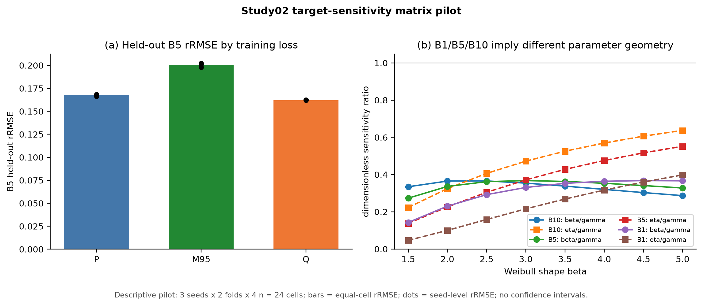

# B5 目标敏感度矩阵最小实验报告

> 合同：`pq-target-matrix-pilot-v1`
> 状态：`COMPLETE / NOT PAPER EVIDENCE`
> 训练实现：`c8cb1f97`；24/24 fits 完成，0 非有限，0 支持域违规。
> 本报告不修改论文；是否准入由用户决定。

## 1. 针对什么问题

现有 Study02 发现，直接优化 B5 寿命的 Q 比等权参数损失 P 的 B5 rRMSE 低约 3%。本实验检验：
如果不直接使用 B5 误差，而是把 B5 对三个参数的解析敏感度写成完整矩阵

\[
W_{B5}(\theta)=s_{B5}(\theta)s_{B5}(\theta)^T,
\qquad L_M=u^TW_{B5}u=(s_{B5}^Tu)^2,
\]

这个“目标感知参数损失”能否比等权 P 更好，并逼近直接 Q？矩阵含全部交叉项，但对单一标量
目标始终是秩一矩阵，不是满秩参数度量。

## 2. 怎样实验

- 参数网格、样本、网络、初始化、batch、拆分、scaler、合法解码、优化器和训练预算继承冻结
  `iid-v1` 合同。
- 新训练只包括 3 seeds × 2 folds × 4 个 n = 24 个 `M95` 模型。
- 相同24个模型单元的 P 和 Q 直接复用封存证据，不重训。
- 每个单元先对 held-out repeats 求 B5 相对平方误差均值，再对24单元等权，最后开方得到 rRMSE。
- 这是机制 pilot，不作 bootstrap CI 或显著性主张。

训练总耗时 1163 秒，中位每 fit 50.0 秒。全部模型收敛；P/M/Q 的初始化、batch、网络、scaler、
训练/验证/测试行和样本字节 SHA 全匹配。96个复用源文件与新24组证据均通过 SHA、finite 和支持域审计。

## 3. 得到什么结果

| 训练损失 | B5 rRMSE | 相对 P | 24单元中优于P |
|---|---:|---:|---:|
| P_equal | 0.167623 | — | — |
| P_matrix_truth（M95） | 0.200492 | **变差19.61%** | **0/24** |
| Q_param（Q95，仍输出三参数） | 0.162182 | 改善3.25% | 23/24 |

M95 相对 Q 变差 23.62%。它在3个seed、2个fold和4个样本量层上都更差；不是某一个随机种子或
样本量造成的反转。

更关键的机制诊断是：

| held-out 诊断 | P | M95 | Q |
|---|---:|---:|---:|
| 等权参数损失 | 0.0545 | 1.0392 | 83.9350 |
| 真值点局部矩阵损失 | 0.0279 | **0.0182** | 40.9309 |
| 真实 B5 MSE | 0.0281 | **0.0402** | 0.0263 |

M95 确实把自己训练的局部矩阵损失降得比 P 低35%，但真实 B5 MSE 反而比 P 高43%；同时它的
等权参数误差约为 P 的19.1倍。这说明失败不是代码没有执行矩阵损失，而是局部矩阵目标本身允许了
大量参数漂移。

解析网格还显示，B10、B5、B1 的敏感度方向和幅度不同；越到高可靠度 B1，位置参数相对作用更强，
尺度方向相对位置方向更弱。因此一套固定矩阵不能精确复现 B1/B5/B10 各自不同的局部敏感度矩阵；
这不排除某种固定权重在特定经验分布上近似有效。

## 4. 说明什么，不能说明什么

在本冻结参数域、网络、训练预算和24个配对单元内，结果直接证明：**真值点静态秩一矩阵不是 Q
的充分替代。** M95 虽然降低了自己的局部代理
损失，却没有降低真实 B5 误差。其结构同时包含两个可能来源：秩一矩阵留下二维零空间；Weibull 的
B5 曲面具有曲率，离开真值后局部线性抵消不再等于真实非线性寿命抵消。当前实验与二者共同造成
差距的解释一致，但没有分别识别零空间和曲率各自的贡献。

直接 Q 每一步都在当前预测位置计算真实 B5 误差和梯度，而真值点矩阵固定使用局部线性化；这一差异
与当前结果相容，但本 pilot 不把它单独确认为失败原因。若构造一个完全动态且不切断矩阵导数的
“精确矩阵”，它在数学上就是 Q 的恒等改写，不再是新的参数损失。

当前结果不能说明所有目标感知参数度量都无效，也不能评价人为加入 ridge、辅助参数损失或全域平均
满秩矩阵后的方法；这些都会形成新的科学对象。本实验也没有训练 B1、B10 或多目标矩阵，因为 B5
这一最小必要门已经否定了“真值点秩一矩阵可直接替代 Q”的简单方案。

复核门：矩阵专测 9 passed；Study02pq 默认测试 91 passed / 3 protocol-specific skipped；论文引用
16/16、0 orphan / 0 unused；试验 `SHA256SUMS` 58/58，无缺失或不匹配。

## 建议

**有科学价值，建议作为论文机制消融的候选材料，但暂不自动准入。** 它否定了“Q 只是换成真值点
静态参数权重”这一简单解释：仅有真值点敏感度与交叉项并不充分；结果与 Q 的动态非线性几何发挥
作用的解释相容，但没有分离其因果贡献。
若用户决定纳入，可把24单元结果作为探索性机制消融简短呈现；不建议为这个失败代理立即扩展到
B1/B10或10-seed全量训练。
