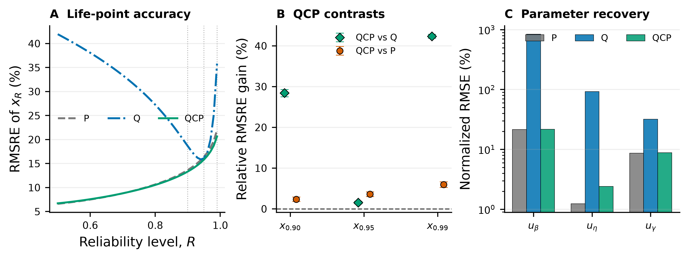

# QCP 跨寿命点恢复机制结果报告

> 状态：COMPLETE  
> 证据等级：post-test mechanism analysis  
> 论文准入：ADMITTED BY USER，2026-08-29  
> 新训练：0 fits

## 结论先行

QCP 消除 Q 的超额参数补偿后，主要修复的不是已经被 Q 直接优化的 $x_{0.95}$，而是 $x_{0.95}$ 之外的寿命点。Q 在单个寿命点上允许三参数形成近似抵消，这种抵消只对 $x_{0.95}$ 成立；换到 $x_{0.90}$ 或 $x_{0.99}$ 后，错误的参数组合不再抵消，寿命曲线形状误差便暴露出来。P 约束把这些参数拉回可信区域，因此 QCP 对邻近寿命点的恢复远大于其对 $x_{0.95}$ 的增量改善。

## 冻结设计

分析使用统一 `600/60` 预算下 P、Q、QCP 的 200 个配对模型单元和每路线 480,000 条 held-out 参数预测，不重新训练。主检验点在分析前固定为 $x_{0.90}$、$x_{0.95}$、$x_{0.99}$；每个寿命点均由同一组三参数预测按 Weibull 公式重新计算。跨路线逐样本键完全一致。

## 主要结果

| 寿命点 | P RMSRE | Q RMSRE | QCP RMSRE | QCP 相对 Q 改善 | 95% CI | 160 单元中 QCP 优于 Q |
|---|---:|---:|---:|---:|---:|---:|
| $x_{0.90}$ | 13.657% | 18.630% | 13.336% | **28.417%** | [27.505%,29.287%] | 155 |
| $x_{0.95}$ | 16.432% | 16.092% | 15.841% | **1.562%** | [1.240%,1.898%] | 119 |
| $x_{0.99}$ | 21.960% | 35.820% | 20.647% | **42.360%** | [41.876%,42.855%] | 146 |

QCP 相对 P 的 pooled RMSRE 在三个寿命点也均更低：$x_{0.90}$、$x_{0.95}$、$x_{0.99}$ 分别改善 **2.353%**（95% CI [1.809%,2.904%]）、**3.599%**（[3.027%,4.180%]）和 **5.981%**（[5.277%,6.673%]）。相应的有利固定真值单元为 74/160、76/160 和 77/160，表明这些是全域平均收益，不是逐区域支配。

Q 的失真方向并不相同：在 $x_{0.90}$ 上有方向偏差为 −13.460%，表现为明显低估；在 $x_{0.99}$ 上为 +21.134%，表现为明显高估。QCP 将两者分别压到 −2.258% 和 −2.540%，接近 P 的 −1.371% 和 −1.377%。这说明参数补偿改变的是整条寿命曲线的形状，而不只是给所有寿命点增加一个相同方向的平移误差。

## 参数恢复对应关系

三个归一化参数误差的 RMSE 如下：

| 路线 | $u_\beta$ | $u_\eta$ | $u_\gamma$ |
|---|---:|---:|---:|
| P | 21.507% | 1.235% | 8.628% |
| Q | 841.135% | 92.810% | 31.947% |
| QCP | 21.649% | 2.407% | 8.814% |

QCP 将参数恢复到接近 P 的水平，同时把 Q 在两个非目标寿命点上的大误差拉回到接近、部分略优于 P 的水平。这个对应关系支持“参数补偿造成曲线形状失真，P 约束恢复跨寿命点一致性”的机制解释。

## 图形

图 A 展示 $R\in[0.50,0.99]$ 上三条路线的 RMSRE 曲线；图 B 给出三个预设寿命点的 QCP-vs-Q 配对效应及 95% CI；图 C 展示三项归一化参数 RMSE；图 D 汇总主数值。图中不使用“越小越好”等口语标注，误差方向由轴标题和数值定义表达。

## 证据边界

1. 该结果直接支持 QCP 修复预设的 $x_{0.90}$ 和 $x_{0.99}$，但不能据此宣称它在任意可靠度水平或任意分布指标上都优于 Q。
2. QCP 对 Q 的跨寿命点优势很大，但相对 P 并非所有指标都支配。例如 $x_{0.90}$ 的 MAE 和 $\pm10\%$ 内比例仍略逊于 P；因此应写成“恢复到接近 P，并在主 RMSRE 上略优”，不能写成“完整分布全面最优”。
3. 三个寿命点由同一批已经打开的测试参数预测派生，属于机制性事后分析，不升级为首次封存确认。
4. 结果证明的是输出层面的跨寿命点恢复。它与“P 约束切除等 $x_{0.95}$ 方向上的极端参数解”相容，但没有记录完整训练轨迹，不能把每一步优化动力学写成已证因果。

## 导师审查式判断

- **问题**：明确，直接回答“97.8% 参数补偿恢复究竟换来了什么”。
- **方法**：同一批冻结参数预测、预设三个寿命点、无再训练，能够隔离下游映射差异。
- **证据**：两个非目标寿命点的效应大、区间远离 0，并在大多数固定真值单元方向一致。
- **判断**：QCP 的论文价值不应只用 $x_{0.95}$ 的 1.56% 增益评价；更实质的价值是避免单点 Q 造成的寿命曲线形状失真。不过，正文是否将研究目标从“单一 $x_{0.95}$ 精度”扩展到“跨寿命点一致性”，需要用户明确准入后再决定。

## 可复现材料

- 协议：`protocols/23-QCP跨寿命点恢复机制合同.md`
- 代码：`code/study02pq/qcp_cross_quantile_recovery.py`
- 汇总：`artifacts/qcp_cross_quantile_recovery/analysis/summary.json`
- 主表：`artifacts/qcp_cross_quantile_recovery/analysis/primary_life_point_metrics.csv`
- 曲线：`artifacts/qcp_cross_quantile_recovery/analysis/reliability_curve.csv`
- 固定真值单元：`artifacts/qcp_cross_quantile_recovery/analysis/truth_cell_effects.csv`
- 完整性：`artifacts/qcp_cross_quantile_recovery/SHA256SUMS`
