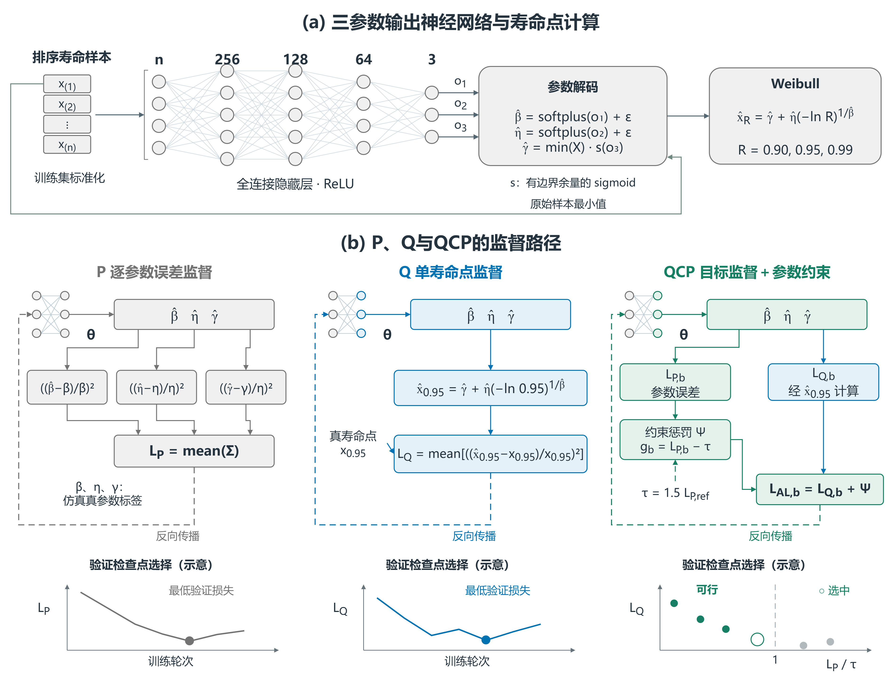
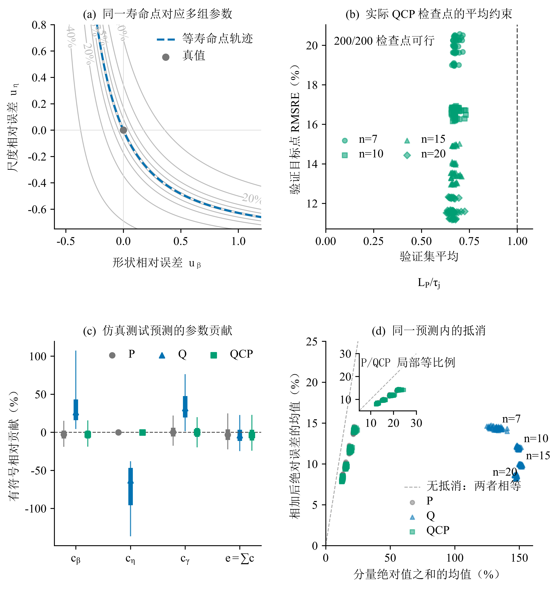
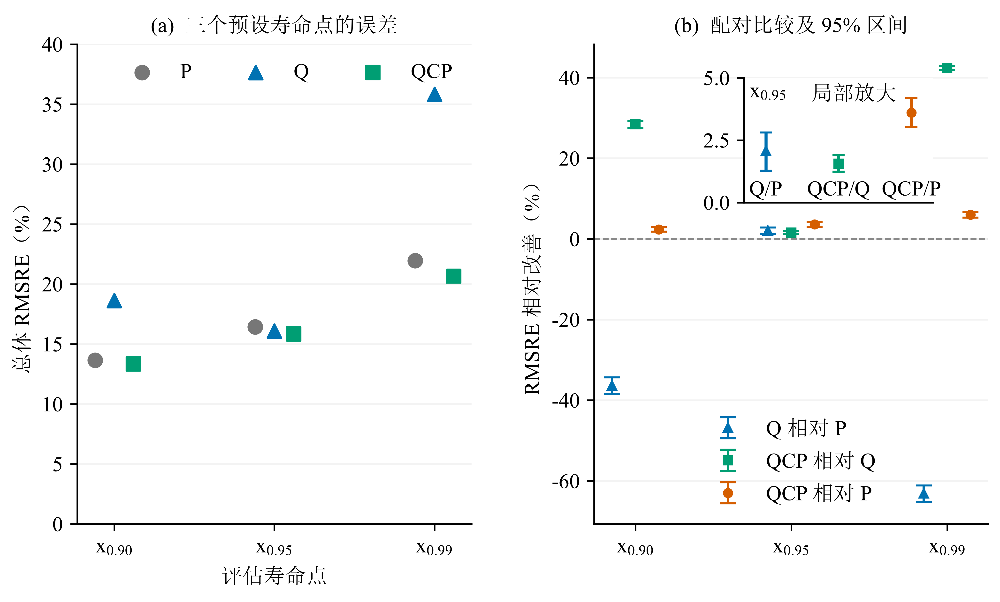
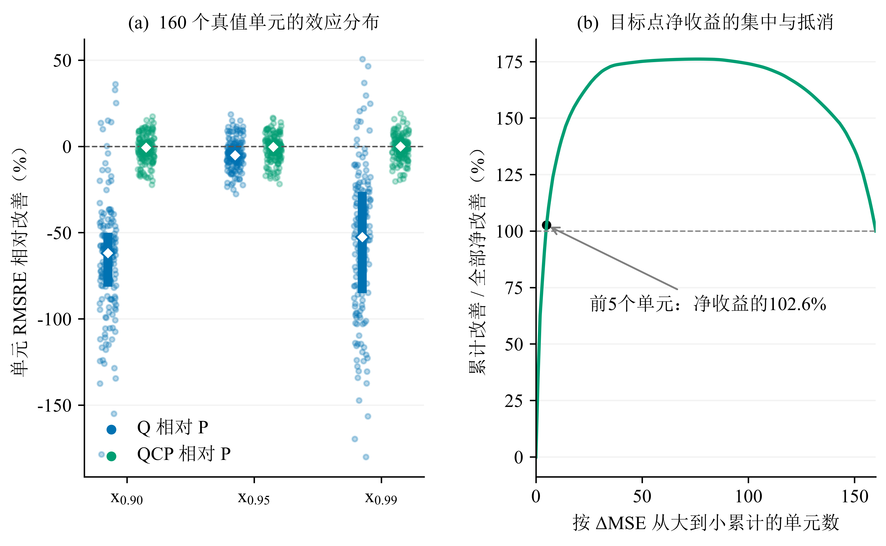

# 三参数 Weibull 寿命点估计中的任务对齐：单点监督的收益、代价与参数约束

## 摘要

当最终使用量是可靠度寿命点时，参数误差最小并不等于该寿命点误差最小。本文以三参数Weibull神经估计为例，研究任务对齐的收益、参数代价及修复方式。参数导向流程P与目标寿命点导向流程Q共用数据、网络和最大训练预算，分别按对应损失训练和验证选点。固定尺度仿真覆盖40个参数组合、4种样本量和200个配对模型单元。Q将目标 $x_{0.95}$ 的总体均方根相对误差（RMSRE）由16.43%降至16.09%，相对改善2.07%（95%经验区间：1.28%至2.81%），但 $x_{0.90}$、$x_{0.99}$ 的误差分别增加36.41%和63.11%。统一验证准则后，Q仍保留1.32%的目标改善（0.63%至1.96%）。损失几何与逐预测分解显示，单点监督允许较大的参数误差在目标点相互抵消。参数约束流程QCP将目标RMSRE降至15.84%，并修复另外两点的退化；固定加权参数损失获得接近的精度。三点直接监督也能缓解跨点误差，但参数恢复弱于参数正则化流程。总体收益集中于少数高误差单元，P仍保留典型绝对误差优势。这些结果表明，监督设计需要同时考虑寿命点任务与参数解释需求。

**关键词**：三参数Weibull；可靠度寿命点；任务对齐；参数补偿；约束学习；神经估计

## Abstract

Minimizing parameter error need not minimize error in a derived engineering quantity. We examine the benefits and costs of aligning three-parameter Weibull neural estimation with one reliability life point. Parameter-oriented (P) and target-oriented (Q) procedures share data, network structure, and maximum training budgets, but use their respective training and validation losses. Fixed-scale simulations cover 40 parameter combinations, four sample sizes, and 200 paired model units. Q reduces pooled root mean squared relative error (RMSRE) at $x_{0.95}$ from 16.43% to 16.09%, a relative improvement of 2.07% (95% empirical interval: 1.28%–2.81%), but increases error at $x_{0.90}$ and $x_{0.99}$ by 36.41% and 63.11%. With a common validation criterion, Q retains a 1.32% target improvement (0.63%–1.96%). Loss geometry and prediction-level decompositions show that single-point supervision permits large, compensating parameter errors. Parameter-constrained learning (QCP) reduces target RMSRE to 15.84% and repairs deterioration at the other two points; fixed-weight parameter regularization achieves similar accuracy. Direct supervision of all three points also reduces the cross-point errors, but recovers parameters less accurately than the parameter-regularized procedures. Pooled gains concentrate in a few high-error cells, while P retains an advantage in typical absolute error. These results support matching supervision to both the intended life points and parameter interpretation.

## 1 引言

可靠性分析既要描述寿命分布，也常要确定给定可靠度下的寿命边界。三参数 Weibull 模型以形状 $\beta$、尺度 $\eta$ 和位置 $\gamma$ 描述寿命，其小样本参数估计是长期研究的问题 [1,2,3,4]。经典估计方法 [5,6,7,8] 与神经网络方法 [9,10] 通常先恢复分布参数，再据此计算可靠度寿命点。当应用最终关心某个寿命点时，训练目标如何定义，可能直接影响该点的估计风险。

设 $R$ 为生存概率，可靠度寿命点满足 $R(x_R)=R$。下文以可靠度为 95% 的寿命点 $x_{0.95}$ 为例，它对应失效分布的 5% 分位点。对于输出三个参数的监督网络，常见训练目标是三个归一化参数误差的等系数和。归一化消除了量纲和数值尺度的直接影响，$1{:}1{:}1$ 系数则提供了透明、可复现的参数恢复参照。然而，这组系数来自度量约定，三个参数对 $x_{0.95}$ 的实际影响还取决于寿命点公式、参数位置及误差间的相互作用。

一种更直接的做法是由网络输出同样的三个 Weibull 参数，再通过分布公式计算 $x_{0.95}$，并以该寿命点的预测误差训练网络。分位数回归、目标泛函与任务聚焦学习均体现了按最终使用量定义预测目标的思想 [11,12,13,14,15]；两参数 Weibull 的小样本研究也分别比较了参数估计量及其插件分位点估计量的偏差和均方误差 [16]。本文进一步考察三参数情形下，基于仿真训练的神经估计器如何因训练目标及其验证选择规则不同而改变目标寿命点风险 [17,18]。

寿命点监督同时带来一个结构性问题：三个参数决定一条分布曲线，单个寿命点却只提供一个标量目标。不同参数组合可以给出相同的 $x_{0.95}$，同时产生不同的 $x_{0.90}$ 和 $x_{0.99}$。直接优化 $x_{0.95}$ 因而可能允许参数误差相互补偿，使目标点准确而其他寿命点失真。任务对齐的收益需要与这种内部自由度及其下游代价一并检验。

基于这一逻辑，本文依次回答三个问题：寿命点损失 Q 相对参数损失 P 能否提高 $x_{0.95}$ 的估计精度；单点监督是否引起参数补偿和跨寿命点退化；以 Q 为主目标、以参数误差定义可行域的 QCP 能否修复这一缺口。P 提供参数恢复参照，Q 检验任务对齐并揭示补偿机制，QCP 在此基础上组合任务目标与参数约束。本文的贡献在于量化任务对齐的收益与代价、解释单点目标允许的参数补偿，并比较引入参数恢复要求后的修复效果。为检验约束求解的必要性，另以固定加权参数损失QP作为简单参照（附录B.9）；主文保留P→Q→QCP的研究递进。

## 2 方法

### 2.1 寿命模型、数据与评价域

本研究先比较参数误差导向流程 P 与目标寿命点导向流程 Q，检验任务对齐的收益及其对其他寿命点的影响；再以参数约束构成 QCP，评价约束能否修复单点监督的代价（图1）。三条路线使用同一网络结构并输出三个参数，各自按对应目标训练和选择验证检查点。

*图1　神经网络与监督路径。A：n–256–128–64–3全连接网络、参数解码与寿命点计算，圆点示意神经元。B：P按参数误差训练，Q按目标寿命点误差训练，QCP加入参数约束惩罚Ψ；Σ表示三项参数误差平方之和，虚线为梯度回传或阈值依赖。底部示意验证选点规则，空心圈为QCP选中点。*

三参数 Weibull 模型及其寿命点为

$$
R(x)=\exp\left[-\left(\frac{x-\gamma}{\eta}\right)^\beta\right],
\qquad
x_R=\gamma+\eta[-\ln R]^{1/\beta},\qquad x>\gamma.
$$

仿真采用

$$
\beta\in\{1.5,2,2.5,3,3.5,4,4.5,5\},\quad
\eta=1000,\quad
\gamma/\eta\in\{0.10,0.25,0.50,0.75,1.00\},
$$

以及样本量 $n\in\{7,10,15,20\}$。每个参数—样本量组合生成 300 组独立、未删失寿命样本，共 160 个固定真值单元、48,000 组样本。每组输入为升序排列的原始寿命观测，不作逐样本均值归一化；输入位置的标准化仅使用当前训练折拟合的均值与标准差。

按重复抽样编号模 5 分折，每轮以一类为测试、下一类为验证、其余三类为训练。每个参数组合相应有 180、60、60 组训练、验证、测试样本。五轮划分中的样本不跨越当前训练与测试集合，但各轮训练集存在重叠。各集合覆盖同一组参数点，因而评价的是设计域内新样本的估计表现。

固定 $\eta$ 下，该网格的真实 $x_{0.95}$ 为238.05–1552.09。本文采用相对误差比较不同寿命水平。

### 2.2 共同网络与两种基本损失

每个样本量分别训练多层感知机（MLP），结构为 $n\rightarrow256\rightarrow128\rightarrow64\rightarrow3$，隐藏层使用 ReLU，计算采用双精度浮点数（float64）。三条路线共用参数解码，保证

$$
\hat\beta>0,\qquad\hat\eta>0,\qquad0<\hat\gamma<\min(X).
$$

具体地，设网络原始输出为 $o_1,o_2,o_3$，三条路线均使用

$$
\hat\beta=\operatorname{softplus}(o_1)+\varepsilon,\quad
\hat\eta=\operatorname{softplus}(o_2)+\varepsilon,\quad
\hat\gamma=\min(X)\{\delta+(1-2\delta)\operatorname{sigmoid}(o_3)\},
$$

其中 $\varepsilon=10^{-6}$、$\delta=10^{-7}$。该变换对应当前正位置参数域；三条路线使用相同的输出范围与边界余量。

优化器为 Adam，学习率 $10^{-3}$、权重衰减 $10^{-4}$、批量大小 256。当前比较统一最多训练 600 轮，早停耐心值为 60 轮。每个配对模型单元内，三条路线共享样本划分、标准化、初始化、首轮小批量顺序和网络结构。

令单组样本的归一化参数误差为

$$
u=\left(
\frac{\hat\beta-\beta}{\beta},
\frac{\hat\eta-\eta}{\eta},
\frac{\hat\gamma-\gamma}{\eta}
\right).
$$

参数路线 P 最小化

$$
L_P=\operatorname{mean}\|u\|^2.
$$

三个平方项在上述归一化坐标中使用相同系数。位置误差以 $\eta$ 归一化，避免其度量随 $\gamma$ 接近零而发散。因此，$1{:}1{:}1$ 表示三个无量纲误差项等系数相加；该损失直接控制参数恢复，其度量与寿命点敏感度无关。

路线 Q 使用相同三参数输出，由 Weibull 公式计算目标寿命点，最小化

$$
L_Q=\operatorname{mean}\left[
\left(\frac{\hat x_{0.95}-x_{0.95}}{x_{0.95}}\right)^2
\right].
$$

P 与 Q 分别以最低验证 $L_P$ 和 $L_Q$ 选择模型检查点。两条路线共用输出表示和网络容量，比较的是训练目标与对应验证选择规则构成的完整流程，实测差异包含训练更新和检查点选择两部分。补充对照P_QSELECT统一采用验证 $L_Q$ 选点和早停，以检验相同验证准则下的训练目标差异（附录F）。

### 2.3 参数约束寿命点学习 QCP

QCP 保留目标寿命点误差作为优化目标，以参数损失限制可接受解：

$$
\min_\theta L_Q(\theta)
\quad\text{s.t.}\quad
L_P(\theta)\le\tau_j,\qquad
\tau_j=cL_{P,\mathrm{ref},j}.
$$

$j=(n,k,s)$ 表示模型单元，其中 $k$ 为折次，$s$ 为随机种子。$L_{P,\mathrm{ref},j}$ 来自匹配的早期 P 参考模型的最佳验证参数损失，该参考训练最多进行 300 轮，早停耐心值为 20 轮。QCP 阈值在当前 600 轮 P 模型的测试结果读取之前确定，并在后续训练中保持不变。

令 $g_b=L_{P,b}-\tau_j$、$g_{\mathrm{tr}}=L_{P,\mathrm{tr}}-\tau_j$，其中 $L_{P,\mathrm{tr}}$ 为该轮训练过程中各小批量参数损失按样本数加权的平均值，而非以轮末固定参数重新评价全训练集的损失。约束求解采用增广拉格朗日方法的非负乘子框架 [19]。本研究在小批量训练中使用下式，并在每轮结束时更新乘子：

$$
L_{\mathrm{AL},b}
=L_{Q,b}+\frac{\left[\max\{0,\mu+\rho g_b\}\right]^2-\mu^2}{2\rho},
\qquad
\mu\leftarrow\max\{0,\mu+\rho g_{\mathrm{tr}}\}.
$$

当约束松弛且乘子为零时，参数项不参与更新；约束受到违反时，其作用由乘子与违反程度调节。模型检查点选择先检查验证集平均 $L_P\le\tau_j$，再从可行训练轮次中选出验证 $L_Q$ 最小者。训练阶段通过小批量参数损失施加约束惩罚；检查点可行性则以验证集平均参数损失判断。

$c$ 与 $\rho$ 在 8 个验证单元上选择，共进行 48 次模型训练；另以 8 次训练检查预算扩展，最终取 $c=1.5,\rho=0.1$ 和 600/60 训练设置。这两个选择阶段均未访问测试指标。随后形成 200 个 QCP 模型。为比较相同的最大训练机会，在原 P/Q 测试结果读取后，将 P、Q 扩展到同样的 600/60 设置；本文主表采用这一共同预算分析。完整实验先后顺序见附录 A.2。

### 2.4 单点监督与参数补偿

#### 2.4.1 局部损失几何

P 与 Q 的差异可以在共同的 $u$ 坐标下表示。记单组样本的相对寿命点误差为 $e(u)$，则

$$
\ell_P=\|u\|^2,\qquad
\nabla_u\ell_P=2u,\qquad H_P=2I_3,
$$

$$
\ell_Q=e(u)^2,\qquad
\nabla_u\ell_Q=2e(u)\nabla_u e(u).
$$

令 $a=-\ln R$、$t=a^{1/\beta}$，寿命点对三个参数的导数为

$$
\frac{\partial x_R}{\partial\gamma}=1,\qquad
\frac{\partial x_R}{\partial\eta}=t,\qquad
\frac{\partial x_R}{\partial\beta}=-\frac{\eta t\ln a}{\beta^2}.
$$

在真值处，归一化敏感度向量及 Q 的 Hessian 为

$$
s_0=\left(
\frac{\beta}{x_R}\frac{\partial x_R}{\partial\beta},
\frac{\eta}{x_R}\frac{\partial x_R}{\partial\eta},
\frac{\eta}{x_R}\frac{\partial x_R}{\partial\gamma}
\right),
\qquad H_Q(0)=2s_0s_0^\mathsf T.
$$

局部寿命点平方误差可写为

$$
(s_0^\mathsf Tu)^2
=\sum_i s_{0,i}^2u_i^2+2\sum_{i<j}s_{0,i}s_{0,j}u_i u_j.
$$

对角项反映各参数的局部敏感度，交叉项则允许误差联合放大或抵消。本文将这种由寿命点公式产生的联合评价称为任务诱导耦合；它同时改变参数方向的相对作用及其交互关系。

P 在三个方向上惩罚参数误差；Q 的局部 Hessian 为秩一，在与 $s_0$ 正交的两个方向上没有二阶惩罚。更直接地说，$\hat x_{0.95}=x_{0.95}$ 在满足参数取值限制的输出空间中定义一张等寿命点曲面。沿曲面改变参数可以保持目标点不变，同时改变其他寿命点。这是单个标量目标在输出误差空间留下的自由度，区别于三参数 Weibull 模型本身的统计识别。

不同真值点的敏感度方向不同；若将它们在共同三维误差坐标下的局部 Hessian 求和，其秩可能高于一。条件网络的情形又有所不同：它根据每个输入样本输出参数，而非为全部样本估计同一组三参数，因此可能在不同输入处沿不同的近等寿命点方向偏移。共享权重、网络容量和正则化决定了这些偏移能否同时实现。局部几何揭示单点目标允许的补偿方向，终态参数分布与跨点误差则检验这种可能性是否在实际预测中出现。

#### 2.4.2 有限误差下的敏感度

有限误差下，目标误差仍可由沿真值到预测值路径的平均敏感度精确表示。该敏感度随预测参数改变，求导时需保留这种依赖；真值处的固定线性近似因而不能代表完整Q损失。精确表达、求导条件与静态代理检验见附录C.2–C.4。

#### 2.4.3 终态参数补偿的量化

为量化终态预测中的补偿，本文对 $e$ 作精确的三项参数贡献分解，并定义

$$
C=\operatorname{mean}\left[
1-\frac{|c_\beta+c_\eta+c_\gamma|}
{|c_\beta|+|c_\eta|+|c_\gamma|}
\right].
$$

分母为零时该行取零。$C$ 越接近 1，表示三项贡献相加后的绝对目标误差相对于各项绝对值之和越小。$C$ 与平均 $L_P$ 配合使用：前者反映误差抵消程度，后者反映参数偏离幅度。具体对称分解见附录 C.1。

以 P 为参照，另定义 QCP 对超额补偿的恢复比例

$$
\mathrm{Resolution}_{\mathrm{comp}}
=\frac{C_Q-C_{\mathrm{QCP}}}{C_Q-C_P}.
$$

本研究中 $C_Q>C_P$，该比例以 Q 相对 P 增加的补偿为分母，衡量 QCP 使补偿指标回落的程度。寿命点精度改善另由 RMSRE 及其相对改善量评价。

### 2.5 配对评价与统计汇总

训练使用 10 个随机种子、4 个样本量和 5 折，形成每条路线 200 个模型单元，共 600 次模型训练。每条路线有 480,000 条测试预测，来自 48,000 组寿命样本在 10 个训练种子下的重复预测；统计推断保留这种重复结构，不把它们视为 480,000 组独立样本。完整随机种子、配对关系和数据来源见附录 A。

主指标为均方根相对误差：

$$
\operatorname{RMSRE}_m(R)
=\sqrt{\operatorname{mean}\left[
\left(\frac{\hat x_{R,m}-x_R}{x_R}\right)^2
\right]}.
$$

先对 200 个模型单元的 MSE 等权平均，再开方。相对改善定义为

$$
I_{a\rightarrow b}(R)
=\frac{\operatorname{RMSRE}_a(R)-\operatorname{RMSRE}_b(R)}
{\operatorname{RMSRE}_a(R)},
$$

正值表示路线 $b$ 更好。区间估计按 $n$ 分层重采样折次，同时全局重采样随机种子，始终保持路线配对，共重复 200,000 次。考虑到折间训练数据重叠及训练种子数量有限，所报 95% CI 为设计级经验 bootstrap 近似区间。

$x_{0.95}$ 为训练目标；另外从同一组参数预测派生 $x_{0.90}$ 和 $x_{0.99}$，评价目标点收益能否延伸至其他寿命点。后两点的分析在读取对应派生结果前固定，但属于既有模型上的事后机制分析。区域效应以 160 个固定真值单元 $(n,\beta,\gamma/\eta)$ 汇总，每单元每路线有 3,000 条预测。

为描述 RMSRE 之外的误差形态，同时报告目标点的平均绝对相对误差、绝对相对误差中位数、95% 分位点、±10% 内比例和有符号相对偏差。固定真值单元内的偏差—方差分解见附录 B.5。这些指标分别反映整体平方误差、典型误差、尾部和方向，不合并为综合分数。其中“绝对误差的 95% 分位点”是误差分布的尾部统计量，应与可靠度寿命点 $x_{0.95}$ 区分。

对固定真值单元 $c$，记 $b_c=\operatorname{mean}(e_c)$、$v_c=\operatorname{mean}[(e_c-b_c)^2]$，则

$$
B_{\mathrm{RMS}}=\sqrt{\operatorname{mean}_c b_c^2},
\qquad S_{\mathrm{within}}=\sqrt{\operatorname{mean}_c v_c},
\qquad \mathrm{RMSRE}^2=B_{\mathrm{RMS}}^2+S_{\mathrm{within}}^2.
$$

$B_{\mathrm{RMS}}$ 不允许不同区域的正负偏差相互抵消；$S_{\mathrm{within}}$ 则包含抽样重复与训练随机性形成的单元内波动。各比较的区间与分层结果未作多重比较校正，分别按既定主比较和描述性机制分析解释。

## 3 结果

### 3.1 单点目标对齐的收益与代价

在共同预算下，Q 将目标 $x_{0.95}$ 的总体 RMSRE 从 16.43% 降至 16.09%，相对改善 2.07%（95% CI：1.28% 至 2.81%）。然而，相同参数预测在另外两个寿命点上的表现明显下降：$x_{0.90}$ 和 $x_{0.99}$ 的 RMSRE 相对 P 分别增加 36.41% 和 63.11%（表1）。直接训练目标的收益温和，未受直接监督的寿命点代价更大。

**表1　三条路线在三个寿命点的总体 RMSRE**

| 寿命点 | P | Q | QCP | Q 相对 P 改善（95% CI） | QCP 相对 Q 改善 | QCP 相对 P 改善（95% CI） |
|---|---:|---:|---:|---:|---:|---:|
| $x_{0.90}$ | 13.66% | 18.63% | 13.34% | −36.41%（−38.51% 至 −34.32%） | 28.42% | 2.35%（1.81% 至 2.90%） |
| $x_{0.95}$ | 16.43% | 16.09% | 15.84% | 2.07%（1.28% 至 2.81%） | 1.56% | 3.60%（3.03% 至 4.18%） |
| $x_{0.99}$ | 21.96% | 35.82% | 20.65% | −63.11%（−65.27% 至 −61.16%） | 42.36% | 5.98%（5.28% 至 6.67%） |

*比较包含200个配对模型单元，负改善表示误差增加。QCP相对Q的完整区间见附录B.2。*

目标点精度并未保证参数恢复。Q 的平均 $L_P$ 达到 71.7，而 P 为 0.0539；其平均补偿指数从 P 的 0.332 增至 0.915。图2A以等寿命点切片说明这种可能性，C–D则对同一批仿真测试预测作逐样本贡献分解。Q 的形状与位置贡献主要为正，尺度贡献主要为负；将同一预测中的贡献相加后，绝对误差明显小于各项绝对值之和。较大的参数偏离与较强的抵消因而同时出现在实际预测中。

*图2　损失几何与参数补偿。A：固定 $\gamma=100$、真值 $(\beta,\eta)=(1.5,1000)$ 的输出切片；虚线为等目标寿命点轨迹，灰线为绝对相对误差等高线。B：200个QCP选定检查点的验证集平均参数损失与目标误差，虚线为 $L_P/\tau_j=1$。C：参数误差的精确对称贡献，标记、粗线和细线分别为中位数、四分位范围及5%–95%分位范围。D：每点为一个模型单元，横纵坐标分别为逐预测贡献绝对值之和与相加后绝对误差的均值；虚线表示无抵消，插图等比例放大P/QCP。*

### 3.2 参数约束保留目标收益并修复跨寿命点表现

加入参数约束后，目标点总体精度得以保留并小幅提高：QCP 在 $x_{0.95}$ 上较 Q 再改善 1.56%（95% CI：1.24% 至 1.90%），在两个非目标点则分别改善 28.42% 和 42.36%。与 P 相比，三个寿命点的总体 RMSRE 均小幅降低（表1）。因此，本次比较中约束的主要作用是修复跨寿命点退化，同时保留目标点的总体收益。

参数诊断与这一变化相符。QCP 的 200 个选定检查点均满足验证集平均参数约束，测试平均 $L_P$ 为 0.0552，补偿指数为 0.345，均接近 P。按 $(C_Q-C_{\mathrm{QCP}})/(C_Q-C_P)$ 计算，QCP 使 Q 相对 P 的超额补偿减少 97.8%。这一比例描述参数约束下补偿指标的回落，寿命点收益则由上述 RMSRE 直接评价。

*图3　三种预设寿命点的误差与配对效应。A：总体RMSRE。B：Q相对P、QCP相对Q及QCP相对P的RMSRE改善与配对crossed-bootstrap 95%区间；正值表示改善。比较包含200个配对模型单元，插图放大目标点效应。*

### 3.3 总体收益与区域差异

QCP 对 Q 的修复在多数固定真值单元内成立：三个寿命点分别有 155、119、146 个单元改善。相对 P，则只有 74、76、77 个单元改善（表2），三个单元效应中位数均略偏向 P。Q 在目标点也仅有 42/160 个有利单元。因此，目标点总体 RMSRE 的降低没有转化为多数真值单元的共同获益；它取决于各单元平方误差改变的幅度，而非改善单元占多数。

**表2　固定真值单元的改善方向与效应中位数**

| 寿命点 | Q 优于 P | QCP 优于 Q | QCP 优于 P | QCP 相对 P 的单元效应中位数 |
|---|---:|---:|---:|---:|
| $x_{0.90}$ | 8/160 | 155/160 | 74/160 | −0.67% |
| $x_{0.95}$ | 42/160 | 119/160 | 76/160 | −0.26% |
| $x_{0.99}$ | 13/160 | 146/160 | 77/160 | −0.08% |

*各单元包含相同数量的预测。中位数由单元RMSRE相对改善计算，负值表示P误差较低。*

为定位收益来源，定义每个真值单元的贡献 $\Delta_c=\mathrm{MSE}_{P,c}-\mathrm{MSE}_{\mathrm{QCP},c}$。在 $x_{0.95}$ 上，将 160 个单元按 $\Delta_c$ 从大到小排列，前 5 个单元的改善合计达到全部净改善的 102.6%；其余 155 个单元合计略有抵消（图4）。按 P 的单元误差分组后，正收益主要来自误差最高的四分组，中间两组平均略偏向 P。由此可见，QCP 对 P 的总体收益集中于少数高误差单元，而非各区域普遍改善。前五个单元均位于低形状、低位置比区域（附录图B4）；完整单元身份与分组数值见附录B.7。

*图4　区域效应与目标点收益来源。A：Q、QCP相对P的160个真值单元RMSRE改善；白色菱形为中位数，粗线为四分位范围。B：在 $x_{0.95}$ 上按 $\Delta_c$ 降序累计QCP相对P的MSE改善，以全部净改善为100%；超过100%的部分由后续单元的退化抵消。*

样本量增加则带来三条路线共同且更明显的精度改善。$n$ 从 7 增至 20 时，P 的目标 RMSRE 从 20.74% 降至 12.00%，QCP 从 19.92% 降至 11.69%。方法间差异小于这一采样效应。逐样本量结果及条件于 P 经验误差曲线的等效样本量换算见附录 B.4。

### 3.4 误差形态、波动来源与训练成本

相对 Q，QCP 在目标点的 RMSRE、平均绝对误差、中位绝对误差及 95% 分位误差均降低，±10% 内比例提高，有符号相对偏差的绝对值也减小。与 P 相比，QCP 的 RMSRE 和绝对误差 95% 分位点更低，而 P 的平均绝对误差、中位绝对误差及 ±10% 内比例更好（表3）。三条路线的排序取决于实际任务重视整体平方风险、典型误差还是误差尾部。

**表3　共同预算下的目标寿命点误差与资源**

| 指标 | P | Q | QCP |
|---|---:|---:|---:|
| RMSRE | 16.43% | 16.09% | 15.84% |
| 平均绝对相对误差 | 10.92% | 11.19% | 10.94% |
| 绝对相对误差中位数 | 7.69% | 8.14% | 7.86% |
| 绝对相对误差 95% 分位点 | 30.43% | 30.80% | 30.31% |
| 误差在 ±10% 内的比例 | 60.75% | 58.40% | 59.70% |
| 有符号相对偏差 | −1.51% | −2.71% | −2.48% |
| 高估超过 10% 的比例 | 14.29% | 13.25% | 13.19% |
| 高估超过 20% 的比例 | 6.85% | 6.02% | 6.07% |
| 单次训练中位耗时 / s | 41.4 | 29.6 | 87.2 |

*误差指标汇总全部测试预测；高估指正的目标相对误差。耗时为单模型CPU训练时间中位数，QCP的前置参考训练和筛选成本见附录A.2。*

当前共同预算预测中，QCP 相对 P 的高估超过 10% 和 20% 的比例均降低；相对 Q，10% 阈值下略低，20% 阈值下略高。单侧尾部排序也随阈值改变，因此总体 RMSRE 最低并不等于所有风险阈值下都占优。

固定真值下的偏差—方差分解进一步显示，P、Q、QCP 的单元内标准差分量依次为 14.82%、14.49%、14.21%，区域偏差的 RMS 分量则依次为 7.09%、6.99%、7.00%，均约为 7%。总体平方误差的下降主要来自重复估计波动减小，三条路线的区域偏差分量接近（附录 B.5）。

三条路线各有 200 个模型进入分析，全部预测均为有限值并满足参数支持域。QCP 有 3 个模型运行到 600 轮上限，其余 QCP 模型及全部 P/Q 模型均在上限前结束。统一最大预算提供了相同的训练机会；QCP 的约束求解与前置参考训练同时增加了计算成本。

### 3.5 共同验证与替代修复对照

为区分训练目标与验证准则，并检验更简单的修复方式，补充实验新增600条训练轨迹，每类200个模型单元（附录F）。P_QSELECT仍按参数损失训练，但与Q一样按验证目标损失选择检查点和早停。它的目标RMSRE为16.3077%，相对原P改善0.757%（95%经验区间：0.477%至1.029%）；Q相对P_QSELECT仍改善1.322%（0.631%至1.957%）。共同验证准则缩小了原P/Q差距，未消除Q的目标优势。

重跑Q的200个目标指标及最佳轮次全部复现原结果。在其原生早停轨迹内，没有模型出现满足原QCP参数阈值的检查点（0/200），所有记录轮次中的最小验证参数损失/阈值比为10.268。因此，原生Q轨迹的可行性筛选未产生可用模型。

QMULTI直接监督三个预设寿命点，三点RMSRE依次为14.0130%、16.0977%和20.8491%。相对Q，两个非目标点分别改善24.781%和41.795%，目标点差异的经验区间跨零。QMULTI在三个点的误差仍均高于QP和QCP（各配对区间均不跨零；表F2）；其平均参数损失为0.301916，QP和QCP分别为0.055208和0.055218。多点监督因而能够缓解跨点代价，但本次等权设置未达到参数正则化流程的参数恢复或寿命点精度。

## 4 讨论

### 4.1 任务对齐改变了什么

P分别惩罚三个归一化参数误差，Q则评价它们对最终寿命点的联合影响。Q的敏感度随预测参数变化，分布公式中的交互项允许误差放大或抵消。单点损失在输出误差空间保留的等寿命点自由度，为参数漂移提供了几何解释。

早期M95消融进一步显示，真值点的静态敏感度代理未能复现Q的精度：局部近似项虽有改善，有限误差的交叉项与非线性余项却使实际目标误差增加（附录C）。这一差异说明，所检验的局部代理遗漏了影响实际寿命点误差的组成部分。

### 4.2 如何理解小幅总体收益

总体RMSRE按平方误差汇总，对较大误差的变化更敏感。困难单元的误差下降可以决定总体排序，同时与典型单元略偏向P并存。图4和附录图B4显示，目标点净收益集中于少数低形状、低位置比单元。

P本身已给出较准确的插件寿命点。单个待估样本仅含7–20个观测，增加观测数带来的误差下降明显大于流程间差异。验证准则也影响流程表现：统一验证目标后，Q相对P的目标改善由主比较的2.07%缩小至1.32%，表明训练目标与检查点选择共同影响最终精度。

### 4.3 参数补偿为何影响其他寿命点

沿等目标寿命点曲面移动，参数可以明显偏离而目标值保持接近不变，其他寿命点则随之改变。Q的形状参数中位数为20.39、尺度参数中位数为67.00；形状与位置贡献主要为正、尺度贡献主要为负。逐预测精确分解将这种抵消定位到同一次估计内部。Q距位置解码上界不足0.1%的预测仅占0.014%（附录B.6），参数漂移因此主要表现为参数组合改变，位置上界附近的预测占比较小。

若预测器只用于目标点，参数补偿可以与较低目标风险并存。当同一组参数还用于解释分布或计算其他寿命点时，参数恢复就成为额外要求。QCP对两个非目标点的改善远大于目标点改善，与限制参数自由度的作用相符。

### 4.4 QCP与简单修复方式的取舍

QCP以参数损失阈值规定可接受的平均参数偏离，并从验证可行的检查点中选择目标误差最小者。其特点是将参数恢复要求写成可检查的条件，阈值由归一化方式、参考P模型和松弛系数共同确定。

固定加权QP也能修复Q。共同600/60预算下，QP与QCP的目标RMSRE分别为15.8505%和15.8406%；QCP相对改善0.0623%，95%经验区间为−0.0499%至0.1679%，另外两个点的区间也跨零（附录B.9）。二者的平均参数损失与补偿指数接近。QP的记录训练中位耗时较低，QCP另需参考训练与约束筛选。因此，当前精度表现接近，主要取舍在于显式验证可行性控制与计算成本。

约束子集上的理想最优目标风险至少与原函数集合上的最优风险一样大。实际QCP较实际Q的改善反映了有限训练中的正则化与选解作用。共同验证后Q仍有目标优势，而原生Q轨迹未出现可行检查点；多点直接监督也缓解了跨点误差。综合这些对照，参数正则化和多点监督均是有效修复途径；当参数本身需要解释时，QP与QCP同时提供了更好的参数恢复。

### 4.5 适用范围与后续验证

本研究覆盖固定尺度、未删失小样本及相同参数网格内的新抽样。尺度标签恒为1000，使P可通过学习常量降低尺度误差，Q则可通过偏离该常量的参数组合逼近目标点。输入保留原始量纲，因此尺度变化、单位变化与其他寿命生成机制需要进一步验证。本文的几何分析刻画输出误差空间；扩展到完整分布评价或具有指定覆盖率的寿命置信下限，还需相应的评价目标。

共同预算扩展与补充对照在早期测试结果已知后形成，复用了原48,000组仿真样本。折间训练集重叠且训练种子有限，本文区间为条件于当前设计的经验近似；真值单元的排序用于描述本批结果。后续独立样本与变化尺度实验可检验这些收益、补偿形态及方法排序的稳定性。

## 5 结论

在固定尺度的三参数Weibull小样本设计域内，将训练与验证目标转向目标寿命点，降低了总体目标误差，同时产生较大的参数补偿与跨寿命点代价。总体收益集中于少数高误差单元，P仍保留典型绝对误差优势。

引入参数恢复要求能够修复跨点退化。QCP通过验证集平均参数损失阈值控制可行性，并保留目标点收益；固定加权QP取得接近的精度。统一验证后Q仍保留目标优势，三点直接监督也能缓解跨点误差。监督设计应同时考虑最终寿命点任务、参数解释需求及计算成本。

## 数据与代码可用性

支持本研究的仿真协议、训练与派生分析代码、模型单元汇总、配对预测和校验清单已整理为本地复现工作包，公开资料库地址尚未确定。正文数值来自共同预算下的 P、Q、QCP 配对分析，以及基于同一批预测得到的跨寿命点、区域分布和偏差—方差结果。复算所需的数据结构与文件对应关系见[附录 E](Study02论文附录-v2.7.0.md)；早期训练预算的结果单列于附录 D，完整补充对照见附录 F。

## 参考文献

[1] Weibull, W. (1951). A Statistical Distribution Function of Wide Applicability. *Journal of Applied Mechanics*, 18(3), 293–297. https://doi.org/10.1115/1.4010337

[2] Rinne, H. (2008). *The Weibull Distribution: A Handbook*. Chapman & Hall/CRC Press. https://doi.org/10.1201/9781420087444

[3] Murthy, D.N.P., Xie, M., & Jiang, R. (2004). *Weibull Models*. Wiley-Interscience. https://doi.org/10.1002/047147326X

[4] Meeker, W.Q., & Escobar, L.A. (1998). *Statistical Methods for Reliability Data*. Wiley.

[5] Xie, L., Wu, N., & Yang, X. (2023). A Minimum Discrepancy Method for Weibull Distribution Parameter Estimation. *International Journal of Structural Stability and Dynamics*, 23(8), 2350085. https://doi.org/10.1142/S0219455423500852

[6] 谢里阳, 朱文慧, 吴宁祥, 杨小玉. (2025). 基于统计最小差异原理的 Weibull 分布参数估计方法. *东北大学学报（自然科学版）*, 46(7), 108–112. https://doi.org/10.12068/j.issn.1005-3026.2025.20240194

[7] Cousineau, D. (2009). Fitting the three-parameter Weibull distribution: Review and evaluation of existing and new methods. *IEEE Transactions on Dielectrics and Electrical Insulation*, 16(1), 281–288. https://doi.org/10.1109/TDEI.2009.4784578

[8] Nagatsuka, H., Kamakura, T., & Balakrishnan, N. (2013). A consistent method of estimation for the three-parameter Weibull distribution. *Computational Statistics & Data Analysis*, 58, 210–226. https://doi.org/10.1016/j.csda.2012.09.005

[9] Yang, X., Xie, L., Chen, J., Zhao, B., & Wang, K. (2025). Estimation of Weibull distribution using the back-propagation neural network for fatigue failure data. *Probabilistic Engineering Mechanics*, 82, 103828. https://doi.org/10.1016/j.probengmech.2025.103828

[10] Abbasi, B., Rabelo, L., & Hosseinkouchack, M. (2008). Estimating parameters of the three-parameter Weibull distribution using a neural network. *European Journal of Industrial Engineering*, 2(4), 428–445. https://doi.org/10.1504/EJIE.2008.018438

[11] Koenker, R., & Bassett, G. (1978). Regression Quantiles. *Econometrica*, 46(1), 33–50. https://doi.org/10.2307/1913643

[12] Elmachtoub, A.N., & Grigas, P. (2022). Smart “Predict, then Optimize”. *Management Science*, 68(1), 9–26. https://doi.org/10.1287/mnsc.2020.3922

[13] Wilder, B., Dilkina, B., & Tambe, M. (2019). Melding the Data-Decisions Pipeline: Decision-Focused Learning for Combinatorial Optimization. *AAAI*, 33(01), 1658–1665. https://doi.org/10.1609/aaai.v33i01.33011658

[14] Donti, P.L., Amos, B., & Kolter, J.Z. (2017). Task-based End-to-end Model Learning in Stochastic Optimization. *NeurIPS*, 30, 5484–5494. arXiv:1703.04529

[15] Gneiting, T. (2011). Making and Evaluating Point Forecasts. *Journal of the American Statistical Association*, 106(494), 746–762. https://doi.org/10.1198/jasa.2011.r10138

[16] Jokiel-Rokita, A., & Piątek, S. (2024). Estimation of parameters and quantiles of the Weibull distribution. *Statistical Papers*, 65(1), 1–18. https://doi.org/10.1007/s00362-022-01379-9

[17] Cranmer, K., Brehmer, J., & Louppe, G. (2020). The frontier of simulation-based inference. *Proceedings of the National Academy of Sciences*, 117(48), 30055–30062. https://doi.org/10.1073/pnas.1912789117

[18] Radev, S.T., Mertens, U.K., Voss, A., Ardizzone, L., & Köthe, U. (2022). BayesFlow: Learning Complex Stochastic Models With Invertible Neural Networks. *IEEE Transactions on Neural Networks and Learning Systems*, 33(4), 1452–1466. https://doi.org/10.1109/TNNLS.2020.3042395

[19] Nocedal, J., & Wright, S.J. (2006). *Numerical Optimization* (2nd ed., Chapter 17). Springer. https://doi.org/10.1007/978-0-387-40065-5

## 附录

[附录 A–F：实验与推断细节、完整结果、敏感度推导、历史预算分析、复算索引及补充对照](Study02论文附录-v2.7.0.md)。
