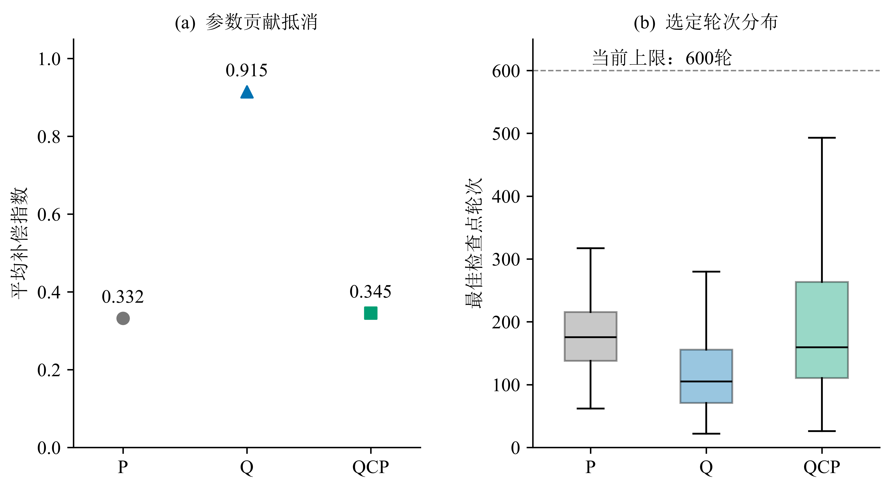
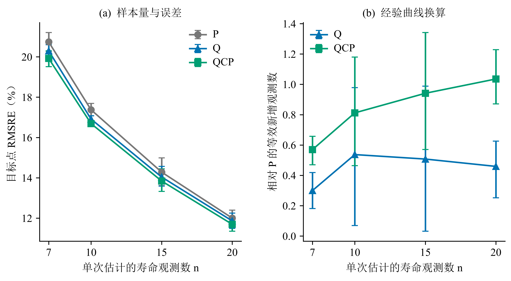
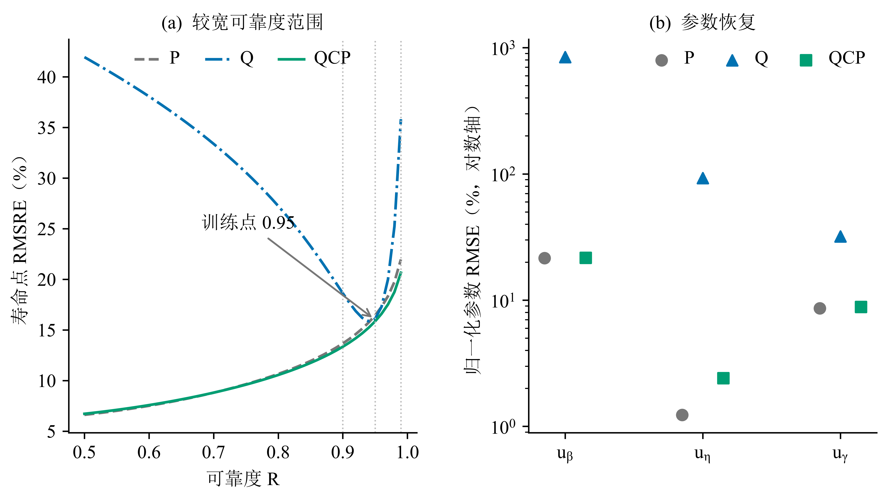
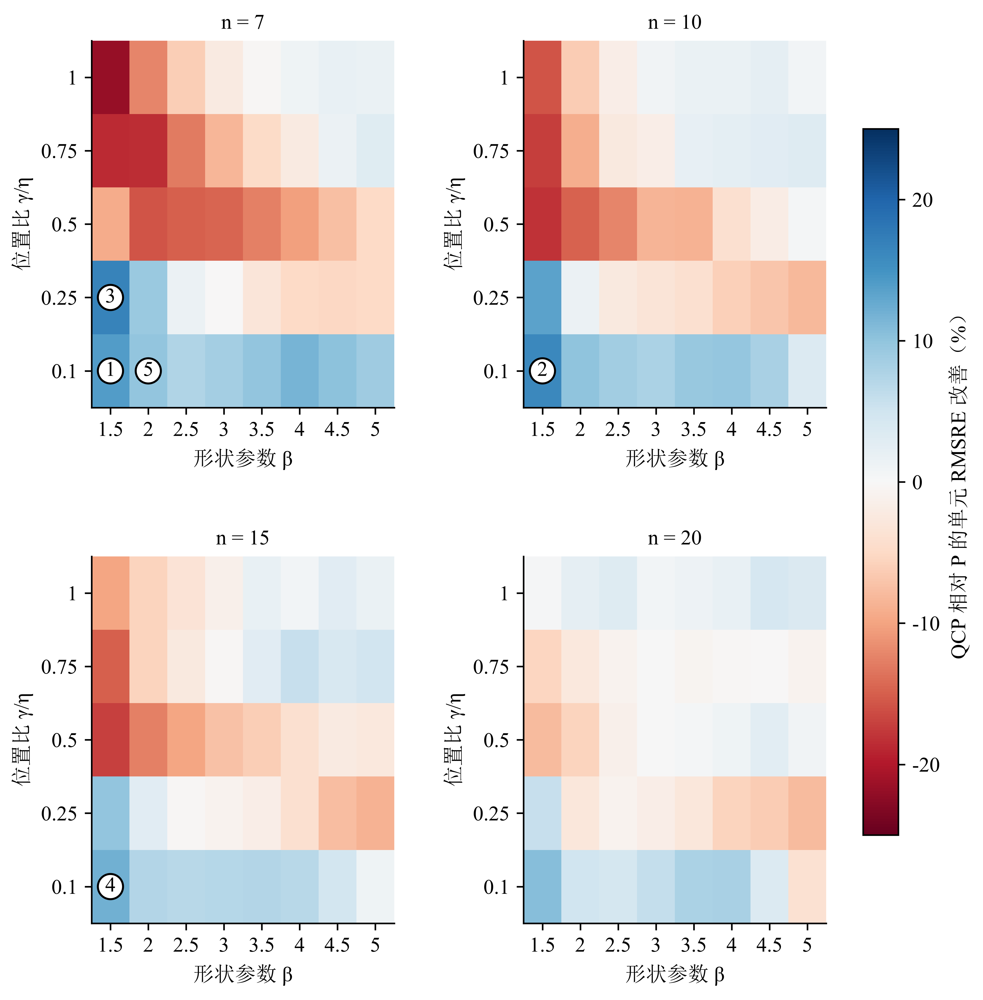
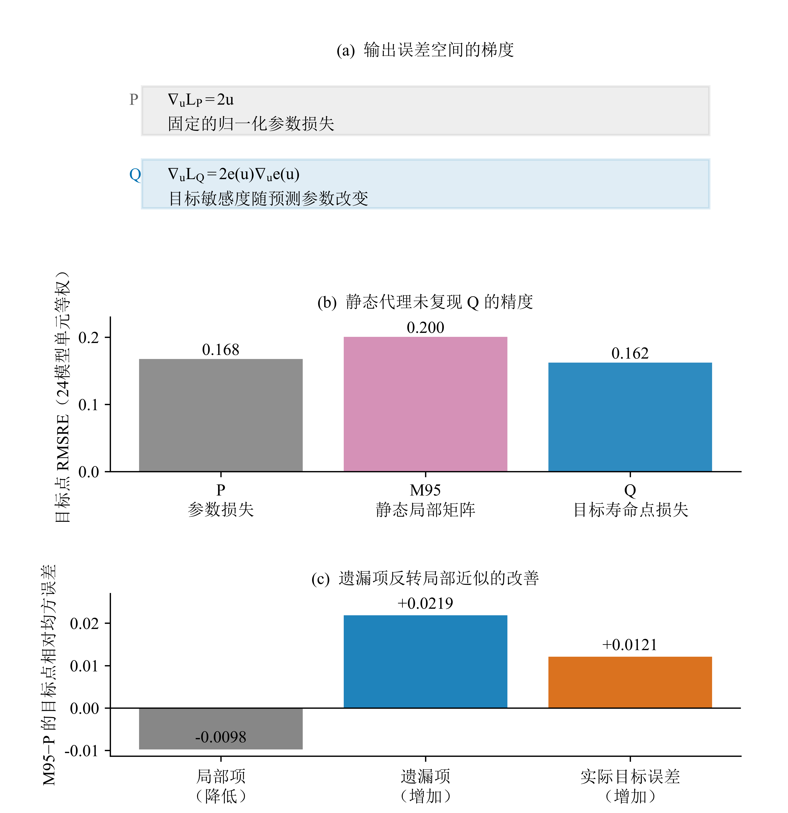
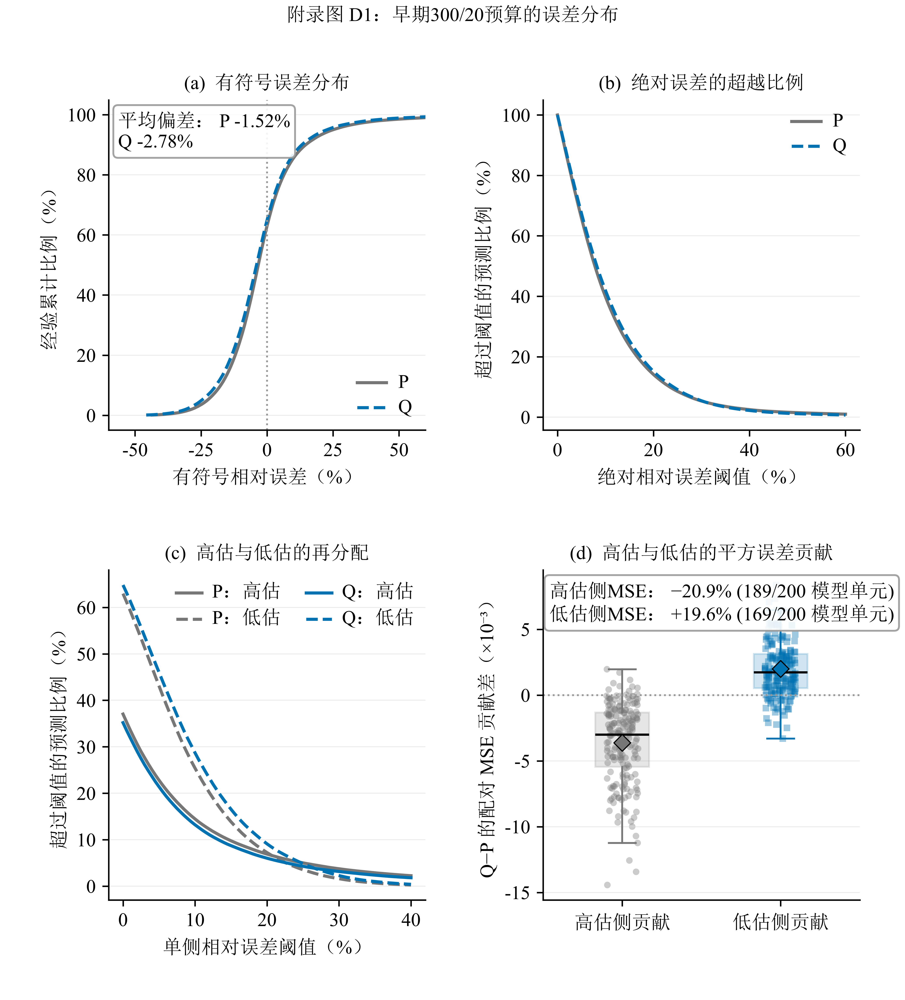

# 附录：三参数 Weibull 寿命点估计中的任务对齐

> 配套正文：[Study02论文初稿 v2.7.0](Study02论文初稿-v2.7.0.md)。附录按 A–F 编排，图表与公式按所属附录独立编号。

本附录提供正文方法的复现细节、完整分层结果和数学推导。附录A–B主要对应共同预算比较；附录C的数学推导适用于所述损失，M95消融及附录D使用早期300/20预算；附录E提供复算索引，附录F报告补充对照。固定加权QP的同预算对照见B.9。

## 附录 A 实验设计、训练与配对推断

### A.1 数据与对照设计

**表 A1　实验设计与对照定义**

| 项目 | 研究设计 |
|---|---|
| 参数空间 | β={1.5,2,…,5}；η=1000；γ/η={.10,.25,.50,.75,1}；n={7,10,15,20} |
| 样本 | 每个参数—样本量组合独立生成 300 组样本；按重复抽样编号模 5 分折 |
| 比较方法 | P / Q / QCP，使用相同的三输出网络和参数取值约束变换 |
| 方法差异 | P、Q 使用不同主损失和对应验证选点指标；QCP 保持 Q 为主目标并增加 P 可行域及可行选点 |
| 模型单元 | 10 个随机种子×4 个样本量×5 折=200 个三方法配对单元 |
| 训练目标与主评价 | 以留出测试集 \(x_{0.95}\) 的总体 RMSRE 判断目标对齐 |
| 跨寿命点评价 | 对同一组三参数预测派生 \(x_{0.90}\)、\(x_{0.95}\)、\(x_{0.99}\)，判断单点目标的曲线代价与 QCP 恢复 |
| 探索性消融 | 3 个随机种子×2 折×4 个样本量=24 个 P/M95/Q 匹配单元；与主分析分开汇总，不计算置信区间 |

P 为三个归一化参数平方误差的等系数和；归一化消除量纲差异，等系数作为参数恢复的共同参照。Q 直接优化 \(x_{0.95}\) 的相对平方误差，仍由网络输出三个 Weibull 参数。通过链式法则，Q 形成随参数点和当前预测变化的动态参数度量，并保留参数交叉项。QCP 求解 \(\min L_Q\)，同时满足 \(L_P\le\tau_j\)：Q 定义主要优化量，P 规定可接受的参数偏离范围。

### A.2 训练设置与配对关系

- MLP：`n-256-128-64-3`，ReLU，双精度浮点计算（float64）；参数取值约束变换保证
  \(\hat\beta>0\)、\(\hat\eta>0\)、\(0<\hat\gamma<\min(X)\)。
- Adam，学习率 $10^{-3}$、权重衰减 $10^{-4}$、批量大小 256；三条路线统一最多训练 600 轮，早停耐心值为 60 轮。
- 优化器设置在三条路线间保持一致；损失数值尺度、QCP 约束与模型检查点选择规则随方法定义变化。
- 随机种子：42、2026、3407、17、73、314、2718、4099、8128、12011。
- P/Q/QCP 在每个模型单元内共享训练、验证和测试数据，输入标准化器、初始化、首轮小批量顺序、网络结构与最大预算。
- 每条路线包括 200 次模型训练和 480,000 条留出测试预测；所有模型均完成训练，预测均为有限值并满足参数支持域。

48,000 组独立寿命样本来自 160 个固定真值单元各 300 次抽样；每组样本在五折中恰好作为一次测试数据，并由 10 个随机种子对应的模型分别预测。因此，每条路线的 480,000 条预测包含同一测试样本上的训练随机性重复。每个 \((n,k,s)\) 组合分别训练网络，200 个模型单元与 160 个固定真值单元表示不同的汇总层级。

#### A.2.1 实验先后顺序与阈值来源

**表 A2　实验先后顺序与阈值来源**

| 阶段 | 设置与用途 | 测试信息的使用 |
|---|---|---|
| 早期 P/Q 比较 | 最多训练 300 轮、早停耐心值 20；匹配 P 模型的最佳验证参数损失作为后续约束参考 | 完成初次评价后用于方法开发与机制分析 |
| QCP 约束与预算选择 | 8 个验证单元、48 次候选训练；另以 8 次训练检查预算扩展；确定 \(c=1.5,\rho=0.1\) 与 600/60 设置 | 两个选择阶段均仅使用训练集和验证集 |
| QCP 评价 | 200 次训练，\(\tau_j=1.5L_{P,\mathrm{ref},j}\) | 固定设置后评价；参考量来自早期 P 模型 |
| 共同预算比较 | P/Q 各进行 200 次 600/60 训练，与 QCP 的 200 个模型比较 | 读取早期测试结果后的预算敏感性分析 |
| 机制与分布分析 | 读取已有预测，派生跨寿命点、区域及误差形态 | 事后分析，不新增模型训练 |

约束筛选使用种子42、折次1和3、全部四种样本量；候选为 $c\in\{1.25,1.5,2.0\}$ 与 $\rho\in\{0.03,0.1\}$ 的六种组合。在至少7/8个验证单元满足阈值的候选中，按汇总验证Q损失选择。乘子初值为0，ρ在每次训练内固定；乘子更新使用当轮各小批量损失的样本数加权平均，检查点另以固定轮末模型评价验证集。候选筛选与最终200个模型全部可行的检查属于不同层级。

QCP检查点以验证集平均 $L_P\le\tau_j$ 判定可行性。正文所报87.2 s为单次训练中位耗时；前置参考训练与筛选耗时如下。

#### A.2.2 共同预算下的运行细节

**表 A3　共同预算下的运行细节**

| 路线 | 最佳训练轮次中位数 | 最佳训练轮次的 90% 分位数 | 运行至 600 轮上限的模型数 | 累计训练耗时 / h | 单模型中位耗时 / s |
|---|---:|---:|---:|---:|---:|
| P | 175.5 | 265.3 | 0 | 2.51 | 41.4 |
| Q | 105.0 | 217.5 | 0 | 1.96 | 29.6 |
| QCP | 159.5 | 362.3 | 3 | 5.58 | 87.2 |

表中运行信息来自 `artifacts/qcp_main_analysis/analysis/summary.json`。累计耗时为各路线训练任务的时长之和，单模型中位耗时描述典型运行；前置训练单列如下。

逐运行元数据另记录：200 个早期 P 参考模型累计 0.821 h，48 次约束筛选训练累计 0.331 h，8 次预算检查累计 0.108 h。若把这些前置训练全部归于 QCP，再加当前 QCP 的 5.58 h，累计约 6.84 h；若参考 P 已因原始比较而存在，QCP 的新增训练成本约为 6.02 h。各值均为单次训练计时求和，不是并行任务的墙钟历时，也不含分析和数据生成。训练采用PyTorch CPU、float64、每进程一个计算线程。

### A.3 风险聚合与配对区间

\[
I=(\mathrm{RMSRE}_P-\mathrm{RMSRE}_Q)/\mathrm{RMSRE}_P.
\tag{A.1}
\]

估计对象是在参数网格内对各样本量和设计单元等权时，两种方法面向新留出样本与训练随机性的 RMSRE 及其相对差。有限样本估计先对 200 个 $(n,k,s)$ 配对单元的 MSE 等权平均，再开方计算 RMSRE 与 $I$。区间估计按 $n$ 分层重采样折次，同时全局重采样随机种子，始终保持方法配对，共重复 200,000 次。由于折间训练集重叠且仅有 10 个随机种子，95% CI 为设计级经验 bootstrap 近似区间。逐样本量区间未作多重比较校正，仅用于描述性分层；QCP−Q 与 QCP−P 对比采用同一聚合和重采样规则。

## 附录 B 完整结果与分层分析

### B.1 目标点误差与模型单元方向

下表 RMSRE 指 $x_{0.95}$ 的均方根相对误差，即逐条相对误差平方后的平均值再开根号，数值越小表示总体平方风险越低。分析文件中的历史字段 `rRMSE` 使用同一公式。

**表 B1　目标点误差、参数损失与补偿**

| 路线 | 总体 RMSRE | 平均参数损失 | 参数补偿指数 |
|---|---:|---:|---:|
| P | 16.432% | 0.05385 | 0.33226 |
| Q | 16.092% | 71.71416 | 0.91455 |
| QCP | **15.841%** | 0.05522 | 0.34532 |

**表 B2　目标点的配对效应及模型单元方向**

| 对比 | RMSRE 相对改善 | 95% CI | 有利模型单元 | 有利随机种子 |
|---|---:|---:|---:|---:|
| Q vs P | 2.069% | [1.280%,2.811%] | 172/200 | 10/10 |
| QCP vs Q | 1.562% | [1.241%,1.898%] | 196/200 | 10/10 |
| QCP vs P | 3.599% | [3.027%,4.180%] | 200/200 | 10/10 |

QCP 的 200 个所选模型检查点均满足验证集参数约束。

*图B1　A为共同预算预测的平均补偿指数，B为每路线200个模型的最佳检查点轮次分布；箱体为四分位区间，中线为中位数，须线延伸至1.5倍四分位距内的最远点。离群点不在该箱线图中显示；虚线标明当前600轮上限。*

### B.2 跨寿命点三路线总比较

跨寿命点分析直接把 200 个配对模型单元保存的三参数预测代入同一 Weibull 寿命公式，无需重新训练。正改善表示表头左侧路线的总体 RMSRE 更低。

**表 B3　跨寿命点三路线比较**

| 寿命点 | P RMSRE | Q RMSRE | QCP RMSRE | Q 相对 P | QCP 相对 Q | QCP 相对 P | QCP-vs-P 有利真值单元 |
|---|---:|---:|---:|---:|---:|---:|---:|
| $x_{0.90}$ | 13.657% | 18.630% | **13.336%** | −36.411% | **28.417%** | **2.353%** | 74/160 |
| $x_{0.95}$ | 16.432% | 16.092% | **15.841%** | **2.069%** | **1.562%** | **3.599%** | 76/160 |
| $x_{0.99}$ | 21.960% | 35.820% | **20.647%** | −63.114% | **42.360%** | **5.981%** | 77/160 |

Q 在直接训练的 $x_{0.95}$ 上优于 P，在 $x_{0.90}$ 与 $x_{0.99}$ 上明显退化；QCP 相对 Q 和相对 P 的三个配对区间均排除 0。QCP 相对 P 的结果表示总体风险较低，区域方向仍由 160 个固定真值单元的统计描述。

**表 B4　跨寿命点配对效应区间**

| 寿命点 | Q 相对 P 改善的 95% CI | QCP 相对 Q 改善的 95% CI | QCP 相对 P 改善的 95% CI |
|---|---:|---:|---:|
| $x_{0.90}$ | −38.508% 至 −34.321% | 27.501% 至 29.282% | 1.809% 至 2.904% |
| $x_{0.95}$ | 1.280% 至 2.811% | 1.241% 至 1.898% | 3.027% 至 4.180% |
| $x_{0.99}$ | −65.268% 至 −61.158% | 41.876% 至 42.855% | 5.277% 至 6.673% |

正文表2的区域效应中位数由跨寿命点分析表逐单元计算：每行取 \(1-\mathrm{RMSRE}_{QCP}/\mathrm{RMSRE}_P\)，再按寿命点汇总 160 行的中位数。由于各单元具有相同行数，总体 MSE 同样对真值单元等权；总体效应与中位数、方向计数的差异来自误差幅度和统计量定义。

### B.3 代表性单元的具体误差

作为效应量级的例子，取 $n=7,\beta=4.5,\gamma/\eta=0.75$：按 QCP 相对 Q 的 RMSRE 改善最接近总体效应选择，并列时按 $n,\beta,\gamma/\eta$ 升序取值。该单元的 RMSRE 从 Q 的 10.17% 降至 QCP 的 10.00%（相对改善 1.60%），平均绝对相对误差从 8.19% 降至 8.07%，±10% 内比例从 66.37% 增至 67.30%。

### B.4 样本量与 P 等效样本量

对 200 个模型单元按 $n$ 聚合，三条路线的 RMSRE 均随单次估计所含寿命观测数增加而下降。P 的四点误差曲线为

\[
E_P(n)=0.568n^{-0.515},\qquad R^2=0.9983,
\tag{B.1}
\]

指数的设计级经验 bootstrap 95% CI 为 [0.479,0.550]。定义

\[
n_{\mathrm{eff},m}(n)=n\left[E_P(n)/E_m(n)\right]^{1/b}.
\tag{B.2}
\]

**表 B5　样本量与等效观测增益**

| n | P RMSRE | Q RMSRE | QCP RMSRE | Q 等效新增 n（95% CI） | QCP 等效新增 n（95% CI） |
|---:|---:|---:|---:|---:|---:|
| 7 | 20.74% | 20.30% | 19.92% | 0.30 [0.18,0.42] | 0.57 [0.47,0.66] |
| 10 | 17.37% | 16.91% | 16.69% | 0.54 [0.07,0.98] | 0.81 [0.46,1.18] |
| 15 | 14.28% | 14.04% | 13.84% | 0.51 [0.03,0.99] | 0.94 [0.57,1.34] |
| 20 | 12.00% | 11.86% | 11.69% | 0.46 [0.25,0.63] | 1.04 [0.87,1.23] |

这里的 $n$ 是每个待估样本中的观测数。等效样本量是基于 P 经验误差曲线的事后描述性换算；$n=20$ 的结果包含轻度曲线外推。

*图B2　A 为四种样本量的 RMSRE 与经验 bootstrap 95% CI；B 为基于 P 四点误差曲线换算的等效新增观测数，用于描述方法收益的量级。*

### B.5 偏差—方差分解

参数网格上的真实 $x_{0.95}$ 为 238.05–1552.09，相差约 6.5 倍。为避免不同真实寿命的数值变化混入标准差，对每个固定 $(n,\beta,\gamma/\eta)$ 真值单元分别计算相对误差偏差与方差，再对 160 个单元等权汇总。

在单元 \(c\) 内令 \(b_c=\operatorname{mean}(e_c)\)、\(v_c=\operatorname{mean}[(e_c-b_c)^2]\)，则偏差 RMS 分量为 \(\sqrt{\operatorname{mean}_c b_c^2}\)，单元内标准差分量为 \(\sqrt{\operatorname{mean}_c v_c}\)。后者同时包含抽样重复与训练随机性带来的波动。

**表 B6　固定真值单元的偏差与波动**

| 路线 | 有符号相对偏差 | 单元偏差 RMS 分量 | 单元内标准差分量 | RMSRE |
|---|---:|---:|---:|---:|
| P | −1.513% | 7.091% | 14.824% | 16.432% |
| Q | −2.713% | 6.994% | 14.493% | 16.092% |
| QCP | −2.482% | 7.001% | 14.210% | 15.841% |

逐路线均满足 $\mathrm{RMSRE}^2=\text{单元偏差RMS}^2+\text{单元内标准差}^2$，数值残差不超过 $3.5\times10^{-18}$。总体有符号偏差允许不同区域抵消，单元偏差 RMS 则保留各区域偏差的绝对幅度。结果显示，RMSRE 改善主要来自单元内标准差分量下降，三条路线的系统偏差分量接近。

### B.6 参数漂移与位置边界诊断

以下分位数由每路线480,000条参数预测计算，汇总整个设计域的参数输出分布。

**表 B7　预测参数的中位数与四分位区间**

| 参数 | P | Q | QCP |
|---|---:|---:|---:|
| $\hat\beta$ | 3.03 [2.15, 3.73] | 20.39 [11.50, 30.16] | 3.02 [2.16, 3.73] |
| $\hat\eta$ | 996.92 [990.51, 1002.49] | 67.00 [34.45, 105.24] | 994.24 [981.49, 1003.13] |
| $\hat\gamma$ | 498.70 [210.07, 801.74] | 784.88 [497.89, 1103.03] | 490.02 [200.15, 804.07] |

真实 $\beta$ 的设计范围为 1.5–5，$\eta=1000$，$\gamma$ 为 100–1000。Q 的形状增大与尺度缩小在输出分布中十分明显。以 $d=(\min(X)-\hat\gamma)/\min(X)$ 定义距位置上界的相对距离，P、Q、QCP 的 $d$ 中位数分别为 0.442、0.121、0.457。Q 的 $d\le10^{-3}$ 比例为 0.014%，$d\le10^{-2}$ 比例为 1.56%；P 与 QCP 在这两个阈值下均为零。这两个阈值用于诊断预测与位置上界的邻近程度。参数漂移广泛存在，但位置上界饱和并非普遍形态。

### B.7 目标点净收益的单元贡献

令 $\Delta_c=\mathrm{MSE}_{P,c}-\mathrm{MSE}_{\mathrm{QCP},c}$，则全域平均 $\Delta_c=0.001909$。正文图4B按 $\Delta_c$ 降序累计并除以 $\sum_c\Delta_c$，前5和前10个单元分别占全部净收益的102.6%和132.8%。比例超过100%说明其他单元中存在抵消收益的退化。

**表 B8　按 P 单元 RMSRE 四等分的收益构成**

| P 基线误差组 | 单元数 | 平均 $\Delta_c$ |
|---|---:|---:|
| 最低四分组 | 40 | 0.000049 |
| 第二四分组 | 40 | −0.000706 |
| 第三四分组 | 40 | −0.001592 |
| 最高四分组 | 40 | 0.009884 |

分组与收益均由同一批测试预测计算，用于定位净收益来源。

**表B9　目标点净收益贡献最大的五个真值单元**

| 排名 | n | β | γ/η | P RMSRE | QCP RMSRE | ΔMSE |
|---|---:|---:|---:|---:|---:|---:|
| 1 | 7 | 1.5 | 0.1 | 63.68% | 54.78% | 0.105427 |
| 2 | 10 | 1.5 | 0.1 | 53.77% | 45.09% | 0.085792 |
| 3 | 7 | 1.5 | 0.25 | 38.19% | 31.84% | 0.044518 |
| 4 | 15 | 1.5 | 0.1 | 43.07% | 37.93% | 0.041606 |
| 5 | 7 | 2 | 0.1 | 43.81% | 39.49% | 0.036002 |

单元按测试预测的ΔMSE降序排列。

### B.8 较宽可靠度范围与参数误差

*图B3　A从同一组三参数预测计算 $R=0.50$–0.99 的总体RMSRE，虚线标出三个预设点，箭头标明训练目标。B为三项归一化参数误差的RMSE，纵轴采用对数尺度并以点表示。*

*图B4　四个样本量下，QCP相对P的目标点单元RMSRE改善。所有面板共用以零为中心的发散色标，蓝色为改善、红色为退化；每个等大格子对应一个设计单元。圆圈编号对应表B9的前五个净收益贡献单元。*

### B.9 固定加权参数损失QP对照

QP使用同一三输出网络，训练损失为 $L_Q+L_P$，按验证 $L_Q$ 选点；权重1.0来自早期验证筛选，共同预算阶段保持不变。QP、P和Q均在600/60预算下训练，与原200个QCP模型按数据、初始化及模型单元配对。三个点的派生均使用相同参数预测。

**表B10　固定加权与参数约束的跨寿命点对照**

| 寿命点 | QP RMSRE | QCP RMSRE | QCP相对QP改善 | 95%经验区间 |
|---|---:|---:|---:|---:|
| $x_{0.90}$ | 13.3377% | 13.3355% | 0.0167% | -0.1169% 至 0.1462% |
| $x_{0.95}$ | 15.8505% | 15.8406% | 0.0623% | -0.0499% 至 0.1679% |
| $x_{0.99}$ | 20.6525% | 20.6468% | 0.0275% | -0.1554% 至 0.2042% |

目标点区间沿用原同预算对照的冻结重采样，非目标点采用相同fold×seed经验bootstrap规则派生；重采样200,000次。QP相对Q在三个点的总体RMSRE分别改善28.41%、1.50%和42.34%，也修复了跨点退化。

QP与QCP的平均参数损失分别为0.055208和0.055218，补偿指数分别为0.345584和0.345324。原运行的训练中位耗时分别为36.3 s和87.2 s；QP累计2.17 h，QCP累计5.58 h，均不含前置筛选。

QCP在验证集上逐模型强制检查 $L_P\le\tau_j$；QP直接优化加权目标，并不强制同一可行性条件。复算与输入校验见 `artifacts/qp_comparison_v270/`。

## 附录 C 敏感度与误差补偿的数学细节

### C.1 参数贡献的精确对称分解

对 \(R=0.95\)，令 \(a=-\ln R\)、\(t_0=a^{1/\beta}\)、\(t_1=a^{1/\hat\beta}\)，定义

\[
c_\gamma=\frac{\hat\gamma-\gamma}{x_R},\qquad
c_\eta=\frac{(\hat\eta-\eta)(t_0+t_1)}{2x_R},\qquad
c_\beta=\frac{(\eta+\hat\eta)(t_1-t_0)}{2x_R}.
\tag{C.1}
\]

逐行精确满足 \(e=c_\beta+c_\eta+c_\gamma\)。正文的 \(C\) 为
\(1-|e|/(|c_\beta|+|c_\eta|+|c_\gamma|)\) 的逐行均值；三项均为零时取零。该对称分解以对称形式处理形状与尺度的乘积项。补偿指数描述三项贡献的抵消程度，参数偏离幅度另由平均参数损失评价。

正文图2C–D对三条路线各480,000条既有预测应用同一分解。图2C的标记、粗线、细线分别表示中位数、25%–75%与5%–95%分位范围。D先在每条预测内计算三项绝对值之和与相加后的绝对误差，再分别在模型单元内取均值，避免不同样本间正负误差相抵。三项之和与直接计算寿命点误差的最大绝对残差为 $1.33\times10^{-15}$，三路线平均补偿指数分别为0.332、0.915、0.345，与既有汇总一致。

以 P 为参照，QCP 使 Q 超额补偿减少的比例为
\((C_Q-C_{QCP})/(C_Q-C_P)=97.8\%\)。该比例描述补偿指标的回落；寿命点误差变化由各寿命点的 RMSRE 单独报告。

### C.2 局部几何与有限误差

令 \(u=((\hat\beta-\beta)/\beta,(\hat\eta-\eta)/\eta,(\hat\gamma-\gamma)/\eta)\)、
\(e=(\hat x_R-x_R)/x_R\)。在与 P 相同的坐标中，

\[
L_P=\|u\|^2,\quad \nabla_uL_P=2u,\quad H_P=2I,
\qquad
L_Q=e(u)^2,\quad \nabla_uL_Q=2e(u)g(u),
\tag{C.2}
\]

其中 \(g(u)=\nabla_u e(u)\)。真值处记 \(s_0=g(0)\)，则
\(H_Q(0)=2s_0s_0^T\)。在 40 个参数点上，\(\|s_0\|=0.766\text{--}4.393\)（相差 5.74 倍），敏感度
方向最大相差 20.3°。P 对应固定欧氏几何，Q 则在当前预测位置传播目标误差与目标敏感度。

真值点矩阵代理为

\[
L_{M95}=(s_0^Tu)^2.
\tag{C.3}
\]

它逐真值点变化，但对当前预测位置静态，且因 \(s_0s_0^T\) 秩一而有二维零空间。若
\(v\ne0\) 且 \(s_0^Tv=0\)，则 \(L_{M95}(\lambda v)=0\)；有限扰动下真实目标仍可因高阶项
变化。路径平均敏感度给出精确恒等式

\[
\bar s(u)=\int_0^1g(tu)dt,\qquad e(u)=\bar s(u)^Tu,\qquad
L_Q=u^T[\bar s(u)\bar s(u)^T]u.
\tag{C.4}
\]

保留 \(\bar s(u)\) 对预测参数的导数时，这一动态矩阵写法与 Q 的前向值和梯度恒等；截断该导数后得到的是另一种代理损失。

### C.3 静态敏感度代理消融

探索性 M95 消融沿用早期 300/20 P/Q 训练设置，使用 3 个随机种子、2 折和 4 个样本量形成 24 个匹配单元。P、M95、Q 的 RMSRE 分别为
0.1676、0.2005 和 0.1622；M95 相对 P 变差 19.61%，24 个单元均未优于 P 或 Q。该消融说明，真值点静态秩一代理在当前实验设置中不足以替代 Q。

### C.4 真值点局部代理为什么失效

对 24 个 P/M95/Q 匹配单元，定义 \(\ell=s_0^Tu\)、\(r=e-\ell\)，则逐行精确有

\[
e^2=\ell^2+2\ell r+r^2.
\tag{C.5}
\]

M95−P 的设计单元等权均值分解为：

**表 C1　静态敏感度代理的误差分解**

| 分量 | M95−P |
|---|---:|
| \(E[\ell^2]\) | −0.0097557 |
| \(E[2\ell r]\) | +0.0041514 |
| \(E[r^2]\) | +0.0177040 |
| \(E[e^2]\) | +0.0120997 |

最大逐行恒等误差为 \(9.1\times10^{-13}\)。静态局部项得到改善，但交叉项和非线性余项足以反转真实目标误差。

该分解显示，M95 的局部目标变好，但局部近似遗漏的有限误差项更大，使真实 \(x_{0.95}\) 误差反而增加。

*图C1　A：输出误差空间中P与Q的梯度；B：24个匹配模型单元的P/M95/Q RMSRE；C：局部近似项与遗漏项。B、C使用早期300/20预算。*

## 附录 D 历史预算下的探索性误差分析

本节沿用早期 300/20 P/Q 结果，用于解释误差再分配，并与附录 B 的 600/60 共同预算结果分开报告。在同一 200 个配对模型单元、每条路线 480,000 条留出测试预测上，令
\(e=(\hat x_{0.95}-x_{0.95})/x_{0.95}\)，得到以下探索性结果：

**表 D1　历史预算下的误差与单侧尾部指标**

| 指标 | P | Q | Q 相对 P |
|---|---:|---:|---:|
| MAE | 0.11048 | 0.11225 | 变差 1.61% |
| 各设计单元内绝对误差上 10% 尾部均值的等权平均（cell-wise CVaR90） | 0.37042 | 0.35336 | 改善 4.61% |
| 高估 >10% | 14.47% | 13.21% | −1.26 pp |
| 高估 >20% | 6.90% | 6.01% | −0.89 pp |
| 低估 >10% | 25.40% | 28.70% | +3.30 pp |
| 低估 >20% | 7.22% | 9.10% | +1.88 pp |

高估侧 MSE 贡献下降 20.9%，低估侧贡献增加 19.6%，净 MSE 下降 5.91%。这些指标属于事后探索性分析，未作多重比较校正；10% 和 20% 为描述性敏感性阈值。当 \(x_{0.95}\) 用作保证寿命阈值时，正误差对应潜在的非保守高估。复算材料位于 `artifacts/pq_engineering_audit/`。

*图D1　使用早期 300/20 P/Q 结果，a–c 为总体误差分布，d 为配对模型单元的高估与低估 MSE 贡献。*

### D.1 历史指标的计算口径

在同一 300/20 比较中，Q 在 46.64% 的逐预测配对行上具有更小的绝对误差。各模型单元绝对误差中位数的等权均值由 P 的 8.000% 增至 Q 的 8.435%。该统计量先在模型单元内计算中位数再等权汇总，正文表3则直接汇总全部共同预算预测，两者口径不同。

高估 >10% 和 >20% 比例的减少量分别为 1.26 和 0.89 个百分点，按未舍入值换算的相对降幅分别为 8.72% 和 12.86%。绝对误差上 10% 尾部均值在 198/200 个模型单元及全部 10 个随机种子上改善。高估侧 MSE 在 189/200 个单元及全部随机种子上下降；低估侧 MSE 在 169/200 个单元及全部随机种子上增加。总 MSE 下降 5.91%，经开方后对应 RMSRE 下降 3.00%。

本节数值来自 `artifacts/pq_engineering_audit/summary.json`。

## 附录 E 数据与复算文件索引

- 10 个随机种子用于确认总体方向与训练随机性；部分探索性子分析采用预先说明的较小重复集合。
- 早期 P/Q 结果：`artifacts/pq_s5b_revision/analysis/summary_s5b.json` 与 `cell_mse.csv`。
- 共同预算三路线汇总：`artifacts/qcp_main_analysis/analysis/summary.json`、`model_cells.csv`、`resource_cells.csv`、`manifest.json` 与 `SHA256SUMS`。
- 正文图组的复算：`manuscript/tools/figures_v270.py`；逐模型补偿量、贡献分位数、单元效应复核及输入输出校验见 `artifacts/manuscript_figures_v270/`。图2A为解析切片，B为实际验证集平均约束，C–D为既有预测的精确贡献分解，图3–4读取既有配对效应与真值单元分析。图中未将模型单元或真值单元视作独立测试样本。
- 跨寿命点与真值区域：`artifacts/qcp_cross_quantile_recovery/analysis/` 下的 `summary.json`、`three_route_comparison.csv` 和 `truth_cell_effects.csv`；对应正文表1–2和图3–4。
- 区域分布及多指标：`artifacts/qcp_resolution_distribution/analysis/` 下的 `summary.json`、`truth_cell_metrics.csv` 和 `representative_predictions.csv`；对应正文表3与附录 B.3。
- 净收益、参数分布与单侧尾部：`artifacts/manuscript_review_v250/` 下的 `target_cell_contributions.csv`、`parameter_distributions.csv`、`tail_and_boundary.csv`、`baseline_quartiles.csv` 与 `summary.json`；对应正文图4B、表3新增行和附录 B.6–B.7。脚本为 `manuscript/tools/review_diagnostics_v250.py`，仅消费已完成预测；摘要中的源文件 SHA 用于复核读取对象。
- 样本量与偏差分解：`artifacts/qcp_sample_size_analysis/`、`artifacts/qcp_bias_variance/`；分别对应 B.4、B.5。
- QCP 方法选择与确认：`artifacts/qcp_constrained_pilot/`、`artifacts/qcp_constrained_resource/` 与 `artifacts/qcp_constrained_confirm/`。
- 机制分析：`artifacts/pq_paper_core/analysis/` 与 `artifacts/pq_mechanism_closure/`，包含敏感度网格、区域、200 个配对单元、`manifest.json` 和 `SHA256SUMS`；这些文件由既有模型结果派生。
- 探索性静态矩阵消融：`artifacts/pq_target_matrix_pilot/`，24 个 P/M95/Q 匹配单元；不与
  200 单元主机制混池推断。
- 先期 3 个随机种子的主结果与机制分析输入：`artifacts/pq_iid_main/`，含 252 条 SHA256 校验记录。
- 10 个随机种子主结果的新增输入：`artifacts/pq_s5b_revision/grid_extra/`。`pq_s5b_revision/continuous/` 与直接标量输出路线未用于本文结果。
- 固定加权QP的三寿命点派生：`manuscript/tools/qp_comparison_v270.py` 与 `artifacts/qp_comparison_v270/`。
- 完整性验证命令：`python -m study02pq.s5b_revision --phase verify`。

## 附录 F 共同验证、可行选点与多寿命点监督

### F.1 对照设计与完整性

补充对照沿用原40参数组合、4样本量、5折、10种子和600/60最大预算，独立新增600条训练轨迹。P_QSELECT仍按参数损失训练，但检查点选择与早停均按验证LQ；与Q的比较因此固定了验证准则，实际停止轮次允许不同。Q重跑时旁路记录同一原生早停轨迹内满足原QCP阈值的最佳验证Q检查点，记为Q_FEAS；旁路记录不影响训练或早停，无可行检查点时不回退、不剔除后重新汇总。QMULTI采用三个寿命点的等权相对平方损失，训练、验证选点与早停均使用该平均损失：

$$
L_{\mathrm{multi}}=\frac13\sum_{R\in\{0.90,0.95,0.99\}}\operatorname{mean}\left[\left(\frac{\hat x_R-x_R}{x_R}\right)^2\right].
$$

三个新轨迹各包含200个模型单元。所有新旧比较均核对训练/验证/测试行、初始化、标准化器、首轮批顺序和网络标识；重跑Q的200个目标指标及最佳轮次均重现原结果。保存逐轮验证历史和选定模型状态。P、QP和QCP复用既有同预算预测，新Q使用重跑结果；新预测保留双精度，旧预测参数的存储精度不回写改变。

该协议在旧测试结果已知后确定，数据仍为原48,000组仿真样本。每条路线480,000条预测中的训练种子重复仍保留。以下区间使用原按n分层fold×全局seed的配对经验bootstrap规则，200,000次重采样，未作多重比较校正。

### F.2 完整结果

**表F1　共同验证与多点监督的总体RMSRE及参数损失**

| 路线 | x0.90 RMSRE | x0.95 RMSRE | x0.99 RMSRE | 平均参数损失 |
|---|---:|---:|---:|---:|
| P | 13.6569% | 16.4320% | 21.9602% | 0.053849 |
| Q | 18.6296% | 16.0921% | 35.8201% | 71.714165 |
| P_QSELECT | 13.6205% | 16.3077% | 21.7155% | 0.056462 |
| QP | 13.3377% | 15.8505% | 20.6525% | 0.055208 |
| QCP | 13.3355% | 15.8406% | 20.6468% | 0.055218 |
| QMULTI | 14.0130% | 16.0977% | 20.8491% | 0.301916 |

**表F2　补充对照的配对RMSRE相对改善**

| 寿命点R | 对比（前者相对后者） | 改善 | 95%经验区间 | 有利模型单元 | 有利种子 |
|---|---|---:|---:|---:|---:|
| 0.9 | Q vs P_QSELECT | -36.776% | -38.670% 至 -34.843% | 0/200 | 0/10 |
| 0.9 | P_QSELECT vs P | 0.266% | -0.126% 至 0.623% | 133/200 | 8/10 |
| 0.9 | QMULTI vs Q | 24.781% | 24.261% 至 25.276% | 200/200 | 10/10 |
| 0.9 | QMULTI vs QCP | -5.081% | -5.990% 至 -4.183% | 1/200 | 0/10 |
| 0.9 | QMULTI vs QP | -5.063% | -5.942% 至 -4.206% | 0/200 | 0/10 |
| 0.95 | Q vs P_QSELECT | 1.322% | 0.631% 至 1.957% | 154/200 | 10/10 |
| 0.95 | P_QSELECT vs P | 0.757% | 0.477% 至 1.029% | 160/200 | 10/10 |
| 0.95 | QMULTI vs Q | -0.035% | -0.333% 至 0.251% | 121/200 | 3/10 |
| 0.95 | QMULTI vs QCP | -1.623% | -2.090% 至 -1.177% | 25/200 | 0/10 |
| 0.95 | QMULTI vs QP | -1.559% | -2.021% 至 -1.131% | 30/200 | 0/10 |
| 0.99 | Q vs P_QSELECT | -64.952% | -66.942% 至 -63.162% | 0/200 | 0/10 |
| 0.99 | P_QSELECT vs P | 1.114% | 0.783% 至 1.420% | 158/200 | 10/10 |
| 0.99 | QMULTI vs Q | 41.795% | 41.332% 至 42.236% | 200/200 | 10/10 |
| 0.99 | QMULTI vs QCP | -0.980% | -1.432% 至 -0.537% | 64/200 | 0/10 |
| 0.99 | QMULTI vs QP | -0.952% | -1.432% 至 -0.491% | 65/200 | 0/10 |

Q_FEAS在0/200条原生Q轨迹内可用；全部记录轮次的最小验证参数损失/阈值比为10.268，未产生可供测试评价的可行模型。

补充结果来源为 `artifacts/submission_controls_v1/analysis/` 下的summary、model_mse、parameter_loss、resources与manifest。
