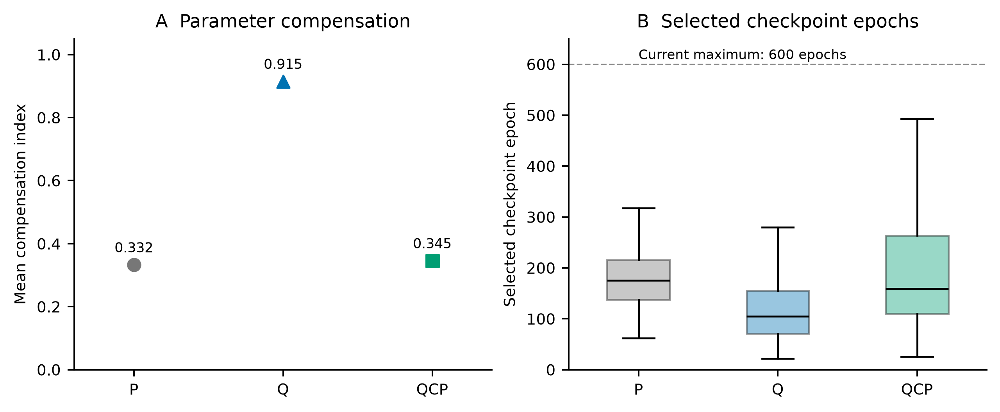
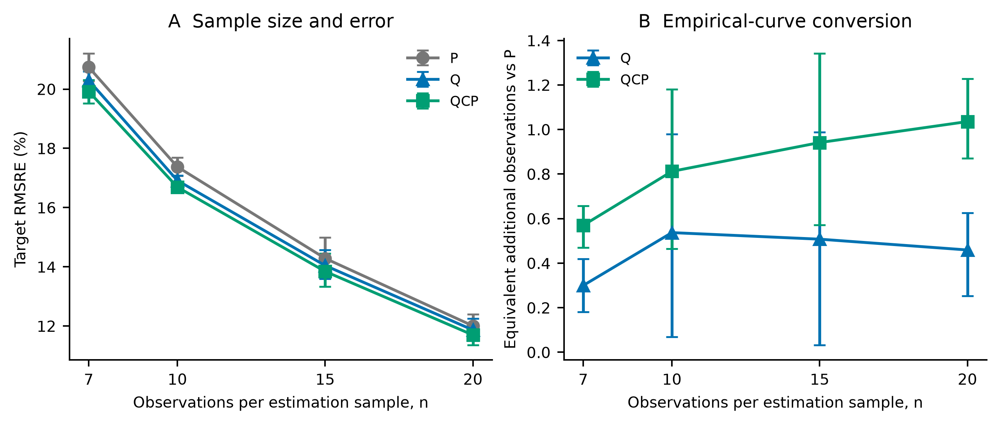
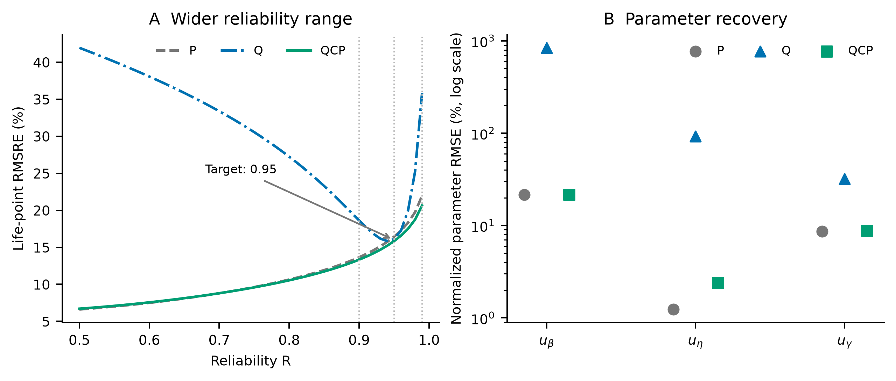
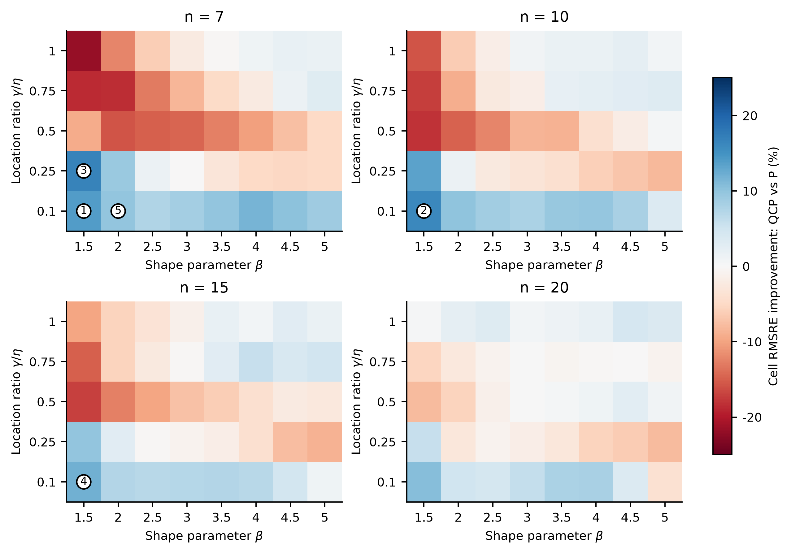
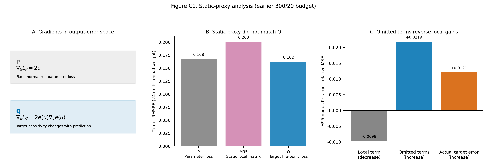
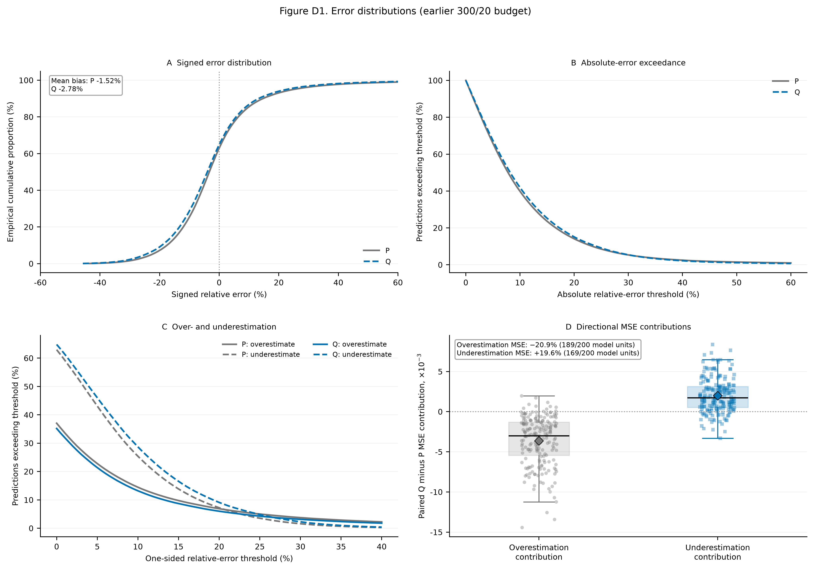

# Supplementary material: task alignment in three-parameter Weibull life-point estimation

Companion to the [v2.7.0 English manuscript](Study02-manuscript-v2.7.0-en.md). Appendices A–B mainly concern the common 600/60 maximum training budget. The mathematics in Appendix C applies to the stated objectives; its M95 ablation and Appendix D use the earlier 300/20 budget. Appendix E identifies reproduction files, and Appendix F reports supplementary controls. These evidence sets are kept separate.

## Appendix A Experimental design, training, and paired inference

### A.1 Data and comparisons

**Table A1. Design overview.**

| Item | Specification |
|---|---|
| Truth cells | 8 shapes × 5 location ratios × 4 sample sizes = 160; scale fixed at 1000 |
| Independent samples | 300 per truth cell; 48,000 in total |
| Paired model units | 10 training seeds × 4 sample sizes × 5 folds = 200 per procedure |
| Primary comparison | P / Q / QCP under a 600-epoch maximum and patience 60 |
| Additional controls | QP in B.9; common selection and multiple-point supervision in F |

The domain comprised $\beta\in\{1.5,2,2.5,3,3.5,4,4.5,5\}$, $\eta=1000$, $\gamma/\eta\in\{0.10,0.25,0.50,0.75,1\}$, and $n\in\{7,10,15,20\}$. Each of the 160 truth cells contained 300 independently generated uncensored samples. Repeat index modulo five determined train/validation/test rotations. P, Q, and QCP shared the three-output architecture and parameter decoder. Their differences concerned the training objective and validation selection: P used parameter loss, Q used target loss, and QCP used target loss subject to parameter-loss feasibility.

The primary target was $x_{0.95}$, evaluated by pooled RMSRE. Cross-point analysis substituted the same estimated parameters into the life formula at $R=0.90$ and $0.99$. The separate exploratory P/M95/Q ablation contained 24 matched units (three seeds, two folds, four sample sizes) and was not pooled with the 200-unit main comparison.

### A.2 Training and pairing

The shared MLP was `n-256-128-64-3` with ReLU hidden layers and float64 computation. Decoding enforced $\hat\beta>0$, $\hat\eta>0$, and $0<\hat\gamma<\min(X)$. Adam used learning rate $10^{-3}$, weight decay $10^{-4}$, and batch size 256. The common maximum budget was 600 epochs with patience 60. Loss scales, constraints, and checkpoint rules differed as specified in the procedure definitions.

Training seeds were 42, 2026, 3407, 17, 73, 314, 2718, 4099, 8128, and 12011. Procedures were paired on sample size, fold, and seed, sharing data, standardizer, initialization, first-epoch batch order, and network structure. Each route comprised 200 fitted models and 480,000 held-out predictions. All primary predictions were finite and support-valid.

There were 48,000 independent lifetime samples, each used once for testing across the five fold rotations and predicted by ten seeded models. The 200 model units $(n,k,s)$ and the 160 truth cells $(n,\beta,\gamma/\eta)$ are different aggregation levels.

#### A.2.1 Chronology and threshold selection

**Table A2. Order of evidence generation.**

| Stage | Role and test-information boundary |
|---|---|
| Earlier P/Q at 300/20 | Initial evaluation and subsequent method development |
| QCP screening and budget checks | Training/validation only; 48 and 8 fits, respectively |
| QCP evaluation | 200 fits with fixed settings and earlier P reference thresholds |
| Common-budget P/Q extension | Budget sensitivity after earlier test results had been read |
| Derived mechanism analyses | Post hoc analyses of saved predictions |
| Supplementary controls | Additional fits on the same simulation samples; Appendix F |

Earlier P/Q fits used a 300-epoch maximum and patience 20. Best validation parameter loss from each matched P model supplied the later reference threshold. Six combinations of $c\in\{1.25,1.5,2\}$ and $\rho\in\{0.03,0.1\}$ were screened on seed 42, folds 1 and 3, and all four sample sizes. Among candidates feasible in at least seven of eight validation units, aggregate validation Q loss determined selection. These 48 fits, plus eight budget-check fits, used training and validation data only. Final settings were $c=1.5$, $\rho=0.1$, and 600/60, followed by 200 QCP fits.

The multiplier started at zero; $\rho$ was fixed within a fit. The epoch-end multiplier update used the sample-count-weighted online batch losses, whereas checkpoint feasibility evaluated the fixed model on the validation set. The seven-of-eight screening rule and the final 200-of-200 feasible checkpoints describe different stages.

The later P/Q common-budget extension followed inspection of earlier test results. Cross-point, regional, and error-distribution analyses used existing predictions.

#### A.2.2 Recorded resources

**Table A3. Training resources under the common maximum budget.**

| Procedure | Median selected epoch | 90th percentile selected epoch | Fits reaching 600 epochs | Sum of training times / h | Median time / s |
|---|---:|---:|---:|---:|---:|
| P | 175.5 | 265.3 | 0 | 2.51 | 41.4 |
| Q | 105.0 | 217.5 | 0 | 1.96 | 29.6 |
| QCP | 159.5 | 362.3 | 3 | 5.58 | 87.2 |

These values describe current fits, not complete development costs. The 200 earlier P references required 0.821 h in total; constraint screening required 0.331 h, and budget checks 0.108 h. Assigning all of these to QCP gives approximately 6.84 h; if P references already exist, the additional QCP training cost is about 6.02 h. These are sums of fit durations, not parallel wall-clock elapsed time, and exclude analysis and data generation. The implementation used PyTorch CPU, float64, and one compute thread per process.

### A.3 Risk aggregation and intervals

The estimand is equal-weight design-domain RMSRE over held-out samples and training randomness. MSE is averaged over 200 paired $(n,k,s)$ model units before taking the square root. Relative improvement of Q over P is

$$
I=\frac{\mathrm{RMSRE}_P-\mathrm{RMSRE}_Q}{\mathrm{RMSRE}_P}.\tag{A.1}
$$

Fold indices are resampled within sample-size strata and seed indices globally, retaining method pairing, for 200,000 replicates. Overlapping fold training sets and ten seeds limit the resulting intervals to design-level empirical approximations. Sample-size-specific intervals are descriptive and unadjusted for multiplicity. QCP contrasts use the same aggregation and resampling rules.

## Appendix B Full results and stratified analyses

### B.1 Target error and paired directions

RMSRE is the square root of mean squared relative life-point error. Legacy `rRMSE` fields in analysis files use this same formula.

**Table B1. Target error, parameter loss, and compensation.**

| Procedure | Pooled RMSRE | Mean parameter loss | Compensation index |
|---|---:|---:|---:|
| P | 16.432% | 0.05385 | 0.33226 |
| Q | 16.092% | 71.71416 | 0.91455 |
| QCP | 15.841% | 0.05522 | 0.34532 |

**Table B2. Paired target effects and directions.**

| Contrast | RMSRE improvement | 95% CI | Favorable model units | Favorable seeds |
|---|---:|---:|---:|---:|
| Q vs P | 2.069% | 1.280% to 2.811% | 172/200 | 10/10 |
| QCP vs Q | 1.562% | 1.241% to 1.898% | 196/200 | 10/10 |
| QCP vs P | 3.599% | 3.027% to 4.180% | 200/200 | 10/10 |

All 200 selected QCP checkpoints satisfied validation-average parameter constraints. This comparison is a common-budget sensitivity analysis following the earlier test evaluation.

*Figure B1. A: mean compensation in common-budget predictions. B: distributions of selected checkpoint epochs, with 200 models per procedure. Boxes span the interquartile range, lines mark medians, and whiskers extend to the most extreme values within 1.5 interquartile ranges; outliers are omitted from this display. The dashed line marks the current 600-epoch maximum.*

### B.2 Cross-point comparisons

The stored parameter predictions from 200 paired units were substituted into the same Weibull formula, without retraining. Positive improvement favors the first procedure named in a contrast.

**Table B3. Pooled errors and improvements across life points.**

| Life point | P RMSRE | Q RMSRE | QCP RMSRE | Q vs P | QCP vs Q | QCP vs P | Truth cells favoring QCP over P |
|---|---:|---:|---:|---:|---:|---:|---:|
| $x_{0.90}$ | 13.657% | 18.630% | 13.336% | −36.411% | 28.417% | 2.353% | 74/160 |
| $x_{0.95}$ | 16.432% | 16.092% | 15.841% | 2.069% | 1.562% | 3.599% | 76/160 |
| $x_{0.99}$ | 21.960% | 35.820% | 20.647% | −63.114% | 42.360% | 5.981% | 77/160 |

**Table B4. Paired 95% empirical intervals for relative improvement.**

| Life point | Q vs P | QCP vs Q | QCP vs P |
|---|---:|---:|---:|
| $x_{0.90}$ | −38.508% to −34.321% | 27.501% to 29.282% | 1.809% to 2.904% |
| $x_{0.95}$ | 1.280% to 2.811% | 1.241% to 1.898% | 3.027% to 4.180% |
| $x_{0.99}$ | −65.268% to −61.158% | 41.876% to 42.855% | 5.277% to 6.673% |

QCP's pooled risk was lower than P at these three points, but regional directions differ. Main Table 2 calculates $1-\mathrm{RMSRE}_{QCP}/\mathrm{RMSRE}_P$ within each of 160 truth cells and takes its median. Equal cell sizes mean pooled MSE also weights truth cells equally; its difference from the median or direction count arises from error magnitude and the statistic being summarized.

### B.3 An illustrative truth cell

The cell $n=7$, $\beta=4.5$, $\gamma/\eta=0.75$ was chosen because its QCP-vs-Q relative improvement was closest to the pooled effect, breaking ties in ascending $n,\beta,\gamma/\eta$. Its RMSRE fell from 10.17% to 10.00% (1.60% relative improvement), mean absolute relative error from 8.19% to 8.07%, and the proportion within ±10% rose from 66.37% to 67.30%. It illustrates a cell near the pooled effect, rather than the median performance of all cells.

### B.4 Sample size and P-equivalent observations

All three procedures improved as the number of observations per estimation sample increased. The four-point P curve was

$$
E_P(n)=0.568n^{-0.515},\qquad R^2=0.9983.\tag{B.1}
$$

The empirical bootstrap 95% interval for the exponent was 0.479 to 0.550. For exponent $b$, define

$$
n_{\mathrm{eff},m}(n)=n\left[E_P(n)/E_m(n)\right]^{1/b}.\tag{B.2}
$$

**Table B5. Sample size and equivalent additional observations.**

| n | P RMSRE | Q RMSRE | QCP RMSRE | Additional n for Q (95% CI) | Additional n for QCP (95% CI) |
|---:|---:|---:|---:|---:|---:|
| 7 | 20.74% | 20.30% | 19.92% | 0.30 (0.18 to 0.42) | 0.57 (0.47 to 0.66) |
| 10 | 17.37% | 16.91% | 16.69% | 0.54 (0.07 to 0.98) | 0.81 (0.46 to 1.18) |
| 15 | 14.28% | 14.04% | 13.84% | 0.51 (0.03 to 0.99) | 0.94 (0.57 to 1.34) |
| 20 | 12.00% | 11.86% | 11.69% | 0.46 (0.25 to 0.63) | 1.04 (0.87 to 1.23) |

This is a post hoc descriptive conversion conditional on the empirical P curve. The $n=20$ estimate involves mild extrapolation beyond the observed curve.

*Figure B2. A: RMSRE by sample size with empirical bootstrap 95% intervals. B: equivalent additional observations derived from the four-point P curve, describing the magnitude of the method difference.*

### B.5 Bias and within-cell variation

True target life varies by about 6.5-fold across the grid (238.05–1552.09). Relative-error bias and variance were therefore calculated within each fixed truth cell before equal-weight aggregation across the 160 cells. For $b_c=\operatorname{mean}(e_c)$ and $v_c=\operatorname{mean}[(e_c-b_c)^2]$, the components are $\sqrt{\operatorname{mean}_c b_c^2}$ and $\sqrt{\operatorname{mean}_c v_c}$.

**Table B6. Cell bias and within-cell variation.**

| Procedure | Signed relative bias | RMS cell bias | Within-cell SD component | RMSRE |
|---|---:|---:|---:|---:|
| P | −1.513% | 7.091% | 14.824% | 16.432% |
| Q | −2.713% | 6.994% | 14.493% | 16.092% |
| QCP | −2.482% | 7.001% | 14.210% | 15.841% |

The identity between squared RMSRE and the sum of squared components held with residual at most $3.5\times10^{-18}$. Signed pooled bias allows regional cancellation; RMS cell bias retains regional magnitudes. Within-cell variation includes sample and training randomness. This post hoc decomposition associates lower pooled error mainly with reduced within-cell variation.

### B.6 Parameter drift and location-boundary diagnostics

These quantiles summarize the design-domain output distribution using 480,000 saved parameter predictions per procedure.

**Table B7. Median predicted parameters and interquartile ranges.**

| Parameter | P | Q | QCP |
|---|---:|---:|---:|
| $\hat\beta$ | 3.03 (2.15, 3.73) | 20.39 (11.50, 30.16) | 3.02 (2.16, 3.73) |
| $\hat\eta$ | 996.92 (990.51, 1002.49) | 67.00 (34.45, 105.24) | 994.24 (981.49, 1003.13) |
| $\hat\gamma$ | 498.70 (210.07, 801.74) | 784.88 (497.89, 1103.03) | 490.02 (200.15, 804.07) |

True shape ranged from 1.5 to 5, scale was 1000, and location ranged from 100 to 1000. Q showed markedly increased shape and reduced scale. Define normalized distance from the location upper bound as $d=(\min(X)-\hat\gamma)/\min(X)$. Median $d$ was 0.442, 0.121, and 0.457 for P, Q, and QCP. For Q, 0.014% of predictions had $d\le10^{-3}$ and 1.56% had $d\le10^{-2}$; both proportions were zero for P and QCP. These thresholds measure proximity to the location upper bound. Parameter drift was widespread, whereas near-saturation of the location upper bound was not.

### B.7 Cell contributions to net target gains

For $\Delta_c=\mathrm{MSE}_{P,c}-\mathrm{MSE}_{QCP,c}$, the mean over all cells was 0.001909. Figure 4B accumulates cells in descending $\Delta_c$ and divides by the total net improvement. The leading five and ten cells contributed 102.6% and 132.8%, respectively. Values above 100% indicate that deteriorating cells offset part of the positive gains.

**Table B8. Gains by quartile of P cell RMSRE.**

| P baseline-error group | Cells | Mean $\Delta_c$ |
|---|---:|---:|
| Lowest quartile | 40 | 0.000049 |
| Second quartile | 40 | −0.000706 |
| Third quartile | 40 | −0.001592 |
| Highest quartile | 40 | 0.009884 |

Grouping and gains both use the same test results and are mathematically coupled. This table localizes observed gains without establishing a causal relation between difficulty and improvement or a deployment rule. Shared trained networks also preclude treating cell directions as independent Bernoulli trials.

**Table B9. Five truth cells contributing most to net target gains.**

| Rank | n | $\beta$ | $\gamma/\eta$ | P RMSRE | QCP RMSRE | $\Delta$MSE |
|---|---:|---:|---:|---:|---:|---:|
| 1 | 7 | 1.5 | 0.1 | 63.68% | 54.78% | 0.105427 |
| 2 | 10 | 1.5 | 0.1 | 53.77% | 45.09% | 0.085792 |
| 3 | 7 | 1.5 | 0.25 | 38.19% | 31.84% | 0.044518 |
| 4 | 15 | 1.5 | 0.1 | 43.07% | 37.93% | 0.041606 |
| 5 | 7 | 2 | 0.1 | 43.81% | 39.49% | 0.036002 |

### B.8 Wider reliability range and parameter errors

*Figure B3. A: descriptive pooled RMSRE over $R=0.50$–0.99 from the same parameter predictions. Vertical lines mark the three prespecified life points and the arrow identifies the training target. B: RMSE of the three normalized parameter errors, shown as points on a logarithmic vertical axis.*

*Figure B4. QCP-vs-P target RMSRE improvement across the parameter grid for each sample size. Panels share a zero-centered diverging scale: blue denotes improvement and red deterioration. Each equal-sized tile represents one design cell. Circled numbers identify the five leading net-gain cells in Table B9.*

### B.9 Fixed-weight parameter penalty

QP used the same three-output network, training on $L_Q+L_P$ and selecting by validation $L_Q$. Weight 1.0 came from earlier validation screening and was held fixed in the common-budget stage. P, Q, and QP were trained at 600/60 and paired with the original 200 QCP models on data and initialization. All three life points were derived from the same parameter predictions.

**Table B10. Fixed weighting versus parameter constraints.**

| Life point | QP RMSRE | QCP RMSRE | QCP-vs-QP improvement | 95% empirical interval |
|---|---:|---:|---:|---:|
| $x_{0.90}$ | 13.3377% | 13.3355% | 0.0167% | −0.1169% to 0.1462% |
| $x_{0.95}$ | 15.8505% | 15.8406% | 0.0623% | −0.0499% to 0.1679% |
| $x_{0.99}$ | 20.6525% | 20.6468% | 0.0275% | −0.1554% to 0.2042% |

The target interval retains the frozen original resampling; non-target intervals use the same fold-by-seed empirical bootstrap scheme with 200,000 replicates. Relative to Q, QP improved pooled RMSRE by 28.41%, 1.50%, and 42.34%, also repairing cross-point deterioration.

Mean parameter losses were 0.055208 and 0.055218 for QP and QCP, and compensation indices were 0.345584 and 0.345324. Recorded median fit times were 36.3 s and 87.2 s; summed times were 2.17 h and 5.58 h, excluding preliminary selection. QCP checks feasibility separately for each selected model; QP does not enforce that condition.

## Appendix C Sensitivity and exact compensation

### C.1 Exact symmetric parameter contributions

For $R=0.95$, let $a=-\ln R$, $t_0=a^{1/\beta}$, and $t_1=a^{1/\hat\beta}$. Define

$$
c_\gamma=\frac{\hat\gamma-\gamma}{x_R},\quad
c_\eta=\frac{(\hat\eta-\eta)(t_0+t_1)}{2x_R},\quad
c_\beta=\frac{(\eta+\hat\eta)(t_1-t_0)}{2x_R}.\tag{C.1}
$$

Each row satisfies $e=c_\beta+c_\eta+c_\gamma$. The compensation index averages $1-|e|/(|c_\beta|+|c_\eta|+|c_\gamma|)$, assigning zero when all contributions are zero. The decomposition handles the shape–scale product symmetrically. Compensation describes cancellation; mean parameter loss separately quantifies displacement.

Figure 2C–D applies this decomposition to 480,000 predictions per procedure. Panel C reports medians, interquartile ranges, and 5th–95th percentile ranges. Panel D calculates magnitudes within predictions before model-level averaging, avoiding cancellation between samples. Maximum absolute residual against directly calculated life-point error was $1.33\times10^{-15}$. Mean compensation was 0.332, 0.915, and 0.345 for P, Q, and QCP. The reduction in excess compensation relative to P was 97.8%; life-point accuracy is separately quantified by RMSRE.

### C.2 Local geometry and finite error

In normalized error coordinates $u$, with $g(u)=\nabla_u e(u)$,

$$
L_P=\|u\|^2,\quad\nabla_uL_P=2u,\quad H_P=2I,
\qquad L_Q=e(u)^2,\quad\nabla_uL_Q=2e(u)g(u).\tag{C.2}
$$

At the truth, $s_0=g(0)$ and $H_Q(0)=2s_0s_0^T$. Across the 40 parameter combinations, $\|s_0\|$ ranged from 0.766 to 4.393 (a 5.74-fold range), with a maximum angular difference of 20.3°. P has fixed Euclidean geometry; Q propagates target error and sensitivity at the current prediction.

The truth-point proxy is

$$
L_{M95}=(s_0^Tu)^2.\tag{C.3}
$$

It varies with the truth point but is static with respect to the current prediction. Its rank-one matrix leaves a two-dimensional null space: if $s_0^Tv=0$, then $L_{M95}(\lambda v)=0$, although finite perturbations can change the actual target through higher-order terms. On the admissible differentiable path from truth to prediction,

$$
\bar s(u)=\int_0^1g(tu)\,dt,\qquad e(u)=\bar s(u)^Tu,\qquad
L_Q=u^T[\bar s(u)\bar s(u)^T]u.\tag{C.4}
$$

Retaining derivatives of $\bar s(u)$ makes this dynamic-matrix representation identical to Q in value and gradient. Stopping those derivatives defines a different proxy objective.

### C.3 Static-proxy ablation

The exploratory M95 ablation used the earlier 300/20 P/Q settings, three seeds, two folds, and four sample sizes (24 matched units). RMSRE was 0.1676 for P, 0.2005 for M95, and 0.1622 for Q. M95 was 19.61% worse than P and outperformed neither P nor Q in any unit. The tested static rank-one proxy was therefore insufficient to replace Q in this setting.

### C.4 Why the local approximation did not reproduce Q

For the 24 matched P/M95/Q units, let $\ell=s_0^Tu$ and $r=e-\ell$. Then

$$
e^2=\ell^2+2\ell r+r^2.\tag{C.5}
$$

**Table C1. Equal-weight model-unit M95-minus-P decomposition.**

| Component | M95 minus P |
|---|---:|
| $E[\ell^2]$ | −0.0097557 |
| $E[2\ell r]$ | +0.0041514 |
| $E[r^2]$ | +0.0177040 |
| $E[e^2]$ | +0.0120997 |

The maximum row-level identity residual was $9.1\times10^{-13}$. The local term improved, but cross and remainder terms reversed the change in actual error.

*Figure C1. A: P and Q gradients in output-error space. B: P/M95/Q RMSRE across 24 matched model units. C: the local approximation and omitted terms. B–C use the earlier 300/20 budget.*

## Appendix D Exploratory errors under the historical budget

This section uses the earlier 300/20 P/Q fits, separately from the common-budget analysis. The same 200 paired model units yielded 480,000 held-out predictions per route. Relative error is $e=(\hat x_{0.95}-x_{0.95})/x_{0.95}$.

**Table D1. Historical-budget absolute and one-sided errors.**

| Metric | P | Q | Q relative to P |
|---|---:|---:|---:|
| Mean absolute relative error | 0.11048 | 0.11225 | 1.61% worse |
| Equal-weight mean of within-model-unit upper-10% absolute-error tail means (cell-wise CVaR90) | 0.37042 | 0.35336 | 4.61% better |
| Overestimation >10% | 14.47% | 13.21% | −1.26 percentage points |
| Overestimation >20% | 6.90% | 6.01% | −0.89 percentage points |
| Underestimation >10% | 25.40% | 28.70% | +3.30 percentage points |
| Underestimation >20% | 7.22% | 9.10% | +1.88 percentage points |

The overestimation-side MSE contribution fell by 20.9%, while the underestimation-side contribution increased by 19.6%, giving a net MSE reduction of 5.91%. Thresholds of 10% and 20% are descriptive sensitivity choices; no multiplicity adjustment was applied. If the target is used as a guaranteed-life threshold, positive error represents potentially nonconservative overestimation.

*Figure D1. Historical 300/20 P/Q results. A–C: pooled error distributions. D: paired model-unit changes in overestimation and underestimation MSE contributions.*

### D.1 Historical aggregation conventions

Q had lower absolute error in 46.64% of paired prediction rows. The equal-weight mean of model-unit median absolute errors increased from 8.000% to 8.435%; main Table 3 instead uses the pooled median across common-budget predictions. These statistics and budgets differ.

Reductions in >10% and >20% overestimation were 1.26 and 0.89 percentage points, corresponding to relative reductions of 8.72% and 12.86% from unrounded values. Upper-10% tail means improved in 198/200 model units and all ten seeds. Overestimation MSE decreased in 189/200 units and all seeds, while underestimation MSE increased in 169/200 units. The 5.91% MSE reduction corresponds to a 3.00% RMSRE reduction after taking square roots.

## Appendix E Reproducibility index

Paths below are relative to the Study02 root in the local bundle. Retained legacy field names do not change the definitions used in the paper.

| Evidence | Path |
|---|---|
| Main common-budget summaries, pairing and resources | `artifacts/qcp_main_analysis/analysis/` |
| Cross-point comparisons and 160 truth-cell effects | `artifacts/qcp_cross_quantile_recovery/analysis/` |
| Distributions and representative predictions | `artifacts/qcp_resolution_distribution/analysis/` |
| Parameter distributions, boundaries, tails and net-gain quartiles | `artifacts/manuscript_review_v250/` |
| Sample-size and bias–variance analyses | `artifacts/qcp_sample_size_analysis/`, `artifacts/qcp_bias_variance/` |
| QCP selection, budget checks and final fits | `artifacts/qcp_constrained_pilot/`, `artifacts/qcp_constrained_resource/`, `artifacts/qcp_constrained_confirm/` |
| Four-route P/Q/QP evidence under 600/60 | `归档/旧实验/四路线同预算敏感性/artifacts/equal_budget_sensitivity/` |
| QP cross-point derivation | `manuscript/tools/qp_comparison_v270.py`, `artifacts/qp_comparison_v270/` |
| Current figures, validation feasibility and exact contributions | `manuscript/tools/figures_v270.py`, `artifacts/manuscript_figures_v270/` |
| Earlier P/Q and additional seeds | `artifacts/pq_iid_main/`, `artifacts/pq_s5b_revision/grid_extra/` |
| Earlier mechanism analyses | `artifacts/pq_paper_core/analysis/`, `artifacts/pq_mechanism_closure/` |
| Exploratory 24-unit P/M95/Q ablation | `artifacts/pq_target_matrix_pilot/` |
| Historical error distributions | `artifacts/pq_engineering_audit/` |
| Supplementary control protocol, fits and analysis | `protocols/25-投稿修订补充对照.md`, `artifacts/submission_controls_v1/` |

Figure 2A is an analytic slice, B uses actual validation-average constraints, and C–D use exact decompositions of saved predictions. Figures 3–4 retain the original paired effects and truth-cell analysis. Historical analysis outputs are preserved separately. Continuous-domain and direct-scalar-output exploratory routes are not used in this paper. Complete commands, dependency information, included-file scope, and checksums are supplied with the local reproducibility bundle. No public accession is currently assigned.

## Appendix F Supplementary controls

### F.1 Controls and completeness

The supplementary experiment retained the original 40 parameter combinations, four sample sizes, five folds, ten seeds, and 600/60 maximum budget, adding 600 training trajectories in a separate output directory. P_QSELECT trained on parameter loss but used validation LQ for both checkpoint selection and early stopping. Its contrast with Q therefore held the validation criterion fixed while allowing stopping epochs to vary. Repeated Q fits recorded the best validation-Q checkpoint satisfying the original QCP threshold within the same native early-stopping trajectory (Q_FEAS), without changing updates or stopping. Unavailable feasible checkpoints were neither replaced by unconstrained Q nor silently discarded. QMULTI trained, selected, and stopped using the equally weighted mean of three relative squared life-point losses:

$$
L_{\mathrm{multi}}=\frac13\sum_{R\in\{0.90,0.95,0.99\}}\operatorname{mean}\left[\left(\frac{\hat x_R-x_R}{x_R}\right)^2\right].
$$

Each new trajectory type comprised 200 model units. Train/validation/test rows, initialization, standardizer, first-epoch batch order, and network identifiers were checked against the original pairing. All 200 repeated Q target metrics and selected epochs reproduced the original records. Validation histories and selected states were saved. Existing common-budget P, QP, and QCP predictions were reused; Q predictions came from the repeated fits. New predictions retained double precision; the stored precision of historical predictions was not changed.

These controls were specified after earlier test results were known and reused the original 48,000 simulation samples. Each route's 480,000 prediction rows retain the repeated-seed structure. Intervals used the existing sample-size-stratified fold-by-global-seed paired empirical bootstrap, with 200,000 replicates and no multiplicity adjustment.

### F.2 Full results

**Table F1. Pooled RMSRE and parameter loss for supplementary controls.**

| Procedure | x0.90 RMSRE | x0.95 RMSRE | x0.99 RMSRE | Mean parameter loss |
|---|---:|---:|---:|---:|
| P | 13.6569% | 16.4320% | 21.9602% | 0.053849 |
| Q | 18.6296% | 16.0921% | 35.8201% | 71.714165 |
| P_QSELECT | 13.6205% | 16.3077% | 21.7155% | 0.056462 |
| QP | 13.3377% | 15.8505% | 20.6525% | 0.055208 |
| QCP | 13.3355% | 15.8406% | 20.6468% | 0.055218 |
| QMULTI | 14.0130% | 16.0977% | 20.8491% | 0.301916 |

**Table F2. Paired relative RMSRE improvements.**

| Reliability R | Contrast (first vs second) | Improvement | 95% empirical interval | Favorable model units | Favorable seeds |
|---|---|---:|---:|---:|---:|
| 0.9 | Q vs P_QSELECT | -36.776% | -38.670% to -34.843% | 0/200 | 0/10 |
| 0.9 | P_QSELECT vs P | 0.266% | -0.126% to 0.623% | 133/200 | 8/10 |
| 0.9 | QMULTI vs Q | 24.781% | 24.261% to 25.276% | 200/200 | 10/10 |
| 0.9 | QMULTI vs QCP | -5.081% | -5.990% to -4.183% | 1/200 | 0/10 |
| 0.9 | QMULTI vs QP | -5.063% | -5.942% to -4.206% | 0/200 | 0/10 |
| 0.95 | Q vs P_QSELECT | 1.322% | 0.631% to 1.957% | 154/200 | 10/10 |
| 0.95 | P_QSELECT vs P | 0.757% | 0.477% to 1.029% | 160/200 | 10/10 |
| 0.95 | QMULTI vs Q | -0.035% | -0.333% to 0.251% | 121/200 | 3/10 |
| 0.95 | QMULTI vs QCP | -1.623% | -2.090% to -1.177% | 25/200 | 0/10 |
| 0.95 | QMULTI vs QP | -1.559% | -2.021% to -1.131% | 30/200 | 0/10 |
| 0.99 | Q vs P_QSELECT | -64.952% | -66.942% to -63.162% | 0/200 | 0/10 |
| 0.99 | P_QSELECT vs P | 1.114% | 0.783% to 1.420% | 158/200 | 10/10 |
| 0.99 | QMULTI vs Q | 41.795% | 41.332% to 42.236% | 200/200 | 10/10 |
| 0.99 | QMULTI vs QCP | -0.980% | -1.432% to -0.537% | 64/200 | 0/10 |
| 0.99 | QMULTI vs QP | -0.952% | -1.432% to -0.491% | 65/200 | 0/10 |

Q_FEAS was available in 0/200 native Q trajectories. The smallest recorded validation parameter-loss/threshold ratio was 10.268; no feasible model was available for test evaluation.

Supplementary results are recorded in the summary, model_mse, parameter_loss, resources, and manifest files in `artifacts/submission_controls_v1/analysis/`.
