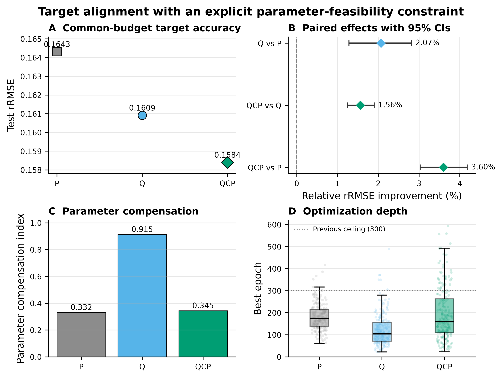
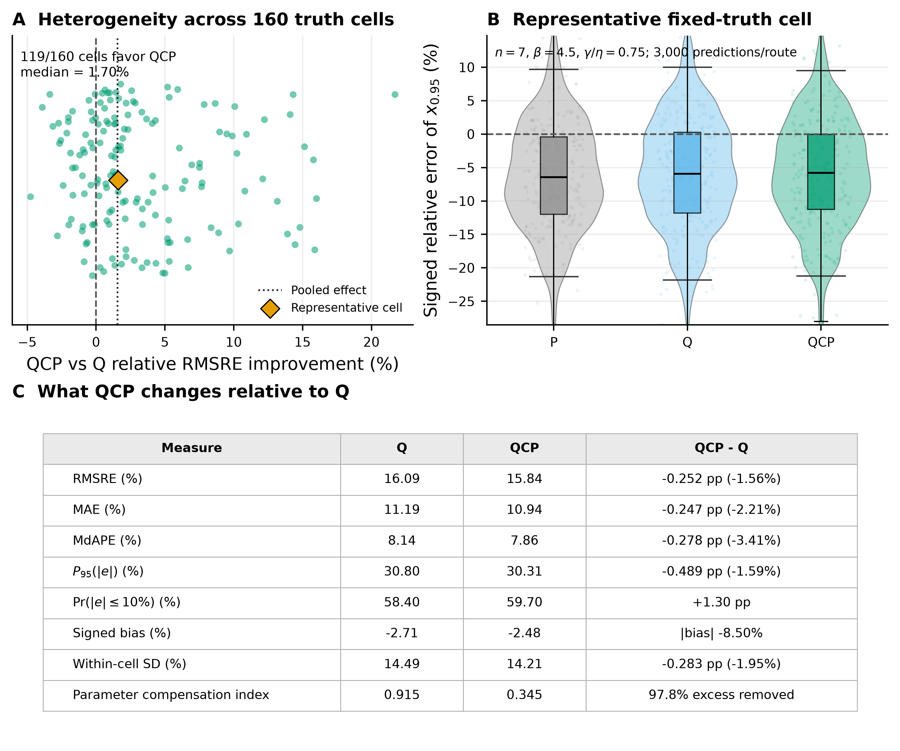

# 三参数 Weibull 寿命点神经估计的任务导向损失与约束学习

> 论文工作稿 v2.1 · 目标寿命点对齐与跨寿命点约束学习 · 2026-08-29

## 摘要

三参数 Weibull 参数估计最终常用于计算可靠度寿命点，而常见参数损失将归一化后的形状、尺度和位置误差等权相加。这种处理评价参数恢复；实际寿命点任务则要求三个参数的重要程度由寿命点公式确定。本文以 $x_{0.95}$ 为代表任务，研究由实际使用量定义训练目标能否改善寿命点估计。

本文比较参数等权损失 P、寿命点损失 Q 和参数约束寿命点学习 QCP。Q 保留与 P 相同的三参数输出和合法解码，但通过寿命点公式反向传播误差，使参数方向的重要性及其交互作用由当前任务决定。QCP 则保持 Q 为唯一优化目标，以 P 定义可接受参数解的边界，用于排除单一寿命点监督产生的过度参数补偿。

在广参数域、统一训练预算和 200 个配对模型单元下，Q 将训练目标 $x_{0.95}$ 的 RMSRE 从 16.43% 降至 16.09%，相对改善 2.07%（95% CI [1.28%,2.81%]）。但同一组参数预测在 $x_{0.90}$ 和 $x_{0.99}$ 上分别比 P 差 36.41% 和 63.11%。这说明单点目标对齐虽然改善了被直接监督的寿命点，却允许三个参数沿等 $x_{0.95}$ 方向补偿，从而使其他寿命点明显失真。

针对这一缺陷，本文提出 QCP：以 Q 保持目标寿命点对齐，以 P 约束排除参数补偿解。QCP 消除了 Q 相对 P 的 97.8% 超额参数补偿，并将 $x_{0.90}$、$x_{0.95}$ 和 $x_{0.99}$ 的 RMSRE 分别降至 13.34%、15.84% 和 20.65%，相对 P 改善 2.35%、3.60% 和 5.98%。QCP 由此在保留目标对齐的同时恢复了跨寿命点一致性，形成了任务目标与参数约束协同作用的估计路线。

**关键词**：三参数 Weibull；可靠度寿命点；任务诱导度量；参数补偿；约束学习；神经网络

## Abstract

Three-parameter Weibull estimates are often used to calculate reliability life points, whereas conventional parameter losses equally combine normalized shape, scale, and location errors. Such a loss measures parameter recovery but does not establish how strongly each parameter should matter to the deployed life point. We therefore use $x_{0.95}$ as a representative task and examine whether the deployed quantity itself should define the training objective.

We compare an equal-weight parameter loss (P), a life-point loss (Q), and parameter-constrained life-point learning (QCP). Q retains the same three-parameter output and legal decoder as P, but backpropagates error through the life-point formula. QCP keeps Q as the sole objective and uses P only to define an admissible region that excludes excessive internal parameter compensation.

Across a broad parameter domain, a common training budget, and 200 paired model units, Q reduced the RMSRE of its trained target $x_{0.95}$ from 16.43% to 16.09%, a relative improvement of 2.07% (95% CI: 1.28%–2.81%). However, the same parameter predictions were 36.41% and 63.11% worse than P at $x_{0.90}$ and $x_{0.99}$, respectively. A single aligned target therefore improved the supervised life point while allowing compensation along an equal-$x_{0.95}$ direction that distorted other life points.

We therefore propose QCP, which keeps Q as the target objective and uses P to exclude compensating parameter solutions. QCP removed 97.8% of Q's excess parameter compensation and reduced the RMSREs of $x_{0.90}$, $x_{0.95}$, and $x_{0.99}$ to 13.34%, 15.84%, and 20.65%, corresponding to improvements of 2.35%, 3.60%, and 5.98% over P. QCP thereby retained task alignment while restoring cross-life-point consistency, providing a unified route that combines a task objective with parameter constraints.

## 1 引言

三参数 Weibull 分布以形状 $\beta$、尺度 $\eta$ 和位置 $\gamma$ 描述寿命，其可靠度函数为

$$
R(x)=\exp\left[-\left(\frac{x-\gamma}{\eta}\right)^\beta\right],\qquad x>\gamma,
$$

满足 $R(x_R)=R$ 的可靠度寿命点为

$$
x_R=\gamma+\eta[-\ln R]^{1/\beta}.
$$

三参数模型的小样本估计长期具有挑战 [1,2,3,4]。既有研究提出了最小差异方法 [5,6]、神经网络估计 [7,12] 以及多种经典拟合和一致估计方法 [13,14]。无论采用何种端到端三输出网络，训练前都必须把“形状、尺度、位置三个误差如何合成一个标量”写进损失。直接使用原始 MSE 会混入量纲和数值尺度；先归一化再给三项 $1{:}1{:}1$ 权重解决了可比性，却没有自动给出工程重要性的依据。

许多可靠性任务最终使用由三个参数导出的可靠度寿命点。例如，$x_{0.95}$ 表示可靠度为 95% 时的寿命边界，等价于失效分布的 5% 分位点。此时参数估计是中间步骤，寿命点是实际评价和决策量。回归分位数、任务聚焦学习和端到端决策学习 [8,9,10,11] 以及评分函数与目标泛函的研究 [15] 都说明，训练评价量应由最终使用目标决定。在 Weibull 研究中，参数 MSE 排序与插件分位点估计排序也可能不同 [16]。本文据此采用确定性 $x_R$ 相对平方损失实现寿命点目标对齐。

固定权重可以清楚评价参数恢复，但特定寿命点任务需要由任务本身确定参数误差的重要程度。对 $x_R$ 而言，$\beta,\eta,\gamma$ 的影响随参数位置变化，不同参数误差还可相互抵消或放大。Q 让寿命点公式通过反向传播，在每个当前预测位置形成动态参数误差度量。本文据此检验三个连续环节：任务诱导度量相对参数误差参照的改善幅度、限制改善幅度的统计与优化机制，以及参数约束对弱识别方向的修正作用。

P 通过三个参数真值提供三维监督，Q 则把监督压缩为一个寿命点误差。Q 对齐了 $x_{0.95}$ 的评价尺度，同时放宽了内部参数的可辨识性：多组 $(\hat\beta,\hat\eta,\hat\gamma)$ 可以产生近似相同的 $\hat x_{0.95}$，而这些参数组合给出的 $x_{0.90}$、$x_{0.99}$ 和寿命曲线形状一般不同。因此，本文同时检验 Q 在训练目标上的收益与跨寿命点表现，并进一步用参数可行域筛除过度补偿解。

本文围绕三个连续问题展开。第一，当实际使用量是 $x_{0.95}$ 时，直接优化寿命点的 Q 是否比等权参数损失 P 更合适？第二，Q 对 $x_{0.95}$ 的目标对齐是否以 $x_{0.90}$、$x_{0.99}$ 和参数可信性为代价？第三，保持 Q 为主目标、以 P 定义可行域的 QCP，能否同时保留目标收益并恢复跨寿命点一致性？

本文建立了一条递进方法路线：P 提供参数恢复参照；Q 由实际寿命点直接定义训练目标，并揭示单点监督产生的跨寿命点失真；QCP 以参数可行域约束 Q 的弱识别方向，形成“目标对齐加参数一致性约束”的联合算法。三个预设寿命点、配对区间、区域异质性和参数补偿共同刻画该算法的精度收益与作用机制。

## 2 方法

### 2.1 数据与冻结设计域

参数空间与 Study01 正式设计一致：

$$
\beta\in\{1.5,2,2.5,3,3.5,4,4.5,5\},\quad
\eta=1000,\quad
\gamma/\eta\in\{0.10,0.25,0.50,0.75,1.00\},
$$

$n\in\{7,10,15,20\}$。每个参数—样本量组合生成 300 个独立 repeats；按 `repeat_id mod 5` 分折，使每折训练、验证和测试都覆盖同一组精确参数点，但样本彼此独立。输入为升序排列的原始样本，每个输入位置的 StandardScaler 只由当前训练折拟合。

本文固定 $\eta=1000$，真实寿命点仍跨越多个数值尺度。由于 $\gamma/\eta$ 从 0.10 变化到 1.00，$\beta$ 又改变低尾寿命项 $[-\ln(0.95)]^{1/\beta}$，冻结网格上的真实 $x_{0.95}$ 从 238.05 变化到 1552.09，相差约 6.5 倍。若直接混合计算带寿命单位的普通 RMSE，真实寿命较大的参数区域会获得更大数值权重；使用逐条相对误差可使不同寿命水平按比例误差比较。

本文的估计对象是上述冻结网格内的受控任务。

### 2.2 网络、任务度量与 P、Q、QCP 三条路线

三条路线使用相同的 MLP（$n\rightarrow256\rightarrow128\rightarrow64\rightarrow3$，ReLU，float64）、合法参数解码、初始化和 batch 顺序。QCP 根据测试封存的资源门使用 `600/60`；当前横向分析将 P、Q 同样扩展到 `600/60`，从而统一最大 epoch 与 patience。解码结构性保证 $\hat\beta>0$、$\hat\eta>0$、$0<\hat\gamma<\min(X)$。

`P_equal` 的损失为

$$
L_P=\operatorname{mean}\left[
\left(\frac{\hat\beta-\beta}{\beta}\right)^2+
\left(\frac{\hat\eta-\eta}{\eta}\right)^2+
\left(\frac{\hat\gamma-\gamma}{\eta}\right)^2
\right].
$$

这里“equal”表示三个已归一化平方项使用相同系数。归一化消除了量纲和一阶数值尺度差异，$1{:}1{:}1$ 构成透明的任务无关参照；三个参数对寿命点的实际作用则由 Q 的目标公式确定。

`Q_param` 使用完全相同的三参数输出与解码，但优化

$$
L_Q=\operatorname{mean}\left[
\left(\frac{\hat x_{0.95}-x_{0.95}}{x_{0.95}}\right)^2
\right].
$$

Q 保留与 P 相同的三参数输出、合法解码和参数依赖关系，使路线差异集中在训练目标及其对应的 checkpoint 选择。三个输出共同形成目标寿命点。每条路线以自身验证损失选择 checkpoint，因此“训练损失 + 对齐的验证选择”共同构成干预。优化器为 Adam（lr $10^{-3}$、weight decay $10^{-4}$），batch 256。同预算验证统一最多 600 epochs、patience 60，并保持共同的优化器设置。

令归一化参数误差为 $u$、相对寿命点误差为 $e(u)$。在真值附近，Q 有局部展开

$$
L_Q=e(u)^2\approx(s_\beta u_\beta+s_\eta u_\eta+s_\gamma u_\gamma)^2
=u^{\mathsf T}(ss^{\mathsf T})u.
$$

因此，P 在 $u$ 空间使用固定单位矩阵，Q 则由目标公式产生随参数点变化的矩阵 $ss^{\mathsf T}$。它决定三个参数在当前任务中的相对重要性，并自动包含 $u_i u_j$ 交叉项，将参数误差之间的抵消关系纳入损失定义。有限误差下该矩阵还会随当前预测路径变化，详细推导见 §2.5。Q 的评价依据是由实际目标、参数位置和当前预测共同诱导的动态度量。

为把“Q 决定目标方向、P 定义可行边界”写成显式优化问题，新增 `QCP` 路线：

$$
\min_\theta L_Q(\theta)\quad\text{s.t.}\quad L_P(\theta)\le\tau_{\mathrm{cell}}.
$$

每个验证单元以匹配 P 基线的最佳验证参数损失为尺度，设 $\tau_{\mathrm{cell}}=cL_{P,\mathrm{ref}}$。

令每个训练 batch 的 $g_b=L_{P,b}-\tau_{\mathrm{cell}}$、整个训练 epoch 的 $g_{\mathrm{tr}}=L_{P,\mathrm{tr}}-\tau_{\mathrm{cell}}$，乘子 $\mu\ge0$、增广系数 $\rho>0$。每个 batch 的增广损失及每个 epoch 结束后的乘子更新分别为

$$
L_{\mathrm{AL},b}=L_{Q,b}+\frac{\left[\max\{0,\mu+\rho g_b\}\right]^2-\mu^2}{2\rho},
\qquad
\mu\leftarrow\max\{0,\mu+\rho g_{\mathrm{tr}}\}.
$$

约束安全满足且乘子回到 0 时，P 梯度关闭；违反约束时，P 梯度由违反程度和乘子自适应增强。checkpoint 先要求满足验证 P 约束，再从可行 epoch 中选择验证 Q 最低者。Q 决定优化方向，P 定义解的可接受区域。

QCP 筛选全程封存测试指标。48 个新 fits 在 8 个验证单元上比较 $c\in\{1.25,1.5,2.0\}$ 与 $\rho\in\{0.03,0.1\}$，选出 $c=1.5,\rho=0.1$；因一个单元在 300 epoch 资源上限附近达到最佳，又按预设资源规则新增 8 个 `600/60` fits。最终冻结 $c=1.5,\rho=0.1$ 与 `600/60` 预算，两阶段 manifest 均记录测试指标访问 0 次。

为说明单一寿命点监督留下的弱约束方向，图1固定 $\gamma$，考察 $\beta$ 与 $\eta$ 的相对误差。当不同参数组合满足 $\hat x_{0.95}=x_{0.95}$ 时，它们形成连续的等寿命点轨迹。轨迹上的解具有相同的当前寿命点，但对应不同的参数损失、其他寿命点和分布形状。P 约束以 $L_P\leq\tau$ 截取参数偏离受控的轨迹区段，并将其作为 QCP 候选集。

*图1注：A–B 为固定 $\gamma=100$ 且真值 $(\beta,\eta)=(1.5,1000)$ 时的二维输出切片。横、纵轴分别为 $\beta$ 和 $\eta$ 的相对估计误差；背景表示 $x_{0.95}$ 的绝对相对误差，虚线为满足 $\hat x_{0.95}=x_{0.95}$ 的等寿命点轨迹。B 中阴影表示 $L_P\leq\tau$ 的二维投影，符号位置用于示意约束对等寿命点轨迹的截取。C 为广参数域 200 个配对模型单元的 pooled 汇总：QCP 的寿命点 RMSRE 低于 Q，同时平均参数损失由 71.714 降至 0.0552；跨寿命点效应见图2，$x_{0.95}$ 同预算主效应见图3。*

### 2.3 配对与重复性

训练种子为 42、2026、3407、17、73、314、2718、4099、8128、12011。每个 `(n,fold,seed)` 内，P/Q 共享训练、验证、测试行、scaler、初始化、batch 顺序、网络结构和训练预算，形成 200 个配对单元（400 fits）。10 seeds 用于估计训练随机性；正文报告全部 10-seed 结果以及独立 24 单元机制消融。

M95 为主结果完成后依据独立方案开展的探索性机制消融，使用 seeds 42、2026、3407，folds 1、3 和四个 n，共 24 个新 M95 fits；相同单元的 P/Q 从既有证据复用。M95 结果以匹配单元点估计和方向计数单独报告。

QCP 的筛选阶段使用 seed 42、folds 1/3 和四个 n 形成的 8 个验证单元。冻结 $c=1.5,\rho=0.1$ 与 `600/60` 预算后，正式阶段使用与 P/Q 相同的 10 seeds、4 个 n 和 5 folds，新增 200 个 QCP fits。每个 QCP fit 与 P、Q 逐单元核对训练/验证/测试行、scaler、初始化、首 epoch batch 顺序和网络结构；正式测试阶段沿用冻结的阈值、乘子、预算和 checkpoint 规则。

当前同预算分析保持三条路线的损失、阈值、乘子、checkpoint 规则和全部数据身份不变，将 P、Q 的最大 epoch/patience 延长到 `600/60`，分别使用 200 个 fits；QCP 复用既有 200 个 `600/60` fits。三条路线均保留全部单元。该分析属于测试结果打开后的同预算敏感性分析。

### 2.4 评价与推断

对路线 $m\in\{\mathrm P,\mathrm Q,\mathrm{QCP}\}$，主指标为

$$
\operatorname{RMSRE}_m=
\sqrt{\operatorname{mean}\left[
\left(\frac{\hat x_{0.95,m}-x_{0.95}}{x_{0.95}}\right)^2\right]},
$$

具体计算时，先对每条 held-out 预测计算相对误差 $(\hat x_{0.95}-x_{0.95})/x_{0.95}$，再将相对误差平方、平均并开根号。RMSRE 为 0.16432 时写作 16.432%，表示相对误差的均方根为 16.432%。平方项对较大误差赋予更高权重，因此 RMSRE 同时反映总体误差水平和较大偏差。代码与既有结果中的历史缩写 `rRMSE` 与 RMSRE 使用同一定义。

为区分系统偏差与重复估计波动，另在每个固定真值单元 $c=(n,\beta,\gamma/\eta)$ 内定义

$$
b_c=\operatorname{mean}(e_c),\qquad
v_c=\operatorname{mean}[(e_c-b_c)^2],
$$

并对 160 个真值单元等权汇总

$$
B_{\mathrm{RMS}}=\sqrt{\operatorname{mean}_c(b_c^2)},\qquad
S_{\mathrm{within}}=\sqrt{\operatorname{mean}_c(v_c)}.
$$

于是精确满足

$$
\mathrm{RMSRE}^2=B_{\mathrm{RMS}}^2+S_{\mathrm{within}}^2.
$$

$\operatorname{mean}_c(b_c)$ 保留偏差方向，负值表示总体低估；$B_{\mathrm{RMS}}$ 表示各参数区域系统偏差的典型大小，避免正负区域相互抵消；$S_{\mathrm{within}}$ 表示固定真值下由样本重复与训练随机性共同形成的波动。该分解直接读取冻结预测，属于测试打开后的描述性机制分析。

主效应为

$$
I_{P\rightarrow Q}=\frac{\operatorname{RMSRE}_P-\operatorname{RMSRE}_Q}
{\operatorname{RMSRE}_P},
$$

$I_{P\rightarrow Q}>0$ 表示 Q 更好。估计对象是：在冻结参数网格内各 $n$ 和各设计单元等权时，对新 held-out repeat 与训练随机性而言，运行这两条冻结算法所产生的 rRMSE 及其相对差。有限样本估计先对 200 个 `(n,fold,seed)` 单元的 MSE 等权平均，再开方并计算 $I_{P\rightarrow Q}$。

主区间按 $n$ 分层有放回重采样 fold，同时全局有放回重采样 seed，路线始终保持配对，共 200,000 次。五折训练集存在重叠且 seed 数为 10，因此区间按**设计级经验 bootstrap 近似区间**解释。逐 $n$ 区间用于描述分层差异。

QCP 的主要约束判据为 200/200 checkpoint 满足验证 P 约束。当前三路线分析报告 Q−P、QCP−Q 和 QCP−P 的 pooled rRMSE、相对改善、设计级经验 bootstrap CI、200 单元方向和 10-seed 方向。相对改善 CI 在每次配对重采样内分别聚合两路线 MSE、开方得到 rRMSE 后再计算相对差。

为回答“样本量增加是否真的更准”及“方法收益相当于多用了多少观测”，另对封存结果作事后解释性分析。先按四个 $n$ 拟合 P 的误差曲线

$$
E_P(n)=an^{-b},
$$

再把路线 $m$ 在样本量 $n$ 的误差换算为

$$
n_{\mathrm{eff},m}(n)
=n\left[\frac{E_P(n)}{E_m(n)}\right]^{1/b}.
$$

$n_{\mathrm{eff},m}-n$ 表示在当前 P 误差曲线下，该方法达到的精度所对应的等效观测增量。指数 $b$、各 $n$ 的 rRMSE 和等效观测数均在同一 200,000 次配对交叉 bootstrap 内重新估计。该指标用于描述方法效应的直观量级；$n=20$ 的换算包含约 1 个观测的轻度曲线外推。

### 2.5 P 与 Q 使用什么更新信号

令 $a=-\ln R$、$t=a^{1/\beta}$，则

$$
\frac{\partial x_R}{\partial\gamma}=1,\qquad
\frac{\partial x_R}{\partial\eta}=t,\qquad
\frac{\partial x_R}{\partial\beta}
=-\frac{\eta t\ln a}{\beta^2}.
$$

令

$$
u=\left(\frac{\hat\beta-\beta}{\beta},
\frac{\hat\eta-\eta}{\eta},
\frac{\hat\gamma-\gamma}{\eta}\right),
\qquad L_P=\|u\|^2,
$$

并记 $e(u)=(\hat x_R-x_R)/x_R$。在该共同坐标中，`P_equal` 使用固定的归一化参数误差规则：

$$
L_P=\|u\|^2,\qquad \nabla_uL_P=2u,\qquad H_P=2\mathbf I_3.
$$

Q 的单行损失则精确满足

$$
L_Q=e(u)^2,\qquad
\nabla_uL_Q=2e(u)\,\nabla_u e(u).
$$

因此，Q 把当前目标误差和当前预测点的目标敏感度同时传回参数方向。在真值处记 $s_0=\nabla_u e(0)$，则

$$
s_0=\left(\frac{\beta}{x_R}\frac{\partial x_R}{\partial\beta},
\frac{\eta}{x_R}\frac{\partial x_R}{\partial\eta},
\frac{\eta}{x_R}\frac{\partial x_R}{\partial\gamma}\right),
\qquad H_Q(0)=2s_0s_0^\mathsf T.
$$

$H_Q(0)$ 描述真值附近的局部关系。冻结 40 点上 $\|s_0\|$ 为 0.766–4.393，说明目标对三个参数方向的作用随参数点变化。Q 由目标公式和链式法则在当前预测位置重新计算更新信号。

为区分“局部矩阵”与完整 Q，定义真值点代理

$$
L_{\mathrm{M95}}=(s_0^{\mathsf T}u)^2=u^{\mathsf T}(s_0s_0^{\mathsf T})u.
$$

M95 随每条训练标签的真值参数点变化，并在训练过程中保持固定，因此对应 Q 在 $u=0$ 附近的局部代理。某些有限参数变化在 M95 下为零损失，而真实 B5 已发生变化；构造与数值验证见补充材料。

对任意有限扰动，微积分基本定理给出路径平均敏感度

$$
\bar s(u)=\int_0^1\nabla_u e(\alpha u)\,d\alpha,\qquad
e(u)=\bar s(u)^{\mathsf T}u,\qquad
L_Q=u^{\mathsf T}[\bar s(u)\bar s(u)^{\mathsf T}]u.
$$

这条恒等式表明，与 Q 等价的矩阵需要随当前有限预测误差路径变化，并在求导时保留这种变化；该表达给出了 Q 的动态矩阵形式。

### 2.6 探索性工程误差审计

为判断路线开发阶段约 3% 的 rRMSE 改善具有何种工程含义，本文直接使用原 `300/20` P/Q 证据中同一 200 个配对模型单元、每条路线 480,000 条 held-out 预测的有符号相对误差

$$
e=(\hat x_{0.95}-x_{0.95})/x_{0.95}
$$

进行附加审计。正值表示寿命高估，若 $x_{0.95}$ 用作保证寿命阈值，则属于潜在非保守误差；负值表示低估。审计指标包括 MAE、各设计单元内绝对误差上 10% 尾部均值（cell-wise $\mathrm{CVaR}_{0.90}(|e|)$）、单侧超限率 $\Pr(e>\delta_e)$ 与 $\Pr(e<-\delta_e)$（$\delta_e\in\{10\%,20\%\}$），以及高估和低估两侧对 MSE 的贡献，即分别对正误差部分和负误差部分取平方均值。

点估计仍先在 200 个设计单元内计算再等权汇总，不确定性沿用 §2.4 的配对交叉 bootstrap。这些指标用于主分析后的探索性工程解释，10% 和 20% 作为透明的敏感性阈值。

### 2.7 QCP 问题解决程度与代表性分布

本文从两个维度评价 QCP。目标误差维度包括 RMSRE、MAE、MdAPE、绝对误差 95% 分位点、误差落在 ±10% 内的比例、有方向偏差和固定真值单元内标准差；内部参数可信性维度包括平均参数损失和参数补偿指数。两个维度分别呈现寿命点精度和参数恢复程度。

参数补偿的解决程度以 P 为参照。设 P、Q、QCP 的参数补偿指数分别为 $C_P,C_Q,C_{QCP}$，则 QCP 消除 Q 超额补偿的比例定义为

$$
\mathrm{Resolution}_{\mathrm{comp}}
=\frac{C_Q-C_{QCP}}{C_Q-C_P}.
$$

该比例衡量 QCP 对 Q 内部参数补偿的修正程度。区域分布以 160 个固定真值单元 $(n,\beta,\gamma/\eta)$ 为单位，每单元每路线汇集 3,000 条配对 held-out 预测。代表性单元预先定义为“QCP-vs-Q 单元相对 RMSRE 改善最接近 pooled 相对改善”的单元；并列时按 $n$、$\beta$、$\gamma/\eta$ 升序选择。该分析用于展示总体效应附近的典型误差分布。

### 2.8 跨寿命点一致性分析

Q 只以 $x_{0.95}$ 定义训练损失，但网络仍输出同一组三参数。因此，参数补偿是否只在训练目标处成立，可以通过未参与损失定义的邻近寿命点检验。本文在查看该问题的派生结果前固定

$$
R\in\{0.90,0.95,0.99\},
$$

并由每条冻结参数预测重新计算 $\hat x_R=\hat\gamma+\hat\eta[-\log R]^{1/\hat\beta}$。$x_{0.95}$ 是训练目标，$x_{0.90}$ 和 $x_{0.99}$ 用于检验跨寿命点一致性。每个寿命点报告 P、Q、QCP 的 pooled RMSRE，以及 Q-vs-P、QCP-vs-Q 和 QCP-vs-P 的配对相对改善、crossed bootstrap 95% CI 与 160 个固定真值单元中的有利单元数。该机制分析直接读取冻结参数预测。

## 3 结果

### 3.1 P 与 Q 的目标对齐效应

统一为 `600/60` 后，P 和 Q 在训练目标 $x_{0.95}$ 上的 pooled 测试 RMSRE 分别为 **16.432%** 和 **16.092%**。Q 将误差水平降低 **0.340 个百分点**，相对改善 **2.069%**（95% CI [1.280%,2.811%]）。该结果说明，直接优化寿命点目标比先优化三个归一化参数再派生寿命点更符合当前评价量，但改善幅度温和。

Q 在其他寿命点呈现出相反结果。在预设的 $x_{0.90}$ 上，Q 的 RMSRE 为 18.630%，高于 P 的 13.657%，即相对 P **退化 36.411%**（95% CI [34.321%,38.508%]）；在 $x_{0.99}$ 上，Q 为 35.820%，高于 P 的 21.960%，相对退化 **63.114%**（[61.158%,65.268%]）。160 个固定真值单元中，Q 在 8 个 $x_{0.90}$ 单元和 13 个 $x_{0.99}$ 单元优于 P。Q 在 $x_{0.90}$ 上的有方向偏差为 −13.460%，在 $x_{0.99}$ 上为 +21.134%，表明参数补偿改变了寿命曲线形状。

**表1　P 与 Q 在三个预设寿命点上的比较**

| 寿命点 | P RMSRE | Q RMSRE | Q 相对 P 改善 | 95% CI | 有利固定真值单元 |
|---|---:|---:|---:|---:|---:|
| $x_{0.90}$ | 13.657% | 18.630% | **−36.411%** | [−38.508%,−34.321%] | 8/160 |
| $x_{0.95}$ | 16.432% | 16.092% | **2.069%** | [1.280%,2.811%] | 42/160 |
| $x_{0.99}$ | 21.960% | 35.820% | **−63.114%** | [−65.268%,−61.158%] | 13/160 |

冻结网格内存在有结构的区域异质性：$\beta\in\{1.5,2.0,2.5,3.0\}$ 的 Q 区域 rRMSE 低 1.1%–9.3%，而 $\beta\in\{3.5,4.0,4.5,5.0\}$ 的 P 低 1.1%–6.0%；$\gamma/\eta\in\{0.10,0.25\}$ 的 Q 比 P 低 10.2% 和 3.9%，而 $\gamma/\eta\in\{0.50,0.75,1.00\}$ 的 Q 比 P 高 13.0%、8.0% 和 6.4%。全网格平均与区域效应共同构成 Q 的结果特征。

### 3.2 QCP 约束路线的同预算结果

QCP 在训练目标 $x_{0.95}$ 上的 pooled RMSRE 为 **15.841%**。相对 Q，它进一步改善 1.562%（95% CI [1.241%,1.898%]）；相对 P 改善 3.599%（[3.027%,4.180%]）。更关键的是，QCP 同时修复了 Q 在非目标寿命点上的失真：$x_{0.90}$ 和 $x_{0.99}$ 的 RMSRE 分别由 Q 的 18.630% 和 35.820% 降至 13.336% 和 20.647%，相对 Q 改善 28.417% 和 42.360%。

与 P 相比，QCP 在三个预设寿命点的 pooled RMSRE 均更低：$x_{0.90}$、$x_{0.95}$、$x_{0.99}$ 分别改善 2.353%、3.599% 和 5.981%，三项区间均排除 0。QCP 的贡献表现为保留目标对齐，并将单点 Q 造成的跨寿命点曲线失真恢复到接近或略优于 P 的水平。

每条路线均包含 200 个模型单元和 480,000 条 held-out 预测，0 NaN、0 非有限预测、0 支撑违规；QCP 的 200/200 个 checkpoint 均满足参数约束。

**表2　P、Q 与 QCP 的跨寿命点总比较**

| 寿命点 | P RMSRE | Q RMSRE | QCP RMSRE | QCP 相对 Q | QCP 相对 P | QCP-vs-P 95% CI |
|---|---:|---:|---:|---:|---:|---:|
| $x_{0.90}$ | 13.657% | 18.630% | **13.336%** | **28.417%** | **2.353%** | [1.809%,2.904%] |
| $x_{0.95}$ | 16.432% | 16.092% | **15.841%** | **1.562%** | **3.599%** | [3.027%,4.180%] |
| $x_{0.99}$ | 21.960% | 35.820% | **20.647%** | **42.360%** | **5.981%** | [5.277%,6.673%] |

QCP 相对 P 的有利固定真值单元分别为 74/160、76/160 和 77/160。其 pooled 风险优势由不同区域的收益幅度共同形成，区域分布呈现明显异质性。

*图2注：A 为同一组三参数预测在 $R\in[0.50,0.99]$ 上派生的寿命点 RMSRE 曲线；虚线、点划线和实线分别表示 P、Q、QCP。B 同时给出三个预设寿命点上 QCP 相对 Q、相对 P 的 RMSRE 改善及 crossed bootstrap 95% CI。C 为三项归一化参数误差的 RMSE，纵轴采用对数尺度。对应数值见表2。*

*图3注：A 为三路线在 $x_{0.95}$ 上的 pooled 测试 RMSRE；B 为三个配对相对效应及设计级经验 bootstrap 95% CI；C 为参数补偿指数；D 展示各路线 200 个模型单元的最佳 epoch，并标出旧 300-epoch 上限。*

### 3.3 样本量规律与 P 等效样本量

每次估计使用的寿命观测数从 7 增至 20 时，P、Q、QCP 的 $x_{0.95}$ rRMSE 都持续下降。P 的四点误差曲线拟合为

$$
E_P(n)=0.568n^{-0.515},\qquad R^2=0.9983,
$$

其中指数的设计级经验 bootstrap 95% CI 为 [0.479,0.550]，接近常见的 $n^{-1/2}$ 误差衰减量级。样本量仍然决定三条路线共同的精度增长规律。

**表3　样本量规律与相对 P 的等效观测数**

| $n$ | P rRMSE | Q rRMSE | QCP rRMSE | Q 相当于 P 多用观测数 | QCP 相当于 P 多用观测数 |
|---:|---:|---:|---:|---:|---:|
| 7 | 20.74% | 20.30% | **19.92%** | 0.30 [0.18,0.42] | **0.57 [0.47,0.66]** |
| 10 | 17.37% | 16.91% | **16.69%** | 0.54 [0.07,0.98] | **0.81 [0.46,1.18]** |
| 15 | 14.28% | 14.04% | **13.84%** | 0.51 [0.03,0.99] | **0.94 [0.57,1.34]** |
| 20 | 12.00% | 11.86% | **11.69%** | 0.46 [0.25,0.63] | **1.04 [0.87,1.23]** |

表中等效增益表示：例如 $n=10$ 时，QCP 的 16.69% 误差对应 P 在当前误差曲线上使用约 10.81 个观测的精度。Q 的等效增益约为 0.30–0.54 个观测，QCP 约为 0.57–1.04 个观测。这一换算把 2%–4% 的相对误差改善转化为直观的观测量级。

*图4注：A 为各样本量下 $x_{0.95}$ rRMSE 及设计级经验 bootstrap 95% CI；B 为相对于 P 的等效新增观测数，虚线 0 表示与 P 相同；$n=20$ 的 Q/QCP 换算分别涉及约 0.46/1.04 个观测的轻度外推。*

### 3.4 偏差与标准差分解

RMSRE 的下降主要来自固定真值下的估计波动减小。P、Q、QCP 的单元内标准差分量依次为 14.824%、14.493% 和 14.210%；各区域偏差的 RMS 分量分别为 7.091%、6.994% 和 7.001%，三者接近。

**表4　$x_{0.95}$ 相对误差的偏差—方差分解**

| 路线 | 有方向相对偏差 | 各单元偏差 RMS 分量 | 单元内标准差分量 | 总 RMSRE |
|---|---:|---:|---:|---:|
| P | −1.513% | 7.091% | 14.824% | 16.432% |
| Q | −2.713% | **6.994%** | 14.493% | 16.092% |
| QCP | −2.482% | 7.001% | **14.210%** | **15.841%** |

“有方向偏差”和“偏差 RMS 分量”回答不同问题。前者允许不同参数区域的高估与低估相互抵消，用于判断总体方向；后者先对每个固定真值单元求偏差平方再汇总，用于衡量系统偏差的实际大小。Q 的总体偏差更负，说明其误差重新分配伴随更明显的寿命低估；QCP 将这一方向性低估从 −2.713% 缩小到 −2.482%，同时进一步降低单元内波动。当前改善主要表现为稳定性提高，系统偏差变化较小。

### 3.5 动态目标敏感度与静态代理检验

Q 的梯度公式精确表明，它在每个当前预测点重新计算 B5 对三个参数方向的敏感度。冻结网格上 $\|s_0\|$ 变化 5.74 倍，因此参数度量需要随参数点变化。

为检验静态局部矩阵能否复制 Q，本文设置了 24 个 P/M95/Q 匹配单元的探索性消融。M95 使用每条训练标签真值点的完整局部矩阵，训练时保持该矩阵固定。P、M95 和 Q 的 B5 rRMSE 分别为 0.1676、0.2005 和 0.1622；M95 的 rRMSE 在 24/24 单元中均高于 P 和 Q。

held-out 误差的精确分解显示，M95−P 的局部近似改善 0.00976，但 B5 非线性带来的近似遗漏误差增加 0.02186，使真实 B5 MSE 最终增加 0.01210。真值点静态矩阵提高了局部近似精度，动态目标损失则更准确地覆盖有限误差路径。

*图5注：面板 a 对比 P 与 Q 在反向传播中使用的更新信号；面板 b 的柱为 24 单元等权 rRMSE；面板 c 显示 M95 局部近似的改善量与近似遗漏误差。b、c 为探索性消融结果。*

### 3.6 QCP 解决了 Q 的什么问题，解决到什么程度

Q 的首要问题来自单一寿命点监督对三个内部参数的约束不足。纯 Q 的平均参数损失为 71.714，参数补偿指数为 0.915；P 的对应值为 0.05385 和 0.33226。QCP 将二者降至 0.05522 和 0.34532，200/200 个 checkpoint 均满足参数约束。以 P 为参照，QCP 消除了 Q 相对 P 的 **97.8% 超额参数补偿**，基本恢复了 P 所提供的参数一致性。

如果只看训练目标 $x_{0.95}$，QCP 对 Q 的增量确实温和：RMSRE 从 16.092% 降至 15.841%，MAE 从 11.185% 降至 10.938%，误差落在 ±10% 内的比例由 58.40% 增至 59.70%。但跨寿命点结果表明，参数约束的主要下游收益出现在 Q 没有直接监督的位置。QCP 将 $x_{0.90}$ 的 RMSRE 从 18.630% 降至 13.336%，将 $x_{0.99}$ 从 35.820% 降至 20.647%，并把 Q 在两点的 −13.460% 与 +21.134% 有方向偏差压缩到 −2.258% 与 −2.540%。

这种结果对应等寿命点补偿的可检验后果。Q 的参数可以沿近似等 $x_{0.95}$ 方向发生大幅变化，因此把参数拉回可信区域时，$x_{0.95}$ 改变 1.56%；同一方向在 $x_{0.90}$ 和 $x_{0.99}$ 上产生更大的误差变化。P 约束切除过度补偿解，先恢复参数可信性，再恢复由同一参数派生的寿命曲线形状。QCP 的核心作用由此表现为保持目标对齐并恢复跨寿命点一致性。

在 $x_{0.95}$ 上，160 个固定真值单元中有 119 个优于 Q；在 $x_{0.90}$ 和 $x_{0.99}$ 上分别为 155 个和 146 个。相对 P，三个寿命点的有利单元分别为 74、76 和 77 个，而 pooled RMSRE 均更低。这说明 QCP 对 Q 的跨寿命点修复具有广泛方向一致性，QCP 对 P 的总体优势则主要由区域收益幅度驱动。

按预设“最接近 pooled 效应”规则选出的代表性单元为 $n=7,\beta=4.5,\gamma/\eta=0.75$，每条路线含 3,000 条预测。该单元中，QCP 相对 Q 的 RMSRE 改善 1.60%，从 10.17% 降至 10.00%；MAE 从 8.19% 降至 8.07%，±10% 内比例从 66.37% 增至 67.30%。图6同时展示全域 160 单元效应分布、该代表性单元的有符号误差分布和 Q 到 QCP 的多指标变化。

*图6注：A 中每个点为一个固定真值单元，正值表示 QCP 的 RMSRE 低于 Q；虚线 0 表示两者相同，点虚线表示 pooled 相对改善，菱形为按预设规则选出的代表性单元。B 展示该代表性单元的 3,000 条 held-out 有符号相对误差；小提琴表示分布形状，箱线表示中位数和四分位区间，横虚线为零误差。C 分别报告寿命点误差、稳定性、方向偏差和参数补偿。*

增广拉格朗日训练同时改变优化路径。当前输出层证据形成了清晰链条：约束得到满足，参数补偿下降，目标误差随之降低。

### 3.7 误差方向与潜在工程含义

路线开发阶段的 3% rRMSE 收益主要由误差分布的重新分配形成。原 `300/20` P/Q 证据显示，Q 的逐行绝对误差在 46.64% 的配对 held-out 行上更小；pooled MAE 从 P 的 11.048% 增至 Q 的 11.225%，设计单元中位绝对误差的平均值从 8.000% 增至 8.435%。

改善主要出现在误差尾部。各设计单元内绝对误差上 10% 尾部均值的等权平均（cell-wise $\mathrm{CVaR}_{0.90}(|e|)$）从 37.042% 降至 35.336%（改善 4.61%），198/200 个模型单元、10/10 个 seed 方向一致。

这种尾部改善具有明确的方向性。寿命高估超过 10% 的比例从 14.47% 降至 13.21%，减少 1.26 个百分点（相对 8.72%）。高估超过 20% 的比例从 6.90% 降至 6.01%，减少 0.89 个百分点（相对 12.86%）。与此同时，寿命低估超过 10% 的比例从 25.40% 增至 28.70%，低估超过 20% 的比例从 7.22% 增至 9.10%。

高估侧对 MSE 的贡献下降 20.9%（189/200 单元、10/10 seeds），低估侧贡献增加 19.6%（169/200 单元、10/10 seeds）。两者相抵后，原 `300/20` 比较的总 MSE 下降 5.91%，即 rRMSE 下降 3.00%。图7展示了有符号误差、绝对误差尾部、单侧超限曲线和设计单元层面的方向性 MSE 再分配。

*图7注：每条路线含 480,000 条 held-out 预测，来源于 200 个配对模型单元。面板 a–c 为 pooled 误差分布，面板 d 的点为配对设计单元。10% 和 20% 为描述性敏感度阈值；高估方向对应将 $x_{0.95}$ 用作保证寿命阈值时的潜在非保守误差。*

### 3.8 可信性检查

当前同预算分析中的 P、Q、QCP 各 200 个 fits 均完整进入分析，0 NaN、0 非有限预测、0 支撑域违规。三路线的样本行、scaler、初始化、首 batch 和网络身份逐单元匹配。crossed bootstrap 同时纳入 fold 和 seed 变异；逐样本证据、fit metadata、环境与 SHA 清单均可校验。

QCP 的 48 个约束筛选 fits 与 8 个资源扩展 fits 均完成，两阶段 manifest 的 `test_metric_access_count` 均为 0。checkpoint 规则先筛选进入 P 可行域的 epoch，再从中选择验证 Q 最低者。

P、Q、QCP 最佳 epoch 的中位数分别为 175.5、105.0 和 159.5；90% 分位数分别为 265.3、217.5 和 362.3。QCP 有 3/200 个单元运行到 600-epoch 上限。累计单进程时间分别为 2.51、1.96 和 5.58 h；单 fit 中位耗时分别为 41.4、29.6 和 87.2 s。三条路线具有相同的最大训练机会，实际求解成本则由各自优化过程决定。

## 4 讨论

### 4.1 核心答案：用实际使用量定义参数估计的评价依据

端到端三参数网络需要把三个输出的误差压缩成一个可优化标量。原始参数 MSE 受单位影响，归一化 P 的 $1{:}1{:}1$ 解决了尺度可比性，但参数重要性仍由研究者规定。Q 则让下游使用的 $x_{0.95}$ 直接产生参数方向的局部权重、交叉项和补偿关系。由此得到的核心方法认识是：实际任务可以直接定义参数误差的衡量方式。

这也说明了寿命点作为本文主指标的依据：网络输出三个参数的用途是计算可靠度寿命点，评价最终寿命点误差与实际任务直接一致。多个寿命点、完整分布、参数解释和非对称工程成本可以分别形成相应的任务损失与报告指标。

在冻结设计域和统一 `600/60` 预算下，`Q_param` 相对 `P_equal` 将 $x_{0.95}$ rRMSE 从 16.43% 降至 16.09%，相对改善 2.07%。该效应量直接支持目标对齐对寿命点估计的作用。

QCP 在 $x_{0.95}$ 上又比 Q 降低 1.562%，并使 200/200 个 checkpoint 满足参数约束；在 $x_{0.90}$ 和 $x_{0.99}$ 上分别比 Q 改善 28.417% 和 42.360%。参数误差信息由此成为 Q 解的可接受性边界：Q 决定优化方向，P 排除仅在单个寿命点上成立的补偿解。

### 4.2 从统计与概率角度看：为什么 Q 在目标点更好，却使其他寿命点失真

`P_equal` 的三个归一化项提供了清楚的参数参照。对明确的 $x_R$ 任务，目标函数通过 $\nabla_\theta x_R$ 给出当前参数方向的局部敏感度。该损失层因子随参数位置、可靠度水平和当前预测改变，并保留参数间交叉项；参数重要性因此由当前任务和三个参数的联合误差方向共同决定。

M95 消融进一步说明了动态更新的必要性。真值点局部矩阵刻画局部关系，Q 则在当前预测位置重新计算敏感度。矩阵随当前误差路径变化并保留相应导数时，即得到 Q 的动态矩阵表达。

偏差—方差分解进一步给出了“更准”的具体含义。三路线的单元偏差 RMS 分量均约为 7%，而固定真值单元内标准差分量由 P 的 14.824% 降至 Q 的 14.493% 和 QCP 的 14.210%。当前均方误差收益主要表现为重复估计更加集中。与此同时，Q/QCP 的有方向偏差更负，说明稳定性改善伴随总体低估倾向增强；这与高估减少、低估增加的误差再分配结果一致。

Q 在目标点上的改善幅度由四个统计因素共同决定。

第一，P 的参数精度能够通过插件计算传递到 $x_{0.95}$，因此它已经构成有效参照。Q 进一步校正 P 与具体寿命点之间的度量错位，当前 2.069% 的改善就是目标对齐在该参照上的增量收益。

第二，$n\in\{7,10,15,20\}$ 时，样本对 5% 失效分位点及三参数的联合信息有限。同一小样本可能同时兼容多组 Weibull 参数，损失函数主要改变学习器使用现有尾部信息的方式。这构成两条路线共同面对的有限样本风险下限。

第三，一个寿命点是由三个参数映射成的一个标量。对固定 $x_R$，参数空间中存在连续的等值集合；真值附近 $H_Q(0)=2s_0s_0^{\mathsf T}$ 的秩至多为 1，另外两个局部方向由参数补偿决定。Q 准确约束“会改变 $x_{0.95}$ 的组合方向”，同时允许内部参数沿目标近似不变的方向移动。跨寿命点实验直接展示了这一代价：Q 在 $x_{0.95}$ 上比 P 好 2.069%，在 $x_{0.90}$ 和 $x_{0.99}$ 上分别差 36.411% 和 63.114%。不同寿命点具有不同的等值方向，因此单点监督可以局部正确而整体曲线失真。

第四，目标函数优化的是冻结参数网格上的平均平方风险。目标敏感度随参数区域变化，Q 的区域收益也呈现相应异质性；不同区域的改善与退化共同决定 pooled 效应。训练 repeat、验证选择和训练随机性进一步影响测试误差的实际分布。

### 4.3 从神经网络角度看：等价谷底如何影响实际训练

Q 的反向传播信号在数学上是 $2e\nabla e$。它主要把参数输出推向降低寿命点误差的方向；沿近似等 $x_{0.95}$ 曲面的切向方向，梯度较弱。在高维网络权重空间中，同一输出等值集合又对应多个网络参数配置，由此形成宽而平的低损失区域。

这会带来三个实际后果。其一，Adam、weight decay、初始化和 minibatch 噪声在近等寿命点解中形成隐式选择。其二，网络同时服务 40 个参数点、4 个样本量和多种小样本 realization，有限容量形成跨区域折中。其三，early stopping 根据有限验证样本和训练预算选择 checkpoint，验证收益的收敛速度由此决定继续训练的有效区间。

现有 Q 资源门中，`600/60` 相对 `300/20` 的验证改善为 0.237%；完整同预算测试中，P、Q 的 rRMSE 改善分别为 1.047% 和 0.096%，且 P/Q 均在 600-epoch 上限前结束。延长训练预算已接近当前网络的成本—收益边界。

标量映射、局部秩至多为 1 和等值方向构成数学机制；Q 的高参数补偿、QCP 的补偿下降和资源门收益构成实验观察。二者共同支持宽谷底中的隐式选解解释。

### 4.4 QCP 如何改进 Q：目标与约束的分工

QCP 直接求解

$$
\min_\theta L_Q(\theta)\quad\text{s.t.}\quad L_P(\theta)\le\tau_{\mathrm{cell}}.
$$

QCP 针对 Q 的等寿命点补偿方向增加选解规则。它先用 $L_P\le\tau_{\mathrm{cell}}$ 划定参数误差可接受区域，再在可行区域内按 Q 选择。Q 回答“哪些参数误差组合会影响最终寿命点”，P 回答“内部参数允许偏离多远”。

现有证据从三个层面刻画了 QCP 的作用。在参数可信性层面，QCP 将参数损失从 71.714 降至 0.05522，将补偿指数从 0.915 降至 0.34532，消除了 Q 相对 P 的 97.8% 超额补偿，且 200/200 个 checkpoint 满足约束。在训练目标层面，QCP 相对 Q 的 $x_{0.95}$ RMSRE 改善 1.562%；在跨寿命点层面，它相对 Q 将 $x_{0.90}$ 和 $x_{0.99}$ 的 RMSRE 分别改善 28.417% 和 42.360%。相对 P，QCP 在三个寿命点分别改善 2.353%、3.599% 和 5.981%。参数约束由此保留了目标点收益并恢复了同一参数模型在其他寿命点上的有效性。

“训练点小改善、非训练点大恢复”的不对称性加强了机制解释。参数补偿发生在对 $x_{0.95}$ 敏感度较低或近似抵消的方向上，沿这些方向把参数从极端位置拉回，会显著改变 $L_P$ 和其他 $x_R$，同时对 $L_Q$ 产生较小影响。P 可行域的阈值控制这一平衡：过紧会排除部分 Q 优解，过松会保留补偿解，增广约束还会提高优化成本。QCP 的 pooled 风险改善和区域异质性共同体现了这一权衡。

QCP 的可行域由 $L_P$ 的归一化方式、阈值 $\tau_{\mathrm{cell}}$、增广系数和 checkpoint 规则共同确定。这些设置控制解的可行性，Q 始终负责目标方向。当前结果支持这一完整 QCP 运行流程。

这种结构与 PINN 的基本思想相似：神经网络负责预测，已知规律通过残差或约束缩小可接受解空间。本文 P 约束使用仿真真参数标签，因此属于“参数一致性约束”。真实数据应用可进一步将其改写为 Weibull 支撑关系、分布函数或似然一致性、经验 CDF 一致性，以及多个寿命点之间的结构关系。

### 4.5 样本量规律与方法收益的实际量级

四个 $n$ 上三条路线都随观测数增加而变准，P 的经验指数 $b=0.515$（95% CI [0.479,0.550]）。这里的 $n$ 是**单次待估样本包含的寿命观测数**，决定每个估计问题提供的统计信息；神经网络训练阶段的仿真样本量则影响学习算法的近似误差。二者分别对应估计信息量和学习近似精度。

P 等效样本量提供了直观的效应解释。Q 的当前收益约相当于 P 多用 0.30–0.54 个观测，QCP 约相当于多用 0.57–1.04 个观测。该量级小于将 7 条数据增加到 10 条或将 10 条增加到 15 条的收益，说明方法改进与观测扩充分别提供增量精度。

### 4.6 证据边界

本文的机制证据包含三个层次：Q 的动态目标敏感度和局部秩性质来自数学推导；Q 的参数补偿、QCP 的参数恢复及资源收益来自配对实验；跨寿命点、样本量和偏差—方差结果来自冻结预测的事后分析。QCP 的阈值、乘子和训练资源由测试封存的验证筛选确定。上述证据共同支持“动态目标对齐—单点补偿—参数约束恢复”的解释链。

### 4.7 误差方向与尾部风险的工程含义

附加审计显示了误差方向与尾部的变化。若 $x_{0.95}$ 被作为保证寿命、检修下限或保守设计阈值，工程成本通常更关注寿命高估。Q 使超过 10% 和 20% 的高估比例分别相对下降 8.72% 和 12.86%，同时压低极端绝对误差。该方向性变化来自当前对称平方损失下的实验结果。

这一变化同时伴随 MAE、中位误差和中等误差区间略有增加，寿命低估更常见。对称工程成本更重视典型误差，高估惩罚较高的任务则更重视 Q 所降低的高估尾部。实际部署可用领域成本函数进一步确定两类误差的权重。

### 4.8 适用范围

本文研究域为 Study01 冻结网格、$\eta=1000$、$n\in\{7,10,15,20\}$ 和当前合法三输出网络，以 $x_{0.95}$ 为训练目标，并在 $x_{0.90}$、$x_{0.95}$、$x_{0.99}$ 上评价。更多寿命点可通过多目标误差扩展，完整预测分布可采用似然、CDF 距离或适当评分规则，高估与低估成本则可直接写入非对称工程损失。真实数据应用还需要将真参数 P 约束替换为可观测的统计或物理一致性约束。

## 5 结论

本文得到三条主要结论。

**第一，端到端参数估计的训练依据应由最终使用目标决定。** P 在归一化参数空间采用透明但约定性的 $1{:}1{:}1$ 度量；Q 则让 $x_{0.95}$ 通过链式法则动态确定三个参数方向的重要性、交叉项和补偿关系。在相同三输出网络和统一 `600/60` 预算下，Q 将 $x_{0.95}$ RMSRE 从 16.432% 降至 16.092%，相对改善 2.069%（95% CI [1.280%,2.811%]）。因此，当部署量明确为一个寿命点时，直接对齐该寿命点能够回收参数等权损失与实际任务之间的部分尺度错配。

**第二，单点目标对齐会留下可观测的跨寿命点代价。** 一个寿命点只提供一个标量监督，在三个内部参数之间留下局部秩亏和等 $x_{0.95}$ 补偿方向。Q 的参数损失和补偿指数分别增至 71.714 和 0.915；同一组三参数预测使 $x_{0.95}$ 优于 P，同时使 $x_{0.90}$ 和 $x_{0.99}$ 的 RMSRE 分别退化 36.411% 和 63.114%。Q 因而表现为面向指定寿命点的任务估计器，其参数补偿会改变其他派生寿命点。

**第三，QCP 将 Q 的目标对齐与 P 的参数一致性组合成一条有效约束学习路线。** QCP 以 Q 为主目标、以 $L_P\leq\tau_{\mathrm{cell}}$ 定义可行域，消除了 Q 相对 P 的 97.8% 超额参数补偿。相对 Q，它在 $x_{0.90}$、$x_{0.95}$ 和 $x_{0.99}$ 上分别改善 28.417%、1.562% 和 42.360%；相对 P，三点分别改善 2.353%、3.599% 和 5.981%，95% CI 均排除 0。Q 决定主任务方向，P 排除仅在单个寿命点成立的补偿解，两者共同恢复跨寿命点一致性。

三条结论共同支持一条递进路线：P 提供参数恢复参照，Q 修正指定寿命点的评价尺度并揭示单点监督代价，QCP 再约束 Q 留下的弱识别方向。在当前广参数域中，QCP 取得 pooled 风险优势，并呈现区域异质性；其单 fit 中位耗时为 87.2 s，高于 P/Q 的 41.4/29.6 s。真实数据研究可进一步将真参数 P 约束替换为可观测的统计或物理结构约束。

## 数据与代码可用性

协议、代码、逐样本预测、fit metadata、统计分析与 SHA 清单位于 `Study/02-study-NN参数估计与分位点目标研究/`。10-seed 结果见 `artifacts/pq_s5b_revision/analysis/summary_s5b.json`，机制证据见 `artifacts/pq_paper_core/analysis/` 与 `artifacts/pq_mechanism_closure/`，M95 消融证据见 `artifacts/pq_target_matrix_pilot/`，工程误差审计见 `artifacts/pq_engineering_audit/`。

QCP 约束筛选、资源边界和正式确认分别见 `artifacts/qcp_constrained_pilot/`、`artifacts/qcp_constrained_resource/` 与 `artifacts/qcp_constrained_confirm/`，对应合同为 `protocols/14-*`、`protocols/15-*` 与 `protocols/16-*`；前两阶段测试指标访问均为 0。

当前 P/Q/QCP 同预算汇总见 `artifacts/qcp_main_analysis/`，分析方案为 `protocols/18-PQ-QCP同预算当前分析合同.md`。

样本量曲线与 P 等效样本量分析见 `artifacts/qcp_sample_size_analysis/`，分析方案为 `protocols/19-任务诱导度量与等效样本量分析合同.md`，生成代码为 `code/study02pq/sample_size_equivalence.py` 和 `sample_size_figures.py`。

偏差—方差分解见 `artifacts/qcp_bias_variance/`，分析方案为 `protocols/20-寿命点误差偏差方差分解合同.md`，生成代码为 `code/study02pq/bias_variance_decomposition.py`。

QCP 问题解决程度、160 个固定真值单元效应分布和代表性单元逐预测数据见 `artifacts/qcp_resolution_distribution/`，分析方案为 `protocols/22-QCP问题解决程度与估计分布展示合同.md`，生成代码为 `code/study02pq/qcp_resolution_distribution.py`。代表性单元按预设“最接近 pooled 效应”规则选择。

三路线跨寿命点结果见 `artifacts/qcp_cross_quantile_recovery/`，分析方案为 `protocols/23-QCP跨寿命点恢复机制合同.md` 与 `protocols/24-三路线跨寿命点总比较合同.md`，生成代码为 `code/study02pq/qcp_cross_quantile_recovery.py`。

## 参考文献

[1] Weibull, W. (1951). A Statistical Distribution Function of Wide Applicability. *Journal of Applied Mechanics*, 18(3), 293–297. https://doi.org/10.1115/1.4010337

[2] Rinne, H. (2008). *The Weibull Distribution: A Handbook*. Chapman & Hall/CRC Press. https://doi.org/10.1201/9781420087444

[3] Murthy, D.N.P., Xie, M., & Jiang, R. (2004). *Weibull Models*. Wiley-Interscience.

[4] Meeker, W.Q., & Escobar, L.A. (1998). *Statistical Methods for Reliability Data*. Wiley.

[5] Xie, L., Wu, N., & Yang, X. (2023). A Minimum Discrepancy Method for Weibull Distribution Parameter Estimation. *International Journal of Structural Stability and Dynamics*, 23(8), 2350085. https://doi.org/10.1142/S0219455423500852

[6] 谢里阳, 朱文慧, 吴宁祥, 杨小玉. (2025). 基于统计最小差异原理的 Weibull 分布参数估计方法. *东北大学学报（自然科学版）*, 46(7), 108–112. https://doi.org/10.12068/j.issn.1005-3026.2025.20240194

[7] Yang, X., Xie, L., Chen, J., Zhao, B., & Wang, K. (2025). Estimation of Weibull distribution using the back-propagation neural network for fatigue failure data. *Probabilistic Engineering Mechanics*, 82, 103828. https://doi.org/10.1016/j.probengmech.2025.103828

[8] Koenker, R., & Bassett, G. (1978). Regression Quantiles. *Econometrica*, 46(1), 33–50. https://doi.org/10.2307/1913643

[9] Elmachtoub, A.N., & Grigas, P. (2022). Smart“Predict, then Optimize”. *Management Science*, 68(1), 9–26. https://doi.org/10.1287/mnsc.2020.3922

[10] Wilder, B., Dilkina, B., & Tambe, M. (2019). Melding the Data-Decisions Pipeline: Decision-Focused Learning for Combinatorial Optimization. *AAAI*, 33(01), 1658–1665. https://doi.org/10.1609/aaai.v33i01.33011658

[11] Donti, P.L., Amos, B., & Kolter, J.Z. (2017). Task-based End-to-end Model Learning in Stochastic Optimization. *NeurIPS*, 30, 5484–5494. arXiv:1703.04529

[12] Abbasi, B., Rabelo, L., & Hosseinkouchack, M. (2008). Estimating parameters of the three-parameter Weibull distribution using a neural network. *European Journal of Industrial Engineering*, 2(4), 428–445. https://doi.org/10.1504/EJIE.2008.018438

[13] Cousineau, D. (2009). Fitting the three-parameter Weibull distribution: Review and evaluation of existing and new methods. *IEEE Transactions on Dielectrics and Electrical Insulation*, 16(1), 281–288. https://doi.org/10.1109/TDEI.2009.4784578

[14] Nagatsuka, H., Kamakura, T., & Balakrishnan, N. (2013). A consistent method of estimation for the three-parameter Weibull distribution. *Computational Statistics & Data Analysis*, 58, 210–226. https://doi.org/10.1016/j.csda.2012.09.005

[15] Gneiting, T. (2011). Making and Evaluating Point Forecasts. *Journal of the American Statistical Association*, 106(494), 746–762. https://doi.org/10.1198/jasa.2011.r10138

[16] Jokiel-Rokita, A., & Piątek, S. (2024). Estimation of parameters and quantiles of the Weibull distribution. *Statistical Papers*, 65, 1–18. https://doi.org/10.1007/s00362-022-01379-9
