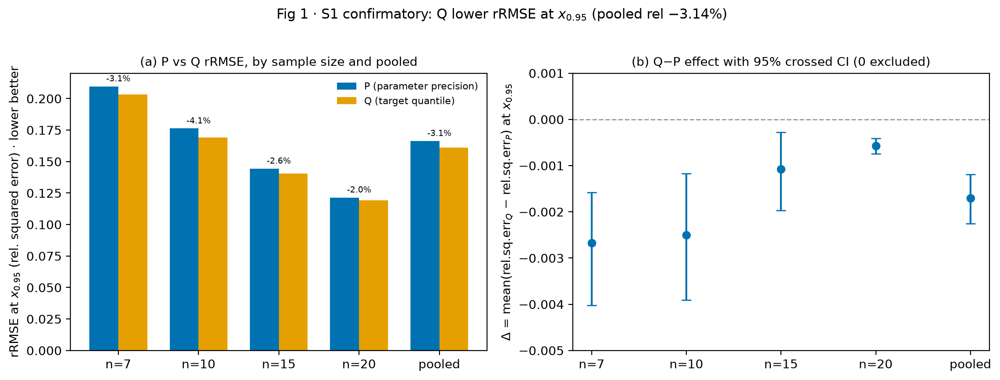
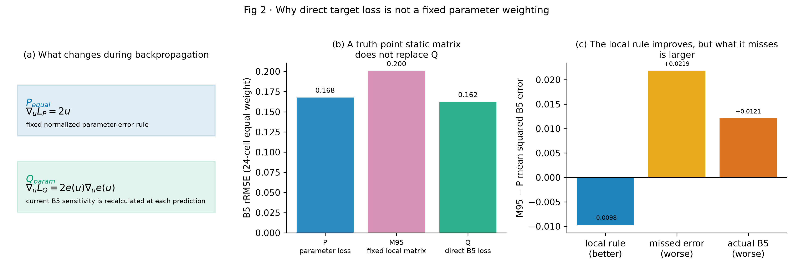
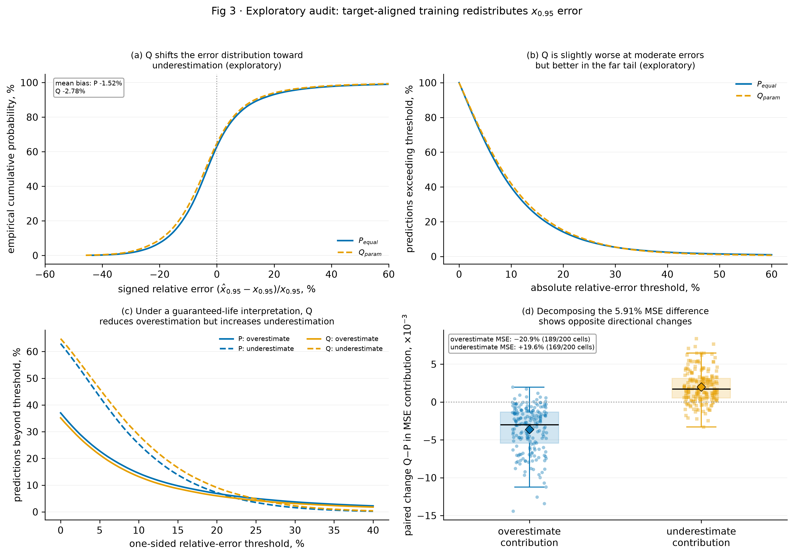

# 三参数 Weibull 神经估计中的目标对齐：动态目标敏感度与静态参数度量的边界

> 论文工作稿 v1.1 · 受控仿真研究 · 2026-08-10
> 状态：`MENTOR NECESSITY REVIEW PASSED — READY FOR USER REVIEW — NOT SUBMITTED`

## 摘要

当工程任务只关心一个可靠度寿命点 \(x_R\)（\(P(T>x_R)=R\)）时，先训练神经网络准确估计三参数 Weibull 的
形状、尺度和位置参数，再计算 \(x_R\)，未必是与任务最一致的学习目标。参数损失必须预先规定
三个参数误差的度量，而它们对 \(x_R\) 的局部敏感度随参数点变化；一组固定权重不能在整个参数域内
同时表示这种变化。
本文在 Study01 冻结参数网格内进行严格配对实验：`P_equal` 最小化三个归一化参数平方误差的
等系数和；`Q_param` 保持完全相同的三参数输出、合法解码、数据、初始化和训练预算，但直接
最小化 \(x_{0.95}\) 相对平方误差。10 个训练种子、4 个样本量和5折设计形成 200 个 P/Q
模型对。`Q_param` 将 pooled rRMSE 从 0.1661 降至 0.1611，相对改善 3.00%，fold×seed
交叉配对 bootstrap 95% CI 为 [2.19%,3.79%]；10 个种子的 pooled 方向一致，184/200 个
配对单元有利于 Q。在与 P 相同的无量纲参数坐标中，`P_equal` 使用固定参数误差规则，而 Q 损失
在每个当前预测点按 B5 误差及其实际敏感度更新网络；冻结网格上真值敏感度范数变化 5.74 倍。
作为探索性消融，真值点静态局部代理 M95 在 24 个匹配单元中的 rRMSE 为 0.2005，差于
P 的 0.1676 和 Q 的 0.1622，且 24/24 单元均未优于 P 或 Q。M95 虽然降低了
真值点局部近似误差，但这个近似遗漏的额外目标误差使真实 B5 误差反而增大。这排除了“Q 的作用只是一套
真值点静态参数权重”这一简单解释，但不将未观测的训练轨迹写成已证因果。附加探索性工程审计
表明这不是全面改善：Q 的 MAE 略高，但使寿命高估超过 10% 的比例从 14.47% 降至 13.21%，
超过 20% 的比例从 6.90% 降至 6.01%，cell-wise CVaR90 的等权平均下降 4.61%；代价是寿命低估
超过 10% 的比例从 25.40% 增至 28.70%。因此，在把 \(x_{0.95}\) 用作保证寿命阈值的解释下，
观察到的误差再分配具有减少潜在非保守高估的工程含义。Q 的损失本身仍是对称平方误差，并未显式
编码高估的额外成本。损失函数的数学区别与静态矩阵消融均有直接证据，但完整训练动力学未被写成已证因果。
本文不主张 Q 的内部参数更准确或一般性全面占优，也不把结论外推到其他目标、参数域或部署分布。

**关键词**：三参数 Weibull；可靠度寿命点；目标对齐；动态目标敏感度；神经网络

## Abstract

When an engineering task depends on a single reliability life point \(x_R\), defined by
\(P(T>x_R)=R\), training a neural network to recover all three Weibull parameters accurately before
deriving \(x_R\) may not be the most task-aligned objective. A parameter loss requires a prespecified
metric, whereas the local influence of each parameter on \(x_R\) varies across the parameter domain;
one fixed weighting cannot represent this variation everywhere. We conducted a strictly paired experiment on the frozen Study01 parameter
grid. `P_equal` minimized an equal-coefficient sum of three normalized squared parameter errors;
`Q_param` retained the identical legal three-parameter output, data, initialization, and training
budget but directly minimized relative squared error in \(x_{0.95}\). Ten training seeds, four sample
sizes, and five folds yielded 200 paired model units. `Q_param` reduced pooled relative RMSE from
0.1661 to 0.1611, a 3.00% improvement (fold-by-seed crossed paired-bootstrap 95% CI:
2.19%–3.79%); all ten seed-level pooled effects favored Q, as did 184 of 200 paired units. At the
loss level and in the same dimensionless coordinates used by P, `P_equal` defines a fixed normalized
parameter-error rule, whereas Q updates the network using the target error and sensitivity at the current
prediction. The truth-point sensitivity norm varied 5.74-fold over the frozen grid. In an exploratory
24-cell ablation, the truth-point static local surrogate M95 had an rRMSE of 0.2005, compared with
0.1676 for P and 0.1622 for Q, and did not outperform either route in any cell. Although M95 reduced
its truth-point local approximation error, the error missed by that approximation was larger and the
actual B5 error increased. This rules out the simple account that Q acts only as a static truth-point parameter
weighting under the frozen contract, without claiming that the unobserved optimization trajectory has
been causally identified. An additional exploratory engineering audit showed a trade-off rather than
broad dominance: Q slightly increased MAE, but reduced overestimation above 10% from 14.47% to
13.21%, overestimation above 20% from 6.90% to 6.01%, and the equal-weight mean of cell-wise upper-10%-tail absolute errors by
4.61%; underestimation above 10% increased from 25.40% to 28.70%. When \(x_{0.95}\) is interpreted
as a guaranteed-life threshold, this redistribution has the potential engineering meaning of reducing
overestimation, at the cost of more underestimation. The Q loss itself
remains symmetric and does not explicitly encode an asymmetric cost. These results establish the mathematical loss difference and the static-matrix
ablation result, not the full causal training dynamics. We do not claim that Q recovers individual parameters
more accurately, dominates every accuracy criterion, or generalizes to other targets, domains, or
deployment distributions.

## 1 引言

三参数 Weibull 分布以形状 \(\beta\)、尺度 \(\eta\) 和位置 \(\gamma\) 描述寿命，其可靠度函数为

\[
R(x)=\exp\left[-\left(\frac{x-\gamma}{\eta}\right)^\beta\right],\qquad x>\gamma,
\]

满足 \(R(x_R)=R\) 的可靠度寿命点为

\[
x_R=\gamma+\eta[-\ln R]^{1/\beta}.
\]

三参数模型的小样本估计长期具有挑战 [1,2,3,4]。既有研究提出了最小差异方法 [5,6]、神经
网络估计 [7,12] 以及多种经典拟合和一致估计方法 [13,14]。这些方法通常把参数恢复本身作为
首要目标。

但很多可靠性任务最终只使用一个具体寿命点。回归分位数、任务聚焦学习和端到端决策学习
[8,9,10,11] 以及评分函数与目标泛函的研究 [15] 都说明，训练评价量与最终使用目标之间的
一致性值得单独研究。在 Weibull 研究中，已有比较也显示，参数估计的 MSE 排序与插件分位点估计的
排序不必一致 [16]。本文只借用目标对齐的一般思想；本文的确定性 \(x_R\) 相对平方损失不是标准
条件分位数损失，也不据此主张统计一致性。

参数损失的困难不在于某套固定权重一定错误：它可以很好地回答“参数恢复得是否准确”。困难在于，
当任务改为一个特定寿命点时，缺少与任务无关的唯一参数权重。对
\(x_R\) 而言，\(\beta,\eta,\gamma\) 的影响并不等权，也不在整个参数空间保持恒定。若再按
\(x_R\) 表现调节参数权重，实质上已经把目标信息间接放回训练。因此本文不寻找“最优参数
权重”，而直接检验一个定义清楚的问题：在其余条件相同且最终目标明确为 \(x_{0.95}\) 时，
直接用目标误差训练，能比参数误差训练后再派生目标改善多少，为什么？

本文贡献为：

1. 在与 Study01 一致的冻结参数网格上，给出仅改变损失的 10-seed 严格配对效应估计；
2. 推导 Q 如何把当前预测点的目标敏感度传回三个参数方向；
3. 用 24 单元 M95 消融检验“Q 只相当于一个真值点静态权重矩阵”，并验证局部近似改善为何没有转化为真实 B5 改善；
4. 探索均方误差收益对应何种误差再分配，并同时呈现高估下降与低估增加。

## 2 方法

### 2.1 数据与冻结设计域

参数空间与 Study01 正式设计一致：

\[
\beta\in\{1.5,2,2.5,3,3.5,4,4.5,5\},\quad
\eta=1000,\quad
\gamma/\eta\in\{0.10,0.25,0.50,0.75,1.00\},
\]

\(n\in\{7,10,15,20\}\)。每个参数—样本量组合生成 300 个独立 repeats；按
`repeat_id mod 5` 分折，使每折训练、验证和测试都覆盖同一组精确参数点，但样本彼此独立。
输入为升序排列的原始样本，每个输入位置的 StandardScaler 只由当前训练折拟合。

本合同有意回答冻结网格内的受控问题。不同参数支持、外推、真实数据、删失和模型错设不是
本文估计对象。

### 2.2 网络、合法解码与两条路线

两条路线使用相同的 MLP（\(n\rightarrow256\rightarrow128\rightarrow64\rightarrow3\)，
ReLU，float64）、合法参数解码、初始化、batch 顺序和训练预算。解码结构性保证
\(\hat\beta>0\)、\(\hat\eta>0\)、\(0<\hat\gamma<\min(X)\)。

`P_equal` 的损失为

\[
L_P=\operatorname{mean}\left[
\left(\frac{\hat\beta-\beta}{\beta}\right)^2+
\left(\frac{\hat\eta-\eta}{\eta}\right)^2+
\left(\frac{\hat\gamma-\gamma}{\eta}\right)^2
\right].
\]

这里“equal”只指三个已归一化平方项的系数相同。它是透明的任务无关参照，不是对三参数
工程重要性相同的断言。

`Q_param` 使用完全相同的三参数输出与解码，但优化

\[
L_Q=\operatorname{mean}\left[
\left(\frac{\hat x_{0.95}-x_{0.95}}{x_{0.95}}\right)^2
\right].
\]

Q 保留三输出是为了在网络结构、合法解码和依赖关系不变时只比较损失，而不是因为三输出是最简
部署形式。它们只作为形成目标寿命点的内部参数化；不以单参数准确性判断 Q 成败。每条路线以
自身验证损失选择 checkpoint，因此“训练损失 + 对齐的验证选择”共同构成干预。优化器为
Adam（lr \(10^{-3}\)、weight decay \(10^{-4}\)），batch 256，最多 300 epochs，patience 20。
这些设置对两路线共同冻结，不按路线重新调参；损失的数值尺度与各自对齐的 checkpoint 选择
属于被比较的运行合同。

### 2.3 配对与重复性

训练种子为 42、2026、3407、17、73、314、2718、4099、8128、12011。每个
`(n,fold,seed)` 内，P/Q 共享训练、验证、测试行、scaler、初始化、batch 顺序、网络结构和
训练预算，形成 200 个配对单元（400 fits）。10 seeds 的职责是确认效应并估计训练随机性；
机制分析方法由先期 3-seed 证据发展；正文只报告由全部 10-seed 主证据或独立 24 单元消融支持的结果。

M95 为主结果完成后依据独立合同预设的探索性机制消融，只使用 seeds 42、2026、3407，folds 1、3
和四个 n，共 24 个新 M95 fits；相同单元的 P/Q 从封存证据复用。它不与 200 个 P/Q 单元混池，
只报告匹配单元点估计和方向计数，不报告 CI、显著性或确认性总体效应。

### 2.4 评价与推断

主指标为

\[
\operatorname{rRMSE}_m=
\sqrt{\operatorname{mean}\left[
\left(\frac{\hat x_m-x}{x}\right)^2\right]},
\]

主效应为

\[
I=\frac{\operatorname{rRMSE}_P-\operatorname{rRMSE}_Q}
{\operatorname{rRMSE}_P},
\]

\(I>0\) 表示 Q 更好。估计对象是：在冻结参数网格内各 \(n\) 和各设计单元等权时，对新 held-out
repeat 与训练随机性而言，运行这两条冻结算法所产生的 rRMSE 及其相对差。有限样本估计先对
200 个 `(n,fold,seed)` 单元的 MSE 等权平均，再开方并计算 \(I\)。主区间按 \(n\) 分层有放回
重采样 fold，同时全局有放回重采样 seed，路线始终保持配对，共 200,000 次。由于五折的训练集
重叠且 seed 仅 10 个，这是**设计级经验 bootstrap 近似区间**，不声称具有标准独立聚类 bootstrap
的精确覆盖率。逐 \(n\) 区间未做多重性校正，只作描述性分层。

### 2.5 P 与 Q 使用什么更新信号

令 \(a=-\ln R\)、\(t=a^{1/\beta}\)，则

\[
\frac{\partial x_R}{\partial\gamma}=1,\qquad
\frac{\partial x_R}{\partial\eta}=t,\qquad
\frac{\partial x_R}{\partial\beta}
=-\frac{\eta t\ln a}{\beta^2}.
\]

令

\[
u=\left(\frac{\hat\beta-\beta}{\beta},
\frac{\hat\eta-\eta}{\eta},
\frac{\hat\gamma-\gamma}{\eta}\right),
\qquad L_P=\|u\|^2,
\]

并记 \(e(u)=(\hat x_R-x_R)/x_R\)。在该共同坐标中，`P_equal` 使用固定的归一化参数误差规则：

\[
L_P=\|u\|^2,\qquad \nabla_uL_P=2u,\qquad H_P=2I.
\]

Q 的单行损失则精确满足

\[
L_Q=e(u)^2,\qquad
\nabla_uL_Q=2e(u)\,\nabla_u e(u).
\]

因此，Q 把当前目标误差和当前预测点的目标敏感度同时传回参数方向。在真值处记
\(s_0=\nabla_u e(0)\)，则

$$
s_0=\left(\frac{\beta}{x_R}\frac{\partial x_R}{\partial\beta},
\frac{\eta}{x_R}\frac{\partial x_R}{\partial\eta},
\frac{\eta}{x_R}\frac{\partial x_R}{\partial\gamma}\right),
\qquad H_Q(0)=2s_0s_0^\mathsf T.
$$

\(H_Q(0)\) 只描述真值附近的局部关系。冻结 40 点上 \(\|s_0\|\) 为 0.766–4.393，
说明目标对三个参数方向的作用会随参数点变化。Q 不是额外学习三个全局权重，而是由目标公式和
链式法则在当前预测位置重新计算更新信号。

为区分“局部矩阵”与完整 Q，定义真值点代理

$$
L_{M95}=(s_0^Tu)^2=u^T(s_0s_0^T)u.
$$

M95 随每条训练标签的真值参数点变化，但对当前预测位置不再更新；它只是 Q 在 \(u=0\)
附近的局部代理。存在某些有限参数变化，M95 给出零损失，真实 B5 却已发生变化；构造与数值验证
见补充材料。

对任意有限扰动，微积分基本定理给出路径平均敏感度

$$
\bar s(u)=\int_0^1\nabla_u e(tu)\,dt,\qquad
e(u)=\bar s(u)^Tu,\qquad
L_Q=u^T[\bar s(u)\bar s(u)^T]u.
$$

这条恒等式回答了“什么矩阵才能与 Q 一样”：矩阵必须随当前有限预测误差路径变化，
而且在求导时保留这种变化；此时它只是 Q 的数学重写，不是一个新方法。

### 2.6 探索性工程误差审计

为判断 3% rRMSE 改善具有何种工程含义，本文在不重训模型的前提下，对同一 200 个配对模型单元、
每条路线 480,000 条 held-out 预测的有符号相对误差

\[
e=(\hat x_{0.95}-x_{0.95})/x_{0.95}
\]

进行附加审计。正值表示寿命高估，若 \(x_{0.95}\) 用作保证寿命阈值，则属于潜在非保守误差；负值
表示低估。审计指标包括 MAE、各设计单元内绝对误差上 10% 尾部均值（cell-wise CVaR90）、单侧超限率
\(P(e>\tau)\) 与 \(P(e<-\tau)\)（\(\tau=10\%,20\%\)），以及高估和低估两侧对 MSE 的贡献，
即分别对正误差部分和负误差部分取平方均值。

点估计仍先在 200 个设计单元内计算再等权汇总，不确定性沿用 §2.4 的配对交叉 bootstrap。
这些指标是在主分析之后提出的探索性工程解释，未做多重性校正；10% 和 20% 是透明的敏感性阈值，
不是由真实成本函数验证的工程界限。

## 3 结果

### 3.1 目标精度

`Q_param` 的 pooled rRMSE 为 0.161075，低于 `P_equal` 的 0.166059，绝对差 0.004983，相对改善 3.001%
（95% CI [2.195%,3.793%]）。线性 MSE 差 `Q−P` 为 −0.001630（95% CI：
−0.002098 至 −0.001174）。10 个 seed 的 pooled 方向全部有利于 Q，200 个配对模型单元中
184 个有利于 Q。

| n | P rRMSE | Q rRMSE | Q 相对改善 | 95% CI |
|---:|---:|---:|---:|---:|
| 7 | 0.2095 | 0.2031 | 3.05% | [1.95%,4.17%] |
| 10 | 0.1756 | 0.1691 | 3.66% | [1.56%,5.59%] |
| 15 | 0.1444 | 0.1405 | 2.70% | [1.11%,4.14%] |
| 20 | 0.1214 | 0.1190 | 1.92% | [1.23%,2.52%] |

图 1 给出主效应与分层区间。逐 \(n\) 结果用于描述，不用于声称收益随样本量单调变化。
这是幅度温和但方向稳定的效应；本研究未预设工程实质重要性阈值。

冻结网格内存在有结构的区域异质性（未做多重性校正，仅描述）：\(\beta=1.5\text{--}3.0\)
的 Q 区域 rRMSE 低 1.1%–9.3%，而 \(\beta=3.5\text{--}5.0\) 的 P 低 1.1%–6.0%；
\(\gamma/\eta=0.10,0.25\) 的 Q 比 P 低 10.2% 和 3.9%，而 \(0.50,0.75,1.00\) 的 Q 比 P 高
13.0%、8.0% 和 6.4%。这不否定预先定义的全网格等权 pooled 效应，但是解释“为什么”时必须呈现的边界。

### 3.2 动态目标敏感度与静态代理检验

Q 的梯度公式精确表明，它在每个当前预测点重新计算 B5 对三个参数方向的敏感度。
冻结网格上 \(\|s_0\|\) 变化 5.74 倍，说明一组全域固定参数权重不能代表所有参数点。

为进一步检验“Q 只是一个更聪明的静态矩阵”，本文预设了 24 个 P/M95/Q 匹配单元的
探索性消融。M95 使用每条训练标签真值点的完整局部矩阵，但训练时不随当前预测位置更新。
P、M95 和 Q 的 B5 rRMSE 分别为 0.1676、0.2005 和 0.1622；M95 在 24/24 单元中均未优于
P 或 Q。该小型消融不报告置信区间或显著性。

该失败不是因为 M95 没有优化它自己的目标。对 held-out 误差的精确分解显示，M95−P 的
局部近似改善 0.00976，但由于 B5 公式是非线性的，该近似遗漏的额外误差增加 0.02186，
使真实 B5 MSE 最终增加 0.01210。因此，真值点静态矩阵确实学会了更好的局部近似，
却不能代替在当前预测点直接计算的真实 B5 损失。

*图2注：面板 a 只对比 P 与 Q 在反向传播中使用的更新信号；面板 b 的柱为 24 单元等权 rRMSE；
面板 c 显示 M95 的局部近似虽变好，但该近似遗漏的额外误差更大。b、c 均为探索性，不给置信区间。*

### 3.3 误差方向与潜在工程含义

3% rRMSE 收益并不表示 Q 对多数单条预测都更接近真值。Q 的逐行绝对误差仅在 46.64% 的配对
held-out 行上更小；pooled MAE 从 P 的 11.048% 增至 Q 的 11.225%（变差 1.61%），设计单元
中位绝对误差的平均值也从 8.000% 增至 8.435%。相反，各设计单元内绝对误差上 10% 尾部均值的
等权平均（cell-wise CVaR90）从
37.042% 降至 35.336%（改善 4.61%），198/200 个模型单元、10/10 个 seed 方向一致。

这种尾部改善具有明确的方向性。寿命高估超过 10% 的比例从 14.47% 降至 13.21%，减少
1.26 个百分点（相对 8.72%）；高估超过 20% 从 6.90% 降至 6.01%，减少 0.89 个百分点
（相对 12.86%）。与此同时，寿命低估超过 10% 从 25.40% 增至 28.70%，低估超过 20% 从
7.22% 增至 9.10%。对应地，高估侧对 MSE 的贡献下降 20.9%（189/200 单元、10/10 seeds），
低估侧贡献增加 19.6%（169/200 单元、10/10 seeds）；两者相抵后，总 MSE 下降 5.91%，即
rRMSE 下降 3.00%。图 3 展示了有符号误差、绝对误差尾部、单侧超限曲线和设计单元层面的方向性
MSE 再分配。

*图3注：每条路线含 480,000 条 held-out 预测，来源于 200 个配对模型单元。面板 a–c 为描述性
pooled 分布；面板 d 的点为配对设计单元。所有新增指标均为事后探索性审计，未做多重性校正。
“高估非保守”只在 \(x_{0.95}\) 被用作保证寿命阈值时成立；10% 和 20% 是透明的描述性敏感度
阈值，未经工程成本函数或风险容限验证。图 3 说明误差方向与尾部的再分配，不证明 Q 的总体工程
风险更低。*

### 3.4 可信性检查

全部 400 fits 均完成，0 NaN、0 非有限预测、0 支持域违规。P/Q 的样本行、scaler、初始化、
batch 和网络身份逐单元匹配。10 个 seed 的方向一致，crossed bootstrap 同时纳入 fold 和 seed
变异。逐样本证据、fit metadata、环境与 SHA 清单均可在干净 Git 归档中校验。

这些检查的功能是说明主结果不是由挑 seed、配对错误或非法输出造成；它们不是新的研究主题。

## 4 讨论

### 4.1 科学问题的答案

在冻结设计域和当前冻结优化配置下，`Q_param` 相对本文定义的 `P_equal`
将 rRMSE 降低约 3%。这不是“损失名称必然保证测试集获胜”的逻辑证明，而是受控实验给出的
效应量；10-seed 结果说明该效应在当前训练随机性下稳定。

### 4.2 为什么参数权重问题可以被重新定义

`P_equal` 的三个归一化项只是一个清楚的参照。讨论 \(\beta,\eta,\gamma\) 是否应等权，很容易
陷入没有任务尺度的权重争论。对一个明确的 \(x_R\) 任务，更直接的定义是让目标函数本身通过
\(\nabla_\theta x_R\) 给出当前参数方向的局部目标敏感度。该损失层因子随参数位置和可靠度水平改变，
避免了人工拍定一组全域固定权重。M95 消融进一步说明，即使将真值点的完整局部矩阵写入
参数损失，也不能复制 Q：该矩阵只在真值附近有效，而 Q 会在当前预测位置重新计算。只有使矩阵
随当前误差路径变化并保留这种变化的导数，才与 Q 等价；此时它只是 Q 的数学重写。

### 4.3 证据边界

本文证明了两件事：Q 的损失梯度使用当前预测点的目标敏感度；真值点静态局部矩阵在
当前 24 单元消融中不足以替代 Q。精确误差分解进一步表明，M95 的局部近似确实改善，但该近似
遗漏的额外目标误差更大。本文没有记录每一步优化轨迹，因此不把完整 SGD 动力学写成已证因果。

### 4.4 潜在工程含义不是“全面更准”，而是“降低哪种错误”

附加审计最值得关注的不是 3% 这个单一数字，而是误差方向与尾部的改变。若 \(x_{0.95}\) 被作为
保证寿命、检修下限或保守设计阈值，且工程成本对高估的惩罚更大，那么把尚未达到的寿命当作可保证
寿命会更不利。在这一条件性使用语境下，Q 使超过 10% 和 20% 的高估比例分别相对下降 8.72% 和 12.86%，
同时压低极端绝对误差，提示潜在工程价值。由于 Q 训练的仍是对称平方误差，这一方向性变化是当前
冻结实验观察到的结果，不是 Q 显式优化非对称风险的必然性质。

但这种价值有明确代价：Q 的 MAE、中位误差和中等误差区间表现略差，低估更常见。因此本文不把 Q
称为一般意义上的更精确估计器。若损失函数的真实工程成本对高估和低估对称，P 在典型误差指标上
可能更合适；若成本明显惩罚寿命高估，则本结果支持采用 Q。后续真正的工程部署应由领域成本函数
替代本文的 10%/20% 敏感性阈值。

### 4.5 适用范围

结论限于 Study01 冻结网格、\(\eta=1000\)、\(n=7\)–20、当前合法三输出网络和
\(R=0.95\)。Q 的内部参数不以物理准确性为目标；若任务需要完整分布、多个寿命点或参数解释，
必须重新定义多目标损失和评价合同。

本文不把新参数支持、外推、真实/删失数据、不同网络或表示的验证设为当前成稿前置条件。
这些属于后续研究。仓库中的相关探索性实验保留用于未来立项，但不用于改变本文核心问题。

## 5 结论

当最终评价量明确为三参数 Weibull 的 \(x_{0.95}\) 时，在 Study01 冻结设计域和相同三输出
网络下，直接目标损失 `Q_param` 相对固定坐标参数损失 `P_equal` 将 pooled rRMSE 降低
3.00%（95% CI [2.19%,3.79%]），且 10 个训练 seed 的方向一致。与该优势相容的机制证据是：
P 在归一化参数坐标中使用固定误差规则，而 Q 在当前预测点按 B5 的实际敏感度更新三个参数方向。
真值点静态矩阵 M95 在 24 单元探索性消融中未能替代 Q；它虽然改善了局部近似，但这个近似遗漏的
额外目标误差更大，真实 B5 因而变差。探索性工程审计进一步表明，均方误差收益主要来自压低寿命高估侧和极端
尾部，并以更多低估为代价。因此，当工程任务只评价一个已知可靠度寿命点，且高估具有更高
工程代价时，当前结果支持 `Q_param` 相对本文定义的 `P_equal` 更符合该风险方向。该结论
只针对当前冻结合同，不延伸为普遍优越性或参数估计替代论。

## 数据与代码可用性

协议、代码、逐样本预测、fit metadata、统计分析与 SHA 清单位于
`Study/02-study-NN参数估计与分位点目标研究/`。10-seed 结果见
`artifacts/pq_s5b_revision/analysis/summary_s5b.json`，机制证据见
`artifacts/pq_paper_core/analysis/` 与 `artifacts/pq_mechanism_closure/`，M95 消融证据见
`artifacts/pq_target_matrix_pilot/`，工程误差审计见 `artifacts/pq_engineering_audit/`。
作者、单位、基金和 CRediT 尚待补充；本文未投稿。

## 参考文献

[1] Weibull, W. (1951). A Statistical Distribution Function of Wide Applicability. *Journal of Applied Mechanics*, 18(3), 293–297. https://doi.org/10.1115/1.4010337

[2] Rinne, H. (2008). *The Weibull Distribution: A Handbook*. Chapman & Hall/CRC Press. https://doi.org/10.1201/9781420087444

[3] Murthy, D.N.P., Xie, M., & Jiang, R. (2004). *Weibull Models*. Wiley-Interscience.

[4] Meeker, W.Q., & Escobar, L.A. (1998). *Statistical Methods for Reliability Data*. Wiley.

[5] Xie, L., Wu, N., & Yang, X. (2023). A Minimum Discrepancy Method for Weibull Distribution Parameter Estimation. *International Journal of Structural Stability and Dynamics*, 23(8), 2350085. https://doi.org/10.1142/S0219455423500852

[6] 谢里阳, 朱文慧, 吴宁祥, 杨小玉. (2025). 基于统计最小差异原理的 Weibull 分布参数估计方法. *东北大学学报（自然科学版）*, 46(7), 108–112. https://doi.org/10.12068/j.issn.1005-3026.2025.20240194

[7] Yang, X., Xie, L., Chen, J., Zhao, B., & Wang, K. (2025). Estimation of Weibull distribution using the back-propagation neural network for fatigue failure data. *Probabilistic Engineering Mechanics*, 82, 103828. https://doi.org/10.1016/j.probengmech.2025.103828

[8] Koenker, R., & Bassett, G. (1978). Regression Quantiles. *Econometrica*, 46(1), 33–50. https://doi.org/10.2307/1913643

[9] Elmachtoub, A.N., & Grigas, P. (2022). Smart “Predict, then Optimize”. *Management Science*, 68(1), 9–26. https://doi.org/10.1287/mnsc.2020.3922

[10] Wilder, B., Dilkina, B., & Tambe, M. (2019). Melding the Data-Decisions Pipeline: Decision-Focused Learning for Combinatorial Optimization. *AAAI*, 33(01), 1658–1665. https://doi.org/10.1609/aaai.v33i01.33011658

[11] Donti, P.L., Amos, B., & Kolter, J.Z. (2017). Task-based End-to-end Model Learning in Stochastic Optimization. *NeurIPS*, 30, 5484–5494. arXiv:1703.04529

[12] Abbasi, B., Rabelo, L., & Hosseinkouchack, M. (2008). Estimating parameters of the three-parameter Weibull distribution using a neural network. *European Journal of Industrial Engineering*, 2(4), 428–445. https://doi.org/10.1504/EJIE.2008.018438

[13] Cousineau, D. (2009). Fitting the three-parameter Weibull distribution: Review and evaluation of existing and new methods. *IEEE Transactions on Dielectrics and Electrical Insulation*, 16(1), 281–288. https://doi.org/10.1109/TDEI.2009.4784578

[14] Nagatsuka, H., Kamakura, T., & Balakrishnan, N. (2013). A consistent method of estimation for the three-parameter Weibull distribution. *Computational Statistics & Data Analysis*, 58, 210–226. https://doi.org/10.1016/j.csda.2012.09.005

[15] Gneiting, T. (2011). Making and Evaluating Point Forecasts. *Journal of the American Statistical Association*, 106(494), 746–762. https://doi.org/10.1198/jasa.2011.r10138

[16] Jokiel-Rokita, A., & Piątek, S. (2024). Estimation of parameters and quantiles of the Weibull distribution. *Statistical Papers*, 65, 1–18. https://doi.org/10.1007/s00362-022-01379-9

---

*科学主线已通过 Mentor 叙述必要性终审，当前可交付用户审阅；此状态不等于期刊同行评议或录用。*
