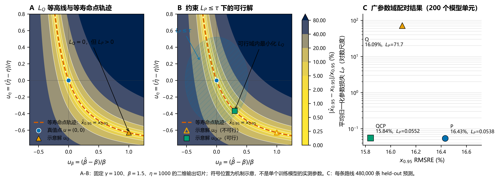
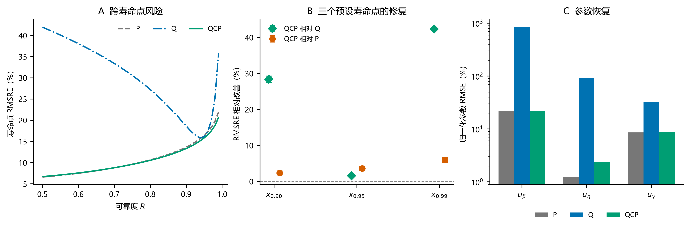
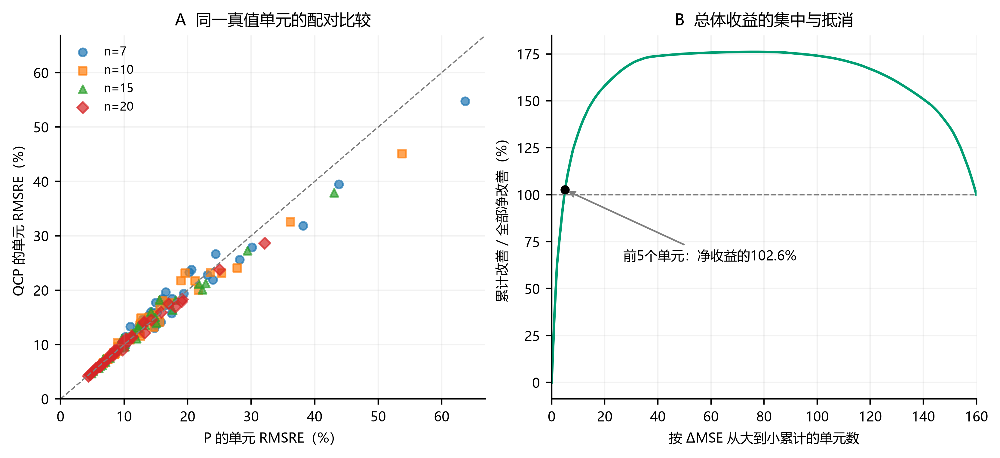

# 三参数 Weibull 寿命点估计中的任务对齐：单点监督的收益、代价与参数约束

## 摘要

利用神经网络可以根据寿命样本直接估计三参数 Weibull 分布的形状、尺度和位置参数，再由这些参数计算所需的可靠度寿命点。一种常见做法是以三个参数的归一化误差作为训练目标，但当实际需求集中在可靠度为 95% 的寿命点 $x_{0.95}$ 时，参数误差最小并不等同于该寿命点误差最小。本文首先研究：在相同数据与网络设置下，直接以 $x_{0.95}$ 的预测误差训练网络，能否比参数误差训练获得更准确的目标寿命点。

为此，本文在相同输入表示、网络结构、数据划分和最大训练预算下，比较参数误差导向的训练流程 P 与目标寿命点误差导向的训练流程 Q。两者均输出三个 Weibull 参数，分别按对应的损失训练和选择验证检查点。固定尺度的小样本仿真实验覆盖 40 个参数组合、4 种样本量和 200 个配对模型单元。Q 将目标点的总体均方根相对误差（RMSRE）由 P 的 16.43% 降至 16.09%，相对改善 2.07%（95% CI：1.28% 至 2.81%）；但其 $x_{0.90}$ 和 $x_{0.99}$ 的总体 RMSRE 分别增加 36.41% 和 63.11%。损失几何与预测误差分析表明，单点监督允许三个参数的误差相互抵消，使目标点接近真值，同时伴随参数偏离和其他寿命点的明显退化。

针对这一代价，本文进一步提出参数约束寿命点学习 QCP，在保留 Q 的任务目标的同时限制参数误差。QCP 将目标点总体 RMSRE 进一步降至 15.84%，并将另外两个寿命点的总体误差恢复至略低于 P 的水平。总体收益与区域改善并不一致：目标点上仅 42/160 个真值单元对 Q 有利，76/160 个对 QCP 有利；QCP 相对 P 的净平方误差收益集中于少数高误差单元，P 仍保留典型绝对误差和训练成本优势。结果说明，任务对齐带来小幅目标点总体收益，也允许参数补偿及跨寿命点代价；参数约束能够限制这种补偿，在当前设计域内保留总体收益并修复跨点退化。

**关键词**：三参数 Weibull；可靠度寿命点；任务诱导耦合；参数补偿；约束学习；神经估计

## Abstract

Neural networks can estimate the shape, scale, and location parameters of a three-parameter Weibull distribution from lifetime samples, after which reliability life points are obtained from the fitted parameters. A common training strategy minimizes normalized errors in the three parameters. When the practical target is the life point at 95% reliability, $x_{0.95}$, however, minimizing parameter error does not necessarily minimize error at that life point. We therefore first ask whether direct training on the prediction error of $x_{0.95}$ improves target-life estimation under matched data and network settings.

We compare parameter-oriented training (P) with target-life-point-oriented training (Q) using the same input representation, network architecture, data splits, and maximum training budget. Both networks output three Weibull parameters; each procedure uses its corresponding loss for training and validation checkpoint selection. Fixed-scale, small-sample simulations cover 40 parameter combinations, four sample sizes, and 200 paired model units. Q reduces pooled root mean squared relative error (RMSRE) at $x_{0.95}$ from 16.43% under P to 16.09%, a relative improvement of 2.07% (95% CI: 1.28%–2.81%). Its pooled RMSREs at $x_{0.90}$ and $x_{0.99}$ are nevertheless 36.41% and 63.11% higher than those of P. Loss geometry and prediction-error analyses show that single-point supervision allows compensating parameter errors: the target life point can remain accurate while parameter recovery and other life points deteriorate.

To address this cost, we further propose parameter-constrained life-point learning (QCP), which retains the Q objective while limiting parameter error. QCP further reduces target-point pooled RMSRE to 15.84% and restores the other two life points to slightly lower pooled error than P. Pooled gains differ from cell-wise gains: only 42 of 160 fixed-truth cells favor Q and 76 favor QCP at the target point. The net squared-error gain of QCP over P is concentrated in a few high-error cells, while P retains lower typical absolute errors and training cost. Thus, task alignment yields a modest target-point pooled benefit but allows parameter compensation and cross-life-point deterioration; parameter constraints retain that pooled benefit and repair cross-point performance within the studied domain.

## 1 引言

可靠性分析既要描述寿命分布，也常要确定给定可靠度下的寿命边界。三参数 Weibull 模型以形状 $\beta$、尺度 $\eta$ 和位置 $\gamma$ 描述寿命，其小样本参数估计是长期研究的问题 [1,2,3,4]。经典估计方法 [5,6,13,14] 与神经网络方法 [7,12] 通常先恢复分布参数，再据此计算可靠度寿命点。当应用最终关心某个寿命点时，训练目标如何定义，可能直接影响该点的估计风险。

设 $R$ 为生存概率，可靠度寿命点满足 $R(x_R)=R$。本文关注的 $x_{0.95}$ 是可靠度为 95% 时的寿命边界，即失效分布的 5% 分位点。对于输出三个参数的监督网络，常见训练目标是三个归一化参数误差的等系数和。归一化消除了量纲和数值尺度的直接影响，$1{:}1{:}1$ 系数则提供了透明、可复现的参数恢复参照。然而，这组系数来自度量约定，三个参数对 $x_{0.95}$ 的实际影响还取决于寿命点公式、参数位置及误差间的相互作用。

一种更直接的做法是由网络输出同样的三个 Weibull 参数，再通过分布公式计算 $x_{0.95}$，并以该寿命点的预测误差训练网络。分位数回归、目标泛函与任务聚焦学习均体现了按最终使用量定义预测目标的思想 [8,9,10,11,15]；两参数 Weibull 的小样本研究也分别比较了参数估计量及其插件分位点估计量的偏差和均方误差 [16]。本文进一步考察三参数情形下，基于仿真训练的神经估计器如何因训练损失不同而改变目标寿命点风险 [18,19]。

寿命点监督同时带来一个结构性问题：三个参数决定一条分布曲线，单个寿命点却只提供一个标量目标。不同参数组合可以给出相同的 $x_{0.95}$，同时产生不同的 $x_{0.90}$ 和 $x_{0.99}$。直接优化 $x_{0.95}$ 因而可能允许参数误差相互补偿，使目标点准确而其他寿命点失真。任务对齐的收益需要与这种内部自由度及其下游代价一并检验。

基于这一逻辑，本文依次回答三个问题：寿命点损失 Q 相对参数损失 P 能否提高 $x_{0.95}$ 的估计精度；单点监督是否引起参数补偿和跨寿命点退化；以 Q 为主目标、以参数误差定义可行域的 QCP 能否修复这一缺口。P 提供参数恢复参照，Q 检验任务对齐并揭示补偿机制，QCP 在此基础上组合任务目标与参数约束。本文通过严格配对的仿真比较、损失几何、固定真值区域分析和多类误差统计，分别评价目标精度、内部参数偏离、跨寿命点表现与计算代价。

## 2 方法

### 2.1 寿命模型、数据与评价域

三参数 Weibull 模型及其寿命点为

$$
R(x)=\exp\left[-\left(\frac{x-\gamma}{\eta}\right)^\beta\right],
\qquad
x_R=\gamma+\eta[-\ln R]^{1/\beta},\qquad x>\gamma.
$$

仿真采用

$$
\beta\in\{1.5,2,2.5,3,3.5,4,4.5,5\},\quad
\eta=1000,\quad
\gamma/\eta\in\{0.10,0.25,0.50,0.75,1.00\},
$$

以及样本量 $n\in\{7,10,15,20\}$。每个参数—样本量组合生成 300 组独立、未删失寿命样本，共 160 个固定真值单元、48,000 组样本。每组输入为升序排列的原始寿命观测，不作逐样本均值归一化；输入位置的标准化仅使用当前训练折拟合的均值与标准差。

按重复抽样编号模 5 分折，每轮以一类为测试、下一类为验证、其余三类为训练。每个参数组合相应有 180、60、60 组训练、验证、测试样本。五轮划分中的样本不跨越当前训练与测试集合，但各轮训练集存在重叠。各集合覆盖同一组参数点，因而评价的是设计域内新样本的估计表现。

固定 $\eta$ 下，该网格的真实 $x_{0.95}$ 仍为 238.05–1552.09。本文采用相对误差，使各寿命水平按比例误差比较。尺度标签始终为 1000，网络可以利用这一常量信息，因而参数恢复难度不同于尺度也发生变化的估计任务。结论对应固定物理尺度下的参数网格与小样本估计。

### 2.2 共同网络与两种基本损失

每个样本量分别训练多层感知机（MLP），结构为 $n\rightarrow256\rightarrow128\rightarrow64\rightarrow3$，隐藏层使用 ReLU，计算采用双精度浮点数（float64）。三条路线共用参数解码，保证

$$
\hat\beta>0,\qquad\hat\eta>0,\qquad0<\hat\gamma<\min(X).
$$

具体地，设网络原始输出为 $o_1,o_2,o_3$，三条路线均使用

$$
\hat\beta=\operatorname{softplus}(o_1)+\varepsilon,\quad
\hat\eta=\operatorname{softplus}(o_2)+\varepsilon,\quad
\hat\gamma=\min(X)\{\delta+(1-2\delta)\operatorname{sigmoid}(o_3)\},
$$

其中 $\varepsilon=10^{-6}$、$\delta=10^{-7}$。该变换对应当前正位置参数域；三条路线使用相同的输出范围与边界余量。

优化器为 Adam，学习率 $10^{-3}$、权重衰减 $10^{-4}$、批量大小 256。当前比较统一最多训练 600 轮，早停耐心值为 60 轮。每个配对模型单元内，三条路线共享样本划分、标准化、初始化、首轮小批量顺序和网络结构。

令单组样本的归一化参数误差为

$$
u=\left(
\frac{\hat\beta-\beta}{\beta},
\frac{\hat\eta-\eta}{\eta},
\frac{\hat\gamma-\gamma}{\eta}
\right).
$$

参数路线 P 最小化

$$
L_P=\operatorname{mean}\|u\|^2.
$$

三个平方项在上述归一化坐标中使用相同系数。位置误差以 $\eta$ 归一化，避免其度量随 $\gamma$ 接近零而发散。因此，$1{:}1{:}1$ 表示三个无量纲误差项等系数相加；该损失直接控制参数恢复，其度量与寿命点敏感度无关。

路线 Q 使用相同三参数输出，由 Weibull 公式计算目标寿命点，最小化

$$
L_Q=\operatorname{mean}\left[
\left(\frac{\hat x_{0.95}-x_{0.95}}{x_{0.95}}\right)^2
\right].
$$

P 与 Q 分别以最低验证 $L_P$ 和 $L_Q$ 选择模型检查点。两条路线共用输出表示和网络容量，比较的是训练目标与对应验证选择规则构成的完整流程。因而实测差异包含训练更新和检查点选择两部分；固定同一检查点准则的对照才能进一步分离训练损失本身的贡献。

### 2.3 参数约束寿命点学习 QCP

QCP 保留目标寿命点误差作为优化目标，以参数损失限制可接受解：

$$
\min_\theta L_Q(\theta)
\quad\text{s.t.}\quad
L_P(\theta)\le\tau_j,\qquad
\tau_j=cL_{P,\mathrm{ref},j}.
$$

$j=(n,k,s)$ 表示模型单元，其中 $k$ 为折次，$s$ 为随机种子。$L_{P,\mathrm{ref},j}$ 来自匹配的早期 P 参考模型的最佳验证参数损失，该参考训练最多进行 300 轮，早停耐心值为 20 轮。QCP 阈值在当前 600 轮 P 模型的测试结果读取之前确定，并在后续训练中保持不变。

令 $g_b=L_{P,b}-\tau_j$、$g_{\mathrm{tr}}=L_{P,\mathrm{tr}}-\tau_j$。约束求解采用增广拉格朗日方法的非负乘子框架 [17]。本研究在小批量训练中使用下式，并在每轮结束时更新乘子：

$$
L_{\mathrm{AL},b}
=L_{Q,b}+\frac{\left[\max\{0,\mu+\rho g_b\}\right]^2-\mu^2}{2\rho},
\qquad
\mu\leftarrow\max\{0,\mu+\rho g_{\mathrm{tr}}\}.
$$

当约束松弛且乘子为零时，参数项不参与更新；约束受到违反时，其作用由乘子与违反程度调节。模型检查点选择先检查验证集平均 $L_P\le\tau_j$，再从可行训练轮次中选出验证 $L_Q$ 最小者。约束作用于模型单元的验证集平均参数损失，范围不延伸为单条预测的误差上界。

$c$ 与 $\rho$ 在 8 个验证单元上选择，共进行 48 次模型训练；另以 8 次训练检查预算扩展，最终取 $c=1.5,\rho=0.1$ 和 600/60 训练设置。这两个选择阶段均未访问测试指标。随后形成 200 个 QCP 模型。为比较相同的最大训练机会，在原 P/Q 测试结果读取后，将 P、Q 扩展到同样的 600/60 设置；本文主表采用这一共同预算分析。完整实验先后顺序见附录 A.2。

### 2.4 单点监督与参数补偿

#### 2.4.1 局部损失几何

P 与 Q 的差异可以在共同的 $u$ 坐标下表示。记单组样本的相对寿命点误差为 $e(u)$，则

$$
\ell_P=\|u\|^2,\qquad
\nabla_u\ell_P=2u,\qquad H_P=2I_3,
$$

$$
\ell_Q=e(u)^2,\qquad
\nabla_u\ell_Q=2e(u)\nabla_u e(u).
$$

令 $a=-\ln R$、$t=a^{1/\beta}$，寿命点对三个参数的导数为

$$
\frac{\partial x_R}{\partial\gamma}=1,\qquad
\frac{\partial x_R}{\partial\eta}=t,\qquad
\frac{\partial x_R}{\partial\beta}=-\frac{\eta t\ln a}{\beta^2}.
$$

在真值处，归一化敏感度向量及 Q 的 Hessian 为

$$
s_0=\left(
\frac{\beta}{x_R}\frac{\partial x_R}{\partial\beta},
\frac{\eta}{x_R}\frac{\partial x_R}{\partial\eta},
\frac{\eta}{x_R}\frac{\partial x_R}{\partial\gamma}
\right),
\qquad H_Q(0)=2s_0s_0^\mathsf T.
$$

局部寿命点平方误差可写为

$$
(s_0^\mathsf Tu)^2
=\sum_i s_{0,i}^2u_i^2+2\sum_{i<j}s_{0,i}s_{0,j}u_i u_j.
$$

对角项反映各参数的局部敏感度，交叉项则允许误差联合放大或抵消。本文将这种由寿命点公式产生的联合评价称为任务诱导耦合；它同时改变参数方向的相对作用及其交互关系。

P 在三个方向上惩罚参数误差；Q 的局部 Hessian 为秩一，在与 $s_0$ 正交的两个方向上没有二阶惩罚。更直接地说，$\hat x_{0.95}=x_{0.95}$ 在满足参数取值限制的输出空间中定义一张等寿命点曲面。沿曲面改变参数可以保持目标点不变，同时改变其他寿命点。这是单个标量目标在输出误差空间留下的自由度，区别于三参数 Weibull 模型本身的统计识别。

不同真值点的敏感度方向不同；若将它们在共同三维误差坐标下的局部 Hessian 求和，其秩可能高于一。条件网络的情形又有所不同：它根据每个输入样本输出参数，而非为全部样本估计同一组三参数，因此可能在不同输入处沿不同的近等寿命点方向偏移。共享权重、网络容量和正则化决定了这些偏移能否同时实现。局部几何揭示单点目标允许的补偿方向，终态参数分布与跨点误差则检验这种可能性是否在实际预测中出现；前者本身不确定网络权重空间 Hessian 的秩。

#### 2.4.2 有限误差下的路径敏感度

局部近似之外，微积分基本定理给出有限误差的精确表达：

$$
\bar s(u)=\int_0^1\nabla_u e(tu)\,dt,\qquad
e(u)=\bar s(u)^\mathsf Tu,\qquad
\ell_Q=u^\mathsf T[\bar s(u)\bar s(u)^\mathsf T]u.
$$

这一写法中的敏感度依赖当前预测路径，求导时也需保留这种依赖。Q 因而对应随预测位置变化的参数度量。真值点静态代理的推导与探索性消融见附录 C。

#### 2.4.3 终态参数补偿的量化

为量化终态预测中的补偿，本文对 $e$ 作精确的三项参数贡献分解，并定义

$$
C=\operatorname{mean}\left[
1-\frac{|c_\beta+c_\eta+c_\gamma|}
{|c_\beta|+|c_\eta|+|c_\gamma|}
\right].
$$

分母为零时该行取零。$C$ 越接近 1，表示三项贡献相加后的绝对目标误差相对于各项绝对值之和越小。$C$ 与平均 $L_P$ 配合使用：前者反映误差抵消程度，后者反映参数偏离幅度。具体对称分解见附录 C.1。

以 P 为参照，另定义 QCP 对超额补偿的恢复比例

$$
\mathrm{Resolution}_{\mathrm{comp}}
=\frac{C_Q-C_{\mathrm{QCP}}}{C_Q-C_P}.
$$

本研究中 $C_Q>C_P$，该比例以 Q 相对 P 增加的补偿为分母，衡量 QCP 使补偿指标回落的程度。寿命点精度改善另由 RMSRE 及其相对改善量评价。

### 2.5 配对评价与统计汇总

训练使用 10 个随机种子、4 个样本量和 5 折，形成每条路线 200 个模型单元，共 600 次模型训练。每条路线有 480,000 条测试预测，来自 48,000 组寿命样本在 10 个训练种子下的重复预测；统计推断保留这种重复结构，不把它们视为 480,000 组独立样本。完整随机种子、配对关系和数据来源见附录 A。

主指标为均方根相对误差：

$$
\operatorname{RMSRE}_m(R)
=\sqrt{\operatorname{mean}\left[
\left(\frac{\hat x_{R,m}-x_R}{x_R}\right)^2
\right]}.
$$

先对 200 个模型单元的 MSE 等权平均，再开方。相对改善定义为

$$
I_{a\rightarrow b}(R)
=\frac{\operatorname{RMSRE}_a(R)-\operatorname{RMSRE}_b(R)}
{\operatorname{RMSRE}_a(R)},
$$

正值表示路线 $b$ 更好。区间估计按 $n$ 分层重采样折次，同时全局重采样随机种子，始终保持路线配对，共重复 200,000 次。考虑到折间训练数据重叠及训练种子数量有限，所报 95% CI 为设计级经验 bootstrap 近似区间。

$x_{0.95}$ 为训练目标；另外从同一组参数预测派生 $x_{0.90}$ 和 $x_{0.99}$，评价目标点收益能否延伸至其他寿命点。后两点的分析在读取对应派生结果前固定，但属于既有模型上的事后机制分析。区域效应以 160 个固定真值单元 $(n,\beta,\gamma/\eta)$ 汇总，每单元每路线有 3,000 条预测。

为描述 RMSRE 之外的误差形态，同时报告目标点的平均绝对相对误差、绝对相对误差中位数、95% 分位点、±10% 内比例和有符号相对偏差。固定真值单元内的偏差—方差分解见附录 B.5。这些指标分别反映整体平方误差、典型误差、尾部和方向，不合并为综合分数。其中“绝对误差的 95% 分位点”是误差分布的尾部统计量，应与可靠度寿命点 $x_{0.95}$ 区分。

对固定真值单元 $c$，记 $b_c=\operatorname{mean}(e_c)$、$v_c=\operatorname{mean}[(e_c-b_c)^2]$，则

$$
B_{\mathrm{RMS}}=\sqrt{\operatorname{mean}_c b_c^2},
\qquad S_{\mathrm{within}}=\sqrt{\operatorname{mean}_c v_c},
\qquad \mathrm{RMSRE}^2=B_{\mathrm{RMS}}^2+S_{\mathrm{within}}^2.
$$

$B_{\mathrm{RMS}}$ 不允许不同区域的正负偏差相互抵消；$S_{\mathrm{within}}$ 则包含抽样重复与训练随机性形成的单元内波动。各比较的区间与分层结果未作多重比较校正，分别按既定主比较和描述性机制分析解释。

## 3 结果

### 3.1 单点目标对齐的收益与代价

在共同预算下，Q 将目标 $x_{0.95}$ 的总体 RMSRE 从 16.43% 降至 16.09%，相对改善 2.07%（95% CI：1.28% 至 2.81%）。然而，相同参数预测在另外两个寿命点上的表现明显下降：$x_{0.90}$ 和 $x_{0.99}$ 的 RMSRE 相对 P 分别增加 36.41% 和 63.11%（表1）。直接训练目标的收益温和，未受直接监督的寿命点代价更大。

**表1　三条路线在三个寿命点的总体 RMSRE**

| 寿命点 | P | Q | QCP | Q 相对 P 改善（95% CI） | QCP 相对 Q 改善 | QCP 相对 P 改善（95% CI） |
|---|---:|---:|---:|---:|---:|---:|
| $x_{0.90}$ | 13.66% | 18.63% | 13.34% | −36.41%（−38.51% 至 −34.32%） | 28.42% | 2.35%（1.81% 至 2.90%） |
| $x_{0.95}$ | 16.43% | 16.09% | 15.84% | 2.07%（1.28% 至 2.81%） | 1.56% | 3.60%（3.03% 至 4.18%） |
| $x_{0.99}$ | 21.96% | 35.82% | 20.65% | −63.11%（−65.27% 至 −61.16%） | 42.36% | 5.98%（5.28% 至 6.67%） |

*每条路线包含同样的 200 个配对模型单元。QCP 相对 Q 的完整区间见附录 B.2；表内负改善表示误差增加。RMSRE 的百分数表示误差水平，相对改善的百分数表示两路线误差水平之比。*

目标点精度并未保证参数恢复。Q 的平均 $L_P$ 达到 71.7，而 P 为 0.0539；其平均补偿指数从 P 的 0.332 增至 0.915。较大的参数偏离与较强的抵消同时出现，说明 Q 可以通过内部补偿维持目标点精度。图1以等寿命点切片说明这种可能性，并给出实际预测的参数误差与寿命点误差。

*图1　A–B 固定 $\gamma=100$、真值 $(\beta,\eta)=(1.5,1000)$，展示形状与尺度相对误差的二维切片。虚线为相同 $x_{0.95}$ 的参数轨迹；B 中阴影与标记示意参数约束如何截取该轨迹，每个实际模型单元的约束半径由其匹配阈值决定。C 为 200 个模型单元下三条离散路线的经验汇总。*

### 3.2 参数约束保留目标收益并修复跨寿命点表现

加入参数约束后，目标点总体精度得以保留并小幅提高：QCP 在 $x_{0.95}$ 上较 Q 再改善 1.56%（95% CI：1.24% 至 1.90%），在两个非目标点则分别改善 28.42% 和 42.36%。与 P 相比，三个寿命点的总体 RMSRE 均小幅降低（表1）。因此，本次比较中约束的主要作用是修复跨寿命点退化，同时保留目标点的总体收益。

参数诊断与这一变化相符。QCP 的 200 个选定检查点均满足验证集平均参数约束，测试平均 $L_P$ 为 0.0552，补偿指数为 0.345，均接近 P。按 $(C_Q-C_{\mathrm{QCP}})/(C_Q-C_P)$ 计算，QCP 使 Q 相对 P 的超额补偿减少 97.8%。这一比例描述参数约束下补偿指标的回落，寿命点收益则由上述 RMSRE 直接评价。

*图2　A 从同一组三参数预测派生 $R=0.50$–0.99 的 RMSRE 曲线，作为描述性背景；B 对三个预设寿命点给出 QCP 相对 Q、相对 P 的配对效应及经验 bootstrap 95% CI；C 为三项归一化参数误差的 RMSE，纵轴为对数尺度。正式数值比较集中于表1的三个寿命点。*

### 3.3 总体收益与区域差异

QCP 对 Q 的修复在多数固定真值单元内成立：三个寿命点分别有 155、119、146 个单元改善。相对 P，则只有 74、76、77 个单元改善（表2），三个单元效应中位数均略偏向 P。Q 在目标点也仅有 42/160 个有利单元。因此，目标点总体 RMSRE 的降低没有转化为多数真值单元的共同获益；它取决于各单元平方误差改变的幅度，而非改善单元占多数。

**表2　固定真值单元的改善方向与效应中位数**

| 寿命点 | Q 优于 P | QCP 优于 Q | QCP 优于 P | QCP 相对 P 的单元效应中位数 |
|---|---:|---:|---:|---:|
| $x_{0.90}$ | 8/160 | 155/160 | 74/160 | −0.67% |
| $x_{0.95}$ | 42/160 | 119/160 | 76/160 | −0.26% |
| $x_{0.99}$ | 13/160 | 146/160 | 77/160 | −0.08% |

*各单元具有相同数量的预测。效应中位数由单元相对改善计算，负值表示 P 略好。单元共享训练网络，方向计数作为固定设计域的描述性统计，不按 160 次独立试验计算二项符号检验。*

为定位收益来源，定义每个真值单元的贡献 $\Delta_c=\mathrm{MSE}_{P,c}-\mathrm{MSE}_{\mathrm{QCP},c}$。在 $x_{0.95}$ 上，将 160 个单元按 $\Delta_c$ 从大到小排列，前 5 个单元的改善合计达到全部净改善的 102.6%；其余 155 个单元合计略有抵消（图3）。按 P 的单元误差分组后，正收益主要来自误差最高的四分组，中间两组平均略偏向 P。由此可见，QCP 对 P 的总体收益集中于少数高误差单元，而非各区域普遍改善。完整分组数值及事后分解的解释范围见附录 B.7。

*图3　目标寿命点 $x_{0.95}$ 的 160 个固定真值单元。A 横、纵坐标分别为同一单元的 P、QCP RMSRE，虚线为相等线，其下方表示 QCP 更好；符号区分样本量。B 按 $\Delta_c$ 降序累计平方误差改善，以全部单元净改善为 100%。曲线超过 100% 后回落，表示前列单元的收益被后列单元的退化部分抵消。该排序是测试结果的描述性分解，不用于模型或部署区域选择。*

样本量增加则带来三条路线共同且更明显的精度改善。$n$ 从 7 增至 20 时，P 的目标 RMSRE 从 20.74% 降至 12.00%，QCP 从 19.92% 降至 11.69%。方法间差异小于这一采样效应。逐样本量结果及条件于 P 经验误差曲线的等效样本量换算见附录 B.4。

### 3.4 误差形态、波动来源与训练成本

相对 Q，QCP 在目标点的 RMSRE、平均绝对误差、中位绝对误差及 95% 分位误差均降低，±10% 内比例提高，有符号相对偏差的绝对值也减小。与 P 相比，QCP 的 RMSRE 和绝对误差 95% 分位点更低，而 P 的平均绝对误差、中位绝对误差及 ±10% 内比例更好（表3）。三条路线的排序取决于实际任务重视整体平方风险、典型误差还是误差尾部。

**表3　共同预算下的目标寿命点误差与资源**

| 指标 | P | Q | QCP |
|---|---:|---:|---:|
| RMSRE | 16.43% | 16.09% | 15.84% |
| 平均绝对相对误差 | 10.92% | 11.19% | 10.94% |
| 绝对相对误差中位数 | 7.69% | 8.14% | 7.86% |
| 绝对相对误差 95% 分位点 | 30.43% | 30.80% | 30.31% |
| 误差在 ±10% 内的比例 | 60.75% | 58.40% | 59.70% |
| 有符号相对偏差 | −1.51% | −2.71% | −2.48% |
| 高估超过 10% 的比例 | 14.29% | 13.25% | 13.19% |
| 高估超过 20% 的比例 | 6.85% | 6.02% | 6.07% |
| 单次训练中位耗时 / s | 41.4 | 29.6 | 87.2 |

*误差指标由当前 600/60 模型的全部测试预测计算；次级指标为描述性点估计，不据此声称差异具有统计显著性。高估定义为 $(\hat x_{0.95}-x_{0.95})/x_{0.95}>0$。训练采用 PyTorch CPU、float64，每个训练进程设置一个计算线程；现有记录未保存可核验的处理器型号，耗时仅作这些运行的成本描述。QCP 的 87.2 s 不包含早期 P 参考模型训练及约束筛选成本。*

当前共同预算预测中，QCP 相对 P 的高估超过 10% 和 20% 的比例均降低；相对 Q，10% 阈值下略低，20% 阈值下略高。单侧尾部排序也随阈值改变，因此总体 RMSRE 最低并不等于所有风险阈值下都占优。

固定真值下的偏差—方差分解进一步显示，P、Q、QCP 的单元内标准差分量依次为 14.82%、14.49%、14.21%，区域偏差的 RMS 分量则依次为 7.09%、6.99%、7.00%，均约为 7%。总体平方误差的下降主要来自重复估计波动减小，三条路线的区域偏差分量接近（附录 B.5）。

三条路线各有 200 个模型进入分析，全部预测均为有限值并满足参数支持域。QCP 有 3 个模型运行到 600 轮上限，其余 QCP 模型及全部 P/Q 模型均在上限前结束。统一最大预算提供了相同的训练机会；QCP 的约束求解与前置参考训练同时增加了计算成本。

## 4 讨论

### 4.1 任务对齐如何改变参数误差的作用

P 与 Q 使用同一个三参数 Weibull 估计器，区别在于如何评价网络输出。P 对三个归一化参数误差分别施加等系数惩罚，形成全方向的参数恢复要求；Q 则通过 Weibull 公式评价这些误差对目标寿命点的联合影响。Q 因而保留了分布模型和三参数输出，同时把训练重点从中间参数转向最终使用量。

这种变化比重新设定三个固定权重更丰富。固定对角权重只能调整各参数误差的相对惩罚，Q 还包含由寿命点公式产生的交叉项，允许参数误差相互放大或抵消，而且其敏感度随当前预测位置变化。§2.4 的局部 Hessian 和路径平均表达分别给出了这种任务诱导耦合在微小误差与有限误差下的形式。

早期 300/20 预算下的辅助消融进一步区分了动态寿命点损失与真值点静态敏感度代理。24 个匹配单元中，M95 的 RMSRE 为 0.2005，高于 P 的 0.1676 和 Q 的 0.1622，且所有单元均未优于二者。M95−P 的误差分解显示，局部近似项虽有改善，交叉项和非线性余项却反转了这一收益（附录 C.3–C.4）。因此，所检验的真值点静态敏感度代理未能复现 Q 的目标寿命点表现。

### 4.2 任务对齐为何只带来有限的目标收益

Q 在目标点的总体平方风险下取得了小幅改善：其 $x_{0.95}$ RMSRE 为 16.09%，低于 P 的 16.43%，相对改善 2.07%。与此同时，P 的平均绝对误差、中位绝对误差和 ±10% 内比例更好，160 个固定真值单元中也只有 42 个对 Q 有利。因此，任务对齐的实测收益应解释为总体风险降低，而非典型误差更小或大多数参数区域受益。图3对 QCP 的分解进一步表明，少数困难单元的改善可以主导总体排序，同时与中位单元略偏向 P 并存。

理想化地，设 $\mathcal F$ 为共同的预测函数集合，$\mathcal R_Q(f)$ 为相同数据分布上的总体目标平方风险，$f_P\in\mathcal F$ 为 P 学得的预测器。按定义，

$$
\inf_{f\in\mathcal F}\mathcal R_Q(f)\le\mathcal R_Q(f_P).
$$

该关系说明共同函数集合中存在目标风险不高于 $f_P$ 的 Q 候选解。实验得到的 $\hat f_Q$ 则由有限训练样本、优化过程和验证选择共同确定，其测试风险与理论下确界之间仍有距离。因此，“训练目标更贴近任务”规定了应优化的风险，却不能单独决定有限训练后的泛化幅度。

现有结果为收益有限提供了几条解释线索。首先，P 已给出较准确的插件寿命点，直接控制参数偏离本身能够间接控制寿命点误差，Q 可改善的空间可能有限。其次，每个待估样本只有 7–20 个寿命观测；本实验中增加样本量的收益明显大于改变训练流程的收益。最后，有限样本上的优化、正则化和检查点选择共同决定最终预测器。几何分析说明任务目标如何评价误差，但这些因素各自对实测差距贡献多少，仍需专门对照分离。

训练预算提供了相同方向的证据：早期 300/20 预算下，Q 相对 P 的 RMSRE 改善为 3.00%；P、Q 均扩展到 600/60 后，改善为 2.07%。方法差距会随训练机会变化。几何分析说明任务损失允许怎样的参数运动，配对实验则给出当前数据、网络和预算下实际获得的收益。

### 4.3 单点监督如何产生跨寿命点代价

一个寿命点由三个参数共同决定。沿等寿命点曲面移动时，参数可以明显偏离而目标值保持接近不变，其他寿命点却随之改变。Q 的平均参数损失达到 71.7、补偿指数达到 0.915，目标总体 RMSRE 仍略低于 P，与参数偏离在目标寿命点上相互抵消的解释一致。

参数分布进一步说明了这种偏离的具体形态：Q 的 $\hat\beta$ 中位数为 20.39、$\hat\eta$ 中位数为 67.00，而 P 对应为 3.03 和 996.92。形状参数增大、尺度缩小与位置估计整体上移同时出现。距位置解码上界不足 0.1% 的 Q 预测仅占 0.014%，表明这一现象并非位置参数普遍贴边。完整分布、相对边界距离定义和阈值诊断见附录 B.6。

若预测器只用于 $x_{0.95}$，参数补偿本身可以与目标精度并存；当同一组参数还要支持其他寿命点或分布解释时，补偿便成为实质问题。Q 在 $x_{0.90}$ 与 $x_{0.99}$ 上的 RMSRE 分别比 P 高 36.41% 和 63.11%。目标点风险下降与参数恢复因而是两个不同的要求：只监督前者，仍可能留下影响其他寿命点的参数自由度。

QCP 的修复也呈现相应的不对称性。相对 Q，目标点 RMSRE 改善 1.56%，两个非目标点则分别改善 28.42% 和 42.36%。约束近等目标曲面上的参数偏离，对目标值的影响较小，对其他寿命点的影响更明显。QCP 相对 P 的总体改善从 $x_{0.90}$ 的 2.35% 增至 $x_{0.99}$ 的 5.98%，但这些比例同时受各寿命点的基线误差和敏感度影响。当前证据支持三个预设寿命点上的比较，尚不足以建立任意可靠度水平上的单调规律。

### 4.4 QCP 的作用与适用边界

QCP 保留 $L_Q$ 作为主目标，以 $L_P\le\tau_j$ 规定可接受的参数偏离。可行域由参数损失和阈值共同确定，增广系数、乘子更新与模型检查点规则负责寻找并选择可行解。P 在这里由主优化目标转为内部参数偏离的边界，因此其归一化方式和阈值仍直接影响最终模型。

当前结果支持 QCP 作为一种有效的约束修复方案。相对 Q，它在总体 RMSRE、平均及中位绝对误差、绝对误差95%分位点和±10%内比例上均有改善；参数偏离收缩的同时，两个非目标寿命点的退化得到修复。其作用是把 Q 的任务目标与参数恢复要求组合起来，而具体单侧风险仍随阈值而变化（表3）。

QCP 在本次实验中优于实际训练得到的 Q，这一结果来自有限训练和选解过程。在相同总体目标与函数空间下，可行子集 $\mathcal F_\tau\subseteq\mathcal F$ 满足

$$
\inf_{f\in\mathcal F}\mathcal R_Q(f)
\le
\inf_{f\in\mathcal F_\tau}\mathcal R_Q(f).
$$

因此，无约束 Q 仍具有更低或相等的理想风险下界。实际 QCP 的结果与“参数可行域及可行检查点选择改善有限训练选解”的解释相符。现有终态比较尚未分离这两部分：需要把 Q 的训练轨迹按同样可行性条件选点，才能判断增广训练相对于单纯选点的额外作用。多寿命点联合损失则提供另一种直接补充监督的方案；当前比较证明参数约束能够修复退化，尚未比较这两类修复方式的效率。

相对 P，QCP 的三个总体 RMSRE 和目标点绝对误差 95% 分位点更低；P 的平均绝对误差、中位绝对误差与 ±10% 内比例更好，三点的固定真值单元效应中位数也略偏向 P。QCP 的优势由此限定为较低的总体平方风险、受控的参数偏离以及相对 Q 的跨寿命点恢复。P 则保留典型误差和计算成本优势：其单模型中位训练耗时为 41.4 s，而 QCP 为 87.2 s，后者还需前置 P 参考训练与约束筛选。

### 4.5 实际意义与证据范围

样本量分析给出了方法收益的实际量级。以 P 的四点经验误差曲线换算，Q 的改善约相当于增加 0.30–0.54 个寿命观测，QCP 约相当于增加 0.57–1.04 个观测（附录 B.4）。这里的 $n$ 指一次待估样本包含的寿命观测数；等效样本量仅用于描述误差差距，不能替代实际增加观测后的实验结果。

当前网络以带真参数标签的仿真数据训练，输入保留原始量纲，评价范围为固定 $\eta$、给定参数网格和未删失小样本。训练完成后，QCP 预测器只接收待估寿命样本；真参数仅用于仿真监督训练和约束选择。实际应用需要使训练分布、物理单位、尺度范围和寿命机制与目标数据相匹配。若要直接利用无真参数标签的实际数据重新训练，则需要新的监督或校准依据。

统计结果反映当前设计单元的平均风险。区域效应、多指标排序和训练成本表明，方法选择仍取决于实际任务更重视总体平方误差、典型绝对误差还是误差尾部。本文的对称相对平方损失用于寿命点估计；具有指定覆盖率的可靠性置信下限需要另行定义统计目标并验证覆盖率。附录 D 保留早期 300/20 P/Q 的高估与低估再分配结果，作为误差形态的历史分析。

共同预算分析是在早期 P/Q 测试结果读取后完成的扩展，区间还受到折间训练数据重叠和有限随机种子数量的影响。当前结论由配对设计、参数诊断和三个预设寿命点的结果共同支持，适用范围止于所研究的固定尺度参数域。独立参数域、不同尺度和实际数据将决定其外部有效性；完整分布精度则需要比三个寿命点更全面的评价。

## 5 结论

为使训练目标与实际所需的寿命点对齐，本研究在相同三参数 Weibull 网络和配对数据上比较了参数导向流程 P 与寿命点导向流程 Q。Q 将 $x_{0.95}$ 的总体 RMSRE 从 16.43% 降至 16.09%，但同一组参数给出的 $x_{0.90}$ 和 $x_{0.99}$ 误差明显增加。损失几何及终态预测共同表明，单点监督允许参数误差补偿，目标点的小幅总体收益因此可以与跨寿命点的较大代价并存。

针对这一代价，QCP 保留寿命点误差目标，并以参数误差定义可行域。在当前比较中，它将目标点总体 RMSRE 进一步降至 15.84%，同时把另外两个寿命点的总体误差恢复到略低于 P 的水平，参数偏离与补偿也明显收缩。相对 P 的净平方误差收益主要来自少数高误差单元；典型真值单元未获得一致改善，P 仍保留典型绝对误差和训练成本优势。

在当前固定尺度、小样本设计域内，这些结果揭示了两种监督要求的分工：寿命点损失使训练面向最终使用量，参数约束限制单点目标允许的内部偏离。二者结合，在保留目标点总体收益的同时改善了同一组参数在其他寿命点上的表现；实际取舍还需结合任务对典型误差、较大误差和训练成本的侧重。

## 数据与代码可用性

支持本研究的仿真协议、训练与派生分析代码、模型单元汇总、配对预测和校验清单将随论文公开。正文数值来自共同预算下的 P、Q、QCP 配对分析，以及基于同一批预测得到的跨寿命点、区域分布和偏差—方差结果。复算所需的数据结构与文件对应关系见[附录 E](Study02论文附录-v2.5.1.md)；早期训练预算的结果单列于附录 D。

## 参考文献

[1] Weibull, W. (1951). A Statistical Distribution Function of Wide Applicability. *Journal of Applied Mechanics*, 18(3), 293–297. https://doi.org/10.1115/1.4010337

[2] Rinne, H. (2008). *The Weibull Distribution: A Handbook*. Chapman & Hall/CRC Press. https://doi.org/10.1201/9781420087444

[3] Murthy, D.N.P., Xie, M., & Jiang, R. (2004). *Weibull Models*. Wiley-Interscience. https://doi.org/10.1002/047147326X

[4] Meeker, W.Q., & Escobar, L.A. (1998). *Statistical Methods for Reliability Data*. Wiley.

[5] Xie, L., Wu, N., & Yang, X. (2023). A Minimum Discrepancy Method for Weibull Distribution Parameter Estimation. *International Journal of Structural Stability and Dynamics*, 23(8), 2350085. https://doi.org/10.1142/S0219455423500852

[6] 谢里阳, 朱文慧, 吴宁祥, 杨小玉. (2025). 基于统计最小差异原理的 Weibull 分布参数估计方法. *东北大学学报（自然科学版）*, 46(7), 108–112. https://doi.org/10.12068/j.issn.1005-3026.2025.20240194

[7] Yang, X., Xie, L., Chen, J., Zhao, B., & Wang, K. (2025). Estimation of Weibull distribution using the back-propagation neural network for fatigue failure data. *Probabilistic Engineering Mechanics*, 82, 103828. https://doi.org/10.1016/j.probengmech.2025.103828

[8] Koenker, R., & Bassett, G. (1978). Regression Quantiles. *Econometrica*, 46(1), 33–50. https://doi.org/10.2307/1913643

[9] Elmachtoub, A.N., & Grigas, P. (2022). Smart “Predict, then Optimize”. *Management Science*, 68(1), 9–26. https://doi.org/10.1287/mnsc.2020.3922

[10] Wilder, B., Dilkina, B., & Tambe, M. (2019). Melding the Data-Decisions Pipeline: Decision-Focused Learning for Combinatorial Optimization. *AAAI*, 33(01), 1658–1665. https://doi.org/10.1609/aaai.v33i01.33011658

[11] Donti, P.L., Amos, B., & Kolter, J.Z. (2017). Task-based End-to-end Model Learning in Stochastic Optimization. *NeurIPS*, 30, 5484–5494. arXiv:1703.04529

[12] Abbasi, B., Rabelo, L., & Hosseinkouchack, M. (2008). Estimating parameters of the three-parameter Weibull distribution using a neural network. *European Journal of Industrial Engineering*, 2(4), 428–445. https://doi.org/10.1504/EJIE.2008.018438

[13] Cousineau, D. (2009). Fitting the three-parameter Weibull distribution: Review and evaluation of existing and new methods. *IEEE Transactions on Dielectrics and Electrical Insulation*, 16(1), 281–288. https://doi.org/10.1109/TDEI.2009.4784578

[14] Nagatsuka, H., Kamakura, T., & Balakrishnan, N. (2013). A consistent method of estimation for the three-parameter Weibull distribution. *Computational Statistics & Data Analysis*, 58, 210–226. https://doi.org/10.1016/j.csda.2012.09.005

[15] Gneiting, T. (2011). Making and Evaluating Point Forecasts. *Journal of the American Statistical Association*, 106(494), 746–762. https://doi.org/10.1198/jasa.2011.r10138

[16] Jokiel-Rokita, A., & Piątek, S. (2024). Estimation of parameters and quantiles of the Weibull distribution. *Statistical Papers*, 65(1), 1–18. https://doi.org/10.1007/s00362-022-01379-9

[17] Nocedal, J., & Wright, S.J. (2006). *Numerical Optimization* (2nd ed., Chapter 17). Springer. https://doi.org/10.1007/978-0-387-40065-5

[18] Cranmer, K., Brehmer, J., & Louppe, G. (2020). The frontier of simulation-based inference. *Proceedings of the National Academy of Sciences*, 117(48), 30055–30062. https://doi.org/10.1073/pnas.1912789117

[19] Radev, S.T., Mertens, U.K., Voss, A., Ardizzone, L., & Köthe, U. (2022). BayesFlow: Learning Complex Stochastic Models With Invertible Neural Networks. *IEEE Transactions on Neural Networks and Learning Systems*, 33(4), 1452–1466. https://doi.org/10.1109/TNNLS.2020.3042395

## 附录

[附录 A–E：实验与推断细节、完整结果、敏感度推导、历史预算分析及复算索引](Study02论文附录-v2.5.1.md)。
