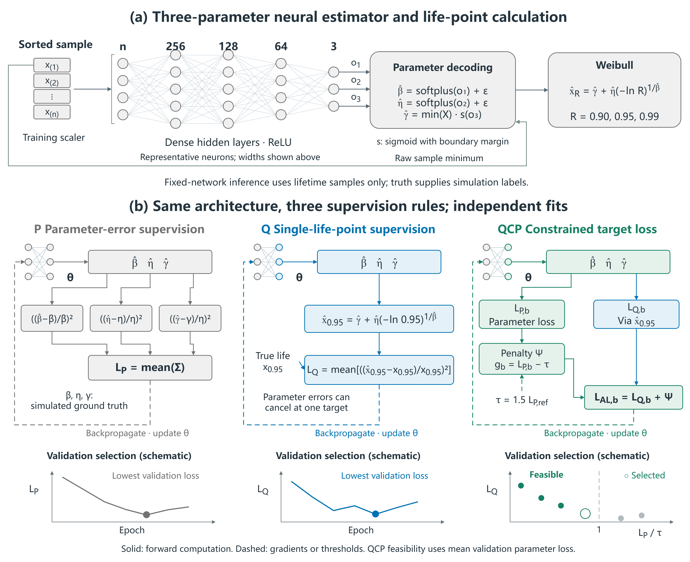

# Task alignment in three-parameter Weibull life-point estimation: benefits, costs, and parameter constraints

## Abstract

Minimizing parameter error need not minimize error in a derived engineering quantity. We examine the benefits and costs of aligning three-parameter Weibull neural estimation with one reliability life point. Parameter-oriented (P) and target-oriented (Q) procedures share data, network structure, and maximum training budgets, but use their respective training and validation losses. Fixed-scale simulations cover 40 parameter combinations, four sample sizes, and 200 paired model units. Q reduces pooled root mean squared relative error (RMSRE) at $x_{0.95}$ from 16.43% to 16.09%, a relative improvement of 2.07% (95% empirical interval: 1.28%–2.81%), but increases error at $x_{0.90}$ and $x_{0.99}$ by 36.41% and 63.11%. With a common validation criterion, Q retains a 1.32% target improvement (0.63%–1.96%). Loss geometry and prediction-level decompositions show that single-point supervision permits large, compensating parameter errors. Parameter-constrained learning (QCP) reduces target RMSRE to 15.84% and repairs deterioration at the other two points; fixed-weight parameter regularization achieves similar accuracy. Direct supervision of all three points also reduces the cross-point errors, but recovers parameters less accurately than the parameter-regularized procedures. Pooled gains concentrate in a few high-error cells, while P retains an advantage in typical absolute error. These post-test controls reuse the original samples. The evidence supports matching supervision to both the intended life points and parameter interpretation, without demonstrating an accuracy advantage of QCP over simple weighting.

**Keywords:** three-parameter Weibull; reliability life point; task alignment; parameter compensation; constrained learning; neural estimation

## 1 Introduction

Reliability analysis requires both a description of the lifetime distribution and estimates of life at specified survival probabilities. The three-parameter Weibull distribution describes lifetime through shape $\beta$, scale $\eta$, and location $\gamma$, but estimating these parameters from small samples remains challenging [1,2,3,4]. Classical estimators [5,6,13,14] and neural approaches [7,12] commonly recover distribution parameters before calculating reliability life points. When the final use concerns a particular life point, the training objective can affect the risk of that derived estimate.

Let $R$ denote survival probability and define the reliability life point by $R(x_R)=R$. Our target, $x_{0.95}$, is therefore the 5th percentile of the failure-time distribution. A common supervised objective for a three-output network is the equally weighted sum of three normalized squared parameter errors. Normalization removes physical units, and equal coefficients provide a transparent parameter-recovery reference. These coefficients are a metric convention, however: the actual effects of parameter errors on $x_{0.95}$ depend on the life-point formula, the parameter values, and interactions between errors.

A direct alternative retains the same three parameter outputs, computes $x_{0.95}$ through the Weibull formula, and trains the network on the life-point error. Quantile regression, elicitable target functionals, and task-focused learning all motivate defining objectives around the quantity ultimately used [8,9,10,11,15]. Small-sample work on the two-parameter Weibull distribution has also compared bias and mean squared error for parameter estimators and their plug-in quantile estimators [16]. We examine how training objectives and their associated validation-selection rules change life-point risk for simulation-trained neural estimators in the three-parameter setting [18,19].

Single-point supervision introduces a structural freedom. Three parameters determine a distribution curve, whereas one life point supplies a scalar target. Different parameter combinations can produce the same $x_{0.95}$ but different $x_{0.90}$ and $x_{0.99}$. Direct target optimization may thus permit compensating parameter errors that preserve target accuracy while distorting other life points. Its benefits should be assessed together with this freedom and its downstream costs.

We address three questions: whether a target-oriented procedure Q improves on a parameter-oriented procedure P at $x_{0.95}$; whether single-point supervision is accompanied by parameter compensation and deterioration at other life points; and whether retaining the Q objective within a parameter-loss constraint, QCP, repairs that deterioration. The contribution is a quantitative account of task-alignment benefits, costs, and repair within a controlled simulation design. A fixed-weight parameter penalty, QP, provides a simpler reference for assessing the need for constrained optimization (Appendix B.9). The P-to-Q-to-QCP sequence represents the development of the research question; the procedures are trained separately.

## 2 Methods

### 2.1 Lifetime model, data, and evaluation domain

We first compared parameter-oriented and target-oriented procedures, then examined parameter constraints as a repair for the costs of single-point supervision (Figure 1). All three used the same network architecture and produced three Weibull parameters.

*Figure 1. Neural architecture and supervision rules. A shows sorted samples, a training-fitted standardizer, three fully connected ReLU hidden layers, three-output decoding, and Weibull life-point calculation. Circles represent neurons schematically; actual layer widths are n–256–128–64–3. The raw sample minimum also enters location decoding. Each miniature network in B represents the architecture in A, fitted independently. P averages the sum of three squared normalized parameter errors (Σ denotes the three incoming terms); Q computes the target life point from the predicted parameters and compares it with its true value. QCP combines minibatch target loss with the augmented-Lagrangian penalty Ψ defined in the text. This penalty depends on constraint violation, multiplier μ, and coefficient ρ; μ is updated each epoch. The threshold τ comes from an earlier P reference validation loss. Dashed arrows indicate gradients or threshold dependence. Bottom curves and points illustrate selection rules, not measured results: P/Q minimize validation parameter/target loss; QCP selects the lowest target loss among checkpoints whose mean validation parameter loss is at most τ. The open circle marks the selected checkpoint. Validation feasibility is not a per-prediction error bound.*

The model and its reliability life points are

$$
R(x)=\exp\left[-\left(\frac{x-\gamma}{\eta}\right)^\beta\right],\qquad
x_R=\gamma+\eta[-\ln R]^{1/\beta},\quad x>\gamma.
$$

The simulation grid was

$$
\beta\in\{1.5,2,2.5,3,3.5,4,4.5,5\},\quad\eta=1000,\quad
\gamma/\eta\in\{0.10,0.25,0.50,0.75,1.00\},\quad n\in\{7,10,15,20\}.
$$

We generated 300 independent uncensored samples for each parameter–sample-size combination, giving 160 fixed truth cells and 48,000 samples. Each input consisted of the sorted lifetime observations in their original units, without division by the sample mean. Per-position standardization used means and standard deviations fitted on the current training fold only.

The repeat index modulo five defined the folds. Each rotation used one class for testing, the next for validation, and the remaining three for training: 60, 60, and 180 samples per parameter combination, respectively. Training and test samples were disjoint within a rotation, although training sets overlapped across rotations. All sets covered the same parameter grid, so the evaluation concerned new samples within the design domain.

Although scale was fixed, true $x_{0.95}$ ranged from 238.05 to 1552.09. Relative error allowed proportional comparisons across these life levels. The constant scale label is a substantive condition: P can reduce scale error by learning a constant, whereas Q can sacrifice scale recovery to reduce life-point error. The observed compensation cannot therefore be directly generalized to tasks in which scale varies.

### 2.2 Shared network and basic losses

A separate multilayer perceptron was trained for each sample size, with architecture $n\rightarrow256\rightarrow128\rightarrow64\rightarrow3$, ReLU hidden activations, and float64 computation. For raw outputs $o_1,o_2,o_3$, shared decoding gave

$$
\hat\beta=\operatorname{softplus}(o_1)+\varepsilon,\quad
\hat\eta=\operatorname{softplus}(o_2)+\varepsilon,\quad
\hat\gamma=\min(X)\{\delta+(1-2\delta)\operatorname{sigmoid}(o_3)\},
$$

where $\varepsilon=10^{-6}$ and $\delta=10^{-7}$. Thus $\hat\beta>0$, $\hat\eta>0$, and $0<\hat\gamma<\min(X)$, matching the positive-location design domain.

All procedures used Adam with learning rate $10^{-3}$, weight decay $10^{-4}$, and batch size 256. The common maximum budget was 600 epochs with early-stopping patience 60. Paired model units shared data splits, standardization, initialization, first-epoch batch order, and network architecture.

Define normalized parameter errors by

$$
u=\left(\frac{\hat\beta-\beta}{\beta},\frac{\hat\eta-\eta}{\eta},\frac{\hat\gamma-\gamma}{\eta}\right).
$$

P minimized $L_P=\operatorname{mean}\|u\|^2$. The position error was normalized by $\eta$ to avoid divergence of its metric as $\gamma$ approaches zero. Equal coefficients refer to these three dimensionless squared terms; they do not incorporate life-point sensitivity.

Q retained the same parameter outputs but minimized

$$
L_Q=\operatorname{mean}\left[\left(\frac{\hat x_{0.95}-x_{0.95}}{x_{0.95}}\right)^2\right].
$$

P and Q selected checkpoints by minimum validation $L_P$ and $L_Q$, respectively. Their primary comparison therefore concerned complete procedures combining training and validation selection. The supplementary P_QSELECT control used validation $L_Q$ for checkpoint selection and early stopping to assess the training-objective contrast under a common validation criterion (Appendix F).

### 2.3 Parameter-constrained target learning

QCP kept the target loss as its objective and restricted acceptable parameter loss:

$$
\min_\theta L_Q(\theta)\quad\text{subject to}\quad L_P(\theta)\le\tau_j,
\qquad\tau_j=cL_{P,\mathrm{ref},j}.
$$

Here $j=(n,k,s)$ identifies sample size, fold, and training seed. The reference was the best validation parameter loss of a matched earlier P model trained with a 300-epoch maximum and patience 20. Thresholds were fixed before reading the test results of the current 600-epoch P models.

Let $g_b=L_{P,b}-\tau_j$ for a batch and $g_{\mathrm{tr}}=L_{P,\mathrm{tr}}-\tau_j$ for an epoch. The latter used the sample-count-weighted mean of batch parameter losses observed during training, rather than a fresh full-training-set evaluation of the fixed end-of-epoch model. Following a nonnegative-multiplier augmented-Lagrangian framework [17], training minimized

$$
L_{\mathrm{AL},b}=L_{Q,b}+\frac{[\max\{0,\mu+\rho g_b\}]^2-\mu^2}{2\rho},
\qquad\mu\leftarrow\max\{0,\mu+\rho g_{\mathrm{tr}}\}
$$

with an epoch-end multiplier update. The multiplier started at zero and $\rho$ remained fixed within a fit. The parameter penalty was inactive when the constraint was slack and the multiplier was zero. Checkpoint selection first required validation-average $L_P\le\tau_j$, then chose the smallest validation $L_Q$ among feasible epochs. Neither the batch penalty nor validation-average feasibility bounds the error of every individual prediction.

Six combinations of $c\in\{1.25,1.5,2\}$ and $\rho\in\{0.03,0.1\}$ were screened on eight validation units: seed 42, folds 1 and 3, and all four sample sizes. Among candidates feasible in at least seven of the eight units, aggregate validation target loss determined selection. The 48 screening fits and eight further budget-check fits used no test metrics. The chosen settings were $c=1.5$, $\rho=0.1$, and 600/60, followed by 200 QCP fits. After the earlier P/Q test results had been read, P and Q were extended to the same maximum budget. The main tables use this common-budget analysis; the chronology and costs are detailed in Appendix A.

### 2.4 Single-point supervision and parameter compensation

In the common output-error coordinates, the per-sample losses satisfy

$$
\ell_P=\|u\|^2,\quad\nabla_u\ell_P=2u,\quad H_P=2I_3,
\qquad\ell_Q=e(u)^2,\quad\nabla_u\ell_Q=2e(u)\nabla_u e(u),
$$

where $e$ is relative life-point error. With $a=-\ln R$ and $t=a^{1/\beta}$,

$$
\frac{\partial x_R}{\partial\gamma}=1,\qquad
\frac{\partial x_R}{\partial\eta}=t,\qquad
\frac{\partial x_R}{\partial\beta}=-\frac{\eta t\ln a}{\beta^2}.
$$

At the truth, define

$$
s_0=\left(\frac{\beta}{x_R}\frac{\partial x_R}{\partial\beta},
\frac{\eta}{x_R}\frac{\partial x_R}{\partial\eta},
\frac{\eta}{x_R}\frac{\partial x_R}{\partial\gamma}\right),\qquad H_Q(0)=2s_0s_0^{\mathsf T}.
$$

The local squared error is

$$
(s_0^{\mathsf T}u)^2=\sum_i s_{0,i}^2u_i^2+2\sum_{i<j}s_{0,i}s_{0,j}u_i u_j.
$$

The diagonal terms describe local sensitivity; the cross terms permit amplification or cancellation. P penalizes all three parameter-error directions, whereas Q has a rank-one local Hessian and no second-order penalty in the two orthogonal directions. More directly, $\hat x_{0.95}=x_{0.95}$ defines an equal-life surface in the admissible output space. Moving along it preserves the target while changing other life points. This freedom of a scalar objective is distinct from statistical identifiability of the Weibull model.

Sensitivity directions vary across truth points, so sums of local Hessians in common error coordinates may have higher rank. A conditional network also outputs different parameter triples for different samples. Shared weights, capacity, and regularization determine which combinations of sample-specific shifts are attainable. Output geometry reveals permitted compensation directions; observed parameter distributions and cross-point errors establish whether compensation appears in the fitted predictions. Geometry alone does not determine the rank of the network-weight Hessian or identify causal contributions during optimization.

At finite error, path-averaged sensitivity gives an exact expression for target error, but depends on the predicted parameters. Its derivatives must be retained when differentiating the loss. A static linearization at the truth therefore does not represent the full Q objective (Appendix C.2–C.4).

For fitted predictions, we used the exact symmetric decomposition $e=c_\beta+c_\eta+c_\gamma$ in Appendix C.1 and calculated

$$
C=\operatorname{mean}\left[1-\frac{|c_\beta+c_\eta+c_\gamma|}{|c_\beta|+|c_\eta|+|c_\gamma|}\right],
$$

setting a row to zero when the denominator was zero. Larger $C$ indicates stronger within-prediction cancellation. Average $L_P$ separately measures parameter displacement. Relative to P, the reduction of excess compensation under QCP was $(C_Q-C_{\mathrm{QCP}})/(C_Q-C_P)$; this is a diagnostic of cancellation, not a life-point accuracy measure.

### 2.5 Paired evaluation and aggregation

Ten training seeds, four sample sizes, and five folds produced 200 paired model units per procedure and 600 primary fits. Each procedure generated 480,000 test predictions from 48,000 lifetime samples repeated across ten training seeds. These are not 480,000 independent samples.

The main metric was

$$
\operatorname{RMSRE}_m(R)=\sqrt{\operatorname{mean}\left[\left(\frac{\hat x_{R,m}-x_R}{x_R}\right)^2\right]}.
$$

We averaged MSE equally across the 200 model units before taking the square root. Relative improvement from procedure $a$ to $b$ was $I_{a\rightarrow b}=1-\operatorname{RMSRE}_b/\operatorname{RMSRE}_a$, with positive values favoring $b$. For intervals, folds were resampled within sample size and seeds globally, preserving procedure pairing, for 200,000 bootstrap replicates. Because training sets overlap across folds and only ten seeds were used, these are design-level empirical bootstrap approximations.

The primary training target was $x_{0.95}$. The same parameter predictions yielded $x_{0.90}$ and $x_{0.99}$ for a post hoc mechanism analysis specified before reading these derived results. Regional effects were aggregated over 160 fixed truth cells $(n,\beta,\gamma/\eta)$, each containing 3,000 predictions per procedure.

We also described mean and median absolute relative error, its 95th percentile, the proportion within ±10%, and signed relative bias. These quantify different aspects of error and were not combined into a score. The 95th percentile of absolute error is a tail statistic of the error distribution, distinct from the reliability life point $x_{0.95}$.

For truth cell $c$, let $b_c=\operatorname{mean}(e_c)$ and $v_c=\operatorname{mean}[(e_c-b_c)^2]$. Then

$$
B_{\mathrm{RMS}}=\sqrt{\operatorname{mean}_c b_c^2},\quad
S_{\mathrm{within}}=\sqrt{\operatorname{mean}_c v_c},\quad
\mathrm{RMSRE}^2=B_{\mathrm{RMS}}^2+S_{\mathrm{within}}^2.
$$

The bias component prevents cancellation between positive and negative regional biases. Within-cell variation includes both sample and training randomness. Intervals and stratified summaries were not adjusted for multiple comparisons; primary contrasts and descriptive mechanism analyses are interpreted separately.

## 3 Results

### 3.1 Benefits and costs of aligning with one life point

Under the common maximum budget, Q reduced target RMSRE from 16.43% to 16.09%, a relative improvement of 2.07% (95% empirical CI: 1.28% to 2.81%). The same parameter predictions increased RMSRE at $x_{0.90}$ and $x_{0.99}$ by 36.41% and 63.11% relative to P (Table 1). The modest target benefit was accompanied by considerably larger costs at the unsupervised life points.

**Table 1. Pooled RMSRE at three reliability life points.**

| Life point | P | Q | QCP | Q vs P improvement (95% CI) | QCP vs Q improvement | QCP vs P improvement (95% CI) |
|---|---:|---:|---:|---:|---:|---:|
| $x_{0.90}$ | 13.66% | 18.63% | 13.34% | −36.41% (−38.51% to −34.32%) | 28.42% | 2.35% (1.81% to 2.90%) |
| $x_{0.95}$ | 16.43% | 16.09% | 15.84% | 2.07% (1.28% to 2.81%) | 1.56% | 3.60% (3.03% to 4.18%) |
| $x_{0.99}$ | 21.96% | 35.82% | 20.65% | −63.11% (−65.27% to −61.16%) | 42.36% | 5.98% (5.28% to 6.67%) |

*All comparisons use the same 200 paired model units. Negative improvement denotes increased error. RMSRE percentages describe error levels; improvement percentages describe ratios between procedures. Complete QCP-vs-Q intervals are in Appendix B.2.*

Target accuracy did not ensure parameter recovery. Average $L_P$ was 71.7 for Q and 0.0539 for P, while average compensation increased from 0.332 to 0.915. The equal-life slice in Figure 2A illustrates the permitted freedom; panels C–D decompose the fitted test predictions. Shape and location contributions were mainly positive for Q, and scale contributions mainly negative. Their sum within the same prediction was much smaller in absolute value than the sum of their magnitudes, showing that large parameter displacement coexisted with substantial cancellation.

*Figure 2. Geometry and observed parameter compensation. A: an output slice with fixed $\gamma=100$ and truth $(\beta,\eta)=(1.5,1000)$. The dashed curve preserves $x_{0.95}$; gray contours indicate absolute relative life-point error. B: actual validation-average parameter loss and target error for the 200 selected QCP checkpoints. The vertical boundary is $L_P/\tau_j=1$; feasibility is an average condition, not a per-prediction error bound. C: exact symmetric contributions for 480,000 predictions per procedure. Markers, thick lines, and thin lines show medians, interquartile ranges, and 5th–95th percentile ranges, respectively; these are descriptive distributions. D: each point is a model unit. Contribution magnitudes and absolute summed error are calculated within each prediction and then averaged. The dashed line denotes no cancellation. An equal-aspect inset enlarges P/QCP, and Q clusters are labeled by sample size. The underlying test samples are shared across training seeds.*

### 3.2 Parameter constraints preserve target gains and repair cross-point performance

QCP further reduced target RMSRE by 1.56% relative to Q (95% CI: 1.24% to 1.90%), and reduced error at the other two life points by 28.42% and 42.36%. All three pooled RMSRE values were slightly lower than P (Table 1). In this comparison, the main role of the constraint was to repair cross-point deterioration while preserving the target benefit.

All 200 selected QCP checkpoints satisfied validation-average feasibility (Figure 2B). Its average test $L_P=0.0552$ and compensation index 0.345 were close to P. The excess-compensation reduction relative to P was 97.8%, describing the return of this diagnostic toward P rather than an accuracy improvement of that magnitude.

*Figure 3. Error levels and paired effects at three prespecified life points. A: pooled RMSRE. B: relative improvement for Q vs P, QCP vs Q, and QCP vs P, with paired crossed-bootstrap 95% intervals. Positive values denote improvement. All contrasts use 200 model units. The inset enlarges the small target-point effects. Exact values are in Table 1 and Appendix B.2; a wider descriptive reliability curve and parameter errors are shown in Figure B3.*

### 3.3 Pooled gains and regional heterogeneity

QCP improved on Q in 155, 119, and 146 of the 160 truth cells at the three life points. Relative to P, however, only 74, 76, and 77 cells improved, and each median cell effect slightly favored P (Table 2). Q improved on P in only 42 target-point cells. Lower pooled RMSRE therefore did not imply improvement in most regions; it depended on the magnitudes of changes in squared error.

**Table 2. Truth-cell directions and median effects.**

| Life point | Q better than P | QCP better than Q | QCP better than P | Median QCP-vs-P improvement |
|---|---:|---:|---:|---:|
| $x_{0.90}$ | 8/160 | 155/160 | 74/160 | −0.67% |
| $x_{0.95}$ | 42/160 | 119/160 | 76/160 | −0.26% |
| $x_{0.99}$ | 13/160 | 146/160 | 77/160 | −0.08% |

*Truth cells contain equal numbers of predictions. Medians are calculated from cell-level relative improvements. Cells share trained networks; counts describe the fixed design and are not treated as 160 independent Bernoulli trials.*

Let $\Delta_c=\mathrm{MSE}_{P,c}-\mathrm{MSE}_{\mathrm{QCP},c}$. At the target, the five cells with the largest $\Delta_c$ accounted for 102.6% of the total net improvement; the remaining cells collectively offset part of that gain (Figure 4). Grouping cells by P error similarly located positive gains mainly in the highest-error quartile, with the middle two quartiles slightly favoring P on average. The top five cells all had low shape and low location ratio (Figure B4 and Table B9). This is a post hoc localization of observed gains, not a rule for selecting a procedure when true parameters are unknown.

*Figure 4. Regional effects and concentration of target-point gains. A: relative RMSRE improvement of Q and QCP over P for each of 160 truth cells. White diamonds and thick lines denote medians and interquartile ranges; horizontal jitter only separates overlapping points. B: cumulative QCP-vs-P MSE improvement at $x_{0.95}$, with cells ordered by descending $\Delta_c$ and the total net improvement normalized to 100%. The rise above 100% followed by a decline shows that gains in leading cells are partly offset by deterioration in later cells. The ranking is descriptive and is not used for model or deployment-region selection.*

Increasing the number of observations had a larger and shared effect: from $n=7$ to $n=20$, target RMSRE fell from 20.74% to 12.00% for P and from 19.92% to 11.69% for QCP. Appendix B.4 reports sample-size strata and a descriptive equivalent-sample-size calculation conditional on the empirical P curve.

### 3.4 Error shape, variation, and training cost

Relative to Q, QCP reduced target RMSRE, mean and median absolute error, and the 95th percentile of absolute error, while increasing the proportion within ±10%. Its signed bias was also closer to zero. Relative to P, QCP had lower RMSRE and a lower 95th-percentile error, but P retained better mean and median absolute error and a larger proportion within ±10% (Table 3).

**Table 3. Target-point errors and resources under the common budget.**

| Metric | P | Q | QCP |
|---|---:|---:|---:|
| RMSRE | 16.43% | 16.09% | 15.84% |
| Mean absolute relative error | 10.92% | 11.19% | 10.94% |
| Median absolute relative error | 7.69% | 8.14% | 7.86% |
| 95th percentile of absolute relative error | 30.43% | 30.80% | 30.31% |
| Proportion within ±10% | 60.75% | 58.40% | 59.70% |
| Signed relative bias | −1.51% | −2.71% | −2.48% |
| Proportion overestimating by >10% | 14.29% | 13.25% | 13.19% |
| Proportion overestimating by >20% | 6.85% | 6.02% | 6.07% |
| Median training time per fit / s | 41.4 | 29.6 | 87.2 |

*Secondary metrics are descriptive point estimates. Overestimation means positive relative target error. Training used PyTorch on CPU, float64, and one compute thread per process. A verifiable processor model was not retained in the original records; timings describe those runs only. QCP timing excludes earlier P references and constraint screening.*

One-sided rankings also depended on the threshold: QCP had slightly fewer >10% overestimates than Q, but slightly more >20% overestimates. The lowest pooled RMSRE did not imply dominance at every risk threshold.

The within-cell standard-deviation components were 14.82%, 14.49%, and 14.21% for P, Q, and QCP. Their RMS cell-bias components were similar at 7.09%, 6.99%, and 7.00%. The reduction in pooled squared error was therefore mainly associated with lower within-cell variation (Appendix B.5).

All 200 models per procedure entered the analysis; all saved predictions were finite and satisfied parameter support. Three QCP fits reached the 600-epoch limit. The remaining QCP fits and all P/Q fits ended earlier. Equal maximum budgets supplied equal epoch opportunities, while constrained optimization and reference training added computational cost.

### 3.5 Common validation and alternative repairs

Supplementary controls added 600 training trajectories, with 200 model units per trajectory type (Appendix F). P_QSELECT retained parameter-loss training but used the same validation target loss as Q for checkpoint selection and early stopping. Its target RMSRE was 16.3077%, a 0.757% improvement over P (95% empirical interval: 0.477%–1.029%). Q retained a 1.322% improvement over P_QSELECT (0.631%–1.957%). Common validation reduced the original P/Q gap without eliminating Q's target advantage. Stopping epochs could still differ, and the two relative improvements cannot be added as independent causal contributions.

All 200 repeated Q target metrics and selected epochs reproduced the original records. No checkpoint within any native Q early-stopping trajectory satisfied the original QCP parameter threshold (0/200); the smallest recorded validation parameter-loss/threshold ratio was 10.268. Feasible selection alone therefore supplied no repair within these trajectories and no Q_FEAS test-accuracy result to aggregate. This finding does not establish infeasibility under longer training or altered optimization.

QMULTI directly supervised the three prespecified life points, with RMSRE of 14.0130%, 16.0977%, and 20.8491%. Compared with Q, it reduced error at the two non-target points by 24.781% and 41.795%, while the empirical interval for the target-point difference crossed zero. Its errors remained higher than QP and QCP at all three points, with each paired interval excluding zero (Table F2). Mean parameter loss was 0.301916 for QMULTI, versus 0.055208 for QP and 0.055218 for QCP. Thus multi-point supervision mitigated the cross-point cost, but this equal-weight setting did not match the parameter recovery or life-point accuracy of the parameter-regularized procedures. All three points were directly supervised, so these results do not establish generalization to unsupervised life points.

The supplementary protocol was specified after earlier test outcomes were known and reused the original simulation samples. These controls narrow the supported interpretations without providing independent fresh-data confirmation.

## 4 Discussion

### 4.1 What task alignment changes

P penalizes normalized parameter errors separately; Q evaluates their joint effect on a derived life point. The distinction extends beyond directional weights: the nonlinear distribution formula introduces interactions and prediction-dependent sensitivity. Equal-life freedom in output space provides a geometric account of parameter drift, without establishing a claim about the weight-space Hessian or isolating causal contributions during optimization.

In the earlier exploratory M95 ablation, a static sensitivity proxy at the truth did not reproduce Q accuracy. Finite-error cross terms and nonlinear remainders reversed the improvement in the local approximation (Appendix C). This result limits the tested proxy, rather than ruling out other parameter weighting or regularization schemes.

### 4.2 Interpreting modest pooled gains

Because pooled RMSRE aggregates squared error, changes in difficult cells can determine the overall ranking while typical cells slightly favor P. Figures 4 and B4 locate this distinction within the present design. The observed ranking uses test outcomes and does not provide a sample-observable selection rule.

An objective specifies the desired risk, but does not guarantee the magnitude of its benefit under finite data, capacity, and optimization. P already provides reasonably accurate plug-in life points. Each estimation sample contains only 7–20 observations, and increasing that number has a larger effect than changing the procedure. The primary 2.07% effect also includes different validation criteria, so it cannot be attributed entirely to training gradients.

### 4.3 Why compensation affects other life points

Parameters can move substantially along a near-equal-target surface while leaving other life points free to change. Q had median predicted shape 20.39 and scale 67.00, far from the label domain. Exact prediction-level decomposition confirms cancellation within estimates, rather than cancellation of positive and negative errors between samples.

Widespread location-boundary saturation does not explain the pattern: only 0.014% of Q predictions lay within 0.1% of the decoding upper bound (Appendix B.6). The constant scale label remains relevant, however. P is directly supervised to recover that constant, while Q can exploit off-label parameter combinations. Whether the same gains and compensation occur when scale varies requires a separate evaluation.

Compensation can coexist with low target risk when only the target point is used. It becomes a substantive cost when the same parameters are also used to interpret the distribution or estimate other life points. QCP's larger improvements at the two non-target points are consistent with restricting this freedom. Three selected life points still do not establish complete-distribution accuracy.

### 4.4 QCP and simpler repairs

QCP expresses acceptable average parameter displacement through a threshold and selects the lowest-target-loss checkpoint satisfying validation feasibility. Its direct value is a checkable parameter-recovery requirement, whose meaning depends on normalization, the reference P model, and the slack coefficient.

Fixed weighting also repaired Q. Under the same 600/60 maximum budget, QP and QCP had target RMSRE of 15.8505% and 15.8406%. QCP's relative improvement was 0.0623%, with a 95% empirical interval from −0.0499% to 0.1679%; the intervals at the other two points also crossed zero (Appendix B.9). Parameter loss and compensation were similar. These results do not demonstrate an accuracy advantage of QCP or establish statistical equivalence. Recorded QP training times were lower, while QCP additionally required reference fits and constraint screening.

Thus the repair supports adding parameter-recovery requirements, but does not by itself establish a need for augmented constrained optimization. QCP directly checks an average validation-loss condition; QP does not enforce that condition separately for every model. Feasibility requirements and average test accuracy should therefore be evaluated separately.

For the same function class, the ideal minimum of an unconstrained objective cannot exceed its minimum over a constrained subset. Better fitted QCP performance than fitted Q consequently reflects finite optimization, regularization, and selection together. The common-validation control retained Q's target advantage, whereas native Q trajectories supplied no feasible checkpoint (Section 3.5). Multi-point supervision also mitigated cross-point errors, showing that such repair need not require a parameter constraint. When the parameters themselves need interpretation, parameter-recovery metrics still require separate assessment.

### 4.5 Use and scope

A trained, fixed network takes only a lifetime sample as input. True parameters provide simulation supervision and threshold selection, not inference inputs. Retraining from unlabeled real data would require a different source of supervision. Inputs retain their original units and training and test sets cover the same grid, so current conclusions are limited to the fixed physical scale, uncensored small samples, and the same generating mechanism.

Procedure choice also depends on whether the use prioritizes pooled squared risk, typical absolute error, one-sided overestimation, or computation. A lower confidence bound with specified coverage requires a separately defined objective and coverage validation. Equivalent sample size is a descriptive transformation of the P error curve, not evidence from actually collecting more observations.

The common-budget extension followed inspection of early P/Q test outcomes, and later controls reuse the existing samples. These stages are not independent fresh-data confirmation. Overlapping fold training sets, finite seeds, and post hoc analyses restrict interpretation of empirical intervals. The evidence supports bounded benefits and costs, while retaining adverse cells and simpler comparators.

## 5 Conclusions

Within the fixed-scale three-parameter Weibull design, aligning training and validation with one life point produced a modest reduction in pooled target risk while permitting substantial parameter compensation and deterioration at other life points. The pooled benefit did not imply improvement in most parameter regions or in typical absolute error.

Parameter-recovery requirements repaired this deterioration. QCP provided validation-average feasibility control while preserving target gains; fixed weighting achieved similar accuracy. Q retained its target advantage under common validation. Direct three-point supervision also mitigated cross-point errors, but its current equal-weight setting recovered parameters less accurately than QP/QCP. Current evidence supports considering task objectives together with the intended interpretation of estimated parameters, without demonstrating an accuracy advantage of constrained optimization over simple weighting. Practical choices should reflect the relevant error metric, feasibility requirement, and computational cost.

## Data and code availability

The simulation protocols, training and derived-analysis code, model-level summaries, paired predictions, and checksums are assembled in a local reproducibility bundle. No public repository accession has yet been assigned. Appendix E maps the reported evidence to files and reproduction commands; historical 300/20 results are separated from the common-budget and supplementary controls.

## References

[1] Weibull, W. (1951). A Statistical Distribution Function of Wide Applicability. *Journal of Applied Mechanics*, 18(3), 293–297. https://doi.org/10.1115/1.4010337

[2] Rinne, H. (2008). *The Weibull Distribution: A Handbook*. Chapman & Hall/CRC Press. https://doi.org/10.1201/9781420087444

[3] Murthy, D.N.P., Xie, M., & Jiang, R. (2004). *Weibull Models*. Wiley-Interscience. https://doi.org/10.1002/047147326X

[4] Meeker, W.Q., & Escobar, L.A. (1998). *Statistical Methods for Reliability Data*. Wiley.

[5] Xie, L., Wu, N., & Yang, X. (2023). A Minimum Discrepancy Method for Weibull Distribution Parameter Estimation. *International Journal of Structural Stability and Dynamics*, 23(8), 2350085. https://doi.org/10.1142/S0219455423500852

[6] 谢里阳, 朱文慧, 吴宁祥, 杨小玉. (2025). 基于统计最小差异原理的 Weibull 分布参数估计方法. *东北大学学报（自然科学版）*, 46(7), 108–112. https://doi.org/10.12068/j.issn.1005-3026.2025.20240194

[7] Yang, X., Xie, L., Chen, J., Zhao, B., & Wang, K. (2025). Estimation of Weibull distribution using the back-propagation neural network for fatigue failure data. *Probabilistic Engineering Mechanics*, 82, 103828. https://doi.org/10.1016/j.probengmech.2025.103828

[8] Koenker, R., & Bassett, G. (1978). Regression Quantiles. *Econometrica*, 46(1), 33–50. https://doi.org/10.2307/1913643

[9] Elmachtoub, A.N., & Grigas, P. (2022). Smart “Predict, then Optimize”. *Management Science*, 68(1), 9–26. https://doi.org/10.1287/mnsc.2020.3922

[10] Wilder, B., Dilkina, B., & Tambe, M. (2019). Melding the Data-Decisions Pipeline: Decision-Focused Learning for Combinatorial Optimization. *AAAI*, 33(01), 1658–1665. https://doi.org/10.1609/aaai.v33i01.33011658

[11] Donti, P.L., Amos, B., & Kolter, J.Z. (2017). Task-based End-to-end Model Learning in Stochastic Optimization. *NeurIPS*, 30, 5484–5494. arXiv:1703.04529

[12] Abbasi, B., Rabelo, L., & Hosseinkouchack, M. (2008). Estimating parameters of the three-parameter Weibull distribution using a neural network. *European Journal of Industrial Engineering*, 2(4), 428–445. https://doi.org/10.1504/EJIE.2008.018438

[13] Cousineau, D. (2009). Fitting the three-parameter Weibull distribution: Review and evaluation of existing and new methods. *IEEE Transactions on Dielectrics and Electrical Insulation*, 16(1), 281–288. https://doi.org/10.1109/TDEI.2009.4784578

[14] Nagatsuka, H., Kamakura, T., & Balakrishnan, N. (2013). A consistent method of estimation for the three-parameter Weibull distribution. *Computational Statistics & Data Analysis*, 58, 210–226. https://doi.org/10.1016/j.csda.2012.09.005

[15] Gneiting, T. (2011). Making and Evaluating Point Forecasts. *Journal of the American Statistical Association*, 106(494), 746–762. https://doi.org/10.1198/jasa.2011.r10138

[16] Jokiel-Rokita, A., & Piątek, S. (2024). Estimation of parameters and quantiles of the Weibull distribution. *Statistical Papers*, 65(1), 1–18. https://doi.org/10.1007/s00362-022-01379-9

[17] Nocedal, J., & Wright, S.J. (2006). *Numerical Optimization* (2nd ed., Chapter 17). Springer. https://doi.org/10.1007/978-0-387-40065-5

[18] Cranmer, K., Brehmer, J., & Louppe, G. (2020). The frontier of simulation-based inference. *Proceedings of the National Academy of Sciences*, 117(48), 30055–30062. https://doi.org/10.1073/pnas.1912789117

[19] Radev, S.T., Mertens, U.K., Voss, A., Ardizzone, L., & Köthe, U. (2022). BayesFlow: Learning Complex Stochastic Models With Invertible Neural Networks. *IEEE Transactions on Neural Networks and Learning Systems*, 33(4), 1452–1466. https://doi.org/10.1109/TNNLS.2020.3042395

## Supplementary material

[Appendices A–F: experimental details, full results, derivations, historical analyses, reproducibility index, and supplementary controls](Study02-supplement-v2.7.0-en.md).
