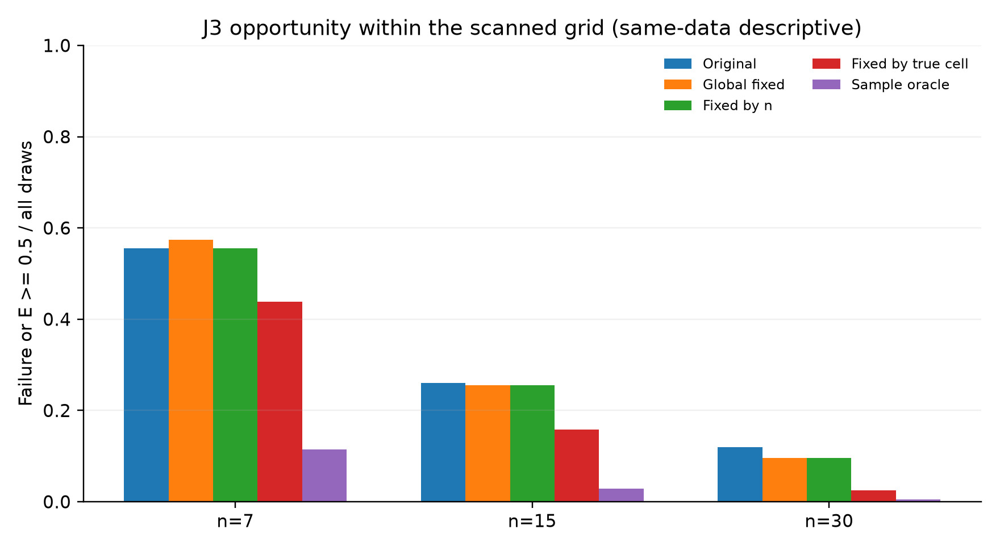
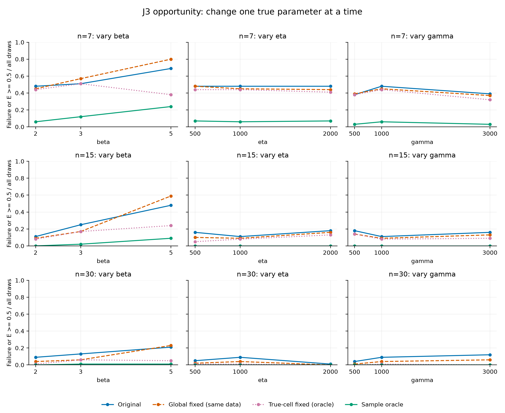
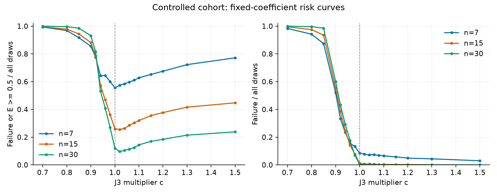
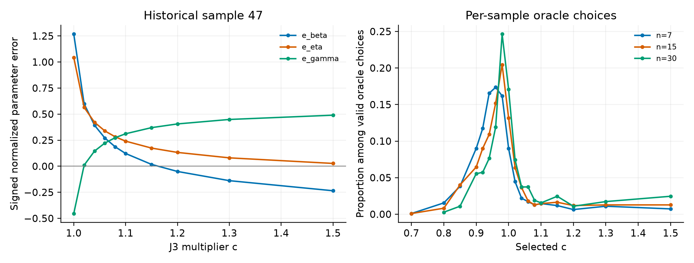

# J3 调整的改善空间分析

后续进展：[S03-J3-02 已完成样本选择器与新种子测试](03-样本自适应J3学习初步试验.md)。本文保留S03-J3-01阶段的机会结论与当时边界。

更新：2026-09-22。实验 S03-J3-01 已完成：4,500组样本、18个系数、81,000次候选拟合。当前结论是**固定 J1/J2 时，J3 的逐样本选择存在明显的事后改善空间，而统一改一个系数收益有限**。网络能恢复多少空间尚未检验。

## 1. 实际改变了什么

每次拟合令 J3*(n,β)=c×J3(n,β)，c 在该次求解中固定，β 按原方程迭代。J1/J2、五个确定性初值、形状和位置约束、残差阈值、解的选择规则均不变。这里改变位置方程的目标量，不是给目标函数中的残差平方乘权重。

候选系数为0.70、0.80、0.85、0.90、0.92、0.94、0.96、0.98、1.00、1.02、1.04、1.06、1.08、1.10、1.15、1.20、1.30、1.50。c=1逐组重新拟合，与原4,500组结果核对一致。

原基线中的综合误差 E=max(|(β̂−β)/β|, |(η̂−η)/η|, |(γ̂−γ)/η|)。本轮主要比较“失败或 E≥0.5”的全样本比例，称为风险事件率。它与前一阶段“有效估计中的大误差率”分母不同，不能直接混用。

固定系数以风险事件率最低为先，再用平均截断误差、失败率及距1的距离破除并列。逐样本事后选择则在有效候选中使 E 最小。详见 [冻结协议](results/j3_scan_v1/实验协议.md)。

## 2. 统一模拟组：固定调整与样本自适应的空间差别很大

下表为统一模拟组，11个真参数组合×n=7/15/30×每格100次，共3,300组。

| 参照 | 风险事件数/总数 | 风险事件率 | 失败率 | 有效结果平均E | 有效结果E的95%分位 |
|---|---:|---:|---:|---:|---:|
| 原 WMLE，c=1 | 1029/3300 | 31.18% | 3.33% | 0.3828 | 0.7627 |
| 全组最佳固定c=1.02 | 1018/3300 | 30.85% | 2.79% | 0.3808 | 0.7350 |
| 按n各选一个最佳固定c | 998/3300 | 30.24% | 3.03% | 0.3830 | 0.7437 |
| 按真参数格各选一个最佳固定c | 684/3300 | 20.73% | 2.91% | 0.3400 | 0.6829 |
| 逐样本事后最优c | 163/3300 | 4.94% | 0% | 0.2022 | 0.4971 |

统一固定系数仅减少11个风险事件，即0.33个百分点。即使固定系数知道所在真参数格，风险事件率仍为20.73%；进一步逐样本选择可降到4.94%，相差15.79个百分点。这个格内固定参照控制了参数区域和n的差异，因此额外空间不能全部解释为“不同总体需要不同常数”。

逐样本最优是知道仿真真值的事后参照，只是18个候选内的机会。它不是已训练模型，也不是连续J3的理论最优。有效结果的误差均值跨策略可能涉及不同有效样本集合，主要风险事件率与配对计数用于避免由失败筛选造成误读。

五折补充检查中，统一固定系数的风险率为30.85%，按n固定为30.42%；历史组对应31.92%、31.17%。这些折外结果仍在相同参数域中，尚无未见真参数测试，也未训练样本特征模型。

## 3. 样本量与三个真参数维度

统一模拟组按n汇总，每行分母均为1,100组：

| n | 原WMLE | 全组固定c=1.02 | 按真参数格固定 | 逐样本事后最优 |
|---:|---:|---:|---:|---:|
| 7 | 55.55% | 57.36% | 43.82% | 11.45% |
| 15 | 26.00% | 25.55% | 15.82% | 2.82% |
| 30 | 12.00% | 9.64% | 2.55% | 0.55% |

同一个c=1.02在n=30有收益，在n=7反而恶化；按n选固定值时，n=7仍选择原值1。这说明总体上最好的小幅调整不能无差别用在所有样本上。

控制变量图分别固定其余两个参数。以η=γ=1000、n=7为例，β=2、3、5时，原风险率为48%、51%、69%，逐样本事后最优为6%、12%、24%。J3具有改善空间，但较大β的困难仍然存在；不能说单独改J3已经解决所有小样本问题。

η轴固定β=2、γ=1000，γ轴固定β=2、η=1000。各格都保存原方法、统一固定、格内固定与逐样本最优结果，见 [每格统计](results/j3_scan_v1/policy_by_cell.csv)。这些是有限网格的描述，不能从独立抽样格的细小波动推导连续参数效应。

## 4. 固定调整为什么整体收益不大

统一模拟组中，c=1.02把133个原风险样本转为无风险，但把122个原无风险样本转为风险，净减少11个。它救回21次原失败，同时新增3次失败。另有1,822个原无风险样本的E升高，其中大部分仍低于0.5阈值；“没有跨过大误差阈值”并不等于误差没有变差。

相比之下，逐样本事后选择救回866个原风险样本，原本低于阈值的样本没有跨入风险，原来110次失败都在候选中找到有效解。这里的无损害性质来自候选中包含c=1且用真值逐样本最小化E，不能把它当作实际神经网络的安全保证。

扫描曲线也显示，较低c会使很多样本得不到合格解；提高c虽常减少失败，却不一定降低参数误差。因此网络任务需要同时考虑有效性与误差，不能仅学习让求解器更容易成功。

## 5. 原第47组确实可以改善，但三个分量不是同时归零

历史W(2,1000,500)、n=7、第47组：

| c | β̂ | η̂ | γ̂ | E |
|---:|---:|---:|---:|---:|
| 1.00 | 4.5354 | 2043.3147 | 46.1541 | 1.2677 |
| 1.02 | 3.1986 | 1564.4412 | 510.1576 | 0.5993 |
| 1.04 | 2.7868 | 1421.7001 | 645.2727 | 0.4217 |
| 1.08（本格候选最优） | 2.3720 | 1282.2990 | 774.1630 | 0.2823 |
| 1.15 | 2.0353 | 1174.2333 | 870.3903 | 0.3704 |

E由1.2677降至0.2823，降低约77.7%，并低于当前大误差阈值。继续增大c虽然使形状和尺度更接近真值，位置误差却增大，因此综合误差有折中最优点。该组c<1的全部已扫描候选均失败。

这也纠正一个容易误解的推断：真参数处样本方程量小于默认J3，并不等于应该直接降低c。J3随候选形状变化，另一个方程也必须同时满足；修正方向要由联立求解轨迹判断。

事后系数分布并非集中在同一个数上，而且n增大后更集中在1附近。统一模拟组有2个样本选择下端0.70，49个选择上端1.50，端点合计51/3300=1.55%；历史组13/1200选择上端。端点比例不高，但这些样本仍可能受扫描范围限制。0%的事后失败率仅适用于本次候选和样本，不代表普遍无失败。

## 6. 历史组复核与判断

历史及n=30补齐组共1,200组，原风险率31.33%，全组最佳固定c=1.02仍为31.33%，真参数格固定为21.67%，逐样本事后最优为5.00%。固定c=1.02救回35个风险样本，同时损害35个原无风险样本。整体模式与统一模拟组相近。

两组沿用各自来源和种子，结果分开报告。历史样本曾用于形成动机，统一模拟也已用于前一阶段探索，因此上述相似模式是有限模拟证据，不是从未接触过的独立确认。

**下一步可以进入“可观测性与学习”检验，当前无需因为空间不足而扩展J1/J2。** 需要回答的是：仅凭观测样本，简单规则或小型神经网络能够恢复多少J3机会，并能否超过原WMLE和最佳固定/按n规则。

下一阶段建议将本轮数据作为探索/开发材料，建立明确的训练、验证、独立测试划分；真实误差和事后最优系数仅作为仿真标签。优先学习各候选的风险/损失，再决定系数，而不是仅追求“预测最优c的分类准确率”。最终报告实际风险、误差代价、失败与好样本受损情况；没有收益也保留。

本轮未训练网络，未冻结网络结构或正式训练损失，也未声称同一域外可泛化。

## 7. 验证与复现入口

81,000条记录均保存，60,445条为有效候选，其余20,555条失败保留原因。4,500个c=1基线核对通过；有效候选全部独立回代，最大残差平方和8.84×10⁻⁹，尺度相对回代差不超过1.39×10⁻¹⁴。生产WMLE文件哈希保持不变，7种参照均核查无重复/遗漏，事后选择确实来自实际扫描候选。

- [协议与输入哈希](results/j3_scan_v1/protocol.json)、[完成清单](results/j3_scan_v1/manifest.json)、[校验记录](results/j3_scan_v1/verification.json)
- [完整统计](results/j3_scan_v1/完整统计.md)、[配对转移](results/j3_scan_v1/paired_transitions.csv)、[最佳固定系数](results/j3_scan_v1/selected_fixed_coefficients.csv)
- [逐样本选择结果](results/j3_scan_v1/selected_rows.csv.gz)、[全部候选分格记录](results/j3_scan_v1/cells/)
- [扫描程序](scripts/run_j3_scan.py)、[分析程序](scripts/analyze_j3_scan.py)、[三轴制图](scripts/plot_j3_controlled_axes.py)、[独立核验](scripts/verify_j3_scan.py)

从仓库根目录依次运行扫描程序的 --smoke、扫描程序的 --workers 8、分析程序、三轴制图和独立核验。已完成的分格结果会按协议哈希核对并复用；变化候选或数据需另建协议。运行曾在16格处中断，随后按相同哈希恢复，最终57格全部完成。
