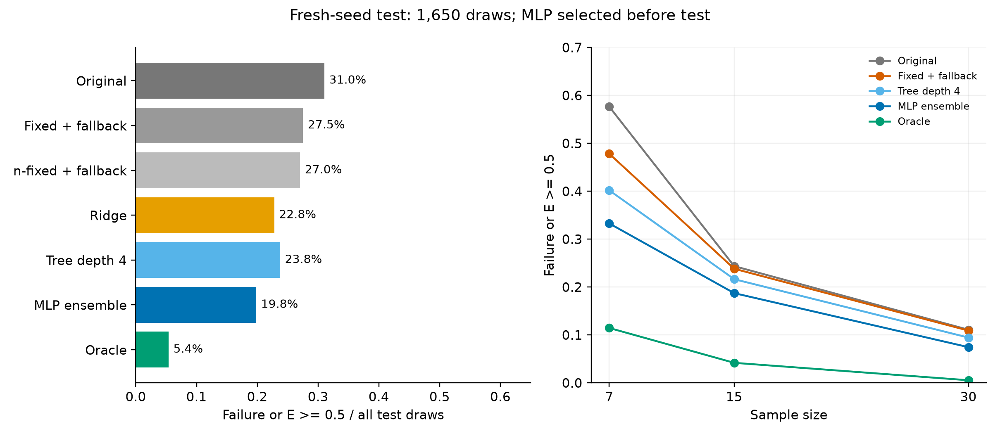

# 样本自适应 J3 学习初步试验

更新：2026-09-22。S03-J3-02已完成。**观测样本特征确实提供了可学习的选择信息：独立新抽样上，网络加失败回退降低了“失败或E≥0.5”的比例，但较严重误差的尾部仍有恶化，当前方案尚不能称为全面控制了灾难估计。**

## 1. 如何从事后空间走到可执行策略

上阶段知道每组真值后选择J3，证明的是机会。本轮模型只能读取28个样本特征：样本量、最小值/极差、归一化分位数、均值/标准差/偏度和间隔结构。不输入真参数、真实误差、样本编号或事后最优系数。

模型预测18个J3候选的执行损失，只有预测收益超过门槛才改变系数。主方案为三个32×32小型MLP的预测平均，门槛0.05；它是三网络集成，不是单个网络。

本轮新增了可执行回退：选定c后运行WMLE，若失败且c≠1，再运行原WMLE一次。线性、浅树、固定c和按n固定参照全部采用相同回退，避免给网络额外执行优势。改变的仍是J3，J1/J2和基础求解器不变。

本轮训练目标为风险事件指标加少量截断误差惩罚，风险事件是“失败或 E≥0.5”；E沿用最大归一化参数误差。此目标偏重0.5阈值，后面的尾部问题说明其局限。

## 2. 数据和方案选择没有使用测试标签

| 阶段 | 数据 | 用途 |
|---|---:|---|
| 训练 | 原统一模拟中每格80组，合计2,640组 | 拟合线性、浅树及网络 |
| 验证 | 每格其余20组，合计660组 | 从3种模型、3个门槛中选方案 |
| 重训 | 原3,300组 | 按验证选定设置重训，各模型冻结 |
| 独立新抽样测试 | 同33格，每格50组，共1,650组 | 冻结后一次评价，seed=2026092303 |

验证先选定MLP集成和门槛0.05，之后保存模型哈希，再仅凭新样本保存系数预测，最后计算29,700次测试候选拟合产生标签。没有看到测试结果后更换模型、门槛或重训。

“独立”指新随机抽样；测试真参数仍为训练出现过的11个组合，不能据此声称未见参数或域外泛化。开发数据曾用于探索，整体仍是初步试验。

## 3. 独立测试：有实际收益，但远未达到事后参照

下表分母均为1,650。线性、浅树、网络及两种固定规则均带同样的失败回退；原WMLE没有额外候选。

| 策略 | 失败或E≥0.5 | 风险率 | 失败率 | 有效结果平均E | 有效结果E的95%分位 |
|---|---:|---:|---:|---:|---:|
| 原WMLE | 512 | 31.03% | 3.21% | 0.3810 | 0.7519 |
| 开发集选定固定c=0.85＋回退 | 454 | 27.52% | 1.21% | 0.3716 | 0.7464 |
| 开发集选定按n固定c＋回退 | 446 | 27.03% | 1.09% | 0.3757 | 0.7407 |
| 线性Ridge＋回退 | 376 | 22.79% | 0.30% | 0.3696 | 0.7310 |
| 深度4决策树＋回退 | 392 | 23.76% | 0.24% | 0.4078 | 1.1009 |
| 验证选定MLP集成＋回退 | 327 | **19.82%** | **0.12%** | 0.3615 | 0.7051 |
| 测试真值逐样本事后最优 | 89 | 5.39% | 0% | 0.2075 | 0.5075 |

主方案相对原方法减少185个风险事件，即11.21个百分点；相对按n固定规则减少7.21个百分点。按真参数/n格内进行1,000次成对bootstrap，风险率改善的95%区间分别为[9.70,12.97]和[5.64,8.79]个百分点。相对Ridge改善2.97个百分点，区间[1.52,4.42]。区间条件于已训练模型和当前离散设计，不含重新抽取训练集或重新训练的波动。

相对测试集事后最优的风险改善空间，主方案恢复约43.7%。这是“原风险率与事后风险率之间的差距”恢复比例，不是估计准确率、置信度或接近真实参数的百分比。

## 4. 按n和真参数格查看：收益并不均匀

每个n均为550个新样本：

| n | 原WMLE风险率 | 按n固定＋回退 | 网络＋回退 | 事后最优 |
|---:|---:|---:|---:|---:|
| 7 | 57.64% | 47.82% | 33.27% | 11.45% |
| 15 | 24.36% | 23.82% | 18.73% | 4.18% |
| 30 | 11.09% | 9.45% | 7.45% | 0.55% |

33格中，主方案风险率低于原WMLE的有23格、相同8格、高于原方法2格：

- W(2,1000,3000)、n=15：6%升至24%；
- W(5,1000,500)、n=7：72%升至78%。

每格只有50个测试样本，以上作为局部问题定位，不直接推导整个连续参数区域都恶化。β/η/γ控制变量所需的所有格均在 [test_by_cell.csv](results/j3_learning_v1/test_by_cell.csv)，按n汇总不能替代格内检查。

## 5. 必须保留的负面结果：降低0.5阈值风险，不等于控制更严重的尾部

配对比较发现，主方案把225个原风险样本变为无风险，同时把40个原无风险样本变为风险；原来53次失败中救回51次，新增失败为0。另有240个原无风险样本的E升高，其中部分仍低于0.5。

更重要的是，在n=7、两种方法都有效的同一500组样本上：

| 指标 | 原WMLE | 网络＋回退 |
|---|---:|---:|
| 平均E | 0.5122 | 0.4750 |
| E的95%分位 | 0.8159 | **1.1177** |
| E≥1的样本数 | 7 | **27** |

这排除了仅仅因为救回失败样本、改变有效样本集合所造成的尾部假象：在相同有效样本上，较严重尾部也变差。n=15同样有效的549组中E≥1由8例增至12例；其“失败或E≥1”的全样本率也从1.64%升至2.18%。

总体上形状和位置分量RMSE分别从0.4115、0.3168变为0.4175、0.3248，略有恶化，尺度RMSE从0.3582改善至0.3457。因此本轮主张限于预先选择的风险事件及部分总体指标，不能写成三个参数、所有误差程度都改善。

完整阈值敏感性见 [threshold_sensitivity.csv](results/j3_learning_v1/threshold_sensitivity.csv)，同一有效样本尾部见 [matched_valid_tails.csv](results/j3_learning_v1/matched_valid_tails.csv)。这些是测试后诊断，没有据此修改本轮模型。

## 6. 回退起了多大作用

同一已训练网络、同一请求系数，取消回退后风险率为28.67%，失败率10.97%；带回退后为19.82%、0.12%。两者差距是执行回退产生的，不能全归因于网络系数本身更准确。

网络在180/1650组上触发回退，平均每组1.109次WMLE求解。固定c=0.85在1537组上回退，平均1.932次求解；不回退时失败率93.15%。因此c=0.85作为固定参照的价值是“先尝试，失败再用原法”的组合执行规则，不是它本身成为新的优良WMLE常数。

在相同回退合同下网络仍优于两种固定参照，说明收益不仅来自回退本身。但当前网络的训练标签已经包含回退，所以取消回退是本模型的执行消融，不能代表专门按无回退目标训练的最优网络。

求解调用数只衡量基础求解次数，不是端到端耗时加速结论；模型推理和候选失败耗时也需计入真实部署成本。

## 7. 现在应该怎样推进

当前已经跨过“只有事后空间”的阶段，得到新抽样上的可执行学习证据。**下一步应先完善尾部损失与好样本保护，再扩大网络或宣称完成改进WMLE。**

具体可在新协议中比较同时惩罚E≥0.5与E≥1、连续误差和新增大误差的训练目标，并保留固定回退和Ridge等简单参照。当前测试集已被用于上述问题诊断，后续可以作为开发材料，但最终确认必须使用另一份未参与调整的新测试集。若要讨论参数域泛化，还需要未见β/η/γ组合与多次训练重复。

这些是下一阶段建议，本轮没有基于测试结果继续改网络。

## 8. 证据与复现

- [冻结协议](results/j3_learning_v1/protocol.json)、[中文执行合同](results/j3_learning_v1/实验协议.md)、[验证选择结果](results/j3_learning_v1/validation_summary.csv)、[冻结模型记录](results/j3_learning_v1/frozen_model.json)
- [独立测试统计](results/j3_learning_v1/test_summary.csv)、[配对区间](results/j3_learning_v1/paired_bootstrap.csv)、[好坏样本转移](results/j3_learning_v1/test_paired_transitions.csv)
- [测试标签产生前的预测](results/j3_learning_v1/test_choices_before_labels.csv)、[实际执行结果](results/j3_learning_v1/test_selected_rows.csv.gz)、[原观测值](results/j3_learning_v1/test_samples_long.csv)
- [训练与测试程序](scripts/run_j3_learning.py)、[分析程序](scripts/analyze_j3_learning.py)、[仅接受样本的推理入口](scripts/predict_j3_sample.py)、[独立核验](scripts/verify_j3_learning.py)
- [模型文件](results/j3_learning_v1/models.joblib)、[特征顺序](results/j3_learning_v1/feature_schema.json)、[浅树规则](results/j3_learning_v1/tree_rules.txt)、[验证记录](results/j3_learning_v1/verification.json)

核验通过：开发/测试样本字节哈希无重叠，3种模型的4,950个测试选择重算一致；29,700个候选无缺失重复，22,195个有效候选全部通过方程回代；12个直接或回退案例经只接受样本的入口重新求解一致；模型/预测/协议哈希相符。

从仓库根目录运行 run_j3_learning.py train，再运行 test --workers 8，之后运行 analyze_j3_learning.py 与 verify_j3_learning.py。已有冻结模型与已完成测试格会保留并校验，修改方案需新建版本。模型使用scikit-learn，依赖版本与程序哈希记录在verification.json；生产WMLE未改动。
