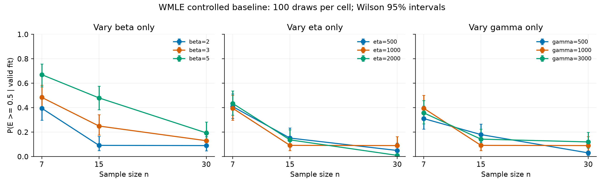
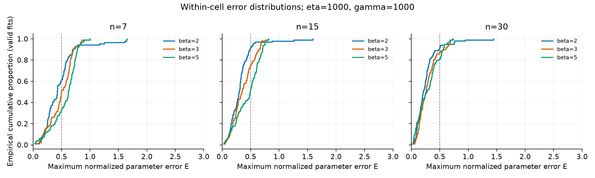

# Study03 原 WMLE 基线统计（自动生成）

历史复核及补齐组与统一模拟组分开汇总，禁止跨组混合解释。

误差 eβ=(β̂−β)/β，eη=(η̂−η)/η，eγ=(γ̂−γ)/η；E=max(|eβ|,|eη|,|eγ|)。
下表大误差率的分母为有效估计数；失败率分母为总抽样数。50% 是探索性阈值。
CSV 同时提供 100% 阈值、失败或大误差联合比例、Wilson 区间及各分量偏差/标准差/RMSE。

## 历史 8 组复核与 n=30 补齐

| beta | eta | gamma | sample_size | total | valid | failure_rate | extreme50_rate_valid | E_median_abs | E_p95_abs |
|---|---|---|---|---|---|---|---|---|---|
| 2 | 1000 | 500 | 7 | 50 | 44 | 0.12 | 0.2955 | 0.3818 | 0.7124 |
| 2 | 1000 | 500 | 15 | 50 | 48 | 0.04 | 0.1458 | 0.3239 | 0.8483 |
| 2 | 1000 | 500 | 30 | 50 | 50 | 0 | 0.02 | 0.2254 | 0.4506 |
| 2 | 1000 | 1000 | 7 | 50 | 47 | 0.06 | 0.4043 | 0.4635 | 0.8044 |
| 2 | 1000 | 1000 | 15 | 50 | 50 | 0 | 0.18 | 0.2965 | 0.6067 |
| 2 | 1000 | 1000 | 30 | 50 | 50 | 0 | 0.02 | 0.2083 | 0.3788 |
| 2 | 1000 | 3000 | 7 | 50 | 44 | 0.12 | 0.3864 | 0.4017 | 1.236 |
| 2 | 1000 | 3000 | 15 | 50 | 49 | 0.02 | 0.1224 | 0.253 | 0.6406 |
| 2 | 1000 | 3000 | 30 | 50 | 50 | 0 | 0.04 | 0.2106 | 0.4297 |
| 3 | 1000 | 500 | 7 | 50 | 48 | 0.04 | 0.5 | 0.5021 | 0.775 |
| 3 | 1000 | 500 | 15 | 50 | 48 | 0.04 | 0.2917 | 0.3793 | 0.682 |
| 3 | 1000 | 500 | 30 | 50 | 49 | 0.02 | 0.08163 | 0.2809 | 0.5546 |
| 3 | 1000 | 1000 | 7 | 50 | 48 | 0.04 | 0.5625 | 0.5267 | 0.7274 |
| 3 | 1000 | 1000 | 15 | 50 | 50 | 0 | 0.4 | 0.4479 | 0.6391 |
| 3 | 1000 | 1000 | 30 | 50 | 50 | 0 | 0.06 | 0.2487 | 0.506 |
| 3 | 1000 | 3000 | 7 | 50 | 48 | 0.04 | 0.5833 | 0.5255 | 0.7569 |
| 3 | 1000 | 3000 | 15 | 50 | 49 | 0.02 | 0.2857 | 0.3183 | 0.6839 |
| 3 | 1000 | 3000 | 30 | 50 | 49 | 0.02 | 0.1224 | 0.2761 | 0.6764 |
| 5 | 1000 | 500 | 7 | 50 | 49 | 0.02 | 0.8163 | 0.7007 | 0.8092 |
| 5 | 1000 | 500 | 15 | 50 | 50 | 0 | 0.48 | 0.4661 | 0.7171 |
| 5 | 1000 | 500 | 30 | 50 | 50 | 0 | 0.12 | 0.1771 | 0.5474 |
| 5 | 1000 | 3000 | 7 | 50 | 46 | 0.08 | 0.6957 | 0.6564 | 0.8814 |
| 5 | 1000 | 3000 | 15 | 50 | 50 | 0 | 0.34 | 0.4206 | 0.6981 |
| 5 | 1000 | 3000 | 30 | 50 | 50 | 0 | 0.16 | 0.2218 | 0.6029 |

## 统一 seed 新模拟：11 个组合

| beta | eta | gamma | sample_size | total | valid | failure_rate | extreme50_rate_valid | E_median_abs | E_p95_abs |
|---|---|---|---|---|---|---|---|---|---|
| 2 | 500 | 1000 | 7 | 100 | 88 | 0.12 | 0.4091 | 0.4813 | 1.107 |
| 2 | 500 | 1000 | 15 | 100 | 99 | 0.01 | 0.1515 | 0.3073 | 0.7016 |
| 2 | 500 | 1000 | 30 | 100 | 100 | 0 | 0.05 | 0.2253 | 0.4872 |
| 2 | 1000 | 500 | 7 | 100 | 90 | 0.1 | 0.3111 | 0.4048 | 0.7375 |
| 2 | 1000 | 500 | 15 | 100 | 100 | 0 | 0.18 | 0.3326 | 0.5879 |
| 2 | 1000 | 500 | 30 | 100 | 99 | 0.01 | 0.0303 | 0.1767 | 0.4254 |
| 2 | 1000 | 1000 | 7 | 100 | 86 | 0.14 | 0.3953 | 0.4255 | 1.069 |
| 2 | 1000 | 1000 | 15 | 100 | 98 | 0.02 | 0.09184 | 0.298 | 0.5407 |
| 2 | 1000 | 1000 | 30 | 100 | 100 | 0 | 0.09 | 0.2099 | 0.5902 |
| 2 | 1000 | 3000 | 7 | 100 | 95 | 0.05 | 0.3579 | 0.4293 | 1.076 |
| 2 | 1000 | 3000 | 15 | 100 | 98 | 0.02 | 0.1429 | 0.2838 | 0.8009 |
| 2 | 1000 | 3000 | 30 | 100 | 100 | 0 | 0.12 | 0.2326 | 0.7401 |
| 2 | 2000 | 1000 | 7 | 100 | 92 | 0.08 | 0.4348 | 0.4758 | 0.9623 |
| 2 | 2000 | 1000 | 15 | 100 | 95 | 0.05 | 0.1368 | 0.2902 | 0.5931 |
| 2 | 2000 | 1000 | 30 | 100 | 100 | 0 | 0.01 | 0.1999 | 0.4279 |
| 3 | 1000 | 500 | 7 | 100 | 88 | 0.12 | 0.5568 | 0.5213 | 0.7157 |
| 3 | 1000 | 500 | 15 | 100 | 98 | 0.02 | 0.2959 | 0.3747 | 0.686 |
| 3 | 1000 | 500 | 30 | 100 | 99 | 0.01 | 0.09091 | 0.2743 | 0.5733 |
| 3 | 1000 | 1000 | 7 | 100 | 95 | 0.05 | 0.4842 | 0.4982 | 0.8185 |
| 3 | 1000 | 1000 | 15 | 100 | 100 | 0 | 0.25 | 0.3464 | 0.6791 |
| 3 | 1000 | 1000 | 30 | 100 | 100 | 0 | 0.13 | 0.2557 | 0.6611 |
| 3 | 1000 | 3000 | 7 | 100 | 92 | 0.08 | 0.6413 | 0.5608 | 0.7471 |
| 3 | 1000 | 3000 | 15 | 100 | 100 | 0 | 0.3 | 0.3461 | 0.6933 |
| 3 | 1000 | 3000 | 30 | 100 | 100 | 0 | 0.19 | 0.2844 | 0.6947 |
| 5 | 1000 | 500 | 7 | 100 | 94 | 0.06 | 0.6915 | 0.6685 | 0.86 |
| 5 | 1000 | 500 | 15 | 100 | 99 | 0.01 | 0.4242 | 0.4703 | 0.7432 |
| 5 | 1000 | 500 | 30 | 100 | 100 | 0 | 0.21 | 0.2913 | 0.5997 |
| 5 | 1000 | 1000 | 7 | 100 | 94 | 0.06 | 0.6702 | 0.6187 | 0.8192 |
| 5 | 1000 | 1000 | 15 | 100 | 100 | 0 | 0.48 | 0.4919 | 0.7511 |
| 5 | 1000 | 1000 | 30 | 100 | 98 | 0.02 | 0.1939 | 0.2714 | 0.5867 |
| 5 | 1000 | 3000 | 7 | 100 | 93 | 0.07 | 0.6882 | 0.6326 | 0.8161 |
| 5 | 1000 | 3000 | 15 | 100 | 100 | 0 | 0.3 | 0.3421 | 0.7334 |
| 5 | 1000 | 3000 | 30 | 100 | 100 | 0 | 0.17 | 0.2443 | 0.5706 |

## 图

