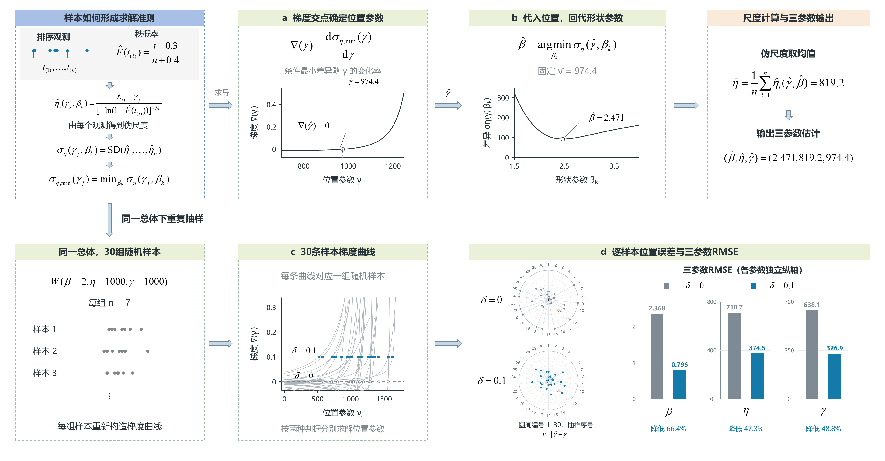
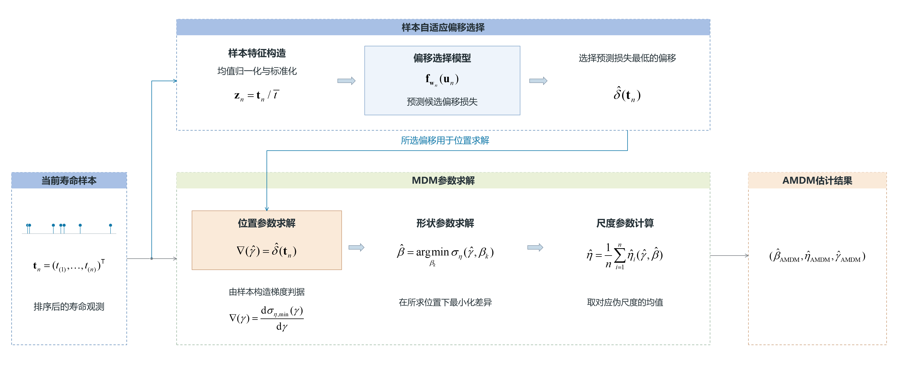
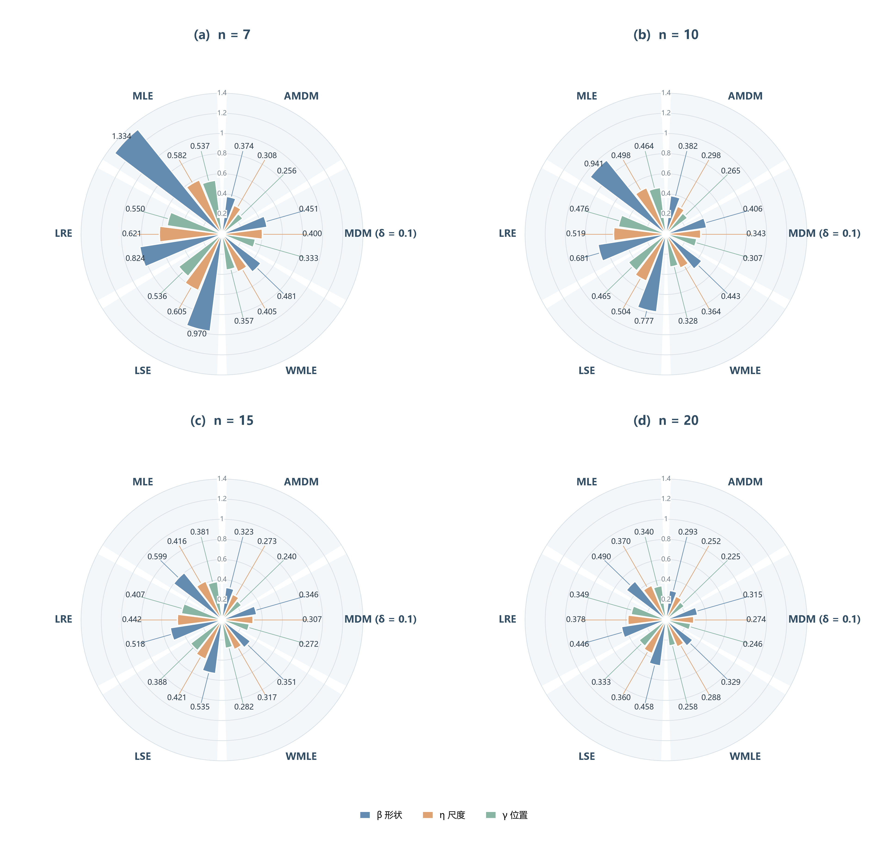

# 面向三参数 Weibull 小样本估计的样本自适应最小差异法

> 工作稿 v0.4-260924，更新于2026-09-24（保持原文件名作为唯一写作入口）。本文件统一维护定位、章节、写作安排和后续正文；原独立规划文档已并入。
>
> 已确认：定位为样本自适应最小差异法；采用方法与性能为主的叙事路线（方案B），机制解释适量。固定偏移层级与重新选取固定值的分析保留在研究记录中，不作为正文主线。
>
> 核心问题：在已有MDM估计结构上，能否进一步利用当前样本的信息改善估计过程？
>
> 工作主张：提出样本自适应最小差异法，通过样本驱动的估计规则调节，提高小样本三参数 Weibull 参数估计精度。具体措辞随正文完善。
>
> 叙事线：小样本估计问题 → MDM的求解与调节 → 样本驱动的调节思路 → 完整AMDM → 内部改进是否有效 → 方法是否有竞争力 → 小样本价值及解释。
>
> 以下各级标题作为当前写作框架，允许继续讨论调整。引用块内是写作安排，正文随后写在引用块外；其中的预期不代表已得到的结果。
>
> 第一至三章已按当前计算定义与E09共同测试统一；4.1.1—4.1.2正文、表3—4及六方法比较图3已完成，4.2.1及表5已完成，4.2.2待补充。图1解释MDM原理，图2定义AMDM估计流程；旧目录保持冻结，γ目标路线暂停。

## 摘要

> 用一段串起小样本估计问题、AMDM核心思想、主要比较结果和研究价值。
>
> 方法身份落在样本自适应最小差异估计；神经网络和偏移量按理解需要简述。
>
> 数值与效果在正文证据确定后填写，与引言和结论保持一致。

## 1 引言

> 本章把读者带到核心问题：怎样在MDM结构上利用样本信息进一步改善估计？
>
> 由应用需要和估计困难引出MDM，再提出调节思路和本文贡献。
>
> 章末留下的问题：MDM如何工作，本文准备怎样让它获得样本自适应能力？由第二章回答。
>
> 本章复用并重组[旧稿v1.12](../01-study-MDM最小偏移量优化研究/manuscript/旧稿/Study01论文初稿-v1.12.md)的研究背景与相关文献；MDM原理和固定偏移改进对照原始文献核实。引言仅概述性能发现；指标变化与[E09共同测试](数据/E09_六方法共同测试/README.md)在第四章展开，摘要随后提炼。

### 1.1 三参数 Weibull 小样本估计问题

> 说明具有位置参数的寿命分布为何值得研究，以及有限样本下估计精度和抽样波动带来的困难。
>
> 以必要文献交代常用估计方法和已有进展，把读者带到一个具体估计问题。
>
> 分布公式、参数定义与求解细节留到第二章。

三参数 Weibull 分布能够描述具有非零寿命起点的数据，是寿命建模与可靠性分析中的重要模型[1]。其分布支持边界由未知的位置参数决定，有限观测需要同时确定分布的起点与形态，增加了小样本估计的困难。已有研究指出，该模型的极大似然估计在小样本下可能表现出较大的偏差和抽样波动[2]。

针对这一问题，已有研究发展了矩估计、最小二乘估计及似然类修正方法[1,2]。其中，加权极大似然估计通过修正估计方程中的偏差，改善了小样本估计表现[3]。这些进展表明，在既有估计结构中调整求解规则能够改善有限样本性能。如何进一步利用当前观测的信息进行这种调节，是本文关注的问题；下文以最小差异法及其固定偏移改进为基础展开。

### 1.2 MDM的发展与进一步研究的问题

> 介绍最小差异思想及固定正偏移改进，让读者理解选择MDM作为研究基础的理由。
>
> 由已有固定偏移改进说明调节规则会影响估计性能，再指出MDM的求解对象由实际样本构造，顺势提出：能否利用当前样本信息，对这一调节规则作样本级选择？
>
> 本节提出研究问题，不提前证明AMDM的必要性；“固定规则失效”“所有样本需要不同最优值”不是背景前提。自适应能否改善现有固定偏移MDM，在第四章由估计结果回答。
>
> 文献只保留建立这一研究问题所需的关系，不重述完整研究史。

谢里阳等[4]提出最小差异法（minimum discrepancy method，MDM），利用排序样本及其秩概率构造尺度参数的伪估计量，通过减小这些伪估计量之间的差异确定三参数。该方法将参数估计组织为基于样本差异的搜索过程，在原研究的比较案例中表现出较好的精度与稳健性。

后续研究进一步调整了位置参数搜索判据，并在其中引入正偏移量[5]。这一改进将原有的零梯度判据调整为给定的正梯度水平，通过改变位置参数的求解落点，连同相应的形状参数和尺度参数一起调整最终估计。已有研究采用经验值 $\delta=0.1$，获得了精度和稳定性的改善，同时指出偏移量的合理取值与分布特征及样本量有关[5]。这说明，MDM 的有限样本表现既取决于最小差异估计原理，也受到具体调节规则的影响。

数据驱动的调节参数选择已有统计研究基础。Warwick[6]在最小距离估计中利用基于数据的均方误差估计选择调节参数，为依据当前观测调整估计规则提供了思路。在 MDM 中，偏移量通过位置参数搜索影响完整的三参数估计，如何将这种调节与当前样本联系起来，需要结合其求解结构研究。

固定偏移MDM通过设定统一的判据水平调节参数求解，其估计结果同时取决于样本构造的求解曲线与所采用的调节水平。观测样本决定差异曲线及其梯度，搜索判据确定位置参数的求解落点，进而影响形状与尺度参数估计。这为进一步利用样本信息提供了一个切入点：在保留最小差异求解结构的基础上，能否使调节规则随当前观测而变化，从而改善三参数的小样本估计？本文据此构建样本自适应最小差异法，并通过与现有固定偏移MDM及常用估计方法的比较，评价其估计精度与抽样稳定性。

### 1.3 本文方法与主要贡献

> 提出AMDM，概述保留MDM求解结构、引入样本驱动调节的核心思想，并预告主要性能发现。
>
> 贡献围绕完整方法及其小样本估计价值组织；偏移量和网络是具体实现，内部实验代号不进入正文。
>
> 贡献按“方法构建 → 机制分析 → 性能评价”区分。引言只保留概括性的性能发现，联合及逐参数指标、新样本评价安排留到后文；稳定性的结果措辞按重复抽样证据确定。

针对上述问题，本文提出面向三参数 Weibull 小样本估计的样本自适应最小差异法（adaptive minimum discrepancy method，AMDM）。该方法在保留最小差异准则与参数求解结构的基础上，将固定的搜索判据水平扩展为由当前样本决定的调节规则，形成具有样本级适配能力的 MDM 扩展方法。

为实现这一调节机制，本文利用观测样本信息预测候选偏移下的估计损失，选择偏移并将其用于位置参数搜索，随后按 MDM 的求解关系完成三参数估计。样本由此既决定求解曲线，也参与确定曲线上的选点规则；损失预测模型承担这一规则的学习与实现。

本文的主要工作与贡献如下：

1. **方法构建。** 将 MDM 的固定偏移搜索规则扩展为样本依赖规则，建立保留最小差异求解结构、具有样本驱动调节机制的 AMDM 估计器。
2. **机制分析。** 研究样本变化、偏移选择与参数估计误差之间的关系，结合求解过程分析自适应调节的作用，为理解估计性能的变化提供依据。
3. **性能评价。** 在不同小样本量与参数条件下，将 AMDM 与固定偏移 MDM及似然、回归类估计方法进行比较，考察其估计精度与抽样稳定性。

数值实验表明，相较于采用 $\delta=0.1$ 的固定偏移 MDM，AMDM 在所考察的小样本场景下具有更好的参数估计表现，体现了样本驱动估计规则选择的价值。

## 2 MDM基础与样本自适应最小差异法

> 本章已完成2.1—2.5正文；MDM符号沿用文献[5]，中位秩近似与既有实现一致。自适应流程已对照旧稿、训练程序及模型推断程序核对，来源见[本目录说明](README.md)。

### 2.1 三参数 Weibull 模型与估计目标

设寿命随机变量 $T$ 服从三参数 Weibull 分布，其累积分布函数为[4,5]

$$
F(t)=
\begin{cases}
0, & t\leq\gamma,\\
1-\exp\!\left[-\left(\dfrac{t-\gamma}{\eta}\right)^\beta\right], & t>\gamma.
\end{cases}
\tag{1}
$$

其中，$\beta>0$ 为形状参数，控制分布的形态；$\eta>0$ 为尺度参数，决定寿命相对于起点的尺度；$\gamma$ 为位置参数，给出分布的支持下界。沿用 MDM 文献的记法，以 $W(\beta,\eta,\gamma)$ 表示该分布。三个参数共同确定寿命分布，位置参数的变化还会改变每个观测相对于分布起点的距离 $t-\gamma$。

本文考虑来自同一总体的完整、独立同分布寿命样本，样本量为 $n$，排序后记为 $t_{(1)}\leq t_{(2)}\leq\cdots\leq t_{(n)}$。估计任务是根据这一组观测同时获得形状、尺度和位置参数的估计值 $\hat\beta$、$\hat\eta$ 和 $\hat\gamma$。面向寿命取值非负的应用场景，本文考虑 $\gamma\geq0$ 的参数约束。结合观测值位于分布支持域内的要求，位置参数的求解范围取为 $0\leq\gamma<t_{(1)}$。

小样本条件下，排序观测与对应的总体分位点之间存在抽样差异，同一总体的不同样本也会给出不同的参数估计。MDM 从排序样本及其累积概率的对应关系出发，构造可以随待估参数变化的差异量，将三个参数的估计组织为相互衔接的求解过程。

### 2.2 最小差异估计原理

MDM 的核心思想是利用不同样本点给出的尺度参数之间的一致性来确定参数[4]。对式(1)进行变换，有

$$
\eta=\frac{t-\gamma}{[-\ln(1-F(t))]^{1/\beta}}.
\tag{2}
$$

若形状参数、位置参数和样本点对应的总体累积概率均已知，则可通过这一关系计算尺度参数。实际估计中，总体累积概率未知，需要由排序样本的秩概率进行近似。沿用文献[4]的中位秩近似，本文取

$$
\hat F(t_{(i)})=\frac{i-0.3}{n+0.4},\qquad i=1,2,\ldots,n.
\tag{3}
$$

给定一对待考察的位置参数 $\gamma_j$ 与形状参数 $\beta_k$，第 $i$ 个样本点给出的尺度参数伪估计量为[4,5]

$$
\hat\eta_i(\gamma_j,\beta_k)
=\frac{t_{(i)}-\gamma_j}
{[-\ln(1-\hat F(t_{(i)}))]^{1/\beta_k}}.
\tag{4}
$$

称其为伪估计量，是因为它除依赖样本之外，还依赖尚待确定的 $\gamma_j$ 和 $\beta_k$。对于同一组排序观测，不同参数组合会给出不同的伪尺度参数及其离散程度。其离散程度用于衡量差异，最终参数组合下的均值则用于确定尺度参数。

MDM 用伪尺度参数的标准差 $\sigma_\eta$ 表征差异[4,5]。本文与实际计算保持一致，采用样本标准差：

$$
\sigma_\eta(\gamma_j,\beta_k)
=\left\{\frac{1}{n-1}\sum_{i=1}^{n}
\left[\hat\eta_i(\gamma_j,\beta_k)
-\frac{1}{n}\sum_{\ell=1}^{n}\hat\eta_\ell(\gamma_j,\beta_k)\right]^2
\right\}^{1/2}.
\tag{5}
$$

为与后续位置参数的偏移调节衔接，下面按文献[5]的求解顺序介绍这一准则。首先固定 $\gamma_j$，改变 $\beta_k$，得到一条 $\sigma_\eta(\gamma_j,\beta_k)$ 随形状参数变化的曲线；从中取最小值，得到以该位置参数为条件的最小标准差：

$$
\sigma_{\eta,\min}(\gamma_j)
=\min_k\sigma_\eta(\gamma_j,\beta_k).
\tag{6}
$$

图1b以一个样本展示固定位置参数后的形状搜索：曲线最低点给出该位置下的条件最优形状参数。改变 $\gamma_j$，各位置下的条件最小值便构成函数 $\sigma_{\eta,\min}(\gamma_j)$。按照最小差异准则，在所考察的位置与形状参数范围内选取

$$
\hat\gamma=\underset{\gamma_j}{\arg\min}\,
\sigma_{\eta,\min}(\gamma_j),\qquad
\hat\beta=\underset{\beta_k}{\arg\min}\,
\sigma_\eta(\hat\gamma,\beta_k).
\tag{7}
$$

这将两个参数的搜索连接起来：每个位置参数对应一个形状参数的条件最优值，再通过条件最小差异比较位置参数。得到 $\hat\beta$ 和 $\hat\gamma$ 后，取各样本点给出的伪尺度参数均值作为最终尺度参数估计[4,5]：

$$
\hat\eta=\frac{1}{n}\sum_{i=1}^{n}
\hat\eta_i(\hat\gamma,\hat\beta)
=\frac{1}{n}\sum_{i=1}^{n}
\frac{t_{(i)}-\hat\gamma}
{[-\ln(1-\hat F(t_{(i)}))]^{1/\hat\beta}}.
\tag{8}
$$

**图1　MDM求解流程与固定偏移的作用示例。** （a）梯度曲线与判据水平的交点横坐标给出位置估计；（b）在所求位置下，由差异曲线最低点确定形状参数，再取伪尺度均值计算尺度参数。（c）总体 $W(2,1000,1000)$ 下30组独立样本的梯度曲线，每组含7个观测，标出 $\delta=0$ 与 $\delta=0.1$ 的判据水平。（d）两种判据下的位置绝对误差与逐参数RMSE：圆周编号对应样本，半径表示位置绝对误差，两圆刻度相同；右侧三个参数各用独立纵轴。零判据下10个下界解按边界规则取得，不对应曲线交点。曲线按文献[5]原理重绘；偏移判据与边界处理见2.3。

上述过程将位置参数搜索、形状参数回代与尺度参数计算连接为完整的估计流程。对于随机样本，最小差异位置不一定对应真实参数，位置参数的选取还会连同形状参数与尺度参数一起影响最终估计[5]。在这一求解结构上调整位置参数判据，便构成下一节介绍固定偏移及样本自适应调节的基础。

### 2.3 偏移调节及样本自适应的出发点

位置参数的选择可以通过条件最小标准差曲线的梯度表示。沿用文献[5]的记号，将 $\sigma_{\eta,\min}(\gamma)$ 对位置参数的变化率记为 $\nabla(\gamma)$。在可导位置，其定义及数值计算形式为

$$
\nabla(\gamma)
=\frac{\mathrm d\sigma_{\eta,\min}(\gamma)}{\mathrm d\gamma}
\approx
\frac{\sigma_{\eta,\min}(\gamma+h)-\sigma_{\eta,\min}(\gamma-h)}{2h},
\qquad h>0.
\tag{9}
$$

其中 $h$ 为差分步长，在位置参数搜索边界附近采用单边差分。对于搜索区间内的光滑极小点，零梯度是式(7)所对应的极值条件。后续 MDM 研究将这一条件中的零替换为正偏移量 $\delta$，以调整位置参数的求解落点[5]：

$$
\nabla\!\left(\hat\gamma_{\delta}\right)=\delta.
\tag{10}
$$

式(10)具有直接的几何含义：在 $\nabla(\gamma)$—$\gamma$ 图上，先画出高度为 $\delta$ 的水平线，再求它与当前样本梯度曲线的交点，交点的横坐标就是位置参数估计值 $\hat\gamma_{\delta}$。将图1a中的零水平提升至正偏移，便改变了沿该样本曲线选取的位置。文献[5]采用的 $\delta=0.1$ 是根据重复估计表现确定的经验值。

得到 $\hat\gamma_{\delta}$ 后，在该位置重新确定使 $\sigma_\eta(\hat\gamma_{\delta},\beta_k)$ 最小的形状参数 $\hat\beta_{\delta}$，再由式(8)计算 $\hat\eta_{\delta}$。因此，偏移调节通过位置求解作用于完整的三参数估计；选择偏移时，应同时考察三个参数的估计误差。

数值求解遵循 $0\leq\gamma<t_{(1)}$ 的约束，形状参数搜索范围取 $0.1\leq\beta\leq15$。在本文采用的 MDM 实现中，若 $\nabla(0)\geq\delta$，位置估计截断为零；否则在允许区间内搜索式(10)的交点。图1a的示例取得区间内交点。

固定正偏移通过改变位置求解落点，能够调整重复抽样中的估计波动；已有研究报告了经验偏移对精度与稳定性的改善[5]。图1(c)—(d)直观展示了这种调节作用。固定规则对所有样本采用同一判据水平，其取值由总体比较确定；当前样本能否提供进一步改善估计的信息，是本文继续研究的问题。

这一求解过程由当前样本构造：样本的次序统计量与间距变化，会改变伪尺度、条件最小标准差及其梯度曲线。既然偏移量能够调节这条样本特定曲线上的选点，就可以进一步考察：能否利用当前观测所包含的信息，为完整参数估计选择更合适的调节水平？AMDM据此将固定偏移扩展为样本驱动的选择规则。

### 2.4 样本自适应调节机制

AMDM将固定的偏移水平 $\delta$ 扩展为当前样本的函数 $\hat\delta(\boldsymbol t_n)$，使位置参数搜索采用样本依赖的判据水平。为构造这一规则，本文学习样本信息与候选偏移下三参数估计损失之间的关系，并按预测损失选择调节水平。设候选偏移集合为

$$
\mathcal D=\{\delta_1,\ldots,\delta_M\}
=\{0,0.02,\ldots,0.50\},\qquad M=26.
\tag{11}
$$

对任一观测样本，每个候选 $\delta_m$ 都通过同一MDM求解过程对应一组参数估计。学习环节的任务是预测这些候选各自的三参数联合损失，再据其相对大小确定偏移。

首先对样本进行排序和均值归一化。记排序样本向量为 $\boldsymbol t_n=(t_{(1)},\ldots,t_{(n)})^{\mathsf T}$，定义

$$
\bar t=\frac{1}{n}\sum_{i=1}^{n}t_{(i)},\qquad
\boldsymbol z_n=\frac{\boldsymbol t_n}{\bar t}.
\tag{12}
$$

本研究考虑正寿命观测，因而 $\bar t>0$。排序使相同次序位置的观测彼此对应，均值归一化保留样本内部的相对大小与间距，并使输入不随寿命单位的同比例转换而改变。输入维数由样本量决定，相应的损失预测映射按样本量建立。

监督信息由真参数已知的模拟样本构造。对第 $r$ 组训练样本，分别在各候选 $\delta_m$ 下求得 $\hat\beta_m^{(r)}$、$\hat\eta_m^{(r)}$ 和 $\hat\gamma_m^{(r)}$，并计算

$$
\ell_m^{(r)}
=
\left(\frac{\hat\beta_m^{(r)}-\beta^{(r)}}{\beta^{(r)}}\right)^2
+
\left(\frac{\hat\eta_m^{(r)}-\eta^{(r)}}{\eta^{(r)}}\right)^2
+
\left(\frac{\hat\gamma_m^{(r)}-\gamma^{(r)}}{\eta^{(r)}}\right)^2.
\tag{13}
$$

该损失对三个标准化平方误差等权相加：形状与尺度误差分别以其真值标准化，位置误差以尺度参数标准化，从而在位置参数接近零时仍有明确的尺度基准。每组训练样本对应一个长度为 $M$ 的损失向量 $\boldsymbol\ell^{(r)}=(\ell_1^{(r)},\ldots,\ell_M^{(r)})^{\mathsf T}$。这一向量保留各候选的误差大小及差别，供模型学习样本与候选估计表现之间的关系。

以 $\boldsymbol g_n$ 表示由归一化样本到候选损失预测的完整映射，其输出为

$$
\widehat{\boldsymbol\ell}(\boldsymbol t_n)
=\boldsymbol g_n(\boldsymbol z_n)
=\left(\widehat\ell_1(\boldsymbol t_n),\ldots,
\widehat\ell_M(\boldsymbol t_n)\right)^{\mathsf T}.
\tag{14}
$$

各分量分别评价一个候选偏移的三参数联合误差，使偏移选择服务于完整参数估计。映射通过模拟样本的损失向量监督学习，具体标准化、回归训练及输出处理见3.4节。样本驱动的选择规则为

$$
m^\star=\underset{m\in\{1,\ldots,M\}}{\arg\min}\,
\widehat\ell_m(\boldsymbol t_n),\qquad
\hat\delta(\boldsymbol t_n)=\delta_{m^\star}.
\tag{15}
$$

式(15)选择的是预测表现较好的调节水平；当前样本的真实三参数在使用时未知，选择是否带来实际收益由后续实验评价。真参数仅用于离线构造监督信息，应用输入为当前观测样本及其样本量。

### 2.5 自适应最小差异估计器的构建

将式(15)的样本依赖规则代入MDM的位置参数搜索判据，连同后续形状与尺度参数求解，定义AMDM估计器：

$$
\left(\hat\beta_{\mathrm{AMDM}},
\hat\eta_{\mathrm{AMDM}},
\hat\gamma_{\mathrm{AMDM}}\right)
=
\operatorname{MDM}
\!\left(\boldsymbol t_n;\hat\delta(\boldsymbol t_n)\right).
\tag{16}
$$

其中，$\hat\delta(\boldsymbol t_n)$ 由式(12)—(15)确定；MDM使用原始寿命样本求解式(10)，并通过条件最小差异及伪尺度均值给出形状与尺度估计。归一化样本服务于调节规则的学习，原始样本保留参数估计所需的寿命尺度。

图2给出AMDM估计器的完整信息流：同一观测样本分别进入自适应偏移选择和MDM求解两个模块。选择模块根据样本特征与预测候选损失确定偏移，并将其送入MDM的位置求解判据；MDM利用原始寿命样本完成位置、形状和尺度参数估计。使用按3.4节设置训练得到的模型，估计按以下步骤执行：

1. 将当前寿命观测升序排列，计算样本均值与归一化向量，根据 $n$ 读取对应模型。
2. 将归一化样本输入已训练的映射，得到各候选偏移的损失预测。
3. 根据式(15)选择 $\hat\delta$，将其作为梯度判据的目标水平。
4. 对原始样本运行MDM，确定 $\hat\gamma_{\mathrm{AMDM}}$，继而计算 $\hat\beta_{\mathrm{AMDM}}$ 和 $\hat\eta_{\mathrm{AMDM}}$。

**图2　AMDM估计器的样本驱动估计流程。** 当前样本经排序、均值归一化及标准化后，输入偏移选择模型，依据预测候选损失选择偏移。该偏移用于MDM的位置参数求解，形状与尺度参数仍按MDM原有结构计算，最终得到AMDM三参数估计。左侧分支表示同一样本分别提供给上方偏移选择模块与下方MDM模块；蓝色连线将所选偏移接入位置求解判据。MDM模块中的公式依次给出位置判据、形状参数的条件最小差异求解和尺度参数的伪尺度均值计算。选择规则及边界处理见2.2—2.4节，输入输出变换见3.4节。

候选估计的批量计算用于离线构造训练目标；实际使用时，完成一次损失向量预测与偏移选择后，只需按所选偏移执行一次MDM求解。

AMDM的核心扩展是将固定偏移搜索规则转化为样本依赖规则：同一组观测既构造MDM的求解曲线，也确定作用于该曲线的判据水平，二者共同给出三参数估计。最小差异准则及参数间的求解关系保持不变，估计器由此获得根据当前样本调整求解落点的能力。本文以候选损失回归实现这一调节机制，后续实验评价完整AMDM估计器的精度与抽样稳定性。

## 3 数值实验设计

> 本章将方法主张变成可判断的比较问题，再说明每项实验设置如何服务这些问题。
>
> 按照研究目的、样本生成、比较对象、网络训练、评价方式展开，为第四章的结果顺序作准备。
>
> 先依据研究问题确定实验设计，讨论确认后再匹配已有成果。旧数据仅在满足新设计及评价用途时复用，不反过来限定实验范围。

### 3.1 实验目的与比较思路

> 首先检验样本自适应相对固定偏移MDM有没有增益，其次比较完整AMDM与常用方法，最后考察不同小样本量与参数条件下的表现。
>
> 解释限于样本变化、偏移选择与三参数估计误差之间的关系；不开展神经网络内部解释、attention分析或特征重要性研究。
>
> 这三个主要判断分别对应第四章4.1.1、4.1.2及4.2，数据、比较方法和指标随后围绕它们说明。

数值实验围绕AMDM在三参数 Weibull 小样本估计中的精度与抽样稳定性展开。采用真参数已知的Monte Carlo模拟，在相同参数条件下生成多组随机样本，并使各比较方法使用相同的观测数据。评价依次考察样本自适应调节的增益、完整方法的比较表现，以及这些表现随样本量和参数条件的变化。

首先，在MDM框架内检验AMDM相对现有固定偏移方法的估计表现。以采用经验偏移 $\delta=0.1$ 的MDM为参照，在保持差异准则、参数求解方式及数值设置一致的条件下，与采用 $\hat\delta(\boldsymbol t_n)$ 的AMDM进行配对比较。联合误差反映总体精度，三个参数的误差、偏差与重复抽样中的离散程度用于说明改善的具体构成。结合求解关系与实际偏移选择，适量解释调节行为和估计误差之间的联系。

其次，将AMDM与加权极大似然法、最小二乘法、线性回归法和极大似然法进行比较，评价其作为完整三参数估计方法的表现。联合误差用于概括总体精度，形状、尺度和位置参数的误差分别反映各参数的估计表现；进一步结合偏差与重复抽样中的离散程度，考察估计值接近真值的程度及其稳定性。

最后，按样本量和分布参数条件展开比较，考察AMDM的性能随观测数量和总体特征的变化。不同样本量之间的比较用于识别小样本条件下的相对表现，同一参数条件下的重复抽样用于评价估计波动。由此，将总体比较与具体场景相联系，明确样本自适应调节的收益体现在哪些条件及哪些参数上。模拟数据、比较方法、训练设置和评价指标分别在3.2—3.5节说明，相应结果在4.1的总体比较与4.2的条件分析中报告。

### 3.2 模拟数据与参数设置

> 本稿主体结果取自E09共同测试中的固定偏移0.1 MDM、AMDM、WMLE、LSE、LRE和MLE。E09保留的零偏移与按样本量固定偏移结果作为研究记录；旧层级分析不搬入正文。

模拟对象为式(1)定义的三参数 Weibull 分布，采用完整、独立同分布寿命观测。对给定参数组合和样本量，由相互独立的 $U_i\sim\mathrm{Unif}(0,1)$ 生成

$$
t_i=\gamma+\eta[-\ln(1-U_i)]^{1/\beta},\qquad i=1,\ldots,n.
\tag{17}
$$

每组观测升序排列后输入估计方法。主体测试采用表1中的形状、位置尺度比与样本量全交叉设计，共48个条件，每个条件100组随机样本，合计4,800组。本文比较的六种方法使用相同观测，MDM内部比较与常用方法比较共用这套数据；整体汇总对各条件赋予相同权重。

**表1　主体测试设计。**

| 设计项 | 取值 | 作用 |
|---|---|---|
| 样本量 | $n=7,10,15,20$ | 考察不同小样本量的估计表现 |
| 形状参数 | $\beta=1.5,2,3,5$ | 覆盖所研究参数域中的不同形状条件 |
| 位置尺度比 | $\gamma/\eta=0.1,0.5,1$ | 比较相对靠近零位置及较大位置的条件 |
| 尺度参数 | $\eta=1000$ | 固定寿命单位下的主体比较 |
| 参数条件 | 48个全交叉单元 | 各单元等权汇总，另作分条件分析 |
| 重复抽样 | 每单元100组，共4,800组 | 配对比较并估计Monte Carlo不确定性 |

测试观测独立于开发数据生成，沿用冻结模型确认时保存的样本。此次统一比较保留其中的AMDM和固定偏移MDM估计，在同一批观测上补齐其余方法。该安排评价既有冻结模型在统一条件下的表现；模型及其输入、输出变换未随本次比较重新拟合。

> 配置、逐样本结果和派生表统一见[E09](数据/E09_六方法共同测试/README.md)。模型训练来源的160条件与本表48个测试条件分别说明；不再把旧160条件、不同折外模型或30组原理示例的汇总当作本表结果。

### 3.3 比较方法与实现设置

> 正文六项方法使用E09共同测试中的对应结果；WMLE的非负位置约束、数值修复及失败处理已核对，详见[核查记录](数据/E09_六方法共同测试/WMLE核查.md)。

比较分为MDM框架内的调节规则比较与不同估计方法之间的性能比较。前者采用相同的最小差异准则和参数求解器，仅改变偏移选择方式；后者引入似然和回归类估计方法，考察AMDM作为完整三参数估计方法的表现。六项比较对象及其作用见表2。

**表2　比较方法与评价目的。**

| 方法 | 调节方式或估计依据 | 比较目的 |
|---|---|---|
| 经验固定偏移MDM | 对所有样本采用 $\delta=0.1$ | 评价相对于已有固定偏移规则的改进 |
| AMDM | 根据当前样本的预测候选损失选择 $\hat\delta(\boldsymbol t_n)$ | 评价样本驱动调节形成的估计方法 |
| 加权极大似然法（WMLE） | 采用加权似然类估计规则 | 提供不同估计原理下的小样本方法参照 |
| 最小二乘法（LSE） | 采用最小二乘拟合规则 | 提供基于拟合误差的估计方法参照 |
| 线性回归法（LRE） | Weibull图相关系数选取位置，再由线性回归恢复形状与尺度 | 提供基于概率图的回归估计参照 |
| 极大似然法（MLE） | 多起点搜索有限的可接受似然解 | 提供常规似然估计参照 |

固定偏移MDM与AMDM共用参数约束、差异准则、位置求解程序及边界处理，仅改变偏移选择方式。WMLE依据Cousineau的加权方程[3]实现，并施加与本研究寿命起点设定一致的非负位置约束；其比较名称在本文中指这一受约束实现。采用确定性多起点求解，当候选未满足方程残差要求时，增加位置廓线求根与有界最小二乘检查。仅接受满足参数约束且两方程平方残差不超过$10^{-8}$的解，形状搜索上界为10。LSE采用对数Weibull顺序统计量矩构造回归，并对位置参数作网格搜索及局部精化[7,8]。

LRE采用Weibull图线性化[9]与相关系数最大化的位置搜索思路[10]：以中位秩构造概率坐标，在非负位置区间搜索相关系数平方的最大值，再通过普通最小二乘回归恢复形状与尺度参数。本实现使用线性与几何网格配合局部精化，不采用Park方法的位置估计后两参数MLE步骤。

MLE复用多起点Nelder–Mead数值实现，位置初值取最小观测的0、0.25、0.5、0.75和0.9倍，分别初始化形状与尺度。每个起点最多迭代3,000次，在收敛且满足$\hat\beta\geq1$及非负位置约束的有限候选中选择似然最大者；没有可接受候选时记录失败。该比较对应这一有限解数值实现。四种传统方法均将观测除以固定常数1000求解，随后将尺度与位置估计换回原单位，单位换算不使用真参数。失败处理与有效样本比较见3.5。

> 实现来源、设置及失败核查见E09记录。本文评价表2中的实际估计方法，不增加信息层级或逐样本事后最优参照。

### 3.4 AMDM训练与测试设置

AMDM按样本量分别使用一个冻结模型。开发样本的形状参数为$\beta=1.5,2,2.5,3,3.5,4,4.5,5$，位置尺度比为$\gamma/\eta=0.1,0.25,0.5,0.75,1$，尺度参数为$\eta=1000$；与四个样本量交叉形成160个条件，每条件300组样本。每个样本量对应12,000组开发样本，共48,000组。开发数据采用离散条件生成，测试条件取其参数域内的子集，使用独立的随机样本。

按2.4节构造排序后均值归一化的输入与26维候选损失目标，候选集合为$\mathcal D=\{0,0.02,\ldots,0.50\}$。若某候选未得到有效损失，则采用相应训练划分中有效损失的第99百分位数填充。对输入向量与目标损失向量的各分量分别进行标准化，记变换后的输入为$\boldsymbol u_n$，目标为$\widetilde{\boldsymbol\ell}$。标准化参数在该样本量的开发数据上拟合，并与网络权重共同保存；这些变换在内部早停划分前拟合，测试数据不参与其中。

以$\boldsymbol f_{\boldsymbol w_n}(\boldsymbol u_n)$表示标准化尺度上的网络输出，其中$\boldsymbol w_n$为对应样本量模型的权重与偏置。训练采用多输出平方误差，其数据拟合项为

$$
\mathcal E(\boldsymbol w_n)
=\frac{1}{N_nM}\sum_{r=1}^{N_n}\sum_{m=1}^{M}
\left[
 f_{\boldsymbol w_n,m}(\boldsymbol u_n^{(r)})
 -\widetilde\ell_m^{(r)}
\right]^2,
\tag{18}
$$

其中$N_n$为用于拟合的训练样本数。由于输入为固定长度的排序统计量，任务是预测有限候选的损失向量，本文采用结构简单的多层感知机（multilayer perceptron，MLP）实现这一非线性映射。网络具有三个隐藏层，宽度分别为256、128和64，隐藏层采用ReLU激活，输出层为线性层。采用Adam优化，初始学习率为$10^{-3}$，$L_2$正则化系数为$10^{-4}$，批量大小为256，最大迭代次数为300。每个样本量的开发数据中留出15%用于内部早停，连续20次迭代未改善时停止。

最终模型使用预先固定的随机种子1，四个样本量的实际迭代次数分别为81、56、40和37。本次共同测试直接调用这四个冻结模型，不重新选择种子或拟合参数。推断时将预测损失逆标准化并截断负值，在候选集合中选取预测损失最小的偏移；并列时选择较小偏移。输入标准化、网络预测、输出逆标准化与负值截断共同构成式(14)中的完整映射$\boldsymbol g_n$。原始寿命样本随后进入采用该偏移的MDM求解流程。

> 当前训练来源及模型权重已放入[E09/models](数据/E09_六方法共同测试/models/)。本节替代此前连续参数训练、多种子重新训练的设想；旧折外评价保留开发用途，不与当前冻结模型的测试结果混合。

### 3.5 评价指标与统计汇总

为比较三个参数的估计误差，定义标准化误差向量

$$
\boldsymbol e_r=\left(\frac{\hat\beta_r-\beta}{\beta},\frac{\hat\eta_r-\eta}{\eta},\frac{\hat\gamma_r-\gamma}{\eta}\right).
\tag{19}
$$

对每个参数分别计算偏差、均方根误差（RMSE）和重复抽样标准差。位置误差以尺度参数标准化，使其度量不依赖位置参数的相对大小。联合误差$J_1=\sqrt{\operatorname{mean}_r\|\boldsymbol e_r\|^2}$用于概括三参数总体精度，逐参数结果用于解释其构成。抽样稳定性在相同真参数及样本量的单元内计算标准差；跨条件展示时汇总单元内方差，避免将不同条件的平均误差差异当作抽样波动。

估计失败单独计数。各方法的逐参数指标只在其有效估计上计算，并附有效样本数；方法间的配对有效样本比较使用双方均成功的同一组观测。多方法同图比较进一步取所示方法均成功的共同样本集合，并报告该集合的大小；不同有效集合的指标不直接混合排名。为观察失败记录对总体汇总的影响，另将失败指定为联合平方损失3，并以1和10作敏感性检查。这一惩罚汇总与实际有效样本RMSE分开标注，不作为方法比较的唯一依据。

本次测试沿用每单元100次独立抽样的固定规模，不根据比较结果追加或提前停止。对AMDM与固定偏移 $\delta=0.1$ 的联合误差差异，在每个单元内部进行2,000次配对重抽样，给出95%区间。区间反映固定设计与冻结模型条件下的Monte Carlo抽样不确定性；分样本量和参数条件的结果同时报告，以说明总体差异来自哪些场景。

> 结果、分单元标准差和配对区间均由E09逐样本文件生成。此次没有执行原规划中的500次预实验，不将其写成重复次数的既定依据。

## 4 实验结果与AMDM性能优势分析

> 本章围绕AMDM创造了什么价值组织证据：4.1验证总体收益，4.2分析收益的条件特征。
>
> 每节围绕一个判断组织互补证据，逐参数结果、偏差和离散程度用于解释主要比较，不另堆一套平行结果。
>
> 效果与数值按匹配后的证据填写，不预设所有方法、参数或条件的排名。

### 4.1 AMDM的总体性能优势

#### 4.1.1 与固定偏移MDM的比较

> 本节正文与表3已依据E09共同测试写入。数据来源：[逐参数汇总](数据/E09_六方法共同测试/pooled_parameter_metrics.csv)、[同条件抽样标准差](数据/E09_六方法共同测试/within_cell_stability.csv)及[配对区间](数据/E09_六方法共同测试/paired_interval.json)。本节表3保留全部样本的配对结果；图3位于4.1.2，使用所示六方法共同有效样本，不使用图1的30组原理样本作性能统计。

在48个测试条件、4,800组共同样本上，AMDM相较于固定偏移 $\delta=0.1$ 的MDM降低了三参数总体估计误差。两种方法均获得全部样本的有效估计，联合误差 $J_1$ 从0.6151降至0.5631，相对降低8.45%；按测试条件内配对重抽样得到的95%区间为7.47%—9.44%。在相同观测与MDM求解设置下，采用样本驱动偏移的完整AMDM估计器取得了更低的总体误差。

总体改善同时体现在三个参数上（表3）。形状、尺度和位置参数的标准化RMSE分别由0.3972、0.3571和0.3050降至0.3699、0.3235和0.2749，相对降低6.87%、9.42%和9.85%。尽管偏移直接作用于位置参数求解，改善也出现在后续形状与尺度估计中，尺度与位置参数的相对降幅较大。

**表3　固定偏移MDM与AMDM的逐参数估计表现。**

| 参数 | 固定MDM偏差 | AMDM偏差 | 固定MDM RMSE | AMDM RMSE | 固定MDM抽样标准差 | AMDM抽样标准差 |
|---|---:|---:|---:|---:|---:|---:|
| 形状 $\beta$ | −0.1759 | −0.1465 | 0.3972 | 0.3699 | 0.3058 | 0.2989 |
| 尺度 $\eta$ | −0.1597 | −0.1424 | 0.3571 | 0.3235 | 0.2838 | 0.2612 |
| 位置 $\gamma$ | 0.1500 | 0.1330 | 0.3050 | 0.2749 | 0.2247 | 0.2071 |

表中固定MDM采用 $\delta=0.1$。各指标基于式(19)的标准化误差计算，形状、尺度误差分别以相应真值标准化，位置误差以尺度参数标准化。偏差和RMSE汇总全部4,800组样本；抽样标准差先在各测试条件内计算样本方差，再对48个条件等权平均并开方。

精度改善伴随着汇总偏差绝对值与抽样波动的共同降低。固定偏移MDM的形状和尺度估计呈负向汇总偏差，位置估计呈正向汇总偏差；AMDM的三个汇总偏差均更接近零。按同一总体条件下的重复抽样衡量，形状、尺度和位置估计的标准差分别降低2.28%、7.95%和7.83%，表明尺度与位置估计的抽样稳定性改善更为明显。由此，在所考察的小样本设计内，AMDM相对现有固定偏移MDM同时改善了总体估计精度与抽样稳定性。这些结果支持样本依赖调节能够在保留MDM求解结构的基础上，进一步利用当前观测信息改善参数估计。下一节进一步比较其与不同估计原理下常用方法的表现。

#### 4.1.2 与常用估计方法的比较

> 本节依据E09的[配对有效样本汇总](数据/E09_六方法共同测试/paired_valid_and_failure_sensitivity.csv)及[图3数据](图片/数据/F03_方法三参数玫瑰图.csv)写入。LRE、MLE直接复用Weibull系统求解器，在原4,800组观测上补算；原六方法结果与冻结模型保持不变。具体实现与核验见[E09](数据/E09_六方法共同测试/README.md)。

进一步将AMDM与WMLE、LSE、LRE和MLE进行比较，以考察其在不同估计原理下的相对表现。表4对每种参照方法分别取其与AMDM均获得有效估计的样本，计算同一组观测上的联合误差。AMDM相对WMLE、LSE和LRE的联合误差分别降低13.57%、35.03%和33.24%；在MLE返回可接受有限解的3,432组样本上，相对降幅为51.25%。这些结果表明，在当前小样本设计与所采用的实现下，AMDM的精度改善不仅体现于MDM内部比较，也体现在与似然及回归类估计方法的比较中。

**表4　AMDM与常用估计方法的配对精度及求解成功情况。**

| 参照方法 | 配对有效样本数 | 参照方法 $J_1$ | 同组AMDM $J_1$ | AMDM相对降幅 | 参照方法失败率 |
|---|---:|---:|---:|---:|---:|
| WMLE | 4,566 | 0.6582 | 0.5689 | 13.57% | 4.875% |
| LSE | 4,800 | 0.8667 | 0.5631 | 35.03% | 0 |
| LRE | 4,800 | 0.8435 | 0.5631 | 33.24% | 0 |
| MLE | 3,432 | 1.0219 | 0.4982 | 51.25% | 28.500% |

各行使用该参照方法与AMDM共同有效的观测，因而不同行的样本集合可能不同；降幅为$1-J_{1,\mathrm{AMDM}}/J_{1,\mathrm{参照}}$。失败率以全部4,800组观测为分母，AMDM无失败。

图3按样本量分别展示AMDM、固定偏移MDM、WMLE、LSE、LRE和MLE的三参数标准化RMSE。在$n=7,10,15,20$各自的六方法共同有效样本集合上，AMDM的三个参数RMSE均低于其余所示方法。四张子图采用一致的线性刻度，使不同方法、参数及样本量的误差大小能够直接比较。

**图3　不同样本量下六种估计方法的三参数标准化RMSE比较。** (a)—(d)分别对应$n=7,10,15,20$。蓝、橙、绿扇形分别表示形状、尺度和位置参数的标准化RMSE；四图采用统一刻度，半径越小表示估计误差越低。

精度结果还需结合求解成功情况理解。AMDM、固定偏移MDM、LSE与LRE均返回全部样本的有效估计；WMLE有234组未通过有效解判据，MLE有1,368组未返回本研究实现所接受的有限解。图3采用所示六方法共同成功的样本，各样本量对应577、733、886和1,009组观测；表4按AMDM与各方法分别配对，保留更完整的精度与失败信息。总体而言，AMDM在本设计内兼具较低的估计误差与完整的有效估计覆盖；不同样本量及分布条件下的表现将在4.2节进一步展开。

### 4.2 AMDM性能优势的条件特征

> 以AMDM相对固定偏移MDM的收益为主线，回答收益随样本量及分布条件怎样变化、在哪些条件下更明显。条件差异提供规律证据，结合求解原理的机制解释留在第五章。

总体比较表明AMDM在当前测试设计中改善了估计表现，下面进一步考察这些收益如何分布于不同样本量与参数条件。以固定偏移MDM为共同参照，分析相对误差降幅，使条件分析直接对应样本自适应调节的额外价值。

#### 4.2.1 样本量与相对收益

> 本节由E09逐样本记录重新核算，与[按样本量汇总](数据/E09_六方法共同测试/by_n.csv)一致。AMDM与固定偏移MDM在每个n下均有1,200组有效估计；与图3的六方法共同有效集合不同。

为考察样本自适应调节的小样本价值，表5分别报告各样本量下AMDM相对固定偏移MDM的联合误差降幅。两种方法均使用对应样本量下全部1,200组观测，且各样本量覆盖相同的形状参数与位置尺度比组合，从而在一致的参数设计下比较其相对表现。

**表5　不同样本量下AMDM相对固定偏移MDM的联合误差改善。**

| 样本量 $n$ | 固定MDM $J_1$ | AMDM $J_1$ | 相对降幅 |
|---|---:|---:|---:|
| 7 | 0.7581 | 0.6818 | 10.06% |
| 10 | 0.6442 | 0.5937 | 7.84% |
| 15 | 0.5365 | 0.4954 | 7.67% |
| 20 | 0.4855 | 0.4534 | 6.63% |

固定MDM采用$\delta=0.1$，相对降幅为$1-J_{1,\mathrm{AMDM}}/J_{1,\mathrm{MDM}}$。每个样本量包含12个参数条件、每条件100次重复抽样，两种方法均无失败。

随着样本量由7增至20，两种方法的联合误差均逐步下降，而AMDM在四个样本量下均保持较低误差。相对改善由$n=7$时的10.06%下降至$n=20$时的6.63%，说明在所考察的参数设计中，样本依赖调节在观测更少时具有更突出的相对收益；这一判断来自相对固定MDM的改善幅度，而不仅是误差随样本量增加而下降。$n=10$与$n=15$的降幅接近，结果呈总体递减趋势，不意味着每个参数条件下均具有相同变化规律。

#### 4.2.2 分布条件与相对收益

> 以$\beta\times(\gamma/\eta)$热图呈现AMDM相对固定偏移MDM的联合误差降幅，明确跨样本量的汇总方式；必要时按n分面，识别收益集中或较弱的条件。是否属于困难区域，结合固定MDM的误差水平判断，不由增益大小直接推定。
>
> 本节不再扩展偏移选择分布或信息层级；用分条件收益组织论证，章末归纳已观察到的规律，其方法意义留到第五章。

## 5 讨论

> 本章从实验观察回到方法认识：样本自适应给MDM带来了什么，这种改进对小样本估计有什么意义。
>
> 解释以第四章已呈现证据为基础，机制深度保持适量，不在此突然引入一套未说明的新实验。

### 5.1 样本差异、自适应调节与性能改善

> 结合第二章求解关系与第四章结果，解释样本变化、候选估计与调节选择之间的联系。
>
> 说明样本自适应允许估计器利用当前观测调整策略，讨论已观察到的精度或离散程度变化。
>
> 讨论集中于偏移如何改变求解落点及三参数误差；不推断网络内部学到了哪些特征，也不另设网络可解释性实验。

### 5.2 方法价值与适用条件

> 说明保留MDM求解结构并增加样本调节能力的意义，以及它为小样本估计提供的选择。
>
> 集中交代训练与使用条件、评价目标和主要适用范围，保持结果解释准确，避免散布重复防御性说明。
>
> 工程用途按论文实际验证内容表达；参数估计改善与某个寿命点的改善分别判断。

## 6 结论

> 回答引言的问题：怎样构建AMDM、相对现有固定偏移MDM有哪些估计改善，以及与常用方法比较和分条件分析中的主要发现。
>
> 保留最值得读者记住的方法身份和结果，呼应标题与摘要；不新增未建立的机制或性能主张。

## 参考文献

> 按正文首次引用顺序整理。优先核实原始MDM、固定偏移改进及实际比较方法的来源。
>
> 需要时再纳入样本驱动估计相关文献，不直接搬入旧稿全部引用。文中数学与方法定义以原始来源核对。

[1] Yang X, Xie L, Liu Y, et al. A review of parameter estimation methods of the three-parameter Weibull distribution. In: 2023 9th International Symposium on System Security, Safety, and Reliability (ISSSR). 2023: 20–31. [doi:10.1109/ISSSR58837.2023.00013](https://doi.org/10.1109/ISSSR58837.2023.00013).

[2] Cousineau D. Fitting the three-parameter Weibull distribution: review and evaluation of existing and new methods. IEEE Transactions on Dielectrics and Electrical Insulation. 2009;16(1):281–288. [doi:10.1109/TDEI.2009.4784578](https://doi.org/10.1109/TDEI.2009.4784578).

[3] Cousineau D. Nearly unbiased estimators for the three-parameter Weibull distribution with greater efficiency than the iterative likelihood method. British Journal of Mathematical and Statistical Psychology. 2009;62(1):167–191. [doi:10.1348/000711007X270843](https://doi.org/10.1348/000711007X270843).

[4] Xie L, Wu N, Yang X. A minimum discrepancy method for Weibull distribution parameter estimation. International Journal of Structural Stability and Dynamics. 2023;23(8):2350085. [doi:10.1142/S0219455423500852](https://doi.org/10.1142/S0219455423500852).

[5] 谢里阳, 朱文慧, 吴宁祥, 杨小玉. 基于统计最小差异原理的 Weibull 分布参数估计方法. 东北大学学报（自然科学版）. 2025;46(7):108–112. [doi:10.12068/j.issn.1005-3026.2025.20240194](https://doi.org/10.12068/j.issn.1005-3026.2025.20240194).

[6] Warwick J. A data-based method for selecting tuning parameters in minimum distance estimators. Computational Statistics & Data Analysis. 2005;48(3):571–585. [doi:10.1016/j.csda.2004.03.006](https://doi.org/10.1016/j.csda.2004.03.006).

[7] Soman K P, Misra K B. A least square estimation of three parameters of a Weibull distribution. Microelectronics Reliability. 1992;32(3):303–305. [doi:10.1016/0026-2714(92)90057-R](https://doi.org/10.1016/0026-2714(92)90057-R).

[8] White J S. The moments of log-Weibull order statistics. Technometrics. 1969;11(2):373–386. [doi:10.1080/00401706.1969.10490691](https://doi.org/10.1080/00401706.1969.10490691).

[9] Li Y M. A general linear-regression analysis applied to the 3-parameter Weibull distribution. IEEE Transactions on Reliability. 1994;43(2):255–263. [doi:10.1109/24.295002](https://doi.org/10.1109/24.295002).

[10] Park C. Weibullness test and parameter estimation of the three-parameter Weibull model using the sample correlation coefficient. International Journal of Industrial Engineering: Theory, Applications and Practice. 2017;24(4):376–391. [doi:10.23055/ijietap.2017.24.4.2848](https://doi.org/10.23055/ijietap.2017.24.4.2848).
