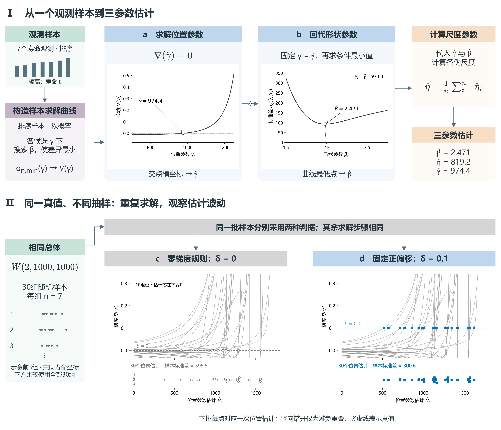

# 面向三参数 Weibull 小样本估计的样本自适应最小差异法

> 工作稿 v0.1，2026-09-22。本文件统一维护定位、章节、写作安排和后续正文；原独立规划文档已并入。
>
> 已确认：采用方案A，以AMDM的样本自适应能力为方法身份；方法与性能为主，机制解释适量。
>
> 核心问题：在已有MDM估计结构上，能否进一步利用当前样本的信息改善估计过程？
>
> 工作主张：提出样本自适应最小差异法，通过样本驱动的估计规则调节，提高小样本三参数 Weibull 参数估计精度。具体措辞随正文完善。
>
> 叙事线：小样本估计问题 → MDM的求解与调节 → 样本驱动的调节思路 → 完整AMDM → 内部改进是否有效 → 方法是否有竞争力 → 小样本价值及解释。
>
> 以下各级标题作为当前写作框架，允许继续讨论调整。引用块内是写作安排，正文随后写在引用块外；其中的预期不代表已得到的结果。
>
> 第一章及2.1—2.2已填入正文，图1已按MDM原理重新计算绘制；其余章节继续保留写作安排。后续逐节匹配冻结旧目录中的成果，优先复用；γ目标路线暂停。

## 摘要

> 用一段串起小样本估计问题、AMDM核心思想、主要比较结果和研究价值。
>
> 方法身份落在样本自适应最小差异估计；神经网络和偏移量按理解需要简述。
>
> 数值与效果在正文证据确定后填写，与引言和结论保持一致。

## 1 引言

> 本章把读者带到核心问题：怎样在MDM结构上利用样本信息进一步改善估计？
>
> 由应用需要和估计困难引出MDM，再提出调节思路和本文贡献。
>
> 章末留下的问题：MDM如何工作，本文准备怎样让它获得样本自适应能力？由第二章回答。
>
> 本章复用并重组[旧稿v1.12](../01-study-MDM最小偏移量优化研究/manuscript/旧稿/Study01论文初稿-v1.12.md)的研究背景与相关文献；MDM原理和固定偏移改进对照原始文献核实。引言仅概述性能发现；指标变化与[最终模型新样本确认](../01-study-MDM最小偏移量优化研究/artifacts/exploratory/selector_new_sample_confirmation_20260922/README.md)在第四章展开，摘要随后提炼。

### 1.1 三参数 Weibull 小样本估计问题

> 说明具有位置参数的寿命分布为何值得研究，以及有限样本下估计精度和抽样波动带来的困难。
>
> 以必要文献交代常用估计方法和已有进展，把读者带到一个具体估计问题。
>
> 分布公式、参数定义与求解细节留到第二章。

三参数 Weibull 分布能够描述具有非零寿命起点的数据，是寿命建模与可靠性分析中的重要模型[1]。与两参数模型相比，位置参数使分布能够表示失效发生的起始边界，与形状参数、尺度参数共同决定寿命分布。模型的这种灵活性也对参数估计提出了更高要求：当可用寿命数据较少时，需要从有限观测中同时辨识三个参数，估计误差会进一步影响对分布形态和寿命特征的判断。因此，提高小样本条件下三参数估计的精度与稳定性，是发挥该模型应用价值的基础。

三参数 Weibull 的分布支持边界由未知的位置参数决定，估计时需要同时确定分布的起点与形态。已有研究指出，在有限样本、尤其是小样本条件下，该模型的极大似然估计可能表现出较大的偏差和抽样波动[2]。因此，小样本估计需要同时关注估计值与真值的接近程度，以及估计结果在重复抽样中的离散程度。

围绕这些问题，研究者发展了矩估计、最小二乘估计、极大似然估计及多种修正方法[1,2]。其中，加权极大似然估计通过修正估计方程中的偏差，改善了原有方法在小样本下的表现[3]。这些研究说明，在既有估计原理的基础上调整具体求解规则，是提高有限样本性能的一条有效途径。同时，不同方法的表现会随参数条件和样本量改变[2]，如何进一步利用有限样本提供的信息，仍是三参数 Weibull 估计中值得研究的问题。

### 1.2 MDM的发展与进一步研究的问题

> 介绍最小差异思想及固定正偏移改进，让读者理解选择MDM作为研究基础的理由。
>
> 由已有固定偏移改进说明调节规则会影响估计性能，再指出MDM的求解对象由实际样本构造，顺势提出：能否利用当前样本信息，对这一调节规则作样本级选择？
>
> 本节提出研究问题，不提前证明AMDM的必要性；“固定规则失效”“所有样本需要不同最优值”不是背景前提。样本间候选损失的差异及自适应是否有效，在第四章由结果回答。
>
> 文献只保留建立这一研究问题所需的关系，不重述完整研究史。

最小差异法（minimum discrepancy method，MDM）为三参数 Weibull 估计提供了另一种求解思路。谢里阳等[4]从分布函数出发，利用各排序样本值及其秩概率构造尺度参数的伪估计量，并通过减小这些伪估计量之间的差异来确定形状参数和位置参数，进而获得尺度参数估计。该方法将三参数估计转化为具有明确统计含义的搜索过程，在原研究的比较案例中表现出较好的估计精度与稳健性[4]。

后续研究进一步调整了位置参数搜索判据，并在其中引入正偏移量[5]。这一改进将原有的零梯度判据调整为给定的正梯度水平，通过改变位置参数的求解落点，连同相应的形状参数和尺度参数一起调整最终估计。已有研究采用经验值 $\delta=0.1$，获得了精度和稳定性的改善，同时指出偏移量的合理取值与分布特征及样本量有关[5]。这说明，MDM 的有限样本表现既取决于最小差异估计原理，也受到具体调节规则的影响。

根据观测数据选择估计器的调节量，已有相关统计研究作为基础。例如，Warwick[6]在最小距离估计中利用基于数据的均方误差估计选择调节参数，使估计器的设置与所分析的数据相联系。这类研究为利用样本信息调整估计规则提供了思路。对于 MDM，偏移调节嵌入位置参数的搜索过程，并影响完整的三参数估计，因此需要围绕其求解结构建立相应的样本驱动方式。

从 MDM 的求解关系来看，搜索过程依赖由观测样本构造的差异函数，不同样本实现可能对应不同的求解行为，而固定偏移方法采用统一的调节水平。由此自然产生一个进一步的问题：在保留 MDM 估计结构的基础上，能否利用当前样本的信息选择估计规则，从而提高小样本三参数估计精度？这一问题关注有限样本信息能否用于指导估计过程，即在共同的统计求解结构下实现样本级适配。样本差异能否转化为实际估计收益，需要通过方法构建与数值比较加以检验。

### 1.3 本文方法与主要贡献

> 提出AMDM，概述保留MDM求解结构、引入样本驱动调节的核心思想，并预告主要性能发现。
>
> 贡献围绕完整方法及其小样本估计价值组织；偏移量和网络是具体实现，内部实验代号不进入正文。
>
> 贡献按“方法构建 → 机制分析 → 性能评价”区分。引言只保留概括性的性能发现，联合及逐参数指标、新样本评价安排留到后文；稳定性的结果措辞按重复抽样证据确定。

针对上述问题，本文提出面向三参数 Weibull 小样本估计的样本自适应最小差异法（adaptive minimum discrepancy method，AMDM）。AMDM 估计器保留最小差异准则与参数求解结构，通过当前样本驱动的估计规则选择，实现三参数的自适应估计。

这一思路利用观测样本信息评价候选调节规则，并通过偏移选择作用于 MDM 的求解过程。样本信息由此既参与差异函数的构造，也参与估计规则的选择，使同一统计估计结构能够根据当前观测进行调整。

本文的主要工作与贡献如下：

1. **方法构建。** 将样本驱动的调节机制嵌入 MDM 估计流程，建立保留最小差异求解结构的 AMDM 估计器，形成从观测样本到三参数估计的完整方法。
2. **机制分析。** 研究样本变化、偏移选择与参数估计误差之间的关系，结合求解过程分析自适应调节的作用，为理解估计性能的变化提供依据。
3. **性能评价。** 在不同小样本量与参数条件下，将 AMDM 与固定偏移 MDM、加权极大似然法和最小二乘法进行比较，考察其估计精度与抽样稳定性。

数值实验表明，相较于固定偏移 MDM，AMDM 在所考察的小样本场景下具有更好的参数估计表现，体现了样本驱动估计规则选择的价值。

## 2 MDM基础与样本自适应最小差异法

> 本章按“估计什么 → 怎样求解 → 哪里可以调节 → 怎样根据样本调节 → 完整方法如何使用”递进。
>
> 背景介绍服务于理解AMDM，核心定义、公式和估计规则在本章闭合。
>
> 章末读者应能理解并描述AMDM，随后自然需要检验这种自适应调节是否带来实际收益。
>
> 全文沿用文献[5]的主要记号：$T$、$t_{(i)}$、$\beta$、$\eta$、$\gamma$、$\hat\eta_i$、$\sigma_\eta$及$\sigma_{\eta,\min}(\gamma_j)$。中位秩的近似计算沿用文献[4]及本文既有实现。后续自适应环节新增记号在首次出现时定义，不另设同义的差异函数或梯度符号。

### 2.1 三参数 Weibull 模型与估计目标

> 给出分布函数、支持域、形状/尺度/位置参数含义和样本记号，明确联合估计三个参数的目标。
>
> 解释位置参数与支持边界的关系，以及三个参数共同决定分布的联系，为MDM求解铺垫。
>
> 小样本困难简明说明并注明依据，不把未经核实的“强耦合”或搜索不稳定写成普遍结论。

设寿命随机变量 $T$ 服从三参数 Weibull 分布，其累积分布函数为[4,5]

$$
F(t)=
\begin{cases}
0, & t\leq\gamma,\\
1-\exp\!\left[-\left(\dfrac{t-\gamma}{\eta}\right)^\beta\right], & t>\gamma.
\end{cases}
\tag{1}
$$

其中，$\beta>0$ 为形状参数，控制分布的形态；$\eta>0$ 为尺度参数，决定寿命相对于起点的尺度；$\gamma$ 为位置参数，给出分布的支持下界。沿用 MDM 文献的记法，以 $W(\beta,\eta,\gamma)$ 表示该分布。三个参数共同确定寿命分布，位置参数的变化还会改变每个观测相对于分布起点的距离 $t-\gamma$。

本文考虑来自同一总体的完整、独立同分布寿命样本，样本量为 $n$，排序后记为 $t_{(1)}\leq t_{(2)}\leq\cdots\leq t_{(n)}$。估计任务是根据这一组观测同时获得形状、尺度和位置参数的估计值 $\hat\beta$、$\hat\eta$ 和 $\hat\gamma$。在本文所考虑的非负寿命起点设定下，位置参数的求解范围取为 $0\leq\gamma<t_{(1)}$，以满足观测值位于分布支持域内的要求。

小样本条件下，排序观测与对应的总体分位点之间存在抽样差异，同一总体的不同样本也会给出不同的参数估计。MDM 从排序样本及其累积概率的对应关系出发，构造可以随待估参数变化的差异量，将三个参数的估计组织为相互衔接的求解过程。

### 2.2 最小差异估计原理

> 从排序样本和秩概率构造各样本点的伪尺度参数，说明减小伪尺度差异的估计思想。
>
> 给出差异准则、给定位置参数时的形状参数求解、位置搜索以及最终尺度估计，连接三个参数的求解关系。
>
> 以真实MDM定义为准；“理论与样本性质匹配”只能辅助解释，不能代替具体准则。
>
> 原始MDM与后续固定偏移方法的文献和实现关系在成文时核对，不直接把当前δ=0实现命名为原始MDM。

MDM 的核心思想是利用不同样本点给出的尺度参数之间的一致性来确定参数[4]。对式(1)进行变换，有

$$
\eta=\frac{t-\gamma}{[-\ln(1-F(t))]^{1/\beta}}.
\tag{2}
$$

若形状参数、位置参数和样本点对应的总体累积概率均已知，则可通过这一关系计算尺度参数。实际估计中，总体累积概率未知，需要由排序样本的秩概率进行近似。沿用文献[4]的中位秩近似，本文取

$$
\hat F(t_{(i)})=\frac{i-0.3}{n+0.4},\qquad i=1,2,\ldots,n.
\tag{3}
$$

给定一对待考察的位置参数 $\gamma_j$ 与形状参数 $\beta_k$，第 $i$ 个样本点给出的尺度参数伪估计量为[4,5]

$$
\hat\eta_i(\gamma_j,\beta_k)
=\frac{t_{(i)}-\gamma_j}
{[-\ln(1-\hat F(t_{(i)}))]^{1/\beta_k}}.
\tag{4}
$$

称其为伪估计量，是因为它除依赖样本之外，还依赖尚待确定的 $\gamma_j$ 和 $\beta_k$。对于由指定秩概率反算得到的理想分位点样本，代入真实的形状参数和位置参数后，各个 $\hat\eta_i$ 均等于真实尺度参数；改变所代入的参数，则会改变这些伪尺度参数及其差异。图1a展示了这一关系。真实随机样本与理想分位点样本之间存在抽样差异，因此即使代入真参数，伪尺度参数之间也可能并不相等[5]。

MDM 用伪尺度参数的标准差 $\sigma_\eta$ 表征差异[4,5]。本文与实际计算保持一致，采用样本标准差：

$$
\sigma_\eta(\gamma_j,\beta_k)
=\left\{\frac{1}{n-1}\sum_{i=1}^{n}
\left[\hat\eta_i(\gamma_j,\beta_k)
-\frac{1}{n}\sum_{\ell=1}^{n}\hat\eta_\ell(\gamma_j,\beta_k)\right]^2
\right\}^{1/2}.
\tag{5}
$$

为与后续位置参数的偏移调节衔接，下面按文献[5]的求解顺序介绍这一准则。首先固定 $\gamma_j$，改变 $\beta_k$，得到一条 $\sigma_\eta(\gamma_j,\beta_k)$ 随形状参数变化的曲线；从中取最小值，得到以该位置参数为条件的最小标准差：

$$
\sigma_{\eta,\min}(\gamma_j)
=\min_k\sigma_\eta(\gamma_j,\beta_k).
\tag{6}
$$

图1b中不同颜色的曲线对应不同的 $\gamma_j$，标记点表示各曲线的条件最小值。随后改变 $\gamma_j$，将这些条件最小值组织为 $\sigma_{\eta,\min}(\gamma_j)$ 曲线，如图1c所示。按照最小差异准则，在所考察的位置与形状参数范围内选取

$$
\hat\gamma=\underset{\gamma_j}{\arg\min}\,
\sigma_{\eta,\min}(\gamma_j),\qquad
\hat\beta=\underset{\beta_k}{\arg\min}\,
\sigma_\eta(\hat\gamma,\beta_k).
\tag{7}
$$

这将两个参数的搜索连接起来：每个位置参数对应一个形状参数的条件最优值，再通过条件最小差异比较位置参数。得到 $\hat\beta$ 和 $\hat\gamma$ 后，取各样本点给出的伪尺度参数均值作为最终尺度参数估计[4,5]：

$$
\hat\eta=\frac{1}{n}\sum_{i=1}^{n}
\hat\eta_i(\hat\gamma,\hat\beta)
=\frac{1}{n}\sum_{i=1}^{n}
\frac{t_{(i)}-\hat\gamma}
{[-\ln(1-\hat F(t_{(i)}))]^{1/\hat\beta}}.
\tag{8}
$$

**图1　由伪尺度差异确定三参数的 MDM 原理。** 依据文献[4,5]的原理重新计算并绘制。示例采用 $W(2,1000,1000)$、$n=7$，由式(3)的秩概率反算理想分位点样本。（a）在不同形状参数与位置参数设置下，由同一组样本计算得到的伪尺度参数；真参数下各点均为1000。（b）固定不同的 $\gamma_j$ 后，$\sigma_\eta$ 随 $\beta_k$ 的变化，标记点为各曲线的条件最小值。（c）条件最小标准差随 $\gamma_j$ 的变化，同色同形标记与（b）一一对应；确定形状与位置参数后，由式(8)计算尺度参数。本图用于说明估计原理，所用理想样本不代表随机抽样下的估计性能。

上述过程给出了 MDM 的基本求解结构。对于随机样本，最小差异位置不一定对应真实参数，位置参数的选取还会连同形状参数与尺度参数一起影响最终估计[5]。在这一求解结构上调整位置参数判据，便构成下一节介绍固定偏移及样本自适应调节的基础。

### 2.3 偏移调节及样本自适应的出发点

> 本节是从MDM走向AMDM的连接。沿文献[5]，由条件最小标准差 $\sigma_{\eta,\min}(\gamma)$ 对位置参数的梯度构造搜索判据，以正偏移δ调节位置参数求解落点；对应的形状参数估计 $\hat\beta$ 和尺度参数估计 $\hat\eta$ 随之变化，因此δ是影响完整三参数估计结果的调节量。
>
> 随后说明 $\sigma_{\eta,\min}(\gamma)$ 及其梯度由当前随机样本构造，同一总体条件下不同样本的求解曲线会发生变化。梯度与差分步长分别定义，避免原文中梯度记号与增量记号混用；不另引入 $V_X$ 或 $\beta^*$ 表示已有求解量。由此自然提出：能否利用样本本身的信息选择更合适的δ？下一节给出实现这一思路的自适应机制。
>
> 样本差异在这里作为提出问题的依据，能否转化为精度收益交由第四章检验。正文按上述正向推理展开，避免写成逐项纠错或辩护。
>
> 以下仅作为写作核对原则保留：δ不是γ+δ中的位置平移，也不直接改变搜索区间或差异函数；固定规则可以是平均表现的折中，并不假设每个样本共享同一最优值。不要求将这些否定句逐条写进正式正文。
>
> 可配一张求解与调节示意图，突出固定水平和样本调节的位置关系；实际损失曲线或性能数据在结果部分呈现。

### 2.4 样本自适应调节机制

> 说明输入样本怎样表征、训练目标怎样构造，以及怎样由学习结果形成调节规则。
>
> 按现有方法：排序并归一化样本 → 预测候选偏移对应的联合损失 → 选择预测损失最低的候选。
>
> 明确联合损失的定义和选择公式；控制变量虽作用于位置求解，学习与评价关注三个参数的估计。
>
> 网络预测候选损失，不直接回归真实最优δ，也不直接输出Weibull参数。模拟真参数用于构造训练监督，应用时仅输入观测样本。
>
> 网络规模、训练超参数和实际数据范围在第三章交代。

### 2.5 AMDM完整估计流程

> 将上述机制组织为完整估计器：样本进入自适应调节环节，原始样本与所选偏移共同进入MDM，输出三参数估计。
>
> 分别说明离线训练与实际估计步骤，给出必要的算法步骤或伪代码，避免重复2.4的公式推导。
>
> 拟配方法总图：突出“样本信息—自适应调节—MDM求解—参数估计”的AMDM整体，训练细节作为次级视图。
>
> 以“方法已定义，下一步检验它是否改善估计”衔接第三章。

## 3 数值实验设计

> 本章将方法主张变成可判断的比较问题，再说明每项实验设置如何服务这些问题。
>
> 按照研究目的、样本生成、比较对象、网络训练、评价方式展开，为第四章的结果顺序作准备。
>
> 具体取值待匹配已有成果后填写，不因这里设置了小节就重新生成实验。

### 3.1 实验目的与比较思路

> 首先检验样本自适应相对固定偏移MDM有没有增益，其次比较完整AMDM与常用方法，最后考察不同小样本量与参数条件下的表现。
>
> 选择必要的调节作用与样本差异分析帮助理解结果；不把完整的神经网络解释另设为必做研究。
>
> 这三个主要判断分别对应第四章4.1—4.3，数据、比较方法和指标随后围绕它们说明。

### 3.2 模拟数据与评价安排

> 说明数据生成方式、参数条件、样本量、重复次数，以及开发数据与测试数据的安排。
>
> 同一比较中各方法使用共同样本。分别介绍开发阶段的参数条件留出评价，以及冻结最终模型在独立测试样本上的确认性评价，说明各自的目的和模型身份。开发阶段的折外结果曾用于输入表示筛选，其作用不表述为完全独立的最终测试。
>
> 拟用一张紧凑设计表压缩设置；不能将不同模型、数据或评价划分的结果直接拼成同一次排名。

### 3.3 比较方法

> 围绕两个比较层次介绍参照：MDM内部的改进比较，以及与WMLE、LSE等常用估计方法的比较。
>
> 列清原始MDM、固定偏移MDM、AMDM的定义与来源；具体比较名单在核对实现及现有证据后确定。
>
> 理论或事后信息参照如有必要，单独说明其用途，不与可实际使用的方法混为一类。

### 3.4 网络结构与训练设置

> 说明最终采用的网络结构、样本预处理、候选设置、优化方式与训练参数，衔接2.4的输入和目标。
>
> 交代模型如何按样本量选择，以及训练所用的变换如何用于测试样本，保留理解和复现必需的设置。
>
> 用简洁表格或必要文字说明实际方案，不罗列尝试过的全部架构和失败选型。

### 3.5 评价指标与统计汇总

> 联合误差提供总体概览，形状、尺度和位置参数的误差解释总体结果由什么构成。两类指标共同支撑结论，不能仅以联合指标最低概括全部性能。
>
> 定义各参数误差、必要的偏差与抽样离散程度指标，以及联合误差的标准化和汇总方式。说明三个参数的尺度与意义、标准化分母和组合权重，使读者清楚该联合指标对应怎样的评价取舍。
>
> 精度由估计误差评价；抽样稳定性在相同参数条件下通过重复样本评价，不用分样本量的均值曲线代替。
>
> 说明共同比较中的失败处理和必要的不确定性估计。指标数量以回答3.1的问题为准。

## 4 实验结果与性能分析

> 本章依次回答：自适应改进是否成立 → 完整方法是否有竞争力 → 小样本价值体现在哪些条件。
>
> 每节围绕一个判断组织互补证据，逐参数结果、偏差和离散程度用于解释主要比较，不另堆一套平行结果。
>
> 效果与数值按匹配后的证据填写，不预设所有方法、参数或条件的排名。

### 4.1 样本自适应调节的估计收益

> 以固定偏移MDM与AMDM的共同样本比较为中心，回答保留求解结构并引入样本调节后能否改善估计。
>
> 必要时先用精简结果说明固定偏移的作用及同参数样本的候选损失差异，再呈现真实AMDM的联合和逐参数收益。
>
> 可用一张组合图连接“样本曲线/调节差异”与“实际估计误差比较”；图中区分事后最优参照与可执行选择。
>
> 分别报告开发阶段的参数条件留出评价与最终模型的独立测试结果，以共同样本的联合指标概括总体变化，并用三个参数的误差说明收益构成及可能的取舍。正文使用评价协议名称，不使用“旧折外评价”等项目管理语言。
>
> 此比较用于判断自适应方法的总体增益；样本适配收益来源的进一步解释以相应诊断证据为依据。

### 4.2 与常用估计方法的比较

> 将AMDM放入常用方法比较，回答它作为完整估计方法具有怎样的竞争力。
>
> 在共同数据与评价方式下同时展示联合指标及形状、尺度、位置参数误差；拟以总体概览和三个参数的分面图或紧凑表格形成互补，不让联合指标替代逐参数比较。
>
> 结合4.1理解AMDM相对原有MDM的进步，本节重点增加横向方法比较，不重复同一组数值。

### 4.3 小样本量与参数条件下的表现

> 展开前两节的汇总结论，呈现不同小样本量及参数条件下的表现，说明方法价值具体体现在哪里。
>
> 候选呈现方式包括分样本量曲线、参数条件热图或分面比较；根据需要表达的关系选择，不机械铺满全部组合。
>
> 将必要的抽样离散程度分析与精度一起解释；“小样本表现良好”与“越小越有优势”按各自证据表述。
>
> 章末归纳主要现象，把“这些结果为什么值得关注、怎样理解”交给讨论。

## 5 讨论

> 本章从实验观察回到方法认识：样本自适应给MDM带来了什么，这种改进对小样本估计有什么意义。
>
> 解释以第四章已呈现证据为基础，机制深度保持适量，不在此突然引入一套未说明的新实验。

### 5.1 样本差异、自适应调节与性能改善

> 结合第二章求解关系与第四章结果，解释样本变化、候选估计与调节选择之间的联系。
>
> 说明样本自适应允许估计器利用当前观测调整策略，讨论已观察到的精度或离散程度变化。
>
> 不同样本的事后最优偏移可以不同，但这不等于这些差异都能被网络识别。仅按已有证据解释，偏度、尾部等具体学习机制不先写为定论。

### 5.2 方法价值与适用条件

> 说明保留MDM求解结构并增加样本调节能力的意义，以及它为小样本估计提供的选择。
>
> 集中交代训练与使用条件、评价目标和主要适用范围，保持结果解释准确，避免散布重复防御性说明。
>
> 工程用途按论文实际验证内容表达；参数估计改善与某个寿命点的改善分别判断。

## 6 结论

> 回答引言的问题：怎样构建AMDM、样本驱动调节是否带来估计收益，以及小样本比较中的主要发现。
>
> 保留最值得读者记住的方法身份和结果，呼应标题与摘要；不新增未建立的机制或性能主张。

## 参考文献

> 按正文首次引用顺序整理。优先核实原始MDM、固定偏移改进及实际比较方法的来源。
>
> 需要时再纳入样本驱动估计相关文献，不直接搬入旧稿全部引用。文中数学与方法定义以原始来源核对。

[1] Yang X, Xie L, Liu Y, et al. A review of parameter estimation methods of the three-parameter Weibull distribution. In: 2023 9th International Symposium on System Security, Safety, and Reliability (ISSSR). 2023: 20–31. [doi:10.1109/ISSSR58837.2023.00013](https://doi.org/10.1109/ISSSR58837.2023.00013).

[2] Cousineau D. Fitting the three-parameter Weibull distribution: review and evaluation of existing and new methods. IEEE Transactions on Dielectrics and Electrical Insulation. 2009;16(1):281–288. [doi:10.1109/TDEI.2009.4784578](https://doi.org/10.1109/TDEI.2009.4784578).

[3] Cousineau D. Nearly unbiased estimators for the three-parameter Weibull distribution with greater efficiency than the iterative likelihood method. British Journal of Mathematical and Statistical Psychology. 2009;62(1):167–191. [doi:10.1348/000711007X270843](https://doi.org/10.1348/000711007X270843).

[4] Xie L, Wu N, Yang X. A minimum discrepancy method for Weibull distribution parameter estimation. International Journal of Structural Stability and Dynamics. 2023;23(8):2350085. [doi:10.1142/S0219455423500852](https://doi.org/10.1142/S0219455423500852).

[5] 谢里阳, 朱文慧, 吴宁祥, 杨小玉. 基于统计最小差异原理的 Weibull 分布参数估计方法. 东北大学学报（自然科学版）. 2025;46(7):108–112. [doi:10.12068/j.issn.1005-3026.2025.20240194](https://doi.org/10.12068/j.issn.1005-3026.2025.20240194).

[6] Warwick J. A data-based method for selecting tuning parameters in minimum distance estimators. Computational Statistics & Data Analysis. 2005;48(3):571–585. [doi:10.1016/j.csda.2004.03.006](https://doi.org/10.1016/j.csda.2004.03.006).
